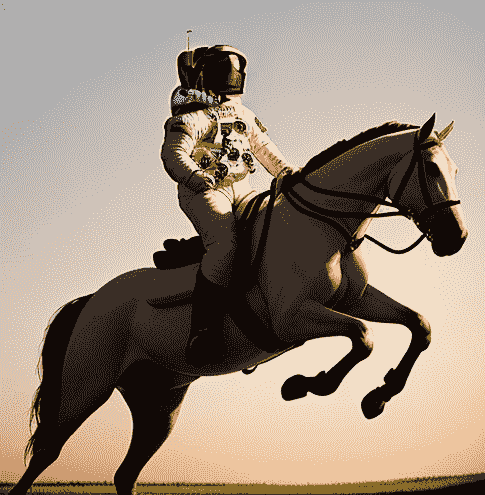
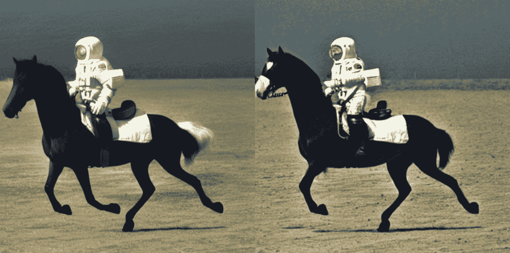
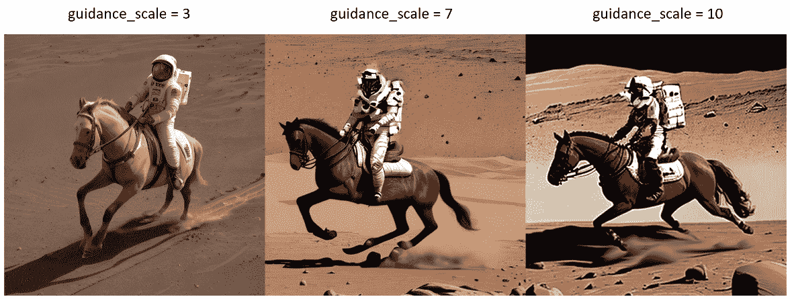

# 第三章：使用Stable Diffusion生成图像

在本章中，我们将通过利用Hugging Face Diffusers包（[https://github.com/huggingface/diffusers](https://github.com/huggingface/diffusers)）和开源包来开始使用常见的Stable Diffusion功能。正如我们在 [*第1章*](B21263_01.xhtml#_idTextAnchor015) 中提到的，*Stable Diffusion简介*，Hugging Face Diffusers是目前最广泛使用的Stable Diffusion的Python实现。在我们探索图像生成时，我们将介绍常用的术语。

假设你已经安装了所有包和依赖项；如果你看到错误消息说找不到GPU或需要CUDA，请参考 [*第2章*](B21263_02.xhtml#_idTextAnchor037) 来设置运行Stable Diffusion的环境。

通过本章，我旨在通过使用Hugging Face的Diffusers包使你熟悉Stable Diffusion。我们将在下一章深入探讨Stable Diffusion的内部机制。

在本章中，我们将涵盖以下主题：

+   如何使用Hugging Face令牌登录Hugging Face

+   使用Stable Diffusion生成图像

+   使用生成种子来重现图像

+   使用Stable Diffusion调度器

+   交换或更改Stable Diffusion模型

+   使用指导尺度

让我们开始吧。

# 登录Hugging Face

你可以使用 `huggingface_hub` 库中的 `login()` 函数，如下所示：

```py
from huggingface_hub import login
login()
```

通过这样做，你正在通过Hugging Face Hub进行身份验证。这允许你下载托管在Hub上的预训练扩散模型。不登录，你可能无法使用模型ID（如 `runwayml/stable-diffusion-v1-5`）下载这些模型。

当你运行前面的代码时，你正在提供你的Hugging Face令牌。你可能想知道访问令牌的步骤，但不用担心。令牌输入对话框将提供链接和信息来 *访问* 令牌。

登录后，你可以使用Diffusers包中的 `from_pretrained()` 函数下载预训练的扩散模型。例如，以下代码将从Hugging Face Hub下载 `stable-diffusion-v1-5` 模型：

```py
import torch
from diffusers import StableDiffusionPipeline
text2img_pipe = StableDiffusionPipeline.from_pretrained(
    "runwayml/stable-diffusion-v1-5",
    torch_dtype = torch.float16
).to("cuda:0")
```

注意

你可能已经注意到，我使用 `to("cuda:0")` 而不是 `to("cuda")`，因为在多GPU场景下，你可以更改CUDA索引来告诉Diffusers使用指定的GPU。例如，你可以使用 `to("cuda:1")` 来使用第二个启用了CUDA的GPU生成Stable Diffusion图像。

下载模型后，是时候使用Stable Diffusion生成图像了。

# 生成图像

现在我们已经将Stable Diffusion模型加载到GPU上，让我们生成一个图像。`text2img_pipe` 包含了管道对象；我们只需要提供一个 `prompt` 字符串，使用自然语言描述我们想要生成的图像，如下面的代码所示：

```py
# generate an image
prompt ="high resolution, a photograph of an astronaut riding a horse"
image = text2img_pipe(
    prompt = prompt
).images[0]
image
```

阅读本文时，您完全可以根据自己的想法更改提示内容，例如，`高分辨率，一只猫在火星表面奔跑的照片`或`4k，一只猫驾驶飞机的高质量图像`。令人惊叹的是，Stable Diffusion可以根据纯自然语言的描述生成图像。

如果您在不更改代码的情况下运行前面的代码，您可能会看到这样的图像出现：



图3.1：一位宇航员骑马的图像

我说“您可能会看到这样的图像”，因为您几乎有99.99%的几率不会看到相同的图像；相反，您会看到外观和感觉相似的图像。为了使生成过程保持一致，我们需要另一个参数，称为`generator`。

# 生成种子

在Stable Diffusion中，种子是一个用于初始化生成过程的随机数。种子用于创建一个噪声张量，然后由扩散模型用于生成图像。相同的种子、相同的提示和设置通常会产生相同的图像。

生成种子有两个原因：

+   **可重复性**：通过使用相同的种子，您可以使用相同的设置和提示一致地生成相同的图像。

+   **探索**：通过改变种子数字，您可以发现各种图像变体。这通常会导致新颖且引人入胜的图像出现。

当未提供种子数字时，Diffusers包会自动为每个图像创建过程生成一个随机数。然而，您可以选择指定您首选的种子数字，如下面的Python代码所示：

```py
my_seed = 1234
generator = torch.Generator("cuda:0").manual_seed(my_seed)
prompt ="high resolution, a photograph of an astronaut riding a horse"
image = text2img_pipe(
    prompt = prompt,
    generator = generator
).images[0]
display(image)
```

在前面的代码中，我们使用`torch`创建了一个带有手动种子的`torch.Generator`对象。我们专门使用这个生成器进行图像生成。通过这样做，我们可以反复生成相同的图像。

生成种子是控制Stable Diffusion图像生成的一种方法。接下来，让我们进一步探讨调度器以进行自定义。

# 采样调度器

在讨论了生成种子之后，现在让我们深入探讨Stable Diffusion图像生成的另一个重要方面：采样调度器。

原始的扩散模型在生成图像方面已经展示了令人印象深刻的结果。然而，一个缺点是缓慢的反向去噪过程，这通常需要1,000步将随机噪声数据空间转换为连贯的图像（具体来说，是潜在数据空间，我们将在[*第4章*](B21263_04.xhtml#_idTextAnchor081)中进一步探讨这个概念）。这个过程非常耗时。

为了缩短图像生成过程，研究人员已经提出了几种解决方案。这个想法很简单：如果我们能够只对样本执行关键步骤，而不是进行1,000步去噪，那会怎么样？这个想法是可行的。采样器或调度器使扩散模型能够在仅仅20步内生成图像！

在Hugging Face Diffusers包中，这些有用的组件被称为**调度器**。然而，您在其他资源中也可能遇到**采样器**这个术语。您可以查看Diffusers *Schedulers* [2]页面以获取最新的支持调度器。

默认情况下，Diffusers包使用`PNDMScheduler`。我们可以通过运行以下代码找到它：

```py
# Check out the current scheduler
text2img_pipe.scheduler
```

代码将返回如下对象：

```py
PNDMScheduler {
  "_class_name": "PNDMScheduler",
  "_diffusers_version": "0.17.1",
  "beta_end": 0.012,
  "beta_schedule": "scaled_linear",
  "beta_start": 0.00085,
  "clip_sample": false,
  "num_train_timesteps": 1000,
  "prediction_type": "epsilon",
  "set_alpha_to_one": false,
  "skip_prk_steps": true,
  "steps_offset": 1,
  "trained_betas": null
}
```

初看起来，`PNDMScheduler`对象的字段可能看起来复杂且不熟悉。然而，随着您深入了解第4章和第5章中Stable Diffusion模型的内部机制，这些字段将变得更加熟悉和易于理解。未来的学习之旅将揭示Stable Diffusion模型的复杂性，并阐明`PNDMScheduler`对象中每个字段的用途和重要性。

许多列表调度器可以在20到50步内生成图像。根据我的经验，`Euler`调度器是最佳选择之一。让我们应用`Euler`调度器来生成一个图像：

```py
from diffusers import EulerDiscreteScheduler
text2img_pipe.scheduler = EulerDiscreteScheduler.from_config(
    text2img_pipe.scheduler.config)
generator = torch.Generator("cuda:0").manual_seed(1234)
prompt ="high resolution, a photograph of an astronaut riding a horse"
image = text2img_pipe(
    prompt = prompt,
    generator = generator
).images[0]
display(image)
```

您可以通过使用`num_inference_steps`参数来自定义去噪步骤的数量。更高的步数通常会导致更好的图像质量。在这里，我们将调度步骤设置为`20`，并比较了默认的`PNDMScheduler`和`EulerDiscreteScheduler`的结果：

```py
# Euler scheduler with 20 steps
from diffusers import EulerDiscreteScheduler
text2img_pipe.scheduler = EulerDiscreteScheduler.from_config(
    text2img_pipe.scheduler.config)
generator = torch.Generator("cuda:0").manual_seed(1234)
prompt ="high resolution, a photograph of an astronaut riding a horse"
image = text2img_pipe(
    prompt = prompt,
    generator = generator,
    num_inference_steps = 20
).images[0]
display(image)
```

下图显示了两个调度器之间的差异：



图3.2：左：20步的Euler调度器；右：20步的PNDMScheduler

在这个比较中，Euler调度器正确地生成了一张包含所有四条马腿的图像，而PNDM调度器提供了更多细节但遗漏了一条马腿。这些调度器表现出色，将整个图像生成过程从1,000步减少到仅20步，使得在家庭电脑上运行Stable Diffusion成为可能。

注意，每个调度器都有其优缺点。您可能需要尝试不同的调度器以找到最适合您的。

接下来，让我们探索用社区贡献的、微调过的替代模型替换原始Stable Diffusion模型的过程。

# 更改模型

在撰写本章时，有大量基于V1.5 Stable Diffusion模型微调的模型可供选择，这些模型由蓬勃发展的用户社区贡献。如果模型文件托管在Hugging Face，您可以通过更改其标识符轻松切换到不同的模型，如下面的代码片段所示：

```py
# Change model to "stablediffusionapi/deliberate-v2"
from diffusers import StableDiffusionPipeline
text2img_pipe = StableDiffusionPipeline.from_pretrained(
    "stablediffusionapi/deliberate-v2",
    torch_dtype = torch.float16
).to("cuda:0")
prompt ="high resolution, a photograph of an astronaut riding a horse"
image = text2img_pipe(
    prompt = prompt
).images[0]
display(image)
```

此外，您还可以使用从civitai.com下载的`ckpt/safetensors`模型([http://civitai.com](http://civitai.com))。在这里，我们通过以下代码演示如何加载`deliberate-v2`模型：

```py
from diffusers import StableDiffusionPipeline
text2img_pipe = StableDiffusionPipeline.from_single_file(
    "path/to/deliberate-v2.safetensors",
    torch_dtype = torch.float16
).to("cuda:0")
prompt ="high resolution, a photograph of an astronaut riding a horse"
image = text2img_pipe(
    prompt = prompt
).images[0]
display(image)
```

当从本地文件加载模型时，主要区别在于使用`from_single_file`函数而不是`from_pretrained`。可以使用前面的代码加载一个`ckpt`模型文件。

在本书的[*第6章*](B21263_06.xhtml#_idTextAnchor117)中，我们将专门关注模型加载，涵盖Hugging Face和本地存储方法。通过实验各种模型，你可以发现改进、独特的艺术风格或更好的特定用例兼容性。

我们已经提到了生成种子、调度器和模型使用。另一个扮演关键角色的参数是`guidance_scale`。让我们接下来看看它。

# 指导比例

指导比例或**无分类器指导**（**CFG**）是一个控制生成的图像对文本提示的遵守程度的参数。较高的指导比例将迫使图像更符合提示，而较低的指导比例将给Stable Diffusion更多空间来决定图像中要放入的内容。

这里是一个在保持其他参数不变的同时应用不同指导比例的示例：

```py
import torch
generator = torch.Generator("cuda:0").manual_seed(123)
prompt = """high resolution, a photograph of an astronaut riding a horse on mars"""
image_3_gs = text2img_pipe(
    prompt = prompt,
    num_inference_steps = 30,
    guidance_scale = 3,
    generator = generator
).images[0]
image_7_gs = text2img_pipe(
    prompt = prompt,
    num_inference_steps = 30,
    guidance_scale = 7,
    generator = generator
).images[0]
image_10_gs = text2img_pipe(
    prompt = prompt,
    num_inference_steps = 30,
    guidance_scale = 10,
    generator = generator
).images[0]
from diffusers.utils import make_image_grid
images = [image_3_gs,image_7_gs,image_10_gs]
make_image_grid(images,rows=1,cols=3)
```

*图3.3*提供了并排比较：



图3.3：左：guidance_scale = 3；中：guidance_scale = 7；右：guidance_scale = 10

在实践中，除了遵守提示外，我们还可以注意到高指导比例设置有以下影响：

+   增加颜色饱和度

+   增加对比度

+   如果设置得太高可能会导致图像模糊

`guidance_scale`参数通常设置在`7`到`8.5`之间。`7.5`是一个很好的默认值。

# 摘要

在本章中，我们通过Hugging Face Diffusers包探讨了使用Stable Diffusion的基本要素。我们实现了以下目标：

+   登录Hugging Face以启用自动模型下载

+   使用生成器生成图像

+   使用调度器进行高效的图像创建

+   调整了指导比例以适应期望的图像质量

仅用几行代码，我们就成功地创建了图像，展示了Diffusers包的非凡能力。本章没有涵盖每个功能和选项；请记住，该包正在不断进化，新功能和增强功能定期添加。 

对于渴望解锁Diffusers包全部潜力的人来说，我鼓励您探索其源代码。深入了解其内部工作原理，发现隐藏的宝藏，并从头开始构建Stable Diffusion管道。一段值得的旅程在等待着你！

```py
git clone https://github.com/huggingface/diffusers
```

在下一章中，我们将深入了解包的内部结构，并学习如何构建一个针对您独特需求和偏好的自定义Stable Diffusion管道。

# 参考文献

1.  *使用潜在扩散模型进行高分辨率图像合成*：[https://arxiv.org/abs/2112.10752](https://arxiv.org/abs/2112.10752)

1.  Hugging Face Diffusers调度器：[https://huggingface.co/docs/diffusers/api/schedulers/overview](https://huggingface.co/docs/diffusers/api/schedulers/overview)
