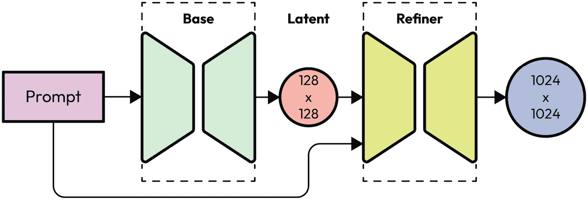

# 第六章：使用 Stable Diffusion 模型

当我们开始使用 Stable Diffusion 模型时，我们会立即遇到不同种类的模型文件，并需要知道如何将模型文件转换为所需的格式。

在本章中，我们将更熟悉 Stable Diffusion 模型文件，包括如何使用模型 ID 从 Hugging Face 仓库加载模型。我们还将提供示例代码来加载开源社区共享的 `safetensors` 和 `.ckpt` 模型文件。

在本章中，我们将涵盖以下主题：

+   加载 Diffusers 模型

+   从 safetensors 和 ckpt 文件加载模型检查点

+   使用 CKPT 和 safetensors 文件与 Diffusers

+   模型安全检查器

+   将检查点模型文件转换为 Diffusers 格式

+   使用 Stable Diffusion XL

到本章结束时，你将了解 Stable Diffusion 模型文件类型以及如何将模型文件转换为可以由 Diffusers 加载的格式。

# 技术要求

在开始之前，请确保你已经安装了 `safetensors` 包：

```py
pip install safetensors
```

`safetensors` Python 包提供了一种简单高效的方式来安全地访问、存储和共享张量。

# 加载 Diffusers 模型

而不是手动下载模型文件，Hugging Face Diffusers 包提供了一个方便的方法，可以通过字符串类型的模型 ID 访问开源模型文件，如下所示：

```py
import torch
from diffusers import StableDiffusionPipeline
pipe = StableDiffusionPipeline.from_pretrained(
    "runwayml/stable-diffusion-v1-5",
    torch_dtype = torch.float16
)
```

当执行前面的代码时，如果 Diffusers 找不到由模型 ID 指示的模型文件，该包将自动联系 Hugging Face 仓库下载模型文件，并将它们存储在缓存文件夹中以便下次使用。

默认情况下，缓存文件将存储在以下位置：

Windows：

`C:\Users\user_name\.cache\huggingface\hub`

Linux：

`\``home\user_name\.cache\huggingface\hub`

使用默认的缓存路径在开始时是可行的，然而，如果你的系统驱动器小于 512 GB，你很快会发现那些模型文件正在消耗存储空间。为了避免存储空间不足，我们可能需要提前规划模型存储。Diffusers 提供了一个参数，允许我们指定存储缓存权重文件的自定义路径。

以下是在前一个示例代码中添加了一个更多参数，`cache_dir`：

```py
from diffusers import StableDiffusionPipeline
pipe = StableDiffusionPipeline.from_pretrained(
    "runwayml/stable-diffusion-v1-5",
    torch_dtype = torch.float16,
    cache_dir = r"D:\my_model_folder"
)
```

通过指定此 `cache_dir` 参数，所有自动下载的模型和配置文件都将存储在新位置，而不是占用系统磁盘驱动器。

你可能还会注意到示例代码指定了一个 `torch_dtytpe` 参数，告诉 Diffusers 使用 `torch.float16`。默认情况下，PyTorch 使用 `torch.float32` 进行矩阵乘法。对于模型推理，换句话说，在用 Stable Diffusion 生成图像的阶段，我们可以使用 `float16` 类型，这不仅可以将速度提高约 100%，还可以几乎不引人注目的方式节省 GPU 内存。

通常，使用 Hugging Face 的模型既容易又安全。Hugging Face 实现了一个安全检查器，以确保上传的模型文件不包含可能损害您的计算机的恶意代码。

尽管如此，我们仍然可以使用手动下载的模型文件与 Diffusers 一起使用。接下来，我们将从本地磁盘加载各种模型文件。

# 从 safetensors 和 ckpt 文件加载模型检查点

完整的模型文件也称为 **检查点** 数据。如果您阅读了一篇或一份关于下载检查点的文章或文档，他们谈论的是 Stable Diffusion 模型文件。

存在许多类型的检查点，如 `.ckpt` 文件、`safetensors` 文件和 `diffusers` 文件：

+   `.ckpt` 是最基础的文件格式，与大多数 Stable Diffusion 模型兼容。然而，它们也是最易受到恶意攻击的。

+   `safetensors` 是一种较新的文件格式，旨在比 `.ckpt` 文件更安全。与 `.ckpt` 相比，`safetensors` 格式在安全性、速度和可用性方面表现更佳。Safetensors 有几个特性来防止代码执行：

    +   **限制数据类型**：只允许存储特定的数据类型，例如整数和张量。这消除了在保存的数据中包含代码的可能性。

    +   **哈希**：每个数据块都会进行哈希处理，并将哈希值存储在数据旁边。对数据的任何修改都会改变哈希值，使其立即可检测。

    +   **隔离**：数据存储在隔离的环境中，防止与其他程序交互，并保护您的系统免受潜在的漏洞攻击。

+   Diffusers 文件是专为与 `Diffusers` 库无缝集成而特别设计的最新文件格式。该格式具有顶级的加密功能，并确保与所有 Stable Diffusion 模型兼容。与将数据压缩成单个文件的传统方法不同，Diffusers 格式采用文件夹的形式，包含权重和配置文件。此外，这些文件夹中包含的模型文件遵循 `safetensors` 格式。

当我们使用 Diffusers 自动下载功能时，Diffusers 会将文件存储为 Diffusers 格式。

接下来，我们将加载 `ckpt` 或 `safetensors` 格式的 Stable Diffusion 模型。

# 使用 ckpt 和 safetensors 文件与 Diffusers

Diffusers 社区正在积极增强其功能。在撰写本文时，我们可以轻松地使用 `Diffusers` 包加载 `.ckpt` 或 `safetensors` 检查点文件。

以下代码可以用来加载和使用 `safetensors` 或 `.ckpt` 检查点文件。

加载 `safetensors` 模型：

```py
import torch
from diffusers import StableDiffusionPipeline
model_path = r"model/path/path/model_name.safetensors"
pipe = StableDiffusionPipeline.from_single_file(
    model_path,
    torch_dtype = torch.float16
)
```

使用以下代码加载 `.ckpt` 模型：

```py
import torch
from diffusers import StableDiffusionPipeline
model_path = r"model/path/path/model_name.ckpt"
pipe = StableDiffusionPipeline.from_single_file(
    model_path,
    torch_dtype = torch.float16
)
```

您没有阅读错误的代码；我们可以使用相同的函数 `from_single_file` 加载 `safetensors` 和 `.ckpt` 模型文件。接下来，让我们看看安全检查器。

# 关闭模型安全检查器

默认情况下，Diffusers 管道将使用安全检查器模型来检查输出结果，以确保生成的结果不包含任何 NSFW、暴力或不安全的内容。在某些情况下，安全检查器可能会触发误报并生成空图像（完全黑色的图像）。关于安全检查器有几个 GitHub 问题讨论 [11]。在测试阶段，我们可以暂时关闭安全检查器。

当使用模型 ID 加载模型时关闭安全检查器，请运行以下代码：

```py
import torch
from diffusers import StableDiffusionPipeline
pipe = StableDiffusionPipeline.from_pretrained(
    "runwayml/stable-diffusion-v1-5",
    torch_dtype    = torch.float16,
    safety_checker = None # or load_safety_checker = False
)
```

注意，当我们从 `safetensors` 或 `.ckpt` 文件加载模型时，关闭安全检查器的参数是不同的。我们不应使用 `safety_checker`，而应使用如下示例代码中所示的 `load_safety_checker`：

```py
import torch
from diffusers import StableDiffusionPipeline
model_path = r"model/path/path/model_name.ckpt"
pipe = StableDiffusionPipeline.from_single_file(
    model_path,
    torch_dtype = torch.float16,
    load_safety_checker = False
)
```

你应该能够在 `from_pretrained` 函数中使用 `load_safety_checker = False` 来禁用安全检查器。

安全检查器是来自 CompVis – 计算机视觉和学习 LMU 慕尼黑（[https://github.com/CompVis](https://github.com/CompVis)）的开源机器学习模型，基于 CLIP [9][10] 构建，称为 **Stable Diffusion 安全检查器** [3]。

虽然我们可以将模型加载到一个单独的文件中，但在某些情况下，我们需要将 `.ckpt` 或 `safetensors` 模型文件转换为 Diffusers 文件夹结构。接下来，让我们看看如何将模型文件转换为 Diffusers 格式。

# 将检查点模型文件转换为 Diffusers 格式

与 Diffusers 格式相比，从 `.ckpt` 或 `safetensors` 文件加载检查点模型数据较慢，因为每次我们加载 `.ckpt` 或 `safetensors` 文件时，Diffusers 都会解包并将其转换为 Diffusers 格式。为了每次加载模型文件时都保存转换，我们可能需要考虑将检查点文件转换为 Diffusers 格式。

我们可以使用以下代码将 `.ckpt` 文件转换为 Diffusers 格式：

```py
ckpt_checkpoint_path = r"D:\temp\anythingV3_fp16.ckpt"
target_part = r"D:\temp\anythingV3_fp16"
pipe = download_from_original_stable_diffusion_ckpt(
    ckpt_checkpoint_path,
    from_safetensors = False,
    device = "cuda:0"
)
pipe.save_pretrained(target_part)
```

要将 `safetensors` 文件转换为 Diffusers 格式，只需将 `from_safetensors` 参数更改为 `True`，如下面的示例代码所示：

```py
from diffusers.pipelines.stable_diffusion.convert_from_ckpt import \
    download_from_original_stable_diffusion_ckpt
safetensors_checkpoint_path = \
    r"D:\temp\deliberate_v2.safetensors"
target_part = r"D:\temp\deliberate_v2"
pipe = download_from_original_stable_diffusion_ckpt(
    safetensors_checkpoint_path, 
    from_safetensors  = True,
    device = "cuda:0"
)
pipe.save_pretrained(target_part)
```

如果你尝试通过搜索引擎寻找解决方案来进行转换，你可能会在互联网的某些角落看到使用名为 `convert_original_stable_diffusion_to_diffusers.py` 的脚本的解决方案。该脚本位于 Diffusers GitHub 仓库中：[https://github.com/huggingface/diffusers/tree/main/scripts](https://github.com/huggingface/diffusers/tree/main/scripts)。该脚本运行良好。如果你查看脚本的代码，该脚本使用了之前展示的相同代码。

要使用转换后的模型文件，这次只需使用 `from_pretrained` 函数加载 `local` 文件夹（而不是模型 ID）：

```py
# load local diffusers model files using from_pretrained function
import torch
from diffusers import StableDiffusionPipeline
pipe = StableDiffusionPipeline.from_pretrained(
    r"D:\temp\deliberate_v2",
    torch_dtype = torch.float16,
    safety_checker = None
).to("cuda:0")
image = pipe("a cute puppy").images[0]
image
```

你应该会看到由前面的代码生成的可爱小狗图像。接下来，让我们加载 Stable Diffusion XL 模型。

# 使用 Stable Diffusion XL

**Stable Diffusion XL** (**SDXL**)是Stability AI的一个模型。与之前的模型略有不同，SDXL被设计为双阶段模型。我们需要基础模型来生成图像，并可以利用第二个细化模型来细化图像，如图*图6.1*所示。细化模型是可选的：



图6.1：SDXL，双模型管道

*图6.1*显示，要从SDXL模型生成最佳质量的图像，我们需要使用基础模型生成原始图像，输出为128x128的潜在图像，然后使用细化模型对其进行增强。

在尝试SDXL模型之前，请确保您至少有15 GB的VRAM，否则，您可能会在细化模型输出图像之前看到`CUDA out of memory`错误。您还可以使用[*第5章*](B21263_05.xhtml#_idTextAnchor097)中的优化方法，构建一个自定义管道，在可能的情况下将模型移出VRAM。

这里是加载SDXL模型的步骤：

1.  下载基础模型`safetensors`文件[6]。您不需要从模型仓库下载所有文件。在撰写本文时，检查点的名称是`sd_xl_base_1.0.safetensors`。

1.  下载细化模型`safetensors`文件[7]。我们还可以通过提供模型ID让Diffusers管道为我们下载`safetensors`文件。

1.  接下来，我们将从`safetensors`文件初始化基础和细化模型：

    ```py
    import torch
    
    from diffusers import (
    
        StableDiffusionXLPipeline, StableDiffusionXLImg2ImgPipeline)
    
    # load base model
    
    base_model_checkpoint_path = \ 
    
        r"path/to/sd_xl_base_1.0.safetensors"
    
    base_pipe = StableDiffusionXLPipeline.from_single_file(
    
        base_model_checkpoint_path,
    
        torch_dtype = torch.float16,
    
        use_safetensors = True
    
    )
    
    # load refiner model
    
    refiner_model_checkpoint_path = \
    
        r"path/to/sd_xl_refiner_1.0.safetensors"
    
    refiner_pipe = \
    
        StableDiffusionXLImg2ImgPipeline.from_single_file(
    
        refiner_model_checkpoint_path,
    
        torch_dtype = torch.float16,
    
        use_safetensors = True
    
    )
    ```

    或者，我们可以使用模型ID初始化基础和细化模型：

    ```py
    import torch
    
    from diffusers import (
    
        StableDiffusionXLPipeline,
    
        StableDiffusionXLImg2ImgPipeline
    
    )
    
    # load base model
    
    base_model_id = "stabilityai/stable-diffusion-xl-base-1.0"
    
    base_pipe = StableDiffusionXLPipeline.from_pretrained(
    
        base_model_id,
    
        torch_dtype = torch.float16
    
    )
    
    # load refiner model
    
    refiner_model_id = "stabilityai/stable-diffusion-xl-refiner-1.0"
    
    refiner_pipe = StableDiffusionXLImg2ImgPipeline.from_pretrained(
    
        refiner_model_id,
    
        torch_dtype = torch.float16
    
    )
    ```

1.  让我们生成潜在空间中的基础图像（4x128x128的中间层潜在图像）：

    ```py
    # move model to cuda and generate base image latent
    
    from diffusers import EulerDiscreteScheduler
    
    prompt = """
    
    analog photograph of a cat in a spacesuit taken inside the cockpit of a stealth fighter jet,
    
    Fujifilm, Kodak Portra 400, vintage photography
    
    """
    
    neg_prompt = """
    
    paint, watermark, 3D render, illustration, drawing,worst quality, low quality
    
    """
    
    base_pipe.to("cuda")
    
    base_pipe.scheduler = EulerDiscreteScheduler.from_config(
    
        base_pipe.scheduler.config)
    
    with torch.no_grad():
    
        base_latents = base_pipe(
    
            prompt = prompt,
    
            negative_prompt = neg_prompt,
    
            output_type = "latent"
    
        ).images[0]
    
    base_pipe.to("cpu")
    
    torch.cuda.empty_cache()
    ```

    注意，在前面代码的末尾，我们通过使用`base_pipe.to("cpu")`和`torch.cuda.empty_cache()`将`base_pipe`从VRAM中移除。

1.  将细化模型加载到VRAM中，并使用潜在空间中的基础图像生成最终图像：

    ```py
    # refine the image
    
    refiner_pipe.to("cuda")
    
    refiner_pipe.scheduler = EulerDiscreteScheduler.from_config(
    
        refiner_pipe.scheduler.config)
    
    with torch.no_grad():
    
        image = refiner_pipe(
    
            prompt = prompt,
    
            negative_prompt = neg_prompt,
    
            image = [base_latents]
    
        ).images[0]
    
    refiner_pipe.to("cpu")
    
    torch.cuda.empty_cache()
    
    image
    ```

    结果将与*图6.2*中显示的类似：


图6.2：SDXL生成的图像——穿着宇航服的猫

详细信息和质量远远优于Stable Diffusion 1.5渲染的版本。虽然这个模型在撰写本文时相对较新，但在不久的将来，将会有更多混合检查点模型和低秩适配器（LoRAs）可用。

# 摘要

本章主要关注Stable Diffusion模型的用法。我们可以通过使用其模型ID来利用Hugging Face的模型。此外，广泛分布的开源模型可以在社区网站如CIVITAI [4]上找到，您可以在那里下载大量的模型资源。这些模型文件通常是`.ckpt`或`safetensors`文件格式。

本章涵盖了这些模型文件的区别以及直接从`Diffusers`包中使用检查点模型文件。此外，它还提供了一种解决方案，将独立模型检查点文件转换为Diffusers格式，以便更快地加载模型。

最后，本章还介绍了如何加载和使用 SDXL 的双模型管道。

# 参考文献

1.  Hugging Face Load safetensors：[https://huggingface.co/docs/diffusers/using-diffusers/using_safetensors](https://huggingface.co/docs/diffusers/using-diffusers/using_safetensors)

1.  pickle — Python 对象序列化：[https://docs.python.org/3/library/pickle.html](https://docs.python.org/3/library/pickle.html)

1.  稳定扩散安全检查器：[https://huggingface.co/CompVis/stable-diffusion-safety-checker](https://huggingface.co/CompVis/stable-diffusion-safety-checker)

)

1.  civitai：[https://www.civitai.com](https://www.civitai.com)

)

1.  stability.ai：[https://stability.ai/](https://stability.ai/)

1.  stable-diffusion-xl-base-1.0：[https://huggingface.co/stabilityai/stable-diffusion-xl-base-1.0](https://huggingface.co/stabilityai/stable-diffusion-xl-base-1.0)

)

1.  stable-diffusion-xl-refiner-1.0：[https://huggingface.co/stabilityai/stable-diffusion-xl-refiner-1.0](https://huggingface.co/stabilityai/stable-diffusion-xl-refiner-1.0)

)

1.  safetensors GitHub 仓库：[https://github.com/huggingface/safetensors](https://github.com/huggingface/safetensors)

1.  Alec Radford 等人，从自然语言监督中学习可迁移的视觉模型：[https://arxiv.org/abs/2103.00020](https://arxiv.org/abs/2103.00020)

1.  OpenAI CLIP GitHub 仓库：[https://github.com/openai/CLIP](https://github.com/openai/CLIP)

1.  安全检查器问题：[https://github.com/huggingface/diffusers/issues/845](https://github.com/huggingface/diffusers/issues/845), [https://github.com/huggingface/diffusers/issues/3422](https://github.com/huggingface/diffusers/issues/3422)

# 第二部分 – 使用定制功能改进扩散器

在第一部分，我们探讨了扩散器背后的基本概念和技术，为它们在各个领域的应用奠定了基础。现在，是时候通过深入研究可以显著增强这些强大模型功能的高级定制选项，将我们的理解提升到下一个层次。

本节中的章节旨在为你提供优化和扩展扩散器所需的知识和技能，解锁新的创意表达和问题解决的可能性。从优化性能和管理 VRAM 使用到利用社区驱动的资源，以及探索文本反转等创新技术，我们将涵盖一系列有助于你推动扩散器可能性的边界的话题。

在接下来的章节中，你将学习如何克服限制，利用社区的集体智慧，并解锁将提升你使用扩散器工作的新功能。无论你是寻求提高效率、探索新的艺术途径，还是仅仅保持创新的前沿，本书的这一部分所提供的定制功能和技巧将为你提供成功所需的工具和灵感。

本部分包含以下章节：

+   [*第7章*](B21263_07.xhtml#_idTextAnchor136)*，优化性能和VRAM使用*

+   [*第8章*](B21263_08.xhtml#_idTextAnchor153)*，使用社区共享的LoRAs*

+   [*第9章*](B21263_09.xhtml#_idTextAnchor178)*，使用文本反转*

+   [*第10章*](B21263_10.xhtml#_idTextAnchor197)*，解锁77个Token限制并启用提示权重*

+   [*第11章*](B21263_11.xhtml#_idTextAnchor214)*，图像恢复和超分辨率*

+   [*第12章*](B21263_12.xhtml#_idTextAnchor240)*，计划提示解析*
