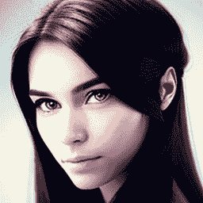
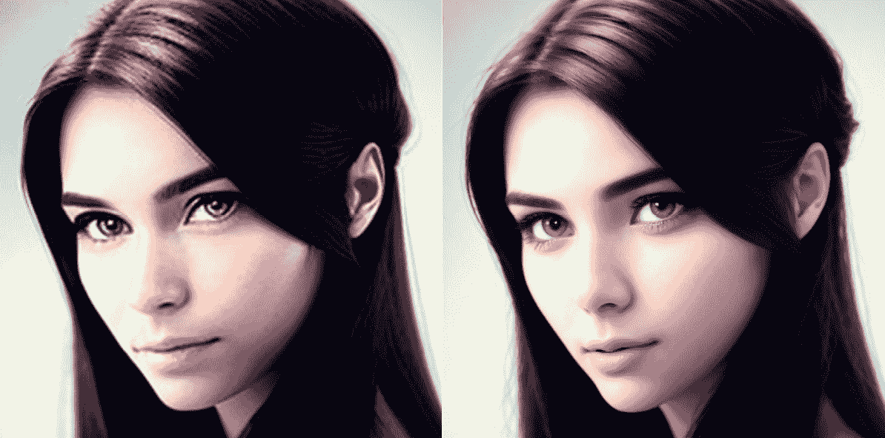
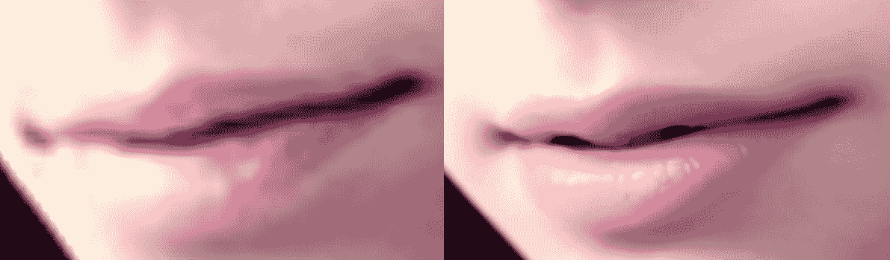
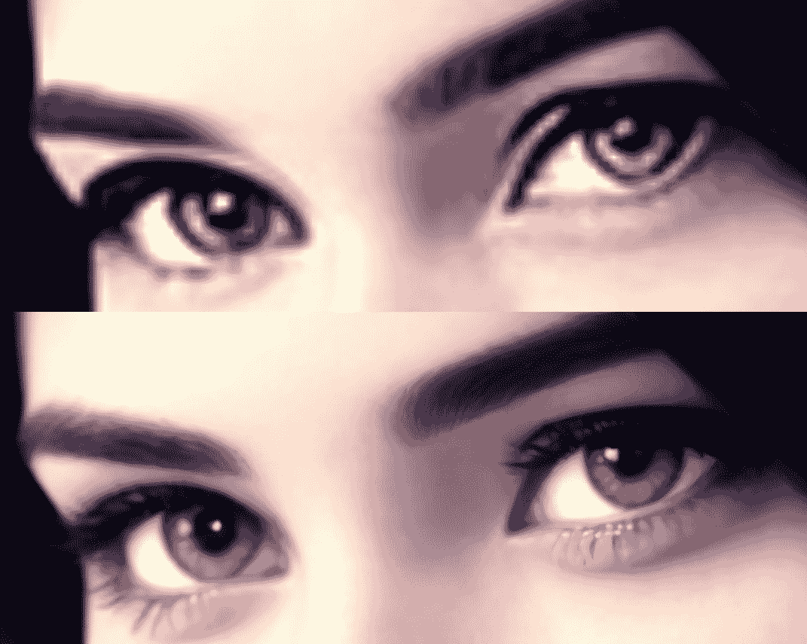
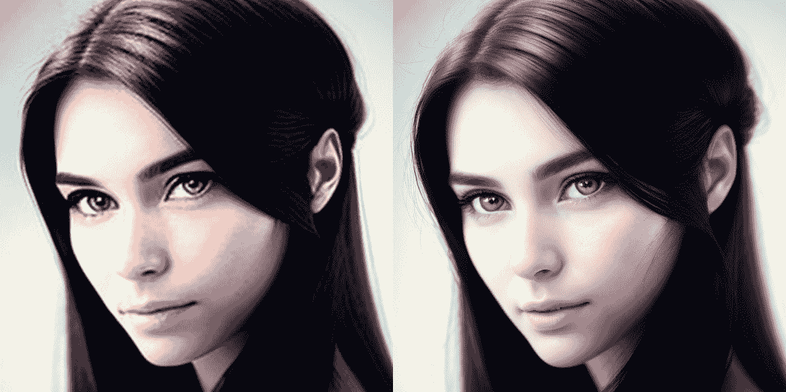
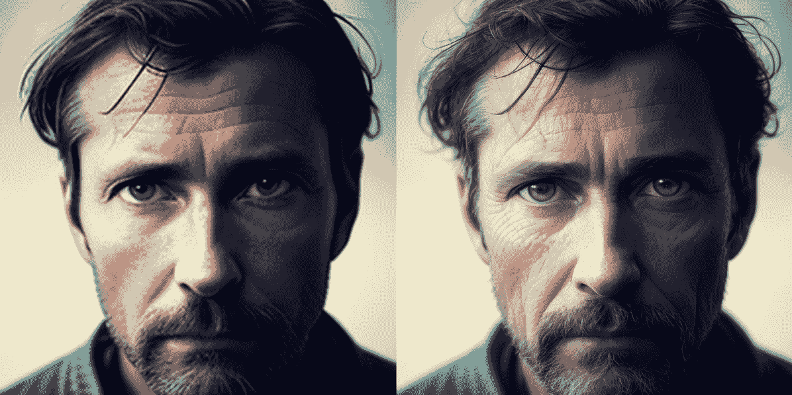
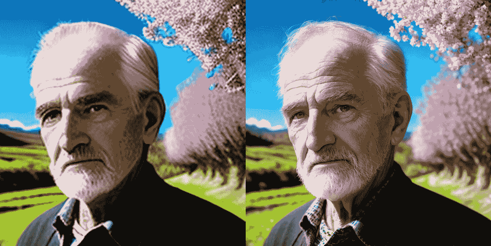
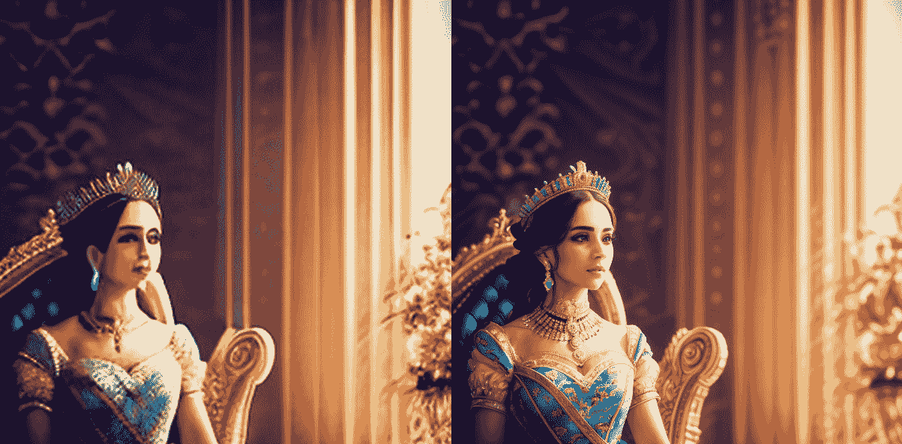

# 第十一章：图像恢复和超分辨率

虽然稳定扩散V1.5和稳定扩散XL都展示了生成图像的能力，但我们的初始创作可能尚未展现出它们的最优质量。本章旨在探索各种技术和策略，以提高图像恢复、增强图像分辨率并向生成的视觉作品中引入复杂细节。

本章的主要重点是利用稳定扩散作为有效工具来增强和提升图像的潜力。此外，我们将简要介绍一些互补的尖端**人工智能**（**AI**）方法，以提升图像分辨率，这些方法与基于扩散的过程不同。

在本章中，我们将涵盖以下主题：

+   理解术语

+   使用图像到图像扩散管道提升图像

+   使用ControlNet Tile提升图像

让我们开始吧！

# 理解术语

在我们开始使用稳定扩散来提升图像质量之前，了解与此过程相关的常见术语是有益的。在关于稳定扩散的文章或书籍中，你可能会遇到三个相关术语：**图像插值**、**图像上采样**和**图像超分辨率**。这些技术旨在提高图像的分辨率，但它们在方法和结果上有所不同。熟悉这些术语将帮助你更好地理解稳定扩散和其他图像增强工具的工作原理：

+   **图像插值**是提升图像最简单且最普遍的方法。它通过基于图像中现有像素来近似新的像素值来实现。存在多种插值方法，每种方法都有其优势和劣势。最常用的插值方法包括最近邻插值[6]、双线性插值[7]、双三次插值[8]和Lanczos重采样[9]。

+   **图像上采样**是一个更广泛的术语，包括任何增强图像分辨率的技巧。这个类别包括插值方法，以及更复杂的方法，如超分辨率。

+   **图像超分辨率**代表一种特定的图像上采样子集，旨在在不增加原始尺寸的情况下提高图像的分辨率和更精细的细节，同时最小化质量损失并防止出现伪影。与依赖于基本插值的传统图像上采样方法不同，图像超分辨率采用先进的算法，通常基于深度学习技术。这些算法从高分辨率图像数据集中学习高频模式和细节。随后，这些学习到的模式被用于提升低分辨率图像，产生高质量的成果。

解决上述任务（图像插值、图像上采样和图像超分辨率）的解决方案通常被称为**上采样器**或**高分辨率修复器**。在本章中，我们将使用术语*upscaler*。

在基于深度学习的超分辨率解决方案中，存在各种类型的上采样器。超分辨率解决方案可以大致分为三种类型：

+   基于 GAN 的解决方案，例如 ESRGAN [10]

+   基于 Swin Transformer 的解决方案，例如 SwinIR [11]，

+   基于 Stable Diffusion 的解决方案

在本章中，我们的主要关注点将是 Stable Diffusion 上采样器。这一选择不仅受到本书对扩散模型的强调，还受到 Stable Diffusion 提供增强上采样结果和优越控制灵活性的潜力驱动。例如，它允许我们通过提示来指导超分辨率过程并填充额外的细节。我们将在本章的后半部分使用 Python 代码实现这一点。

你可能急于开始使用来自 Diffusers 的 Latent Upscaler 和 Stable Diffusion Upscale 管道 [1]。然而，值得注意的是，当前的 Latent Upscaler 和 Upscale 管道并非最优。两者都严重依赖于特定的预训练模型，消耗大量的 VRAM，并且表现出相对较慢的性能。

本章将介绍基于 Stable Diffusion 方法两种替代解决方案：

+   `StableDiffusionPipeline` 类。它还保留了支持长提示并引入了在前面章节中介绍过的文本反转。

+   `ControlNet` 模型，这使得通过显著增强细节来实现图像超分辨率成为可能。

在这个背景下，让我们深入了解这两种超分辨率方法的复杂细节。

# 使用 Img2img 扩散进行图像上采样

正如我们在[*第五章*](B21263_05.xhtml#_idTextAnchor097)中讨论的那样，Stable Diffusion 并不仅仅依赖于文本作为其初始指导；它还能够利用图像作为起点。我们实现了一个自定义的管道，该管道以图像作为图像生成的基石。

通过将去噪强度降低到某个阈值，例如 `0.3`，初始图像的特征和风格将保留在最终生成的图像中。这一特性可以用来将 Stable Diffusion 作为图像上采样器，从而实现图像超分辨率。让我们一步一步地探索这个过程。

我们将首先介绍一步超分辨率的概念，然后探讨多步超分辨率。

## 一步超分辨率

在本节中，我们将介绍一种使用图像到图像扩散一次上采样图像的解决方案。以下是实现它的步骤指南：

1.  让我们首先使用Stable Diffusion生成一个256x256的起始图像。而不是从互联网下载图像或使用外部图像作为输入，让我们利用Stable Diffusion生成一个。毕竟，这是Stable Diffusion擅长的领域：

    ```py
    import torch
    
    from diffusers import StableDiffusionPipeline
    
    text2img_pipe = StableDiffusionPipeline.from_pretrained(
    
        "stablediffusionapi/deliberate-v2",
    
        torch_dtype = torch.float16
    
    ).to("cuda:0")
    
    prompt = "a realistic photo of beautiful woman face"
    
    neg_prompt = "NSFW, bad anatomy"
    
    raw_image = text2img_pipe(
    
        prompt = prompt,
    
        negative_prompt = neg_prompt,
    
        height = 256,
    
        width = 256,
    
        generator = torch.Generator("cuda").manual_seed(3)
    
    ).images[0]
    
    display(raw_image)
    ```

    前面的代码将生成如图*图11**.1*所示的图像：



图11.1：由Stable Diffusion生成的256x256大小的女性面部照片

如果你以打印形式（例如，一本书）查看图像，可能看不到图像中的噪声和模糊。然而，如果你运行前面的代码并放大图像，你很容易注意到生成的图像中的*模糊*和*噪声*。

让我们保存图像以进行进一步处理：

```py
image_name = "woman_face"
file_name_256x256 =f"input_images/{image_name}_256x256.png"
raw_image.save(file_name_256x256)
```

1.  将图像调整到目标大小。最初，我们需要建立一个图像调整函数，确保图像的宽度和高度都能被`8`整除：

    ```py
    def get_width_height(width, height):
    
        width = (width//8)*8
    
        height = (height//8)*8
    
        return width,height
    ```

    接下来，使用图像插值将其调整到目标大小：

    ```py
    from diffusers.utils import load_image
    
    from PIL import Image
    
    def resize_img(img_path,upscale_times):
    
        img             = load_image(img_path)
    
        if upscale_times <=0:
    
            return img
    
        width,height = img.size
    
        width = width * upscale_times
    
        height = height * upscale_times
    
        width,height = get_width_height(int(width),int(height))
    
        img = img.resize(
    
            (width,height),
    
            resample = Image.LANCZOS if upscale_times > 1 \
    
                else Image.AREA
    
        )
    
        return img
    Image.LANCZOS interpolation method.
    ```

    以下代码使用`resize_img`函数将图像放大三倍：

    ```py
    resized_raw_image = resize_img(file_name_256x256, 3.0)
    ```

    你可以将任何大于`1.0`的浮点数输入到函数中。

1.  创建一个img-to-img管道作为上采样器。为了启用引导图像超分辨率，我们需要提供一个引导提示，如下所示：

    ```py
    sr_prompt = """8k, best quality, masterpiece, realistic, photo-realistic, ultra detailed, sharp focus, raw photo, """
    
    prompt = """
    
    a realistic photo of beautiful woman face
    
    """
    
    prompt = f"{sr_prompt}{prompt}"
    
    neg_prompt = "worst quality, low quality, lowres, bad anatomy"
    ```

    `sr_prompt`表示**超分辨率提示**，可以在任何超分辨率任务中重用，无需更改。接下来，调用管道以提升图像：

    ```py
    prompt = f"{sr_prompt}{prompt}"
    
    neg_prompt = "worst quality, low quality, lowres, bad anatomy"
    
    img2image_3x = img2img_pipe(
    
        image = resized_raw_image,
    
        prompt = prompt,
    
        negative_prompt = neg_prompt,
    
        strength = 0.3,
    
        num_inference_steps = 80,
    
        guidance_scale = 8,
    
        generator = torch.Generator("cuda").manual_seed(1)
    
    ).images[0]
    
    img2image_3x
    ```

    注意，`strength`参数设置为`0.3`，这意味着每个去噪步骤将对潜在图像应用30%的高斯噪声。当使用纯文本到图像的管道时，默认将强度设置为`1.0`。通过增加这里的`strength`值，将向初始图像引入更多的`新`元素。根据我的测试，`0.3`似乎是一个很好的平衡点。然而，你可以将其调整为`0.25`或提高到`0.4`。

对于Diffusers的img-to-img管道，实际的去噪步骤将是`num_inference_steps`乘以`strength`。总去噪步骤将是80 × 0.3 = 24。这不是Stable Diffusion强制执行的规则；它来自Diffusers的Stable Diffusion管道的实现。

如[*第3章*](B21263_03.xhtml#_idTextAnchor064)所述，`guidance_scale`参数控制结果与提供的`prompt`和`neg_prompt`的匹配程度。在实践中，较高的`guidance_scale`会产生稍微清晰一些的图像，但可能会更多地改变图像元素，而较低的`guidance_scale`会导致图像更加模糊，同时保留更多原始图像元素。如果你不确定值，可以选择介于7到8之间的某个值。

一旦运行前面的代码，你会观察到原始图像的大小不仅升级到768x768，图像质量也经历了显著的提升。

然而，这并不是终点；我们可以重用前面的过程来进一步提高图像分辨率和质量。

让我们保存图像以供进一步使用：

```py
file_name_768x768 = f"input_images/{image_name}_768x768.png"
img2image_3x.save(file_name_768x768)
```

接下来，让我们使用多图像到图像步骤来提高图像分辨率。

## 多步超分辨率

使用一步分辨率，代码将图像从 256x256 超分辨率到 768x768。在本节中，我们将过程进一步推进，将图像大小增加到当前尺寸的两倍。

注意，在进步到更高分辨率的图像之前，您需要确保 VRAM 的使用可能需要超过 8 GB。

我们将主要重用一步超分辨率过程中的代码：

1.  将图像大小加倍：

    ```py
    resized_raw_image = resize_img(file_name_768x768, 2.0)
    
    display(resized_raw_image)
    ```

1.  进一步的图像超分辨率代码可以将图像分辨率提高六倍（256x256 到 1,536x1,536），这可以显著提高图像的清晰度和细节：

    ```py
    sr_prompt = "8k, best quality, masterpiece, realistic, photo-realistic, ultra detailed, sharp focus, raw photo,"
    
    prompt = """
    
    a realistic photo of beautiful woman face
    
    """
    
    prompt = f"{sr_prompt}{prompt}"
    
    neg_prompt = "worst quality, low quality, lowres, bad anatomy"
    
    img2image_6x = img2img_pipe(
    
        image = resized_raw_image,
    
        prompt = prompt,
    
        negative_prompt = neg_prompt,
    
        strength = 0.3,
    
        num_inference_steps = 80,
    
        guidance_scale = 7.5,
    
        generator = torch.Generator("cuda").manual_seed(1)
    
    ).images[0]
    
    img2image_6x
    ```

上述代码将生成一个比原始图像大六倍的图像，极大地提高了其质量。

## 超分辨率结果比较

现在，让我们检查六倍超分辨率图像，并将其与原始图像进行比较，以查看图像质量提高了多少。

*图11.2* 提供了原始图像和六倍超分辨率图像的并排比较：



图11.2：左 – 原始原始图像，右 – 六倍超分辨率图像

请查看电子书版本，以便轻松辨别更细微的改进。*图11.3* 清晰地展示了嘴巴区域的改进：



图11.3：左 – 原始原始图像中的嘴巴，右 – 六倍超分辨率图像中的嘴巴

*图11.4* 展示了眼睛的改进：



图11.4：上方 – 原始原始图像中的眼睛，下方 – 六倍超分辨率图像中的眼睛

稳定扩散增强了图像的几乎所有方面 – 从眉毛和睫毛到瞳孔 – 与原始原始图像相比，带来了显著的改进。

## Img-to-Img 限制

`deliberate-v2` 稳定扩散模型是一个基于 SD v1.5 的检查点模型，它使用 512x512 的图像进行训练。因此，img-to-img 管道继承了该模型的所有约束。当尝试将图像从 1,024x1,024 超分辨率到更高的分辨率时，该模型可能不如处理低分辨率图像时高效。

然而，img-to-img 并非生成高质量图像的唯一解决方案。接下来，我们将探讨另一种可以以更高细节提升图像的技术。

# ControlNet Tile 图像提升

Stable Diffusion ControlNet 是一种神经网络架构，通过引入额外的条件来增强扩散模型。这个模型背后的概念源于一篇题为 *Adding Conditional Control to Text-to-Image Diffusion Models* [3] 的论文，由 Zhang Lvmin 和 Maneesh Agrawala 在 2023 年撰写。有关 ControlNet 的更多详细信息，请参阅[*第 13 章*](B21263_13.xhtml#_idTextAnchor257)。

ControlNet 与图像到图像的 Stable Diffusion 流水线相似，但具有显著更强的功能。

当使用 img2img 流水线时，我们输入初始图像以及条件文本，以生成与起始引导图像相似的画面。相比之下，ControlNet 使用一个或多个辅助 UNet 模型，这些模型与 Stable Diffusion 模型协同工作。这些 UNet 模型同时处理输入提示和图像，并在 UNet 上一个阶段中的每个步骤将结果合并。ControlNet 的全面探索可以在[*第 13 章*](B21263_13.xhtml#_idTextAnchor257)中找到。

与图像到图像的流水线相比，ControlNet 产生了更优越的结果。在 ControlNet 模型中，ControlNet Tile 因其能够通过向原始图像引入大量细节信息来提升图像的能力而脱颖而出。

在后续的代码中，我们将使用最新的 ControlNet 版本，1.1。论文和模型的作者确认，他们将保持架构的一致性，直到 ControlNet V1.5。在阅读时，最新的 ControlNet 迭代可能超过 v1.1。有可能将 v1.1 的代码用于 ControlNet 的后续版本。

## 使用 ControlNet Tile 提升图像的步骤

接下来，让我们一步一步地使用 ControlNet Tile 来提升图像：

1.  初始化 ControlNet Tile 模型。以下代码将启动一个 ControlNet v1.1 模型。请注意，当 ControlNet 从 v1.1 开始时，ControlNet 的子类型由 `subfolder = 'control_v11f1e_sd15_tile'` 指定：

    ```py
    import torch
    
    from diffusers import ControlNetModel
    
    controlnet = ControlNetModel.from_pretrained(
    
        'takuma104/control_v11',
    
        subfolder = 'control_v11f1e_sd15_tile',
    
        torch_dtype = torch.float16
    
    )
    ```

    我们不能简单地使用 ControlNet 本身来做任何事情；我们需要启动一个 Stable Diffusion V1.5 流水线，以便与 ControlNet 模型协同工作。

1.  初始化一个 Stable Diffusion v1.5 模型流水线。使用 ControlNet 的主要优势在于其与任何从 Stable Diffusion 基础模型微调过的检查点模型的兼容性。我们将继续使用基于 Stable Diffusion V1.5 的模型，因为它具有卓越的质量和相对较低的 VRAM 要求。鉴于这些属性，预计 Stable Diffusion v1.5 将在相当长的一段时间内保持其相关性：

    ```py
    # load controlnet tile
    
    from diffusers import StableDiffusionControlNetImg2ImgPipeline
    
    # load checkpoint model with controlnet
    
    pipeline = StableDiffusionControlNetImg2ImgPipeline. \ 
    
    from_pretrained(
    
        "stablediffusionapi/deliberate-v2",
    
        torch_dtype    = torch.float16,
    
        controlnet     = controlnet
    
    )
    ```

    在提供的代码中，我们提供了 `controlnet`，这是我们按照 *步骤1* 初始化的，作为 `StableDiffusionControlNetImg2ImgPipeline` 管道的参数。此外，代码与标准 Stable Diffusion 管道非常相似。

1.  调整图像大小。这是我们在图像到图像管道中采取的相同步骤；我们需要将图像放大到目标大小：

    ```py
    image_name = "woman_face"
    
    file_name_256x256 = f"input_images/{image_name}_256x256.png"
    
    resized_raw_image = resize_img(file_name_256x256, 3.0)
    
    resized_raw_image
    ```

    之前的代码使用 `LANCZOS` 插值将图像放大三次：

    ```py
    Image super-resolution using ControlNet Tile
    
    # upscale
    
    sr_prompt = "8k, best quality, masterpiece, realistic, photo-realistic, ultra detailed, sharp focus, raw photo,"
    
    prompt = """
    
    a realistic photo of beautiful woman face
    
    """
    
    prompt = f"{sr_prompt}{prompt}"
    
    neg_prompt = "worst quality, low quality, lowres, bad anatomy"
    
    pipeline.to("cuda")
    
    cn_tile_upscale_img = pipeline(
    
        image = resized_raw_image,
    
        control_image = resized_raw_image,
    
        prompt = prompt,
    
        negative_prompt = neg_prompt,
    
        strength = 0.8,
    
        guidance_scale = 7,
    
        generator = torch.Generator("cuda"),
    
        num_inference_steps = 50
    
    ).images[0]
    
    cn_tile_upscale_img
    ```

    我们重用了图像到图像上采样器中的正提示和负提示。区别在此概述：

    +   我们将原始上采样图像分配给初始扩散图像，标记为 `image = resized_raw_image`，以及 ControlNet 起始图像，标记为 `control_image = resized_raw_image`。

    +   为了利用 ControlNet 对去噪的影响，从而增强生成过程，强度被配置为 `0.8`。

注意，我们可以降低强度参数以尽可能保留原始图像。

## ControlNet Tile 上采样结果

仅通过一轮三倍超分辨率，我们就可以通过引入大量复杂细节来显著提高我们的图像：



图11.5：左 – 原始原始图像，右 – ControlNet Tile 三倍上采样超分辨率

与图像到图像上采样器相比，ControlNet Tile 包含了更多的细节。在放大图像时，你可以观察到单个发丝的添加，从而整体提高了图像质量。

为了达到类似的效果，图像到图像方法需要多个步骤将图像放大六倍。相比之下，ControlNet Tile 通过一轮三倍上采样就实现了相同的效果。

此外，与图像到图像解决方案相比，ControlNet Tile 提供了相对较低的 VRAM 使用优势。

## 其他 ControlNet Tile 上采样样本

ControlNet Tile 超分辨率可以为各种照片和图像产生显著的结果。以下是一些通过仅使用几行代码生成、调整大小和上采样图像，捕捉到复杂细节的额外样本：

+   **人脸**：生成、调整大小和上采样此图像的代码如下：

    ```py
    # step 1\. generate an image
    
    prompt = """
    
    Raw, analog a portrait of an 43 y.o. man ,
    
    beautiful photo with highly detailed face by greg rutkowski and magali villanueve
    
    """
    
    neg_prompt = "NSFW, bad anatomy"
    
    text2img_pipe.to("cuda")
    
    raw_image = text2img_pipe(
    
        prompt = prompt,
    
        negative_prompt = neg_prompt,
    
        height = 256,
    
        width = 256,
    
        generator = torch.Generator("cuda").manual_seed(3)
    
    ).images[0]
    
    display(raw_image)
    
    image_name = "man"
    
    file_name_256x256 = f"input_images/{image_name}_256x256.png"
    
    raw_image.save(file_name_256x256)
    
    # step 2\. resize image
    
    resized_raw_image = resize_img(file_name_256x256, 3.0)
    
    display(resized_raw_image)
    
    # step 3\. upscale image
    
    sr_prompt = "8k, best quality, masterpiece, realistic, photo-realistic, ultra detailed, sharp focus, raw photo,"
    
    prompt = f"{sr_prompt}{prompt}"
    
    neg_prompt = "worst quality, low quality, lowres, bad anatomy"
    
    pipeline.to("cuda")
    
    cn_tile_upscale_img = pipeline(
    
        image = resized_raw_image,
    
        control_image = resized_raw_image,
    
        prompt = prompt,
    
        negative_prompt = neg_prompt,
    
        strength = 0.8,
    
        guidance_scale = 7,
    
        generator = torch.Generator("cuda"),
    
        num_inference_steps = 50,
    
        # controlnet_conditioning_scale = 0.8
    
    ).images[0]
    
    display(cn_tile_upscale_img)
    ```

    结果在 *图11.6* 中展示：



图11.6：左 – 原始原始图像，右 – ControlNet Tile 三倍上采样超分辨率

+   **老人**：以下是生成、调整大小和上采样图像的代码：

    ```py
    # step 1\. generate an image
    
    prompt = """
    
    A realistic photo of an old man, standing in the garden, flower and green trees around, face view
    
    """
    
    neg_prompt = "NSFW, bad anatomy"
    
    text2img_pipe.to("cuda")
    
    raw_image = text2img_pipe(
    
        prompt = prompt,
    
        negative_prompt = neg_prompt,
    
        height = 256,
    
        width = 256,
    
        generator = torch.Generator("cuda").manual_seed(3)
    
    ).images[0]
    
    display(raw_image)
    
    image_name = "man"
    
    file_name_256x256 = f"input_images/{image_name}_256x256.png"
    
    raw_image.save(file_name_256x256)
    
    # step 2\. resize image
    
    resized_raw_image = resize_img(file_name_256x256, 4.0)
    
    display(resized_raw_image)
    
    # step 3\. upscale image
    
    sr_prompt = "8k, best quality, masterpiece, realistic, photo-realistic, ultra detailed, sharp focus, raw photo,"
    
    prompt = f"{sr_prompt}{prompt}"
    
    neg_prompt = "worst quality, low quality, lowres, bad anatomy"
    
    pipeline.to("cuda")
    
    cn_tile_upscale_img = pipeline(
    
        image = resized_raw_image,
    
        control_image = resized_raw_image,
    
        prompt = prompt,
    
        negative_prompt = neg_prompt,
    
        strength = 0.8,
    
        guidance_scale = 7,
    
        generator = torch.Generator("cuda"),
    
        num_inference_steps = 50,
    
        # controlnet_conditioning_scale = 0.8
    
    ).images[0]
    
    display(cn_tile_upscale_img)
    ```

    结果在 *图11.7* 中展示：



图 11.7：左 – 老人的原始图像，右 – ControlNet 瓦片四倍上采样超分辨率

+   **皇家女性**：以下是生成、调整大小和上采样图像的代码：

    ```py
    # step 1\. generate an image
    
    prompt = """
    
    upper body photo of royal female, elegant, pretty face, majestic dress,
    
    sitting on a majestic chair, in a grand fantasy castle hall, shallow depth of field, cinematic lighting, Nikon D850,
    
    film still, HDR, 8k
    
    """
    
    neg_prompt = "NSFW, bad anatomy"
    
    text2img_pipe.to("cuda")
    
    raw_image = text2img_pipe(
    
        prompt = prompt,
    
        negative_prompt = neg_prompt,
    
        height = 256,
    
        width = 256,
    
        generator = torch.Generator("cuda").manual_seed(7)
    
    ).images[0]
    
    display(raw_image)
    
    image_name = "man"
    
    file_name_256x256 = f"input_images/{image_name}_256x256.png"
    
    raw_image.save(file_name_256x256)
    
    # step 2\. resize image
    
    resized_raw_image = resize_img(file_name_256x256, 4.0)
    
    display(resized_raw_image)
    
    # step 3\. upscale image
    
    sr_prompt = "8k, best quality, masterpiece, realistic, photo-realistic, ultra detailed, sharp focus, raw photo,"
    
    prompt = f"{sr_prompt}{prompt}"
    
    neg_prompt = "worst quality, low quality, lowres, bad anatomy"
    
    pipeline.to("cuda")
    
    cn_tile_upscale_img = pipeline(
    
        image = resized_raw_image,
    
        control_image = resized_raw_image,
    
        prompt = prompt,
    
        negative_prompt = neg_prompt,
    
        strength = 0.8,
    
        guidance_scale = 7,
    
        generator = torch.Generator("cuda"),
    
        num_inference_steps = 50,
    
        # controlnet_conditioning_scale = 0.8
    
    ).images[0]
    
    display(cn_tile_upscale_img)
    ```

    结果展示在 *图 11.8* 中：



图 11.8：左 – 原始的皇家女性图像，右 – ControlNet 瓦片四倍上采样超分辨率

# 摘要

本章提供了当代图像上采样和超分辨率方法的总结，强调了它们的独特特性。本章的主要重点是两种利用稳定扩散能力的超分辨率技术：

+   利用稳定扩散图像到图像管道

+   实现ControlNet瓦片以在上采样图像的同时增强细节

此外，我们还展示了 ControlNet 瓦片超分辨率技术的更多示例。

如果你的目标是尽可能保留原始图像的上采样方面的各个方面，我们建议使用图像到图像管道。相反，如果你更喜欢一种由 AI 驱动的生成丰富细节的方法，ControlNet 瓦片是更合适的选择。

在 [*第 12 章*](B21263_12.xhtml#_idTextAnchor240) 中，我们将开发一个计划提示解析器，以便我们能够更精确地控制图像生成。

# 参考文献

1.  Hugging Face – 超分辨率: [https://huggingface.co/docs/diffusers/v0.13.0/en/api/pipelines/stable_diffusion/upscale](https://huggingface.co/docs/diffusers/v0.13.0/en/api/pipelines/stable_diffusion/upscale)

)

1.  Hugging Face – 带有扩散器的超快速控制网络: [https://huggingface.co/blog/controlnet](https://huggingface.co/blog/controlnet)

)

1.  Lvmin Zhang, Maneesh Agrawala, 向文本到图像扩散模型添加条件控制: [https://arxiv.org/abs/2302.05543](https://arxiv.org/abs/2302.05543)

)

1.  Lvmin Zhang, ControlNet 原始实现代码: [https://github.com/lllyasviel](https://github.com/lllyasviel)

)

1.  Lvmin Zhang, ControlNet 1.1 瓦片: [https://github.com/lllyasviel/ControlNet-v1-1-nightly#controlnet-11-tile](https://github.com/lllyasviel/ControlNet-v1-1-nightly#controlnet-11-tile)

)

1.  最近邻插值: [https://en.wikipedia.org/wiki/Nearest-neighbor_interpolation](https://en.wikipedia.org/wiki/Nearest-neighbor_interpolation)

)

1.  双线性插值: [https://en.wikipedia.org/wiki/Bilinear_interpolation](https://en.wikipedia.org/wiki/Bilinear_interpolation)

)

1.  双三次插值: [https://en.wikipedia.org/wiki/Bicubic_interpolation](https://en.wikipedia.org/wiki/Bicubic_interpolation)

)

1.  Lanczos 重采样: [https://en.wikipedia.org/wiki/Lanczos_resampling](https://en.wikipedia.org/wiki/Lanczos_resampling)

)

1.  ESRGAN: 增强型超分辨率生成对抗网络: [https://arxiv.org/abs/1809.00219](https://arxiv.org/abs/1809.00219)

)

1.  SwinIR：使用 Swin Transformer 进行图像恢复：[https://arxiv.org/abs/2108.10257](https://arxiv.org/abs/2108.10257)

)

1.  Python Pillow 包：[https://github.com/python-pillow/Pillow](https://github.com/python-pillow/Pillow)
