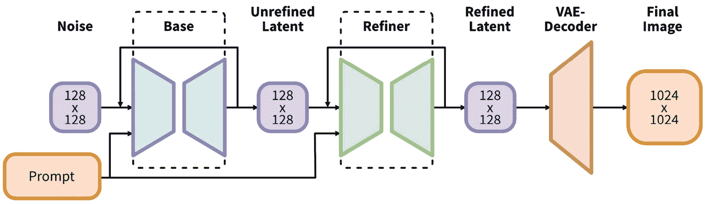
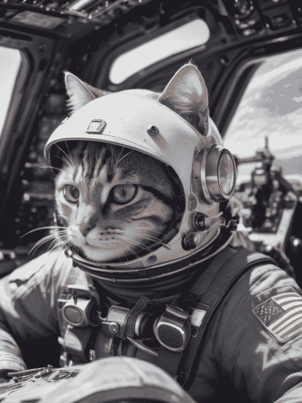
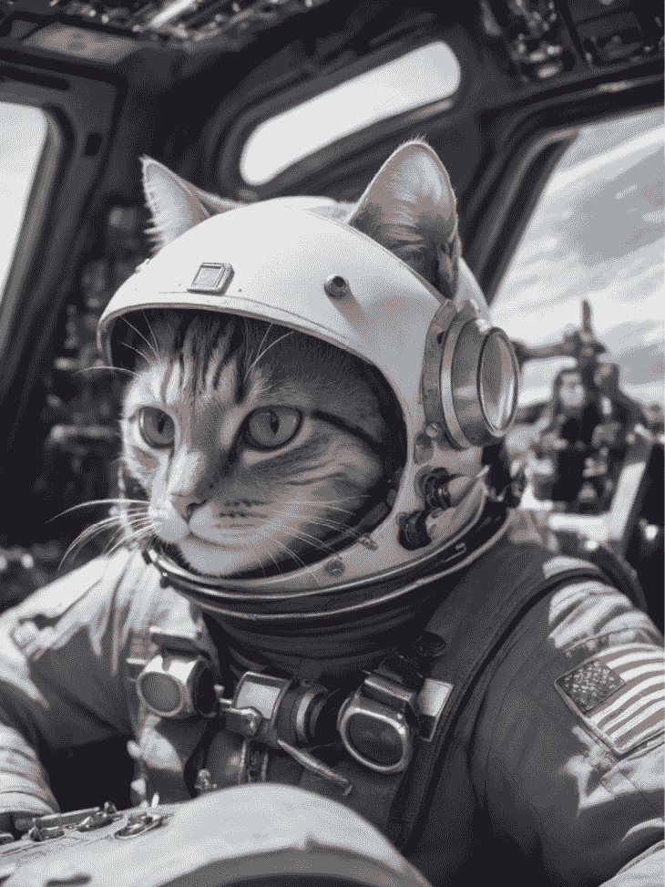
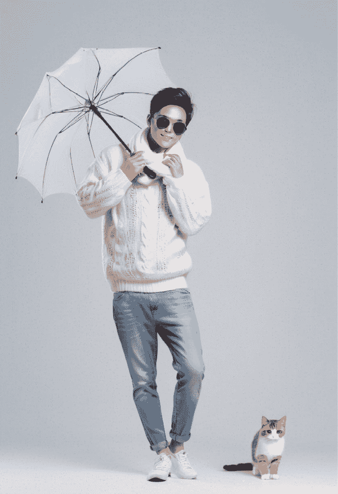

# 第十六章：探索 Stable Diffusion XL

在不太成功的 Stable Diffusion 2.0 和 Stable Diffusion 2.1 之后，2023 年 7 月 Stability AI 发布了其最新版本，**Stable Diffusion XL**（**SDXL**）[1]。注册一开放，我就迫不及待地应用了模型权重数据。我的测试和社区进行的测试都表明，SDXL 取得了显著的进步。它现在允许我们以更高的分辨率生成更高质量的图像，远远超过了 Stable Diffusion V1.5 基础模型。另一个显著的改进是能够使用更直观的“自然语言”提示来生成图像，消除了需要拼凑大量“单词”来形成一个有意义的提示的需求。此外，我们现在可以用更简洁的提示生成所需的图像。

与之前的版本相比，SDXL 在几乎每个方面都有所改进，值得花费时间和精力开始使用它以实现更好的稳定图像生成。在本章中，我们将详细讨论 SDXL 的新特性，并解释上述变化为何导致了其改进。例如，我们将探讨与 Stable Diffusion V1.5 相比，**变分自编码器**（**VAE**）、UNet 和 TextEncoder 设计中有什么新内容。简而言之，本章将涵盖以下内容：

+   SDXL 的新特性是什么？

+   使用 SDXL

然后，我们将使用 Python 代码演示最新的 SDXL 基础模型和社区模型在实际中的应用。我们将涵盖基本用法，以及高级用法，例如加载多个 LoRA 模型和使用无限加权提示。

让我们开始吧。

# SDXL 的新特性是什么？

SDXL 仍然是一个潜在扩散模型，保持了与 Stable Diffusion v1.5 相同的整体架构。根据 SDXL 背后的原始论文 [2]，SDXL 扩展了每个组件，使它们更宽、更大。SDXL 的骨干 UNet 大了三倍，SDXL 基础模型中有两个文本编码器，还包括了一个基于扩散的细化模型。整体架构如图 *16.1* 所示：



图 16.1：SDXL 架构

注意，细化器是可选的；我们可以决定是否使用细化器模型。接下来，让我们逐一深入到每个组件。

## SDXL 的 VAE

**VAE** 是一对编码器和解码器神经网络。VAE 编码器将图像编码到潜在空间中，其配对的解码器可以将潜在图像解码为像素图像。许多网络文章告诉我们 VAE 是一种用于提高图像质量的技巧；然而，这并不是全部。在 Stable Diffusion 中，VAE 的核心责任是将像素图像转换为潜在空间，并将其从潜在空间转换回来。当然，一个好的 VAE 可以通过添加高频细节来提高图像质量。

SDXL中使用的VAE是一个重新训练的版本，它使用相同的自动编码器架构，但批量大小有所增加（256与9相比），并且还使用指数移动平均跟踪权重[2]。新的VAE在所有评估指标上都优于原始模型。

由于这些实现差异，如果我们决定独立使用VAE，而不是重用[*第5章*](B21263_05.xhtml#_idTextAnchor097)中引入的VAE代码，我们需要编写新的代码。在这里，我们将提供一个SDXL VAE的一些常见用法的示例：

1.  初始化一个VAE模型：

    ```py
    import torch
    
    from diffusers.models import AutoencoderKL
    
    vae_model = AutoencoderKL.from_pretrained(
    
        "stabilityai/stable-diffusion-xl-base-1.0",
    
        subfolder = "vae"
    
    ).to("cuda:0")
    ```

1.  使用VAE模型编码图像。在执行以下代码之前，将`cat.png`文件替换为验证的可访问图像路径：

    ```py
    from diffusers.utils import load_image
    
    from diffusers.image_processor import VaeImageProcessor
    
    image = load_image("/path/to/cat.png")
    
    image_processor = VaeImageProcessor()
    
    prep_image = image_processor.preprocess(image)
    
    prep_image = prep_image.to("cuda:0")
    
    with torch.no_grad():
    
        image_latent = vae_model.encode(prep_image
    
            ).latent_dist.sample()
    
    image_latent.shape
    ```

1.  从潜在空间解码图像：

    ```py
    with torch.no_grad():
    
        decode_image = vae_model.decode(
    
            image_latent,
    
            return_dict = False
    
        )[0]
    
    image = image_processor.postprocess(image = decode_image)[0]
    
    image
    ```

在前面的代码中，你首先将图像编码到潜在空间。潜在空间中的图像对我们来说是不可见的，但它捕捉了图像在潜在空间中的特征（换句话说，在高维向量空间中）。然后，代码的解码部分将潜在空间中的图像解码到像素空间。从前面的代码中，我们可以知道VAE的核心功能是什么。

你可能好奇为什么了解VAE的知识是必要的。它有众多应用。例如，它允许你将生成的潜在图像保存在数据库中，仅在需要时解码。这种方法可以将图像存储减少多达90%，而信息损失很小。

## SDXL的UNet

UNet模型是SDXL的骨干神经网络。SDXL中的UNet比之前的Stable Diffusion模型大近三倍。SDXL的UNet是一个26GB的亿参数神经网络，而Stable Diffusion V1.5的UNet有8.6亿参数。尽管当前的开源LLM模型在神经网络大小方面要大得多，但截至写作时（2023年10月），SDXL的UNet是开源Diffusion模型中最大的，这直接导致了更高的VRAM需求。8GB的VRAM在大多数使用SD V1.5的情况下可以满足需求；对于SDXL，通常需要15GB的VRAM；否则，我们需要降低图像分辨率。

除了模型大小扩展外，SDXL还重新排列了其Transformer块的顺序，这对于更好的、更精确的自然语言到图像指导至关重要。

## SDXL中的两个文本编码器

SDXL中最显著的变化之一是文本编码器。SDXL使用两个文本编码器一起，CLIP ViT-L [5] 和 OpenCLIP ViT-bigG（也称为OpenCLIP G/14）。此外，SDXL使用OpenCLIP ViT-bigG的池化嵌入。

CLIP ViT-L是OpenAI最广泛使用的模型之一，也是Stable Diffusion V1.5中使用的文本编码器或嵌入模型。OpenCLIP ViT-bigG模型是什么？OpenCLIP是**CLIP**（**Contrastive Language-Image Pre-Training**）的开源实现。OpenCLIP G/14是在LAION-2B数据集[9]上训练的最大和最好的OpenClip模型，该数据集包含2亿张图片，总大小为100 TB。虽然OpenAI CLIP模型生成一个768维度的嵌入向量，但OpenClip G/14输出一个1,280维度的嵌入。通过连接两个嵌入（长度相同），输出一个2,048维度的嵌入。这比Stable Diffusion v1.5之前的768维度嵌入大得多。

为了说明文本编码过程，让我们以句子`a running dog`作为输入；普通的文本标记器首先将句子转换为标记，如下面的代码所示：

```py
input_prompt = "a running dog"
from transformers import CLIPTokenizer,CLIPTextModel
import torch
# initialize tokenizer 1
clip_tokenizer = CLIPTokenizer.from_pretrained(
    "stabilityai/stable-diffusion-xl-base-1.0",
    subfolder = "tokenizer",
    dtype = torch.float16
)
input_tokens = clip_tokenizer(
    input_prompt,
    return_tensors="pt"
)["input_ids"]
print(input_tokens)
clip_tokenizer_2 = CLIPTokenizer.from_pretrained(
    "stabilityai/stable-diffusion-xl-base-1.0",
    subfolder = "tokenizer_2",
    dtype = torch.float16
)
input_tokens_2 = clip_tokenizer_2(
    input_prompt,
    return_tensors="pt"
)["input_ids"]
print(input_tokens_2)
```

前面的代码将返回以下结果：

```py
tensor([[49406,   320,  2761,  1929, 49407]])
tensor([[49406,   320,  2761,  1929, 49407]])
```

在前面的结果中，`49406`是起始标记，而`49407`是结束标记。

接下来，下面的代码使用CLIP文本编码器将标记转换为嵌入向量：

```py
clip_text_encoder = CLIPTextModel.from_pretrained(
    "stabilityai/stable-diffusion-xl-base-1.0",
    subfolder = "text_encoder",
    torch_dtype =torch.float16
).to("cuda")
# encode token ids to embeddings
with torch.no_grad():
    prompt_embeds = clip_text_encoder(
        input_tokens.to("cuda")
    )[0]
print(prompt_embeds.shape)
```

结果嵌入张量包括五个768维度的向量：

```py
torch.Size([1, 5, 768])
```

之前的代码使用了OpenAI的CLIP将提示文本转换为768维度的嵌入。下面的代码使用OpenClip G/14模型将标记编码为五个1,280维度的嵌入：

```py
clip_text_encoder_2 = CLIPTextModel.from_pretrained(
    "stabilityai/stable-diffusion-xl-base-1.0",
    subfolder = "text_encoder_2",
    torch_dtype =torch.float16
).to("cuda")
# encode token ids to embeddings
with torch.no_grad():
    prompt_embeds_2 = clip_text_encoder_2(input_tokens.to("cuda"))[0]
print(prompt_embeds_2.shape)
```

结果嵌入张量包括五个1,280维度的向量：

```py
torch.Size([1, 5, 1280])
```

现在，下一个问题是，什么是**池化嵌入**？嵌入池化是将一系列标记转换为单个嵌入向量的过程。换句话说，池化嵌入是信息的有损压缩。

与我们之前使用的嵌入过程不同，该过程将每个标记编码为一个嵌入向量，池化嵌入是一个代表整个输入文本的向量。我们可以使用以下Python代码从OpenClip生成池化嵌入：

```py
from transformers import CLIPTextModelWithProjection
clip_text_encoder_2 = CLIPTextModelWithProjection.from_pretrained(
    "stabilityai/stable-diffusion-xl-base-1.0",
    subfolder = "text_encoder_2",
    torch_dtype =torch.float16
).to("cuda")
# encode token ids to embeddings
with torch.no_grad():
    pool_embed = clip_text_encoder_2(input_tokens.to("cuda"))[0]
print(pool_embed.shape)
```

前面的代码将从文本编码器返回一个`torch.Size([1, 1280])`的池化嵌入向量。池化嵌入的最大标记大小为`77`。在SDXL中，池化嵌入与来自CLIP和OpenCLIP的标记级别嵌入一起提供给UNet，以指导图像生成。

别担心——在使用SDXL之前，您不需要手动提供这些嵌入。`Diffusers`包中的`StableDiffusionXLPipeline`会为我们做所有事情。我们只需要提供提示和负面提示文本。我们将在*使用* *SDXL*部分提供示例代码。

## 两阶段设计

SDXL的另一个设计增加是其精细模型。根据SDXL论文[2]，精细模型用于通过添加更多细节并使其更好来增强图像，尤其是在最后10步。

精细模型只是另一个图像到图像的模型，可以帮助修复损坏的图像，并为基模型生成的图像添加更多元素。

根据我的观察，对于社区共享的检查点模型，精炼器模型可能不是必需的。

接下来，我们将使用SDXL进行常见用例。

# 使用SDXL

我们在[*第6章*](B21263_06.xhtml#_idTextAnchor117)中简要介绍了SDXL模型的加载，在[*第13章*](B21263_13.xhtml#_idTextAnchor257)中介绍了SDXL ControlNet的使用。您可以在那里找到示例代码。在本节中，我们将介绍更多常见的SDXL用法，包括加载社区共享的SDXL模型以及如何使用图像到图像的管道来增强模型，使用SDXL与社区共享的LoRA模型，以及来自本书作者的Diffuser的无限制长度提示管道。

## 使用SDXL社区模型

仅在SDXL发布几个月后，开源社区就基于Stability AI的基础模型发布了无数经过微调的SDXL模型。我们可以在Hugging Face和CIVITAI([https://civitai.com/](https://civitai.com/))上找到这些模型，数量还在不断增加。

在这里，我们将从HuggingFace加载一个模型，使用SDXL模型ID：

```py
import torch
from diffusers import StableDiffusionXLPipeline
base_pipe = StableDiffusionXLPipeline.from_pretrained(
    "RunDiffusion/RunDiffusion-XL-Beta",
    torch_dtype = torch.float16
)
base_pipe.watermark = None
```

注意，在前面的代码中，`base_pipe.watermark = None`将移除生成的图像中的不可见水印。

接下来，将模型移动到CUDA，生成图像，然后从CUDA卸载模型：

```py
prompt = "realistic photo of astronaut cat in fighter cockpit, detailed, 8k"
sdxl_pipe.to("cuda")
image = sdxl_pipe(
    prompt = prompt,
    width = 768,
    height = 1024,
    generator = torch.Generator("cuda").manual_seed(1)
).images[0]
sdxl_pipe.to("cpu")
torch.cuda.empty_cache()
image
```

仅需一行提示，无需提供任何负面提示，SDXL就能生成令人惊叹的图像，如图*图16**.2*所示：



图16.2：由SDXL生成的猫飞行员

您可能想使用精炼器模型来增强图像，但精炼器模型并没有带来显著的变化。相反，我们将使用具有相同模型数据的图像到图像管道来提高图像的分辨率。

## 使用SDXL图像到图像增强图像

让我们先提高图像到两倍：

```py
from diffusers.image_processor import VaeImageProcessor
img_processor = VaeImageProcessor()
# get the size of the image
(width, height) = image.size
# upscale image
image_x = img_processor.resize(
    image = image,
    width = int(width * 1.5),
    height = int(height * 1.5)
)
image_x
```

然后，通过重用前一个文本到图像管道中的模型数据来启动图像到图像管道，从而节省RAM和VRAM的使用：

```py
from diffusers import StableDiffusionXLImg2ImgPipeline
img2img_pipe = StableDiffusionXLImg2ImgPipeline(
    vae = sdxl_pipe.vae,
    text_encoder = sdxl_pipe.text_encoder,
    text_encoder_2 = sdxl_pipe.text_encoder_2,
    tokenizer = sdxl_pipe.tokenizer,
    tokenizer_2 = sdxl_pipe.tokenizer_2,
    unet = sdxl_pipe.unet,
    scheduler = sdxl_pipe.scheduler,
    add_watermarker = None
)
img2img_pipe.watermark = None
```

现在，是时候调用管道来进一步增强图像：

```py
img2img_pipe.to("cuda")
refine_image_2x = img2img_pipe(
    image = image_x,
    prompt = prompt,
    strength = 0.3,
    num_inference_steps = 30,
    guidance_scale = 4.0
).images[0]
img2img_pipe.to("cpu")
torch.cuda.empty_cache()
refine_image_2x
```

注意，我们将强度设置为`0.3`以保留大部分原始输入图像信息。我们将得到一个新、更好的图像，如图*图16**.3*所示：



图16.3：图像到图像管道中精炼的猫飞行员图像

尽管您可能一开始在书中看不到太多差异，但仔细检查计算机屏幕上的图像，您会发现许多额外的细节。

现在，让我们探讨如何利用LoRA与Diffusers结合使用。如果您对LoRA不熟悉，我建议您回顾[*第8章*](B21263_08.xhtml#_idTextAnchor153)，其中更详细地介绍了Stable Diffusion LoRA的用法，以及[*第21章*](B21263_21.xhtml#_idTextAnchor405)，其中全面介绍了LoRA的训练。

## 使用SDXL LoRA模型

不久前，使用Diffusers加载LoRA是不可能的，更不用说将多个LoRA模型加载到一个管道中。随着Diffusers团队和社区贡献者的巨大工作，我们现在可以将多个LoRA模型加载到SDXL管道中，并指定LoRA缩放数值。

其使用也非常简单。只需两行代码即可将一个LoRA添加到管道中：

```py
sdxl_pipe.load_lora_weights("path/to/lora.safetensors")
sdxl_pipe.fuse_lora(lora_scale = 0.5)
```

要添加两个LoRA模型：

```py
sdxl_pipe.load_lora_weights("path/to/lora1.safetensors")
sdxl_pipe.fuse_lora(lora_scale = 0.5)
sdxl_pipe.load_lora_weights("path/to/lora2.safetensors")
sdxl_pipe.fuse_lora(lora_scale = 0.5)
```

如我们在[*第8章*](B21263_08.xhtml#_idTextAnchor153)中讨论的，使用LoRA有两种方式——一种是将它与骨干模型权重合并，另一种是动态猴子补丁。在这里，对于SDXL，方法是模型合并，这意味着从管道中卸载一个LoRA。为了卸载一个LoRA模型，我们需要再次加载LoRA，但带有负的`lora_scale`。例如，如果我们想从管道中卸载`lora2.safetensors`，我们可以使用以下代码来实现：

```py
sdxl_pipe.load_lora_weights("path/to/lora2.safetensors")
sdxl_pipe.fuse_lora(lora_scale = -0.5)
```

除了使用`fuse_lora`加载LoRA模型外，我们还可以使用PEFT集成LoRA加载。代码与我们刚刚使用的代码非常相似，但我们添加了一个名为`adapter_name`的额外参数，如下所示：

```py
sdxl_pipe.load_lora_weights("path/to/lora1.safetensors",
    adapter_name="lora1")
sdxl_pipe.load_lora_weights("path/to/lora2.safetensors", ,
    adapter_name="lora2")
```

我们可以使用以下代码动态调整LoRA缩放：

```py
sdxl_pipe.set_adapters(["lora1", "lora2"], adapter_weights=[0.5, 1.0])
```

我们还可以禁用LoRA，如下所示：

```py
sdxl_pipe.disable_lora()
```

或者，我们可以禁用两个加载的LoRA模型中的一个，如下所示：

```py
sdxl_pipe.set_adapters(["lora1", "lora2"], adapter_weights=[0.0, 1.0])
```

在上述代码中，我们禁用了`lora1`，同时继续使用`lora2`。

通过适当的LoRA管理代码，你可以使用SDXL和无限数量的LoRA模型。说到“无限”，接下来，我们将介绍SDXL的“无限”长度提示词。

## 使用SDXL和无限制提示词

默认情况下，SDXL，像之前的版本一样，一次图像生成只支持最多77个token。在[*第10章*](B21263_10.xhtml#_idTextAnchor197)中，我们深入探讨了实现支持无长度限制的加权提示词的文本嵌入编码器。对于SDXL，想法类似但更复杂，实现起来也稍微困难一些；毕竟，现在有两个文本编码器。

我构建了一个长权重SDXL管道，`lpw_stable_diffusion_xl`，它与官方的`Diffusers`包合并。在本节中，我将介绍如何使用此管道以长权重和无限制的方式启用管道。

确保您已使用以下命令更新了您的`Diffusers`包到最新版本：

```py
pip install -U diffusers
```

然后，使用以下代码使用管道：

```py
from diffusers import DiffusionPipeline
import torch
pipe = DiffusionPipeline.from_pretrained(
    "RunDiffusion/RunDiffusion-XL-Beta",
    torch_dtype = torch.float16,
    use_safetensors = True,
    variant = "fp16",
    custom_pipeline = "lpw_stable_diffusion_xl",
)
prompt = """
glamour photography, (full body:1.5) photo of young man,
white blank background,
wear sweater, with scarf,
wear jean pant,
wear nike run shoes,
wear sun glass,
wear leather shoes,
holding a umbrella in hand
""" * 2
prompt = prompt + " a (cute cat:1.5) aside"
neg_prompt = """
(worst quality:1.5),(low quality:1.5), paint, cg, spots, bad hands,
three hands, noise, blur
"""
pipe.to("cuda")
image = pipe(
    prompt = prompt,
    negative_prompt = neg_prompt,
    width = 832,
    height = 1216,
    generator = torch.Generator("cuda").manual_seed(7)
).images[0]
pipe.to("cpu")
torch.cuda.empty_cache()
image
```

上述代码使用`DiffusionPipeline`加载一个由开源社区成员（即我）贡献的自定义管道`lpw_stable_diffusion_xl`。

注意，在代码中，提示词被乘以2，使其长度肯定超过77个token。在提示词的末尾，附加了`a (cute cat:1.5) aside`。如果管道支持超过77个token的提示词，生成的结果中应该有一只猫。

上述代码生成的图像显示在*图16**.4*中：



图16.4：使用无限提示长度管道生成的一男一猫，lpw_stable_diffusion_xl

从图像中，我们可以看到提示中的所有元素都得到了反映，现在有一只可爱的小猫坐在男人的旁边。

# 摘要

本章介绍了最新和最好的稳定扩散模型——SDXL。我们首先介绍了SDXL的基本知识以及为什么它强大且高效，然后深入研究了新发布模型的每个组件，包括VAE、UNet、文本编码器和新的两阶段设计。

我们为每个组件提供了示例代码，以帮助您深入了解SDXL。这些代码示例也可以用来利用各个组件的力量。例如，我们可以使用VAE来压缩图像，并使用文本编码器为图像生成文本嵌入。

在本章的后半部分，我们介绍了SDXL的一些常见用例，例如加载社区共享的检查点模型，使用图像到图像的管道增强和放大图像，以及介绍一种简单有效的解决方案来将多个LoRA模型加载到一个管道中。最后，我们提供了一个端到端解决方案，用于使用无限长度的加权提示来使用SDXL。

在SDXL的帮助下，我们可以用简短的提示生成令人惊叹的图像，并实现更好的结果。

在下一章中，我们将讨论如何编写稳定扩散提示，并利用LLM自动生成和增强提示。

# 参考文献

1.  SDXL：[https://stability.ai/stable-diffusion](https://stability.ai/stable-diffusion)

1.  SDXL：改进潜在扩散模型以实现高分辨率图像合成：[https://arxiv.org/abs/2307.01952](https://arxiv.org/abs/2307.01952)

1.  稳定扩散XL扩散器：[https://huggingface.co/docs/diffusers/main/en/using-diffusers/sdxl](https://huggingface.co/docs/diffusers/main/en/using-diffusers/sdxl)

1.  CLIP from OpenAI: [https://openai.com/research/clip](https://openai.com/research/clip)

1.  CLIP VIT Large模型：[https://huggingface.co/openai/clip-vit-large-patch14](https://huggingface.co/openai/clip-vit-large-patch14)

1.  使用OPENCLIP达到80%的无监督准确率：在LAION-2B上训练的VIT-G/14：[https://laion.ai/blog/giant-openclip/](https://laion.ai/blog/giant-openclip/)

1.  CLIP-ViT-bigG-14-laion2B-39B-b160k：[https://huggingface.co/laion/CLIP-ViT-bigG-14-laion2B-39B-b160k](https://huggingface.co/laion/CLIP-ViT-bigG-14-laion2B-39B-b160k)

1.  OpenCLIP GitHub仓库：[https://github.com/mlfoundations/open_clip](https://github.com/mlfoundations/open_clip)

1.  LAION-5B：开放大规模多模态数据集的新时代：[https://laion.ai/blog/laion-5b/](https://laion.ai/blog/laion-5b/)
