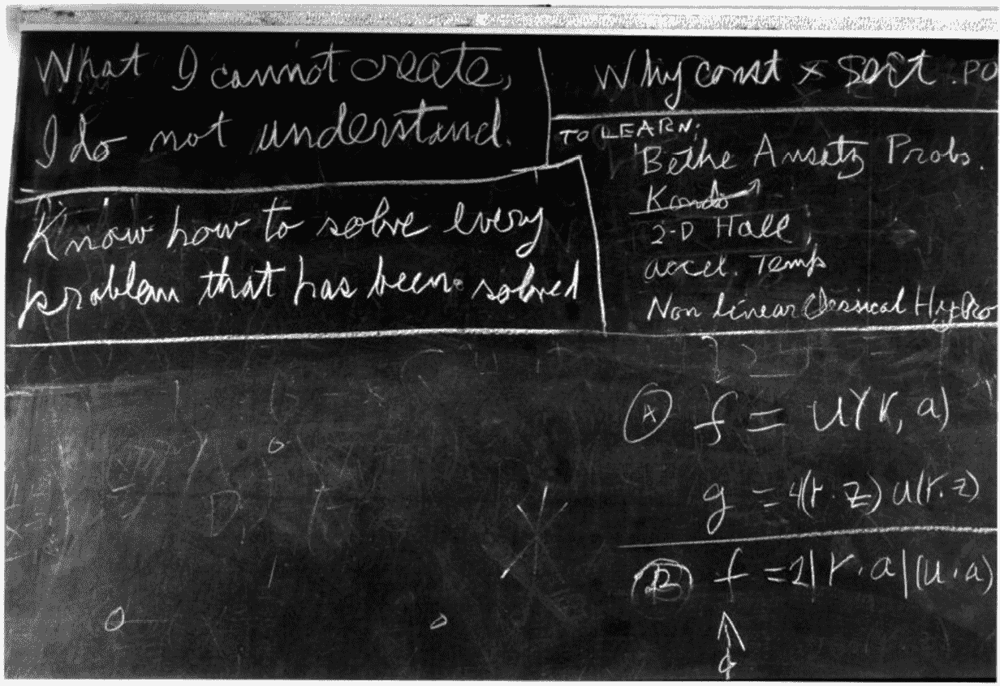

# 第二十二章：探索超越稳定扩散

稳定扩散的领域处于不断变化的状态，每天都有创新模型、方法和研究论文出现。在整个撰写本书的过程中，稳定扩散社区经历了显著的增长。鉴于这一领域的动态性，不可避免地，一些发展没有包含在这些页面中。

在撰写本书并深入研究稳定扩散的复杂性过程中，我经常被问到，“*你是如何开始理解这个复杂主题的？*”在本章的结尾，我旨在分享我的学习之旅，并提供见解，帮助您跟上稳定扩散和AI的最新发展。

在本章中，我们将讨论以下内容：

+   **区分这一AI浪潮的特点**：理解当前AI革命的独特特征

+   **数学和编程的持久价值**：强调在快速变化的AI领域中核心技能的重要性

+   **跟上AI创新**：保持与最新AI突破同步的技巧和策略

+   **培养负责任、道德、隐私和安全的人工智能**：探讨开发符合社会价值观和安全标准的人工智能的最佳实践

+   **我们与AI的关系演变**：反思AI对个人、组织和整个社会的影响

我希望这一章能为那些渴望扩展他们对稳定扩散和AI知识的人提供宝贵的资源。好奇心是解锁这个激动人心领域更深层次理解和探索的关键。

# 区分这一AI浪潮的特点

2016年3月，AlphaGo [1] 在一场五局比赛中击败了世界著名的围棋选手李世石，创造了历史。这是一个重大事件，因为围棋是一种需要战略思维和直觉的游戏，由于其复杂性，被认为计算机无法掌握。AlphaGo的胜利是对AI和机器学习进步的证明。

AlphaGo的成功基于深度神经网络和蒙特卡洛树搜索技术的结合。它通过学习成千上万的专业围棋游戏来学习模式和策略。然后，它通过自我对弈来提高技能和对游戏的理解。

这一成就标志着AI发展中的一个重大里程碑，证明了机器现在可以在需要深度理解和战略决策的任务中超越人类。

我在观看这些游戏直播时，对机器的力量感到震惊。然而，驱动AlphaGo的模型并非没有局限性。以下是一些：

+   **针对围棋的特定性**：AlphaGo专门设计来玩围棋。它没有能力将知识转移到其他游戏或领域。如果我们给棋盘增加一行，AlphaGo将无法正常运作。

+   **可解释性**：理解 AlphaGo 为什么会做出某些决定很困难，这可能会使其在关键情况下难以信任或依赖其输出。

AlphaGo 仅使用 GoPlay 数据进行训练，因此其数据范围相当有限，这是其“特定”功能的根本原因。它类似于基于**卷积神经网络**（**CNN**）的图像分类模型。这些模型通过一组预定义的数据进行训练；因此，它们只能在特定输入数据范围内执行。

在 2017 年，论文“*Attention Is All You Need*” [2] 介绍了变换器模型。作者展示了变换器模型在一种特定的无监督任务——机器翻译中的有效性。他们训练模型将句子从一种语言翻译成另一种语言，而不需要任何对齐的句子对或显式监督。相反，他们使用编码器-解码器结构以概率预测下一个单词。换句话说，下一个“单词”或“标记”是输入的训练标签，因此模型试图学习数据中存在的模式或结构，而不需要关于学习内容的任何明确指导。

变换器模型本身无疑仍然很重要（至少在撰写本文时）。但训练一个没有预定义标签的模型的想法和实现是天才的。

近年来，一些模型仅使用解码器来训练模型。值得注意的是，GPT-3 使用仅解码器架构来生成文本。其他一些视觉模型使用注意力机制来替代 CNN 结构——例如，**视觉变换器**（**ViT**） [3] 和 **Swin** 变换器 [4]。

在稳定扩散的情况下，本书中提出的模型在其 UNet 架构中集成了注意力机制，如在第 [*4章*](B21263_04.xhtml#_idTextAnchor081) 和 [*5章*](B21263_05.xhtml#_idTextAnchor097) 中所述。稳定扩散可以接受任何图像和标题对进行训练，其数据范围没有限制。如果我们有足够的硬件能力，我们可以提供世界上所有图像及其相关描述文本来训练一个超级扩散模型。

如 OpenAI 的 Sora 模型所示，只要有足够的视频数据、相关描述、强大的 GPU 力量和基于扩散变换器的模型，就可以生成一个视频，在一定程度上模仿现实世界。

在撰写本文时，我们尚不清楚这种基于注意力的自动学习架构的局限性是什么。

# 数学与编程的持久价值

随着我们见证 AI 展示的力量，有些人可能会争论，在未来，我们可能不需要学习编程或数学，因为我们可以将任何任务委托给 AI。然而，这远远不是事实。这场 AI 革命浪潮为未来打开了一扇新的大门，但本质上，AI 仍然是在硅芯片上运行的程序，它需要人类提供智慧和知识。

当前的AI技术是基于概率论、统计学和线性代数等数学模型开发的，这些对于AI算法至关重要。例如，基于潜在扩散模型（稳定扩散）的算法是基于神经网络的，其灵感来源于人脑的结构。深度学习最重要的部分是反向传播，它本质上就是微积分。因此，没有数学，AI无法存在。

关于编程技能，GPT和扩散模型并不会使编程技能变得多余；相反——编程发现了新的征服领域。那些为AI发展做出贡献的人也是编写最多代码的人。

假设你被某些自封的专家误导，放弃了追求你的编程能力。几年后，当你打开任何GitHub AI项目时，你不仅无法做出任何贡献，甚至完全无法阅读代码。

数学知识和编程技能永远不会过时。它们可能会随着时间改变形式，但核心概念保持不变。

当你正在阅读一本关于使用Python进行稳定扩散的书时，我敢打赌你不会满足于仅仅能够使用该模型，还需要了解它是如何内部工作的。为了理解它，最好的方式是创建它，正如理查德·费曼[7]在他的黑板上[5]所说的，如图*图22.1*所示：

图22.1 – 理查德·费曼的黑板 – “我不能创造的，我就不能理解”

这也取决于个人经验；我只能在实现之后才能完全理解一个主题。正如古老的谚语所说，我们不能通过阅读关于游泳的书来学会游泳。

然而，实现一个模型将需要理解理论，这需要理解相关的数学知识以及将复杂公式转换为可执行位元的编程技能。

假设我们已经下定决心要更多地了解AI——我们应该从哪里开始？

# 跟踪AI创新

由于转换器模型在很大程度上改变了格局，我们无法从亚马逊书店找到最新的学习材料，尤其是2022年之前出版的书籍。找到最相关的高质量信息非常重要。以下是一些可能有用的渠道：

+   **跟随知名论文作者**：通常，一个富有成效或聪明的论文作者可能会创建或贡献另一个模型。他们的GitHub账户、X（以前称为Twitter）账户或其他渠道更新是了解他们最新工作的好方法。

+   **使用 X**：当浏览我的 X（以前称为 Twitter）动态时，我经常遇到各种内容，包括幽默的视频和图片，这些内容可以轻易地消耗我的早晨。为了最大化平台的有用性，我学会了利用 **不感兴趣此帖子** 功能来调整我的动态，使其显示更多相关信息。这需要自律，因为我需要抵制参与娱乐帖子的诱惑，而是与提供有价值的见解的 AI 相关帖子互动。通过持续应用此策略，X 成为了跟踪该领域最新发展的宝贵资源。

+   `git pull` 命令是了解相关领域最新进展的有用方式。

    例如，当我们打开 `diffusers` GitHub 仓库，并输入 `git pull origin main` 命令时，它会列出主分支的最新更改，我可以找出哪些代码被合并到了主分支。通过简单地 *ctrl* + 点击文件名，我可以打开包含最新更改的文件。

    通常，`git pull` 命令可以提供关于稳定扩散最新进展的最有价值信息。通常，代码中也会包含论文的网址。

+   **有用网站**：除了 GitHub 仓库，还有三个网站或工具对于查找论文和模型非常有用：

    +   **Papers with Code** ([https://paperswithcode.com/](https://paperswithcode.com/))：这个网站是跟踪最新研究的绝佳资源。它提供了一个包含相关学术论文及其相关代码实现的综合列表，使得理解和重现结果变得容易。你可以通过研究领域、任务和数据集筛选论文，该网站还展示了各种任务中最先进模型的排行榜。

    +   **GitHub 趋势**：GitHub 是一个开发者和研究人员分享代码的平台，**趋势** 部分可以发现新模型和实现的宝库。通过根据你的兴趣领域（例如，机器学习、深度学习或自然语言处理）筛选结果，你可以找到最受欢迎和最近更新的存储库。这可以帮助你了解该领域的最新进展和最佳实践。

    +   **Hugging Face 模型库**：Hugging Face 是一个知名的构建和分享 **自然语言处理**（**NLP**）模型的平台。他们的模型库是一个可搜索的预训练模型存储库，你可以通过任务、语言和框架进行筛选。通过探索模型库，你可以找到广泛 NLP 任务的前沿模型，并轻松地将它们集成到自己的项目中。此外，Hugging Face 提供详细的文档和教程，使其成为初学者和经验丰富的实践者都极佳的资源。

在跟进最新发展时，我发现保持专注和好奇也很重要：

+   **保持专注**：对我们来说，保持对当前任务或项目的专注，而不被最新的AI进步过分分散注意力，是至关重要的。虽然跟上行业趋势很重要，但不断转移注意力可能导致项目不完整或对理解缺乏深度。以下是一些保持专注的策略：

    +   **优先学习**：确定你现在需要为项目或职业目标学习的内容，并集中精力学习。

    +   **设定具体的学习目标**：有明确的目标可以帮助你保持方向。

    +   **为探索分配时间**：每周留出特定的时间来探索新的进步。这样，你可以在不分散注意力的同时满足好奇心。

+   **保持好奇，避免感到不知所措**：保持对AI中新的想法和技术的好奇和开放态度是至关重要的，但同样重要的是管理这种好奇心，以避免感到不知所措。以下有四个小贴士可以帮助你做到这一点：

    +   **拥抱成长心态**：理解学习是一个过程，现在不知道所有的事情是完全可以接受的。

    +   **使用多种学习方法**：如果一种方法让你感到不知所措，就尝试另一种方法。例如，如果阅读研究论文过于密集，可以尝试观看视频讲座或参加在线课程。或者，简单地请求像ChatGPT这样的大型语言模型提供帮助。

    +   **创建学习计划**：规划你的学习，确保你有时间消化新信息。不要立即克隆仓库，而是记下安排一个时间来处理它。

    +   **寻求支持**：加入AI社区、论坛或讨论组，在那里你可以提问并与他人分享你的学习之旅。这可以使学习过程不那么令人畏惧。

在学习AI时，平衡是关键。这关乎找到适合你的专注和好奇的正确混合。

# 培养负责任、道德、私密和安全的AI

随着我们向前发展，AI将成为我们生活的一个基本组成部分，渗透到我们存在的几乎每一个方面，就像电和互联网一样。最初，这些技术被视为新奇事物，甚至可能是有潜在危险的。高压交流电构成了致命威胁，而互联网则成为虚假信息的渠道。尽管有这些最初的恐惧，我们还是设法减轻了这些技术的负面影响，利用它们的潜力为更大的利益服务。

当突破性的技术出现时，几乎不可能抑制其传播。我们不应该限制对这些进步的访问，而应该努力负责任地将它们整合到我们的生活中。

人工智能也不例外。人工智能被用于欺骗或欺诈目的的例子并不少见。随着人工智能的民主化，强大的AI工具将更容易被每个人获取。挑战在于管理人工智能的潜在滥用。就像一把刀，既可以用来准备食物，也可以造成伤害，人工智能的影响在很大程度上取决于用户。

为了准备进入一个由人工智能驱动的世界，我们需要增加我们对人工智能的理解，包括它的能力和局限性。我们必须学会恰当地使用它，并在我们自己和后代中灌输道德和伦理价值观。如果可能的话，我们还应该建立规范其使用的法律。

作为人工智能开发者，保持人工智能技术的透明度至关重要。当一家大公司发布一个可以生成有害内容的模型，如极端言论或过度政治正确性时，一个开放的社区可以表达担忧并采取纠正措施。相同水平的人工智能技术可以用来对抗这些问题，本质上是以火攻火。

在Stable Diffusion v1.5中，有一个基于OpenAI CLIP（对比语言-图像预训练）的安全检查模型可用，以确保输出内容无害。此模型可以自动且有效地执行此任务。Stable Diffusion XL还包括一个水印模块，可以在图像背景中嵌入难以察觉的水印。此功能可以通过添加特定的隐藏信息来保护图像版权。如果我们保持人工智能技术的开放性，我们总能找到平衡权力和确保人工智能用于更大福祉的方法。

我们正处于一个新时代的黎明，人工智能将改变我们的生活方式、工作方式以及我们彼此互动的方式。我们必须确保这一变革带来积极增长和发展，通过拥抱人工智能并共同努力。但有一件事一直在困扰着我们——如果人工智能夺走了我们的工作怎么办？

# 我们与人工智能的关系正在演变

1907年4月24日，纽约市的提灯工举行了罢工[6]，导致许多街道没有照明。尽管市民有投诉，警察也做出了努力，但由于各种挑战，成功点亮的路灯寥寥无几。这一事件标志着向电灯街道的重大转变，电灯比煤气灯更容易维护，并且自19世纪末引入以来已经开始取代煤气灯。

到1927年，电灯已经完全取代了煤气灯，导致提灯工这一职业和提灯工联盟的消失。电气化进程是不可阻挡的，无论公众和提灯工多么不愿意接受它。

人工智能是新型的电灯；它可以富有创造力，它可以完全自动化，它可以很好地处理一个或多个任务，并且可能超越人类的能力。是的，人工智能电灯将取代我们如此习惯并精心维护的旧式煤气灯。那么，提灯工的工作会被“人工智能”电灯所取代吗？

嗯，恐怕这次从煤气灯维护转向电灯维护并不那么容易。然而，“AI”智能路灯不仅仅是取代工作，还在创造更多的就业机会。最重要的是，由AI创造的这些工作比之前的工作更有趣、更有意义。说实话，我们真的喜欢那些涉及重复、枯燥任务的工作吗？比如那些曾经由提灯工完成的工作？AI将取代无聊的工作，并释放我们更多的脑力去探索以前没有人做过的新奇、激动人心的领域。让我们拥抱变化，欢迎AI智能路灯，并一起开始我们的旅程！

# 摘要

本章讨论了超出稳定扩散范围的话题，重点关注AI发展的更广泛背景及其对社会的影响。以下是主要观点的简要总结：

+   当前的AI浪潮是独特的，因为它利用基于注意力的自动学习架构，使模型能够在不同领域之间转移知识

+   数学能力和编程技能对于AI开发仍然是必不可少的，因为它们构成了AI算法的基础，并使研究人员能够建立在对现有知识的构建之上

+   您需要通过关注论文作者、使用X（Twitter）、执行GitHub `pull`命令和访问有用网站等渠道了解最新的AI发展动态

+   通过促进透明度、解决潜在滥用问题以及教育用户关于AI的能力和局限性，开发负责任、道德、隐私保护和安全的AI

+   拥抱AI的变革力量，认识到它可能会取代一些工作，但也将为更有趣、更有意义的工作创造新的机会

通过探讨这些话题，我们可以更好地理解AI在我们生活中的作用，并为所有人的利益做出其负责任发展的贡献。

# 参考文献

1.  AlphaGo: [https://en.wikipedia.org/wiki/AlphaGo](https://en.wikipedia.org/wiki/AlphaGo)

1.  注意力即一切：[https://arxiv.org/abs/1706.03762](https://arxiv.org/abs/1706.03762)

1.  一图胜千言：大规模图像识别的Transformer：[https://arxiv.org/abs/2010.11929](https://arxiv.org/abs/2010.11929)

1.  Swin Transformer：使用平移窗口的层次视觉Transformer：[https://arxiv.org/abs/2103.14030](https://arxiv.org/abs/2103.14030)

1.  理查德·费曼去世时的黑板：[https://digital.archives.caltech.edu/collections/Images/1.10-29/](https://digital.archives.caltech.edu/collections/Images/1.10-29/)

1.  灯夫罢工；城市某些地方变暗；警察预备队在哈莱姆出动，以点燃煤气灯。工会只召集了400名男子，不久后，煤气公司开始裁员：[https://www.nytimes.com/1907/04/25/archives/lamplighters-quit-city-dark-in-spots-police-reserves-out-in-harlem.html](https://www.nytimes.com/1907/04/25/archives/lamplighters-quit-city-dark-in-spots-police-reserves-out-in-harlem.html)

1.  理查德·费曼：[https://en.wikipedia.org/wiki/Richard_Feynman](https://en.wikipedia.org/wiki/Richard_Feynman)
