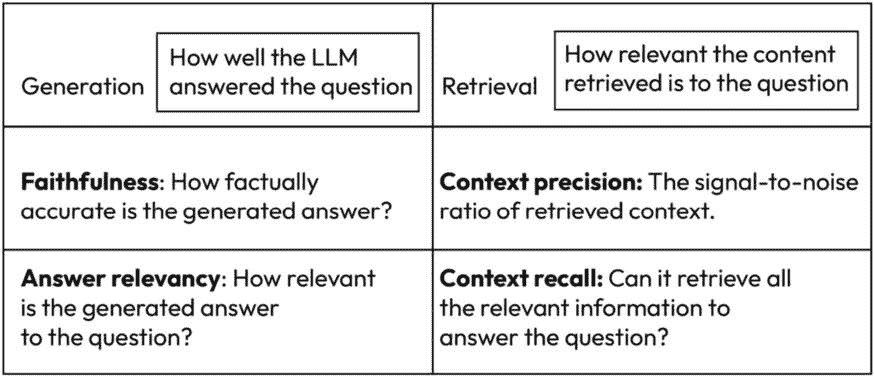
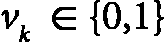
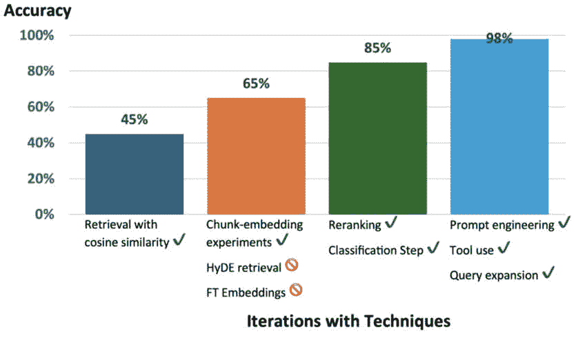
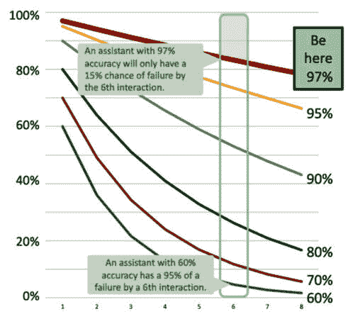
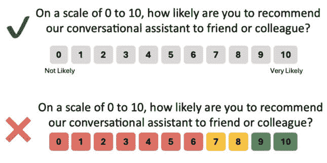
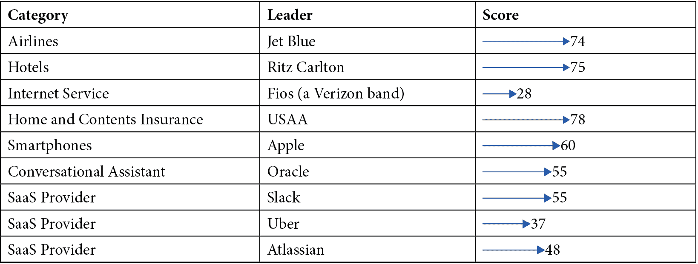
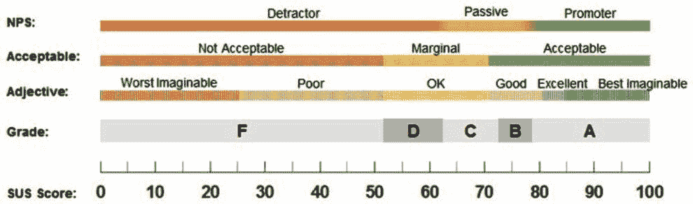

# 第十章：监控与评估

一旦有东西可以测试，即使是试用版，也要密切关注评估结果的过程。不出所料，讨论的方法（调查、访谈、反馈）可以重新使用，以查看beta客户或早期采用者的表现。

另一个烦恼

“*beta*”这个词会给非技术客户传递错误的信息，让他们觉得产品对他们来说还不成熟。考虑其他术语，比如限量发布，或者我最喜欢的，“*早期采用者访问权*”。这个标签可能会让他们以更好的心态处理问题并提供反馈。

由于**检索增强生成**（**RAG**）是大多数销售和支持企业解决方案的基础，因此该方法的质最指标至关重要。需要数据科学、产品经理和设计团队的组合来提高结果。使用设计专家或受过训练的个人采用启发式方法可以评估RAG或其他LLM输出，这些输出向客户提供结果。

这意味着有一套额外的可用方法可供选择，但说实话，所有这些方法都应该被应用：

+   使用**检索增强生成** **评估**（**RAGAs**）进行评估

+   使用可用性指标进行监控

+   使用启发式评估进行细化

让我们直接进入指标，以基准测试LLM解决方案。

# 使用RAGAs进行评估

这本书是关于设计的，所以不期望产品人员实施**RAGAs**。RAGAs是一个评估RAG管道的框架。*任何采用测试数据、实际使用并能可靠测量质量的方案对我来说都是可行的*。RAGAs在AI社区中很受欢迎，因此值得介绍。召集产品专家评估结果以验证发现。目标是理解指标并做出决策以提供模型改进。

## RAGAs流程

所有好的故事都是从开始讲起的。一个LLM产品需要被评估。不要等到客户抱怨；这来得太晚了，如果他们对质量感到沮丧，客户会很快消失。这类似于电话支持；当客户有一个糟糕的互动时，他们往往会告诉20个人有多糟糕，这种缺乏善意会损害公司的声誉。如果后端系统或推荐者没有达到目标，这会给客户留下不好的印象。通过监控系统性能，有更好的机会进行改进。正如彼得·德鲁克所说：“*你不能改善你* *没有衡量的*。””

可以部署一系列指标。让我们列出RAGAs的步骤：

1.  为测试合成一个多样化的数据集。

1.  使用这些指标来衡量解决方案质量。

1.  关注应用。使用更小、更便宜的模型来生成可操作见解。

1.  将这些见解反馈回去以改善整体体验。

本章将总结RAGAs的**指标驱动开发**（**MDD**），这是一个对我们所说的“关怀与培养”的别称。使用数据来驱动可操作的见解；太多失败的项目正是因为这个简单的疏忽。

RAGAs从用户的角度识别问题；这一点将在本章中介绍。始终出现的技术问题的相关Discord频道是活跃的。有一个在线的RAGA相关视频和教程集合。如果需要，这里有关于RAGAs的深入文档。

文档：[RAGAs简介](https://docs.ragas.io/en/latest/concepts/index.html) ([https://docs.ragas.io/en/latest/concepts/index.html](https://docs.ragas.io/en/latest/concepts/index.html))

测试数据（针对在场的开发者）

更技术倾向的读者可以使用GitHub FAQ文件。使用Python安装RAGAs并开始使用。这超出了本书的范围。本章涵盖的指标适用于各种类似的方法。学习这些标准指标以评估LLM质量。理解这些指标不需要构建RAGAs。

教程：[安装RAGAs](https://docs.ragas.io/en/stable/getstarted/install.html) ([https://docs.ragas.io/en/stable/getstarted/install.html](https://docs.ragas.io/en/stable/getstarted/install.html))

[*第8章*](B21964_08.xhtml#_idTextAnchor172)*，微调*，涵盖了数据合成。由于模型需要监控，数据合成需要提升到下一个层次以扩展多样性。

## 数据合成

工具可以创建各种测试数据。使用相同模型生成样本的挑战在于，微调或提示示例的测试数据可能过于接近验证示例。这在[*第8章*](B21964_08.xhtml#_idTextAnchor172)*，微调*的实验中得到了证实。由于LLM喜欢预测下一个单词，输出可能从一代到下一代相似。样本不会像客户的措辞那样多样化。关注推理、条件化和多上下文等写作特征可以提供更全面的输出范围，从而进行更稳健的测试。这些高级指令使LLM的输出更加多样化：

+   **推理**：编写需要推理来提供答案的问题：

    光合作用是如何工作的？

    重新编写：可能发生**哪些后果**

    当你**打破平衡**

    在**生态系统**中的光合作用？

+   **条件化**：包括增加复杂性的条件元素：

    哪些策略可以提高销售业绩？

    重新编写：销售策略如何根据

    在**目标市场人口统计等因素上**

    **产品复杂性和竞争格局**有何不同？

+   **多上下文**：请求多样化的信息来形成答案：

预测性维护

帮助制造运营？

重新编写：**数据分析、机器**

**学习和团队合作**提高

制造业中的预测性维护？

+   **对话式**：将部分问题转换为聊天问答解决方案中预期的来回问答：

嗨，我需要帮助重置我的密码。

当然，我可以帮您处理这个问题。

您尝试过“忘记密码”吗？

登录页面上的链接？

是的，但我没有收到重置电子邮件。

检查您的垃圾邮件文件夹。有时

电子邮件最终会出现在那里。

这是因为人类是多样化的，随机的，有时会离题，幽默，缺乏幽默感，会犯拼写错误，会胡言乱语，会使用多种语言，会简洁或冗长。在任何数据集中都有多样性是最好的。在企业数据中寻找这一点并要求它。当收集现实示例不足时，请保持这些综合技术可用，以扩大测试用例的范围。现在，专注于数字。哪些指标可以衡量和评估解决方案的状态？

## 评估指标

所有这些的中心是指标。有六个需要涵盖。前四个是围绕模型的角度，最后两个有**用户体验**（**UX**）的感觉：

+   忠实度

+   答案相关性

+   上下文精确度

+   上下文回忆

+   上下文实体回忆

+   摘要评分

RAGA在*图10*.1中概述了指标。这个图表也出现在OpenAI的演示中（20分钟处），接下来将进行介绍。每个概念都需要深入解释。



图10.1 – 如何思考评估一个LLM

这些概念值得内化，以便与开发人员和数据科学家进行清晰沟通。在这里有很多东西需要解释，包括评分，将评分转化为可执行的任务将更加困难。这本来可以是一个非常技术性的章节。为了构建RAGAs测试平台，请独立完成。我们关注的价值是理解指标及其应用。即使没有RAGAs，模型指标的概念也适用于许多解决方案。文档示例用于促进沟通，以便您可以参考它或当更新可用时：

文章：[评估RAG解决方案的性能](https://docs.ragas.io/en/latest/concepts/metrics/index.html) ([https://docs.ragas.io/en/latest/concepts/metrics/index.html](https://docs.ragas.io/en/latest/concepts/metrics/index.html))

数学很可怕

不要陷入数学。关注指标的价值并熟悉这些术语。人类不会手动计算这些值。所有这些都是由软件完成的。*如果你对数学感到害怕，忽略它。学习* *术语*。

### 忠实度（对于生成）

这是衡量生成答案事实准确性的指标。答案可以被事实核查（没有假新闻）吗？

![<math xmlns="http://www.w3.org/1998/Math/MathML" display="block"><mrow><mrow><mi>F</mi><mi>a</mi><mi>i</mi><mi>t</mi><mi>h</mi><mi>f</mi><mi>u</mi><mi>l</mi><mi>n</mi><mi>e</mi><mi>s</mi><mi>s</mi><mi>s</mi><mi>c</mi><mi>o</mi><mi>r</mi><mi>e</mi><mo>=</mo><mfrac><mtable columnwidth="auto" columnalign="center" rowspacing="1.0000ex" rowalign="baseline baseline"><mtr><mtd><mrow><mrow><mo>|</mo><mi>N</mi><mi>u</mi><mi>m</mi><mi>b</mi><mi>e</mi><mi>r</mi><mi>o</mi><mi>f</mi><mi>c</mi><mi>l</mi><mi>a</mi><mi>i</mi><mi>m</mi><mi}s</mi><mi>t</mi><mi>h</mi><mi>a</mi><mi>t</mi><mi>c</mi><mi>a</mi><mi>n</mi><mi>b</mi><mi>e</mi></mrow></mrow></mtd></mtr><mtr><mtd><mrow><mrow><mi>i</mi><mi>n</mi><mi>f</mi><mi>e</mi><mi>r</mi><mi>r</mi><mi>e</mi><mi>d</mi><mi>f</mi><mi>r</mi><mi>o</mi><mi>m</mi><mi>g</mi><mi>i</mi><mi>v</mi><mi>e</mi><mi>n</mi><mi>c</mi><mi>o</mi><mi>n</mi><mi>t</mi><mi>e</mi><mi>x</mi><mi>t</mi><mo>|</mo></mrow></mrow></mtd></mtr></mtable><mtable columnwidth="auto" columnalign="center" rowspacing="1.0000ex" rowalign="baseline baseline"><mtr><mtd><mrow><mrow><mo>|</mo><mi>T</mi><mi>o</mi><mi>t</mi><mi>a</mi><mi>l</mi><mi>n</mi><mi>u</mi><mi>m</mi><mi>b</mi><mi>e</mi><mi>r</mi><mi>o</mi><mi>f</mi><mi>c</mi><mi>l</mi><mi>a</mi><mi>i</mi><mi>m</mi><mi>s</mi></mrow></mrow></mtd></mtr><mtr><mtd><mrow><mrow><mi>i</mi><mi>n</mi><mi>t</mi><mi>h</mi><mi>e</mi><mi>g</mi><mi>e</mi><mi>n</mi><mi>e</mi><mi>r</mi><mi>a</mi><mi>t</mi><mi>e</mi><mi>d</mi><mi>a</mi><mi>n</mi><mi>s</mi><mi>w</mi><mi>e</mi><mi>r</mi><mo>|</mo></mrow></mrow></mtd></mtr></mtable></mfrac></mrow></mrow></math>](img/5.png)

这意味着不要幻想以给出一个忠实于事实的答案。如果被问到某人的生日，它最好是正确的。可以核实的个体元素越多，分子和分母就越大。考虑以下例子：

```py
When can I visit the Melrose store?
Our store on Melrose is open
7 days a week from 11 am to 9 pm.
```

这里是计算过程：

+   将答案分解成单个陈述，并确定它是否可以从原始上下文中推断出来（请相信我们这个虚构的店铺）：

    +   店铺位于Melrose（正确）

    +   它每周7天开放（正确）

    +   它从上午11点开放到晚上9点（正确）

+   计算忠实度：

    +   ![<mml:math xmlns:mml="http://www.w3.org/1998/Math/MathML" xmlns:m="http://schemas.openxmlformats.org/officeDocument/2006/math"><mml:mi>F</mml:mi><mml:mi>a</mml:mi><mml:mi>i</mml:mi><mml:mi>t</mml:mi><mml:mi>h</mml:mi><mml:mi>f</mml:mi><mml:mi>u</mml:mi><mml:mi>l</mml:mi><mml:mi>n</mml:mi><mml:mi>e</mml:mi><mml:mi>s</mml:mi><mml:mi>s</mml:mi><mml:mo>=</mml:mo><mml:mfrac><mml:mrow><mml:mn>3</mml:mn></mml:mrow><mml:mrow><mml:mn>3</mml:mn></mml:mrow></mml:mfrac><mml:mo>=</mml:mo><mml:mn>1.0</mml:mn></mml:math>](img/6.png)

让我们用相同的例子，但稍作改变：

```py
When can I visit the Melrose store?
Our store on Melvin Place is
open 7 days a week from 11 am to 9 pm.
```

这里是一个有错误的例子计算：

+   再次分解答案：

    +   店铺位于Melvin Place（错误）

    +   它每周7天开放（正确）

    +   它从上午11点开放到晚上9点（正确）

+   计算忠实度：

    +   ![<mml:math xmlns:mml="http://www.w3.org/1998/Math/MathML" xmlns:m="http://schemas.openxmlformats.org/officeDocument/2006/math"><mml:mi>F</mml:mi><mml:mi>a</mml:mi><mml:mi>i</mml:mi><mml:mi>t</mml:mi><mml:mi>h</mml:mi><mml:mi>f</mml:mi><mml:mi>u</mml:mi><mml:mi>l</mml:mi><mml:mi>n</mml:mi><mml:mi>e</mml:mi><mml:mi>s</mml:mi><mml:mi>s</mml:mi><mml:mo>=</mml:mo><mml:mfrac><mml:mrow><mml:mn>2</mml:mn></mml:mrow><mml:mrow><mml:mn>3</mml:mn></mml:mrow></mml:mfrac><mml:mo>=</mml:mo><mml:mn>0.67</mml:mn></mml:math>](img/7.png)

这判断原始上下文的正确性。知道正确的商店比小时数（正确和错误的答案之间的小时数可能重叠，所以即使它们是错误的，也可能足够好，以满足客户）更有相关性，但地址将完全失败。模型并不聪明。它们不知道这些元素（位置）相对于另一个元素（小时或天数）的价值。如果答案的忠实度低，它就是幻觉，应该拒绝这个答案。

这个技巧在于，尽管包含问题、上下文和回答的数据集是公开可用的，但它们缺少企业内容。需要一个基于有正确答案的答案的测试矩阵来监控和判断变化。

有一些参数可以调整以改进这个指标和其他与答案相关的因素（相关性、相似性和正确性）。数据科学家可以根据使用的工具进行操作。模型还可以通过减少幻觉并提高一致性来影响达到更好体验所需的努力。通过监控LLM排行榜来评估开箱即用的性能。在撰写本文时，OpenAI模型在评估总结文档时的幻觉方面位于或接近休斯排行榜的顶部。这是一个排行榜的例子。记住，不同的模型可以用于不同的组件，所以不要只关注ChatGPT在查看排行榜时。

文章：[休斯幻觉评估模型（HHEM）排行榜](https://huggingface.co/spaces/vectara/leaderboard) ([https://huggingface.co/spaces/vectara/leaderboard](https://huggingface.co/spaces/vectara/leaderboard))

这些排行榜是基于针对基础模型的通用指标。基于企业数据的LLM解决方案将需要自己的分析。

### 回答相关性（对于生成）

答案与问题的相关性如何？如果答案的部分内容缺失或包含冗余结果，则分数会降低。分数越高，越好；最好的分数应该接近1，通常在0到1之间，但由于数学原因，它们可以低至-1。

该方程在RAGAs文档中的解释如下：

![<math xmlns="http://www.w3.org/1998/Math/MathML" display="block"><mrow><mrow><mi>a</mi><mi>n</mi><mi>s</mi><mi>w</mi><mi>e</mi><mi>r</mi><mi>r</mi><mi>e</mi><mi>l</mi><mi>e</mi><mi>v</mi><mi>a</mi><mi>n</mi><mi>c</mi><mi>y</mi><mo>=</mo><mfrac><mn>1</mn><mi>N</mi></mfrac><mrow><munderover><mo>∑</mo><mrow><mi>i</mi><mo>=</mo><mn>1</mn></mrow><mi>N</mi></munderover><mrow><mi mathvariant="normal">c</mi><mi mathvariant="normal">o</mi><mi mathvariant="normal">s</mi><mo>(</mo><msub><mi>E</mi><msub><mi>g</mi><mi>i</mi></msub></msub><mo>,</mo><msub><mi>E</mi><mi>o</mi></msub><mo>)</mo></mrow></mrow></mrow></mrow></math>](img/8.png)

其中：

+    是生成的提问 𝑖 的嵌入

+    是原始问题的嵌入

+   𝑁 是生成问题的数量，默认为 3

数学公式复杂，因为它基于嵌入式向量值，这是在 [*第6章*](B21964_06_split_000.xhtml#_idTextAnchor134) 中讨论的多维空间，*收集数据 – 内容为王*。这个指标基于问题、内容和答案。然而，它是基于原始问题与一组生成问题的余弦相似度来计算的。LLM根据答案进行逆向工程。它不考虑事实性，并惩罚答案不完整的情况。

因为它们使用余弦相似度，值可以从 -1 到 1 变化，而通常，它们将在 0 到 1 之间。对于模型来说，了解数据具有挑战性。ChatGPT在更小的值范围内工作，如OpenAI社区中讨论的那样。

讨论：[文本嵌入问题](https://community.openai.com/t/some-questions-about-text-embedding-ada-002-s-embedding/35299/3) ([https://community.openai.com/t/some-questions-about-text-embedding-ada-002-s-embedding/35299/3](https://community.openai.com/t/some-questions-about-text-embedding-ada-002-s-embedding/35299/3))

我怀疑这个帖子中的一些内容过于技术性。即使是我也倾向于感到厌烦，因为我们不需要计算这些内容来学习如何评估它们。它只是指向幕后发生的魔法。理解结果可能具有挑战性。熟悉数据和指标，并制定改进措施。

选择一个，任何一个

另一种方法是简单比较输出中的陈述数量以及每个陈述根据输入的相关性。这种方法将低分识别为问题：

![<math xmlns="http://www.w3.org/1998/Math/MathML" display="block"><mrow><mrow><mi>a</mi><mi>n</mi><mi>s</mi><mi>w</mi><mi>e</mi><mi>r</mi><mi>r</mi><mi>e</mi><mi>l</mi><mi>e</mi><mi>v</mi><mi>a</mi><mi>n</mi><mi>c</mi><mi>y</mi><mo>=</mo><mfrac><mrow><mi>N</mi><mi>u</mi><mi>m</mi><mi>b</mi><mi>e</mi><mi>r</mi><mi>o</mi><mi>f</mi><mi>R</mi><mi>e</mi><mi>l</mi><mi>e</mi><mi>v</mi><mi>a</mi><mi>n</mi><mi>t</mi><mi>S</mi><mi>t</mi><mi>a</mi><mi>t</mi><mi>e</mi><mi>m</mi><mi>e</mi><mi>n</mi><mi>t</mi><mi>s</mi></mrow><mrow><mi>T</mi><mi>o</mi><mi>t</mi><mi>a</mi><mi>l</mi><mi>N</mi><mi>u</mi><mi>m</mi><mi>b</mi><mi>e</mi><mi>r</mi><mi>o</mi><mi>f</mi><mi>S</mi><mi>t</mi><mi>a</mi><mi>t</mi><mi>e</mi><mi>m</mi><mi>e</mi><mi>n</mi><mi>t</mi><mi>s</mi></mrow></mfrac></mrow></mrow></math>](img/11.png)

我分享这个是为了搅动复杂性的漩涡。这种流行的替代方法来自 DeepEval，另一个 LLM 评估框架。它们拥有所有相同的指标（以及更多，最后一次检查时共有 14 个），但正如这所示，计算可能会有所不同。有十几种流行的评估工具。我只是选择了流行的 RAGAS 来帮助产品人员理解关键指标。

文档：[DeepEval 指标](https://docs.confident-ai.com/docs/metrics-introduction) ([https://docs.confident-ai.com/docs/metrics-introduction](https://docs.confident-ai.com/docs/metrics-introduction))

这个指标与答案的正确性不同。它不考虑事实，而是考虑更多完整性的需要或包含冗余细节的需求。LLM 对答案进行多次（*N*）提问。然后，计算每个问题与原始问题相比的余弦相似度分数集合的平均值。一个优秀的答案使得原始答案可以重建的可能性增加：

```py
Question: Where is England, and where is its capital?
Low relevance answer: England is in Europe.
High relevance answer: England is in Northern Europe, and its capital is London.
```

LLM 应该从这样的答案中生成问题：

```py
Where is England in relation to the rest of Europe?
In what part of Europe is England?
What country is London in, and in what part of the world?
```

ChatGPT 4o 被给出一个简单的提示来生成这些问题，却返回了垃圾信息：

```py
Where is Northern Europe, and where is its capital?
Where is London, and where is its capital?
Where is England, and where is Northern Europe?
```

与工程师合作，收集有意义的资料，并学习。这可能令人沮丧。例如，微调、更好的知识库和反馈循环等解决方案有助于提高相关性。然而，还有更多技术方法。要深入了解，请向你的实习生、ChatGPT 提问：

```py
How can I improve answer relevance in my LLM using RAGAs
```

### 上下文精确度（用于检索）

上下文与问题的相关性如何？让我们看看：

![<math xmlns="http://www.w3.org/1998/Math/MathML" display="block"><mrow><mrow><mi>C</mi><mi>o</mi><mi>n</mi><mi>t</mi><mi>e</mi><mi>x</mi><mi>t</mi><mi>P</mi><mi>r</mi><mi>e</mi><mi>c</mi><mi>i</mi><mi>s</mi><mi>s</mi><mi>i</mi><mi>o</mi><mi>n</mi><mo>@</mo><mi>K</mi><mo>=</mo><mfrac><mrow><msubsup><mo>∑</mo><mrow><mi>k</mi><mo>=</mo><mn>1</mn></mrow><mi>K</mi></msubsup><mrow><mo>(</mo><mi>P</mi><mi>r</mi><mi>e</mi><mi>c</mi><mi>i</mi><mi}s</mi><mi>i</mi><mi>o</mi><mi>n</mi><mo>@</mo><mi>k</mi><mo>×</mo><msub><mi>v</mi><mi>k</mi></msub><mo>)</mo></mrow></mrow><mtable columnwidth="auto" columnalign="center" rowspacing="1.0000ex" rowalign="baseline baseline"><mtr><mtd><mrow><mi>T</mi><mi>o</mi><mi>t</mi><mi>a</mi><mi>l</mi><mi>n</mi><mi>u</mi><mi>m</mi><mi>b</mi><mi>e</mi><mi>r</mi><mi>o</mi><mi>f</mi><mi>r</mi><mi>e</mi><mi>l</mi><mi>e</mi><mi>v</mi><mi>a</mi><mi>n</mi><mi>t</mi></mrow></mtd></mtr><mtr><mtd><mrow><mi>i</mi><mi>t</mi><mi>e</mi><mi>m</mi><mi>s</mi><mi>i</mi><mi>n</mi><mi>t</mi><mi>h</mi><mi>e</mi><mi>t</mi><mi>o</mi><mi>p</mi><mi>K</mi><mi>r</mi><mi>e</mi><mi>s</mi><mi>u</mi><mi>l</mi><mi>t</mi><mi>s</mi></mrow></mtd></mtr></mtable></mfrac></mrow></mrow></math>](img/12.png)

![<math xmlns="http://www.w3.org/1998/Math/MathML" display="block"><mrow><mrow><mi>P</mi><mi>r</mi><mi>e</mi><mi>c</mi><mi>i</mi><mi>si</mi><mi>o</mi><mi>n</mi><mo>@</mo><mi>k</mi><mo>=</mo><mfrac><mrow><mi>t</mi><mi>r</mi><mi>u</mi><mi>e</mi><mi>p</mi><mi>o</mi><mi>s</mi><mi>i</mi><mi>t</mi><mi>i</mi><mi>v</mi><mi>e</mi><mi>s</mi><mo>@</mo><mi>k</mi></mrow><mrow><mo>(</mo><mi>t</mi><mi>r</mi><mi>u</mi><mi>e</mi><mi>p</mi><mi>o</mi><mi>s</mi><mi>i</mi><mi>t</mi><mi>i</mi><mi>v</mi><mi>e</mi><mi>s</mi><mo>@</mo><mi>k</mi><mo>+</mo><mi>f</mi><mi>a</mi><mi>l</mi><mi>s</mi><mi>e</mi><mi>p</mi><mi>o</mi><mi>s</mi><mi>i</mi><mi>t</mi><mi>i</mi><mi>v</mi><mi>e</mi><mi>s</mi><mo>@</mo><mi>k</mi><mo>)</mo></mrow></mfrac></mrow></mrow></math>](img/13.png)

在这里，*K* 是上下文中片段的总数，并且  是排名 *k* 的相关性指标。回想一下前面“英国”示例中的两个相关片段。

在上下文中，所有的真实项都被排序得高吗？越相关，其排名就越高。如果片段包含支持真实项的相关细节，则将每个片段的精确度相加，以得到上下文的精确度。使用前一个示例中的两个英国示例片段，计算每个片段的精确度，这有助于回答我们关于英国首都及其位置的问题。上下文中没有错误信息，例如告诉我英国在法国，所以它只是基于第二个片段中伦敦是首都的真实正例，但它需要提供关于英国位置的具体细节：

![<mml:math xmlns:mml="http://www.w3.org/1998/Math/MathML" xmlns:m="http://schemas.openxmlformats.org/officeDocument/2006/math" display="block"><mml:mi>P</mml:mi><mml:mi>r</mml:mi><mml:mi>e</mml:mi><mml:mi>c</mml:mi><mml:mi>i</mml:mi><mml:mi>s</mml:mi><mml:mi>i</mml:mi><mml:mi>o</mml:mi><mml:mi>n</mml:mi><mml:mo>@</mml:mo><mml:mn>1</mml:mn><mml:mo>=</mml:mo><mml:mfrac><mml:mrow><mml:mn>0</mml:mn></mml:mrow><mml:mrow><mml:mn>1</mml:mn></mml:mrow></mml:mfrac><mml:mo>=</mml:mo><mml:mn>0</mml:mn></mml:math>](img/15.png)

![<mml:math xmlns:mml="http://www.w3.org/1998/Math/MathML" xmlns:m="http://schemas.openxmlformats.org/officeDocument/2006/math" display="block"><mml:mi>P</mml:mi><mml:mi>r</mml:mi><mml:mi>e</mml:mi><mml:mi>c</mml:mi><mml:mi>i</mml:mi><mml:mi>s</mml:mi><mml:mi>i</mml:mi><mml:mi>o</mml:mi><mml:mi>n</mml:mi><mml:mo>@</mml:mo><mml:mn>2</mml:mn><mml:mo>=</mml:mo><mml:mfrac><mml:mrow><mml:mn>1</mml:mn></mml:mrow><mml:mrow><mml:mn>2</mml:mn></mml:mrow></mml:mfrac><mml:mo>=</mml:mo><mml:mn>0.5</mml:mn></mml:math>](img/16.png)

汇总精确度分数并计算平均值：


文档可能需要更精确，但我没有找到能够使其更透明的参考资料。前面提到的DeepEval，如果你需要他们的解释，有一些更多的背景信息。它们的值相似，但在表达上略有不同。他们没有定义真正阳性的范围，因此在查看具有多个元素复杂陈述时，需要明确他们如何得出结果。定义一个阳性可能具有挑战性，因为一个陈述可能包含许多阳性。此外，他们没有在计算中考虑相关性指标。实际的计算比文档更准确。所以，按照它所暗示的来理解。在适当的环境下，正确的答案需要来回答问题。这些答案的排名越高，获得好结果的可能性就越大。模型可以很精确，但需要收集所有环境。

### 环境回忆（针对检索器）

检索器能否检索到所有相关环境？环境是作为信息来源使用的材料。其价值基于真实情况（*GT*）和检索到的环境，值范围仅在0到1之间。分数越高越好：

![<math xmlns="http://www.w3.org/1998/Math/MathML" display="block"><mrow><mrow><mi>c</mi><mi>o</mi><mi>n</mi><mi>t</mi><mi>e</mi><mi>x</mi><mi>t</mi><mi>r</mi><mi>e</mi><mi>c</mi><mi>a</mi><mi>l</mi><mi>l</mi><mo>=</mo><mfrac><mrow><mo>|</mo><mi>G</mi><mi>T</mi><mi>c</mi><mi>l</mi><mi>a</mi><mi>i</mi><mi>m</mi><mi}s</mi><mi>t</mi><mi>h</mi><mi>a</mi><mi>t</mi><mi>c</mi><mi>a</mi><mi>r</mi><mi>b</mi><mi>e</mi><mi>a</mi><mi>t</mi><mi>t</mi><mi>r</mi><mi>i</mi><mi>b</mi><mi>u</mi><mi>t</mi><mi>e</mi><mi>d</mi><mi>t</mi><mi>o</mi><mi>c</mi><mi>o</mi><mi>n</mi><mi>t</mi><mi>e</mi><mo>|</mo></mrow><mrow><mo>|</mo><mi>N</mi><mi>u</mi><mi>m</mi><mi>b</mi><mi>e</mi><mi>r</mi><mi>o</mi><mi>f</mi><mi>c</mi><mi>l</mi><mi>a</mi><mi>i</mi><mi>m</mi><mi>s</mi><mi>i</mi><mi>n</mi><mi>G</mi><mi>T</mi><mo>|</mo></mrow></mfrac></mrow></mrow></math>](img/18.png)

在检索到的上下文中找到每个陈述将给出1.0分，用于上下文召回。让我们使用我们之前的答案。这些是建立在这个基础上的事实。它们是事实真相：

```py
England is in Northern Europe, and its capital is London.
```

假设回忆起的上下文是以下两个陈述：

```py
England is located in the southern part of the island of Great Britain, which is part of the United Kingdom. Known for its rich history, it has influenced global culture, politics, and economics.
England's capital, London, is a leading global city known for its cultural and economic significance.
```

然后，以下两个陈述：

+   **陈述1**：英格兰位于北欧

+   **陈述2**：其首都是伦敦

可以与上下文进行比较：

+   **陈述1**：错误（北欧不在上下文中）

+   **陈述2**：正确（伦敦被定义为英格兰的首都）

这导致了上下文召回的计算：


这很重要，因为它可能包含正确的信息，但如果解决方案没有返回正确的上下文，它可能不会提供所有预期的答案部分。每个答案都是同等重要的。如果它更聪明，它可能会给有意义和相关的项目更多的权重。它一无所知。

一些额外的指标超出了本节开始时图表中的四个指标。其中一个与实体有关。

### 上下文实体召回

**实体召回**在解决方案中很有用，例如在帮助台，了解正确的实体（一个特定的相关信息、一个值或一个标签）是至关重要的。实体对于填写休假申请（休假类型、日期、小时）、提交费用报告（金额、参与者、日期、类别、目的、支付类型）、与销售数据交互（日期、金额、联系人、地址、产品、数量）或任何具有许多实体的表格都是必要的。这计算了上下文实体（*CE*）和事实真相实体（*GE*）的并集与事实真相实体数量的比例。值从零到一不等；高值表示更好的召回：


这个例子显示了真实情况中的实体（*GE*）：

+   英格兰，北欧，伦敦

然后，在两个上下文示例（*CE*）中找到实体：

+   **上下文示例 1**: 英格兰，大不列颠，联合王国

+   **内容示例 2**: 英格兰，伦敦

根据实体匹配的并集计算分数：

![<math xmlns="http://www.w3.org/1998/Math/MathML" display="block"><mrow><mrow><mi>c</mi><mi>o</mi><mi>n</mi><mi>t</mi><mi>e</mi><mi>x</mi><mi>t</mi><mi>e</mi><mi>n</mi><mi>t</mi><mi>i</mi><mi>t</mi><mi>y</mi><mn>1</mn><mi>r</mi><mi>e</mi><mi>c</mi><mi>a</mi><mi>l</mi><mi>l</mi><mo>=</mo><mfrac><mfenced open="|" close="|"><mrow><mi>C</mi><mi>E</mi><mn>1</mn><mo>∩</mo><mi>G</mi><mi>E</mi></mrow></mfenced><mfenced open="|" close="|"><mrow><mi>G</mi><mi>E</mi></mrow></mfenced></mfrac><mo>=</mo><mfrac><mn>1</mn><mn>3</mn></mfrac><mo>=</mo><mn>0.33</mn></mrow></mrow></math>](img/21.png)

![<math xmlns="http://www.w3.org/1998/Math/MathML" display="block"><mrow><mrow><mi>c</mi><mi>o</mi><mi>n</mi><mi>t</mi><mi>e</mi><mi>x</mi><mi>t</mi><mi>e</mi><mi>n</mi><mi>t</mi><mi>i</mi><mi>t</mi><mi>y</mi><mn>2</mn><mi>r</mi><mi>e</mi><mi>c</mi><mi>a</mi><mi>l</mi><mi>l</mi><mo>=</mo><mfrac><mfenced open="|" close="|"><mrow><mi>C</mi><mi>E</mi><mn>2</mn><mo>∩</mo><mi>G</mi><mi>E</mi></mrow></mfenced><mrow><mo>|</mo><mi>G</mi><mi>E</mi><mo>|</mo></mrow></mfrac><mo>=</mo><mfrac><mn>2</mn><mn>3</mn></mfrac><mo>=</mo><mn>0.67</mn></mrow></mrow></math>](img/22.png)

从这个结论来看，实体 2 在实体匹配上的召回率更好。太多不重叠的实体在这个计算中是噪声。

结果不是确定的；尝试，尝试，再尝试

计算中存在一些问题，计算结果并不相同。这只是一个例子；每个模型的值都会不同。第一次的结果可能如下所示：

**{'faithfulness': 0.5624, 'answer_relevancy': 0.7752, '****answer_correctness': 0.5484}**

重新运行分析会产生不同的结果：

**{'faithfulness': 0.6843, 'answer_relevancy': 0.7193, '****answer_correctness': 0.5246}**

不要慌张。为什么它们会不同？相同的模型和数据应该给出相同的结果。可重复性不存在。他们建议重复运行三次并取平均值。这是度量质量增长中的痛点。它并不非常确定，就像模型本身一样。它是一个正在进行中的工作，但应该足够合适。

在线论坛对指标的质量有所抱怨。其他供应商提供新的改进指标，因此要保持警惕。这不是一个成熟的空间。它依赖于稳健的机器学习模型，但这些评分方法并不完美。

文章：[RAGAs中评估函数可能的bug](https://github.com/explodinggradients/ragas/issues/660) ([https://github.com/explodinggradients/ragas/issues/660](https://github.com/explodinggradients/ragas/issues/660))

所有这些都与您经验中的指标有关。只需将模型数据与基准进行比较，并使用工具和技术进行改进。将分数与其他环境进行比较将没有意义。让我们以这个套件的UX指标结束。

## 用户体验指标

虽然之前的指标应该被监控并对整个团队有价值，但看到以下被认为是UX指标是很好的。让我们直接深入探讨。

### 答案语义相似性

这基于真实答案与答案相似性的关系。它基于语句向量化值的余弦相似性。寻找高度相关的值。范围从0到1，分数越高，生成的答案与真实答案之间的匹配度越好：

+   **真实答案**：iPhone 15在典型网页浏览、视频观看和社交媒体使用时的电池寿命约为11小时

+   **高相似度答案**：iPhone的全天候电池寿命可以处理非常活跃的手机用户的稳健媒体使用

+   **低相似度答案**：新一代的手机比上一代的电池寿命更长

我无法解释为什么RAGAs文档省略了评分指标，但我们可以没有它，因为这不是手工计算的。

我看到这很可能是基于Risch、Möller、Gutsche和Peitsch（2021）的工作，因此为了探索这篇文章和阅读Isabelle Nguyen的博客：

文章：[语义答案相似性用于评估问答模型](https://arxiv.org/pdf/2108.06130) by Risch et al. ([https://arxiv.org/pdf/2108.06130](https://arxiv.org/pdf/2108.06130))

文章：[语义答案相似性：评分问答预测的更智能指标](https://www.deepset.ai/blog/semantic-answer-similarity-to-evaluate-qa) by Isabelle Nguyen ([https://www.deepset.ai/blog/semantic-answer-similarity-to-evaluate-qa](https://www.deepset.ai/blog/semantic-answer-similarity-to-evaluate-qa))

Risch等人提供了如何评估答案质量的良好示例。使用这些示例来调整提示，以收紧或放宽LLM的响应。它还引入了F1分数的概念，这使我们转向答案正确性。

### 答案正确性

这基于答案的相似度评分。它检查生成的答案与真实答案的相似性以及事实是否得到支持。因此，如果它是准确的或者通过**假阳性**（**FPs**）或**假阴性**（**FNs**）误导我们，那么它很重要：

+   **True positive (TP)**: 在真实答案和生成的答案中找到的事实或陈述

+   **FP**: 在生成的答案中找到但未在真实答案中找到的陈述或事实

+   **FN**: 在真实答案中找到但未在生成的答案中找到的事实或陈述

我将使用文档中的示例来保持其简单性：

+   **Ground truth**: 爱因斯坦于1879年出生于德国

+   **High answer correctness**: 1879年，爱因斯坦出生于德国

+   **Low answer correctness**: 爱因斯坦于1879年出生于西班牙

然后评估低答案正确性（与“爱因斯坦于1879年出生于西班牙”进行比较）：

+   **TP**: 爱因斯坦于1879年出生

+   **FP**: 爱因斯坦出生于西班牙（错误陈述）

+   **FN**: 爱因斯坦出生于德国（德国不在答案中）

这是F1分数：

![<math xmlns="http://www.w3.org/1998/Math/MathML" display="block"><mrow><mrow><mi>F</mi><mn>1</mn><mi>S</mi><mi>C</mi><mi>O</mi><mi>R</mi><mi>E</mi><mo>=</mo><mfrac><mfenced open="|" close="|"><mrow><mi>T</mi><mi>P</mi></mrow></mfenced><mrow><mo>(</mo><mfenced open="|" close="|"><mrow><mi>T</mi><mi>P</mi></mrow></mfenced><mo>+</mo><mn>0.5</mn><mo>×</mo><mo>(</mo><mfenced open="|" close="|"><mrow><mi>F</mi><mi>P</mi></mrow></mfenced><mo>+</mo><mfenced open="|" close="|"><mrow><mi>F</mi><mi>N</mi></mrow></mfenced><mo>)</mo><mo>)</mo></mrow></mfrac></mrow></mrow></math>](img/23.png)

注意错误值的加权方式。如果没有错误信息，那么F1分数将是1的最大值。错误信息越多，分数就越趋向于零。如果没有真正的积极，分数将为零。

## 其他指标

明白这只是可用指标的一个样本；一些RAGAs框架项目被跳过了，我们提到还可以从其他框架中找到更多。寻找解释交互质量指标的重复性和可靠性。Rajeep Biswas（2023）在他的概述中涵盖了其他指标：

文章：[评估大型语言模型（LLMs）的指标](https://www.linkedin.com/pulse/evaluating-large-language-models-llms-standard-set-metrics-biswas-ecjlc/) ([https://www.linkedin.com/pulse/evaluating-large-language-models-llms-standard-set-metrics-biswas-ecjlc/](https://www.linkedin.com/pulse/evaluating-large-language-models-llms-standard-set-metrics-biswas-ecjlc/))

我不希望每个人都陷入数学的困境。欣赏和重视一个指标应该基于信任它能够做到它所说的。但我们必须设定一个基准。应用这些指标并衡量团队对它们的信任程度。使用和迭代得越多，判断结果就越容易。

RAGAs是一个新兴领域，指标将随着它而变化。对于RAGAs指标的另一种解释，请尝试Leonie Monigatti（2023）的这篇文章：

文章：[使用RAGAs评估RAG应用](https://towardsdatascience.com/evaluating-rag-applications-with-ragas-81d67b0ee31a) ([https://towardsdatascience.com/evaluating-rag-applications-with-ragas-81d67b0ee31a](https://towardsdatascience.com/evaluating-rag-applications-with-ragas-81d67b0ee31a))

指标提供了对质量的总体看法，但没有涉及指标可能涉及的必要详细更改。最大的具体问题是幻觉错误。监控和解决这些问题对于建立信任至关重要。

## 监控和分类幻觉错误的类型

减少幻觉是这本书中反复出现的一个主题。[*第3章*](B21964_03.xhtml#_idTextAnchor058)，*确定ChatGPT的最佳用例*，涵盖了聊天日志中的记录错误。是时候探索更精细的分类这些错误的方法了。一旦错误被分类，就可以帮助模型、数据或训练来解决这些问题。有两种分类方法值得探索，从由Vectara按错误类型分类开始。

### 按错误类型分类

**Vectara**属于作为服务运行的RAGAs搜索工具类别。无论可用工具如何，识别和修复幻觉都是至关重要的。数据应显示一个很小的百分比，例如一到三个百分点，但达到这种质量水平需要一些工作。Vectara的分类很有帮助，因为它们是正交的，并汇总成它们版本的质量评分，他们称之为**事实一致性评分**。我对任何指标中的“一致性”这个词都很着迷。这是一种监控持续进步和跟踪质量的方法，即使人类需要帮助理解为什么值发生了变化。学习和测试越多，改进的结果就越好。这里只有指导，没有规则。

我将引用作为输入的精确示例，但随后将包括对输出问题的评论：

文章：[自动化幻觉检测](https://vectara.com/blog/automating-hallucination-detection-introducing-vectara-factual-consistency-score/) ([https://vectara.com/blog/automating-hallucination-detection-introducing-vectara-factual-consistency-score/](https://vectara.com/blog/automating-hallucination-detection-introducing-vectara-factual-consistency-score/))

*"2019年，美国食品药品监督管理局（FDA）批准了埃博拉疫苗，距离2014年首次爆发已有五年。为了生产疫苗，科学家们必须对埃博拉病毒的DNA进行测序，然后确定可能的疫苗，并最终展示成功的临床试验。科学家们表示，尽管临床试验已经开始，但COVID-19疫苗今年可能不会准备好。"*

输出类型1：关系错误：

*"2019年，FDA拒绝批准埃博拉疫苗。"* 

**分析**：*人工智能混淆了埃博拉和COVID-19之间的关系。* 埃博拉疫苗于2019年获得批准。

**注释**：[第 6 章](B21964_06_split_000.xhtml#_idTextAnchor134)，*收集数据 – 内容为王*，讨论了常见的关联错误，其中汉克·阿隆和汉克·格林伯格的宗教被混淆。对话中的关系，即使是人与人之间，也是复杂的。“它”、“他们”、“我们”、“我们”、“那里”、“你”、“你的”、“他们”和其他短语可能会与错误的主语连接，导致归因错误。不要让客户认为产品 A 做了只有产品 B 支持的事情。

输出类型 2：实体错误：

*2019 年，FDA 批准了 COVID-19 疫苗* *。

**分析**：*这种错误源于 AI 混淆了埃博拉和 COVID-19 的细节。COVID-19 于 2020 年 1 月在世界舞台上出现，美国疾病控制中心的公告，第一剂疫苗于 2020 年 12 月出现。*

**注释**：实体识别是复杂的。要识别实体，需要理解来源。设计师、作家和项目经理必须了解他们的产品，并组建一支业务专家团队。在这种情况下，这是很容易的；每个人都经历过 COVID，可能会意识到时机是错误的。对于更技术性的材料，特别是涵盖多个产品的材料，很容易将错误的产品与无关的缺陷、规范或功能匹配。这些都是实体错误。可以查看编辑源文档或 RAGAs 工具如何分段或分块文档。某些文档可能更适合 LLM 的摄入。

输出类型 3：指代错误：

*"2019 年，FDA 批准了埃博拉疫苗。他们说 COVID-19 疫苗今年不太可能准备好。"*

**分析**：*混淆源于代词“他们”；摘要指的是 FDA，但在原始文章中，“他们”指的是科学家。*

**注释**：与类型 1 类似，这侧重于错误连接的主语。当“他们”指代科学家时，上下文是正确的，但由于分析的片段包含了 FDA 的引用，因此产生了混淆。如果源文档明确指出“科学家们说疫苗……”，这种错误就不会发生。然而，对于人类来说，阅读从不使用代词或限定词（更具体地指代名词的词，如“那本书”或“她的节目”）的文章会让人感到烦恼。工具应该更好地建立这些关系，或者内容将被重写。至少要认识到这个问题并纠正它。这种重复使用词汇，比如如果我们反复使用“科学家们说”，被称为**爆发性**。这将在本章后面再次讨论。可能人类可读的文档将不得不与为 RAG 优化的材料区分开来。当某事在顶部或文档侧边栏的第五页处时获取上下文是困难的。

输出类型 4：话语链接错误：

*“为了生产疫苗，科学家们必须展示成功的人类试验，然后对病毒的 DNA 进行测序。”*

**分析**：*这种错误放置源于事件顺序的错误；原始文章指出，病毒DNA的排序先于成功* *人体试验* *的展示。*

**评论**：这个问题与顺序有关，可能需要大量工作才能发现。您是否需要读两遍才能看到问题？步骤和顺序在技术文档中至关重要。如果有很多步骤说明文档，请创建一个专注于顺序的测试案例集合。它们的标签“话语链接错误”掩盖了这个示例的简单性。我不知道他们为什么使用这个词。也许他们想要一个比“关系”稍微不同的词。这看起来不是一个链接问题。没有提供更多细节。预计在接下来的几年中，在术语命名和测试标准化方面将会有所整合。Wynter等人（2023）可能会称这为逻辑不一致。

文章：Wynter等人（2023）撰写的《对大型语言模型输出的评估：话语和记忆》（[An evaluation on large language model outputs: Discourse and memorization](https://www.sciencedirect.com/science/article/pii/S2949719123000213)）([https://www.sciencedirect.com/science/article/pii/S2949719123000213](https://www.sciencedirect.com/science/article/pii/S2949719123000213))

让我分享另一种分类方法。

### 事实和忠实幻觉

[*第4章*](B21964_04.xhtml#_idTextAnchor085)*，评分故事*，提供了一个手动分类方法。当它们有助于组织或解决问题时，利用新兴的定义和分类。正如Deval Shah讨论的那样，区分事实性和忠实幻觉可能会有所帮助。

文章：Deval Shah撰写的《LLM中幻觉的分类》（[Taxonomy of Hallucinations in LLMs](https://www.lakera.ai/blog/guide-to-hallucinations-in-large-language-models)）([https://www.lakera.ai/blog/guide-to-hallucinations-in-large-language-models](https://www.lakera.ai/blog/guide-to-hallucinations-in-large-language-models))

让我们从基于事实的问题开始，看看*第10.1表*。粗体表示幻觉。

| **类型** | **用户输入** | **模型输出** | **解释** |
| --- | --- | --- | --- |
| **事实** **不一致** | 谁是MLB中最著名的犹太裔本垒打手？ | **汉克·阿隆**是MLB中最著名的犹太裔击球手。 | LLM的答案是错误的，因为汉克·格林伯格是MLB中最顶尖的犹太裔本垒打手。 |
| **事实** **虚构** | 告诉我关于龙起源的故事。 | **龙在旧厄罗斯的北部火山中游荡，被皇室驯服。** | LLM的答案是虚构的，听起来像是来自《权力的游戏》。 |

表10.1 – 事实幻觉的例子

接下来，他将忠实度分解为指令、上下文和逻辑不一致性，并有一个关于LLM中幻觉起源的精彩部分。请访问它以获取更多信息。

黄的文章涵盖了幻觉来自数据源、训练和推理（如前所述），没有单一的基准可以涵盖所有问题，以及如何关键性地减轻幻觉。

文章：[关于大型语言模型幻觉的调查：原理、分类、挑战和开放问题](https://arxiv.org/pdf/2311.05232) by 黄等，2023 ([https://arxiv.org/pdf/2311.05232](https://arxiv.org/pdf/2311.05232))

缓解措施的章节使得阅读整篇文章都值得。以下将介绍这些策略。

### 监控期间减少问题的总体方法

基于监控的持续改进是这项技术的绝对必要条件。这一点在这本书的任何其他主题中都没有被重复得如此之多。在客户学习参与的同时，必须完成这一关怀和养护周期。他们对愚蠢的体验的容忍度很低，并且会远离糟糕的建议。重新吸引失去的客户需要付出努力。[*第11章*](B21964_11.xhtml#_idTextAnchor236)*，过程*，专注于过程改进。首先，看看解决质量问题的通用方法。

分块、数据处理以及为LLM写作或编辑有助于。更多的方法正在野外出现。甚至ChatGPT也知道这些。一些方法帮助增强数据，使系统更能适应用户的多样性。反向翻译、文本摘要——尤其是在使用不同的LLM来补充主要LLM时——以及噪声注入（包括拼写错误和语法错误）有助于模型理解人类语言的不完美性。尝试以下提示：

```py
What data augmentation techniques do you suggest to support a RAG pipeline in building enterprise LLMs?
```

应该很容易认识到甚至尊重多样性之所以重要的原因。Chat GPT 4o将回应数十种技术。人们不仅不同，而且也不完美。在数据集中生成有缺陷的示例，并让模型克服这些缺陷，变得更加健壮，都是训练的一部分。观察客户如何提问、犯错，并在需要帮助获得正确答案时重试，是非常好的。但不要仅凭LLM的话。让我们看看OpenAI的人类如何为一家企业客户构建解决方案。

## OpenAI关于质量和如何衡量的案例研究

OpenAI有一些关于如何考虑评估的很好的开发者日演讲。这是一个清晰易懂的解释，没有超出人们的理解。查看它以了解更多关于评分的信息。最重要的收获是：

+   并非每个建议都导致了改进（带有勾选的项目有效）

+   需要一个团队来解决和精炼企业解决方案

+   通过方法论迭代方法，解决方案可以显著改进

*图10.2* 展示了OpenAI从视频中改进案例研究的方法。



图10.2 – 不同的技术可能成功或失败，以改善体验

视频：最大化LLM性能 [技术](https://youtu.be/ahnGLM-RC1Y) ([https://youtu.be/ahnGLM-RC1Y](https://youtu.be/ahnGLM-RC1Y))

图表和视频展示了成功（✔）和两种失败（🚫）的方法。他们通过各种解决方案找到了合适的匹配。视频没有展示他们所做的具体变化。没有解释为了提高准确性所做的变化。然而，这仍然是一个很好的案例研究，展示了质量上的显著提升。每一次努力都必须实施一个测试流程来系统性地评估。需要的不只是用户感知、调查和反馈。

## 系统化测试流程

评估任何系统都需要以下几点：

+   理解并能应用实际使用场景，并理解边缘情况

+   对测试量有统计上的信心

+   能够可靠且一致地重复或自动化测试

+   能够系统地做出改变以理解结果

在我们的人机测试中，有方法可以在五个客户中进行测试。通常，人工测试人员可以达到几十人，只有通过调查等手段有意地达到几千人。然而，当涉及到LLM时，自动化和规模对于成功至关重要。OpenAI在*表10.2*中建议，为了提高LLM的质量，需要更大的测试用例样本量。

| **检测差异** | **需要达到95%置信度的样本量** |
| --- | --- |
| **30%** | ~10 |
| **10%** | ~100 |
| **3%** | ~1,000 |
| **1%** | ~10,000 |

表10.2 – 检测差异百分比与测试用例数量的关系

*表10.2*中的图表来自OpenAI的测试策略文档。

文档：[OpenAI对测试策略的看法](https://platform.openai.com/docs/guides/prompt-engineering/strategy-test-changes-systematically) ([https://platform.openai.com/docs/guides/prompt-engineering/strategy-test-changes-systematically](https://platform.openai.com/docs/guides/prompt-engineering/strategy-test-changes-systematically))

随着测试用例样本数量的增加，信心也会增加。这是通过简单的假设和直接的解释来实现的。这应该可以回答关于测试规模与实际预期可靠性之间的问题。不要期望一个问题的答案有10,000个例子；要考虑更广泛的情况。测试用例将在一段时间内构建成一个集合。

虽然这对于对话助手来说最容易理解，但对于其他用例，如推荐系统，也需要进行一些思考。创建测试数据并理解各种推荐。每个专注的推荐都需要一组理解数据元素范围的测试用例。在推荐中有五个数据元素，每个元素有3到30个可能的值，可以产生30到150种组合。以下是一个智能空气净化器的推荐：

```py
It is recommended that the air filters in Bank A and C be changed by April 3rd. Install the Aerterra model 2025m filters this time; they are ordered and will arrive by March 20th. The energy cost increase due to clogged filters is an additional $43.50 (3.2%) per day. Air quality is 17% worse than expected due to smoke from regional forest fires.
```

这些建议针对大型商业建筑，基于空气质量指标、系统运行能耗、过滤灰尘容量、过滤类型以及过滤器的当前灰尘程度。在这种情况下，有数千种可能的组合和数十项建议。系统必须处理所有这些实体、变量和建议（见加粗项目）。因此，需要数千个测试用例，并且需要对结果进行验证，以确保提供良好的建议。

每个专业领域也乘以支持的语言数量，测试矩阵将随之增长。这些必须自动化。按主题分解测试用例有助于更好地理解问题的规模。回想一下[*第6章*](B21964_06_split_000.xhtml#_idTextAnchor134)*，数据收集——内容为王*的联盟例子。有400个常见问题解答和询问每个问题的多种方式。每个常见问题解答的五个测试用例将超过2000个测试用例。

测试用例可以来自人类或LLM。一个例子是如何“报销乔氏餐厅的21.46美元客户晚餐”；当进行调查时，100名参与者被问及他们会如何表达。他们生成了244种不同的表述，其中87%是独特的。以下是*表10.3*中的十个例子以及这些潜在测试用例的一些分析。

| **测试用例表述 –** **人工生成** | **测试** **用例考虑因素** |
| --- |
| **在乔氏餐厅的21.46美元晚餐** | 没有提及意图；LLM应该如何处理这些信息？它可能会与约会混淆。金额有所帮助。 |
| **12/12/18，** **晚餐，21.46** | 注意日期格式含糊不清（MM/DD或DD/MM？），没有明确表示这是一笔费用，也没有提及货币。 |
| **与我的同事丽莎·琼斯和** **客户** **在乔氏餐厅创建21.46美元的费用** | 意图、金额、地点和细节。是个好例子。 |
| **晚餐 - 客户拜访 - 21.46加拿大元** **乔氏餐厅** | 指出使用加拿大元。 |
| **晚餐 - 乔氏餐厅 - $****21.46** | 简洁，但包含了所需的5项中的3项。是个好开始。 |
| **2018年10月** **3日** **的乔氏餐厅客户拜访费用21美元46美分** | 注意金额格式是口语化的。 |
| **嘿，我用了公司的Amex卡支付晚餐。你没看到吗** **？** | 期望信用卡集成能够找到他的费用并将其用于报销。 |
| **报销我21.46美元的客户拜访费用，与** **乔治·史密斯** **会面** | 合理，未提及晚餐或约会日期。 |
| **提交21.46美元的客户拜访费用** | 缺少大量信息，但合理。 |
| **请为我报销21.46美元的乔氏餐厅晚餐费用，与以下人员** **会面** | 对话式，并期望提供更多细节。 |

表10.3 – 由人工主体编写的潜在测试用例

这些测试用例是由人类生成的，但LLM模型也可以生成测试用例。让我们比较一下当提示ChatGPT 3.5时会发生什么：

```py
I will give you 5 pieces of information, generate test cases that may or may not include them all, use a diverse human speech to communicate this to a virtual agent, and start creating an expense in an expense assistant. The most robust answer would look like this, "Expense a meal receipt for $21.46 US dollars for a client meeting today with one person at Joes Eatery". The least robust version would be "start an expense." The information includes the following values for these attributes: Expense Type: Meal, Amount: $21.46 US, Date 8/15/2024, Location: Joe's Eatery, Purpose: Client Lunch. Generate 10 examples to test an LLM that is great at understanding expenses.
```

ChatGPT 3.5的结果显示在*表10.4*中。存在差异。

| **测试用例语句 –** **由OpenAI生成** | **测试考虑因素** |
| --- | --- |
| **“记录2024年8月15日在Joe’s Eatery为客户午餐的$21.46餐费。”** | 所有元素都包含在内，使用了尴尬的“记录”。 |
| **“2024年8月15日在Joe’s Eatery与客户用餐花费$21.46。”** | 所有元素，使用美国日期格式。 |
| **“今天在Joe’s Eatery与客户用餐，增加$21.46的餐费。”** | 所有元素，使用了“今天”。 |
| **“费用：餐费。金额：$21.46。日期：2024年8月15日。地点：Joe’s Eatery。目的：** **客户午餐。”** | 非对话式。没有人会这样记录。 |
| **“在2024年8月15日于Joe’s Eatery为客户午餐记录$21.46的费用。”** | 所有元素，使用了尴尬的“登记”。 |
| **“记录2024年8月15日在Joe’s Eatery为客户午餐的$21.46餐费。”** | 所有元素。 |
| **“在2024年8月15日为客户午餐在Joe’s Eatery增加$21.46的费用。”** | 所有元素。 |
| **“费用：餐费。金额：$21.46。日期：2024年8月15日。地点：Joe’s Eatery。目的：** **客户午餐。”** | 非对话式。没有人会这样记录。 |
| **“记录于2024年8月15日在Joe’s Eatery与客户用餐花费$21.46。”** | 所有元素，几乎与上一条相同。 |

表10.4 – ChatGPT 3.5编写的潜在测试用例

通过比较结果，可以得出一些结论：

+   人类只包括了一些信息

+   人类偏离了主题，并期望提供更多信息

+   ChatGPT忽略了我要求变化包含内容的要求

+   ChatGPT使用了人类不会使用的词汇（如Record和Register）

+   ChatGPT没有很大程度地变化案例，提示词可以改进

这是一个简单的例子。人类在交流时不可预测且具有**人性**，因此在分配资源创建测试用例时要考虑这一点。可以花时间改进提示词，并迫使ChatGPT提供更好、更多样化的结果。或者，一个新的模型可以提供质量上的重大飞跃。*表10.5*显示了GPT 40的结果。与相同的提示词和无提示工程相比，这更好。

| **ChatGPT** **40个响应** | **测试考虑因素** |
| --- | --- |
| **详细说明**：请报销2024年8月15日在Joe’s Eatery为客户午餐的$21.46美元餐费。 | 结构完整。 |
| **详细且有所变化**：创建一份2024年8月15日从Joe’s Eatery为客户的午餐花费$21.46美元的餐费报告。 | 变化了日期格式。 |
| **中等详细程度**：记录2024年8月15日在Joe’s Eatery与客户会面花费$21.46的餐费。 | 日志是一个不错的选择。 |
| **中等详细程度，结构不同**：2024年8月15日从Joe’s Eatery为客户的午餐花费$21.46。 | “午餐”不是人类会使用的东西。 |
| **极简细节**：在Joe’s Eatery开始$21.46的餐费。 | “开始”是一个好的触发器，但它很通用。 |
| **带日期的极简细节**：记录2024年8月15日客户会议的$21.46餐费。 | “记录”仍然不是很好。 |
| **基本**：为客户午餐输入费用$21.46。 | 这很好，也很简短。 |
| **基本带位置**：在Joe’s Eatery记录客户午餐费用为$21.46。 | 这是中等详细程度条目的简短版本。 |
| **非常简短**：为客户餐费支付$21.46。 | 这非常简短，需要后续跟进。 |
| **最不稳健**：开始一个费用。 | 这对于人类来说是优秀且常见的。 |

表10.5 – ChatGPT 4o编写的潜在测试用例

我还包含了它们的标签，展示了它们提供的用例类型。监控实际用户输入，使评估从生成数据中获得的价值变得更容易。一个人很难像*每个人*一样思考，所以不要尝试。使用监控资源和日志分析来获取稳健的训练数据和测试用例。

当空间变得更加复杂时，问题会变得更加困难。回想一下我们来自[*第1章*](B21964_01.xhtml#_idTextAnchor016)的图表，*认识到设计在ChatGPT中的力量*，重新共享为*图10.3*。



图10.3 – 每次操作失败的概率都会增加

当一个LLM正确率达到60%时，在六次交互内失败的概率为95%。因此，要将这个指标提高到97%或更高，需要大量的测试和工作。生成正确的测试用例集有助于监控问题。由于监控，可以通过将测试用例应用于最新模型来评估迁移到新模型。当新模型或版本发生变化时，这是可以接受的，正如3.5、4o和4o-mini之间的差异所示（它返回了与4o相似的结果）。然而，由于mini的成本仅为3.5的15%，一旦通过测试用例验证，迁移到实际生产系统是有意义的。LLM没有向后兼容的保证。测试努力的规模可以轻松达到数十万个用例。一个测试矩阵的例子将使这一点更加清晰。

## 测试矩阵方法

由于这些项目影响人类性能，必须建立传统的**质量保证**（**QA**）团队来创建有效的测试矩阵。他们可以开发自动化并管理流程。设计负责人可以处理示例并确保记录失败情况。

使用LLM，监控将揭示测试用例最初未涵盖的对话。这是会发生的。只需考虑如何优先考虑对这些改进的改进，就像任何其他问题一样。一旦它们被了解，考虑它们是否值得包含在测试中。

可以单独测试每个技能，然后当组合一系列技能时，可能会出现一些问题。**技能**是模型可以执行的事情。它可以与库存系统连接，生成报告数字，或安排预约。这些都是技能。一种方法是用一个孤立区域的全部内容来构建基础模型，这样我们就可以评估其在孤立状态下的有效性。为每个区域都这样做。然后，结合所有（或一系列区域）重新测试，以更好地理解摄入数据之间的重叠或复杂性。QA 团队将忙于设置这些测试工具。产品人员将忙于理解结果。这个例子假设采用单一模型方法来处理所有交互，但我们已经提供了多个例子，其中多模态方法是一个更好的解决方案。您的选择。测试类型的概念仍然适用。拥有不同类型的测试套件很有价值。我们可以审查对话交互的测试类型：

+   **域内**：技能区域应该理解和能够回答的问题。它们是餐点的主要内容，是主菜。要正确处理这些：

    ```py
    What hours can I drop off recycling?
    How long will the new battery last?
    What is the commission schedule if I sign tomorrow?
    ```

+   **域外**：一组基于缺乏必要业务数据访问而预期技能无法理解的问题。因为它们不是针对**这个**业务的。然而，这些问题是真实的，听起来与客户的需求相似，只是处于错误的环境中。通用模型可能想要回答这些问题。它们是域内问题的干扰项。因此，每个感兴趣的领域都将有其域外项目的集合。这些例子可能听起来与大型语言模型（LLM）很相似，因为结构和单词看起来很熟悉，例如（股票）订单、下载（报表）、账户（详情）、转账（资金）、检查（状态）和（订单）历史：

    ```py
    What is the fine for a late order?
    Can I download my AMEX account history?
    Can I transfer my car registration to someone else?
    Can you check the service history for my car?
    ```

    认识到这些例子听起来很接近，但实际上与联盟无关。在银行的这个背景下，它们听起来很令人困惑。它们很接近，客户甚至可能不知道他们不能就这些问题询问这项技能。这里有一些关于域外理解概念更多的信息。

    文章：[域外检测](https://www.elevait.de/blog/out-of-domain-detection) ([https://www.elevait.de/blog/out-of-domain-detection](https://www.elevait.de/blog/out-of-domain-detection))

+   **随机**：垃圾和不相关的内容，不应导致有价值的响应。可能是由于键盘卡住、语音转文字质量差、某人口袋里的手机在随机操作，或者愚蠢、不相关的问题：

    ```py
    Qfhefkhjeksfdfdfd
    Its dnot the goprome we spechtded
    Is a dog a cat?
    Are pickles part of the Dolphin family?
    ```

    这些是每个技能相同的随机问题。

+   **邻居**：从所有*其他*技能中收集的领域内测试用例的集合，用于打破感兴趣的区域。一个问题来自一个区域是否重叠并导致不同的错误响应？所以，当所有这些专业知识都集中在**用户界面**（**UI**）中时，这是一个问题。如果LLM无法解决这种歧义问题，应该解决它。它可能像在这个例子中一样修复它：

我需要周报

```py
Did you mean the sales,
inventory, or staff report?
```

完整的销售报告

```py
Here is the sales report for all
regions for the week ending…
```

如果只有一个特性包含周报，那么会有清晰度。然而，一旦多个特性包含报告，看看一个解决方案区域的某些测试用例如何影响其他区域。在向量空间中思考。所有这些问题要求报告都可以非常相似。因此，它们是邻居。

+   **语言**：考虑特定语言的测试用例。一开始是将现有问题翻译成其他语言。然而，如[*第5章*](B21964_05_split_000.xhtml#_idTextAnchor108)中提到的，*定义期望体验*，考虑该语言、文化和细微差别，这些都需要为该特定语言创建原创内容。假设至少10%的测试用例对该语言将是独特的。

### 构建矩阵

那么，每个用例集合的测试矩阵会是什么样子？一家银行可能有七个主要业务领域需要支持。根据使用频率，他们将扩大对大或复杂领域的测试。为了使用所解释的类型测试每个区域，它可能看起来像*表10.6*。

| **产品领域** | **领域内** | **领域外** | **随机** | **邻居** |
| --- | --- | --- | --- | --- |
| **账户报表** | 303 | 1,002 | 400 | 1,129 |
| **银行转账** | 78 | 423 | 400 | 1,354 |
| **账户设置** | 150 | 301 | 400 | 1,282 |
| **存款** **和取款** | 201 | 400 | 400 | 1,231 |
| **训练** | 50 | 375 | 400 | 1,382 |
| **交易股票** **和债券** | 605 | 1,320 | 400 | 827 |
| **奖励** | 45 | 400 | 400 | 1,387 |
| **子总计（17,045）** | 1,432 | 4,221 | 2,800 | 8,592 |
| **十语言测试（10%）** | 14,320 | 42,210 | 28,000 | 85,920 |
| **独特语言测试（10%）** | 1,432 | 4,221 | 0 | 0 |
| **所有测试** | **193,148** |  |  |  |

表10.6 – 用于验证广泛对话式人工智能的测试用例矩阵

交易股票和债券是最关键的领域，测试案例最多。奖励计划是最小的。注意每个领域的细分测试。然后，假设有十种支持的翻译，测试数量会增长。邻近测试的数量会有所变化，因为它是在域内测试的子总和中减去该类别的域内测试数量。语言测试假设在十个外语部署中，每种语言进行一对一的克隆测试。对于可能特定于当地语言的10%的语言测试，还有一个额外的行。如前所述，在某些语言中，只进行到这一步的测试是可以接受的，关于每种语言提供多少支持。这就是为什么我们的17,045个测试案例的英语测试随着语言支持的增长而增加到近200 K。以下是一些关于扩展语言测试的提示：

+   **仅间接翻译货币**：“我今天乘坐了25美元的Uber”，翻译成日语可能会将货币符号改为日元（¥）。但25¥对于出租车来说不是一个有意义的值（大约是美元或欧元中的25美分），因此用太多错误数字训练系统可能会使模型困惑。

+   **使用本地化值**：回想一下我们关于Uber不是普遍适用的例子。Uber的直接翻译将是日语中的Uber，但更好的例子是使用Go，这是日本的出租车叫车应用，作为训练示例。

+   **使用习惯用语**：测试案例和样本数据都可以从客户如何沟通中受益。例如，在美国本地化美元，在美元、现金上进行训练，但不必一定使用更神秘的俚语，如moolah、coin、cheddar、dough或greenbacks，这是有意义的。过度训练可能会产生意外的后果。继续我们的日本例子，训练JPY（日元的代码），但日本日元没有俚语。因此，习惯用语的逐字翻译是不预期的。

+   **测试规模与质量相关联**：例如，测试20%是否足够用于不常使用的语言。由于基础模型有更多的训练数据，LLMs在某些语言上表现更好。不要期望有魔法，尤其是在企业集成方面。API和响应之间需要翻译步骤。

不要让测试的数量听起来令人恐惧。对于许多企业应用来说，这些数字很低。我知道现在有一个团队大约有500,000个测试，仅限于英语。自动化和QA工程师将忙于维护和与数据团队和产品团队合作以扩大这个集合。不要为了测试而测试。使用测试来发现LLM理解中的差距。回想一下，模型或新数据或新功能区域的任何变化都会改变解决方案的质量。在您的LLM之旅的这一部分，**始终关心**（并喂养）（**ABC**，如果Glengarry Glen Ross的引用是可以接受的。谷歌一下）。这样做的方式是提高检索能力。

## 提高检索能力

我为这本书审查了一段简短的视频。视频中使用的概念解释来自RAGAs文档。他们开始使用数据结果来改进整体解决方案。在Chris Alexiuk在视频的前五分钟内快速设置环境之后，Greg Loughnane博士在获得好东西时会放慢速度。以下是关于用户体验相关元素的总结：

+   一次改进一个指标

+   专注于检索器改进有助于生成

+   尝试不同的检索器以获得更好的上下文（@24分钟）——扩展匹配上下文之前和之后的内容捕获。

+   看看上下文的相关性如何随着上下文窗口大小的增加而下降；块大小很重要（这很有道理，因为分数的分母中有更多无关的上下文）(@31分钟)

+   其他工具，如LangChain和LlamaIndex，提供评估指标

+   视频：[改进检索教程](https://www.youtube.com/watch?v=mEv-2Xnb_Wk) ([https://www.youtube.com/watch?v=mEv-2Xnb_Wk](https://www.youtube.com/watch?v=mEv-2Xnb_Wk))

一切都关乎改进；数据科学家可以尝试许多选项和变量来平衡成本、性能和质量。学会理解他们可以改变的内容以及它对质量的影响。由于这项工作属于数据科学家的专业领域，因此关注理解结果的质量。还有其他一些感兴趣的指标。让我们简要介绍一下这些指标。

## 广泛的LLM评估指标

RAGAs因其受欢迎、有一套良好的指标，并且与传统确定性模型使用的一致性而被审查。但并非只有这一种方法。我们提到了DeepEval，但还有更多。其中一些方法具有听起来很有吸引力的特定指标。每个供应商都可以有自己的方法，所以让我透露一些可以为企业解决方案增加价值的更多指标，见*表10.7*。

| **指标** | **目的** | **应用** | **参考** |
| --- | --- | --- | --- |
| **Rouge** | 计算自动生成摘要的有效性 | 书籍，技术文档，文章，营销材料等 | 文章：[如何使用Rouge 2.0](https://kavita-ganesan.com/rouge2-usage-documentation/) ([https://kavita-ganesan.com/rouge2-usage-documentation/](https://kavita-ganesan.com/rouge2-usage-documentation/)) |
| **人工评估** | 确保用户交互质量 | 对话式交互 | 参见[*第3章*](B21964_03.xhtml#_idTextAnchor058)，*识别ChatGPT的最佳用例* |
| **年龄特定** **适用性** | 匹配阅读或教育水平 | 课程辅导，指导 | 专家手动审查和内容过滤工具 |
| **毒性降低** | 维护面向公众和公共部门的解决方案的风格和语气 | 所有生成输出，包括推荐 | 毒性及偏见检测软件，情感分析 |
| **困惑度** | 基于其训练，生成的文本的可能性 | 内容生成 | 文章：[困惑度和突发性](https://guides.library.unlv.edu/c.php?g=1361336&p=10054021) ([https://guides.library.unlv.edu/c.php?g=1361336 &p=10054021](https://guides.library.unlv.edu/c.php?g=1361336&p=10054021)) |
| **突发性** | 文档中单词或短语的重复 | 检测内容是由AI还是人类编写的 | 产品：[Originality AI](https://originality.ai/blog/chat-zero) ([https://originality.ai/blog/chat-zero](https://originality.ai/blog/chat-zero)) |

表10.7 – 其他评估指标

一些来自Aisera的*表10.7*内容：[LLM评估：指标和基准性能](https://aisera.com/blog/llm-evaluation/#5-benchmarking-steps-for-a-better-evaluation-of-llm-performance) ([https://aisera.com/blog/llm-evaluation/#5-benchmarking-steps-for-a-better-evaluation-of-llm-performance](https://aisera.com/blog/llm-evaluation/#5-benchmarking-steps-for-a-better-evaluation-of-llm-performance))。

所有指标都有收集和分析的合理原因。框架的维护需要时间和金钱，而一些以数据为中心的指标具有价值，因为它们会影响成本。每天进行的LLM对话数量或使用的标记数量有助于预算编制。考虑如何从这些指标中获得价值，以帮助理解客户的需求。微软也有一些关于以数据为中心的指标的好文章。以下是一些具有可用性影响的指标：

+   **并发用户**：这有时可能与性能相关（过多的同时在线用户可能会减慢某些服务，影响服务水平和客户满意度）。请记住，没有所谓的“慢但好”的用户界面。在聊天的情况下，如果有人工代理可以进行交接，那么如果人工代理的可用性不匹配并发用户指标，响应时间将会受到影响。

+   **标记使用**：标记使用=成本。如[*第6章*](B21964_06_split_000.xhtml#_idTextAnchor134)“收集数据 – 内容为王”中所述，寻找使用成本较低但保持或提高质量的机会。这意味着降低客户成本或能够提供免费或成本较低的层级以服务更广泛的受众。

+   **过滤干预**：如果流程有处理质量偏差和不适当行为的护栏，则监控这些干预措施的发生率，并审查它们以决定是否需要对此采取任何措施。我们提到，在企业软件中，通常对于授权的认证用户，令人厌恶的行为很少成为问题，这与社交媒体不同。这种情况可能发生，阻止它是很好的；然而，如果需要避免这些条件或调整触发器以避免不合适的时间干预（例如，对可能完全合理的请求过于严格），请查看这些文章。

    **文章**：[如何评估LLMs：完整的指标框架](https://www.microsoft.com/en-us/research/group/experimentation-platform-exp/articles/how-to-evaluate-llms-a-complete-metric-framework/) ([https://www.microsoft.com/en-us/research/group/experimentation-platform-exp/articles/how-to-evaluate-llms-a-complete-metric-framework/](https://www.microsoft.com/en-us/research/group/experimentation-platform-exp/articles/how-to-evaluate-llms-a-complete-metric-framework/))

    **文章**：[可信赖实验模式：实验阶段](https://www.microsoft.com/en-us/research/group/experimentation-platform-exp/articles/patterns-of-trustworthy-experimentation-during-experiment-stage/) ([https://www.microsoft.com/en-us/research/group/experimentation-platform-exp/articles/patterns-of-trustworthy-experimentation-during-experiment-stage/](https://www.microsoft.com/en-us/research/group/experimentation-platform-exp/articles/patterns-of-trustworthy-experimentation-during-experiment-stage/))

这些是理解各种数据驱动指标的工具，但循环中还有更软的一面，即人类客户。尽管这些数据可能以各种方式影响我们的客户，但了解客户的感知是有帮助的。现在是时候探索一些可用性指标，以展示系统在客户眼中的运作方式。

# 使用可用性指标进行监控

早期章节探讨了评估和发现问题的方法。这可以通过使用清单、一套期望的UX规则或一套启发式原则来实现，这些原则在正确应用时有助于快速暴露问题。最后一章涵盖了这些方法，留下了更多令人兴奋的指标。

有多种方式可以解释系统的表现。由于已经涵盖了调查、访谈和其他主观指标，让我们来关注如何衡量随时间推移的质量变化。这意味着通过让客户回答具体问题来衡量体验的保真度，从而得出**净推荐值**（**NPS**）、一个单问题调查、更稳健且耗时的十问题**软件可用性量表**（**SUS**）指标，或其他形式的**客户满意度**（**CSAT**）调查。

首先，认识到使用评分来衡量可用性是有帮助的。它只会给出系统性能的总体感觉。它不会揭露设计缺陷（除非有开放式后续问题）。这样做有两个很好的理由。首先，它很容易与其他产品进行比较，看看解决方案是否满足预期，并且是否超过了竞争中发现的内容，其次，为了建立一个基线，随着时间的推移重新进行这些评估以衡量进展。这意味着在通常与产品互动后随机请求反馈。由于同一客户并不总是被要求提供反馈，因此需要更多的数据来准确估计。对于像NPS这样的简单问题，这是一个简单的要求。编码和请求SUS评分需要更多的努力。这些可以在任何时间通过更多的解释性和开放式问题进行补充。

## 净推荐者评分（NPS）

**NICE Satmetrix**是NPS的共同开发者和所有者。它因其简单性而广为人知，作为品牌质量的简单基准。由于其简单性，它也被用于产品分析。名义上，企业的客户会被问以下问题：

```py
On a scale of 0 to 10, how likely are you to recommend our business to a friend or colleague?
```

这个经典问题简单易问，也容易计算。这是一个粗略的描述，它可以被适应：

```py
On a scale of 0 to 10, how likely are you to recommend our conversational assistant to a friend or colleague?
```

将措辞调整到你的产品上。*Retently*网站出色地解释了如何调整措辞以使其适用于你的用例。我不会在这里重复这些内容。如果你准备好部署NPS，请阅读这篇文章。

文章：[NPS和如何修改调查](https://www.retently.com/blog/nps-survey-templates/) ([https://www.retently.com/blog/nps-survey-templates/](https://www.retently.com/blog/nps-survey-templates/))

根据产品或服务部署此问题的版本。一个典型的模式是每50个客户就通过一个简单的对话框提示、侧面板，甚至在设计允许的情况下直接内联请求反馈。回答是可选的。一些客户可能不会参与。通常不会再次询问同一客户；标记他们的账户以避免过度询问调查问题。自动汇总结果（希望这是一个随机样本，需要与发布号相关联）以生成NPS。*表10.8*涵盖了收集NPS或SUS评分的设计模式。

| **用例** | **部署方法** |
| --- | --- |
| **对话式** **聊天助手** | 在对话有明确结束点时内联 |
| **对话式** **聊天助手** | 在聊天结束时作为对话框 |
| **对话式** **聊天助手** | 在反馈流程之后（例如，来自“提供反馈”图标或标签） |
| **推荐者** | 在会话结束时 |
| **推荐者** | 在评估推荐的任何反馈过程结束时 |
| **Web或** **应用程序UI** | 在交易或重要流程结束时 |
| **电话树** | 在交易或重要流程结束时（即，是否有时间进行一题调查？） |
| **短信，Slack，Teams** | 在使用一定数量后 |
| **后端或** **隐藏AI** | 在使用一定数量后，或重要流程的结束时 |
| **通过电子邮件** | 购买后，互动或支持后 |
| **在收据上，销售点的反馈卡或** **服务中** | 通过二维码 |
| **电话通话** | 通过通话结束时的人工或自动跟进（您将被转接以回答关于您今天体验的简短一题调查） |
| **在** **现实生活中的互动中** | 通过询问客户，并可能手动输入分数和任何反馈 |

表10.8 – 部署NPS的方法

回顾我们关于偏差的讨论。它将在结果中体现。有时，人们是取悦他人的人，所以当被要求亲自提供反馈时，他们可能不会给出好的反馈。他们最近的互动将影响他们的输入。如果互动是失败的，它将影响数据。确保有一个好的样本；例如，如果反馈是从只处理账户关闭的一个渠道收集的，那么预期结果会偏斜。

问题的提问方式可能会引入偏差。我见过一些例子，它们为调查问题的数字选择项着色，从而影响了结果。为了减少调查问题的偏差，请对所有选项使用中性颜色。一些客户可能会犹豫给出低分，因为它是用红色着色的，如图*图10**.4*所示。使用之前讨论过的通用李克特量表。然而，一旦他们选择了分数，询问一个可选的后续问题是可以的。这将为他们提供推理的背景。



图10.4 – NPS问题的示例 – 使用中性颜色进行评分

颜色分类结果；不要在客户调查中使用颜色。红色分数是负面因素，这些人不会成为倡导者，可能会远离使用该产品。得分为7或8的人是被动者；他们不会妨碍，但也不是很大帮助。稍加思考，他们就会切换渠道或甚至产品。这留下了9分和10分的推荐者，因此得名。推荐者会热情地为品牌或产品辩护，并向他人推荐解决方案。计算如下：

![<math xmlns="http://www.w3.org/1998/Math/MathML" display="block"><mrow><mrow><mfrac><mrow><mi>N</mi><mi>u</mi><mi>m</mi><mi>b</mi><mi>e</mi><mi>r</mi><mi>o</mi><mi>f</mi><mi>P</mi><mi>r</mi><mi>o</mi><mi>m</mi><mi>o</mi><mi>t</mi><mi>e</mi><mi>r</mi><mi>s</mi><mo>−</mo><mi>N</mi><mi>u</mi><mi>m</mi><mi>b</mi><mi>e</mi><mi>r</mi><mi>o</mi><mi>f</mi><mi>D</mi><mi>e</mi><mi>t</mi><mi>r</mi><mi>a</mi><mi>c</mi><mi>t</mi><mi>o</mi><mi>r</mi><mi>s</mi></mrow><mrow><mi>N</mi><mi>u</mi><mi>m</mi><mi>b</mi><mi>e</mi><mi>r</mi><mi>o</mi><mi>f</mi><mi>R</mi><mi>e</mi><mi>s</mi><mi>p</mi><mi>o</mi><mi>n</mi><mi>d</mi><mi>e</mi><mi>n</mi><mi>t</mi><mi>s</mi></mrow></mfrac><mi mathvariant="normal">*</mi><mn>100</mn></mrow></mrow></math>](img/24.png)

范围是从-100到100。将你的产品与其他品牌进行比较是公平的。Simplestat报告称，企业领域的平均分数是44。*表10.9*提供了品牌和NPS的一些示例。即使是深受喜爱的品牌，其分数也在60和70之间。品牌通常会比服务或产品有显著更高的分数。在决定产品的评分好坏时，请考虑这一点。比较发布、渠道或竞争产品可以为分数提供背景。



表10.9 – 一些产品和服务的示例NPS

分数是从这些资源收集的：

文章：[表格的NPS分数，Nice来源](https://info.nice.com/rs/338-EJP-431/images/NICE-Satmetrix-infographic-2018-b2c-nps-benchmarks-050418.pdf) ([https://info.nice.com/rs/338-EJP-431/images/NICE-Satmetrix-infographic-2018-b2c-nps-benchmarks-050418.pdf](https://info.nice.com/rs/338-EJP-431/images/NICE-Satmetrix-infographic-2018-b2c-nps-benchmarks-050418.pdf))

文章：[表格的NPS分数，CustomerGauge来源](https://customergauge.com/benchmarks/blog/nps-saas-net-promoter-score-benchmarks) ([https://customergauge.com/benchmarks/blog/nps-saas-net-promoter-score-benchmarks](https://customergauge.com/benchmarks/blog/nps-saas-net-promoter-score-benchmarks))

文章：[产品的典型NPS](https://www.simplesat.io/understanding-feedback/net-promoter-score-benchmarks/) ([https://www.simplesat.io/understanding-feedback/net-promoter-score-benchmarks/](https://www.simplesat.io/understanding-feedback/net-promoter-score-benchmarks/))

当我们在Oracle工作时，我们测试并分享了Expense Assistant的NPS给我们的客户，在其首次发布时，得分为55。这比之前的解决方案要高得多；这被认为是一个巨大的胜利。然而，仍有改进的空间，因此使用了包括本书中提到的各种方法。

使用这些示例分数或探索其他在线帖子中的分数。这只是一个通用基准，但快速且简单。它不指导下一步该去哪里，通常需要大约100个回复（大致）才能有效。然而，它也只需要客户几秒钟的时间。还有关于这种方法有效性的批评。在尝试收集NPS时，请记住所有这些。我认为这是值得的。如果应用程序被编码以收集见解，除了更稳健的反馈方法外，还可以将NPS作为另一种方法。所有这些都来自同一个UX方法！

文章：[净推荐值（NPS）](https://en.wikipedia.org/wiki/Net_promoter_score) ([https://en.wikipedia.org/wiki/Net_promoter_score](https://en.wikipedia.org/wiki/Net_promoter_score))

考虑SUS作为一个提供更多洞察力的稳健指标。

## SUS

NPS是一个单问题形式，而**软件可用性量表（SUS**）是一个包含10个问题的调查，专注于可用性。这是一种衡量用户体验或对话质量的有效方式。它可以用于带有推荐器的UI，但如果没有额外的问题，很难挖掘出一个元素（如推荐）的具体细节。它是一个100分制的量表，因此很容易解释分数。

它使用从一到五的Likert量表，范围从“强烈不同意”到“强烈同意”。想象一下在使用应用程序后询问这些问题会是什么感觉。以下十道问题是这样的：

1.  我认为我会经常使用这个系统。

1.  我发现这个系统过于复杂。

1.  我认为这个系统使用起来很简单。

1.  我认为我需要技术人员的支持才能使用这个系统。

1.  我觉得这个系统中的各种功能都得到了很好的整合。

1.  我认为这个系统中的不一致性太多了。

1.  我想象大多数人会很快学会使用这个系统。

1.  我发现这个系统使用起来非常繁琐。

1.  我在使用这个系统时感到非常自信。

1.  在我能够开始使用这个系统之前，我需要学习很多东西。

SUS问题遵循我们在调查讨论中探讨的一种技巧。一些问题用积极的措辞（我感觉非常自信），而另一些问题则用消极的措辞（我发现这个系统非常繁琐），以避免受访者自动回答。帕特里克·劳森在他的博客文章中指出，这些问题也存在冗余。这在调查中很常见。同一个问题以略微不同的方式提出，以创建一个更稳健的指标。更多关于SUS的信息，请参阅帕特里克的后台文章：

文章：[如何使用SUS获取可用性评分](https://www.thinkcompany.com/blog/how-to-sus-out-usability-scores/)，作者：帕特里克·劳森([https://www.thinkcompany.com/blog/how-to-sus-out-usability-scores/](https://www.thinkcompany.com/blog/how-to-sus-out-usability-scores/))

获取1到100分的计算方法仅适用于此模型。从每个正向项目的分数中减去1，从负向项目的答案中减去5，然后将所有这些分数加起来。总和乘以2.5得到总分。将分数与杰夫·索尔从MeasuringU分享的*图10.5*中的结果进行比较。他包括了与NPS的比较。



图10.5 – 如何解读SUS评分

杰夫·索尔进一步探讨了传统措辞的技术评分和影响。他们指出，1980年代约翰·布鲁克为该指标所做的某些工作选择可能显得过时。阅读他们的帖子了解更多关于评分和可靠性的信息。它经得起时间的考验：

文章：[SUS过时了吗](https://measuringu.com/is-the-sus-too-antiquated/) ([https://measuringu.com/is-the-sus-too-antiquated/](https://measuringu.com/is-the-sus-too-antiquated/))

杰夫将分数和细节进一步拆解。即使你已经使用了SUS多年，我也鼓励你探索他的帖子：

文章：[解读SUS评分](https://measuringu.com/interpret-sus-score/) ([https://measuringu.com/interpret-sus-score/](https://measuringu.com/interpret-sus-score/))

前往政府网站了解SUS实施详情。

文章：[软件可用性量表](https://www.usability.gov/how-to-and-tools/methods/system-usability-scale.html) ([https://www.usability.gov/how-to-and-tools/methods/system-usability-scale.html](https://www.usability.gov/how-to-and-tools/methods/system-usability-scale.html))

与NPS相比，SUS提供了更多细节以便深入挖掘，但并不提供关于要修复什么的具体信息。这些方法可以通过开放式问题来跟进，以揭示问题。这些额外的细节是有价值且可执行的。SUS评分在时间上传达质量，并为进度提供了广泛的可见性。

# 通过启发式评估进行细化

启发式评估在第*第9章*中有所介绍，*指南和启发式原则*。同样的方法，以及从*第4章*中来的分类和用户评分，*评分故事*，可以在开发过程的这个阶段使用。所有这些都适用于监控和评估结果。我们可以对问题进行分类，评分以优先改进，然后对数据、提示和模型改进进行细化（或者甚至测试新模型以合并到解决方案中），或者进行新的集成。你做到了！应用你所知道的知识。这引出了我们在*第11章*中关于处理典型开发组织内对话式AI流程的讨论，*过程*。

# 摘要

两端的工具都得到了覆盖：分析工具，例如带有度量指标的RAGAs（抱歉数学相关！），以及可用性工具，用于从客户的角度监控持续的改进。这些和监控对话将流入对RAG材料、说明/提示、微调和在改进与服务和API集成的同时切换到新模型的所需改进。要做好这一点，这需要适应一个能够处理LLMs动态特性的流程。

下一章将提供有关实施有利于LLM开发和与工程集成以持续改进LLM解决方案的流程的见解。

# 参考文献

|  | 本章中提到的链接、书籍推荐和GitHub文件已发布在参考文献页面上。网页：[第10章参考文献](https://uxdforai.com/references#C10) ([https://uxdforai.com/references#C10](https://uxdforai.com/references#C10)) |
| --- | --- |
