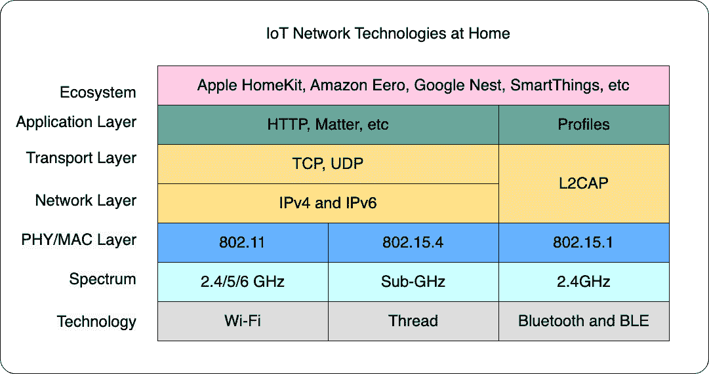
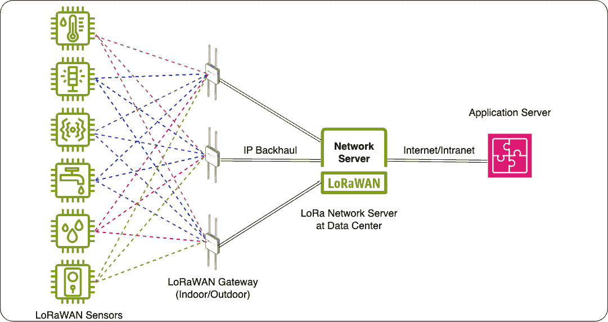
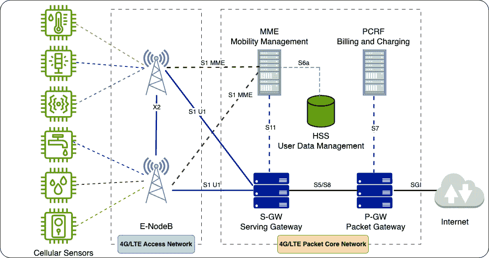
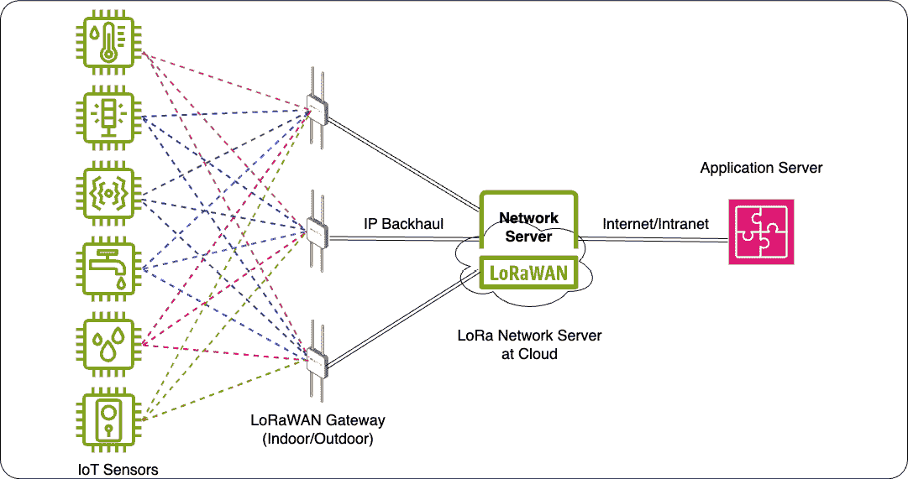

# 2

# 物联网网络，事物的神经网络

物联网网络通常由物联网终端设备、无线连接（在大多数情况下）和后端云平台组成。它像人体的神经系统一样运作，由神经元细胞、神经通路和大脑组成。神经元细胞作为生物传感器，检测来自皮肤或肌肉的刺激并产生生物电信号，类似于物联网终端设备检测物体状态变化。这些生物电信号通过神经通路传播，类似于在物联网网络中通过有线/无线连接传递传感器数据。

最终，这些生物电信号会到达大脑，这个中央指挥中心，就像物联网中的云平台一样。正如大脑解释、处理和响应感官信息一样，云服务收集、存储、分析和基于从物联网终端设备接收到的数据进行决策。

在本章中，您将从考虑适当物联网网络选项的多种选择开始，针对您的目标用例。这将帮助您在不同部署位置做出明智的技术决策，无论是在家中、校园内、建筑物中、城市中，甚至在农村地区。

请注意，工业场所的物联网网络是独特的，需要专业知识。本书不会涵盖这个特定主题。然而，重要的是要认识到在工业环境中实施和设计物联网系统有其自身的挑战和考虑因素。这些可能包括网络可扩展性、服务可靠性、数据安全和与现有基础设施的集成。

本章涵盖了以下主题：

+   家庭中的物联网网络

+   校园和建筑物中的物联网网络

+   城市中的物联网网络

+   农村地区的物联网网络

# 家庭中的物联网网络

在家中设置物联网网络的最佳实践通常涉及使用**家庭 Wi-Fi**、**BLE**和**Thread**。当设计用于家庭使用的物联网应用，例如监测温度和湿度、烟雾探测器、安全摄像头和路径照明时，优先考虑简单性、经济性和用户易用性对于客户来说非常重要。因此，架构专门设计以满足居民的需求，提供友好且愉悦的用户体验。

## 家庭 Wi-Fi

**Wi-Fi**，即**无线保真**，是一种低成本无线通信技术，使设备能够通过物理电缆连接到互联网并相互通信。它符合*IEEE 802.11*标准，并使用未经授权的无线电频率波段，通常是 2.4 GHz、5 GHz 和 6 GHz（Wi-Fi 6E）。家庭 Wi-Fi 网络采用星型拓扑结构，提供了极大的简单性和易于安装。在大多数情况下，家庭 Wi-Fi 路由器可以同时服务多达 30 个 Wi-Fi 客户端设备。

家庭 Wi-Fi 允许智能手机、平板电脑、笔记本电脑、智能电视和智能家居设备连接到互联网。Wi-Fi 提供从数百 Mbps 到 Gbps 的更高吞吐量，使用户能够访问在线服务、浏览网页、流媒体播放以及使用视频监控和家庭安全应用，而无需物理电缆。通过连接到互联网，Wi-Fi 使得用户能够从世界任何地方使用智能手机、平板电脑或笔记本电脑控制和管理家中的各种智能设备。

然而，与 BLE、ZigBee 和 LoRaWAN 相比，Wi-Fi 技术在功耗方面并不友好。Wi-Fi 具有强大的传输能力和墙体穿透能力。它具有最强大的性能，但 Wi-Fi 的功耗如此之高，以至于它不适合电池供电的设备，更适合电源插座的设备。有些人可能会争论，802.11ah，也称为 Wi-Fi HaLow 的存在是为了提供低功耗的连接。然而，它专门针对不在住宅区域内的用例。

我们将在*第四章*中讨论更多关于 Wi-Fi 技术的细节。

## BLE

BLE 是一种提供低数据速率的无线技术，使其非常适合需要节能的设备。其主要目的是与电池供电的设备建立连接，包括但不限于可穿戴设备和医疗设备。

在智能家居技术的领域内，诸如亚马逊 Alexa Echo、谷歌 Home/Nest、苹果 HomePod 和苹果 TV 等设备充当了 BLE（蓝牙低功耗）中心。这些中心在家居物联网网络中扮演着至关重要的角色，使得在家庭环境中对各种智能设备实现无缝连接和控制成为可能。这些智能设备可能包括照明系统、恒温器、安全摄像头等等。

通过利用 BLE 技术，这些智能家居中心确保了设备之间可靠且高效的通信，提升了整体智能家居体验。用户可以通过语音命令或移动应用程序轻松管理和控制他们的智能设备，创造一个便捷且个性化的居住空间。

我们将在*第四章*中讨论更多关于 BLE 技术的细节。

## 线程

基于 *IEEE 802.15.4* 标准的 Thread，符合连接智能家居设备的网状网络技术，从运动传感器到门锁，为它们提供了一种更好、更高效的工作方式。在 Thread 网络中，多个设备可以作为边界路由器或网状扩展器，扩展网络的覆盖范围和可靠性。与传统星型拓扑网络不同，其中信号只返回给原始发送者，网状网络会在范围内重复并转发信号到其他设备，形成信号跳跃的特性。这允许更大的范围和可靠性，因为设备可以相互中继信号，扩展网络的覆盖范围。此外，随着更多设备的加入，网状网络会自动扩展，从而形成一个更强、更可靠的网络，能够支持越来越多的智能家居设备。

Thread 本地采用 IPv6 技术，为物联网应用提供了众多优势，例如智能家居、智能校园和智能建筑应用。它得益于成熟的网络安全，并能无缝集成到现有的网络基础设施中。与为每个应用运行在独立网络中的传统自动化系统不同，Thread 允许多个应用同时共享同一网络，即使这些应用基于不同的标准和协议。此外，每个设备都可以利用最合适的物理网络类型。Thread 的低功耗网状网络特别适合需要覆盖较大区域内的高能耗敏感设备。

值得注意的是，Thread 的应用层目前正经历着显著的发展。**Matter 协议**，之前被称为 **Project CHIP**（**通过 IP 的连接家居**），正在被采用以增强基于 Thread 的设备的功能和互操作性。Matter 旨在为智能家居设备创建一个统一的标准，确保消费者能够无缝集成和使用。

Matter 在 Thread 应用层的采用标志着智能家居技术发展中的一个重要里程碑。随着 Matter 协议的采用，制造商和开发者现在可以利用一个标准化的框架来构建与广泛智能家居生态系统兼容的 Thread 设备。这不仅简化了开发过程，还促进了行业内的创新和协作。

此外，Matter 的采用也为消费者带来了众多好处。为智能家居设备建立统一标准消除了不同品牌和平台之间的兼容性问题。消费者现在可以放心购买基于 Thread 的设备，知道它们将无缝集成到现有的智能家居设置中。这不仅增强了便利性，也鼓励了智能家居技术的广泛应用。

下图比较了堆叠差异与 Wi-Fi、Thread、蓝牙经典和低功耗。

图 2.1 – 家庭中的物联网网络堆叠

除了家庭中的物联网网络之外，另一个流行的案例是在校园和建筑物中。让我们更深入地了解它。

# 校园和建筑物中的物联网网络

在校园和建筑物中部署物联网网络的最佳实践通常包括**企业 Wi-Fi**、**Thread 网状网络**、**私有 LoRaWAN 网络**以及特定工业网络，如用于电表和街道照明的 Wi-SUN 网状网络。尽管 BLE 和 ZigBee 网状网络可能在这些位置有有限的部署，但它们并不广泛使用。本节将讨论企业 Wi-Fi、建筑物中的 Thread 和校园及建筑物中的私有 LoRaWAN 网络提供的流行物联网覆盖选项。

## 企业 Wi-Fi

校园和建筑物中的物联网应用通常使用企业级架构。这种架构考虑了室内/室外连接、安全性、可扩展性、管理和成本等因素。在这些环境中，用于物联网应用的最常见无线网络是企业 Wi-Fi。

与家庭 Wi-Fi 接入点相比，考虑和实施一个强大的安全机制至关重要，该机制允许终端设备访问企业 Wi-Fi 接入点。一旦终端设备接入企业 Wi-Fi 网络，数据将通过企业内部网络传输，这是一个私有网络。从那里，它将被转发到企业数据中心的应用平台或公共云中的平台。

校园和建筑物位置的企业 Wi-Fi 通常提供两种拓扑选项：星型和网状。

星型拓扑是一种网络配置，其中所有设备都连接到一个中心集线器，也称为 Wi-Fi 接入点。这个集线器作为数据流量路由的主要接入点。星型拓扑以其简单的设计和易于管理而闻名。当设备需要与互联网通信时，它会将数据发送到中心集线器，然后由集线器将其转发到目标位置。这种直接的设置使得故障排除和维护更加容易。星型拓扑非常适合那些优先考虑简单性和易于管理的中小企业和商业场所，例如小型办公室、餐厅和单交换机连接所有 Wi-Fi 客户端设备的商户特许经营店。

Wi-Fi 网状网络是一种由多个 Wi-Fi 接入点作为一个统一整体运作的网络。它非常适合大型校园和建筑地点。协调一致的 Wi-Fi 接入点被战略性地放置在整个校园、建筑或更大的区域内，以提供对同一无线网络的访问。根据制造商和选择的技术，这些接入点中的一个可能作为主设备，通常被称为控制器，或者它们都可以被视为同等重要。

大多数 Wi-Fi 网状网络具有以下特点：

+   **单个 SSID**：此功能允许使用单个网络名称和密码。Wi-Fi 客户端设备可以在网状网络中自动漫游，无需额外的 SSID 配置。

+   **客户端引导**：连接到网络的 Wi-Fi 客户端设备会自动与周围最佳无线电质量的接入点关联。

+   **频段引导**：网络还会确定在任意给定时间提供最佳性能的每个客户端的最佳频率带。

+   **自愈**：如果 Wi-Fi 接入点暂时或永久不可用，网络将自动重新路由流量以避免问题。

网状拓扑在网络连接性方面非常可靠且冗余。在链路或接入点故障的情况下，数据可以通过替代路径重新路由，确保连接不间断。然而，这种优势伴随着增加的复杂性和布线需求。

**企业级 WPA2**，也称为 **WPA2-ENT**，于 2004 年推出，至今仍被广泛认为是无线网络安全的标准。它提供空中加密和更高的安全级别。当与称为 802.1X 的有效身份验证协议结合使用时，用户可以获得授权和身份验证，以安全访问网络。部署 WPA2-ENT 需要一个 RADIUS 服务器，该服务器负责处理认证网络用户访问的任务。认证过程基于 802.1X 政策，并使用各种标记为 EAP 的系统。通过在连接之前认证每个设备，可以在设备和网络之间有效地建立一个个人、加密的隧道。

## Thread 网状

在最后一节中将解释 Thread 家庭的概念。强调的是，为了将 Thread 网络扩展到智能建筑，以及使用 Thread 边界路由器和电池供电设备，通常有必要纳入 **Thread 网状扩展器 (TME) 设备** 的实施。这一增加确保了网络的可扩展部署，使整个建筑基础设施实现无缝连接和性能提升。

作为一种网状网络，Thread 使设备不仅能接收数据，还能积极参与将数据路由到其他设备，这些设备被称为 TME 设备。Thread 的这种独特功能创建了一个高度稳健和高效的网络基础设施。TMEs，正如其名所示，是始终开启的 Thread 设备，通过作为其他设备之间消息的路由器来扩展 Thread 网络的范围和链路质量，例如电池供电的传感器。通过允许设备充当中继，网络扩展了其覆盖范围，而无需额外的中继器或扩展器。因此，Thread 提供了一个稳定且可靠的网络，具有广泛的覆盖范围，确保网络内所有设备的无缝连接。

## 私有 LoRaWAN 网络

除了 Wi-Fi 之外，还有一种名为 LoRaWAN 的无线技术，可用于校园和建筑物中的物联网应用。LoRaWAN 是专门为低数据速率、长距离连接和低功耗设计的。它特别适合需要长距离覆盖和低功耗的应用。使用 LoRaWAN，物联网设备可以部署在大型区域，如校园和建筑物，而无需频繁更换电池或复杂的基础设施设置。

LoRaWAN 终端设备通过称为 **工业、科学和医疗**（**ISM**）频段的非授权无线电频谱与单个或多个 LoRaWAN 网关进行长距离通信。与在 2.4 GHz 和 5 GHz ISM 频段运行的 Wi-Fi 不同，LoRaWAN 通常在 Sub-GHz 频段运行。在欧洲，它使用 868 MHz 频率，而在美国，它使用 915 MHz。这个 Sub-GHz 频段比 Wi-Fi 具有更好的穿透性和传播能力，使其特别适合在建筑物内部提供覆盖。

LoRaWAN 的架构独特。在 LoRaWAN 网关之后，数据首先到达 LoRaWAN 网络服务器。网络服务器负责设备管理、有效载荷加密和应用程序 API。

以下是在校园和建筑物中使用的标准 LoRaWAN 网络图，包括开阔场户外和室内覆盖：

图 2.2 – LoRaWAN 私有网络

在这些地点实施的 LoRaWAN 网络采用松散耦合的星形拓扑。与企业 Wi-Fi 不同，LoRaWAN 端点不会与专用 LoRaWAN 网关建立预定义的关联。相反，从 LoRaWAN 端点（也称为上行链路消息）发送的数据可以由邻近区域中的多个 LoRaWAN 网关接收。然而，返回的数据（称为 **下行链路消息**）将从信号质量最佳的 LoRaWAN 网关发送到端点。LoRaWAN 网关通常安装在室内墙壁或天花板上，以及室外照明柱上。

私有 LoRaWAN 网络是一个整个基础设施由物联网应用提供商部署和托管的模式。在这个模式中，物联网应用提供商负责自行安装 LoRaWAN 网关，确保其物联网设备之间无缝且高效的网络连接。使用私有 LoRaWAN 网络，物联网应用提供商对网络操作拥有完全控制权，可以根据他们的具体需求和需求进行定制。这允许在管理和监控连接设备时具有更大的灵活性和定制性，确保最佳性能和安全。

## 没有一种适合所有情况的方案

当涉及到物联网应用时，重要的是要理解 Wi-Fi、Thread 和 LoRaWAN 并不是可以互换的选项。每种无线技术都有其自身的优势和考虑因素。

对于需要高吞吐量的物联网应用，如监控摄像头，Wi-Fi 是一个明智的选择。它提供快速且可靠的连接，但确实需要外部电源供应。

另一方面，Thread 和 LoRaWAN 是专门为优先考虑低功耗的使用案例设计的。虽然它们的吞吐量可能低于 Wi-Fi，但配备 Thread 和 LoRaWAN 无线电的设备通常可以在电池上运行数年。这使得它们非常适合烟雾探测器、水泄漏探测器、安全传感器，以及温度和湿度传感器等设备。

校园和建筑物中的物联网网络可以很容易地由企业客户自行构建和托管。将物联网网络扩展到覆盖整个城市需要无缝的移动性和更高的可用性，以服务于多个客户和多样化的应用，这将增加复杂性。

# 城市中的物联网网络

城市中物联网的应用可以被视为一个大规模的复杂系统。这个系统由不同的部分和技术组成，它们共同工作以创建一个高效且无缝的系统。在实施城市物联网时，主要挑战之一是确保有良好的无线网络覆盖。这对于物联网设备正常工作和交换数据至关重要。在城市建设物联网网络的最佳实践通常是使用移动网络（如 4G/LTE 和 5G）以及来自公共物联网服务提供商的公共 LoRaWAN 网络。这些技术提供广泛的覆盖范围，可以深入到建筑物内部，这使得它们非常适合城市中的物联网解决方案。

## 移动网络

4G/LTE 和 5G 网络使用服务提供商（SPs）的蜂窝覆盖来为从 LTE-M 和 NB-IoT 的物联网设备提供可靠的连接，这些设备具有低功耗和低数据速率（LPWAN），以及**高级 LTE**（**LTE-A**）和 5G**增强型移动宽带**（**eMBB**）等高数据速率技术。这些网络已经建立并广泛可用，使它们成为各种物联网部署的热门选择。该网络上的物联网设备需要一个蜂窝调制解调器和 SIM/eSIM 芯片。这些设备与 eNodeB 通信，eNodeB 是蜂窝网络的基础站。然后数据从 eNodeB 发送到服务提供商的分组核心网络，最终到达数据平台，该平台可以位于数据中心或云中。

蜂窝接入网络通常具有星型拓扑。服务提供商（SPs）在蜂窝塔和城市建筑屋顶上安装 eNodeB 站点。这些战略性地放置的 eNodeB 站点对于与具有蜂窝调制解调器和 SIM 卡或 eSIM 芯片组的终端设备进行通信至关重要。

以下是一个 4G/LTE 网络的标准架构：

图 2.3 – 4G/LTE 网络

## 公共 LoRaWAN 网络

LoRaWAN 使用未经授权的频谱，使其成为一种无线电资源共享网络。与为每个终端设备分配专用空中资源的蜂窝网络不同，LoRaWAN 旨在基于尽力而为的基础上支持使用案例。因此，它可能不适合所有物联网应用，尤其是那些至关重要的应用。城市中 LoRaWAN 网络的拓扑结构与在校园和建筑物中部署的拓扑结构相同，它是一个松散耦合的星型拓扑。在这个拓扑中，有一个称为 LoRaWAN 网关的中心枢纽，它作为终端设备和网络服务器之间的桥梁。LoRaWAN 网关可以安装在城市的各种位置。它可以安装在城市的建筑屋顶上，提供广泛的覆盖范围和清晰的通信视线。另一种选择是将它安装在电力电杆上，战略性地放置以实现最佳信号传输。最后，LoRaWAN 网关还可以安装在路灯杆上，利用现有基础设施来扩展网络覆盖范围。

当考虑一个网络如何处理大量用户、保持可用性和可靠性时，公共 LoRaWAN 网络通常使用基于云的 LoRaWAN 网络服务器。这个基于云的服务器可以轻松扩展并适应处理更多用户和更高的需求。

以下是基于云的 LoRaWAN 网络图：

图 2.4 – 基于云的公共 LoRaWAN 网络

AWS IoT Core for LoRaWAN（[https://aws.amazon.com/iot-core/](https://aws.amazon.com/iot-core/））是一个完全托管的 LoRaWAN 网络服务器。它允许你使用 LoRaWAN 连接通过 AWS 云连接和管理 LoRaWAN 设备。通过 AWS IoT Core for LoRaWAN，客户可以通过将许多 LoRaWAN 设备和网关连接到 AWS 云来建立他们的 LoRaWAN 网络，而无需自己开发或运营 LoRaWAN 网络服务器。这消除了管理网络服务器的负担，并使大规模的 LoRaWAN 设备车队易于连接和安全。

通过利用 LoRaWAN 的长距离和室内广泛覆盖，AWS IoT Core for LoRaWAN 帮助客户加快物联网应用的开发。这是通过利用从连接的 LoRaWAN 设备通过 AWS 服务生成数据来实现的。

城市的物联网网络可以利用 4G/LTE 蜂窝网络或其他公共托管无线基础设施，如 LoRaWAN。在乡村地区，任何公共覆盖很少能到达那里；这是一个重大挑战，但仍有机会。

# 乡村地区的物联网网络

这些空间，如农业、油田、采矿场、森林、国家公园、山脉、海岸线和海上区域，通常没有蜂窝网络覆盖。针对这些区域的物联网应用必须克服无线连接的挑战。在乡村地区，除了蜂窝网络外，访问物联网网络的最佳实践是**私有 LoRaWAN**网络和 LEO 网络。

## 私有 LoRaWAN 网络

除了在校园和建筑物中部署 LoRaWAN 网络外，在乡村地区建立私有 LoRaWAN 网络也是一个可靠且经济实惠的选择。由于其长距离能力和低功耗，LoRaWAN 非常适合各种物联网应用。在这种情况下，物联网应用提供商可以在提供服务的地方创建自己的私有 LoRaWAN 覆盖。这种模式使他们能够完全控制网络，并确保其物联网设备的可靠连接。

通过建立私有 LoRaWAN 网络，物联网应用提供商可以克服依赖外部 SP 的限制，并确保其设备的无缝连接。他们可以根据自己的具体需求定制网络，确保最大覆盖率和性能。

## LEO 网络

对于在乡村地区为物联网应用获取无线连接的另一个好选择是使用由 LEO 卫星提供的无线宽带网络，例如 Starlink。采用这种方法，你只需在指定位置设置一个 Starlink 终端。这个终端充当网关，为你提供一个可靠的 Wi-Fi 热点，以便连接你的物联网设备。

使用低地球轨道（LEO）卫星有助于克服传统蜂窝网络或本地基础设施在物联网部署中的局限性。Starlink 终端通过将您的物联网设备连接到卫星网络，使它们能够无缝地跨越长距离进行通信，发挥着重要作用。这种解决方案在蜂窝覆盖有限或不可用的人迹罕至地区尤其有用。

# 摘要

在本章中，我们探索了物联网网络的广泛世界。我们看到了它们在不同环境中的应用：使我们的家庭更加便利，提高校园和建筑物的效率，推动城市创新，以及改善农村地区。

随着我们进入下一章，我们将关注点从整个网络转移到单个元素：终端设备。在本章中，我们将仔细研究构成物联网网络基石的不同类型设备。我们将研究这些设备的硬件架构，特别关注微控制器（MCUs），它们就像是这些设备的“大脑”。我们还将讨论允许设备与其周围环境交互的外设和接口，以及使环境响应和交互的传感器和执行器。
