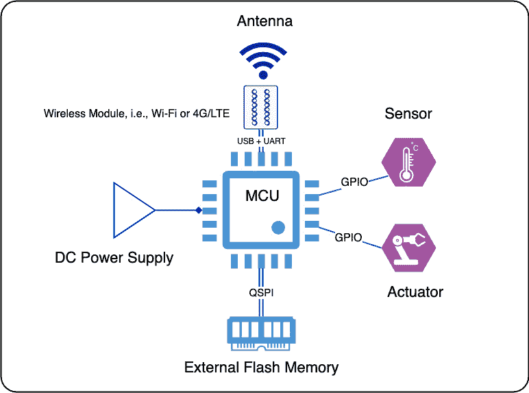
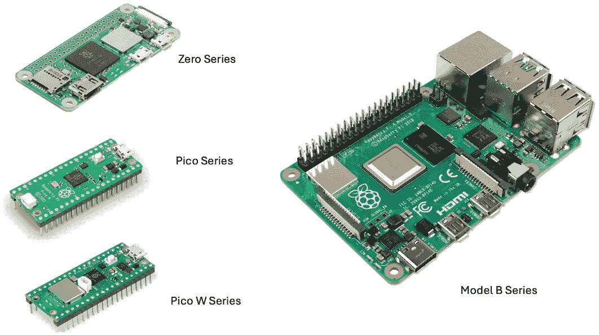
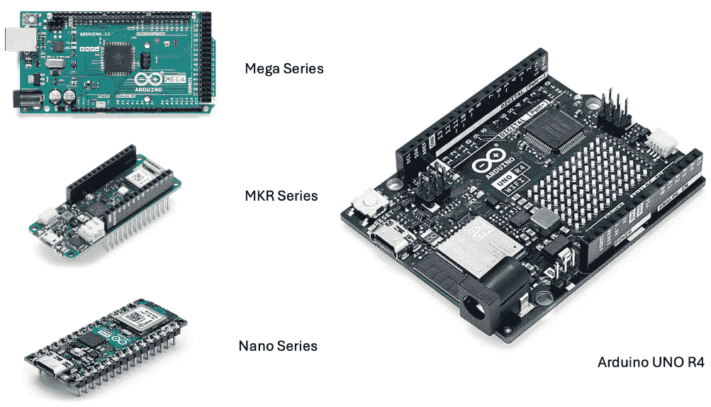
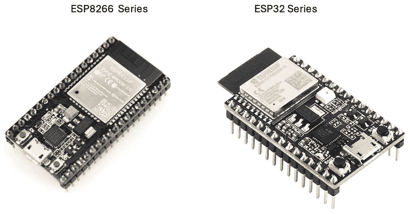

# 3

# 物联网终端设备，物联网系统的神经元细胞

正如神经元是人类神经系统的基本构建块一样，物联网网络的基本组件是物联网终端设备。这些设备，就像神经细胞的传感功能一样，被设计用来监控周围环境，报告变化，并执行动作。

在本章中，你将了解物联网终端设备在物联网应用中的关键作用。这些设备检测、捕获、测量并向后端云平台报告目标对象的状况或数据变化。它们还可以根据从后端接收到的命令对这些对象执行操作。

为了让你全面了解物联网终端设备的函数和设计，我们将从多个角度进行讨论。这包括物联网终端设备类型的常见类别，以及它们的硬件架构、微控制器（MCUs）、外围设备、输入输出接口，以及在物联网应用中常用的传感器和执行器。

到本章结束时，你将全面了解物联网终端设备设计所需的基本知识。你还将具备创建符合特定用例要求的硬件原型的必要技能，使你能够有效地实施你的第一个物联网解决方案。

本章涵盖了以下主题：

+   设备类型

+   硬件架构

+   微控制器（MCUs）

+   外围设备和接口

+   传感器和执行器

# 设备类型

市场上可供选择的物联网设备种类繁多。由于它们的多样功能和用途，对这些设备进行分类可能具有挑战性。这些设备被设计来支持不同的应用需求和需求。本节旨在根据流行的区分标准对设备进行分类，帮助初学者更好地理解。在构建自己的物联网创新时，认识到这些区别至关重要，因为这些是普遍存在的，不应被忽视。

## 室内与室外安装

物联网终端设备可以安装在室内或室外。室内安装包括家庭、建筑、公共设施和工业工厂。室外安装包括在校园开阔地、城市开放空间、郊区、农村农田、森林、山区和荒地进行的安装。物联网终端设备的部署位置应根据其应用仔细选择。需要考虑的因素包括芯片组选择、机械外壳设计、操作温度和湿度范围以及设备安装选项。

当在住宅空间安装物联网设备，如家庭、公寓、酒店和教室时，这些被称为消费级设备，您不需要防水或严格的防尘设计。轻便耐用的塑料外壳通常就足够了。设备可以在 0°C 到 40°C（32°F 到 104°F）的温度范围内以及 5%到 95%的湿度水平下工作。还有其他室内环境，如办公室或仓库，那里的设备被称为商用级产品。在这些地方，设备需要在-20°C 到 70°C（-4°F 到 158°F）的温度范围内工作。您可以通过以下三种方式在室内安装物联网设备：墙上、天花板上或粘贴。

当物联网设备设计用于户外使用，如开阔场地、市区街道或乡村地区时，它们通常被称为**户外级设备**。这些设备的硬件设计要求比室内设备更严格。户外设备必须具有比室内设备更宽的运行温度范围，通常从-40°C 到+85°C（-40°F 到 185°F）。

为了承受恶劣的户外条件，户外设备必须考虑其外壳的**防护等级**（**IP 等级**）等额外因素。

| 通常，产品遵守的 IP 等级由两位数字表示，作为给定条件。我们将在下表中了解更多信息。**第一位数字** | **机械防护** | **第二位** **数字** | **防水** **等级** |
| --- | --- | --- | --- |
| 0 | 无防护 | 0 | 无防护 |
| 1 | 防护于直径超过 50mm 的固体物体，如手 | 1 | 防护于垂直落下的水滴，如冷凝水 |
| 2 | 防护于直径超过 12mm 的固体物体，如手指 | 2 | 防护于垂直方向 15°以内的直接喷水 |
| 3 | 防护于直径超过 2.5mm 的固体物体，如工具和电线 | 3 | 防护于垂直方向 60°以内的直接喷水 |
| 4 | 防护于直径超过 1mm 的固体物体，如电线、钉子等 | 4 | 防护于来自所有方向的水溅，允许有限量的进入 |
| 5 | 防护于有限量的灰尘进入，无害沉积物 | 5 | 防护于来自所有方向的低压力水射流，允许有限量的进入 |
| 6 | 完全防护于灰尘 | 6 | 防护于强水射流，如船甲板上的水，允许有限量的进入 |
| N/a | N/a | 7 | 防护于 15cm 到 1m 之间的临时浸没效果；测试时间为 30 分钟 |
| N/a | N/a | 8 | 防护于在压力下的长时间浸没 |

表 3.1 – IP 等级定义

在某些开阔场地位置，如高海拔地区和沿海地区，除了 IP 等级外，还需要 UV 抗性和防盐雾外壳。

这些户外设备还提供了多种安装方式，例如安装在照明杆上、连接到电缆上、安装在屋顶上或安装在塔上。当在户外安装这些设备时，重要的是要记住，安装选项可能需要具备抗风能力。

## 通过外部电源供电与使用电池供电

物联网设备可以通过外部电源或电池运行，这使得它们既适合室内使用也适合户外使用。像监控摄像头、无线扬声器和街灯这样的设备通常需要高功耗，并且通常通过外部电源供电。这种电源可以通过交流/直流电源适配器或转换器提供。

虽然这些设备更复杂且成本更高，但它们提供了诸如连续服务、高可靠性和低延迟等优势。它们还支持**边缘计算**，由于其强大的计算能力和快速的内存访问，因此需要更多的电力。

对于外部电源供电的设备，由于功耗不是主要问题，它们可以利用高速有线连接（以太网、同轴电缆或光纤）或高吞吐量无线连接（Wi-Fi、LTE CAT-4 或更高版本，甚至 5G）。

电池供电的设备正在迅速发展，并为它们预期的用途提供了显著的好处。它们是便携的，可以自由移动，这使得它们非常适合可以容忍低数据速率、服务中断和延迟的物联网应用。

这些设备通常具有专为最小功耗设计的微控制器和无线模块。为了节省能源，它们通常在睡眠模式和活动模式之间切换，这种策略被称为**按需服务模式**。

这些设备使用的电池类型根据设备的需求而有所不同。例如，智能标签通常使用纽扣电池，智能家居设备可能使用碱性干电池，而户外设备通常使用可充电锂离子电池或 18650 电池。

## 有线连接与无线连接

物联网终端设备需要连接到云以发送或接收数据。这种连接可以是有线或无线的。在工业物联网设备中，例如在制造工厂或公用设施中使用的设备，传统的有线连接（如光纤、以太网、RS232/485 双绞线和对电线）仍然与无线连接一起广泛使用。另一方面，家庭、校园、建筑、城市和农村地区的物联网终端设备广泛使用无线连接。

有线或无线连接的选择取决于具体的应用需求，包括诸如移动性、漫游、可靠性、延迟、可扩展性、吞吐量和成本等因素。

对于需要高可靠性、低延迟、高吞吐量和固定安装的应用，以太网或光纤连接是最具成本效益的。这些提供稳定和安全连接，确保数据传输不间断。如果移动性和漫游是必需的，目前有几种选项可供选择，例如 LTE CAT-4 或更高版本、5G 或 Wi-Fi 6/6E/7。这些技术实现了无缝移动和不间断服务，使它们适用于需要连续通信的应用，如 AMRs、**自动导引车**（**AGVs**）和车队管理。

然而，如果你的应用不强制要求高可靠性、低延迟和高吞吐量，但优先考虑总成本、大规模可扩展性和易于部署，那么还有其他选项可以考虑。蓝牙低功耗（BLE）、LoRaWAN、窄带物联网（NB-IoT）、**LTE CAT-M**（**LTE-M**）和**LTE CAT-1**是明智的投资选择。这些技术提供低成本解决方案，具有广泛覆盖范围和低功耗，使它们适用于预算和可扩展性是主要关注点的应用。例如，蓝牙低功耗在智能家居设备中得到广泛应用。LoRaWAN 被广泛用于智能城市应用。NB-IoT 和 LTE CAT-M 用于智能计量，LTE CAT-1 用于远程资产跟踪。

## 边缘计算的需求

一些物联网应用需要其物联网终端设备支持本地边缘计算，而另一些则不需要。边缘计算是物联网设备数据和处理需求的本地区域处理和存储源，例如通过特定条件过滤预期数据、加密原始数据负载、执行协议转换、触发本地执行策略和发出警报。

在物联网终端设备上进行边缘计算带来了以下几个显著的好处：

+   **降低延迟**：通过利用边缘计算功能，物联网设备可以在本地处理和分析数据。这显著降低了设备间通信的延迟，并实现了更快的响应时间。实时数据洞察可以在边缘生成，从而提高运营效率并改善决策。

+   **提高运营效率**：边缘计算允许本地数据处理和分析。这意味着物联网设备可以在不依赖集中式网络的情况下执行过滤和汇总数据、执行协议和快速决策等任务。因此，运营效率得到提高，因为设备可以自主执行操作并实时响应事件。

+   **节省网络带宽**：通过利用边缘计算，物联网设备可以将一些数据处理任务从云端卸载。这减少了需要通过网络传输的数据量，从而提高了网络带宽利用率。它还有助于缓解网络拥堵，并确保关键数据可以高效传输。

+   **离线时继续系统运行**：边缘计算的一个关键优势是它能够离线运行。在网络连接丢失的情况下，物联网设备仍然可以正常工作并执行其指定的任务。这在需要不间断运行的场景中尤为重要，例如在工业环境或连接性有限的偏远地区。

边缘计算需要强大的微控制器，以及更大的内存和存储容量来高效地处理本地计算任务。这反过来又导致了硬件成本的增加和物联网终端设备软件复杂性的提高。

除了这四个流行的类别之外，市场中对物联网设备进行分类时还使用了许多其他标准。无论它们的类别如何，物联网设备的硬件架构通常相似，通常包括一个微控制器（MCU）、输入/输出接口、传感器和/或执行器、电源等。

# 硬件架构

物联网终端设备的硬件架构通常由一个多样化的组件集合组成，这些组件协同工作，无缝地实现其功能。这些组件，如微控制器、传感器、执行器、连接模块和电源管理模块，协作高效地从它们所监控的对象中收集数据。然后，它们处理这些捕获的数据并将其传输到云平台进行深入分析和明智的决策。这种协作努力确保了物联网终端设备在其整个生命周期中的平稳运行和有效性。

下图展示了物联网设备的典型硬件架构：

图 3.1 – 物联网设备硬件架构

这些组件包括以下内容：

+   **微控制器（MCUs）**：微控制器作为物联网设备的“大脑”，协调操作、处理数据和与外围设备和外部网络的通信。核心处理器、内存、输入/输出接口和实时时钟的集成使得具有复杂的计算能力和实时操作能力。

+   **传感器和执行器**：传感器作为设备的感官，收集环境数据或监控各种参数。这些数据成为设备进行决策和采取行动的基础。执行器根据处理后的数据或接收到的命令对环境或设备本身进行操作，产生可感知的输出或系统中的变化。

+   **连接模块**：此模块为物联网设备与外部网络（包括云平台）之间的数据交换提供必要的接口。它支持广泛的通信协议和技术，从本地网络（例如，蓝牙低功耗、ZigBee 和 Wi-Fi）到广域网络（例如，4G/LTE、5G 和 LoRaWAN），确保部署的灵活性和可扩展性。

+   **电源管理模块**：此模块确保设备高效且可靠地供电，这对于持续运行至关重要，尤其是在偏远或难以到达的地方。它集成了优化能源消耗的功能。这对于电池供电设备至关重要，可以延长其使用寿命并减少维护需求。

+   **外部闪存**：这为程序代码、数据日志和配置设置提供了额外的存储容量，使得更复杂的应用和数据保留成为可能。它增强了设备处理大量数据处理和日志记录的能力，以及在电源周期中保留关键信息的能力。

这些组件的有效组合使得物联网设备能够高效且轻松地完成任务。协同工作，它们使设备具备收集、反应、处理和通信的能力。这在智能家居、工业自动化、医疗保健和农业等各个领域都非常有用，促进了更加互联和智能的环境。

通过理解每个组件的作用和重要性，开发人员和工程师可以设计出功能有效、节能并满足特定需求和限制的物联网设备。下一节将提供有关 MCU、其外围设备和 I/O 接口、传感器和执行器的更多详细信息。*第四章*将特别关注物联网终端设备使用的无线连接。

# MCU

MCU 是嵌入式系统的基础。这些紧凑而强大的设备将核心处理器、内置内存和广泛的外围设备集成到一个芯片中。这种组合实现了高效节能、节省空间和成本效益，同时保持了强大的处理能力。

## 作用

在嵌入式系统中，MCU 作为中央处理单元。它负责执行和控制各种任务和功能。凭借其处理复杂算法和与各种外部组件接口的能力，MCU 构成了系统的骨架，促进了不同硬件和软件组件之间的无缝通信和协调。正是这种协调增强了系统的整体功能和可靠性，使 MCU 成为众多电子设备和应用中不可或缺的组件。

## 关键特性

微控制器以其目的驱动的设计而著称，提供了易于编程和定制的特性，以满足不同应用和项目的特定需求。这种多功能性允许开发者定制 MCU 的行为，优化其功能和性能。例如，专为物联网应用设计的 MCU 因其低功耗而受到赞誉，这对于依赖电池或对能源敏感的应用是必不可少的。此外，将多个组件集成到单个芯片中强调了 MCU 在嵌入式系统领域的流行。

## 关键组件

MCU 通常包括多个关键组件，如处理器、内存、外设、接口等。接下来的章节将涵盖这些信息。

### 核心处理器

+   **架构**：包括 ARM、AVR、MIPS 和 RISC-V，每个都提供独特的优势

+   **处理时钟速度**：以 MHz 或 GHz 衡量，这决定了指令执行的速率

### 内置内存

+   **随机存取存储器** (**RAM**)：用于操作过程中的临时数据存储

+   **只读存储器** (**ROM**)：存放引导加载程序和永久软件

### 外设和接口

+   **通用输入/输出** (**GPIO**)：可编程引脚，用于与传感器、执行器、LED 等设备接口

+   **专用 I/O**：提供输入和输出接口，如**通用异步收发器** (**UART**)用于串行通信、**串行外设接口** (**SPI**)和**集成电路间接口** (**I2C**)用于与其他芯片接口

+   **脉冲宽度调制** (**PWM**)：用于控制电机、LED 等

### 连接模块

+   **线缆**：包括以太网、**通用串行总线** (**USB**)、RS232/485 等

+   **无线**：涵盖 Wi-Fi、BLE、ZigBee、Thread、LoRaWAN、4G/LTE 和 5G 等

### 电源管理

+   **电压范围**：决定了所需的电源

+   **低功耗模式**：对于电池供电设备节能至关重要

### 嵌入式操作系统

+   **实时操作系统** (**RTOS**)：支持需要结构化任务管理的复杂需求；例如 FreeRTOS、Azure RTOS、VxWorks、Zephyr 等

+   **裸机操作系统**：允许对简单系统进行直接的硬件控制。

## 现成的 MCU

以下列表包含了广受欢迎的半导体供应商的商品级微控制器（MCU）产品，这些产品被广泛用于构建物联网终端设备。这些产品提供了广泛的功能和特性，是物联网行业开发人员和工程师的理想选择。让我们更详细地看看这些 MCU 系列：

+   **微芯科技 PIC 系列**：以其可靠性和多功能性而闻名，微芯科技的 PIC 系列是物联网设备制造商的热门选择。

+   **意法半导体 STM32 系列**：意法半导体的 STM32 系列因其性能和能效而备受推崇，是物联网应用的优选方案。

+   **德州仪器 C2000/C3000 系列**: 德州仪器的 C2000/C3000 系列微控制器因其实时控制能力而闻名，适用于广泛的物联网项目。

+   **Nordic nRF51/nRF52 系列**: Nordic Semiconductor 的 nRF51/nRF52 系列提供了卓越的无线连接选项，使其成为需要可靠通信的物联网设备的最佳选择。

+   **Silicon Labs 的 EFM32 Gecko 系列**: Silicon Labs 的 EFM32 Gecko 系列以其低功耗和能源效率而闻名，非常适合电池供电的物联网设备。

+   **粒子光子系列**: 粒子光子系列因其简洁易用而受到物联网开发者的青睐，为物联网应用提供无缝的云连接。

这些 MCU 系列为构建物联网终端设备提供了坚实的基础，使开发者能够为快速增长的物联网市场创造创新和高效的解决方案。

## DIY 友好型 MCU

对于刚开始物联网项目的初学者，强烈建议探索由树莓派、Arduino 系列和 ESP8266/ESP32 提供的 DIY 友好型 MCU 选项。

这些平台提供了一系列用户友好的功能和强大的生态系统，非常适合初学者沉浸于令人兴奋的物联网世界。树莓派 Pico 以其紧凑的尺寸和强大的性能而自豪。Arduino 系列提供了丰富的选项，以及直观的界面和庞大的生态系统开发者社区。基于 RISC-V 架构的 ESP8266/ESP32 使得初学者能够探索物联网开发的各个方面。

### 树莓派

树莓派是一个流行的开源硬件系列，在各种各样的物联网工程项目中得到广泛应用。其多功能性、性价比、强大的处理能力和广泛的连接选项使其成为爱好者、学生和专业人员的首选。树莓派彻底改变了 DIY 电子世界，使得创建智能家居系统、机器人项目等成为可能。无论你的经验水平如何，树莓派都提供了一个易于访问的平台来探索电子和编程。

下图展示了该系列的产品。

图 3.2 – 树莓派家族

这些系列旨在满足多样化的需求和项目规模：

+   **树莓派 5**: 这是树莓派单板计算机系列的最新迭代（四核 ARM Cortex-A76 处理器），旨在用于教育和实际应用。

+   **树莓派 4 Model B**: 该设备配备了四核 ARM Cortex-A72 处理器，以其性能、连接性和性价比的平衡而著称。对于那些需要功能齐全的计算机进行编码、内容创作或通用用途的人来说，它是一个理想的选择。

+   **树莓派 Zero**: 该设备内置单核 ARM11 处理器（BCM2835），注重紧凑性和效率。它非常适合空间受限的项目和应用，在这些项目中，最小化功耗非常重要。

+   **树莓派 Pico**: 该设备基于双核 ARM Cortex-M0+处理器构建，为嵌入式系统、物联网设备和原型设计提供了一种经济实惠的解决方案。

+   **树莓派 Pico W**: 该设备在 Pico 上引入了 Wi-Fi 和 BLE 连接。

你可以在[`www.raspberrypi.com/`](https://www.raspberrypi.com/)找到更多详细信息。

### Arduino

Arduino 是一个广泛采用的开源硬件平台，因其物联网终端设备开发而受到欢迎。Arduino 随着时间的推移而改变和成长，产生了多种类型，如经典、Nano、MKR 和 Mega。每种类型都有其独特的功能。正因为如此，Arduino 现在是一个灵活且强大的物联网开发平台，以及更多。无论你是新手还是经验丰富，都肯定有一款 Arduino 板能满足你的需求，帮助你将想法变为现实。

下图展示了该产品系列在其家族中的情况。

图 3.3 – Arduino 家族

这些系列旨在满足多样化的需求和各种项目规模：

+   **Arduino 经典系列**: 该系列包括流行的 Arduino UNO，它配备 ATmega328P 核心处理器（单核 8 位 AVR），以及其他经典型号，如 Leonardo 和 Micro。它是 Arduino 项目的基线选项。

+   **Arduino Mega 系列**: 这是一系列专为需要大量计算能力和许多 GPIO 引脚的项目设计的板子。Arduino Mega 2560 型号配备了 ATmega2560 核心处理器，一个 8 位 AVR，而 Arduino Due 则采用 Atmel SAM3X8E ARM Cortex-M3 CPU 构建，一个 32 位 ARM Cortex。

+   **Arduino Nano 系列**: 这是一个适合物联网项目的小型板子集合。该系列包括基本的 Nano（ATmega328P，8 位 AVR）、Nano Every（ATmega4809，8 位 AVR）、Nano 33 IoT（32 位 ARM Cortex）、Nano 33 BLE、Nano 33 BLE Sense（32 位 ARM Cortex）和 Nano RP2040（双核 ARM Cortex M0+）。这些板子配备了蓝牙和 Wi-Fi 模块，以及内置传感器，如温度、湿度、压力、手势和麦克风传感器。

+   **Arduino MKR 系列**: 这是一系列板子、屏蔽和载体，可以组合起来创建令人惊叹的项目，而无需额外的电路。除了 MKR Zero 外，每个板子都配备了一个无线电模块，这使 Wi-Fi、蓝牙、LoRa、SigFox 和 NB-IoT 通信成为可能。MKR 系列中的所有板子都基于 32 位 ARM Cortex-M0+，一个低功耗处理器，并配备了一个加密芯片，用于安全通信。

你可以在[`www.arduino.cc/en/hardware`](https://www.arduino.cc/en/hardware)找到更多详细信息。

### ESP8266 和 ESP32

ESP8266 和 ESP32 微控制器是基于 RISC-V 架构的流行微控制器。它们以其多功能性、可靠性和广泛的功能而闻名。这些微控制器在物联网、家庭自动化和机器人等行业的关注度和采用率显著增加。

**精简指令集计算机-V** (**RISC-V**) 是一种开源的 **指令集架构** (**ISA**)，在计算机架构中越来越受欢迎。它提供了一个简单且模块化的设计，与其它复杂的架构相比，更容易理解和实现。作为开源架构，RISC-V 提供了更大的灵活性和定制选项，允许开发者根据他们的特定需求调整架构。

ESP8266 和 ESP32 是 Espressif 的产品。您可以在 [`www.espressif.com/en/products/modules`](https://www.espressif.com/en/products/modules) 找到更多详细信息。以下图显示了 ESP8266 和 ESP32 产品。

图 3.4 – ESP8266 和 ESP32 系列产品

ESP8266 和 ESP32 设计用于满足各种需求，并适应不同规模的项目：

+   **ESP8266**：这款于 2014 年推出的产品，在微控制器世界中带来了重大的变革。它使 Wi-Fi 连接变得经济实惠且易于访问，允许开发者轻松地将他们的设备连接到互联网。ESP8266 迅速获得了人气，并成为许多物联网项目的首选。

+   **ESP32**：这款产品于 2016 年发布。在 ESP8266 的成功基础上，它将前代产品的功能提升到了新的水平，不仅提供 Wi-Fi 连接，还增加了蓝牙、双核处理和更多的 GPIO 引脚。ESP32 革新了行业，使开发者能够创建更加先进和功能丰富的物联网应用。

开发者可以使用 ESP8266 和 ESP32 系列访问各种开发工具、库和资源。Espressif 开发生态系统提供了详细的文档、示例代码和教程，以帮助开发者入门并创建他们的项目。他们还可以使用带有 PlatformIO 扩展的 Arduino IDE 和 Microsoft Visual Studio Code IDE 进行开发。

下面是一个表格，概述了 ESP32 及其变种的要点规格：

| **规格** | **ESP32** | **ESP32-S2** | **ESP32-S3** | **ESP32-C3** | **ESP32-C6** | **ESP32-H2** |
| --- | --- | --- | --- | --- | --- | --- |
| **发布日期** | 2016 | 2019 | 2020 | 2020 | 2023 | 2023 |
| **处理器** | 双核 32 位 Xtensa LX6 | 单核 32 位 Xtensa LX7 | 双核 32 位 Xtensa LX7 | 单核 RISC-V 32 位 | 单核 RISC-V 32 位 | 单核 RISC-V 32 位 |
| **CPU 频率** | 240 MHz | 240 MHz | 240 MHz | 160 MHz | 160 MHz | 96 MHz |
| **Wi-Fi, 2.4GHz** | Wi-Fi 4 (802.11 b/g/n) | Wi-Fi 4 (802.11 b/g/n) | Wi-Fi 4 (802.11 b/g/n) | Wi-Fi 4 (802.11 b/g/n) | Wi-Fi 6 (802.11 ax) | 不支持 |
| **蓝牙** | 蓝牙 4.2（LE） | 不支持 | 蓝牙 5.2（LE），蓝牙网状网络 | 蓝牙 5.2（LE），蓝牙网状网络 | 蓝牙 5.3（LE），蓝牙网状网络 | 蓝牙 5.3（LE），蓝牙网状网络 |
| **802.15.4** | 无 | 无 | 无 | 无 | ZigBee 3.0，Thread 1.3 | ZigBee 3.0，Thread 1.3 |
| **片上 RAM** | 520 KB | 320 KB | 512 KB | 400 KB | 512 KB | 320 KB |
| **片上 ROM** | 448KB | 128KB | 384 KB | 384 KB | 320 KB | 128 KB |
| **可编程** **GPIO 引脚** | 34 | 43 | 38 | 22 | 22 | 19 |
| **SPI** | 4 | 4 | 4 | 3 | 2 | 3 |
| **UART 接口** | 3 | 2 | 3 | 2 | 2 | 2 |
| **I2C 接口** | 2 | 2 | 2 | 1 | 1 | 2 |
| **I2S 接口** | 2 | 1 | 2 | 1 | 1 | 2 |
| **模拟数字转换器**（**ADC**）**通道** | 18 | 20 | 20 | 5 | 7 | 5 |
| **内置温度** **传感器** | 1 | 1 | 1 | 1 | 1 | 1 |

表 3.2 – ESP32 系列的关键规格

备注

请注意，从第*第十一章*开始，我们将使用 ESP32-C3 进行实践。

微控制器将核心处理器与各种外设和接口集成到一个单一模块中。下一节将讨论通常在微控制器内部找到的常见外设和接口。

# 外设和接口

微控制器具有各种外设和接口，包括 GPIO、SPI、I2C、UART、USB、**安全数字输入输出**（**SDIO**）、ADC、**数字模拟转换器**（**DAC**）、PWM 以及**联合测试行动小组**（**JTAG**）等。

## GPIO

来自开关的`ON`和`OFF`信号，或来自传感器的数字读数，并将它们传输到微控制器。相反，当配置为输出端口时，它可以根据微控制器的指令执行外部操作。例如，它可以闪烁 LED 或生成驱动电机的信号。

GPIO 引脚通常用于连接传感器和执行器。

## SPI

**SPI 端口**是一个广泛使用的同步串行通信总线，专门设计用于点对点、短距离和高数据速率通信，尤其是在嵌入式系统中。其主要功能是促进微控制器和外围设备（如**安全数字**（**SD**）卡、LCD 显示器、传感器和其他外围设备）之间的数据传输。

SPI 端口通常使用四根线进行数据通信。这些线如下：

+   **串行时钟**（**SCLK**）：这是由主设备提供的时钟信号。它同步主设备和从设备之间的数据传输。

+   **主从模式**（**MOSI**）：这是从主设备向从设备发送数据的线路。

+   **主从模式**（**MISO**）：这是从从设备向主设备发送数据的线路。

+   **从设备选择**（**SS**）：这是主设备用来选择和控制单个从设备的控制线路。当多个从设备连接到 SPI 总线时，每个设备都将有自己的 SS 线路。

## I2C

**I2C**是电子领域广泛使用的通信总线。它是一个多主多从、分组交换、单端和串行通信总线。I2C 总线主要用于连接低速设备，如 EEPROM、传感器和其他 MCU。它为这些设备之间提供了一种简单高效的方式进行通信。

I2C 总线允许连接多个设备，每个设备都有一个唯一的地址。这使得系统中的不同组件之间易于集成和通信。总线以主从配置运行，其中主设备启动通信并控制设备之间的数据传输。

I2C 端口通常使用两根线进行数据通信。这两根线如下：

+   **串行数据线**（**SDA**）：用于在 I2C 总线上的设备之间传输数据。

+   **串行时钟线**（**SCL**）：这是用于在 I2C 总线上同步设备之间数据传输的时钟信号。

## UART

**UART**是一种硬件组件，它促进了异步串行通信。异步通信在各方之间没有同步。这意味着发送者不需要等待接收者或经纪人来确定何时发送或不发送。

UART 通常用于 PC 和 MCU 之间的通信。它也用于 RF 无线通信、传感器（如 GPS 传感器）和旧式拨号调制解调器。

UART 端口通常需要至少两根线进行基本通信。这两根线是：

+   **发送**（**TX**）：这根线用于从 MCU 向另一个设备传输数据。

+   **接收**（**RX**）：这根线用于从另一个设备接收数据到 MCU。

对于基本的 UART 通信，这两根线是必不可少的。然而，在更复杂或特定的应用中，可能会使用额外的线进行硬件流量控制或信号目的：

+   **清除发送**（**CTS**）：用于流量控制，表示微控制器（MCU）准备接收数据。

+   **请求发送**（**RTS**）：也用于流量控制，表示 MCU 想要发送数据。

+   **地**（**GND**）：在通信设备之间通常也需要一个公共地连接。

在简单的 UART 设置中，尤其是在基本的点对点通信场景中，只需 TX 和 RX 线以及一个公共地就足够了。

## USB

**USB**端口是一种广泛使用的接口，它促进了计算机和电子设备之间的数据传输和电源供应。它具有多种用途，包括编程 MCU、启用串行通信以及连接键盘和鼠标等外围设备。USB 端口为在计算机和各种电子设备之间建立连接提供了一种方便且可靠的方法，增强了它们的功能，并实现了无缝的数据交换。

## SDIO

**SDIO**是用于微控制器和其他设备与 SD 卡和其他类型 IO 设备通信的接口。它是标准 SD 卡协议的扩展，允许设备不仅传输存储数据，还可以使用外围功能，如蓝牙、GPS 等。

## ADCs

**ADCs** 是一种电子设备，在将诸如温度传感器产生的模拟信号等转换为数字值方面发挥着至关重要的作用，这些数字值可以被微控制器（MCU）处理。

通过这样做，ADC 使微控制器能够准确解释和利用各种模拟传感器提供的信息，包括但不限于热敏电阻和电位器。这些传感器分别具有测量温度和提供可变电阻的能力，在从工业控制系统到消费电子产品的各种应用中得到了广泛的应用。ADC 执行的转换过程确保微控制器能够有效地分析和响应这些模拟输入，从而实现精确和可靠的测量、控制和决策。

## DACs

**DACs**是用于将微控制器中的数字值转换为模拟信号的电子设备。这种转换过程对于各种应用至关重要，包括生成用于音频的**模拟输出**（**AOs**）和创建平滑的波形。

通过利用 DACs，微控制器中存储的数字信息可以转换为连续和可变模拟信号。这允许准确表示音频信号，使微控制器能够产生高质量的音频输出。此外，DACs 在合成器、音乐制作和其他音频相关领域发挥着至关重要的作用。

## PWM 输出

**PWM 输出**是一种多功能特性，允许生成具有可变脉冲宽度的数字信号，这有效地模拟了模拟信号。这种功能为控制各种组件和设备开辟了广泛的可能性。

PWM 输出的一个关键应用是控制电机的速度。通过调整数字信号的脉冲宽度，可以精细调整电机的旋转速度，从而提供对其运动的精确控制。

此外，PWM 输出通常用于驱动伺服电机。通过改变数字信号的脉冲宽度，可以精确控制伺服电机轴的角位置，从而在机器人技术和自动化系统中实现精确定位。

## JTAG

JTAG 是一种用于调试和测试**集成电路**（**ICs**），包括 ESP32 等微控制器（MCUs）的标准接口。它最初是为测试印刷电路板而设计的，但后来已演变成一种广泛用于电路板内调试的工具。

## Timers

定时器是跟踪时间的一种基本工具。它们通过维持一个以预定速率递增的计数器来工作。这种功能可用于各种目的，例如以下所述：

+   监测事件或过程的持续时间

+   任务调度和协调

+   实现基于时间的动作或触发器

+   测量间隔或时间间隔

+   创建倒计时或闹钟

## 实时时钟

**实时时钟**（**RTC**）是一个设计为即使在低功耗睡眠模式下也能持续运行的外围组件，以准确跟踪时间。

RTC 提供了两个基本的时间功能：RTC 和**周期性中断定时器**（**PIT**）。RTC 跟踪当前时间和日期，而 PIT 允许设备从睡眠模式唤醒或定期中断。有了这些功能，RTC 不仅确保了准确的时间跟踪，还使设备能够有效地管理功耗并在特定时间间隔内执行任务。

这些外围设备和接口，包括各种设备和软件，正积极与各种传感器和执行器进行交互。这种交互促进了大量数据的收集，从环境因素到用户输入。此外，它还允许根据这些数据执行特定操作。这种外围设备、接口、传感器和执行器之间的复杂交互构成了我们数据驱动世界的基础，使得自动化和决策能力得到增强。现在，让我们看看另一个重要的话题。

# 传感器和执行器

在物联网的广阔领域中，终端设备配备了各种传感器和执行器，这构成了与物理世界动态交互的基石。这些组件不仅感知其环境的细微差别，而且对其产生影响，为智能和响应式的物联网应用铺平了道路。

## 传感器

物联网设备中的传感器用于捕获并发送环境数据到微控制器（MCU）。它们可以检测各种参数，如温度、湿度、光照和运动。传感器提供了有关环境的宝贵信息，有助于决策和自适应动作。

物联网设备中使用的许多传感器是**微机电系统**（**MEMS**）设备。MEMS 技术，它使得机械和机电元件能够小型化到很小的尺寸，对传感器技术产生了重大影响。通过在硅基板上将机械和机电元件与电子组件相结合，MEMS 传感器提供了许多优势。这些传感器在物联网设备和消费电子产品中得到广泛应用，因为它们体积小、功耗低且性能优异。因此，MEMS 技术彻底改变了传感器技术，使得在物联网和消费电子领域开发出更小、更高效、性能更高的设备成为可能。

这里有一些传感器的例子：

+   **温度传感器**：测量环境温度，其变体如热敏电阻和热电偶提供精确度

+   **湿度传感器**: 测量水分含量；对气候控制系统至关重要

+   **压力传感器**: 监测大气或水压；在天气预报和工业应用中至关重要

+   **接近传感器**: 使用超声波或红外技术无接触地检测附近物体

+   **光传感器**: 测量亮度，使用光电二极管或光敏电阻来调整照明或监测环境条件

+   **运动和占用传感器**: 检测运动，利用 PIR 等技术进行安全和自动化

+   **气体传感器**: 识别各种气体；对安全和环境监测至关重要

+   **空气质量传感器**: 测量空气污染物；对健康和环境质量评估至关重要

+   **声音传感器**: 监测声级，使用麦克风或压电传感器进行噪声测量或用户交互

+   **水质传感器**: 评估水质参数；在确保水质安全和质量方面至关重要

+   **陀螺仪和加速度计**: 跟踪方向和运动；在导航和运动敏感设备中不可或缺

+   **心率传感器**: 监测心脏节律；在健康和健身设备中至关重要

## 执行器

相反，执行器将来自传感器的数字数据转换为实际动作。它们是物联网设备的肌肉，使它们能够对其周围环境产生物理影响。无论是通过调节光强度、调节电机的速度还是驱动阀门，执行器都会对传感器输入或远程命令做出响应，从而营造一个响应性和适应性强的环境。

这里有一些执行器的例子：

+   **电机（直流、步进、伺服）**: 驱动机械系统，实现运动和精确控制

+   **继电器**: 作为电动开关，管理较大负载，常用于家庭自动化

+   **电磁铁**: 电磁执行器，用于锁定系统和流体控制

+   **LEDs and displays**: 提供视觉反馈或界面；用作状态指示器或信息显示

+   **蜂鸣器和扬声器**: 生成音频信号用于警报或用户交互；在报警系统中不可或缺

+   **加热器和冷却器**: 管理温度以提供舒适或设备安全

+   **泵**: 推动液体；用于自动化灌溉或智能水族馆等应用

+   **伺服机构**: 提供对位置的精确控制；在机器人和精密应用中至关重要

## 传感器上的常用引脚

将传感器与微控制器（MCU）集成涉及通过各种引脚进行接口，每个引脚都执行特定功能。正确理解和连接这些引脚对于准确收集数据和设备性能至关重要。常见的引脚定义包括以下内容：

+   **电压公共收集器**（**VCC**）：此引脚用于为传感器供电。它通常连接到电源，其电压级别必须与传感器的需求相匹配（通常是 3.3V 或 5V）。

+   **GND**：地引脚为电源和信号水平提供一个公共参考点。对于完成电路和稳定传感器操作至关重要。

+   **数据引脚**（**DATA**）：此引脚将传感器的数据传输到 MCU。数据传输的性质可能不同——可能是模拟或数字，协议可以是 I2C、SPI、UART 或专有协议。

+   **SCL 和 SDA**：这些引脚专门用于 I2C 通信。SCL 携带时钟信号，SDA 携带数据。这两条线都是双向的，允许多个传感器连接到同一个总线上。

+   **MISO、MOSI 和 SCK**：用于 SPI 通信，这些引脚促进了全双工数据传输。SCK 是时钟线，MOSI 从 MCU 向传感器发送数据，MISO 从传感器向 MCU 发送数据。

+   **TX 和 RX**：在 UART 通信中，TX 和 RX 用于串行数据传输。MCU 的 TX 连接到传感器的 RX，反之亦然。

+   **AO** 和 **数字输出**（**DO**）：一些传感器提供模拟和数字输出。AO 提供一个与测量参数成比例的可变电压水平，而 DO 提供一个二进制输出，指示参数是否高于或低于某个阈值。

+   **INT**（**中断**）：中断引脚允许传感器在不进行连续轮询的情况下通知 MCU 某些事件（如阈值跨越或数据就绪）。

例如，让我们看看 DHT11 温湿传感器的引脚排列。这是一种常用的温湿度传感器，通常具有以下引脚：

+   **VCC**：电源（3.3 至 5V）

+   **DATA**：输出温度和湿度数据

+   **GND**：地

对于 DHT11，一个 DATA 引脚以串行数字形式传输温度和湿度读数。它支持基于时序的通信方案的单线协议。MCU 必须使用特定的时序来正确读取这些数据。

## 理解传感器规格

数据表是了解传感器和执行器能做什么以及它们的限制的有价值资源。一开始可能看起来令人不知所措，但学习如何在数据表中找到有用信息是一项重要的技能。许多传感器和执行器模块被设计成可以轻松与流行的开发板（如 Arduino、Raspberry Pi 和 ESP8266/ESP32）一起使用。这些模块通常附带库和示例代码，可以帮助初学者快速入门。某些传感器可能需要校准以确保它们提供准确的读数。确保你知道如何校准你的传感器，并在你将使用传感器的相同环境中进行校准。

以下列表包含了一些对于初学者在构建创新原型之前理解传感器规格的一般性建议：

+   **灵敏度**：这表示当测量量发生变化时，传感器的输出变化有多大。灵敏度更高的传感器可以检测到测量参数的更小变化。例如，一个高灵敏度等级的温度传感器可以准确地检测到温度的微小变化，使其适用于需要精确温度监测的应用。

+   **范围**：传感器的范围指的是传感器可以准确检测的测量参数的最小和最大值。例如，一个范围广泛的压力传感器可以准确地测量低压和高压，使其适用于各种工业应用。

+   **分辨率**：这定义了传感器可以检测到的测量量的最小变化。分辨率更高的传感器可以检测到更小的变化。例如，一个高分辨率的 pH 传感器可以检测到酸度水平的微妙变化，这对于科学实验中的精确 pH 监测是有益的。

+   **准确性**：这指的是传感器的读数与实际值之间的接近程度。在考虑传感器的准确性时，还应考虑其精度（可重复性）。例如，一个高度准确的重量传感器可以提供精确的测量值，与真实重量之间的偏差最小，确保工业称重等应用中的可靠数据。

+   **响应时间**：这指的是传感器对测量量变化做出反应所需的时间。较快的响应时间意味着传感器可以准确地跟踪快速变化。例如，一个高速运动传感器可以快速检测并对快速运动做出反应，使其适用于体育追踪或安全系统等应用。

+   **功耗**：这指的是传感器在运行过程中消耗的电量。较低的功耗是理想的，因为它可以延长电池寿命并降低能源成本。例如，一个节能的光传感器可以有效地检测环境光强度的变化，同时消耗最小的电量，使其适合智能手机或智能手表等电池供电设备。

# 摘要

在本章中，我们学习了物联网系统中使用的物联网终端设备。我们讨论了它们的类型和硬件架构，以及微控制器（MCU）的重要性。我们还探讨了这些设备与其周围环境交互的重要部分和连接。此外，我们还讨论了传感器和执行器，它们收集数据并使现实世界中的动作成为可能。

随着我们进入下一章，我们将通过探索无线数据通信如何在空中工作来构建这一知识。无线连接是将单个设备连接到物联网网络，该网络可以传输数据和命令以充分利用物联网潜力。我们将详细研究包括 Wi-Fi、BLE、LTE-M 和 NB-IOT 在内的不同无线连接技术，这些技术位于 4G/LTE 和 5G 领域。
