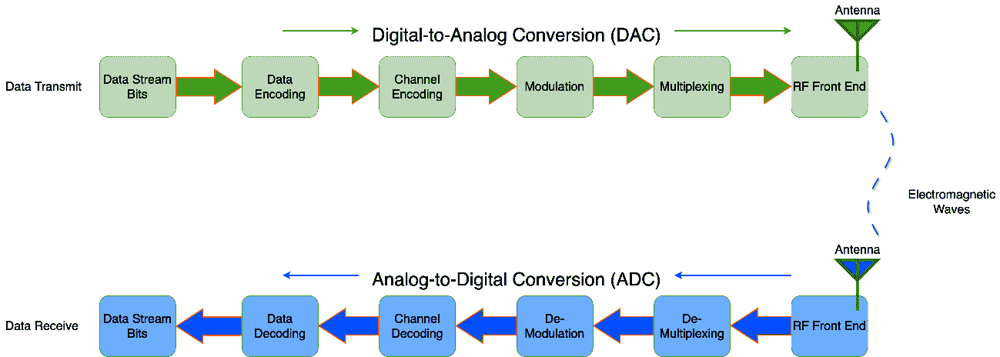
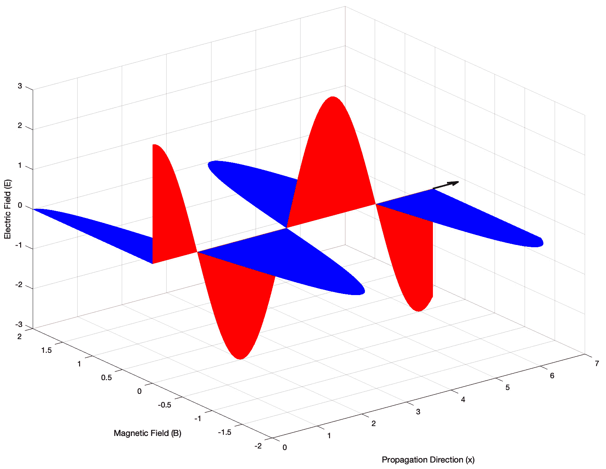
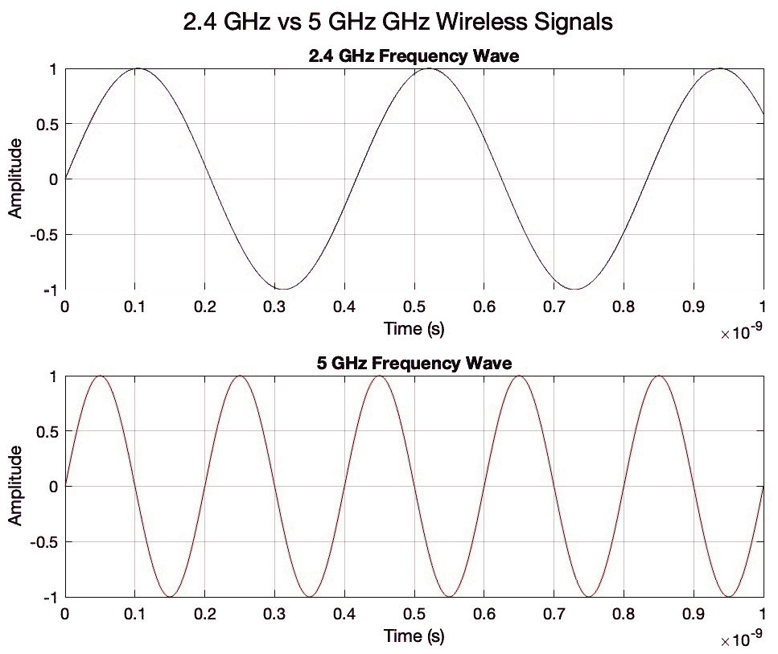
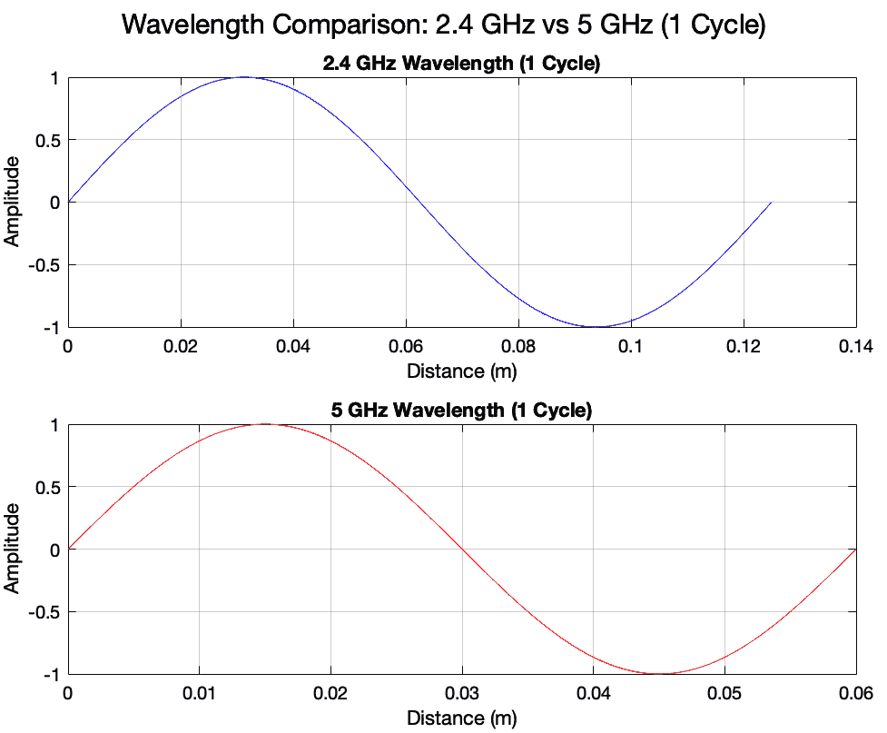

# 4

# 无线连接，物联网数据传输的神经通路

在物联网架构中，无线连接功能作为一个传导子系统，类似于人体内的神经通路，传递*生物电*信号（传感器数据或执行器命令），在神经细胞（物联网终端设备）和大脑（后端云平台）之间传输。

在本章中，你将学习构建物联网创新时初学者应了解的无线数据通信的基本知识点。这些知识将为你理解无线数据传输、接收和信号处理的复杂性提供一个坚实的基础。

通过探索 4G/LTE 和 5G 领域内流行的无线技术（如 BLE、Wi-Fi、LTE-M 和 NB-IoT）的细节，你将全面了解它们的性能和局限性。

到本章结束时，你将获得丰富的知识，这将使你能够自信地导航物联网创新背景下的无线数据通信领域。

从*第十一章*开始，在 ChatGPT 的帮助下，你将练习在 ESP32 微控制器上编写 Wi-Fi 客户端堆栈代码，通过你的家庭 Wi-Fi 网络访问互联网。

本章涵盖了以下主题：

+   无线数据通信的 10 个知识点

+   蓝牙（BLE）

+   Wi-Fi

+   4G/LTE 和 5G

# 无线数据通信的 10 个知识点

在*第二章*中，我们讨论了由蓝牙、Wi-Fi、LoRaWAN、4G/LTE、5G 和 LEO 覆盖的多种物联网网络。它们都属于无线数据通信的范畴。从物理层详细了解无线数据通信的工作方式可能具有挑战性和令人畏惧，尤其是对于那些没有强大专业背景的人来说。

然而，对于努力将物联网创新应用于商业的初学者来说，花时间掌握无线技术底层（如物理层和数据链路层）的复杂性是必要的。了解无线数据通信在实地如何工作的基础知识，对你的创新开发过程和实地试点可能有所帮助。

为了帮助你在这一旅程中，我们将涵盖 10 个关于无线数据通信的初学者应了解的重要技术事实。这些事实将成为你理解的基础，并使你能够更深入地研究这一主题。

## OSI 模型

无线数据通信技术的架构模型遵循一个广泛接受的行业标准，称为**开放系统互联**（**OSI**）模型。OSI 是一个用于理解和标准化数据通信系统功能的框架，无论是有线还是无线。OSI 模型是在 20 世纪 70 年代由**国际标准化组织**（**ISO**）开发的。它旨在有效地组织和简化数据通信的不同功能。OSI 模型将端到端的数据通信功能划分为七个层次，每个层次都有其特定的目的。下表显示了七层模型以及每一层如何对数据通信过程做出贡献：

| **层** | **功能描述** |
| --- | --- |
| 7, 应用层 | 与充当数据通信组件的软件应用程序交互。它促进了电子邮件、文件传输、网页浏览、即时消息、语音和视频电话以及视频流等服务。 |
| 6, 表示层 | 在网络所需的格式和计算机期望的格式之间转换数据。它处理数据加密和解密，以及数据压缩，例如**安全套接字层**（**SSL**）加密。 |
| 5, 会话层 | 管理应用程序之间的会话或连接。它建立、管理和终止两个或多个设备之间的连接。 |
| 4, 传输层 | 确保完整的数据传输，并通过流量控制、分段/解分段和错误控制（如**传输控制协议**（**TCP**）和**用户数据报协议**（**UDP**））来控制给定链路的可靠性。 |
| 3, 网络 | 管理设备寻址，跟踪网络中设备的地理位置，并确定移动数据的最优方式。它负责在网络边界（如**互联网协议**（**IP**）地址）之间路由和转发数据包。 |
| 2, 数据链路层 | 由两个子层组成：**逻辑链路控制**（**LLC**）和**媒体访问控制**（**MAC**）。它负责节点到节点的数据传输以及在物理层中进行错误检测和纠正，例如以太网和 Wi-Fi 中的 MAC 地址。 |
| 1, 物理层 | 处理设备之间的物理连接以及通过物理介质（如电缆、光纤或无线）传输和接收原始比特流。 |

表 4.1 – OSI 模型的 7 层

重要的是要理解，当涉及到不同的无线通信技术时，第 3 层（网络）和第 7 层（应用）之间可能没有太大的区别。然而，值得注意的是，在第 1 层（物理）和第 2 层（数据链路）的功能和特性上可能会有显著差异。这些低层的差异可以对无线通信系统的整体性能和效率产生重大影响。因此，有必要仔细分析和评估第 1 层和第 2 层，因为它们在塑造无线网络的行为和能力方面发挥着关键作用。

### 物理层

物理层在 OSI 模型中最为重要，尤其是在像 BLE、Wi-Fi 和 4G/LTE 这样的无线通信技术中。这一层负责在物理介质上发送和接收原始比特流，在无线技术中这通过电磁波完成。传输过程涉及几个关键步骤：使用 DAC 将数字比特转换为模拟信号，通过适当的调制准备这些信号以进行传输，并使用天线发送它们。在接收端，这些步骤以相反的顺序进行：天线接收电磁波或信号，然后通过解调并使用 ADC 将它们转换回数字信号。我们将在*信号处理*部分更详细地介绍这些内容。

### 数据链路层

数据链路层是数据通信过程中的一个重要部分，尤其是在无线网络中。它在 OSI 模型中位于物理层之上。这一层包含两个子层：**逻辑链路控制**（**LLC**）层和**媒体访问控制**（**MAC**）层。每个子层都有特定的功能以确保有效和可靠的通信。它处理的一些任务包括错误检测和纠正、帧同步以及控制对物理介质的访问。在无线通信中，这一层还包括信道编码/解码和交织/解交织，这对于可靠的数据传输非常重要，并且与物理层紧密合作。

中介访问的方法在不同无线技术中各不相同。例如，Wi-Fi 采用基于争用的模型，客户端之间相互竞争以访问用于数据传输的频谱。这个过程通常通过如**载波侦听多路访问与碰撞避免**（**CSMA/CA**）这样的协议进行管理。相反，在 4G/LTE 网络中，频谱的访问更加结构化，并由基站（称为 4G/LTE eNodeB）进行协调。在这种情况下，eNodeB 为每个 4G/LTE 客户端分配特定的时频资源，从而促进有组织和计划化的频谱访问，以实现高效的数据传输。

## 信号处理

无线数据通信的信号处理是一个复杂且错综的过程，涉及众多步骤。数据传输始于对要发送的信息进行编码和调制。这确保了数据被转换为适合可靠无线传输的格式。接下来，调制信号通过跳频或扩频等技术在空中传输。这有助于确保信号稳健，能够抵御干扰或噪声。一旦信号到达接收器，它就会进行解调以提取原始信息。最后，解码后的数据由接收设备处理和解释，使接收者能够访问和使用传输的信息。

以下流程图是表示无线数据通信信号处理的基本图：

图 4.1 – 无线数据通信流程

## 电磁波

根据麦克斯韦方程，无线数据以电磁波的形式在空中传播。麦克斯韦方程是经典电磁学、经典光学和电磁电路的基础。这些方程为电力生成、电动机、无线通信、透镜、雷达等技术提供了数学模型。它们解释了电荷、电流和场的变化如何产生电场和磁场。

电磁波是由两个振荡场形成的：一个电场（E）和一个磁场（B）。电场和磁场是同相振荡的，这意味着电场和磁场波形之间没有相位差，因此这些场的峰值和谷值完美对齐，导致同步振荡。其次，电场和磁场彼此垂直，它们的传播方向也是如此，彼此形成 90°的角度。

以下是对空中电磁波的 3D 视图：

图 4.2 – 空中的电磁波

重要的是要知道声波和电磁波是不同的。声波，也称为声波，是在空气或水等介质中的粒子振动时产生的。电磁波是在电场和磁场相互作用时产生的，并且它们不需要介质来传播。

在我们的日常生活中，阳光由自然电磁波组成。除了众所周知的无线通信技术，如 Wi-Fi、蓝牙和蜂窝网络之外，电磁波还用于无线电和电视广播、微波炉、遥控器、GPS、军事和民用雷达系统、家用照明灯和医疗 X 射线等多种应用。

## 频率和波长

频率和波长在确定电磁波如何传播和与环境相互作用方面起着至关重要的作用。理解频率与波长之间的关系对于理解无线信号的传输、接收和处理至关重要。

### 频率

频率是一个单位，用于衡量在给定时间内相同波（无论电磁波还是声波）重复的频率，通常以每秒周期数或**赫兹**（**Hz**）表示。人耳能听到的声波频率范围大约是 20 Hz 到 20,000 Hz（20 kHz）。允许 Wi-Fi 使用的频率是 2.4GHz、5GHz 和 6GHz（Wi-Fi 6E）。

下面的图显示了 2.4 GHz 与 5 GHz 在-1 纳秒（**10^-9**秒）周期内的频率波形：

图 4.3 – 2.4 GHz 与 5 GHz 的频率波形

### 波长

波长是波中连续峰值（或任何相同点）之间的距离，以**米**（**m**）为单位。电磁波中频率与波长的关系是反比的，并由一个简单的方程式控制：

**光速 = 频率 × 波长**

在这里，光速（在真空中）大约是 3 × 10⁸ **米每秒**（**m/s**）。

从这个方程式中，你可以看出，随着频率的增加，波长减小，反之亦然。波的频率越高，其波长越短。

例如，可见光在波长上从 400 到 700 **纳米**（**nm**）不等。从频率的角度来看，这相当于大约 430 **太赫兹**（**THz**）到 750 THz。蜂窝网络中的 5G **毫米波**（**mmWave**）指的是 24 GHz 到 100 GHz 的频率范围，对应的波长在 1 毫米到 10 毫米之间。

下面的波长图表显示了 2.4 GHz 与 5GHz 在 1 周期时的对比：

图 4.4 – 2.4 GHz 与 5 GHz 的波长

### 频率分配

通常，一个国家的监管机构管理的频率分配用于各种目的，包括军事和民用。

**军事频率**：

+   军事用途分配的频率通常被指定用于国防和国家安全目的

+   这些可能包括军事通信、导航、雷达和其他专业军事应用

+   由于安全原因，分配给军事用途的具体频率通常不会公开披露

**民用频率**：

+   民用频率是指分配给非军事用途的频率。这个广泛的类别包括各种商业、私人和国有用途。

+   例子包括商业广播（广播和电视）、蜂窝网络（如 4G/LTE 和 5G）、Wi-Fi、卫星通信、紧急服务、航空通信等。

+   这些频率的分配通常由国家监管机构（如美国的联邦通信委员会）管理，并且通常公开。

用于物联网应用的无线频谱属于民用频率。

### 频谱监管

一个国家的电磁波频谱涵盖了从最低到最高的所有频率范围，这些频率被分配给各种用途，包括民用、军事、科学和工业应用。它包括所有由国家或地区当局合法批准和监管的频率。例如，**国际电信联盟**（**ITU**）在协调全球频谱分配方面发挥着关键作用，这涉及到为各种地面或太空无线电通信服务分配特定频段的标准，以防止国际干扰。在美国，**联邦通信委员会**（**FCC**）负责监管无线电、电视、有线、卫星和有线电视通信。同样，**欧洲电信标准研究院**（**ETSI**）负责欧洲国家的信息和通信技术标准化。

在频谱的民用使用中，通常有两种类别：**授权频谱**和**非授权频谱**。让我们更详细地了解一下：

+   **授权频谱**要求实体从国家或地区当局获得使用许可。这种频谱通常指定用于公共和全国性服务，例如蜂窝网络（如 4G/LTE 和 5G）、广播无线电和电视，在这些服务中，可靠且无干扰的通信至关重要。任何在授权频谱内传输信号的设备都必须从国家监管机构，如美国的 FCC，获得许可。

+   **非授权频谱**指的是不需要政府许可即可使用的无线电频率，但在此频段内运行的设备必须遵循某些技术标准，以最小化干扰并有效利用频谱。ISM 频段是非授权频谱的一个特定部分，最初是为非电信目的而预留的，例如工业、科学和医疗用途。ISM 频段现在被各种无线技术广泛使用，包括 Wi-Fi（在 2.4 GHz、5 GHz 和 6 GHz）、蓝牙、ZigBee 和 Thread（所有在 2.4 GHz），以及 LoRaWAN 和 Wireless Hart（通常在 433 MHz、868 MHz 和 915 MHz）。

### 频谱带宽

频谱带宽指的是通信信道或信号在电磁频谱中占据的频率宽度或范围。它是电信和无线通信中的一个基本概念，表明信道携带信息的能力。

例如，工作在 2.4 GHz 频率的 Wi-Fi 覆盖了从 2.4 GHz 到 2.4835 GHz 的频率范围。这个范围也被称为总信道带宽，大约为 83.5 MHz。工作在 5 GHz 频段的 Wi-Fi 覆盖范围从 5.150 GHz 到 5.850 GHz，提供了超过 600 MHz 的频谱带宽。请注意，由于不同的监管环境，确切的频率界限可能因地区而异。

### 信道带宽

信道带宽是分配给每个通信信道的频率范围，以 Hz 为单位。它表示信道内最高频率和最低频率之间的差异。例如，根据**电气和电子工程师协会**（**IEEE**）802.11 b/g/n 标准，工作在 2.4 GHz 频段的 Wi-Fi 从 2.4 GHz 到 2.4835 GHz，提供了大约 83.5 MHz 的总带宽。在此频谱内，标准定义了 11 个重叠的信道（在大多数国家），每个信道的带宽为 20 MHz。

## dB, dBm, 和 dBi

**分贝**（**dB**）、**分贝毫瓦**（**dBm**）和**分贝全向**（**dBi**）是无线通信中重要的功率单位，每个单位都服务于特定的目的。dB 用于相对功率水平，dBm 用于绝对功率水平，dBi 用于天线增益。对这些术语的清晰理解对于从事无线系统和网络工作的专业人士至关重要：

+   **dB**：

    +   **定义**：表示两个值之间比率的相对度量单位。它是一个对数单位，用于描述值的变化（如功率或强度）。

    +   **用法**：dB 用于表示信号中的增益、损耗和相对水平。它是无单位的，因为它描述的是一个比率。

    +   **示例**：说一个放大器提供 10 dB 的增益意味着它将输入信号的功率水平增加了与 10 dB 相对应的倍数。

+   **dBm**：

    +   **定义**：以 1 **毫瓦**（**mW**）为参考的绝对功率分贝单位。

    +   **用法**：dBm 用于定义一个绝对尺度上的功率水平。它在无线通信中被广泛用于表示发射机输出功率、接收机灵敏度等。

    +   **示例**：0 dBm 的功率水平对应于 1 mW。功率水平为-10 dBm 的信号比功率水平为 0 dBm 的信号弱。

+   **dBi**：

    +   **定义**：天线增益的度量。它比较天线辐射的功率与一个假想的全向天线辐射的功率，该天线在所有方向上均匀分布能量。

    +   **用法**：dBi 用于表示天线相对于全向天线在特定方向上有效地定向或聚焦能量的程度。

    +   **示例**：增益为 3 dBi 的天线意味着它可以在特定方向上比全向天线聚焦信号功率高 3 dB。

让我们看看关键的区别：

+   **dB 与 dBm 的比较**: dB 是一个没有参考绝对刻度的相对度量（比率），而 dBm 是一个相对于特定功率水平（1 mW；当你说 0 dBm 时，意味着功率水平等于 1 mW）的绝对度量。

+   **dBm 与 dBi 的比较**: dBm 测量功率水平，而 dBi 测量天线增益。dBm 关于信号的强度，而 dBi 关于天线在特定方向上传输或接收信号的有效性。

### 传输功率

传输功率，通常被称为发射机功率或 TX 功率，是无线通信中的一个关键概念。它指的是无线电发射机在发送信号时使用的电功率。传输功率通常以**瓦特**（**W**）或更常见地以 mW 来衡量，有时它以相对于毫瓦（dBm）的分贝表示。例如，1 mW 的传输功率相当于 0 dBm。

在不同的无线频段和应用中，对传输功率的使用有国家或地区性的监管限制。这些限制由美国联邦通信委员会（FCC）和欧洲电信标准协会（ETSI）等组织设定，以避免与其他无线服务的干扰，并最小化与电磁暴露相关的健康风险。

**有效全向辐射功率**（**ERP**）和**有效全向辐射功率**（**EIRP**）是无线通信领域的重要概念，尤其是在讨论发射机（TX 功率）的输出功率或强度时。这两个术语都是用相对于参考功率的有效性来描述无线电信号的功率水平。让我们更详细地看看：

+   **ERP**:

    +   **定义**: ERP 指的是一个理论上的半波偶极子天线为了产生与实际发射天线在其最高增益方向上相同的信号强度而需要发射的功率。

    +   **计算**: ERP 是根据发射机的输出功率、传输线损耗以及与半波偶极子天线的增益来计算的。

    +   ERP (dB) = 发射功率 (dBm) + 天线增益 (dBi) − 线路损耗 (dB)

    +   **用途**: ERP 通常用于广播以及 VHF 和 UHF 电视天线

+   **EIRP**:

    +   **定义**: EIRP 是指一个全向天线（在所有方向上均匀辐射功率）为了产生与实际天线在其最强方向上相同的信号强度而需要发射的等效功率。

    +   **计算**: EIRP 类似于 ERP，但使用全向天线作为参考。它考虑了发射机功率、相对于全向辐射器的天线增益（dBi）和线路损耗。

    +   EIRP (dB) = 发射功率 (dBm) + 天线增益 (dBi) − 线路损耗 (dB)。

    +   **用途**: EIRP 在卫星通信和移动蜂窝网络环境中被广泛使用。

## 信号强度和质量

信号强度和质量是无线技术中的关键因素。了解信号强度是如何测量的以及它对无线通信可靠性和性能的影响是至关重要的，尤其是对于初学者来说。

**信号强度**是指设备从源（如 Wi-Fi 接入点）接收到的无线信号的功率水平。它是接收到的信号功率的直接度量，没有任何特定的参考尺度或指标：

+   **测量**：这通常以 dBm 为单位量化。更高的 dBm 值表示更强的信号。

+   **对网络性能的影响**：更强的信号通常意味着网络性能的改善，这体现在更高的数据速率和更稳定的连接上。弱信号可能导致数据速率降低、连接不稳定和范围受限。

**信号质量**，与信号强度不同，关注无线信号的清晰度和完整性。它包括两个关键因素，即**接收信号强度指示器**（**RSSI**）和**信噪比**（**SNR**），这两者对于数据的准确接收和解释至关重要：

+   **RSSI**: RSSI 是指无线设备从接入点接收到的信号强度的估计值。虽然以 dBm 表示，但它是一个相对指标，并未标准化，这意味着其值可能在不同设备之间有所不同。更高的 RSSI 值，接近 0 dBm，通常表示更强的信号。例如，-50 dBm 被认为比-100 dBm 的信号强度更好。

+   **SNR**：SNR 是评估无线通信中信号质量的关键指标，它衡量信号强度（*S*）与背景噪声水平（*N*）之间的差异，通常以 dB 表示。更高的 SNR 表明信号相对于噪声更清晰，从而带来更好的无线性能。例如，SNR 值为 25 dB 或更高的通常表明 Wi-Fi 连接稳健且可靠。然而，来自微波或其他 Wi-Fi 网络的外部干扰可能会对信号质量产生负面影响。

SNR 的功率基本公式为 SNR dB = S / N，其中*S*是信号功率，*N*是噪声功率。两者应使用相同的单位（例如，W 或 mW）。虽然 SNR 通常以 dB 表示，但在某些情况下，您可能需要将其作为纯比率。在这些情况下，您可以使用 SNR 比率 = 10^SNR dB / 10 的公式将 SNR dB 转换为 SNR 比率。

## 深度学习与理论信道容量

**Shannon’s Law**，由克劳德·香农提出，是信息论中的一个基本定理，它定义了在给定条件下，在通信信道上无误差地实现的最大数据速率（或信道容量）。它对于理解在信道上可以传输的内容的极限至关重要，尤其是在无线通信中。

深度学习的公式如下，用于计算最大信道容量：

C = B × log 2 (1 + SNR 比率)

这里，我们有以下内容：

+   *C* 是理论信道容量（通信信道可以处理的每秒最大无误差数据速率，称为最大信道数据速率）

+   *B* 是信道的带宽（以赫兹为单位）

+   S 是在带宽内接收到的平均信号功率，以瓦特（或伏特平方）计算

+   N 是在瓦特（或伏特平方）中计算的带宽内平均干扰功率或噪声

+   SNR 是通信信号相对于高斯噪声干扰的 SNR，表示为线性功率比

深圳定律表明，可以通过增加信道带宽或提高信噪比来增加数据速率。然而，即使信噪比非常高，数据速率也有理论上的极限。

例如，假设 Wi-Fi 信道具有 20 MHz 的带宽和 30 dB 的信噪比，最大信道容量计算如下：

将 30 dB 的 SNR 从 dB 转换为比率：SNR 比率 = 10^(30/10) = 1000

C = B × log 2 (1 + SNR 比率) = 20,000,000 × log 2 (1 + 1000) ≈ 200Mbps

此容量表示在 30 dB 的信噪比下，20 MHz Wi-Fi 信道的数据传输的理论上限

## 调制

**调制**是无线通信中的基本过程，它将载波波改变以编码信息，使其可以通过空气发送。这对于在无线信道上有效地高效地传输数据非常重要。所使用的具体技术取决于应用的需求、传输距离、数据速率和环境条件等因素。

以下是在无线通信过程中的调制的关键功能：

+   **数字和模拟信号**：调制可以应用于数字和模拟信号。在数字调制中，数字信号（如二进制数据）调制载波波。在模拟调制中，模拟信号（如语音或音乐）执行调制。

+   **转换过程**：对于数字信号，调制通常涉及将这些信号转换为适合通过射频信道传输的模拟格式。这种转换是必要的，因为通过空间传播的电磁波本质上是模拟的。

+   **载波波**：载波波，通常是高频正弦波，根据信息信号进行修改。这种修改可以是幅度、频率、相位或这些方面的组合。

+   **频率分配**：调制允许信号在特定的频率信道中传输，使得可以在不同的频率带中同时进行多个不同的传输，从而有效地利用电磁频谱。

+   **环境适应**：不同的调制技术对干扰和噪声的抵抗程度不同，这使得某些技术在某些环境或传输距离下比其他技术更适合。

模拟调制方案用于使用特定频率的载波波传输模拟信息，如音频或视频信号。在模拟调制中，载波波的一些方面会根据模拟信号的幅度、频率或相位进行变化：

+   **幅度调制**（**AM**）：这种调制方案根据消息信号改变载波信号的强度。AM 用于调幅广播、航空无线电和早期的电视广播系统。

+   **频率调制**（**FM**）：这种调制方案根据消息信号改变载波信号的频率。FM 在调频广播中得到了广泛的应用，并且与 AM 相比，对噪声和干扰的抵抗能力更强。

+   **相位调制**（**PM**）：这种方案根据消息信号改变载波信号的相位。

数字调制方案是通信系统中用于使用载波波传输数字信息的方法。与传输模拟信号的模拟调制不同，数字调制将数字数据编码到载波波中。以下是一些流行的调制方案的示例：

+   **高斯频率移键控**（**GFSK**）是一种调制方案，它使用高斯滤波器来塑造传输信号的频率谱。GFSK 通过改变载波波的频率来调制数据。高斯滤波器可以减少带宽和干扰。GFSK 在蓝牙低功耗和射频应用中得到了广泛的应用。

+   **相移键控**（**PSK**）是一种重要的调制方案，它使用不同的相位角度来表示符号。PSK 通过改变载波信号的相位来编码数据。它有各种级别，例如**二进制 PSK**（**BPSK**）、**正交 PSK**（**QPSK**）或更高阶的 PSK（例如，8-PSK），这取决于每个符号编码的位数。PSK 的级别越高，数据速率越高，但噪声敏感性也越高，功率效率越低。PSK 常用于 Wi-Fi、RFID、蓝牙经典和卫星通信。

+   **正交幅度调制**（**QAM**）是一种高级调制技术，它结合了幅度调制和相位调制。它能够实现更高的数据速率传输，并且在数字通信系统中得到广泛应用。QAM 将幅度调制与相移键控相结合，允许每个符号携带更多的信息。QAM 可以有多种级别，如 16-QAM、64-QAM、256-QAM 或更高，这取决于每个符号编码的位数。QAM 级别越高，数据速率越高，但噪声敏感性也越高，功率效率越低。QAM 易于实现，具有良好的频谱效率，但容易受到衰落和非线性失真的影响。

+   **正交频分复用**（**OFDM**）是一种频分复用技术，它将整个可用带宽分成更小的块，以实现高效的数据传输。它将总频谱分成许多窄的子载波，每个子载波具有不同的频率，并且不会相互干扰。OFDM 可以在每个子载波上使用任何调制方案，如 QAM 或 PSK，这取决于信道条件和所需的数据速率。这意味着这些子载波可以通过 QAM 或 PSK 独立调制，使用不同的调制方案。OFDM 具有多个优点，包括高效率、抗信号衰落和适应不同信道的能力。使用 QAM 的 OFDM 在 Wi-Fi 5、6、7，4G/LTE 和 5G 中得到广泛应用。

## 天线技术

天线在无线通信系统中扮演着关键角色，作为设备和无线电波之间的接口。它们将电信号转换为电磁波进行传输，反之亦然，用于接收。理解天线操作和设计的基本原理至关重要，尤其是对于无线技术新手来说。

以下是天线的基本功能：

+   **转换信号**：天线被设计成高效地将电信号转换为电磁波，反之亦然。这涉及到电磁辐射和接收。

+   **谐振**：大多数天线都是谐振装置，这意味着它们会在特定频率下自然振荡。天线的尺寸和形状通常决定了其谐振频率。

+   **极化**：这指的是辐射波的电场方向。天线可以是垂直极化、水平极化或圆极化。

+   **增益**：天线增益是衡量天线在特定方向上如何有效地引导或集中信号的一个指标。高增益天线可以在更远的距离上更有效地发送和接收信号，但通常覆盖范围较窄。

让我们来看看不同类型的天线及其应用场景：

+   **贴片天线**: 贴片天线是紧凑型天线，常用于物联网终端设备、移动电话和无线路由器。这些天线因其低矮的轮廓而备受推崇，这使得它们可以轻松地安装在平坦的表面上。此外，贴片天线在信号接收和传输方面表现出色。它们紧凑的尺寸也使它们成为空间有限的应用的理想选择。

+   **面板天线**: 它们设计用于在特定方向传输和接收信号，提供增强的信号强度和覆盖范围。面板天线由多个天线单元组成，排列成类似面板的结构，允许集中和高效的信号传输。这些天线常用于点对点通信、无线回程和户外无线网络等应用。

+   **全向天线**: 这些天线设计用于在所有水平方向辐射和接收信号，提供广泛的覆盖区域。它们在多种应用中都很常见，包括家用 Wi-Fi 路由器和蜂窝网络基站。由于它们能够在所有方向上传输和接收信号，全向天线确保在整个覆盖区域内信号强度可靠且一致，使它们成为需要向所有方向扩展信号覆盖的理想选择。

+   **偶极天线**: 这是天线最简单的形式，由两个导电元件组成。它们用于从 FM 收音机到更复杂的系统等各种应用。

+   **八木-宇达天线**: 这些是高增益的定向天线，常用于电视接收和点对点通信链路。

+   **抛物面天线**: 这些呈碟形的天线，也称为抛物面天线，是高度定向且增益高的天线。用于卫星通信和射电望远镜。

以下因素将影响您选择哪种天线：

+   **工作频率**: 不同的天线针对不同的频段进行了优化

+   **方向性**: 应用是否需要定向或全向覆盖

+   **物理尺寸和形状因素**: 基于天线将被集成到其中的设备或系统的限制

+   **环境**: 室内、室外、城市或乡村环境都可能影响所使用的天线类型

## 传播距离

无线通信中的传播距离是指信号从其源头传播多远仍能保持有效性和可靠性。在设计部署无线系统时，这是一个需要考虑的关键方面，因为多个因素会影响信号如何在空间中传播。让我们更详细地看看：

+   **发射功率**: 信号在其源头的强度显著影响其可以传播的距离，但最大发射功率受国家法规限制。

+   **接收灵敏度**：接收器检测信号最小水平的能力是确定最大距离的关键。它指定了每个供应商的无线芯片组的特点。

+   **天线类型**：发射和接收天线的增益、类型和方向在信号传播中发挥作用。

+   **信号的频率**：由于衰减增加，尤其是障碍物的影响，高频信号往往具有较短的传播距离。

+   **环境条件**：物理障碍物、大气条件和来自其他来源的干扰可能会随着距离的增加而降低信号强度。

### 链路预算

在无线通信系统中，我们使用链路预算来评估信号可以传播的距离。它考虑了系统中的所有增益和损耗，例如发射器功率、天线增益、路径损耗和障碍物。

链路预算分为两部分：用于从用户设备向接入点传输数据的**上行链路预算**，以及用于从接入点向用户设备传输数据的**下行链路预算**。这两个预算都限制了信号实际可以传播的距离。

上行链路预算（以 dBm 为单位）可以通过以下公式计算：

上行链路预算 = P TX, Up + G TX, Up − L TX, Up − L Pathloss, Up − L RX, Up + G RX, Up

这里，我们有以下内容：

+   P TX, Up 是用户设备的发射功率（以 dBm 为单位）

+   G TX, Up 是用户设备的发射天线增益（以 dBi 为单位）

+   L TX, Up 是用户设备的发射系统（如电缆损耗、连接器损耗等）中的损耗（以 dB 为单位）

+   L Pathloss, Up 是上行链路的路径损耗（以 dB 为单位）

+   L RX, Up 是接入点或基站（如电缆损耗、连接器损耗等）的接收系统中的损耗（以 dB 为单位）

+   G RX, Up 是接入点或基站的接收天线增益（以 dBi 为单位）

下行链路预算（以 dBm 为单位）可以通过以下公式计算：

下行链路预算 = P TX, Down + G TX, Down − L TX, Down − L Pathloss, Down − L RX, Down + G RX, Down

这里，我们有以下内容：

+   P TX, Down 是接入点或基站的发射功率（以 dBm 为单位）

+   G TX, Down 是接入点或基站的发射天线增益（以 dBi 为单位）

+   L TX, Down 是接入点或基站的发射系统（如电缆损耗、连接器损耗等）中的损耗（以 dB 为单位）

+   L Pathloss, Down 是下行链路的路径损耗（以 dB 为单位）

+   L RX, Down 是用户设备的接收系统（如电缆损耗、连接器损耗等）中的损耗（以 dB 为单位）

+   G RX, Down 是用户设备的接收天线增益（以 dBi 为单位）

### 将链路预算与接收灵敏度进行比较

在确定通信链路是否能够可靠工作时，将接收灵敏度纳入链路预算方程是很重要的。接收灵敏度是接收器理解信号所需的最小信号强度。将链路预算与接收灵敏度进行比较很重要。如果链路预算等于或大于接收灵敏度，则链路是可行的。换句话说，接收到的信号强度必须等于或大于接收器的灵敏度，才能保证可靠的通信。

例如，如果下行链路预算为-65 dBm，而用户设备的无线芯片组声称其接收灵敏度为-90 dBm，则下行链路被认为是可行的。

到现在为止，你应该已经对无线数据通信的基本方面有了基本的了解。这些对于物联网在实际现场部署中的成功至关重要。

在以下章节中，我们将将这些知识应用于 4G/LTE 和 5G 蜂窝技术背景下流行的无线技术，如 BLE、Wi-Fi、LTE-M 和 NB-IoT。

# BLE

蓝牙、蓝牙经典和 BLE 的概念常常被初学者误解和混淆。理解这些概念对于全面掌握蓝牙技术的功能和特性至关重要。

**蓝牙**是一种无线技术，允许设备在短距离内进行通信和数据传输。它已经变得非常流行，并被用于各种应用，例如将智能手机连接到无线耳机或在不同设备之间传输文件。

**蓝牙经典**，也称为蓝牙**基本速率/增强数据速率**（**BR/EDR**），是蓝牙技术的原始版本。它通常用于音频流媒体、文件传输和其他需要持续稳定连接的应用。与 BLE 相比，蓝牙经典提供更高的数据传输速率，但功耗更大。

BLE 是蓝牙技术的节能版本。它被引入以应对对低功耗设备（如健身追踪器、智能手表和其他物联网设备）日益增长的需求。BLE 设计用于短时间的数据传输，使其非常适合需要间歇性通信和长电池寿命的应用。

蓝牙低功耗（BLE）已成为物联网应用中最广泛采用的无线技术，尤其是在智能家居和个人可穿戴设备领域。BLE 已成为今天数亿设备中普遍存在的技术，从智能手机和电脑到物联网设备和医疗设备。这种显著的成功源于它为最终用户提供的用户友好的连接体验，以及它为物联网创新开发者提供的益处：低成本、低功耗、长距离、易于集成、以及在家和个体使用场景中快速部署的低成本。随着物联网的快速增长，BLE 已成为一个不可或缺的组成部分，使大量功耗敏感的物联网设备能够与云进行通信和交互。

## 历史及现状

蓝牙技术的历史非常迷人，其特点是合作、创新和推动创建通用无线通信标准的动力。蓝牙是以 10 世纪斯堪的纳维亚国王哈拉尔“蓝牙”戈姆松的名字命名的，他因将丹麦部落联合成一个单一王国而闻名。这个名字旨在反映该技术统一通信协议的能力。蓝牙技术的发展始于 1994 年，由瑞典电信公司爱立信开始。目标是开发一种无线替代 RS-232 数据电缆。1998 年，五家公司——爱立信、诺基亚、IBM、东芝和英特尔——成立了蓝牙**特别兴趣小组**（**SIG**），这是一个非营利组织，负责监督蓝牙标准的开发和蓝牙技术的许可。

## 蓝牙 1.0 至 3.0——蓝牙经典时代

蓝牙最初的规范（版本 1.0 和 1.0B）于 1999 年发布。它使用*GFSK*作为其调制方案。GFSK 通过在两个频率之间切换载波来表示 1s 和 0s。这导致蓝牙 1.0 的数据速率限制在 1 Mbps，范围可达 10 米。当 2004 年发布蓝牙 2.0 时，GFSK 被两种较新的调制方案所取代：π/4 DQPSK 和 8DPSK。这些方案使用波形相位的改变来传输信息，而不是频率调制。因此，蓝牙的数据速率分别达到 2 Mbps 和 3 Mbps。2009 年发布的蓝牙 3.0 通过添加对 IEEE 802.11 的支持，将数据速率提高到 24 Mbps。这次发布是蓝牙的一个重要里程碑，因为它为无线数据通信的重大技术进步铺平了道路，为短距离无线解决方案提供了可靠的高速连接。

然而，在那个时刻，一个主要问题阻止了蓝牙在物联网中的广泛应用：功耗。蓝牙 1.0 至 3.0，也称为**蓝牙经典**，并不节能，导致物联网设备快速耗尽电池。这使得它们在功耗敏感的物联网应用中不切实际。

## 蓝牙 4.0 至 5.3 及以后——BLE 的时代

为了满足对低功耗物联网设备的日益增长的需求，蓝牙 4.0 在 2010 年引入了一种名为 BLE 的新蓝牙类型。蓝牙 4.0 中的 BLE 以 1 Mbps 的较低数据速率运行，使用 GFSK 调制方案。虽然这种数据速率可能不适合无线扬声器或视频流媒体等需要持续高数据率的产品，但它对仅需要定期或按需发送小数据包的物联网应用有益。例如，一个健身可穿戴设备每隔几分钟通过移动应用将你的心率传输到你的智能手机。通过优先考虑低能耗，BLE 使得许多物联网应用能够由纽扣电池供电数周甚至数月。这使得它们既实用又高效。

2016 年发布的蓝牙 5.0 在之前的 BLE 标准上实现了显著改进。蓝牙 5.0 引入了以下不同的 PHY 和数据速率，以满足物联网应用的多样化需求：

+   **Standard PHY**：这继续了蓝牙 4.0 的 1 Mbps 数据速率，在速度和功耗效率之间取得平衡，适用于标准 BLE 应用。

+   **LE Coded PHY**：这为 125 kbps 和 500 kbps 提供了新的 PHY 选项，专门设计用于长距离通信，在最佳条件下可能扩展到 200 米的距离。蓝牙 5.0 中带有 LE Coded PHY 的 BLE 被称为**BLE Long Range** (*BLE-LR*)。

2020 年，发布了蓝牙 5.2，引入了一种名为**LE 2M PHY**的新 PHY。这种新 PHY 支持 2 Mbps 的数据速率。与原始 BLE 标准相比，数据速率翻倍，同时保持低功耗，这对需要效率和速度的应用有益。

虽然蓝牙 5.2 对 BLE 进行了增强，包括对 LE Coded PHY 的改进，这可能有助于增加范围，但超过 400 米的说法可能是理论上的。在实际使用中，由于环境干扰、物理障碍和特定蓝牙硬件的能力等因素，这样的范围往往难以实现。

2022 年发布的蓝牙 5.3 引入了旨在提高蓝牙设备性能、效率和可靠性的多项增强功能。虽然它没有像之前版本那样引入重大变化，但它专注于改进现有功能。

### 标准组织

蓝牙技术受全球标准的监管，这些标准由蓝牙 SIG 创建和维护。蓝牙 SIG 是一个监督蓝牙标准发展并授权制造商使用蓝牙技术和商标的组织。蓝牙 SIG 还提供产品认证计划，以确保产品符合质量兼容性的要求标准。除了遵守蓝牙 SIG 标准外，蓝牙设备还必须遵守有关无线通信的区域和国际法规，例如美国联邦通信委员会（FCC）或欧洲电信标准协会（ETSI）设定的法规。

2000 年，为了创建一个被更广泛的工程界认可的正式标准，IEEE 采用了并标准化了蓝牙协议，作为 IEEE 802.15.1。IEEE 802.15.1 为蓝牙提供了协议和层定义，涵盖了从**物理层**（**PHY**）到链路层的各个方面。其目的是确保互操作性并定义蓝牙无线技术的技术规范，特别是针对短距离无线通信。

### 生态系统参与者

蓝牙 SIG 由超过 35,000 家来自电信、计算、网络和消费电子领域的会员公司组成。这些标准的广泛应用导致了大量蓝牙设备生态系统的形成。除了庞大的芯片制造商外，蓝牙生态系统还包括来自各个领域的参与者、贡献者和开发者：

+   消费电子产品

+   医疗设备

+   智能家居

+   智能建筑

+   定位服务

+   物流应用

+   车载娱乐系统

以下表格概述了各种规格：

| **规格** | **BLE** | **蓝牙经典** |
| --- | --- | --- |
| 频段 | 2.4GHz ISM 频段，范围从 2.402 – 2.480 GHz | 2.4GHz ISM 频段，范围从 2.402 – 2.480 GHz |
| 频谱带宽 | 80 MHz | 80 MHz |
| 信道带宽 | 2 MHz | 1 MHz |
| 信道分配 | 40 个信道，每个信道带宽 2 MHz，3 个广告信道/37 个数据信道 | 79 个信道，每个信道带宽 1 MHz |
| 频谱扩展 | **跳频扩频**（**FHSS**） | FHSS |
| 调制方案 | GFSK | GFSK、π/4 DQPSK、8DPSK |
| 数据速率 | LE 2M PHY：2 Mb/sLE 1M PHY：1 Mb/sLE 编码 PHY（S=2）：500 Kb/sLE 编码 PHY（S=8）：125 Kb/s | EDR PHY（8DPSK）：3 Mb/sEDR PHY（π/4 DQPSK）：2 Mb/sBR PHY（GFSK）：1 Mb/s |
| 发射功率 | ≤ 100 mW (+20 dBm) | ≤ 100 mW (+20 dBm) |
| 功耗 | 约 0.001 W-0.5 W | 约 1W |
| Rx 灵敏度 | LE 2M PHY：≤-70 dBm（BLE 5.2）LE 1M PHY：≤-70 dBm（BLE 5.0）LE 编码 PHY（S=2）：≤-75 dBm（BLE 5.0）LE 编码 PHY（S=8）：≤-82 dBm（BLE 5.0） | ≤-70 dBm |
| 传播距离 | 10-30 米（BLE）和 200 米（BLE-LR） | 10-30 米 |
| 网络拓扑 | 点对点广播网状 | 点对点 |
| 设备配对 | 可选 | 必需 |
| 通信方向 | 单向方向（单向） | 双向方向（双向） |

表 4.2 – BLE 和经典规格

如需更多信息，请参阅[`www.bluetooth.com/learn-about-bluetooth/tech-overview/`](https://www.bluetooth.com/learn-about-bluetooth/tech-overview/)。

蓝牙低功耗（BLE）和蓝牙经典是家庭物联网设备中使用的两种主要无线技术。它们结合了效率和多功能性，适用于各种智能家居应用。Wi-Fi 也是住宅环境中的关键技术，以其高数据速率能力和成本效益优势而闻名。在接下来的章节中，我们将详细讨论 Wi-Fi 技术，包括其优势、应用以及对现代智能家居生态系统的影响。

# Wi-Fi

Wi-Fi，代表无线保真度，是一种流行且成功的无线宽带技术。它被广泛应用于家庭、学校和商业场所。Wi-Fi 改变了我们连接互联网的方式，并已成为我们日常生活的重要组成部分。它与各种设备兼容良好，提供快速的网络接入，使其成为个人和组织的首选。无论你是浏览网页、流式传输视频还是进行商业活动，Wi-Fi 都是必不可少的。它可靠、安全且易于使用，是当今数字世界的重要组成部分。随着技术的进步，Wi-Fi 将继续改进并保持领先的无线连接解决方案。

Wi-Fi 在物联网领域的应用中，服务于两种不同的场景。第一种场景旨在满足高带宽应用，如视频流和安防监控，在这些应用中，高数据速率至关重要。第二种场景针对的是长距离和低功耗应用，称为 Wi-Fi HaLow。这种 Wi-Fi 变体专门优化，以提供对需要广泛覆盖同时消耗最小能量的设备的连接。

## 历史与现状

1999 年，802.11b Wi-Fi 的推出标志着重要的一步，提供高达 11 Mbps 的数据速率。在 2000 年代初，Wi-Fi 802.11a 和 802.11g 将数据速率提高到 54 Mbps。2009 年推出的 802.11n Wi-Fi（Wi-Fi 4）显著提高了速度（高达 600 Mbps）和范围，引入了**多输入多输出**（**MIMO**）技术。2014 年发布的 802.11ac Wi-Fi（Wi-Fi 5）进一步提高了速度（高达数 Gbps）和效率，利用 5 GHz 频段和主要及高级调制技术。2019 年正式推出的 Wi-Fi 6（802.11ax）提供了更高的速度（高达 9.6 Gbps）、效率性能，尤其是在拥挤的区域。Wi-Fi 6E 将 Wi-Fi 6 的能力扩展到 6 GHz 频段，提供了更多的频谱、更高的数据速率和更少的干扰。预计 Wi-Fi 7（802.11be）将是下一个重大飞跃，可能将 Wi-Fi 6 的速度提高三倍。

已观察到，截至撰写本文时，Wi-Fi 6 是市场上最受欢迎的产品。此外，2020 年，美国联邦通信委员会（FCC）和欧洲电信标准协会（ETSI）已批准 6 GHz 频谱用于 Wi-Fi 6E。展望未来，特别是在 2025 年左右，预计 Wi-Fi 7 将在市场上出现并蓬勃发展。

## Wi-Fi 6

Wi-Fi 6，也称为 802.11ax，在其前辈 Wi-Fi 5（802.11ac）的基础上引入了多项关键改进。这些改进由于它们在设备密集环境中的效率、容量和性能方面的关注，对物联网应用尤其相关。以下是主要的改进：

+   **增加速度和效率**：Wi-Fi 6 提供比 Wi-Fi 5 更高的数据速率，理论上可达 9.6 Gbps，而 Wi-Fi 5 的数据速率为 3.5 Gbps。这是通过更有效的数据编码实现的，从而提高了吞吐量。

+   **正交频分多址接入** (**OFDMA**)：Wi-Fi 6 使用 OFDMA，通过在频率内建立独立调制的子载波来提高无线网络性能。这种方法允许同时向多个客户端发送和接收数据，特别适用于高密度客户端使用场景。

+   **多用户、多输入、多输出** (**MU-MIMO**)：Wi-Fi 5 仅支持下行链路（从接入点（AP）到客户端）的 MU-MIMO，而 Wi-Fi 6 支持下行链路（从 AP 到客户端）和上行链路（从客户端到 AP）的 MU-MIMO。此外，Wi-Fi 6 在 MU-MIMO 中支持多达八个流，与 Wi-Fi 5 支持的四个流相比，允许更多设备同时与路由器通信。

+   **目标唤醒时间** (**TWT**)：TWT 是一种帮助设备安排何时唤醒并与路由器通信的功能。这减少了功耗，对物联网设备有益，并延长了它们的电池寿命。

+   **基本服务集（BSS）着色**：Wi-Fi 6 引入了 BSS 着色，有助于减轻信号干扰。它通过给数据包标记“颜色”来区分不同的网络，从而减少来自相邻网络的干扰。

+   **1024-正交幅度调制** (**QAM**)：Wi-Fi 6 使用 1024-QAM，与 Wi-Fi 5 中的 256-QAM 相比，允许在每个信号中打包更多的数据。这增加了吞吐量和效率。

+   **改进的范围和可靠性**：Wi-Fi 6 通过诸如波束成形等技术来提高信号范围和可靠性，这些技术将 Wi-Fi 信号集中在特定的设备上，从而提高信号质量和范围。

+   **改进的安全性**：Wi-Fi 5 仅支持 WPA2，而 Wi-Fi 6 支持最新的 WPA3，它提供更强的加密和增强了对某些类型网络攻击的保护。

这些改进使 Wi-Fi 6 更适合于有许多连接设备的场景，如智能家居、智能城市和工业物联网设置，在这些场景中，效率、容量和性能至关重要。

## Wi-Fi 6E

Wi-Fi 6E 在 Wi-Fi 6 和 Wi-Fi 5 之上进行了增强，主要是通过扩展到 6 GHz 频段。以下是 Wi-Fi 6E 相较于 Wi-Fi 6 和 Wi-Fi 5 带来的关键改进：

+   **6 GHz 频段访问权限**：最显著的改进是增加了 6 GHz 频段。与 Wi-Fi 5 和 Wi-Fi 6 使用的传统 2.4 GHz 和 5 GHz 频段相比，该频段更加宽松，导致干扰更少，性能更好。

+   **增加带宽**：6 GHz 频段提供了额外的非重叠信道。这种增加的带宽允许更大的信道（高达 160 MHz），这对于高带宽应用（如高清视频流和虚拟现实）非常理想。

+   **减少拥堵**：由于 6 GHz 频段仅限于 Wi-Fi 6E 设备，与拥挤的 2.4 GHz 和 5 GHz 频段相比，拥堵显著减少。这导致连接更加可靠，性能更加一致。

+   **提高速度和效率**：虽然 Wi-Fi 6 已经比 Wi-Fi 5 提供了更高的速度，但工作在 6 GHz 频段的 Wi-Fi 6E 设备由于额外的频谱和更宽的信道，可以实现更高的速度和更高的效率。

+   **更低的延迟**：6 GHz 频段中的较低拥堵也有助于降低延迟，这对于需要实时响应的应用程序至关重要，例如游戏、增强现实和某些物联网应用。

+   **增强容量**：Wi-Fi 6E 可以同时处理更多的设备，这对于人口密集地区或拥有许多物联网设备的环境来说是有利的。

重要的是要注意，为了充分利用 Wi-Fi 6E 的优势，路由器和客户端设备都需要支持 6 GHz 频段。Wi-Fi 6E 与 Wi-Fi 6 和 Wi-Fi 5 设备向后兼容，但这些较旧的设备将无法在 6 GHz 频段中运行。Wi-Fi 6E 的进步在需要网络性能和容量的场景中特别有益，例如智能家居、智能城市、工业物联网和密集的城市环境。

美国 FCC 和欧洲 ETSI 为 Wi-Fi 6E 频谱分配的 6 GHz 频段在范围和频谱带宽的可用性方面存在一些差异，尤其是用于未经授权 Wi-Fi 使用的频段范围和程度。以下是跨越 2.4 GHz、5 GHz 和 6 GHz 的完整频谱比较：

+   **FCC（美国）**：

    +   **2.4 GHz 频段**：这个频段在两个地区都相似，通常覆盖 2.400 GHz 到 2.4835 GHz。

    +   **5 GHz 频段**：与 ETSI 相比，FCC 在这个频段分配了更多的频谱。它通常包括 5.150 GHz 到 5.250 GHz（UNII-1）、5.250 GHz 到 5.350 GHz（UNII-2）、5.470 GHz 到 5.725 GHz（UNII-2 扩展）和 5.725 GHz 到 5.850 GHz（UNII-3）。

    +   **6 GHz 频段（Wi-Fi 6E）**：联邦通信委员会（FCC）在 6 GHz 频段进行了重大分配，从 5.925 GHz 到 7.125 GHz，为未经授权的 Wi-Fi 使用增加了 1,200 MHz 的频谱。

+   **ETSI（欧洲）**：

    +   **2.4 GHz 频段**：这个频段类似于 FCC 的分配。

    +   **5 GHz 频段**：在 5 GHz 频段，ETSI 的分配相对较为严格。它包括 5.150 到 5.350 GHz 和 5.470 到 5.725 GHz。5 GHz 频段高端部分（5.725 到 5.850 GHz）在不同欧洲国家的可用性各不相同。

    +   **6 GHz 频段（Wi-Fi 6E）**：ETSI 对 6 GHz 频段的分配与 FCC 不同。欧盟曾提议在 6 GHz 频段低端（5.945 到 6.425 GHz）分配 500 MHz 用于 Wi-Fi 6E，这比 FCC 分配的 1,200 MHz 要少。

## Wi-Fi 7

Wi-Fi 7（802.11be）仍在开发中，其最终规范预计将在 2024 年由 IEEE 批准。基于提议的功能和进步，Wi-Fi 7 预计将比 Wi-Fi 6、6E 和 5 带来重大改进。以下是预期的一些关键改进：

+   **更高的数据速率**：预计 Wi-Fi 7 将提供比 Wi-Fi 6/6E 显著更高的数据速率，可能高达 30-40 Gbps，而 Wi-Fi 6 的最大速率为 9.6 Gbps。这是通过更有效的频谱使用和更高阶的调制（4096-QAM）实现的。

+   **更宽的信道带宽**：Wi-Fi 7 可能支持高达 320 MHz 的更宽信道带宽，而 Wi-Fi 6/6E 的最大带宽为 160 MHz。这种带宽的增加允许一次传输更多的数据，从而进一步提高吞吐量。

+   **改进的延迟**：预计 Wi-Fi 7 的延迟将比 Wi-Fi 6/6E 更低，使其更适合需要实时通信的应用，如游戏、AR 和 VR。

+   **多链路操作（MLO）**：Wi-Fi 7 的一个重要特性预计将是 MLO，它允许设备在多个频段（2.4 GHz、5 GHz 和 6 GHz）上同时传输和接收数据。这可以提高可靠性、降低延迟并改善负载均衡。

+   **增强型 MU-MIMO**：虽然 Wi-Fi 6/6E 支持 MU-MIMO，但预计 Wi-Fi 7 将增强这一功能，可能支持更多的并发流。这种改进在设备众多的环境中尤其有益，例如智能城市中的物联网应用或工业环境。

+   **更好的能效**：能效是物联网设备的一个关键方面，预计 Wi-Fi 7 将在这一领域带来改进。这对电池供电的物联网设备将是有益的。

需要注意的是，尽管这些改进意义重大，但 Wi-Fi 7 的采用将取决于兼容硬件的可用性以及用户和应用的具体需求。对于物联网而言，这些增强可能意味着更稳健、高效和高速的无线连接，从而支持更复杂和有需求的应用。

### 标准组织

负责 Wi-Fi 技术的标准组织是 IEEE。具体来说，IEEE 802.11 工作组是 IEEE LAN/MAN 标准委员会（IEEE 802）的一部分，负责制定和维护 Wi-Fi 标准。

IEEE 802.11 工作组多年来开发了各种 Wi-Fi 标准，每个标准都有一个独特的后缀，例如 802.11a、802.11b、802.11g、802.11n（Wi-Fi 4）、802.11ac（Wi-Fi 5）和 802.11ax（Wi-Fi 6）。这些标准定义了实现 **无线局域网**（**WLAN**）的协议，并且不断更新以提高速度、范围和效率等因素。

### 生态系统参与者

Wi-Fi 联盟是一个非营利组织，它汇集行业领导者以推广和推进 Wi-Fi 技术。它作为协作、创新和制定确保 Wi-Fi 设备良好协作的标准的核心枢纽。Wi-Fi 联盟认证 Wi-Fi 产品以满足行业标准，以便人们可以信任他们的 Wi-Fi 设备质量优良且兼容。

Wi-Fi 联盟的一个重要角色是提升 Wi-Fi 技术。当开发新的 Wi-Fi 版本时，Wi-Fi 联盟与行业合作伙伴合作，制定技术标准和要求。这种合作确保新的 Wi-Fi 标准满足用户和企业的需求，同时考虑性能、安全性和能效等因素。

Wi-Fi 联盟在应对物联网的挑战和机遇中也发挥着关键作用。随着更多设备连接到互联网，Wi-Fi 联盟致力于确保 Wi-Fi 能够满足不断增长的连接需求，同时提高能效并扩大覆盖范围。这包括创建 Wi-Fi HaLow，这是一种专为低功耗、长距离物联网应用设计的 Wi-Fi 版本。

此外，Wi-Fi 联盟致力于确保 Wi-Fi 技术在许多不同的行业和领域中得以应用。他们与公司、服务提供商和其他团体合作，向人们传授 Wi-Fi 的优点和能力。他们希望通过展示 Wi-Fi 的优越性，让更多人使用它，并使其成为无线连接的最佳方式。

下表总结了该领域的各种规格：

| **规格** | **Wi-Fi 5** | **Wi-Fi 6/6E** | **Wi-Fi 7** |
| --- | --- | --- | --- |
| 频率范围 | 5 GHz | 2.4 GHz, 5 GHz, 6 GHz (Wi-Fi 6E) | 2.4 GHz, 5 GHz, 6 GHz |
| 频谱带宽 | **FCC**：5.150 至 5.250 GHz（UNII-1），5.250 至 5.350 GHz（UNII-2），5.470 至 5.725 GHz（UNII-2 扩展），以及 5.725 至 5.850 GHz（UNII-3）。**ETSI**：5.150 至 5.350 GHz 和 5.470 至 5.725 GHz | **FCC**：2.400 至 2.4835 GHz；5.150 至 5.250 GHz（UNII-1），5.250 至 5.350 GHz（UNII-2），5.470 至 5.725 GHz（UNII-2 扩展），以及 5.725 至 5.850 GHz（UNII-3）；5.925 至 7.125 GHz（Wi-Fi 6E）**ETSI**：5.150 至 5.350 GHz 和 5.470 至 5.725 GHz；5.945 至 6.425 GHz（Wi-Fi 6E） | 与 Wi-Fi 6/6E 相同 |
| 频道带宽 | 20 MHz、40 MHz 和 80 MHz（160 MHz 频道为可选） | 20 MHz、40 MHz、80 MHz 和 160 MHz | 20 MHz、40 MHz、80 MHz、160 MHz 和 320 MHz |
| 频道分配 | **5 GHz**：20 MHz 带宽的 24 个频道（根据地区可能有所不同） | **2.4 GHz**：20 MHz 带宽的 11 个频道（在大多数国家）**5 GHz**：20 MHz 带宽的 24 个频道（根据地区可能有所不同）**6 GHz**：20 MHz 带宽的 59 个频道（根据地区可能有所不同） | 与 Wi-Fi 6/6E 相同 |
| 频谱扩散 | DSSS | DSSS | DSSS |
| 子载波间隔 | 312.5 KHz | 78.125 KHz | 78.125 KHz |
| 调制方案 | OFDM + 256-QAM | OFDMA + 1024-QAM | OFDMA + 4096-QAM |
| MIMO | MU-MIMO，仅下行链路 | MU-MIMO，下行链路和上行链路 | MU-MIMO，下行链路和上行链路 |
| 空间流 | 4 | 8 | 16 |
| 数据速率 | 最高达 3.5 Gbps | 最高达 9.6 Gbps | 最高达 30 到 40 Gbps |
| 发射功率 | **FCC**：通常约为 1 瓦特（30 dBm）**ETSI**：通常约为 200 毫瓦（23 dBm） | **FCC**：2.4 GHz 和 5 GHz 通常约为 1 瓦特（30 dBm），6 GHz 低功耗模式高达 500 毫瓦（27 dBm）。**ETSI**：2.4 GHz 通常约为 100 毫瓦（20 dBm），5 GHz 和 6 GHz 通常约为 200 毫瓦（23 dBm）。 | 与 Wi-Fi 6/6E 相同 |

表 4.3 – Wi-Fi 规范

如需更多信息，请参阅[`www.wi-fi.org/`](https://www.wi-fi.org/)。

蓝牙和 Wi-Fi 已成为家庭环境中两种高度专注的无线技术。由于它们的低成本实现、免费频谱许可、强大的生态系统以及不断进化以满足用户需求和科技进步，它们受到了广泛的欢迎。这些特性使它们成为智能家居应用的理想选择，从家庭自动化到安全系统，再到连接的家用电器和娱乐系统。

然而，当我们走出家庭环境时，情况就发生了变化。在物联网领域，主导地位的是授权频谱的蜂窝技术，如 4G/LTE 以及更近期的 5G。这些技术提供广泛的覆盖范围和高数据速率，使它们适合各种需要广域连接的物联网应用。这可以包括连接的汽车和智能城市应用，到大规模工业自动化和远程监控系统。在下一节中，我们将探讨 4G/LTE 和 5G 在物联网应用中的工作方式。

# 4G/LTE 和 5G

4G/LTE 和 5G 是使用当地电信服务提供商拥有的授权频谱的蜂窝网络类型。它们为用户在移动设备上提供语音和视频通话、消息和互联网浏览等服务。此外，这些网络在各种物联网应用中也被广泛使用，例如高分辨率摄像头监控、高速列车和车队连接、大规模资产跟踪以及水、天然气和电力计量等公用事业。

## 历史和现状

3G 网络在 21 世纪初期的引入开启了蜂窝网络支持物联网应用的时代，其中包括**通用移动通信系统**（**UMTS**）和**码分多址**（**CDMA**）。3G 网络在空中提供的数据速率有限，最高可达 384 kbps。在基本 3G 之上的增强版本**高速分组接入**（**HSPA**）可以提供下行速度通常高达 14.4 Mbps，上行速度高达 5.76 Mbps。3G 的先进版本，如 HSPA+（演进 HSPA），可以将这些速度进一步提高，理论下行速度高达 42 Mbps，上行速度高达 22 Mbps。

4G/LTE 网络在 2010 年的启动是改善物联网应用的一大步。除了在空中提供高达 300 Mbps 的数据速率外，NB-IoT 和 LTE CAT-M 的诞生，这些技术源自 4G/LTE，也彻底改变了物联网应用。它通过允许使用超低功耗和广泛覆盖范围的互联设备，为行业和个人带来了好处。

自 2020 年以来，5G 网络已大规模进入市场，旨在覆盖三个目标用例：**增强型移动宽带**（**eMBB**）提供高达 10 Gbps 的更高吞吐量，**超可靠低延迟通信**（**URLLC**）用于具有高达 1 ms 往返延迟的至关重要的工业应用，以及**大规模机器类型通信**（**mMTC**）用于高达每平方公里 1 百万设备的更高密度。到 2024 年，当前 5G 网络仅支持 eMBB。

6G 网络目前正在研究和构思中。预计将在 2030 年代开发和部署。6G 网络的目标，目前仍在定义中，预计将超越 5G。它们旨在提供极快的数据传输（可能达到**每秒太比特**（**Tbps**）的量级），极低的延迟（以微秒计）以及适用于各种应用的广泛连接性。

为了支持在城市和农村等广阔空间中的电池供电物联网应用，NB-IoT 和 LTE CAT-M 是最受欢迎的 4G/LTE 技术，它们因其低功耗、低至中等的数据速率和长的传播覆盖范围而被广泛采用。根据 ABI Research 的研究，到 2026 年，NB-IoT 和 LTE CAT-M 将占据 36 亿 LPWAN 连接中的超过 60%。

## NB-IoT

NB-IoT（包括 LTE Cat NB1 和 LTE Cat NB2）是为需要低数据量、低带宽、长电池寿命且能长时间无人操作的物联网设备而设计的。

NB-IoT 在 LTE 频谱中运行于 200 kHz 的窄带宽度内。它可以在现有的 LTE 运营商或之前由 GSM 使用的未使用的 200 kHz 频带上部署。它使用 OFDM 调制进行下行链路通信，并使用 SC-FDMA 进行上行链路通信。

NB-IoT 为了实现卓越的节能效果，设计时考虑了有限的移动能力，适用于固定或低移动性应用，如公用事业表计。它已经开发了各种用例，包括智能计量（水、天然气和电力）、智能停车、资产管理、环境监测、智能农业等。它提供了广泛的覆盖范围、效率和成本效益，使其成为不需要高吞吐量或超低延迟的物联网应用的绝佳选择。

## LTE CAT-M

LTE CAT-M（也称为 LTE-M 或简称 Cat-M，包括 LTE Cat M1 和 LTE Cat M2）与 NB-IoT 相似，但使用的带宽比 NB-IoT 更宽，为 1.4 MHz。它与常规 LTE 使用相同的 LTE 基础设施和频段。LTE CAT-M 具有更快的数据速率，并支持更低的空中延迟，这对于需要频繁通信且具有适度延迟要求的物联网应用来说更好。LTE CAT-M 设计时考虑了移动能力，适用于移动设备的应用，如车辆跟踪和可穿戴设备，因为它支持更高的移动性。

## 标准组织

**第三代合作伙伴计划**（**3GPP**）是一个全球标准组织，在推动 4G/LTE、5G、6G 以及超越蜂窝技术的进步和发展中发挥着关键作用。作为一个拥有来自世界各地成员的国际组织，3GPP 包括电信公司、技术提供商和监管机构。他们共同努力开发和维护全球移动通信技术标准。这种合作确保了全球范围内不同网络和设备可以访问和兼容最新的移动技术进步，促进了全球用户的无缝通信和连接。

3GPP 采用路线图发布的方法来定义蜂窝技术（如用于 eMBB 的 5G 新无线和 4G/LTE Advanced Pro，该技术包含在 Release 15 中）、用于 uRLLC 和高级工业物联网（IIoT）的 5G，该技术得到了 Release 16 的支持、卫星集成和 5G mMTC，该技术被纳入 Release 17 的范围，以及 Release 18，它将专注于 6G 的引入。

## 生态系统参与者

4G/LTE 和 5G 的生态系统是全世界最大的行业群体！它包括一个复杂而广泛的利益相关者、技术、标准和应用的复杂网络，共同定义和实现了现代蜂窝通信。该生态系统包括以下内容：

+   **标准化机构和工作组**：3GPP 本身是多个电信标准组织之间的合作，包括 GSMA、ETSI、ARIB、TTA、TTC、ATIS 和 CCSA。

+   **移动网络运营商**：这些是全球的运营商或服务提供商，它们部署 4G 和 5G 网络并向最终用户提供通信服务。

+   **设备和基础设施制造商**：这些公司设计和制造 4G 和 5G 网络所需的硬件，包括基站、天线、路由器和其它基础设施组件。这还包括智能手机、平板电脑和物联网设备（如苹果和谷歌）的制造商。

+   **芯片组和组件制造商**：这些公司生产对 4G 和 5G 技术至关重要的半导体和组件，如调制解调器、处理器和射频组件，包括高通、英特尔、三星等。

+   **监管和政策制定者**：政府机构和监管机构定义了 4G 和 5G 网络运营的法律和政策框架，包括频谱分配、隐私法规和国际协议。

+   **研究机构和学术界**：大学和研究机构通过研究和开发为 3GPP 生态系统做出贡献，经常推动蜂窝技术可能性的边界。

下表概述了各种规格：

| **规格** | NB-IoT (发布 14，LTE Cat NB2) | LTE CAT-M (发布 13，LTE Cat M1) |
| --- | --- | --- |
| **频率范围** | 800 MHz, 900 MHz, 1.4 GHz, 1.8 GHz, 2.1 GHz | 450 MHz, 700 MHz, 800 MHz, 900 MHz, 1.8 GHz, 2.1 GHz |
| **频谱带宽** | 200 kHz | 1.4 MHz |
| **信道间隔** | 180 kHz | 1.08 MHz |
| **调制方案** | OFDM/SC-OFDM + QPSK/16QAM/64QAM | OFDM + QPSK/16QAM/64QAM |
| **双工模式** | 半双工 | 半双工和全双工 |
| **数据速率 –** **下行链路** | 127 kbps | 1 Mbps (半双工), 384 Kbps (全双工) |
| **数据速率 –** **上行链路** | 159 kbps | 1 Mbps (半双工), 384 Kbps (全双工) |
| **延迟** | 1.6 - 10s | 50 - 100 ms |
| **发射功率** | 23 dBm | 20 dBm |
| **范围估计** | 15 km/s | 10 km/s |
| **移动性** | 有限 | 是 |
| **漫游** | 有限 | 是 |
| **电池寿命估计** | 使用 AA (5000 mAh) 电池可达 10 年 | 使用 AA (5000 mAh) 电池可达 10 年 |

表 4.4 – NB-IoT 和 LTE CAT-M 规格

# 摘要

在本章中，我们更深入地了解了无线连接，这是物联网设备传输数据的无形但强大的力量。我们讨论了无线数据通信的基本信息，研究了节能的蓝牙技术，并讨论了连接我们设备的常见 Wi-Fi 网络。此外，我们还探讨了蜂窝网络的能力和未来可能性，如 4G/LTE 和新的 5G，这些网络旨在通过 LTE-M 和 NB-IOT 设计物联网的使用。

在下一章中，我们将深入探讨*云*，我们将关注点从数据传输转移到数据存储、处理和分析的平台。云是一个数字环境，无线物联网设备的大量数据可以用来获得新的见解并做出决策。下一章将解释云计算平台如何与物联网协同工作，提供灵活可扩展的资源，以支持复杂物联网应用的开发。我们将讨论云作为物联网的中心系统的作用，提供必要的处理能力和存储空间，将原始数据转化为有用的信息。
