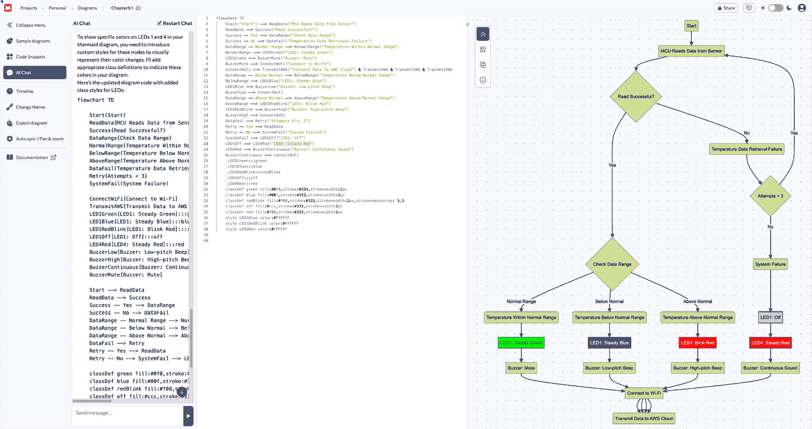
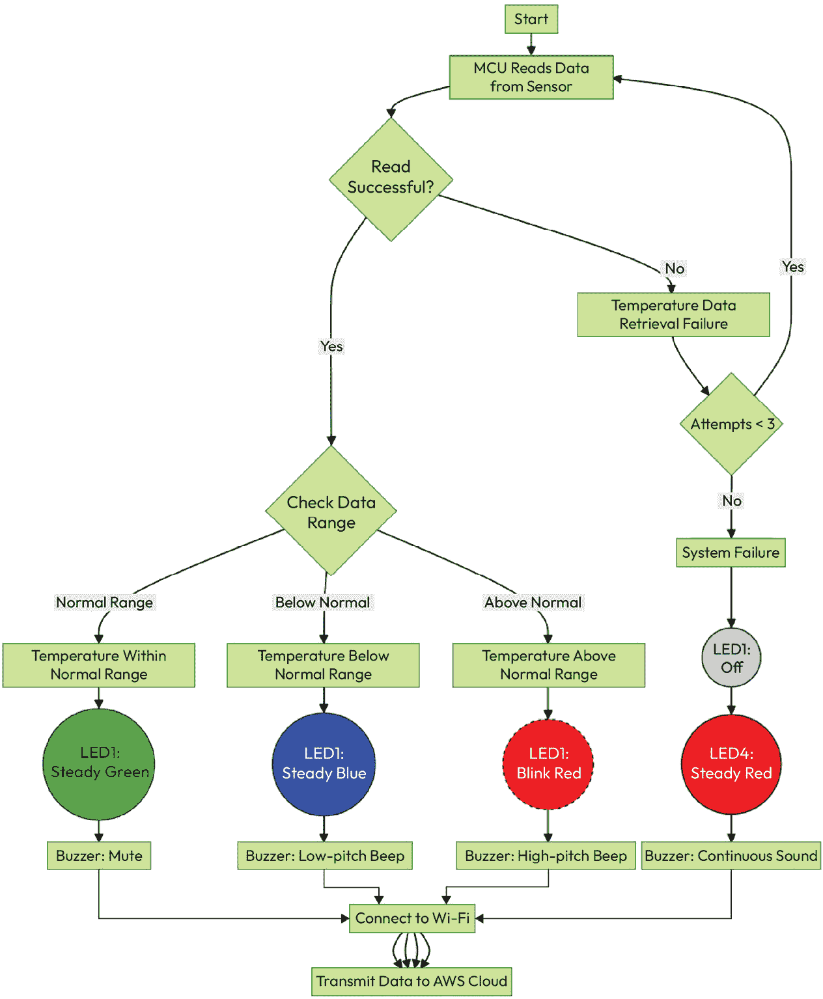
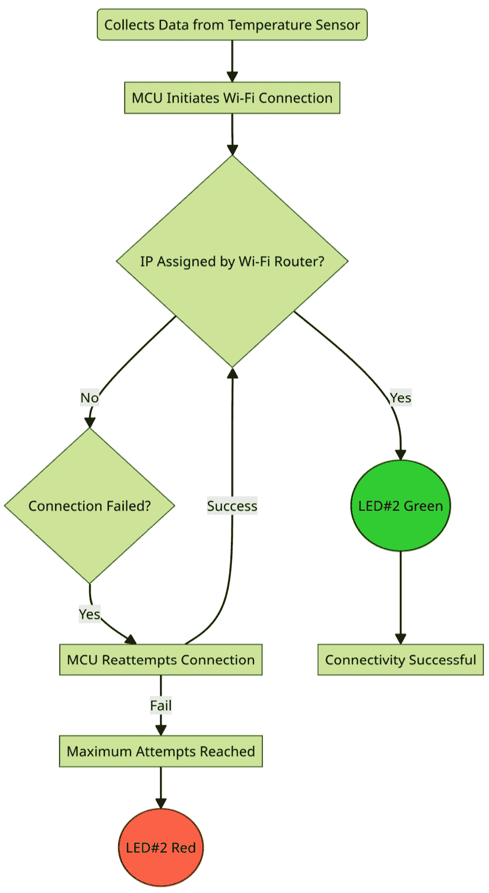
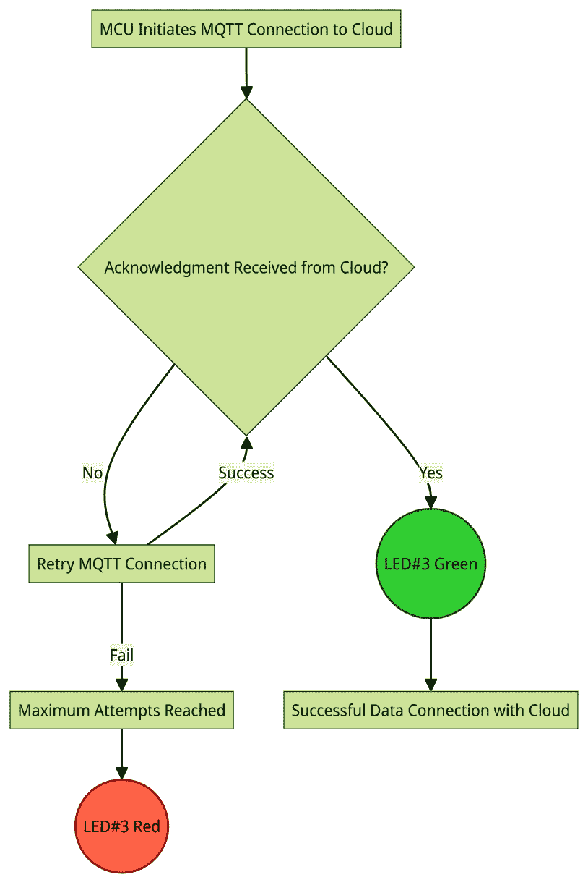
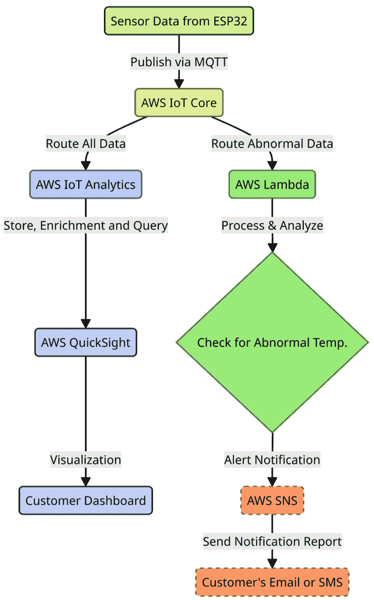

# 9

# 使用 AI 工具绘制应用程序流程图

在上一章中，我们探讨了 10 个适合初学者的物联网项目，并附有 ChatGPT 提示示例。希望你现在迫不及待地想要选择一个项目，开始你的创新开发之旅。

本章建议在你开始编码之前，先为你的应用程序设计一个流程图作为你的第一个实践项目。这一步至关重要。我们将指导你如何使用 AI 工具创建详细图表，说明应用程序如何在本地工作、连接到互联网以及访问云端。这些图表将帮助你理解数据交互、错误处理以及物联网项目中不同组件的集成。到本章结束时，你将能够借助 AI 工具将你项目应用程序的叙述转化为一个全面的图表。

我们将涵盖以下主题：

+   使用图表改善应用程序之旅

+   本地数据处理

+   建立互联网连接

+   将传感器数据发送到云

+   云端数据处理

# 使用图表改善应用程序之旅

在开始编码之前，一个全面的应用程序流程图是有益的。详细的图表可以阐明本地数据处理过程、传感器数据与本地电子设备的交互、错误处理、功耗机制以及激活无线连接设置的条件。一旦数据到达云端，应创建一个图表来概述数据存储、转发、处理、分析、可视化和客户通知的流程。

编写一个详尽的叙述，精确地描述你的关于数据流的*故事*。这个故事将作为指南，提供明确的指示，以确保你的代码符合你的特定需求和目标。

来自传感器的原始数据通常形成从小几比特到字节的微小数据包。这似乎是一个简单、直接且直接的旅程，其中 MCU 捕获这些数据并将其发送到其无线接口以访问互联网，最终到达云端。然而，在实际部署中，这段旅程很少是平静和愉快的，总是遇到许多异常情况和不可控的挑战。

因此，在编写第一行代码之前，创建一个说明每个阶段数据处理方式的图表至关重要。这不仅让你清楚地了解应用程序的工作方式，还作为后续使用 ChatGPT 进行编码过程的指导基准。

有许多 AI 工具可供使用，可以帮助您创建此类图表。对于简单的文本块格式图表，您可以使用 ChatGPT-4o（免费）。或者，您可以在 ChatGPT 4 中使用 GPTs，如*Diagram: Show Me*（这需要订阅）。对于更专业的图表，请考虑使用专门的 AI 驱动网站，例如[`www.mermaidchart.com/`](https://www.mermaidchart.com/)。在以下章节中，我们将练习使用[www.mermaidchart.com](http://www.mermaidchart.com/)上的 AI 聊天功能生成典型场景的图表。

# 本地数据处理

传感器数据首先由 MCU 在本地收集。在大多数情况下，MCU 在以下情况下在本地处理传感器数据：

+   **正常情况**：MCU 成功从传感器获取数据，或者传感器按预期触发事件。

+   **异常情况**：MCU 无法从传感器获取数据，或者传感器未能触发事件。在这种情况下，最可能的原因是传感器初始化失败或硬件故障。

为了提升用户体验并快速指示服务状态，考虑在您的物联网设备上使用可变色 LED 和蜂鸣声，向用户传达有意义的消息。

考虑到这一点，让我们使用[`www.mermaidchart.com/`](https://www.mermaidchart.com/)上的 AI 聊天功能生成一个流程图。

以下截图显示了在 mermaidchart.com 上提示 AI 聊天创建图表的过程。

图 9.1 – mermaidchart.com 生成图表的概述

您可以使用以下提示作为在**AI** **Chat**窗口中插入指令的示例：

`任务：假设您正在计划开发一个用于监控客户仓库条件的温度传感器端设备。此设备包括温度传感器、MCU、四个不同的 LED 用于各种状态指示（温度范围、Wi-Fi 接入、AWS 云接入和系统信息）、蜂鸣器和嵌入式` `Wi-Fi 模块。`

`操作：创建一个展示本地数据交互序列的图表：`

1.  `当 MCU 成功读取传感器的数据时，它将执行以下操作`

    +   `如果数据在正常范围内：LED1（温度指示器）显示稳定的绿色；关闭蜂鸣声`

    +   `如果数据低于正常范围：LED1 变为稳定的蓝色；发出低音调的蜂鸣声；`

    +   `如果数据高于正常范围：LED1 闪烁红色；发出高音调的蜂鸣声；`

1.  `当 MCU 无法读取传感器的数据时，它将执行以下操作`

    +   `如果数据检索失败，MCU 将在进入故障状态前尝试 3 次，LED#1 变为关闭状态，LED4（系统错误指示器）变为稳定的红色，并持续发出蜂鸣声`

`目标：确保图表清晰，准确反映设备的数据交互流程。它应直观地表示传感器数据处理、LED 响应、Wi-Fi 和 AWS 云连接以及基于不同温度读数的蜂鸣器警报。`

生成的图表如下所示。

图 9.2 – 数据本地处理流程

在本节中，我们设计了一个包含收集到的值、LED 颜色变化以及蜂鸣器蜂鸣开/关的数据本地处理流程。如图*图 9.1*所示，我们假设使用本地 Wi-Fi 网络将数据报告给 AWS 云。然而，在实际部署中，通过本地 Wi-Fi 网络的互联网访问仍然存在异常情况，例如 Wi-Fi 网络背后的防火墙可能会阻止设备访问互联网。

# 建立互联网连接

在处理本地数据后，建立互联网连接是必要的，以便将数据报告到云。为了节省电力，物联网设备通常不需要始终保持在线连接。相反，它应该只在有数据要传输时建立互联网连接。

假设使用家庭 Wi-Fi 网络访问互联网，您可能会遇到两种基本情况：

+   **正常情况**：MCU 成功连接到您的家庭 Wi-Fi 路由器并获得有效 IP 地址

+   **异常情况**：由于信号强度弱或 SSID 和密码不正确等原因，MCU 无法连接到您的家庭 Wi-Fi 路由器（未分配有效 IP 地址）

继续使用[`mermaidchart.com`](https://mermaidchart.com)，可以生成流程图，如下所示。以下提示用于生成图表：

`任务：假设你正在计划开发一个用于监控客户仓库条件的温度传感器端设备。该设备包括温度传感器、MCU、四个用于不同状态指示的独立 LED（温度范围、Wi-Fi 访问、AWS 云访问和系统信息）、蜂鸣器和嵌入式 Wi-Fi 模块。你现在正专注于以下方面的数据连接序列：`

`行动：创建一个说明 Wi-Fi 连接序列的图表。MCU 在从传感器收集数据后，将启动与家庭 Wi-Fi 路由器的连接。`

+   `正常情况：如果 IP 地址由家庭 Wi-Fi 路由器分配，LED2 将显示稳定的绿色。`

+   `错误处理：如果 MCU 无法连接到 Wi-Fi 路由器，它将进行三次额外的尝试。如果失败，LED2 将发出稳定的红色光以指示连接问题。`

`目标：构建一个清晰界定设备操作流程的图表，包括 LED 信号解释和 Wi-Fi 连接。该图表应有效地传达设备如何响应各种数据条件，管理 Wi-Fi 连接，并通过 LED 颜色设置指示系统状态。`

生成的图示如下所示：

图 9.3 – Wi-Fi 访问流程

在本节中，我们设计了一个流程来访问家庭 Wi-Fi 网络，考虑了正常和异常情况。现在，在成功接入互联网后，我们期望传感器数据到达云端。然而，此过程可能有例外。例如，设备可能由于认证凭证不正确而被云拒绝，我们需要意识到这种场景。

# 将传感器数据发送到云端

一旦建立无线连接并获得 IP 地址，您的设备将准备好向云端传输数据。然而，在此步骤中仍需考虑两种情况：

+   **正常情况**：MCU 成功连接到云

+   **异常情况**：MCU 由于某些原因（例如错误的注册凭证）无法连接到云。

使用 [`mermaidchart.com`](https://mermaidchart.com)，你可以得到如下所示的流程图。以下提示用于生成该图：

`任务：假设您正在计划开发一个用于监控客户仓库条件的温度传感器端设备。此设备包括温度传感器、MCU、四个用于不同状态指示的独立 LED（温度范围、Wi-Fi 访问、AWS 云访问和系统信息）、蜂鸣器和嵌入式 Wi-Fi 模块。您现在正专注于数据到达云端，考虑以下方面：`

`操作：创建一个图示，说明数据到达云端的顺序，即 AWS `IoT Core`。

1.  `云连接：`

    +   `MCU 初始化并与 AWS IoT Core 建立安全的 MQTT 通信以进行数据传输。`

1.  `数据处理：`

    +   `正常情况：MCU 从 AWS IoT Core 收到确认并设置 LED3 为` `稳定绿色。`

    +   `错误处理：在 MCU 未从 AWS IoT Core 收到确认的情况下，它将尝试重新发送数据三次。如果所有尝试都失败，LED3 将激活为稳定红色，表示` `云连接` `存在问题。`

`目标：此图示应作为视觉指南，清晰地传达数据传输到 AWS IoT Core 所涉及的步骤，包括处理通信成功或失败机制。`

生成的图示如下所示。

图 9.4 – 云访问流程

# 云端数据处理

一旦设备与云建立通信并发送数据，数据开始在云中传输。您仍然可以使用 [`mermaidchart.com`](https://mermaidchart.com) 创建一个数据处理流程图，概述数据是如何被处理的：

`任务：假设您正在计划开发一个用于监控客户仓库条件的温度传感器端设备。该设备包括温度传感器、MCU、四个不同状态的 LED 指示灯（温度范围、Wi-Fi 访问、AWS 云访问和系统信息）、蜂鸣器和嵌入式 Wi-Fi 模块。当前的开发阶段集中在 AWS 云环境中的数据处理和上。`

`行动：设计一个综合图表，说明各种 AWS 云服务之间数据处理和处理的顺序。`

1.  `数据摄取：`

    +   `传感器数据通过 MQTT 协议发布到 AWS IoT Core`

1.  `数据处理和分析：`

    +   `AWS IoT Core 将异常传感器数据转发到 AWS Lambda 进行处理和分析。`

    +   `当检测到异常情况时，AWS Lambda 触发警报通知到 AWS SNS。`

    +   `AWS SNS 向客户发送电子邮件或消息以` `通知`

1.  `数据存储、丰富和查询：`

    +   `AWS IoT Core 将所有传感器数据路由到 AWS` `IoT Analytics`

1.  `数据可视化：`

    +   `AWS QuickSight` 从 `AWS IoT Analytics` 查询传感器数据以生成客户 `应用程序仪表板。`

`目标：构建一个详细展示不同 AWS 服务间数据处理流程的图表。此图表不仅应描绘操作工作流程，还应阐明数据如何从传感器移动到云端，经过处理和分析，存储、可视化，并触发警报通知。强调 AWS IoT Core、AWS Lambda、AWS IoT Analytics、AWS SNS 和 AWS QuickSight 之间的集成和交互，以提供系统架构和数据生命周期的清晰全面视图。`

生成的图表如下所示。

图 9.5 – 云端数据处理

在生成准确表示您应用程序流程的图表后，您将对其功能有全面的理解，从传感器到云端。这个概述不仅提供了您应用程序的视觉表示，还有助于识别潜在的改进区域或问题。在有了这个视觉辅助工具和对您应用程序工作流程的清晰理解之后，您就可以开始您的创新之旅了。下一步关键步骤是在创建第一个项目之前设置您的开发环境。

# 摘要

在本章中，我们开始了您向物联网创新之旅。借助如 [`mermaidchart.com`](https://mermaidchart.com) 这样的 AI 驱动工具，您可以可视化清晰的应用程序流程。这有助于掌握服务交互的逻辑，包括如何管理异常情况。不仅此图表从系统设计角度增强了您的理解，而且它还作为 ChatGPT 理解您的流程并相应生成代码的简化指南。

随着我们进入下一章，我们将专注于设置开发环境。这将通过在 Visual Studio Code 中使用 PlatformIO IDE 来完成。这种设置至关重要，因为它简化了由 ChatGPT 生成的软件代码的编译和上传过程。更具体地说，在随后的示例项目中，您将获得实际操作经验，学习如何有效地使用该环境来编译和上传软件代码。这项实际练习不仅将巩固您对开发过程的理解，还将为您提供处理未来物联网项目所需的基本技能。

# 第三部分：实践端到端项目

本部分提供了使用 Visual Studio Code 和 PlatformIO IDE 建立开发环境的详细指南，重点关注物联网项目的软件安装和设置。它介绍了 ChatGPT 辅助的 ESP32 微控制器 C++编程，包括代码编写、编译和调试。此外，指南详细说明了使用 ChatGPT 将 ESP32 连接到 Wi-Fi 以及通过 MQTT/TLS 与 AWS IoT Core 集成的过程。您将学习如何将传感器数据传输到 AWS IoT Core，利用 ChatGPT 辅助的 Python 编码进行 AWS Lambda 的数据处理，以及使用 AWS IoT Analytics 进行数据存储和查询管理。最后，它教授如何在 ThingsBoard Cloud 上创建交互式数据可视化仪表板，使您能够自信地从头到尾管理自己的综合物联网项目。

本部分包含以下章节：

+   *第十章*, *设置您的第一个项目的开发环境*

+   *第十一章*, *在 ESP32 上编写您的第一个代码*

+   *第十二章*, *建立 Wi-Fi 连接*

+   *第十三章*, *将 ESP32 连接到 AWS IoT Core*

+   *第十四章*, *将传感器数据发布到 AWS IoT Core*

+   *第十五章*, *在 AWS 云上处理、存储和查询传感器数据*

+   *第十六章*, *在 ThingsBoard 上创建数据可视化仪表板*
