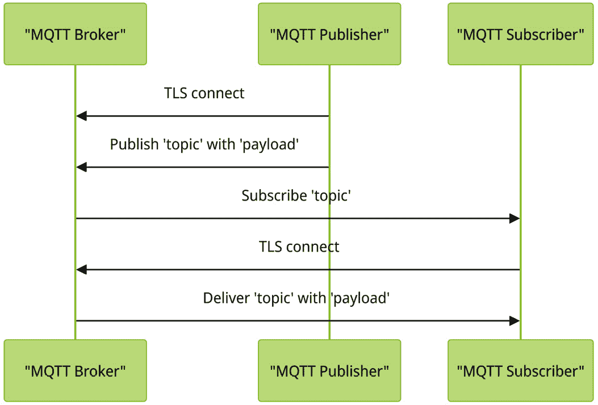
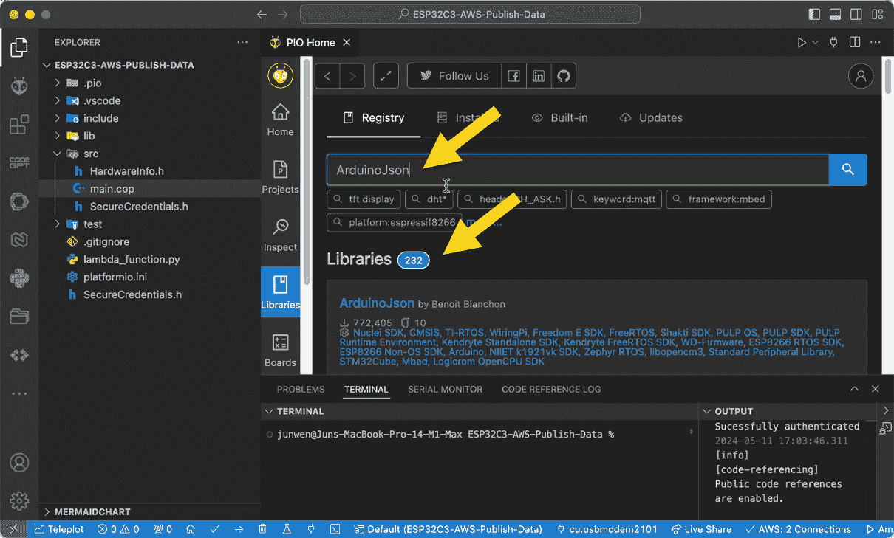
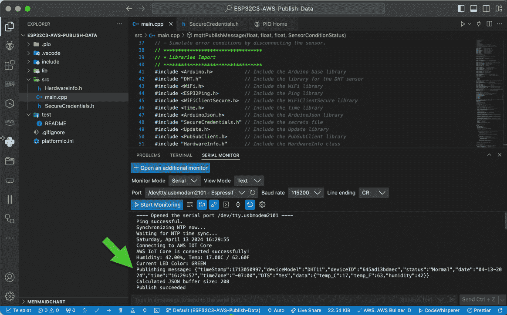
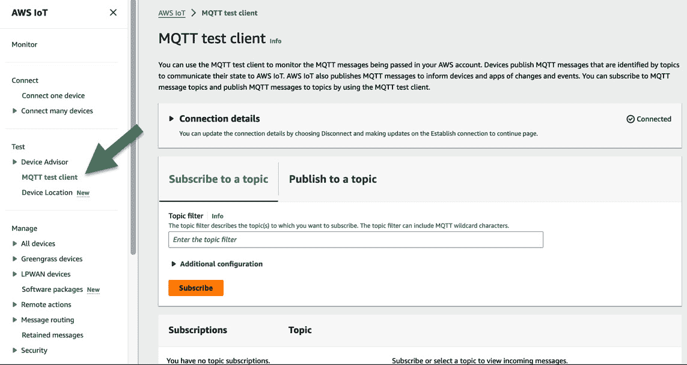
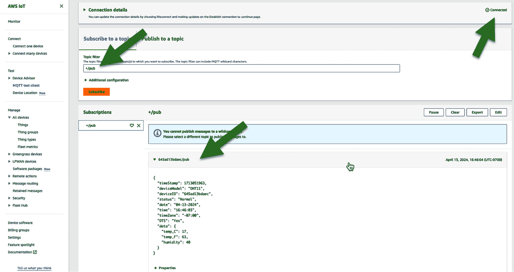

# 14

# 将传感器数据发布到 AWS IoT Core

在前一章中，我们成功指导 ChatGPT 生成代码，通过 TLS/MQTT 加密连接将 ESP32 连接到 AWS IoT Core。在本章中，我们将使用 MQTT 协议将传感器数据发布到 AWS 云。

到本章结束时，您将能够指导 ChatGPT 在 ESP32 上编程代码，创建 MQTT 发布主题，并生成 **JavaScript 对象表示法**（**JSON**）文档。这将允许您封装传感器数据以发送到 AWS IoT Core。

本章将涵盖以下主题：

+   *理解通过 MQTT Publish 发送传感器数据的方法*：了解 MQTT Publish 操作的数据传输机制

+   *在 ESP32 中构建 MQTT 发布主题和有效载荷*：指导 ChatGPT 生成代码以创建 MQTT 主题和 JSON 有效载荷

+   *验证交付的传感器数据*：在本地终端窗口中监控执行结果并观察从 AWS MQTT 测试客户端接收到的消息

# 技术要求

在本章中，我们将指导 ChatGPT 更新我们在 *第十三章* 中创建的 ESP32 代码。在 AWS 云上，您将登录 AWS IoT Core 以配置一个 MQTT 测试客户端来订阅一个主题，这是您在 ESP32 代码中创建的 MQTT 发布主题。

在本书中，我们将仅演示使用 MQTT Publish 从 DHT11 传感器向上游传输报告数据到 AWS IoT Core 的操作。将数据从 AWS IoT Core 传输到物联网设备（例如，在执行设备固件升级时）的操作称为 MQTT Subscribe。此操作在本项目中将不会使用。

# 通过 MQTT Publish 发送传感器数据

在 *第五章* 中，我们讨论了 MQTT 协议及其发布/订阅模型。以下图描述了 MQTT 代理（如 AWS IoT Core）如何与 MQTT 发布者或 MQTT 订阅者（如物联网设备）交互。在前一章中，我们在 MQTT 发布者（ESP32）和 MQTT 代理（AWS IoT Core）之间建立了 TLS 连接。

一旦成功建立 TLS 连接，下一步就是物联网设备（MQTT 发布者）将传感器有效载荷数据封装成 JSON 格式，并声明一个 *主题* 以发送到 MQTT 代理，AWS IoT Core。



图 14.1 – MQTT 流程

以下定义适用于 MQTT 协议流程中使用的 *主题*、*有效载荷* 和 *JSON* 术语：

+   `deviceID/pub` 以区分不同设备之间的主题。唯一的 `deviceID` 值是从 `ESP.getEfuseMac()` 中派生的，它包含在前一章中创建的 `HardwareInfo.h` 头文件中。

+   **有效载荷**：此术语指代传感器原始数据；在本项目的情况下，它包括设备信息、温度和湿度值等，这些数据使用 JSON 格式化。

    *JSON* 是一种轻量级且高度用户友好的数据交换格式。它旨在易于人类读取和编写，同时足够简单，以便机器解析和生成。JSON 不局限于任何特定的编程语言。相反，它是一种与语言无关的文本格式，已被广泛接受和采用，跨越了多种语言。这些语言包括但不限于 C、C++、C#、Java、JavaScript、Perl 和 Python。在结构方面，JSON 由不同的形式组成。例如，一个对象是一个无序的键值对集合。对象的开始由左花括号 `{` 标识，结束于右花括号 `}`。在对象中，每个名称后面跟着一个冒号，名称/值对由逗号分隔。

    让我们考虑以下示例来阐明这个概念：

    ```py
     1\. {
     2.   "deviceInfo": {
     3.     "macAddress": "00:1A:2B:3C:4D:5E",
     4.     "firmwareVersion": "1.0.5"
     5.   },
     6.   "sensorData": {
     7.     "temperatureC": 22.5,
     8.     "temperatureF": 72.5,
     9.     "humidity": 50
    10.   }
    11\. }
    12.
    ```

+   `JsonSerializer.Serialize` 方法。这是数据传输和存储的一个关键方面，因为它允许将复杂的数据结构转换为易于存储或传输的格式，并在必要时重新构建。通过使用 `JsonSerializer.Serialize` 方法，可以有效地管理和操作 JSON 数据，促进无缝的数据交换和通信。在 PlatformIO IDE 中，有一个标准库 `ArduinoJson.h`，用于执行 JSON 格式数据的序列化。

在本节中，我们探讨了 MQTT 通信中的关键术语。这些术语对于在物联网设备和 MQTT 服务器之间交换信息至关重要。在下一节中，我们将将这些术语应用到我们的项目中。

# 在 ESP32 中构建 MQTT 发布主题和有效载荷

在上一章中，我们介绍了两个与 TLS/MQTT 功能相关的标准 Arduino 库。`WiFiClientSecure.h` 库用于设置 TLS 连接，而 `PubSubClient.h` 库用于 MQTT 发布。

在本章中，我们将介绍另一个 Arduino 库，`ArduinoJson.h`。这个库用于构建 JSON 文档并将其序列化，以便传输到 AWS IoT Core。

在 `lib_deps` 目录下的 `platformio.ini` 文件中，然后使用 `#include <ArduinoJson.h>` 将其集成到你的源代码中。

在编译 `main.cpp` 代码之前，我们将手动在 Platform 中安装这个库。

基于上一章创建的代码，你可以继续提示 ChatGPT 添加 MQTT 发布主题、JSON 数据格式和序列化要求，以下是一个提示示例：

`Hi, ChatGPT`

`请更新之前的代码，保持其当前的结构、风格和输出格式，并支持以下` `附加要求：`

+   `导入并使用 ArduinoJson.h 进行 JSON 数据格式和` `序列化操作`。

+   `导入 SecureCredentials.h，该文件存储 AWS 证书，并在` `main` `代码中调用它。`

+   `导入 HardwareInfo.h 以读取 eFuse MAC 作为` `唯一的设备 ID`。

+   `通过设备 ID + "/``pub" 构建发布主题 AWS_IOT_PUBLISH_TOPIC。`

+   `创建一个名为 "mqttPublishMessage" 的专用函数来发送` `传感器数据。`

+   `创建一个包含 "timeStamp", "deviceID", "status", "date", "time", "timezone", "DTS", "data" 以及 "data" 的 "temp_C", "temp_F"` `和 "humidity" 值的 JSON 字符串。`

接下来，让我们看看一些代码示例。

# 代码示例

您可以在 [`github.com/PacktPublishing/Accelerating-IoT-Development-with-ChatGPT/tree/main/Chapter_14`](https://github.com/PacktPublishing/Accelerating-IoT-Development-with-ChatGPT/tree/main/Chapter_14) 找到 `main.cpp` 代码的示例。以下是从 `main.cpp` 代码中提取的内容。ChatGPT 按要求创建了一个新函数 `mqttPublishMessages()`：

```py
void mqttPublishMessage(float humidity, float temperatureC, float temperatureF, SensorConditionStatus condition) // Function to publish message to AWS IoT Core
{
    if (!mqttClient.connected()) // Check if the client is connected
    {
        connectAWS(); // Connect to AWS IoT Core if not connected
    }
    // Fetch the current time
    struct tm timeinfo;
    if (!getLocalTime(&timeinfo))
    {
        Serial.println("Failed to obtain time");
        return; // Don't proceed if time couldn't be obtained
    }
    // Format the date and time separately
    char formattedDate[11]; // Buffer to hold the formatted date "mm-dd-yyyy"
    char formattedTime[9];  // Buffer to hold the formatted time "hh:mm:ss"
    // Use strftime to format the date and time separately
    strftime(formattedDate, sizeof(formattedDate), "%m-%d-%Y", &timeinfo);
    strftime(formattedTime, sizeof(formattedTime), "%H:%M:%S", &timeinfo);
    // Get Unix time
    time_t unixTime = mktime(&timeinfo);
    String conditionStr = condition == Normal ? "Normal" : condition == BelowNormal ? "Below Normal"
:condition == AboveNormal   ? "Above Normal"
                                                                     : "Sensor Error";
    // Create a JSON document
    StaticJsonDocument<256> doc;
    // Populate document
    doc["timeStamp"] = unixTime;
    doc["deviceModel"] = "DHT11";
    doc["deviceID"] = String(ESP.getEfuseMac(), HEX);
    doc["status"] = conditionStr;
    doc["date"] = formattedDate;
    doc["time"] = formattedTime;
    doc["timeZone"] = timezoneStr;
    doc["DST"] = dstStatus;
    JsonObject data = doc.createNestedObject("data"); // Create a nested object for data
    data["temp_C"] = temperatureC;
    data["temp_F"] = round(temperatureF);
    data["humidity"] = humidity;
    String jsonString;                    // Create a string to hold the JSON data
    serializeJson(doc, jsonString);       // Serialize the JSON document to a string
    Serial.print("Publishing message: "); // Print the message
    Serial.println(jsonString);           // Print the JSON data
    // Determine buffer size
    size_t jsonSize = measureJson(doc) + 1; // +1 for null terminator
    Serial.print("Calculated JSON buffer size: ");
    Serial.println(jsonSize); // Print the buffer size
    if (!mqttClient.publish(AWS_IOT_PUBLISH_TOPIC.c_str(), jsonString.c_str()))
    {
        Serial.println("Publish failed");
    }
    else
    {
        Serial.println("Publish succeeded");
    }
}
```

此函数使用 MQTT 协议将传感器数据发布到 AWS IoT Core。它接受四个参数：`humidity`（湿度）、`temperatureC`（摄氏温度）、`temperatureF`（华氏温度）和 `condition`。这些分别代表传感器的湿度、温度读数和条件。

该函数首先检查 MQTT 客户端是否连接到 AWS IoT Core。如果没有连接，它将调用 `connectAWS` 函数来建立连接。

然后，它使用 `getLocalTime` 函数获取当前时间。如果失败，它将打印错误消息并退出函数。如果成功，它使用 `strftime` 函数分别格式化日期和时间。

接下来，它创建一个 `conditionStr` 字符串来以人类可读的格式显示传感器条件。它是通过使用三元运算符将 `SensorConditionStatus` 枚举映射到字符串来实现的。

该函数随后使用来自 `ArduinoJson` 库的 `StaticJsonDocument` 类构建一个 JSON 文档。该文档包括各种详细信息，如时间戳、设备型号、设备 ID、传感器状态、日期、时间、时区、夏令时状态和传感器数据（温度和湿度）。

使用 `serializeJson` 函数将 JSON 文档序列化为字符串，并将此字符串打印到串行监视器以进行调试。

该函数使用 `measureJson` 函数计算 JSON 文档的大小，并将此大小打印到串行监视器。

最后，该函数尝试使用 `mqttClient.publish` 函数将 JSON 字符串发布到 AWS IoT Core。如果失败，它将打印错误消息。如果成功，它将打印成功消息。

在 [`github.com/PacktPublishing/Accelerating-IoT-Development-with-ChatGPT/tree/main/Chapter_14`](https://github.com/PacktPublishing/Accelerating-IoT-Development-with-ChatGPT/tree/main/Chapter_14) 的同一文件夹中，您还可以看到一个 `platformio.ini` 文件的示例，如下所示：

```py
 1. [env:esp32-c3-devkitc-02]
 2. platform = espressif32
 3. board = esp32-c3-devkitc-02
 4. framework = arduino
 5. monitor_filters = esp32_exception_decoder, colorize
 6. monitor_speed = 115200
 7. build_src_filter = +<../../src/>  +<./>
 8. board_build.flash_mode = dio
 9. build_flags =
10.  -D ARDUINO_USB_MODE=1
11.  -D ARDUINO_USB_CDC_ON_BOOT=1
12.  -D WIFI_SSID=\"WiFi_SSID\"
13.  -D WIFI_PASSWORD=\"WiFi_Password\"
14.  -D PING_HOST=\"www.google.com\"
15.  -D NTP_SERVER=\"pool.ntp.org\"
16.  -D GMT_OFFSET_SEC=-28800
17.  -D DST_OFFSET_SEC=3600
18.  -D AWS_IOT_MQTT_SERVER=\"endpoint.iot.your_aws_iot_region.amazonaws.com\"; please be noted the "endpoint" information can be found at the "Settings" in AWS IoT.
19.  -D AWS_IOT_MQTT_PORT=8883
20.  -w
21. lib_deps =
22.  adafruit/DHT sensor library@¹.4.6
23.  adafruit/Adafruit Unified Sensor@¹.1.14
24.  marian-craciunescu/ESP32Ping@¹.7
25.  bblanchon/ArduinoJson@⁷.0.4
26.  knolleary/PubSubClient@².8
```

在 **lib_deps** 下有一个新的 **bblanchon/ArduinoJson** 条目。您需要手动在 Platformio 库中查找并安装它。



图 14.2 – 在 PlatformIO 中安装 ArduinoJson 库

在本节中，您已经学习了 MQTT 协议的关键组件，并指导 ChatGPT 通过创建一个新的专用函数来更新您之前的代码，以支持 MQTT 发布操作。现在，让我们编译代码，上传它，并验证结果。

# 验证交付的传感器数据

编译并将更新的代码上传到 ESP32 后，您可以在本地终端窗口中检查执行结果。

在以下屏幕截图中，显示的发布消息包括在主代码中定义的序列化 JSON 格式有效负载。



图 14.3 – 在本地终端窗口中验证结果

现在，您可以登录 AWS 管理控制台，并选择如图所示**AWS IoT**。在**测试**下，点击**MQTT** **测试客户端**。



图 14.4 – 在 AWS IoT Core 中定位“MQTT 测试客户端”选项

在`+/pub`下。`+`通配符字符与主题层次结构中的恰好一个项目匹配。例如，订阅`Sensor/+/room1`将接收发布到`Sensor/temp/room1`、`Sensor/moisture/room1`等消息。

在 ESP32 的代码中，我们通过`+/pub`定义了主题，这里可以匹配每个设备的 MQTT 发布主题。在以下屏幕截图中，您可以看到读取的连接详情为**已连接**，传感器数据与我们定义在主代码中的 JSON 格式相同。



图 14.5 – 验证 AWS IoT Core 中发布的消息

现在我们已经到达本节的结尾，您将能够在本地终端窗口和 AWS IoT Core MQTT 测试客户端中观察到 MQTT 发布消息操作。如果结果不符合预期，请调整您的提示以更具体地满足您的需求。

# 摘要

在本章结束时，传感器数据已成功到达 AWS IoT Core。然而，这仅仅是商业级物联网应用中云服务的初始步骤。现在，原始数据需要进一步处理。这可能包括在检测到异常事件时触发即时警报，或将数据存储以供未来分析和可视化。

在下一章中，您将学习使用各种 AWS 服务存储、处理和分析这些传感器数据。我们计划在 AWS IoT Core 中建立两条消息路由规则。第一条规则将涉及 AWS Lambda，这是首屈一指的无服务器计算服务。如果检测到异常传感器数据，我们将请求 ChatGPT 在 AWS Lambda 上生成基于 Python 的算法，这将触发 AWS SNS 上的电子邮件警报。第二条规则将指导数据流向 AWS IoT Analytics 进行存储和后续可视化的准备。
