# 16

# 在 ThingsBoard 上创建数据可视化仪表板

在上一章中，我们成功处理了异常事件，并处理了数据存储和查询。这些步骤使我们能够有效地将传感器数据上传到云，为分析和可视化做准备。

在本章中，我们将继续到最后一步，并讨论以下主题：

+   将 AWS 云与 ThingsBoard 集成

+   任务 1 – 使用 AWS 提供 ThingsBoard 代理

+   任务 2 – 创建数据转换器并将其集成到 ThingsBoard 中

+   任务 3 – 使用 ThingsBoard 生成实时仪表板

到本章结束时，您将具备将创新转化为商业级解决方案的知识，使用这个充满活力的仪表板。

# 技术要求

在本章中，除了访问您的当前 AWS 账户外，还假设您已在 [`thingsboard.cloud`](https://thingsboard.cloud) 注册了 ThingsBoard 云账户。

# 将 AWS 云与 ThingsBoard 集成

**ThingsBoard** ([`thingsboard.io/`](https://thingsboard.io/)) 是一个著名的开源物联网平台，用于数据收集、处理、可视化和设备管理。它支持通过行业标准物联网协议（如 MQTT、CoAP 和 HTTP）连接设备，并可在云和本地部署。凭借其可扩展性、容错性和高性能特性，ThingsBoard 确保您的数据始终安全且可访问。

ThingsBoard 是一个用户友好的平台，非常适合刚开始物联网创新之旅的初学者。它允许快速从您的设备中摄取数据，并在定制的实时仪表板上可视化数据。

要将 AWS 云集成作为 IoT 数据源，ThingsBoard 在 [`thingsboard.io/docs/user-guide/integrations/aws-iot/`](https://thingsboard.io/docs/user-guide/integrations/aws-iot/) 提供了详细的指导。

集成方法包括三个步骤：

1.  **在 AWS IoT Core 中提供设备**：此**设备**将代表 ThingsBoard 代理，它将订阅由物联网设备发布的专用主题。此**设备**将生成自己的证书，并附加我们在 *第十三章* 中创建的策略。

1.  **在 ThingsBoard 中生成数据转换器**：此转换器将负责将接收到的消息负载转换为要在最终仪表板上显示的输出数据。

1.  **在 ThingsBoard 中创建集成**：此集成实例将利用代理的证书访问 AWS IoT Core，订阅发布的主题，并整合数据转换器。

只要此实例处于活动状态，就表示集成成功，并准备好从 AWS 云摄取实时数据，在 ThingsBoard 中构建最终仪表板。

让我们从以下任务开始配置指导。

# 任务 1 – 使用 AWS 提供 ThingsBoard 代理

要成功从 AWS IoT Core 接收传感器数据，必须在 AWS IoT Core 中配置一个特定的*实体*，代表 ThingsBoard Cloud。此代理用于订阅目标设备发布的 MQTT 消息。

在 AWS IoT Core 中创建此特定*实体*后，ThingsBoard 需要采用在创建此代理时生成的证书，以访问 AWS IoT Core。这是一个关键步骤，因为它使得两个平台之间的安全验证通信成为可能。

从本质上讲，代理不仅仅是简单的数据通道。它作为服务集成锚点，架起了 AWS IoT Core 和 ThingsBoard Cloud 之间的桥梁。它确保数据从一个点到另一个点的无缝传输，同时保持传输信息的一致性和安全性。订阅目标设备的 MQTT 消息促进了实时通信和数据交换，从而有效地将 AWS IoT Core 和 ThingsBoard Cloud 连接起来。

让我们开始任务：

1.  以常规用户角色登录 AWS 控制台，导航到**IoT Core**服务，然后单击**创建实体**。

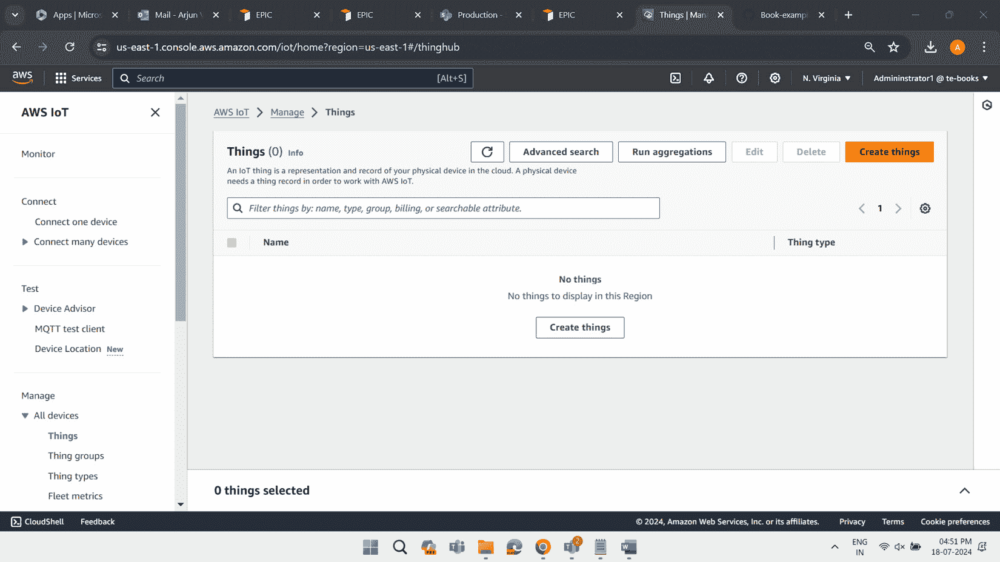

图 16.1 – 为 ThingsBoard Cloud 创建实体

1.  创建单个*实体*。

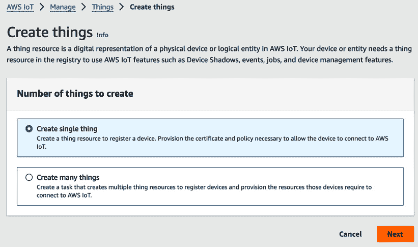

图 16.2 – 为 ThingsBoard Cloud 创建单个实体

1.  在这里为*实体*命名，例如，`ThingsBoard_Agent`。

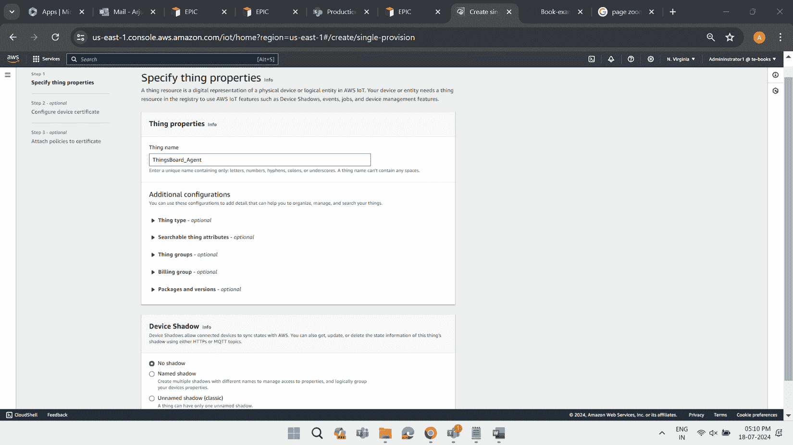

图 16.3 – 为实体命名

1.  创建一个新的设备证书。

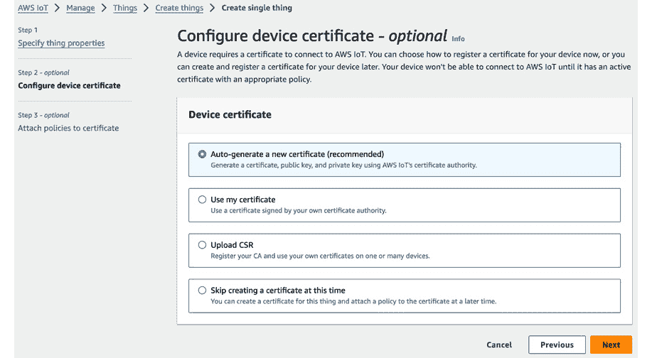

图 16.4 – 为此实体创建新证书

1.  附加我们在*第十三章*中创建的策略。

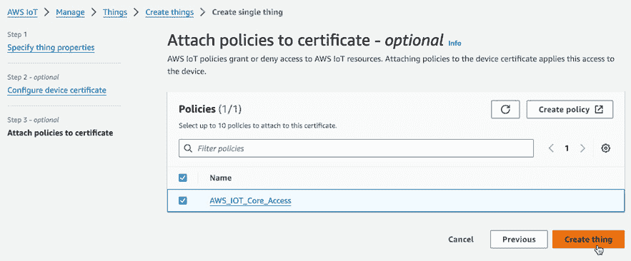

图 16.5 – 将策略附加到这个新证书上

在这里下载所有证书和密钥。由于 ThingsBoard Cloud 支持的 AWS IoT 集成只请求设备证书、私钥文件和 Amazon Root CA 1，您只需导入这三个文件，如图*图 16.6*所示。

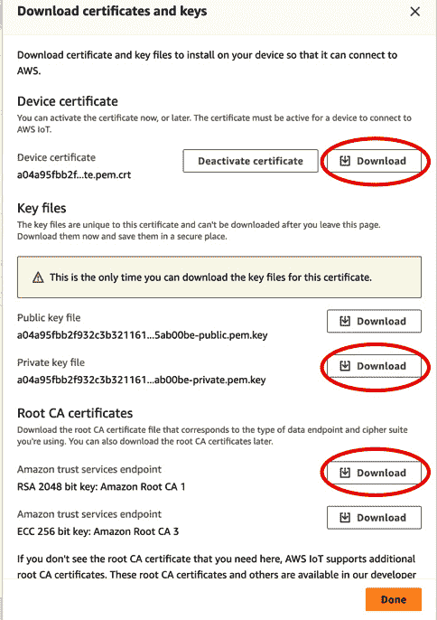

图 16.6 – 下载并保存证书文件

已在 AWS IoT Core 中成功创建一个名为`ThingsBoard_Agent`的新*实体*。

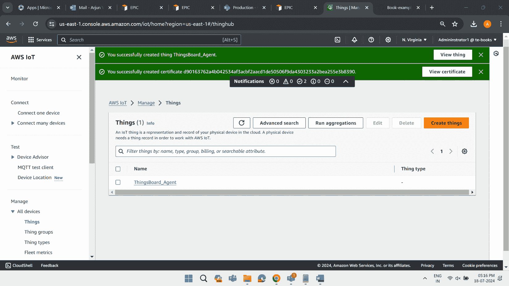

图 16.7 – 实体成功创建页面

1.  在`your_account_ID-ats-iot.your_region.amazonaws.com`。我们将在 ThingsBoard 的集成过程中需要这些信息。

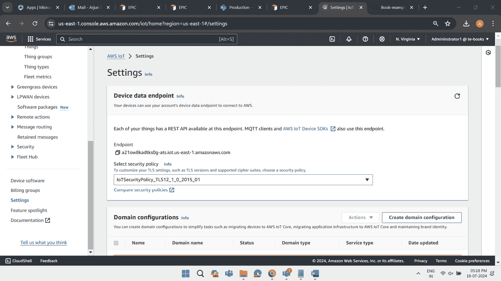

图 16.8 – 定位端点信息

到目前为止，我们已经成功地将`ThingsBoard_Agent`作为设备创建在 AWS IoT Core 中，下载了它及其自己的证书文件，并附加了现有的策略。在下一个任务中，我们将完成在 ThingsBoard 上的集成任务。

# 任务 2 – 创建数据转换器并将其集成到 ThingsBoard

除了接收来自 AWS IoT Core 的发布消息外，ThingsBoard 还需要执行数据解码函数来解析传入消息的有效负载并将其转换为 ThingsBoard 使用的格式。

ThingsBoard Cloud 中的数据转换器过程涉及解码函数的创建。ThingsBoard 采用**ThingsBoard 表达式语言**（**TBEL**）([`thingsboard.io/docs/pe/user-guide/tbel/`](https://thingsboard.io/docs/pe/user-guide/tbel/))来创建解码函数，以方便数据处理和操作。TBEL 允许您编写可以解析、转换和处理设备数据的表达式，这些数据在进入 ThingsBoard 时被摄取。

在解码函数的上下文中，TBEL 用于解释来自设备的传入 JSON、文本或二进制（Base64）格式数据，这些数据通常通过 MQTT 或 CoAP 等 IoT 协议发送。解码函数随后从原始设备数据中提取值，如果需要则进行转换，并将它们格式化为 ThingsBoard 可以用于进一步处理和可视化的结构。

您可以在[`thingsboard.io/docs/user-guide/integrations/`](https://thingsboard.io/docs/user-guide/integrations/)找到更多详细信息。

例如，在我们的项目中，从 ESP32 发布到 AWS IoT Core 的 JSON 有效负载格式如下：

```py
 1. {
 2.   "timeStamp": 1713817262,
 3.   "deviceModel": "DHT11",
 4.   "deviceID": "645ad13bdaec",
 5.   "status": "Normal",
 6.   "date": "04-22-2024",
 7.   "time": "13:21:02",
 8.   "timeZone": "-08:00",
 9.   "DST": "Yes",
10.   "data": {
11.     "temp_C": 22,
12.     "temp_F": 72,
13.     "humidity": 38
14.   }
15. }
```

对于 ThingsBoard Cloud 上的数据可视化仪表板，我们可能*不需要*将此输入有效负载中的所有对象都包含在内。相反，我们计划使用以下输出对象来构建我们的仪表板：

```py
 1. {
 2.     "eventType": "Normal",
 3.     "deviceName": "645ad13bdaec",
 4.     "deviceType": "DHT11",
 5.     "telemetry": {
 6.         "temp_c": 22,
 7.         "temp_f": 72,
 8.         "humidity": 38
 9.     }
10. }
```

在我们的案例中，以下 TBEL 代码示例用于数据转换。您也可以在[`github.com/PacktPublishing/Accelerating-IoT-Development-with-ChatGPT/tree/main/Chapter_16`](https://github.com/PacktPublishing/Accelerating-IoT-Development-with-ChatGPT/tree/main/Chapter_16)找到它：

```py
 1. // Decode payload to JSON
 2. var received_event = decodeToJson(payload);
 3.
 4. // Extract device ID and other telemetry values from JSON
 5. var deviceID = received_event.deviceID;
 6. var eventType = received_event.status;
 7. var deviceType = received_event.deviceModel;
 8. var temp_c = received_event.data.temp_C;
 9. var temp_f = received_event.data.temp_F;
10. var humidity = received_event.data.humidity;
11.
12.
13. // Create telemetry object with extracted values
14. var telemetry = {
15.   temp_c: temp_c,
16.   temp_f: temp_f,
17.   humidity: humidity
18.
19. };
20.
21. // Create result object with device ID and telemetry data
22. var result = {
23.   eventType: eventType,
24.   deviceName: deviceID,
25.   deviceType: deviceType,
26.   telemetry: telemetry
27.
28. };
29.
30. // Helper function to decode JSON
31. function decodeToJson(payload) {
32.     var str = String.fromCharCode.apply(null, new Uint8Array(payload));
33.     var received_event = JSON.parse(str);
34.     return received_event
35. }
36.
37. return result;
```

现在，让我们逐步完成在 ThingsBoard Cloud 上的数据转换器和集成：

1.  登录到[`thingsboard.cloud`](https://thingsboard.cloud)。然后，在左侧导航栏中点击**集成中心**下的**数据转换器**。

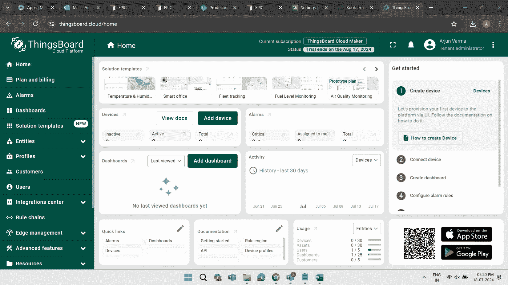

图 16.9 – 在 ThingsBoard Cloud 中定位集成中心

1.  点击**+**，然后点击**创建****新转换器**。

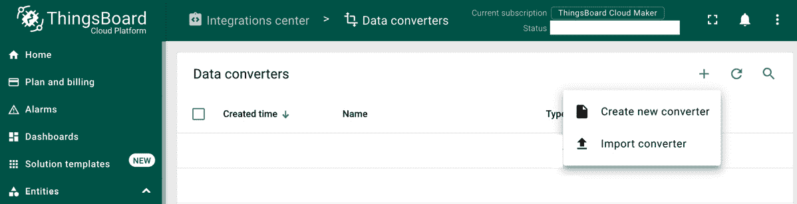

图 16.10 – 开始创建新的转换器

1.  给这个数据转换器起一个名字，例如`AWS IoT Uplink Converter`，将**类型**设置为**上行链路**，然后点击**测试****解码函数**。

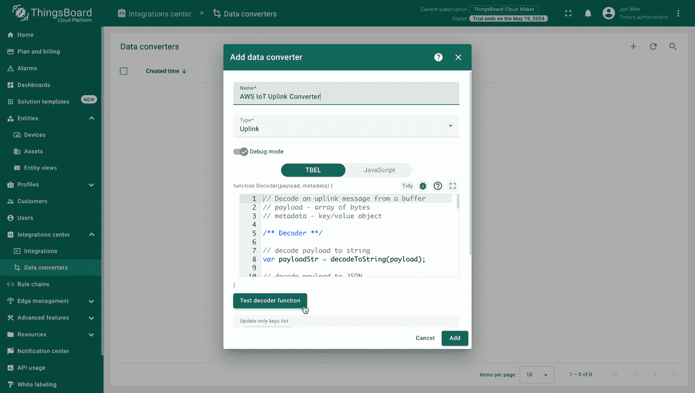

图 16.11 – 创建解码函数

1.  在此步骤中，我们将在**TBEL**下创建一个解码函数，正如我们在本节开头所讨论的。此解码函数将把 AWS IoT Core 的输入有效载荷转换为我们的期望输出数据格式。

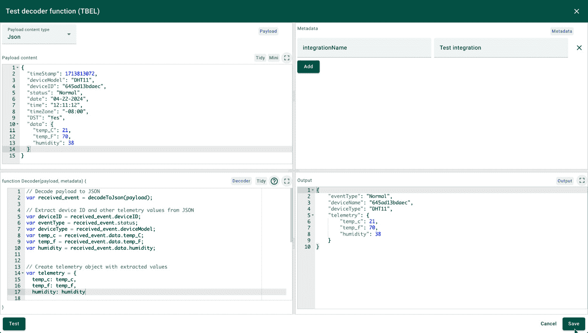

图 16.12 – 测试我们的解码函数

您可以将示例输入复制并粘贴到有效载荷内容中。然后，将数据转换器代码粘贴到函数解码器中。点击**测试**以验证输出并将其保存以进入下一步。

1.  点击**添加**以添加此数据转换器。

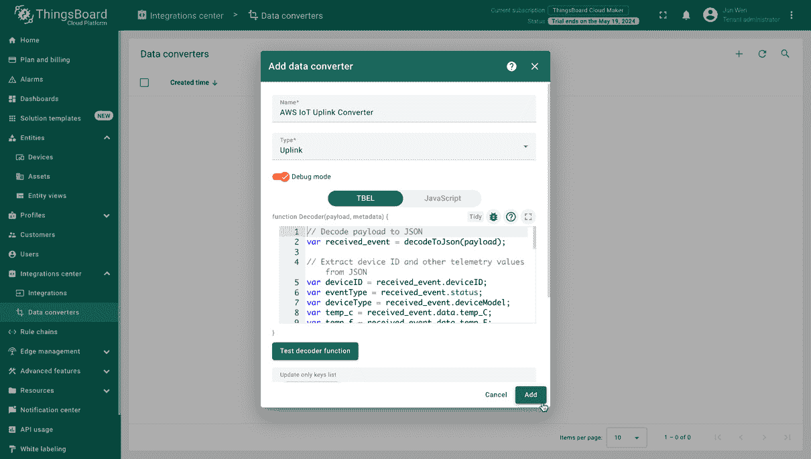

图 16.13 – 添加数据转换器

1.  现在，此数据转换器已在 ThingsBoard 中成功创建。

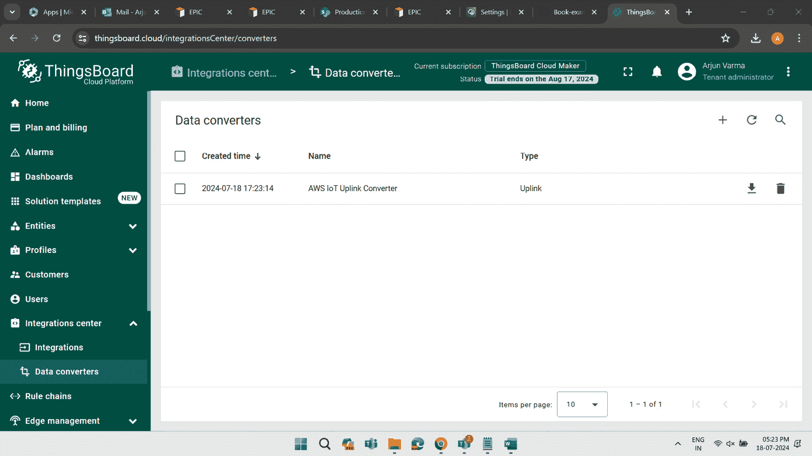

图 16.14 – 完成数据转换器

1.  现在，转到**集成中心**下的**集成**以添加集成实例。

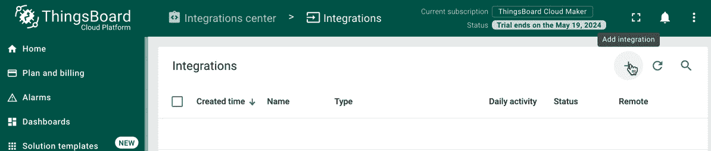

图 16.15 – 开始添加集成

1.  在**集成类型**下，选择**AWS IoT**。

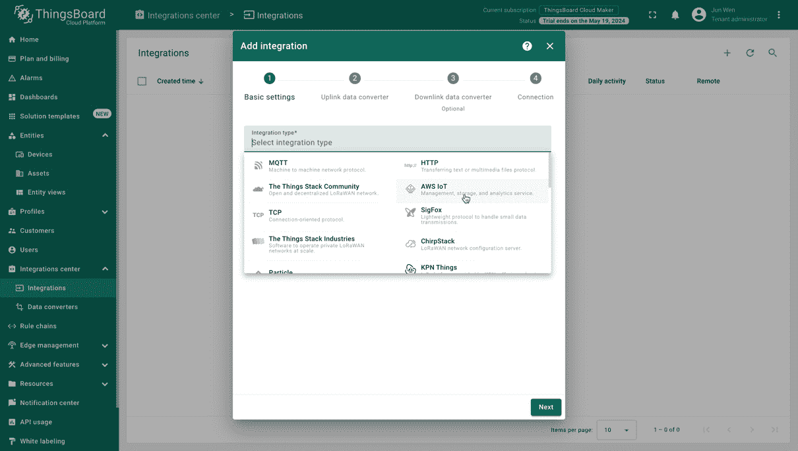

图 16.16 – 将集成类型设置为 AWS IoT

1.  启用三个选项并点击**下一步**。

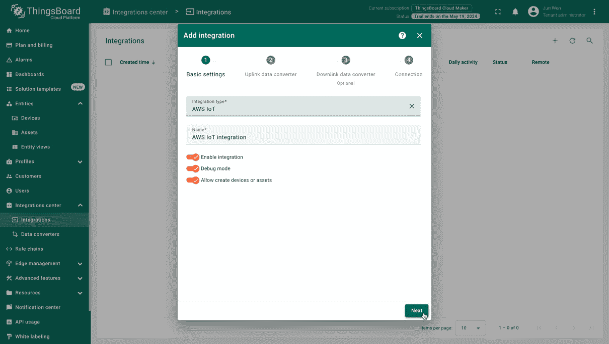

图 16.17 – 启用选项

1.  选择我们刚刚创建的现有上行链路数据转换器并点击**下一步**。

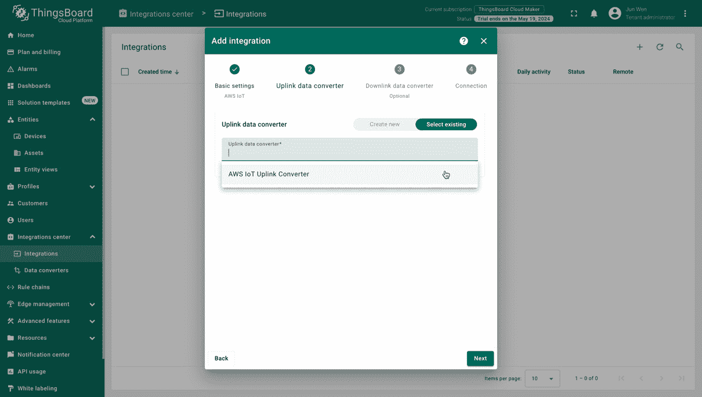

图 16.18 – 选择在第 6 步创建的数据转换器

1.  跳过**下行链路**数据转换器。

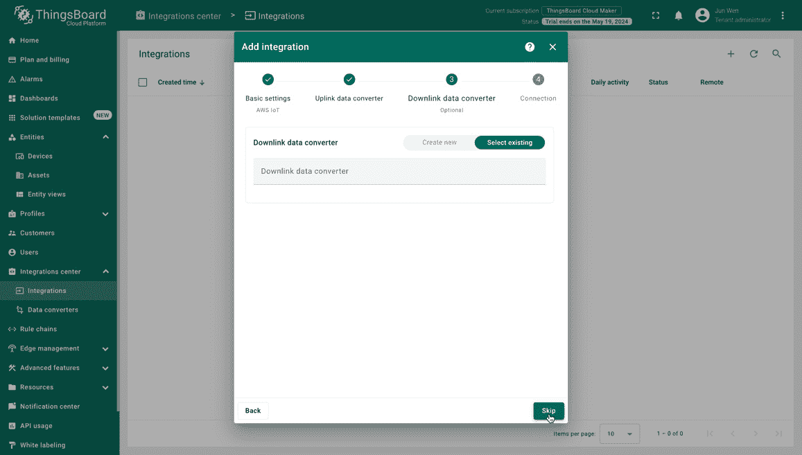

图 16.19 – 跳过下行链路数据转换器

1.  现在，输入 AWS IoT `xxxxxxxxxxxxxx-ats.iot.your_region.amazonaws.com`。同时，上传在上一任务的*步骤 5*中下载的三个证书文件。

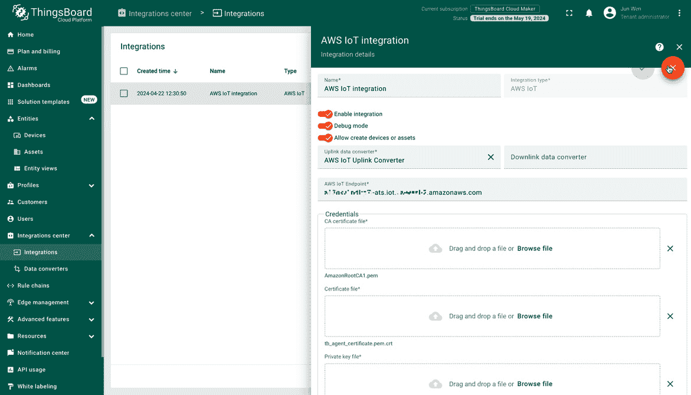

图 16.20 – 配置 AWS IoT 端点信息并上传三个证书文件

1.  最后，在`+/pub`下，点击**添加**以添加此集成实例。

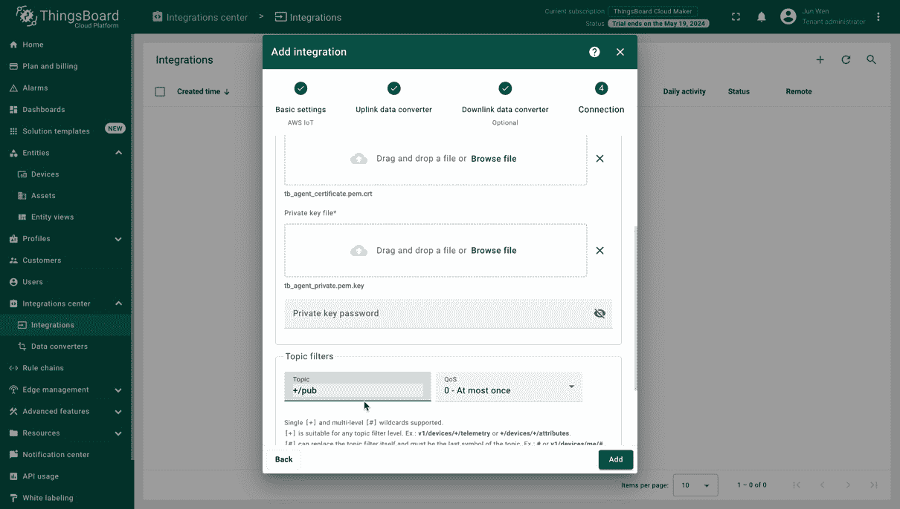

图 16.21 – 定义您想要订阅的发布主题

1.  您会注意到集成状态为**挂起**。

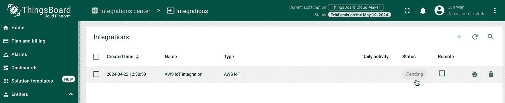

图 16.22 – 创建后集成状态为挂起

1.  几秒钟后点击**刷新**图标，您将看到状态变为**活动**，这意味着集成已成功。

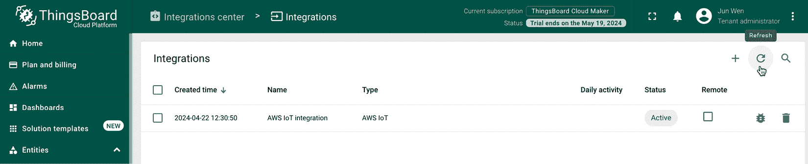

图 16.23 – 刷新后集成状态变为活动状态

1.  点击此集成。在**事件**下，您将看到以下示例中所示接收到的消息。

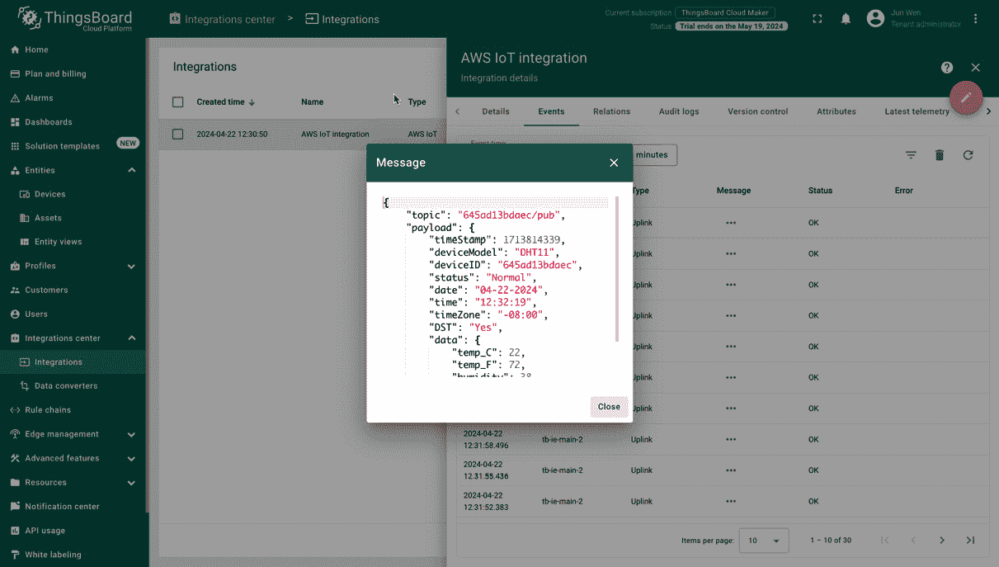

图 16.24 – 观察从 AWS IoT Core 接收到的消息

1.  点击**数据转换器**。在**事件**下，您将看到在**输入**下列出的接收到的有效负载，以及在**输出**下的输出有效负载，如图所示。

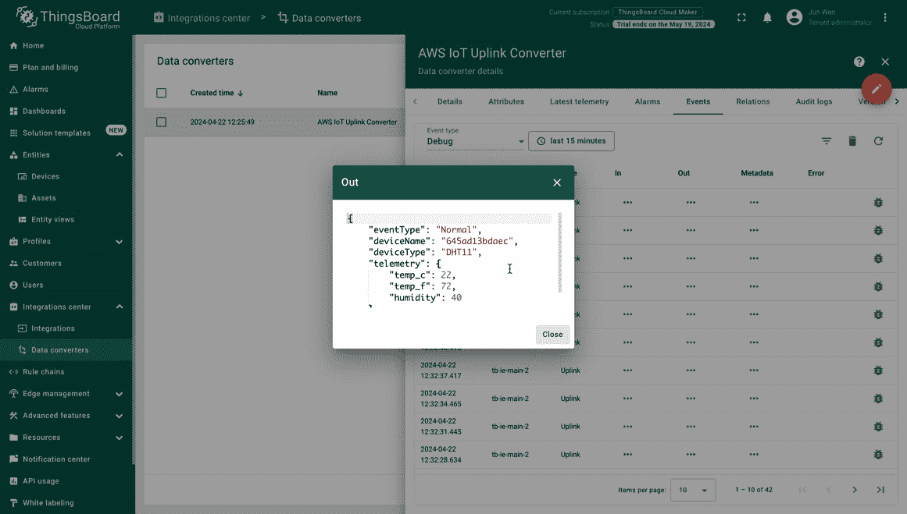

图 16.25 – 观察解码函数转换的数据

1.  点击**实体**。在**设备**下，您将看到 ESP32 设备信息已被记录，并标记为**活动**。

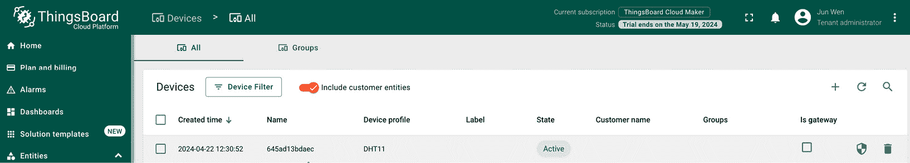

图 16.26 – ThingsBoard 中的设备中显示的新设备

1.  点击设备，在**最新遥测**下，您可以看到从 ESP32 读取的值。

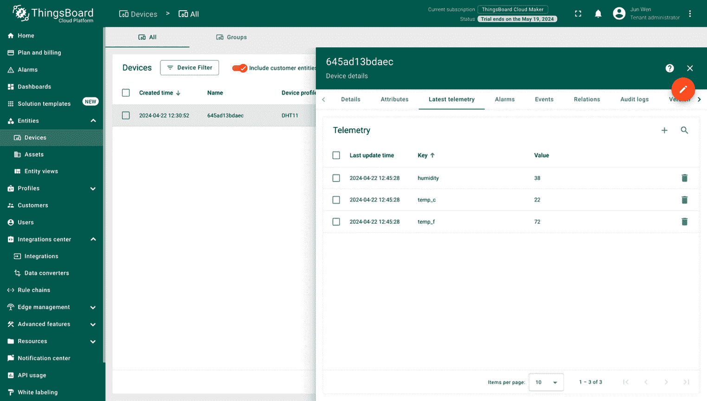

图 16.27 – 观察设备下的转换后的传感器数据

到目前为止，集成任务已成功完成！现在，我们可以进行最后一步，在 ThingsBoard 上生成实时仪表板。

# 任务 3 – 使用 ThingsBoard 生成实时仪表板

在这个任务中，我们将使用 ThingsBoard 提供的**仪表板**功能。

ThingsBoard 中的**数据仪表板**功能提供了一系列工具，用于创建可定制的仪表板。这些工具可以包括各种小部件，如图表、地图、仪表盘和表格，它们旨在进行实时和历史数据分析。用户可以设置仪表板进行动态监控，使用实时数据流进行，并利用高级数据聚合功能（如平均值、总和和计数）进行详细的历史数据分析。仪表板是交互式的，便于直接参数操作和彻底的数据探索。它们可以与受控访问权限共享，以实现协作而不会损害安全性。此外，响应式设计确保了在各种设备和屏幕尺寸上的可用性，这对于有效的物联网环境监控是一个重要方面。

除了使用**仪表板**功能进行自定义外，您还可以浏览**解决方案模板**，以检查是否有模板符合您的应用需求。

在本节中，我们将使用**仪表板**功能来创建自己的仪表板：

1.  在**仪表板**下创建一个新的仪表板。

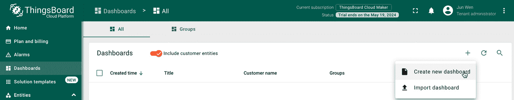

图 16.28 – 开始创建新的仪表板

1.  这里，您可以提供仪表板的标题和描述，例如`DHT11`和`温度和湿度数据测量`。

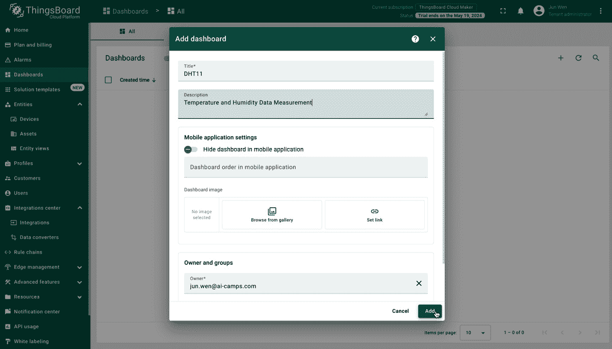

图 16.29 – 为新的仪表板命名

1.  在新的**DHT11**仪表板中，继续添加新的小部件。

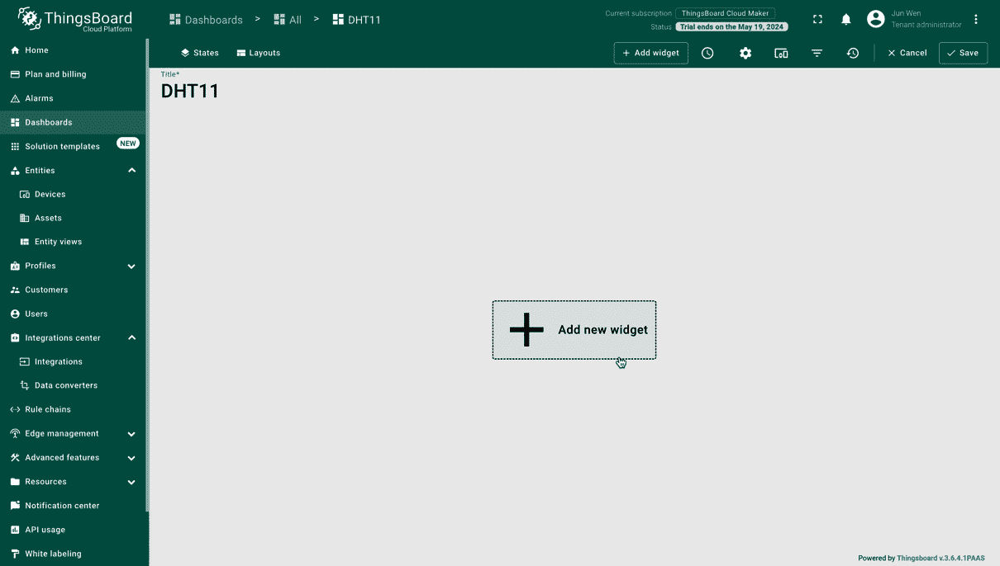

图 16.30 – 添加新小部件

1.  ThingsBoard 提供了各种小部件包。选择一个适合你用例的。对于我们项目，我们将从**图表**开始。

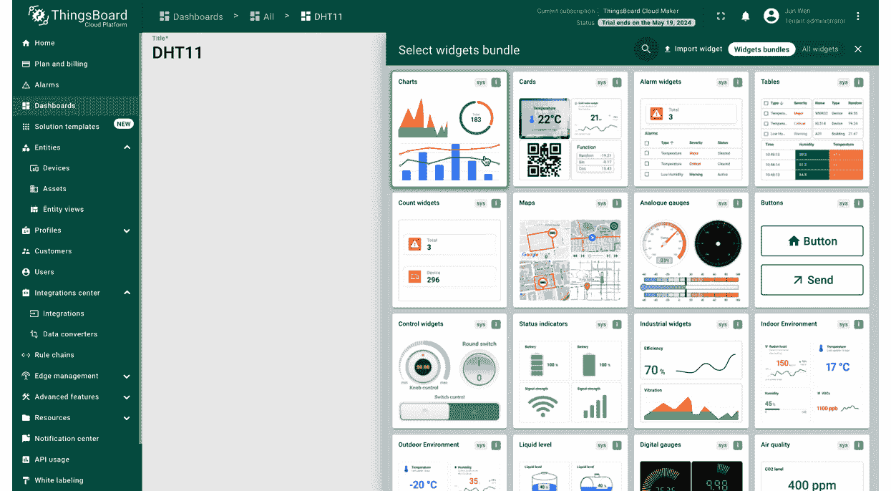

图 16.31 – 从小部件包中选择图表

1.  在**图表**部分，从各种可用小部件中选择**折线图**。

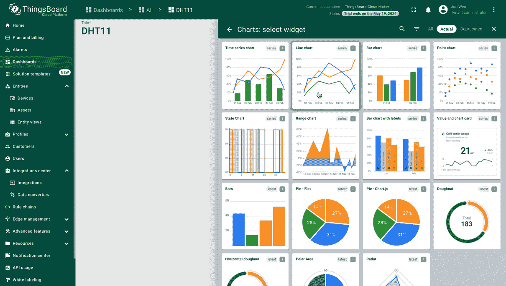

图 16.32 – 选择折线图

1.  点击**Datasource**下的**Device**，在那里你可以找到 ESP32 报告的设备 ID。选择它。

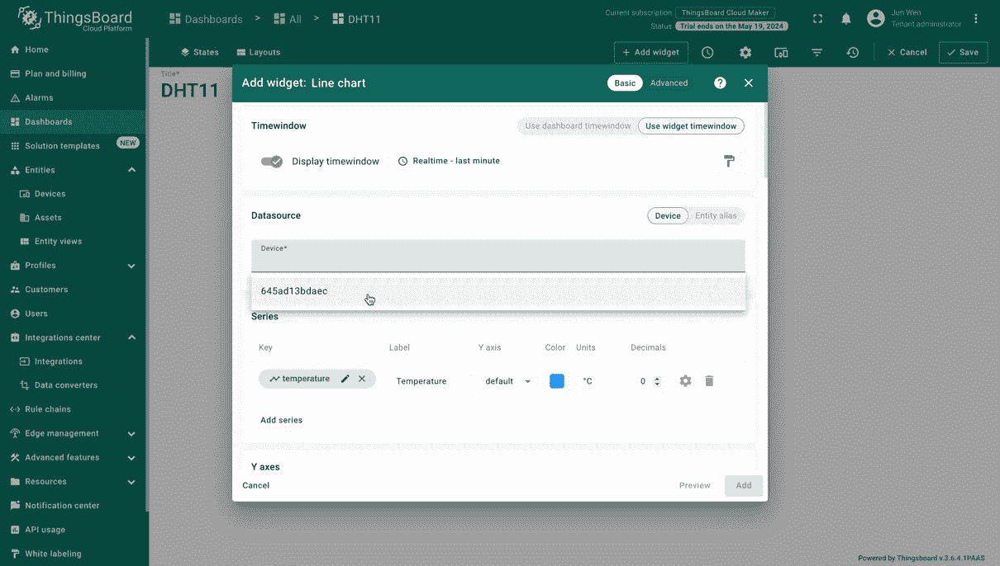

图 16.33 – 选择目标设备以显示其数据

1.  前往**Series** | **Key** | **temperature**，并点击*编辑*图标来编辑这个键。

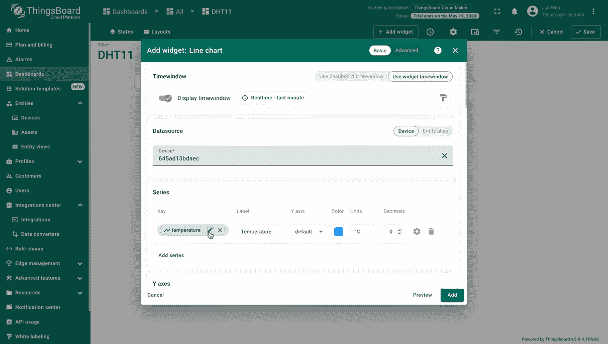

图 16.34 – 开始配置数据输入（键）

1.  点击**Key**值右侧的**x**来加载当前值。

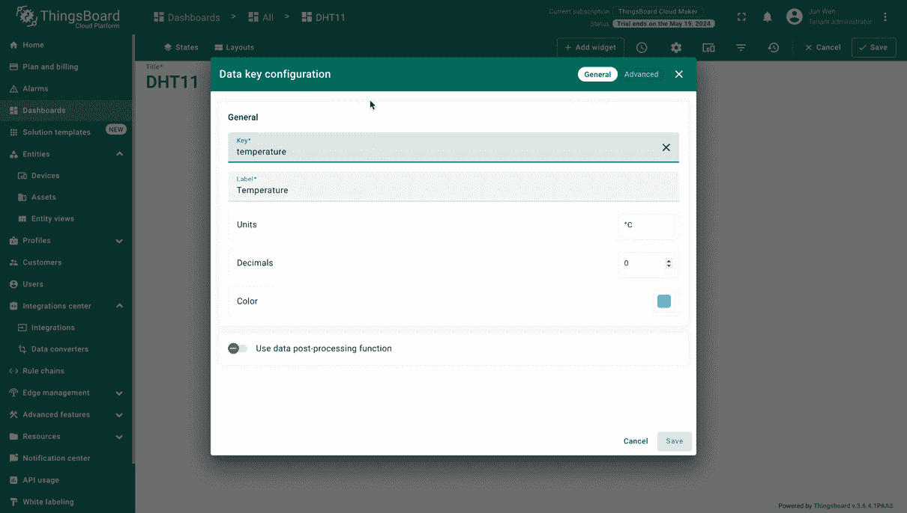

图 16.35 – 自定义数据输入格式、单位和外观颜色

现在，你将看到实际的数据输入（*key*），例如**temp_c**、**temp_f**和**humidity**。

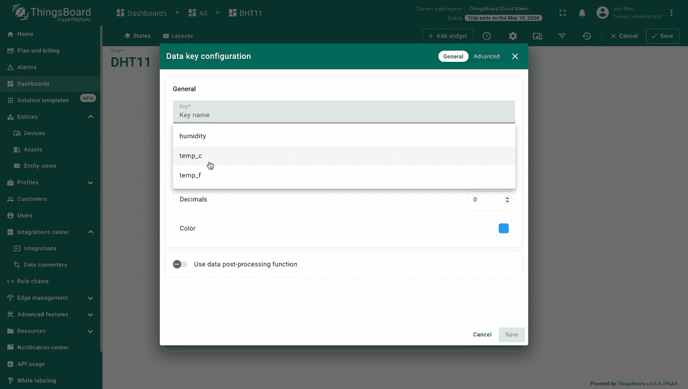

图 16.36 – 选择你想要显示的数据输入

例如，选择**temp_c**并点击**添加**。你将在仪表板上看到**temp_c**数据的动态折线图。

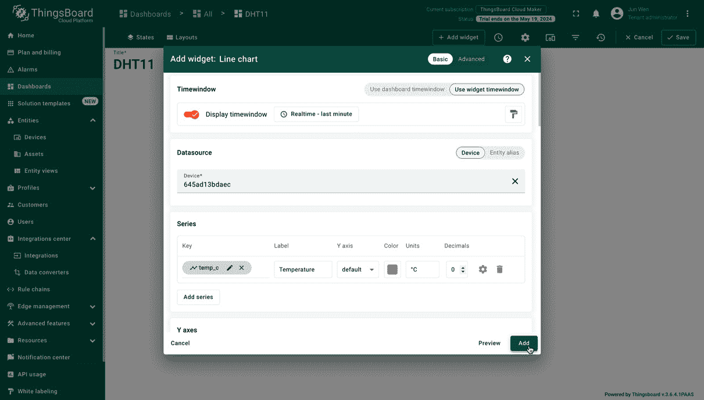

图 16.37 – 选择 temp_c 的数据输入

通过重复前面的步骤，你可以显示**temp_c**、**temp_f**和**humidity**的三条折线图。根据需要，你还可以向仪表板添加更多小部件。

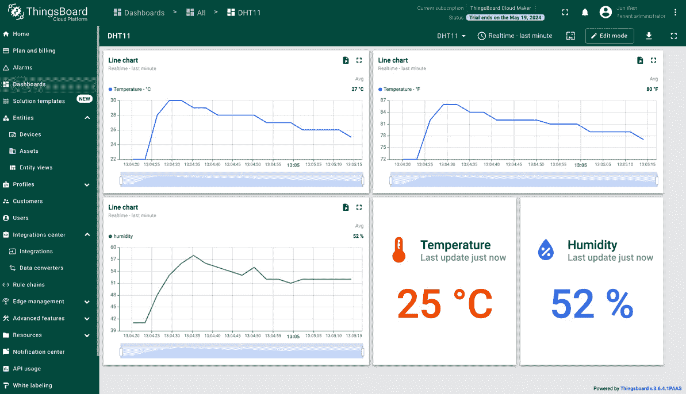

图 16.38 – 仪表板外观

你现在已经完成了在 ThingsBoard 上创建温度和湿度传感器数据可视化仪表板的任务！你现在可以最终在这个仪表板上显示实时传感器数据，你可以改变 ESP32 周围的环境温度和湿度条件，然后相应地观察仪表板上的数据图表变化！

# 摘要

反思我们从*第十一章*开始的旅程，在 ChatGPT 的帮助下，我们开始在 ESP32 上编写第一行 C++代码。我们收集了 DHT11 传感器的数据，将其连接到我们的家庭 Wi-Fi 网络，并将传感器数据访问和发布到 AWS 云。我们在 AWS 云中创建了多个任务来处理异常事件，并存储传感器数据以供未来查询。最后，我们完成了 ThingsBoard 的集成，以从 AWS 云中摄取数据，并创建了一个实时仪表板来显示 ESP32 报告的动态数据！

到现在为止，你应该能够在仪表板上观察到你的传感器实时数据了！对于这样一小包数据来说，这真是一个漫长的旅程，从你桌上的 ESP32 板上飞出几个字节，穿越互联网，到达 AWS，最终在商业级仪表板上显示出它们有意义的值。在这段旅程的这些元素中，最具挑战性的部分是在 ESP32 上编程 C++代码以捕获传感器数据，并协调传感器、LED 和蜂鸣器协同工作。多亏了 ChatGPT 和其他 AI 工具的智能编码技能，你不必过于担心。通过使用有效的提示框架和技能，你可以指导 ChatGPT 根据你的创新想法创建 C++代码！

展望未来，AI 工具在物联网开发中的集成将变得更加复杂。随着 AI 的不断发展，它将带来新的能力，简化复杂的编码任务并提升整体开发过程。例如，未来的进步可能包括更直观的 AI 驱动调试工具、高级代码优化技术，以及与各种物联网平台的无缝集成。

记住，物联网发展的旅程是持续不断且不断演变的。拥抱挑战，保持好奇心，并不断尝试新的工具和技术。有了奉献精神和正确的资源，你将充分准备，将你的创新物联网想法付诸实践，并在连接设备的世界中产生有意义的影響。
