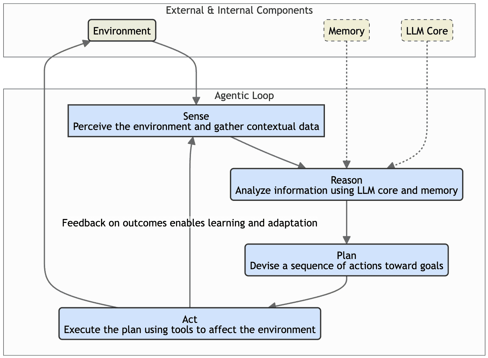
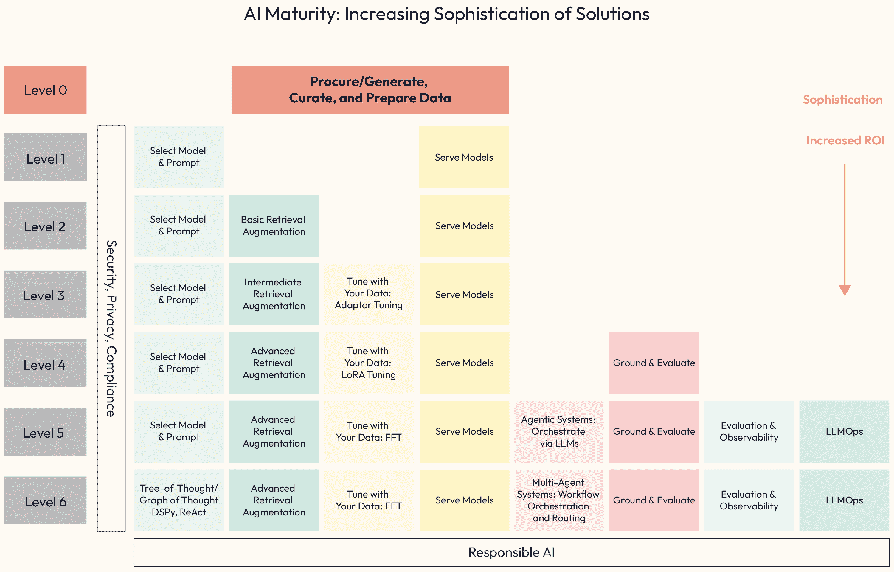
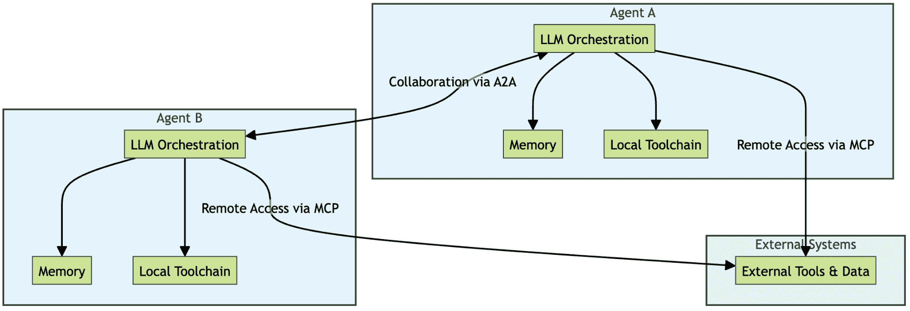

# 1

# 企业中的通用人工智能：格局、成熟度和代理关注点

**生成式人工智能（Generative AI，简称 GenAI**）是人工智能（AI）的一个领域，它允许系统通过学习大量数据集中的潜在模式来创建新内容或合成内容、推理、理解上下文并做出推荐。与主要分析现有信息的传统人工智能不同，GenAI 擅长产生新颖的成果，例如营销文案、功能性代码和其他创意内容。

尽管通用人工智能的潜力巨大，但将实验性概念过渡到稳健、生产级系统对企业来说是一个重大的挑战。成功部署这些系统需要战略性地关注安全性、可靠性和治理。为了构建可信赖的应用程序，架构必须包括稳健的防护措施，例如严格的输入验证和净化，以防止恶意攻击，以及政策执行机制以确保合规性。本章提供了导航这一旅程的基本框架，介绍了代理人工智能的核心概念和应用，并规划了一条从初始设计到负责任、生产就绪解决方案的路径。

通过让您掌握这些核心概念，本章提供了理解代理人工智能不仅是什么，而且为什么它代表了企业技术的一个关键转变所必需的基本战略框架。掌握这一基础知识是您设计、构建和部署有效且有价值的人工智能代理的第一步和最关键的一步。

在本章中，我们将探讨以下主题：

+   通用人工智能（GenAI）的变革潜力

+   商业应用概述

+   介绍代理人工智能系统

+   代理人工智能的解剖结构

+   通用人工智能成熟度模型：通往代理系统的路径

+   新的代理堆栈

+   阻碍生产级通用人工智能的挑战

**与您的书籍一起享受免费福利**

您的购买包括本书的免费 PDF 副本以及其他独家福利。请参阅序言中的“与您的书籍一起享受免费福利”部分，以立即解锁它们并最大化您的学习体验。

# 通用人工智能（GenAI）的变革潜力

GenAI 通过合成能力赋予系统类似于人类认知复杂方面的能力。它超越了简单的计算，参与到类似于我们自身创造能力的过程。正如人类的想象力激发艺术、讲故事和发明一样，GenAI 可以创建新的或合成的内容。这包括生成连贯的文本（营销文案、产品描述、电子邮件、社交媒体帖子等）、创作音乐、设计图像、编写代码以及产生其他新颖的成果，这些成果不是现有数据的简单复制，而是基于学习到的模式和结构产生的原创输出。

GenAI 从多个来源和格式中综合信息，揭示其训练数据中的模式，并展现出类似于人类推理的分析能力。它处理复杂信息，在数据中寻找模式，进行逻辑推理，识别重要关系（甚至潜在的因果关系），并构建逐步解决问题的方法或回答复杂问题。这使得它能够以非凡的深度理解和吸收上下文，超越关键词匹配，解释语言中的细微差别，考虑对话历史，整合用户偏好（用户建模），甚至整合外部知识。这种上下文理解对于提供不仅相关而且真正适合特定情境的回应至关重要，就像人类根据微妙线索和共同背景调整他们的沟通方式一样。

最后，这种模式识别和上下文理解相结合的能力使 GenAI 能够提供建议。类似于经验丰富的顾问可能会预测需求或提供个性化指导，这些系统可以识别行为或数据中的模式，以建议相关产品、信息路径或潜在行动，从而个性化互动并支持决策过程。这些综合能力——*创造*、*推理*、*理解上下文*和*推荐*——是 GenAI 变革潜力的基础。

为了使这些能力得以实现，GenAI 依赖于复杂的底层技术。在这些技术中，最为突出的是作为许多生成性应用认知核心的强大引擎，被称为**大型语言模型**（**LLMs**）。这些模型专门设计用于理解、处理和生成类似人类的文本和其他复杂数据，使它们在 GenAI 系统感知、推理和创造方面变得至关重要。

尽管这些核心能力非常强大，但它们的有效应用关键取决于一个不可或缺的元素：**上下文**。想象一下，将一个知识渊博且流利的对话者突然放入一个讨论的中间，就像 LLMs 一样。如果没有理解先前的对话、当前的主题或特定情境的细微差别，即使是口才最好的说话者也会提供无关、错误或不合逻辑的贡献。

尽管 LLM 有大量的预训练数据，但它们仍然需要相关、及时和准确的上下文来生成真正有用、安全和符合预期任务输出的结果。没有足够的上下文，LLM 可能会以几种方式产生错误的答案。有时，它们可能会生成听起来合理但实际上是错误或甚至荒谬的响应——这被称为**幻觉**。在其他情况下，模型可能会提供一个在一般意义上事实正确但与特定情况不适用、因此错误的答案，主要是因为缺少关键上下文细节。

让我们来看一个案例研究。考虑一个旨在帮助抵押贷款承保人的 AI 助手。承保人可能会问，“这个申请的最大允许债务收入比是多少？”一个基于其一般知识的 LLM 可能会回答“43%”。这个答案在许多美国传统**合格抵押贷款**（QM）的常见指南中是事实正确的。然而，假设未声明的上下文是承保人在评估佛罗里达州借款人的**联邦住房管理局**（FHA）贷款申请，并从特定的贷款机构 MegaBank USA 寻求融资。在这种情况下，*43%*的答案可能是错误的，甚至可能是误导性的。FHA 指南通常允许更高的**债务收入比**（DTI），可能高达 50%甚至 57%，在某些补偿因素下。

MegaBank USA 也可能有自己的内部贷款覆盖层，施加更严格的限制，例如 48%，即使 FHA 允许更多。此外，佛罗里达州的具体法规可能还会增加其他细微差别。真正正确的最大债务收入比（DTI）完全取决于这些上下文因素的交集：贷款计划（FHA）、申请人的具体补偿因素、贷款人的具体政策（MegaBank USA 覆盖层），以及可能的地域性法规（佛罗里达）。模型需要这种精确的操作上下文，这远远超出了一般贷款知识，以提供针对特定承保任务的正确和可操作的答案。因此，提供不充分或模糊的上下文是复杂、现实场景中不准确或误导性输出的主要驱动因素。

在整本书中，我们将深入探讨一系列基础原则，并将原则编号 1 定为*上下文为王*。

这在处理代理系统中的 GenAI（我们将在本章后面讨论）时尤其有效。你将了解到，制定有效的初始提示只是开始。为了真正解锁可靠和高质量的结果，尤其是在企业环境中由代理执行的复杂多步骤任务中，准确性至关重要，我们必须努力构建系统，使 AI 代理的推理核心（通常是 LLM）在操作循环的适当时间获得正确的上下文信息。这涉及到超越对模型静态内部知识的依赖，这些知识可能过时、不完整或缺乏关键领域特定细节。就像缺乏上下文可能导致简单的问答中出现上下文错误答案（即幻觉）一样，在代理中，上下文管理不善可能导致计划失败、采取错误行动，并损害代理的目标。

这就是本书中提出的**代理设计模式**变得至关重要的地方。正如我们将在*第二部分*中详细探讨的那样，这些模式为构建基于代理的系统中的常见挑战提供了结构化、可重复的解决方案，包括管理上下文的临界任务。例如，***任务委托框架***、***协作任务分解***或***稳健推理的迭代辩论***为设计**代理**和**多代理系统**提供了蓝图，这些系统能够处理复杂的信息流，保持情境意识，并完善他们的理解或计划。

为了更好地理解这个概念，让我们简要地看看我们将要详细探讨的一个这样的模式示例——***任务委托框架（监督器架构）***：

+   **上下文**：一家金融机构需要自动化一个复杂的多步骤业务流程，如贷款审批。一个单一的、单体代理将难以管理所有不同的规则、数据源和系统交互。

+   **问题**：如何可靠地自动化这个复杂的流程，确保每个步骤都由专家处理，并且整个过程从开始到结束都能得到连贯的管理？

+   **使用** **p** **模式的解决方案**：系统设计采用分层结构，使用一个中央的“监督器”或“协调器”代理，充当项目经理。这个协调器本身不执行单个检查。相反，它接收高级任务，将其分解，并将子任务委托给一组专门的“工人”代理。

+   **行动中的示例（贷款处理）**：

    1.  `LoanOrchestratorAgent`（监督器）接收一个新的申请。

    1.  它首先将验证提交的文件的任务委托给专门的`DocumentValidationAgent`。

    1.  一旦验证，它将下一项任务委托给`CreditCheckAgent`以获取申请人的信用记录。

    1.  最后，它将所有经过验证的信息发送到`RiskAssessmentAgent`进行最终评分。

+   **结果**：协调者收集每个专业代理的输出，组装最终结果以做出决策。这种模式使整个工作流程模块化、可预测且易于管理，因为每个代理都有一个明确定义的责任。

在设计和实施过程中考虑这些代理设计模式，我们将遵循最佳实践，并为将隐式护栏设计到架构和应用中建立一个更坚实的基础。这为代理行为提供了边界，增加了决策更加明智、行动更有可能与所需环境一致的可能性。此外，这些结构化交互，如迭代辩论或嵌入到模式中的特定反馈循环，为*自我纠正*创造了机会，使代理或代理系统在采取可能错误的行为之前，能够捕捉到不一致性或根据动态可用的环境或同行评审来细化推理。有效地利用这些模式对于减轻与上下文相关的失败、构建更可靠、更适应性强、最终更智能的代理至关重要。

因此，重点将放在**检索增强生成**（**RAG**）等技术上，这些技术动态地从外部来源检索相关信息以告知 LLM 的响应。我们将探讨将 AI 生成的答案基于可验证的源材料的方法，提供引用并确保事实准确性。我们还将研究如何利用更复杂的数据结构，包括数据库和知识图谱，以提供更丰富、更有结构的上下文，从而为您的 AI 代理提供更复杂的推理和更可靠的成果。掌握这些管理上下文和注入上下文的技术对于构建实用和可生产的代理 AI 解决方案至关重要。

现在我们已经概述了 GenAI 的核心概念，让我们将理论与实践相结合：探讨其商业应用将展示这些能力的实际价值，并为代理 AI 可以解决的特定问题奠定基础。

# 商业应用概述

GenAI 的通用性允许其在各种业务功能（横向应用）以及不同行业领域的特定环境中（纵向应用）得到应用。

## 横向应用（跨职能用例）

GenAI 提供强大的工具来提高标准业务操作的效率和效果：

+   **营销和销售**：超越 idx_c22e33d8b 基本个性化，GenAI 可以实现大规模的超级个性化客户体验和沟通。例如，一家邮轮公司可以使用 GenAI 根据乘客的个人档案（家庭、情侣、探险者等）动态建议船上活动、餐饮预订或岸上观光，这些档案基于过去的行为和声明的偏好。系统可以结合这些互动的反馈，不断优化其理解并提供越来越相关的未来推荐。

    对于定向广告，GenAI 可以促进对客户购买模式和不同产品之间关系的更深入理解（可能利用知识图谱），从而实现比传统预测方法更细致的营销策略。它还可以生成多样化的创意资产，如针对不同细分市场和平台的定向广告文案和营销材料。

+   **客户服务**：GenAI 可以 idx_2b706176 驱动复杂的聊天机器人和虚拟助手，提供 24/7 的支持。这些代理通常可以独立处理复杂的查询，深入知识库或与后端系统（例如，检查订单状态和处理退货）交互。它们可以设计成能够识别自己知识和权限的局限性，并智能地将问题升级给人类代理，可能还能平滑地转移对话上下文。

    这些代理还可以根据用户调整他们的沟通风格，根据用户的年龄、对话内容、语气和复杂性进行调整，与询问游戏更新的青少年和询问复杂账单细节的成年人进行不同的互动。

+   **人力资源**：尽管 idx_2a1e00cbGenAI 可以简化招聘任务，如分析简历与职位描述的匹配或生成初步面试问题，但其应用在人力资源领域不仅限于建立关键的安全线和道德准则。它可以帮助制定个性化的员工入职计划和针对不同角色和学习风格的培训模块。

    此外，GenAI 可以 idx_89a6ea88 通过提供系统来增强内部知识共享，这些系统可以回答员工关于福利、IT 程序或公司政策的问题，确保一致性，同时承认人力资源互动中涉及的人性因素和潜在的敏感性。

+   **金融和会计**：除了 idx_0e41e40a 自动化财务分析和协助报告生成外，GenAI 在需要高度准确性和控制力的领域发挥着关键作用。它通过识别非法活动的细微模式，显著提高了异常和欺诈检测能力。

    对于受监管的行业来说，GenAI 可以用来帮助执行政策遵守和实施财务安全线，确保流程和建议与内部规则和外部法规保持一致。

+   **运营和供应链**：GenAI 可以通过解释预测 AI 模型的输出并采取行动来提高运营效率。例如，它可以通过分析和采取复杂的预测需求（通常由预测模型生成）来优化库存水平，可能通过自动调整库存订单来实现。

    GenAI 可以通过处理动态路由建议（可能包含预测交通/天气数据）和协调调度来简化物流流程。它可以通过解释预测模型的警报、分析传感器数据以及自动生成详细的维护工作单或重新安排生产运行以适应所需服务，从而改善生产线管理并实现预测性维护。

+   **IT 和开发**：GenAI 可以通过代码生成加速软件开发；例如，它可以生成常见 Web 框架 API 端点的 Python 模板代码或根据所需数据的自然语言描述创建复杂的 SQL 查询。它可以通过分析错误日志和代码片段，并建议潜在的根源和代码修复来协助自动化调试。

    它还可以通过建议优化或在不同语言之间转换代码来促进代码重构，并基于函数的签名和要求自动生成多样化的测试用例。

+   **通用生产力**：GenAI 可以通过将冗长的研究论文压缩为关键发现、将复杂的法律合同总结为简单的语言要点，或从冗长的会议记录中提取行动项目来自动化文档摘要。

它通过允许用户用自然语言提出复杂问题（例如，“在欧洲客户 Q4 反馈中提出了哪些主要担忧？”）并从多个内部报告和文档中获取综合答案来增强信息检索和企业搜索，而不是仅仅提供链接列表。GenAI 有能力生成合成数据来增强数据集，例如，通过生成真实但人工的客户档案或交易记录来训练欺诈检测模型，而无需使用敏感的实时数据，或者通过平衡数据集来为机器学习训练提供平衡。

## 垂直或特定领域的应用

除了通用功能之外，GenAI 正在针对特定行业内的独特挑战和机遇进行定制：

+   **医疗保健**：GenAI 通过分析模拟结果和提出潜在候选者来加速药物发现。它通过解释预测模型的输出，如解释高风险患者评分或总结自动医学图像分析的发现，以供临床医生审查，从而协助医疗诊断。

    GenAI 可以使用结构化数据输入生成符合既定临床标准和隐私法规（例如，HIPAA）的临床文档（如出院总结）的初始草稿。它可以通过综合患者数据和研究成果制定个性化的治疗方案，确保所有建议都符合严格的临床政策限制和道德指南。

+   **金融**: GenAI 可以通过解释预测市场模型的数据并基于预定义的风险参数提出行动，从而增强算法交易策略。它可以通过综合解释预测风险分数和定性申请数据的报告来改善信用风险评估，确保建议与贷款政策和公平指南一致。

    GenAI 可以通过使用结构化数据和监管模板自动编制合规性报告，同时确保所有输出都经过人工验证，并遵守内部合规性限制。它可以提供个性化的财务建议，通过生成遵循适用性法规的 AI 驱动建议，例如 idx_d64e19e6 SEC 的**最佳利益监管规则**（**Reg BI**），以及内部政策和道德标准，确保负责任和合规的指导。

+   **零售**: GenAI idx_285189b6 可以基于客户的购买历史和浏览行为/历史，生成定制的*风格组合*，提供超个性化的产品推荐和购物体验，并通过启用虚拟试穿功能，展示服装物品在个性化头像上的外观。

    它可以通过实时调整价格来优化动态定价，考虑需求、竞争对手定价和库存水平。此外，它还可以自动化创建有针对性的促销活动，例如，起草针对通过购买模式识别的客户细分市场的个性化优惠的电子邮件营销活动。

+   **制造**: GenAI 通过考虑机器可用性、材料限制和订单优先级，优化动态工厂环境中的复杂生产调度和资源分配。它通过分析生产线上的图像，使用自动视觉检查系统提高质量控制，比传统方法更准确地检测产品中的细微缺陷或不一致性。

    它利用生成 idx_109f8fc1 设计技术，根据指定的性能限制（例如，承重能力、重量限制等）提出新颖、材料效率高的零件设计，通常产生适合增材制造的优化结构。

在此概述 GenAI 在商业应用中的情况之后，让我们探讨代理型系统及其在我们所描述的景观中的位置。

# 介绍代理型 AI 系统

尽管刚才讨论的应用涵盖了广泛的 GenAI 应用，但现代人工智能发展的一个重要焦点，以及这本书的重点，确实是 **代理人工智能系统**。这些系统代表了向更自主、目标导向的人工智能应用迈出的一步，更集成和主动地利用了核心 GenAI 能力。

一个 **AI 代理** 可以理解为一种系统，通常由 LLM 驱动，旨在感知其环境、做出决策并采取行动以实现特定目标。关键特征通常包括 *自主性*、*反应性*（对环境的响应）、*主动性*（向目标采取主动）以及，可能还有 *社交能力*，以与其他代理进行交互。它们通常在一个特征循环中运行，涉及感知、推理、规划和行动——我们将在稍后剖析其具体解剖结构。理解这个操作周期和代理的组件对于设计有效的代理解决方案至关重要。

我们可以广泛地将代理系统分类如下：

+   **基于代理的系统**：通常 idx_6ef93d26 涉及单个代理处理任务，利用其能力与系统或数据进行交互。

+   **多代理系统** idx_9336a669：使用多个，通常是专业的代理进行协作、协调和通信，以解决更复杂的问题。多代理系统强调去中心化控制和代理之间的动态交互。

随着我们迈向更复杂的 AI 实现，理解 idx_57f06f9f 代理和代理系统的概念至关重要。这些系统通常封装了 GenAI 的高级能力，是解锁更高水平自动化、复杂问题解决和最终商业价值的关键。认识到这种潜力，并学习如何有效地构建这些系统，从它们的基本解剖结构开始，是本书的主要目标。

# 代理人工智能的解剖结构

让我们详细探讨 agentic AI 的 idx_dc471266 结构以及这些系统内部是如何运作的。

图 1.1 – 阿里·阿桑贾尼博士的代理解剖图

前面的 idx_ab4a3743 图概念性地展示了代理人工智能架构，涉及多个代理在环境中的协作。理解核心组件对于设计和实现至关重要。

## 核心组件

主要构建块是智能体 idx_023c2d01 自身以及它们与之交互的环境（商业或物理环境）。在多智能体系统架构中，每个智能体半自主地运行，感知其环境、推理、做出决策并采取行动以实现目标。交互发生在数字环境中（数据流、API 和数据库）以及可能的物理环境中（通过传感器/执行器）。在多智能体 idx_72dc11c1 系统中，**共享记忆**或**通信协议**通常 idx_6b2c445a 充当协调中心，允许智能体交换信息、计划和目标。

### 智能体解剖

每个个体智能体都拥有一个内部结构，使其能够发挥作用：

+   **目标**：idx_21d19891 智能体寻求实现的目标或期望的结果，这些目标可能根据反馈或变化的环境进行更新。

+   **感知（**感知**）**：idx_65233d3e 这个组件是智能体从其环境（数字或物理来源，如 API、数据库和传感器）收集信息和数据的方式。这个感知过程是智能体获取上下文、对后续推理和决策至关重要的情境意识，强化了“上下文为王”的原则。一种流行的机制是通过协议（如来自 idx_9e842067Anthropic 的**模型上下文协议**（**MCP**））标准化模型访问上下文信息的方式（[`anthropic.ai/`](https://http://anthropic.ai/))。

+   **推理（**思考模型**，**认知**）：idx_c93bac48 核心处理单元，用于分析感知信息。这通常涉及大量使用 LLMs 来解释数据、理解关系（目标、感知和行动之间的关系）以及进行复杂推理。

+   **计划**：根据推理洞察和当前目标制定行动方案或步骤序列。

+   **行动（**行动**）**：使用可用的工具（例如调用 API、控制机器人元素和生成文本）在环境中执行计划中的行动。

+   **记忆**：存储 idx_6ab89f09 智能体的个体知识、过往经验、内部状态和所学信息，为决策提供上下文。

+   **协调（**可选；仅适用于**多智能体系统**）**：与其他智能体交互，通常通过共享 idx_221351e1 记忆或通信协议，以协调行动并共同实现集体目标。这可能涉及协商或遵循特定协议。这种协调特别建议通过**智能体到智能体**（**A2A**）互操作性 idx_d2a38def 协议进行。

    代理的执行能力通常由一种称为**函数调用**的机制 idx_569ae05d 启用。为了指导 LLM，开发者向它提供一组可用的工具。每个工具都定义了名称、其目的的清晰描述以及其所需参数的结构化模式。根据持续的任务，LLM 的推理核心决定何时使用工具、哪个工具最合适以及使用哪些参数。然后，模型生成一个结构化输出，例如 JSON 对象，表示其打算使用提取的参数调用该函数。代理的代码接收此信息，执行函数，并将结果反馈给 LLM 以继续其操作循环。

Agents idx_890ff2c9 在连续循环中操作：感知环境，使用他们的记忆和 LLM 核心对情况进行分析，规划向目标采取的下一步行动，对环境进行操作，然后感知结果（反馈循环）以更新他们的记忆并告知后续周期。这允许随着时间的推移进行适应和学习。

图 1.2 – 代理循环

此图显示了使代理能够自主运行的循环过程。它从感知环境以收集上下文开始，然后使用其 LLM 核心和记忆对情况进行分析并制定计划。代理随后使用其可用的工具执行该计划。此行动的结果创建了一个反馈循环，为代理在下一个周期中感知的新信息提供，使其能够随着时间的推移学习和适应其行为。

### 数据存储和环境上下文

代理高度依赖数据。他们的环境上下文 idx_69a047ff 包括以下内容：

+   **数字业务上下文**：这 idx_24614e7a 包括相关的数字数据 idx_6fda5527 来源，如非结构化数据（文本或图像）、结构化数据（数据库或知识图谱）和向量存储（用于在嵌入上进行高效的相似性搜索）。知识图谱对于提供实体和关系的结构化、语义理解特别有用。

+   **物理环境上下文**：对于与真实世界交互的 idx_eb89c7e5agents，这涉及到提供数据（摄像头或物联网设备）的传感器和允许物理操作（机器人臂）的执行器。

有效的代理通常需要访问多个数据存储，并必须整合来自不同上下文的信息。

## 关键架构特性

代理解剖结构内在地 idx_8246385a 使几个强大的 idx_a0086a23 架构特性成为可能。**模块化**通常是核心原则，允许系统设计成可以添加、删除或更新代理，而无需进行全面改造，从而提供灵活性。这种模块化有助于**可扩展性**，因为架构必须准备好高效地处理可能的大量代理、复杂交互和多样化的数据源。

内部感知-推理-行动循环，结合记忆和反馈机制，促进**适应性**，使智能体能够从经验中学习并随着时间的推移调整其行为。此外，智能体可以被设计为**多模态交互**，处理来自不同模态（文本、图像或传感器读数）的信息并采取行动。

最后，尤其是在多智能体系统中，诸如共享内存或定义的通信协议等机制可以促进**协作**，从而增强集体问题解决和决策能力。

| **特征** | **描述** |
| --- | --- |
| 模块化 | 系统通常可以设计为智能体可以添加或删除而无需完全重新设计，从而提供灵活性。 |
| 可扩展性 | 架构必须高效地处理可能有很多智能体、多样化的数据源和复杂的交互。 |
| 适应性 | 带有记忆和反馈的感知-推理-行动循环使智能体能够随着时间的推移学习和调整行为。 |
| 多模态交互 | 智能体可以被设计为处理和行动于来自不同模态（文本、图像或传感器数据）的信息。 |
| 协作（多智能体系统） | 共享内存或通信协议促进协调，使集体问题解决成为可能。 |

表 1.1 – 智能体解剖特征

基于我们所描述的解剖结构，构建稳健且有效的智能体系统是一项技术要求很高的任务。这不仅仅是组装组件的问题；它需要建立一个能力逐步掌握的发展历程。

在每个阶段都必须仔细关注关键的技术方面。架构师必须设计可扩展性以处理智能体数量和数据复杂性的增长。对于协作的多智能体系统，高效且低延迟的智能体间通信变得至关重要。

需要复杂的数据处理技术来有效管理多种数据类型，同时利用高级知识表示，如知识图谱，可以解锁更深入的推理。此外，确保核心认知功能的最佳 LLM 集成以及实施可靠的环境交互工具使用机制是**基本工程挑战**。

通常，掌握这些技术考虑因素不会一蹴而就；它反映了组织内能力的成熟。经历这一技术旅程通常意味着逐步通过不同的阶段，这个过程可以通过如**GenAI 成熟度模型**等模型来解释，我们将在下一部分探讨。

# GenAI 成熟度模型：通往智能体系统的路径

从简单的应用导航到复杂、价值驱动的系统，如我们刚才讨论的系统，需要战略视角。GenAI 成熟度模型 idx_c36011cd 提供了一个这样的框架，作为组织评估其当前能力并规划前进道路的战略工具。

它概述了不同的能力和复杂程度，展示了从基础活动到高级代理系统的典型进展。了解组织在这个模型中的位置有助于调整投资、技能发展和实施工作，以实现预期的业务成果。

重要的是，在通过这些级别，尤其是向代理和多代理系统（第 5 级和第 6 级）发展时，通常需要接受新的互操作性标准。

在这条路径上的关键级别包括以下内容：

+   **第 0 级** **–** **为 AI 准备数据（数据基础）**：基本起点。专注于获取、生成（包括合成数据）、清理、整理、准备和治理 AI 所需的数据。涉及数据质量、相关性、许可和可访问性。没有坚实的数据基础，难以达到更高级别。

+   **第 1 级** **–** **选择模型和提示/服务模型**：入门级交互。涉及选择合适的预训练基础模型，设计有效的提示（**提示工程**）以引发 idx_547d38c7 期望的响应，并通过 API 等部署（服务）这些模型，通常用于基本任务，如内容生成或基于模型固有知识的问答。基本功能调用的工具使用可能从这里开始，并最终演变为工具代理或完全成熟的代理。

+   **第 2 级** **–** **上下文增强（RAG）**：通过提供外部上下文来克服模型限制。RAG 技术是核心的，动态地从指定的外部知识源（公司文件或数据库）获取相关信息，以增强提示并提高 LLM 输出的准确性和相关性。这是向更事实性和有用的 AI 响应迈出的关键一步。一个例子是，聊天机器人使用 RAG 在回答员工问题之前从内部知识库中提取最新的政策细节。

+   **第三级** **–** **针对特定性（代理就绪的 LLMs）**：针对特定需求调整模型。这涉及到使用特定领域或专有数据对预训练模型进行微调。技术范围从**参数高效的微调**（**PEFT**）方法，如 LoRA 或适配器调整（仅修改模型的一小部分），到**全面微调**（**FFT**）（重新训练更多实质性的部分）。目标是使模型的知识、术语、风格或行为专业化，使其更适合专门的代理角色。这方面的例子包括在企业销售数据上调整模型，以便代理更好地理解销售特定术语和背景。

+   **第四级** **–** **基础和评估**：建立信任和可靠性。通过将输出与可验证的事实联系起来，通常是通过将响应链接回通过 RAG 检索的源数据（提供引用）来实现。实施稳健的评估框架和指标，以持续监控性能、准确性、公平性、偏见和安全，确保与负责任的 AI 原则保持一致。这方面的例子包括一个财务分析代理提供包含对特定财务报告的明确引用的摘要。

+   **第五级** **–** **单代理系统**：真正的代理 AI 的出现，应用前面描述的解剖结构。架构围绕一个单一、协调的 AI 代理（通常由 LLM 协调）构建，能够进行多步推理、规划、与工具交互（通过函数调用可靠地调用或通过 MCP 潜在地发现，并自主执行任务以实现目标。成熟的 LLMOps/AgentOps 实践对于监控、记录和管理代理生命周期至关重要。这方面的例子包括一个自主的旅行规划代理与航班和酒店 API 交互，根据用户偏好预订行程。

+   **第六级** **–** **多代理系统**：当前发展的前沿。涉及多个、通常是专门的代理协作、协调、沟通（可能使用 A2A 协议），并可能协商解决超出单个代理能力的复杂问题。需要复杂的架构来实现代理间通信、任务分配、冲突解决和协调。这方面的例子包括一个供应链优化系统，其中库存代理、物流代理和预测代理协作（可能通过 A2A），以动态应对中断。

图 1.3 – 成熟度模型级别

在本书的后续部分，我们将扩展 GenAI 成熟度模型的第五级和第六级，将它们作为独立的代理 AI 成熟度模型来呈现，以更好地捕捉所涉及的细微差别和复杂性的范围。

| **级别** | **标题/焦点** | **简要描述和关键活动** |
| --- | --- | --- |
| 0 | 准备数据（数据基础） | 获取、生成、清理、整理和治理数据。关注质量、相关性、许可和可访问性。基本先决条件。 |
| 1 | 选择模型和提示/服务 | 选择预训练模型，使用提示工程，并通过 API 提供基本任务（例如，生成、问答）的服务。基本工具使用（功能调用）。 |
| 2 | 上下文增强（RAG） | 使用 RAG 获取外部上下文（文档、数据库）以增强提示，提高准确性和相关性。例如，聊天机器人检索政策信息。 |
| 3 | 调整以实现特定性 | 使用特定领域的数据对模型（PEFT 或 FFT）进行微调，以专门针对代理角色的知识、术语或行为。例如，调整以适应销售术语。 |
| 4 | 基础和评估 | 实施基础（将输出链接到来源、引用）和稳健的评估（准确性、偏差、安全性）以实现信任和可靠性。例如，代理引用来源。 |
| 5 | 单个代理系统 | 围绕一个执行多步任务（推理、规划、通过功能调用/MCP 使用工具）的自主 AI 代理构建系统。需要 LLMOps/AgentOps。例如，旅行预订代理。需要基础（引用）和稳健的评估以实现信任和可靠性。例如，自动 SAR 报告代理。 |
| 6 | 多代理系统 | 部署 idx_4eff3785 多个专门化的代理，它们协作、协调、通信（通过 A2A），并协商以解决复杂问题。例如，供应链代理协作。基础。在这里，多个专门化的代理在结构化、自上而下的工作流程中运行。通常由中央监督员管理，以确保可预测性和可审计性。高级。在这个层面，代理也可以在去中心化或蜂群架构中协作、协商并达成共识，以解决高度动态的问题。 |

表 1.2 – GenAI 成熟度级别

这个成熟度模型表明，实现复杂的代理 AI（第 5 级和第 6 级）依赖于在先前级别上构建能力，从数据基础到上下文增强和专门调整。它为组织评估其当前状态并规划技术和组织步骤以实现其期望的 GenAI 和代理能力水平提供了路线图。

虽然 GenAI 成熟度模型提供了路线图，但我们在这本书后面介绍的行为设计模式则是推动您沿着该路线前进的工具。重要的是要认识到，您组织达到的成熟度水平是您选择实施的具体模式的直接结果。

通过确定一个目标能力，例如，一个必须完全可审计且对金融交易安全的系统，你可以逆向工程你的架构需求。这允许你的组织集中其资源和投资，掌握实现该特定可靠性级别所需的四到五个关键模式。这种方法不是无目标的“构建 AI”，而是实现了一种有目的且成本效益高的工程路径。通过专注于这些选定模式的实施，你确保每一次技术投资都能直接转化为验证的成熟度和商业价值状态。

现在我们对代理有了更深入的了解，让我们来讨论开发代理的构建块。

# 新的代理堆栈

随着系统从独立的提示向之前描述的代理架构演变，模型和代理能够可靠地与工具和彼此交互的能力变得至关重要。

这涉及到理解和可能实现新兴 AI 互操作性堆栈的关键层：函数调用、MCP 和 A2A 协议。

函数调用使代理推理组件内的 LLM 能够智能地触发特定工具（例如，在旅行助手中的 `book_flight`(destination="Tokyo")`，贷款申请的 `get_credit_score`，或执行数据分析的本地 Python 脚本）。MCP 提供了一种标准化的方式来描述、发现和安全的调用工具（包括天气服务、计算器、向量搜索实用程序或针对特定企业应用的 API，如 `verify_property_appraisal`），作为独立的、可互操作的服务，增强模块化。

A2A 为不同代理之间的结构化任务委派和协作提供了一个协议，这对于多代理系统（第 6 级）至关重要。掌握这些互补层通常是构建具有更高成熟度阶段特征的模块化、可扩展和鲁棒代理系统的基础。

在后面的章节中，我们将扩展 GenAI 成熟度模型的第 5 级和第 6 级（单代理和多代理系统）到其自身的代理人工智能成熟度级别集合。

## 启用代理通信：从工具到协作

让我们探讨 Anthropic 的 MCP 和 Google 的 A2A 协议之间的区别：

+   MCP 主要关于单个 AI 代理/LLMs 如何连接到工具、数据和外部系统。把它想象成给你的 AI 提供访问它完成工作所需的一切，例如搜索工具、数据库或预构建的提示。这是垂直整合：将代理连接到其工具。

+   A2A 关注的是不同 AI 代理如何相互交流，无论它们来自哪个公司或框架。这就像给 AI 代理一个共享的语言，以便它们可以协作、委派任务并以团队工作。这是水平整合，将代理连接到其他代理。

这里有一个简单的思维模型：

+   MCP = AI 代理连接到工具

+   A2A = AI 代理相互连接

注意，这些协议被设计成可以一起工作：

1.  一个编排器代理使用 A2A 将任务委派给其他代理。

1.  这些代理使用 MCP 来访问他们需要的工具和数据。

1.  结果通过 A2A 流回，完成一个强大、协作的工作流程。

让我们看看这些协议如何共存。以下图表显示了一个分布式多代理架构，其中包含两个代理（代理 A 和代理 B），每个代理独立运行，如下所示：

+   本地 AI 堆栈（LLM 编排、内存和工具链）

+   通过 MCP 访问外部工具和数据

图 1.4 – 使用 MCP 和 A2A 的分布式多代理系统

代理 A 到代理 B 的远程访问由 A2A 协议提供便利，该协议强调了代理注册和发现的两个关键组件：

+   **代理** **服**：一个暴露代理 A2A 接口的端点

+   **代理** **卡**：一种用于宣传代理能力的发现机制

为了使代理能够有效地使用这些外部通信协议，它必须首先拥有一个强大的内部架构。现在让我们深入了解那些使代理能够处理信息、推理并决定其行为的核心组件。

## 代理内部结构（为了简单起见，A 和 B 通用）

代理的内部结构由三个核心组件组成：LLM 编排器、工具和知识以及内存。

LLM 编排器作为代理的推理和协调引擎，解释用户提示，规划行动，并调用工具或外部服务。工具和知识模块包含代理在执行期间可以调用的本地实用程序、插件或特定领域的函数。内存存储持久或基于会话的上下文，如过去的交互、用户偏好或检索到的信息，使代理能够保持连续性和个性化。这些组件都在代理的运行时环境中本地访问，并且紧密耦合以支持快速、上下文感知的响应。它们共同构成了每个代理自包含的“大脑”，使其能够自主行动。

有两个远程层，我们将在接下来的小节中讨论。

### MCP 服务器

这在连接代理到外部工具、数据库和服务方面发挥着关键作用，通过标准化的 JSON-RPC（一种无状态的、轻量级的远程过程调用协议，使用 JSON 作为其数据格式）API。代理作为客户端与这些服务器交互，发送请求以检索信息或触发操作，例如搜索文档、查询系统或执行预定义的工作流程。

这种能力允许代理动态地将实时外部数据注入 LLM 的推理过程中，显著提高其响应的准确性、基础和相关性。例如，代理 A 可能使用 MCP 服务器从 ERP 系统中检索产品目录，以便为销售代表生成定制见解。

### 代理服务器

这是通过 A2A 协议使 idx_6f439738 代理可寻址的端点。它使代理能够从同伴那里接收任务，使用服务器发送事件（SSE）响应结果或中间更新，并支持格式协商的多模态通信。

与此相辅相成的是代理卡，这是一个发现层，它提供了有关代理能力的结构化元数据，包括描述、输入要求和允许动态选择给定任务的正确代理。代理可以在交互过程中委派任务、流式传输进度并调整输出格式。

我们刚刚描述的代理栈为构建复杂、互联的代理系统提供了强大的技术基础。然而，拥有蓝图和成功建造建筑是两回事。将这些强大的概念从 idx_73645c92 实验性**概念验证**（**PoCs**）过渡到稳健、可靠和可扩展的生产系统需要克服一系列复杂挑战。我们现在将关注这些关键障碍。

# 阻碍生产级生成式 AI 的挑战

尽管 idx_cb8958b1 潜力巨大，应用领域不断涌现，但将生成式 AI 倡议从实验性 PoCs 过渡到稳健、可靠和可扩展的生产级系统对许多组织来说是一个重大挑战。构建和部署这些系统，特别是具有复杂结构和交互的高级代理式 AI，需要克服复杂的技术、运营、法律和伦理挑战的交织网络。成功应对这些挑战是超越炒作并实现可持续业务影响的关键。

成功毕业 PoCs 在很大程度上取决于战略和组织准备，而不仅仅是技术可行性。证明明确的企业价值和投资回报率至关重要，因为许多试点项目因缺乏可量化的收益而停滞不前，这些收益无法证明进一步投资的合理性。

在业务单元、IT、法律和合规团队之间实现广泛的利益相关者一致，并制定明确的计划将运营整合到现有工作流程中，这是至关重要的。此外，确保强大的问题-解决方案匹配——将生成式 AI 的能力适当地匹配到业务需求——可以防止技术的误用。

最终，实现价值也严重依赖于有效的变革管理策略，以准备劳动力，并通过可用和值得信赖的系统集中精力推动用户采用。

任何成功的通用人工智能（GenAI）部署的基础是数据治理和质量。确保训练数据的法律权利（数据所有权和许可）是关键的第一步。系统的性能深度依赖于访问高质量、相关且无偏见的数据。

低质量的数据会破坏所有后续的努力，特别是对于需要准确环境感知的代理。克服与数据集成相关的挑战通常涉及打破组织内部复杂的复杂数据孤岛。

与质量和治理一样，在处理敏感数据时维护隐私和合规性是不可或缺的，需要通过匿名化和加密等技术遵守 GDPR 或 HIPAA 等法规，这对于维护用户信任至关重要。

从模型和技术角度来看，生产系统需要高度的鲁棒性和安全性。模型和代理必须能够抵御对抗性攻击，并且健壮的输入验证和清理是至关重要的防御措施。

确保在多样化的真实世界场景中（领域适应性和泛化）保持一致的性能，并且需要管理模型或代理行为随时间可能发生的潜在漂移的机制。

对于与外部系统交互的代理，确保工具使用（例如，API 交互）的安全性至关重要。实现生产可扩展性需要适当的基础设施选择（云、TPUs/GPUs 等硬件）、高效的低延迟模型服务架构和强大的数据处理管道。通过成熟的 LLMOps/AgentOps 实践进行全面的监控对于管理整个生命周期变得至关重要。

此外，在技术集成现有遗留系统和设计有效、可维护的 API 方面通常存在重大的技术障碍；MCP 和 A2A 等互操作性标准旨在提供帮助。通过有效的上下文管理和扎根来最小化不准确或幻觉仍然是关键的技术焦点。

部署这些复杂的系统不可避免地会涉及资源相关的挑战。在数据科学、机器学习工程、软件开发和运营等领域获取和保留必要的专业技术往往很困难。此外，构建、训练、微调和运行大型模型或复杂代理系统相关的成本和资源限制可能很大，需要谨慎管理。

最后，所有这些考虑因素都涵盖在伦理和负责任的 AI 实践中。解决和减轻数据、模型和代理决策中的潜在偏见对于公平和公正至关重要。建立透明度、可解释性（理解代理或模型为何做出决策）和健壮的治理框架对于问责制和负责任的部署至关重要。遵守法律和伦理标准不是可选择的；它是构建可持续和值得信赖的 AI 解决方案的基础。

让我们看看一个失败可能是什么样子。一家大型电子商务公司开发了一个*退货与订单状态代理*来处理常见的客户服务查询，并减轻其 idx_2063ffd9 人工支持团队的负担。目标是提供即时、24/7 的支持，以应对两个最常问的客户问题：“我的订单状态是什么？”和“我如何退货？”。

然而，尽管目标明确且早期前景看好，但从受控试点到动态生产环境的过渡揭示了系统设计中的关键缺陷。

+   **PoC（原型验证）**: 在一个受控的实验室环境中，该代理取得了显著的成功。它被训练在一个精心挑选的 FAQ 集合上，并连接到一个干净、静态的订单数据库副本。当被问及“我如何退货？”或“订单#12345 的状态是什么？”时，它提供了完美、准确的答案。PoC 得到了批准，项目被快速推进到生产阶段。

+   **生产失败**: 一旦部署到实时网站，代理在数小时内开始出现惊人的失败：

    +   **糟糕的** **上下文管理**: 一位包裹因全国范围内的快递罢工而延误的客户询问，“我的订单#54321 本应昨天到达**。它在**哪里？*”代理只能访问内部订单数据库，看到状态是“已发货”，并反复回应，“您的订单#54321 已发货”。它缺乏快递公共服务中断的现实世界背景，无法提供有用的答案，导致客户极度沮丧。

    +   **幻觉和** **设计错误**: 一位客户询问了关于一款“最终销售”促销商品的退货政策。这项具体政策不在代理的 RAG 知识库中。而不是承认不知道，代理的 LLM 核心通过从标准退货政策中泛化来虚构了一个响应。它自信地告诉客户他们有资格获得全额现金退款，这是公司无法兑现的承诺，导致愤怒升级和财务核销以安抚客户。

    +   **纠缠的** **工作流程** **失败**: 代理没有被正确地整合到人工支持工作流程中。当它无法解决问题时，它的唯一功能就是说，“我无法帮助您。请联系支持”。它没有转接聊天，提供工单号，或把对话历史传递给人类。这迫使沮丧的客户不得不重新开始整个过程，破坏了任何潜在效率的提升，并恶化了客户体验。

在一周内，由于客户投诉不断升级、社交媒体上的负面提及以及代理错误的手动更正成本高昂，公司撤回了该代理。这个项目是一个鲜明的教训：在实验室中仅对干净数据进行成功 PoC 并不能保证生产就绪的系统。未能为现实世界上下文进行架构设计、处理边缘情况以及无缝集成到现有业务流程，将一个有希望的实验变成了代价高昂的失败。

以下表格将帮助组织您在将 GenAI 应用投入生产时可能面临的各种挑战类型。

| **挑战** **类别** | **关键** **考虑因素/****特定** **挑战** |
| --- | --- |
| 战略和组织 | 毕业 PoC（证明回报率、利益相关者一致、运营整合），确保问题-解决方案匹配，管理变革管理，并推动用户采用 |
| 数据相关 | 数据治理（所有权、许可），确保数据质量（相关、无偏见），打破数据孤岛，并确保隐私和合规（GDPR、HIPAA、用户信任） |
| 模型和技术 | 确保模型稳健性和安全性（对抗攻击、输入验证、漂移管理、安全工具使用），实现可扩展性（基础设施、服务），处理技术集成（遗留系统、API），实施监控和 LLMOps/AgentOps，以及最小化幻觉/确保准确性（扎根、上下文） |
| 资源相关 | 获取/保留必要的专业技术知识，并管理成本和资源限制（计算、开发） |
| 道德和负责任的 AI | 解决/减轻偏见，确保透明度和可解释性，建立治理框架，并遵守合规要求和道德标准 |

表 1.3 – 将基于 GenAI 的应用投入生产时的挑战和考虑因素

克服这一多方面的挑战集需要战略性的高层承诺、对基础设施和人才的重大投资、稳健的治理实践，以及超越实验，将 GenAI 和代理 AI 嵌入企业核心、价值驱动能力的明确路线图。

# 摘要

本章提供了企业环境中生成式人工智能（GenAI）领域的基础概述，从核心概念到复杂的代理人工智能系统领域的发展路径。

我们研究了 GenAI 的变革潜力、其潜在能力以及多样化的应用。我们强调了在实现可靠结果中上下文管理的关键作用，并介绍了 AI 代理的基本结构（感知、推理、计划和行动）作为构建更自主系统的基石。

GenAI 成熟度模型被提出作为导航发展的战略路线图，强调了在构建高级单智能体系统和多智能体系统时，互操作性标准（函数调用、MCP 和 A2A）的重要性。

最后，我们承认组织在将这些强大的技术从实验过渡到稳健的生产级解决方案时面临的重大挑战。

关键要点如下：

+   **GenAI 的价值是战略性的**：GenAI 提供了强大的能力，如推理和内容创作，但实现其商业价值需要一种战略性的、以生产为导向的方法，这种方法超越了简单的实验。

+   **上下文至关重要**：任何智能系统的可靠性都取决于有效管理上下文以防止错误，例如幻觉。这是系统设计中的核心挑战。

+   **智能体 AI 是一个结构性转变**：智能体 AI 代表了向自主、目标导向系统的转变。理解智能体的核心结构，即其感知、推理、规划和行动的能力，是构建它们的基础。

+   **GenAI 成熟度模型是路线图**：成熟度模型为企业提供了一条战略路径，概述了从基本应用到复杂的智能体系统的旅程，并突出了必须克服的关键挑战（例如，数据治理、安全和投资回报率），以从原型验证过渡到生产级系统。

+   **智能体策略正在兴起**：高级单智能体和多智能体系统的发展依赖于一个新兴的技术堆栈，包括如函数调用、MCP 和 A2A 等互操作性标准，以实现模块化、可扩展性和协作等关键特性。

在下一章中，我们将专门关注驱动许多智能体系统的引擎：LLM。我们将深入探讨选择、部署和调整 LLM，以确保它们真正“智能体就绪”，能够提供推理（即思考）、规划和沟通，这对于有效的智能体性能至关重要。

# 获取本书的 PDF 版本和独家额外内容

扫描二维码（或访问[packtpub.com/unlock](https://packtpub.com/unlock)）。通过书名搜索本书，确认版本，然后按照页面上的步骤操作。

*注意：请妥善保管您的发票。直接从 Packt 购买无需发票*
