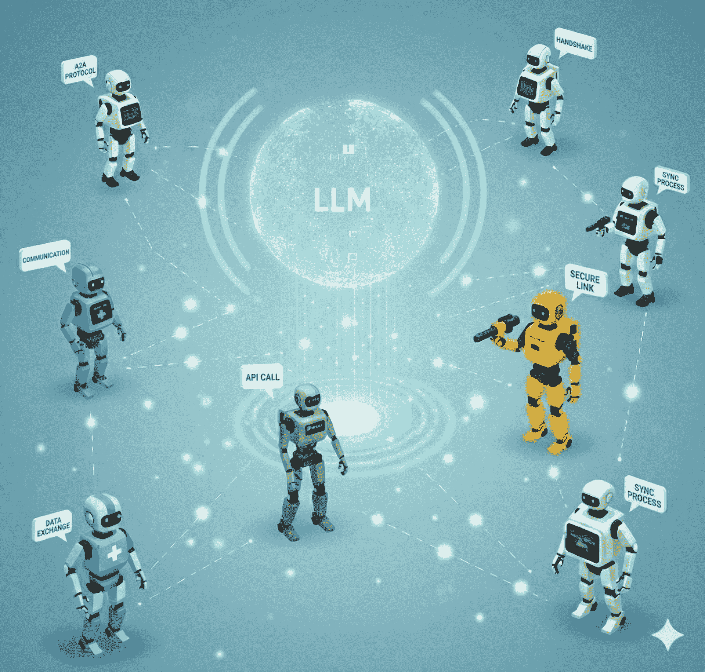
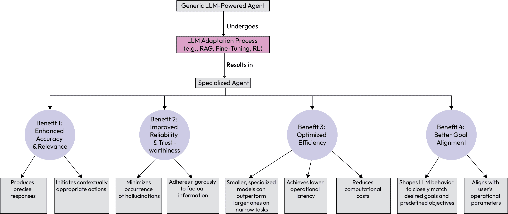
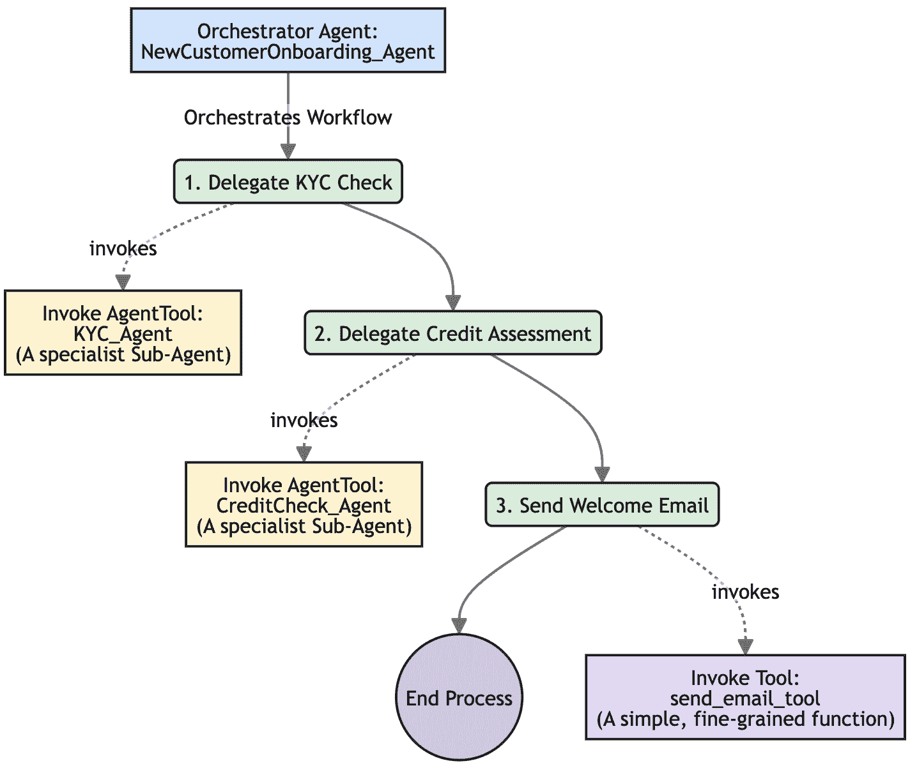
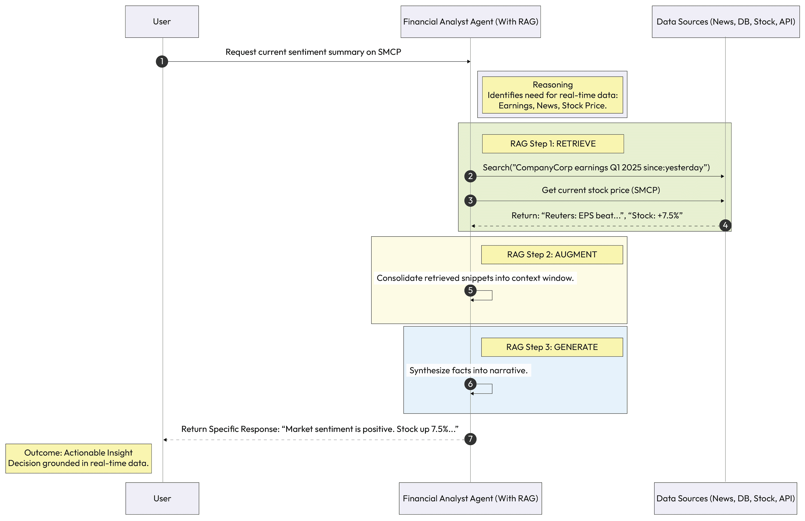
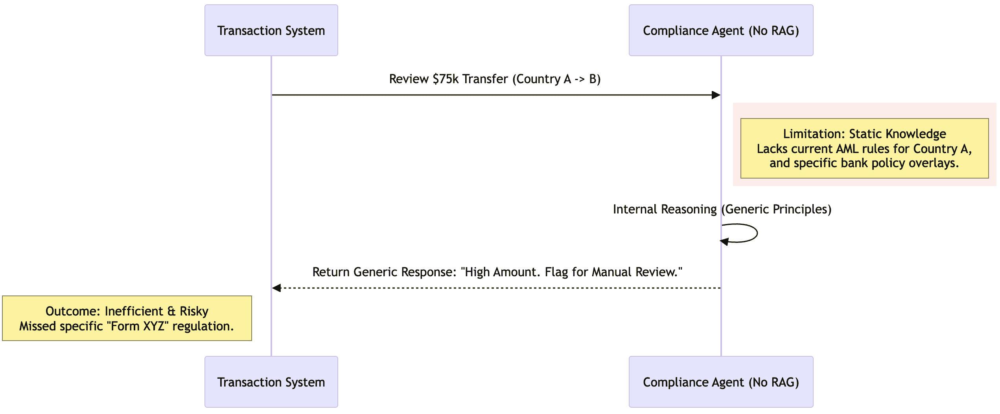
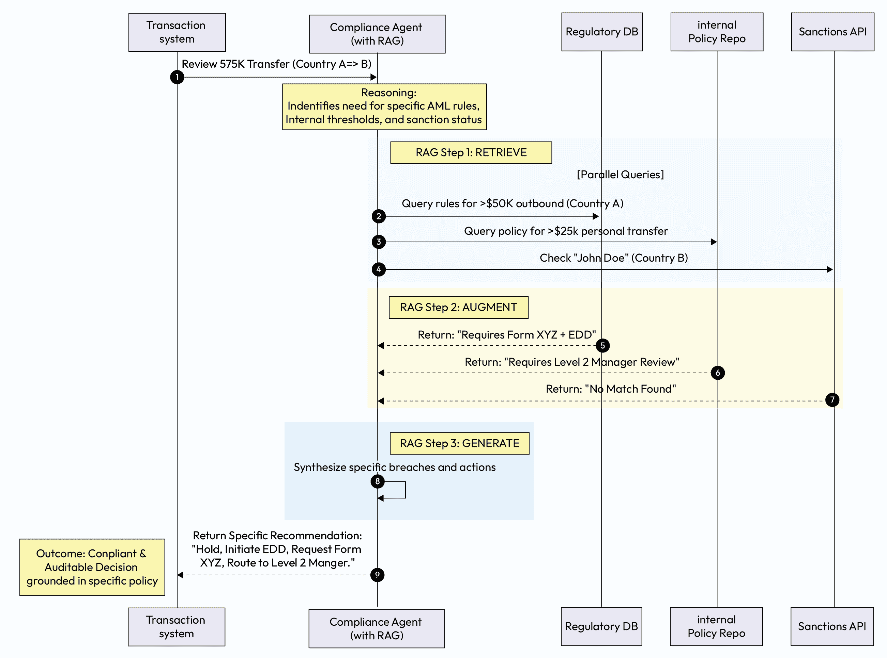

# 3

# 代理 LLM 适应的谱系：从 RAG 到微调

在上一章中，我们探讨了选择和部署大型语言模型（LLMs）的关键考虑因素，将它们确立为驱动人工智能代理推理和决策能力的认知引擎。我们看到了 LLM 在理解、规划和工具使用方面的能力对于代理有效执行其指定功能的重要性。

然而，创建真正熟练的人工智能代理的旅程很少仅限于选择一个强大、通用的 LLM。最初生成式 AI 的关注点集中在单体前沿模型上，但格局正在向智能代理的分布式社会演变。为了释放商业价值，这些代理必须在特定企业环境中正确、可靠和优化地运行，这需要重大的适应。



图 3.1 – 作为代理大脑的 LLM（由 Google Imagen 生成的图像）

在本章中，我们将探讨用于定制这些模型的技巧。我们将首先探讨为什么适应是必要的，概述为特定代理角色专门化通用 LLM 的好处。然后，我们将介绍分层代理架构作为构建高级多代理系统的具体蓝图。理解这个架构将为我们的核心讨论奠定基础，即您将使用哪些实用技术来构建和专门化系统中的代理，从 RAG 到微调和**上下文学习**（**ICL**）。

在本章中，我们将涵盖以下主题：

+   从通用 LLMs 到专用代理

+   用于业务流程自动化的分层代理架构

+   基于 RAG 的上下文增强（以代理为中心）

+   为代理能力进行微调

+   用于代理适应的上下文学习

+   将模型输出归一化

# 从通用 LLMs 到专用代理

虽然预训练的 LLMs 拥有广泛的一般技能，但它们的设计初衷是通才。相比之下，企业 idx_a46193f1 代理需要成为专家，针对特定领域如金融、医疗保健或法律服务进行定制，这些领域涉及独特的词汇、复杂的流程和专有数据，而通用模型无法完全理解。

另一个重要的转变是摆脱对单一集中式 LLM 的依赖。我们现在看到的是由多个代理组成的分布式系统趋势，每个代理可能都由自己的“大脑”提供动力。这些内部模型或 LLM 可以根据成本、性能、延迟或质量等因素而有所不同，并且可能包括不同的模态或架构，具体取决于代理的具体角色。这种演变可以通过常被称为 Router-Executor 或 Planner-Worker 模型的行业实践来体现。在这本书中，我们通过**工具路由**和**监督架构**模式将这些概念形式化在*第五章*中，并在本书的后面部分探讨支持它们的框架。

如前所述，代理的目的是执行专注的任务，例如确保严格遵守或进行风险评估，以精确性和行为细微差别，这是通用模型没有优化的。

因此，*调整* *LLM* 是弥合广泛潜力和专业应用之间差距的关键过程。这种定制对于将代理的认知核心转变为其指定角色的专家至关重要。

这种专业化的好处是明显且直接的。它导致准确性和相关性增强，因为代理学会了使用其领域的语言。它通过使模型扎根并减少幻觉风险来促进改进的可靠性和可信度。专业化还推动了优化效率，因为较小的、专注的模型可以在较低延迟和成本的情况下为特定任务提供卓越的性能。

最后，适应确保了更好的目标对齐，使代理的行为精确匹配其操作目标和限制。



图 3.2 – 代理专业化：针对特定任务执行调整代理

成功导航从通用 LLM 到为代理量身定制的智能核心的道路涉及对适应技术的战略选择。通常，这不仅仅是一个选择单一方法的问题，而是一个深思熟虑的策略组合，这些策略与代理的具体需求和背景、可用于适应的资源以及确保其有效和负责任地履行其角色的精确定制水平紧密对齐。

为了成功导航从通用 LLM 到为该代理量身定制的智能核心的道路，需要精心组合适应策略，这些策略与代理的具体需求紧密对齐。我们将从 LLM 选择的基础方面过渡到用于定制这些模型及其赋予的代理的多种技术，将它们转变为高度专业化和有效的组件，为更复杂的代理任务做好准备。

## 另一个用于智能体 AI 的成熟度模型

在本节中，我们将详细阐述成熟度的各个级别，这次特别针对智能体 AI，追溯从简单的集中式 idx_bc5dea5e 模型到复杂、去中心化的协作智能体网络的演变过程。这个范围有助于解释为什么随着智能体系统在复杂性和自主性方面的增长，不同的模式（如***多智能体规划***、***共识***、***资源分配***和***信任建模***）变得至关重要。这些模式的使用旨在解决在基于 LLM 和智能体应用采用和成熟过程中的每个阶段出现的特定挑战。

在*第一章*中，我们探讨了 GenAI 成熟度模型。该模型的最后两个级别是单智能体和多智能体系统。在这里，我们将使用以下描述的智能体 AI 成熟度模型将它们扩展到各自的复杂级别。

| **成熟度** **级别** | **描述** | **可扩展性** **见解** | **合规性** **见解** | **关键** **模式/方法** |
| --- | --- | --- | --- | --- |
| 1. 基本智能体系统 | 单个智能体可以半自主地处理特定、定义明确的任务，使用简单、预定义的工作流程和功能调用外部 API 或工具。 | 可适应但僵化。工作流程相对固定，这限制了创新潜力。 | 由于任务定义明确，因此易于管理，最小化了违反政策的风险。 | 单智能体、单个 LLM 调用工具，具有功能调用功能 |
| 2. 动态单个智能体工作流程 | 单个智能体可以根据手头的问题动态地从预选的工具或 API 中选择，从而实现更灵活的问题解决。 | 更通用且高效，因为智能体可以通过选择适当的工具来解决更复杂的问题。 | 由于预选了经过批准的工具，因此易于管理，但随着自主性的增加，需要仔细监控智能体的行为。 | 基本智能体系统/单个 LLM 调用工具，具有动态工具选择功能 |
| 3. 使用 ReAct 和 Reflexion 模式的内省模式 | 单个智能体使用诸如 ReAct 和 Reflexion 模式这样的方法，这些方法结合了逐步推理和自我反思。这使得它们能够从自己的行为中学习并通过反馈循环进行自我纠正。 | 反馈和自我纠正的引入使得智能体能够处理更复杂的任务并在时间上不断改进，从而为可扩展性创造了路径。 | 实时监控和纠正机制变得至关重要，以确保智能体在学习过程中与政策保持一致。 | ReAct（推理和行动）和 Reflexion |
| 4. 多代理系统 | 多个专业代理协作处理复杂任务。每个代理专注于不同的、不重叠的功能，它们的协调允许并行处理。 | 适用于高规模环境。任务可以分配给多个代理，从而实现复杂工作流程的高效并行处理。 | 管理起来更复杂。需要监控系统以确保所有半自主代理以符合规定的方式协作。 | 多代理系统 |
| 5. 高级多代理协调与元代理 | 引入“元代理”来监督和协调其他代理。这允许动态任务重新分配和实时计划调整。 | 增强适应性。由于元代理优化的任务分配，系统即使在不断变化的环境中也能有效地扩展。 | 元代理作为监管者，通过调整工作流程和按需重新分配任务来帮助维护政策遵守。 | 元代理政策遵守、高级代理协调和冲突解决 |
| 6. 自纠正代理：具有反馈机制的代理工作流程 | 高级多代理系统使用复杂的、多轮反馈循环。代理相互批评、纠正和改进彼此的输出，从而实现持续的过程改进。 | 极其可扩展，内置持续改进。这些系统可以实时进化，使其在动态任务中极为高效。 | 最复杂的。需要自动合规性检查和自我纠正操作，以确保代理在适应的同时与政策保持一致。 | 多代理学习系统 |

表 3.1 – 代理和 LLM 成熟度范围

为了为您的组织或特定行业或功能领域释放业务价值，我们需要确保组织在特定的企业环境中正确、可靠和优化地运行。这只有在我们能解决随着复杂性和复杂性增加而产生的每个问题和挑战的情况下才可行。模型和代理通常需要重大的适应、增强、护栏、政策遵守、引导和协作。

本章从 LLM 选择的基础方面转向了调整这些模型（以及它们所启用的代理）以成为专用、高性能组件的广泛技术。这些代理可以作为处理简单、定义狭窄的任务的原子单元，或者作为更复杂、复合系统的一部分，这些系统旨在处理复杂的流程。

## 代理的粒度

随着我们向构建更高级的系统迈进，一个关键的设计问题出现了：代理应该有多大或有多细？一个代理是否应该涵盖整个业务流程，或者它是否应该专注于作为更大 AI 编排一部分的简单、原子任务？

没有唯一的正确答案，因为最优粒度取决于问题。代理可以是一个细粒度、原子化的功能单元（例如，一个仅负责检查库存水平的代理）或一个粗粒度系统，它管理一个复合的多步骤流程（例如，一个编排整个订单履行过程的代理）。

我们接下来将要探讨的架构提供了一个实际模型，说明了这些不同粒度如何共存并有效协作。随着代理系统从简单到越来越复杂的架构发展，对适应性的需求显著增加，需要更高级和灵活的策略来维持性能、一致性和响应性。我们将研究为什么这种适应性不仅有益，而且通常对于提高代理的性能、可靠性和其与当前任务的关联性至关重要。

我们的探索将涵盖通过 RAG 在推理时刻动态丰富 LLM 知识的方法，深入探讨通过各种微调策略实现的更持久的模型修改，包括越来越受欢迎的 PEFT 方法，并检查 ICL 在即时行为调整方面的灵活性。

在整个讨论中，我们还将强调将这些调整模型的输出归因于保持准确性和培养信任的重要性，这是开发负责任和可靠的代理人工智能系统的不可协商的方面。

# 用于业务流程自动化的分层代理架构

我们即将展示的例子代表了从单一代理导航扁平工具列表的概念的重大演变。这种方法虽然对简单的自动化有效，但随着流程复杂性的增加，在扩展和保持清晰度方面存在困难。相反，这种架构 idx_7692b68c 建立了一个结构化、可观察的生态系统，它反映了运行良好的组织，旨在模块化和弹性。

在这个层次结构的顶部 idx_b6cbcff0 是粗粒度的 **编排代理**。这些代理的作用就像人工智能指挥家；它们的主要责任不是执行每一个小步骤，而是理解端到端业务流程，并通过设计和监督专门代理之间的协作来执行整体工作流程。

为了实现整体目标，它们将专门、复合的任务委托给一组细粒度的 **子代理**。每个子代理 idx_c60c50c1 都是一个专家，设计和调整以可靠地执行特定功能，例如分析文档、检查合规性或访问特定数据库。

在分层代理架构中，复杂的流程被分解并委托给专门的代理。我们可以用一个实际例子来可视化这个结构。



图 3.3 – 编排代理架构

在图中，`NewCustomerOnboarding_Agent` 扮演协调者或人工智能指挥家的角色，负责管理新客户入职的端到端业务流程。为了实现这个高级目标，它将具体、复合的任务委托给一组专业子代理。

它调用一个 `KYC_Agent` 来处理复杂的 **k**now **y**our **c**ustomer（**KYC**）检查，并调用一个 `CreditCheck_Agent` 来执行信用评估。对于更简单、原子化的任务，例如发送最终的欢迎邮件，协调者直接调用一个细粒度的 `send_email_tool`。这种架构允许协调者专注于整体流程，在不了解每个子代理或工具操作细节的情况下，将专业工作委托出去。

通过协调这些专业代理，协调者可以有效地管理和完成单个代理难以处理过于脆弱或复杂的复杂业务流程。为了了解这个强大结构的构建方式，我们将架构分解为其三个核心能力：定义每个代理的核心组件、组织它们的分层结构，以及确保可靠性的治理和可观察性框架。

## 核心组件：代理及其能力

为了实现上述的分层架构，我们必须从概念块转移到具体的编程模型。虽然现代人工智能开发通常依赖于高级框架（我们将在*第一章*5*中深入探讨），但理解基础代码结构对于构建生产级系统是至关重要的。

在这本书中，我们使用 Python 作为我们的主要实现语言。Python 在人工智能生态系统中的主导地位及其对面向对象编程的支持使其成为定义模块化、可重用代理组件的理想选择。通过为我们的代理定义一个基础蓝图，我们确保每个专家，从简单的电子邮件工具到复杂的协调者，都共享一个可预测的接口。

这种一致性是通过为每个代理定义两个基本方面来建立的：其核心定义和其能力范围：

+   **代理定义**：每个代理都是一个基础 `LLMAgent` 类的实例，确保系统中的所有行为者共享一套共同的基础属性和方法。这种继承提供了一致性并简化了开发。每个代理实例的核心是其认知，由一个分配的 LLM（大型语言模型）作为其“大脑”来驱动。这个认知核心负责所有高级功能：解释其环境、通过问题进行推理、制定计划以及在给定上下文中做出决策。

+   **能力范围——从简单工具到复杂的 AgentTools**: 代理的力量来自于它可用的“工具箱”。在这个架构中，这个工具箱不是一个简单的列表，而是一个能力范围，从原子函数到完整的自包含代理：

    +   **工具（细粒度函数）**: 工具是行动的最基本构建块。它是一个围绕单个函数或 API 端点的直接、无状态的包装，旨在执行一个特定的、原子的行动。这些是代理可以用来与其环境交互的基本行动动词。

        +   **示例**: 一个 `send_email` 工具，一个 `query_database` 工具，或一个 `calculate_amortization` 工具。

        +   **用法**: 工具最适合用于简单、确定性的任务，这些任务不需要复杂的推理或多步骤的过程来执行。它们是代理可以采取的简单、可靠的行动。

    +   **AgentTools** **(复杂、复合代理)**: 一个 `AgentTool` 代表了一种远为复杂的 idx_1433b274 能力。关键的是，一个 **AgentTool** 是一个完整、自包含、细粒度的代理（子代理），它已经被打包并暴露给其他代理使用作为一个工具。这是一个强大的 idx_acb95d76abstraction，它可以拥有自己的内部状态，一个多步骤的工作流程，以及自己专用的工具集。

        +   **示例**: 一个 `CustomerSentimentAnalyzer` 代理，它接受原始文本作为输入，内部使用几个 NLP 工具进行处理，并返回一个结构化的情感评分。一个 `DataProfiler` 代理，它接受一个数据集，内部使用各种统计工具进行全面分析，并返回一个全面的数据概览。

        +   **用法**: `AgentTools` 被设计成由一个编排代理调用，以委托一个复杂的多步骤子任务，允许编排代理管理工作流程，而无需了解子任务执行的具体细节。

## 层次结构：编排者和专家

这个架构故意不是平的。它是一个控制和专业化的层次结构，旨在反映 idx_51e57690 一个有效的组织结构。这允许有更大的模块化、监督和可扩展性。让我们看看结构：

+   **子代理（细粒度专家）**: 这些是系统的专业工作者或领域专家 idx_d5187179。每个子代理都是一个 `LLMAgent` 实例，设计和调整以成为特定复合任务或狭窄领域的专家。它们是打包进 AgentTools 的组件，使它们的专门专业知识对更广泛系统可用。

    +   **示例**: 一个 `KnowYourCustomer_Agent` 是一个子代理的完美例子。它的唯一目的是执行全面的 KYC 检查。为此，它可能有自己的内部工作流程并使用几个简单的工具，例如 `query_identity_database`、`check_sanctions_list` 和 `verify_address_api`。

+   **Orchestrator** **代理（粗粒度 orchestrator）**：这些是架构的管理者或流程 idx_a89dda0d 协调者。orchestrator 代理的主要职责不是执行低级任务，而是协调子代理以完成端到端业务流程。它们的流程设计旨在直接反映高级业务目标。

    +   **示例**：`NewCustomerOnboarding_Agent` 是一个 orchestrator agent 的完美例子。其主要职责是管理新客户入职的端到端业务流程。为了实现这一目标，它充当一个“AI 指挥家”，通过委派复合任务（如用于身份验证的 `KnowYourCustomer_Agent` 或用于财务评估的 `CreditCheck_Agent`）来协调专业子代理之间的协作。在管理复杂的流程的同时，它也可能使用自己的简单工具来完成直接的动作，例如使用 `send_email_tool` 欢迎客户。

    +   **工具箱** **组成**：orchestrator agent 的工具箱主要由 AgentTools 组成，这是它管理的专业子代理。它将工作委托给他们 idx_42f3a4f 以处理流程的复杂部分。orchestrator 可能也有一些自己的简单工具，但这些通常用于简单的任务，例如发送最终通知或记录整个流程的完成。

## 通过回调进行治理和可观察性

一个复杂的、多代理架构只有在我们能够管理和理解它的能力范围内才是好的。为了防止系统变成一个不透明的“黑盒”，一个强大的可观察性框架将是有益的，也是必要的。例如，考虑一个场景，idx_0476404bagent 适应失败，比如在一场高风险交易中，代理在调用工具时产生了无效参数的幻觉。没有细粒度的跟踪，这会导致无声的失败。通过实现回调，我们获得了立即检测这些异常所需的可见性。我们将详细探讨 idx_47c811cc 以减轻此类失败的具体模式，特别是针对 idx_1b0f7496 验证的 ***指令忠实度审计*** 和针对恢复的 ***自适应重试***，分别在 *第六章* 和 *第七章* 中进行详细讨论。

这种对代理工作流程的仪器化是 *第二章* 中讨论的 AgentOps 和治理原则的实际实施，在 *AgentOps:* *m**anaging LLMs in agentic systems* 部分。实现这一机制的是一套全面的回调系统，它为每个组件生命周期的关键时刻提供了钩子，从而实现了强大的实时调试、监控和治理。

让我们探索一些回调的例子：

+   **监控认知核心(**`on_model_start`/`on_model_end`**)：这些回调在智能体的“大脑”查询其 LLM 时触发，提供了一个对其思维过程的细粒度窗口。其目的在于记录发送给模型的精确提示、任何中间推理步骤、最终生成的响应以及关键性能指标，如令牌计数和延迟。

    这种详细的可追溯性对于审计智能体决策以符合规范、通过检查确切使用的上下文来诊断幻觉以及管理运营成本至关重要。它为在智能体行为中实现真正的可解释性奠定了基础。

+   **跟踪动作和交互(**`on_tool_start`/`on_tool_end`**)：每当调用任何`t`工具或`AgentTool`时，这些回调都会被触发，有效地记录智能体在其环境中采取的每一个动作。它们的目的在于创建一个不可变的审计轨迹，记录哪个智能体调用了哪个工具、精确的输入参数、返回的数据以及遇到的任何错误。

    这对于安全和调试至关重要，因为它有助于隔离故障。它有助于确定故障是出在智能体的推理中还是工具本身的执行中。在多智能体系统中，这提供了一个从协调器到子智能体的委托链的清晰视图。

+   **高级流程监督(**`on_agent_start`/`on_agent_end`**)：这些回调跟踪单个智能体执行运行的整个生命周期，从开始到结束。这为业务层面的监控提供了所需的宏观视角。它们的目的在于记录智能体的初始目标、最终结果（成功或失败）以及总持续时间。

    这些数据 idx_267a1cc4 直接输入到**业务流程监控**(**BPM**)仪表板 idx_3a895c30，对于跟踪和执行**服务**-**级别协议**(**SLAs**)至关重要，将智能体系统的技术性能直接与业务价值联系起来。

这种 idx_dbc8dd39 精炼的架构为构建智能体系统建立了一个强大且可扩展的范式。它创建了一个清晰且逻辑上易于维护和扩展的关注点分离：

+   **协调器**智能体拥有*什么*和*何时*——高级业务流程流程和协调

+   **子**-**智能体**拥有*如何*——特定、复杂任务的专家执行，他们已经为此专业化

+   **工具**代表了任何智能体可以用来与其环境交互的最基本、原子化的能力

通过协调专家子智能体（作为 AgentTools），协调器智能体可以以比单个、庞大的智能体尝试管理所有细节的方式更稳健、模块化和易于维护的方式来执行复杂、端到端业务流程。

集成回调系统是至关重要的最后一部分，确保整个多代理生态系统不仅强大，而且透明、可治理，真正准备好进行生产部署。

既然我们已经建立了一个组织代理的稳健架构，我们就可以将注意力转向代理本身。下一节将探讨将通用 LLM 转换为每个代理执行其角色所需的专业认知核心的关键过程。

# 上下文增强：阶段 1，使用 RAG 进行增强

如 第一章 所强调的，“上下文为王”的原则对于大型语言模型（LLMs）尤其适用，并且在其作为人工智能代理的背景下，其重要性变得更加显著。这些代理必须持续做出明智的决策并执行精确的行动；然而，这些能力高度依赖于获取当前、相关和准确的信息。

在这方面，RAG 已经成为了一种强大且广泛采用的技术，能够在推理点动态地为代理的 LLM 核心提供必要上下文，正是它所需的时候。RAG 不是让代理仅基于其 LLM 的静态、预训练知识运作，这些知识不可避免地会过时或缺乏关键细节，而是赋予代理从指定的外部和最新知识源主动获取相关信息的能力。

在一个代理系统中，RAG 作为增强代理操作智能的关键机制。代理通常需要与专有或快速变化的数据进行交互，这些数据范围从内部企业知识库，如详细的产品规格、机密的客户互动历史和内部政策文件，到动态的外部信息，如实时新闻流或当前市场数据。RAG 允许代理即时查询和检索这些特定信息，确保他们的行动基于最最新和相关的知识。

这种能力对于提高事实基础和显著减少幻觉倾向是基本的。当代理的回应或决策直接由检索到的文档提供信息时，它可以产生更准确的事实输出。此外，这通常允许代理提供对源文档的引用或参考文献，这极大地增加了代理声明的不透明度和用户对其的信任。

因此，代理行动的整体相关性得到了增强，因为检索到的上下文确保了代理的 LLM 在处理与当前任务或查询直接相关的信息，从而产生更连贯的计划、更合适的行动，并最终实现更成功的目标达成。

要真正理解 RAG 如何转变代理能力，让我们检查我们示例中代理的具体操作流程。我们将有两个对比的场景：一个场景是代理使用 RAG，另一个场景是没有这种动态检索机制。

## 由 RAG 驱动的客户支持代理

在当今 idx_f2dcd37e 要求严格的客户 idx_87d62250 服务领域，一个由 AI 驱动的客户支持代理通常是第一个接触点，其主要目标是提供快速、准确且真正有帮助的解决方案。

用户期望针对他们特定问题的解决方案，而不是通用的、浪费时间建议。然而，当遇到的问题高度特定于某个产品型号、涉及晦涩的错误代码，或者，关键的是，源于非常近期的变化，例如“昨晚”发生的软件或固件更新时，这种期望会带来重大挑战。

这些正是那些仅依赖通用 LLM 静态、预训练知识的代理可能会失败的情况。

为了使这一点更加清晰，想象这样一个客户支持代理，他负责帮助一个用户，该用户 idx_ddd26b48 遇到了一个常见但可能复杂的问题。用户正在寻求针对他们由于最近软件更新而出现的特定设备问题的即时、有效的帮助。让我们比较代理在有 RAG 和无 RAG 的情况下如何处理这个问题。

这是场景：

```py
My ProWidget X is showing "Error E404" after the update last night.
```

让我们看看流程选项：

**不带 RAG** **的** **流程** **，** **通** **用** **的** **失** **败**：

1.  **用户** **查** **询** **收** **到**：代理的 LLM 核心处理用户的语句。

1.  **LLM** **推** **理** **（** **基于预训练知识** **）**：LLM 访问其一般知识。它可能知道常见的错误代码或一般的故障排除步骤，例如重启设备。然而，如果“``ProWidget` `X`”或“`Error` `E404`”是新出现的或特定于最近的更新，这些信息将不会在其训练数据中。

1.  **生成的** **回** **复**：代理退回到通用的建议：

    ```py
    I'm sorry you're experiencing Error E404\. Please try restarting your ProWidget X. If that doesn't work, ensure your internet connection is stable.
    ```

1.  **结果**：这个回复没有帮助，因为错误是由于已知的固件错误引起的。用户仍然感到沮丧，解决时间增加，代理显得无效且脱离实际。

**带有 RAG** **的** **流** **程** **，** **专** **家** **的** **成** **功**：

1.  **用户** **查** **询** **收** **到**：代理的 LLM 核心处理该语句：

    ```py
    "My ProWidget X is showing 'Error E404' after the update last night."
    ```

1.  **LLM** **推** **理** **（** **识别需要特定信息** **）**：LLM 识别出“``ProWidget` `X`”、“`Error` `E404`”和“更新后”作为需要特定、可能最近的信息的关键实体。这触发了 RAG 过程。

1.  **RAG** **s****tep 1 (****r****etrieve)**: 代理对其集成的 idx_51aadda7 知识源执行针对性查询（例如，包含产品手册和最近服务公告的向量数据库）。查询可能为 `search("``ProWidget` `X Error` `E404` `firmware update June 2025")`。

1.  **RAG** **s****tep 2 (****a****ugment)**: 检索系统返回最相关的文档片段，例如以下内容：

    **片段 1（服务公告 #SB2025-06-26）**：

    ```py
    "Issue: Error E404 on ProWidget X units post-June 25th firmware push (v1.2.2). Cause: Firmware mismatch with server authentication. Solution: Advise users to perform immediate firmware update to patch v1.2.3 available via Settings > Update, or guide through firmware rollback procedure detailed in KB Article #FW789."
    ```

    **片段 2（知识库文章 #FW789）**：

    ```py
    "ProWidget X Firmware Rollback: 1\. Navigate to Settings > Advanced. 2\. Select 'Firmware Management'. 3\. Choose 'Rollback to Previous Version'..."
    ```

1.  **RAG** **s****tep 3 (****g****enerate)**: LLM 将检索到的权威信息综合成一个有帮助的、具体的和富有同理心的响应：

    ```py
    "I understand you're seeing Error E404 on your ProWidget X after the recent update. This is a known issue related to the new firmware. The recommended solution is to update to patch v1.2.3, which you can find in Settings > Update. Would you like me to guide you through that, or would you prefer to try a firmware rollback as detailed in our knowledge base?"
    ```

1.  **结果**：代理基于最新信息提供准确、可行的解决方案。这导致更快地解决问题，更高的用户满意度和展示了代理的能力。能够引用知识库文章进一步建立信任。

| **关键** **a****spect** | **没有 RAG 的代理** | **有 RAG 的代理** |
| --- | --- | --- |
| 知识来源 | 静态、预训练模型数据 | 动态、外部知识库（服务公告） |
| 代理洞察 | 没有具体错误或更新的上下文 | 理解错误是一个已知、最近的问题，有文档化的修复方法 |
| 生成响应 | 通用故障排除（`"重启设备"`） | 具体可行的解决方案（`"更新到补丁 v1.2.3"`） |
| 业务成果 | 用户挫败感，支持时间增加 | 快速解决，高用户满意度，信任增加 |

表 3.2 – RAG 在代理体验中的影响

让我们 idx_b3bfab21 比较这两种场景；我们可以清楚地看到 RAG 的 idx_aaaba05e 变革性影响。没有 RAG 的代理，受限于其静态训练数据，默认提供通用且无用的建议。它无法访问最新的服务公告，使其在处理及时、具体问题时变得无用，直接导致用户挫败感。

然而，RAG 的集成从根本上改变了代理的能力，从简单的对话者转变为合格的解决问题者。通过积极查询专用知识源，代理将推理建立在可验证的、实时事实的基础上。这使得它能够提供准确、可行的解决方案，建立用户信心并显著提高支持互动的有效性。

## 利用 RAG 进行及时市场洞察的金融分析师代理

在金融市场的快节奏世界中，决策必须基于最最新和最全面的信息。金融分析师代理通常负责综合大量快速变化的数据，为投资策略、风险评估或市场理解提供可操作的见解。

这里的挑战是极端的时效性；市场情绪可以在几分钟内根据新信息而改变，而依赖可能几个月前的训练数据的 LLM 将处于严重劣势。例如，收益报告的发布可以在一夜之间戏剧性地改变公司的前景和市场认知。为了弥合这一差距，组织通常构建一个检索管道，使用向量数据库索引实时流，然后代理在生成响应之前动态查询这些流。

为了说明 RAG 如何解决对时效性和深度的需求，考虑一个被分配了关键任务的财务分析师代理。这个请求要求在 24 小时内理解财务表现、即时市场反应和更广泛的情绪。

这里是场景：

```py
Generate a concise summary of current market sentiment regarding CompanyCorp (Ticker: SMCP) following their Q1 earnings release yesterday.
```

让我们看看流选项：

**没有 RAG** **，** **过时** **的** **通用**：

1.  **任务** **接收**：代理的 LLM 处理请求。

1.  **LLM** **推理（** **基于** **预训练** **k** **nowledge** **）**：LLM 对*CompanyCorp*的了解仅限于其最后更新训练，这可能是几个月前。它没有关于昨日具体收益数字、实时市场反应或随后的分析师评论的信息。

1.  **生成的** **r** **esponse**：代理生成一个通用、过时且因此不相关的总结：

    ```py
    "CompanyCorp is a leading technology company focused on cloud solutions. Historically, their earnings have shown steady growth..."
    ```

1.  **结果**：总结对理解*当前*市场情绪毫无用处。它对及时投资决策没有价值，并且可能导致基于旧数据的重大战略错误。

**流程** **w** **ith RAG** **，** **r** **eal-****t****ime** **s** **pecialist**：

1.  **任务** **接收**：代理的 LLM 处理对 SMCP 当前情绪总结的请求。

1.  **LLM** **推理（** **识别** **需要** **实时** **财务** **d** **ata** **）**：LLM 认识到需要非常最近的信息：SMCP 的 Q1 收益数字、过去 24 小时内发布的财经新闻以及股票表现数据。

1.  **RAG** **步骤 1（** **r** **etrieve** **）**：代理协调对多个连接的数据源的查询，如下所示：

    +   财经新闻 API（例如，彭博社和路透社）用于匹配`search("``CompanyCorp` `OR` `SMCP` `earnings` `Q1` `2025"` `since:yesterday``)`的文章

    +   一个用于 SMCP 官方 Q1 收益公告的新闻发布会数据库

    +   一个用于 SMCP 自昨日收盘以来价格变动和成交量的股票市场数据 API

1.  **RAG** **步骤 2（** **a** **ugment** **）**：检索并整合关键索引 _32397383 信息片段：

    +   **新闻** **片段 1**：

        ```py
        "Reuters (June 27, 2025): CompanyCorp (SMCP) Q1 EPS beats estimates at $1.25 vs $1.10 expected. Revenue up 15% YoY. Stock surges 7% in pre-market trading."
        ```

    +   **收益** **发布** **高** **亮**：

        ```py
        "CompanyCorp Q1 2025 Report: Net income $500M, driven by 25% growth in AI services division."
        ```

    +   **市场** **数据**：

        ```py
        "SMCP: Current Price $150.00 (+$10.50, +7.5% since yesterday's close)."
        ```

1.  **RAG** **步骤 3（** **g** **enerate** **）**：LLM 将这些多样化的、当前的数据点综合成一个连贯、数据丰富的总结：

    ```py
    "Following CompanyCorp's (SMCP) Q1 2025 earnings release yesterday, June 26th, market sentiment is strongly positive. The company reported an EPS of $1.25, beating analyst expectations, with revenues up 15% year-over-year, largely driven by a 25% growth in its AI services division. The stock has reacted favorably, currently trading up 7.5% at $150.00 since yesterday's close."
    ```

1.  **结果**：代理提供了一个及时且可操作的总括，明确基于最新的财务报告和市场反应。这为决策提供了真正的价值。

    idx_91fd8f72 以下图表说明了流程：



图 3.4 – RAG 与实时专家的示例流程

以下表格总结了这些明显的差异，突出了 RAG 的集成如何将代理的能力从通用描述转变为可操作的洞察：

| **关键** **a****pect** | **没有 RAG 的代理** | **有 RAG 的代理** |
| --- | --- | --- |
| 知识来源 | 静态、过时的训练数据 | 实时金融新闻 API、新闻稿和市场数据流 |
| 代理洞察 | 对最近事件一无所知 | 综合昨天的收益数据、市场反应和新闻 |
| 生成响应 | 通用的、无关的公司描述 | 数据丰富、及时且可操作的市场摘要 |
| 业务结果 | 误信决策和潜在的财务损失 | 信息的战略规划和及时的投资决策 |

表 3.3 – RAG 对金融分析师代理的影响

这 idx_26bb7ee4 金融分析场景突出了 RAG 如何使代理超越静态知识的限制。没有它，代理的输出是过时的，可能具有误导性，完全无法捕捉市场驱动事件的影响。在货币是主要需求的领域中，它没有任何价值。

然而，有了 RAG，代理变成了一个动态的信息综合者，积极寻求并整合最新的金融新闻、官方公司报告和实时市场数据，以构建对当前情况的综合理解。这对于有信息的交易和投资策略至关重要。

## 确保交易监控中遵守 RAG 的合规代理

在金融机构中，合规代理的角色至关重要，涉及对交易的细致审查 idx_a41fabe8，以防止非法活动并确保遵守不断演变的复杂法规。

风险极高，违规可能导致严重的监管处罚、财务损失和重大的声誉损害。承担此类责任的代理必须遵守特定的、通常与司法管辖权相关的反洗钱（AML）规则、可能比公共法规更严格的内部银行政策，以及不断更新的国际制裁名单。依赖通用 LLM 的基线知识来完成如此敏感和动态的任务将充满不可接受的风险。

想象一下在一家大型银行中的合规代理。其直接任务是审查一笔高价值、国际电汇。代理必须确定这笔交易是否根据所有相关的外部法规和内部银行政策是允许的。

这里是场景：

```py
A $75,000 wire transfer from an account in Country A to a personal account of Mr. John Doe in Country B.
```

让我们看看以下流程选项：

**Flow** **w****ithout RAG****, t****he** **r****isky** **g****eneralist**:

1.  **Transaction** **d****etails** **r****eceived**: 代理的 LLM 核心处理交易信息。

1.  **LLM** **r****easoning (****based on general pretrained k****nowledge)**: LLM 可能对 AML 原则有一定了解，但极不可能知道 A 和 B 国的具体、当前 AML 规定、银行的详细内部政策细微差别，或者约翰·多伊先生的名字是否最近出现在制裁名单上。

1.  **Generated** **r****ecommendation/****a****ction**: 代理基于过于简单的规则做出决定。它可能过于谨慎且效率低下，或者更糟糕的是，错过关键细节：

    ```py
    "Transaction amount is high ($75,000). Flag for manual review."
    ```

1.  **结果**：这种方法可能导致处理效率低下（标记过多良性交易）或更严重的是，如果错过了特定的新规定，则可能导致不合规。这使机构面临重大的法律和财务风险。

    此图说明了依赖预训练知识的局限性，其中代理错过了关键的监管细微差别，例如 *表格 XYZ* 的要求：



图 3.5 – 具有风险的通用工作流程

在 *图 3.5* 中突出显示的这种 *宁可靠安全不冒险* 的方法创造了操作瓶颈，并使机构容易受到模型 idx_008c7dec 所不了解的具体监管违规的攻击。为了填补这一差距，我们必须从封闭系统转向开放系统。让我们看看通过 RAG 注入实时上下文时工作流程如何转变，将代理转变为精确的守门人。

**AI** **o****rchestration** **w****ork****f****low** **w****ith RAG as** **the p****recise** **g****atekeeper**:

1.  **交易** **d****etails** **r****eceived**: 代理处理 75,000 美元的电汇详情。

1.  **LLM** **r****easoning (****identifies need for specific regulatory** **and** **policy d****ata)**: LLM 确定需要检查两国当前的 AML 规则、该特定交易类型的银行内部政策以及全球制裁名单。

1.  **RAG** **s****tep 1 (****r****etrieve)**: 代理查询其集成的、专业化的数据源：

    +   一个定期更新的关于 A 国大额出境转移和 B 国入境转移的规则监管智能数据库

    +   银行内部、版本控制的政策文档存储库

    +   包含收款人详细信息的实时制裁筛查 API

1.  **RAG** **s****tep 2 (****a****ugment)**: 系统检索关键、具体上下文信息：

    +   **监管** **s****nippet (effective June 1, 2025)**:

        ```py
        "All outbound wire transfers from Country A exceeding $50,000 USD to individual recipients in non-FATF member states require submission of Form XYZ and enhanced due diligence."
        ```

    +   **内部** **policy snipp****et (Bank Policy Manual v3.1.2)**:

        ```py
        "International wire transfers to personal accounts in Country B exceeding $25,000 USD require documented proof of purpose and automatically trigger a Level 2 Manager review queue."
        ```

    +   **制裁** **check res****ult (as of June 27, 2025)**:

        ```py
        "API Response: John Doe, DOB 1980-01-15, Country B - No active sanctions matches found."
        ```

1.  **RAG** **步骤 3（** **生成** **）**：LLM 处理这些检索到的事实，并生成 idx_1460ee3ba 详细、基于事实的推荐，并包含明确的行动计划：

    ```py
    "Transaction Review: $75,000 wire from Country A to John Doe, Country B.
    - Sanctions: Cleared. No matches found for John Doe.
    - External regulation: Breach. Transaction exceeds the $50,000 threshold for Country A, requiring Form XYZ and enhanced due diligence (EDD).
    - Internal policy: Breach. Transaction exceeds the $25,000 threshold for a personal account in Country B, requiring documented proof of purpose and a mandatory Level 2 Manager review.
    - Recommendation: Hold transaction. Initiate EDD, request Form XYZ, and obtain documented proof of purpose. Route to the Level 2 Manager review queue upon completion."
    ```

1.  **结果**：代理生成准确、高度合规且风险意识强的推荐。它从不同来源识别具体的、分层的需求，从而实现正确的处理并创建可审计的决策路径。

    下图说明了配备 RAG 的合规代理的工作流程：



图 3.6 – 利用 RAG 功能的代理示例工作流程

下表总结了这些差异，突出了访问实时数据如何将代理的角色从简单的警报生成器转变为复杂的合规伙伴。

| **关键** **方面** | **无 RAG 的代理** | **有 RAG 的代理** |
| --- | --- | --- |
| 知识来源 | AML 原则的通用、过时知识 | 实时法规数据库、内部版本控制的政策和制裁筛查 API |
| 代理的洞察 | 无法应用针对交易上下文的特定、当前规则 | 识别并交叉引用来自不同来源的多个、分层的合规义务 |
| 生成响应 | 简单行动（`标记为审查`） | 详细、多步骤且可审计的推荐 |
| 业务成果 | 高合规风险和财务罚款 | 最小化合规风险、可审计的过程和操作效率 |

表 3.4 – RAG 对合规代理的影响

在高风险的金融合规领域，RAG 带来的差异是明显的。没有 idx_9bfdb3cdRAG 的代理像一把钝器一样运作，依赖于通用的知识，无法在国际法规和内部政策的复杂和动态环境中导航。这种缺陷导致操作效率低下，或者更危险的是，遗漏合规义务，从而招致严重的罚款。

相比之下，配备 RAG 的合规代理作为一个精确且信息丰富的守门人。它动态地咨询相关的 AML 指令的最新版本、具体的内部银行政策和实时制裁名单。

这种检索和综合特定、多方面信息的能力使代理能够做出细微、风险意识强的决策，从而保护机构，确保可审计的合规性，并简化审查流程。

## 分析场景

这些详细的流程清楚地表明，RAG 不仅仅是获取更多数据；它关于在正确的时间为代理提供正确的数据，使他们显著更有效、更可靠，并与现实世界的操作需求保持一致。动态检索和整合上下文的能力对于构建真正智能和有用的 AI 代理至关重要。

RAG 实现的复杂性可以理解为一种光谱，每个级别都引入了更多的复杂性和能力。重要的是，这个光谱直接对应于在*第一章*中讨论的 GenAI 成熟度模型。随着组织的需求从简单的上下文增强发展到构建复杂、协作的代理系统，它所采用的 RAG 类型也将相应地进步。

下表将每个 RAG 复杂度级别映射到成熟度旅程中的相应阶段：

| **RAG** **l****evel** | **Description** | **Corresponding** **m****aturity** **l****evel(s)** |
| --- | --- | --- |
| "Vanilla" RAG | 一种从单一知识源进行基本上下文增强的直接方法 | **Level 2** **–** **Contextual** **e****nhancement**：这是 RAG 的基础应用，专注于通过提供来自单一知识库的外部上下文来克服基本模型限制 |
| Advanced RAG | 更复杂的方法来提高检索上下文的质量、相关性和可信度，通常来自多个来源 | **Level 4** **–** **Grounding** **and****e****valuation**：对重新排序、融合和引用来源的关注与对可靠、可验证和有良好依据的代理输出的需求完美契合 |
| Agentic RAG | 一种新兴模式，使用自主代理来管理和编排整个检索过程本身，通常涉及协作 | **Level****s** **5** **and** **6** **–** **Single and** **multi-agen****t** **s****ystems**：这种高级模式是成熟代理架构的标志，其中专门的代理协作执行复杂任务，在这种情况下，是复杂的信息检索 |

表 3.5 – 将 RAG 光谱映射到 GenAI 成熟度模型

无论复杂程度如何，任何 RAG 实现的根本目标始终保持一致：为代理的 LLM 核心提供特定、准确和及时的信息，以便以最大效率和可靠性执行其感知-推理-计划-行动周期。

虽然 RAG 通过将外部知识引入 LLM，为动态、推理时上下文化提供了一个强大的解决方案，但某些代理需求可能需要在 LLM 的内在知识或其固有的行为模式中进行更持久的修改。这种根深蒂固的适应通常通过微调过程实现，我们将在下一部分探讨。

# 为代理能力进行微调

微调是一种更深入、更持久的方法，用于 LLM 的适应，因为它涉及通过在专用数据集上进行额外训练，直接修改模型的内部参数或权重。

此过程使我们能够深入嵌入特定知识，培养特定技能，或塑造 LLM 的行为细微差别，使其更精确地与 AI 代理指定的角色和操作需求相一致。与 RAG 不同，RAG 在使用的时刻通过外部信息增强模型，微调从根本上改变了模型的本征知识库及其默认响应倾向。这使得模型在特定任务或特定领域内本质上更擅长。

## 领域专业化

在开发复杂的代理系统时，微调可以战略性地用于实现几个关键成果。一个主要应用是领域专业化。通过在一个综合的领域特定文本语料库上训练 LLM，例如法律研究代理的法律案例文件、诊断支持代理的医学期刊或合规代理的金融监管文件，模型在特定术语上变得更加流利。

它还更好地理解了该领域中的关键实体及其关系，并能生成在该领域内更加语境适当和准确的输出。这确保了代理真正“说出了其操作环境的语言”。

另一个关键目标是开发特定任务技能。代理通常被设计为在特定功能上表现出色。这些可能包括在特定编程语言中生成代码、将冗长的报告总结为预定义的结构化格式、从非结构化文本中提取精确的命名实体，或参与特定类型的对话。

通过在由这些特定任务的多个示例组成的集合数据集上微调代理的 LLM，可以显著提高其在执行这些任务时的熟练度和可靠性。例如，一个 LLM 可以在以下格式的数据集上进行微调：“用户请求” - ``>` `"正确的 API` `工具调用 _json``"` 对。这种训练将极大地提高代理可靠地使用正确参数调用外部工具的能力。

此外，微调对于行为对齐至关重要。这涉及到塑造代理的 LLM 以遵循期望的对话风格，例如，客户服务代理可能需要始终如一地表现出同情心，而技术支持代理可能需要非常简洁和直接。

它还可以用来确保模型能够以更高的保真度遵循复杂的多步骤指令。

这种对齐可以扩展到强化对特定伦理指南或安全协议的遵守，这些指南或协议可能尚未在基础模型中完全根植。例如，一个代理可以被微调，在执行可能不可逆的操作之前始终要求明确的确认。

## 调优范围：从参数高效的微调到完全微调

模型自适应或微调涉及一系列选项。这些选项从更简单、成本更低、耗时更少的技巧开始，例如**参数高效微调**（**PEFT**），一直到**完全微调**（**FFT**），其中模型的全部权重都会发生变化。因此，在考虑微调时，一个重要的选择在于 FFT 和多种 PEFT 方法之间。FFT 涉及更新 LLM 的所有参数或大部分参数。

PEFT 技术，如**低秩适应**（**LoRA**）、适配器调整或提示调整，提供了一种更资源友好的方法。这些方法通过仅修改模型现有参数的非常小部分或添加少量新的可训练参数来实现，同时保持大多数原始模型保持冻结状态。

对于代理开发，PEFT 方法通常具有高度优势。它们在计算效率上要高得多，并且通常可以用较小的数据集实现良好的结果。它们还显著降低了灾难性遗忘的风险，使得从单个基础 LLM 创建和管理许多不同的专用代理“个性”或技能集变得更加可行。

这种方法允许有一个多样化的专用代理生态系统，而不需要维护大量独立微调的大型模型的巨大开销。权衡的是，对于需要最深层次专业化的极其复杂任务，PEFT 可能无法达到 FFT 相同的绝对性能上限，在某些情况下，行为变化程度可能更加受限。

对于代理来说，FFT 的主要优势是能够在目标任务或特定领域实现非常深入的专业化和显著的性能提升。这允许对模型的本能行为进行广泛的修改。然而，FFT 在计算上非常昂贵，通常需要大型、高质量的训练数据集。它还可能带来“灾难性遗忘”的风险，即模型可能会失去其在初始预训练期间学习的一些有价值的一般能力。为不同的专用代理创建、管理和部署多个完全微调的大型模型也可能非常资源密集。

用于微调的训练数据也可以根据其性质和用途进行分类。**无监督微调**（有时称为领域自适应预训练），涉及使用针对目标领域的大规模未标记文本继续模型的预训练阶段。

这个过程有助于 LLM 彻底学习特定领域的词汇、风格细微差别和一般背景知识。对于代理来说，这意味着他们可以更好地理解和处理其专用操作环境中的信息。

**监督式微调**（**SFT**）另一方面，在精心挑选、标记的示例数据集上训练模型。这些示例通常以输入-输出对的形式出现，例如指令配对所需的响应，或问题配对正确答案。SFT 对于教授模型特定任务、如何准确遵循各种指令或如何以精确、期望的格式生成输出至关重要。对于代理来说，SFT 是教授他们如何正确执行特定动作或以与其设计个性和功能相符的方式进行沟通的关键。

在为代理的 LLM 核心设计微调策略时，理解 FFT 和 PEFT 之间的区别至关重要。这一选择会显著影响资源需求、可达到的专业化深度以及在企业内部管理多个专业化代理的整体便捷性。

下表从代理的角度提供了一个 FFT 和 PEFT 的比较概述：

| **特征/****c****onsideration** | **FFT** | **PEFT** |
| --- | --- | --- |
| 专业化深度 | 高。可能导致对特定领域、任务或代理行为的深度适应。 | 中等到高。对于许多专业化需求有效，尽管对于极其复杂或新颖的任务可能不如 FFT 深入。 |
| 计算成本（训练） | 非常高。需要大量的 GPU/TPU 资源和时间。 | 低至中等。比 FFT 的资源密集度显著低。 |
| 数据集大小要求 | 大型。通常需要大量高质量、特定任务的标记数据。 | 小型至中等。通常可以使用较小的数据集获得良好结果。 |
| 灾难性遗忘的风险 | 较高。更新所有权重可能导致模型失去一些通用能力。 | 较低。冻结大多数基础模型参数有助于保留通用知识。 |
| 资源影响（多个代理） | 高。存储和提供许多完全微调的大型模型成本高昂且复杂。 | 低。多个 PEFT 适应（例如，LoRA 层）对于不同的代理可以共享相同的基模型，大大减少开销。 |
| 对基础模型权重的影响 | 所有或几乎所有权重都被修改。 | 只有很少一部分权重被修改，或者训练了几个新的、小的参数集（例如，适配器和 LoRA 矩阵）。 |
| 实施和迭代的便捷性 | 更复杂且耗时，进行迭代和实验。 | 通常更快、更容易进行不同的适应实验，因为资源需求较低。 |
| 代理的典型用例 | 需要深度领域专业知识或高度专业化行为特征的代理，这些特征超出了 PEFT 的有效捕捉范围。 | 从共同的基 LLM 创建多样化的专业化代理（例如，不同的技能、角色和沟通风格）；资源受限环境中的代理。 |
| 代理的主要优势 | 对于特定任务/领域的最大性能和最深度的专业化。 | 效率、多专业化的可扩展性和保留一般能力。 |
| 代理的主要缺点 | 成本高、资源密集，以及失去一般知识的风险。 | 可能无法实现 FFT 在某些高度要求或细微的专业化中的绝对峰值性能。 |
| 示例技术 | N/A（涉及重新训练大多数/所有层） | LoRA、适配器调优、前缀调优和提示调优。 |

表 3.6 – FFT 与 PEFT 在针对代理的 LLMs 中的比较

对于许多代理应用，尤其是在开发一系列专用代理或需要在不产生巨大再训练成本的情况下调整代理以适应不断发展的任务时，PEFT 方法提供了专业化和效率之间的诱人平衡。它们允许组织有效地定制 idx_8ca97464 代理行为和知识，同时更可持续地管理资源。然而，当需要绝对最高水平的专业化且相关成本对代理的关键角色来说是合理的时候，FFT 仍然是一个可行的选择。

微调和特别是敏捷的 PEFT 方法提供了一套强大的工具，用于打造真正适合代理的 LLMs。这些技术为模型提供了必要的专业知识和精细调校的行为特征，使它们能够在指定的角色中具备能力、可靠性和效率。

通过微调实现的这种深度专业化对于创建高度熟练的代理至关重要。然而，代理也显著受益于能够快速适应即时、不可预见的情况或新指令的能力，而无需进行完整的再训练周期。我们现在将探讨 ICL 如何提供一种强大的机制来实现这种动态适应性能力。

# 上下文学习以适应代理

虽然微调提供了深入且持久的专门化，但代理通常能从立即调整其 idx_f52d33dc 行为的能力中受益，以应对新情况或持续交互中的特定指令。ICL 提供了这种非凡的适应性能力。

这允许 LLMs 能够有效地学习新任务或仅基于当前提示或对话的即时上下文中的信息和示例来修改其响应。

关键的是，这不需要对模型的基本权重或参数进行任何更改。这种即时学习的容量对于 AI 代理来说极为宝贵，尤其是那些需要动态适应新场景、变化的用户偏好或实时演变的指令的代理。

ICL 背后的基本机制涉及在提示中直接向 LLM 展示说明性示例。这可能是一个 **少量示例** 提示，包含少量演示，或者，特别是对于拥有大上下文窗口的模型，甚至许多示例（**多量示例** 提示）。

以下示例展示了所需的输入-输出行为、任务结构或响应风格。LLM 努力从这些上下文线索中推断出潜在的模式，并将这种推断出的理解应用于它遇到的新、类似的输入。

对于一个代理，它的控制逻辑会动态构建这样的提示，根据需要注入相关示例以引导其 LLM 核心。这样一个提示的简单概念结构如下：

+   **系统**: 您是 [任务领域] 的专业助手

    +   **示例 1** **输入**: 一种特定的用户查询或环境数据

    +   **示例 1** **输出**: 示例 1 中代理期望的响应或行动

    +   **示例 2** **输入**: 另一种特定的用户查询或数据

    +   **示例 2** **输出**: 示例 2 中代理期望的响应或行动

    +   **当前** **情况** **输入**: 新用户查询或代理需要处理的当前环境数据

    +   **代理的 LLM** **输出**: LLM 尝试生成与提供的示例一致的响应或行动

这种通过直接向代理的 LLM 核心展示期望内容来引导代理行为的能力 idx_f2fd97b5 转化为几个实际优势。以下表格概述了代理可以利用 ICL 进行动态、即时适应的关键场景，以及代理进行此类操作的内在线索。

| **用例/优势** | **场景描述** | **使用 ICL 的代理方法** | **代理的内部“思考”（理由）** |
| --- | --- | --- | --- |
| 针对特定需求的任务演示 | 代理必须以它未经过微调的新、临时格式生成输出（例如，从非结构化文本生成的三部分报告）。 | 构建一个包含几个演示所需输入到输出转换的提示（`原始反馈 -`>` 格式化摘要`）。 | "这个特定的请求需要新的输出格式。我将构建一个包含示例的提示来引导 LLM 为此实例生成内容。" |
| 动态风格适应 | 代理根据对话线索检测到用户的不满，并确定其标准事实语气可能会升级情况。 | 动态增强 LLM 的上下文，加入同理心或安慰性响应的示例，以引导对话的语气。 | "用户的情绪是消极的。我需要调整我的沟通风格。在生成下一个回复之前，我将添加同理心响应的示例到我的上下文中。" |
| 在不可预见的情况下阐明工具使用 | 代理需要调用一个工具或 API，使用罕见或复杂的参数组合，这可能导致格式错误的高风险。 | 在请求 LLM 格式化新调用之前，在提示中包括一个类似的复杂工具调用的完整、成功的示例。 | “这个工具调用很复杂，有几个可选参数。我将检索一个类似的成功示例并将其添加到提示中，以确保 LLM 准确地格式化这个新请求。” |

表 3.7 – ICL 在动态代理适应中的实际应用

这些 idx_a5af15d9 应用在动态和不可预测的环境中尤其强大：

+   **处理新颖和不断发展的任务**：当代理面临完全新颖或快速变化的任务时，ICL 提供了一种快速且资源高效的指导其表现的方法。这避免了重新训练或微调可能暂时或独特情况的延迟和费用。例如，如果一个代理支持一个软件应用，并且一个新功能发布时文档最少，初始支持查询可以通过在提示中直接提供可用的功能说明和几个示例问答对来处理。

+   **适应会话中的用户偏好**：在交互过程中，如果用户的偏好或需求发生变化，代理可以利用 ICL 进行即时适应。一个计划旅行的个人助理代理可能会最初建议详细的、多站点的行程。如果用户随后表示，“实际上，对于这次旅行，我只想看到一个潜在目的地的简单列表和每个地点的一个主要景点，就像这样：[用户提供简短示例]”，代理可以使用这个上下文示例立即调整其输出风格，以适应同一对话中的后续建议。

+   **管理高度依赖性的行为**：在最佳代理行为取决于大量快速变化的变量的情况下，在提示中提供几个高度相关、当前的示例可能比尝试为每个可能的情况微调模型更灵活。例如，一个在活动策划方面提供建议的代理，其中允许的活动和容量限制根据场地和宾客数量而变化，可以为每个新的策划请求提供当前适用的规则和符合这些规则的样本计划，作为其上下文的一部分。

ICL 的有效性显著受到所使用的 LLM 内在能力的制约，尤其是其从有限示例中泛化的能力，以及，非常重要的一点，其上下文窗口的大小。正如在*第二章*中讨论的那样，具有更大上下文窗口的 LLM 可以容纳更全面、更多的示例，这通常会导致更稳健和准确的少样本或多样本学习。

为了使 ICL 的概念更加具体，让我们通过一个端到端的示例来了解智能体如何即时调整其行为。

## 端到端示例：带有 ICL 的产品反馈分析智能体

想象一个设计用于分析电子商务产品客户评论的 AI 智能体。其核心任务是 idx_2846cec7 提取特定产品特征的提及，并确定针对每个单独特征的所表达的情感，而不仅仅是整体评论的情感。这种细粒度的反馈对于产品开发团队来说非常有价值。

对于 AstroZoom 望远镜的新评论：*AstroZoom 的放大效果令人难以置信，我可以看到土星的环！然而，三脚架有点晃动，感觉有点廉价*。让我们看看智能体会做什么：

1.  **智能体的初始行为**（对于这个粒度任务没有特定的 ICL）：如果智能体的 LLM 核心仅依赖于其一般预训练或仅针对情感分析进行了广泛的微调，那么它对这次评论的回应可能如下：

    ```py
    Overall sentiment: Mixed. Positive mention of magnification/seeing Saturn. Negative mention of a wobbly/cheap tripod.
    ```

    虽然并不完全错误，但这个输出结构不够清晰，不利于数据的轻松聚合，并且没有以机器可读的方式明确区分特征及其所针对的情感。产品团队需要知道哪个特征对应哪种情感。

1.  **智能体动态构建 ICL 提示**：为了引导 LLM 执行更细微的任务，即特征特定情感提取并提供结构化输出（例如，JSON），智能体的控制逻辑动态组装一个包含少量示例的提示。这个提示是为这个特定的分析任务实例构建的：

    ```py
    System: You are an advanced Product Feedback Analyzer. Your task is to identify key product features mentioned in a customer review and the sentiment (Positive, Negative, or Neutral) expressed specifically towards each feature. Please provide the output as a JSON list of objects, where each object has a "feature" key and a "sentiment" key.
    ```

    这里 idx_8ef154b2 有一些示例：

    ```py
    Example 1 review: "The smartwatch's battery lasts for days, which is amazing, and the display is so crisp."
    Output: [ {"feature": "battery life", "sentiment": "Positive"}, {"feature": "display clarity", "sentiment": "Positive"} ]
    Example 2 review: "I love the camera quality of this phone, but the speaker volume is too low. The setup was straightforward."
    Output: [ {"feature": "camera quality", "sentiment": "Positive"}, {"feature": "speaker volume", "sentiment": "Negative"}, {"feature": "setup process", "sentiment": "Positive"} ]
    Example 3 review: "The e-reader's screen is easy on the eyes. The page-turn buttons feel a bit flimsy, though the software is responsive."
    Output: [ {"feature": "screen (eye comfort)", "sentiment": "Positive"}, {"feature": "page-turn buttons (build quality)", "sentiment": "Negative"}, {"feature": "software responsiveness", "sentiment": "Positive"} ]
    ```

    实际需要分析的评论：“AstroZoom 的放大效果令人难以置信，我可以看到土星的环！然而，三脚架有点晃动，感觉有点廉价。”

1.  **智能体的 LLM 处理 ICL 提示并生成一个适应性的输出**：

    智能体 idx_86b994fas 将这个完整的提示（系统消息、示例和实际评论）发送到其 LLM 核心。LLM 通过处理示例，推断出所需的任务（提取特征特定的情感）和所需的 JSON 输出格式。

    +   这里是 LLM 输出（经过 ICL 处理）：

        ```py
        [

        {"feature": "magnification (AstroZoom)", "sentiment": "Positive"},

        {"feature": "clarity (seeing Saturn's rings)", "sentiment": "Positive"},

        {"feature": "tripod (wobbliness)", "sentiment": "Negative"},

        {"feature": "tripod (feel/build quality)", "sentiment": "Negative"}

        ]
        ```

1.  **结果和** **意义**：通过使用 ICL，智能体成功地进行了细微的分析，并生成了一个结构化、非常有用的输出，而无需对其 LLM 的权重进行任何持久性更改。对于这次特定的交互，它“学习”了从提供的示例中。

产品团队现在可以轻松地将这个 JSON 输出导入他们的数据库中，以跟踪每个特征的反馈。如果下一个评论需要不同类型的分析，智能体可以构建一个新的提示，包含不同的示例，展示 ICL 提供的动态适应性。

这个端到端的示例演示了 ICL 如何通过为其 LLM 核心提供“即时”指导，使代理能够以更高的精度处理特定任务，有时甚至是未预见的任务。这是一种增强代理在复杂、现实世界场景中灵活性和响应性的强大技术。

虽然 ICL 无法像微调那样实现深度持久的专门化，但它赋予了代理一个关键层级的灵活性和即时响应能力。这使得它们更加灵活，能够更好地应对动态、现实世界互动的复杂性，通常作为 RAG 和微调策略的有价值补充。

无论代理的 LLM 是通过 RAG 动态提供外部知识、通过深度持久的微调变化，还是通过 ICL 的即时指导进行适应，确保代理的可靠性的一个最终考虑因素至关重要：其输出的 grounding。这引出了构建可信赖 AI 的一个关键实践。

# 建立模型输出的基础

无论代理的 LLM 是通过 RAG、微调还是 ICL 进行适应，确保其可靠性的一个最终实践是**grounding**。Grounding 是一个将模型输出系统地连接回可验证信息来源的过程。

对于 AI 代理来说，这不仅仅是一个最佳实践，而是一个关键要求。因为代理的输出往往会触发现实世界的行动或影响高风险决策，事实准确性上的失败可能导致重大负面后果，从用户挫败感到运营或财务影响。

正如之前提到的，grounding 是一个关键过程，系统地连接 LLM 生成的内容到可验证的信息来源或既定事实。这种实践显著增强了代理声明和行动的可靠性，并且是减轻 LLM 产生幻觉（听起来可能合理但实际错误或完全虚构的输出）或做出其他未经证实的声明的关键策略。

对于 AI 代理来说，grounding 的概念尤其关键，因为它们的输出，无论是信息性响应还是行动决策，在现实世界中往往会产生直接后果。一个传播错误信息、基于错误推理做出决策或触发不适当行动的代理可能导致严重的负面后果，从用户挫败感和信任丧失到更严重的运营或财务影响。

在代理系统中实现有效的 grounding 需要几个关键技术和设计考虑因素，所有这些目标都是为了确保代理能够以准确和可靠的信息进行操作。一项基本实践是勤奋地引用来源和归属。

当代理提供信息时，特别是如果它是通过 RAG 检索或基于特定文档、数据集或内部知识库，它应该尽可能提供清晰的引用或参考回原始资料。这种透明度不仅仅是一个技术特性；它是建立信任和问责制的基础，因为它使用户、审计员或其他互联系统能够轻松验证信息并了解其来源。

除了简单地引用检索到的数据之外，稳健的扎根通常还需要积极的实际事实验证和交叉引用，特别是对于代理生成或打算采取行动的关键信息。如果信息是从 LLM 的自身生成能力中提取的，而不是直接从检索来源传递的，这一点尤为重要。代理的设计可以包括一个专门的验证步骤，可能通过程序性地将关键断言与一个或多个受信任的外部知识库、精选数据库或预定义的权威来源进行交叉引用，在提供信息或采取依赖行动之前进行。确实，一些复杂的代理架构甚至可能包括一个专门的核查工具或一个专门子代理，其唯一责任就是这项验证任务。

另一种有价值的技巧是利用更先进的 LLM 或为其服务的平台可能与其生成的断言或预测一起提供的置信度分数。代理可以被编程来解释这些分数，并在运行时/推理时相应地调整其行为。例如，如果一个代理的 LLM 对其制定的答案或打算使用的某条信息表示信心不足，该代理可能被设计成更加谨慎地回应。

这可能表现为对不确定性的明确陈述（例如，“我对这一点并不完全确定，但一种可能性是...”）或者可能触发一个自动化的过程，通过工具调用从另一个来源寻求进一步的验证，或者甚至在继续之前将查询升级到人类专家进行审查。

有效的扎根也扩展到代理自身的解释过程，通过主动减少歧义。这意味着在代理生成响应或制定计划之前，确保代理对给定查询、指令或感知的环境状态的自身理解是准确且无歧义的。如果一个代理接收到模糊或可作多种解释的输入，一个有良好基础的代理将被设计成提出澄清问题。

这种对其自身解释的先发扎根至关重要，因为它有助于防止由于基于误解的前提而可能轻易出现的下游错误连锁反应。

扎根不仅仅是一个技术过程；它是构建负责任和可靠的 AI 代理的基石。它有助于确保随着代理变得更加自主，他们的行动和沟通始终根植于可验证的现实。像 RAG 这样的技术通过将输出链接到检索到的文档来内在地支持扎根。微调也可以通过训练模型在特定领域内更注重事实来做出贡献。

通过结合 RAG 实现的动态上下文增强、通过微调实现的深度专业化、通过 ICL 实现的灵活适应以及稳健的扎根实践，我们可以开发出真正适合代理的 LLM，也就是说，它们能够驱动智能、可靠和适应性的 AI 代理。

为了进一步阐明这些扎根实践的应用，以下表格总结了每个关键方面及其与构建更可靠的 AI 代理的直接相关性：

| **扎根** **a****pect** | **Description** **and****purpose in agentic syste****ms** | **Agent** **i****mplication** **e****xample** |
| --- | --- | --- |
| 引用来源和归属 | 代理为其呈现的信息提供清晰的原始资料来源引用，尤其是当通过 RAG 检索时。这增强了透明度，使用户或审计员能够验证信息，并建立信任和问责制。 | 一位人力资源代理，在回答有关产假政策的查询后，提供了指向其引用的内部公司政策文件特定部分的直接链接。 |
| 事实核查与交叉引用 | 对于关键信息，尤其是如果是由 LLM 内部生成而非直接引用，代理程序在采取行动或展示之前，会程序化地将断言与受信任的知识库、数据库或预定义的权威来源进行交叉引用。某些架构可能使用专门的核查工具或子代理。 | 在最终确定由其 LLM 建议的复杂订单配置之前，销售助理代理会与内部产品数据库交叉验证组件兼容性。 |
| 利用置信度分数 | 代理解释并对其 LLM 提供的断言或预测的置信度分数采取行动。根据分数，代理可能会继续进行、表达不确定性、从其他来源寻求进一步验证，或将问题升级给人类专家进行审查。 | 在技术领域的诊断支持代理，如果其 LLM 核心对潜在故障诊断的置信度低（例如，<70%），则会标记诊断以强制由高级技术人员进行审查。 |
| 积极的模糊性减少 | 代理确保在生成响应或制定计划之前，其对用户查询、指令或感知到的环境状态的自身理解是准确且无歧义的。这涉及到代理在输入模糊或存在多种解释时提出澄清问题。 | 当用户说，“尽快预订前往斯普林菲尔德的航班”，旅行规划代理会回答，“当然！您指的是哪个斯普林菲尔德，您认为‘尽快’是什么日期？”然后再继续。 |

表 3.8 – 代理系统关键基础技术

系统性地采用这些基础技术不仅是一种最佳实践，对于开发既智能又负责任、可靠且与事实现实保持一致的 AI 代理至关重要。这是 GenAI 成熟模型中“基础”和“评估”阶段的基础。

适应 LLM 的旅程是多方面的，提供了一系列技术，可以将通用 AI 转变为专门、有效的智能代理核心。从动态注入实时上下文到深入植入特定领域的知识和行为，每种方法都在为 LLM 准备代理任务的复杂性方面发挥着关键作用。

我们已经看到，这些适应不仅是一种增强，而且在企业环境中构建可靠且高性能的 AI 代理通常是必需的。为了巩固这些概念，让我们总结本章的关键见解。

# 摘要

本章探讨了将 LLM 适应以使其真正适合代理的关键技术范围，超越了它们的通用预训练能力，成为 AI 代理的专用引擎。我们确定，这种适应对于在特定企业领域提高代理性能、准确性、可靠性和目标一致性至关重要。

关键要点如下：

+   **LLM 适应的必要性**：虽然通用 LLM 很强大，但需要根据特定代理角色和企业环境的需求进行定制。这种适应对于发挥其在性能、可靠性和上下文相关性方面的全部潜力至关重要。

+   **RAG 用于动态上下文化**：RAG 是一种强大的方法，可以为代理在推理点提供及时和相关的外部知识。这提高了事实基础，减少了幻觉，并使代理能够使用最新或专有信息进行操作，从简单的代理 RAG 到更复杂的代理 RAG，具有不同的复杂程度。

+   **深度专业化的微调**：微调通过修改 LLM 的内部参数来灌输特定领域的知识、面向任务的能力或期望的行为特征。特别是 PEFT 方法提供了一种高效的方式，可以从一个共同的基础模型中创建和管理多个专门的代理能力，平衡定制与资源管理。

+   **ICL 实现按需灵活性**：ICL 允许代理根据提示中直接提供的示例调整其行为，而无需修改模型权重。这种*即时*学习对于在动态环境中运行的代理或需要快速响应新指令或用户偏好的代理来说非常有价值。

+   **接地作为信任的支柱**：通过引用来源、事实核查、利用置信度分数和主动减少歧义等技术，将模型输出与可验证的信息源连接起来，这对于确保人工智能代理的准确性、可靠性和可信度至关重要，尤其是在他们的行为具有现实世界后果的情况下。

+   **为代理准备的综合方法**：最终，开发真正适合代理的 LLM 通常涉及这些适应策略的深思熟虑的组合：使用 RAG 处理当前上下文，微调核心专业化，ICL 实现即时灵活性，以及接地以确保可靠的输出。

这些适应技术允许开发者将强大的 LLM 转换为高度有效和可靠的智能核心，能够驱动复杂的和专业的 AI 代理。

在* *第一部分* *中，我们通过了解 GenAI 的格局、为代理角色准备 LLM 的基本要素以及 LLM 适应的范围奠定了基础，现在我们准备进入这些智能系统的实际设计和构建。* *第二部分* *将直接基于这些基础。

在*第四章*中，我们将探讨 AI 代理的详细结构，并介绍一套全面的设计模式，这些模式对于构建健壮的单代理和多代理系统至关重要，包括协调、可解释性、鲁棒性和人机交互。然后我们将转向实际实施，检查代理框架并介绍一些示例用例。

# 获取此书的 PDF 版本和独家额外内容

扫描二维码（或访问[packtpub.com/unlock](https://packtpub.com/unlock)）。通过书名搜索此书，确认版本，然后按照页面上的步骤操作。


*注意：请妥善保管您的发票。直接从* *Packt* *购买的商品不需要发票*
