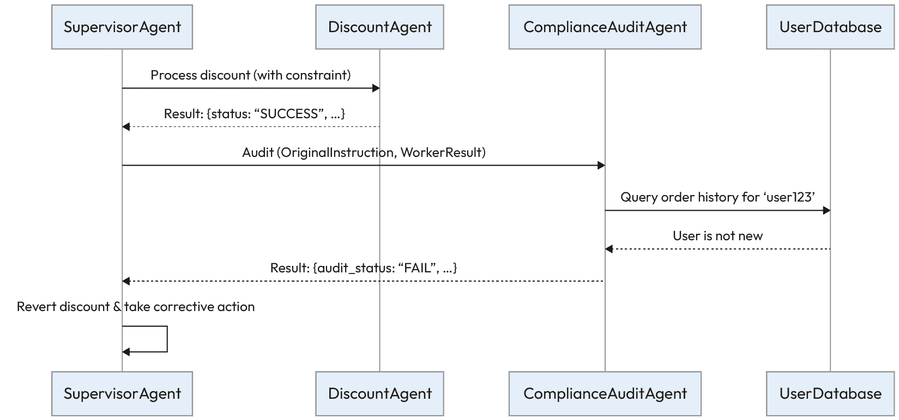
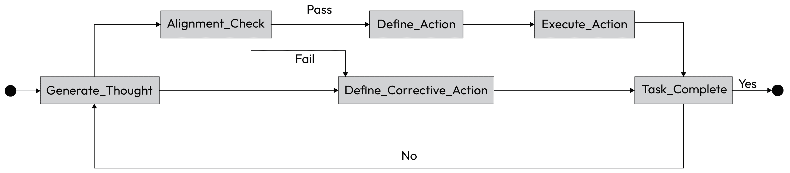
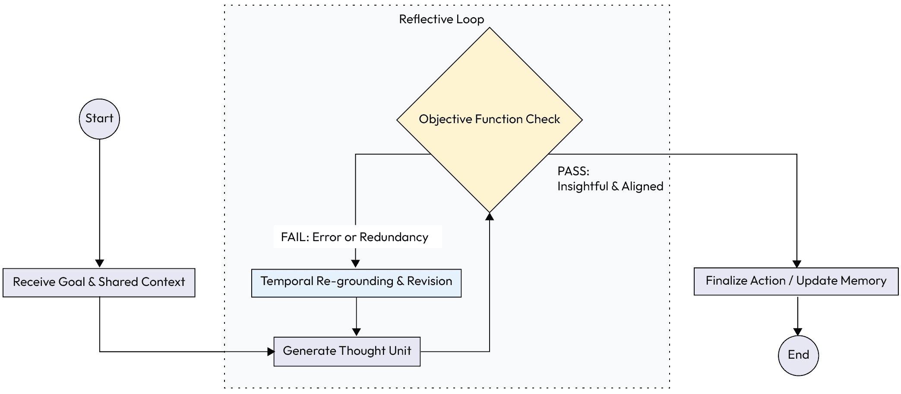
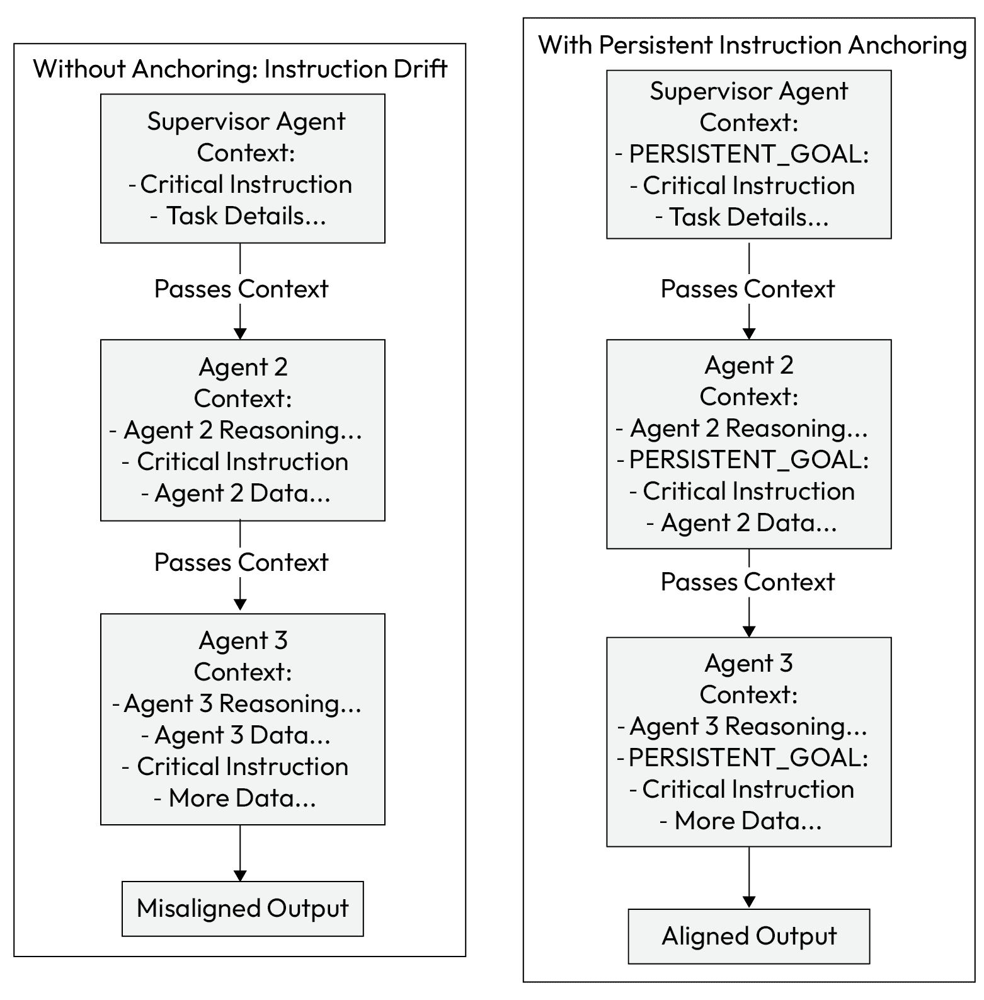
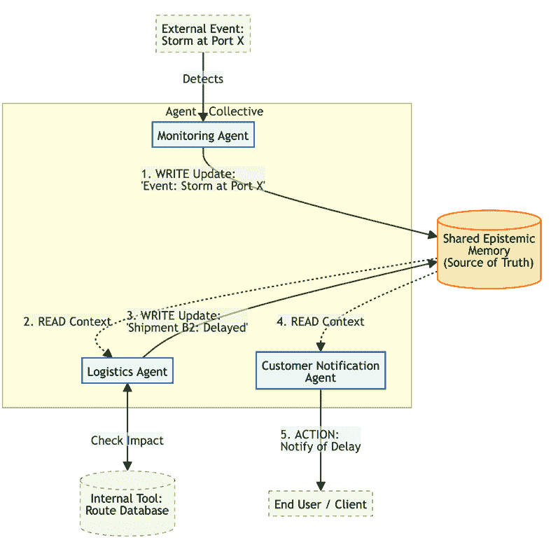

# 6

# 可解释性和合规性代理模式

在上一章中，我们详细介绍了使多个代理能够协同工作、通过结构化协作解决复杂问题的协调模式。我们有使代理规划、共享知识和解决冲突的蓝图。然而，为了使代理系统从原型发展到生产型企业环境，其有效性必须与它的**可靠性**相匹配。没有问责的自主性是一种负担。

这将我们引向关键的可解释性和合规性领域：

+   **可解释性**专注于使代理的决策过程透明易懂，回答关键的疑问：*代理为什么这样做？*

+   **合规性**确保代理的行为遵守复杂的外部法规和内部政策，回答同样重要的问题：*我能否验证代理是否遵循了规则？*

为了将这些方面纳入代理系统，本章介绍了四种特定的架构模式：***指令忠实度审计***，***分形思维链（FCoT）***，***嵌入***，***持久指令锚定***，和***共享认知记忆***。

为了使这些模式尽可能实用，我们将采取“在旅程之前先画地图”的方法。在深入到每个模式的详细技术细节之前，我们首先将提供一个实施的战略指南。

本指南与我们的 GenAI 成熟度模型相一致，提供了如何随着系统从单个代理发展到多代理集体，这些问责模式的需求加深的发展路线图。通过首先理解大局，你将拥有欣赏每个特定模式如何适应以及为什么它对于构建可问责的生产级代理系统至关重要的背景。

# 实施可解释性和合规性模式的战略指南

本章中的模式不仅是一个工具集；随着一个组织的代理系统成熟，它们的应用深度也在加深。虽然对于单个复杂代理有用，但它们对于管理多代理集体内部的复杂交互变得绝对必要。以下表格说明了这些模式的应用如何随着系统从单个代理架构成熟到多代理架构而演变：

| **架构** **方面** | **在** **级别 5（单个代理系统）** **的应用** | **在** **级别 6（多代理系统）** **的应用** |
| --- | --- | --- |
| 主要目标 | 确保单个自主代理是可问责的，并且其复杂的推理是可审计的。 | 确保整个协作代理系统与顶级目标保持一致，并且集体上可靠。 |
| 指令忠实度审计 | 用于在单个代理采取关键行动之前审计其最终输出。 | 用于审计代理之间的交接，确保在层次结构的每个步骤中保持指令忠实度。 |
| 分形 CoT 嵌入 | 使单个代理能够进行内部自我纠正，允许它完善自己的多步骤推理过程。 | 使内部自我纠正和代理间反思性成为可能，代理可以根据其同侪的推理来修订其计划。 |
| 持久指令锚定 | 在一个长期的多步骤任务中，使单个代理始终专注于其主要目标和约束。 | 对于确保原始指令和约束在多个代理的深层层次结构中幸存至关重要。 |
| 共享认知记忆 | 对于单个代理来说不太关键，但可以用于记录其状态或与人类监督员共享上下文。 | 对于代理间协作至关重要。它成为中枢神经系统，提供整个系统所依赖的“真实情况”。 |

表 6.1 – 将可解释性和合规性模式映射到 GenAI 成熟度模型

考虑到这个战略背景，我们现在可以探索提供这些保证的个别模式。我们将从一个充当基本外部验证层、确保代理的行为完全与其给定指令一致的关键检查点开始的模式。

# **指令忠实度审计**

在分层多代理系统中，高级代理通常将子任务委托给专门的下属。虽然这些代理被设计来优化其局部任务，但它们可能会无意中误解或忽略高级约束。这导致“无声失败”，子任务看似成功完成，但整体结果与原始业务意图不符。

为了防止这种情况，**指令忠实度审计**模式引入了一个验证层，以确保代理的行为严格遵循它所接受的原始指令。

## **上下文**

一个监督代理将任务委托给一个或多个工作代理的多代理系统。整个操作的成功取决于工作代理严格遵循原始指令中指定的所有约束。

## **问题**

如何确保一个自主代理，在优化其局部子任务的同时，仍然严格遵循原始的高级指令和全局约束，防止出现整体目标未达成的“无声失败”？

## **解决方案**

**指令忠实度审计**模式引入了一个专门的审计代理，该代理充当自动检查点。审计员的角色不是执行任务，而是将工作代理的输出与它收到的原始指令进行比较。

它在动作最终确定之前验证所有初始指令中的约束和目标是否已满足。这创建了一个显式的验证层，强制执行问责制并防止指令漂移。

## 示例：审计电子商务折扣应用

一个电子商务平台使用`SupervisorAgent`来处理客户折扣请求。主管必须确保`DiscountAgent`正确应用公司的折扣政策：

+   `SupervisorAgent` **目标**：确保客户请求得到正确处理，并符合业务规则

+   `DiscountAgent` **目标**：高效地将指定的折扣应用于客户订单

+   `ComplianceAuditAgent` **目标**：验证其他代理采取的行动是否符合原始指令中的所有约束

审计工作流程如下展开：

1.  **指令**：`SupervisorAgent`生成精确的指令：`Apply a 15% 'WELCOME' discount for user 'user123' on order #5678, but **only if** this is their first order.`

1.  **委托** **和** **执行**：指令被发送到`DiscountAgent`。它专注于主要动作，并应用 15%的折扣，返回成功消息：`{``"status": "SUCCESS", "action": "15% discount applied to order #5678"}`。代理忽略了检查“首次订单”约束。

1.  **审计**：在最终确定交易之前，`SupervisorAgent`将原始指令和`DiscountAgent`的输出发送到`ComplianceAuditAgent`进行验证。

1.  **验证**：`ComplianceAuditAgent`使用其工具查询客户数据库。它发现`'user123'`有多个历史订单。

1.  **结论**：审计员`idx_b15c1a8e`返回失败结论，并给出明确的原因：`{"``audit_status``": "FAIL", "reason": "Worker agent failed to check the 'first order' constraint. User 'user123' is not a new customer."}`。

1.  **解决方案**：`SupervisorAgent`收到失败，撤销`DiscountAgent`应用的折扣，并向用户发送适当的消息，防止政策违规。



图 6.1 – 指令忠实度审计工作流程

此过程确保即使专门的代理采取了捷径，系统的完整性也通过独立的审计层得到维护。

## 示例实现

以下示例代码`idx_7c78ff7a`展示了***指令忠实度审计***模式的概念性实现。在这个场景中，我们看到`SupervisorAgent`如何协调工作流程，确保在交易最终确定之前，将`DiscountAgent`的输出传递给`ComplianceAuditAgent`进行强制性的验证检查。

```py
class SupervisorAgent:
    def handle_request(self, user_request):
        original_instruction = (
            "Apply a 15% 'WELCOME' discount for user 'user123', "
"but only if this is their first order."
        )

        # Delegate to worker agent
        worker_result = DiscountAgent().run(instruction=original_instruction)

        # Delegate to auditor agent for verification
        audit_verdict = ComplianceAuditAgent().run(
            original_instruction=original_instruction,
            worker_output=worker_result
        )

        if audit_verdict.get("audit_status") == "PASS":
            print("Action is compliant. Finalizing order.")
            # ... logic to finalize the order ...
return "Order Finalized"
else:
            print(
                f"Action failed audit. Reverting. Reason: "
f"{audit_verdict.get('reason')}"
            )
            # ... logic to revert the action and handle the error ...
return "Action Reverted"
class DiscountAgent:
    def run(self, instruction):
        # This agent incorrectly focuses only on applying the discount
print("DiscountAgent: Applying 15% discount as instructed.")
        return {
            "status": "SUCCESS",
            "action": "15% discount applied to order #5678"
        }

class ComplianceAuditAgent:
    def run(self, original_instruction, worker_output):
        # In a real system, this would use an LLM or other tools
# For this example, we simulate the logic
        is_first_order = self.check_customer_history("user123")

        if "first order" in original_instruction and not is_first_order:
            return {
                "audit_status": "FAIL",
                "reason": (
                    "Worker agent failed to check the 'first order' constraint. "
"User 'user123' is not a new customer."
                )
            }
        else:
            return {
                "audit_status": "PASS",
                "reason": "Action is compliant with all instructions."
            }

    def check_customer_history(self, user_id):
        # Simulate a database lookup
print(f"ComplianceAuditAgent: Checking order history for {user_id}.")
        return False # Simulate that the user has previous orders
```

## 后果

+   **问题**：

    +   **责任** **和** **可解释性**：此模式为 idx_17ed5ce1 合规性创建了一个明确的检查点。审计员的论据生成了一条清晰的、可审计的记录，说明了决策是如何和为什么被验证的，从而提高了系统的透明度。

    +   **可靠性**：它积极减少了无声失败的情况，即子任务在局部成功但整体目标未达成，从而使整个系统更加稳健和可预测。

+   **Con**:

    +   **性能** **开销**：添加审计层引入了延迟和计算成本，因为每次检查可能需要额外的工具使用或 LLM 调用。这直接导致了速度和可靠性之间的权衡。

## 实施指南

在实施此模式时，仔细选择最需要审计的关键节点。在每一步应用审计可能会严重影响性能。关注那些误解或政策违规风险最高的交接点。目标是平衡严格合规和可接受的系统延迟。

虽然***指令保真度审计***模式为代理的输出提供了一个基本的外部检查，但它是一种被动措施。为了构建一个真正稳健的系统，我们还需要代理积极维护一致性。***FCoT*** ***嵌入***模式通过将自我校正能力直接嵌入到代理自身的推理过程中来解决这个问题。

# 分形思维链嵌入

虽然标准的**思维链** (**CoT**)使代理能够执行顺序推理，但它对于动态的多代理环境来说通常过于僵化。在这些系统中，代理必须协调计划，适应新信息，并根据他人的反馈纠正推理。传统的 CoT 及其 idx_f0640b91 变体缺乏 idx_19c03420 这种递归修订和反思协调的机制。

***FCoT***模式通过将代理的推理结构化为递归的多级框架来解决此问题，从而实现动态自我校正和协作任务中的更好对齐。

## 上下文

一个多代理系统被分配了一个 idx_058be9f3a 复杂问题，该问题需要协作推理和适应。一个代理的初始结论可能因系统中其他代理提供的新数据或冲突数据而变得无效，需要动态地修改之前的推理步骤。

## 问题

如何构建代理的推理 idx_b4e669fa 过程，以允许动态自我校正，与其他代理的推理同步，并在多个细节级别进行分析，克服传统 CoT 方法的静态和孤立特性？

## 解决方案

***FCoT*** 模式将代理的推理过程结构化为递归和多层次框架。与静态的线性链不同，***FCoT*** 将推理组织成可以递归细化的自包含单元。这使得代理可以根据新的证据纠正其过去的结论，并适应不同细节级别的分析。

此模式基于几个核心原则：

+   **递归自我校正**：推理由一个目标函数引导，该函数同时最大化洞察力并最小化错误，创建一个连续的自我校正循环。

+   **动态上下文窗口**：代理可以扩大或缩小其焦点，放大以进行详细分析或缩小以纳入来自其他代理的更广泛上下文。

+   **代理间反射性**：代理被设计用来评估和反思其他代理的推理，从而实现更好的对齐和更智能的委托

+   **时间重定位**：早期的推理步骤可以根据新的证据正式修订，从而创建一个动态和可审计的思维过程，而不是静态的、只能追加的日志。

为了说明这个概念，请查看以下图表：



图 6.2 – FCoT 内部推理循环

## 示例：协作研究综合

一个 AI 系统被分配使用一组专业代理来生成关于“气候适应性城市设计”的文献综述：

+   `SynthesizerAgent` **目标**：领导项目并将来自专业代理的发现综合成一个连贯的最终报告

+   `ClimateScienceAgent` **和**`MaterialSustainabilityAgent` **目标**：研究他们各自的领域并提供专家总结

协作推理过程使用 ***FCoT*** 展开：

1.  **初步** **研究**：每个专业代理生成一个独立的摘要。`MaterialSustainabilityAgent`根据其初始数据生成一份突出 hempcrete 优势的报告。

1.  **代理间** **反射**：`SynthesizerAgent`分享这些摘要。`ClimateScienceAgent`分析了 hempcrete 的建议，并报告说沿海城市的高湿度可能会损害材料的结构完整性。

1.  **时间** **重定位**：***FCoT*** 框架促使`MaterialSustainabilityAgent`根据这个新的约束修订其原始评估。其初始推理被正式更正为`"``Hempcrete 是一种可行的可持续材料，但在未经特殊处理的情况下，高湿度可能会使其退化。``"`。这是对过去结论的直接修订，而不仅仅是添加。

1.  **粒度** **控制**：`SynthesizerAgent`最初在段落级别工作以结合见解。然后它调整其焦点到文档级别视角，确保最终报告有一个连贯的叙事结构，而不是一系列单独的事实。

下面的流程图说明了 FCoT 流程，其中代理的思考被生成，与目标和对外部反馈进行核对，然后要么最终确定，要么递归地细化。



图 6.3 – FCoT 用例示例

## 示例实现

FCoT 通常通过一个复杂的提示模板来实现，该模板引导 LLM 通过递归和反思步骤。它迫使模型外部化其思考，对照约束进行检查，并明确决定是继续还是修改：

```py
# Conceptual prompt template for an agent using FCoT

FRACTAL_COT_PROMPT_TEMPLATE = """
**Overall Goal:**
{original_instruction}
**Shared Context & Peer Agent Summaries:**
{context_from_shared_memory}
**My Previous Reasoning Steps (Thought Units):**
{summary_of_my_previous_reasoning}
**My Next Step:**
1\.  **Thought:** Based on the goal and all context, what is my next thought or hypothesis?
[LLM generates its next thought here...]
2\.  **Self-Correction Check (Objective Function):**
- **Objective:** Does my thought maximize new insight and align with the Overall Goal?
- **Constraint:** Does it conflict with any facts in the Shared Context or my previous reasoning? Does it introduce redundancy?
- **Verdict & Justification:** [LLM must analyze and justify its thought here...]
3\.  **Action / Revision:**
- **If Verdict is PASS:** State the action to take (e.g., call a tool, write to memory).
- **If Verdict is FAIL:** State the corrective action. This may involve revising a *previous* thought unit (Temporal Re-grounding).
[LLM generates its action or revision plan here...]
"""
```

## 后果

+   **优点**：

    +   **可靠性和自我纠正**：该框架最大的优势是能够实现实时、自我纠正的推理。代理可以捕捉并修复自己的偏差，从而产生更加稳健和可靠的成果。

    +   **可解释性**：显式的自我纠正检查和时态重定位创建了一个透明且可审计的跟踪。可以看到的不仅是代理决定的内容，还有其改变主意的**方式和原因**。

+   **缺点**：

    +   **复杂性和开销**：FCoT 的实现比标准 CoT 更复杂。它需要一个复杂的协调层来管理共享上下文和触发反思循环，这可能会增加延迟和令牌成本。

## 实施指南

实现 FCoT 需要一个强大的协调层，能够管理共享内存、触发反思循环和处理递归更新。

首先定义一个清晰的自我纠正目标函数。注意递归检查相关的增加延迟和令牌成本，并将此模式应用于复杂、高价值任务，在这些任务中，正确性和适应性比原始速度更重要。

FCoT 为代理提供了一种强大的框架，以内部推理和自我纠正。然而，即使是最复杂的推理也容易受到系统级故障的影响，在这些故障中，上下文丢失或指令被遗忘。

为了解决这个问题，我们将从代理的内部思维过程转向在整个工作流程中管理指令的方式。在下一节中，我们将探讨 **持续指令锚定** 的基础模式，确保核心目标无论对话多长或多复杂都保持“突出中心”。

# 持续指令锚定

在长而层次分明的代理链中，来自顶层协调者的初始指令通常放置在上下文的开始处。随着从属代理添加自己的推理和数据，这个关键指令被推到上下文窗口的中间。

LLMs 往往难以处理这种“迷失在中间”的问题，即它们对不在其提示的开始或结束部分的信息给予较少的权重。

**持久指令锚定**模式通过使用特殊标签使关键指令突出，确保下游代理不会忘记它们。

## 上下文

在一个深层、分层的多代理系统中，初始指令沿着代理链传递。随着每个代理添加自己的推理和数据，上下文窗口增长，将原始指令推离高优先级的起始和结束位置。

## 问题

如何确保系统在上下文窗口变长且更杂乱的情况下，不会忘记或忽略关键的高级别指令和约束？如果没有机制来对抗模型固有的近期偏差，就可能发生逐渐的“指令漂移”，导致最终输出与原始意图不一致。

## 解决方案

**持久指令锚定**模式确保了关键指令无论在上下文中的位置如何都保持显著。这是通过在语义上重要的标签（例如，`<CRITICAL_INSTRUCTION>`，`[GOAL]`，`#DO_NOT_FORGET:`）内嵌入高优先级目标或约束来实现的。这些“锚点”沿着链传递，并被设计成容易被 LLM 识别，有效地在工作流程的每一步提醒它核心目标。

## 示例：在财务报告中维持约束

一个财务报告系统使用一组代理来生成季度摘要。系统必须确保在整个过程中遵循严格的法定约束：

+   `ReportingSupervisor` **目标**：生成一个不包含任何非法前瞻性声明的 Q3 财务摘要

+   `DataExtractionAgent` **目标**：从内部数据库中提取 Q3 的具体财务数据

+   `SummarizationAgent` **目标**：根据提供的财务数据创建叙事摘要

工作流程使用锚点来防止指令漂移：

1.  **指令** **和** **锚定**：`ReportingSupervisor`代理定义了一个具有严格负面约束的任务，并将其作为锚点：“生成 Q3 财务表现的摘要。持久目标：[无前瞻性陈述]”。

1.  **委托**：主管将任务的第一部分委托给`DataExtractionAgent`，并随新指令传递锚定约束。

1.  **处理** **和** **移交**：`DataExtractionAgent`执行其任务并将发现传递给`SummarizationAgent`。它传递的上下文包括提取的数据和持久目标锚点：“数据：{收入：1000 万，利润：200 万}。持久目标：[无前瞻性陈述]。请总结。”

1.  **最终** **输出**：`SummarizationAgent`的提示现在包含了关键指令，以及它需要处理的数据。其 LLM 核心更有可能看到并遵守负面约束，防止它添加关于 Q4 表现的推测性语言。

下图 idx_40a913ea 对比了没有锚定的流程，其中指令丢失，与有锚定的流程，其中指令保持突出，并确保输出一致。



图 6.4 – 持续指令锚定工作流程

## 示例实现

实现涉及通过代理链传递 idx_01df4fc2 锚定指令字符串：

```py
class ReportingSupervisor:
    def generate_report(self):
        # The critical constraint is defined once and anchored
        anchored_instruction = "PERSISTENT_GOAL: [NO_FORWARD_LOOKING_STATEMENTS]"
print(f"Supervisor initiated process with anchor: {anchored_instruction}\n")

        # Delegate to the first agent
        data = DataExtractionAgent().run(anchored_instruction)

        # Delegate to the second agent, passing the data and the same anchor
        summary = SummarizationAgent().run(data, anchored_instruction)

        print("\n--- Final Report Summary ---")
        print(summary)
        print("--- End of Report ---")

class DataExtractionAgent:
    def run(self, instruction):
        print(f"DataExtractionAgent received instruction: {instruction}")
        # Extracts data from a source...
        extracted_data = "{revenue: '10M', profit: '2M'}"
print("DataExtractionAgent completed its task.")
        return extracted_data

class SummarizationAgent:
    def run(self, data, instruction):
        # The LLM prompt includes both the data and the anchored instruction
# ensuring the constraint is visible at the point of generation.
        prompt = f"""
Summarize the following financial data.
Data: {data}
{instruction}
"""
print(f"\nSummarizationAgent is using the final prompt for the LLM.")
        # Simulate LLM call that adheres to the constraint
return "The company's Q3 performance showed a revenue of $10M with a profit margin of 20%."
# Execute the workflow
supervisor = ReportingSupervisor()
supervisor.generate_report()
```

## 后果

+   **优点**：

    +   **可靠性**：此模式显著提高了上游指令的召回率，减少了 idx_1f0b02cd 指令漂移，并确保下游代理与主要任务保持一致

    +   **可解释性**：在代理到代理的消息中存在锚定指令，为在整个工作流程中如何维持关键约束提供了一个清晰且可审计的跟踪

+   **缺点**：

    +   **提示** **开销**：它为提示添加了轻微的开销，并要求系统中的所有代理使用一致的模板结构才能有效

## 实施指南

为您的锚点建立标准化的格式（例如，`PERSISTENT_GOAL: [...]` 或 `<``CONSTRAINT``>``...``<``/``CONSTRAINT``>`），并确保在整个系统中的所有代理中一致使用此格式。这允许 idx_90024740 指令在每个链的步骤中可靠地解析和重新插入，最大化其对于 LLM 的可见性。

**持久指令锚定**模式提供了一种基础技术，通过确保单个代理记住其目标来防止指令漂移。

然而，记住指令只是战斗的一半。在协作环境中，代理还需要共享对当前现实的动态理解。例如，如果一个代理发现了一个关键信息，比如服务器故障或库存变化，我们如何确保团队的其他成员立即知道，而无需传递无数的消息？

这将我们引向**共享认知记忆**模式，它将我们从个人关注转向集体同步。

# 共享认知记忆

在单代理系统中，“记忆”通常是会话历史，有时也称为会话记忆或短期记忆。然而，在多代理集体中，依赖单个上下文窗口会产生“巴别塔”效应。如果一个代理了解到服务器已关闭，但另一个仍然认为它正在运行，他们的协调行动将失败。

**共享认知记忆**模式通过建立一个单一、可变的真相来源，该来源存在于 idx_25569196 各个代理的上下文窗口之外，确保整个集体对世界状态有相同理解，来解决这个问题。

## 上下文

一个多代理系统，其中 idx_e14b597f 代理使用自己的本地内存并接收不同的任务。一个代理的观察（例如，特定的工具输出或状态变化）可能不会自然地提供给另一个代理，导致基于碎片化、不完整或 idx_aef48fd7 不一致的信息做出决策。

## 问题

没有一个统一且不断演变的真相来源，等级结构中的代理很容易变得不协调。一个代理可能会 idx_cbdb85b1 根据新的数据更新其理解，但如果这个“事实”没有传播，其他代理可能会基于过时的假设进行操作。

这种不匹配源于三个核心力量：

+   **碎片化** **知识**：每个代理的“世界观”仅限于其局部上下文

+   **有损** **通信**：通过长链对话传递状态往往会导致细微差别丢失

+   **缺乏** **“****基准**”**：没有权威的参考点来检查任务的规范状态

## 解决方案

**共享认知记忆**模式建立了一个全局的“草稿本”或集中式内存模块，所有特定工作流程中的代理都可以从中读取和写入。

这个共享内存作为集体、权威的真相来源。它确保所有代理，无论其在等级结构中的位置如何，都从同一套事实和假设出发。这是“代理链”框架等架构的关键特性，允许系统在个别代理执行隔离推理任务的同时保持一致性。

## 示例：供应链中断

一个多代理系统管理 idx_156411f6 一个公司的全球供应链。该系统依赖于三个代理：一个`MonitoringAgent`（新闻源），一个`LogisticsAgent`（货物运输跟踪），以及一个`CustomerNo``c``tificationAgent`（客户沟通）。

共享内存包含以下基线状态：

`{"shipment_A1": {"status": "On Time"}, "shipment_B2": {"status": "On Time"}}`

工作流程如下：

1.  **事件检测**：`MonitoringAgent`检测到关于关键航运枢纽发生重大风暴的报告。它将更新写入共享内存：`SharedMemory.update`(`{"event_log": ["Storm reported at Port X"]}").

1.  **影响分析**：`LogisticsAgent`定期读取共享内存。看到新的事件日志，它查询其内部工具并确认`shipment_B2`是通过`Port X`路由的。它写入一个特定的更新：`SharedMemory.update`(`{"shipment_B2": {"status": "Delayed", "reason": "Storm at Port X"}}`).

1.  **主动行动**：`CustomerNotificationAgent`读取共享内存。它看到`shipment_B2`的状态变为“延迟”。它立即触发一个工具来通知受影响的客户，防止服务投诉。

没有这个模式，`CustomerNotificationAgent`将不会意识到延迟，直到有人手动干预 idx_2f1d362 以错过截止日期。



图 6.5 – 共享认知记忆工作流程

## 示例实现

以下示例代码说明了 idx_2de64517 如何使用集中式状态管理器实现***共享认知记忆***模式。在这个供应链场景中，`SharedMemory`类充当全局“便签”或单一事实来源。与私有和短暂的个体代理上下文窗口不同，这个共享模块允许专门的代理异步地从公共状态中读取和写入，确保关键更新，如风暴延迟，能够瞬间在整个集体中传播。

```py
class SharedMemory:
    def __init__(self):
        self.store = {
            "shipments": {
                "shipment_A1": {"status": "On Time"},
                "shipment_B2": {"status": "On Time"}
            },
            "event_log": []
        }

    def update(self, key, value):
        print(f"[Memory Update] Setting {key} to {value}")
        if key == "event_log":
            self.store["event_log"].append(value)
        else:
            # Simplified recursive update for demo purposes
self.store["shipments"].update(value)

    def read(self):
        return self.store

class MonitoringAgent:
    def run(self, memory):
        # Simulate detecting external news
print("MonitoringAgent: Detected storm at Port X.")
        memory.update("event_log", "Storm reported at Port X")

class LogisticsAgent:
    def run(self, memory):
        state = memory.read()
        if "Storm reported at Port X" in state["event_log"]:
            print("LogisticsAgent: Found affected shipment_B2.")
            memory.update(
                "shipments",
                {"shipment_B2": {"status": "Delayed", "reason": "Storm at Port X"}}
            )

class CustomerNotificationAgent:
    def run(self, memory):
        state = memory.read()
        b2_status = state["shipments"]["shipment_B2"]

        if b2_status["status"] == "Delayed":
            print(
                f"CustomerNotificationAgent: Alerting customer about delay due to {b2_status['reason']}."
            )

# Orchestration
shared_mem = SharedMemory()
MonitoringAgent().run(shared_mem)
LogisticsAgent().run(shared_mem)
CustomerNotificationAgent().run(shared_mem)
```

## 后果

+   **优点**：

    +   **一致性**：这种模式极大地减少了语义漂移。它确保所有代理对任务和环境有一个同步的理解，从而导致协调的集体行为。

    +   **效率**：与通过直接对话消息传递大量状态信息相比，它通常更有效率，因为代理可以在需要时简单地提取他们需要的特定上下文。

+   **缺点**：

    +   **集中化** **风险**：如果未设计为高可用性和并发访问，共享内存可能成为单个故障点或性能瓶颈。

    +   **复杂性**：它引入了管理共享状态复杂性，需要处理多个代理尝试同时写入同一数据的潜在竞争条件。

## 实施指南

当实现***共享认知记忆***时，选择后端存储至关重要。对于生产系统，避免简单的 idx_05bb5399 内存字典，这些字典在进程重启时消失。相反，使用低延迟、持久的关键值存储，如 Redis 或 Memcached。这些工具支持原子操作，这对于防止多个代理同时尝试更新状态时的竞争条件至关重要。

此外，你必须 idx_111bb09e 实现一个**生存时间**（**TTL**）或时间戳验证策略。代理系统中的信息“腐烂”得很快；五分钟前关于服务器状态的事实现在可能已经不正确。强制 idx_72db46f0a 执行方案，其中每个记忆条目都需要一个时间戳和一个`source_agent_id`值。这允许下游代理权衡数据的可靠性（“这个事实是 20 分钟前的；我应该再次验证它”）而不是盲目地信任它。

最后，通过严格的、类型化的工具（例如，`update_order_status``(id, status)`）将此记忆暴露给智能体，而不是通用的`write_memory``(text)`工具。这防止共享内存成为无结构、不可解析文本的垃圾场。

使用***共享认知记忆***模式，我们确保我们的智能体共享对世界的统一看法。然而，这个模式只是拼图中的一块。真正的系统可靠性并非来自单一技术，而是将多个模式结合成多层防御的结果。

下一节将探讨这些个别策略如何协同工作。

# 系统可靠性模式组合

虽然每个模式都针对一个特定的故障点，但它们的真正价值在于将它们组合成多层防御，以对抗指令漂移和偏差。它们不是相互排斥的选择，而是强大、生产级架构的互补组件。

通过结合以下模式，可以设计一个具有弹性的分层系统：

+   **共享认知记忆**：这充当真理的基础层。它确保所有智能体从一组共同、同步的事实和任务状态的共同理解开始工作。

+   **持久指令锚定**：这充当使命的持续提醒。它确保无论任务多么复杂或涉及多少智能体，核心目标和约束都不会在上下文中“丢失”。

+   **分形** **CoT** **嵌入**：这充当内部、主动的自我治理机制。这是在智能体工作期间发生的持续过程改进，确保其内部推理与其目标保持一致。

+   **指令忠实度审计**：这充当外部、反应性的检查点。它是最终的质量保证关卡，检查智能体工作的输出，确保在最终确定或传递到下一阶段之前，结果完全符合原始指令。

例如，可以设计一个系统，其中`SupervisorAgent`首先将主要目标写入***共享认知记忆***。然后，它将子任务委托给`WorkerAgent`，并传递一个***持久指令锚点***。`WorkerAgent`使用***F******CoT*** ***嵌入***来持续地将自己的思维过程与其分配的子目标对齐。在它产生最终输出后，该输出被传递给一个单独的审计代理，该代理验证结果是否符合存储在共享内存中的原始、顶级指令。

通过组合这些模式，您创建了一个具有多个冗余保障的系统。为了生产级可靠性，推荐的最佳实践是设计至少包含两个或三个这些模式同时实例化的系统。

让我们现在总结本章所讨论的所有内容。

# 摘要

本章探讨了智能体 AI 系统的关键企业需求：可解释性和合规性。我们确定，随着自主性的提高，对透明度和责任的需求也增加，以建立信任并确保可靠性。我们还展示了这些模式的应用如何随着系统从单个智能体架构发展到多智能体架构而深化。

我们解决的主要挑战是指导偏差，即任务的原始意图在复杂、分层的智能体系统中被稀释或丢失。为了应对这一问题，我们引入了一套四项互补的模式：***指令*** ***忠实度审计***、***F******CoT******E******mbedding***、***持久*** ***I******nstruction*** ***A******nchoring***，和 ***共享*** ***E******pistemic*** ***M******emory***。

关键要点如下：

+   **信任需要透明度**：为了将智能体部署到生产环境中，它们的决策过程必须是可审计和可解释的。

+   **防止指导偏差至关重要**：在分层系统中，你必须积极构建安全措施以确保原始目标不会被从属智能体丢失或误解。

+   **结合内部和外部** **检查**：最稳健的系统使用结合了用于内部自我纠正（FCoT）和外部验证（审计）的模式。

+   **共享知识防止偏差**：一个共享的真实来源（共享认知记忆）是确保一组智能体能够协同一致工作的基础。

+   **成熟度决定治理需求**：虽然这些模式对单个复杂智能体（第 4 级）很有用，但它们对于管理指导偏差和确保多智能体系统（第 5 级）的集体一致性至关重要，这从个人责任转向系统可靠性。

通过战略性地结合这些模式，开发者可以设计出不仅更有效而且更透明、可审计且与其预期目标一致的智能体系统。

现在我们已经建立了使智能体系统更具责任感和合规性的模式，我们必须将注意力转向生产准备性的另一个关键方面：它们应对意外情况的能力。一个完美遵循指令但在出现错误或外部故障时崩溃的智能体并不真正稳健。

在下一章中，我们将探讨***鲁棒性和容错性***模式。这些模式提供了构建能够优雅处理错误、管理意外事件并在个别组件失败时保持操作完整性的弹性系统的架构解决方案。

# 订阅免费电子书

新框架、演进的架构、研究新发现、生产故障分析——*AI_Distilled* 将噪音过滤成每周简报，供实际操作 LLM 和 GenAI 系统的工程师和研究人员阅读。现在订阅，即可获得免费电子书，以及每周的洞察力，帮助您保持专注并获取信息。

订阅请访问 [`packt.link/8Oz6Y`](https://packt.link/8Oz6Y) 或扫描下方的二维码。


