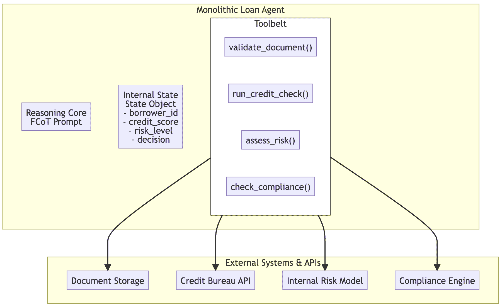

# 13

# 用例：单一代理用于贷款处理

在前面的章节中，我们已经研究了代理人工智能的基础概念，从代理的核心结构，其关键组件和交互，到能够满足商业或应用需求的各种复杂程度执行复杂任务的架构模式。我们建立了一个成熟度模型来指导每个发展阶段所需的复杂程度，并探讨了提供稳健和可扩展代理系统蓝图的设计模式。现在，是时候从理论转向实践了。

在本章中，我们将开始我们的动手实现，我们将构建一个完整的代理系统来解决一个现实世界的商业问题：自动化贷款发放流程。为了提供最有价值的学习体验，我们将分两个不同的阶段来应对这个挑战，跨越本章和下一章。

首先，我们将使用一个单一的、统一的代理来构建整个系统。通过这个练习，你将学习如何实现***分形思维链***（***FCoT***）方法和模式，我们将使用这些方法和模式来构建代理的推理结构，以及如何定义一个强大的工具包，使其能够与世界互动。这将使我们能够取得初步的成功，并展示基于代理方法的核心价值。

然而，我们不会止步于原型设计解决方案：我们将使用这个初步实现来故意暴露单一代理设计中固有的架构紧张/可能的缺点，特别是当面临生产级复杂性时，突出认知过载和故障隔离的问题。通过识别这些具体的“基础裂缝”，我们为*第十四章*奠定了必要的基础，在那里我们将使用更稳健、可维护和可扩展的多代理方法来重新设计这个系统。

在本章中，我们将涵盖以下主题：

+   挑战：高风险工作流程

+   使用 FCoT 框架引导代理的思维

+   设计统一的代理

+   在 Colab 笔记本中构建代理

+   执行和分析

+   从第 5 级到第 6 级：改进路线图

# 技术要求

要成功完成本章的动手示例，你需要以下内容：

+   **一个谷歌** **账户**：这是访问 Google Colab 和 Google AI Studio 所必需的。

+   **谷歌** **Colab**：代码示例设计为在 Google Colab 笔记本中运行，它提供了一个免费、基于云的 Python 环境。示例轻量级，因此你不需要高性能的本地硬件；一个标准的网络浏览器就足够了。

+   **谷歌 AI Studio API** **密钥**：你需要一个有效的 API 密钥来访问代理示例中使用的 Gemini 模型。你可以通过遵循以下文档来获取密钥：[`ai.google.dev/gemini-api/docs/api-key`](https://ai.google.dev/gemini-api/docs/api-key)。

+   **Python** **库**：示例依赖于`google-adk`库和其他标准 Python idx_55aa0ffepackages。我们选择 Google **代理开发工具包**（**ADK**）进行此实现，因为它提供了一种以生产优先的架构，该架构原生支持结构化推理和强类型化，这对于***F******C******oT***模式是必需的。笔记本中包含了直接在环境中安装这些依赖项所需的必要命令。

本章的完整代码，包括可运行的笔记本和辅助脚本，可在本书的 GitHub 存储库中找到：[`github.com/PacktPublishing/Agentic-Architectural-Patterns-for-Building-Multi-Agent-Systems/tree/main/Chapter_13`](https://github.com/PacktPublishing/Agentic-Architectural-Patterns-for-Building-Multi-Agent-Systems/tree/main/Chapter_13)。

# 挑战：高风险工作流程

贷款发起 idx_be8dcd6dpipeline 是代理系统的理想用例，因为它不是一个单一的任务，而是一系列复杂阶段，每个阶段都有自己的逻辑、数据需求和潜在的失败可能性。为了理解挑战，让我们分解典型的流程。

| **阶段** | **描述** | **自动化**的**关键****挑战** |
| --- | --- | --- |
| 1. 文档接收和验证 | 接收申请并确保所有支持性文件（例如，收入验证）完整且有效 | 注意：所有相关文件均已提供；在此示例中，我们不会处理实际的接收、OCR 等。处理各种文档格式，识别缺失信息，并应用业务规则以确保完整性 |
| 2. 信用检查 | 与外部信用局 API 交互以获取借款人的信用历史和评分 | 安全处理凭证，解析不同的 API 响应，并优雅地处理网络错误或 API 停机 |
| 3. 风险评估 | 应用内部业务逻辑和基于所有收集到的财务数据的动态风险评估模型 | 执行复杂、通常是非线性逻辑，该逻辑综合多个数据点（而不仅仅是简单的`if/then`规则） |
| 4. 合规性审查 | 审计流程以确保其符合所有相关法规，例如**平等信贷机会法**（**ECOA**） | 维护决策过程的可审计记录，并确保没有受保护的属性影响了结果 |
| 5. 最终决策和生成 | 综合所有信息以做出最终批准/拒绝决策并生成必要的文档 | 根据整个先前的流程创建一个连贯、易于理解的决定理由 |

表 13.1 – 贷款发起工作流程的阶段

试图用传统的脚本自动化**这**将创建一个脆弱、难以维护的系统。传统的自动化依赖于刚性、预定义的规则，这些规则在面对非结构化数据时很容易破裂，例如不同的文档格式或模糊的申请人详细信息。为了处理每一个可能的异常，开发者需要编写和维护一个无尽的`if/then`逻辑网络，这很快就会变得难以管理。相反，工作流程需要动态推理来优雅地处理异常，结构化规划来根据上下文调整执行步骤，以及生成其决策的清晰、可审计的轨迹。这正是代理式 AI 大放异彩的地方。

# 使用 FCoT 框架指导代理的思维

为了确保我们的代理以完成这项金融任务所需的严谨性运行，我们将为其配备一个基于**分形思维链**（**FCoT**）方法论的复杂认知框架。我们最初将创建一个体现 FCoT 原则的提示。这个 FCoT 提示将作为代理的内部“操作系统”，为其任务、约束和推理过程提供正式结构。这是将指导代理行动的宪法。

在像我们的贷款发放工作流程这样的复杂多步骤商业流程中，简单的代理往往会出现目标漂移，这是一种行为上的失败，即代理随着任务的进展逐渐偏离其原始目标。这种漂移通常是由一个记录良好的技术限制引起的，称为“迷失在中间”现象，其中 LLMs 难以回忆起深埋在长上下文窗口中的关键约束或指令。**FCoT**模式是一种专门设计来通过在代理的推理上强制执行严格、自我纠正的结构来对抗这两个问题的强大技术，确保无论上下文长度如何，它都始终不断参考其核心任务和约束。

从概念上讲，**FCoT**模式由两个主要元素组成，我们将在代理的指令中实现：

+   首先是**指令合约**（**IC**），它作为代理的不变真相来源。它正式定义了代理的任务、它必须产生的确切交付成果，以及它必须永远不违反的安全和合规性限制。

+   第二个元素是**递归循环**，它定义了代理的主动思维过程。这种结构迫使代理在规划其行动、执行它们以及最重要的是，在每个阶段**验证**其工作和推理与 IC 的一致性。

当我们围绕使用我们的***FCoT***方法构建代理的思维方式时，该方法通过 FCoT 模式实现，我们正在为可靠和可审计的行为奠定基础。有了这个认知核心，我们现在可以继续定义我们单体系统的整体架构。

# 设计单体代理

在我们定义了业务问题和将指导代理推理的复杂***FCoT***框架之后，我们可以继续进行其架构设计。对于这个首次实现，我们将采用单体方法。这意味着一个单一、高度强大的代理将负责从开始到结束执行整个贷款发起工作流程。

这种设计模式在代理开发的初期阶段很常见（反映了我们代理人工智能等级的第三级）。虽然前面的章节专注于基础能力，如提示和基本工作流程（等级 1 和 2），我们现在正通过反思推理和自我纠正迈向完全的代理自主性。这种方法将所有逻辑、工具和状态管理集中到一个中央组件中。代理的主要任务是遵循其内部的 FCoT 提示，依次调用正确的 idx_22573888 工具在正确的时间将贷款申请通过管道。

我们的单体代理将由三个基本部分组成：

+   **FCoT 推理核心**：我们在上一节中引入的 idx_fed3bedc FCoT 提示将作为代理的“大脑”。

+   **状态管理**：idx_8de5c555 代理需要一种方式来跟踪贷款申请的进度状态。ADK 中的`Runner`和`SessionService`将为我们处理这个问题。

+   **工具包**：为了与外界交互，代理需要一个工具包，这是一个它可以调用的函数集合。

整体架构很简单：代理在其 FCoT 核心的引导下，使用其工具收集和处理信息，直到它可以做出最终决定。



图 13.1 – 单体贷款处理代理的架构图

在我们的架构蓝图和认知框架就绪后，我们准备好将这些概念转化为工作代码。在接下来的章节中，我们将逐步使用 Python 和 Google ADK 构建这个单体代理。我们将从设置环境、定义我们的专用工具函数、配置代理的 FCoT 指令开始，最后执行测试场景以验证其性能。

# 在 Colab 笔记本中构建代理

我们现在将使用 Google ADK 在 Jupyter/Colab idx_707d8de4 笔记本格式中实现我们的单体贷款处理代理。这将提供一个清晰、逐步且可运行的示例。

在编写任何代码之前，我们需要初始化我们的开发环境：

1.  导航到 Google Colab ([colab.research.google.com](https://colab.research.google.com))。

1.  点击**文件** | **新建** **笔记本**。

1.  （可选）将笔记本重命名为`Chapter13_Monolithic_Agent.ipynb`。

一旦您的环境准备就绪，第一步是安装必要的库和导入所需的模块。将以下代码复制到笔记本的第一个单元中并运行它。

## 设置和依赖

第一步是安装必要的库和导入所需的模块：

```py
#@title Install dependencies
!pip install google-adk
#@title Imports
from google.adk.planners import BuiltInPlanner
from google.adk.agents.llm_agent import LlmAgent
from google.adk.tools import FunctionTool
from google.adk.planners import BuiltInPlanner
from google.adk.runners import Runner
from google.adk.sessions import InMemorySessionService
from google.genai import types
from google.genai.types import ThinkingConfig

import os
import time
import random
import uuid #
```

让我们简要看看我们正在导入的关键组件，因为它们直接映射到我们之前定义的代理解剖结构：

+   `LlmAgent`: 代表我们代理的核心类。它将模型、指令和工具整合成一个统一的单元。

+   `BuiltInPlanner`和`ThinkingConfig`: 这些组件为代理的推理核心提供动力。规划器管理执行循环，而配置允许我们启用和控制代理的内部思维过程，以便可观察。

+   `FunctionTool`: 将我们的标准 Python 函数转换为代理可以理解和调用的工具包的包装器。

+   `Runner`和`InMemorySessionService`: 这些处理状态管理和执行生命周期，管理用户会话的对话历史和上下文。

+   **标准库** (`os`, `time`, `random`, 和 `uuid`): 我们使用这些来管理 API 密钥，模拟工具中的延迟，生成模拟数据，并创建唯一的会话标识符。

您还需要设置一个 API 密钥。在这种情况下，我们将使用 Google AI Studio API 密钥；在生产系统中，我们建议使用 Google Vertex AI：

```py
from getpass import getpass

GEMINI=getpass("Enter your GEMINI API KEY: ")
os.environ["GOOGLE_API_KEY"]=GEMINI
print(f"Google API Key set: {'Yes' if os.environ.get('GOOGLE_API_KEY') and os.environ['GOOGLE_API_KEY'] != 'YOUR_GOOGLE_API_KEY' else 'No (REPLACE PLACEHOLDER!)'}")

model= "gemini-3flash"
```

**注意**

在这些示例中，我们使用`gemini-3-flash`模型，因为它速度快且成本效益高，非常适合学习和实验。然而，LLM 的领域正在迅速发展。

当构建自己的代理时，我们强烈建议检查最新的可用模型，以确保您使用的是最强大和最有效的版本。您可以在 Google AI Studio 文档中找到当前可用的模型列表：[`ai.google.dev/models/gemini`](https://ai.google.dev/models/gemini)。

现在，让我们定义代理将使用的工具。

## 定义工具

代理推理的能力仅与其行动能力相当。工具包是连接代理的认知过程和现实世界的关键组件，允许它执行任务、收集信息和产生影响。

在这个特定的实现中，我们将为代理配备四个专门设计的工具，以模拟贷款发起工作流程的关键阶段：

+   `validate_document`: 通过检查所需的文档 ID 是否存在于应用程序中来模拟文档摄入过程。

+   `run_credit_check`: 模拟对信用局的请求。它返回一个真实的信用评分和报告摘要，使用短暂的延迟（`time.sleep()`）来模拟现实世界的网络延迟。

+   `assess_risk`：模拟银行的内部承保逻辑，根据信用评分和贷款金额确定风险等级（`低`、`中`或`高`）。

+   `check_compliance`：模拟监管审计，验证风险评估和决策过程是否符合公平贷款指南。

通过将这些作为简单的 Python 函数和模拟数据实现，我们可以创建一个完全功能、自包含的示例。这使我们能够完全专注于代理的编排和推理逻辑，而不必管理实时 API 密钥或外部服务依赖的复杂性。

**生产** **注意**

在实际部署中，这些函数签名将保持基本不变，但它们的内部逻辑会发生变化。它们不会返回模拟字符串，而是作为复杂操作的包装器，调用内部文档管理系统、第三方 API，或通过**模型上下文协议**（**MCP**）与其他服务进行 idx_1cdc80e4 通信。

在这里，我们将我们的四个专用工具定义为 Python 函数，然后使用 ADK 的`FunctionTool`类进行包装。这个包装器使函数的描述和参数可供代理的 LLM 核心使用：

```py
#@title Tools Definition
# --- Tool 1: Document Validation ---
def validate_document(document_ids: list[str]) -> dict:
   """
   Validates if the required application documents are present and complete.
   Use this first to ensure the application is ready for processing.
   Returns a status of 'validated' or 'incomplete'.
   """
print("--- Tool Called: validate_document() ---")
   time.sleep(1)
   if not document_ids or len(document_ids) < 2:
       return {"status": "incomplete", "missing_docs": ["income_proof", "id_proof"]}
   return {"status": "validated"}

validate_document_tool = FunctionTool(func=validate_document)

# --- Tool 2: Credit Check ---
def run_credit_check(borrower_id: str) -> dict:
   """
   Retrieves a borrower's credit score by calling the credit bureau API.
   This should be done after documents are validated.
   """
print(f"--- Tool Called: run_credit_check(borrower_id='{borrower_id}') ---")
   time.sleep(2)
   if borrower_id == "Borrower-400":
     score = 450
     report_summary = "Credit history is compromised."
else:
     score = random.randint(750, 850) # Simulate a good credit score
     report_summary = "Credit history is clean."
return {"credit_score": score, "report_summary": report_summary}

run_credit_check_tool = FunctionTool(func=run_credit_check)

# --- Tool 3: Risk Assessment ---
def assess_risk(credit_score: int, loan_amount: float) -> dict:
   """
   Assesses the risk of a loan application based on the borrower's credit score.
   Returns a risk level of 'low', 'medium', or 'high'.
   """
print(f"--- Tool Called: assess_risk(credit_score={credit_score}, ...) ---")
   time.sleep(1.5)
   if credit_score > 740:
       return {"risk_level": "low", "details": "High credit score indicates low risk."}
   else:
       return {"risk_level": "high", "details": "Low credit score indicates high risk."}

assess_risk_tool = FunctionTool(func=assess_risk)

# --- Tool 4: Compliance Check ---
def check_compliance(risk_level: str) -> dict:
   """
   Performs a final compliance check on the process to ensure it adheres
   to Fair Lending guidelines before making a final decision.
   """
print(f"--- Tool Called: check_compliance(risk_level='{risk_level}') ---")
   time.sleep(1)
   return {"compliance_status": "pass", "details": "Process adheres to guidelines."}

check_compliance_tool = FunctionTool(func=check_compliance)
```

**生产** **提示**：**数据** **合约** 的**强** **类型**

在这个示例中，我们使用简单的 Python 字典作为工具输出以保持代码的可访问性和专注于代理的逻辑。然而，在现实世界的金融系统中，强类型数据结构对于可靠性至关重要。

在构建生产版本时，考虑使用 Pydantic 等库来定义严格的数据模型（例如，`class` `RiskAssessmentResult``(``BaseModel``)`）。这强制执行模式验证，防止数据类型错误，并在您的代理之间作为严格的“数据合约”，确保下游组件始终接收他们期望的确切数据结构。

接下来，让我们配置我们的代理的系统指令。

## 配置代理的思维

工具准备就绪后，我们可以组装代理本身。这个过程中的一个关键部分是定义代理的指令。以下提示远不止一组简单的命令；它是***FCoT***模式的直接实现，该模式作为代理整个推理过程的母模式。

让我们剖析这个提示，看看***FCoT***和其他关键设计模式是如何付诸实践的：

```py
#@title Agent Instructions
agent_instructions = """
You are an FCoT reasoner orchestrating and verifying agent activity for an Agentic Loan Origination Pipeline built with Google ADK and Google Gemini.
INSTRUCTION CONTRACT (IC)
• Mission: Originate, evaluate, and approve a loan with full policy compliance, factual grounding, and fairness.
• Deliverables: JSON + Narrative summary containing:
 -- (a) borrower profile
 -- (b) creditworthiness decision
 -- (c) justification citing verified data
 -- (d) compliance audit record
 -- (e) explainability report.
• Success Criteria:
  - Accuracy ≥ 95% vs gold truth (financial data).
  - Policy compliance = 100%.
  - Explainability coverage ≥ 90%.
  - Latency < 5 min end-to-end.
• Hard Constraints:
  - No personally identifiable data in logs.
  - Must follow Fair Lending & ECOA regulations.
  - All numerical fields validated from authoritative sources.
• Safety Policy:
  - Reject speculative or hallucinated data.
  - Never fabricate borrower details.
  - Defer ambiguous cases to Human-in-the-Loop agent.
• IC-Fingerprint: LOAN-FCoT-v3-Δ0710
FCoT RECURSIVE LOOP (N = 3)
Iteration 1 (Planning):
 • RECAP: Echo IC-FP, map subtasks (data ingest, credit scoring, compliance, document).
 • REASON: Design DAG of actions; choose retrieval sources; initialize PoF ledger.
 • VERIFY: Ensure all subtasks preserve IC clauses.
Iteration 2 (Execution):
 • RECAP: IC-FP; execute tools for credit scoring & data validation.
 • REASON: Compute risk score, validate data sources against policy.
 • VERIFY: Check causal alignment between borrower attributes and decision logic.
Iteration 3 (Verification & Explainability):
 • RECAP: IC-FP; collect deliverables, run RAG verifier.
 • REASON: Summarize SHAP values, create narrative justification.
 • VERIFY: Evaluate coherence vs IC and dual objectives.
"""
```

**模式** **洞察**：**语义** **护栏** 与**程序** **性** **评估**

你可能会注意到提示中列出的成功标准（例如，`Latency` `<` `5 min`）和交付成果。一个常见的问题是：*Python 代码是否强制执行这些条件？*

在这个**级别** **3**单体设计中，这些是语义护栏。它们不是外部 Python 断言，而是 LLM 内部推理引擎的指示。通过明确列出`Accuracy`和`Policy` `c``ompliance`作为成功标准，我们迫使模型在 FCoT 循环的`VERIFY`步骤中考虑这些因素。

理想情况下，模型使用这些指示来自我纠正（例如，“我需要简洁以保持延迟低”）。在级别 5 或生产系统中，我们将这些提示与真实的外部评估工具（如 DeepEval 或 Ragas）配对，以编程方式强制执行这些指标，从**上下文**验证转移到**系统级**治理。

**模式** **洞察：认知控制** **versus** **代码控制**

指示`FCoT` `RECURSIVE LOOP (N = 3)`是认知架构的一个典型例子。

重要的是要指出，`N=3`不是一个传递给`BuiltInPlanner`的 Python 参数，而是一个对 LLM 的语义指示，要求它迭代三次。我们实际上是用英语编程模型，指导它将内部推理过程结构化为三个不同的迭代（规划、执行和验证），每个迭代都有自己的目标函数，在考虑任务完成之前。

当 Python 代码（`thinking_budget``=1024`）设置资源限制（它可以使用的令牌数量）时，提示定义了算法（它应该如何使用它们）。

**概念** **笔记：可解释人工智能（XAI）和 SHAP**

在第 3 次迭代中，在`REASON: Summarize SHAP values, create narrative justification`这一节，你会注意到指示中提到了**SHapley** **Additive** **exPlanations** (**SHAP**)值。这是一种在数据科学中用于解释机器学习模型的标准方法。这种方法为每个特征（例如，`Credit Score`或`Debt-to-Income`）分配一个数值，以量化它对特定预测的具体贡献程度。

在混合代理架构中，我们经常看到一个强大的模式。

传统机器学习（工具）执行精确的风险计算并生成原始 SHAP 值（例如，`Credit Score: -0.45 contribution`）。

GenAI（代理）充当叙述者。它将这些枯燥的数学值转化为对客户（例如，“你的申请主要受你的信用评分影响...”）有意义的、可读的正当理由。

通过在提示中包含`Summarize SHAP values`的指示，我们使代理准备好处理金融模型通常返回的丰富负载。在我们的代码中，你将在最终 JSON 输出的`explainability_report`部分看到这一点。代理不仅仅是复述结果；它正在综合“为什么”背后的“是什么”，满足**级别** **4**和**级别** **5**系统的透明度要求。

此指令提示由两个主要部分组成：`指令合约` 和 `FCoT` `递归循环`。每个部分都应用特定的设计模式以确保代理的可靠性、安全性和与其任务的契合度。

### 指令合约：实施治理和安全

整个 `INSTRUCTION CONTRACT` 块是 IC 模式的直接实现。它建立了一个固定、不可协商的规则、目标和约束集合，以规范代理的行为，防止“目标漂移”，并确保其行为始终可审计并与业务目标保持一致。

在 IC 中，我们可以识别出其他几个正在发挥作用的模式：

+   **防护栏** **模式**：`硬约束` 和 `安全策略` 部分是此模式的明显应用。我们不是希望代理表现良好，而是在其核心身份中构建了明确、不可协商的规则。在我们的特定提示中，我们通过以下指令建立这些边界：

    +   `必须遵循公平贷款与 ECOA 法规` 是一项合规的防护栏。

    +   `拒绝` `投机或幻觉数据` 是一种促进事实基础的安全防护栏

+   **人机交互** **模式**：行 `将模糊案例推迟给人机交互代理` 明确定义了升级路径。这是企业 idx_95831294 应用中的一个关键模式，确保代理知道何时已达到其能力的极限，需要寻求帮助。

+   **可解释性和审计跟踪** **模式**：此模式在 `交付物` 部分实现。代理不仅被要求做出最终决定，还被强制生产以下内容：

    +   `(c) 引用验证数据的理由`

    +   `(d) 合规审计记录`

    +   `(e) 可解释性报告`

这迫使代理展示其工作，提供在金融等受监管行业中所需的必要透明度和可追溯性。

### 递归循环：实施规划和验证

这一节是 ***FCoT*** 模式的“引擎”。它迫使代理以结构化、迭代的 idx_5ade7c45 循环进行推理和自我验证，而不是试图一次性解决整个问题。让我们看看这种迭代结构是如何实现关键代理模式的：

+   **任务** **分解** **（** **规划者** **）** **模式**：在 `迭代 1（规划）` 中，指令 `REASON: 设计行动的有向无环图` 是此模式的直接实现。代理被迫首先将复杂的任务分解成一系列较小、可管理的子任务（有向无环图），然后再开始执行。

+   **工具** **使用** **模式**：`迭代 2（执行）` 是代理积极使用其工具（`执行信用评分与数据验证的工具`）的地方。FCoT 结构确保工具的使用不是随机的，而是属于一个深思熟虑、预先计划的序列。

+   **自我纠正和验证**：在*每个单独迭代*中的`VERIFY`步骤是***FCoT***模式中最强大的功能：

    +   在规划阶段，它验证了*计划本身*的合规性

    +   在执行阶段，它验证了*推理*的正确性（检查因果一致性）

    +   在最终阶段，它验证了*输出*的一致性并满足 IC 的所有方面。

通过设计这个提示，我们已经织就了一个安全网，这些模式引导代理走向正确、安全和可验证的结果。这种基于模式的提示设计方法是从实验性代理到生产级代理系统转变的标志。

我们现在准备实例化代理对象本身。这个设置过程涉及三个关键配置步骤，将这些架构设计转换为可执行代码：

1.  **配置规划器（推理引擎）**：我们使用`ThinkingConfig`初始化`BuiltInPlanner`。关键的是，我们设置`include_thoughts``=True`。这就是实现可观察性的方式。它迫使代理在输出中暴露其内部独白（FCoT 过程），使我们能够调试其推理逻辑，而不仅仅是看到最终结果。

1.  **组装工具包**：我们将四个`FunctionTool`对象聚合到一个单独的列表中。这明确定义了代理的动作空间；它只能执行这里列出的操作。

1.  **实例化代理**：最后，我们创建`LlmAgent`对象。这是整合步骤，将特定的*模型*（Gemini）、*认知* *核心*（`agent_instructions`）、*规划器*和*工具包*绑定成一个单一的、可运行的实体。

现在，让我们探索代理设置：

```py
#@title Agent Initialization
# 1\. Configure the agent's reasoning engine (Planner)
thinking_config = ThinkingConfig(
   include_thoughts=True,
   thinking_budget=1024
)
planner = BuiltInPlanner(
   thinking_config=thinking_config
)
# 2\. Create a list of the wrapped FunctionTool objects
loan_processing_tools = [
   validate_document_tool,
   run_credit_check_tool,
   assess_risk_tool,
   check_compliance_tool
]

# 3\. Instantiate the LlmAgent with the FCoT prompt
agent = LlmAgent(
   model="gemini-3-flash",
   name="LoanProcessingAgent",
   instruction=agent_instructions,
   planner=planner,
   tools=loan_processing_tools
)

print("Loan Processing Agent has been created and configured successfully.")
```

在系统指令和代理初始化后，让我们运行两个示例提示。

# 执行和分析

在代理的认知核心和工具包完全组装后，我们现在进入最终阶段：将其激活。在本节中，我们将实例化执行环境和运行特定的测试场景。

我们的主要目标是可观察性。我们不仅想知道代理是否批准或拒绝贷款；我们还想看到它是如何得出结论的。我们需要验证它是否做了以下事情：

+   遵守 FCoT 结构（规划、执行和验证）

+   在多个步骤中维护状态

+   优雅地处理合格申请人和高风险案例

为了做到这一点，我们将设置一个 ADK 运行器来管理会话生命周期，并定义一个辅助函数`call_agent`，以打印代理的“思考”和工具交互的干净、过滤后的日志：

```py
#@title Session init
# Define unique IDs for our test user and session
USER_ID = "loan_officer_01"
SESSION_ID = str(uuid.uuid4()) # Generate a new session ID for this run
APP_NAME = "Loan_Agent"

session_service = InMemorySessionService()
session = await session_service.create_session(app_name=APP_NAME, user_id=USER_ID, session_id=SESSION_ID)
runner = Runner(agent=agent, app_name=APP_NAME, session_service=session_service)

print(f"Runner is set up. Using Session ID: {SESSION_ID}")
```

虽然 `Runner` 负责执行，但 LLM 的原始输出可能密集且难以阅读。为了真正理解我们的代理推理，我们需要提取和格式化对话的特定部分，特别是其内部的“思考”和“工具调用”。

以下函数 `call_agent` 作为我们的可观察性层。它运行用户的查询并过滤 idx_4872f343 事件流，以打印出清晰、易读的 ***F******CoT*** 流程日志：

```py
def call_agent(query: str):
   print(f"\n > > > > USER REQUEST: {query.strip()}\n")
   content = types.Content(role='user', parts=[types.Part(text=query)])

   try:
       # Step 1: Start the run (Protected by Retry & Throttling)
       events = start_agent_run(runner, USER_ID, SESSION_ID, content)

       print("--- Agent Activity Log ---")

       # Step 2: Iterate through events (The API calls happen here!)
for event in events:
           if event.content:
               for part in event.content.parts:
                   if part.thought and part.text:
                       print(f"\n🧠 THOUGHT:\n{part.text.strip()}")

                   if part.function_call:
                       tool_name = part.function_call.name
                       tool_args = dict(part.function_call.args)
                       print(f"\n🛠️ TOOL CALL: {tool_name}({tool_args})")

                   if part.function_response:
                       tool_name = part.function_response.name
                       tool_output = dict(part.function_response.response)
                       print(f"\n↩️ TOOL OUTPUT from {tool_name}:\n{tool_output}")

           if event.is_final_response() and event.content:
               final_text = ""
for part in event.content.parts:
                   if part.text and not part.thought:
                       final_text = part.text.strip()
                       break
if final_text:
                   print("\n---------------------------------")
                   print("✅ FINAL RESPONSE:")
                   print(final_text)
                   print("---------------------------------")

   # --- FAILURE: Professional Error Handling ---
except Exception as e:
       error_msg = str(e)

       # Determine the cause
       is_quota = "RESOURCE_EXHAUSTED" in error_msg or "429" in error_msg
       is_free_tier = "FreeTier" in error_msg or "limit: 20" in error_msg

       print("\n" + "━" * 60)
       print("SYSTEM CRITICAL ERROR")
       print("━" * 60)

       if is_quota:
           print("  ⚠️   CAUSE:    QUOTA EXCEEDED (API Refusal)")
           print("  🔍   CONTEXT:  The LLM provider rejected the request.")

           if is_free_tier:
               print("\n  📉   DIAGNOSIS: FREE TIER LIMIT REACHED")
               print("       You have hit the hard cap (approx. 20 requests/day).")
               print("       Retry Logic cannot bypass this daily limit.")
               print("\n  🛠️   ACTION:    [1] Wait 24 Hours")
               print("                  [2] Enable Billing (Pay-As-You-Go)")
           else:
                print(f"\n  📝   DETAILS:   {error_msg}")
       else:
           print(f"  ⚠️   CAUSE:    UNEXPECTED EXCEPTION")
           print(f"  📝   DETAILS:  {error_msg}")

       print("━" * 60 + "\n")
```

我们对 `call_agent` 函数的实现 idx_3ce4e836 包含一个专业的错误处理块。这是至关重要的，因为在现实世界中，一个 `429 Rate Limit` 错误不应该只是一个神秘的 Python 追踪回溯；它应该是一个诊断消息，告诉操作员确切发生了什么以及如何修复它（例如，“等待 24 小时”或“启用计费”）。

## 运行愉快的路径

现在，我们开始 idx_15743177 测试。在软件工程中，**h****appy** **p****ath** 指的是 idx_0a18426fa 场景，其中输入有效，没有异常发生，系统产生了一个成功、积极的输出。

我们的目标是 idx_3d25cfa5 验证代理的基本功能。我们想确认以下内容：

+   代理正确解释了一个标准、合格的贷款申请

+   按正确的顺序触发工具（验证 → 信用 → 风险 → 合规性）

+   它产生了一个没有幻觉障碍的批准决定

一旦我们确认这个核心逻辑是正确的，我们将在下一步测试拒绝场景（不愉快的路径）：

```py
# Define our user request for the "happy path" scenario
user_request = """
Please process the loan application for Borrower-789.
The loan amount is $250,000.
The application includes the following documents: ['doc_id_123', 'doc_income_456'].
"""
# Call the agent
call_agent(user_request)
)
```

现在我们已经派发了请求，让我们看看结果。我们不仅寻找最终的 `Approved` 消息；我们正在寻找推理的证据。

### 分析输出

以下输出，由我们的 `call_agent` 辅助程序生成，提供了对代理 idx_12e418aeFCoT 的透明视图。在阅读日志时，请特别注意代理在接触任何工具之前，在 `THOUGHT` 块中如何明确规划其方法。这是 ***FCoT*** 模式中的 *推理* 阶段，防止代理匆忙得出幻觉结论：

```py
>>>> USER REQUEST: Please process the loan application for Borrower-789...

🧠 THOUGHT: Laying Out the Loan Processing Pipeline

Okay, so I've got a loan application to process, and my job is to follow the loan origination pipeline. Let's break this down. First, I need to remind myself of the core tasks: data ingestion (specifically, document validation), credit scoring, risk assessment, a compliance check, and then the final decision and documentation.

The plan is this:

1\. Validate the documents: I'll kick things off by calling validate_document using a list of document IDs.
2\. Run the credit check: Assuming the documents validate, I'll then move to run_credit_check using the borrower ID.
3\. Assess the risk: Success in the credit check is key, as I'll need the credit score and loan amount to call assess_risk.
4\. Check for compliance: If the risk assessment goes well, it's time for check_compliance based on the determined risk level.
5\. Final decision: Finally, based on the outcomes of all the previous steps, I'll formulate the final decision and generate the necessary deliverables.

Before I go live with this plan, I want to make sure I'm solid on a few things. First, each step directly contributes to the overall goal. Second, the logging should be clean, with no personally identifiable information (PII) being logged. IDs, scores, and amounts are fine, but not sensitive borrower details. Third, the compliance step helps address any Fair Lending or ECOA concerns. Then, I need to ensure that the tools are validating/sourcing numerical fields like loan amounts and credit scores. Finally, the tools should handle rejection of any questionable data. The whole directed acyclic graph (DAG) should, at a high level, cover all the steps to reach a decision.

Now, let's look at the actual execution:

* I'll start with validate_document with doc_id_123 and doc_income_456.
* If validation returns 'validated', then I'll call run_credit_check with borrower ID Borrower-789.
* Upon successful credit checking, I'll call assess_risk with the derived credit_score and a loan amount of $250,000.
* Assuming successful risk assessment, I'll then check_compliance.
* With all the results in hand, I'll build the final decision and create the proper documentation.

--- Tool Called: validate_document() ---

🛠️ TOOL CALL: validate_document({'document_ids': ['doc_id_123', 'doc_income_456']})

↩️ TOOL OUTPUT from validate_document: {'status': 'validated'}

--- Tool Called: run_credit_check(borrower_id='Borrower-789') ---

🧠 THOUGHT: Onward to Borrower-789's Creditworthiness

Okay, the validation process is complete. I've confirmed everything looks good with the submitted documents. That's a solid start. Now, it's time to move to the next critical step: initiating a credit check for Borrower-789...

[... log continues with tool execution ...]

✅ FINAL RESPONSE: All checks are complete, and the application has passed compliance.
```

### 结果分析

以下 idx_f9cda0a9 过滤后的输出表明我们的单体代理是功能性的。它成功推理了步骤，执行了计划，并导致了一个 `Approved` 决定。

现在，让我们测试它如何处理失败。

## 运行异常路径：处理拒绝

现在，我们测试系统的鲁棒性。如果贷款代理批准了所有人，那么它就没有用了；它必须能够 idx_2bf61700 检测风险并做出困难的决定，同时保持合规性。

在这个 idx_7be35d9d 场景中，我们引入了 `Borrower-400`，一个信用记录受损的申请人。我们想验证代理是否做了以下事情：

+   正确识别了低信用评分

+   触发 `High` 风险评估

+   仍然执行合规性检查（对公平贷款法律至关重要）

+   生成一个基于明确、事实依据的拒绝理由

为了观察代理在压力下如何应对这些限制，我们将执行以下代码块以启动拒绝工作流程：

```py
# Define our user request for the "not so happy path" scenario
user_request = """
Please process the loan application for Borrower-400.
The loan amount is $350,000.
The application includes the following documents: ['doc_id_123', 'doc_income_456'].
"""
# Call the agent
call_agent(user_request)
```

### 观察代理的关键推理

以下 idx_0594da65 输出展示了代理处理负面情况。特别关注`迭代 3（验证与可解释性）`。尽管贷款被拒绝，代理还是生成了一份详细的*可解释性报告*，列出了导致决策的具体数据点（`得分 450`）。这是 idx_960cb94f 的***审计跟踪***模式在起作用：

```py
\>\>\>\> USER REQUEST: Please process the loan application for Borrower-400...

🧠 THOUGHT: Ready to Process This Loan Application

Okay, I'm diving in. I need to process this new loan application, and my framework, the FCoT RECURSIVE LOOP, is primed. Let's break it down:

Iteration 1: Planning \- Mapping the Course

First, I need to remind myself of the core mission: originate, evaluate, approve this loan adhering to policy, facts, and fairness... My process will be five steps: Document Ingestion and Validation, Credit Scoring, Risk Assessment, Compliance Check, and then Final Decision & Report.

Iteration 2: Execution \- Putting it in Motion

I'll execute those four tool calls in sequence. First, validate the documents. Then, I'll perform the credit check for Borrower-400\. After that, I'll do the risk assessment...

\--- Tool Called: validate\_document() \---

🛠️ TOOL CALL: validate\_document({'document\_ids': \['doc\_id\_123', 'doc\_income\_456'\]})

↩️ TOOL OUTPUT from validate\_document: {'status': 'validated'}

\--- Tool Called: run\_credit\_check(borrower\_id='Borrower-400') \---

🛠️ TOOL CALL: run\_credit\_check({'borrower\_id': 'Borrower-400'})

↩️ TOOL OUTPUT from run\_credit\_check: {'credit\_score': '450', 'report\_summary': 'Credit history is compromised.'}

\--- Tool Called: assess\_risk(credit\_score=450, ...) \---

🛠️ TOOL CALL: assess\_risk({'loan\_amount': 350000, 'credit\_score': 450})

↩️ TOOL OUTPUT from assess\_risk: {'risk\_level': 'high', 'details': 'Low credit score indicates high risk.'}

\--- Tool Called: check\_compliance(risk\_level='high') \---

🛠️ TOOL CALL: check\_compliance({'risk\_level': 'high'})

↩️ TOOL OUTPUT from check\_compliance: {'compliance\_status': 'pass', 'details': 'Process adheres to guidelines.'}

✅ FINAL RESPONSE: All checks are complete, and the process passed compliance.

Iteration 3 (Verification & Explainability):

RECAP: IC-FP: LOAN-FCoT-v3-Δ0710\. The loan processing steps — document validation, credit check, risk assessment, and compliance check — have been successfully executed...

REASON: Based on the results of the executed steps, I will construct the final loan decision and accompanying reports:

Borrower Profile: Borrower-400, requesting a loan of $350,000.

Creditworthiness Decision: Denied.

Justification:

1\. Credit Score: Borrower-400 has a low credit score of 450, with a compromised credit history, indicating significant risk.

2\. Risk Assessment: Based on the low credit score and the loan amount of $350,000, the application was assessed as having a 'high' risk level.

3\. Compliance Check: The overall loan processing adhered to Fair Lending guidelines... Given the high-risk assessment... the loan application is denied to mitigate potential financial loss.

Explainability Report: The decision to deny this loan is directly attributable to the following:

\* Poor Financial History: The credit check revealed a very low credit score (450)...

\* High Risk Profile: The combination of the poor credit score and the requested loan amount resulted in an unfavorable 'high' risk assessment.

\* Regulatory Adherence: A final compliance check confirmed that the entire process conformed to Fair Lending guidelines... ensuring fairness and legality in the denial process.

VERIFY:

\* Coherence vs IC: The generated output directly addresses all required deliverables...

\* Accuracy: All factual statements are directly sourced from the outputs of the executed tools.

\* Hard Constraints & Safety Policy: No speculative or hallucinated data was used.
```

### 结果分析

这个测试 idx_6677493c 证实，我们的单体代理不仅仅是“好好先生”。它成功地从`run_credit_check`工具中摄取了数据，推理出 450 分构成了高风险，并正确地拒绝了贷款。关键的是，它仍然运行了`check_compliance`工具，确保拒绝过程与批准过程一样严格。

现在我们已经测试了我们的第一个代理，让我们分析这个架构和改进的机会。

# 从 5 级到 6 级：改进路线图

我们构建的单体代理系统是一个巨大的成功，并且是我们 Agentic AI Levels 中 5 级实现的强大例子。它是一个完整、自主的解决方案，能够正确地遵循复杂的指令集来解决业务问题，使用工具集来对其环境产生影响。达到这一阶段标志着解决方案成熟度的重要一步，可以用来实现有形的商业价值。

通过分析我们成功的 3 级设计，我们可以使用 Agentic AI Levels 作为路线图，来识别将此实现演变成更鲁棒和可扩展的**4 级**系统，并最终向 6 级的自我纠正群体发展。以下机会不是当前设计的弱点，而是为了提升到下一个层次的代理成熟度所需的特定架构增强，解锁更大的弹性、可维护性和复杂性处理能力。

## 提高鲁棒性和弹性

我们单体 3 级系统的关键特征是代理本身代表了一个单一的错误点。在我们的“快乐路径”测试中，代理的逻辑是合理的，执行是完美的。然而，在现实世界的生产环境中，外部系统可能不可靠。例如，如果我们的`run_credit_check`工具中的 API 调用因临时网络问题失败，整个代理的执行将因未处理的错误而停止。代理的设计没有考虑到其依赖的暂时性故障。

实现更具有弹性的 4 级架构的路径在于应用**故障隔离**原则。而不是让单个代理负责所有外部调用，我们可以引入专门的代理来封装依赖失败的风险。

在一个多智能体系统中，一个专门的`CreditCheckAgent`将负责这项交互。这个专业智能体可以构建自己的内部错误处理逻辑，例如具有指数退避的自动重试机制。如果`CreditCheckAgent`最终失败，错误将包含在该特定子系统内，允许主协调器决定回退计划，而不是使整个工作流程崩溃。

协调智能体与直接失败解耦。如果`CreditCheckAgent`在多次重试后最终失败，协调器可以做出高级战略决策，例如调用备份信用局工具或通过应用***人机交互***模式升级整个案例。这 idx_59383312 防止了单个工具故障导致整个业务流程崩溃。

## 通过专业化提高可维护性

正如我们在实现中看到的那样，我们第 3 级智能体的核心逻辑包含在`agent_instructions`变量中。这个 FCoT 提示是一个强大、集中的工件，但它混合了多个业务关注点：文档验证规则与风险评估政策和合规性检查位于相同的指令集中。随着业务的演变，这些规则不可避免地会发生变化。信贷风险部门要求更新其评分逻辑的请求将需要开发者仔细编辑这个大型、复杂的提示，这存在意外破坏合规性或验证逻辑的重大风险。

进阶到**第 4 级**涉及应用关注点分离的设计原则。通过将我们的单个智能体分解成具有各自专注指令集的专业团队，我们可以显著提高可维护性，如下例所示：

+   一个`RiskAssessmentAgent`将有一个更短、更简单的提示，专注于风险分析。这个智能体可以由信贷风险团队独立拥有和更新。

+   一个`ComplianceAgent`将由法律和合规部门定义和维护的指令来管理。

这种模块化是我们将要探索的多智能体模式的关键特性，它允许系统的不同部分独立且安全地进化，这是现代敏捷软件开发的核心原则。

## 通过模块化实现更复杂的扩展

我们的智能体 FCoT 指令提示在定义的四个步骤过程中工作得非常好。然而，单个 idx_0def17feLLM 的认知容量是有限的。如果我们需要通过添加`FraudDetection`、`CollateralValuation`和`InsuranceVerification`阶段将我们的工作流程扩展到 10 或 15 步，我们的单个`agent_instructions`提示将变得非常长且复杂。这增加了“迷失在中间”的风险，即 LLM 可能会在长上下文中丢失早期指令。

第 5 级多代理系统通过认知劳动的分工来解决这个扩展挑战，就像一个管理良好的团队一样。

例如，一个`OrchestratorAgent`，是***Supervisor***模式的实现，不需要了解欺诈检测的复杂细节；它只需要知道何时将任务委托给`FraudDetectionAgent`。相反，每个专业代理都与一个更短、更简单的提示一起工作，该提示高度专注于其特定领域。这减少了认知负担，并允许每个代理以更高的准确性和可靠性完成任务。

这种模块化、即插即用的架构使我们能够轻松地向系统中添加新功能，例如新的`InsuranceVerificationAgent`，而不会增加现有组件的复杂性，使系统能够优雅地扩展。然而，在现实中实现这一点需要强制执行标准化的消息架构和共享状态对象（数据合约），确保新代理可以无缝地与现有生态系统交互，而无需自定义集成逻辑。

我们对单体代理的深入研究现已完成。我们从定义一个复杂的企业问题到设计解决方案，使用 ADK 实现，并观察其成功的运行。

此外，通过从代理人工智能级别的角度分析我们的代理，我们不仅验证了我们的工作作为重要的第 3 级成就，而且照亮了通往更复杂**第 4 级**架构的道路。在我们结束本章并准备下一步之前，让我们总结这次实践之旅的关键教训。

# 摘要

在本章中，我们从零开始构建了一个完整的、自主的代理的实践之旅。我们从现实世界的商业挑战（贷款处理）开始，经过架构设计，使用 ADK 实现，最终执行和分析。

结果是一个功能性的第 3 级代理，它成功地使用了一个复杂的认知框架和工具包来完成一个复杂的多步骤任务。

本章的关键要点如下：

+   **模式驱动设计是可靠性的关键**：一个有效的代理不仅仅是被提示的；它是被设计的。通过在我们的代理指令上构建基于***FCoT***模式，我们直接将规划、安全和可解释性的原则嵌入其核心，确保其行为既可靠又透明。

+   **工具是通往真实世界的桥梁**：代理的能力由其工具定义。我们看到，当标准 Python 函数被适当描述并用 ADK 的`FunctionTool`对象包装时，它们变成了代理的手，使其能够作用于其环境，调用外部 API，并基于真实数据做出决策。

+   **可观察性是** **不可协商的**：代理的推理不应该是黑盒。使用 ADK 的`ThinkingConfig`参数来暴露代理的内部独白对于调试、建立信任和确保代理的行为与其指令一致至关重要。

+   **单体代理是一个有价值的里程碑**：我们构建的单体代理架构是代理成熟度旅程中强大且必要的步骤。它通常是实现端到端自主解决方案最快的方式，并且是构建更复杂、更健壮和可扩展系统的完美基础。

我们成功的 3 级代理提供了巨大的价值，我们为提高鲁棒性、可维护性和可扩展性所识别的架构机会是向下一阶段发展的自然动力。在下一章中，我们将抓住这些机会，并利用这个代理作为构建**4 级**多代理系统的基础，展示一组协作代理如何以更大的规模解决问题。

# 获取本书的 PDF 版本和独家额外内容

扫描二维码（或访问[packtpub.com/unlock](https://packtpub.com/unlock)）。通过名称搜索本书，确认版本，然后按照页面上的步骤操作。


*注意：请妥善保管您的发票。直接从* *Packt* *购买不需要发票。*
