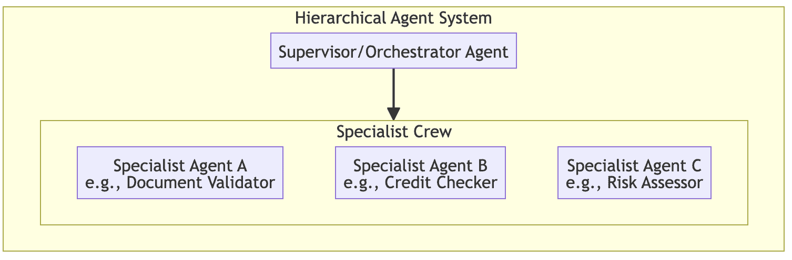
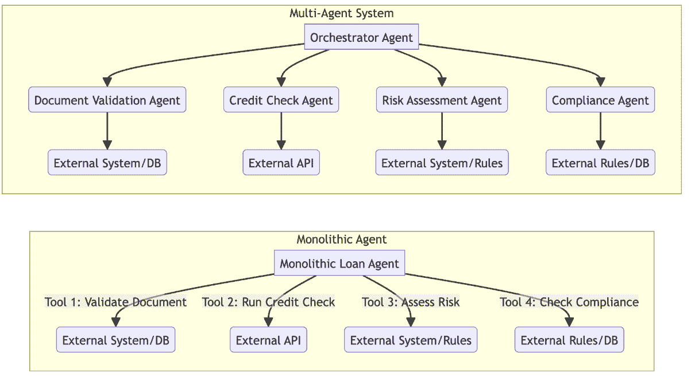

# 14

# 用例：用于贷款处理的多人代理系统

在上一章中，我们成功构建并测试了一个单体、单一代理系统，用于处理贷款申请。通过利用***FCoT***模式和一套强大的工具，我们构建了一个能够协调整个工作流程的第 3 级代理。

这种单一代理架构是代理成熟度旅程中一个强大且必要的里程碑。它提供了端到端自主价值，并为接下来要发生的事情提供了完美的基础。

然而，当我们分析系统的性能并考虑现实世界生产环境的需求时，我们识别出单代理设计中固有的几个架构局限性：

+   **认知过载和维护性**：代理的中央 FCoT 提示变得越来越庞大和复杂。随着我们添加更多工具或细微的业务逻辑，这个单体提示变得难以调试和维护，而且可能会产生意外的副作用。

+   **单点故障**：整个过程依赖于一个代理的推理循环。如果代理误解了一个步骤或由于潜在模型问题而失败，整个工作流程就会停滞。系统缺乏用于关键任务所需的模块化弹性。

+   **缺乏专业化**：虽然代理可以调用专业工具，但代理本身是一个通才。它必须了解文档验证、信用政策、风险评估和合规性的复杂性，这增加了其认知负担，并使得更新一个领域的专业知识而不会影响其他领域变得困难。

既然我们已经看到了单一自主代理的强大和局限性，我们将直面这些挑战。

在本章中，我们将通过将其重构为多人代理系统，将我们的解决方案从第 3 级成熟度进化到第 4 级。

我们将应用***监督器（协调器）架构***模式，将我们的专业“工具”提升为一支协作的、单功能的代理团队。这种方法不仅将解决我们之前设计的局限性，还将为我们的代理应用程序解锁新的可扩展性、弹性和可维护性水平。

这种新的结构将我们的应用程序从单一、复杂的实体转变为一个由更简单、更重要的是高度互操作组件组成的系统，正如我们将在*层次化* *代理* *架构*部分中看到的那样。

在本章中，我们将涵盖以下主题：

+   层次化代理架构

+   构建多人代理系统

+   实践中的模式考察

+   将用例映射到代理人工智能级别

# 技术要求

要成功完成本章的动手示例，你需要以下条件：

+   **谷歌** **账户**：这是访问谷歌 Colab 和谷歌 AI 工作室所必需的。

+   **Google Colab**: 代码示例设计为在 Google Colab 笔记本中运行，该笔记本提供了一个免费、基于云的 Python 环境。示例轻量级，因此您不需要高性能的本地硬件；一个标准的网页浏览器就足够了。

+   **Google AI Studio API** **k****ey**: 您需要有效的 API 密钥才能访问代理示例中使用的 Gemini 模型。您可以通过遵循此处文档获取密钥：[`ai.google.dev/gemini-api/docs/api-key`](https://ai.google.dev/gemini-api/docs/api-key).

+   **Python** **l****ibraries**: 示例依赖于 `google-adk` 库和其他标准 Python 包。笔记本包括直接在环境中安装这些依赖项的必要命令。

本章的完整代码，包括可运行的笔记本和辅助脚本，可在本书的 GitHub 仓库中找到：

[`github.com/PacktPublishing/Agentic-Architectural-Patterns-for-Building-Multi-Agent-Systems/tree/main/Chapter_14`](https://github.com/PacktPublishing/Agentic-Architectural-Patterns-for-Building-Multi-Agent-Systems/tree/main/Chapter_14).

# 层次化代理架构

尽管多代理 idx_ae8cf7de 系统可以组织成各种拓扑结构，如去中心化的蜂群或适合开放式创意任务的点对点网络，但受监管的企业工作流程需要更严格的控制。对于审计性和遵循特定步骤不可协商的贷款处理流程，最有效的设计是层次化架构，也称为 ***S******upervisor/******O******rchestrator*** 模式。这种模式将代理组织成一个类似于企业团队的架构，由管理者监督一群专家。我们不是创建一个试图做所有事情的单一、庞大的代理，而是创建一个责任明确划分的系统。

该模型由两个不同的代理角色组成：

+   **The** **s****upervisor (parent) agent**: 这个 idx_0e6346ea 代理充当管理者。其主要任务是规划整体工作流程，将子任务委派给适当的专家，监控进度，并从专家的发现中综合最终结果。

+   **The** **s****pecialist (sub-agent)**: 这些代理是个人专家。每个都设计得能做得非常好，比如验证文档或计算风险 idx_fd93c3fbscore。它接收一个任务，使用其专用工具执行它，并将结果返回给其管理者。

在定义了这些角色之后，让我们探讨能够实现这种编排和模块化的具体架构模式：

+   **代理委托** **至** **代理**：此 idx_cfaf6742 是正在发挥作用的核心模式。监督代理本身不执行工作，而是将其委托给另一个自主代理。ADK 的`AgentTool`类是此模式的直接实现。它封装了一个完整的独立代理，包括其自己的 LLM、指令和工具，并隐藏在一个标准工具接口后面，允许监督者像调用任何其他函数一样同步调用它，尽管存在嵌套延迟和令牌成本的权衡。

+   **容错** **和** **隔离**：通过 idx_c1ab27e4 将工作流程分解为独立的代理，我们隔离了故障。如果`CreditCheckAgent`失败，它不会使整个系统崩溃。监督者可以捕获错误并决定行动方案，例如停止流程或升级到人工。这比单体设计有显著的改进。

+   **模块化**：每个 idx_2d4961c2 专家代理是一个自包含的专家模块。我们可以更新、改进或甚至替换`RiskAssessmentAgent`，而无需触及系统的任何其他部分，从而实现一个更易于维护和可扩展的架构。

以下图表说明了这种清晰、分层的关系：



图 14.1 – 分层代理架构的简化模型

让我们也回顾一下这种新的架构，与我们在上一章中探索的原生单体架构进行对比。

这种新的结构 idx_b2e089b7 将我们的应用程序从单一、复杂的实体转变为一个由更简单、可互操作组件组成的系统，如图所示：



图 14.2 – 对比单体架构与多代理架构

让我们深入探讨我们的多代理架构。

# 构建多代理系统

我们现在将重构我们的 idx_779dfe39 笔记本，以实现这种优越的架构。这个过程涉及创建真正专业的代理，每个代理都有自己的模型、指令和单一专用工具。

## 为专家配备专用工具

首先，我们定义 Python idx_c9c1f687 函数，这些函数将作为每个专家的专用工具。虽然我们的示例使用标准的 Python 类型提示以保持简单，但生产级系统应强制执行严格的输入/输出模式（使用 Pydantic 等库），以确保代理之间的数据完整性。

每个函数现在都包含其任务的精确业务逻辑，包括我们“不愉快路径”场景的特定规则，例如立即将信用评分低于 600 的情况标记为高风险失败条件：

```py
#@title Create and Equip All Specialist Sub-Agents with Tools
from google.adk.agents.llm_agent import LlmAgent

from google.adk.tools import FunctionTool, AgentTool

import json

# --- 1\. Define Python Functions to Serve as Tools ---
def validate_document_fields(application_data: str) -> str:

   # ... (function definition from the notebook) ...
def query_credit_bureau_api(customer_id: str) -> str:

   # ... (function definition from the notebook) ...
def calculate_risk_score(loan_amount: int, income: str, credit_score: int) -> str:

   # ... (final, refined function definition from the notebook) ...
def check_lending_compliance(credit_history: str, risk_score: int) -> str:

   # ... (final, refined function definition from the notebook) ...
# --- 2\. Wrap Functions in ADK FunctionTools ---

validation_tool = FunctionTool(func=validate_document_fields)

credit_tool = FunctionTool(func=query_credit_bureau_api)

risk_tool = FunctionTool(func=calculate_risk_score)

compliance_tool = FunctionTool(func=check_lending_compliance)
```

在前面的代码块中，我们建立了我们系统的基本能力。我们定义了四个不同的 Python 函数，每个函数代表一个特定的领域能力：

+   `validate_document_fields`：模拟解析传入的贷款申请文档，确保 JSON 结构有效且所有必需字段都存在

+   `query_credit_bureau_api`: 作为我们访问外部数据的接口，为给定的客户 ID 获取信用评分

+   `calculate_risk_score`: 封装核心金融逻辑，根据收入、贷款金额和信用评分之间的关系计算风险指标

+   `check_lending_compliance`: 强制执行业务治理，验证计算出的风险 `idx_383d4292profile` 是否符合机构的监管标准

我们将这些函数包裹在 ADK 的 `FunctionTool` 对象中。这个包装器是必不可少的；它检查 Python 函数签名并生成 LLM 需要的架构描述，以便了解如何调用工具。

现在我们已经锻造了个体工具并定义了它们强制执行严格的“数据合同”，我们需要将它们交给有能力的操作者。在下一节中，我们将实例化专门的代理本身，为每个代理分配一个独特的身份、一个特定的任务以及我们刚刚创建的专用工具。

## 创建专业代理团队

定义好工具后，我们创建了我们的专业代理。关键的是，每个代理现在都是其自己的 `LlmAgent` 实例，包括模型、高度专注的指令集和其单一专用工具。他们的 `idx_ad1a1b6dinstructions` 现在更简单，只告诉他们使用工具并期待特定的输入。这强制执行了代理之间的清晰“数据合同”。

这种解耦还使强大的生产策略成为可能：异构模型选择。您不再受限于整个工作流程的单个模型。您可以将轻量级、低延迟的模型（例如，Gemini Flash）分配给 `document_validator` 以进行快速提取，同时为 `compliance_checker` 预留更强大的推理模型（例如，Gemini Pro）以处理细微的政策解释。虽然这优化了成本和性能，但请注意，混合模型可能会引入行为上的微妙变化；像我们这里一样，依靠严格的 `FunctionTool` 定义是保持多样化代理团队一致性的最佳方式。

我们然后将每个专业代理包裹在 `AgentTool` 中。这是最关键的步骤，因为 `AgentTool` 充当适配器，使一个代理可以被另一个代理调用，并启用 ***代理委托到代理*** 模式：

```py
# --- 3\. Update Agent Instructions with Explicit Input Requirements ---

doc_validator_instructions = """
You are a Document Validation Agent.
Your ONLY task is to call the `validate_document_fields` tool.
**INPUT REQUIREMENT:** You must receive the complete, original loan application as a JSON string.
If you receive the required input, call the tool and return its exact output.
If the input is missing or malformed, respond with an error: 'ERROR: Missing or invalid application_data input.'
"""
# ... (and so on for the other 3 agents' instructions) ...
# --- 4\. Create Agent Instances, Assigning a Model to Each ---

document_validation_agent = LlmAgent(

   model="gemini-3-flash",

   instruction=doc_validator_instructions,

   name="document_validator",

   description="Use this agent to validate the structure and content of a new loan application document.",

   tools=[validation_tool]

)

# ... (and so on for the other 3 agents) ...
# --- 5\. Wrap Agents in AgentTools ---

validator_agent_tool = AgentTool(agent=document_validation_agent)

credit_checker_agent_tool = AgentTool(agent=credit_check_agent)

risk_assessor_agent_tool = AgentTool(agent=risk_assessment_agent)

compliance_checker_agent_tool = AgentTool(agent=compliance_agent)
```

**生产** **警告：抽象的成本**

对深度委托链（例如，主管 → 经理 → 团队领导 → 工人）要谨慎。每一层都增加了一个完整的 LLM 推理往返，显著增加了延迟和令牌成本。

**设计** **注意：通过** **GenerateContentConfig** **进行生产** **配置**

虽然我们的代码突出了代理的结构性连接，但生产系统需要严格的行为控制。在 ADK（以及 Google GenAI SDK）中，这通过`generate_content_config`参数管理，该参数接受一个`types.GenerateContentConfig`对象。为了确保我们的专业代理在企业级工作流中表现出可预测的行为，我们必须配置几个关键参数：

+   温度（`temperature`）：对于专业代理（如我们的验证器和合规代理），设置为`0.0`以强制确定性、分析性输出。仅对创意或对话角色使用更高的值（例如，`0.7`）。

+   输出限制（`max_output_tokens`）：定义严格的限制以防止无限循环或过度冗长。

+   安全性（`safety_settings`）：配置块阈值以确保代理在处理敏感财务数据时不会触发误报拒绝。

*对于这个架构演示，我们依赖于默认设置以专注于协调器模式，但您应该始终为实时部署明确配置这些设置。*

在前述代码中，我们将每个专业代理包裹进一个`AgentTool`。这一关键步骤将我们的自主子代理转换成协调器可以调用的可调用工具，有效地实现了 idx_8df794cd 的**代理委托到代理**模式。

现在我们已经完全定义并可以访问我们的专业团队，我们必须更新将领导他们的协调器。

## 添加生产护栏

虽然我们的架构定义了代理之间的通信方式，但第 4 级系统还必须处理生产环境的噪声。在我们的更新实现中，我们引入了企业级健壮性模式，以确保系统不会在 API 压力下崩溃。

```py
# 1\. Configure the agent's reasoning engine with a Thinking Budget
thinking_config = ThinkingConfig(
include_thoughts=True,
thinking_budget=1024
)

# 2\. Implement the Robust Runner with Retries and Throttling
@sleep_and_retry
@limits(calls=15, period=60)
@retry(
stop=stop_after_attempt(5),
wait=wait_exponential(multiplier=2, min=4, max=30),
retry=retry_if_exception(is_rate_limit_error)
)
def start_agent_run(runner, user_id, session_id, content):
return runner.run(user_id=user_id, session_id=session_id, new_message=content)
```

如前述代码所示，我们将执行逻辑包裹在一个健壮的运行器中，该运行器实现了：

+   **速率限制**：我们使用`@limits`装饰器主动限制请求，确保我们保持在提供商配额内（例如，每分钟 15 次调用）。

+   **指数退避**：使用`tenacity`库，当系统遇到`RESOURCE_EXHAUSTED`（429）错误时，会智能重试。它不会使贷款申请失败，而是等待并使用递增的间隔重试。

+   **思维预算**：我们配置了一个带有`thinking_budget`的`ThinkingConfig`。这允许协调器在内部推理上花费更多的计算周期，这对于解析子代理返回的嵌套 JSON 数据至关重要。

## 修订协调器的思维

我们的主要代理 idx_e2f48547 的角色现在从**执行者**转变为**管理者**。

**架构** **注意**：**上下文** **状态管理**

与在步骤之间传递结构化 Python 字典（例如，`state` `= {'``id':` `123}`）的工作流引擎不同，我们的协调器依赖于上下文状态。"状态"是专业代理累积的 JSON 输出历史。

例如，当文档验证器返回 `{"status": "valid", "extracted_data": {"customer_id": "CUST-123", "income": "5000"}}` 时，指挥官从其上下文窗口中读取此信息，并动态构建下一次委托调用的有效载荷：`credit_checker_tool(customer_id="CUST-123")`。

这需要指挥官明确指示要提取和转发哪些字段，实际上充当了一个语义数据映射器。

我们更新我们主要代理的 FCoT 提示以反映这一点。现在，它的指令不再是指工具列表，而是指其专业团队。提示还使指挥官明确负责从代理到代理传递正确的数据上下文，解决了我们在最终调试会话中确定的“上下文丢失”问题：

```py
#@title Create the Orchestrator Agent (with Self-Correction and Data Awareness)

orchestrator_instructions = """
You are an FCoT-powered Orchestrator Agent managing a team of specialist agents...
Your primary role is to plan the workflow, delegate tasks, and intelligently handle exceptions.
**Failure Handling Policy:**
   1\.  **Reflect:** If a specialist agent returns an error, first analyze the error message.
   2\.  **Resolve:** If the error is due to missing information, review the original request...
   3\.  **Escalate:** Only if you cannot resolve the error on your own should you escalate...
**Your Specialist Team (Available Agents for Delegation):**
   * **`document_validator`:** ... It returns the validated data.
   * **`credit_checker`:** ... You must pass it the `customer_id` from the validated data.
   * **`risk_assessor`:** ... You must pass it the `loan_amount`, `income`, and `credit_score`...
   * **`compliance_checker`:** ... You must pass it the `credit_history` AND the `risk_score`...
"""
# ... (rest of the agent initialization code) ...
```

这些指令定义了我们的指挥官的运行原则。通过明确定义故障处理策略和具有严格输入要求的专业团队名单，我们确保指挥官管理工作流程，而不是试图执行每个步骤。

在我们的架构完全定义后，从单个工具到中央指挥官，我们准备对这个系统进行测试。

## 执行和分析

在我们的多代理系统 idx_0b8f17d5 完全组装后，我们准备部署它。为此，我们需要建立一个运行时环境，不仅执行代理，还能捕获其复杂的内部推理进行分析。

我们将设置 ADK `Runner` 对象来管理代理的生命周期，并定义一个 `call_agent` 函数。这个函数作为我们进入代理思维的窗口，通过过滤和显示执行循环中生成的原始事件（思想、工具调用和输出）来实现 ***可观察性*** 模式 idx_265190c6。

### 会话初始化

首先，我们初始化 idx_71d4ca18 会话服务。这维护了我们交互的状态，允许代理在必要时在多个回合中保留上下文：

```py
#@title Session init
# Define unique IDs for our test user and session
USER_ID = "loan_officer_01"
SESSION_ID = str(uuid.uuid4()) # Generate a new session ID for this run
APP_NAME = "Loan_Agent"

session_service = InMemorySessionService()
session = await session_service.create_session(app_name=APP_NAME, user_id=USER_ID, session_id=SESSION_ID)
runner = Runner(agent=agent, app_name=APP_NAME, session_service=session_service)

print(f"Runner is set up. Using Session ID: {SESSION_ID}")
```

### 执行循环：实现可观察性

接下来的 `call_agent` 函数充当我们的执行工具。它将用户的查询发送给运行器，然后遍历代理返回的事件流。

关键的是，这个函数解析代理的输出，将思想（由我们的 FCoT 指令驱动的内部独白）与工具调用（采取的行动）分开。这种细粒度的日志记录对于验证我们的指挥官是否根据我们设计的模式正确地规划和委托任务至关重要：

```py
#@title Call Agent Method
def call_agent(query: str):
    """
    Packages a query, runs it, and prints a clean, filtered log of the
    agent's thoughts, tool calls, and final response.
    """
print(f"\n > > > > USER REQUEST: {query.strip()}\n")

    # Create the user message content and run the agent
    content = types.Content(role='user', parts=[types.Part(text=query)])
    events = runner.run(user_id=USER_ID, session_id=SESSION_ID, new_message=content)

    print("--- Agent Activity Log (Filtered) ---")
    for event in events:
        if event.content:
            for part in event.content.parts:
                # Check for a thought by checking for a truthy value
if part.thought and part.text:
                    print(f"\n🧠 THOUGHT:\n{part.text.strip()}")

                # Check for a tool call by checking for a truthy value
if part.function_call:
                    tool_name = part.function_call.name
                    tool_args = dict(part.function_call.args)
                    print(f"\n🛠️ TOOL CALL: {tool_name}({tool_args})")

                # Check for a tool output by checking for a truthy value
if part.function_response:
                    tool_name = part.function_response.name
                    tool_output = dict(part.function_response.response)
                    print(f"\n↩️ TOOL OUTPUT from {tool_name}:\n{tool_output}")

        # Extract the final text response at the end
if event.is_final_response() and event.content:
            final_text = ""
# The final answer is in a Part with text but is not a thought
for part in event.content.parts:
                if part.text and not part.thought:
                    final_text = part.text.strip()
                    break # Use the first non-thought text part as the answer
if final_text:
                print("\n---------------------------------")
                print("✅ FINAL RESPONSE:")
                print(final_text)
                print("---------------------------------")
```

在我们的执行工具就位后，我们现在可以运行代理通过特定的场景。

### 场景分析：深入分析代理推理

通过检查 `call_agent` 生成的日志 idx_ef195439，我们将验证 ***指挥官*** 和 ***代理委托给代理*** 模式在实际中的功能。

#### 场景 1：愉快的路径（成功批准）

在此场景中，我们提供了一个来自合格申请人的有效应用程序。目标是观察多代理协作的完美、不间断流程以及协调器的推理。

这是快乐路径的完整代理活动日志：

```py
>>>> USER REQUEST: Please process this new loan application: …
Please process this new loan application:
  "customer_id": "CUST-12345"
  "income": "USD 5000 a month"
  "loan_amount": 50000,
  "credit_history": "Very Solid",
  "loan_documents": ["doc_1.pdf","doc_2.pdf","credit_history.pdf","loan_application.docx"]

🧠 THOUGHT (Iteration 1: Planning):
RECAP: Okay, so I've got a loan application here... I see the user has provided all the necessary details: the customer ID ("CUST-12345"), their income (USD 5000 a month), the requested loan amount (50000), the credit history ("Very Solid")... My team of specialized agents are set up to handle each stage of the process...
REASON: The first agent, the document_validator, requires the entire application data in a single JSON string... Once validated, I'll extract the customer ID and feed that to the credit_checker... Then, using that score along with the loan amount and income, I'll pass those to the risk_assessor... Finally, the risk score and the original credit history will be analyzed by the compliance_checker...
VERIFY: I've verified that each agent's input matches their expected data contract, making sure that everything is set up correctly for the agents to do their jobs. Now, it's time to execute the plan...
🛠️ TOOL CALL: document_validator(...)
...
↩️ TOOL OUTPUT from document_validator: {'result': '{"status": "validated", ...}'}
...
🧠 THOUGHT (Iteration 2: Synthesis):
RECAP: Okay, here's the final call. I've run this application through the complete origination pipeline...
REASON: ...document validation was a clean pass... credit check came back with a solid score - 810... risk assessment gave us a risk score of 6, which falls within acceptable parameters... compliance check? That's a green light... I will combine all these results.
VERIFY: Taking all of this into account, I have everything I need to render the final summary and recommendation.
✅ FINAL RESPONSE:
The loan application... has been successfully processed... Loan Decision: Approved.
```

此执行跟踪提供了关于控制代理行为的`***FCoT***`模式的完美、可观察的示例：

+   **迭代 1**：**规划阶段**：协调器的第一个想法是一个完整的 FCoT 规划循环：

    1.  它从`RECAP`开始，确认用户的请求并清点其可用资源（专家代理）。

    1.  然后它转向`REASON`，在那里它制定了一个精确的多步骤计划。关键的是，它不仅仅是按顺序排列代理；它还在推理它们之间的数据流，明确提到将从一步中`"提取客户 ID"`以用于下一步。这证明了它对其提示中嵌入的数据合同的认识。

    1.  最后，它执行`VERIFY`步骤，这是 FCoT 的关键组成部分。它对其计划与内部规则进行批判，声明，“`我已经验证每个代理的输入与其预期的数据合同相匹配。`”这种自我纠正的行为确保代理以高信心进行操作，并降低了错误的风险。

+   **迭代 2**：**综合阶段**：在所有工具调用完成后，代理在回应之前的最后想法是另一个 FCoT 循环，这次专注于综合：

    1.  它从`RECAP`开始，总结工作流程的状态（`"我已经将此应用程序通过完整的起源管道运行..."`）。

    1.  它转向`REASON`，将每个专家的个别发现综合成一个连贯的故事（`"文档验证顺利通过...信用检查返回了稳定的分数..."`）。

    1.  它以`VERIFY`结束，确认它拥有生成最终交付品所需的所有必要信息，直接履行其指令合同。

这种结构化的两阶段推理过程是`***FCoT***`模式的标志。它迫使代理在规划时谨慎行事，在结论时严格，使其成为复杂、多步骤任务的高度可靠的协调器。

计划之后的`TOOL CALL`日志序列是此验证策略的直接执行，展示了实际中的`**监督者（协调器）**`和`**代理委托给代理**`模式。

#### 场景 2：拒绝路径（高风险失败）

此场景测试系统观察、调节和执行关键业务规则的能力。这通常被称为政策遵守。面对负面但预期的结果时，代理的推理是其鲁棒性的关键测试。

以下是拒绝路径的完整代理活动日志：

```py
>>>> USER REQUEST: Please process the loan application: …
"customer_id": "CUST-55555"
  "income": "USD 1000 a month"
  "loan_amount": 1000000,
  "credit_history": "Presenting Gaps",
  "loan_documents": ["drivers_license.pdf"]

🧠 THOUGHT (Iteration 1: Planning):
RECAP: Okay, so I've got the application details: customer ID "CUST-55555," income of USD 1000 a month, a hefty loan amount of 1,000,000...
REASON: I'll kick things off by feeding the entire application data... into the document_validator... Next, I'll extract the customer_id... and pass it to the credit_checker... and so on.
VERIFY: Data dependencies are solid.
... (A series of successful TOOL CALLS for validator, credit checker, and risk assessor) ...
↩️ TOOL OUTPUT from risk_assessor:
{'result': '{"risk_score": 8}'}
... (TOOL CALL to compliance_checker with risk_score: 8) ...
↩️ TOOL OUTPUT from compliance_checker:
{'result': '{"is_compliant": false, "reason": "Policy violation: Risk score of 8 is too high for approval."}'}
🧠 THOUGHT (Iteration 2: Synthesis):
RECAP: Okay, so I've run through the entire process.
REASON: First, the documents looked good... Next, the credit check showed a score of 680... The risk assessment flagged something though; a risk score of 8 came back. That's a bit high, and that's where the problem is. The compliance check flagged it right away: a risk score of 8 violates policy. It's a clear-cut policy violation; that's the bottom line.
VERIFY: The primary reason for denial is the high-risk score of 8, which exceeds the acceptable threshold for loan approval according to internal policy.
✅ FINAL RESPONSE:
The loan application for CUST-55555 is rejected. The primary reason for the rejection is a policy violation...
```

这个执行跟踪揭示了 idx_4076e82e 如何确保***FCoT***模式即使在结果为负面时也能保持稳健性。代理不是简单地失败或返回一个通用错误，而是应用相同的严格认知结构来诊断问题并证明拒绝的合理性。让我们探讨一些方面：

+   **一致的规划**：协调者的初始 FCoT 规划循环与快乐路径相同。这证明了系统的可靠性。无论应用的内容如何，它都遵循相同的严格过程`RECAP`、`REASON`和`VERIFY`，确保程序的一致性。

+   **综合矛盾证据**：这个日志中最有洞察力的一部分是最后的想法。这正是 FCoT 的综合循环证明其价值的地方：

    1.  代理对完成的流程进行了`RECAP`。

    1.  在`REASON`步骤中，它面临着相互矛盾的证据：前几个步骤是成功的（“文件看起来不错...信用检查显示评分为 680...”），但最后一步是一次硬性失败（“合规性检查立即将其标记出来...这是一条明确的政策违规”）。代理正确地推理出合规性失败是最重要和决定性的因素。

    1.  在`VERIFY`步骤中，它直接将最终结论建立在专家代理的输出上，声明：“拒绝的主要原因是对高风险评分 8...”。这通过 idx_7475ac04 提供透明、可验证的理由，满足了***可解释性和审计跟踪***模式，从而为负面结果提供了合理的解释。

这种权衡证据并正确优先考虑关键失败而非初始成功的能力是一种复杂的推理能力。

FCoT 框架提供了结构，使代理能够可靠地执行这种分析，展示了它如何被用来构建不仅执行工作流程，而且基于结果做出合理、可审计判断的代理。

现在我们已经分析了我们的多代理系统逐步执行的步骤，让我们花点时间将我们的观察正式地与我们之前在书中介绍的设计模式联系起来。通过明确地将代理的行为映射到这些模式上，我们可以更好地理解它们如何作为构建稳健和智能代理系统的基本蓝图。

# 实践中的模式分析

在整本书中，我们探索了一系列构建多代理系统有效且高效的设计和架构模式。每个模式都是解决代理工程中特定挑战的蓝图。我们的多代理贷款处理器不仅仅是一段运行一个代理的单个代码；它是一个动态的代理生态系统，这些模式在这里汇聚，创造出一个充满智能的系统，该系统反映了业务和领域需求，并通过严格的评估得到验证，由安全护栏保障，从而产生的能力远大于其各个部分的总和。

通过这个例子，我们见证了如何实现用于编排、推理和弹性的抽象模式，以构建一个不仅智能而且健壮且可审计的复杂代理。

让我们剖析我们的实现，看看这些关键模式是如何通过代理自身的内部独白来实现的。

## 模式：监督者（AI 编排器或元代理）架构

**监督者**模式 idx_10d1771e 是我们整个系统的主蓝图。它通过建立明确的控制层次结构来解决管理压倒性复杂性的挑战。而不是一个必须对一切都很精通的单个、统一的代理，这个模式提倡“经理和团队”结构。

监督代理的角色不是执行任务，而是理解高级目标，将其分解为逻辑步骤，将这些步骤委托给适当的专家，并将他们的发现综合成一个最终、连贯的结果。

在我们的用例中，编排代理是典型的监督者。它的 FCoT 提示中不包含验证文档或评估风险的业务逻辑；它的整个认知过程都致力于工作流程管理。

通过卸载详细工作，监督者可以完全专注于流程的战略执行，确保所有步骤都正确且按正确顺序完成。这种抽象使得系统能够处理复杂的多步骤业务流程，而不会将所有认知负荷集中在单个代理上，这对于构建可扩展和弹性的代理应用程序至关重要。

我们在代理的“拒绝路径”场景的最终思考中清楚地看到了这个模式。在收到所有专家的报告后，它的推理纯粹是管理性的：

```py
🧠 THOUGHT from the log: Okay, so I've run through the entire process. First, the documents looked good... Next, the credit check showed a score of 680... The risk assessment flagged something though; a risk score of 8 came back... The compliance check flagged it right away... a risk score of 8 violates policy.
```

代理本身不计算风险或检查合规性；它接收、解释和优先处理来自其团队的报告，以做出最终、执行的决策。这种关注点的分离是**监督者**模式的核心优势。

让我们再举一个例子，那就是自动供应链管理系统。监督代理将监控整体库存水平。如果它检测到某种产品的库存低，它将委托任务给`SupplierContactAgent`以检查可用性，`LogisticsAgent`以计算运输成本和时间，以及`PurchaseOrderAgent`以创建和提交订单，编排整个采购流程，而不管理任何单个步骤的细节。

## 模式：代理委托给代理

这个模式是 idx_f80e64a4 实现**监督者**架构的主要机制。它为单个代理调用另一个自主代理的能力提供了一种标准化的方式。

为了使这成为可能，调用代理不需要知道其他代理是如何工作的；它只需要知道其他代理做什么以及它需要什么输入。这创建了一个强大的抽象，允许创建模块化、互操作的代理系统。

我们直接使用 ADK 的 `AgentTool` 实现了这个模式。通过将我们的每个专家（例如，`document_validation_agent`）包裹在 `AgentTool` 中，我们使它们成为可调用的组件，协调器可以将其视为其工具箱中的任何其他工具。

这种封装至关重要。所有复杂的逻辑（专家的指令、其专用的 Python 工具以及它使用的特定 LLM）都完全包含在专家代理本身中。这使得我们能够在不修改协调器的情况下开发、测试甚至替换专家代理。

代理日志在工作流程的初始阶段就提供了一个完美、明确的例子，展示了这种模式是如何发挥作用的：

```py
🧠 THOUGHT from the log: The first agent, the document_validator, requires the entire application data in a single JSON string... it's time to execute the plan and get this loan application processed.

🛠️ TOOL CALL: document_validator({'request': '{"customer_id": "CUST-12345", ...}'})
```

这个序列显示了协调器在规划委派并执行交接。`AgentTool` 提供了技术桥梁，将任务和必要的数据传递给 `document_validator` 专家，然后它开始自己的独立推理循环。

让我们看看另一个例子，那就是智能家居系统。当一个中央 `HomeManager` 代理接收到如 `Movie time` 这样的命令时，它将把相关任务委派给以下代理：`LightingAgent` 调暗灯光，`BlindsAgent` 放下百叶窗，以及 `MediaAgent` 打开电视和音响系统，所有这些操作都是通过 ***代理委派给代理*** 模式完成的。

## 模式：FCoT

***FCoT*** 是 idx_21003d99 模式，它控制着监督者的思维，充当其认知操作系统。它解决了确保代理推理是深思熟虑的、可审计的以及与其核心指令一致的关键挑战，从而防止在复杂的多步骤任务中出现“目标漂移”。它通过迫使代理遵循一个自适应的、递归的 `RECAP -``>` `REASON -``>` `VERIFY` 循环来实现这一点，用于规划和综合其最终答案。

它使用双重目标函数来优化其迭代的每个阶段，随着它开始关闭和聚焦其上下文窗口。

这种结构化推理使得我们的协调器成为一个可靠和值得信赖的管理者。它不会冲动行事。其操作的每个主要阶段都先有一个结构化的反思和自我纠正的时刻。

在“拒绝路径”场景中，FCoT 的综合循环对于使代理权衡矛盾的证据（成功的初始步骤与最终合规失败）并正确推理出政策违规是决定性因素至关重要。

代理在快乐路径日志中的第一个想法完美地说明了 FCoT 规划循环：

```py
🧠 THOUGHT from the log: RECAP: Okay, so I've got a loan application here... My team of specialized agents are set up to handle each stage... REASON: The first agent, the document_validator, requires the entire application data... Once validated, I'll extract the customer ID and feed that to the credit_checker... VERIFY: I've verified that each agent's input matches their expected data contract... Now, it's time to execute...
```

这不仅仅是一个简单的计划；这是一个结构化、自我批评的策略，使代理对其后续行动充满信心，使其行为可预测，审计轨迹清晰。

这里还有一个例子：一个科学研究的代理，其任务是总结一篇论文。其 FCoT 规划循环如下：

+   `RECAP`: 我需要总结这篇科学论文。

+   `REASON`: 首先，我将阅读摘要和结论，以了解主要观点。其次，我将阅读方法论。第三，我将草拟一个总结。

+   `VERIFY`: Thisidx_4f3307a4 是一个逻辑高效的计划，用于创建准确的总结。

在剖析了使我们的代理得以实现的特定设计模式之后，现在是我们放大视野的时候了。通过将我们的实际实施映射回本书开头介绍的代理人工智能级别，我们可以更好地理解我们架构选择的战略影响。

我们的使用案例，从单一代理到多代理团队的演变，不仅仅是一个技术练习；它是一个有形的证明，展示了组织在提升其代理能力以解决日益复杂问题的过程中所经历的旅程。

# 将用例映射到代理人工智能级别

这两个章节 idx_1c590996 的使用案例清楚地、实际地展示了通过代理人工智能级别最高层的旅程，不仅展示了每个级别是什么，还说明了为什么这种进步对企业成功至关重要。

### 第 3 级：有能力的但脆弱的单体

我们最初构建的单代理系统是典型的第 5 级系统。在这个阶段，组织已经达到了一个重要的里程碑：一个单一、自主的代理能够执行复杂、端到端的企业流程。

我们在*第十三章*中构建的`LoanProcessing`代理能够成功验证文件、检查信用、评估风险并确保合规，从而带来真正的商业价值。然而，其单体性质，即所有认知负荷、业务逻辑和工作流程控制都集中在单个、庞大的提示中，引入了重大的生产挑战。

这种集中化创建了一个本质上脆弱的系统；提示中某个部分的逻辑错误可能会对整个工作流程产生意外的后果。此外，随着业务流程的发展，维护和更新这个单一、复杂的“大脑”变得越来越困难且风险增加，限制了系统的长期可扩展性。

### 第 4 级：有弹性的、协作的团队

本章中构建的分层、多代理系统是第 4 级系统的直接实现。从第 3 级到第 4 级的飞跃不仅仅是添加更多代理；它是一个以问题分解原则为中心的根本性架构转变。

我们将一个复杂的问题分解成一系列更小、更简单的任务。然后，我们组建了一支由高度专业化的专家代理组成的团队，每个代理都设计用来只做一件事并且做得非常出色。这是从单个天才通才向协调的专业团队转变的代理等价物。

这种架构演变是解锁真正企业级能力的关键。系统变得更具弹性，因为单个专家代理的故障被隔离，并且可以由主管优雅地处理，而不会导致整个流程崩溃。

系统变得更加易于维护，因为风险评估的业务逻辑可以在其专用代理中更新，而不会影响信用检查过程。最重要的是，它变得更加可扩展，不仅在技术意义上，而且在认知意义上。通过分配认知负荷，这个第 4 级架构使我们能够处理更高复杂性的问题，构建比单个代理单独能够做到的更强大的系统 idx_99582972。

从“执行者”到“专业工作者管理者”的转变是第 4 级，我们代理人工智能层级顶峰的标志性特征。

## 超越第 4 级：代理协作的未来

虽然我们的第 4 级层级 idx_89884e46 系统代表了生产级代理应用的当前技术水平，但旅程并未结束。我们构建的模式和架构是构建更动态系统的基石。我们很快将看到第 5 级系统，这些系统利用元代理进行实时任务重新分配，但代理人工智能的最终未来在于能够自我组织、自我改进，甚至参与其自身经济的系统。

想象一个未来的第 6 级系统，其特征是涌现的群体。在这个范式下，没有固定的主管。相反，一组专业代理可以接收一个复杂、新颖的问题，并自主形成一个临时团队来解决它。例如，在一个复杂的公司贷款重组场景中，一个规划代理可能暂时担任领导，招募一个数据分析代理来模拟现金流预测，以及一个报告代理来总结法律风险，形成一个一旦重组计划完成就解散的临时等级结构。

在第 6 级更远的视野中，我们发现自我改进的代理系统。idx_a30ca304 一个代理贷款处理器可能不仅处理申请，还会分析其自身性能。它可能识别出其`风险评估`专家是频繁的瓶颈，并提出改进建议，甚至尝试重写底层工具的代码以提高效率。它可能对其提示的不同版本进行自己的 A/B 测试，以优化准确性和成本。

这不仅超越了执行，还进入了一种持续、自主的自我校正优化状态，我们将在本书的最后一部分进一步探讨这一概念。这些未来的级别将依赖于行业标准通信协议，以实现流畅和可靠的交互。**代理到代理**（**A2A**）协议，现在是**Linux Foundation**下的一个官方项目，为这种互操作性提供了认证标准。在跨行业指导委员会的指导下，A2A 允许代理无论其底层框架如何，都能发现、协商和协作。这种正式标准化将使真正的代理经济得以实现，它可以发现、招募并协作以解决我们刚刚开始想象的规模的问题。

让我们回顾一下本章所涵盖的内容。

# 摘要

在本章中，我们将我们的设计模式和架构理论付诸实践，最终形成了一个复杂的、多代理的贷款处理系统。通过超越抽象概念并进入功能性实现，我们现在可以概述从这一转变中学到的关键经验教训：

+   **从单体到代理团队**：我们的旅程始于一个功能强大但脆弱的 3 级单体代理。我们故意暴露其架构弱点（较差的错误隔离和难以维护），以推动向 4 级多代理系统的演变。从单一**执行者**到专门代理的**管理者**的转变是代理成熟度最高水平的标志性特征。

+   **模式作为成功的蓝图**：我们亲身体验了如何通过组合设计模式创建一个强大而智能的系统。**监督者（协调者）架构**提供了整体结构，而**代理到代理**模式作为其主要机制。协调者的认知过程由**FCoT**模式管理，并通过显式数据合同变得高效和可靠。

+   **实现生产就绪的弹性**：最终的多代理系统展示了真正的企业级品质。它通过隔离专家代理内的故障并优雅地处理它们来实现容错。其模块化设计允许独立开发和维护每个代理的专业知识。最后，通过提供其决策的清晰、逐步的理由，系统满足了关键的需求，即**可解释性**和**审计****跟踪**。

+   **代理人工智能作为软件学科**：这个用例表明，良好的软件架构原则可以直接应用于代理人工智能的世界。通过应用经过验证的问题分解和关注点分离模式，我们构建了一个不仅智能而且具有弹性、可扩展，并准备好应对现实世界复杂性的系统。

我们在构建这个第四级系统的工作为我们提供了一个强大而实用的基础。在这本书的最后一部分，我们将在此基础上继续构建，探讨对于这些高级代理系统长期成功和负责任部署至关重要的持续改进和治理的关键主题。

现在我们已经对构建这些高级代理系统意味着什么有了很好的理解，我们必须将注意力转向规范它们使用的关键原则。

在下一章中，我们将探讨确保我们构建的系统不仅强大，而且安全、公平和值得信赖所必需的框架。

# 免费订阅电子书

新框架、演进的架构、研究突破、生产故障——*AI_Distilled* 将噪音过滤成每周简报，供直接与大型语言模型和通用人工智能系统打交道的工程师和研究人员参考。现在订阅，即可获得免费电子书，以及每周的洞察力，帮助您保持专注并获取信息。

在 [`packt.link/8Oz6Y`](https://packt.link/8Oz6Y) 订阅或扫描下面的二维码。


