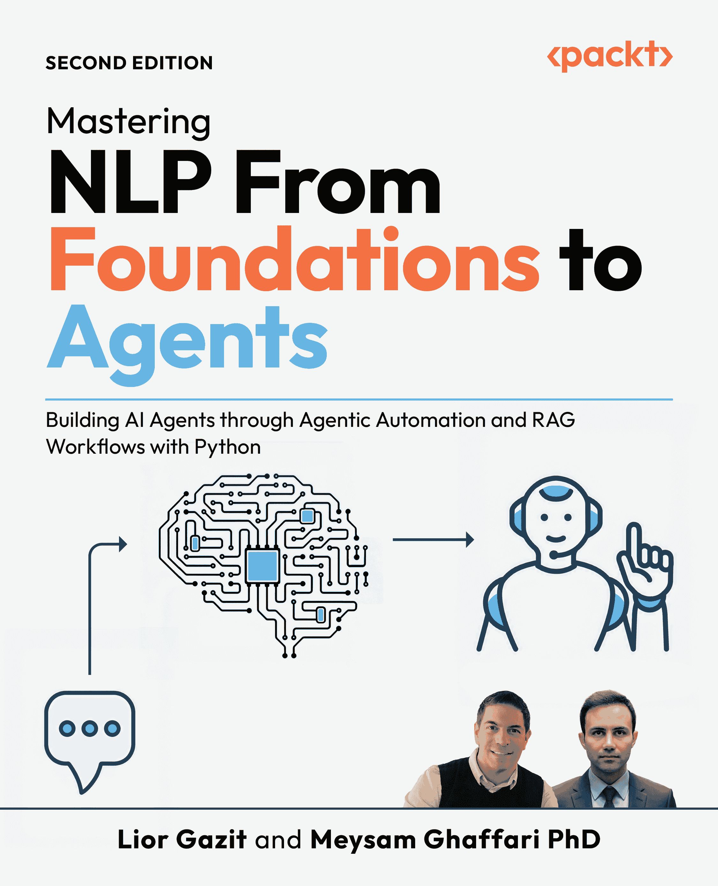
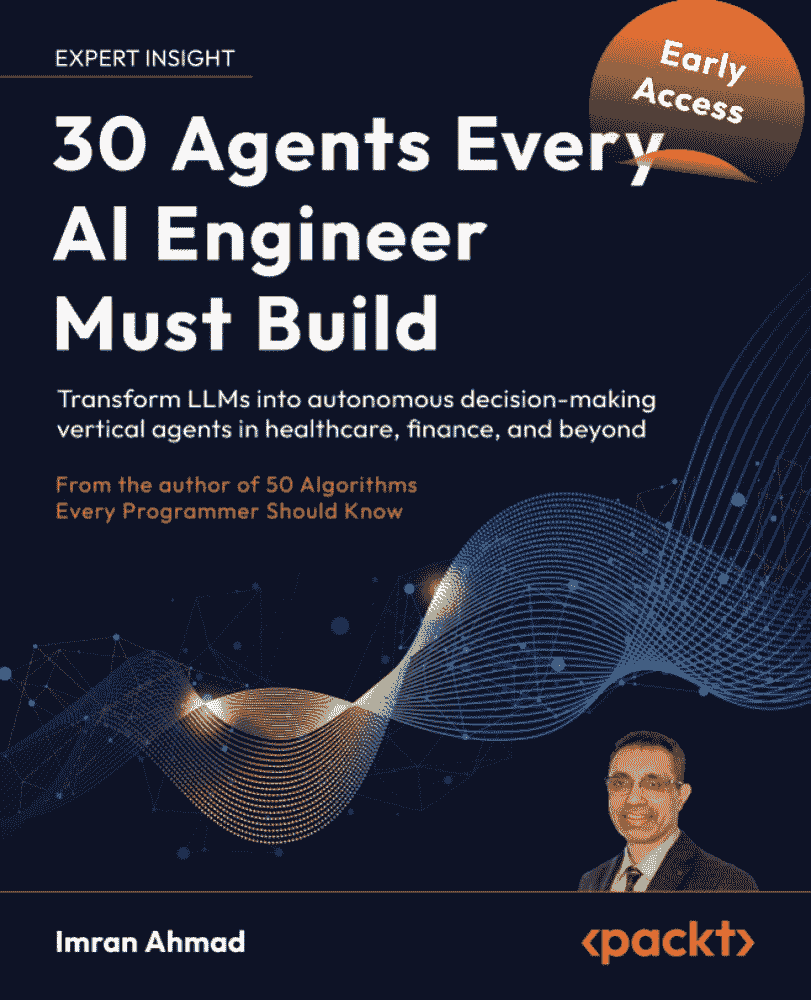

# 16

# 结论：绘制您的代理人工智能之旅

在这本书中，我们从生成式人工智能的基础概念出发，到构建、部署和管理生产级代理人工智能系统所需的复杂架构和模式。我们开始于企业景观的神秘化，然后通过 LLMs 的选择和适应，深入到使代理强大、可扩展和智能的架构模式。

从单一代理设计到复杂的多元代理协调，我们的重点始终在于实际实施和从实验到价值驱动生产的策略。

现在我们已经探讨了构建块、模式和框架，我们将汇集所学概念，为您提供应用它们的简单计划。最后一章回顾了我们的关键要点，为您和组织提供行动计划，并提供了如何构建变革性多代理应用的视角。

在本章中，我们将涵盖以下主题：

+   关键要点回顾

+   实现更高的代理成熟度

+   实践者的行动计划

+   最后的想法

# 案例研究

让我们探讨两个具体的“迷你案例研究”，说明一个组织如何从以“提示优先”转变为以“模式优先”的架构方法。

## 案例研究 1：自动化的金融合规代理

**组织**：一家中等规模的 idx_4007db53 地区性银行。

+   **目标**：根据交易日志自动化 idx_bab9dc77 的**可疑活动报告**（**SARs**）的起草。

    +   **“提示优先”的错误**：提示工程师立即编写了一个长的系统 idx_5c864248 提示：`您是一名合规官员。阅读这些日志并编写一份 SAR 报告`。

    +   **结果**：该模型产生了监管规则，但没有提供证据。内部审计拒绝该系统。这代表了一种缺乏在监管环境中所需根基的基础阶段方法。

    **“模式优先”的方法**：

    +   **风险**：idx_19a1aff4 代理可能会产生监管违规的幻觉或无法解释其推理。

    +   **选择的模式**：***指令忠实度审计*** (*第六章*)。

    +   **实施**：建筑师创建了一个架构，其中代理必须在起草报告之前输出一个引用特定交易 ID 和监管代码的结构化 JSON“想法”对象。这将存储在一个不可变的 BigQuery 日志中，以确保完全透明。

    +   **风险**：提交虚假报告是一场法律灾难。

    +   **选择的模式**：***人机协作*** (*第八章*)。

    +   **实施**：代理被赋予了`draft_report`工具，但没有`submit_report`工具。工作流程明确暂停，通知一名人类官员，并等待手动“`批准`”信号。

+   **结果**：一个生产阶段 idx_a6c9ac30 代理（GenAI Level 4），作为“倍增器”，将起草时间减少 80%，同时通过严格的接地和评估保持 100%的人类监督。

## 案例研究 2：IT 基础设施修复代理

+   **目标**：一个 idx_24fa592b 代理，能够检测服务器故障并自动重启服务。

    +   **“提示优先”的错误**：开发者给予 LLM 完整的 CLI 访问权限：`如果你看到错误，修复它`。

    +   **结果**：一个 idx_cb06282fnetwork 小波动导致超时；代理臆测服务器已被删除，并尝试配置一个新的（昂贵的）集群。这种脆弱的方法未能满足生产阶段服务的需求。

    **“模式优先”的方法**：

    +   **风险**：idx_076fc136 监控 API 是遗留的且不可靠（瞬态故障）。

    +   **选择的模式**：***自适应重试*** (*第七章*)。

    +   **实施**：架构师将`fetch_server_status`工具包裹在一个装饰器中，它会捕获 503 错误，并在报告失败之前实施指数退避策略（1 秒，2 秒，4 秒）。

    +   **风险**：代理可能会重启处于“维护模式”的服务，导致数据损坏。

    +   **选择的模式**：***自我纠正*** (*第九章*)。

    +   **实施**：在执行之前，代理进入自我纠正步骤。它必须查询维护计划，批评自己的计划（“这个服务器是否在维护窗口中？”），并且只有当计划通过这一内部审计时才继续进行。

+   **结果**：一个 idx_c98f5341robust Level 4 操作代理，创建“自我修复”基础设施，处理网络抖动并尊重安全窗口。通过实施 Level 2 实现（*第十二章*），它以高可靠性处理网络抖动并尊重安全窗口。

# 关键要点回顾

我们对代理 AI 的探索涵盖了关键问题领域，并提供了详细的步骤来 idx_2dbdde6fovercome 在问题空间中存在的约束和权衡下的挑战。最重要的概念不仅仅是孤立的技巧，而是支撑代理应用程序整个生命周期的相互关联的支柱。

## 将 GenAI 成熟度模型作为您的路线图

将和构建基于代理的 AI 应用的过程是一个进化过程，而不是 idx_d6499a55 短期集成或转型努力。为了引导您通过这一复杂性，我们在整本书中使用了三个不同的成熟度视角。理解这些框架如何相互关联是规划您旅程的最终步骤。

### 1. GenAI 成熟度模型 (第一章)

这就是您的战略路线图。它关注组织准备就绪以及支持人工智能所需的数据基础。它跟踪您的进度，从*准备数据基础*（第 0 级）和*情境增强*（第二级）到部署*单一代理*（第五级）和*多代理系统*（第六级）。

### 2. 代理人工智能成熟度谱（第三章）

这就是您的架构蓝图。它关注推理循环的智能和协调。它详细说明了从*基本代理系统*（第一级）到类似*ReAct***/***Reflexion***的*反思模式*（第三级）的过渡，最终达到高级*元代理协调*（第五级）和*自我校正反馈循环*（第六级）。

### 3. 实施成熟度级别（第十二章）

这就是您的工程学科。它关注从代码到生产的过渡。它从作为概念验证的*基础系统*（第一级）过渡到*生产就绪服务*（第二级），该服务解耦且具有弹性，最终过渡到自我改进的生态系统（第三级）。

以下表格作为您的指南针。它将这些三个视角整合为五个不同的阶段，确保您的组织抱负与您的技术架构和工程准备相匹配。

| **成熟阶段** | **通用人工智能模型（***第一章***)** | **代理人工智能谱（***第三章***)** | **实施成熟度（***第十二章***)** |
| --- | --- | --- | --- |
| 基础 | L0 和 L1：数据基础和提示 | L1：基本代理（固定工作流程） | 第一级：单一流程 POC 基本/爬行 |
| 增强型 | L2 和 L3：RAG 和调整 | L2：动态单一代理（工具选择） | 第一级：逻辑验证中间 |
| 生产 | L4: 基础和评估 | L3: 反思模式（ReAct/Reflexion） | 第二级：有弹性和可观察的中间/步行 |
| 自主 | L5：单一代理系统 | L3：（继续）高保真推理 | 第二级：解耦服务中间/步行 |
| 协调 | L6：多代理系统 | L4 和 L5：多代理系统和元代理 | 第三级：自我改进生态系统高级/运行 |
| 自学习 | L6：（高级）多代理 | L6：自我校正/反馈循环 | 第三级：自适应学习高级/运行 |

表 16.1 – 成熟度级别映射

理解这种一致性可以防止“架构过度扩展”。例如，一个组织在掌握必要的*基础和评估*（通用人工智能第 4 级）以信任代理的自主校正之前，应避免尝试构建*自我改进的生态系统*（实施级别 3）。

通过遵循此映射，您确保组织准备就绪、架构设计和工程学科同步发展，为变革性人工智能应用创造一个稳定的基石。

## 代理不仅仅是提示

从这本书中可以得出的一个重要结论是，真正的代理具有独特的“解剖结构”，如*第四章*所示。一个简单的、反应式的 LLM 调用（级别 1）是无状态的、被动的；代理是主动的、有状态的、目标导向的。这种转变是通过给推理引擎 LLM 一个“身体”来实现的。

这种解剖结构 idx_c6cb276f 包括记忆（既有短期的“便签”记忆用于在途任务，也有通过向量存储或管理内存服务（如 Agent Engine Memory Bank [`docs.cloud.google.com/agent-builder/agent-engine/memory-bank/overview`](https://docs.cloud.google.com/agent-builder/agent-engine/memory-bank/overview)）进行学习和维护长期记忆。它包括工具（如 API 和函数），允许代理感知并对其数字环境做出反应。关键的是，它包括规划和执行的能力，使其能够将复杂的多步骤目标分解成一系列可操作的步骤。这种结构是区分简单聊天机器人和代表你追求复杂目标的自主系统的关键。

## 模式是你的架构蓝图

本书的核心 idx_57514db8，在*第二部分*中详细阐述，在于提供代理 AI 工程学科的设计和架构模式。模式在特定情境中提供解决问题的方案，通常在问题空间中存在复杂的对立力量。因此，这些模式是可重用的、经过验证的蓝图，以可靠和可扩展的方式解决常见问题。它们是从脆弱的实验原型到健壮的生产级应用的必要工具包。

例如，当你需要确保你的代理能够从失败的 API 调用中恢复时，你实现 idx_fe5ee01fa 鲁棒性 idx_ede4d6d4 模式，如针对短暂网络中断的***自适应*** ***重试***，或者为了防止 idx_e5f5ca07c 级联故障而在持续中断期间使用***断路器***。当你必须向审计员证明代理为何做出特定决策时，你使用 idx_2318bcd3 可解释性模式，如***指令忠实度审计***。当代理需要在执行高风险金融交易之前请求批准时，你应用人类-代理交互模式，如***人机交互***。这些 idx_afb53a73 模式是构建可信赖、可管理、有效系统的架构语言。

## 框架加速，但不会取代设计

工具如 LangGraph、CrewAI 以及其他在*第一章*5*中讨论的代理框架是强大的加速器。它们为代理逻辑提供了必要的脚手架，管理状态，调度 idx_bea8a24e 工具，并启用代理间的通信。使用它们可以让你避免重新发明轮子，并让你专注于应用程序的独特业务逻辑。

然而，框架不能替代强大的架构设计。您的架构需求，由您选择的实现模式驱动，必须指导您选择框架，而不是反过来。需要显式分支、循环和验证（例如，如 ***Self******-******Correction*** 模式）的复杂工作流程非常适合像 LangGraph 这样的状态机模型。具有明确角色和责任的任务委派工作流程非常适合像 CrewAI 这样的分层模型。始终从您的架构蓝图开始，然后选择帮助您最有效地构建它的框架。

## 生产需要一种全面的方法

最后，一个成功的代理系统不仅仅是一个在笔记本上运行的巧妙算法。将自主系统部署到生产环境需要一个全面策略，这个策略远远超出了代理推理循环。这个策略建立在我们在整本书中强调的三个支柱之上。

第一是强大的 AgentOps 策略（在第 *2 章* 中讨论），它将 DevOps 和 MLOps 原则适应于管理代理、他们的工具和他们的模型依赖的独特挑战。第二是对持续改进的承诺（在第 *14 章* 中讨论），建立必要的反馈循环来监控代理性能并迭代地增强其能力。第三，也是最重要的，是治理和负责任的人工智能的非协商性基础（在第 *15 章* 中讨论）。因为代理可以自主行动，所以从第一天起将安全、伦理、透明度和护栏嵌入其设计是建立企业级采用所需信任的前提。

现在我们已经巩固了这些核心支柱，让我们将这种理解转化为您组织的具体策略。

# 实现更高层次的代理成熟度

本书中的概念旨在付诸实践。最终目标是推动您的组织沿着 GenAI 成熟度模型前进，在每个步骤中提高能力、可靠性和商业价值。这段旅程需要一个明确的策略。

我们建议通过为您的组织创建一个代理剧本并使用本书中的结构作为指南来正式化这个策略。这个剧本不应该是一个静态的文档，而是一个活生生的、动态的策略，随着您的能力和技术的进步而发展。它应该建立在以下核心支柱之上，将您的策略锚定在 GenAI 成熟度模型、架构模式和持续改进中。

## 评估您组织的当前状态

如果不知道你精确的起始位置，你就无法规划路线。你在 idx_f5f157cbplaybook 中的第一步是对你组织目前在我们*第一章*中介绍的 GenAI 成熟度模型上的位置进行诚实而彻底的评估。这个诊断是所有未来规划的基础。它确定了你的当前优势和挑战，揭示了可能的基础差距，并有助于明确你团队立即的优先事项。

例如，一个营销团队可能会要求一个复杂、自主的代理（第 5 级）来“运行我们整个社交媒体活动。”然而，适当的评估可能会揭示组织仍在努力整合其客户数据，并且刚刚实施了一个基本的 RAG 聊天机器人作为其内部知识库（一个坚实的第 2 级）。这个评估正确地界定了下一个逻辑步骤：不是第 5 级系统，而可能是一个可以自动化特定任务的第 4 级单一代理，例如“为产品公告草拟社交媒体帖子，使用 RAG 系统和新的‘营销风格指南’工具，然后将它们保存为草稿以供人工审查。”这通过将雄心与实际能力相一致，防止了昂贵且高调的失败。

## 识别高影响用例

有了一个清晰的起点，下一步是将潜在的代理解决方案映射到具体的业务 idx_d11b5685 问题。目标是超越“科学项目”，并确定高影响、高价值的机会。这是许多倡议停滞的地方。关键是避免试图解决整个海洋。不要一开始就试图构建一个复杂的多代理系统（第 5 级）来“解决客户支持”。这是一个失败的计划，因为范围未定义，成功无法衡量。

相反，首先识别一个定义明确、高价值的单一代理（第 4 级）用例，这个用例建立在你的现有基础上。例如，如果你的公司有一个可靠的 RAG 系统（第 2 级）用于回答人力资源政策问题，那么一个完美的第 4 级进化将是人力资源助手代理。这个代理不仅会*回答*问题（“我们的带薪休假政策是什么？”），还会*执行*请求（“我的当前带薪休假余额是多少？”以及“请为我提交下周五的带薪休假申请。”）。这是一个强大且界限分明的用例：它与特定的、定义明确的工具（RAG 系统、人力资源信息系统 API）交互，有一个明确的目标，并通过自动化高频、低复杂性的工作流程来提供可衡量的价值。

## 定义你的“模式优先”架构

一旦我们详细阐述了用例，也许我们程序员中的一种常见倾向是打开代码编辑器编码，或者开始编写提示。相反，考虑从模式优先的架构草图开始；把这看作是一种测试优先设计。基于经验，我们倡导的主要思维转变之一是采用“模式优先”的架构方法：通过制定一系列挑战及其相应的模式使用来平衡问题空间中的约束，并利用模式提供的解决方案来克服设计和架构挑战。这应该在编写代码之前完成。你可以与你的团队一起在白板上进行，选择、精炼和定位你的代理所需的*第二部分*中的适用设计和架构模式。

让我们以我们的第 4 级人力资源助理代理（来自 GenAI 成熟度模型）为例。一次架构会议会立即识别出几个必需的模式：

+   **合规性**：因为它处理特定员工的数据，所以**指令保真度审计**模式（*第六章*）是不可或缺的。

+   **安全性**：因为它提交了一个修改数据库（休假请求）的请求，所以**人工干预**模式（*第八章*）对于在执行不可逆操作之前提供确认至关重要。

+   **鲁棒性**：因为外部 HRIS API 可能会失败，所以需要一个**自适应重试**模式（*第七章*）来处理暂时性错误。

这种模式驱动的设计迫使你从一开始就解决安全性、可解释性和可靠性问题，而不是试图作为事后考虑来附加它们。

采用“模式优先”的架构本质上是对组织关注的战略预算。如*表 16.1*所示，每个成熟阶段都是由一组特定的架构选择解锁的。当你选择一组模式——例如，结合**指令保真度审计**以符合**自适应重试**以增强鲁棒性——你做的不仅仅是解决一个技术问题；你正在定义你在成熟度谱上的目标状态。

这种清晰度对于领导和从业者同样至关重要。它使你能够将资源和人才集中在实现目标所需的特定工程努力上，防止出现“架构漂移”，即团队构建不必要的复杂性。通过专注于这些选定模式的实施，你确保组织准备就绪、架构设计和工程纪律同步发展。在代理时代，成熟度不是偶然的结果，而是有意、模式驱动投资的计算结果。

## 建立治理和指导方针

代理的自主性是其最大的优势，同时也是最大的风险。2 级 RAG 系统有一个有限的“爆炸半径”；如果出错，它提供的是一个错误的答案。一个可以行动的 4 级代理有一个更大的“爆炸半径”；如果出错，理论上可能会删除错误的数据库或向错误客户发送电子邮件。由于代理以这种更高的自主性运行，治理和安全不能推迟。正如我们在*第十五章*中详细说明的那样，负责任的 AI 原则必须从代理设计的第一天起就集成到其中。

在您的操作手册中，这意味着在代理部署之前定义您的审计、偏差检测和合规性流程。对于我们的人力资源代理来说，这意味着实施***审计跟踪***模式来记录 idx_48d3ddc5 每个决策、思考和工具调用。这意味着使用***人工在环***模式作为“更改直接存款信息”等高风险行动的非协商性安全带。对于一个 5 级多代理系统，这些安全带变得更加关键，需要系统级模式（来自*第十章*）来防止级联故障或未预期的代理间交互。建立这些安全带是唯一能够建立组织信任以将您的代理从受限的沙盒环境迁移到生产环境的方法。

## 迭代并改进

您首次部署的代理不是项目的结束；它是其生命周期的开始。您的代理将遇到您没有预料到的边缘情况。它可能会误解工具的输出。它会犯错误。这并不是失败；这是过程的一个预期部分，也是改进的主要数据来源。您的操作手册必须将部署视为一个持续改进循环的开始，正如我们在*第十四章*中讨论的那样。

这需要建立稳健的代理操作实践（来自*第二章*）。对于我们 4 级人力资源代理，您必须拥有监控系统性能的系统。您可能会发现 15%的请假请求失败，因为用户以模糊的方式表达日期（“下个周末”）。这种反馈是无价的。它成为您下一次迭代的原材料：也许您会改进代理的提示，添加一个使用***自我纠正***模式（来自*第九章*）的明确“日期澄清”步骤，或者甚至对这些特定的模糊表达进行模型微调（如*第三章*)中讨论的那样）。静态代理会很快变得过时；一个旨在学习和迭代的代理成为一个无价且不断改进的资产。

构建组织操作手册是战略性的自上而下的方法。但这一转型也由熟练的实践者从基层推动。

现在，我们将把我们的重点从组织的“剧本”转移到你的个人“行动计划”上，即那些将构建这些系统的开发者、架构师或数据科学家。

# 实践者的行动计划

作为开发者、架构师或数据科学家，你的角色不仅仅是理解本书中详细说明的架构模式、代理解剖结构和治理框架，而是要成为你组织转型的催化剂。阅读这本书给你的是“是什么”和“为什么”；这个行动计划提供的是“怎么做”。这是一本个人实操指南，旨在弥合理论与实践之间的差距，建立你的技术权威，并开始规划你的代理人工智能之旅。

## 掌握一个代理框架

我们在第*15 章*中讨论的框架是你的工作台。它们是让你停止担心样板代码并开始应用创造价值的架构模式的脚手架。从抽象理解到具体技能的最快方式是构建一些东西。这意味着果断地超越那些仅仅证明安装有效的“hello, world”教程。

你的第一个项目应该是小的，但必须是真实的。选择一个与一个你感兴趣的项目风格相一致框架。如果你被需要为复杂工作流提供显式、有状态控制所吸引，从 LangGraph 开始。如果你对“专家团队”隐喻更感兴趣，尝试 CrewAI。然后，构建一个能够实现具体目标的代理，最重要的是，实现本书中的模式。

一个强大的第一个项目可能是：一个监控特定 GitHub 仓库的代理。

1.  **从** **工具** **使用** **开始** **（第四章***）**：给你的代理两个真实工具：

    +   `get_latest_issues``(``repo_url``)`: 连接到实时 GitHub API。这将立即迫使你处理现实世界的挑战，例如 API 身份验证（例如，管理 API 密钥）、速率限制以及解析复杂、嵌套的 JSON 响应。

    +   `send_``email``(``recipient, subject, body)`: 连接到电子邮件服务。这为你的代理提供了一个在其发现上*行动*的方式。

1.  **实现一个** **鲁棒性** **模式** **（第七章***）**：GitHub API 偶尔会失败。不要让你的代理崩溃，实现**适应性** **重试**模式。将你的 API 调用包裹在一个循环中，该循环捕获异常，等待指数退避期，并尝试有限次数的再次调用。你刚刚构建了一个更健壮的代理。

1.  **实现一个** **交互** **模式（**第八章****）：在代理调用`send_email`之前，实现人类在回路模式。让代理暂停其执行并输出其“计划”（例如，“我计划给`juan@example.com`发送主题为`新发现的重大问题`的电子邮件”）。代理只有在人类操作员（你）在控制台中输入`yes`时才应继续执行。你刚刚构建了一个更安全、更可管理的代理。

通过完成这个项目，你将完成超过 90%的渴望成为从业者的人。你将证明你能够构建一个能够消费真实数据、处理现实世界故障并在人类监督下运行的代理。

## 思考模式

你必须做出的最重要的概念转变是停止像“提示工程师”那样思考，开始像“系统架构师”那样思考。提示是整体解决方案的一个组成部分；架构是整个解决方案的蓝图。完全建立在单一、复杂提示之上的系统是一个脆弱的“纸牌屋”，难以调试、维护或扩展。从相互连接的模式蓝图构建的系统是健壮的、可观察的和可管理的。“模式生成架构。”

从现在开始，当你被分配任何新的 GenAI 项目时，抵制立即打开代码编辑器并开始编写提示的冲动。相反，打开一个笔记本或绘图工具，首先使用*第二部分*中的模式绘制架构，将其作为你的视觉语言。

1.  **从核心开始**：在中心绘制一个方框表示代理的推理（**LLM**）。

1.  **添加组件**（*第四章*）：

    +   为其**工具**绘制方框。列出它们：`search_knowledge_base`、`get_user_profile`、`update_ticket_status`。

    +   为其**记忆**绘制一个方框。它将如何记住？当前对话的短期缓冲区？长期向量存储器以保持知识？

    +   添加一个方框，说明你将如何衡量代理的成功；代理评估将如何进行？

1.  **用模式绘制逻辑**：现在，用代表模式的箭头连接方框：

    +   `search_knowledge_base`查询是否提供了完整的答案？如果不是，代理需要规划一个新的步骤。这是来自*第四章*的核心**ReAct**（推理-行动）循环。

    +   如果`update_ticket_status`失败会发生什么？绘制一个箭头回到该工具。这就是你的***自适应** ***重试**模式（*第七章*）。

    +   如果用户的请求含糊不清怎么办？绘制一个箭头到一个标记为*Human*的方框。这就是你的***人类在回路***模式（*第八章*）。

    +   你如何知道代理为什么选择`update_ticket_status`？从*推理*方框绘制一个箭头到一个*日志*数据库。这就是***指令忠实度审计***模式（*第六章*）。

    +   在代理行动之后，它应该回顾自己的工作吗？从“行动”步骤画一个循环回到“推理”步骤进行最终评论。这对应于***自我纠正***模式（*第九章*）和更复杂的版本，使用***F******CoT***（*第六章*）。

这种“以模式优先”的设计练习，可能只需 30 分钟，迫使你从一开始就考虑鲁棒性、可解释性和安全性。生成的图表是你的实施计划。它让你成为架构师，而不仅仅是提示者。

## 建立你的 AgentOps 肌肉

在 Jupyter 笔记本中运行的模式是一个实验。作为可扩展的、可观察的（监控和评估）、版本化的、安全的 API 端点，具有回滚能力的代理是一个 idx_90e89434a 生产系统。要产生真正的影响，你必须学会弥合这种瞬态实验和工程可靠性之间的差距。AgentOps（来自*第二章*）是构建、部署和管理代理系统作为可靠服务的学科。你不需要一个庞大的平台来开始；你可以通过你的简单项目来建立这个“肌肉”。

在构建你的 GitHub 代理之后，你的下一步是将它从你的笔记本中移出。

1.  **容器化它**：为你的代理编写一个`Dockerfile`。这迫使你考虑其依赖和环境。

1.  **提供服务**：将你的代理作为简单的 API 暴露出来。使用轻量级的 Web 框架，例如 FastAPI 或 Flask。现在，你将`POST`一个请求（例如，`{"repo_url": "..."}`）到一个端点（例如，`/monitor_repo`），并获取 JSON 响应。这是将你的代理变成可重用服务的第一步。

1.  **记录以实现可观察性**：不要只是将`print()`输出到控制台。实现真正的日志记录。关键的是，不要只记录最终答案。使用***指令保真度审计***模式（*第六章*）来记录代理的“思考”：它的中间推理、它的计划、它做出的每一个工具调用以及它接收的每一个输出。将这些结构化日志（例如，作为 JSON）发送到你的控制台或简单的日志服务。这是调试和可观察性的基础。

1.  **监控它**：将你的容器作为简单的云服务（如 Google Cloud Run 或 AWS Lambda）部署。使用内置仪表板查看基本指标：它接收了多少请求？它的错误率是多少？它的延迟是多少？使用代理评估框架来评估代理（的）性能。

通过采取这些步骤，你从根本上改变了你的设计视角。你的代理不再是一个脚本；它是一个架构化的*服务*。你现在在考虑它的可靠性、它的安全性以及它的性能。这是将 Level 2（**RAG**）与 Level 4（**s****ingle****-****a****gent** **s****ystems**）区分开来的生产就绪心态。

## 拥护负责任的 AI

最后，作为一名实践者，你是负责任 AI 的第一道和最重要的防线(*第十五章*)。道德考虑不是在问题发生后由委员会处理的其他人的工作。它们是您，架构师和开发者，必须从第一天开始构建到系统中的工程要求。

不要等到被问到公平性、透明度或安全性。在第一次设计会议上就提出这些问题，并继续倡导组织政策和治理，以确保持续保证道德和负责任的 AI 实践和系统。当你不仅提出问题，还提出具体的模式驱动解决方案时，你的倡导最具影响力。考虑你如何在设计会议上引导对话：

+   **当有人问**： "我们能否让代理自动化这个工作流程？"

    +   **你应该提出问题**： "这个代理的动作的‘撤销’按钮是什么？如果它出错，爆炸半径是多少？"

    +   **然后，提出解决方案**： "对于高风险动作，如修改数据库或联系客户，我们必须实施***人机交互***模式(*第八章*)作为一个不可协商的安全措施。代理可以提出动作，但必须由人类确认。"

+   **当有人问**： "我们将如何知道这是有效的？"

    +   **你应该提出问题**： "我们将如何证明六个月后的审计员，为什么代理做出了特定的决定？"

    +   **然后，提出解决方案**： "我们必须从一开始就构建***指令保真度审计***模式(*第六章*)。我们将记录每个推理步骤和工具调用到一个专用的、不可变的日志存储中，以确保完全透明。"

这不是关于减缓创新。这是关于建立企业采用所需的信任。一个可审计、安全且透明的系统是一个实际上会被使用的系统。通过倡导这些原则，你将建立自己的声誉，成为一个成熟、负责任工程师，他构建的是生产级系统，而不仅仅是聪明的实验。

## 实践者行动计划摘要

此表 idx_6af9a6d6 综合了您从理论到实践的个人行动计划，以及沿着 GenAI 成熟度模型的发展。

| **行动支柱** | **关键目标** | **具体起始行动** | **相关书籍章节** | **成熟度水平重点** |
| --- | --- | --- | --- | --- |
| 掌握一个框架 | 将理论模式转化为实际、可运行的代码。 | 使用一个真实的 API（例如，GitHub）和一个模式（例如，自适应重试、人机交互）构建一个简单的代理。 | *第* *1* *5* 章（框架），*第四章*（结构），*第七章*（鲁棒性），*第八章*（人-代理） | 从 L2/L3（RAG/Ready）移动到 L4（单代理） |
| 思考模式 | 从“提示工程师”转变为“系统架构师。” | 在编写任何代码之前，为你的下一个项目绘制架构图（工具、内存、模式）。 | *第二部分*（第 5-10 章），*第四章*（解剖学），*第九章*（代理级模式） | L4 和 L5 系统的核心设计技能 |
| 构建“AgentOps”肌肉 | 从实验笔记本到可靠的生产服务的差距。 | 将你的 idx_186fe04eagent 容器化，并作为简单的、可观察的 API 端点（例如，在 Cloud Run 或 Lambda 上）部署。 | *第二章*（AgentOps），*第六章*（可解释性），*第十四章*（改进） | L4+生产系统的工程学科 |
| 提倡负责任的人工智能 | 默认建立信任和安全，而不是事后考虑。 | 成为询问“我们如何审计这？”并提出基于模式解决方案的人（例如，指令忠实度审计）。 | *第十五章*（治理），*第六章*（可解释性），*第八章*（人-代理） | 所有级别的根本要求，尤其是 L4/L5 |

表 16.2 – 构建代理人工智能能力的实践者四步行动计划

这个行动计划提供了立即、实用的步骤，以构建你的技能。现在，让我们通过最后审视前方更广阔的旅程来结束，将我们的视角建立在你现在准备构建的价值驱动未来上。

# 最终思考

向代理人工智能的转变不仅仅是增量升级；它是我们与技术和设计系统的方式的根本变化，从以模型为中心的调整转向涉及人工智能编排的分布式智能，包括整体工作流程、治理和生命周期工程。我们正在从一个使用软件的世界转向一个与自主系统协作以实现复杂、多步骤目标的世界。这本书一直是你的指南，帮助你实现这一转变。

我们已经了解到，从简单的基于 RAG 的聊天机器人（二级）到以目标驱动的自主代理（四级）的旅程，并非信仰的飞跃。它是一种结构化的工程学科。你现在已经为这段旅程做好了准备，因为你有了 GenAI 成熟度模型作为你的战略地图。你有了*第二部分*中的设计模式作为构建稳健、可解释和容错系统的架构蓝图。而且你有了不可协商的 AgentOps（*第二章*）和负责任的人工智能（*第十五章*）的基础，以确保你的系统可管理和值得信赖。

这项技术的未来不会由模型本身的创新性来定义，而是由它们带来的实际价值来定义。这种价值只有通过识别和执行高影响用例才能解锁。关键教训是，您的目标不是“构建一个代理”，而是“使用一个代理解决一个特定的商业问题”。

一项失败的“科学项目”与一个变革性产品的区别在于将本书中的模式应用于现实世界的流程中，无论是人力资源助手自动化请假请求，还是财务助手审计交易，亦或是一个多智能体系统管理复杂的供应链。

这种潜力并非是既定的结论。它取决于像您这样的实践者，他们可以构建既智能又可靠、可审计和安全的系统。您已经完成了这本书，但作为这个新时代的建筑师，您的旅程才刚刚开始。您现在拥有了概念、模式和实际知识，可以引领潮流。从实验到生产的路径是清晰的。是时候去构建了。

# 作者的话

我们想向您，读者，表达我们最诚挚的感谢。感谢您投入时间和智力资源与我们共同踏上这段旅程。撰写一本关于像代理 AI 这样动态和细微主题的书，就像试图实时绘制一条河流。景观不断变化，新的模型、框架和技术以惊人的速度出现。

我们的目标不是给您提供一个今天工具的静态快照，而是为您提供一套耐用的蓝图，这些蓝图在今天的特定代码库演变后仍将保持相关性：架构模式、战略成熟度模型和工程学科。

这个领域在本质上是一个协作的领域。代理 AI 的未来不会由几家大公司定义，而将由一个全球的、好奇、负责任和富有创造力的实践者社区定义，就像您一样。您是那些将模式应用于解决我们甚至尚未想象到的现实世界问题的人。

我们希望这本书能成为您的信任指南和实际操作手册，在您的旅途中提供帮助。我们非常激动地看到您将构建什么。

去构建未来。

***Dr. Ali*** ***Arsanjani*** 和 ***Juan Pablo Bustos***

# 订阅免费电子书

新框架、演进的架构、研究突破、生产分解——*AI_Distilled*将噪音过滤成每周简报，供工程师和研究人员使用，他们正在亲手操作 LLMs 和 GenAI 系统。现在订阅，即可获得免费电子书，以及每周的洞察力，帮助您保持专注并获取信息。

在[`packt.link/8Oz6Y`](https://packt.link/8Oz6Y)订阅或扫描下面的二维码。

# 

[packtpub.com](https://packtpub.com)

订阅我们的在线数字图书馆，全面访问超过 7,000 本书和视频，以及行业领先的工具，帮助你规划个人发展并推进你的职业生涯。更多信息，请访问我们的网站。

# 为什么订阅？

+   使用来自 4,000 多位行业专业人士的实用电子书和视频，节省学习时间，多花时间编码

+   通过为你量身定制的技能计划提高你的学习效果

+   每月免费获得一本电子书或视频

+   完全可搜索，便于轻松访问关键信息

+   复制粘贴、打印和收藏内容

在 [www.packtpub.com](https://www.packtpub.com)，你还可以阅读一系列免费的技术文章，注册各种免费通讯，并享受 Packt 书籍和电子书的独家折扣和优惠。

# 你可能还会喜欢以下书籍

如果你喜欢这本书，你可能还会对 Packt 的以下书籍感兴趣：

**从基础到代理的 NLP 掌握**——第二版

利奥·加齐特，迈山姆·加法里

ISBN: 978-1-80610-613-4

+   掌握 NLP 的核心数学和机器学习基础

+   在 Python 中构建和训练文本分类和其他 NLP 模型

+   微调大型语言模型 (LLMs) 以应对现实世界的 NLP 任务

+   使用 LangChain 实现检索增强生成 (RAGs)

+   协调多个 AI 智能体和工具以解决复杂任务

+   评估 NLP 模型性能并应用 AI 安全最佳实践

+   使用模型上下文协议 (MCP) 集成外部数据和工具

+   使用 LoRA、QLoRA 和 DPO 技术高效微调变压器

**30 个 AI 工程师必须构建的代理**

伊姆兰·阿赫迈德

ISBN: 978-1-80610-901-2

+   使用 LangChain 和 LangGraph 构建具有模块化和可扩展架构的自主智能体

+   建立稳健的评估框架来衡量智能体的性能、可靠性和一致性

+   部署适用于企业环境的安全扩展的生产就绪智能体系统

+   实施道德约束和可解释性功能，以确保负责任的 AI 部署

+   探索可解释性、偏差和安全部署的伦理问题

+   实施道德约束和可解释性功能，以确保负责任的 AI 部署

# Packt 正在寻找像你这样的作者

如果你对成为 Packt 的作者感兴趣，请访问 [authors.packtpub.com](https://authors.packtpub.com) 并今天申请。我们与成千上万的开发者和技术专业人士合作，就像你一样，帮助他们将见解分享给全球技术社区。你可以提交一般申请，申请我们正在招募作者的特定热门话题，或者提交你自己的想法。

# 分享你的想法

一旦你阅读了《构建多智能体系统的代理架构模式》，我们很乐意听听你的想法！扫描下面的二维码直接进入此书的亚马逊评论页面并分享你的反馈。

[`packt.link/r/180602957X`](https://packt.link/r/180602957X)

您的评论对我们和科技社区都非常重要，它将帮助我们确保我们提供高质量的内容。
