# 3

# 带音频的实用人工智能

为了开启本书下一部分的主要内容，我们将探讨使用音频执行**实用任务**的人工智能工具。这些任务可能涉及一些生成，但重点是清理、分析或新的工作流程——使你的工作更轻松或更快。实际上，这些工具使我的视频制作和后期制作工作流程变得更快、更可靠，打破了关于音频可能性的旧规则。

现在，视频编辑可以使用 AI 辅助更快地找到他们的素材，使客户能够更直接地参与编辑过程，并修复以前可能意味着重拍的音频问题。虽然我本人从视频摄影师和视频编辑的角度来接近这些工具，但播客制作和一般音频制作也能从这些工具中受益。

下一章将讨论视频工具，但在这里，重点是音频——即使它用于视频环境中。

在本章以及本书的其余部分，标题将介绍人工智能可以帮助的任务，然后再探讨特定的工具和相关的工作流程。请记住，新的工具会定期出现，这里探讨的选项并非唯一。尽可能讨论的工具将易于获得、价格合理且来自可靠的供应商——但我们也可能提到新的、实验性的工具。

在这里，我们将讨论以下内容：

+   转录和基于文本的编辑

+   对话清理

+   音频混音

+   选择音乐声部

+   识别音乐节拍

# 转录和基于文本的编辑

仅几年前，基于计算机的**转录**——通常用于**字幕**——是原始且易出错的。你可以使用廉价的服务得到一个有明显的缺陷的转录，或者支付类似**rev**（[`www.rev.com/`](https://www.rev.com/)）这样的服务，以每分钟约 1 美元的成本产生更好的结果。最常见的是，转录用于成品编辑，而不是原始媒体。

现在，一个名为**Whisper**的 AI 系统（[`whisperai.com/`](https://whisperai.com/)），由 OpenAI 创建并于 2022 年开源发布，是许多现代低成本且无按分钟处理费用的转录服务的心脏。虽然 Whisper 支持许多语言，但准确性可能因所使用的语言而异，并非所有系统都支持多种语言。例如，**Final Cut Pro**（**FCP**）的字幕生成非常快，但截至写作时，它仅官方支持美式英语。

进步并未放缓，最好的算法在原始 Whisper 的基础上有所改进。它们可以给出优秀的结果，可能识别不同的说话者并处理多种语言的输入。我惊喜地发现，许多小时的演讲的转录通常正确拼写（并大写）大多数地点、公司和组织名称。

然而，如果提到任何人的名字，你仍然需要手动进行更正。几乎所有的名字都有多种可能的拼写方式，而计算机无法知道一个名字应该拼写为“Gerry”、“Jerry”还是“Geri”。虽然人类通常可以从上下文中推断出名字的正确拼写（例如，屏幕上显示的名字），但仅处理音频的程序只能做出最好的猜测。

虽然这些缺陷提醒我们，人类仍然应该参与许多 AI 辅助的过程，但并非每个应用程序都需要进行校正。伴随公共视频的标题应该是正确的，但创建你计划编辑的视频片段的转录可以让你在素材海洋中更容易找到正确的词语。在这些情况下，转录的好处超过了其缺陷。

值得注意的是，尽管许多视频平台支持为添加到其平台上的视频提供自动字幕，但它们通常并不很好。例如，YouTube 的自动字幕已经存在多年，但并未得到改善。更糟糕的是，如果存在问题的字幕被烧录到视频中（例如 TikTok 帖子或 Instagram 环节），那么错误将永远保存，为所有观众提供更加分散注意力的体验。

转录已成为常态，你可以在以下方面找到支持：

+   **MacWhisper**：一款支持多种模型和多种输出格式的付费应用程序

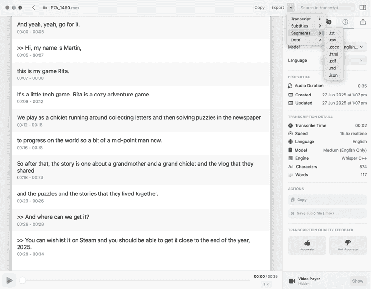

图 3.1 – MacWhisper 对最近一次采访的转录，导出为 CSV 格式的片段

+   **Adobe Premiere Pro**：允许你为每个源剪辑启用自动转录，实现完全基于文本的编辑工作流程

+   **Final Cut Pro**：提供任何时间线的自动转录，可通过时间线索引进行搜索

+   **Da****V****inci Resolve**：提供源剪辑的自动转录，AI IntelliScript 能够根据提供的脚本创建自动粗剪

+   **Jumper**：为所有主要的视频编辑应用程序提供源剪辑的自动转录，以便能够快速通过源剪辑进行对话搜索

许多其他应用程序也提供转录服务，包括 macOS 和主要的跨模态 LLM 提供商，因此我不打算过多关注具体涉及的工具。然而，最适合这项工作的工具将取决于你计划如何使用这些转录。

## 混合文本编辑工作流程

尽管基于 AI 的转录的一些用途可能相对平凡，但它们仍然可以在工作流程中产生彻底的变革，这是视频编辑应用程序中的基于文本的编辑无法实现的。就在几年前，纪录片的工作流程涉及全面的现场笔记、记录、交叉引用和剪辑回放以找到正确的时刻，但如今，如果编辑过程中所需的信息可以简单地口头表达，这可以变得非常容易。

例如，在一周的视频拍摄中，我带着一个由三人组成的团队（尽管我唯一是视频专业人士）前往澳大利亚四个不同的地点采访了 27 人。在旅途中，我能够使用 MacWhisper 生成所有视频的转录，并以电子表格格式提供给团队。他们能够迅速使用颜色突出显示每个特定答案的最佳单词，然后我能够使用时间码作为参考，在标记每个剪辑的相应部分时使用。

由于每次拍摄都清晰地留在我们的脑海中，我们能够记住特定的人和他们的表达风格，这为我们的选择提供了背景。我们还采用了特定的技术来支持基于转录的工作流程：

+   在每个视频开始时，请要求受访者拼读他们的名字。这避免了任何与说话人识别和拼写相关的问题。

+   如果你计划向多个受访者提出相同的问题（这在纪录片中很常见），那么请为每个独特的问题编号，并在提问时大声说出编号。这使得在转录中找到特定问题的答案变得非常容易，并且如果需要，采访者可以稍微改写每个问题。

+   任何对编辑重要的笔记，例如“那是一个很好的版本！”，应该大声说出，并且足够靠近麦克风以便被录制。

+   从 MacWhisper 导出 Segment 为`.csv`格式，将单独的行分隔成电子表格中的时间戳行。由于转录通常包含逗号，这种格式使用制表符而不是逗号来分隔列。如果你在苹果的**Numbers**应用程序中打开它，它将自动格式化，但如果你更喜欢**Excel**，请使用**数据**选项卡中的**文本分列**命令来正确格式化它。

+   在任何**非线性编辑**（NLE）应用程序中，你只需一个时间码就可以在剪辑中找到带时间戳的时刻，所以请确保创建从`0:00`开始的剪辑，以确保你合作者给出的参考与你剪辑的匹配。

如果内容决策是由无法直接访问视频剪辑的人做出的，那么这种混合工作流程是理想的，并且它可以在任何视频编辑应用程序中工作。阅读或搜索转录比在视频剪辑的海洋中寻找答案要快得多，但请务必通知你的合作者以下事项：

+   转录通常会省略“嗯”、“啊”和停顿，因此仅从转录中判断某个剪辑的好坏并不总是可能的。

+   通常没有记录哪个版本可能是最好的，尽管这可以在现场大声说出。

+   情感无法传达，一句完美的话语可能不如带有情感的、不完美的台词有影响力。

+   视频不像文本那样容易编辑，所以在要求编辑时请记住这一点。

虽然这些技巧基于非脚本制作，但在大量脚本化工作流程中，人工智能仍然有其位置。Avid Media Composer 提供了**ScriptSync**（[`www.avid.com/products/media-composer-scriptsync-option`](https://www.avid.com/products/media-composer-scriptsync-option)）选项，它使用基于人工智能的转录将口语对话与提供的脚本关联起来。而不是搜索你希望某人说的单词，这个工具帮助编辑将脚本与实际场景的剪辑联系起来。

混合工作流程可能非常有用，但如果你是拥有自主决定视频所有决策权的视频编辑，那么完全基于文本的编辑工作流程将对你非常有帮助。前面的转录技巧仍然有用，你可以使用这些工作流程来帮助合作者提供编辑决策，但完全基于文本的编辑是另一种不同的生物。

## 完全基于文本的编辑工作流程：Premiere Pro

在**Premiere Pro**中，请确保你已经启用了所有剪辑的自动转录（如果你愿意，你也可以手动转录剪辑）：

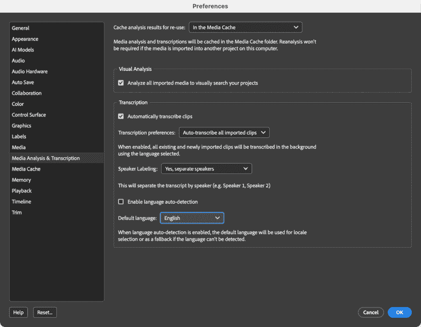

图 3.2 – 在“首选项”中激活自动转录

在导入你的剪辑后，选择包含音频对话的剪辑，然后从右上角的工作区菜单中激活**基于文本的编辑**工作区。

**文本**面板应该变为活动状态，并且它将在顶部包含三个标签来指导你完成这个过程。左边的**转录**标签应该已经显示所选剪辑的转录文本。可能会有错误，就像这里显示的剪辑中的错误一样：

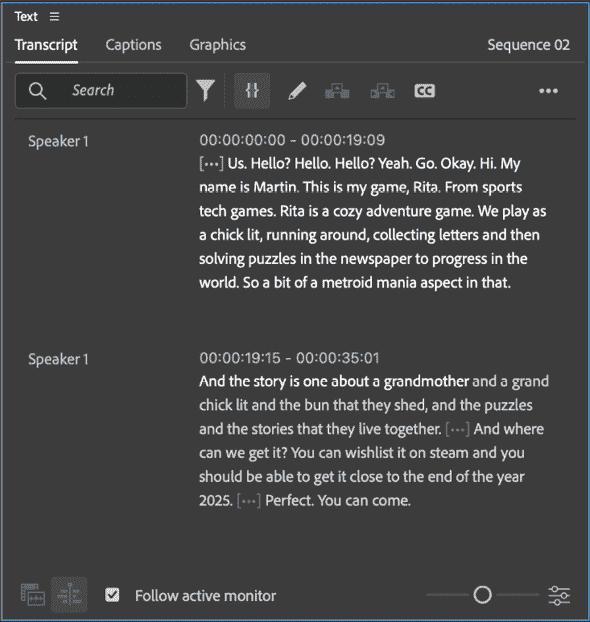

图 3.3 – 原始转录文本，很好但有一些错误

如果你想要纠正这些错误，你可以像在任何文字处理器中一样编辑文本，如果你计划稍后从转录中创建字幕，这是一个好主意。如果你将以其他方式生成最终字幕，这就不那么重要了。

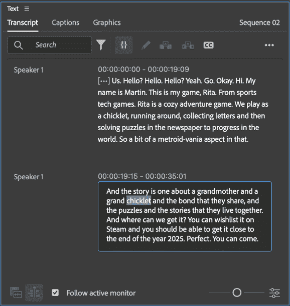

图 3.4 – 使用转录文本上方的铅笔“编辑”按钮来纠正任何错误

当你在转录中选择单词时，它们将在右侧的剪辑或序列时间轴中选中。相反，当你播放剪辑或序列时，遇到的单词将突出显示。

要使用转录文本进行编辑，你现在有两个选项。首先，如果你已经将剪辑添加到序列中，你可以在序列中选择该剪辑，然后选择你不想保留在转录文本中的单词，然后按*;*（分号）键**提升**（删除并留下空隙）或按*’*（撇号）键**提取**（涟漪删除，移除空隙）该剪辑的这一部分。

另一种选择是在项目面板中双击原始剪辑，选择您*确实*想要保留的单词，然后**插入**（逗号）或**覆盖**（句号）它们到序列中。

建立序列后，如果您愿意，可以继续使用**文本**面板。暂停由**[…**]表示，并且如果您愿意，可以波纹删除它们。使用文本进行编辑可以是一种强大的工作方式，因为它可以让您的客户告诉您哪些单词需要删除，而不是发送您时间码，这使得修订变得更容易。您还可以搜索剪辑中说的单词，但无法一次性搜索所有剪辑。如果您需要此功能，请将所有剪辑添加到单个时间轴中，并在那里进行搜索。

最后，您可以将组成您时间轴的剪辑部分的转录本直接转换为字幕，方法是切换到**字幕**选项卡并单击**从转录本创建字幕**按钮。字幕将随后添加到时间轴顶部的新的**字幕**轨道中。从**工作区**菜单切换到**字幕**和**图形**工作区。

如果您希望将字幕烧录到视频中（仅在交付平台没有提供**关闭字幕**时推荐），请选择所有字幕，并使用右侧的**属性**面板更改它们的外观。然而，如果提供了关闭字幕，最好使用它们而不是将标题烧录进去，因为许多人更喜欢不看到字幕，而其他人需要自己控制字幕的外观。

仅对字幕关闭，请选择**时间轴**面板，然后选择**文件** > **导出** **字幕**并导出 SRT 文件，与完成的视频文件一起上传。最后，单击字幕轨道旁边的眼睛图标，它们将不再包含在最终输出视频中。

## 基于全文的编辑工作流程：DaVinci Resolve

您将在**DaVinci Resolve**的相同右键菜单中找到所有 AI 相关功能。在**媒体池**中，选择一个或多个剪辑，然后选择**AI 工具** > **音频转录** > **转录**。

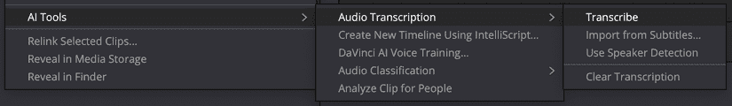

图 3.5 – AI 转录在 Resolve 中效果良好，但您需要手动启动它

完成后，将出现一个新窗口，其中包含转录本——尽管您的体验可能会有所不同，但我发现 Resolve 比 Premiere Pro 更准确：

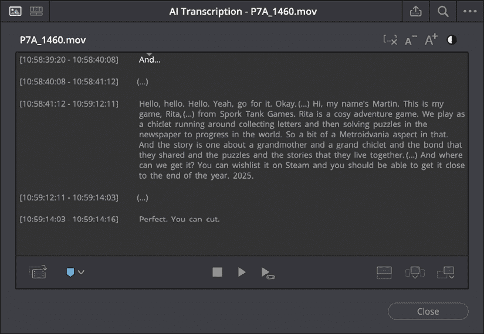

图 3.6 – 这份未经编辑的转录本包含“Spork Tank Games”等名称，这些名称已被正确拼写和首字母大写

要使用文本面板将此剪辑的一部分添加到时间轴中，请选择您想要包含的文本，然后使用窗口右下角的按钮：**置于顶部**、**插入**或**追加**。

当你将片段添加到时间轴后，你可以通过切换窗口左上角的切换按钮继续使用文本进行编辑。第二个图标显示了你已添加到时间轴中片段的转录段，你可以使用它来在执行**波纹删除**等命令之前构建选择。

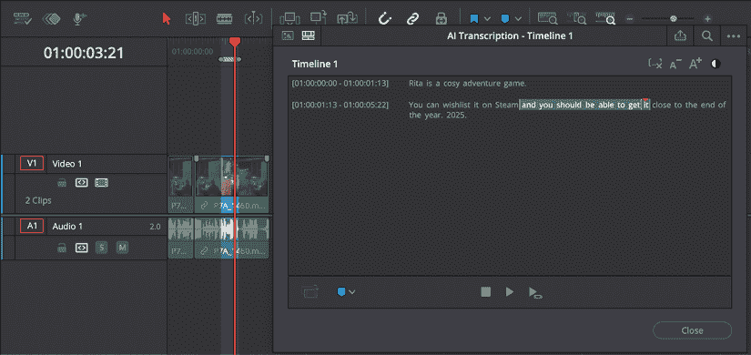

图 3.7 – 切换左上角的切换按钮后，使用此窗口选择特定时刻

如果你发现你的时间轴中并非所有片段都有转录数据，你可以使用右上角的省略号（**…**）菜单来添加它，也可以用来导出字幕：

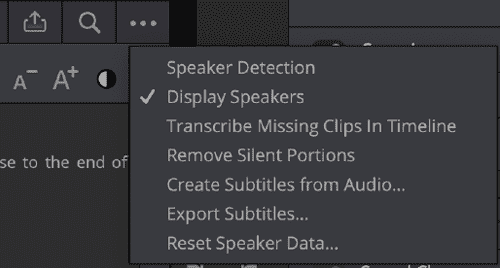

图 3.8 – 可以在这里转录缺失的片段

## 在线基于文本的编辑工作流程

虽然我建议使用基于桌面的系统进行视频编辑，以避免上传源片段的麻烦，但在线系统对非编辑协作者来说更容易使用。例如，**Riverside** ([`riverside.fm`](http://riverside.fm))系统允许上传片段，自动转录，然后通过删除不需要的文本部分进行编辑。它确实可以工作，但效率远低于在本地 NLE 上执行相同的步骤。

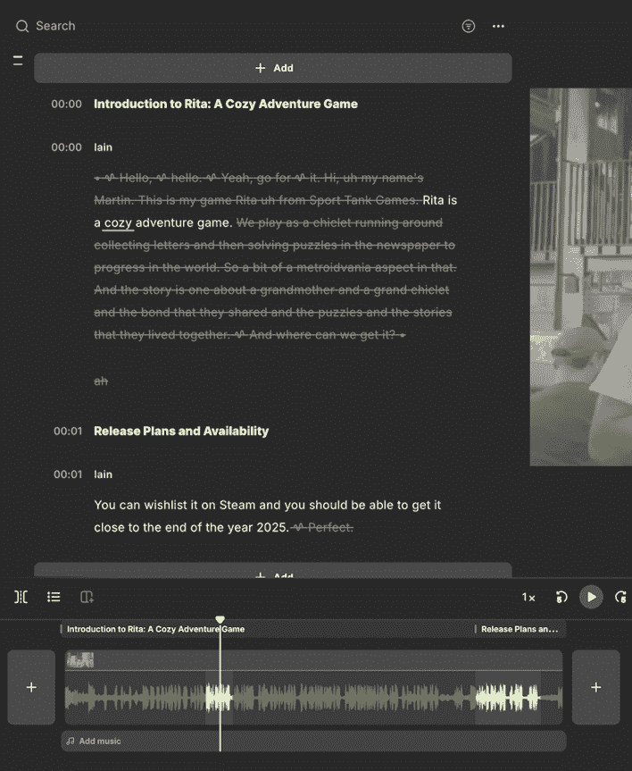

图 3.9 – Riverside 工作效果足够好，转录也很清晰

对于特定片段的转录和编辑，而不是许多长片段，我认为在线平台具有优势。然而，这些系统的真正力量在于自动编辑工作流程，我们将在稍后回到这一点。

## 基于自动化的音频编辑工作流程

如果你的重点是**自动化**的基于文本的编辑工作流程，我将在本书的*第十一章*中稍后讨论这些内容。不同用途的 AI 工具之间往往存在一些交叉，但鉴于它们经常为你完成一些编辑工作，这大多属于**自动化**范畴。同样，如果你将字幕翻译成另一种语言或生成另一种语言的音频，这明确属于**生成 AI**，我们将在本书下一部分讨论这些工作流程。

尽管如此，转录并不是**U****tility AI**在音频中能施展的唯一技巧…

# 对话清理

现在大多数主要的 NLE 都包括机器学习驱动的噪声消除功能来增强声音。虽然这个功能以某种形式存在了数十年，但在 AI 介入之前，效果并不好——结果听起来就像水下机器人。

今天，在 FCP 和达芬奇 Resolve 中，你会找到一个名为**语音隔离**的功能，它非常出色地移除了所有非语音内容，几乎没有任何明显的瑕疵。虽然这两个语音隔离功能并不完全相同，但它们非常相似，并且都能将录制的对话从“尚可”提升到“出色”。

这两个应用还包含自动电平功能：FCP 中的**响度**，以及 Resolve 中的**AI 对话平衡**。这些功能试图使较安静的声音更响亮，使较响亮的声音更安静，以产生更平衡的结果，但它们可能是简单的工具。然而，如果你对这些结果感到满意，Resolve 允许你通过**时间轴** > **AI 工具** > **音频助手**进一步操作，这将一次性为所有轨道完成全面平衡和混音。

虽然这些功能可以做得非常好，但它们并不能完全替代人类音频专业人士，后者可能会做出更细微的判断。全自动解决方案总是有局限性，但节省的时间是我们大多数人愿意做出的权衡。如果你有时间和预算，请雇佣专业人士。

Premiere Pro 在**基本声音**中有一个更极端的对话增强功能，用于标记为**对话**的剪辑。在**增强语音**部分查找，然后只需点击**增强**按钮即可处理任何选定的剪辑。这个功能确实提高了对话的质量，但它并不是简单地移除录音中不像是语音的部分。相反，它更像是一个生成功能，试图让录音听起来像是来自专业的录音室。为了实现这一点，它应用了大量的处理，这既有优点也有缺点。

如果源录音有严重问题——比如说，领夹麦克风在合成衬衫上摩擦——**增强**功能比语音隔离更有可能产生良好的结果。但也很可能非常微弱的语音会被转换成很大的噪音词，因为这种模型容易产生幻觉。

虽然我的大多数录音在仅使用语音隔离的情况下听起来都很纯净，但**增强**是一个在所有其他方法都失败时可以拯救局面的强大秘密武器。如果**增强**无法帮助，你可能需要考虑一个专门的插件。iZotope 的 RX 插件拥有许多有用的功能，RX11 包括一个专门的**AI 修复助手**，它承诺可以一步解决所有常见问题。

对于更实际的方法，Logic Pro 是一个作为一次性购买的全数字音频工作站，Adobe Audition 是一个作为 Creative Cloud 一部分的综合音频处理应用。无论是否有 AI 的帮助，这些专注于音频的工具都有工具来挽救糟糕的录音。

将语音录音整理好之后，就到了审视音乐的时候了。有时你可能需要改变它的长度……

# 音频混音

Premiere Pro 和 DaVinci Resolve 都提供工具来巧妙地改变音乐片段的持续时间。而不是拉伸音乐或改变其节奏，将识别音乐中的重复或类似部分，然后这些部分将被重复以使轨道更长或剪掉以使轨道更短。无论您需要音乐的长度如何，这些算法都可能做得非常好，并且肯定比人工快得多。

在 Premiere Pro 中，选择**音频混音**工具；它是工具栏中第三堆中的最后一个工具。使用该工具时，只需将音乐轨道的右边缘向左拖动以缩短它，或向右拖动以延长它。如果最终剪辑比您拖动到的确切位置长几秒钟或短几秒钟，请不要惊慌。歌曲结构比精确的持续时间更重要。

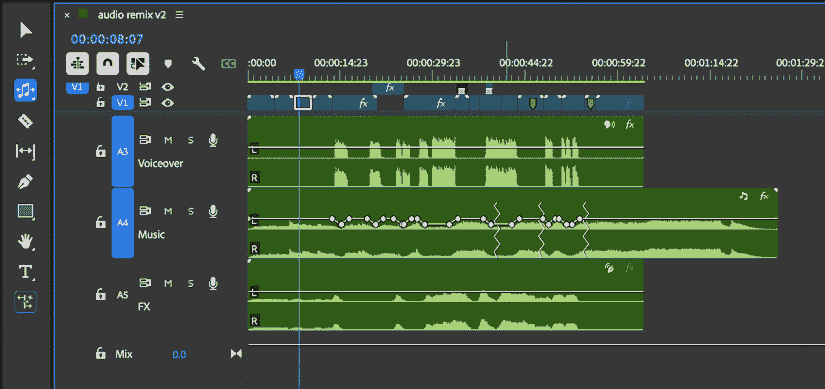

图 3.10 – 在 Premiere Pro 中进行音频混音，显示已扩展的音乐轨道中的重复部分

现在剪辑上的锯齿形线条将指示轨道的部分已被重复或剪掉。播放这些部分以确保您对结果满意。令人高兴的是，此功能在 Premiere Pro 中不会消耗任何 AI 生成性积分。

在 DaVinci Resolve 中，在**编辑**页面，在检查器的**音频**选项卡中选择**AI 音乐编辑器**。（注意，此功能也适用于**剪辑**和**Fairlight**页面。）如果您知道您想要的持续时间，您可以编辑时间码并单击**调整**按钮。**1**、**2**、**3**和**4**按钮为您提供不同的混音选项，您可以在它们之间切换以选择您喜欢的选项。或者，如果您更喜欢交互式工作，请单击**实时修剪**复选框，然后拖动音频轨道的右边缘到所需长度。此功能在 Resolve 的免费和付费版本中都有，所以如果您使用的是没有类似功能的 FCP 或其他 NLE，Resolve 在这里是您的朋友。

Resolve 还提供其他基于 AI 的音频工具，可在**Fairlight**页面找到。右键单击一个剪辑，选择**AI 工具**，您将找到**对话匹配器**和**声音转换器**。**声音转换器**更偏向于生成性方面，所以我们将在本书的后面部分介绍它，但**对话匹配器**更容易被归类为实用工具。它的目的是使一个剪辑听起来像另一个剪辑，尽管它并不总是能够完全达到这一点。

首先选择一个源剪辑，然后右键单击并选择**AI 工具** > **对话匹配器** > **捕获对话配置文件**。接下来，选择一个你希望听起来更像源剪辑的剪辑，然后右键单击并选择**AI 工具** > **对话匹配器** > **应用对话配置文件**。如果这是你需要的功能，FCP 有一个类似的工具，称为**匹配音频**，位于**查看器**下的**增强**菜单（一个魔法棒）中。选择目标剪辑，选择**匹配音频**，然后点击你想要复制的源剪辑，并点击**应用**。

在对话清理和匹配完成后，让我们看看如何从完成后的轨道中移除人声（或任何其他组件）。

# 选择音乐分支

对于更复杂的音乐改编，你可能希望提取音乐轨道的各个部分，以便自己进行混音。有时你可能只需要将人声与其他部分分开；有时你可能想要去除节奏部分。根据你的需求，你可能选择在 Davinci Resolve、Logic Pro 或其他工具中完成这项操作。

在 Resolve 中，最简单的解决方案是在**Fairlight**标签下选择一个音频轨道，然后在检查器中打开**AI 音乐混音器**。你可以使用这里的简单滑块来静音或控制**人声**、**鼓点**、**贝斯**、**吉他**和其他轨道部分的音量，或者如果你更喜欢，可以通过一个专门的浮动窗口访问相同的选项：

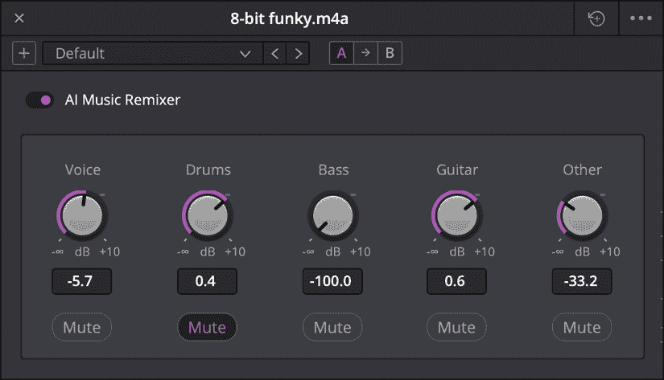

图 3.11 – Resolve 的 AI 音乐混音器操作快捷，但结果并不完美

通常，这个工具确实允许在混音中具有一定的灵活性，但分离并不完美。为了获得更好的效果，前往 Logic Pro，导入你的轨道，然后选择**功能** > **分支分割器**。在下一页上，保留所有选项的勾选，然后等待一段时间以获取结果。在我的测试中，Logic Pro 的输出比 Resolve 的实时效果要干净得多。同时，将每个分支作为单独的单位提供，以便更容易地进行混音，这也是非常方便的。

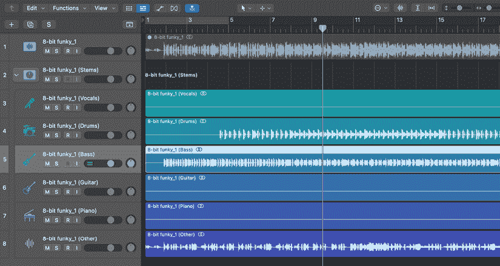

图 3.12 – Logic Pro 的分支分割器在将组件分离到单独的轨道方面做得很好

尽管今天这些成熟的桌面应用程序不是唯一的选择。如果你没有 Logic Pro，上网搜索，你会找到许多不同的选项，通常使用相同的*Demucs*算法。终极人声移除 5([`ultimatevocalremover.com`](https://ultimatevocalremover.com))是免费的，以下是一些值得尝试的替代方案：Moises([`moises.ai`](https://moises.ai))、LANDR Stems([`landr.com`](https://landr.com))、lalal.ai([`lalal.ai`](https://lalal.ai))和 AudioPod.AI([`audiopod.ai`](https://audiopod.ai))。其中一些服务还提供其他音频处理工具（如降噪或扬声器分离），所以如果它们对你表现良好，可以考虑将它们整合到你的工作流程中。

茎分割器可以用作法医工具来判断音乐轨道的真实性。因为生成式 AI 音乐是在压缩音乐轨道上训练的，所以 AI 生成的音乐通常包含可听见的瑕疵，并且不能干净地分解成其组成部分。如果 Logic Pro 的茎分割器无法得到好的结果，你试图分割的轨道可能已经被高度压缩，或者可能是由生成式 AI 制作的。

无论你是否将音乐拆分，AI 也可以帮助你找到它的节奏。

# 识别音乐节拍

让我们以一个简单的事情结束。虽然通常不建议总是将视频编辑的时间精确匹配到音乐节拍，但这可以为关键时刻带来有用的强调。手动添加标记并不困难，但你可以利用 AI 自动识别节拍。在 Resolve 中，在**剪辑**或**编辑**页面上右键单击音频轨道，然后选择**显示音乐节拍**。

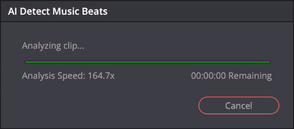

图 3.13 – 显示音乐节拍需要几秒钟来初始化，然后处理非常快

在剪辑上的线条现在将显示可能影响你放置编辑的位置。

对于 FCP 中的相同技巧，请查看 Ulti.Media 的 BeatMark 2([`ulti.media/beatmark-2/`](https://ulti.media/beatmark-2/))。你可以在这个第三方应用程序中处理剪辑，然后导出带有标记的 FCPXML（回传到 FCP）。

# 摘要

工具 AI 无疑是很有用的，尽管它并不完美，但比没有要好得多。较老的音频算法可以完成这项工作，但一点机器学习已经增加了很多。当然，如果你是专家，你将能够发现他们工作中的缺陷，但如果你是*专家*，它们只是更好的起点。一如既往，如果结果足够好，你可以单独使用它们，但如果你还想在某个任务上做得更好，调整一些设置，更仔细地听，你将能够自己在这个任务上做得更好。

在下一章中，我们将探讨工具 AI 如何帮助你进行图像和视频制作任务。

# 其他资源

+   所以，故事开始了...这是一个真正的乐队还是人工智能？：[`youtu.be/3Nlb-m_vKYM?si=jDq1gYu15dlYsbks`](https://youtu.be/3Nlb-m_vKYM?si=jDq1gYu15dlYsbks)

|

## 获取本书的 PDF 版本和独家额外内容

扫描二维码（或访问[packtpub.com/unlock](http://packtpub.com/unlock)）。通过书名搜索本书，确认版本，然后按照页面上的步骤操作。 |  |

| **注意**：请妥善保管您的发票。直接从 Packt 购买的产品不需要发票。* |
| --- |
