# 4

# 带图像和视频的实用 AI

图像和视频驱动着大部分创意空间，因此你会发现许多机会让 AI 帮助组织、分类和选择图像和视频的各个部分。这些实用 AI 任务有时会涉及到生成 AI 领域，但如果它们在本章中有所涉及，这些功能将创建基于现有工作的新工作，而不是创造全新的东西。

*自动化 AI*，本书稍后将有详细介绍，它更多的是关于替换你现有的工作流程，而不是增强它。在这个语境下，*实用 AI*更多的是关于帮助你寻找和选择，而不是帮助你创造或为你完成工作。

如果你自己拍摄照片或录制视频，你将知道有时找到特定的镜头或剪辑有多困难。个人和家庭照片最终会变成一个庞大且难以管理的堆叠，就像鞋盒中的打印照片一样，如果不加以整理，它们很少再被看到。

相机确实会创建元数据（如时间、日期和位置），这有助于以后定位照片，但它们无法找到你表亲穿着那件衬衫的照片，或羊在栅栏上搔痒的视频。对于那种“那个有东西的镜头”，以及客户要求“那个镜头”的所有时候，AI 是我们最好的解决方案。

一旦你找到了需要的镜头，AI 可以提供更多帮助，选择镜头中的人物，并让你分别进行色彩校正。你可以自动将宽屏视频转换为竖屏视频，并让 AI 为你重新构图所有镜头。当客户发送带时间戳的反馈时，你甚至可以要求 AI 标注你的时间轴，使你的编辑过程更加顺畅。

最后，稍微进入生成空间，你可以使用 AI 帮助将照片和视频从单视角转换为立体视角——甚至更多。

虽然在其他部分的书中有单独处理图像和视频，但在实用 AI 领域，它们是合并在一起的。有几个工具允许你以相同的方式处理静态和动态图像，将它们分开并不完全合理。

在这里，我们将讨论以下内容：

+   照片和视频的组织和分类

+   选择人物和物体

+   为改变画幅比进行重新构图

+   立体转换

+   管理带时间戳的编辑请求

+   删除跳帧

+   重新调整视频时间

+   提升图像和视频的分辨率

# 照片和视频的组织和分类

如果你不记得何时或在哪里拍摄的照片或视频，搜索起来可能会很耗时，而人工智能可以提供强大的方法来简化复杂搜索。请注意，一些工具不仅限于搜索，还能为你完成一些工作：自动色彩校正、自动记录，或者直接删除图片。这些工具（包括**Eddie AI**、**Aftershoot**等）不仅关注组织，还专注于自动化你的工作流程，因此它们将在本书的*第四部分*，*自动化 AI*中介绍。

大多数摄影师使用**数字资产管理器**（**DAM**）来组织他们的照片，其中一些工具还可以管理视频。相反，虽然大多数用户可能会使用视频编辑程序来仅管理视频，但这些应用程序也可以用于管理静态图像。你可能发现，在某些程序中，AI 工具比其他程序更好，因此在考虑 AI 搜索时，请保持开放的心态。

我们将从大多数苹果设备用户都会遇到的一个简单解决方案开始。

## [苹果照片应用](https://example.org)

**苹果照片应用**是照片和视频管理的基本解决方案，尽管它可能无法满足大多数创意专业人士的需求，但它确实提供了许多被忽视的全面人工智能工具。在 iPhone 上拍摄的照片将被自动标记，可以通过搜索其内容来找到，这一切都归功于人工智能，但这个功能并不依赖于空间有限且仅限在线的 iCloud 照片库。

如果你手头有一部 iPhone，请转到**照片**应用并点击放大镜进行搜索。与其输入记录在元数据中的内容，如日期或位置，不如搜索内容——`啤酒`、`跳舞`或`绿色`。你的手机将找到所有包含该主题、活动、颜色或甚至在该图片或视频中某处写有该单词的照片。是的，你可以通过搜索标志上的文字来找到标志的照片。

尽管这很令人惊叹且很有用，如果你没有将所有图片加载到照片应用中，你就无法使用这个功能。由于照片应用不是编辑视频的最佳场所，你不太可能在那里存储或访问大多数视频剪辑，你可能更愿意使用其他应用程序，如 Lightroom，来管理客户照片拍摄。尽管如此，仍有许多方法可以访问强大的 AI 搜索功能，我们将从照片应用开始。

虽然这并不明显，但你可以根据需要创建尽可能多的照片库，并可以为每个客户或每个工作使用一个。你还可以将图片和视频加载到照片应用中，而无需复制它们，甚至无需将它们从当前位置移动。

要设置此功能，请按照以下步骤操作：

1.  在启动照片应用时按住*选项*键，通过点击**创建新库**按钮创建一个新的库，并将其存储在您的图片或视频相同的存储设备上。

1.  前往**设置**并取消选中**将项目复制到照片库**。

1.  将您的图像和/或视频从当前位置拖入。（您可以重复这些步骤并选择您原始的 Photos 库稍后返回，您可能还希望重新检查“将项目复制到 Photos 库”复选框。）

从 Final Cut Pro 库、Premiere Pro 或 Resolve 项目或从 Lightroom CC 库中拖入图像是完全没问题的——您只是会用这个进行搜索。不幸的是，AI 分析不是即时的，更糟糕的是，您无法强制它进行。如果您在搜索字段中输入文本，并且下面的弹出窗口显示**索引**，那么您就只能让 Photos 运行，直到这个过程完成。这个缺点可能使 Photos 不适合快速周转的客户工作，但它可能仍然适合长期和个人工作。

如果您能等待，搜索图像或视频的内容将帮助您更容易地找到东西。如果您需要更多，您将需要寻找另一个具有类似功能的 app 或插件——有很多可供选择。

## Excire Foto

几个本地数字资产管理工具中，**Excire**（[`excire.com/en/`](https://excire.com/en/））集成了 AI 功能，允许您通过文本提示进行搜索，例如“女孩冲浪”或“森林中的秋叶”。类似于 Apple Photos 和 Google Photos，如果您用那个人的名字标记了脸部，您就可以找到他们出现在其他照片中的情况。

Excire Foto 是一个独立的 app，但**Excire Search**是一个插件，它为 Adobe Lightroom 添加了提示式搜索。使用基于文本的免费搜索的优势是您更有可能找到照片。在这里，我搜索了一个免费股票照片集合中的“约塞米蒂”：

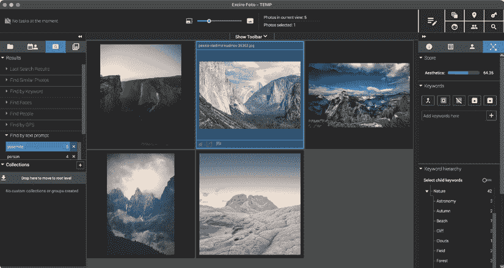

图 4.1 – 这些图像都被判断为类似约塞米蒂的

尽管这些图像的名称中都没有“约塞米蒂”，AI 仍然能够将这些匹配为在约塞米蒂国家公园拍摄或看起来有些像它。Excire 扫描和搜索速度快，尽管某些搜索（如“水”）没有返回所有可能的图像。

## Peakto

独特的是，**Peakto**（[`peakto.com`](http://peakto.com)）不会强迫您改变您组织照片或视频的方式。相反，它会从现有的库中摄取您的资产，包括 Apple Photos、Adobe Lightroom、Capture One 或 Aperture，以及由 Final Cut Pro、Premiere Pro 或 DaVinci Resolve 管理的视频。一旦摄取，AI 处理将分类和分类您的资产，让您能够在整个数字生活中搜索，或者仅在一个单独的库中搜索。这是我使用过的唯一一个可以一次性显示我所有“波浪”照片的工具。

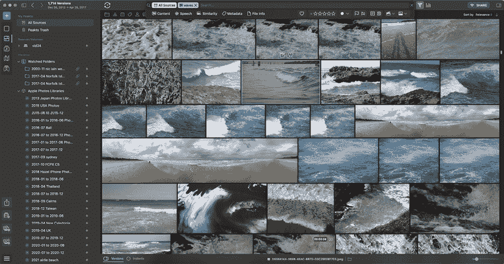

图 4.2 – 从数百 GB 的图像中提取的数百张波浪照片

除了允许根据您自己的请求进行基于内容的搜索外，Peakto 还会根据内容、颜色、亮度、饱和度和对比度对您的图像进行分类和分组，因此如果您需要以绿色为主的镜头，您可以相对快速地找到它。

Peakto 最近增加了更全面的视频支持，将 AI 搜索功能扩展到视频剪辑。您可以找到与现有剪辑相似的剪辑，使用自然语言跨多个库进行搜索，自动添加关键词，并启用对本地设备的团队访问。此外，音频会自动转录，因此您还可以搜索口语对话。

在我自己的测试中，我加载了成千上万的照片和视频，Peakto 的 AI 搜索确实使找到特定项目变得更容易。虽然我的工作只有少数跨越多年，但如果您正在处理长期项目，Peakto 的 AI 搜索可以帮助您在 haystack 中找到针。通过大量不断增长的视频剪辑进行转录搜索，您可以（或非编辑协作者）找到特定口语单词的每个实例，这些实例可能跨越多年的素材和多个独立项目。视频中的内容识别也有效——在这里，我能够找到单个 FCP 库中包含雕像的所有剪辑。

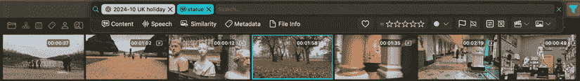

图 4.3 – 这些视频剪辑确实都包含至少一座雕像，现在它们很容易找到

与一些其他应用程序中的转录相比，转录的准确性并不高，但足够有用。在**非线性编辑**（NLE）应用程序中进行转录搜索可能会更慢，但多库搜索是 Peakto 的独特优势。

## ON1 Photo Keyword AI

**ON1 Photo Keyword AI** ([`www.on1.com/products/photo-keyword-ai`](https://www.on1.com/products/photo-keyword-ai)) 可作为独立应用程序提供，或作为 ON1 Photo RAW 的一部分。使用 AI 检测基于内容的关键词后，它会使用行业认可的 XMP 元数据嵌入这些关键词，并且与流行的照片管理解决方案（如 Lightroom CC）兼容。

虽然这个解决方案没有 Peakto 提供的美学判断，但其结果可以在其他应用程序中看到。当导入 Lightroom CC 和其他 DAM 时，可以访问此应用程序中自动生成的关键词，因此您不一定需要更改工作流程以集成 AI。

然而，这个应用程序的一个缺点是生成的关键词可能不足以帮助您找到您正在寻找的图像。当 AI 生成特定的关键词列表时，这可能成为一个问题；如果您想搜索`优胜美地国家公园`，但 AI 只生成`山脉`或`风景`，那么您可能就运气不佳了。您需要查看生成的关键词列表，而不是输入任何您想要的短语。

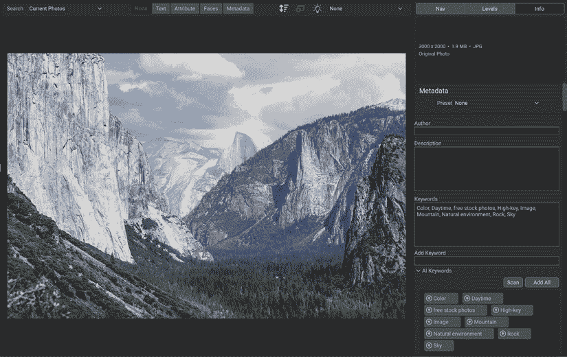

图 4.4 – ON1 Photo Keyword 生成了许多关键词，但没有“Yosemite”

此应用程序提供免费试用，因此您可以用自己的媒体尝试它，看看它是否能帮助您的工作流程。然而，一些基于 AI 的引擎采用另一种方法，这不是直接基于关键词的。

## Jumper

一个与视频编辑应用程序（包括 Premiere Pro 和 Final Cut Pro，还有更多）集成的插件**Jumper** ([`getjumper.io/`](https://getjumper.io/))可以对它展示的任何资产进行 AI 分析，然后一次性使它们全部可搜索。由于 Jumper 主要是为视频设计的，它不仅会找到剪辑，还会找到剪辑中包含您搜索项的*特定范围*。虽然这个工具也可以处理静态图像，但您可能希望将它们加载到您的 NLE 中，以便 Jumper 更容易看到它们。

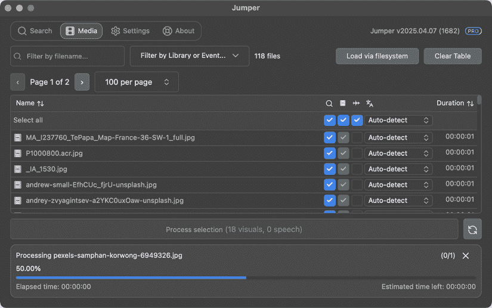

图 4.5 – Jumper 确实需要被告知要索引哪些媒体文件，以及您是想索引视频、音频还是两者都要

与生成与图像一起保持的有限关键词集不同，Jumper 使用模糊搜索。在搜索`Yosemite`后，它甚至可以在该图像的元数据中找不到该信息的情况下找到之前显示的正确山脉图像。

这种模糊方法的缺点是 Jumper 总是能找到“*某样东西*”。如果您在一组肯定不包含大象的图像中搜索`elephant`，您仍然会看到一些东西。尽管如此，鉴于每个人搜索的方式都会略有不同，Jumper 的模糊方法更有可能快速产生有用的结果。虽然对于带音频的视频，初始处理可能需要一点时间，但搜索几乎是瞬间的。

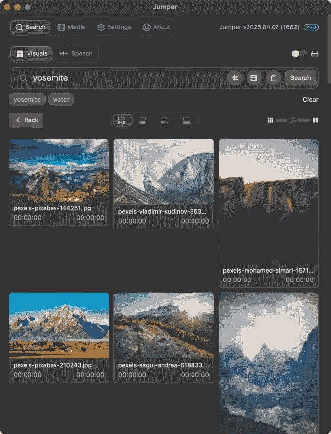

图 4.6 – 是的，Jumper 可以使用其模糊搜索找到“Yosemite”图像

由于视频及其音频都被索引，您可以通过视觉或对话中说的单词进行搜索。虽然您无法直接访问转录本，但您可以搜索一个单词或短语来快速定位它，然后将该特定短语添加到时间轴上。

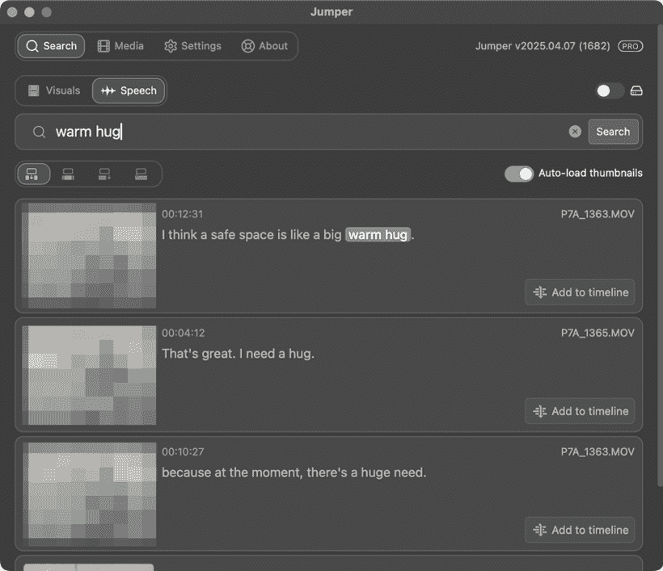

图 4.7 – 此对话全部正确转录，并找到了正确的短语，以及类似的短语（缩略图已模糊以保护隐私）

## Strada

Strada 的早期演示（[`strada.tech`](http://strada.tech)）重点强调了标记和分析，并且能够为识别到的片段中的特定部分分配关键词。然后，这些选定的范围可以发送回你选择的视频编辑应用程序，尽管 FCP 是基于范围关键词的最佳工具。转录功能支持，因此你也可以通过口语对话进行搜索，并且内置了翻译功能——非常全面。

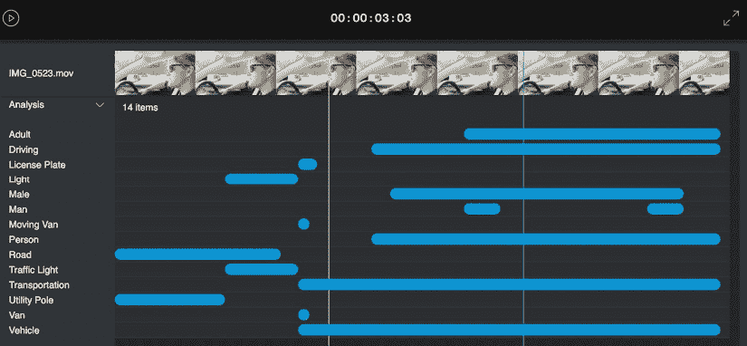

图 4.8 – 开发初期的 Strada，展示了其检测特定时间对象的能力

然而，这个工具仍在开发中，并且已经从仅云服务转向以本地优先，尽管分析功能预计将回归。如果你需要为视频提供 AI 关键词支持，请检查 Strada 的当前进度。

## Axle AI

**Axle AI** ([`axle.ai`](https://axle.ai)) 是一个集成了基于 AI 的标记和搜索功能（称为 **Axle AI 标签**）的 AI 驱动的视频自动化平台。虽然我们将在 *第十一章* 中回到这个平台，但标记本身可能很有用。

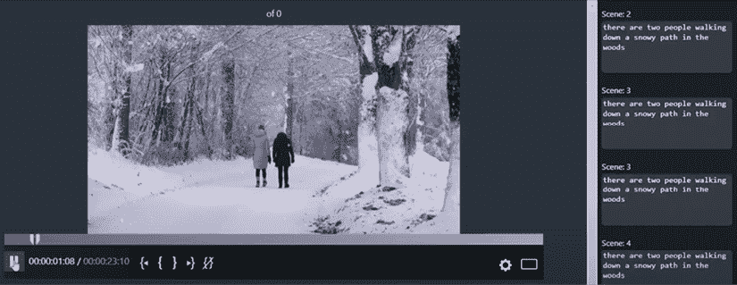

图 4.9 – Axle AI 标签执行分析以确定剪辑中每个部分的内容

Axle 与 Jumper 或 Strada 采用略有不同的方法。Jumper 不公开其搜索索引，而 Strada 只查找单个单词，Axle 使用 AI 描述其在镜头中看到的内容，然后允许你搜索该文本。可以识别人物和物体，并且这种分类可以在本地、在本地场所进行，而不是在云端。虽然它比 Jumper 更贵（每月 200 美元），但对于工作组来说可能仍然值得考虑。

虽然这些选项更加全面，但也有一些其他应用程序也值得考虑。

### Adobe Premiere Pro 媒体智能

在 Adobe Premiere Pro ([`www.adobe.com/products/premiere.html`](https://www.adobe.com/products/premiere.html)) 2025 测试版中引入，此功能会自动将你导入项目中的媒体进行分类，并允许你使用自然语言搜索内容。虽然 Premiere Pro 当然最适合视频资产，但如果你想使用此功能搜索照片，你也可以导入并搜索它们。

然而，在迄今为止的分析中，它并不像 Peakto、Excire 或 Jumper 那样强大；对于“优胜美地”的搜索结果不足，尽管在其他应用程序中添加的关键词在这里成功导入。如果你在搜索对话，上一章中我们介绍的全文本编辑工作流程非常出色，但基于内容的搜索有更好的选择。如果你需要该功能，Jumper 可用于 Premiere Pro。

### Google Photos

许多苹果照片提供的“智能”功能在**Google Photos**([`photos.google.com/`](https://photos.google.com/))中也有。通过内容搜索效果良好，人脸识别功能可用，并且有移动应用可以快速上传这些设备中的照片。然而，如果你是一名专业摄影师或视频制作人员，我建议你三思而后行，考虑是否仅使用在线解决方案。

即使你通常能够连接到互联网，但有时你的连接会变慢或不存在，你的工作流程将会崩溃。原始 RAW 照片和视频剪辑对于许多创意人士来说太大，无法批量上传，因此仅在线的解决方案并不适用于所有人——但这可能适合你基于个人手机的照片。

### PhotoPrism

这个开源解决方案([`www.photoprism.app/`](https://www.photoprism.app/))在容器中运行，执行 AI 分类，并允许你使用自然语言进行搜索。虽然 AI 搜索似乎没有这里其他一些解决方案那么灵活或强大，但这个产品的免费和本地特性意味着它可能仍然适用于某些应用。

### 纪念碑

**Monument** ([`www.getmonument.com/`](https://www.getmonument.com/))提供云（Monument Cloud）和自托管（Monument 2）版本，是 iCloud 或 Google Photos 的替代品，或者实际上是完全不将图像存储在云中的替代品。无论是云还是本地形式，它都充当一个平台和设备无关的照片存储系统，执行 AI 分类以简化搜索。虽然我可以看到这种解决方案在家庭环境中的实用性，但我并不确定许多专业人士是否愿意将他们的高分辨率原始文件存储在第三方硬件设备上，或者将它们全部上传到云端。

# 选择人物和物体

选择是修图和照片改进任务的核心，基于 AI 的区域选择已经进步到可以重新发明工作流程的程度。就在几年前，摄影师可能需要付出相当大的努力来调整照亮人物及其背景的光线，以获得正确的主体分离程度。

现代分割算法现在足够好，不仅可以快速准确地选择人物，还可以分离人物的身体部分，甚至可以分离眼睛的各个部分。这使得摄影师可以独立调整人物和背景的光线，而无需进行广泛的手动选择，从而让他们工作得更快。

这些功能已经被添加到各种平台上的以照片为中心的应用中，并且精细程度各异。许多苹果制造的工具包括自动背景移除，尽管它易于访问，但对于大多数专业任务来说控制不足。

由机器学习驱动的主题选择出现在 Pixelmator Pro 等应用程序中，尽管这个功能在肖像摄影中很有帮助，但其他工具提供了更广泛的选择选项。在撰写本文时，最完整的蒙版工具集可以在 Adobe **Lightroom Classic** 中找到，所以让我们从这里开始。

## Lightroom Classic 和 Photoshop 蒙版

在 **Lightroom Classic** 的最新版本中（[`www.adobe.com/products/photoshop-lightroom.html`](https://www.adobe.com/products/photoshop-lightroom.html)），蒙版功能已经扩展到自动选择图像中的人物——一个、多个或所有的人物。在** Develop** 模式下，点击包含人物的图像下方的**蒙版**模式图标。在**蒙版**部分的底部，你的照片中的人物将被识别，然后你可以点击一个人的脸部来选择他们，或者选择他们的一部分。

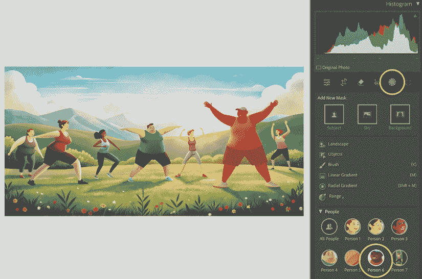

图 4.10 – 在这个示例中，可以单独选择所有七个人，或者一次性选择他们所有人

当然，Lightroom 中存储的大多数图像都是真实人物的摄影作品，图像校正任务可能非常具体——比如让眼睛变亮，改变上衣的颜色。选择这些项目曾经只是 Photoshop 的任务，但现在在 Lightroom 中也可以做到了。

在每个识别出的人物中，你现在可以选择**整个**人物，或者更深入地选择他们的一部分：不同的皮肤区域、眉毛、眼睛的某些部分、嘴唇、牙齿、头发或他们的衣服。

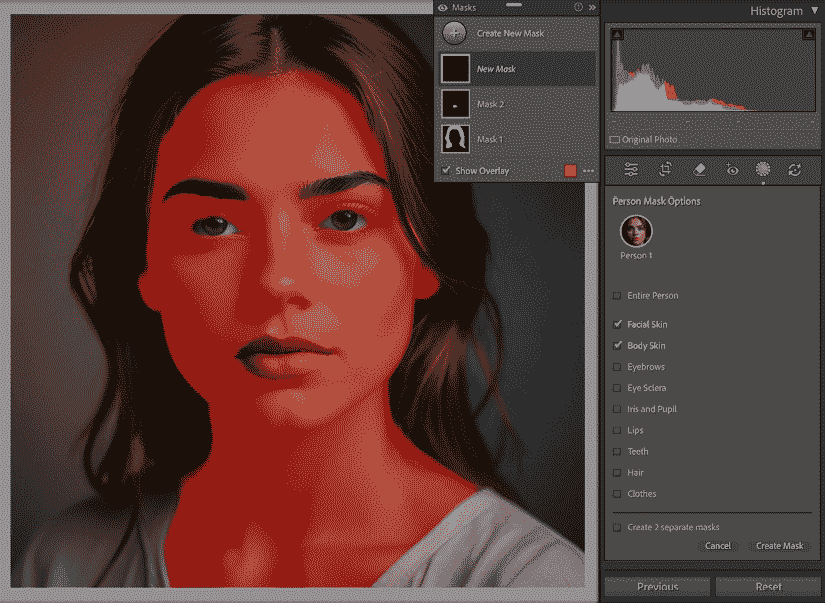

图 4.11 – 这样的选择允许你在不使用 Photoshop 的情况下精细调整一个人的外观

这些由 AI 驱动的选择还可以识别风景的各个部分，自动分割天空、山脉、植被、水域等。

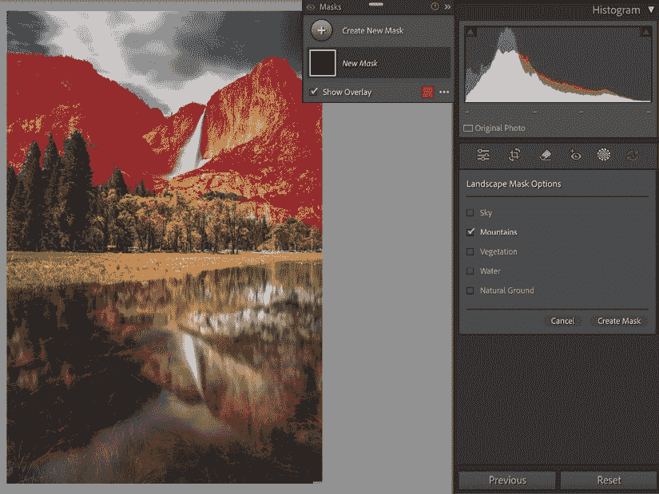

图 4.12 – 如果你选择风景而不是人物，那么你可以选择你希望选择的风景的哪一部分

选择了一个蒙版后，所有标准的 Lightroom 控制项都变得可用，允许你仅针对图像的这部分进行颜色、曝光、锐度等校正。曾经需要大量努力的任务现在几乎可以自动完成，通过预设即可实现。

最复杂的任务仍然需要访问 Photoshop，我们将在本书的 GenAI 部分花更多时间介绍这一点。你也会在 Photoshop 中找到这些自动选择，尽管它们隐藏得稍微深一些。打开一个图像，选择**对象选择**工具，你将在屏幕顶部的**选项**栏中看到相同的选项（人物、眼睛等）。

## ON1 Photo RAW MAX 蒙版

综合智能选择不仅存在于 Adobe 的应用程序中；ON1 的照片应用程序也可以自动分割图像的部分。虽然检查器提供了一些只影响面部一部分的自动控制，但如果选择没有人的图像，你将能够选择照片的特定部分，并获得与 Lightroom 相似的结果。

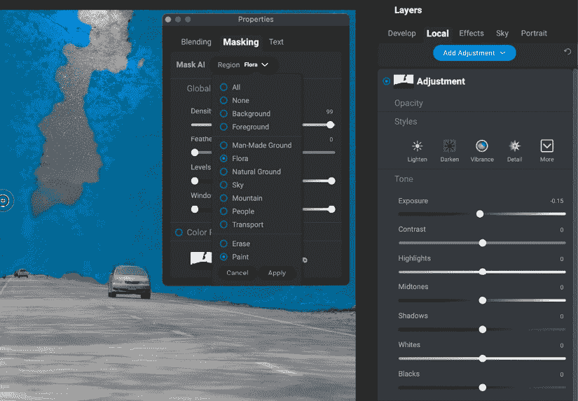

图 4.13 – 选择“flora”可以得到大部分树木，但接近天空的选择是模糊的

在处理图像时，可以在**开发**选项卡中访问局部选择，在那里你可以选择精确应用自动**Brilliance AI**效果的位置，以及你想要使用的强度。为了获得更多控制，使用**局部**选项卡添加调整，然后查看浮动**属性**面板，并在**遮罩**部分选择一个区域。最后，你可以在右侧的检查器中控制校正。

为了更精确的控制，你也可以使用**超级选择 AI**工具（一个魔法棒图标），然后简单地点击一个对象来选择它。这对于定义清晰的对象有效，也可以用来选择人的某些部分，如头发。这些遮罩可以通过绘画进行调整，但选择边缘周围的一些细微细节很难用手准确选择。

在我的测试中，Lightroom Classic 生成的遮罩边缘定义更清晰，这在对树木和头发等对象周围进行调整时非常有帮助。上面相同的较不精确的遮罩意味着在调整后复杂区域的边缘变得可见，我无法将我的校正推进到我想要的程度。工具包括调整遮罩，但这需要时间，而且它们并不总是足够。

这两款应用程序并非唯一拥有图像分割技术的；我预计这项技术将在不久的将来扩展到其他图像处理应用程序中。你也会在一些视频应用程序中找到类似的技术，从……开始。

## Final Cut Pro 磁性遮罩

虽然自动图像分割对于静态图像非常有帮助，但对于动态图像来说几乎是必需的。每秒手动调整选择 24 次根本不可行！在基于 AI 的选择算法之前，跟踪选择要么是痛苦乏味的，要么使用大而模糊的边缘来掩盖其不精确性。

在 Final Cut Pro 11 中，引入了磁性遮罩功能，允许选择多种类型的对象——即使它们在镜头中移动或被前方移动的对象遮挡。你首先将任何效果或色彩校正拖动到查看器中的对象或人物上，等待目标被突出显示。

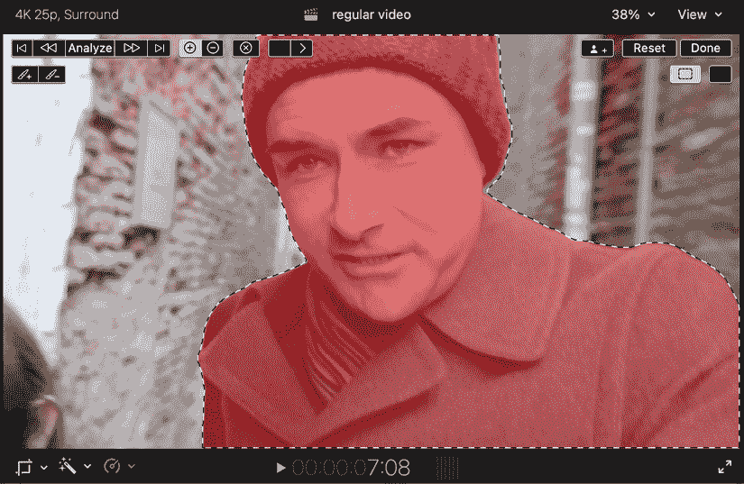

图 4.14 – 您的作者，在 Final Cut Pro 中进行色彩校正准备

如果需要，可以通过绘画来微调选择，然后可以分析整个剪辑。添加到同一剪辑的额外磁性遮罩将以不同的颜色显示，并且可以识别和跟踪许多种类的对象。

这个功能让不可能变为可能。我成功地在 50 分钟的剪辑中，单独从（亮度更高的）投影屏幕前走过的人身上进行了校正，这是一个连续的跟踪。这真的很棒。这建立在（并且比）一个较老的 macOS 功能（用于如 FxFactory 的 Keyper 之类的插件）之上，该功能可以自动识别镜头中的人。

尽管如此，所有主要的 NLE 都喜欢互相复制功能，而 FCP 并不是唯一拥有这种技巧的……

## DaVinci Resolve 魔法遮罩

在 Resolve 中，AI 魔法遮罩功能允许您选择希望校正的剪辑的哪些部分：

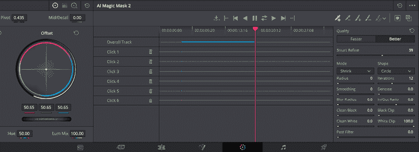

图 4.15 – 跟踪部分剪辑的 AI 魔法遮罩控制

按照以下步骤操作：

1.  在**颜色**页面，从中央面板中选择**魔法遮罩**图标，然后调整下面的控件以将质量提高到**更好**。

1.  从第一帧开始，反复点击图像以识别您希望单独校正的帧的哪些部分（例如，一个人）。要查看遮罩，快速调整下面的**主色**轮上的曝光（或任何其他设置），或使用中心魔法遮罩控件右上角的**切换遮罩叠加**按钮。如果选择了任何不需要的区域，请按*option*或*alt*，然后点击这些区域以移除它们。

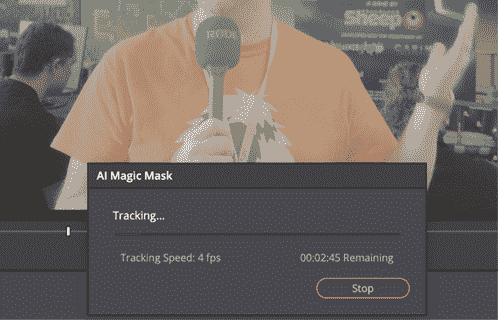

图 4.16 – 虽然一开始看不见，但这里的手被自动添加到围绕人物的跟踪区域中

1.  使用**Track Forward**按钮跟踪整个剪辑中的选择。如果你没有从剪辑的开始部分开始，也可以使用**Track Backward**。因为这个工具知道人们长什么样，如果身体的某个之前未见过的部分突然进入画面——例如，一个正在做手势的手——这将自动添加到选择中。

这个工具不如 FCP 的磁性遮罩快，但它可控、有效且灵活。如果你想更进一步，Resolve 有许多出色的颜色校正工具，包括重光照效果，它可以完成惊人的工作。

如果你使用的是 Adobe 应用程序呢？

## Premiere Pro 对象遮罩

花了一些时间，但 Premiere Pro 的 beta 版本终于在 2025 年 9 月添加了对象遮罩工具，并且它做的与 FCP 和 Resolve 中的工具几乎一样。以下是使用方法：

1.  将剪辑添加到序列中，然后选择剪辑并选择新的对象遮罩工具，倒数第二个。

1.  等待您的剪辑准备就绪，然后在节目监视器中悬停在一个人或对象上，然后点击它。选取应该是准确的，但如果需要，您可以使用**+**和**-**按钮进行微调。

1.  打开**效果控制**，在剪辑上查找新的**对象遮罩**设置。按下**跟踪器**控制中间的按钮，从当前帧开始双向跟踪。一个对话框将显示进度，应该相当快。

1.  当轨道完成时，您可以通过切换到**颜色**工作区，然后在右侧的**Lumetri 颜色**面板中进行更改来使用这个遮罩进行色彩校正。要遮罩背景，右键单击**对象遮罩**并选择**用作不透明度遮罩**。

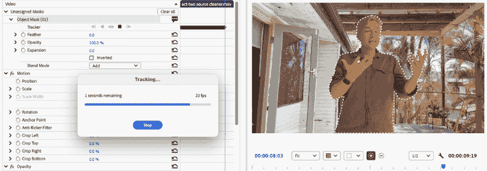

图 4.17 — Premiere Pro Beta 的新对象遮罩工具在作用中

这个工具将受到 Premiere Pro 编辑者的热烈欢迎。尽管 After Effects 用户有更多控制的选择，但这个工具仍然受欢迎。

## After Effects Roto Brush

让我们看看这个功能是如何工作的：

1.  导入您的剪辑并创建一个合成来保存它。

1.  在**时间轴**窗口中，双击您的剪辑将其加载到**图层**面板中，然后在顶部的工具面板中点击**Roto Brush**。

1.  接下来，在您想要保留的对象上添加绘画笔触。如果选取包括您不想要的部分，在绘画时按住*option*或*alt*键以移除它们。如果您用*空格键*播放，效果将自动传播到剪辑的其余部分。

就像之前讨论过的工具一样，现代的**Roto Brush**足够智能，可以将进入画面的肢体添加到人物的选取中。

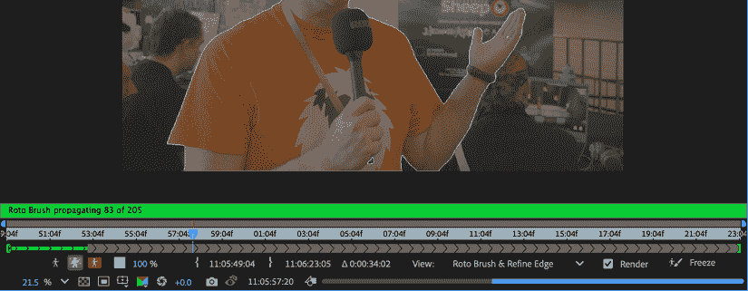

图 4.18 – 这个手臂最初没有被选中，但已被自动添加

它的速度不如 FCP 的磁性遮罩快，但比 Resolve 的魔法遮罩快一点。然而，内置功能并不是使用 AI 在视频中的唯一方式——知名的插件现在也在集成 AI 功能。

## Boris FX Mocha 选取

**Boris FX Mocha**多年来一直被用于复杂的视频遮罩任务，截至 2025 年中期，它现在包括用于创建初始遮罩的 AI 辅助。与传统贝塞尔工具相比，一个新工具允许您创建一个新的**遮罩 ML**图层。点击人的头部，然后点击身体较低的位置，现在通常就足够获得一个好的选取——这比手动绘制路径节省了大量时间。

除了基于点击的选取外，您现在还会找到一个基于提示的选取方法。它并不总是完美的，但键入您想要选取的对象（如`cars`或`people`）的名称，是一个很好的进步。

由于算法现在得到了很好的记录，我怀疑许多其他工具将集成基于 AI 的图像分割。即使是 Adobe InDesign 的**文本绕排**功能中最基本的**主题选择**功能也可以让你避免进入 Photoshop，在这种情况下，结果不需要像素完美才能有效。迟早，在你的首选应用中留意更多图像分割功能。

**AI 色彩校正**

尽管自动色彩校正工具在许多视频和图像编辑应用中已经存在了许多年，你可能没有意识到其中一些是基于机器学习算法的——甚至包括 Photoshop 中一些最早的自动校正功能。

更新的选项，包括 Final Cut Pro 的**色彩调整**中的自动选项，通常比早期的调整更有用，但没有一个是完美的。虽然一些这些功能可以作为进一步校正的起点很有用，但我还没有看到每次都能起作用的魔法“让它看起来很棒”按钮。

如果你需要一个可靠且一致的色彩校正解决方案，可以尝试像**Colourlab AI**（[`colourlab.ai`](https://colourlab.ai)）这样的解决方案，它支持许多视频编辑应用。

AI 驱动的主题选择也有助于在改变宽高比时的重新构图——让我们来看看。

# 重新构图以适应宽高比变化

随着垂直社交媒体视频的兴起，宽高比的变化（通常是从宽屏到竖屏）变得更加常见。在这些格式之间转换并不总是简单的，我建议拍摄比正常更宽的镜头，放大宽屏版本，并裁剪竖屏版本的边缘。如果你的相机允许你拍摄“开放门”，那么你可以简单地裁剪那个更高的画面（`4:3`或`3:2`）为宽屏和竖屏独立。

无论你如何拍摄，编辑中的每个剪辑在转换宽高比时都需要调整，并且所有主要的 NLE 都包含一个功能来使这个过程更平滑。让我们逐一探索。

## Final Cut Pro

1.  在**浏览器**中右键点击一个项目（即，时间轴）。选择**复制项目为**。

1.  在随后的对话框中，选择新的宽高比（可能是**垂直**）和分辨率，然后勾选**智能适配**。每个剪辑都将重新定位，使用机器学习来选择镜头中最重要的一部分。

1.  播放序列，并在需要时调整位置和/或缩放。请注意，尽管你可以自己添加动画，但 FCP 不会为你跟踪运动；它选择一个单一的位置并坚持下去。

## Premiere Pro

1.  右键点击一个序列，然后选择**自动重新构图序列**。

1.  在出现的对话框中，选择您的新纵横比，可能是**垂直**。请注意，新序列使用括号中当前序列的新纵横比命名，例如`序列名称 (9x16)`，它将在名为`自动重新构图序列`的新文件夹（即文件夹）中创建。在这个文件夹中，找到新的序列（名称中包含纵横比），右键单击，然后选择**序列设置**。检查帧大小是否符合您的需求——因为 Premiere 只调整序列的宽度而不是交换宽度和高度，您可能更喜欢使用`1080x1920`进行垂直视频。

1.  播放序列并检查每个剪辑是否正确。虽然 Premiere 会在镜头内调整构图，但这种动画并不总是您想要的，最简单的修复方法是关闭**自动重新构图**效果。

1.  要对每个需要此功能的剪辑进行此操作，找到**效果控制**面板，然后单击**自动重新构图**旁边的“fx”图标。要重置位置，在时间线中右键单击该剪辑，然后选择**填充**以填充框架。在**效果控制**或**属性**中，如有必要，调整缩放和位置。

## DaVinci Resolve（Studio 版本）

1.  右键单击时间线并复制它。

1.  将新的时间线重命名为目标纵横比。

1.  右键单击并选择**时间线设置**。

1.  取消勾选左下角的**使用项目设置**，然后在顶部的**时间线分辨率**菜单中选择**自定义**。

1.  输入所需的靶分辨率。

1.  在底部的**不匹配分辨率**菜单中选择**裁剪缩放全帧**。在**检查器**中，在**变换**部分，查找该部分的底部**AI 智能重新构图**。在此部分中，将**感兴趣的对象**设置为**自动**，然后按**重新构图**以在整个镜头中跟踪。

1.  如果这还不成功，将**自动**更改为**参考点**，然后将出现的框移动到您想要在镜头中保持居中的对象或人物上。

1.  再次单击**重新构图**，等待处理，该区域将保持在重新构图图像的中间。

无论您选择哪个工具，您都将能够至少在重新构图方面获得一些帮助。

# 立体转换

**立体摄影**，立体照片的捕捉，已经流行了一个多世纪，立体视频自 1950 年代以来也一直很受欢迎（有时受欢迎）。要捕捉立体照片或视频，通常必须同时记录左右图像，要么使用双镜头相机，要么使用两个同步的独立相机。

然而，大多数图像显然是采用 2D 捕获的。因为使用苹果 Vision Pro 等设备观看的观众可以看到 3D 图像，机器学习算法现在已经使得将 2D 图像转换为 3D 成为可能。这涉及到图像分割和深度重建，以确定图像的哪些部分更靠近相机，哪些部分更远，以及一个生成组件，以填补前景物体后面的任何缺失区域。

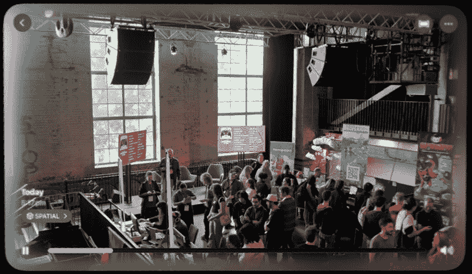

图 4.19 – 这段视频是在 2D 模式下拍摄的，并使用 Owl3D 进行了转换，其深度令人印象深刻，但在 2D 页面上难以分享

在最新的 visionOS 中，不仅可以创建图像的立体版本，还可以创建一个可以自由移动视点的 3D 版本。这被称为**空间场景**，到目前为止，它甚至比之前可用的空间照片转换更有效。目前，这是内置在操作系统中的，但并不是第三方应用程序可以访问的功能。

第三方应用程序可以将视频从 2D 转换为 3D，成功率各不相同。我所见到的最佳结果是在 Owl3D（提供 Mac 和 PC 应用程序）上实现的，但使用 Moon Player 等应用程序可以在 Apple Vision Pro 上以较低的质量进行实时转换。虽然这些应用程序的输出并不完美，但 3D 转换的质量预计将继续提高。今天，如果你想创建立体图像，最好以立体方式捕捉，但请注意这一领域的改进。

# 管理带时间戳的编辑请求

在视频（和音频）制作过程中，通常会收到反馈请求，要求删除特定的单词或带时间戳的区域，要求有替代版本，要求更换镜头，或要求更改效果。但如果请求影响了镜头的长度，它可能会使其他请求更难以解释。例如，如果要在时间轴的开始处删除 5 秒的镜头，那么之后所有其他请求的时间戳都将无效且难以追踪。

解决这个问题的老式方法是从列表的末尾开始处理，这样更改列表中的早期时间码仍然有效。但这并不总是有效；有时一个请求与早期更改相关，而上下文意味着通常从开始到结束编辑更容易。那么解决方案是什么？

标记提供了一种很好的解决方法，允许你在时间轴上客户要求更改的每个位置添加一个虚拟便签。标记存在于所有常见的 NLE 中，快捷键*M*将在 Resolve、Final Cut Pro 和 Premiere Pro 的时间轴剪辑中添加一个标记。因为标记是附加到剪辑上而不是仅仅时间码，所以当剪辑从时间轴中删除时，标记会移动，这样你就可以从头到尾处理更改列表。

手动添加所有这些笔记可能会有些繁琐，但如果你使用 Final Cut Pro，**Marker Toolbox** 应用程序可以使用 AI 将客户友好的时间码列表处理成带有说明的 *待办* 标记。 (Marker Toolbox 还可以将来自 Vimeo 和 Frame.io 等在线评论网站上的评论转换为时间线标记。) 这为编辑和他们的客户提供最佳体验，他们只需要给他们的笔记一个非常松散的结构。例如，他们可以写以下内容：

+   `5 秒结束这个镜头`

+   `0:35 替换这个镜头`

+   `0:47 从这里剪切这一部分`

+   `0:52 在这里结束剪切`

+   `1 分 23 秒修复标题中的拼写，应该是 "Jeri"`

+   `1:53 检查结尾的长空白部分？`

作为 Final Cut Pro 工作流程扩展打包的 Marker Toolbox，可以非常快速地将所有这些转换为编辑时间线上的合理标记。如果您的客户可以遵循像前面示例那样的简单规则来编写文本，它将工作得很好。如果请求格式不佳，ChatGPT（或本地 LLM）的 AI 处理将使它们有意义。安装后，您需要点击插件图标以访问已安装的 **工作流程扩展**，然后选择 **Marker Toolbox**。点击 **设置**（位于文本区域下方）并确保此对话框中的帧率与您的轨道匹配。

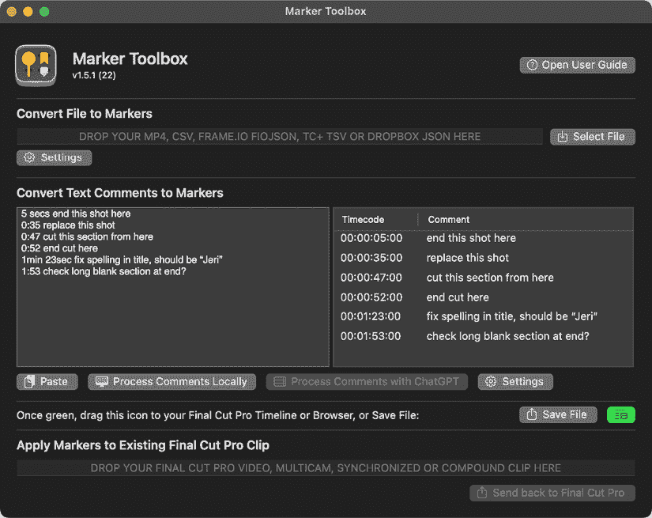

图 4.20 – 左侧的粗略说明变成右侧准确的时间戳，准备好拖入时间线

如 *图 4.20* 所示，将客户的反馈粘贴到左侧文本窗格中，然后点击 **本地处理评论**。现在你将在右侧看到处理后的更改列表，如果客户表达得清楚，应该没问题。如果不清楚，可以通过添加 API 密钥（在付费账户中可访问）到设置中，然后点击 **使用 ChatGPT 处理评论** 重新处理。开发者计划很快添加对 Apple Intelligence 本地处理的支持。

假设您现在在右侧有良好的结果，将右下角的绿色图标拖动到 Final Cut Pro 中的时间线开始处，它位于此窗口后面。

在这个示例时间线上，标记被放置在标题上，每个标题都包含相同的反馈，所有这些都包含在一个包含时间码流的新的复合剪辑中。为了使标记能够随变化而流动，选择新添加的剪辑，然后选择 **剪辑** > **拆分剪辑项**。最后，删除创建的时间码轨道。

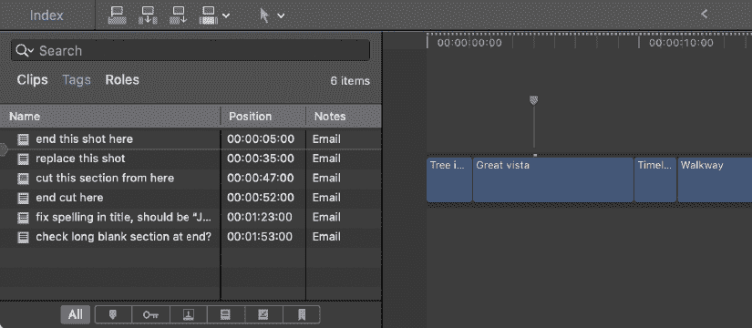

图 4.21 – 列表中的第一个标记可以在时间线上看到——注意标题与剪辑相连接，标记位于标题上

标记（附带标题）现在直接连接到其下方的剪辑，并且当进行更改时将保持与正确剪辑的连接。所有标记都可以在时间轴**索引**中看到，位于时间轴左侧的**标签**部分。这个工作流程不使用太多 AI，但它使一个常见任务变得更容易，并允许客户更自由地表达自己。

客户将喜欢的另一个功能是移除他们的错误，你有时可以做到不留痕迹。

# 移除跳切

在明眼人看来隐藏编辑是当今编辑应用中常见的功能，尽管它不是现代 AI 工具集的一部分，但它仍然由机器学习驱动。

在任何主要的 NLE（非线性编辑器）中，你只需将一个谈话头视频放置在时间轴上，然后删除其中的一部分以创建跳切。你可以通过在源剪辑中选择两个不同的范围并将其依次添加到时间轴上来完成此操作，或者通过使用 Razor 或 Blade 工具，进行几次剪切，然后选择中间的那部分并执行波纹删除。

最后，技术取决于你，但你会希望最终得到两个剪辑，其中同一个人在大致相同的位置。理想情况下，两个镜头应该尽可能相似：眼睛都睁开，头部朝同一方向，等等。避免出现身体的一部分（如手）在一个镜头中可见而在另一个镜头中不可见的情况，否则你可能会得到这样的混乱：

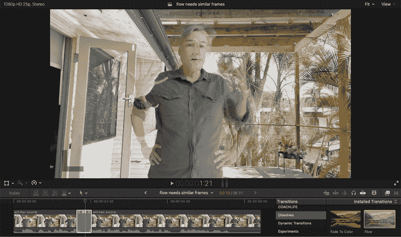

图 4.22 – 如果尝试将两个这样的镜头（不同手部位置）混合在一起，流动、形态和流畅剪辑都会失败

现在，你需要找到正确的过渡。在 Final Cut Pro 中，这是流动过渡；在 Premiere Pro 中，这是形态剪辑；在 DaVinci Resolve 中，这是平滑剪辑。应用过渡，等待处理，然后播放。过渡将使用机器学习技术将一个剪辑转换为另一个剪辑，但无论你使用哪种，第一次可能看起来不太理想。尝试过渡的持续时间；通常，较短的时间更好，可能只有几帧。还可以通过向前或向后滚动几帧来实验过渡的确切时间。有时这需要一点调整。

最可靠的解决方案是指导你的主题，要求他们在句子之间暂停、重置和放松。如果他们能在开始每个句子之前回到大致相同的位置，并且有相似的面部表情，那么你尝试将一个镜头无缝连接到另一个镜头的成功率会高得多，而不是如果每个镜头都截然不同的话。

尽管如此，有时这种过渡根本不起作用。在这些情况下，尝试以其他方式遮蔽编辑：切换到备用镜头，切换到不同的角度，或者在第二个剪辑上快速缩放。通常的非 AI 技术仍然可用；这仅仅是你的技巧箱中的另一个工具。

另一个可能很有用的功能是重定时，虽然光流重定时在许多应用程序中很常见，但目前最好的机器学习慢动作可以在 Final Cut Pro 中找到。让我们放慢一些剪辑的速度。

# 视频重定时

虽然以高帧率录制以获得最佳质量慢动作效果仍然是最好的选择，但有时在拍摄后才会决定慢放视频。此外，大多数相机在特定分辨率下提供的最大帧率有限，可能无法以所需的分辨率和帧率进行捕捉。

因此，在后期制作过程中可能需要创建新的中间帧，许多应用程序中都有一种称为**光流**的方法。虽然这个算法很有用，但 Final Cut Pro 中添加了新的机器学习算法，在超级慢动作功能中，它们在质量上是一个巨大的飞跃。

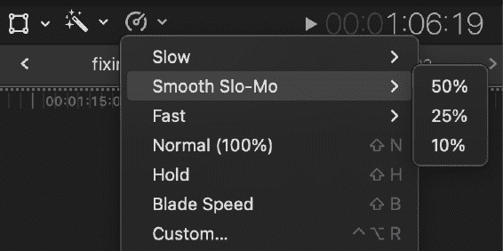

图 4.23 – 平滑慢动作选项使用机器学习来插值所需的帧，效果出色

在时间轴中选择一个剪辑后，从**查看器**下方的**重定时**菜单中选择**Smooth Slo-Mo**，然后选择一个百分比作为起始点。使用高级插值，将创建新的中间帧来填充任何间隙，AI 的表现非常出色。Compressor 也提供了这个高级重定时选项。

虽然 DaVinci Resolve 和 Adobe Premiere 目前还无法达到这种质量，但像 FlowFrames 这样的免费应用程序可能是一个有用的替代品，而且这也可能在一个更出名的提升分辨率的应用程序中实现：Topaz AI Video。

# 提升图像和视频

在图像中增加细节或分辨率是图像处理工具多年来一直在处理的任务，但没有 AI，你能够推进的程度有限。视频有时也需要锐化或提升分辨率，这可能是一个更专业的任务。今天，AI 工具在许多应用程序中提供，并且已经变得相对主流。

在制作方面，这些工具使用简单；你将输入一个低分辨率图像，运行该过程，你将获得一个更高分辨率的图像。根据原始图像或视频的糟糕程度，你可能更喜欢在提升之前或之后进行处理。一般来说，如果图像真的很差，你可能希望在提升之前先进行手动清理。然而，如果你从一个不错的图像开始，并试图将其放大到很大，尝试这样做：

1.  保存你的原始分层图像。

1.  保存该图像的平铺副本。

1.  提升平铺副本的清晰度。

为什么呢？简单来说，非常高分辨率的图像带有图层可以变得相当大，难以处理。我曾将用于交易会展示的图像放大，结果单个图像超过了 500 MB，虽然这在视频术语中不算什么，但在 Photoshop 中加载和保存都很慢。

为了获得最佳效果，尽量将图像的大小精确翻倍。实际上，许多工具只会将图像放大 2 倍，如果你需要更大的尺寸，你只需将这个过程运行两次。通常情况下，你尝试做的事情越多，你越不可能成功——没有替代品可以替代真实像素，如果你想覆盖 300 dpi 的大屏幕，你应该从高分辨率图像开始。

虽然有许多选项（阅读以下建议以获取一些建议），但最知名的图像和视频增强器可能来自 Topaz Labs。他们提供一系列桌面产品：**Photo AI**，一个以放大为重点的更便宜的**Gigapixel AI**，以及一个更昂贵的**Video AI**。除了桌面应用外，Topaz 还提供几个网络应用，提供图像和视频的放大和其他改进。对于大多数制作需求，我建议本地处理，但如果你的机器性能较低，你可能需要额外付费使用云处理。

尽管所有这些应用都包含生成性组件——毕竟，它们确实在创造细节——但我将它们包含在这本书的这一部分，因为它们并不是试图从无到有地创造东西。然而，在它们的极端设置下，这些应用产生的某些形状和纹理细节可能会趋向于人工化。为了避免这种情况，请确保以尽可能高的质量捕捉，并将这些应用作为轻微的升级步骤。

这些应用的结果可能非常好，尽管处理可能较慢。基于 AI 的降噪功能可以真正帮助清理颗粒状图像，其他工具有助于从错过焦点、色彩平衡中恢复，当然，当你需要比捕获的分辨率更高的分辨率时，放大功能非常有帮助。

随着 AI 图像改进算法逐渐成为主流，其他应用也提供了基于 AI 的工具，可以执行一些这些任务，包括以下内容：

+   **Adobe Photoshop**拥有许多 AI 功能——**Neural Filters**，包括**超级放大****放大器**和照片修复模块（以及其他）以及**生成式放大**功能，如果你愿意，可以与 Topaz 模型一起使用。

+   **Pixelmator Pro 的超级分辨率**功能，以最小的质量损失将图像分辨率翻倍。

+   **DaVinci Resolve 的 AI 超级放大**，提供 2 倍到 4 倍的放大，内置锐化和降噪功能。

+   **Upscayl**，提供免费桌面应用，能够实现 2 倍到 16 倍的静态图像放大。付费云放大服务也可用。

+   Apple 的 macOS 26 包括视频滤镜的 API，这将允许应用放大、执行视频重定时、添加运动模糊、降噪和锐化，甚至可以在视频通话中实时进行。

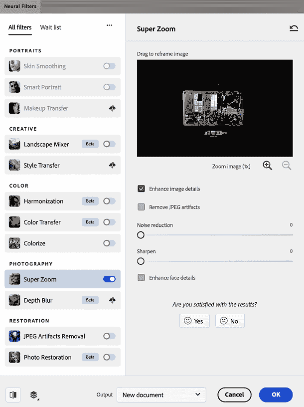

图 4.24 – Photoshop 包含多个神经网络过滤器，但超级缩放可能是最直接有用的

由于许多生成式人工智能服务倾向于创建低分辨率图像，因此它们通常会包括放大功能。始终要小心放大是否创造了虚假的细节（毕竟，这些在技术上属于*生成式人工智能*），并从你能找到的最佳来源开始。

# 摘要

机器学习继续对许多图像处理流程产生重大影响。虽然能够在大量集合中找到一张图片很有帮助，但能够在视频中找到特定时刻的能力更为强大。一旦你找到了那个镜头，能够重新照亮某人脸部，即使他们四处移动，也是非常方便的。然后你可以使用人工智能来帮助你处理客户的变更请求，为新宽高比重新构图，使视频速度大大减慢，或者创建图像的更大版本。

虽然你的生产流程可能不会使用所有这些技术，但它们可以使你更容易地对客户的请求说“是”，使你的工作流程更顺畅，并且它们仍然会让你的创造力成为你创作的核心。我们还没有结束；在本书的后面部分，在*第四部分*，关于*自动化人工智能*，我们将讨论可能完全改变你的工作流程的技术。

在下一章中，我们将探讨与文本相关的实用人工智能。虽然创意生产通常围绕图像、视频或音乐展开，但文本仍然是剧本、指令和许多客户互动的幕后，因此值得深入探讨。

# 其他资源

+   AI 遮罩在 Boris FX Continuum – Mocha Matte Assist ML 中：[`www.youtube.com/watch?v=YbbcUpKcQGU`](https://www.youtube.com/watch?v=YbbcUpKcQGU)

+   FlowFrames：[`nmkd.itch.io/flowframes`](https://nmkd.itch.io/flowframes)

+   苹果的机器学习视频效果：[`youtu.be/EbRvY6j8d7g?si=8kRskK2AcpnorXwu`](https://youtu.be/EbRvY6j8d7g?si=8kRskK2AcpnorXwu)

|

## 获取本书的 PDF 版本和独家额外内容

扫描二维码（或访问 [packtpub.com/unlock](http://packtpub.com/unlock)）。通过名称搜索本书，确认版本，然后按照页面上的步骤操作。 |  |

| **注意**：请妥善保管您的发票。直接从 Packt 购买不需要发票。* |
| --- |
