# 6

# 基于文本的生成式 AI

当我们进入本书的**生成式 AI**（**GenAI**）部分时，回顾一下任何使用这项技术可能引发的伦理问题是有意义的。为了明确起见，虽然并非所有生成式 AI 的使用本质上都是坏的，但我不会建议您将生成式文本用于直接发送给客户的内容。

如果你过度使用 GenAI——比如说，你决定让 AI 帮你写电子邮件——那么你用来产生文本的心理肌肉会萎缩。你将无法发展新的肌肉。你的声音的独特性将消失，客户将减少选择你的服务而不是其他人的理由。

如果你从事创意制作，创意不是副业。你需要创造出比其他人更有趣的作品，而不仅仅是尽可能多地生产低标准的垃圾。每一封电子邮件都应该是练习更清晰沟通的机会，而不是外包的任务。

话虽如此，确实有空间让生成式 AI（GenAI）创建帮助您更高效地完成工作的文本，提供想法，或帮助使您的工作更易于访问。让我们更深入地看看以下内容：

+   思想生成

+   以不同风格重写文本

+   生成引用

+   翻译

+   可访问性的替代文本描述

并非所有创意专业人士都需要所有这些功能，但我们大多数人都可以找到其中几个功能的用途。让我们从一点头脑风暴开始。

# 思想生成

创意工作差异很大：有些是自我指导的，有些是完全由客户的简报指导的，许多则介于两者之间。当你面临关于如何进行的创意决策时，一张空白的页面有时会感到令人畏惧，使用 AI 来提出想法可能是有用的。

如同往常，如果你提出更具体的问题，你会得到更好的结果，所以你对一个主题了解得越多，你就能提出更好的问题。此外，如果你只稍微超出你的舒适区，你可能会在给出糟糕建议时发现它。所以，如果你是一个想要 YouTube 视频想法的视频创作者，只需提出以下问题：

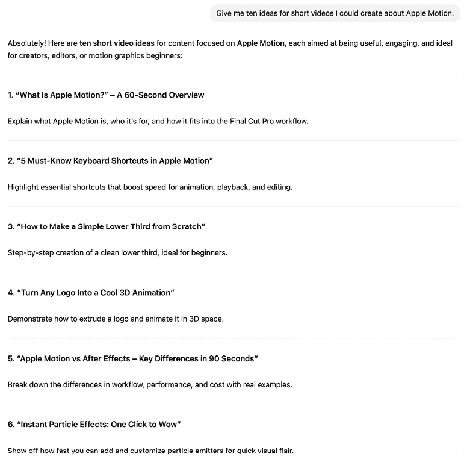

图 6.1 – 所有 10 个想法（此处未全部展示）都是可靠的

这些都是可以轻松转化为短视频的好主意。虽然我可以自己想出类似的列表，但这样的结果可以轻易激发更多更好的想法。不同主题上的类似提示也能得到良好的结果。如果你是一个喜欢狗的数字艺术家呢？

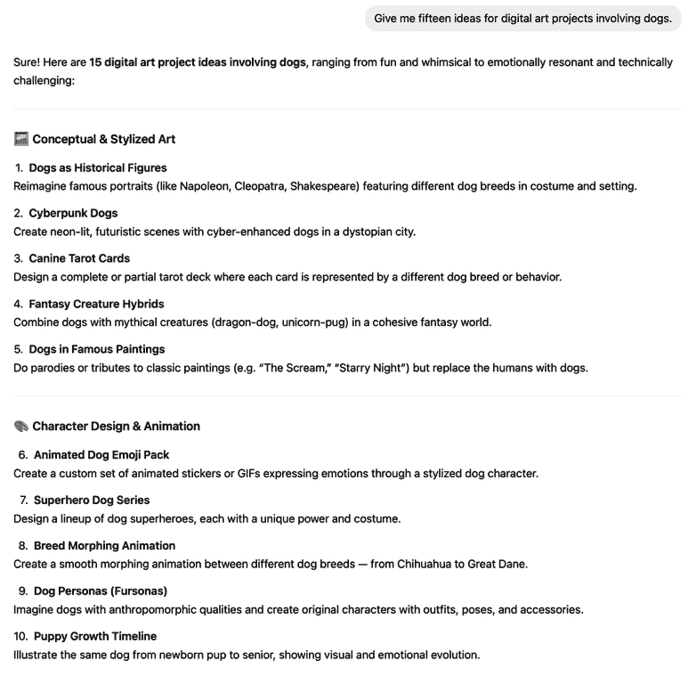

图 6.2 – 再次，这些想法大多是可靠的

如果你缺乏灵感，使用 LLM（大型语言模型）来提出想法至少可以让你开始。虽然这里的结果不会完全原创，但如果空白页面是你的敌人，这些可以作为迭代的可靠起点。

## 拓展到附近的创意领域

想象力不仅仅是关于你熟悉的内容的想法，尽管如此。大型语言模型（LLMs）还可以帮助你稍微伸展一下翅膀，超出你可能感到舒适的范畴——这在与较小团队一起工作时很常见。

例如，如果你通常负责活动拍摄的视频摄影师，现在被要求制作宣传视频，LLM 可以为你提供一个视频应包含的典型事项清单。以下是 Gemini 的回应开头：


图 6.3 – 这里包含的点（并非全部展示）相对明显且合理

如果你是一个熟练的视频编辑师但对自己的方向感不太自信，这提供了一个你可以发展成客户提案和拍摄脚本的起始框架。沿着相似的方向，如果你是一个设计师但不是桌面游戏市场营销专家，也许一个 LLM 可以帮助你发现放置你创建的广告的最佳位置以及包含特定领域的元素：

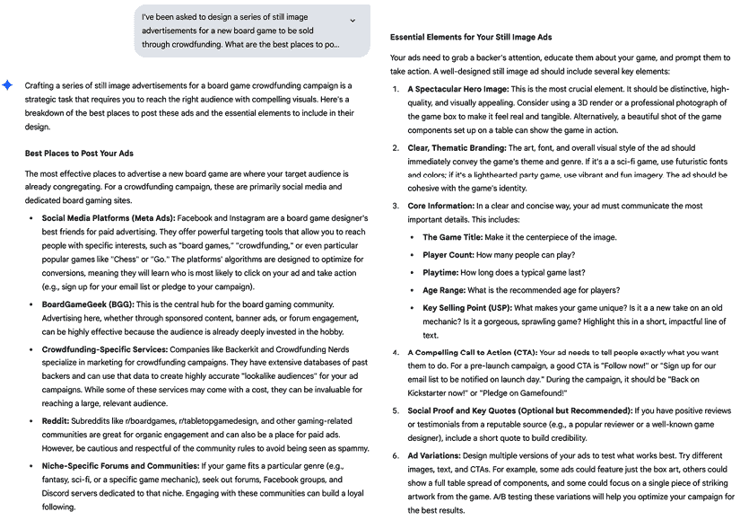

图 6.4 – 这个回应全面且有用，包含许多在桌面游戏社区外并不明显的具体观点

尽管我不能确认其他特定领域提供的建议有多准确，但前面的回应是在我熟悉的领域，它们是可靠的。虽然想象力当然是一个生成式人工智能（GenAI）的任务，但它不必剥夺你的创造力，实际上可能会进一步激发你的灵感。为了确保你不会完全依赖 AI 来获得灵感，在你向 AI 寻求帮助之前，自己或与同伴一起进行想象力创作。这样，你将得到一个第二意见，而不是完全外包这项工作。

现在你已经有一些想法了，希望你已经能够写点什么。如果你对它不太满意怎么办？

# 以不同风格重写文本

虽然总结和重写之间的差距很小，但我确实认为这里有一个明显的区别：总结通常是为你提供的，而重写的文本则更具变革性，通常旨在面向公众的输出。在实用 AI 和 GenAI 之间，这里的界限有些模糊，就像在总结中一样，最终，这取决于你如何划线。

虽然我不会认为大多数语法检查器的使用是重写文本，但提供语法帮助的相同工具（如 Grammarly、Copilot 和 Apple Intelligence）如果你觉得需要，绝对可以给你更多的帮助。重写是许多通用 LLMs（如 ChatGPT 和 Claude）的功能之一，所以如果你已经使用了一个，试试它。然而，如果你没有这些工具中的任何一个适合你，一个专业的写作助手，如**Spiral**（[`writewithspiral.com/`](https://writewithspiral.com/))可能更适合你。

**小说写作工具**

计划写一部小说吗？你可能需要使用一个专门的工具来帮助你。如 Novelcrafter ([`www.novelcrafter.com/`](https://www.novelcrafter.com/))、Sudowrite ([`sudowrite.com/`](https://sudowrite.com/))和 Squibler ([`www.squibler.io/`](https://www.squibler.io/))等写作辅助工具针对故事和小说进行了优化，并且由于它们产生的输出针对的是更多用于虚构应用的描述性散文，因此这些工具不太适合更典型的创意生产文本任务，如提案、电子邮件和提案演示文稿。

在这里，我们将关注更多通用写作助手，当然，这个列表并不全面——新的工具总是层出不穷。

AI 工具可以为了清晰、简洁和符合出版物或作者的风格而重写文本，但你几乎可以从大多数 LLMs 请求任何风格。作为一个测试，我处理了我最近一篇关于[`provideocoalition.com`](https://provideocoalition.com)上立体视频实验文章的开头部分。我的风格可能有点古怪，而且并不完全无误，但对我来说这没关系：

```py
Spatial 3D stereoscopic video is easy to shoot on modern iPhones, but you'll run into its limits pretty quickly. Third-party apps can improve things, but they have limitations too, and if you're used to shooting with a couple of dedicated cameras already, why not use them?
Well, if you're tempted to try making some stereoscopic 3D video with a couple of cameras sitting on the shelf, you should know what you're in for — it's harder than you think and there are plenty of mistakes to be made. On your first few stereo shoots you're bound to get something wrong, but if you practice now, you'll hopefully avoid catastrophic failure down the road when you get hold of a real camera.
Experiments like this are a great way to push your skills, but don't get your hopes too high. Even if you don't use something this janky to shoot real client projects, making it work with what you've got will give you real-world experience shooting in 3D that you can use if you step up to a pro setup down the road. So, with some regular 2D filmmaking gear to hand, how can you hack together a quick stereo 3D rig for viewing in a headset or on a 3D display?
As an extra reminder that this is an experiment, I'm not worrying about proper 3D Spatial Audio at all. Video's the focus here. 
```

在使用许多不同的工具和多种方式处理这段文本后，我没有得到很多真正愿意在专业环境中使用的成果。因为每个人的需求和风格都不同，你可能比我更有运气，当然，这些工具也会随着时间的推移而发展。

作为第一步，我使用了默认的“重写”选项。看看 Grammarly 的建议：

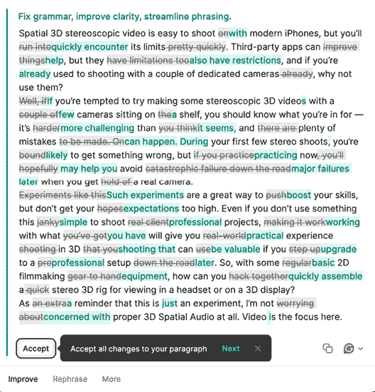

图 6.5 – Grammarly 想要做出很多更改，但并非所有都有帮助

除了几乎完全丧失我的写作风格之外，“局限性”并不等同于“限制”，“简单”也不意味着“糟糕”——我不想让“重写”改变我的意图。CoPilot 的第一次尝试更糟糕：

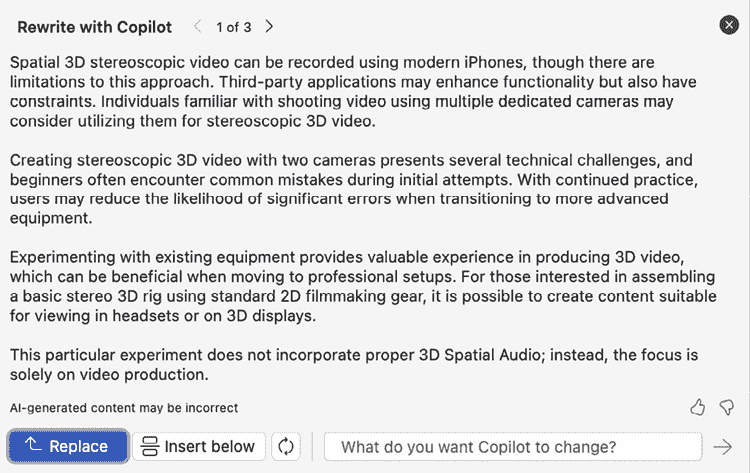

图 6.6 – CoPilot 在这里的表现并不出色

这感觉像机器人，缺乏流畅性和方向感。两种替代选项也好不到哪里去；第二种是一个很长的段落，第三种则过度使用了华丽辞藻。那么 Apple Intelligence 呢？它并没有像其他模型那样试图做出太多改变：

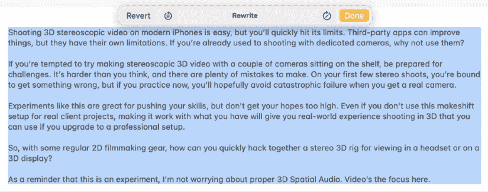

图 6.7 – Apple Intelligence 的重写保留了更多原始文本

与其他工具相比，Apple Intelligence 对文本的修订并不多，因此所做的更改并没有改变其整体风格或感觉。但如果你需要一个更正式的结果呢？让我们继续使用 Apple Intelligence，并要求一个**专业**的语气：

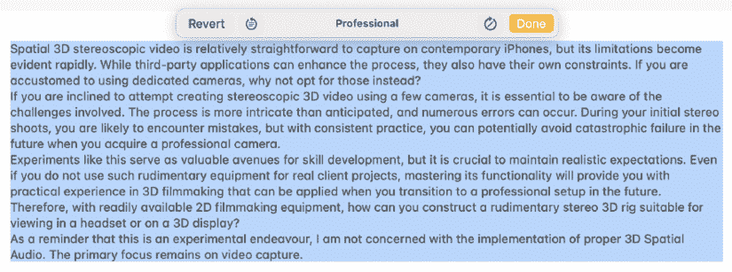

图 6.8 – ‘Professional’有更冗长、更不随意的语气

虽然这感觉比我个人更正式一些，但意义保持不变，感觉也没有离原文太远。ChatGPT 的**技术**版本可以接受，尽管它与原文的差异更大：

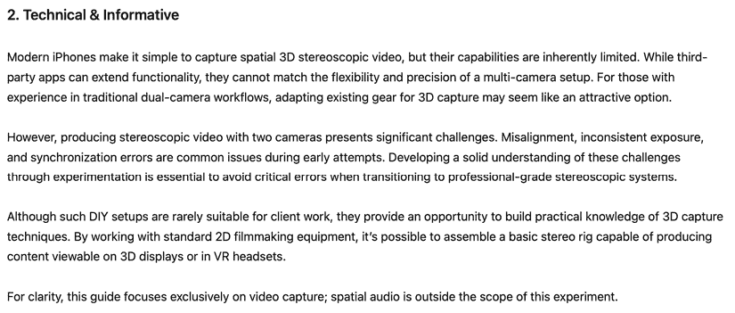

图 6.9 – ChatGPT 的技术重写大致可以接受

ChatGPT 提供了**休闲**、**技术**和**促销**重写选项；这是其中的第二个。尽管在几个地方单词替换改变了意义（包括用“简单”代替“糟糕”），但总体上还是合理的。以下是 Grammarly 的**正式**版本：

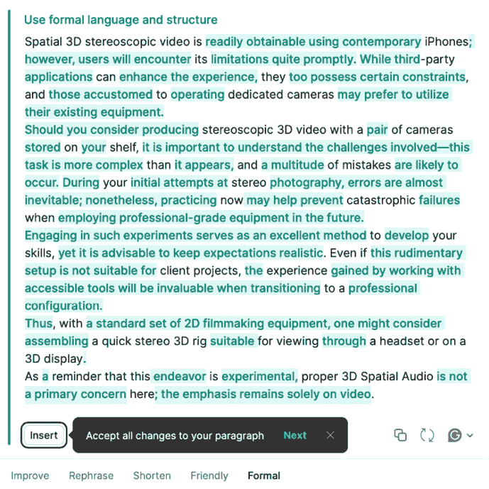

图 6.10 – Grammarly 提供“正式”重写

虽然这确实很正式，但所有花哨的形容词并没有让它变得更清晰。我认为 CoPilot 在正式尝试方面做得更好，尽管我不得不手动请求“正式语气”，而其他讨论过的工具默认提供了这个选项。

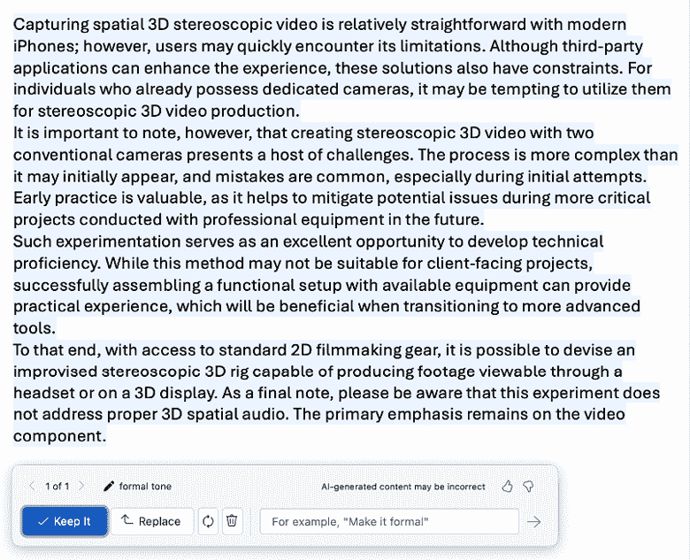

图 6.11 – CoPilot，要求“正式语气”

虽然检查这些示例应该有助于评估这些工具功能的一个起点，但每次运行它们都会有所不同。如果您没有得到您希望的结果，只需再次尝试，或者稍微改变您的提示。也许作为一种邀请实验的方式，ChatGPT 主动提供了多种风格（**休闲**、**技术**、**促销**），然后提出将三者结合成一个单一的“压缩最佳”版本。令人捧腹的是，这种重写重写将“如果你已经习惯了使用几部专用相机射击”片段搞成了“如果你已经有一对”，……这有着截然不同的含义：

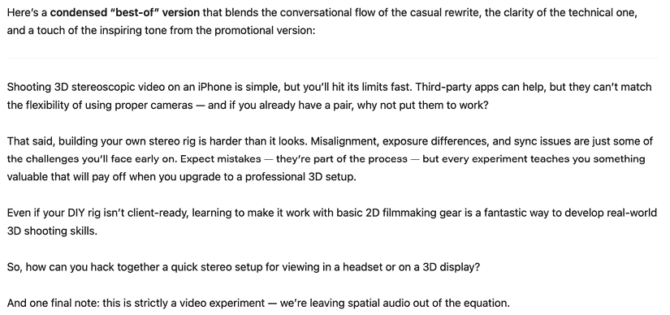

图 6.12 – ChatGPT 提供的压缩“最佳”版本——并不完全是我想要的

尽管我可能不会自己经常使用这些工具，但如果您作为作家还在寻找自己的脚步，我可以看到其吸引力。然而，我建议从 Apple Intelligence 开始（在现代苹果设备上使用**笔记**或**页面**），因为它能更好地保留您的原始作品。在一个大多数 AI 写作都司空见惯的世界里，仅仅“大多数合格”已经不再足够。如果您打算使用这些服务，不要只是接受大量更改。检查建议，如果您同意，请自行实施。

如果你觉得自己需要 AI 的帮助来修订或生成文本，那么超越预设，让基于提示的系统以更具体的方式帮助你。没有什么阻止你提供一份文档（或几份，或你的整个网站）并要求 AI 模仿那种风格。当你超出严格的字数限制时，你也可以尝试让 AI 为了简洁而重写。虽然我建议你自己来做，但如果这根本不是一种选择，至少避免使用预设。

相反，如果你还没有写文本，而你希望 AI 从要点中生成整个段落，这是可能的——但这是一个好主意吗？

### 从要点中撰写完整文本

如果某件事容易做，它的价值就很小。建立在模板上的设计在与其他使用模板制作的作品并排观看时不会脱颖而出，AI 撰写的文本也不会。以下是我的一些关键建议：

+   自己写东西有助于你作为作家成长

+   如果你外包了一项工作，你不会变得擅长它

+   AI 是快速、低成本的外包

+   AI 的工作能干但并不出色

+   如果 AI 开始写，你应该编辑它以添加你自己的风格

如果我觉得懒惰，我就可以让 AI 将那些要点转换成文本，对吧？让我们看看这会不会损害或帮助我的论点：

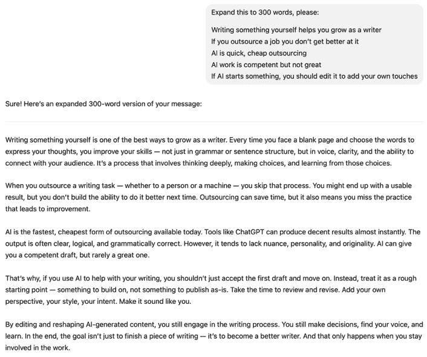

图 6.13 – ChatGPT—能干且表达得体，但这不是我自己的写作

这段文本是*不错的*。并不出色，只是不错。但如果你想要*出色*的结果——你应该始终追求出色——我不建议生成你期望客户或客户阅读的文本。如果它值得阅读，那就值得你自己来写。

如你所预期，花时间自己写东西会比任何外包捷径产生更丰富的文本。是的，你需要在上面投入时间，但回报往往是值得的。撰写完整长度的文本有助于你更深入地理解概念，并且如果你被质疑，你将能够支持这些观点。

*作为作家成长*是写作的一个被低估的好处，而且不应该被忽视。外包可以让你快速达到目标，但那个目标就是你所得到的一切。如果你花时间反复撰写提示，你只是擅长撰写提示。

然而，我理解：如果你觉得自己没有写好长文本的技能，使用 AI 是一个诱人的选择。如果这种诱惑太强烈，或者你只是被分配了太多工作而没有足够的预算来正确完成，至少你应该尽可能多地编辑生成的文本，使其成为你自己的。随意重塑、重新想象、删除。你对自己输出的贡献越少，你的成长就越少，你的工作价值也就越低。

此外，我明白还有很多大量的文本并不特别重要——希望这些不是作为创意专业人士你的工作内容。法律上重要的文本应该留给律师处理，但如果你的工作是撰写有说服力的文案，*你应该做好你的工作*。如果你外包了你的核心技能，客户为什么不雇佣一个使用与你相同 AI 工具且价格更低的人呢？

最后，一些服务，如 Spiral，承诺学习你的风格，然后代表你创作更多模仿该风格的作品。虽然这种方法确实解决了关于个人声音和语调的问题，但“实际上不做工作”的问题仍然存在。你仍然会失去创造力，如果你从未参与并进一步发展关键要点概念，你的写作就不会改变和成长。

如果你有机会，做*更好的*工作，而不仅仅是*更多的*工作。

是否有可以减轻繁琐工作的生成性任务？当然有。例如，如果你需要引用你的来源，有很多人不同的方式可以做到，这主要是一个技术任务。AI 能处理这个吗？

# 生成引用

虽然在学术界引用更为常见，但一些客户可能期望在提案、工作计划或年度报告中正确格式化的引用。如果你负责设计这些较长的文档并需要创建引用，你可能会想请 AI 帮助完成所选引用标准的特定格式要求。作为一个测试，我要求三个主要的 LLM 将 URL 列表转换为引用，结果差异之大让我感到惊讶。这是提示：

```py
Turn these URLs into citations, APA style.
https://www.techradar.com/computing/artificial-intelligence/googles-ai-overviews-are-often-so-confidently-wrong-that-ive-lost-all-trust-in-them
https://www.digital.gov.au/initiatives/copilot-trial/microsoft-365-copilot-evaluation-report-full/executive-summary-glossary
https://housefresh.com/beware-of-the-google-ai-salesman/ 
```

ChatGPT 在至少两个 URL 上自信地犯了错误：

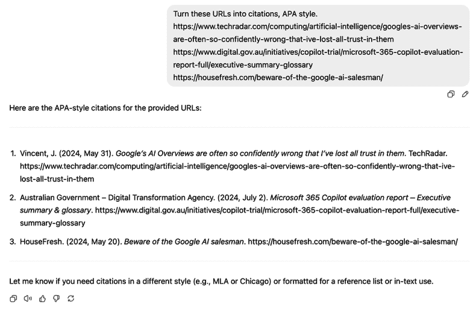

图 6.14 – 这里第一个和第三个引用的作者和日期是错误的

在多次尝试中，错误持续存在，尽管 Gemini 在相同的提示下表现更好：

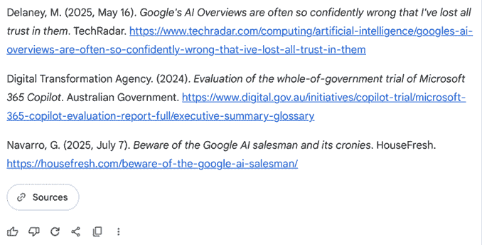

图 6.15 – 经过漫长的“思考”过程后的最终结果

然而，这并不是可重复的；使用相同提示的另一次尝试给出了完全不同的结果。

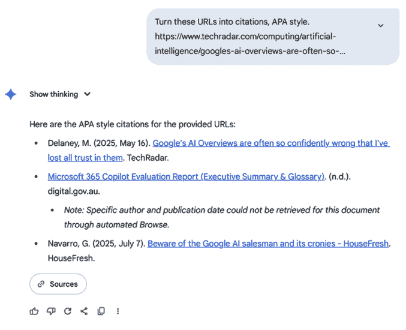

图 6.16 – 同样的引擎也产生了…这个？

我不想在例子上花费太多空间，但克劳德也在这项任务上失败了，所有这些服务在相对简单的任务上的不可靠性让我感到担忧。如果你需要定期做这件事，我建议使用像 Grammarly 提供的这样的手动引用生成器（[`www.grammarly.com/citations`](https://www.grammarly.com/citations)）：

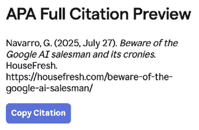

图 6.17 – 这篇手动组装的引用需要更多的复制粘贴，但自动选项并不可靠

虽然我希望这至少是一些 AI 工具能够可靠执行的任务，但如果连最大的 LLM 都无法正确完成，我也不能推荐信任其他工具来做这件事。规则仍然是——除非你已检查，否则请非常谨慎地将 AI 生成的输出与世界分享。

好的，想法完成，文档编写完成，引用完成，现在你的客户希望用不同的语言进行交付。AI 能帮忙吗？

# 翻译

虽然翻译是 AI 工具擅长的任务，但它们并不完美。如果你需要将另一种语言中的文本翻译成你自己的理解，AI 可能是可行的。如果你可以接受不完美的结果，你将能够理解其他语言中的文本的意义，否则这些文本将无法触及——这是一件好事。

然而，如果你需要将你自己的语言中的创意内容翻译成另一种语言以供母语人士阅读，不要期望 AI 能够独立产生完美的结果。

就像转录一样，输出将会很快，并且大部分是正确的。但尽管转录中的错误可以相对容易地纠正，如果你无法理解你要翻译成的语言，你将很难确认翻译的准确性。

大多数最便宜产品的网站列表和视频广告都证实了这一点。在没有预算将产品描述翻译成正确的英语的情况下，会使用自动翻译工具，并且输出未经编辑。因此，期望和感知的价值进一步降低。

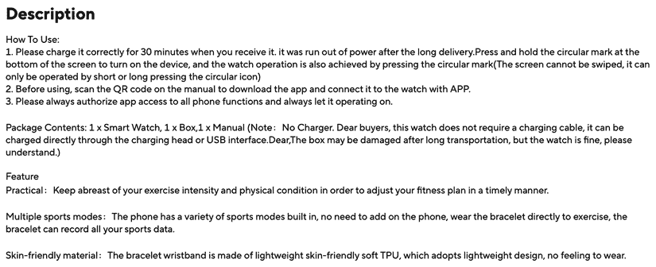

图 6.18 – 这款在 AliExpress 上出售的廉价智能手表的描述充满了错误

当然，这并不新鲜，但如果其他语言不能无错误地翻译成英语，我们为什么期望英语能够无错误地翻译成其他语言呢？我负责设计过英语以及几种其他语言的桌面游戏手册，在每种情况下，翻译都是由母语人士完成的，由我排版，然后由那位相同的翻译者在其他人检查之前进行检查。

翻译员当然可以使用 AI 翻译工具作为起点，但不同语言和方言的细微差别需要人类的触摸。翻译的细微之处并不容易掌握，即使是母语人士。例如，欧洲西班牙语和墨西哥西班牙语之间的差异微妙且众多，即使是经过人类监督的翻译也会包含需要许多校对员纠正的错误。在创意环境中，如视频和桌面游戏，细微的翻译问题也比基于事实的新闻文章更可能出现。

在工具方面，谷歌翻译网站已经使用了几年，在苹果平台上，Safari 浏览器包含了翻译功能，允许您翻译您访问的任何网站：


图 6.19 – Safari（以及其他浏览器）可以翻译外语网站

来自谷歌、苹果和其他公司的翻译应用程序允许实时将音频翻译成文本（或更多音频）成另一种语言，这对于使访问外国国家变得更容易已经足够有帮助，但对于创意制作目的来说还不够好。

然而，AI 在创建可访问的 PDF 或网站方面对任何人都有独特的用途。

# 可访问性的替代文本描述

**替代文本**是图像的文本等价物，为无法看到图像的人描述它。虽然替代文本旨在供盲人或视力受损的读者使用，但它对搜索引擎也很重要。事实上，图像的文字描述是 LLM 最初如何通过将其作为其训练数据的一部分来解释图像内容的重要组成部分。

因此，许多大型语言模型（LLM）可以解释图像包含的内容，因此可以生成替代文本描述，设计师可以将这些描述粘贴到 Adobe InDesign 或 Bridge 等应用程序中，或者 WordPress 等网站内容管理系统（CMS）中。世界上许多政府要求面向公众的文档要易于访问，因此这并非一项可选项的任务。

虽然描述一张单独的图像的短句并不困难，但描述多张图像可能是一个耗时的工作过程。此外，由于替代文本描述应使用简洁、简单的语言，因此其创建非常适合在人类监督下的 LLM 进行...对吗？

在评估输出之前，这里有一些来自哈佛数字无障碍指南（[`accessibility.huit.harvard.edu/describe-content-images`](https://accessibility.huit.harvard.edu/describe-content-images)）的关于替代文本的最佳实践建议：

+   保持简短，通常是一到两句话。不要过度思考。

+   考虑选择此图像的关键要素，而不是描述每一个细节。

+   没有必要说“图像”或“图片”。

+   但如果它是标志、插图、绘画或卡通，请说明。

+   不要在文档或网站中重复相邻的文本。

+   以句号结束替代文本句子。

生成替代文本有许多细微之处，但除了前面提到的点之外，替代文本还必须包括图像呈现的*上下文*。在讨论建筑时使用的大学校园照片可能比用于学生简章的同一图像具有不同的替代文本。更多建议可以在以下链接找到：[`www.visionaustralia.org/business-consulting/digital-access/blog/five-tips-for-writing-alt-text`](https://www.visionaustralia.org/business-consulting/digital-access/blog/five-tips-for-writing-alt-text)。

使用 AI 生成替代文本的最简单方法是使用许多专门为此目的设计的免费工具之一，包括**Ahrefs** ([`ahrefs.com/writing-tools/img-alt-text-generator`](https://ahrefs.com/writing-tools/img-alt-text-generator))，或**TailWind** ([`www.tailwindapp.com/marketing/tools/image-alt-text-generator`](https://www.tailwindapp.com/marketing/tools/image-alt-text-generator))。

或者，使用像 ChatGPT、Gemini 或 Claude 这样的通用 LLM，可以带来额外的优势，即能够调整输出——通过提供生成更好替代文本的提示来引导它们，或者提供展示这些图像的上下文。以下是一个来自 Tailwind 的简洁替代文本描述，使用了我自己的图像作为来源：


图 6.20 – 这段文字简洁，但没有上下文，无法讲述整个故事

该描述长度适中，提供了足够的意义，但没有上下文。尽管如此，并非所有描述都是准确的。Ahrefs 提供了三个选项，但所有选项都将 Apple Park 解释为步行道：

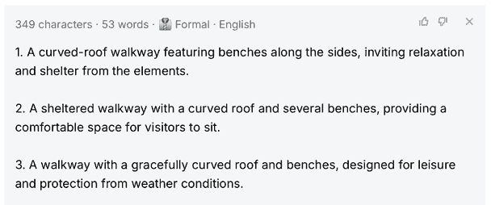

图 6.21 – Ahrefs 提供了选项，但没有一个是正确的

虽然人类可以编辑这些描述以包含上下文，但更高级的 LLM *可以*为您完成这项工作。在这里，ChatGPT 提供了一个通用的描述，然后根据请求添加上下文：


图 6.22 – 提供上下文可以改善替代文本——尽管它可能有点太长了

因此，尽管 AI 生成的替代文本令人印象深刻，但它通常只是一个起点。人类输入通常是必要的，要么直接纠正生成的替代文本，要么通过请求 LLM 添加新信息。

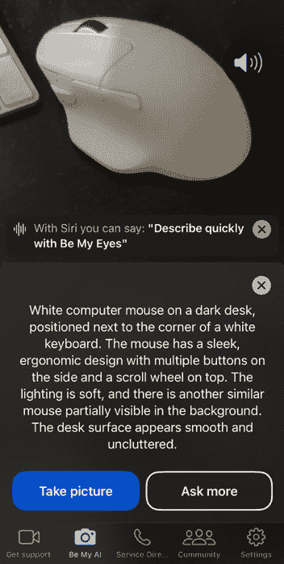

图 6.23 – 这个免费移动应用程序可以详细描述任何照片——但它不是即时的

盲人用户已经可以访问像 Be My Eyes 这样的免费工具，这是一个可以描述手机摄像头所能看到任何事物的移动应用程序，它也适用于像 Meta AI 那样的智能眼镜。自动生成替代文本现在是最低要求，如果您提供替代文本，您应该能够做得更好。

我们已经覆盖了很多内容，现在让我们总结一下。

# 摘要

AI 生成的文本有可能使许多任务变得更简单，在具有正式、特定输出要求的项目中，它可以大放异彩。然而，在创意领域，完全接受它存在真正的风险。

如果您创意写作的目的是脱颖而出，您就不能使用与其他人相同的工具和技术。如果您想作为一个创意人士成长，您就不能简单地外包创意任务。

话虽如此，接受帮助并没有什么不妥，AI 当然能够对你的作品提供反馈，以及提供想法。从大型语言模型（LLM）中获得的创意想法几乎没有缺点，因为你控制着如何使用它的建议。对于想要在专业上有所拓展的创意人士来说，向 LLM 寻求帮助绝对不是最糟糕的选择，尽管你对某个主题越熟悉，效果越好。

如果可能的话，将文本生成作为帮助你而不是取代你的工具。

带着这个基本原则，让我们深入探讨 AI 在创意人士中最具争议的应用：生成图像。

# 其他资源

+   [`www.boia.org/blog/be-careful-when-using-ai-for-alternative-text`](https://www.boia.org/blog/be-careful-when-using-ai-for-alternative-text)

|

## 获取本书的 PDF 版本和独家额外内容

扫描二维码（或访问[packtpub.com/unlock](http://packtpub.com/unlock)）。通过书名搜索这本书，确认版本，然后按照页面上的步骤操作。 |  |

| **注意**：请妥善保管您的发票。直接从 Packt 购买的产品不需要发票。* |
| --- |
