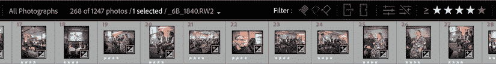
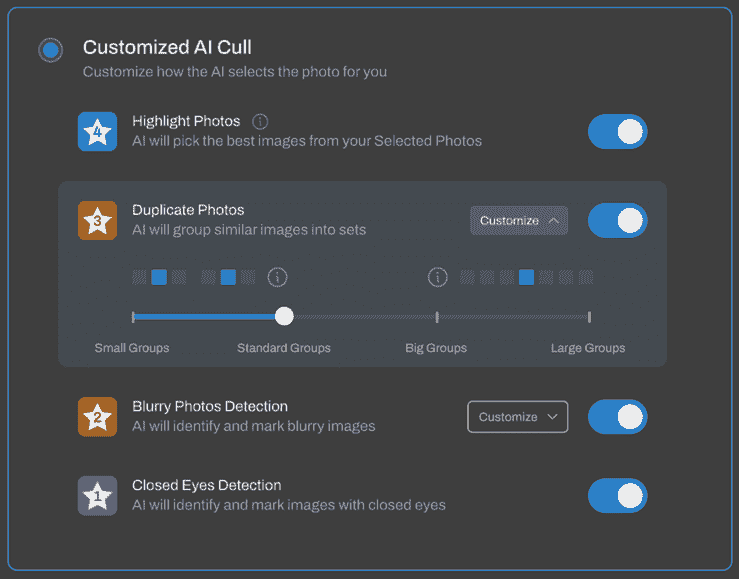
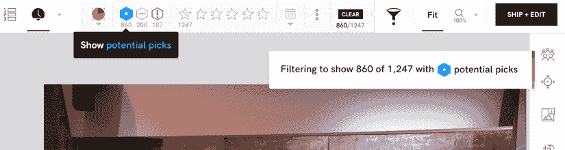
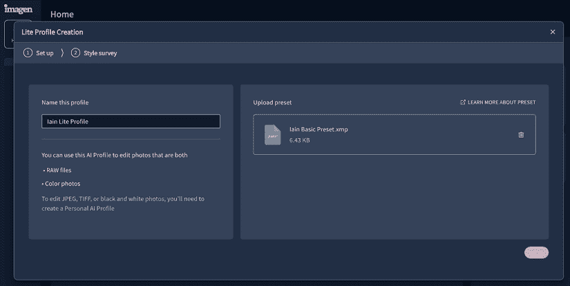
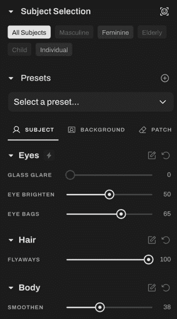
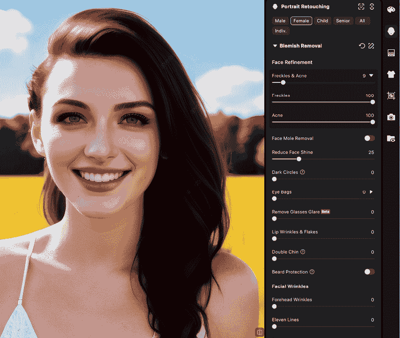
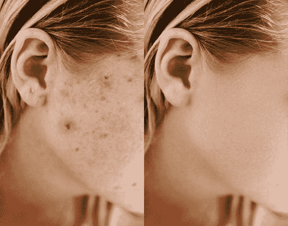
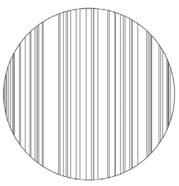
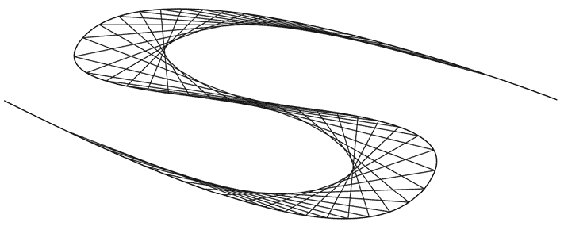

# 10

# 带图像的自动化 AI

在本书的第一部分，我们探讨了实用 AI 如何帮助您更快地完成工作：选择、分类或查找事物。如果您需要更多帮助，自动化 AI 可以为您完成部分工作，并且有许多与图像相关的任务可以发送给它。使用正确的应用程序，自动图像筛选、色彩校正和润色都是可能的。

然而，为了获得最佳结果，我建议只使用 AI 来自动化无聊、繁琐或耗时的工作。没有系统是完美的，如果您让自动化系统做出不完美的决定，您可能会交付低于标准的工作。有些任务需要谨慎完成，您不能——或者至少不应该——只是按下“使其平滑”按钮来给每个人带来新鲜、塑料般的外表。图像可以以许多不同的方式处理——您是否信任计算机为您做出那个决定？

当然，我们都需要判断哪些任务值得我们的时间，哪些任务可以交给别人。从这个意义上说，使用 AI 应用程序就像外包一样。因为许多这些应用程序运行在您的计算机上，您可能不需要将成千上万张图片上传到云服务器，这样可以节省时间并避免潜在的隐私问题。如果您已经愿意将一些与图像相关的任务外包给其他人，那么将这些任务外包给 AI 可能有助于提高您的工作流程。

本章将专注于图像，展示 AI 如何帮助以下方面：

+   自动图像筛选

+   自动润色

+   自动图像处理

+   编写脚本来加快设计任务

让我们从让 AI 从大量图像中挑选出最佳图像开始。

# 自动图像筛选

专业摄影师经常拍摄大量照片，尽管一些客户想看到所有照片，但移除坏照片是工作的重要部分。如果摄影师分享所有拍摄的原件，他们可能会受到严厉的评判；可能有很多失手比成功多，简单的调整可以在图像的最终外观上产生巨大的差异。

筛选是流程的第一步，其中挑选出最佳照片。明显的不合格照片被移除，使用马达驱动拍摄的组照被缩减，最终留下最佳照片。不同的摄影师会有不同的方法，但以下是如何在 Adobe Lightroom Classic 中手动筛选的：

1.  快速浏览每张照片，判断它是否*良好*，如果是，则按以下方式标记：

    +   如果良好，通过在键盘上点击那个数字键，它会被标记为 4 星（良好）或可选的 5 星（优秀）。

    +   如果一张照片比我刚刚标记为 4 或 5 星的照片更好，但非常相似，我将旧照片标记为 3 星，新照片标记为 4 或 5 星。

1.  重复操作，直到完成。

1.  只查看 4 星以上照片。

这显然是一个简化的过程，但它适用于许多应用程序，并为你留下了一组“好”和/或“优秀”的照片，你可以进一步处理这些照片。所有这些图像至少都会进行色彩校正，而五星级的图像可能会得到更多的个人关注。



图 10.1 – 在 Lightroom Classic 中手动筛选不需要花费太多时间——人工智能能做得更好吗？

作为测试，我记录了我处理最近一次拍摄的一批图像所需的时间。我对 1,247 张自己的照片进行的这次手动筛选大约花费了 22 分钟，并留下了 268 张“好”照片。并非所有这些都会进入最终剪辑，但我相信我没有错过任何东西——我看了我拍摄的每一张照片，我知道发生了什么，并且我可以以最佳方式展示这些照片。人工智能能做什么？

重要的是，Lightroom 本身很快将只针对人像包括一个由人工智能辅助的筛选功能。在撰写本文时（2025 年 10 月），此功能尚未推出，但鉴于您阅读本文时它可能已经公开，请务必查看。

**Excire Foto** ([`excire.com/en/excire-foto/`](https://excire.com/en/excire-foto/)) 是一个可以自动分析您的图像并以几种有用的方式对它们进行分组的选择——我们在本书的“实用人工智能”部分对其进行了探讨。这个本地运行的程序只需超过一分钟就将我的 1,247 张照片筛选到 656 张，使用默认配置文件——相当快。它根据相似性、照片中的人物以及连续拍摄的照片（例如，在马达驱动下拍摄的照片）来收集图像。它还推荐删除图像，如模糊的照片或闭眼的照片。

这种分析对一些摄影师来说将是有用的，尤其是那些处理大量图像的摄影师。然而，这种方法和所有其他自动筛选功能的风险是，一张好照片可能会被拒绝。在我的测试中，虽然模糊的照片确实被标记为拒绝，但并非所有选择都是完美的。一些模糊的照片最终被选中，而在我看来看起来不错的照片却被拒绝了——可能是因为它们不是人物照片。

其他照片似乎因为太暗而被拒绝，但有时摄影师必须在一个黑暗的环境中工作，并通过额外的处理来挽救他们的照片；只有人类才有足够的背景知识来做出所有正确的决定。如果特定主题的唯一照片不够完美，你可能必须尽可能挽救它。

好消息是这没关系——它是一个助手，而不是评判者。没有必要自动删除 Excire 建议删除的图像，不同的筛选配置文件允许在图像识别和处理方面有一定的灵活性。您可以创建一个新的配置文件，并选择您想要用作自动筛选基础的特性集合。如果您选择已经分析过的照片，这个过程只需几秒钟，因此很容易进行实验。

**Aftershoot** ([`aftershoot.com/`](https://aftershoot.com/))是另一个包含筛选功能的应用程序，总体来说，它与 Excire 的工作相似。在提供相同的图像后，它仅用了六分多钟来分析它们并展示评分的图像。我的第一次筛选使用了**定制 AI 筛选**设置，将 552 张标记为**已选**（5 星）和 93 张标记为**亮点**（4 星），但如果这不是您想要的，您可以尝试再次进行，而不需要完整的重新分析。



图 10.2 – Aftershoot 的定制 AI 筛选工具提供了几个选项

要重新筛选，请按**快速重启**，这只需几秒钟。**自动 AI 筛选**选项移除了更详细的控制，只提供了一个简单的滑块来告诉应用程序您想要多少张照片：

+   **标准**为我提供了 503 张**已选**和 84 张**亮点**

+   **少量**提供了 423 张**已选**和 70 张**亮点**

+   **极端**选项为我提供了 161 张**已选**和 430 张**可能**

最后那个**极端**选项更接近我的个人选择，但还不够接近以节省我的时间。在**已选**组中，它选择了被我拒绝的照片，并省略了我选择的照片。**放大镜**视图提供了一些有用的功能，自动将相似的照片分组，并允许您快速切换它们，这在验证是否遗漏了任何重要内容时很有帮助。

**Imagen** ([`imagen-ai.com`](https://imagen-ai.com))采取了一种略有不同的方法，因为它在云端运行而不是在您的本地机器上。虽然这项服务确实有一个桌面应用程序，并且默认与 Lightroom Classic 集成，但它将所有图像上传到云端进行筛选，这可能会使整个过程稍微延长一些。

我的 1,247 张原始 RAW 图像以原生格式存储需要 48 GB 的空间——RAW 文件并不小。在上传之前，我使用 Adobe DNG 转换器对它们进行了压缩，尽管我的上传连接速度为 100 Mbps，但上传这些图像仍然花了 7.5 分钟，而且在我能够审查其工作之前，已经过去了 19 分钟。


图 10.3 – Imagen 允许您保留最佳照片，或生成特定数量的图像

这里筛选的主要重点是识别每组中的最佳照片；它识别了**保留照片**、**重复照片**、**独立照片**和**低评分照片**。实用的是，你可以识别每组或筛选到确切的图像数量，但没有滑块让你更加挑剔。默认设置下，它选择了 336 张**保留照片**，虽然它做得大多不错，但我的几幅最喜欢的照片不知为何被标记为 1 星级的糟糕照片。

因为照片现在在网上，图像之间的切换速度不如本地应用程序快，而且一些信息，如图像的文件名，在主界面中不可用。在开始筛选操作之前，你需要设置一个“AI 配置文件”，定义 Imagen 将用于预处理所有图像的首选外观。这不是最终的外观，但它比查看原始图像并想象如何处理它们要接近得多。

**叙事** ([`narrative.so`](https://narrative.so)) 提供了与 Excire Foto 和 Aftershoot 相似的筛选功能。当你将一文件夹的照片拖入应用程序中，它会快速识别照片中的面孔，然后标记哪些是聚焦的，以及哪些眼睛是闭上的。大约三分钟后，初步筛选完成，大约一分钟后，所有图像都被标记了初始评分：860 个**潜在选择**，200 个**不太可能的选择**，以及 187 个**不理想的选择**。



图 10.4 – 叙事快速进行了初步筛选，但没有大幅减少照片池

相关图片被分组，这使得在相似镜头之间选择变得更加容易，还可以根据镜头的聚焦程度进行筛选。对于初步编辑来说，这很有用，但我更希望有更深入的裁剪。

## 与不完美的结果一起工作

不幸的是，在这些应用程序中，一些好照片被列为“不理想”，因为最好的照片并不总是能在算法的眼中勾选正确的框。有时，你想要的是某人闭着眼睛的照片，因为他们正流着喜悦的泪水。有时，一个模糊的时刻仍然完美无瑕。有时，你唯一拥有的某人微笑的照片有问题，但你仍然必须使用它。

软件也无法了解每个摄影拍摄的特定要求。例如，我用来测试所有这些产品的摄影拍摄包括五人小组讨论一个主题，他们之间共享麦克风。我想至少提供一张或两张每位演讲者手持麦克风讲话的照片，因为这是他们每个人想要分享的照片。但自动筛选并不理解这种细微差别——它怎么能呢？因此，最棘手的筛选任务可能需要一些手动工作，这当然是可以做到的。

如果任何基于 AI 的筛选解决方案隐藏了某个镜头，你将不得不亲自处理。在第一次筛选后，我建议快速浏览“最差”照片的集合，以确保没有丢失任何重要内容。如果你看到任何值得保存的内容，将该镜头重新分类为*好*或*优秀*，然后继续。

这些工具对你是否有用取决于你需要处理多少照片以及需要多快完成。如果你发现快速筛选很困难，这些工具可能非常有价值，但如果你在这个流程中已经很快，可能就不那么重要了。每月拍摄多个活动的专业摄影师在这里可以获益最多，尽管偶尔拍照的人也可能节省时间。

如果你正在考虑为工作采用这些解决方案之一，你将想要下载所有这些并亲自测试它们。筛选是一个个人过程，我认为在筛选性能方面没有明显的胜者。每个都可以免费试用，但请注意，如果这些应用程序之一创建了`.xmp`辅助文件，那么元数据（包括照片评分）将显示在另一个应用程序中，如果你传递相同的图片。为了进行干净的测试，请确保传递你测试图片的新副本，并确保它可以导出你满意的格式。

这些应用程序之间的定价差异很大，虽然 Excire Foto 可以一次性购买，但 Aftershoot 和 Narrative 每月需要订阅费用在 10 至 60 美元之间。筛选在最低计划中可用，但如果你需要调整图片，你可能需要升级到更昂贵的计划。在 Imagen 上的筛选费用为每月 18 美元或年度基础上每月 12 美元，但下一步，自动图像调整，是按每张图片计费。值得注意的是，**Evoto**，下一节中讨论的自动修图解决方案，很快也将提供筛选功能。

接下来，让我们看看另一个你可能希望在筛选后自动化的常见任务：图像处理。

# 自动图像处理

虽然这个过程对不同艺术家意味着不同的事情，但大多数专业摄影师在将最终图像发送给客户之前，会调整曝光、锐度、白平衡、皮肤纹理等。一个活动的图像批次可能包括基本的曝光、白平衡和锐度校正，而婚礼的英雄图像可能包括在像 Photoshop 这样的工具中进行的更广泛、更专注的调整。

许多基本的调整可以在一定程度上实现自动化，实际上，大多数图像编辑应用程序都包含某种自动增强选项——其中一些使用 AI 来做出决策。

苹果的**照片**应用有一个**自动增强**按钮，**Luminar Neo**有几个由人工智能驱动的调整工具，**ON1 Photo RAW**包括人工智能驱动的原始处理，而**Pixelmator Pro**有一个**ML 增强**按钮。甚至 Photoshop 的**自动级别**也有一个使用机器学习来做出决策的**增强亮度和对比度**功能。

许多摄影功能确实使用了人工智能，但魔法大多发生在幕后，导致一个更老算法的更好版本。在这里，我们将探讨更明显的人工智能应用，这些应用可以帮助你更快地完成工作。

首先，我们将关注那些批量处理图像的解决方案，将可能耗时的工作过程转变为更快的过程。使用所有这些解决方案，你可以在初始自动处理之后随意调整，如果它们在特定图像上不起作用，你无需忍受默认设置。

如果你手动操作，这会怎样呢？要在 Lightroom 中手动执行基本过程，我会过滤只显示选定的图像，然后执行以下操作：

1.  使用滑块来校正每个单独地点的典型图像。

1.  复制该修正。

1.  将该修正粘贴到同一地点的所有其他照片上。

1.  根据需要调整每张图像的曝光，以保持一致的曝光。

如果某些图像需要额外的工作，则控制光线或进行修图。

虽然我通常单独处理每一项工作，但有些摄影师可能更喜欢从预设开始。使图像看起来一致可能需要一些时间，尤其是在光线变化的空间内拍摄的照片，但如果你使用 Lightroom，选择人物的蒙版将自动适应每张图像，当你粘贴修正时。这有助于在多张图像中保持一致的外观，所以……你还需要其他什么吗？

一个好的、现代的人工智能图像处理系统将能够将单次“增强”工具的最佳效果与对自身首选风格的理解相结合，并且可能执行更复杂的操作。自动修图是这些服务中的一些选项之一，但你需要找到自动化和保留每张图像特征之间的平衡。并非每个客户都希望应用皮肤平滑滤镜。

虽然 Excire Foto 主要关注组织，但这里讨论的其他筛选应用程序也可以执行自动处理，如果你需要的话。



图 10.5 – 一个 AI 配置文件可以从简单的预设开始，但上传数千张图像更受欢迎

Aftershoot、Imagen 和 Narrative 都提供从你自己的大量处理图片中构建一个定制专业 AI 配置文件的服务。Aftershoot 和 Imagen 也愿意从你提供的预设中快速创建一个配置文件，并给你一个快速测试来确认你的曝光、温度和色调偏好。所有三个网站还提供了一系列预定义的风格，包括一些免费默认风格和一些来自其他摄影师的风格，作为额外购买的选择。

现在，你可以使用任何来源的配置文件来处理所有你的图片。在某种程度上，这就像在视频编辑应用程序中选择一个自定义**查找表**（**LUT**）一样，尽管预设比 LUT 提供了更多的灵活性。在我的测试中，结果还不错，但也不是定制的。这些应用程序声称随着你向训练集添加更多图片，它们的结果会随着时间的推移而改进，所以如果你想使这些解决方案为你所用，不要过早放弃。

Imagen 确实提供了一些基本的后期处理（包括牙齿美白），但与 Aftershoot 相比，对皮肤平滑度的控制要少得多。虽然两者都包括自动裁剪、校正和主题遮罩，但 Aftershoot 在斑点、皱纹、飞发和整体皮肤平滑度方面提供了更广泛的控制。它还允许对不同类型的面孔（男性、女性、老年人和儿童）应用不同的效果。这些预设可能有点太强烈了，尽管这里的控制选项并不广泛，但它们是可以调整的。



图 10.6 – Aftershoot 的后期处理选项

价格是服务差异很大的地方；有些是全包的，而有些则按每张图片收费。Aftershoot 和 Narrative 提供了一种固定价格的月度计划，包括更昂贵计划中的编辑服务。Imagen 的月度计划仅包括筛选，而编辑服务按每张图片收费。如果你需要处理大量图片，这可能会花费更多。

就像在筛选过程中一样，尝试一下可用的免费试用版，看看哪种解决方案最适合你，并记住本地部分手动处理也是一个选项。在 Lightroom 和 ON1 Photo RAW 等应用程序的选择中也有一些聪明的 AI，但预设只能带你走这么远。

让我们重新聚焦于后期处理。在 Lightroom 中，这是一个有限的、主要依赖手动的过程，如果你想要自动化这个流程，Aftershoot 可能是一个值得考虑的选择。虽然 Aftershoot 的选项比之前讨论的其他工具要深入一些，但还有更多的事情可以做。如果你的工作流程特别需要批量后期处理，那么考虑一些更专业的选项可能是有益的。

# 自动图片后期处理

提示（Prompting）是处理一些后期处理问题的方法之一，当你遇到一些无法手动解决的问题时，这可能是最佳的方法。然而，提示并不是为批量处理设计的，它有分辨率限制，并且可能不可预测。更复杂的后期处理任务，包括颜色匹配、消除反光、去除纹身、服装平滑和背景清理，最好使用像**Evoto**和**Retouch4me**这样的专用工具来处理。

这些工具使用 AI 算法执行不仅仅是曝光和颜色校正，还有许多需要人类注意的微妙校正。由于许多筛选、排序和处理工具的功能集经常更新，请检查你目前使用的工具是否最近引入了任何新功能。

**Evoto**包括桌面应用程序，并提供了一套完整的肖像后期处理工具，以及背景替换、服装调整和颜色匹配。如果你做很多肖像工作，尤其是如果你的任务包括调整化妆和身体重塑，这可能是一个不错的选择。它还支持连接，允许你在拍摄时即时对图像进行后期处理，以便客户立即批准。

虽然这里的选项很全面（只有少数在即将到来的图中可见），但滑块并不总是提供足够的灵活性。另一个危险是，你可能会被诱惑过度使用这里的控件，可能导致过度处理、结果相似。虽然我不会建议将所有设置都调到最大，但节制取决于你。



图 10.7 – 这是我们在 Evoto 中的早期图像，应用了几个肖像后期处理选项和化妆

虽然肖像后期处理应用程序在手机上很受欢迎，但这些功能在桌面工作流程中仍然很少见，尽管它们对专业人士来说具有潜在的价值。这里的许多控件产生的结果可以与专业人员在 Photoshop 等工具中产生的结果相媲美——只是更快。当然，像 Photoshop 这样的功能齐全的图像处理工具仍然是进行不寻常、特定更改并完全手动控制的最佳场所，但并非每个工作都需要定制处理。

如果你希望留在 Photoshop 中并可能保留完全控制，Retouch4me ([`retouch4.me/products/retouch-plugins`](https://retouch4.me/products/retouch-plugins))通过 Photoshop 中的面板提供后期处理工具，产生可以单独调整或遮罩的分层校正。如果你使用的是其他图像编辑工具，你也可以使用 Retouch4me 的桌面应用程序**Arams**来访问相同的插件，然后下载分层 TIFF 文件进行进一步调整。



图 10.8 – 前后对比：结果是巨大的改进，尽管还不完美

这里的定价模式很灵活。插件可以一次性购买，拥有永久许可证和免费更新，或者可以按每张图片在线处理。你可以一次性购买积分，或者以更便宜的价格按月订阅。如果你确实选择在线处理图片，Retouch4me 还提供第三个工具，**Apex**，它可以作为插件或独立应用程序使用。

比较 Evoto 和 Retouch4me 的结果，两者都做得很好，尽管个人偏好可能会引导你的选择。虽然 Evoto 可以更快地产生更平滑的整体结果，但很容易过度修正，产生超塑料效果。对我来说，经过处理后的分层结果使 Retouch4me 成为赢家，而且如果你只需要几个模块（例如**修复**和** dodge & burn**），你可以直接购买这些插件并永久使用。在线选项确实允许你一次性使用所有修图模块，每张图片只需一个积分，但一次性购买所有模块并不便宜——所以请仔细权衡你的选择。

虽然这些工具中的任何一个都可以提供严重的流程提升，但你仍然会面临所有外包工作共有的一个问题——你没有获得任何技能。没有哪个工具是完美的，也没有哪种方法每次都有效；修图专家需要熟悉他们的工具，并知道解决特定任务的最佳方法。

要享受漫长的职业生涯，你需要学会如何提供*一致*的优秀结果，而且没有任何一个工具可以单独做到这一点。亲自尝试一些今天的工具，看看哪些（如果有的话）与你的照片风格和预算相匹配。

最后，关于图像相关的图形设计世界呢？AI 能做些什么来让它更快或更容易？是的，但不是直接地。

# 编写脚本以加快设计任务

显然，创建 AI 图像的便捷性可以使整体设计过程更容易，即使你在草图阶段之后替换这些图像。但设计本身呢？今天的生成图像系统优化的是基于像素的图像，只有偶尔的基于矢量的系统。总的来说，你将创建一个布局的图像，而不是布局本身——而这些系统并不很好。如果你大部分时间都在使用 Adobe InDesign，AI 能否以某种方式帮助你完成这个过程？

虽然有许多方法可以自动化软件，但没有一个系统可以在每个平台和每个应用程序上工作。一些应用程序确实包括内置的自动化功能，例如 Photoshop，它提供可记录的**动作**来帮助用户重复繁琐的任务。这个系统已经很好地工作了多年，但人工智能有潜力让它变得更好，而且很快就会实现。

到 2025 年底，Adobe 预览了一个即将发布的 Photoshop 新版本，该版本将包括基于提示的 AI 助手，尽管在撰写本文时，它仍然处于测试阶段（并且仅限网络）。当发布时，Photoshop AI 助手应该能够重命名您的图层并控制许多 Photoshop 功能，但它还没有准备好。

在网络上，Firefly 推出了**创意生产**([`firefly.adobe.com/inspire/creative-production`](https://firefly.adobe.com/inspire/creative-production))，允许用户“使用批量操作处理数千张图片”，尽管当前预设的工作流程列表相当小。我相信功能集将会增长，但我不确定它是否能够处理本地文件或仅仅是在线文件。

采用另一种方法，在*第十二章*中，我们将探讨可能允许第三方 LLMs 为您控制计算机的即将到来的技术。继续这个主题，这还不是准备好了。

然而，一个目前可以工作的更低级选项是**脚本**。

在 Mac 上，有 AppleScript，这是一种可以与许多第三方应用程序通信的脚本解决方案，但并非所有应用程序，包括许多 Adobe 应用程序。在 Adobe 的每个应用程序中，通常都有一到多个脚本解决方案，在 InDesign 中，您可以在 Mac 上使用 AppleScript，在 Windows 上使用 VBScript，或者在任一平台上使用 JavaScript。

不幸的是，由于大多数设计师并非也是程序员，因此足够理解 InDesign 和脚本以编写高级脚本的群体相当小。尽管我可以设计和编码，但我不算是一个优秀的程序员，所以我并没有设定过高的目标——直到 AI 的出现。

LLMs 擅长的事情之一是编写代码。ChatGPT 和 Claude 都会积极集成到更严肃的开发环境中，或者提供您可以复制粘贴到简单文本文件中的代码。虽然我不期望这本书的大多数读者都是高级程序员，但即使是免费的 ChatGPT 账户也应该足以帮助您开始。

目标是什么？编写一个免费的脚本，使繁琐的工作变得简单。这本质上是非常简单的*氛围编码*，虽然这种方法不适合扩展到严肃的应用程序，但它非常适合简单的脚本编写。

在我们开始之前，有一个简短的说明。如果脚本编写看起来太令人畏惧，也许您可以使用一个工具来为您编写脚本？**MATE** ([`www.omata.io/mate`](https://www.omata.io/mate)) 是一个创意人员的 AI 助手，支持 InDesign、Illustrator 和 Figma 的工作流程。目前，这个工具仍然是实验性的，所以我不能推荐它用于生产工作流程，但请关注其进展并亲自尝试。

然而，简单的代码没有什么可怕之处。让我们深入探讨吧！

## Adobe InDesign 中的脚本编写

InDesign 包含几个示例脚本，它们是开始的好地方：

1.  通过选择**窗口** > **实用工具** > **脚本**来打开**脚本**面板。

1.  通过打开**应用程序** > **示例** > **JavaScript**来尝试一些示例脚本，然后双击示例来运行它们。以下是一些最有用的几个：

    +   **FindChangeByList**将删除句号后的多个空格、多个段落回车以及其他许多内容——它是清理混乱文本的绝佳工具。

    +   **PlaceMultipagePDF**在需要将 PDF 的所有页面放置在 InDesign 文档中的单独页面上时非常有价值

    +   **排序段落**是一种将列表按字母顺序排列的好方法

1.  右键单击**用户**文件夹，然后选择**在 Finder 中显示**（Mac）或**在资源管理器中显示**（Windows）。

要创建自己的 InDesign 脚本，我建议尝试两种方法之一：从头开始或从现有工作开始。

## 从零开始编写 InDesign 脚本

首先，你可以尝试简单地向你选择的 LLM（我推荐 ChatGPT）解释问题，看看它会产生什么。然后你将下载脚本，将其放入`用户`脚本文件夹中，然后在**脚本**面板中找到它，双击它以在 InDesign 中运行它。看看它是否按预期工作！

如果失败，InDesign 通常会显示一个错误，列出有问题的代码行——但脚本可能只是没有完全按照你预期的那样做。无论如何，告诉 LLM 出了什么问题，告诉它发生的任何错误，或者描述不符合预期的工作。LLM 将修改其脚本，所以复制、粘贴并重复此过程，直到成功。

这可能有效，但并不总是如此，无论 LLM（大型语言模型）多么自信。有时你会遇到拒绝，有时你会得到一个什么也不做的脚本，而在其他时候，如果你使用的是免费计划，你会达到可能性的极限。这时，一些编程知识将派上用场——你*可能*能够自己解决问题。

## 修改现有的 InDesign 脚本

第二种方法是在找到脚本——可能是一个人类编写的脚本——做了一些类似你想做的事情。（大多数公共脚本都是免费共享的，但在继续之前请检查许可证。）然后你可以将此脚本上传到 ChatGPT，并要求它修改脚本以完成你想要的功能。Vibe 编码在每次只要求一个改进时效果最佳。

例如，当处理桌面游戏时，我经常需要导出高分辨率的打印就绪 PDF 以及低分辨率的交互式 PDF 用于网页，我必须同时为几份文档执行这些步骤。我找不到一次性导出所有这些的脚本，所以我找到了一个做类似事情的脚本，并附带了以下请求：

```py
This is a JavaScript script for InDesign. Currently it selects a folder full of files to export. I'd like it to export all open files instead. Can you please change the code and give it back to me? 
```

ChatGPT 能够找出如何做到这一点，并返回一个一次性导出所有当前打开的文档的脚本。然后我问：

```py
Currently the script outputs just one file, but I want it to output an interactive PDF and a print PDF. The interactive PDF needs a suffix of "WEB" before the ".pdf" and the print PDF needs a suffix of "PRESS" before the ".pdf". Can you help? 
```

…而且它成功了。我根本不需要动手或重做任何事情；ChatGPT 就把它搞定了。现在，每次我需要将所有当前打开的文件导出为两个不同命名的 PDF 文件时，体验都是一致且快捷的。我自己根本无法编写这样的脚本，而且我之前在网上也从未见过这样的脚本。

并非每个氛围编码脚本都会像这个一样顺利；有时一个 LLM 会卡在错误的道路上，要么引用虚构的函数，要么以完全错误的方式处理任务。如果脚本请求变成了一次挫折的练习，就放弃聊天，重新开始。

## Adobe Illustrator 中的脚本编写

在 InDesign 中有效的方法也应该在 Illustrator 中有效。要开始，你会在**Adobe Illustrator 应用程序**旁边找到脚本：

+   在`预设` > `en_US` > `脚本`文件夹中，你可以找到**文件** > **脚本**菜单中显示的选项

+   在`脚本` > `示例脚本` > `JavaScript`文件夹中，你可以找到可以从**文件** > **脚本** > **其他脚本**运行的几个示例

对于不那么实用但更有趣的事情，我像这样向 ChatGPT 提出了一个 Illustrator 脚本请求：

```py
Please create a script for Adobe Illustrator that draws several new straight lines, connecting two points along a curve that a user has selected, in the style of Barbara Hepworth's string sculptures. 
```

注意：虽然我在这里提到了著名的艺术家芭芭拉·赫普沃斯，但我并不是试图“窃取她的风格”，因为这些图案并不独特。当我大约 10 岁的时候，我在 Apple II 上用 BASIC 编写了自己的计算机程序来制作这样的图案，在我发现芭芭拉·赫普沃斯在现实生活中用绳子做了同样的事情之前。从那时起，我制作了许多动画交互版本。

ChatGPT 在短时间内编写的脚本超过了 200 行。我复制了它，打开 TextEdit，选择**纯文本**，粘贴，然后保存为`.jsx`文件扩展名。（使用 BBEdit 这样的文本编辑程序是个好主意，即使在免费模式下也能显示行号，但任何纯文本编辑器都可以开始使用。）回到 Illustrator 中，我创建了一个新文件，画了一个圆，并通过**文件** > **脚本** > **其他脚本**运行了脚本。脚本为我提供了几个对话框，让我提供效果的参数，我点击了**确定**通过默认值，结果发现…一个错误。

告诉 ChatGPT 错误后，它能够提出一个快速的修复方案。我替换了有问题的代码行，再次运行了脚本。再次点击默认选项后，Illustrator 成功地在圆上连接了多条线。



图 10.9 – 完全不像芭芭拉·赫普沃斯的创作，但我对它能够成功感到印象深刻

虽然输出实际上根本不像芭芭拉·赫普沃斯的雕塑，但脚本确实成功地绘制了几条连接圆上对立点的线条。这并不是我想要的，所以我再次请求：

```py
That's a great start. Ideally, I'd like to see the new lines placed at equal intervals from one another, and typically the lines will cross over one another, so if position 1 meets with position 10, position 2 meets with position 11, and position 3 meets with position 12, and so on. Please make a script that makes designs like that? 
```

ChatGPT 花了一分钟左右的时间，就给出了一个正好符合我想要的脚本。我画了一条快速 S 形曲线，运行了脚本，然后得到了这个：



图 10.10 – 这更像是芭芭拉·赫普沃斯（Barbara Hepworth）的弦雕塑

真是令人惊讶，我可以在几分钟内就有一个自动设计过程的想法，并且得到一个任何标准的、更不用说成功的、工作脚本，只需要几个请求。如果你曾经想要制作几何矢量艺术但不确定如何开始，现在从未如此简单。

**但是等等——那还是艺术吗？**

如果一位艺术家手动绘制了许多连接另一条线上两点的线条，他们可能可以将之作为艺术出售。但如果那位艺术家将任务交给学徒，并以自己的名义出售，这是公平的吗？这确实是安迪·沃霍尔在*工厂*（[`en.wikipedia.org/wiki/The_Factory`](https://en.wikipedia.org/wiki/The_Factory)）中所做的事情。

将其提升到下一个层次，如果我要编写一个计算机程序来制作这种艺术，这正是我过去几十年一直在做的事情，那么这是艺术吗？无形的东西很难销售，但我的代码驱动的动画已经在公共艺术装置中展出，所以让我们假设它确实符合艺术的标准。

人工智能自动化显然将这一步推进得更远，因为我不再需要知道代码是如何工作的来创建一个程序——我现在可以只要求它。虽然我确信这会让许多人认为产生的艺术更加不合法，但从另一个角度来看，这只是艺术家和他们的愿景之间另一个抽象层次。抽象并不是什么新鲜事。

在早期具有图形功能的计算机中，你可以手动放置一个像素，然后就可以绘制线条（[`en.wikipedia.org/wiki/Bresenham's_line_algorithm`](https://en.wikipedia.org/wiki/Bresenham's_line_algorithm)）。最终，反走样技术使这些线条更加平滑，尽管你今天可以实施 Bresenham 的线条绘制算法（就像我在大学时做的那样），但根本不需要。

今天的科技已经抽象化了实现 2D 和 3D 图形、游戏机制、窗口系统、文本输入、将文件写入存储设备等所有我们期望的细节。API 和库意味着我们现在通常工作在一个更高的层次上，很少有人愿意直接与硬件交互。如果你想制作一个游戏，为什么还要重新发明轮子，当 Unreal Engine、Unity 和 Godot 都可用时？

当有些人想要深入挖掘时，更多的人可能希望更快地制作更多东西，或者制作出更高品质的东西，因为我们不再需要纠结于实现细节。如果更多的人能够通过数字艺术来表达自己，那将是受欢迎的。

当然，制作艺术作品只是脚本功能的一小部分。脚本可以在许多应用程序中开启更高效的流程，但每个设计师都有自己独特的工作方式，有一套独特的喜爱应用，并且需要发现最适合自动化的任务。

要开始，注意您的工作方式，尝试识别那些耗时、繁琐或容易出错的常见任务。保存到多个格式和带有特定后缀的文件是容易取得的胜利，但 Adobe 应用程序并不是自动化的唯一候选者。最后，如果您灵感不足，可以查找您使用的应用程序的现有脚本，然后思考如何修改这些脚本。

是时候总结一下了。

# 摘要

阅读这些内容，你可能会对设计和图像处理的前景感到担忧，但至少在一段时间内我们还是安全的。并不是所有事情都可以自动化，有趣的部分、创造性的部分以及与其他人类的互动仍然是人类设计师最擅长的。每一张图片仍然需要人工关注才能达到最佳效果，在一个完全自动化的过程中，对每张图片应用相同的重设置会产生较差的结果。

高效工作很重要，但好的设计仍然需要时间，客户需要意识到他们正在为所有被丢弃的想法、错误的开始和导致最终作品的繁琐人工重处理付费。随着自动化消除了无聊的任务，您可以在相同的时间内完成更多的工作，或者通过在相同的时间内花更多时间在创造性方面来制作更好的作品。仅仅为了数量优化并不总是明智的——要选择得当。

接下来，我们还需要看看视频制作是否具有与某些图像制作任务相同的自动化潜力。让我们更深入地探讨动态图像。

|

## 获取本书的 PDF 版本和独家额外内容

扫描二维码（或访问[packtpub.com/unlock](http://packtpub.com/unlock)）。通过书名搜索本书，确认版本，然后按照页面上的步骤操作。 |  |

| **注意**：请妥善保管您的发票。直接从 Packt 购买不需要发票。* |
| --- |
