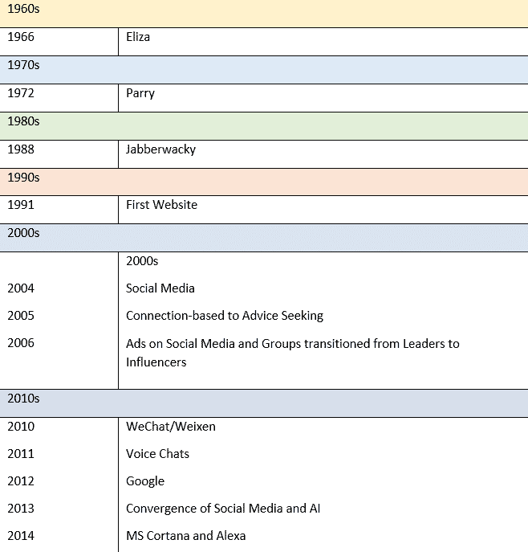

# 2 从伦理学到人工智能伦理

如果不理解技术本身及其带来的历史——算法、创新和伦理——那么就难以理解人工智能伦理的重要性。在本章中，我们将探讨人工智能如何成为今天流行的生成式人工智能，以及它被部署的环境。在这里，我们的目标是为您提供历史背景和对今天技术的坚实基础理解。在本章中，我们将涵盖以下主要主题：

+   追溯早期技术的演变：开发算法

+   利用早期算法进行创新：从聊天机器人到社交媒体

+   揭示游戏中的伦理问题

+   发现新的转折点：生成式人工智能

+   在生成式人工智能、社交媒体和游戏时代重申对伦理的呼吁

## 追溯早期技术的演变：开发算法

可能会诱使人们认为生成式人工智能或社交媒体这样的转折点是人工智能的诞生或开始。然而，人工智能并非突然出现，也并非行业人士或那些掌握技术创新脉搏的人所预料。相反，我们的最早技术为今天我们所享受的创新铺平了道路。在人工智能能够被认真探索之前，需要硬件、存储、能力——以及算法的激进进步。技术时代真正开始于 1900 年左右。它之所以引人注目，是因为世纪之交之后出现了大规模的创新。虽然先前的时代允许我们创造工具、电力和理解，但 20 世纪的技术创新使我们的现代世界成为可能。

> 人工智能历史上的女性
> 
> > 作为一本关于伦理人工智能的书，由于女性在该领域缺乏代表性，因此在叙事中强调了她们。在这个文本中消除她们，就是继续忽视她们有意义的贡献（*进一步阅读*，*资源 1 和 2*）。

在 1900 年至 1945 年之间的几十年里，**计算机**仅仅是人们使用表格、微分分析仪和其他详细信息（数据）进行手动计算的工具。在两次世界大战期间，（人工）计算机被用来提供炮弹的路径和轨迹，协助军事实现其目标。满足世界大战期间军事的迫切需求需要创新这一计算过程。当联邦倡议必须迅速推进时，他们通常会转向高等教育和前瞻性部门，那里的工作已经展开。向机构的管理层呼吁，是为了联邦资金和推进可以归功于机构的工作。这通常为政府确保了额外的资金或未来的项目。宾夕法尼亚大学的摩尔工程学院（Moore School of Engineering）已经建立了一台**机械计算机**，可以在几分钟内解决问题——而不是几个月。其资金来自联邦政府的罗斯福新政。1946 年，在原子弹投下后仅一年，第一台数字通用计算机被推出——ENIAC（电子数值积分器和计算机）。所创造的是一台能够完成人类计算机无法完成或耗时太长的任务，并且比机械计算机更快的计算机。相比之下，这台**新计算机**能够每秒完成数千次加法运算，使用的是在摩尔电气工程学院工作的女性设计的**算法**。它也是一个联邦资助的项目。通过使用算法，ENIAC 的遗产贡献是*整个计算机化世界*以及由此产生的所有技术（E，2021）。由于 ENIAC，从聊天机器人到生成式 AI 的一切都成为可能。它是一个转折点，自那以后彻底改变了我们的世界。

> 战争与大型科学
> 
> > “战争因此加速了从‘小科学’，即研究仍主要局限于少数孤立科学家的规模较小的努力，到‘大科学’的转变，‘大科学’强调由政府和公司赞助的大型研究团队集体从事新技术的发展和应用的转变”（技术史 | 进化、时代与事实 | 百科全书，2023）

应该提到，这个过程并非没有伦理挑战。如果伦理学家被询问，肯定会有关于这个过程以及协助开发武器的问题。还会有人质疑战争是否公正，以及参与这场不公正战争的人是否行为不道德。比例、伤害、苦难、正义原因、战争中的公平性以及许多其他问题也会受到质疑。但也有一些社会问题同样需要考虑。这个时代的巨大挑战与关于隔离、歧视和民权的问题有关。在另一个国家为不公平待遇而战，而自己却生活在不平等之中，这种不公平的讽刺不仅深刻，而且是一个伦理问题。这个问题后来通过民权运动得到了回应。在大萧条后的新政时期，美国的政治环境也会对机构施加压力，如果被要求这样做，则应协助政府。此外，摩尔学院为机械计算机获得的资金可能对帮助军事的决定施加了压力。如果是这种情况，那么我们必须考虑这究竟是一个选择，还是不是。如果这是一个操纵的选择，那么我们可能不会对由此导致的伤害或死亡负责。另一个需要考虑的因素是战争是否不道德，或者为了提高杀戮的效率而接受金钱是否道德。这些问题根植于哲学中的正义战争理论。迄今为止，普遍的观点是，没有正义的战争。（*进一步阅读*，*资源 3*）然而，该机构可能认为赢得战争是结束战争的唯一途径，或者认为他们的学生应该得到资助。如果有高尚的理由，我们可能会原谅他们的选择。但那时我们还得确定什么使一个选择变得高尚。我们当然应该对这些情况提出更多的问题，同时挑战现状，这可能不符合我们希望实现的目的。这次对话也提醒我们，错过做伦理或质疑选择和决策的机会是有后果的。虽然没有人能确切地说为什么宾夕法尼亚大学选择在这个例子中与军方合作，但我们知道，他们这样做实际上改变了我们的世界。现在我们将讨论一个创新接着一个创新是如何导致我们今天所处的社交媒体和聊天机器人时代的。我们还将讨论导致这个时代的伦理考量。

## 利用早期算法进行创新：从聊天机器人到社交媒体

我们现在将讨论推动聊天机器人和社交媒体发展的算法的历史发展时间线以及与之相关的伦理考量（*表 2.1*）。我们的时间线将延伸至 2010 年；我们将在未来的章节中探讨更多当代的创新及其挑战。目前，我们需要一个起点。

表 2.1 – 聊天机器人和社交媒体发展进步的时间线

在 ENIAC 问世二十年后，第一个**聊天机器人**ELIZA（1966 年）被开发出来。虽然它通过模式匹配和替换与用户进行对话，但也使用了脚本预测答案。PARRY（1972 年）被开发出来模仿精神分裂症患者，并试图模拟疾病的效果。PARRY 不是使用脚本，而是使用加权度量，并纳入“假设、归因和情感反应”来确定如何对提示做出回应（Ina，2017 年）。当与图灵测试相比时，该程序提供的准确率优于随机水平。后来，Jabberwacky（1998 年）被开发出来；它旨在使用“上下文模式匹配”来模拟人类对话（Ina，2017 年）。在 1991 年至 2010 年之间，Sbaitso 博士（Sound Blaster Artificial Intelligent Text to Speech Operator，1992 年）、ALICE（1995 年）和 SmarterChild（2001 年）通过其在理解和处理语音及文本交互方面的先进能力，为个人助理的发展铺平了道路。1991 年之后的聊天机器人开发与社会媒体的演变重叠，因此关于聊天机器人历史的讨论将在介绍社交媒体之后继续。然而，在 20 世纪 90 年代之前，世界主要是模拟的（物理的），人们通过面对面交流分享信息。照片和投币电话是常态。台式计算机是独立的系统，无法与其他计算机或用户共享信息。然而，“1991 年 8 月 6 日，在没有喧哗的情况下，英国计算机科学家蒂姆·伯纳斯-李在大型粒子物理实验室 CERN 工作期间发布了第一个网站（Nix，2016 年）。”这允许人们通过技术进行信息共享，社交媒体竞赛由此开始。第一个**社交媒体网站**Six Degrees（1997 年）允许用户通过他们创建和共享的资料与别人建立联系。**社交网络**如 Myspace 随后出现，到 2004 年用户数量达到 100 万（[`ourworldindata.org/rise-of-social-media`](https://ourworldindata.org/rise-of-social-media)）。从 2004 年开始，我们看到了社交媒体通过 Facebook、Reddit、YouTube 以及其他所有快速想到的**社交媒体平台**（LinkedIn、Snap、TikTok 等）的演变而变得流行。尽管如此，Facebook 标志着个人社交网络成为我们今天所理解的**社交媒体**的时间点。然而，最重大的社交媒体创新即将到来。人们推动了社交媒体活动，探索用户的相似想法、观点和主题，最终建立了用于进一步探索的团体。领导者和组织者成为这些团体中交换这些想法的领军人物。很快，领导者成为内容创造者和领域专家，用户向他们寻求建议。大约在 2005 年，开发者注意到了这种从基于连接的互动转向寻求建议的转变，并创建了以分享建议为中心的整个平台，如 Reddit。到 2006 年，团体和领导者的力量导致了社交媒体上广告的加入，通过领导者的推荐来产生收入，他们现在变成了影响者。到 2010 年，即社交媒体在 2004 年出现后的六年，微信/Weixen 开发了一个允许用户互相发送消息的平台。虽然微信的成功令人印象深刻，被视为 Facebook 的强劲对手，但其伟大成就是允许用户向其他用户发送私密消息。这种对话技术的使用至今仍在不断发展。然而，这并不是社交媒体遗产的终结。在 2010 年，微信首次发布的那一年，与聊天机器人相关的另一项创新发生了。使用人工智能的**对话式聊天机器人**，如苹果的 SIRI，于 2011 年推出，现在可以借助语音识别*理解*自然语言（我们说话的方式）。现在可以通过简单的“嘿，Siri”来理解和执行**自然语言**。当然，谷歌（2012 年，Google Now/Google Assistant）、微软（Cortana，2014 年）和亚马逊（Alexa，2014 年）随后跟进，成为 SIRI 的竞争对手。到 2014 年，人工智能竞赛已成为主流，寻找其用途的竞赛至今仍在继续。毫不奇怪，随着具有人工智能能力的聊天机器人的演变，社交媒体仍然繁荣。在 2013 年，人工智能和社交媒体在创新的最佳机会中融合。根据皮尤研究中心的数据，2013 年 5 月，72%的成年在线用户正在使用社交媒体（Smith，2013 年）([`www.pewresearch.org/internet/2013/08/05/72-of-online-adults-are-social-networking-site-users/#:~:text=As%20of%20May%202013%2C%20almost`](https://www.pewresearch.org/internet/2013/08/05/72-of-online-adults-are-social-networking-site-users/#:~:text=As%20of%20May%202013%2C%20almost))。当时，技术已经允许通过直接消息进行互动，产生了大量数据和信息的宝库，而人工智能现在能够将这些数据过滤成可用的见解。尽管影响者的推荐仍然有影响力，但社交媒体平台现在可以通过用户在网站上的活动、广告、产品推荐和想法来了解用户的兴趣，这些想法和产品可以轻松地与适当的市场共享。专家和领导者不再需要展示想法或产品。相反，在社交媒体网站上运行的 AI（算法）可以推荐想法、产品和服务——甚至建议新的思想领袖和内容创作者。在技术发展的当时，人们非常重视技术的功能。新事物总是看起来很耀眼，有很大的吸引力。但这并不是说道德担忧不存在。但担忧更多地是关于寻找有用的联系而不是有害的联系，避免“跟踪狂和怪人”，以及通过电子邮件和消息始终保持可访问性的挑战。很少有人注意到从选择可信的声音到算法在过程中产生影响的转变。更少的人意识到人工智能在聊天机器人中发挥作用，直到对话出现偏差。虽然没有明确指出，但到目前为止，我们的关注点一直是能够较好地应对社交媒体在线挑战的成年用户。然而，这种对技术和其危害的随意看法不仅限于成年人。孩子们也没有被落下。相反，他们与技术的联系：进入青少年游戏玩家的兴起和正式对伦理的呼吁。现在让我们将重点转向游戏及其相关的伦理问题。

## 揭示游戏中的伦理问题

随着社交媒体和算法的使用，另一种技术（也使用算法）导致了对考虑技术伦理的早期呼吁。“乒乓”（一种乒乓球数字版本）是一款流行的街机游戏，它在 1972 年吸引了公众的注意。然而，到 20 世纪 70 年代初，Magnavox 的 Odyssey 游戏机通过其版本的“乒乓球”将街机游戏带入了家庭。到 1975 年，Atari 普及了“家庭乒乓”，到 1977 年，游戏机引入了摇杆、卡带和彩色——并开始了创造可在计算机上玩的游戏的竞赛。随之而来的是一代（X 世代——1965-1980）的计算机和电子游戏玩家，他们预示并适应了随后出现的每一个创新。

> 让游戏开始吧
> 
> > 1982 年《时代》杂志的封面大声疾呼“GRONK！FLASH！ZAP！电子游戏正在席卷世界！”如果你那年打开收音机，你可能会听到“Pac-Man Fever”，这是巴克纳和加西亚的一首流行歌曲。孩子们恳求他们的父母在圣诞节时给他们买一台雅达利，或者给他们一些硬币投入“Pac-Man”的投币口。好莱坞电影如《瑞德蒙特的疯狂时光》将电子游戏厅描绘成典型的青少年聚集地。（杂志，2017）

对于那些记得那些早年的人来说，玩游戏和成为游戏最佳玩家的冲动是强烈的（尤其是与朋友相比）。这导致了持续对更复杂游戏、游戏路径、角色和选项的需求，这些选项超出了 A/B 选择。这些更复杂游戏需要更复杂的算法，从 Magnavox 到 PlayStation（以及其他所有公司）的游戏开发者没有辜负期望，同时获得了更多忠诚（痴迷）的用户。随着电子游戏的发展，20 世纪 80 年代也带来了人们对人们痴迷行为的担忧——特别是美国里根总统政府推广的“毒品战争”。虽然不是立即明显，但关于成瘾的担忧随着社交媒体和电子游戏的使用而成为主流。从早期对赌博成瘾的担忧到行为上的担忧，孩子们被“吸进游戏”并发生变化的恐慌成为了一个持续的讨论。1994 年，**娱乐软件评级委员会**（**ESRB**）在美国建立了一个自愿评级系统。

> 达成了一项妥协
> 
> > …在咨询了广泛的儿童发展和学术专家、分析了其他评级系统以及与全国范围内的家长进行全国性研究后，ESRB 发现家长们希望有一个既包含基于年龄的分类，又包含关于内容的简洁且公正信息的评级系统。本着这一理念，今天 ESRB 管理着一个包含评级类别、内容描述和交互元素的三个部分系统。（杂志，2017）

视频游戏中的下一个重大创新是**互联网协议语音**（**VoIP**），这项技术允许一个人的声音从一个 IP 地址传输到另一个 IP 地址。到 1995 年，视频游戏中的聊天功能已经建立。早期的使用归功于**Activision**，一家视频游戏发行商，尽管由于与控制器的集成不足，限制了其普及度。当世嘉在 1999 年将其集成到 Dreamcast 中时，游戏中的语音使用得到了广泛的应用，允许用户通过浏览器进行聊天。随着视频游戏的日益流行，关于游戏危害的担忧在家庭和学校中持续存在，并且有了评级制度，游戏可以包含任何内容，父母负责监督青少年玩的游戏。然而，1999 年 4 月 20 日美国发生的科伦宾校园枪击案（造成 15 人死亡，24 人受伤）使得这些担忧得到了广泛的认可，当时两名学生似乎在重新模拟《毁灭战士》中的场景。家用游戏机只有 25 年的历史，比枪手们只大几岁。对枪击事件的调查似乎揭示了人们对视频游戏对青少年影响的认识：西蒙·维森塔尔中心，一个追踪互联网仇恨组织的机构，上周在其档案中发现了一份哈里斯的网站副本，其中包含了他定制的血腥射击游戏《毁灭战士》版本。在哈里斯的版本中，有两个枪手，每个枪手都有额外的武器和无限的弹药，他们遇到的人无法反击。据与维森塔尔中心合作的互联网调查员说，哈里斯和克莱博德在 4 月 20 日进入科伦宾时，“他们就像在上帝模式中玩游戏一样”（Pooley/Littleton，1999）。他说：“他们所做的事情不是关于愤怒或仇恨，”。“这只是他们活在当下，就像他们身处一个视频游戏中。”布朗认为，只要他们按照计划行事，屠杀对他们来说就不像真的。但这种解释过于轻易地赦免了杀手：“受伤和垂死的人的肉体对他们来说真的不如视频显示器上的像素真实吗？”布朗认为是这样的。“然后他们无法从图书馆中逃脱，他们经历了一刻深深的悔恨，”他推测。“或者也许一个人做到了，而另一个人仍然迷失在游戏中”（杂志，2017）。到 2005 年，这种暴力和校园枪击事件已经进入白人郊区的中产阶级意识中，并在普通人和政治家中间引发了**道德恐慌**。

> 道德恐慌
> 
> > 当一个群体或一群人的行为被认为威胁到社会的利益时，就会发生道德恐慌。媒体经常通过夸大社会问题和危害来推动这些恐慌，从而在社会中引发恐惧（*进一步阅读*，*资源 4*）。

作为对恐慌的明显回应，在美国，当时的参议员希拉里·克林顿与民主党同仁一起提出了《家庭娱乐保护法案》，该法案旨在对向未成年人出售 M 级游戏的个人处以罚款，并使 ESRB 评级成为强制性的（Ferguson，2017）。其目的是限制最暴力的游戏或内容最令人不安的游戏触及青少年。该法案从未走出委员会（*进一步阅读*，*资源 6、7 和 8*）。在同年 2005 年，加利福尼亚州科技博物馆的创新展览“Game On”包括了关于电子游戏的伦理问题，这些问题是由圣克拉拉大学的 Makkula 应用伦理中心根据伦理理论（包括功利主义和美德伦理等）组织的（*进一步阅读*，*资源 5*）（大学，不详）。他们的伦理问题包括以下内容（直接摘自 Makkula）：

+   **从功利主义角度来看** - 一些玩家和开发者认为，电子游戏在教授逻辑和解决问题的技能方面比许多学校课程更有效。不可否认的是，电子游戏给玩家带来了快乐。我们将如何权衡这些好处与游戏被归因于的潜在危害，例如上瘾、性别刻板印象和暴力宣传？

+   **从权利角度来看[包含在效用之下]** - 电子游戏是否是一种言论形式，如果是的话，它们是否受到言论自由权的保护？如果这种“言论”贬低女性，或者导致暴力，我们是否应该尝试对其进行监管？我们如何保护成年人有权选择他们想要听到的任何形式的言论，同时保护儿童免受其影响，尤其是当游戏对孩子们来说如此受欢迎时？向儿童出售包含成人内容的游戏是否应该成为犯罪？内容是否应该受到监管？

+   **从公平角度来看** - 目前，电子游戏几乎完全吸引男性玩家。只有 7-8%的电子游戏开发者是女性。女性是否被排除在外？这是否是一个问题？在某些电子游戏中，唯一的女性角色是妓女，而且游戏有时会鼓励杀死她们。这如何塑造玩家对女性的看法？探索游戏如何描绘男性，这是否是一种刻板印象？

+   **公共利益视角** - 电子游戏对社区有什么影响？在什么时间点——每周五小时？每周 25 小时？——游戏会干扰人们对其家庭和社区的义务？游戏是一种反社会活动，还是它使玩家参与了一种不同类型的社区？真正的社区可以在网上存在吗？游戏开发者是否有义务使在线体验不那么容易上瘾？

+   **美德视角** - 理解到一天只有 24 小时，你应该如何分配时间给视频游戏，这会造就怎样的人？阅读与玩视频游戏相比，有什么固有的美德？内容的不同又有什么影响？玩暴力视频游戏会让你变得暴力吗？玩暴力游戏会让你对暴力变得麻木吗？假设暴力不会影响你，但你了解到对于玩视频游戏的人群中的一部分人来说，所有的血腥场面都激发出了暴力倾向——是否应该限制他们接触游戏，以及如何限制？应该允许小孩子玩暴力游戏吗？（大学，不详）

但对话并未结束，2006 年，由于联邦层面的努力未能成功，各州决定解决视频游戏内容的问题。最终的决战将涉及加利福尼亚州通过一项法律，禁止向 18 岁以下的人销售暴力视频游戏（以色情限制为依据）。一旦该法律通过，就有人提起诉讼以推翻它，导致上诉，最终由美国最高法院做出裁决。保护儿童的故事即将走向一个可预测且令人不安的转折点。2011 年，在提起上诉后，该案件上诉至美国最高法院。在布朗诉娱乐商品协会与娱乐软件协会案中，他们裁定视频游戏的暴力（以及其他令人不安的内容）与艺术、语言和其他创意领域的并无不同。这赋予了视频游戏与那些绘制裸体画或使用粗俗语言和令人不适主题的音乐艺术家相同的保护。由开发者创作的视频游戏内容现在受到第一修正案的保护——但儿童却完全没有受到保护。从那时起，主要的主题一直是“一切皆可”，开发者们和媒体全力以赴地采用“震撼与敬畏”（一个军事术语，指的是突然使用压倒性的力量）——毫无阻碍。结果是，暴力和不令人安的内容渗透到了所有社交渠道——包括社交媒体、聊天、私信等。枪击、自杀、直播暴力、性骚扰、刻板印象、偏见、种族主义、仇恨，以及更糟糕的是，这些内容在网上都有安全的避风港。科技公司也继续严重依赖第一修正案的保护来防御缺乏内容监管，暗示只有父母才是最适合代表孩子进行干预的人。其中最大的挑战之一是，一旦在线上造成伤害，就会扩散到其他人和地方，使其他人有勇气发布和分享相同的内容。到 2020 年代，网络暴力和伤害已成为一个全球性问题。尽管全球对此表示关注，但调节或通过（并执行）针对它的法律已被证明是具有挑战性的，并且基本上是徒劳的。当然，如果伤害仅限于未成年人，那么父母处理内容监管的观点是合理的。在讨论这一点是否成立之前，我们必须讨论 AI 向公众的引入。

## 发现一个新的转折点：生成式 AI

在这一点上，我们已经讨论了算法的发展以及嵌入它们的各种技术。算法已经彻底改变了我们的世界，从社交媒体到聊天机器人再到视频游戏。但是，如果不讨论最近使用算法的最新创新——不到一年的创新，那么技术讨论就不完整。Open AI，一家曾经的开源技术公司，发布了一个经过多年努力的项目——ChatGPT——以公开测试的形式进行测试。幸运的是，对于 Open AI 来说，公众被深深吸引，就像 80 年代的青少年和他们的视频游戏一样。有趣的是，很少有人意识到 ChatGPT-3 只是一个测试版，忽视了最新创新的困难和挑战。但为什么这项创新如此令人兴奋呢？ChatGPT 是一种**生成式 AI**，可以从自然语言（像我们这样的语言）中创建图像、音频和文本。这项技术使得没有计算机编程能力的人也能使用 AI 来创建电子邮件、提问、接收答案，甚至通过简单的提示和背景信息撰写简历和求职信。而且生成式技术不仅限于写作，现在只需要一个提示就可以生成图像、音频、视频和其他模态。技术的新时代已经到来，用户急于开始探索生成式 AI 如何帮助他们工作。随着生成式 AI 的快速增长，反馈巨大，并且确实指出了重大问题——与社交媒体中发现的相同类型的问题。这是因为当 Chat 开发时，它的训练集来自社交媒体网站。毕竟，任务是让技术“说话”像我们一样。因此，为了使 ChatGPT 学会说话，它需要在对话中进行训练，而可用的对话是在网上发生的。这些可以在公开帖子、评论、论坛或任何允许访问其数据的公共论坛中轻松找到。这意味着训练集使用了社交媒体帖子（如推特（现在称为 X）和 Reddit 上的帖子）作为训练材料。因此，Chat 从社交内容中学习对话说话和上下文，这长期以来一直是全球关注的问题。ChatGPT 的流行推动了各种生成式 AI 的创新和兴趣。现在可以完成的任务包括（但不限于）从文字生成图像、模拟声音和创建深度伪造，这些任务简单、成本低廉且易于操作。然而，每个任务都包含了与社交媒体相同的有问题的观点、内容和信息，并且它们使用了来自同一网站和公司的训练集。尽管如此，公众的兴趣仍然存在，对这项技术的需求从开源 AI 转向了闭源，从测试版到投资（由微软投资 10 亿美元）仅在几个月内。尽管 ChatGPT 和 OpenAI 突然且短暂地进入公众视野，但已经巨大的伦理挑战因扩散而大幅增加。Makkula 中心在 2005 年提出的问题至今仍然相关。现在，让我们通过 AI 的视角回顾这些问题，以确定我们在后续章节中必须解决的问题。

## 在生成式人工智能、社交媒体和游戏时代重申对伦理的呼吁

正如本章“揭示游戏中的伦理问题”部分所指出的，对技术伦理的呼吁始于对电子游戏和街机的担忧，通过科伦宾大屠杀继续，并在 2005 年由 Makkula 完全阐述。自 Makkula 阐述了几代人的担忧以来已经过去了 18 年，然而直到今天，在解决这些问题上几乎没有取得任何进展。事实上，在 2023 年 10 月，Meta（Facebook）因担心其平台被设计成具有上瘾性，同时让儿童和其他人接触有害内容而被美国 40 多个州起诉（Levinson，2023）。同样，生成式人工智能技术包含偏见、刻板印象、性别挑战、幻觉（虚构信息）、虚假信息、暴力和影响选择的能力。这是使用预测技术和大数据集的直接结果，这些技术允许对单个问题有多个可能的答案，并包括人类偏见的模式和对危害的倾向。然而，法官们正在他们的法庭上使用它来做出有关判决的决定，一位律师用它提交了一份包含幻觉引用案例的法庭简报。企业已经将内容发布给公众和他们的竞争对手，隐私政策正在修订，以获取用于训练或出售给他人以推进这项技术的用户数据。尽管存在担忧和对公众生活轨迹的影响，政府和企业仍在使用这项技术。然而，这些担忧是熟悉的，并且针对的是技术（电子游戏、社交媒体、聊天机器人和人工智能）。这些困扰当今技术的担忧与之前版本的技术如此相似，以至于只需将“电子游戏”一词换成“人工智能”，Makkula 在 2005 年的问题及其原始担忧仍然存在。为了阐明这一点，让我们看看 Makkula 在 2005 年的原始措辞和针对人工智能在*表 2.2*中更新的版本：

| **那时** | **现在** |  |
| --- | --- | --- |
| **从功利主义的角度来看** | 一些玩家和开发者认为，与许多学校课程相比，电子游戏在教授逻辑和解决问题的技能方面做得更好。不可否认，电子游戏给玩家带来了快乐。我们如何权衡这些好处与游戏被归因于的潜在危害，例如上瘾、性别刻板印象和暴力推广？ | 一些 *用户* 认为 *技术（包括人工智能）* 在教授逻辑和解决问题的技能方面比许多学校课程做得更好。但是，我们如何权衡这些好处与被归因于 *技术* 的潜在危害，例如上瘾、性别刻板印象、暴力推广和伤害？ |
| **从权利的角度来看** [包含在效用之下] | 电子游戏是否是一种言论形式，如果是的话，它们是否受到言论自由权的保护？如果这种“言论”贬低女性，我们应该尝试对其进行监管吗？如果它导致暴力，我们应该怎么办？我们如何保护成年人能够接触到他们选择的任何形式的言论，同时保护儿童免受暴露，尤其是在游戏对孩子们来说如此受欢迎的情况下？向儿童出售包含成人内容的游戏是否应该成为犯罪？内容应该受到监管吗？ | *技术*是否是一种言论形式，如果是的话，它们是否受到言论自由权的保护？如果这种“言论”贬低女性，我们应该尝试对其进行监管吗？如果它导致暴力，我们应该怎么办？我们如何保护成年人能够接触到他们选择的任何形式的言论，同时保护儿童免受暴露，尤其是在*AI 嵌入到技术中*，并且它对孩子们来说如此受欢迎的情况下？ |
| **从公平的角度来看** | 目前，电子游戏主要吸引男性玩家。只有 7-8%的电子游戏开发者是女性。女性是否被排除在外？这是一个问题吗？在一些电子游戏中，唯一的女性角色是妓女，而且游戏有时会鼓励玩家杀死她们。这如何影响玩家对女性的看法？探险游戏如何描绘男性，这是否是一种刻板印象？ | 只有*6-12%的开发者和 AI 研究人员*是女性（Mebourne，2023）。女性是否被排除在外？这是一个问题吗？在技术领域，*女性*往往被*低估或伤害*。在现代游戏中，女性角色被*性感化*，而且游戏有时会鼓励玩家杀死她们。这如何影响用户对女性的看法？ |
| **公共利益视角** | 电子游戏对社区有什么影响？在每周五小时、每周 25 小时的时候，游戏是否会干扰人们对家庭和社区的义务？游戏是一种反社会活动，还是它让玩家参与到了不同类型的社区？真正的社区可以在网上存在吗？游戏开发者有义务使在线体验不那么上瘾吗？ | *技术*的使用是否会干扰人们对家庭和社区的义务？*技术*的使用是一种社交活动，还是它让玩家参与到了不同类型的社区？真正的社区可以在网上存在吗？开发者有义务使在线体验不那么上瘾吗？ |
| **美德视角** | 了解一天只有 24 小时，你应该用多少时间来玩游戏，这将使你成为什么样的人？阅读与玩游戏相比，有什么固有的美德？内容有什么区别？玩暴力游戏会使你变得暴力吗？玩暴力游戏会使你对暴力变得麻木吗？假设暴力不会影响你，但你知道对于玩游戏的某些群体来说，所有的血腥场面都会引发暴力倾向——他们的游戏访问应该受到限制，如何限制？应该允许年幼的孩子玩暴力游戏吗？ | 与使用技术相比，阅读有什么固有的美德？内容有什么区别？使用暴力技术会使你（或某些人）对暴力和伤害变得麻木吗？应该允许有害技术影响人们吗？ |

表 2.2 – 那时和现在的伦理问题

> 表 2.2 的适用范围
> 
> > 此表更新了 Makkula 在 2005 年提出的疑问。关于偏见、版权侵权、未经许可在专有数据上训练以及许多其他当前危害的额外问题将在未来的章节中解决。

在这些陈述中，视频游戏被用来代表技术，因为实际上所有技术都包含相同的挑战。有一个重要的区别：AI 的规模和速度使得这些危害在几秒钟内传播到全球。这些能力不仅带来了技术的益处，还带来了持续伴随我们每一次进步的危害。有害的评论、声明、偏见、威胁以及更严重的事情可以在几秒钟内传播到全球：黑客和那些寻求破坏或挑战发展的人。创新带来了技术的益处和潜在的伤害。它们是技术硬币的两面。在 AI 时代，所列出的担忧可以也应该扩展到远超过这里所展示的内容。那将是另一章的内容，现在，最重要的是要注意，我们正在重新审视社会已经意识到超过 40 年的担忧。

## 摘要

在这一点上，可以说，人工智能只是众多携带我们社会固有危害的技术之一。虽然我们发展了技术，但自从其早期出现以来，我们的行为、评论和信仰变化不大。虽然我们变得更加复杂，但我们仍然缺乏对他人的基本关怀和他们的困境。简而言之，我们已经对伦理学家的呼吁和以我们忽视的态度对待我们家人、邻居、朋友和同事的命运的行为变得免疫。不幸的是，选择将伦理留给未来的创新（或下一代）的做法，在未来到来时并没有显示出任何这样的倾向去做。在下一章中，我们将讨论为什么有意义地实施伦理似乎是不可能的。

## 进一步阅读

以下资源已提供，以帮助您探索本章的内容。

1.  [`www.womentech.net/en-us/women-technology-statistics`](https://www.womentech.net/en-us/women-technology-statistics)

1.  [`www.globalapptesting.com/blog/the-women-who-changed-the-tech-world`](https://www.globalapptesting.com/blog/the-women-who-changed-the-tech-world)

1.  [`opiniojuris.org/2022/06/27/just-war-theory-the-only-winner-across-four-grim-conflicts/`](https://opiniojuris.org/2022/06/27/just-war-theory-the-only-winner-across-four-grim-conflicts/)

1.  [`daily.jstor.org/moral-panics-a-syllabus/`](https://daily.jstor.org/moral-panics-a-syllabus/)

1.  [`www.scu.edu/ethics/`](https://www.scu.edu/ethics/)

1.  [`www.congress.gov/bill/109th-congress/senate-bill/2126`](https://www.congress.gov/bill/109th-congress/senate-bill/2126)

1.  [`www.visitthecapitol.gov/sites/default/files/documents/resources-and-activities/CVC_HS_ActivitySheets_Committees.pdf`](https://www.visitthecapitol.gov/sites/default/files/documents/resources-and-activities/CVC_HS_ActivitySheets_Committees.pdf)

1.  [`www.washingtonpost.com/wp-dyn/content/article/2005/12/16/AR2005121601883.html?itid=lk_inline_manual_5`](https://www.washingtonpost.com/wp-dyn/content/article/2005/12/16/AR2005121601883.html?itid=lk_inline_manual_5)

## 参考文献

+   E, B. (2021, 11 月 2 日). *《宾夕法尼亚今日》*. 2023 年 10 月 18 日检索。检索自 [`penntoday.upenn.edu/news/worlds-first-general-purpose-computer-turns-75`](https://penntoday.upenn.edu/news/worlds-first-general-purpose-computer-turns-75)

+   Ferguson, P. M. (2017). *《教我们害怕暴力电子游戏：道德恐慌与游戏研究的政治》*. 检索自 [`files.eric.ed.gov/fulltext/EJ1166785.pdf`](https://files.eric.ed.gov/fulltext/EJ1166785.pdf)

+   *《技术史 | 发展、时代与事实 | 百科全书》*. (2023 年 11 月 10 日). 2023 年 12 月 8 日检索，来自 britannica.com: *https://www.britannica.com/technology/history-of-technology/The-20th-and-21st-cen* (最后访问日期：2023 年 12 月 30 日).

+   伊娜. (2017 年 10 月 12 日). *Onlim 的聊天机器人和语音助手*。2023 年 12 月 10 日检索自 [`onlim.com/en/the-history-of-chatbots/`](https://onlim.com/en/the-history-of-chatbots/)

+   列文森，J. (2023 年 10 月 27 日). *观点 | 各州起诉 Meta，因为其社交媒体平台对青少年有害*。（MSNBC.com）2023 年 12 月 12 日检索自 [`www.msnbc.com/opinion/msnbc-opinion/meta-faces-lawsuit-facebook-instagram-rcna122136`](https://www.msnbc.com/opinion/msnbc-opinion/meta-faces-lawsuit-facebook-instagram-rcna122136)

+   杂志，S. (2017 年 5 月 25 日). *80 后孩子不必害怕：电子游戏并没有毁掉你的生活*。（史密森尼杂志）2023 年 12 月 12 日检索自 [`www.smithsonianmag.com/history/children-80s-never-fear-video-games-did-not-ruin-your-life-180963452/#:~:text=The%20popularity%20of%20video%20games`](https://www.smithsonianmag.com/history/children-80s-never-fear-video-games-did-not-ruin-your-life-180963452/#:~:text=The%20popularity%20of%20video%20games)

+   梅尔本，A. P. (2023 年 3 月 7 日). *将智慧融入人工智能的女性*。（追求）2023 年 12 月 12 日检索自 [`pursuit.unimelb.edu.au/articles/the-women-putting-intelligence-in-artificial-intelligence#:~:text=It%20found%20that%20only%2012`](https://pursuit.unimelb.edu.au/articles/the-women-putting-intelligence-in-artificial-intelligence#:~:text=It%20found%20that%20only%2012)

+   尼克斯，E. (2016 年 8 月 4 日). *世界上第一个网站*。（历史）2023 年 12 月 10 日检索自 [`www.history.com/news/the-worlds-first-web-site`](https://www.history.com/news/the-worlds-first-web-site)

+   波利/利特尔顿，E. (1999 年 5 月 2 日). *致命纽带画像*。（时代）2023 年 12 月 9 日检索自 [`content.time.com/time/magazine/article/0,9171,23916-4,00.html`](https://content.time.com/time/magazine/article/0,9171,23916-4,00.html)

+   史密斯，J. B. (2013 年 8 月 5 日). *72%的在线成年人使用社交网络平台*。（皮尤研究中心：互联网、科学与技术）2023 年 12 月 7 日检索自 [`www.pewresearch.org/internet/2013/08/05/72-of-online-adults-are-social-networking-site-users/#:~:text=As%20of%20May%202013%2C%20almost`](https://www.pewresearch.org/internet/2013/08/05/72-of-online-adults-are-social-networking-site-users/#:~:text=As%20of%20May%202013%2C%20almost)

+   大学，S. C. （未注明日期）。*关于视频游戏的不可避免伦理问题*。（圣克拉拉大学）检索自 [`www.scu.edu/ethics/focus-areas/internet-ethics/resources/unavoidable-ethical-questions-about-video-gaming/`](https://www.scu.edu/ethics/focus-areas/internet-ethics/resources/unavoidable-ethical-questions-about-video-gaming/)
