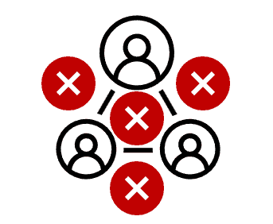
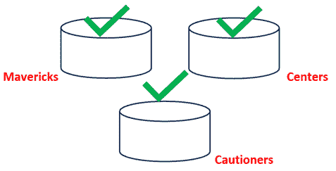

# 3 进行伦理学研究：克服反对意见

现在我们已经了解了我们在与技术的关系中是如何走到**这里**的，我们必须决定接下来要做什么。不幸的是，开始行动是进行伦理学研究的最具挑战性的部分之一。而且有许多理由可以用来避免这项工作。然而，一旦更好地理解并充分解释了这些**反对意见**，前进的障碍就不再是不可逾越的。这正是本章的目的，也是我们未来工作的基础。本章旨在解决进行伦理学研究的许多反对意见。它还将解释这项工作为什么困难，为什么可能诱人回避，以及我们如何找到克服问题开始进行“进行伦理学研究”的方法。在本章中，我们将涵盖以下主要主题和反对意见：

+   克服进行伦理学研究的反对意见

+   在冲突的观点和优先事项中找到共性

+   在建议和指导中找到实用性

+   克服伦理学中的完美和理想理论

+   挑战框架

+   进行伦理学研究

## 克服进行伦理学研究的反对意见

在哲学中，**克服异议**意味着首先针对一个观点或立场提出的主要批评进行回应。在这个例子中，论点是我们必须做重要的伦理工作。现在，克服对该观点的异议的过程可以开始了。首先，我们必须确定反对做伦理的理由，并尽我们所能去理解它们。为了做到这一点，我们必须将异议视为有价值和有效的，并以慷慨的态度看待它，这意味着要怀着开放的心态去倾听，考虑到在回应之前我们可能已经犯了一个错误，并且要真心实意地认为对方可能是正确的。只有这样，我们才能着手构建回应。回应通常包括在尊重异议和异议者的情况下，增加细微差别、澄清、细节或缺失的事实。这个过程的好处是它有助于加强原始论点，并使其更能经受住批评。通常，这发生在那些不同意的人之间的来回对话中。然而，当它以书面形式出现时，批评往往发生在审查期间甚至出版之后。记住，只关注少数异议意味着其他异议可能被忽略，这会让不同意你的人转向新想法来维持他们的立场。这意味着将有新的异议需要克服。因此，克服异议的过程是迭代的。关于克服异议的最后一点必须提到的是，这个过程最关键的部分是真诚地考虑你的观点可能是错误的——而不是他们的。这就是为什么从慷慨和开放的心态来看待对立的论点是至关重要的。只有完全理解他们的论点并探索其优势，你才能理解你如何向他们解释为什么你的观点更加强大。你不能反对你不理解或没有充分探索的东西。一旦你理解了对立的一方，你就可以确定你将采取什么立场，并更好地理解如何捍卫它。我们首先将讨论如何在冲突的观念中找到一个交集，并优先考虑伦理。

## 在伦理学中寻找冲突观念和优先事项中的共性

当讨论伦理学时，首先遇到的挑战之一是伦理概念、思想和优先事项之间缺乏共性。例如，信任是一个大多数人熟悉并了解个人经历的话题。由于这种个人性质和他们的个人信仰，许多人认为伦理似乎是一个个人偏好的问题。他们说：“当我感觉到一个人……时，我觉得我可以信任这个人。”个人也明白不同的人可能会以不同的方式结束这个句子。这种个人主义观点通常会导致一种更狭窄的伦理观，关注差异而不是共性。

> 个人主义
> 
> > 单独工作或将个人需求置于集体利益之上的行为。

**个人主义**不仅与人们对什么是值得信赖的看法有关，而且他们也认识到，对一个人来说非常重要的东西可能对另一个人来说不那么重要。换句话说，我们认识到道德术语，并按照它们对我们自己的重要性来优先排序。这种个人主义观点在探索与人工智能相关的道德观念时提出了独特的挑战。

### 思想

**思想**旨在描述我们对某些术语或概念所持有的想法。在技术领域，其中一些概念是道德性的，包括信任、保护和安全。首先，让我们讨论安全。我们应该熟悉这样的认识，即有些人比其他人更不愿意冒险，这表明他们更喜欢感觉安全的事物。同样，在诚实方面，一个人认为的不诚实和拒绝信任的理由，另一个人可能认为那只是保持信任的无害的小谎言。最后，使许多人感到受保护的因素可能因人而异。有些人愿意在没有障碍的情况下走到悬崖边缘，而其他人可能更喜欢不离开他们的车辆。当将这些概念应用于技术时，似乎有太多相互冲突的偏好和想法，以至于很难找到“真正的”答案。让我们考虑三个假设的人物，他们正在处理安全这一想法。让我们假设萨莉对安全的偏好（或我们提到的任何概念）被马克所拒绝。与此同时，马克拒绝萨莉对安全的理解似乎是不可避免的。想象一下，萨莉或马克不希望杰森对安全的想法。杰森拒绝了他们的两种理解。*图 3.1*。找到中间立场似乎几乎是不可能的。由此延伸，制定具有这种差异的政策和偏好也是一个挑战，因为无论做出什么决定，许多人都会感到失望。

图 3.1 – 展示缺乏一致性

前一段简要提到了我们假设的杰森对安全的想法。从讨论安全到杰森对安全的想法的微妙变化是显著的。安全作为一个定义意味着受到保护，但在这里我们关注的是使杰森*感觉*安全的事物。这揭示了关于这些概念的结论的挑战在于人们对其信念或想法。而且，如果每个人对每个道德术语或原则都有自己的看法，这些看法影响着他们对情境的反应，而世界上大约有 75 亿人口——这有很多相互冲突的想法，太多以至于无法考虑——更不用说深思熟虑地采取行动或用来制定政策了。然而，这些概念旨在成为指导人工智能的**道德框架**的一部分。但如何呢？

> 道德框架
> 
> > 一套结构化的规则或指南，提供了一种系统化的道德问题解决方法。

假设我们不是看到个体，而是将他们视为群体。让我们尝试创建三个大型群体，以使事情在这个阶段简单（且可管理）。

+   我们将第一组称为“独行侠”；他们是冒险者。这些人会三思而后行，“快速行动，打破常规”，或者认为风险值得回报（而不太考虑风险）。例如，他们可能会第一次与一家他们不熟悉的公司进行蹦极跳，他们可能会认为安全带没有必要，或者认为保护措施过于过度。

+   然后，让我们为非常谨慎的人创建第二组；让我们称他们为“谨慎者”。谨慎者会仔细检查每一个细节。他们几乎不留任何机会给运气，并在每个转折处都采取谨慎的态度。他们有清单、计划和应急计划。他们绝对不会进行蹦极跳——如果出于某种原因他们决定尝试，他们会审查公司、飞机、打包装备的人、他们的安全保护措施、评论，并希望有文件证明这一切——而且他们不会同意成为当天的第一个跳伞者。在所有这些研究之后，他们甚至可能根本不去尝试。

+   最后，我们将为那些处于中间位置的人创建一个列表——他们既不是独行侠也不是谨慎者，而是中心位置的人。这些人专注于对风险采取实用主义的方法。他们会“踢轮胎”，但会非常确信他们可能会采取跳跃。他们也可能有一个 B 计划，但不是针对过度潜在结果的应急计划。他们愿意承担计算风险，但不需要是工程师。这是中间位置，就像美德伦理学的黄金法则。*图 3.2*。

虽然你可能不知道每个人的个人安全观，但你可以通过分类来解决这个问题。我们不是要在这两组之间创建重叠或维恩图；相反，将这些视为容器或桶——彼此分开。现在想象一下快速地对人群进行分类；你只有三个选择，每个人只能被放置在单个类别中。（维恩图可以稍后出现，为这个过程提供更多细微差别，但这里的想法是一个起点，一个更简单的起点是最好的。）

图 3.2 – 风险排序方法

没有两个人是完全相同的，但仍然可以找到一种方法来确定你与谁最相似。即使现在，如果被要求为自己选择上述桶中的一个，你也能将自己归类到一个群体中，而不需要引入其他选择。（有些人可能不喜欢这样，但这并不意味着他们不能选择。）重要的是要注意，我们不是在寻找那些意见不一致的人之间的共性，而是在每个群体内部寻找共性。因此，谨慎者团结在他们的谨慎中，拓荒者团结在他们的冒险中，中心派团结在他们中间风险的处理方法中。我们不需要在谨慎者和拓荒者之间——或者任何由贾森、萨莉和马克组成的组合之间寻找共性。相反，我们需要认识到谁最像马克，谁最像萨莉，谁最像贾森。这使我们到达一个起点（当然，还需要更多的细微差别，并且随着时间的推移，我们会达到那里）。

> 共同性原则
> 
> > 面对大量不同观点或偏好时，寻求寻找共性而非差异。

要在伦理学（涉及并专注于这些伦理概念）方面取得进展，而不是识别差异，寻找共性将是明智的。事实上，找到共性对于推进这项工作至关重要。当然，会有时间来解决差异，但这不应该是第一步，也不应该用来避免这项工作。

### 优先级

现在，我们可以看到与信任相关的问题被划分为几个类别：那些愿意冒险的人，那些希望看到谨慎的人，以及那些处于中间位置的人；我们发现了另一个挑战：确定**优先级**。虽然理解信任对我们意味着什么是一回事，但确定是优先考虑安全还是信任，则是另一个完全不同的问题。为了确定我们的优先级，我们首先必须有一些基本的道德概念来考虑和权衡。在人工智能伦理学中，你会看到之前提到的术语，如信任和安全，但你也会听到关于权利保护、不造成伤害、行善（仁慈）和偏见的内容。但我们如何知道这些中哪些应该是我们的首要任务或最后任务？当然，你可能已经猜到了，共性也可以帮助我们应对这个挑战。在众多框架中，它们之间存在着共性。因此，通过寻找共性，我们可以找到那些引起他人共鸣的主题或主题，为我们提供一个起点。幸运的是，研究人员已经开始进行这项工作，对 84 个框架的初步分析揭示了它们之间的共性([`arxiv.org/ftp/arxiv/papers/1906/1906.11668.pdf`](https://arxiv.org/ftp/arxiv/papers/1906/1906.11668.pdf) Jobin 等人，第 7-10 页)。虽然没有任何具体想法或伦理原则在所有框架中都有，但以下原则在大多数框架中都被注意到了（在评估的框架中有 73-47 个）：透明度、正义与公平、无害、责任和隐私。虽然没有确定具体原则，但共性仍然能够被识别，并可以作为开始伦理评估的基础。然而，我们仍然不知道如何对这些进行优先排序。将这 5 个中的任何一个视为同等优先级似乎没有意义，仅仅依赖共性也是一个挑战。如果你的组织受到严格的监管怎么办？如果你的行业风险很高怎么办？这个困境的答案是**分级**。

> 人工智能伦理中的分级
> 
> > 将道德关切和原则置于首位的行为，是由忽视它们对个人、地点、环境、组织以及更广泛社会的威胁所决定的。

如你所知，分级治疗是一个医学术语，允许医生或紧急工作人员确定他们的优先级。这通常基于患者负面结果的风险，死亡是主要驱动力。将此作为类比，我们可以开始看到分级治疗如何帮助我们通过人工智能优先考虑组织的风险。例如，如果你在隐私方面受到严格监管，那么隐私可能在你优先事项列表中排名更高。如果你正在使用可能影响人们生活结果的技术，那么权利保护可能在你优先事项列表中排名更高。在这里，对你组织的威胁驱动了你的优先级。这使得选择在之前可能看似不明确的情况下变得更加直接和清晰。对于那些熟悉工程的人来说，这种做法可能与现场应对事件的值班班次有关，但需要确定问题的严重性和适当的响应。在工程中，目标是最大限度地减少问题的影響，并在需要时实施修复。在这个例子中，伦理可以帮助确定和优先考虑哪些问题需要首先关注，哪些可能被移至优先事项列表的较低位置。有一个值得注意的例外，无论是否需要分级治疗，任何需要解决方案的情况或情况都只会被降低在优先事项列表中——而不是被移除。请谨慎行事，避免因困难而删除任务的诱惑。分级治疗、公关和值班工作的概念也与艾森豪威尔矩阵的指导原则相吻合：

+   执行紧急且具有重大后果的任务。

+   安排那些对成功重要但可以延迟的任务。

+   将任务委托给更适合处理它们的人。

+   删除/移除那些重复、不必要或分散对所需工作注意力的任务。

## 在建议和指导中寻找实用性

很容易产生这样的想法，即道德建议和指导缺乏支持人工智能创新所需的实用性。这是对人工智能伦理学家贡献和工作的一种误解或假设。开始进行道德工作的挑战之一是，收到的建议很少具有实用性。这种观点得到了许多原则、术语、定义和由此产生的分歧的支持。例如，信任的定义可能被解释、改变、细化或修订。在某些情况下，信任可能意味着不止一件事。当技术专家谈论信任时，他们通常指的是一个按程序运行的算法，而当用户讨论它时，他们正在考虑他们是否应该信任他们正在使用的应用程序或程序。然而，很少有人放慢脚步意识到这个挑战，也没有花时间去解释提供的或声称的信任类型。当建议以标准框架方法提供时，这种语言、术语和定义的挑战变得更加严重。虽然框架看起来是一个很好的工具，但许多组织领导者和一些最懂技术的人只看到了一个重要术语的列表，但没有方法使它们变得可操作或应用。这往往使那些试图解决伦理和技术问题的人感到困惑，“接下来怎么办”？没有人可以回答这个问题。幸运的是，这个挑战更多是因为没有“大声说出内心的想法”——这是一个自从开始这项工作以来就变得非常受欢迎的短语。大声说出内心的想法通常意味着说出别人不会说的话，或者说出别人忽略的事情。那么，在这个例子中，还有什么没有说出来的“内心的想法”？想象一下，如果有人问你是否对项目进行了修订，你明白他们实际上是在问他们何时会看到变化。关于框架，它们的创造者主要把“内心的想法”留给了实施者，只提供了术语和定义——而没有提供如何使用它们来完成工作的指导。在伦理工作中，最关键的是“内心的想法”。框架可以变得可操作并变得实用。术语和定义可以变得清晰并解释给他人，以便每个人都能理解它们在不同角色、不同任务和领导力下的看法。但这需要理解讨论偏离了什么方向。技术专家、人工智能伦理学家和用户必须开始使用相同的语言，大声说出他们的“内心的想法”，以促进这一过程。每个人都在对另一个人说话，但误解了他人，或者不愿意离开我们专业领域的隔阂，以另一种方式看待事物，这是问题的一部分。技术专家和开发者对伦理学家实际上做什么存在巨大的误解，用户对开发者和技术专家正在创建的内容以及伦理学家如何提供帮助也存在误解。更不用说其他参与这项工作的人了。相互之间说些无关紧要的话对任何人都没有帮助，进步在于那些尚未提供的未说出的澄清。这是一个转折点，是时候那些参与人工智能的人与该领域工作的许多人建立了强大且非对抗性的关系。这不是避免伦理的理由，而是一个以新的方式做技术，将伦理、技术、领导力、监管者、开发者和用户（所有相关人员）合并在一起，共同朝着积极目标努力的理由。这就是做人工智能伦理。

### 偏好而非解决方案

另一个实际的挑战是，道德并不能作为解决任何问题的实际方案。相反，它仅仅是人们的偏好。但这也缺少了一个重要的考虑：道德是法律的基础。考虑一下学校或重要集会场所附近的减速区域。为什么那些地方需要减速？直接的答案是有人注意到在这些位置快速行驶的汽车是危险的。然后，他们注意到这种危险并不是一个异常或一次性的情况，而是一个持续的威胁。最后，可能会放置非官方的标志或交通协管员，希望驾驶员会减速。无论使用了哪种干预措施，其成功（警告有效）或者甚至是不成功（仍然超速）都可能导致官方减速标志的设置。但这基于有人注意到问题并采取干预，干预措施是实用的。在人工智能伦理中，存在同样的过程。一个问题被注意到，然后寻求解决方案。由于问题是具体的，解决方案也将服务于实际目的。这意味着道德并不是一些不切实际的尝试去解决不可能的事情，而是一种解决具体问题和解决问题的方法。事实上，**目标与关键结果**（**OKRs**）和**具体、可衡量、可实现、相关和基于时间的**（**SMART**）目标可以与伦理框架结合使用，提供由伦理关切驱动的具体和可衡量的行动。这将在未来的章节中进一步讨论，但就目前而言，要知道这些过程将帮助你在伦理工作中。我们通常不需要重新发明轮子，而是使用我们已有的知识来更好地满足我们的需求。

### 伦理学家的作用

伦理工作的一个最终实际挑战是在组织中为伦理学家确定合适的职位。他们将向谁汇报，他们将属于哪个部门，他们将整天做什么？由于伦理学家既不是律师，也不是人力资源专家，也不是编写代码的开发者，因此可能会觉得找到具有上述技能的人是更好的选择，也更容易适应。然而，这又是对伦理学家在组织中的目的和价值的一种误解。首先，伦理学的学习属于哲学范畴。哲学之所以与社会科学不同，是因为它坚持逻辑作为基础（而不是编码或法律）。作为哲学探究的基础，逻辑也意味着它是伦理学的基础。这意味着应用伦理学家（与理论伦理学家不同）不仅仅想要找到一个问题的答案；他们寻求基于证据和理由（逻辑）的正确答案，从而能够为他们提供的指导提供强有力的论证。这些哲学家不是理论家，尽管他们对理论很精通。相反，他们希望看到他们的解决方案在世界中得到应用。通过这个基础，应用伦理学家的解决问题和查找事实的任务与律师相似，律师必须知道和理解情况的真实性以协助他们的客户。这些伦理学家正在努力寻找解决现实世界问题和困境的方案。事实上，哲学家有 75%的入学率进入法学院——这是所有专业中最高的([`nationaljurist.com/prelaw/classics-philosophy-majors-do-best-when-it-comes-getting-law-school/`](https://nationaljurist.com/prelaw/classics-philosophy-majors-do-best-when-it-comes-getting-law-school/))。当你聘请哲学家的帮助时，你将接触到一位批判性思维者，并遇到一位熟练的问题解决者——但他们没有法学学位。似乎有必要指出，开发者、技术专家、律师和人力资源专家可以具有伦理意识，但伦理学家是一个独特的技能集和培训，这种技能和培训在哲学培训之外是不存在的。由于他们被事实和逻辑所驱使，伦理学家成为专家政策专家，他们能够轻松理解法律建议、后果和影响在世界和人们身上的定位。他们在处理法规和政策受到质疑的无序环境中特别擅长，因为他们不依赖法律来完成他们的工作。他们的自然工作环境与今天存在的 AI 环境非常相似：复杂、无序、模糊，并且有许多问题需要解决。然而，在组织中定位伦理学家也是完全接受 AI 伦理的一个反对意见。由于逻辑和解决问题的重叠，伦理学家可能是一个大型组织中的伦理、法律或技术团队的一部分。伦理学家可能是一家小企业的董事会顾问、特别顾问、总监或副总裁。目标是将他们安置在具有影响力的角色中，并且靠近决策制定的地方。在一个高度监管的行业中，将他们与法律部门合并可能是一个战略选择。如果行业面向客户，他们应该定位为协助人力资源部门，但与法律部门保持一致。对于那些处理尖端技术的人来说，伦理学家应该定位为在法律和技术两方面提供帮助。不要误解：应用伦理学家不是律师、开发者或人力资源专家，但他们独特地有资格解决 AI 创新问题。同样，开发者、人力资源专家和律师都没有伦理学家的技能集。这些角色不可互换，但具有巨大的价值（*进一步阅读*，*资源 1、2 和 3*）。

## 克服伦理中的完美和理想理论

完美和理想的目标常常阻碍了应用伦理（世界中的伦理）。这是因为它们是无法实现的。对许多人来说，追求完美是一个必须克服的挑战。伏尔泰曾经说过：“完美是好的敌人。”当我们参与伦理时，我们寻求的是好。与其追求完美的工作，不如在今天的工作中追求卓越，同时理解完美可能是什么。让我们将注意力转向**人工智能伦理中的完美挑战**。许多人认为，由于我们无法掌握或完善——或者保证完美——人工智能伦理，我们可能根本不会考虑参与其中。再次强调，默认的答案仍然是等待监管——虽然它在路上，但现在还没有到来，许多情况无法或不会通过它们得到解决。然而，确实，伦理现在或将来不太可能使事情变得完美。变量太多，还有更多的创新要跟进，有不良行为者，以及未来等待我们的其他一系列挑战。不参与这项工作并不能阻止或允许我们避免这些挑战。它们仍然会出现，并通过宣传、诉讼、市场份额的损失、声誉打击或更糟糕的事情在全球范围内为人所知。所以，虽然伦理学家不能保证完美（没有人可以），但他们能够帮助组织和个人采用人工智能并减轻它可能造成的损害。他们还更有可能通过宣传、保护你的声誉和避免诉讼来为你带来好处——这基本上是上述所有内容的反面。虽然没有魔法棒可以防止所有的不良行为，但寻求善似乎比避免它更好。如果出了问题，你的律师会感谢你帮助他们为你辩护。毕竟，如果你在公共错误或问题发生时向你的律师陈述，可能会是这样的：

+   “我们的行为符合所有适用的法律。”

+   “这里没有适用的法律；我们的行为符合所有适用的法律。”

+   “我们期待着有法律出台，为这些情况提供指导。”

或者它可能看起来像以下这样的陈述：

+   “不幸的是，发生了一种没有人预料到的情况，但我们承诺去做需要做的事情——并且继续做出可能的最优选择，找到最好的答案，并遵守道德的最佳实践。”

虽然律师可能需要审查和改进这些声明，但似乎在没有违反法律的情况下，优先考虑的是关心受影响的人，并对伦理表示认可。最后一条声明是唯一承认这一点的。不幸的是，经常依赖的声明是第一条。双倍不幸的是，这是客户最不关心的声明。你做出了一个你确信不会因此被起诉的选择，对你的客户或用户没有任何帮助，听起来像是自我保护或自我服务。第二条声明表现略好，因为它关注的是未违反的法律，导致人们产生你的利益高于他们的印象。通过承诺遵守未来的法规来软化它，也暗示你将继续按照原来的方式行事，直到新的法律出台。同样，这些对服务你的人没有任何帮助。虽然进行人工智能伦理是具有挑战性的，但因为它不完美且对组织、客户、用户或更广泛的公众贡献甚微，所以绕过它是不可取的。他们也知道这一点。

### 理想理论

在完美的另一面是人工智能伦理作为一个**理想理论**的概念。为了解释参与人工智能伦理的这种反对意见，我们首先必须解释在哲学中理想理论是什么。在这种情况下，理想理论是一种作为目标追求的某种完美世界。这意味着理想理论无法实现，但可以用来确定挑战所在，以及需要解决或改进的问题和危害。

> 理想理论
> 
> > 理想理论旨在通过确定理想的情况或环境来识别现有情况或环境中的问题，揭示挑战的真实性质及其潜在解决方案。理想理论是一个目标或目的，它指导并告知所需的变化。

在人工智能伦理学中，挑战是类似的。有些人认为伦理技术是不可能的，因为技术会出错，无法完美。毕竟，总会有不良行为者，环境变化，带有缺陷的未来创新等。一般观点是，既然我们无法纠正一切，我们追求的是不可能的事情，那么开始这项工作是没有意义的。这可能会让人信服，而且伦理学家很可能也面临过这种想法。毕竟，某些组织大量裁员，而且对他们的工作有很多反对意见。每当一个问题得到解决，就会有五十到数千个新的问题出现。虽然伦理学家已经学会了克服他们领域的挑战，但其他人却利用这个挑战来避免做伦理工作。在这里，就像追求完美一样，未能达到理想导致一些人放弃了改进工作。然而，再次强调，放弃是不明智的，因为接受技术挑战和问题的状态不改进，甚至当有可能改进时也不改进。当任何超出现在的改进仍然是改进时，专注于理想是一种错误，满足于现状可能导致更大的伤害。伦理学对伦理学家来说不是一条容易的道路，但认为它不值得探索或进行这项工作，这与每个人的最佳利益以及那些依赖与办公室外和结构外的人的关系来繁荣发展的组织的最佳利益相悖。人工智能具有全球影响，其后果在全球范围内都能感受到。当然，世界值得付出努力和投资，在寻找做更多事情的方法的同时，尽我们所能去做。在育儿方面，人们常说，当你知道得更多时，你会做得更好。需要理想和完美的论点类似于说，知道得更多应该导致没有变化或改进。 

## 具有挑战性的框架

我们已经探讨了确定适合框架的伦理原则的反对意见以及仅从原则出发得出实用或推荐行动的困难。但还有其他反对意见。

### 文化相对主义

当评估框架的原则时，评估实体的文化将对它做出价值判断（确定它是好是坏或应该如何被看待）。然而，在一种文化中被认为是道德可接受的，在另一种文化中可能被拒绝。这个挑战对于人工智能尤其相关，因为它可以在全球范围内部署。在这里，共同性也可以通过流行或接受来帮助这个过程，但通过评估揭示挑战存在原因的基本原则。例如，欧洲国家在社会中嵌入的护理伦理与美国不同。这并不意味着美国不关心，或者欧盟过度投资于护理。相反，这次审查揭示出关心很重要，但表现方式不同。

### 不完整和僵化的框架

也可以说框架既可能不完整又可能僵化。这是因为框架可能看起来遗漏了重要的考虑因素，或者仅仅固定在几个主要观点上。对于那些寻找差异的人来说，大量的信息似乎被遗漏并完全被忽略。这种情况并不一定发生。相反，框架可以被扩展以包括新的优先事项或新的信息。在这里，挑战在于将应用伦理视为对变化动态和创新的响应。此外，虽然需要一条“底线”来开始工作并取得进展，但定期的审查允许扩展和我们所提到的灵活性。在一个非静态的社会中，技术也不是静态的，没有理由说道德指导也应该是静态的。然而，正如产品发布必须在某个时刻发生一样，道德工作也必须有一个开始的时刻。在人工智能伦理和技术中，需要审查、改进和适应。

### 框架中的偏见

正如偏见存在于我们的社会以及社会中的所有人一样，偏见也是伦理学家面临的挑战。因此，偏见可能会悄悄地渗透到框架中。伦理学家并非完美或道德善良的不朽典范。相反，他们是会犯错的，容易受到文化观念和自身认知的影响。他们并没有从自己的人性或弱点中得到豁免。然而，伦理学家接受过训练，以根除自己的先入之见，挑战自己的思想，即使在捍卫自己观点时也不接受薄弱的答案。所有伦理学家都必须进行自我反思，以确保如果他们的观点与建议一致，他们已经检查了偏见引导他们的可能性。伦理学家也可能对伦理理论或原则有偏见。这可能会在框架中找到其位置，使得框架更多地关乎哲学家观点，而不是待完成的工作。为了完成这项工作所需的自我反思和透明度，为什么那些领导伦理人工智能倡议的人需要接受哲学训练。如果选择不同的领导，伦理倡议反映领导者的观点而不是对所需内容的公正反映的可能性大大增加。让我们继续讨论如何做伦理学。

## 做伦理学

在本章中，我们讨论了不参与道德工作的许多原因。但除了不进行道德工作的理由之外，考虑是否有理由或合理的论据来支持进行道德工作同样重要。毕竟，说一个人不应该做某件事并不是他们应该做另一件事的好理由。换句话说，对一种想法的否定并不立即导致对相反想法的肯定。相反，为什么应该进行道德工作的答案与这个答案截然不同。进行道德工作意味着认识到我们的世界充满了受到创伤和伤害的人们，他们不应该因为我们的努力或创新而变得更糟。进行道德工作的动机是在未来之间做出选择——一个是乐观的，另一个是伤害的。伤害的未来涉及坚持现状。这是一个充满偏见、伤害、刻板印象和每个人失去机会的世界。这是一个我们无法完全与他人互动的世界，我们的技术无法理解我们的挑战。这是一个聊天机器人和算法像在一个没有中立性或客观性的世界中一样做出选择的世界。对伤害的解释默认为法律要求和对更好监管的需求，这种监管无法通过或达成共识。技术是基于利润而不是需求来开发的，那些可以帮助世界的倡议在利润模式下被边缘化，或者留给慈善事业。那个世界看起来很像这个，但更糟。还有一种可能性的未来。它不是所有可能世界中最好的，但它每天都在改善。偏见、伤害和刻板印象通过技术、自我意识和自我改进得到解决和调解。通过创新，为我们提供了更多可能的机会。我们再次意识到，相互交流和认识到我们的技术对世界的理解（以及理解得多么少）的重要性。我们承认，即使是技术的选择也是我们的——编码为帮助我们的能力。对伤害的解释涉及问责制和责任，同时保持利润，并保护人们和我们的世界。法规因其提供的价值而受到重视，道德因其填补技术进步中空白的能力而被认可。技术强调世界的需求和利润，指出未能满足需求会使利润变得可疑。慈善事业、利润和创新是推动更美好世界的伙伴——而且人们因此变得更好。这些不同的世界是理想理论的例子，因为我们可以清楚地看到社会及其与技术的关系中存在的问题，并且由此延伸，我们理解了什么应该得到改善。

### 破碎的镜子理论

但还有一个理论对进行伦理学同样有帮助：**破碎的镜子理论**。这个理论指出，技术、数据和 societal challenges 提供了社会的真实反映，但我们的诱惑将是清理数据或采取表演性行动（从而改善我们的反映），同时避免防止这些社会工作的需要。换句话说，破碎的镜子理论是避免进行伦理学的另一种方式，但它也为我们必须在我们自己身上修复的东西提供了洞察，而不仅仅是我们的技术。这是因为我们的技术反映了我们的无意识偏见，我们对他人和环境的不尊重，我们未能与正在发展的国家的关怀或支持进行互动，我们的仇恨、愤怒和挫折。我们的数据、技术（如生成式 AI 的输出），以及我们如何对待彼此（最终会反映在我们的数据中），都清楚地表明，这个必要组成部分是我们自己的变化和发展。AI 不仅是一个技术上的分水岭时刻，也是一个对我们自己的时刻。道德 AI 的一个必要组成部分是培训和教育用户、开发者、部署者、组织以及所有与或创造我们技术互动的人。那么，进行伦理学将涉及我们作为一个社会迎接这一时刻。

> 破碎的镜子理论
> 
> > 技术、数据和 societal challenges 提供了社会的真实反映，但我们的诱惑将是清理数据或采取表演性行动（从而改善我们的反映），同时避免防止这些社会工作的需要。

不幸的是，趋势是绕过这项工作通过另一种方法，那就是通过**洗白**。洗白是一个概念，其中组织和人们希望通过关于他们道德倡议的声明来获得积极的关注，而这些声明没有得到行动或事实的支持。这个过程在道德、DEI（多样性、平等与包容）、远程办公以及许多其他证明没有伦理学家协助就难以完成的倡议中已被使用。在人工智能伦理中，当最普遍的洗白例子是雇佣然后悄无声息地解散整个 AI 伦理部门，或者在一个组织中分散道德声音，阻止协作或提出挑战时，问题变得更加具有挑战性。这发生在包括微软、Meta、Twitter、谷歌和亚马逊在内的几家最大的科技公司中。到目前为止，苹果的表现相当不错，但它只是刚开始拥抱人工智能。总的来说，在科技领域，非官方的座右铭是在人工智能中高喊道德，同时移除或解散专门负责道德工作的团队或协作努力。那么 AI 公司呢？Anthropic 本应是一家好的 AI 公司，专注于伦理。然而，它也屈服于科技行业的压力，正在努力反对 AI 监管，与谷歌和亚马逊有财务联系，并被指控大规模数据抓取。竞争和利润驱动的追求甚至将这个“好人”推向了摇摆不定或越过从好到不好的界限。与此同时，OpenAI 解散了其 AI 风险团队，领导层跳槽到其他组织。然而，上述提到的每家公司仍然依赖于他们关于负责任人工智能的声明，通过信任、安全、风险调解和伦理来实现。

> 道德洗白
> 
> > 这是一个由组织和人们用来描述他们道德承诺和社会责任被错误表述为比实际情况更积极以获得信任的术语。

这种避免，现在已成为许多组织的常态，也是对两个世界首先讨论的选择之一。有些人抵制一个由 DEI（多样性、平等与包容）、环境和社交问题带来变革的世界。然而，变革已经通过年轻一代、技术和等待我们的潜在危害而到来。如果有一个情况或环境可能会阻碍人工智能伦理的进步，那就是我们在一个和行业中工作，这个和行业还没有完全接受它。除了普遍的伦理漂白之外，它还可以应用于人工智能的特定任务，如收集、评估和讲述数据的故事。这些都可以是有缺陷的，或者仅仅受到根深蒂固的思想（正面和负面的偏见）的影响。甚至数据来源也不是中立的，因为某些资源可能被优先考虑。最后，数据所讲述的故事可能受到需求、偏好和偏见的影响。而且，这些影响可能与数据分析师以及使用它们的组织或利益相关者有关。有趣的是，数据的过程中有多少是受到我们世界中狭窄的选择、决策和根深蒂固的偏见的影响。我们总是可以选择进行伦理工作、避免它或质疑其价值。随着选择的出现，随之而来的是相应的后果、利益、风险和责任。

## 摘要

进行伦理工作的复杂性质现在应该是清晰的。那些刚开始学习哲学的人可能会发现自己感到压力和不知所措。其他人可能会兴奋地开始。对这里提供的见解的任何反应都是可以预料的。如果伦理是为每个人准备的，那么主修这个学科的人会更多。好消息是，有专家可以使这个过程不那么令人畏惧，而且有基于伦理的声音可以使专家的见解更加完善。没有提到容易，因为这项工作是有难度的。但它仍然值得我们关注和努力。尽管有似乎合理的论点来劝阻我们进行手头的工作，但它们可以被挑战和克服。

## 进一步阅读

以下资源已提供，以帮助您探索本章的内容：

1.  *学习哲学的实际价值*：[`www.montclair.edu/philosophy/2023/09/01/the-practical-value-of-studying-philosophy/`](https://www.montclair.edu/philosophy/2023/09/01/the-practical-value-of-studying-philosophy/)

1.  *数字游戏*：[`www.apaonline.org/members/group_content_view.asp?group=110435&id=918649`](https://www.apaonline.org/members/group_content_view.asp?group=110435&id=918649)

1.  *哲学学士学位清单*：[`www.umsl.edu/~philo/files/pdfs/checklist.pdf`](https://www.umsl.edu/~philo/files/pdfs/checklist.pdf)

## 参考文献

+   Cahn, S. M. (2018). 在 *探索哲学：入门选集*（第 362-373 页）. 纽约：牛津大学出版社。

+   Green, H.（2016 年 11 月 14 日）。*YouTube*。（Crash Course）。于 2023 年 10 月 23 日检索，来自[`www.youtube.com/watch?v=8bIys6JoEDw`](https://www.youtube.com/watch?v=8bIys6JoEDw)

+   Nishat.（2019 年，2 月 18 日）。*开放获取政府*。于 2023 年 1 月 1 日检索，10 月，来自[`www.openaccessgovernment.org/customs-from-countries/59117/`](https://www.openaccessgovernment.org/customs-from-countries/59117/)

+   *全球发现的七条道德规则*。（2019 年）。于 2023 年 10 月 12 日检索自[`www.ox.ac.uk/news/2019-02-11-seven-moral-rules-found-all-around-world#:~:text=The%20rules%3A%20help%20your%20family`](https://www.ox.ac.uk/news/2019-02-11-seven-moral-rules-found-all-around-world#:~:text=The%20rules%3A%20help%20your%20family)
