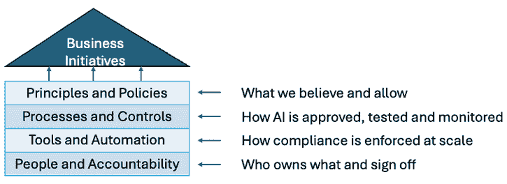
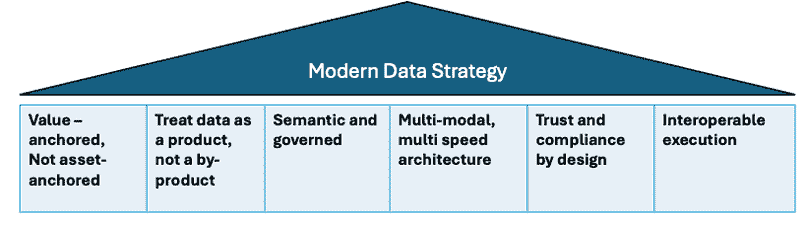

# 2

# 构建企业 AI 战略

*第一章* 显示，大多数 AI 失败不是技术失败；它们是战略失败。当产品在没有支持性的数据基础和运营卓越的情况下追逐算法，以及数据管道不完整、缺少关键技能、所有权和责任不明确，或者与业务优先级不一致时，产品就会崩溃。解决这个问题需要明确的 企业 AI 战略。

为了捕捉持久的企业价值，组织必须明确地将业务倡议、人员和文化、技术以及运营模式围绕 AI 的使用方式进行对齐。在接下来的页面中，通过以下关键主题，我们概述了成熟 AI 战略的结构性要素：

+   将业务倡议与技术开发和项目选择相一致

+   治理和合规

+   数据战略 – 您 AI 系统的差异化因素

+   AI 平台 – 可扩展的基础设施用于实验和部署

+   AI 算法/模式选择策略

+   组织结构和变革管理

# 将战略与技术开发联系起来

在辩论模型架构之前，领导者必须首先明确业务成果以及 AI 是否是实现它的正确杠杆。不是每个问题都是 AI 问题。

## 路线图优先级排序

并非所有 AI 项目都值得立即关注。因此，一个结构化的评估流程，例如**影响、信心、易用性**（**ICE**）框架，可以帮助区分高潜力概念和不太紧急的追求：

+   **影响**：项目是否解决了业务的首要优先事项（例如，减少流失、增加收入或改善用户体验）？

+   **信心**：我们对基于模型的解决方案能够工作的确定性有多大？我们是否有正确的数据、领域知识和员工的专业技能？

+   **易用性**：项目的技术挑战有多大？数据是否已经处于良好状态，或者我们需要进行大量的收集/清理工作？

在这些维度上对每个项目进行评分，然后进行排名。这确保了重点放在具有最大上升空间和成功可能性的倡议上，而不是将资源分散在未经筛选的“酷想法”待办事项列表中。

让我们以银行为案例研究。

一家中型超级区域银行正在推出一个 AI 战略，有六个潜在用例：

+   信用卡欺诈检测

+   **最佳产品推荐**（**NBP**）用于消费者营销

+   通过需求预测进行分支机构人员配置优化

+   存款流失预测和保留

+   由 GenAI 驱动的客户服务代理

+   商业贷款理解助手

领导团队需要决定首先交付什么。他们应用 ICE 框架对每个用例在影响、信心和努力上进行评分。以下表格说明了潜在的结果：

| **用例** | **影响** | **信心** | **努力** | **ICE 评分** | **备注** |
| --- | --- | --- | --- | --- | --- |
| 信用卡欺诈检测 | 5 | 4 | 3 | 6.7 | 现有管道和清晰的 ROI，中等努力 |
| NBP 消费者营销推荐 | 4 | 3 | 2 | 6.0 | 强烈的业务拉动，快速在应用中试点 |
| 通过需求预测进行分支人员配置优化 | 3 | 4 | 2 | 6.0 | 运营节约，易于数据获取 |
| 房贷流失预测和保留 | 5 | 2 | 4 | 2.5 | 高价值但低置信度和高努力 |
| GenAI 驱动的客户服务代理 | 3 | 3 | 3 | 3.0 | 有助于生产力和体验，但 ROI 不明确 |
| 商业贷款理解助手 | 4 | 2 | 5 | 1.6 | 高治理摩擦和集成风险 |

表 2.1：基于 ICE 框架的使用案例评分（1-5 级，ICE = 影响 x 置信度 ÷ 努力程度）

根据分析，银行可以根据最高的 ICE 评分做出明智的决定，确定首先启动的前三项倡议：

+   **欺诈模型提升**：立即的经济影响和可测量的风险降低

+   **NBP 推荐**：低增量努力下的收入和参与度

+   **分支人员配置优化**：高可行性带来成本节约和效率提升

房贷流失和贷款审批辅助产品将推迟至数据、管道和组织准备就绪。GenAI 代理作为实验，而非前三项主要倡议。

## 从小开始，快速扩展

在推广许多 AI 程序时，一个主要障碍是证明投资的价值并说服利益相关者这些倡议将带来实际结果。这正是概念验证项目发挥关键作用的地方。组织不是从一开始就进行全面部署，而是通过关注一个具体、明确的使用案例来运行概念验证，例如预测客户子集的流失或自动化更大工作流程的单一步骤。目的是从小开始，快速展示可衡量的好处，使用有限的范围和可管理的资源，然后快速扩展。

该过程从从小开始：选择一两个与重要业务成果有强烈关联的关键指标，例如在流失试点中使用支持工单量作为信号。主要目标是短期内实现可观的**投资回报率**（**ROI**）。例如，如果试点将客户保留率提高 5%或降低一个部门的运营成本，这将向利益相关者和决策者提供明确的证据，证明其价值。

除了展示成果外，达到利益相关者达成一致并启动试点阶段可能具有挑战性。克服这一挑战的最佳方式是与业务从开始就分享旅程，获取反馈，并迭代到一个实现内部一致性的版本。

一旦概念验证证明了其影响，下一步就是迭代和扩展。这可能意味着向模型添加更多功能，将方法应用于新的业务领域，或逐步自动化更多的工作流程。概念验证有助于组织建立信心，完善他们的方法，并为可持续的、企业级的人工智能采用奠定基础。

明确的人工智能愿景和战略至关重要，必须建立强大的治理和合规实践，以确保您的 AI 系统值得信赖、透明，并与法律要求保持一致。

# 治理和合规

2025 年的监管环境是碎片化和快速演变的。例如，欧盟 AI 法案设定了新的全球标准，而美国、中国和其他司法管辖区正在分部门推出规则，导致重叠的要求和关于期望和执法如何进行的疑虑。

以下是一个人工智能已建立框架的列表。组织应将这些框架作为参考点，提取与他们的业务、风险概况和运营模式相对应的原则和控制措施：

| **框架** | **来源/焦点** | **如何帮助** |
| --- | --- | --- |
| NIST **人工智能风险管理框架** ( **AI RMF** ) | 美国 NIST (2023) | 提供了一种结构化的风险识别、缓解和监控方法 |
| 欧盟 AI 法案 – 风险分层模型 | 欧盟立法 (2024) | 引入了基于风险的责任，并适用于分类和监管层 |
| OECD 人工智能原则 | 全球政策机构 | 提供了跨政府的高层次负责任人工智能原则 |
| ISO/IEC 23894:2023 | 人工智能风险 ISO 标准 | 提供了标准化的词汇和生命周期风险指南 |
| 模型风险管理（SR 11-7 调整） | 银行业惯例 | 将成熟的模型治理学科扩展到 AI/通用 AI 环境中 |

表 2.2：人工智能已建立的框架列表

现代人工智能治理策略应首先关注价值创造。目标是构建一个从商业价值出发的系统，而不是仅仅为了法规；设定护栏，允许创新而无需不断升级；将决策权和账户稳定性推给执行团队，而不是集中所有决策；并建立清晰的归属感、清晰的升级路径和自助控制，以便合规性成为内置的，而不是附加的。考虑以下四层运营模型：

图 2.1：四层人工智能治理运营模型

建立人工智能治理和确保合规性可能会感到压力巨大，这并不奇怪。即使是经验丰富的组织也难以应对这种情况。人工智能创新的加速步伐，尤其是在代理人工智能和通用人工智能领域，只会加剧这一挑战。许多商业领袖和法律团队承认，跟上节奏很困难，感到在平衡新人工智能能力的兴奋与需要护栏和公众信任之间有压力。许多组织也缺乏能够连接技术和法律领域的内部专家，这使得知道从哪里开始都变得困难。

鉴于这种现实情况，重要的是从实际、可管理的步骤开始。首先，确定并记录在您的组织中人工智能的使用情况，特别是在处理敏感数据或做出重大决策的领域。明确分配人工智能监督的责任。这可能意味着建立一个跨职能团队，将合规性、风险、技术和业务利益相关者聚集在一起。即使最初感觉这些政策和流程很基础，也要记录下来，并确保您能够用通俗易懂的语言解释关键模型是如何构建、测试和监控的。

透明度和定期审查至关重要。即使标准发生变化，记录决策是如何做出的以及问题是如何处理的，在审计或出现问题时也会大有裨益。不要害怕尽可能自动化；可以标记偏见、跟踪模型漂移或更新合规性警报的工具越来越多，并且是为非专业人士设计的。最重要的是，培养一种文化，使报告人工智能行为的问题或不确定性被视为一种优势，而不是弱点。

最后，预期这项工作将是一个持续的过程。法规将发生变化，新的风险将出现，您的政策应该相应地演变。通过采取小而稳定的步骤并养成良好的习惯，组织不仅降低了风险，而且还在人工智能规则不断变化的情况下，增强了负责任创新的自信心。

在治理和合规性基础建立之后，下一个优先事项是设计一个清晰的数据策略，确保您的 AI 系统由相关、高质量且管理良好的信息驱动。

# 数据策略——您人工智能系统的差异化因素

创建一个能够使人工智能发挥作用的数据策略往往是组织面临的最大挑战。

人工智能的现代数据策略应该是以价值为导向的、产品化的、受管理的、语义化的，并采用多模态架构，使可信数据能够持续地被**机器学习**（**ML**）、通用人工智能（GenAI）和生产中的代理系统使用。

以下是一个现代人工智能数据策略的关键支柱：

图 2.2：现代数据策略

+   **以价值为导向，而非以资产为导向**：AI 的现代数据策略应以明确的目标开始：我们试图改善哪些业务决策或流程，我们将如何知道它是否有效？以价值为导向意味着在开始任何建模工作之前，将业务目标转化为明确的价值假设，定义目标人群、预期的业务行动以及将在生产中验证影响的经济学信号。当数据策略以明确的企业成果为基础时，优先级变得有纪律，执行变得一致，成功变得可衡量。

+   **将数据视为产品，而非副产品**：在大多数组织中，数据仍然被视为应用程序的遗留物，是交易、日志或操作的副产品。当数据以这种方式处理时，没有人负责确保其准确性、可用性、文档化或可信度。建立在如此数据之上的 AI 系统将继承混乱。

将数据视为产品颠覆了范式。数据产品不是存储在存储中的数据。它是一个维护的、文档化的、可信的、可消费的资产，具有明确的目的、定义的用户和定义的服务期望。就像任何产品一样，它有一个所有者、路线图、质量标准和支持模型。

数据产品可以采取多种形式：一个精心制作的客户 360 度表格、用于建模的特征存储、欺诈检测模型评分、用于 GenAI 的嵌入目录，或对财务报告团队公开的指标层。将数据视为产品需要几个转变：

+   必须有人负责

+   它必须能够被他人发现和理解

+   它必须进行版本控制和治理

+   它必须构建来服务于已知的用例或消费者

+   它必须在整个生命周期中得到监控、支持和最终退役

+   **语义和治理**：历史上，组织认为一旦数据被集中或流入湖/仓库，它就是“准备好了”。现在，AI 已经暴露了这种假设的缺陷：没有意义的集成数据不是有用的情报。ML、GenAI，尤其是代理 AI 需要理解的不只是数据的格式，还有其商业意义、意图、约束和适当的使用。

语义提供了共享的意义，例如客户是什么，什么算作流失，活跃余额是什么，以及“流失”在财富管理和零售银行中的含义。如果不强制在 AI 系统上实施这种逻辑商业模型，它们可能会对相同的问题产生相互冲突的答案。

治理确保正确的人访问正确的数据以执行正确的任务。它定义了谁可以访问什么，哪些字段是敏感的，哪些模型需要审查，以及 AI 决策的监控和证明。

+   **多模态、多速度架构**：传统数据策略是围绕结构化、缓慢移动的数据构建的，如季度财务、月度风险报告和每日仓库刷新。现代 AI 系统，尤其是 GenAI 和代理 AI 系统，从不同速度移动的许多信号中学习并采取行动。

“多模态”意味着系统可以消费的不仅仅是行和表：文本（笔记、聊天和政策）、音频（通话）、文档（PDF 和合同）、图像（支票和身份证）、事件（点击流）、日志、向量、嵌入、知识图谱等等。

“多速度”意味着架构必须同时支持慢速和快速决策：某些用例（如营销、预测和资本规划）可以容忍每日或每周刷新，而其他用例（如支付欺诈、个性化和小型代理响应）则需要实时或近实时流式处理。

实际上，多模态、多速度策略意味着以下内容：

+   设计平台以处理结构化、非结构化和向量化的嵌入

+   根据业务决策范围支持批量、微批量和流式处理

+   在需要时使用专用存储，例如，文档存储、向量数据库、特征存储或知识图谱，而不是将所有内容推入一个仓库模式

+   将延迟视为业务设计选择，而不是技术后续考虑

+   **设计信任与合规性**：不言而喻，构建一个值得信赖且透明的数据平台至关重要。信任并非在部署后获得；它应该被设计到生命周期中。这意味着隐私、公平性、透明度、监控和人工监督应该被整合到设计、数据准备、建模、验证和持续运营中。

实践中的“设计信任”数据策略可能如下所示：

+   在摄取时进行分类、敏感度标记和质量保证

+   在结构化、列或属性级别内置访问控制

+   具有使用界限、血缘和免责声明的策略感知数据产品

+   自动审计跟踪、血缘、访问日志和转换记录在数据移动过程中

记住，AI 并不能修复不良的数据治理；它放大了它。需要一种在源头嵌入信任的数据策略，以实现更少的摩擦和更多的敏捷性。

+   **可互操作执行**：随着组织在多个云、SaaS 平台和代理生态系统采用 AI，数据不能存在于孤立的环境中。模型、GenAI 系统和自主代理必须能够在相同的事实上工作，对相同的实体进行推理，并在相同的约束下行动，无论它们在哪里运行或由谁构建。

注意以下关于数据互操作性的内容：

+   客户、账户、索赔和交易在云、系统和平台中具有相同的意义。

+   数据使用、隐私、保留和血缘跟踪的政策与数据同行，而不是在承载它的基础设施内部。

+   系统可以参考而不是替换——即移动意义而不是复制原始数据到每个地方。

+   确保互操作性的数据策略至关重要。互操作性是允许模型、通用人工智能系统和代理在云和平台之间一致运行的关键，将数据转化为可重用的企业资产，而不是一系列孤立的孤岛。

在构建一个为 AI 准备就绪的现代数据策略时，请考虑这六个支柱。

下一步是构建一个能够支持实验、开发和可靠大规模部署的 AI 平台。

# AI 平台 – 可扩展的基础设施，用于实验和部署

一个现代 AI 平台是推动 AI 生命周期所有阶段创新的动力，从实验到生产规模。领先的组织和主要云服务提供商一致认为：从孤立的试点模型转向可靠、业务关键型 AI 需要的不只是强大的算法。它需要的是一个模块化、健壮且适用于快速原型设计和企业稳定性的基础设施。

今天，核心挑战是在创新速度、安全性、可靠性和合规性之间取得平衡。最有效的 AI 平台，无论是本地、混合还是完全云原生，都设计为模块化系统。它们将关键功能如数据摄取、特征工程、模型训练、测试和生产服务分离。模块化设计允许团队更新或扩展单个组件，例如推出新模型或更换更好的数据管道，而不会对整个系统造成风险。这个蓝图被主要云平台和行业领导者如 Netflix、Uber 和 Airbnb 广泛引用。

一个架构良好的平台在沙盒环境（数据科学家可以灵活迭代和测试）和加固的生产管线（业务连续性、合规性和安全性优先）之间划出一条清晰的界限。这种分离确保创新保持快速，但不会将实时服务或敏感数据置于风险之中。许多高级团队运行“影子模式”测试：新模型与生产模型并行运行，让团队能够衡量现实世界的性能并在全面推出之前发现问题。

调度和编排模式也很重要。事件驱动的流程为实时系统提供动力，例如欺诈检测、内容个性化或代理 AI，它们能够即时适应用户交互。批量处理处理周期性再训练或大规模分析，为不需要即时结果的任务提供效率。最好的平台将两者结合，根据延迟和成本需求自动将任务路由到正确的管线。

**AI 运营**（**AIOps**）已成为管理大规模复杂性的骨干。自动化工具从初始构建跟踪到测试和生产，标准功能包括版本控制、可重复性和回滚能力。**持续集成/持续部署**（**CI/CD**）管道允许通过自动化测试进行频繁、受控的更新，最小化将有缺陷的模型推入生产的风险。

监控和可观察性现在是不可协商的。除了基本准确度评分之外，平台还需要跟踪模型漂移、延迟、用户结果，甚至公平性指标，并在异常出现时触发重新训练或回滚。由谷歌和 Azure 推荐的全面可观察性意味着不仅要捕获系统日志，还要捕获对业务性能真正重要的运营指标。

管理和合规性应直接构建到平台中，而不是在部署后处理。企业级平台现在自动化审计跟踪、访问控制、模型文档和审批工作流程，以保持对不断变化的法规（如欧盟 AI 法案和 NIST 框架）的领先。指导委员会和记录在案的审查流程保持监督。

总结来说，一个成熟的 AI 平台对于企业创新实现灵活性和可扩展性至关重要。

# AI 算法/模式选择策略

选择正确的 AI 算法并非易事。今天的企业环境处理复杂、混合数据，必须满足合规性、安全性、成本和可解释性等要求，这些要求通常比原始准确度或新颖性更为关键。研究和经验表明，最佳结果来自一个基于原则、以业务为先的过程，该过程结合了实验、明确的评估标准以及技术利益相关者和业务利益相关者之间的持续协作。例如：

+   **从业务和合规性要求开始**：算法选择应始终从对问题领域的清晰理解开始。监管需求、可解释性要求和运营限制经常在考虑技术性能之前就排除了整个模型类别。例如，在高度监管的行业，如金融服务、医疗保健和政府，可解释性、透明度和记录在案的风险控制是必不可少的。在其他情况下，高吞吐量或低延迟用例可能像预测能力一样影响方法选择。

+   **将模型类型与数据和用例对齐**：对于结构化、表格数据或需要透明决策路径的问题（如风险评估或运营分析），经典机器学习方法仍然可靠。基于树的模型、线性模型和广义提升模型在性能、可解释性和部署简便性之间取得了良好的平衡。

深度学习在处理大型、非结构化数据集方面表现出色，例如图像、自然语言文本或多模态传感器数据。然而，对数据、计算和监控的更高需求必须与成本和维护现实情况进行权衡。

转移学习介于这两种极端之间，当标注数据稀缺或生产时间紧迫时尤其有价值。组织不是从头开始训练模型，而是调整预训练模型，例如微调基础模型或重用预训练嵌入，以显著降低成本、训练数据需求和开发时间，同时仍能实现高精度。

GenAI 是深度学习的一个子集，具有语言、图像和代码生成的新能力，以及用于搜索和自动化工作流程的**检索增强生成**（**RAG**）。这些模型引入了强大的功能，但同时也带来了不可预测性、高计算成本以及更大程度的安全和伦理合规性监管的风险。

强化学习和代理架构解决动态、顺序决策问题，如自动驾驶汽车或自适应供应链系统，但需要用户进行仔细的奖励设计、模拟和稳健的监控，以避免在复杂环境中的意外结果。

+   **评估、实验和结合方法**：企业很少从一开始就承诺单一模型类型而取得成功。相反，通过 AutoML 工具、基于云的试点平台和基准竞赛进行结构化实验，可以让团队在早期过程中比较经典、深度和生成方法。越来越普遍的是采用混合架构：例如，使用梯度提升来总结表格型业务数据，然后使用转换器进行文档分析，或者将知识图谱与基础模型结合用于企业搜索。

+   **考虑部署和生命周期影响**：在开发阶段的表现很少能保证在实际应用中的成功。因此，算法选择应考虑以下下游因素：

    +   监控的简便性、可解释性和重新训练（特别是在法规变动或新数据到来时）

    +   训练和推理时间所需的总体计算和存储需求

    +   技术支持、与现有 MLOps 堆栈的集成，以及通过扩展来满足业务 KPI 的能力

    +   “技术债务”的风险，因为过度复杂的模型可能看起来令人印象深刻，但可能脆弱、难以管理或维护成本过高

+   **定期测试、验证和重新评估**：组织不会一开始就选择“完美”的模型就取得成功。相反，他们将模型选择视为一个持续、逐步的过程。他们依赖试点测试、A/B 比较和定期的性能检查。业务反馈有助于在需求变化时保持解决方案的正确方向。详尽的文档、版本控制和审计跟踪现在是合规性和信任的必要条件。以下是关键考虑因素：

    | **应用领域** | **首选方法** | **关键考虑因素** |
    | --- | --- | --- |
    | 信用风险评估 | 基于树的、可解释的 | 必须可解释、低延迟且合规 |
    | 文档摘要 | 通用人工智能 + RAG | 上下文、质量控制以及可审计性 |
    | 图像分析 | 深度学习（CNNs） | 高数据/计算、GPU 扩展和隐私 |
    | 实时推荐 | 混合（经典+深度） | 成本、再训练频率和持续反馈 |
    | 欺诈检测 | 集成/混合 | 平衡准确性、可解释性和成本 |
    | 动态控制/代理 | 强化学习、代理 | 复杂的监控和意外行为的风险 |
    | 低数据域适应性（医疗自然语言处理、法律人工智能等） | 迁移学习/微调 | 标签数据有限、能够重用预训练模型以及领域迁移风险 |

表 2.3：企业环境中的模型选择

算法选择不是一次性的技术练习，而是一个动态的、业务关键的过程。看到人工智能带来实际影响的组织通常会定期回顾模型选择，优先考虑操作清晰度，并将决策建立在现实世界的限制之上，尽可能使用混合设置和试点驱动的验证。

# 组织结构和变革管理

启动人工智能项目不仅关乎技术和流程，还关乎人和过程。无论你已经构建了先进的数据策略还是复杂的人工智能架构，成功都取决于团队的组织方式、激励措施以及如何引导团队通过变革。以下是一些经过验证的最佳实践：

+   团队结构很重要：

    +   人工智能触及技术和商业领域，因此清晰的团队结构至关重要。

    常见模型包括以下：

    +   **集中式**：一个单一的**卓越中心**（**CoE**）负责整个公司的机器学习。这推动了一致性和深入的专业知识，但可能会使前线团队感到疏远。

    +   **嵌入式**：每个业务单元都有自己的机器学习团队，这允许快速针对特定领域提供解决方案，但同时也存在重复工作和标准不一致的风险。

    +   **混合式**：核心平台团队处理治理和工具，而领域团队管理本地项目。这种“中心辐射”方法提供了平衡，但需要强大的沟通以避免混淆。

选择最佳方法取决于组织的规模和需求，但大多数成熟组织倾向于混合模式，以结合共享知识和业务背景。

+   建立协作和共同目标：

    +   组建跨职能的“老虎团队”，在高优先级项目中将数据、技术和业务专家联合起来。

    +   使用共享目标（如 OKR），以便技术和业务人员朝着相同的成果努力，而不是孤立的目标。

投资于持续培训。领导者应学习机器学习基础知识，技术人员应深化其业务背景。定期的内部研讨会和提升技能项目帮助团队保持适应性。一个开放、以学习为导向的文化，它欢迎动手反馈并庆祝成功与失败，使 AI 团队保持参与和韧性。

+   管理变革和调整激励：

    +   设定反映业务价值和机器学习性能的共享指标和奖励，例如收入增长或客户保留，而不仅仅是技术基准。

    +   确保强有力的高管支持。高级领导者应倡导机器学习，清除障碍，并传达变革背后的“为什么”。

    +   使用结构化的变革管理框架，如科特的八个步骤或 ADKAR，以支持新的工作流程、角色和心态。从小规模、专注的试点项目开始，而不是大规模推广，以建立信任和动力。

成功的 AI 组织将变革视为持续的过程，而非一次性事件。他们鼓励各级别的所有权，保持沟通渠道畅通，并定期审查进度以快速适应业务和技术需求的变化。

# 摘要

在本章中，我们概述了成熟 AI 策略的结构要素。我们展示了具有高性能 AI 系统的组织并非从算法开始，而是从业务对齐、结构和可重复的模式开始。

关键要点包括以下内容：

+   业务对齐应放在首位。AI 必须与定义明确的企业倡议相结合，并针对实际结果进行衡量，而不是技术代理。

+   治理是推动者，而非制动器。政策、指导方针和合规性必须融入生命周期，以确保创新可以安全且反复地扩展。

+   数据是基础，也是你组织的差异化因素。可靠、道德、互操作和良好治理的数据产品使 AI 在各个用例中值得信赖且可重复使用。

+   平台思维取代了单一项目。模块化 AI 平台使实验室中的快速迭代和生产中的硬化执行成为可能。

+   正确的算法系列取决于上下文、约束和价值。拥有锤子并不意味着一切看起来都像钉子。

+   运营模式是使所有元素高效工作的关键。当激励措施、角色和协作路径被设计为跨职能交付时，AI 才能成功。

当这些要素到位时，AI 就不再只是实验性的，而是开始成为一种持久的企业能力。

接下来是什么？

现在我们已经建立了有效构建 AI 的基础，接下来的问题是先构建什么。下一章将展示如何识别、排序和选择具有最高商业影响的 AI 项目。

# 参考文献

+   美国联邦储备系统管理委员会。（2011 年 4 月 4 日）。*关于模型风险管理的监管指南（SR 11-7）。*联邦储备。[`www.federalreserve.gov/supervisionreg/srletters/sr1107.htm`](https://www.federalreserve.gov/supervisionreg/srletters/sr1107.htm)

+   Ellis, S. (2010). *ICE 分数（影响、信心、易用性).* [增长黑客框架].

+   欧洲联盟. (2024 年). *制定关于人工智能的统一规则（人工智能法案）* . 欧洲联盟官方期刊. [`artificialintelligenceact.eu/`](https://artificialintelligenceact.eu/)

+   Hermann, J., & Balso, M. (2017). *遇见米开朗基罗：Uber 的机器学习平台.* Uber 工程博客. [`eng.uber.com/michelangelo-machine-learning-platform/`](https://eng.uber.com/michelangelo-machine-learning-platform/)

+   Hiatt, J. M. (2006). *ADKAR：商业、政府及我们社区变革模型* . Prosci 学习中心出版物.

+   国际标准化组织（ISO）. (2023 年). ISO/IEC 23894:2023 *信息技术 — 人工智能 — 风险管理指南.* ISO. [`www.iso.org/standard/81230.html`](https://www.iso.org/standard/81230.html)

+   Karbhari, V. (2021 年 4 月 14 日). Airbnb 的端到端机器学习平台. Medium. [`medium.com/acing-ai/airbnbs-end-to-end-ml-platform-8f9cb8ba71d8`](https://medium.com/acing-ai/airbnbs-end-to-end-ml-platform-8f9cb8ba71d8)

+   Kotter, J. P. (2012 年). *领导变革*. 哈佛商业评论出版社.

+   美国国家标准与技术研究院（NIST）. (2023 年 1 月). *人工智能风险管理框架（AI RMF 1.0）*. 美国商务部. [`www.nist.gov/itl/ai-risk-management-framework`](https://www.nist.gov/itl/ai-risk-management-framework)

+   Netflix 技术博客. (2020 年). *Netflix 的机器学习平台* . Netflix 技术博客. [`netflixtechblog.com/`](https://netflixtechblog.com/)

+   经济合作与发展组织（OECD）. (2019 年 5 月). *OECD 人工智能原则*. OECD. [`oecd.ai/en/ai-principles`](https://oecd.ai/en/ai-principles)

# 免费订阅电子书

新框架、演进的架构、研究发布、生产故障——AI_Distilled 将噪音过滤成每周简报，供直接与大型语言模型和通用人工智能系统打交道的工程师和研究人员阅读。现在订阅，即可获得免费电子书，以及每周的洞察力，帮助您保持专注并获取信息。

在 [`packt.link/8Oz6Y`](https://packt.link/8Oz6Y) 订阅或扫描下面的二维码。

