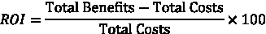

# 3

# 选择高影响力的人工智能项目

在今天快速发展的商业环境中，组织正在将人工智能视为推动效率、改善决策和最大化收入的关键工具。虽然公司可以快速原型化人工智能解决方案，但挑战在于优化这些解决方案以实现各自组织最大的收益。构建人工智能解决方案是必要的，但广泛的采用和持续的势头才是真正赋予这些解决方案意义的关键。

本章为有兴趣创建有影响力的人工智能解决方案的公司提供指南。“有影响力”对每个组织可能意味着不同的事情，但最终，它与向最终用户提供 5 星级体验相关。在本章中，我们将探讨构建优化和有影响力的人工智能解决方案背后的原因，并提供一个实用的蓝图，说明您可以采取哪些步骤来实现这种优化。请注意，本章不讨论模型优化，而是讨论如何最有效地使用人工智能以获得最佳的投资回报率。

我们将涵盖以下关键主题：

+   为什么选择高影响力的人工智能项目很重要？

+   案例研究 – 选择正确的战斗

# 为什么选择高影响力的人工智能项目很重要？

选择高影响力的人工智能项目很重要，但也很困难。确定正确用例的正确时机需要集体的智慧。因此，构建优化的人工智能解决方案至关重要。**人工智能优化**指的是使用人工智能算法和技术有效地改进系统和流程，以获得所需的企业价值。这是企业可以利用的框架，以最有效地使用人工智能。让我们讨论一下为什么这很重要：

+   创建人工智能解决方案和产品是一项耗资巨大的任务。在投入数百万美元进行开发之前，评估所有因素，如影响、最终用户、总成本等，至关重要。明确这些因素有助于你确定解决方案的价值，并确保获得必要的动力和资源。

+   人工智能是新的热门对象，人们强烈渴望使用人工智能来构建解决方案。然而，现在是时候扭转局面了。与其用人工智能来解决问题，不如先确定用例，然后再决定人工智能是否可以增强它。这种方法可以节省时间和资源。

+   构建人工智能解决方案是一个团队的努力，组建一支 A 队是至关重要的。在开始开发过程之前，获得不同团队和高级领导的支持，确保每个人都完全参与，并为人工智能项目提供他们的关键意见。

+   通过优化人工智能解决方案，组织可以在开发过程中早期识别和解决潜在风险。这种主动方法有助于最大限度地减少昂贵错误或失败的可能性。

现在，让我们深入探讨在构建人工智能解决方案之前您可以分析的一些因素。

## 开发有效人工智能解决方案的关键因素

在构建人工智能解决方案之前需要考虑的因素如下：

+   **业务影响**：您旨在解决的问题应为业务带来显著的价值。企业应利用人工智能积极影响其运营，而不仅仅是因为它是热门话题。常见的业务价值包括创造新的收入来源、获取新用户、保留现有客户和创造新资产。然而，影响不仅限于客户价值；它还可以包括改善内部运营，例如通过人工智能副驾驶工具提高员工生产力或通过基于 RAG 的解决方案简化招聘或法律工作流程等流程。

小贴士

应通过咨询适当的业务利益相关者来定义业务影响/价值。作为一名数据科学家，您可以自由地提出指标，但也应灵活地吸收来自业务领域专家的反馈。

+   **最终用户**：在人工智能产品发布后，明确您的解决方案的最终用户对于跟踪**投资回报率**（**ROI**）至关重要。这将帮助您创建一个**优化的反馈循环机制**。这个反馈循环对于衡量人工智能解决方案的持续成功至关重要，能够实现持续改进。技术团队应与最终用户保持清晰的沟通渠道，以便他们能够理解痛点并相应地调整解决方案。

定义最终用户还有助于定义您的人工智能解决方案的影响。例如，如果最终用户是内部员工，影响通常以生产率提升、效率改进或每位员工节省的时间来衡量。另一方面，如果解决方案针对外部客户，重点则转向用户保留、收入增长、客户获取和增加**客户终身价值**（**CLV**）等指标。

确定正确的最终用户确保您能够根据业务目标定制解决方案，并建立一个动态的系统来捕捉和采取反馈，确保长期成功。

小贴士

确保您的最终用户，尤其是如果他们是内部用户，是开发过程的一部分，并与他们设定现实的目标。虽然您不能包括所有最终用户，但您可以识别几位能够提供关键反馈的重量级用户。

+   **选择合适的 AI 用例**：定义一个有影响力的业务问题是至关重要的，但确定它是否适合人工智能则是一个完全不同的挑战。为了将这个问题放在适当的背景下，人工智能和**机器学习**（**ML**）擅长解决涉及识别模式、趋势或处理大量数据以预测或分类结果的问题。然而，并非所有用例都需要人工智能的复杂性。在考虑适当的 AI 用例时，首先确定业务问题，然后评估人工智能是否可以增强或解决它，而不是盲目寻找人工智能应用。

让我们探讨三个案例研究，以展示人工智能何时是一个很好的选择，何时是过度使用，以及何时处于灰色地带。

### 案例研究 1（人工智能过度使用）

假设一家公司旨在计算基本描述性统计，例如在给定期间的平均销售额或简单的趋势分析。这些任务完全在标准统计方法或工具（如 Excel 和仪表板）的能力范围内。在这里引入人工智能或机器学习只会增加不必要的复杂性，而不会增加价值。

**解决方案**：在这种情况下，简单的统计工具更有效率。

**警告**：如果将来数据的大小和复杂性发生变化，那么应该重新审视这个问题，看看简单的统计方法（如线性回归）是否比简单的趋势分析能带来更多的价值。

### 案例研究 2（人工智能处于灰色地带）

考虑一家公司使用基于规则的引擎来根据固定参数为用户推荐下一个最佳营销行动。这些行动可能看起来像是向新婚夫妇推荐申请住房贷款。基本上，营销团队根据客户的生活事件和/或其他参数发送促销信息。如果这些参数（生活事件）可以以静态和可预测的方式编码，例如，如果有人结婚则编码为`1`，如果没有则编码为`0`，那么可能不需要人工智能技术。你可以非常容易地构建一个基于规则的引擎。然而，如果用户基础显著增长，并且你希望解决方案足够动态以决定重要参数，那么转向人工智能驱动的方法可能是有益的。

**解决方案**：深度神经网络等高级技术可能能够更好地解决这个问题，因为它们可以处理大量用户与其偏好之间的复杂关系，而不仅仅是基于规则的引擎。深度神经网络擅长捕捉用户偏好和关系随时间的变化。它们对于冷启动问题也非常出色——基本上，新客户/用户加入公司，因为它们将能够找到具有相似兴趣的类似用户，并为他们提供最优推荐。

### 案例研究 3（人工智能可以产生重大影响）

利用 AI 通常对高影响用例有益，例如诊断罕见疾病或检测欺诈。这些场景通常涉及大量数据集和复杂模式，而基于规则的系统或手动流程可能无法在规模上得出结论。AI 的预测能力可以显著提高此类用例的准确性和速度。

**解决方案**：通过处理大量数据和更有效地识别异常，实施 AI 将提供有形的益处。让我们以使用 AI 技术进行欺诈检测为例。

要构建欺诈检测解决方案，你需要多个数据点，例如交易记录、用户行为日志、客户档案，甚至可能是外部数据源，如信用局信息。现在，所有这些大量数据都可以通过神经网络或强化学习来高效地处理，以适应欺诈检测策略。如果你还有非结构化数据，例如任何类型的文档，你也可以利用高级推理**大型语言模型**（**LLMs**）来处理结构化和非结构化数据，并有效地标记欺诈交易。随着 LLMs 的出现，也可以在无需人工干预的情况下实时提醒用户。你可以部署一个代理来发送消息或电子邮件给用户。

现在我们已经定义了可以利用 AI 为解决方案的最终用户带来益处的用例，并确定了商业影响，接下来要考虑的是，尽管 AI 可能有益，但这并不意味着它可以立即实施。在接下来的章节中，让我们探讨其他对 AI 实施构成约束的商业因素。

## 可行性分析

在企业环境中，可能会有额外的约束，如人才、资源、预算等。因此，为了进行尽职调查，在开始构建 AI 解决方案之前，需要执行一些额外的分析。

在实施 AI 之前，进行全面的可行性分析以评估技术和商业可行性。这确保了所构建的解决方案能够带来可衡量的商业价值。这可以在以下变量上进行执行：数据、技术栈和人才。

### 数据

数据是 AI 解决方案的燃料。你的 AI 解决方案的质量取决于你提供的数据。即使是最复杂的技术，如果数据质量不高或数据不正确，也会失败。因此，关注你组织内的数据非常重要。以下是关于数据的考虑因素：

+   **高质量数据的可用性**：AI/ML 需要大量的数据来学习模式和趋势，并在此基础上进行泛化。一旦确定了正确的数据来源，确保在数据被摄入 AI 算法之前进行数据清洗是非常重要的。所有模型，包括 LLMs，都需要高质量的数据。

例如，假设你正在为员工构建一个聊天机器人，以便他们获取关于所有人力资源相关信息的帮助，例如休假政策、福利等。提供给大型语言模型（LLM）的数据必须干净且更新，以便员工能够获取相关信息。否则，他们可能会认为自己在遵守公司规定，但可能会因为过时的信息而陷入麻烦。

同样，如果你正在构建一个简单的预测模型，确保数据中没有不必要的字符或过多的缺失值是至关重要的，因为这些可能会误导模型。

+   **数据量有限**：公司可能只有少量高质量的数据，例如只有 100 个用户的数据。数据有限的原因可能有很多，比如公司刚刚推出新产品，只有早期采用者的数据。在这种情况下，为了增强数据，使用如**生成对抗网络**（GAN）之类的合成数据生成技术可以非常强大。

例如，假设一家公司正在为一种潜在的爆款药物制定上市策略。在这种情况下，你可能没有大量的数据来分析之前的上市策略，以决定诸如何时上市、在哪个国家上市、针对哪些医疗保健提供者等问题。你可以利用生成对抗网络（GAN）来增强数据并进行分析，以应对这一问题。尽管结果可能不是 100%准确，但它们为利益相关者提供了一个良好的起点，以制定他们的上市策略。你可以使用的其他技术包括合成少数类过采样技术（SMOTE）；在这里，不是简单地复制少数类样本，而是通过在特征空间中插值现有少数样本及其最近邻来生成合成示例。这有助于模型学习更一般的决策边界，并降低过拟合的风险。

**警示故事**

合成数据是模拟复杂模式和场景的绝佳工具。然而，需要注意的是，对于高风险用例，如预测患者是否可能感染 COVID-19，挑战会随之而来。由于 COVID-19 是一个独特的事件，没有先前的数据，做出准确的预测是困难的。在这种情况下，合成数据可能不足以发挥作用，因为没有精确的基础数据集来有效地应用合成数据技术。在这里，你可以做的最接近的事情是查看过去的大流行病，以分析整体趋势。

+   **购买第三方数据**：公司通常希望多元化目标受众并探索新的用户基础。在这种情况下，获取数据可能是有兴趣的。

例如，考虑这样一个案例，你正在为针对小型企业主的人工智能挖掘策略工作。现在，这可能是公司的一个全新的目标受众，因此将没有先前数据来理解小型企业生态系统。在这种情况下，最好从 ZoomInfo 等供应商那里获取数据，并基于行业、公司规模、收入等因素构建个性化的 AI 挖掘策略。

+   **多样化和代表性数据**：为了构建值得信赖和负责任的 AI 解决方案，必须拥有代表人口中每个人的数据，以便你的算法可以理解模式，即使是对于少数群体。还必须去偏数据，以确保没有基于种族、性别等因素的群体比其他群体更受青睐。

还非常重要的一点是，尽可能避免使用**个人身份信息**（**PII**），例如社会保障号码。在某些情况下，例如癌症预测问题，PII 数据（如性别和年龄）是不可避免的，因为这些特征决定了治疗过程。

例如，假设你正在构建一个预测问题，预测一个人是否有资格获得高信用额度。在这种情况下，历史数据可能显示男性比女性获得更高的信用额度，因为他们工作的时间更长，或者可能比女性有更高的净财富和薪水。在这里，这是一个社会问题，以某种形式削弱了数据。如果你不使用性别作为训练特征，模型将根据其他特征（如当前净财富、消费模式等）预测高信用额度，而不会根据性别进行区分。因此，进行详细分析以确定可能引入模型偏差的属性，并退一步考虑它们是否会影响模型结果，这是至关重要的。

考虑到前面的观点，下一个问题是，数据量过多是什么意思？虽然这里没有一刀切的方法，但有一些一般性指南可以遵循：

+   监督式机器学习问题需要更多的标记训练数据。

+   模型越复杂，它需要的数据就越多。

+   一个普遍的规则是，你需要的数据点数量是你数据集中特征数量的 10 倍。如果有 10 列，你应该至少有 100 行。

+   对于大型语言模型（LLMs），如果你正在进行微调，那么拥有一个涵盖所有场景（包括边缘情况）的健壮数据集是至关重要的。

数据应该是你 AI 策略的一个关键组成部分。确保有足够的高质量数据可供使用，将引导你走向成功的结局。这一步骤可能需要一些时间和精力，但它可以让你免于构建次优 AI 解决方案的痛苦。一旦你有了数据，下一个因素就是检查你的技术堆栈，以构建这些 AI 解决方案。

### 技术堆栈

大多数生产中的 AI 解决方案都需要一个强大的技术栈。本地计算机可能不足以处理大量数据并提供无缝的用户体验。除此之外，并不是每家公司都能建立自己的云基础设施。这是一项昂贵的投资，而且在大多数情况下并不需要。因此，他们更倾向于选择现有的云服务提供商。

在某些情况下，例如如果你正在构建基于规则的引擎或简单的统计分析，你可能会选择本地部署。但随着解决方案的扩展和用户基础的扩大，你将不得不转向云服务提供商。

如果目标是构建通用人工智能解决方案，我们都知道在利用大型语言模型（LLMs）时，会面临巨大的环境限制。容量有限。即使你获得了访问容量，也有可能如果多个用户同时使用你的解决方案，他们可能会遇到速率限制错误（这基本上是一个消息告诉他们没有容量，请稍后再试）。这可能会影响用户体验，人们可能会对你的通用人工智能解决方案失去兴趣。为了减轻这个问题，你应该确保你可以为你的解决方案提供持续的吞吐量，这样用户就不会遇到这个错误。这可以通过分析你现有的流量并确保在一天中繁忙时段你的云平台内有足够的资源来实现。你还应该考虑响应的延迟。例如，推理模型，如 o 系列，可能需要更长的时间来响应，这可能会增加客户跳出率或导致客户体验不满意。

**小贴士**

另一点需要注意的是，如果你选择云平台，一个关键优势是能够访问其云解决方案架构师和专家，他们可以为你提供针对用例的最佳实践，帮助你优化解决方案，并指导你完成实施。确保利用这些宝贵的资源以获得专家建议。

### 人才

虽然数据和科技栈很重要，但你还需要能够利用所需数据和技术的个人来创建有影响力的 AI 解决方案。构建 AI 解决方案是复杂的；因此，拥有专业技能的人员很重要。

人工智能应用需要一支专业的人才库。根据具体用例，所需技能可能有所不同，但了解数据科学、机器学习和统计学的基础知识至关重要。另一个需要注意的关键因素是，你的数据科学家可能对数据科学栈非常熟悉，但可能不是 MLops 的专家，MLops 是指管理和部署 AI 解决方案在生产环境中的技能。为此，你可能需要具有操作技能的人才——也就是说，他们知道如何以最高效的方式在生产环境中编写代码，以及持续监控和评估 AI 解决方案。

在众多角色中，决定哪些人最符合团队需求可能很困难。一般规则是拥有数据科学家，因为这些人擅长深入处理数据，甚至使用机器学习算法构建概念验证（PoC）或最小可行产品（MVP）。接下来，你可能还需要**机器学习工程师**（**MLEs**），他们擅长将可行的 PoC 部署到生产环境中。最后，拥有能够为 AI 产品制定上市策略并帮助项目保持正轨的 AI 产品经理或产品经理也非常重要。

由于 AI 的发展速度很快，很难找到该领域的“专家”。与其追逐专家，不如雇佣那些具有成长心态和愿意学习的人。

小贴士

如果你正在考虑部署 AI 作为用户界面应用程序，你可能还需要.NET 开发者，所以确保你的团队中有这样的人。

在大型组织中，你可能还需要项目经理或产品经理来定义里程碑、确保每个人都承担责任，并确保 AI 解决方案的顺利交付。

在本节中，我们讨论了在企业环境中，在实施 AI 解决方案之前进行全面的可行性分析至关重要。这包括评估技术和商业可行性，以确保解决方案能够带来可衡量的商业价值。需要考虑的关键变量包括数据、技术堆栈和人才。高质量的数据对于 AI 的成功至关重要，公司可能需要增强或采购数据。一个健壮的技术堆栈，通常涉及云服务提供商，对于处理大量数据和确保无缝的用户体验是必要的。具有成长心态和愿意学习的能力的专门人才对于有效地利用数据和科技至关重要。

在下一节中，我们将探讨机会规模，这对于理解 AI 解决方案的潜在影响和可扩展性非常重要。这有助于确定正确的追求机会，并确保资源得到有效分配，以实现最大的商业价值。

## 机会规模

机会规模是一种数据科学家在决定投资之前，用来量化一项计划潜在影响的方法。尽管企业试图优先处理计划，但它们很少进行数学评估来评估机会，而是依赖直觉驱动的决策。虽然这种决策方式有其位置，但它也面临着容易被一些微妙偏见所左右的风险，例如可获得的信息、确认偏见等。

机会规模可以采用多种方法来处理。在本节中，我们将介绍两种方法：方向性 T 恤尺码和自下而上的比较方法。

**方向性 T 恤尺码**是一种定性方法，根据机会的潜在影响和可行性，将机会分类为小、中、大和超大等尺码。这有助于快速评估和优先排序机会，而无需详细分析。另一方面，**自下而上使用可比方法**涉及一种更量化的方法，通过分析类似项目或倡议来对机会进行规模评估。

让我们从方向性的 T 恤尺码开始讨论。

### 方向性 T 恤尺码

方向性 T 恤尺码是一种定性方法，用于估计项目不同阶段所需的时间和努力。它根据任务的复杂性和范围，将任务分类为**超小**（**XS**）、**小**（**S**）、**中**（**M**）、**大**（**L**）和**超大**（**XL**）等尺码。这种方法有助于快速评估和优先排序任务，而无需详细分析。

方向性 T 恤尺码的重要性在于它能够提供一种快速直观的方式来估计项目需求。它促进了团队间的连贯性和标准化，使得沟通和项目期望的协调变得更加容易。此外，它有助于在项目规划阶段早期识别潜在的瓶颈和资源需求，确保项目能够现实地界定并有效管理。

假设你正在为一个电子商务平台开发推荐引擎。以下是你可能对任务进行分类的方式：

+   **XS** : 设置初始项目环境，包括基本配置和依赖项。这项任务简单直接，需要最少的努力。

+   **S** : 使用现有库实现基本的推荐算法。这涉及到一些编码和测试，但相对简单。

+   **M** : 将推荐引擎与电子商务平台的用户界面集成。这需要更多的努力，因为它涉及到确保推荐引擎与平台之间交互的无缝性。

+   **L** : 通过添加基于用户行为和偏好的个性化推荐等高级功能来增强推荐引擎。这项任务复杂，需要大量的开发和测试。

+   **XL** : 将推荐引擎扩展以处理大量数据和用户。这涉及到优化算法、确保高可用性，并可能迁移到云基础设施。

使用方向性 T 恤尺码有助于快速评估和优先排序任务，而无需详细分析。它提供了一种快速直观的方式来估计项目需求，促进了团队间的连贯性和标准化。

### 自下而上使用可比方法

自下而上的可比方法规模评估方法通过利用可比产品、服务或市场来估算业务或产品的潜在价值。当您有有限直接数据但可以与现有业务或市场细分进行比较时，此方法很有益。重点是识别类似实体并外推其指标以估算您的机会。

下面是如何逐步应用自下而上的可比方法规模评估方法的步骤：

+   **识别相关的可比产品、服务或市场**：寻找在目标受众、功能、行业或定价模式方面与您试图评估的内容相似的产品、服务或公司。

例如，如果您正在推出一个新的基于云的**客户关系管理**（**CRM**）平台，查看提供 CRM 解决方案的其他 SaaS 公司，如 Salesforce 或 HubSpot。对于一个新电动汽车，您可能会查看 Tesla 或 Rivian。

+   **从可比方法收集数据**：研究公开信息，并从可比公司收集关键指标，如收入、客户基础、定价、增长率和市场份额。来源可以包括以下内容：

    +   年度报告或投资者演示

    +   行业基准和报告

    +   新闻稿和新闻报道

    +   市场研究数据库或市场研究

    +   对目标用户群体进行调研

例如，对于一个新的流媒体平台，从 Netflix、虎牙或 Disney+等公司收集订阅者、**平均每用户收入**（**ARPU**）和市场份额数据。

+   **调整规模和市场动态**：调整不同产品的数据，以反映关键差异，如地理位置、目标受众规模或定价。

例如，如果您将产品与北美运营的公司进行比较，但您的产品将在全球范围内推出，相应地调整数据。

+   **使用定性调整**：考虑定性差异，如品牌强度、客户忠诚度或技术功能的差异。

例如，如果一个品牌已经拥有强大的用户基础，那么任何新产品或服务的适应都会更容易，用户更有可能与其互动，相比之下，新品牌在市场上的用户互动可能性更低。对于初创公司来说，通过开源其代码或部分技术一段时间，更容易建立品牌，使用户信任他们。这些调整可能有点棘手，但在您的计算中应考虑作为一个因素。

+   **应用可比指标**：一旦调整了差异，将可比指标（如每用户收入或市场渗透率）应用于您的业务场景。

例如，如果同一行业的可比产品 ARPU 为 100 美元，客户基础为 100 万，根据产品提供和市场条件相似性，估算您产品的 ARPU 和潜在客户基础。

总之，方向性 T 恤尺码和自下而上的比较方法都是机会规模的方法。方向性 T 恤尺码提供了一种快速直观的方式来估计项目需求，而自下而上的比较方法则提供了更精确和基于数据的评估。通过利用这些方法，您可以有效地优先考虑机会，并将资源分配到最大化商业价值。

机会规模的关键组成部分之一是成本效益分析。在下一节中，我们将详细介绍这一点。

### 性能成本与收益分析

成本效益分析是证明假设的 ROI 并从利益相关者那里获得信心的重要步骤。它涉及评估与机会相关的潜在成本与预期收益的对比，以确定其整体价值和可行性。这种分析通过量化财务影响并确保投资资源将产生显著回报，有助于做出明智的决策。

将成本效益分析与机会规模相结合，使组织能够根据其潜在价值优先考虑机会。通过比较成本和收益，公司可以确定哪些机会提供最高的投资回报率（ROI），并相应地分配资源。这确保了努力集中在提供最大商业价值的项目上，从而实现更有效和战略性的决策制定。

这里是一个数据科学家在确定时的框架：

1.  首先，确定并估算成本：

    +   **开发成本**：

        +   **数据收集和准备**：AI 模型需要大量数据集。估算收集、清理和标注数据的成本至关重要。对于某些项目来说，获取高质量数据可能很昂贵，生成高质量数据也可能成本高昂。

        +   **基础设施**：AI 项目通常需要大量的计算能力，尤其是训练模型。考虑云基础设施成本（例如，AWS、Azure、GCP 等）、服务器硬件和持续维护。

        +   **资源**：AI 项目需要包括数据科学家、AI/ML 工程师和领域专家在内的熟练团队，以估算薪资、培训和咨询费用。如果您聘请顾问而不是全职人才，则应相应调整成本。

    +   **运营成本**：

        +   **部署**：这些是与在生产中实施 AI 系统相关的成本，包括与现有系统和自动化管道的集成。

        +   **监控和维护**：AI 模型会随着时间的推移而退化，需要定期监控、更新和再训练，这需要专门资源。

        +   **法规和合规性**：根据行业（例如，医疗保健、金融等），确保遵守法律和道德标准，这可能会增加成本。

1.  接下来，估算收益：

    +   **提高效率**：

        +   **流程自动化** : 人工智能可以自动化重复性任务，释放人力资源用于更高价值的工作。通过减少人工工作时间（例如，人工智能自动化客户支持或重复性行政任务）来量化劳动力节约。

        +   **运营效率** : 人工智能可以优化流程，例如供应链管理或预测性维护，减少停机时间和运营成本。

    +   **收入增长** :

        +   **新的收入来源** : 人工智能可以创造新产品、服务或商业模式（例如，个性化推荐推动更多销售，人工智能驱动的服务如虚拟助手等）。

        +   **客户体验** : 基于人工智能的个性化可以导致更高的客户保留率、增加满意度和更高的平均订单价值（例如，电子商务中的定制推荐）。

    +   **改进的决策** :

        +   **数据驱动的洞察** : 人工智能模型通过识别人类可能错过的模式和趋势，帮助做出更快、更准确的决策。这些洞察可以导致更好的战略规划、定价或产品开发。

        +   **风险缓解** : 人工智能模型可以识别潜在风险，例如欺诈检测、贷款审批或网络安全。量化降低风险和避免损失的价值。

1.  接下来，开发市场竞争力以获得竞争优势。作为人工智能的早期采用者，可以在市场上给你的业务带来优势，提高客户忠诚度、运营效率和市场份额。

1.  进行投资回报率分析：

    +   **总成本** : 将所有识别的成本（开发、运营、人才等）相加。

    +   **总收益** : 总结成本节约、收入增加或风险降低的收益。

    

1.  进行敏感性分析：

    +   **最佳、预期和最坏情况场景** : 改变你对成本和收益估计的假设，以了解你的投资回报率对关键变量变化的敏感性。

    +   **不确定性因素** : 评估数据质量、模型准确性、监管变化或潜在延迟，并相应调整分析。

    +   **长期与短期价值** :

        +   **短期价值** : 量化即时收益，例如成本节约或改进的客户服务，并将它们与前期开发和部署成本进行比较。

        +   **长期价值** : 考虑可扩展性和随时间学习带来的价值。人工智能模型在接触到更多数据时可以不断改进并带来越来越多的收益。

    +   **非货币收益** :

        +   **战略定位** : 即使它们不提供即时回报，人工智能项目通常也与长期创新战略相一致。

        +   **客户和员工满意度** : 自动化日常任务可以使员工更加快乐，而个性化的基于人工智能的体验可以取悦客户。

        +   **品牌认知** : 人工智能可能会提升你的品牌形象，将你定位为一个具有前瞻性和技术敏锐的组织。

现在，让我们来看一个例子。假设你正在实施一个用于客户服务的 AI 聊天机器人。**成本**可能包括 10 万美元的开发和部署费用，50,000 美元每年的基础设施和更新费用，以及 100,000 美元每年的人力资源费用来管理和监控它。**收益**可能包括每年减少 40 万美元的客户服务成本，由于人工代理减少、响应时间更快和客户满意度提高。这将导致以下投资回报率：

这表明了强烈的正面回报，但应该带着一颗谨慎的心去看待。所有这些投资都假设一切都会按预期进行，但在现实世界的实施中这很少是情况。

成本与收益分析对于评估机会的整体价值和可行性至关重要。通过比较成本和预期收益，组织可以优先考虑那些提供最高投资回报率的倡议，确保资源得到有效分配，以实现最大商业价值。

所讨论的所有方法都是定量分析。在优先考虑企业内的 AI 用例之前，你应该考虑一些其他因素。

## 分析用例的风险等级

另一个重要的步骤是评估用例对组织来说风险是高还是低。如果你的公司风险承受能力低，明智的做法是从低到中风险的 AI 用例开始，例如以下这些：

+   **自动化报告**：简化重复性任务并提高报告准确性

+   **内部聊天机器人**：增强内部沟通或客户服务

+   **推荐引擎**：为用户个性化产品或服务推荐

从可管理的、低风险的项目开始可以帮助建立对 AI 能力的信心，并为扩展更复杂、影响更大的解决方案打下基础。

如果你在一个受监管的组织（如医疗保健、金融、保险等）工作，实施低风险用例将帮助你增强对法律和合规团队的信心，并习惯于文档工作。这在实施复杂用例时将非常有用。

## 分析用例的规模

我们都知道 AI 在扩展方面很强大。可能问题已经通过现有的工具或数据分析得到解决，并且是足够的，但现在公司的状况已经改变。

例如，一家公司使用简单的基于规则的营销引擎向客户发送电子邮件活动。然而，在收购另一家公司后，用户数量增加了十倍，导致大量新数据的涌入。在这种情况下，AI 可能是一个合适的解决方案。因此，利用 AI 为客户构建推荐引擎可能更有效。

## 分析历史解决方案

当构建 AI 解决方案时，重要的是要深入了解组织内部，确定问题是否已经被解决。这可能通过遗留工具或简单的统计分析来实现。这有两个重要原因：

+   与所有者/利益相关者沟通以检查问题是否已经被解决是了解过去没有奏效的方法以及 AI 是否可以解决它的好方法

+   这也有助于你决定 AI 是否是解决方案，或者是否可能存在无法使用 AI 解决的问题

让我们通过一个例子来详细了解：

**示例**：基于订阅服务的客户流失预测

**背景**：一家基于订阅的视频流媒体公司面临着高流失率。产品团队建议开发 AI 模型来预测哪些客户可能会流失，并主动提供促销活动以留住他们。在此之前，公司应遵循以下步骤来了解是否需要 AI 来解决该问题：

1.  **与利益相关者沟通**：在开发 AI 解决方案之前，数据科学团队会与包括客户支持在内的关键利益相关者会面。数据科学团队了解到公司已经尝试过手动流失分析，分析客户反馈和使用数据，但失败了。营销团队提到，过去已经基于简单的细分（例如，上周最后登录的客户）发起过留存活动，但尚未看到留存率显著提高。运营团队透露，某些地区的服务中断频繁，这可能导致客户不满和流失。

1.  **利益相关者的见解**：讨论表明，仅 AI 可能无法完全解决流失问题。某些地区的服务中断可能引发客户不满，但这是一个必须在引入 AI 模型之前解决的问题的运营问题。

1.  **确定 AI 是否合适**：团队得出结论，仅 AI 本身不足以解决问题。虽然 AI 可以帮助预测哪些客户可能会流失，但它不会解决根本原因（服务中断）。

1.  **解决方案**：他们解决服务问题并提高整体客户体验。一旦运营问题得到解决，基于 AI 的流失预测模型可以通过在客户决定离开之前主动接触有风险的客户来增加价值。历史解决方案也是进行基准测试的好方法。

1.  **示例** : 假设您想构建一个基于 AI 的需求预测系统来取代现有的平台。这可能是因为需求规划师观察到准确率下降，从而导致收入减少。现在，假设遗留系统使用统计方法（如 Auto-ARIMA）进行预测，但您的新 AI 解决方案可以跳过到高级机器学习和神经网络技术。这样，您正在构建对需求规划师生活有价值的东西。此外，这两个系统可以并行运行几个月以比较准确率，给业务用户带来更多信心。

所有这些不同类型的分析都将帮助您发现用例的潜力，并确定 AI 是否需要用于您的解决方案。进行详细分析将使您能够做出明智的决定，并对您的选择充满信心。

# 案例研究 – 选择正确的战斗

在本章中，我们探讨了决定您企业最佳 AI 用例的潜在技术，包括进行可行性分析、机会规模评估，以及考虑其他因素，如用例的风险和规模。现在，让我们看看这在现实世界中会如何展开。

Apex 银行是一家虚构的领先中型金融机构，一直在大力投资数字化转型。作为其 5 年创新路线图的一部分，银行的领导层成立了一个 AI 工作组，以探索与战略优先事项一致且能带来可衡量回报的高影响用例。

工作组筛选出两个潜在的 AI 项目：

+   客户流失预测模型

+   欺诈检测系统

这两个项目数据丰富且技术上可行，但鉴于有限的预算和资源限制，选择正确的项目进行优先考虑至关重要。

+   **项目 1：AI 驱动的客户流失预测** :

    +   **概述** : 该项目建议构建一个机器学习模型来预测哪些客户可能会关闭账户或停止使用关键产品。目标是通过对目标保留活动进行主动参与。

    +   **此项目的潜在好处** :

        +   减少客户流失（估计每年 12%）

        +   提高客户终身价值

        +   加强个性化营销

        +   提高品牌忠诚度

    +   **与项目相关的挑战** :

        +   这需要从各种系统（CRM、交易日志和呼叫中心数据）进行大量数据集成

        +   预测结果需要协调营销和客户服务部门的变化

        +   保留激励措施可能侵蚀利润

+   **项目 2：AI 驱动的欺诈检测模型** :

    +   **概述** : 该项目涉及使用监督机器学习技术构建实时欺诈检测引擎。它将分析交易行为以标记异常供审查。

    +   **项目的潜在好处** :

        +   减少因欺诈造成的财务损失（估计每年 8000 万美元）

        +   提高客户信任和安全性感知

        +   提高对金融法规的遵守

    +   **与项目相关的挑战** :

        +   它需要一个强大的实时基础设施

        +   假阳性可能会影响用户体验

        +   模型重新训练需要持续的数据质量监控

## 评估标准

任务小组根据以下标准评估了两个项目：

| **标准** | **流失模型** | **欺诈检测模型** |
| --- | --- | --- |
| 战略一致性 | 中等（客户增长） | 高（风险缓解优先级） |
| 业务影响 | 中等 | 高 |
| 数据可用性 | 低-中等 | 高 |
| 技术可行性 | 中等 | 高 |
| 利益相关者支持 | 中等 | 高 |
| 风险 | 中等 | 高 |
| 规模 | 高 | 高 |

表 3.1：评估项目的标准

基于前面的参数，我们做出了决定。我们将在下一节讨论这个观点。

## 决策：优先考虑欺诈检测

Apex 银行选择了 AI 驱动的欺诈检测模型进行立即开发。关键原因如下：

+   **战略契合度** : 由于最近的高调事件，欺诈缓解成为董事会层面的优先事项

+   **高回报率** : 防止欺诈具有立即的、有形的财务效益

+   **更快地实施** : 数据更加集中，实时能力最终作为更广泛的数据战略的一部分被引入

+   **客户信任** : 加强欺诈控制支持品牌声誉和合规性

一旦数据基础设施成熟，流失预测模型被降级，但被标记为未来发展的项目。

## 结果和影响

实施六个月后，欺诈检测系统实现了以下成果：

+   欺诈相关损失显著减少。

+   与之前的基于规则的系统相比，欺诈检测准确性有所提高。

+   实时警报，延迟小于 1 秒。

+   改进的监管审计分数。

+   顽强的数据监控框架。这些框架被构建来跟踪数据的变化并标记潜在的数据漂移。这不仅对当前项目有帮助，也对未来的 AI 解决方案有帮助。

在这个案例研究中，因为它涉及银行，欺诈检测是其首要任务。人们使用银行的主要原因是确保他们的钱是安全的，这使得欺诈预防成为银行的主要责任。另一方面，如果你为一家电子商务公司工作，你的首要任务将是向用户提供个性化的推荐，因为这会增加公司的现金流。总的来说，我们讨论的框架，如可行性分析和机会规模评估，是出色的定量工具。然而，将一切与你的业务目标对齐，做出明智的决策也同样重要。

# 摘要

在本章中，我们学习了选择一个有影响力的 AI 项目的重要性以及在进行选择时需要考虑的关键因素。我们讨论了如可行性分析等方法，以确定 AI 项目是否可行，这基于诸如高质量数据可用性、技术栈和人才等因素。我们还探讨了机会规模方法，主要是方向性 T 恤尺度和使用可比物的自下而上方法，以估计项目的潜在美元影响，并有效地对 AI 解决方案中的不同工作流进行规模评估。接下来，我们考察了如何进行成本与收益分析，这是确定与项目投入的资源相比，你是否将实现所需的回报率（ROI）的另一种优秀方法。在做出明智选择时，还需要考虑用例的规模和风险。最后，我们讨论了一个案例研究，以将所有内容整合在一起，并查看这一切在企业中是如何实际发挥作用的。

在下一章中，我们将学习技术团队如何从高级领导层获得 AI 驱动型项目的赞助。

|

# 获取此书的 PDF 版本和独家额外内容

扫描二维码（或访问[packtpub.com/unlock](http://packtpub.com/unlock)）。通过书名搜索此书，确认版本，然后按照页面上的步骤操作。 |  |

| *注意：请保留您的发票。直接从 Packt 购买不需要发票。* |
| --- |
