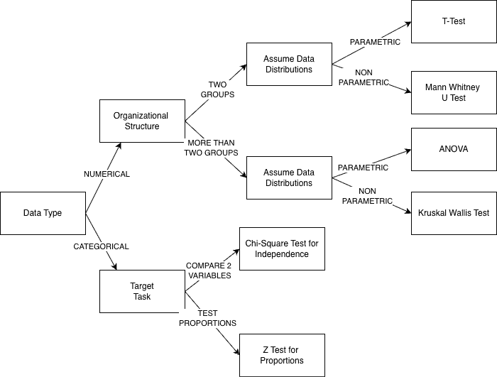
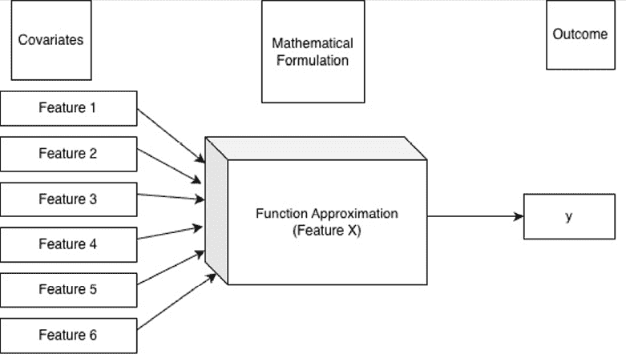
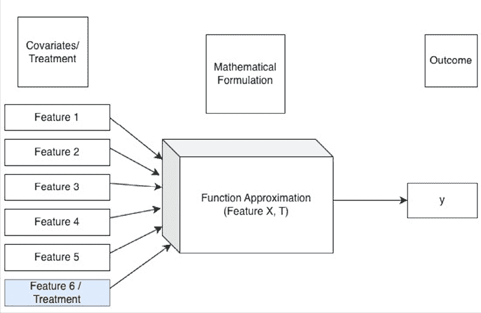
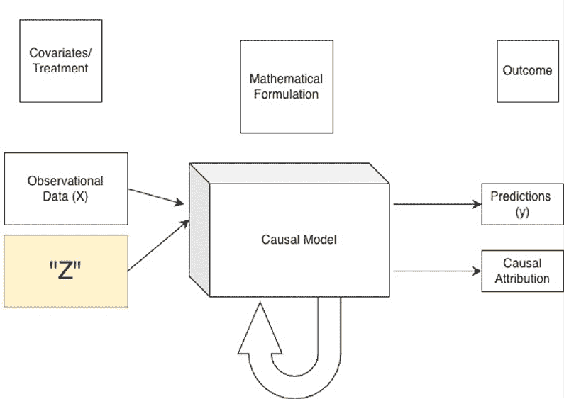

# 8

# 从指标到测量：实验和因果推断

在前两章中，我们建立了衡量“什么”的基础框架，并探讨了如何构建和运营交付我们产品的机器学习系统。现在，我们应该弥合部署和价值之间的差距。本章解决了任何业务中最关键的问题：“机器学习系统是否做到了它打算做的事情？”

回答这个问题是因果推断的科学。它是一套工具，使我们能够超越简单的相关性（“我们在推出信用卡功能后，电子商务销售额上升了”）到因果关系（“我们的电子商务销售额上升是因为我们推出了信用卡功能”）。

没有严格的测量，无法确定变化是否导致了有意义的改进，或者仅仅是随机机会或其他外部因素的结果。本章探讨了三种测量方法的家庭：黄金标准的随机对照试验、当实验不可行时使用的巧妙观察方法，以及处理复杂、高维数据的新的、强大的高级机器学习模型。

以下关键主题将涵盖：

+   随机对照试验 - 具有局限性的黄金标准

+   为什么我们不能仅仅使用机器学习？

+   观察方法 - 统计方法

+   观察方法 - 用于因果推断的高级机器学习模型

# 随机对照试验 - 具有局限性的黄金标准

**随机对照试验**（**RCTs**），也称为 A/B 测试，被认为是通过随机分配用户到控制组和处理组来衡量干预措施影响的黄金标准。

## 什么是 A/B 测试？

A/B 测试，或 RCT，是一种实验，其中客户群体被随机分成两个或多个组：一个控制组（A 组）接受现有的体验，一个或多个处理组（B 组、C 组等）接受该体验的新版本（例如，新功能、不同的机器学习模型或新的用户界面）。

为什么 A/B 测试很重要？它是衡量影响的黄金标准。通过随机化，我们确保组间唯一的系统性差异是我们引入的变化。这消除了选择偏差和其他混杂因素，使我们能够自信地声明，任何观察到的指标差异都是我们变化的结果。

其关键好处包括因果影响的直接、无偏测量。

这里有一些基本要点需要注意：

+   **控制组与处理组**：控制是基线；处理是变化。这两个组之间的比较是我们想要衡量的核心思想。

+   **基于假设的测试**：每个测试都必须从明确的假设开始。例如：“我们相信，*在商品页面用户群体旅程中引入个性化 ML 模型（变化）将增加移动新用户的*添加到购物车率*（指标），因为*它通过个性化定位提高了购买相关性*（理由）。”

+   **指标和 KPI 选择**：你必须定义你的指标**在测试之前**。

    +   **主要/目标指标**：将决定测试是否成功的单一指标（例如，*转化率*）。

    +   **次要/目标指标**：你期望提高的其他指标（例如，*平均订单价值*）。

    +   **警戒指标**：你不得损害的指标（例如，*页面加载时间*，*应用卸载*）。

+   **样本大小和统计显著性**：我们应该决定所需的样本大小。这取决于你的基线指标，你关心的**最小可检测效应**（**MDE**）（例如，“我只希望如果它能至少提高转化率 1%，我才启动这个项目”），以及你想要的统计显著性（p 值）和统计功效水平。

+   **随机化和偏差减少**：随机分配（“随机化器”）是最关键的组成部分。它必须确保每个用户都有平等的机会被分配到任何一组，并且分配是独立和无偏的。

这是你应该设计 A/B 测试的方式：

+   **定义目标**：你正在解决什么业务问题？

+   **选择正确的变体**：这将是一个 A/B 测试（一个控制组，一个处理组）还是一个 A/B/n 测试（例如，测试红色、绿色和蓝色按钮与原始按钮）？

+   **确定样本大小和功效分析**：一个功效不足（样本大小）的测试，即使功能**确实**更好，也可能得出结论不明确。这是一个常见且浪费的错误。

+   **确定合格/触发人群**：谁应该在这个实验中？*所有人*？还是，只有看到该功能的用户（例如，只有滚动到页面底部的用户才能看到新的页脚）？定义这个“触发器”对于分析至关重要。

+   **实验持续时间**：你必须运行多长时间才能获得所需的样本大小？这通常是速度和信心之间的权衡。你还必须运行足够长的时间来捕捉自然每周变化（例如，用户在周末的行为不同）。

运行 A/B 测试包括以下内容：

+   **实施最佳实践**：确保测试运行干净。代码中的错误如果只影响处理组或对照组，将使你的结果无效。

+   **确保数据完整性**：监控数据管道以确保你正确地为所有组记录事件。

+   **污染**：警惕用户“污染”其他组。例如包括网络效应（一个组中的功能使产品对所有用户都更好）或使用多个设备的用户（在手机上看到控制组，在笔记本电脑上看到处理组）。

+   **样本比例不匹配（SRM）**：一个关键的健康检查。如果你将测试设置为 50/50，但你的数据显示为 52/48 的分割，这表明你的随机化或记录中存在错误，你的结果不可信。

+   **常见陷阱**：过早查看结果（使频率派测试无效），一次性运行太多变体，或者当测试变得具有显著性时立即结束测试（p-hacking）。遵守你为运行测试分配的时间，以避免常见的失败。

要选择正确的统计测试，你使用的特定数学测试来计算 p 值和置信区间完全取决于你正在测量的指标类型。

以下流程图提供了一个决策框架：

图 8.1：一个流程图，帮助选择统计测试

这是如何解释 A/B 测试的：

+   **确定你的数据类型：**

    +   **分类**：你的指标是一个比例或比率吗（例如，点击率，转化率，“用户是否转化：是/否”）？如果是，你比较比例。对此常见的测试是比例的 Z 检验或卡方检验。

    +   **数值**：你的指标是一个连续的或离散的数字吗（例如，平均每位用户的收入，会话持续时间，购买的商品数量）？如果是，请进行下一步。

+   **确定你的组织结构（分组）：**

    +   **两组**：这是标准的 A/B 测试（控制组与处理组）。

    +   **超过两组**：这是 A/B/n 测试（例如，控制组与处理组 A 与处理组 B）。

+   **假设数据分布：**

    +   **参数（假设正态分布）**：如果你的数值数据是正态分布的（如钟形曲线），你可以使用参数测试。对于两组，这是 t 检验。对于超过两组，这是**方差分析**（**分析方差**）。

    +   **非参数（不做假设）**：网页和商业数据通常不是正态分布的；它们通常是偏斜的（例如，一些“鲸鱼”用户花费很多，而大多数人花费很少）。对于这种偏斜数据，非参数测试更安全且更稳健。对于两组，使用曼-惠特尼 U 检验。对于超过两组，使用克鲁斯卡尔-沃利斯检验。

+   **提升测量：**

    +   **绝对提升**：（处理指标 - 控制指标）。例如：2.2% - 2.0% = 0.2%。

    +   **相对提升**：（绝对提升 / 控制指标）。例如：0.2% / 2.0% = 10%。

+   **何时进行测试**：你应该在预定的持续时间或样本量满足时进行测试，而不是当它首次变得具有显著性时（除非你在进行顺序测试或多臂老虎机测试）。

这是你应该如何解释和采取行动的结果：

+   **如何做出数据驱动的决策**：首先，所有结果都是有用的，尤其是负面的结果。了解什么不起作用和了解什么起作用一样有用。如果结果是正面的且具有显著性，就推出它。如果结果是负面的，记住它。

+   **What to do when results are inconclusive**：一个“平坦”或非显著的结果是一个学习机会。这正是分割或队列分析至关重要的地方。整体平坦的结果是否隐藏了该功能对 iOS 用户有害但对 Android 用户有益？它是否适用于新用户但不适用于回头客？深入挖掘队列可以发现这些隐藏的见解，并导致部分发布或新迭代。

+   **Documenting learnings**：同样，每次测试，无论输赢，都会让你学到一些东西。将它们记录在中央存储库中，以构建机构知识。

接下来是一些需要注意的先进主题：

+   **Bayesian versus frequentist approaches**：

    +   **Frequentist (traditional)**：这种方法之前已经描述过。它是严格的，需要固定的样本量，并回答：“在没有效果的情况下，这些数据的概率是多少？”

    +   **Bayesian**：这是一个更直观的方法，它回答了直接的商业问题：“B 比 A 更好的概率是多少？”它提供“改善概率”，是灵活的（你可以“窥视”并在任何时间停止测试），并且通常更容易沟通。

+   **Personalization and segmentation**：在队列分析中，有一个想法是超越“一刀切”的发布，为从最大受益的用户细分市场发布功能。这通常是这种情况；不是所有模型都适用于所有客户队列。了解模型在哪里有效以及在哪里无效，可以为数据科学团队提供见解，以增强功能或模型。

### 多臂老虎机优化方法

A/B 测试非常适合找到单个“胜者”，但它们伴随着“遗憾”成本，因为一半的用户在整个测试期间都困在（可能更差的）对照组中。**多臂老虎机**（**MAB**）方法通过平衡探索（尝试所有变体）与利用（将更多流量发送到当前胜者）来解决这个问题。

**How it works**：

MABs 动态地将更多流量分配给表现最佳的“臂”（变体），从而降低实验成本并最大化测试期间的指标。

**Example**：

**Optimizing LLM-generated creatives**：想象一下，你使用 LLM 为新的活动生成 20 个不同的广告标题。运行包含 20 个变体的传统 A/B 测试会非常缓慢，并且会让用户接触到许多糟糕的标题。这是一个 MAB 的完美用例。MAB 系统会执行以下操作：

+   **Explore**：最初，它向一小部分用户展示所有 20 个标题，数量相等。

+   **Exploit**：在收集点击数据的过程中，它迅速识别出表现最佳的 3-4 个标题。

+   **Optimize**：它自动开始将大部分流量发送到这些“胜者”，同时仍然分配一小部分流量到其他变体，以防万一其中一个开始表现更好。这种方法可以更快地找到最佳创意，并减少损失的收入。

问题是，在 MAB 中老虎机是如何决定的。MAB 系统需要一种方法来决定如何平衡探索与利用已知的赢家。这就是特定算法发挥作用的地方。两种最受欢迎且最有效的策略是**上置信界**（**UCB**）和汤普森抽样。

+   **上置信界（UCB）**：这个算法是“乐观的”，来源于频率学派的思想。对于每个变体（或“臂”），它计算当前的平均性能加上一个“不确定性奖金”。

    +   对于数据非常少的变体，这个奖金很大（不确定性高）。

    +   对于已经大量测试的变体，这个奖金很小（不确定性低）。

    +   接下来，老虎机总是选择得分最高的臂（性能 + 奖金）。这种策略有效地迫使系统尝试那些测试较少的标题，以防它们是隐藏的宝石，同时仍然青睐已证明的赢家。

+   **汤普森抽样**：这来自贝叶斯学派的思想或“概率”方法，在实践中通常表现优异。它不仅仅跟踪一个数字（如平均点击率），而是为每个臂的性能维护一个完整的概率分布（一系列可能的值）。

    +   一个新的、未经测试的标题有非常广泛的分布（例如，“其真正的点击率可能在 1%到 10%之间”）。

    +   一个经过充分测试的赢家有非常狭窄的分布（例如，“我 99%确信其比率在 4.9%到 5.1%之间”）。

    +   为了做出选择，算法从每个臂的分布中随机抽取一个样本，并简单地选择在这一轮中产生最高样本的臂。这自然给已证明的赢家更多的流量，同时确保不确定（但可能很出色）的选项仍有机会被选中并证明其价值。

到目前为止，我们已经探索了随机对照试验、即 A/B 测试和 MABs 等方法，这些都属于主动实验的范畴。它们的强大之处在于一个关键能力：我们能够*控制*分配并随机化用户看到哪个变体。这种随机化是“金标准”，因为它确保了，在平均意义上，被比较的组在各个方面都相似，除了我们正在测试的变化。

但当你无法运行实验时会发生什么呢？

+   如果数据已经收集了呢？

+   如果在技术上不可能或成本过高，无法将用户随机分配到对照组，会发生什么？

+   如果拒绝一个群体使用新功能（如关键的安全补丁）是不道德的或代价高昂的，会发生什么？

我们经常拥有大量的观察数据。我们可以看到发生了什么；例如，哪些用户自然决定使用新功能，哪些没有，但我们不能确定地说他们的结果为什么不同，或者结果是否是用户选择该功能的真实反映。

这就是观察性因果推断的基本挑战：将相关性从因果关系中分离出来。在观察数据中，我们想要比较的群体几乎从不相同。选择采用新功能的用户可能更投入，iPhone 用户可能更懂技术，或者比那些没有采用的人更熟悉这个平台。是功能使他们更投入，还是他们一开始就更有投入？

这就是为什么一套新的准实验方法工具包变得至关重要。以下几节将介绍旨在通过智能地考虑这些潜在差异并隔离特征的真实因果影响的强大技术。我们将从“发生了什么？”转移到“*本可能发生什么*？”

# 我们为什么不能直接使用机器学习？

现在我们知道我们不能仅仅通过实验来模拟历史干预。我们不能随机分配一些用户去“获得贷款”，而其他人则不。在这种情况下，我们依赖于准实验方法进行测量，这些方法使用统计技术使用历史数据来近似实验。

但我们能否在这里使用函数逼近机器学习？不幸的是，答案是不了，解释有点复杂。让我们通过以下图示来了解预测模型在最基本层面上做什么：

图 8.2：预测模型执行函数逼近，将 X 映射到 y

前面的图示解释了典型的机器学习模型主要负责对给定特征集 X 进行函数逼近，X 试图预测结果 y。

这是一个关键的区别。标准的预测模型是为了回答，“会发生什么？”

**示例**： “谁最有可能在试用会员后注册为付费客户？”

在这个模型中，所有输入，用户特征（x1, x2...）和任何治疗（T），都被视为特征包。该模型擅长发现相关性并做出准确的预测，但它从根本上混淆了相关性和因果关系。它无法告诉你试验折扣是否导致了转化，或者获得折扣的用户是否仅仅因为在线更投入而一开始就更有投入。

另一方面，因果模型是为了回答一个完全不同的问题而构建的：“如果我们做些什么？如果这件事发生了，会发生什么反事实情况？”以下图示说明了这一概念：

图 8.3：因果模型探索“如果”场景，检查干预措施的反事实结果

**示例**： “给予 10%折扣对会员注册率的影响是什么？”

为了回答这个问题，治疗（T），即图中描述为“T”的“折扣”，不能再仅仅是一个特征。它必须被视为“一等公民”。整个模型的目标从预测结果转变为隔离 T 对那个结果的精确、独立的影响。

如果我们在这里应用机器学习进行函数逼近，它不会将“折扣”视为一等公民，并认为所有特征都是相同的，这会削弱整个隔离治疗对结果影响的整个目标。

那么，因果模型需要什么（除了数据之外）？以下图示显示了答案：

图 8.4：因果建模超越了函数拟合，需要数据加上因果假设（Z）

这种转变意味着因果模型需要的不仅仅是函数逼近，我们可以从模型.model.fit(X, y)拟合中获得。正如前面的图示所示，模型需要数据和明确的“Z”因素。这个“Z”代表我们的因果假设，即我们对系统如何工作的理解。

现在，让我们回顾一下在运行此因果模型之前我们需要的所有内容。我们必须定义以下内容：

1.  **因果问题**：治疗（T）是什么，结果（y）是什么？

1.  **混杂因素**：哪些其他变量（x）同时影响治疗和结果？例如，用户的“参与度”可能影响他们是否获得折扣（T）以及他们是否注册付费会员（y）。我们必须明确识别并控制这些。

1.  **因果结构**：我们相信什么导致什么？这通常在分析开始之前在图中绘制出来。

这些假设是设计的“准实验”部分。我们正在使用我们的知识来构建一个结构，试图从从未进行过实验的数据中统计“设计”一个实验。

“Z”在这里是什么？我们对系统的理解超越了数据。这种理解决定了我们想要实验的方法：

+   如果理解是网络，什么导致什么，那么我们可以尝试的方法是贝叶斯网络

+   如果理解与混杂因素（混杂因素被定义为同时影响治疗（分配）和结果的因素）是通用的，那么我们可以尝试的方法是 DoWhy + EconML

+   如果理解是先验信念，那么我们可以尝试的方法是贝叶斯过滤器

这种对显式结构的需求导致了两大类因果方法的产生。我们将从探索基础观察性方法开始，其中许多方法起源于计量经济学。这些技术使用巧妙的“设计”来隔离因果效应。之后，我们将介绍利用机器学习处理复杂、高维数据并找到个性化因果效应的新一代高级 ML 模型。

# 观察性方法 - 统计方法

目标是隔离处理（例如，折扣）对结果（例如，付费注册）的影响。这些统计方法通常分为两类：创建可比组的匹配方法（如 PSM、合成控制和 DiD）和利用特定数据结构来估计效应的建模方法（如 RDD 和 IV）。

+   **倾向得分匹配（PSM）**：试图从观察数据中创建一个“控制组”。它计算任何给定个体接受“处理”的概率（倾向得分），然后匹配具有相似倾向得分的处理和未处理个体。

+   **合成控制匹配**：通过找到一个非处理单位的加权组合（例如，其他城市）来创建一个“合成”控制组，该组合最好地匹配处理单位（例如，你启动新广告活动的城市）的预处理趋势。

+   **双重差分（DiD）**：当您有来自干预前后的处理组和未处理组的数据时使用的一种强大技术。它从控制组的干预前到干预后的变化中减去处理组的干预前到干预后的变化，从而隔离处理效应从潜在趋势中。

+   **回归断点设计（RDD）**：当根据锐利截止点分配处理时使用（例如，分数超过 80 的学生获得奖学金）。通过比较刚好高于和刚好低于该截止点的个人的结果，我们可以估计奖学金的因果影响。

+   **工具变量（IV）**：一种复杂但强大的方法，它找到一个与处理变量相关但与结果变量不相关（除了通过处理）的第三变量（即“工具变量”）。这有助于从混杂变量中隔离真正的因果效应。

这些经典方法非常强大，但通常依赖于特定的数据结构（例如 RDD 的锐利截止点）并且可能难以处理高维或非线性数据。接下来，我们将看到机器学习的原理如何与这些因果目标相结合，以创建更加灵活和强大的模型。

# 观察性方法 - 高级机器学习方法

一类新的方法使用现代机器学习来处理因果问题的多维和非线性特性，特别是对于个性化。

+   **因果树和森林**：这些是针对因果推断而改编的（随机）森林。它们将数据分区以找到处理效应差异最显著的子组，有助于揭示异质（不均匀）效应。

+   **双重机器学习（DML）**：使用两个机器学习模型，一个用于预测结果，一个用于预测处理，然后在最终估计步骤中使用两个模型的残差（误差）。这是一种控制许多混杂变量的稳健方法。

+   **提升建模**：这是实现真正个性化的关键。而不是对结果进行建模（例如，“这个用户会转化吗？”），提升模型直接对治疗效果本身进行建模（例如，“如果我向他们展示这个广告，这个用户转化的额外概率是多少？”）。这允许你只针对“可说服的”用户，避免在那些无论如何都会转化（“确定的事情”）或永远不会转化（“无望的事情”）的用户上浪费资源。

+   **贝叶斯结构时间序列（BSTS）**：谷歌推广的一种用于时间序列数据的方法。它构建了一个模型，在没有干预的情况下，一个指标（例如，加利福尼亚的销售）会发生什么，然后将这个“合成”预测与实际发生的情况进行比较。

+   **因果深度学习（用于因果推断的神经网络）**：一个新兴领域，利用神经网络的力量来模拟复杂的因果关系，特别是在具有非结构化特征的数据（如图像或文本）中。

我们刚刚讨论的因果方法对于从历史数据中学习和理解复杂、假设性的问题非常强大。它们擅长事后分析，从而回顾过去理解什么有效以及为什么有效。现在，让我们将我们的关注点从离线分析转移到在线优化。当我们进行实时实验时，我们的目标不仅仅是学习，而是尽可能快地学习和实时调整我们的决策。

下几节将探讨针对这一特定挑战的先进方法。我们首先将研究顺序 A/B 测试，以提高实验效率，然后深入探讨强化学习作为连续、自动化决策的强大框架，这是投币问题的复杂演变。

## 顺序 A/B 测试及其相对于 RCTs 的优势

传统的 A/B 测试在分析之前需要固定的样本量，如果某个变体一开始就明显优于其他，这会导致时间和资源的浪费。顺序 A/B 测试通过允许持续评估来提高效率。

为什么选择顺序 A/B 测试？

1.  **早期停止**：如果一个新功能明显优于其他，测试可以提前终止，节省资源。

1.  **降低样本需求**：通过在结果明确时提前停止测试，所需的样本量减少。

1.  **更高效的实验**：不必等待整个测试周期结束，决策可以动态进行。

**示例**：顺序 A/B 测试与 A-B-C 测试

考虑一家公司正在测试着陆页的三个变体（A、B 和 C）。A-B-C 测试需要在得出结论之前收集所有三个变体的足够数据。顺序方法（例如，先进行 A-B 测试，然后测试最佳变体与 C）确保了显著的样本量和更快的迭代。

### 有趣的观点：强化学习与模型预测控制

**强化学习**（**RL**）和**模型预测控制**（**MPC**）都侧重于自适应学习，但在方法上有所不同。

强化学习（RL）是一种通过与环境交互、接收奖励并在时间上更新其策略来学习的代理方法。

关键特性包括以下内容：

+   通过尝试错误学习最佳策略。

+   根据观察到的奖励更新策略。

+   随时间自适应地优化策略。

**示例**：一个推荐系统根据持续的用户反馈改进其个性化。

模型预测控制（MPC）是一种控制方法，它预测未来的系统状态并相应地优化决策。

关键特性包括以下内容：

+   使用系统模型来预测结果。

+   在滚动时域内优化行动。

+   比纯强化学习更稳定，但需要领域知识。

**示例**：一辆自动驾驶汽车根据预测的交通流量调整加速和制动，而不是仅仅从经验中学习。

这两个之间的关键区别如下：

| **特征** | **强化学习（RL）** | **模型预测控制（MPC）** |
| --- | --- | --- |
| **适应方法** | 尝试错误 | 预测优化 |
| **使用先前数据** | 有限 | 强烈依赖模型 |
| **稳定性** | 可能会经历不稳定性 | 更稳定的控制 |

为什么选择其中一个而不是另一个？

+   当环境不确定且长期学习有益时，使用强化学习（RL）。

+   当存在良好的系统模型且稳定性至关重要时，使用模型预测控制（MPC）。

    **注意**

    测量技术对于评估机器学习模型、指导优化策略和确保业务影响至关重要。随机对照试验仍然是一种基础方法，但在某些情况下存在局限性，需要因果推断方法。多臂老虎机提供实时优化，尤其是在搜索引擎等动态环境中。顺序 A/B 测试通过动态调整样本大小和提前停止测试来提高效率。最后，强化学习和模型预测控制提供了适应学习的不同方法，每种方法都有其特定的优势。通过选择适当的测量和适应技术，组织可以实现稳健、数据驱动的决策过程，从而推动持续改进。

# 概述

本章提供了因果推断的全面指南，这是证明 ML 系统*导致*特定业务结果的必要科学，使我们超越了简单的相关性。这是关键的第三步，直接建立在我们的先前工作之上，即定义指标（第六章）和实施模型（第七章）。

我们从“黄金标准”的实验方法开始，重点放在 A/B 测试（RCTs）上。我们探索了其整个生命周期，从定义一个坚实的假设和选择指标的基础，到执行的实际问题，如计算样本量和密切监控如**样本比例不匹配**（**SRM**）等陷阱。我们看到了如何选择正确的统计测试，如何通过队列分析揭示隐藏的见解，并对比了频率主义和贝叶斯测试哲学。我们还探索了更有效的方法，如用于早期停止的顺序 A/B 测试和**多臂老虎机**（**MABs**），这对于动态测试许多变体是完美的。

从那里，我们转向了观察方法，这是在随机实验不可能进行时的工具箱，我们看到技术如**差异-差异法**（**DiD**）和**倾向得分匹配**（**PSM**）如何从统计上*近似*一个对照组。然后，我们探索了高级机器学习模型的新前沿，例如提升模型，它使我们从衡量平均效果转向个性化干预。最后，我们对比了**强化学习**（**RL**）和**模型预测控制**（**MPC**）的适应性学习方法。

在建立了这些用于*衡量影响*和*做出数据驱动决策*的严格框架后，我们现在可以评估下一波主要的技术变革。我们刚刚学到的工具，A/B 测试、MABs 和因果推断，正是企业需要来验证我们这个时代最具变革性技术——生成式人工智能的价值。在下一章中，我们将探索这个新领域，研究生成式人工智能如何重塑商业，作为决策的副驾驶，并创造全新的创新机会。

# 订阅免费电子书

新框架、演进的架构、研究更新、生产分解——*AI_Distilled*将噪音过滤成每周简报，供工程师和研究人员使用，他们亲手与大型语言模型和通用人工智能系统合作。现在订阅，即可获得免费电子书，以及每周的洞察力，帮助您保持专注并获取信息。

在[`packt.link/8Oz6Y`](https://packt.link/8Oz6Y)订阅或扫描下面的二维码。

