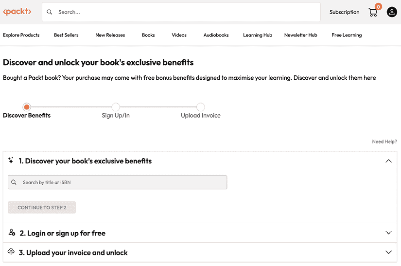

# 17

# 解锁您的专属福利

您的这本书包含以下专属福利：

+    新一代 Packt 阅读器

+    免 DRM PDF/ePub 下载

按照以下指南操作以解锁它们。此过程只需几分钟，并且只需完成一次。

# 三步轻松解锁本书的免费福利

## 第 1 步

准备好您的购买发票以进行**第 3 步**。如果您有实体副本，请使用手机扫描并将其保存为 PDF、JPG 或 PNG 格式。

如需查找发票的更多帮助，请访问 [`www.packtpub.com/unlock-benefits/help`](https://www.packtpub.com/unlock-benefits/help) 。

**注意**

如果您直接从 Packt 购买此书，则无需发票。在**第 2 步**之后，您可以直接访问您的专属内容。

## 第 2 步

扫描二维码或访问 [packtpub.com/unlock](http://packtpub.com/unlock) 。

在打开的页面（类似于桌面上的*图 17.1*），通过名称搜索此书并选择正确的版本。

图 17.1：桌面上的 Packt 解锁页面

## 第 3 步

选择您的书籍后，登录您的 Packt 账户或免费创建一个账户。然后上传您的发票（PDF、PNG 或 JPG，最大 10MB）。按照屏幕上的说明完成此过程。

|

# 需要帮助？

如果遇到困难需要帮助，请访问 https://www.packtpub.com/unlock-benefits/help 获取如何查找发票等详细 FAQ。此二维码将带您到帮助页面。 |  |

注意

如果您仍然遇到问题，请联系 [customercare@packt.com](https://customercarepackt.com) 。
