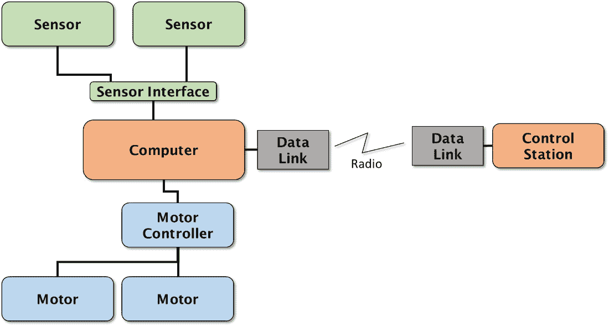
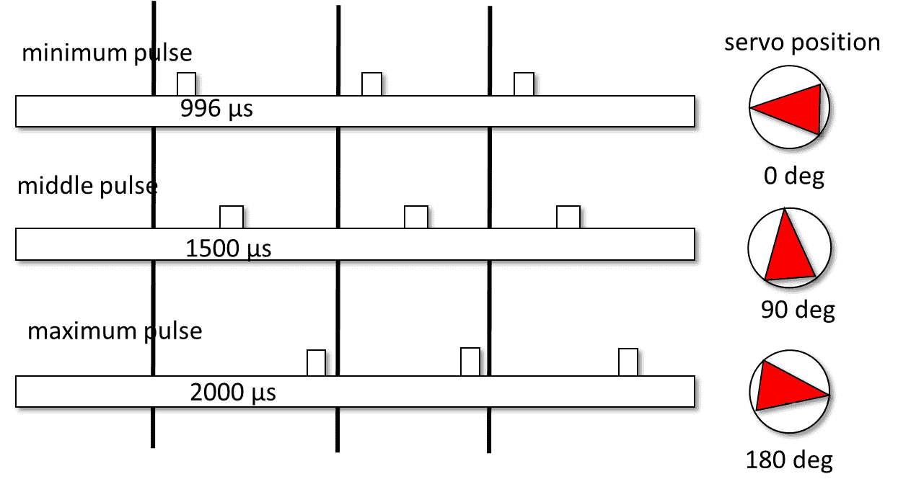
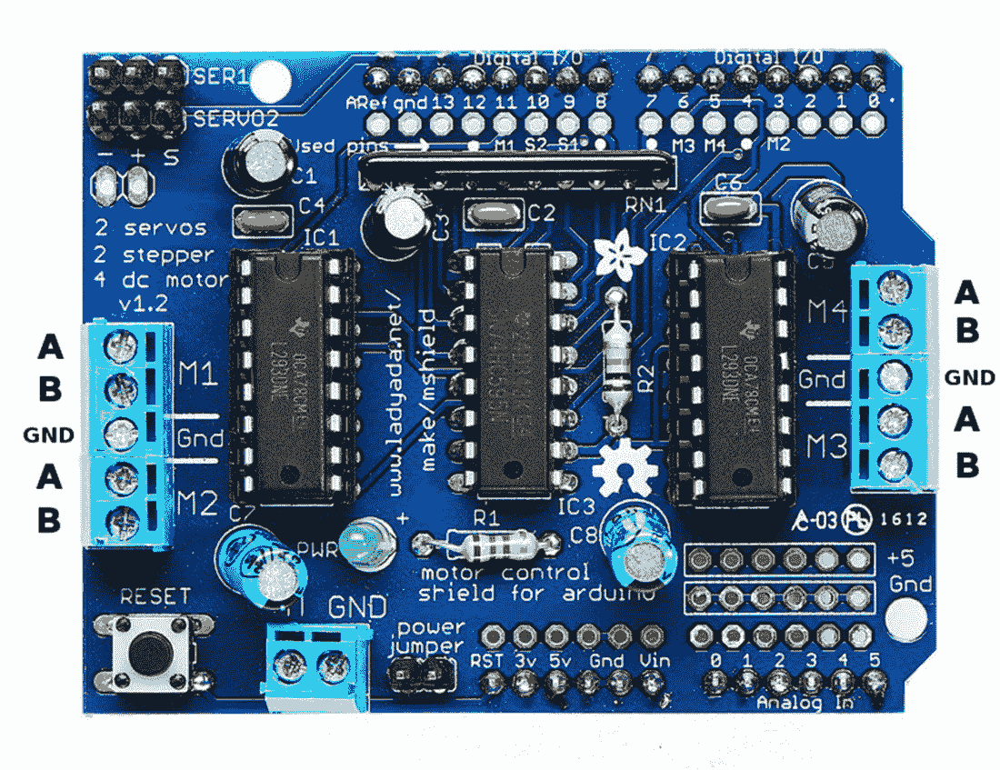
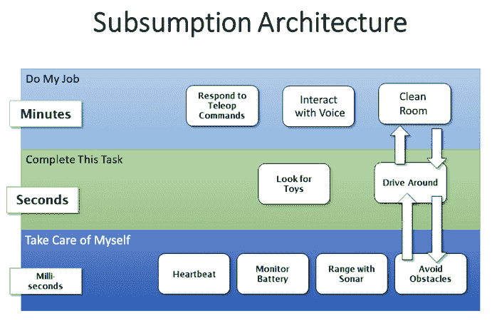
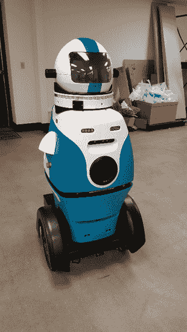
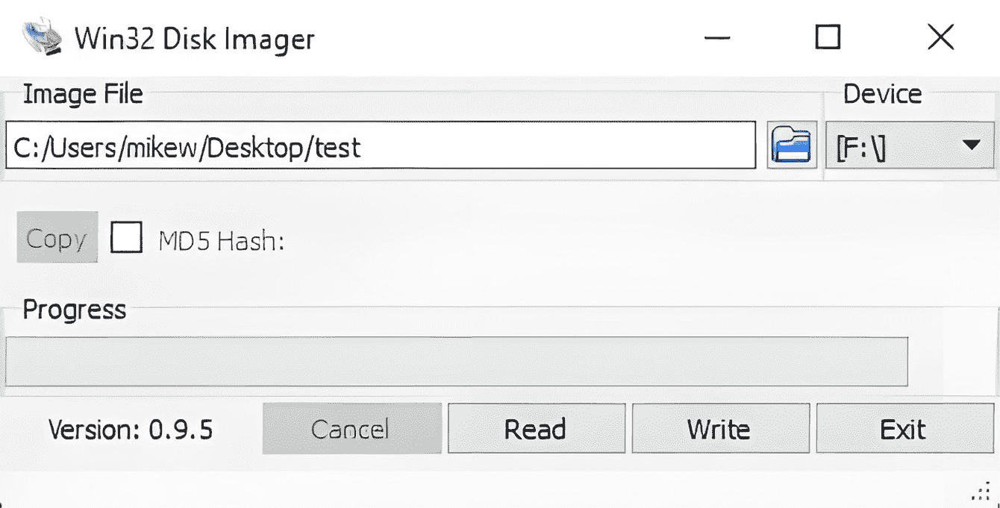
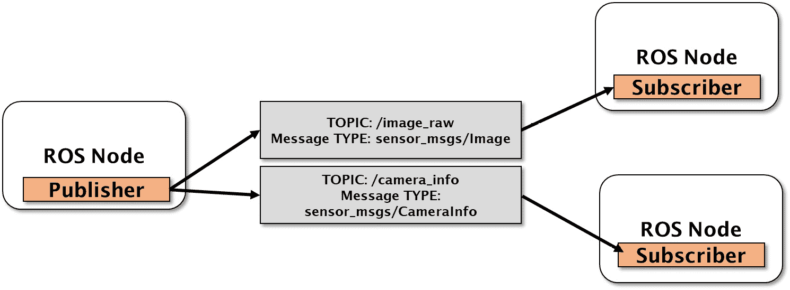

# 第二章：设置您的机器人

本章从我对机器人是什么以及机器人由什么组成的思考开始，这是一个相当标准的部件和组件列表。本章旨在让您能够复制练习并使用书中找到的源代码。我将描述我是如何设置我的开发环境的，我使用了哪些工具来创建我的代码，以及如何安装**机器人操作系统版本2**（**ROS 2**）。我使用的示例机器人Albert的组装可以在本书的GitHub仓库中找到。还有许多其他类型和配置的机器人可以通过对本书中的代码进行一些修改来与之配合工作。我将尝试提供所有可能的快捷方式，包括我机器人SD卡的全图，在Git仓库中。

在本章中，我们将涵盖以下主题：

+   理解机器人的解剖结构

+   介绍吸收架构

+   ROS简介

+   软件设置：Linux，ROS 2，Jetson Nano，和Arduino

# 技术要求

要完成本章中的实践练习，您将需要本书开头**前言**中指定的要求。本章的代码可以在[https://github.com/PacktPublishing/Artificial-Intelligence-for-Robotics-2e/](https://github.com/PacktPublishing/Artificial-Intelligence-for-Robotics-2e/)找到。

# 理解机器人的解剖结构

机器人是一种能够自行执行复杂动作和行为的技术设备。大多数机器人由计算机或数字可编程设备控制。机器人的一些关键特性如下：

+   **自动化**：机器人可以在没有直接人类输入的情况下自动运行，基于它们的编程。这使得它们可以持续地执行重复性或危险的任务。

+   **传感器**：机器人使用摄像头、光学、激光雷达和压力传感器等传感器来收集有关其环境的信息，以便它们可以导航和交互。这些感官信息被处理以确定机器人应采取哪些行动。

+   **编程**：机器人的“大脑”由一个运行代码和算法的机载计算机或设备组成，这些代码和算法定义了它的行为方式。机器人由人类编程以执行所需的行为。

+   **移动**：大多数机器人能够通过轮子、腿、螺旋桨或其他运动系统在一定程度上移动。这使得它们能够在环境中移动以执行任务。

+   **交互**：高级机器人可以通过语音、视觉显示、灯光、声音、物理手势等方式与人类进行交流。这允许有用的人类-机器人交互和工作。

+   **自主性**：虽然机器人由人类编程，但它们在实现目标的方式上具有一定的自我治理和独立性。在没有人类监督的情况下采取行动和做出决策的能力是它们的自主性。

总结来说，机器人集成了自动化、感知、移动、编程和自主性，以可靠地执行可能复杂、重复、不安全或不适于人类的工作。它们形状和大小各异，从工业机器人臂到社交伴侣机器人，再到自动驾驶汽车。

有一个相当标准的组件和部件集合，构成了绝大多数机器人的主体。即使是外表差异很大的自动驾驶汽车、制造汽车的焊接机器人，以及Roomba吸尘器，它们也有很多相同的组件或部件。有些可能会有更多，有些可能会有更少，但大多数移动机器人将具有以下几类部件：



图2.1 – 典型移动机器人的框图

让我们更详细地看看这些组件：

+   **计算机**：运行控制机器人的程序的单元。这可以是一台传统计算机、一个微控制器、一个**单板计算机**（**SBC**）如我们所拥有的，或者某种其他类型的处理器，它发送和接收命令。机器人臂和一些类型的工业机器人将使用**可编程逻辑控制器**（**PLC**），这是一种特殊的控制器，它将逻辑（*AND*、*OR*、*NOT*）应用于各种输入以产生输出。为了使计算机能够向机器人发送命令并接收遥测数据，我们需要某种类型的传感器接口，例如USB端口、串行端口、**通用输入/输出**（**GPIO**）端口，或者如以太网或Wi-Fi之类的网络接口。

+   **控制站**或**人机界面**（**HRI**）：机器人被设计来执行任务，这要求操作员必须有一些方式来发送和接收来自机器人的数据，并监督机器人是否表现正确。我们将使用笔记本电脑或台式计算机来完成这个功能，并且我们将通过无线网络与机器人进行通信。我们的控制站向机器人发送命令，并从机器人那里接收**遥测数据**，这些数据以**数据**、**视频**或**音频**的形式存在。

+   **无线电**或**数据链路**：移动机器人，如我们在本书中设计的机器人，能够移动和探索它们的环境。虽然通过绳索或电线向机器人发送命令是可能的，但首选的方式是使用无线电链路。无线网络如Wi-Fi和蜂窝数据服务的普遍可用性使得创建数据链路变得容易得多。我有很多机器人项目，其中网络链路不可用或不切实际，需要设计定制无线电解决方案。在机器人中使用的其他类型的无线电包括蓝牙、Zigbee以及各种网状网络系统，如Flutter。

+   **电机**或**执行器**：我们定义的机器人包括**自主推进**的能力；也就是说，机器人能够移动。为了移动，机器人需要电机或一组电机。我们的机器人，阿尔伯特，有十个电机，四个用于驱动，六个用于控制机器人手臂和手。电机将电能转化为运动。有各种不同的类型，选择正确的电机是一项挑战。你必须匹配扭矩（电机能拉多硬），电机轴的转速（每分钟的转数），以及电压。以下是选择机器人驱动系统电机时需要考虑的一些关键因素：

    +   **扭矩**：考虑机器人运动和负载处理所需的扭矩。更大的扭矩允许更快的加速和承载更重负载的能力。如果扭矩不足，机器人会“陷入困境”或使电机停转。电机在停转时（它被供电但不动）会拉取最多的电流。所有这些无法使用的能量都会转化为热量，最终会熔化电线或引起火灾。

    +   **速度**：确定机器人需要运行的速度。更高的速度需要具有更高RPM（每分钟转数）的电机。我们只希望我们的机器人以适度的速度行驶。玩具无法逃脱。

    +   **负载周期**：选择一个可以在不过热的情况下连续运行机器人所需负载周期的电机。间歇性负载周期允许使用更小、更轻的电机。我们将驾驶或移动很多——大约50%的时间，但不会太快。

    +   **尺寸和重量**：大型、重型电机提供大量功率，但可能会限制机器人设计。考虑整个驱动系统的尺寸和重量。记住电机本身也需要移动。

    +   **控制**：无刷直流电机需要电子速度控制器。步进电机允许开环位置控制。伺服电机，如机器人手臂中的电机，具有集成编码器，并通过串行接口控制。我使用的驱动电机是刷式电机，通过改变电压来控制，我们通过**脉冲宽度调制**（**PWM**）来控制电压。

    +   **电压**：高电压允许小型电机输出更多功率。选择与其它电子设备兼容的电压。我的电池是7.2伏，与选定的电机相匹配。

    +   **噪音**：家庭/办公室机器人可能需要安静的电机。无刷、减速电机很安静但价格昂贵。齿轮传动系统也很嘈杂。

    +   **成本**：更强大的电机成本更高。在性能需求和预算限制之间取得平衡。阿尔伯特的刷式电机非常便宜。

    一些机器人电机还配备了变速箱以降低电机速度，基本上是以速度换取扭矩。阿尔伯特的电动电机具有减速变速箱，允许电机以比车轮更快的速度运行。

    为机器人提供运动的方式有很多。我们把这些使机器人移动的“东西”称为**执行器**。执行器的限制仅在于你的想象力，包括**气动**（由压缩空气驱动的装置）、**液压**（由不可压缩流体驱动的装置）、**线性执行器**（将旋转运动转换为线性运动的装置）、**旋转关节**或**回转关节**（如肘关节一样的角关节）以及甚至一些异类执行器，如**形状记忆合金**或**压电晶体**，当施加电力时它们会改变形状。

+   **伺服电机**：我们机器人中的一些电机属于一种特殊的电机类别，称为**伺服电机**。伺服电机具有反馈机制和控制回路，用于维持位置或速度。反馈由某种**传感器**提供。我们使用的伺服电机由一个小型电动机驱动一个由一系列齿轮组成的变速箱，这些齿轮降低了速度并相应地增加了电机的扭矩。我们使用的传感器是一个电位计（可变电阻），可以测量输出齿轮轴的角度。当我们向伺服电机发送命令时，它会告诉电机设置到特定的角度。角度由传感器测量，电机位置与传感器之间的任何差异都会产生一个错误信号，该信号将电机移动到正确的方向。你可以听到电机发出很多噪音，因为电机需要通过七个减速齿轮转动多次才能使机械臂移动。变速箱使我们能够在不消耗太多电流的情况下获得大量的扭矩。

    *图2.2*展示了如何使用**脉冲位置调制**（**PPM**）来控制伺服电机。要控制伺服电机，你必须生成一个特定宽度的脉冲：



图2.2 – 伺服电机控制通过PPM信号

短脉冲将伺服电机移动到其范围的起始位置。中等脉冲（1,500微秒）是伺服电机位置的中间。晚脉冲会导致伺服电机移动到其范围的末端。我在这个版本的机器人中使用的机械臂有一个与机械臂硬件一起提供的伺服控制器。我们将通过串行命令控制这个控制器，具体在[*第五章*](B19846_05.xhtml#_idTextAnchor159)中介绍。

+   **电机控制器或电子速度控制器**：电机本身并不很有用——你需要将控制计算机的命令转换为电机运动的能力。由于电机需要的电压和电流比控制计算机（我们的Jetson Nano）能提供的要多，我们需要一个设备将小的数字信号转换为大的模拟电压和电流。这个设备被称为电机控制器。这个控制器我必须单独购买，并且由两部分组成——一个Arduino Uno和一个连接到其上的电机控制器屏蔽板：



图2.3 – 我为Albert使用的电机控制器屏蔽板

如图中所示，四个电机线连接到字母连接处。

+   由于我们有一个坦克式驱动机器人（我们通过以不同速度运行电机来转向，也称为**差速驱动**），我们还需要电机能够向前或向后运行。电机控制器接收一个特殊的输入信号，称为**脉冲宽度调制**（**PWM**）。PWM是一个重复信号，其中电压开启和关闭。电机的油门（电机转速）与PWM信号保持**开启**状态的时间成正比。

    电机控制器有几种类型的连接，由于提供的高电压和大电流，必须仔细接线。这可以通过以下步骤完成：

    +   有两个**控制线输入**——一个用于速度（PWM信号）和另一个是方向信号。我们通过改变**方向信号**将电机置于倒车状态——1表示前进，0表示后退。

    +   接下来我们需要的是**地面**——确保发送PWM信号（在我们的例子中，是Arduino Mega）和控制电机有它们的接地线连接是非常重要的。

    +   接下来，电机控制器需要**电机电压**和**电流**，这些我们可以直接从我们的电池中获得。

    +   最后，我们将每个电机的两根线连接到控制器上。有趣的是，我们并不关心哪根线连接到电机的哪一侧，因为我们可以同时向前和向后运行。如果电机转向错误，只需交换两根线。这是唯一一次在科幻电影之外说“*只需反转极性*”的时候。

    我们将在在线附录中介绍示例机器人——Albert——的具体接线。

+   **传感器**：为了让机器人，一个可以移动并对环境做出反应的机器，能够看到其周围的环境，它需要传感器。传感器从机器人的外部或内部获取信息并将其转换为数字形式。如果我们使用数字**摄像头传感器**，它将光转换为数字像素（图像元素），记录为数组。一个**声纳传感器**通过发送能量脉冲（声波）并监听回声前的延迟时间来测量到物体的距离，例如墙壁。测量延迟时间给我们提供了到物体的距离，因为声速相对恒定。在我们的Albert项目中，机器人有几种类型的传感器：

    +   我们的**主要传感器**是一个广角视频摄像头，我们将用它来避开障碍物和检测物体。

    +   我们还将使用一个**麦克风**来监听声音并执行语音识别。

    +   我们在本列表中之前提到过伺服电机——每个伺服电机都包含一个**角度传感器**，它可以检测旋转量并允许我们控制机械臂和手。

    +   我们有我们的**紧急停止按钮**，它连接到Arduino，是一种触觉（触摸）传感器。当按钮被按下时，机器人可以将其解释为停止命令。

    +   我选择的机器人手臂有一个方便的**电压监控器**，我们将用它来跟踪剩余的电池寿命（充电）。

在下一节中，我们将讨论机器人软件架构，它将作为我们创建的自主行为的框架。

# 介绍吞没式架构

在这一点上，我想花点时间讨论一下**吞没式架构**背后的理念，并指出我们将如何在我们的机器人项目设计中使用这个概念的一些具体细节。你们中的许多人可能在学校或学习中已经熟悉了这个概念，所以你们可以看看我的图，然后继续前进。对于其他人，让我们谈谈这个受生物学启发的机器人概念。

吞没式架构最初由麻省理工学院教授罗德尼·布鲁克斯博士描述，他后来帮助创立了iRobot公司并发明了Baxter机器人。罗德尼试图开发昆虫大脑的类似物，以便了解如何编程智能机器人。在此之前的机器人（1986年）基本上是单线程机器，一次只能做一件事。它们读取传感器，做出决定，然后行动——在任何时候只有一个目标。像苍蝇或蚂蚁这样的生物拥有非常简单的头脑，但仍然能够在现实世界中发挥作用。布鲁克斯推理认为，存在多个同时进行的闭环反馈过程层。

吞没式的基本概念已经存在了一段时间，自从首次引入以来，它已经被适应、重用、改进和简化。我在这里展示的是我对如何将吞没式概念应用于我们试图达成的机器人环境中的解释。

首先要理解的是，我们希望我们的机器人能够根据一系列目标行动。机器人并不是简单地对每个刺激做出完全独立的反应，而是执行某种以目标为导向的行为。目标可能是捡起玩具或导航房间，避开障碍物。我们正在创建的范例是让用户为机器人设定目标，机器人决定如何实现这些目标，即使目标仅仅是向前移动一米。

问题始于机器人需要在同一时间记住多个目标。机器人不仅仅是四处驾驶，还要在避开障碍物的同时寻找可以捡起的玩具。我们如何在这不同的目标之间进行仲裁，以确定哪个目标具有优先级？答案可以在下面的图中找到：



图2.4 – 吞没式架构示例

我们将把机器人的决策系统分为三个层次，每个层次都有不同的责任级别和不同的时间尺度。

在最低层，我们可以称之为机器人的自主神经系统——它包含机器人内部的健康保持和监控功能。这些过程运行得非常快——大约每秒20次，或者说20赫兹（Hz），并且只处理机器人内部的事情。这包括读取内部传感器、检查电池电量以及读取和响应心跳消息。我把这个层次标记为*照顾好自己*。

重要注意事项

什么是**心跳消息**？每秒一次，我会让控制站向机器人发送一个特殊的心跳消息，这个消息的时间标签精确到毫秒，即主机的时钟时间。这个消息传到控制计算机，并重复将心跳消息发送回主机。我们可以通过比较时间标签来看到我们消息的延迟——我们的命令延迟。我们希望看到心跳的往返时间小于25毫秒。如果机载计算机不工作或被锁定，那么时间标签就不会返回，我们就知道机器人出现了问题。

下一层处理单个任务，例如驾驶或寻找玩具。这些任务是短期性的，处理传感器可以看到的事情。决策的时间周期在秒的范围内，因此这些任务的更新率可能是1或2赫兹，但比内部检查慢。我把这个层次称为*完成任务*——你可能称之为*驾驶车辆*或*操作有效载荷*。

最后一层和最高层是专门用于*完成任务*的部分，它处理机器人的整体目的。这一层有寻找玩具、捡起它们然后放回原处的整体状态机，这是这个机器人的任务。这一层还处理与人类交互和响应命令。顶层处理需要几分钟甚至几小时才能完成的任务。

吞没架构的规则——甚至它的名字从何而来——与这些层级中进程的优先级和交互有关。规则如下（这是我的版本）：

+   每一层只能与相邻的层通信。顶层只与中间层通信，底层也只与中间层通信。中间层可以与顶层和底层通信。

+   低层次的层级具有最高优先级。低层有中断或覆盖高层命令的能力。

想想这个问题。我给你举了一个在房间里驾驶我们机器人的例子。最低层检测障碍物。中间层将机器人驱动到特定方向，顶层则指导任务。从上到下，最高层被命令去*清理房间*，中间层被命令去*四处驾驶*，底层则接收到*左电机和右电机前进60%油门*的命令。现在，底层检测到一个障碍物。它中断了*四处驾驶*功能，并覆盖了来自顶层的命令，使机器人避开障碍物。一旦障碍物被清除，最低层将控制权交还给中间层以确定驾驶方向。

另一个例子是，如果最低层失去了心跳信号，这表明软件或硬件出现了问题。最低层会停止电机，覆盖来自上层的一切命令。无论他们想要什么；机器人出现了故障，需要停止。这种最低层具有最高优先级的**优先级反转**是我们称之为吸收架构的原因，因为高层吸收——整合——低层的功能以执行其任务。

这种组织方式的主要好处是它使程序清晰，明确哪些事件、故障或命令比其他事件、故障或命令具有优先级，并防止机器人陷入犹豫不决的循环。

每种机器人的架构中可能具有不同数量的层级。你甚至可以有一个**监督层**来控制多个其他机器人，并为机器人团队设定目标。我迄今为止最多使用过五个层级，这被应用在我的一个自动驾驶汽车项目中。

现在，让我们看看这本书中你需要了解的最重要概念之一——ROS。

# ROS 简介简述

好的，在我们完成以下部分描述的所有工作以使用 ROS 2——机器人操作系统的第二个版本——之前，让我们回答你的问题。ROS是什么，它的优点是什么？

首先要知道的是，ROS不是一个真正的操作系统，如Linux或Windows。相反，它是一个中间件层，作为连接不同程序以协同工作控制机器人的手段。它最初是为运行 Willow Garage 的 PR2 机器人而设计的，这个机器人确实很复杂。ROS 由一个非常大的开源社区支持，并且不断更新。

我曾经是 ROS 的怀疑者，坦白说，阅读文档并没有帮助我第一次对它最起码觉得它很繁琐，难以使用。然而，在一位商业伙伴的坚持下，我们开始使用 ROS 为一个名为 RAMSEE 的非常复杂的自主保安机器人，由 Gamma 2 Robotics 设计：



图 2.5 – RAMSEE，由作者设计的安保机器人

我很快意识到，虽然使用 ROS 的初始学习曲线很陡峭，但回报是能够创建和实施模块化、易于移植的服务，这些服务可以独立开发。我无需将所有内容组合成一个程序，甚至在一个 CPU 中。我可以利用我的多核计算机来运行独立的过程，甚至拥有多个计算机，并将事物自由地从一台移动到另一台。RAMSEE 有一个拥有八个核心的计算机和另一个拥有四个核心的计算机。

重要提示

ROS 可以描述为 **模块化开放式系统软件**（**MOSA**）。它提供了一个标准接口，允许程序通过 *发布-订阅* 模式相互通信。这意味着一个程序发布数据，使其可供其他程序使用。需要这些数据的程序会订阅这些数据，并在有新数据可用时收到消息。这使得我们可以独立开发程序，并在程序之间创建标准化的接口。这确实使创建机器人变得更加容易，并且更加灵活。

另一个主要优势，并且值得所有麻烦，是 ROS 拥有一个非常大的库，其中包括传感器、电机、驱动器和执行器的现成接口，以及所有可想象到的机器人导航和控制工具。例如，我们将使用 OAK-D 3D 深度相机，该相机在 [https://github.com/luxonis/depthai-ros](https://github.com/luxonis/depthai-ros) 提供了 ROS 2 驱动器。

RViz2 工具提供了您所有传感器数据的可视化，以及展示定位和导航过程。我非常欣赏 ROS 中包含的日志和调试工具。您可以将数据记录到 **ROSBag** 中——任何跨发布/订阅接口的数据——稍后回放以测试您的代码，而无需连接机器人，这非常实用。

下面的插图显示了 RViz2 的输出，展示了我的机器人绘制的地图：


图 2.6 – ROS RViz 允许您看到机器人所看到的内容，在这种情况下，是一个仓库的地图

由于这是本书的第二版，我们将使用 ROS 2，这是 ROS 的新版本和改进版本。关于旧 ROS 最令人沮丧的事情之一是使用 **ROSCORE**，这是一个交通警察，通过网络连接机器人的所有部分。现在这已经不存在了，各种组件可以通过一种不同类型的服务找到彼此，称为 **分布式数据服务**（**DDS**）。我们还需要使用 Python 3 而不是 Python 2 来编写我们的代码，因为 Python 2 已经停止使用，不再受支持。

# 硬件和软件设置

为了匹配本书中的示例，并访问代码示例中使用的相同工具，您需要设置三个环境：

+   **笔记本电脑或台式计算机**：这将运行我们的控制面板，并用于训练神经网络。我使用了一台Windows 10计算机，它通过Oracle VirtualBox支持运行Ubuntu 20.04的虚拟机。如果您想单独运行运行Ubuntu或其他Linux操作系统的计算机（没有Windows），也可以这样做。我们将在这台计算机上加载ROS 2。我还会在这台计算机上使用PlayStation游戏控制器进行遥操作（遥控）机器人，当我们教机器人如何导航时。我还安装了ROS 2 for Windows，这可能避免了运行虚拟机。两种方法都可行，因为我们将使用的控制Python程序可以在两种模式下运行。

+   **Nvidia Jetson Nano 8GB**：这也运行Ubuntu Linux 20.04（您也可以运行其他Linux版本，但您将不得不自己在这之间进行调整）。Nano还运行ROS 2。我们将在接下来的小节中介绍我们需要的附加库。

+   **Arduino Mega 256**：我们需要能够为Arduino编写代码。我正在使用来自Arduino网站的常规Arduino IDE。它可以在Windows或Linux上运行。我们将使用Arduino来控制机器人底座的电机并使其移动。它还为我们提供了很多扩展，例如添加紧急停止按钮。

## 准备笔记本电脑

您需要为Windows安装ROS 2，以便机器人控制软件能够工作。为此，您可以遵循[https://docs.ros.org/en/foxy/Installation/Windows-Install-Binary.html](https://docs.ros.org/en/foxy/Installation/Windows-Install-Binary.html)提供的说明。

我还使用了**虚拟网络计算**（**VNC**）从笔记本电脑与我的Nano进行通信，这节省了很多时间和与电缆和键盘的麻烦。否则，您需要将Nano连接到显示器、键盘和鼠标，才能在机器人上工作您的代码。我使用了**RealVNC**，可以在[https://www.realvnc.com/en/](https://www.realvnc.com/en/)找到。您也可以使用**UltraVNC**，这是一款免费软件。

### 安装Python

Linux Ubuntu系统将自带一个Python默认版本。我将假设您熟悉Python，因为我们将全书都会用到它。如果您需要Python的帮助，Packt有关于这个主题的几本很好的书。

一旦您登录到虚拟机，请通过打开一个终端窗口并在命令提示符中输入`python`来检查您拥有的Python版本。您应该看到Python版本，如下所示：

```py
>python
Python 3.8.16 (default, Jan 17 2023, 22:25:28) [MSC v.1916 64 bit (AMD64)]
```

你可以看到，在这种情况下我使用的是版本 3.8.16。

我们将需要几个附加库，这些库可以添加到Python中并扩展其功能。首先需要检查的是您是否已安装`pip`。这是通过在以下命令提示符中输入以下内容来完成的：

```py
pip
```

如果您得到输出`未找到命令'pip'`，那么您需要安装Pip。输入以下内容：

```py
sudo apt-get install python-pip python-dev build-essential
sudo pip install --upgrade pip
```

现在我们可以安装我们需要的其他包。作为开始，我们需要Python数学包`numpy`、科学Python库`scipy`和数学绘图库`matplotlib`。让我们来安装它们：

```py
sudo apt-get install python-numpy python-scipy python-matplotlib python-sympy
```

我将在适当章节中介绍我们将要使用的其他Python库（OpenCV、scikit-learn、Keras等），因为我们需要在适当章节中使用它们。

### 设置Nvidia Jetson Nano

对于这个设置，我们将使用一个映像在Jetson Nano上运行Ubuntu 20.04，这对于ROS 2是必需的。这个版本的来源之一是[https://github.com/Qengineering/Jetson-Nano-Ubuntu-20-image](https://github.com/Qengineering/Jetson-Nano-Ubuntu-20-image)。

您可以在Git仓库中遵循的基本步骤如下：

1.  第一步是准备一张带有操作系统映像的SD卡。我使用了**Imager**，但还有其他几个程序可以完成这项工作。您需要一个至少32GB空间的SD卡 – 请记住，在这个过程中您将擦除SD卡。这意味着您需要一张大于32GB的卡来开始 – 我使用了一张64GB的SD卡，因为32GB的SD卡没有按网站上的说明工作。

1.  按照SD卡的指示操作 – Jetson Nano Ubuntu网站([https://github.com/jetsonhacks/installROS2](https://github.com/jetsonhacks/installROS2))建议我们使用容量为64GB的Class 10存储卡。将SD卡插入读卡器，并启动您的磁盘映像程序。务必（并且再三）确认您选择了正确的驱动器字母 – 您将在该驱动器中擦除磁盘。选择您下载的磁盘映像。点击**写入**按钮，让格式化程序在SD卡上创建磁盘映像：



图2.7 – Imager程序用于在SD卡上写入磁盘映像

1.  您可以按照常规设置来设置您的语言和键盘，以及设置网络。我喜欢为机器人使用静态IP地址，因为我们将会大量使用它。

1.  总是设置一个新的用户ID并更改默认密码是一个好主意。

现在，让我们看看如何安装ROS 2。

### 安装ROS 2

我们需要在Jetson Nano上安装ROS 2。我在我的机器上使用了*Foxy*版本。您可以按照此链接中的说明操作：[https://github.com/Razany98/ROS-2-installation-on-Jetson-Nano](https://github.com/Razany98/ROS-2-installation-on-Jetson-Nano)。

您将需要设置源并让您的计算机指向ROS 2仓库。为此，请按照以下步骤操作：

1.  使用以下代码设置`locale`：

    ```py
    locale
    sudo apt update && sudo apt install locales
    sudo locale-gen en_US en_US.UTF-8
    sudo update-locale LC_ALL=en_US.UTF-8 LANG=en_US.UTF-8
    export LANG=en_US.UTF-8
    locale
    ```

1.  设置要使用的源仓库：

    ```py
    apt-cache policy | grep universe or
    sudo apt install software-properties-common
    sudo add-apt-repository universe
    sudo apt update && sudo apt install curl gnupg2 lsb-release
    sudo curl -sSL https://raw.githubusercontent.com/ros/rosdistro/master/ros.key -o /usr/share/keyrings/ros-archive-keyring.gpg
    echo "deb [arch=$(dpkg --print-architecture) signed-by=/usr/share/keyrings/ros-archive-keyring.gpg] http://packages.ros.org/ros2/ubuntu $(source /etc/os-release && echo $UBUNTU_CODENAME) main" | sudo tee /etc/apt/sources.list.d/ros2.list > /dev/null
    ```

1.  安装ROS包：

    ```py
    sudo apt update
    sudo apt upgrade
    sudo apt install ros-foxy-desktop
    sudo apt install ros-foxy-ros-base
    ```

1.  设置环境：

    ```py
    source /opt/ros/foxy/setup.bash
    ```

1.  完成后，您可以通过输入以下内容来检查您的安装是否正确完成：

    ```py
    ros2 topic list
    ros2 node list
    ```

在我们继续之前，让我们看看ROS是如何工作的。

#### 理解ROS的工作原理

你可以将ROS视为一种连接不同程序的*中间件*。它提供了程序之间的**进程间通信**（**IPC**），这样我们就不必将所有函数放在一个大块代码中——我们可以将机器人的能力分散开来，独立开发和测试。

ROS机器人控制系统中的每个独立部分都称为**节点**。节点是一个单一用途的编程模块。我们将有收集摄像头图像、执行物体识别或控制机器人手臂的节点。使用ROS，我们可以隔离这些功能，并独立开发和测试它们。

不同的节点（程序）通过`/image_raw`相互通信。这种标准消息类型包括有关图像格式的数据，以及图像本身。我们还使用`sensor_msgs/CameraInfo`格式在`/camera_info`主题上发布摄像头数据，该格式在以下图像中描述：



图2.8 – ROS 2节点、主题和消息类型

`/camera_info`主题包含有关图像或帧的大量有价值信息，包括收集数据的时间戳和帧号。它还提供了校准信息，帮助我们理解捕获图像的几何形状，我们可以使用这些信息将像素映射到机器人周围的3D空间。

通常，对于组件之间需要传达的内容，都存在一个现有的或ROS标准消息格式。我喜欢使用通用的`std_msgs/String`消息格式，在名为`RobotCmd`的主题上发送一般命令，例如模式更改，从控制应用程序发送到机器人。

ROS 2允许我们设置`arm_base_lock`，将其定义为布尔值，并使用以下命令：

```py
ros2 param set /robot_arm arm_base_lock true
```

这将开启旋转锁定。然后我们可以使用以下方式来检查这个设置：

```py
ros2 param get /robot_arm arm_base_lock
```

我们得到以下回复：

```py
Boolean value is true
```

由于我们的机器人将由多个节点（程序）组成，这些节点都需要一起启动，ROS 2提供了**启动文件**的概念，使我们能够通过一个命令启动所有程序。在ROS 1中，启动文件是内置的**YAML**格式。YAML代表**另一种标记语言**。在ROS 2中，我们可以使用YAML、Python或**可扩展标记语言**（**XML**）来定义启动文件。我习惯于创建YAML格式的文件，所以我们将继续使用它。在我们的启动文件中，我们可以启动节点、更改参数，如果需要启动多个节点的副本（例如，如果我们有三个摄像头），我们还可以创建命名空间。

### 虚拟网络计算

我在我的Jetson Nano上添加了一个工具，那就是**虚拟网络计算**（**VNC**）。如果你不熟悉它，这个实用程序允许你像使用键盘、鼠标和显示器连接到它一样查看并使用Nano桌面。由于Nano物理安装在自行移动的机器人内部，因此连接键盘、鼠标和显示器通常不方便（或不可能）。VNC有许多不同的版本，这是一个在许多Unix和非Unix操作系统之间使用的标准协议。我使用的是名为**Vino**的版本。你需要两个部分：**服务器**和**客户端**。服务器在Nano上运行，基本上会复制屏幕上出现的所有像素并将它们发送到以太网端口。客户端捕获所有这些数据，并在另一台计算机上显示给你。让我们按照这个网页上的步骤安装VNC服务器：[https://developer.nvidia.com/embedded/learn/tutorials/vnc-setup](https://developer.nvidia.com/embedded/learn/tutorials/vnc-setup)。

在你的Windows PC或Linux虚拟机上加载查看器，或者像我一样，在你的Apple iPad上加载VNC。你会发现能够直接登录到机器人并使用桌面工具非常有帮助。

重要提示

为了在没有连接显示器的情况下在Nano上运行VNC，你必须将Nano设置为自动登录。你可以编辑`/etc/gdm3/custom.conf`文件来启用自动登录：

`# 启用` `自动登录`

`AutomaticLoginEnable=true`

`AutomaticLogin=[你的用户名]`

### 设置colcon工作空间

我们需要在你的开发机器——笔记本电脑或台式机上，以及Jetson Nano上设置一个`colcon`工作空间。遵循[https://docs.ros.org/en/foxy/Tutorials/Beginner-Client-Libraries/Colcon-Tutorial.html](https://docs.ros.org/en/foxy/Tutorials/Beginner-Client-Libraries/Colcon-Tutorial.html)上的说明。

如果你已经是ROS的用户，那么你就知道什么是工作空间，以及它是如何用来创建可以作为一个单元使用和部署的包的。我们将把所有的程序都放在一个我们将称之为`albert`的包中。

# 摘要

本章涵盖了几个重要主题。它从一些机器人学的基础知识开始，为需要更多背景知识的读者提供介绍。我们讨论了常见的机器人部件，例如传感器、计算机和电机/执行器。我们更深入地讨论了子吸收架构，并展示了它是如何帮助机器人在响应不同事件和命令之间进行仲裁的。下一节涵盖了运行机器人的软件设置，包括离线开发环境和Jetson Nano计算机环境。我们设置了ROS并安装了Python工具。

最后的部分涵盖了ROS 2，并解释了它是什么以及它为我们做了什么。ROS 2是一个中间件层，它允许我们构建模块化组件和多个单次使用的程序，而不是将所有内容都打包到一个可执行文件中。ROS还提供了日志记录、可视化和调试工具，这些工具有助于我们设计复杂机器人的任务。ROS 2也是一个非常好的额外功能库，我们可以添加包括传感器驱动程序、导航功能和控制功能。

在下一章中，我们将讨论如何从概念到实际的工作计划，使用系统工程实践，如用例和故事板，来开发基于复杂机器人AI的软件。

# 问题

1.  列出三种类型的机器人传感器。

1.  PWM这个缩写代表什么？

1.  模拟到数字转换是什么？输入和输出是什么？

1.  谁发明了子吸收架构？

1.  将我的三层子吸收架构图与艾萨克·阿西莫夫提出的机器人三大定律进行比较。是否存在相关性？为什么有，或者为什么没有？

    **提示**：思考这些法律如何改变机器人的行为。从子吸收的角度来看，哪一条是最底层的法律？哪一条是最顶层的？

1.  你认为我应该给我的机器人项目——*阿尔伯特*——起一个名字吗？你给你的机器人起名字吗？你的洗衣机呢？为什么不给它起名字？

1.  环境变量`ROS_ROOT`的重要性是什么？

# 进一步阅读

+   在Jetson Nano上安装ROS 2的脚本：[https://github.com/jetsonhacks/installROS2](https://github.com/jetsonhacks/installROS2)

+   如果你在ROS 2安装过程中遇到问题，可以找到有用的故障排除信息：[https://docs.ros.org/en/rolling/How-To-Guides/Installation-Troubleshooting.html](https://docs.ros.org/en/rolling/How-To-Guides/Installation-Troubleshooting.html)

+   ROS 2文档：[https://docs.ros.org/en/foxy/index.html](https://docs.ros.org/en/foxy/index.html)

+   霍华德·罗德尼·布鲁克斯博士关于子吸收架构的论文：[https://people.csail.mit.edu/brooks/papers/AIM-864.pdf](https://people.csail.mit.edu/brooks/papers/AIM-864.pdf)
