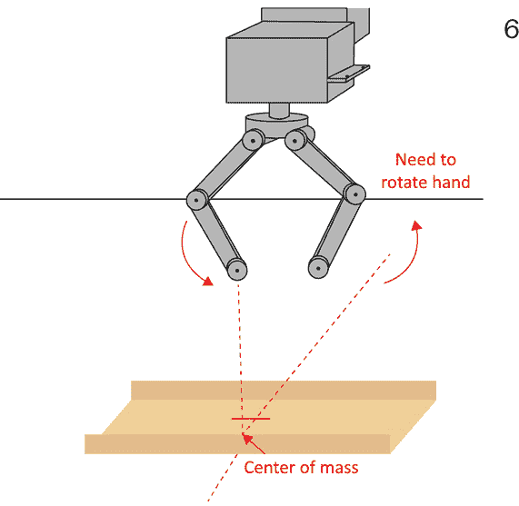

# 构想实用机器人设计过程

本章代表了前几章关于一般理论、介绍和设置的桥梁，以及接下来的章节，我们将应用使用人工智能技术（**AI**）的解决问题的方法。第一步是清楚地表述我们的问题，从机器人的使用角度出发，这与作为机器人设计师/建造者的我们的观点不同。然后，我们需要决定如何应对我们和机器人将尝试的每个基于硬件和软件的挑战。到本章结束时，你将能够理解如何系统地设计机器人的过程。

本章将涵盖以下主题：

+   基于系统工程的机器人方法

+   理解我们的用例范围

+   如何借助用例来表述问题

+   如何通过故事板来解决问题

+   理解我们的用例范围

+   确定我们的硬件需求

+   软件需求分解

+   编写规范

# 基于系统工程的机器人方法

当你着手创建一个基于人工智能软件的复杂机器人时，你不能没有某种关于机器人如何组装以及所有部件如何相互通信的游戏计划就盲目地开始编写代码和拼凑东西。我们将讨论基于**系统工程**原则的机器人设计系统方法。我们将学习用例，并使用故事板作为理解我们正在构建的内容以及需要哪些部分（硬件和软件）的技术。

# 理解我们的任务 – 清理游戏室

我们已经就本书的示例机器人 Albert 的主要任务谈了一些内容，这个机器人是用来在我孙子辈来访后清理我家的游戏室的。我们需要为我们的问题提供一个更正式的定义，然后将其转化为机器人要执行的列表任务，以及我们可能如何完成这些任务的行动计划。

我们为什么要这样做呢？让我们考虑一下史蒂夫·马拉博利的这句话：

“如果你不知道你要去哪里，你怎么知道你到了那里？”

图 3.1 – 了解你的机器人做什么很重要

互联网和各种机器人网站上充斥着成百上千的机器人，它们有一个共同的致命缺陷：机器人和它的软件是先设计出来的，然后才去寻找适合它的工作。在机器人行业中，这被称为**有备无患，瞄准再射击的问题**。机器人的任务、客户、目的、用途和工作是首要的。另一种说法是：要创造一个有效的工具，第一步是决定你用它做什么。

我本可以将这本书写成一套理论和练习，这些在课堂环境中会非常有效，这将让你接触到许多你不知道如何应用的新工具。然而，这一章的目的在于为你提供工具和方法，以尽可能少的误导、痛苦、苦难、眼泪和拔掉的头发，从有一个好想法到拥有一个优秀的机器人提供一个路径。

重要提示

在烧伤方面，你需要自己小心处理；请在使用烙铁时格外小心。

我们将使用的流程是直接的：

1.  第一步是从用户的角度审视机器人，然后描述它的功能。我们将把这些描述称为**用例**——机器人将被如何使用的例子。

1.  接下来，我们将每个用例分解成**故事板**（逐步插图），这些可以是文字图片或实际图片。从故事板中，我们可以提取任务——我们机器人要完成的待办事项清单。

1.  这个流程部分的最后一步是将待办事项清单分为我们可以用软件完成的事情和我们需要硬件来完成的事情。这将为我们设计机器人和其基于AI的软件提供详细的信息。记住，机器人的一个用途是作为这本书的好例子。

让我们从查看用例开始。

# 用例

让我们从陈述问题开始我们的任务。

## 我们机器人的任务 – 第一部分

大约每个月一两次，我那五个可爱、聪明且好动的孙子孙女会来拜访我和我的妻子。像大多数祖父母一样，我们在楼上的游戏室里放了一个装满玩具的盒子，让他们在来访时玩耍。他们一到——至少是年长的孙子孙女们——就会把玩具盒里的每一个玩具都拿出来开始玩。这导致了以下照片中所示的场景——玩具在游戏室里随机且均匀地分布：

图3.2 – 孙辈来访后的游戏室

实际上，你找不到比这更好的随机分布了。他们在这方面真的很擅长。由于作为祖父母，我们希望最大化孙子孙女在我们家玩耍的时间，并希望他们把祖父和祖母的房子与玩耍联系起来，所以我们不让他们回家时收拾玩具。你可以看到这会走向何方。

顺便说一句，如果你是父母，让我提前向你道歉；这确实是我们祖父母这边的一个邪恶计划，当你有了自己的孙子孙女时，你就会理解——你也会这样做。

我们在哪里……？是的，一个满是随机且均匀分布的外来物品——玩具——散落在原本可用的游戏室里，需要被清理。通常，我只需要重重地叹口气，自己把这些东西都收拾起来，但我是机器人设计师，所以我想要做的是制造一个能够完成以下任务的机器人：

1.  拾起玩具——而不是房间的家具、灯光、书籍、扬声器或其他非玩具物品。

1.  将它们放入玩具箱中。

1.  继续这样做，直到找不到更多的玩具，然后停止。

这是这个过程的视觉表示：

图 3.3 – 用例：捡起玩具

现在我们可以提出一些相关的问题。我在学校上过新闻学课程，我被教导了“5W1H”的有用性——*谁*、*什么*、*何时*、*何地*、*为什么*和*如何*。这些对于检查用例同样有用。在这个部分，我有一个坚定的规则：不要涉及实现细节。不要担心你将如何做到这一点。只需关注定义结果。所以，我们现在暂时不考虑“如何”（H），而专注于“W”。让我们试一试：

+   **谁**：机器人。这很简单。我们希望机器人做某事，就像机器人做这件事而不是我做一样。我们希望机器人做什么？

+   **做什么**：这个问题可以用两种方式回答：

    +   **捡起玩具并将它们放入玩具箱中**：这个答案告诉我们什么？它说我们将要抓住并抬起一些东西——玩具。什么是玩具？我们也可以将其重新表述为否定，这引出了第二个答案。

    +   **将不在房间中的物品捡起并放入玩具箱中**：玩具在孙子辈把它们全部拿出来之前不在房间里。所以，我们要么将物品分类为玩具，要么分类为之前不在房间中的物品。“不在房间中”意味着机器人以某种方式知道房间中应该有什么，可能是在孩子们到来之前进行一次调查。然而，“玩具”意味着机器人至少可以将物体分类为*玩具*和*非玩具*。让我们先坚持这一点。我们可能会有一些不在玩具箱中的物品，它们不是玩具但放错了地方，因此不属于玩具箱。您已经可以看到这些问题正在塑造这个过程中后续的内容。

+   **何时**：在孙子辈来访并离开后，继续捡起玩具，直到没有剩余。

    这为我们提供了两个“何时”的条件：开始和结束。在这种情况下，开始定义为孙子辈来访并离开。现在，我在用例中声明我将告诉机器人何时满足这些条件是完全合理的，因为这不会给我带来不便。我会在这里，我知道房间需要打扫。此外，我需要将机器人取出并放入房间。当机器人不工作时，它放在书架上。所以，让我们将我们的“何时”语句改为以下内容：

    *当我（用户）告诉你时，直到找不到更多的玩具为止。*

    现在，我们本可以决定机器人需要自己解决这个问题，在孙子辈离开后自动开启，但这样做的投资回报率是多少？那将是一大堆工作，但收益却不多。对我来说，作为用户，痛点在于捡玩具，而不是决定何时去做。这要简单得多。

    注意，我的*when*语句有一个开始和一个结束。任何看过《幻想曲》中米老鼠的《魔法师的学徒》片段的人都会明白，当你有一个机器人时，告诉它何时停止是很重要的。另一个重要的概念是定义结束条件。我没有说*当所有玩具都被捡起时停止*，因为这会意味着机器人需要知道所有的玩具，无论是通过视觉还是数量。作为任务定义来说，说*当你看不到更多玩具时停止*更容易，这样就能达到我们的目的，而不需要给我们的机器人增加额外的要求。

    当机器人设计师对问题了解得更多时，重新审视用例是很正常的——有时你可能正在努力解决一个与解决用户任务无关的问题。你可以想象一些团队中的机器人工程师被分配了一个任务，即*捡起所有玩具*，这意味着所有文化、所有地区发明的所有玩具！然后，你得到了一个需要500,000美元数据库软件许可和服务器农场来存放它的请求。我们只想捡起游戏室里找到的玩具。

+   **位置**：楼上的游戏室。现在有一些棘手的部分。要清洁的区域是房子的一个特定区域，但它并不是真正由墙壁所界定。而且它在上楼的地方——游戏室里有一个通往楼下的楼梯，我们不希望我们的机器人滚下去。你怎么会知道这些？除非你问这类问题！机器人运作的环境和它所做的事情一样重要。在这种情况下，让我们回头去询问用户。我会在这里插入一个楼层平面图来定义我所说的*游戏室*。从积极的一面来看，我们在这个任务中不需要爬楼梯或下楼。但我们确实需要留意楼梯作为一个潜在的危险：

图3.4 - 我家的楼层平面图，楼上

+   **原因**：那么，为什么机器人要捡起玩具呢？我差点就写下“因为*有人*得做这件事。”然而，答案是我不想让孙子辈的孩子们捡玩具，这样他们就有更多的时间玩耍，我也不想这么做。所以，我们为这个任务制作了一个机器人。机器人世界中的一个格言是，适合机器人的任务通常是*脏乱*、*枯燥*或*危险*的。这个任务无疑属于*枯燥*类别。

我们的这个机器人有多种用途——它有多种功能要执行。

## 我们机器人的任务——第二部分

机器人需要与我孙子孙女互动。为什么这很重要？正如我在[*第 1 章*](B19846_01.xhtml#_idTextAnchor015)中告诉你的，孙子孙女们被介绍了一些我的其他机器人，最大的孙子威廉总是试图与机器人交谈。我有三个在自闭症谱系上的孙子孙女，所以这不是一个无足轻重的愿望——我阅读了相关的研究，例如 *Robots for Autism* ([https://www.robokind.com/](https://www.robokind.com/))，该研究指出，在这种情况下机器人可能会有所帮助。虽然我不是在尝试进行治疗，但我希望我的机器人能够以口头方式与我的孙子孙女互动。我还有一个具体的要求——机器人必须能够讲敲门笑话并回应它们，因为这是威廉的最爱。我希望这个机器人能够进行口头互动。

因此，这里是这个用例的图示：

图 3.5 – 用例：与人互动

让我们用这个用例进行同样的练习。我们提出相关的问题：*谁*，*什么*，*何时*，*何地*，和*为什么*？让我们来分解这些：

+   **人物**：机器人、用户（爷爷）和孙子孙女们。

    在这种情况下，用户交互是任务的一部分。我们与谁互动？我需要能够命令机器人开始互动。然后，我们希望机器人既能与孩子交谈也能听孩子说话。

+   **功能**：接收命令并以口头方式与孩子互动（进行对话），这必须包括敲门笑话。我们保留两种功能：接收来自——让我们称我为**机器人控制器**的命令，使这个更通用。另一种功能是与孩子进行对话，包括讲敲门笑话。我们将在我们的分解中进一步定义*对话*。你可以参考[*第 6 章*](B19846_06.xhtml#_idTextAnchor205)关于使用机器人作为**数字助理**的内容。我们将使用一个名为*Mycroft*的开源数字助理作为机器人的语音界面。我们将在Mycroft的基本功能上添加我们自己的技能，这实际上非常灵活。机器人可以获取天气信息，设置定时器，播放音乐，在谷歌上查找信息（例如，四分之一杯有多少汤匙），甚至告诉你国际空间站现在在哪里。但它不能讲敲门笑话——直到现在，因为我们正在为机器人添加这个功能。幸运的是，敲门笑话有一个非常结构化的形式，基于双关语和这样的问答格式：

    *机器人*：敲门。

    *孩子*：谁在那里？

    *机器人*：让我们进来。

    *孩子*：让我们进来谁？

    *机器人*：让我们进来，这里太冷了！

    我会把相反形式的绘图——回应敲门笑话——留给你。

+   **时间**：根据机器人控制器的请求，然后当孩子对机器人说话时。

    我认为这相当直观：当机器人收到执行命令时，它会进行交互。然后它等待有人与之交谈。我们可以从这个信息中推断出，当我们正在捡玩具时，我们并不期望机器人说话——这两个活动是互斥的。我们只在孩子们离开后捡玩具，因此有一个可以与之交谈的对象。

+   **位置**：在游戏室里，距离机器人大约六英尺。

    我们必须设定一些关于我们能听到多远的限制——我们的麦克风的灵敏度是有极限的。我建议六英尺作为最大距离。我们可能稍后会重新考虑这个距离。当你遇到这样的需求时，你可以问客户“为什么是六英尺？”他们可能会说，“嗯，这听起来像是一个合理的距离。”然后你可以问，“如果它是五英尺，这会是这个功能的失败吗？”用户可能会回答，“不，但会不那么舒适。”你可以继续询问距离，直到你对所需的距离（多远才算不失败）有一个感觉，在这个例子中可能是三英尺（这样孩子就不需要弯腰到机器人那里才能被听到），以及期望的距离，即用户希望功能能工作的距离。当我们开始测试时，这些是重要的区分点。这个需求的通过-失败界限在哪里？

+   **原因**：因为我的孙子辈想要和机器人交谈，并希望它做出回应（即，用户明确要求了这个功能）。

现在，让我们更深入地探讨我们的机器人任务。

## 我们的机器人要做什么？

现在我们将使用故事板过程对机器人需要执行的操作进行详细分析。这个过程是这样的：我们根据所有关于“W”问题的答案，尽可能详细地将我们的两个任务分解。然后我们描绘出每个步骤。这些图片可以是绘画或文字描述（一段话），描述该步骤中发生的事情。我喜欢通过描述机器人作为一个**状态机**来开始分解过程，对于我们问题的前一部分，这可能是一个理解机器人每一步内部发生情况的好方法。

你可能熟悉**状态机图**，但以防万一，状态机图描述了机器人的行为作为一系列离散的状态或条件集，这些状态或条件定义了机器人可以执行哪些操作：

图3.6 – 机器人状态机图

我们的第一个状态仅仅是**关闭**——机器人没有开启电源。

每个状态都是一个事件（或事件），它会导致状态发生变化。这些被称为**转换**。要从“关闭”状态转换到下一个状态，必须发生某些事件——例如，人类操作员打开电源。我们将称这个转换事件为“施加电源”。现在我们处于什么状态？需要一些时间来启动计算机并加载程序（“初始化”）。一旦一切启动并初始化，机器人将准备好接受命令。让我们称这个状态为“待机”。机器人只是坐着等待指令。现在我们想要开始清洁房间。我向机器人发送一个“开始清洁”命令，这将状态转换为——什么？接下来需要发生什么？我们可以定义一个名为“清洁”的状态，但那将包括很多复杂的功能，而且我们不会从中学到很多东西。我们需要机器人使用其摄像头寻找玩具。如果它找不到玩具，它需要向前移动一小段距离——避开障碍物——然后再次寻找。在实践中，我们应该能够在驾驶的同时寻找玩具而无需不断停车。我们需要使“寻找玩具”功能在看到玩具时中断驾驶。

如果机器人找到了玩具，那么它需要调整自己的位置，使得玩具在机器人手臂的触及范围内。在状态机图中，我们已经添加了名为“开始清洁”的转换，它将状态从“待机”转换为“寻找玩具”。现在我们可以添加两个额外的转换：一个叫做“玩具=无”，另一个叫做“玩具=有”。“玩具=无”分支会进入一个名为“前进”的状态，在那里机器人向前移动——同时避开障碍物——然后返回到“寻找玩具”状态并再次尝试找到玩具。我们需要某种方式来告诉软件多久查找一次玩具。我们可以使用一个简单的计时器——经过多少秒。或者我们可以使用基于轮子运动的某种距离函数。

那么，现在我们已经找到了玩具，我们该怎么办？我们需要开车到玩具那里，使其进入我们机器人手臂的范围内。我们尝试用机器人的手臂和手握住玩具。我们可能不会在第一次尝试就成功，在这种情况下，我们想要再次尝试。标记为“抓握失败”的循环转换表示如果你第一次尝试不成功，就回去再试一次。我以前在哪里听过这样的话？你可以看到同样的情况在“拿起玩具”中。为什么有两个部分？在我们能够举起玩具之前，我们需要首先抓住它。所以我认为需要两个状态，因为我们可能无法成功抓住——玩具从手中掉落，这独立于拿起玩具，玩具太重或太笨重而无法举起。

好的，我们找到了一个玩具并把它拿了起来。接下来是什么？我们需要把它放进玩具箱。下一个状态是*驶向玩具箱*。在这个阶段不用担心*如何*做；我们只需要做这件事。稍后，我们可以进一步将这个状态分解成更详细版本。我们驾驶直到到达事件*找到玩具箱*。这意味着我们看到了玩具箱。然后我们进入*放置放下位置*状态，这个状态将机器人移动到可以放下玩具的位置。最终状态*放下玩具*是显而易见的。我们放下了玩具，机器人的爪子中没有东西了，而且你知道吗？我们通过回到*寻找玩具*状态重新开始。如果机器人决定放下不成功（玩具仍然在爪子中），那么我们将它再次尝试那个步骤，通过重新定位手在玩具箱上方并尝试通过打开手放下玩具。我们如何知道爪子是否为空？我们尝试关闭握持并观察手伺服机构的位置。如果爪子可以关闭（达到最小状态），那么它是空的。如果玩具掉出玩具箱（机器人完全错过了箱子），那么它又变成了地板上的玩具，并且会以正常方式处理——机器人会找到它，拿起它，并再次尝试。

这一切都很不错，我们的这个小机器人会永远四处寻找玩具，对吧？我们忽略了两个重要的转换。我们需要一个*没有更多玩具*的事件，并且我们需要一种方法回到*关闭*状态。回到*关闭*状态很简单——用户关闭电源。我使用了一个标记为*任何状态*的简写方法，因为我们可以在机器人做任何事情的时候随时按下关闭按钮，而且机器人对此无能为力。也许从每个状态画一条线回到*关闭*状态会更合适，但这会使图表变得杂乱，而这种记法仍然能够传达意思。新的状态机图看起来是这样的：

图3.7 – 新的状态机图

让我们花一分钟时间来谈谈*没有更多玩具*的概念。我们如何定义这个？这可能需要一些实验，但到目前为止，我们会说如果我们尝试了10分钟还没有找到玩具，那么我们就满意了，没有更多玩具可以找到。稍后，我们可以根据需要调整这个时间。可能5分钟对我们这个大小的房间来说已经足够了。请注意，*没有更多玩具*事件只能从*寻找玩具*状态产生，这应该是合理的。

我们提到机器人需要避开障碍物。但我们没有“避开障碍物”的状态。为什么是这样？那是因为几个状态包括驾驶，每个状态都包括避开障碍物。为避开障碍物设立一个状态是不合适的，因为它不是特定于一个状态的。我们需要的是一个描述机器人驾驶的独立状态机。正如我在上一章的“介绍子吸收架构”部分提到的，我们可以同时有多个目标处于操作状态。

拾取玩具的任务是任务，这是机器人的总体目标。“避开障碍物”是驱动引擎的目标，是我们机器人的中级管理者。

我们已经讨论了我们的用例并绘制了状态机图，现在让我们继续下一步，即创建我们的故事板。

# 使用故事板

在本节中，我们将进一步分解我们的用例，以便了解我们的机器人在执行两次任务过程中必须代表我们完成的各项任务。我创建了一些**故事板**——简短的草图——来阐述每个要点。

故事板的概念借鉴自电影行业，在那里使用类似漫画的叙述方式，将剧本中的文字转换成一系列图片或卡通，以传达剧本中未包含的额外信息，例如构图、背景、动作、道具、场景和摄像机移动。故事板的实践可以追溯到无声电影时代，至今仍在使用。

我们可以在机器人设计中使用故事板的原因相同：为了传达用例文字中未包含的额外信息。故事板应该是简单、快捷的，并且只需传达足够的信息，帮助你理解正在发生的事情。

让我们开始吧。我们不会为“电源应用”、“初始化”或“待机”创建故事板，因为对于这些简单概念来说，故事板实际上并不需要。我们将跳到状态图中的“开始清洁”事件。

## 故事板 – 收起玩具

当我们的故事开始时，机器人正在做什么？它已经被打开，处于待机状态，等待被告知要做什么。它是如何接收命令的？一种很好的、免提的方式是接收一个语音命令来“开始清洁”，或者一些意思相同的话。

在“开始清洁”之后的下一步是“寻找玩具”。这个故事板帧是当机器人被命令开始清洁时“机器人所看到的”。它看到了房间，其中可见三种类型的物体——也就是说，玩具、不是玩具的东西（扶手椅和壁炉），以及房间本身，包括墙壁和地板：

图3.8 – 等待语音命令开始清洁

我们可以选择任何类型的传感器来检测我们的玩具并指导我们的机器人。我们可以有一个激光雷达、热传感器或声纳扫描仪。让我们假设这个任务的最佳传感器工具是一个普通的USB摄像头。我们可以控制照明，玩具并不比周围环境更暖或更冷，我们需要足够的信息来按类型识别对象。所以，视频就是了。我们将在稍后确定我们确切需要什么类型的摄像头，所以把它加到我们的*待办事项列表*中。

图3.9 – 寻找玩具

我们下一个故事板是*寻找玩具*。我们需要运行某种算法或技术来按类型分类对象。该算法的结果是找到对象——将它们从地板的背景中分离出来——然后对每个对象进行分类，判断它是玩具还是非玩具。我们并不关心有更多的细分——我们忽略所有*非玩具*对象，并捡起所有*玩具*对象。注意，我们在玩具对象周围画圆圈，这也是另一种说法，即我们必须在相机帧中定位它们。

那么，这张简单的图片告诉我们我们之前不知道什么？它告诉我们以下内容：

+   我们需要通过对象来分割相机图像。

+   我们需要在相机帧中定位对象。

+   我们需要将对象分类为*玩具*或*非玩具*。

+   我们需要能够存储和记住这些信息。

我们一次只能捡起和移动一个玩具——我们只有一只手，而且没有人说在用例中我们需要一次捡起多个。所以，我们只关心一个玩具——让我们随意说我们捡起离机器人最近的那个：

图3.10 – 选择最近的玩具

我们也可以说，这是最容易拿到手的玩具，这可能是一个与选择最近的玩具略有不同的过程。我们将这个玩具设定为下一次行动的目标，那么这个目标是什么呢？如果你说是开车去玩具，你就说对了。然而，我们不仅要开车去玩具，还要将机器人的身体放置到一个位置，以便使用机器人手臂抓取玩具。顺便说一句，这意味着机器人手臂必须能够触及地面或非常接近地面，因为我们有一些小玩具。

我们的机器人必须规划一条从当前位置到可以尝试捡起玩具的位置的路线。我们在玩具中心手臂长度处设定一个目标目标：

图3.11 – 规划到目标的路

机器人需要确保路上没有障碍物。有两种方法可以做到这一点。如图所示，我们可以通过增加机器人的宽度（再加上一点）来清除机器人正在行驶的道路，看看是否有障碍物在那个区域，或者我们可以在障碍物周围添加一个边界，看看我们的路径是否进入那些边界。无论如何，我们需要一个没有障碍物的路径：

图 3.12 – 在路线上寻找障碍物

机器人自己决定合适的对准方式，为拾取玩具做准备：

图 3.13 – 定位机器人手

现在机器人已经完成了它的行驶，机器人可以将机器人手移动到拾取玩具的位置。我们需要将机器人手放在玩具的重心上方，然后旋转手以匹配玩具的狭窄部分，这样我们就可以拾取它。我们这个项目的目标之一不是规定机器人如何做，而是让它自己学习。因此，我们可以说对于这个故事板面板，机器人使用其培训和机器学习来使用适当的手势来准备抓取物体。我们可以推断这包括将手对齐：

图 3.14 – 拾取玩具

很可能 *故事板 6* 是难点 (*图 3**.13*)，而在 *故事板 7* 中，机器人完成了对物体的抓取并拾起了它 (*图 3**.14*)。机器人必须能够确定拾取是否成功，如果不成功，则再次尝试。那是在我们之前做的状态机图中。我们现在已经拾起了玩具。接下来是什么？找到玩具箱！

图 3.15 – 找到玩具箱

现在我们需要机器人找到玩具箱。同样，目前我们并不关心它是如何做到的。我们仍然担心的是 *什么* 而不是 *如何*。不知何故，机器人四处张望并找到了玩具箱，在这个例子中，它很大，靠墙，并且有独特的颜色。无论如何，机器人必须自己找到玩具箱。图片中的标签表明机器人可以区分玩具箱，并且它将感知到的所有其他物体视为障碍物。我们可以看到我们不需要同时激活 *玩具*/*非玩具* 功能，只需要 *玩具箱*/*非玩具箱* 决策过程。这确实减少了一些所需的处理，并将使机器学习更容易。

现在我们已经找到了玩具箱，我们展示了稍微复杂一些的任务，即绕过障碍物到达那里。在这个例子中，我们展示了机器人底座的紫色轮廓，与障碍物周围的红色轮廓相比，我将其标记为 *禁止进入区域*。这为我们提供了更多关于如何避开障碍物的指导：

图 3.16 – 计划到达玩具箱的路径

我们希望将机器人的中心保持在 *禁止进入区域* 之外。我们需要足够接近玩具箱，以便将玩具放入其中：

图 3.17 – 将玩具与箱子对齐

在*故事板10*中，我们将玩具高高举起，超过玩具盒顶部，并在我们放手时将玩具定位在玩具盒内。请注意，我们必须在距离玩具盒最后几英寸之前将玩具举起。我们将机器人手放在玩具盒开口的顶部，尽可能向前，并在玩具盒的中间位置。

图3.18 – 将玩具放入盒子

在玩具传奇的最终步骤中，我们要打开机器人手，让玩具有可能落入玩具盒中。我预测我们可能需要花费一些试错时间来做到这一点。我们可能需要将张开的手左右倾斜，以使玩具掉落。如果玩具掉出盒子外，那么它就没有被收好，我们必须从头开始，再次尝试收好它。我们不需要为这个状态创建新的状态，因为它会回到地板上的玩具状态，而我们已经有了一个对应的状态。

我希望你在故事板过程中已经看到了这如何为可视化机器人的任务提供洞察力。我会说最重要的好处是它迫使你思考机器人正在做什么，并将每个步骤分解成越来越小的部分。如果你觉得需要这样做，不要犹豫，将单个画板分解成自己的故事板。

## 项目目标

由于这是一个AI/机器学习项目，我们必须在项目目标中增加不仅仅是收好玩具，还要使用机器学习、自适应系统、神经网络和其他工具来提供一种解决这类问题的新方法。你可能想，“*为什么要费这个劲？你用标准的编程方法做得更好。*” 我会从经验告诉你，这种方法很难解决问题，你可以自己进行研究，看看大小公司都尝试过解决这类问题但失败了——或者至少没有成功。这个问题用任何方法都很难解决，而使用基于AI的方法成功的可能性比标准编程技术要大得多。现在，我并不是说我们在这本书的任务中会取得超乎想象的巨大成功，但我们的目标是在这个过程中学到很多东西！

因此，我们在定义项目的过程中暂停一下，明确表示我们故意选择使用人工智能和机器学习作为解决其他方法难以证明的问题的方法。

由于我们将教机器人各种任务，如果我们能够远程操作机器人，像遥控车一样驾驶它，以便收集数据并拍照，这些数据我们将用于后续的对象识别，这将更有效。我们不需要这个用于操作，我们需要这个用于训练。我们将把这个必需的操作添加到我们的*待办事项列表*中。

在我们的下一步中，我们将从所有努力中提取出我们的机器人必须完成的**硬件**和**软件**任务。但在我们这样做之前，让我们暂停一下，讨论在定义用例范围时常见的错误。

# 理解我们用例的范围

**愿望**（由*desire*和*requirements*组合而成的词）是那些“想要有”但不是严格必要的功能。例如，如果我们决定添加闪烁的灯光到机器人上因为它看起来很酷，那将是一个愿望。你可能想要它，但这并不有助于机器人的任务或它需要执行的任务。

另一个例子是，如果我们添加了机器人必须在黑暗中运行的条件。在当前情况下，这没有理由，我们也没有在用例中提到机器人将在黑暗中运行——只是在室内房间中。这将是**范围蔓延**的一个例子，即在没有充分理由的情况下扩展操作条件。重要的是要非常努力地将需求和用例保持在最低限度，甚至要丢弃不必要或冗余的用例。我可能添加了一个按颜色排序玩具的要求，但排序并不能帮助捡起玩具，而且，我只有一个玩具箱。我可能添加这个任务是为了教育我的读者，但这也不助于那个目标，所以颜色排序不包括在内。

现在，让我们继续确定我们的硬件需求。

# 确定我们的硬件需求

根据我们的故事板，我提取或推导出以下硬件任务：

+   驱动机器人底座

+   承载机器人手臂

+   拉起玩具

+   将玩具放入玩具箱（手臂长度）

+   传感器：

    +   机械臂位置

    +   手臂状态（开/关）

    +   机器人视觉（摄像头）用于避障

+   为所有系统提供电源：

    +   为Nvidia Nano提供5V电源

    +   为Arduino提供5V电源

    +   机械臂电源 – 7.2V

    +   电机电源 – 7.2V

+   板载计算机：

    +   一台可以接收远程命令的计算机（Wi-Fi Nano）：

        +   运行ROS 2

        +   运行Python 3

    +   一台可以与相机接口的计算机

    +   一台可以控制电机的计算机（Arduino）

    +   一个可以驱动机器人手臂伺服电机的接口（伺服控制器）

现在，让我们来看看软件需求。

# 拆解我们的软件需求

这份软件任务列表是通过审查状态机图、用例和故事板编制的。我已经突出显示了需要AI并将在后续章节中详细介绍的步骤：

1.  **开机自检**（**Power on** **self-test** (**POST**））：

    1.  启动机器人程序。

    1.  检查Nano能否与Arduino通信并返回。

    1.  尝试与控制站建立通信。

    1.  根据适当的情况报告POST成功或失败并记录在日志中。

1.  通过Wi-Fi接收遥控命令：

    +   驱动电机底座（右/左/前进/后退）

    +   手臂上下/左右/旋转移动

    +   录制视频或记录图片作为图像文件

1.  通过Wi-Fi发送遥测数据。

1.  监控进度。

1.  发送视频。

1.  安全导航：

    +   学习避免障碍

    +   学习不摔倒楼梯

1.  找到玩具：

    +   检测物体

    +   学习分类物体（玩具/非玩具）

    +   确定哪个玩具最近

1.  拿起玩具：

    1.  移动到手臂可以触及玩具的位置

    1.  制定掌握策略

    1.  尝试抓取

    1.  确定抓取是否成功

    1.  如果没有，尝试用不同的策略再次尝试

    1.  根据成功率重新加权抓取技术得分

1.  把玩具放进玩具箱：

    +   学习识别玩具箱

    +   找到玩具箱

    +   使用导航驾驶到已知的玩具箱位置

    +   移动到垃圾投放点：

        +   避免障碍

        +   将玩具举过玩具箱盖

    +   放下玩具

    +   检查玩具是否成功掉入玩具箱

    +   如果不行，重新定位再试一次

    +   如果玩具没有掉进玩具箱，我们将其视为地板上的玩具

1.  确定没有更多的玩具。

1.  等待指令。

1.  远程操作：

    +   移动底盘前后左右

    +   移动手臂上下左右

    +   手臂进出/扭转/张开/合上

    +   录制视频/拍照

1.  模拟个性：

    +   说话

    +   听/识别单词

    +   理解一些命令

    +   讲讲敲门笑话

    +   理解敲门笑话

1.  语音命令：

    +   清理房间

    +   把这个收起来

    +   过来

    +   停止

    +   等待

    +   简历

    +   回家

    +   向左/向右转

    +   前进/后退

    +   手举/手放

    +   左手/右手

    +   张开手/合上手

在这个列表中，我在哪里看到了*远程操作*？我们不记得在用例和故事板中讨论过这一点。我们需要教会机器人导航和找到玩具，为此，我们需要移动机器人并拍照。一个简单的方法是通过**远程操作**（遥控）来驾驶机器人。

# 编写规格说明

我们接下来的任务是编写我们各种组件的规格说明。这里我将通过一个例子来讲解，这是我们玩具抓取机器人项目必须完成的部分：我们需要*选择一个相机*。任何旧的相机都不适用——我们需要一个满足我们需求的相机。但那些需求是什么？我们需要编写一个相机规格说明，这样当我们查看要购买的相机时，我们可以判断哪一台能够胜任这项工作。

我们已经创建了我们的故事板和用例，因此我们有了确定我们的相机需要做什么所需的信息。我们可以某种程度上逆向工程这个过程：让我们讨论一下是什么让一个相机与另一个相机不同。首先当然是接口：这个相机安装在机器人上，因此它必须与机器人的计算机接口，该计算机有USB、以太网和专门的相机总线。我们还需要关注相机的哪些其他方面？我们当然关心成本。我们不希望（或需要）为我们的低成本机器人使用价值1000美元的相机。相机有分辨率：每张图片中的像素数。这可以从320 x 240变化到4,000 x 2,000（4K）。相机还有视野，这是相机可以看到的角度数。这可以从2.5度（非常窄）变化到180度（非常宽）。还有一些相机可以在黑暗中看到或者有各种类型的光学红外灵敏度。最后，还有尺寸和重量；我们需要一个适合我们机器人的小型相机。

这决定了我们需要决定的以下参数：

+   **视野**：[180 - > 2.5]

+   **分辨率**：[320 x 280 -> 4,000 x 2,000]

+   **成本**：（从低到高）——越便宜越好

+   **在黑暗中看**：是/否

+   **尺寸和重量**：越小越轻越好；必须适合安装在机器人上

+   **接口**：USB、以太网或相机总线；电源 >11V

列出这些参数的原因是，我们现在可以集中精力选择那些我们可以选择的功能，这样我们就不会浪费时间查看我们不关心的其他参数。让我们看看我们是否可以取消一些参数：

+   如果我们使用USB作为**接口**，电源由连接器提供，我们不需要额外的电缆或路由器。这也是成本最低的方法，因此我们选择USB作为接口。

+   在我们的用例中，我们没有对**在黑暗中看**的要求，因此我们不需要特殊的红外相机。

+   下一个问题是要确定**视野**。我们需要看到机器人手臂在拿起玩具时可以移动的整个区域。我们还需要足够的视野来避免障碍物时驾驶。我们可以从机器人上获取一些测量数据，但我们可以很快地看到我们主要需要看到靠近机器人的地方，而且我们看不到两侧轨道之外的地方。这确定了所需的视野接近90度。比这更大的视野是可以接受的，比这更小的则不行。

+   我们最终的问题是确定进行物体识别所需的**分辨率**。为此，我们需要一个额外的数据点——我们需要多少像素才能将一个物体识别为玩具？这就是我们将用这个摄像头做的——识别玩具和不是玩具的东西。我们还必须选择一个可以识别玩具的距离。我们没有从用例中得出一个明确的要求，所以我们必须做出一个有根据的猜测。我们知道我们的房间长17英尺，里面有家具。让我们猜测我们需要8英尺的距离。我们怎么知道这是正确的呢？我们做一个思想实验。如果我们能在8英尺远的地方识别一个玩具，我们能完成我们的任务吗？我们可以看到房间一半远处的玩具。这给机器人提供了足够的空间去驾驶到玩具那里，而且它不会花太多时间寻找玩具。作为一个检查，如果机器人必须距离4英尺才能识别一个玩具，那会不可用吗？答案可能是不会——机器人会正常工作。3英尺呢？现在我们到了机器人必须直接开到玩具那里才能确定它是什么的程度，这可能会导致检查玩具的逻辑更加复杂。所以，我们说3英尺不够，4英尺可以接受，而8英尺会很好。

    摄像头需要多少分辨率才能在8英尺远的地方用90度镜头识别一个玩具？我可以告诉你，ImageNet数据库需要宽度至少为35像素的样本才能识别一个物体，所以我们可以将其作为一个基准。我们假设在这个阶段，我们需要至少35像素宽的图像。让我们从一个拥有*1,024 x 768*像素的摄像头开始，它的宽度是1,024像素。我们将它除以90度，得到每个度有11.3像素（*1,024/90*）。我们的最小玩具在8英尺处有多大？我们的最小玩具是一个Hot Wheels玩具，大约3英寸长。在8英尺处，这是1.79度或20.23像素（*1.79度 x 11.3像素/度*）。这还不够。解出3英寸的距离方程，我们得到一个具有*1,024 x 768*像素的摄像头的最大距离为4.77英尺。这勉强可以接受。如果我们有一个具有*1,900 x 1200*像素的HD传感器呢？那么，在8英尺处，我得到75像素——足够给我们提供最佳距离。如果我们使用宽度为1,200像素的传感器，我们的识别距离为5.46英尺，这足够但不是很好。

我带你走过了这个过程，以展示如何编写规范，以及在你决定为你的项目获取哪些传感器时，你应该问自己哪些类型的问题。

# 摘要

本章概述了在开发机器人项目时，如何开发待办事项列表的建议流程。这个过程被称为系统工程。我们的第一步是创建用例或描述机器人从用户角度应该如何表现。然后，我们通过创建分镜脚本，逐步通过用例来创建更多细节。我们的例子是机器人找到并识别玩具，然后拿起它们并将它们放入玩具箱。我们提取了我们的硬件和软件需求，创建了一个待办事项列表，列出了机器人将能够做什么。最后，我们为我们的关键传感器之一——摄像头编写了规范。

在下一章中，我们将深入探讨我们的第一个机器人任务——使用计算机视觉和神经网络教机器人识别玩具。

# 问题

1.  描述一下电影或卡通的分镜脚本与软件程序的分镜脚本之间的区别。

1.  什么是五个“W”问题？你能想到任何其他与检查用例相关的问题吗？

1.  完成这个句子：用例显示了机器人做什么，但没有显示______。

1.  以图3**.16**中的*分镜9*为例，其中机器人正在驶向玩具箱，并在你自己的分镜脚本中将它分解成更多有序的步骤。考虑在*第9帧*和*第10帧*之间必须发生的一切。

1.  完成敲敲门笑话的回复表格，其中机器人回答用户讲述的笑话。你认为最后一步是什么？

1.  查看远程操作操作。你会添加更多吗，或者这个列表看起来已经很好了？

1.  为一个使用距离测量来防止机器人驶下楼梯的传感器编写规范。

1.  一个摄像头在320 x 200像素和30度视野下，能看到多远处的6英寸宽的填充动物，仍然假设我们需要35像素来进行识别？

# 进一步阅读

关于本章主题的更多信息，您可以参考以下资源：

+   *《SysML实用指南：系统建模语言》*，由Sanford Friedenthal、Alan Moore和Rick Steiner著，由Morgan Kaufman出版；这是**基于模型的系统工程**（MBSE）的标准入门书籍。

+   *《敏捷开发者手册》*，由Paul Flewelling著，由Packt出版。

# 第二部分：将感知、学习和交互添加到机器人技术

为了观察、理解和与环境互动，机器人需要具备感知能力。人工智能是识别物体和导航的一种方法。本部分将赋予你使用人工智能技术高效操作机器人的基本技能。本书的例子是创建一个能够拾取玩具的机器人，因此我们首先从使用**神经网络**识别玩具开始。然后，我们与机器人手臂合作，使用**强化学习**和**遗传算法**等工具拾取玩具。下一章将介绍创建一个能够倾听和理解你的命令，甚至讲笑话的机器人数字助手。

本部分包含以下章节：

+   [*第4章*](B19846_04.xhtml#_idTextAnchor126), *使用神经网络和监督学习识别物体*

+   [*第5章*](B19846_05.xhtml#_idTextAnchor159), *使用强化学习和遗传算法拾取和放置玩具*

+   [*第6章*](B19846_06.xhtml#_idTextAnchor205), *教机器人学会倾听*
