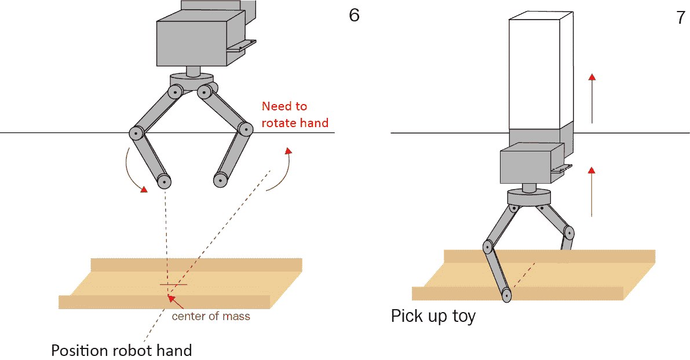
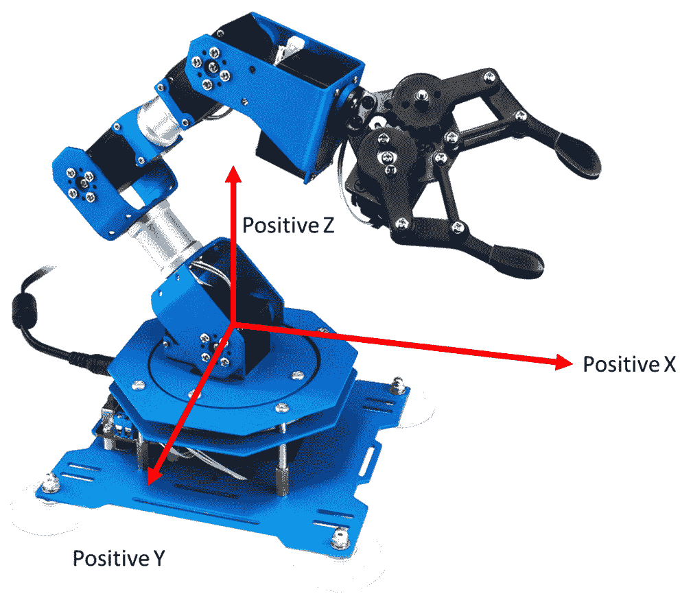
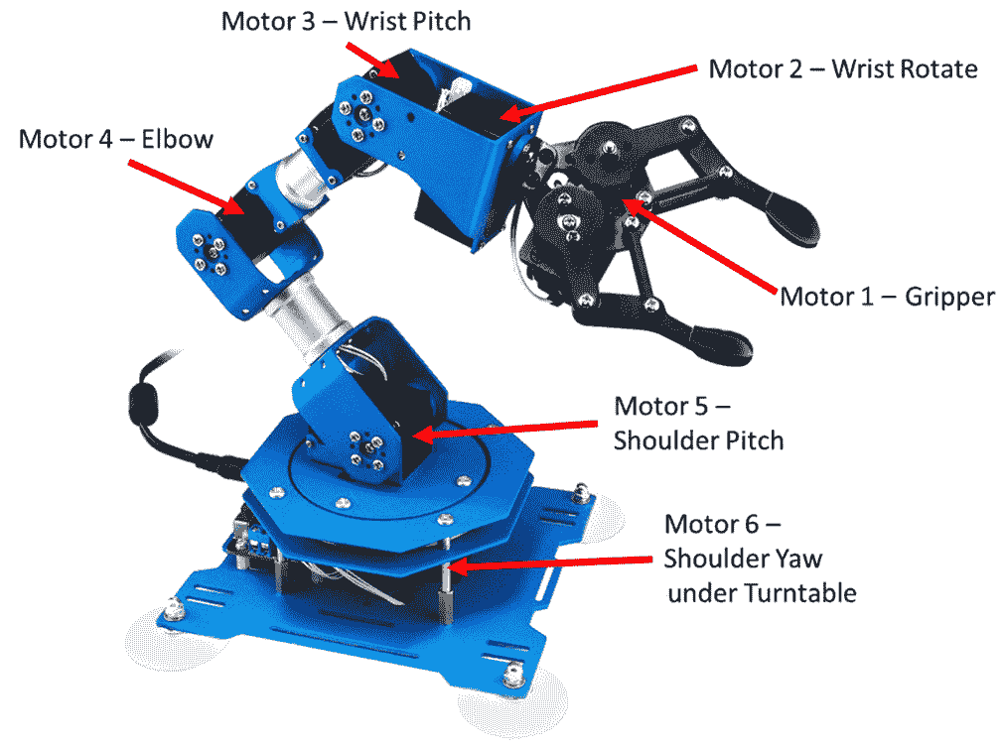
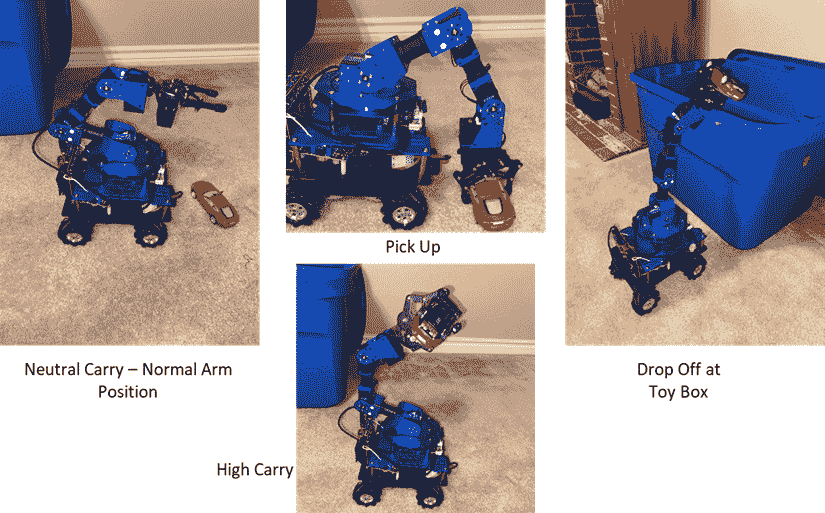
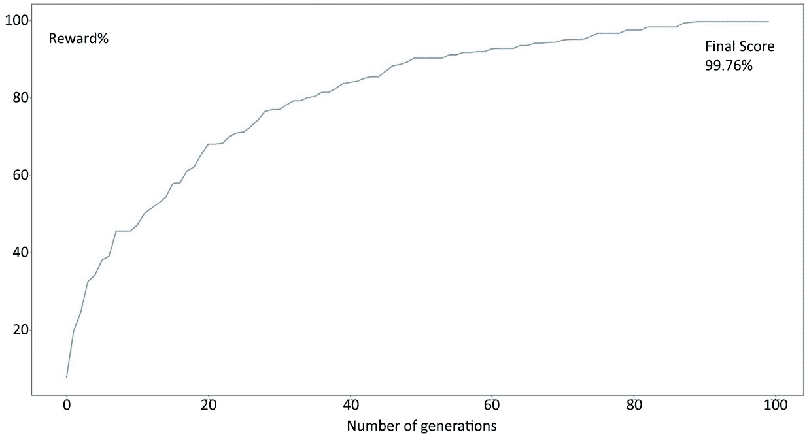

# 使用强化学习和遗传算法捡起和放回玩具

本章是机器人变得具有挑战性和有趣的地方。我们现在想要让机器人的操作臂开始捡起物体。不仅如此，我们希望机器人能够学会如何捡起物体，以及如何移动它的手臂而不会撞到自己。

你会如何教一个孩子在他们房间里捡起玩具？你会为完成任务提供奖励，比如“*如果你捡起你的玩具，你将得到一份奖励？*”或者你会提供惩罚的威胁，比如“*如果你不捡起你的玩具，你就不能在你的平板电脑上玩游戏.*”这个概念，为良好的行为提供正面反馈，为不良行为提供负面反馈，被称为**强化学习**。这是我们本章将要训练机器人的方法之一。

如果你需要机器人臂来执行代码，你需要一个机器人臂。我使用的是从Amazon.com购买的**LewanSoul Robot xArm**。这个臂使用数字伺服电机，这使得编程变得容易得多，并为我们提供了位置反馈，这样我们就知道手臂在什么位置。我购买的臂可以在出版时在[http://tinyurl.com/xarmRobotBook](http://tinyurl.com/xarmRobotBook)找到。

在本章中，我们将涵盖以下主题：

+   设计软件

+   设置解决方案

+   介绍用于抓取物体的Q学习

+   介绍用于路径规划的**遗传算法**（**GAs**）

+   替代机器人臂机器学习方法

# 技术要求

本章的练习不需要任何我们在前几章中没有见过的新的软件或工具。我们将首先使用Python和ROS 2。你需要一个Python的IDE（IDLE或Visual Studio Code）来编辑源代码。

如果这听起来像是一款游戏，你在达到目标时获得正分，错过目标时失去分数，那么你就对了。我们有一些想要实现的胜利概念，我们创建了一种某种类型的点系统来强化——也就是说，奖励——当机器人做我们希望它做的事情时。

注意

如果你不想购买机械臂（或者不能购买），你可以使用ROS 2和**Gazebo**（一个仿真引擎）的机械臂仿真来运行此代码。你可以在此处找到说明：[https://community.arm.com/arm-research/b/articles/posts/do-you-want-to-build-a-robot](https://community.arm.com/arm-research/b/articles/posts/do-you-want-to-build-a-robot)。

你可以在本书的GitHub仓库中找到本章的代码，网址为：[https://github.com/PacktPublishing/Artificial-Intelligence-for-Robotics-2e](https://github.com/PacktPublishing/Artificial-Intelligence-for-Robotics-2e)。

# 任务分析

本章的任务相当直接。我们将使用机器人手臂来拿起我们在上一章中确定的小玩具。这可以分为以下任务：

+   首先，我们构建了一个控制机器人手臂的界面。我们使用**ROS 2**将机器人的各个部分连接起来，因此这个界面是系统其余部分向手臂发送命令和接收数据的方式。然后我们开始教手臂执行其功能，即拿起玩具。能力的第一级是拿起或抓取玩具。每个玩具都略有不同，相同的策略并不总是有效。此外，玩具可能处于不同的方向，因此我们必须适应玩具呈现给机器人末端执行器（即其手的别称）的方式。因此，我们不想编写大量的可能或可能不起作用的定制代码，而是想创建一个结构，使机器人能够自我学习。

+   我们面临下一个问题是要让手臂移动。问题不仅仅是手臂有位置，它还需要从一个起点到一个终点的路径。手臂不是一个单一的部分——它由六个不同的电机组成（如图**5.3**所示），每个电机都执行不同的功能。其中两个电机——握持和手腕——根本不会移动手臂；它们只影响手部。因此，我们的手臂路径由四个电机控制。另一个大问题是，如果我们不小心，手臂可能会与机器人的身体碰撞，所以我们的手臂路径规划必须避免碰撞。

    我们将使用一种完全不同的技术来学习手臂路径。**GA**是一种机器学习技术，它使用进化的模拟来从简单的动作中**进化**出复杂的行为。

现在让我们先谈谈我们必须要处理的事情。我们有一个`600`，（在允许电机移动的短暂时间间隔后）我们看到伺服位置是`421`，然后有东西阻止电机达到我们为其设定的目标。这些信息对于训练机器人手臂将非常有价值。

我们可以使用**正向运动学**，这意味着将手臂的所有角度和杠杆相加，以推断出手的位置（我将在本章后面提供相应的代码）。我们可以将这个手的位置作为我们的期望状态——我们的**奖励标准**。我们将根据手部与期望位置和方向之间的接近程度给机器人评分，或给予奖励。我们希望机器人能够找出达到该位置所需的方法。我们需要为机器人提供一种测试不同理论或行动的方法，这些行动会导致手臂移动。

我们将首先与机器人手部进行工作，或者用时髦的机器人术语，称为**末端执行器**。

以下图表显示了我们是如何尝试通过旋转手腕来调整我们的机器人手臂以拿起玩具的：



图5.1 – 拿起玩具的故事板

对于抓取，我们有三个动作可以操作。我们将机械臂定位以拾取玩具，通过旋转手腕伺服电机调整手的角位，并关闭手以抓取物体。如果手完全关闭，那么我们错过了玩具，手是空的。如果玩具阻止夹爪关闭，因为我们已经拾取了它，那么我们就成功了，已经抓到了玩具。我们将使用这个过程来教会机器人使用不同的手部位置根据玩具的形状来拾取玩具。

# 软件设计

设计机械臂控制软件的第一步是建立一个坐标系（我们如何测量运动），然后我们通过创建状态（机械臂位置）和动作（改变位置的运动）来设置我们的解决方案空间。以下图显示了机械臂的坐标系：



图5.2 – 机械臂坐标系

让我们定义机器人的坐标系——我们用来测量运动的参考——如图所示的前图。X方向朝向机器人的前方，因此前后移动沿着X轴。水平移动（左或右）沿着Y轴。垂直移动（上下）在Z方向。我们将零点——我们坐标的原点——放置在机械臂中心的下方，Z=0在地板上。因此，如果我说机器人手部在X轴上正向移动，那么它是在远离机器人的前方移动。如果手（手臂的末端）在Y轴上移动，那么它是在向左或向右移动。

现在，我们必须有一组名称，我们将用它来称呼机械臂中的伺服电机。我们将进行一些拟人化命名，并给机械臂的各个部分赋予解剖学名称。电机在控制系统中编号，我机器人臂上的伺服电机标记如下：

+   *电机1* 控制夹爪的开启和关闭。我们也可以将夹爪称为手。

+   *电机2* 是手腕旋转电机，它旋转手部。

+   *电机3* 是手腕俯仰（上下）方向。

+   我们将*电机4*称为肘部。肘部在中间弯曲手臂，正如你所期望的那样。

+   *电机5* 是肩部俯仰伺服电机，当机械臂指向正前方时，它使机械臂上下移动，绕Y轴旋转。

+   *电机6* 位于机械臂的底部，因此我们将其称为肩部偏航（右或左）伺服电机。它绕Z轴旋转整个机械臂。我决定不移动这个轴，因为由于全向轮，整个机器人底座可以旋转。我们将只移动机械臂的上下位置以简化问题。我们在[*第8章*](B19846_08.xhtml#_idTextAnchor235)中开发的导航系统将使机械臂指向正确的方向。

我们将首先定义一个机器人臂的接口，其余的机器人控制系统可以使用：



图5.3 – 机械臂电机命名

在这里，俯仰指的是上下运动，而偏航指的是左右运动。

我们将使用在机器人世界中常见的两个术语来描述我们如何根据我们拥有的数据计算手臂的位置：

+   **正向运动学**（**FK**）是从机器人手臂的基座开始，逐步计算出抓取器的位置和方向，依次计算每个关节的位置和方向的过程。我们取关节的位置和角度，并加上该关节与下一个关节之间的手臂长度。这个过程通过计算产生一个X-Y-Z位置和机器人手指末端的俯仰-滚转-偏航方向，称为正向运动学，因为我们是从基座向前计算到手臂的。

+   **逆向运动学**（**IK**）采取不同的方法。我们知道手的位置和方向，或者我们希望它在哪里。然后我们沿着手臂向后计算，以确定产生该手位置的关节角度。逆向运动学有点复杂，因为可能有多个解决方案（关节位置的组合）可以产生给定的手结果。用你自己的手臂试一试。抓住门把手。现在在保持手在门把手上的同时移动你的手臂。你的关节有多种组合可以使你的手保持在相同的位置和方向。在这本书中，我们不会使用逆向运动学，但我希望你对这个术语熟悉，它经常在机器人手臂中用来驱动机器人末端执行器（夹具或手）的位置。

若想对这些概念有更深入的解释，你可以参考[https://control.com/technical-articles/robot-manipulation-control-with-inverse-and-forward-kinematics/](https://control.com/technical-articles/robot-manipulation-control-with-inverse-and-forward-kinematics/)。

接下来，让我们讨论如何使手臂运动起来。

# 设置解决方案

我们将把将电机设置到不同位置的行为称为**动作**，并将机器人手臂和手的位置称为**状态**。对一个状态应用动作会导致手臂进入一个新的状态。

我们将让机器人将状态（手的初始位置）和动作（在该状态下使用的电机命令）与产生正或负**结果**的概率相关联——我们将训练机器人找出哪些动作组合可以最大化**奖励**。奖励是什么？它只是一个任意值，我们用它来定义机器人完成的学习是积极的——我们想要的——还是消极的——我们不想要的。如果动作导致了积极的学习，那么我们就增加奖励，如果没有，那么我们就减少奖励。机器人将使用一个算法来尝试最大化奖励，并逐步学习一个任务。

让我们通过探索机器学习所扮演的角色来更好地理解这个过程。

## 机器人手臂的机器学习

由于增量学习也是神经网络的一部分，我们将使用之前在神经网络中使用的一些相同工具，将奖励传播到导致手移动到某个位置的连续动作链中的每一步。在强化学习中，这被称为**折现奖励**——将奖励的部分分配给多步过程中的每一步。同样，状态和动作的组合称为**策略**——因为我们正在告诉机器人，“当你处于这个位置，并想要到达那个位置时，执行这个动作。”让我们通过更仔细地观察我们使用机器人手臂进行学习的流程来更好地理解这个概念：

1.  我们设定了机器人手的最终位置，即机器人手在X和Z坐标上相对于手臂旋转中心的毫米位置。

1.  机器人将尝试一系列动作，试图接近那个目标。我们不会给机器人提供到达那个目标所需的电机位置——机器人必须学习。初始动作将是完全随机生成的。我们将限制增量动作（类似于上一章中的学习率）的大小，以避免手臂剧烈挥动。

1.  在每次增量动作中，我们将根据手臂是否更接近目标位置来评分该动作。

1.  机器人将通过将初始状态和动作（移动）与奖励评分关联来记住这些动作。

1.  之后，我们将训练一个神经网络，根据起始状态和动作输入生成积极结果的概率。这将使手臂能够学习哪些动作序列能够产生积极的结果。然后，我们将能够根据起始位置预测哪种动作会导致手臂正确移动。

1.  你也可以推测，我们必须为快速完成任务添加奖励——我们希望结果高效，因此我们将为完成任务的用时最短添加奖励——或者说，我们可以为达到目标所需的每一步减去奖励，这样步骤最少的流程将获得最多的奖励。

1.  我们使用**Q函数**来计算奖励，如下所示：

*Q = Q(s,a) + (reward(s,a) + g ** *max(Q(s’，a’))*

其中*Q*代表机器人从特定动作获得的奖励（或期望获得的奖励）。*Q(s,a)*是在给定起始状态下，我们期望的该动作的最终奖励。*reward(s,a)*是该动作的奖励（我们现在采取的小增量步骤）。*g*是一个折扣函数，奖励更快到达目标，即以更少的步骤（步骤越多，*g*折扣（移除奖励）越多），*max(Q(s’，a’))*选择在那种状态下从可用动作集中产生最大奖励的动作。在方程中，*s*和*a*代表当前状态和动作，而*s’*和*a’*分别代表后续状态和动作。这是我针对决策问题的Bellman方程版本，进行了一些适应。我添加了对更长解决方案（更多步骤，因此执行时间更长）的折扣，以奖励更快的手臂移动（更少的步骤），并且省略了学习率（alpha），因为我们对每个状态都采取整步（我们没有中间状态来学习）。

接下来，让我们了解如何教机器人手臂学习运动。

## 我们如何选择动作？

机器人手臂可以执行哪些动作？如*图5**.3所示，我们有六个电机，每个电机有三个选项：

+   我们可以什么都不做——也就是说，根本不移动

+   我们可以逆时针移动，这将使我们的电机角度变小

+   我们可以顺时针移动，这使得我们的电机角度变大

注意

大多数伺服电机将正位置变化视为顺时针旋转。因此，如果我们命令旋转从200度变为250度，电机将顺时针旋转50度。

我们对机器人手臂每个动作的动作空间是移动每个电机顺时针、逆时针或根本不移动。这给我们提供了6个电机的729种组合（3^6种可能动作）。这相当多。我们将要构建的软件界面通过数字来引用机器人手臂的电机，*1*代表手，*6*代表肩部旋转电机。

让我们减少这个数字，只考虑三个电机的运动——`[-1, 0, 1]`。我们将在动作矩阵中使用仅+/-1或0的值来以小增量移动电机。手部的x-y坐标可以通过每个关节角度的总和乘以手臂长度来计算。

这里有一个Python函数，用于计算机器人手的位姿，假设每个手臂段长10厘米。你可以替换你机器人手臂段的长度。这个函数将代表手位姿的电机角度从度数转换为厘米的x-y坐标：

```py
def forward_kinematics(theta1, theta2, theta3, segment_length):
 # Convert degrees to radians
    theta1_rad = math.radians(theta1)
    theta2_rad = math.radians(theta2)
    theta3_rad = math.radians(theta3)
    # Calculate positions of each joint
    x1 = segment_length * math.cos(theta1_rad)
    y1 = segment_length * math.sin(theta1_rad)
    x2 = x1 + segment_length * math.cos(theta1_rad + theta2_rad)
    y2 = y1 + segment_length * math.sin(theta1_rad + theta2_rad)
    x3 = x2 + segment_length * math.cos(theta1_rad + theta2_rad + theta3_rad)
    y3 = y2 + segment_length * math.sin(theta1_rad + theta2_rad + theta3_rad)
return x3, y3
```

手臂的动作（可能的移动）构成了我们机器人手臂的动作空间，即所有可能动作的集合。在本章中，我们将探讨各种选择执行哪个动作以及何时执行的方法，以便完成我们的任务，并使用机器学习来实现这一点。

另一种看待这个过程的方式是我们正在生成一个**决策树**。你可能熟悉这个概念。当我们将这个概念应用到机器人臂时，我们有一个独特应用，因为我们的臂是一系列连接在一起的关节，移动一个关节会使其他所有关节在臂上向外移动。当我们移动电机 5 时，电机 4 和 3 在空间中的位置会发生变化，它们与地面和我们的目标的角度和距离也会改变。每个可能的电机移动都会为我们的决策树添加 27 个新分支，并可以生成 27 个新的臂位置。我们唯一要做的就是选择保留哪一个。

本章的其余部分将讨论我们如何选择动作。现在是时候开始编写一些代码了。首要任务是创建一个机器人臂的接口，以便机器人其余部分可以使用。

# 创建机器人臂的接口

如前所述，我们使用 ROS 2 作为我们的接口服务，它创建了一个**模块化开放式系统架构**（**MOSA**）。这使得我们的组件变成了*即插即用*的设备，可以添加、删除或修改，就像智能手机上的应用程序一样。实现这一点的秘诀是创建一个有用的通用接口，我们现在将这样做。

注意

我正在为这本书创建自己的 ROS 2 接口。我们不会使用任何其他 ROS 包与这个臂一起使用——只使用我们创建的，所以我希望接口尽可能简单，以便完成这项工作。

我们将使用 Python 创建此接口。请按照以下步骤操作：

1.  首先，在 ROS 2 中为机器人臂创建一个**包**。包是 ROS 2 中功能的一个可移植组织单元。由于我们为机器人臂有多个程序和多个功能，我们可以将它们捆绑在一起：

    ```py
    cd ~/ros2_ws/src
    ros2 pkg create –build-type ament-cmake ros_xarm
    src directory where we will store all of the parts we need.
    ```

1.  我们需要安装 xArm 的驱动程序，以便我们可以在 Python 中使用它们：

    ```py
    pip install xarm
    ```

1.  现在我们转到我们的新源目录：

    ```py
    xarm_mgr.py, which is short for xarm manager.
    ```

1.  打开编辑器，让我们开始编码。首先，我们需要一些导入：

    ```py
    import rclpy
    import xarm
    import time
    from rlcpy.node import Node
    from std_msgs.msg import String, Int32MultiArray, Int32
    ```

    `rclpy` 是 ROS 2 的 Python 接口。`xarm` 是机器人臂的接口，而 `time` 当然是一个我们将用来设置计时器的时间模块。最后，我们使用一些标准的 ROS 消息格式来进行通信。

1.  接下来，我们将创建一些预定义的臂命名位置作为快捷方式。这是一种简单的方法，将臂放置在我们需要的位置。我定义了五个我们可以调用的臂预设位置：



图 5.4 – 机器人臂位置

让我们详细描述这些位置：

+   *高携带*是我们携带玩具等物体时希望手臂所处的位置。手臂在机器人上方，手部抬高。这有助于防止玩具从手中掉落。

+   *中性携带*是当机器人驾驶时，手臂不在摄像机前的标准位置。

+   *拾取*是*抓取*和*抓取闭合*（在图中没有单独显示）的组合。前者是手臂位置，将手放在地面上以便拾取物体。手臂尽可能向前伸展并接触地面。后者只是关闭末端执行器以抓取玩具。

+   *放下*是将玩具放入玩具箱（相当高）的手臂位置。

+   *对齐*（未显示）是一种实用模式，用于检查手臂的对齐情况。所有伺服电机都设置为中间位置，手臂应该以直线指向天花板。如果不这样做，您需要使用随附的实用程序调整手臂。

让我们看看我们如何设置ROS接口。这些数字是伺服电机的位置（角度），单位从`0`（完全逆时针）到`1000`（完全顺时针）。`9999`代码表示在该位置不改变伺服电机，这样我们可以创建不改变手臂部分位置（如夹爪）的命令：

```py
HighCarry=[9999,500,195,858,618,9999]
MidCarry=[9999, 500, 500, 807, 443, 9999]
Grasp = [100,500,151,553,117,9999]
GraspClose=[700,9999,9999,9999,9999,9999]
Align=[500,500,500,500,500,500]
```

1.  现在我们可以开始定义我们的机器人手臂控制类了。我们将从类定义和初始化函数开始：

    ```py
    class xarmControl(Node):
        def __init__(self):
            super().__init__('xarm_manager') # node name
            self.publisher = self.create_publisher(Int32MultiArray, 'xarm_pos', 10)
            self.armAngPub = self.create_publisher(Int32MultiArray, 'xarm_angle', 10)
    ```

    在这里设置我们的机器人手臂的ROS接口有很多事情要做：

    +   首先，我们调用对象类结构（`super`）来使用名称`xarm_manager`初始化我们的ROS 2节点。

    +   然后，我们创建了一个用于手臂位置信息的发布者，方便地称为`xarm_pos`。在这里，POS代表位置。它以伺服单位发布手臂位置，这些单位从`0`（完全逆时针）到`1000`（完全顺时针）。我们还以`xarm_angle`发布手臂角度（以度为单位），以防我们需要该信息。伺服器行程的中心是0度（伺服单位中的`500`）。逆时针位置是负角度，而顺时针位置是正角度。我仅使用了整数度数（没有小数点），因为我们不需要那么高的精度来控制手臂。我们的高抬位置在伺服单位中是`[666,501,195,867,617,500]`，在伺服角度中是`[41,0,-76,91,29,0]`。我们发布我们的输出并订阅我们的输入。

1.  我们的输入，或者说订阅，为手臂提供了外部接口。我思考了如何使用手臂，并提出了我想要的接口。在我们的情况下，我们有一个非常简单的手臂，只需要几个命令。首先，我们有一个名为`RobotCmd`的字符串命令，它允许我们创建控制机器人模式或状态的命令。这将用于许多机器人的命令，而不仅仅是手臂。我创建了一些手臂模式命令，我们将在接下来的几段中介绍。`RobotCmd`的有用之处在于我们可以向这个输入发送任何字符串，并在接收端处理它。这是一个非常灵活且有用的接口。请注意，对于每个订阅者，我们都会创建一个函数调用到回调例程。当数据在接口上发布时，我们的程序（`xarm_mgr.py`）会自动调用回调例程：

    ```py
    self.cmdSubscribe = self.create_subscription(String, 'RobotCmd', self.cmdCallback,10)
    ```

1.  接口的下一段允许我们在偏航方向上移动手臂的底部，并独立操作手和手腕。在本章中，我们开始仅训练夹爪，因此有一个独立的接口来旋转、打开和关闭夹爪是有帮助的。操作手部不会改变夹爪的坐标位置，因此这可以分开。同样，我们通过偏航方向（向右和向左）移动手部，以对齐要抓取的玩具。我们将从这个功能开始锁定，稍后添加偏航功能。这是由我们在上一章中设计的计算机视觉系统控制的，因此需要一个独立的接口。我们有`xarmWrist`命令来旋转手腕，`xarmEffector`来打开和关闭夹爪手指，以及`xarmBase`来将手臂的底部向右或向左移动：

    ```py
            self.wristSubscribe = self.create_subscription(Int32, 'xarmWrist', self.wristCallback,10)
            self.effSubscribe = self.create_subscription(Int32, 'xarmEffector', self.effCallback,10)
            self.baseSubscribe = self.create_subscription(Int32, 'xarmBase', self.baseCallback,10)
    ```

1.  最后的命令接口使我们能够将手臂移动到我们指定的任何位置。通常，我们使用一组数字来命令手臂移动，如下所示：`[100,500,151,553,117,500]`。我在这个命令中增加了一个**秘密功能**。由于我们可能希望在不需要改变偏航角度（来自视觉系统）或手部位置（可能或可能不握有玩具）的情况下移动手臂，我们可以发送移动手臂但不影响某些伺服电机的命令，例如手部。我使用了值`9999`作为**不移动此伺服电机**的值。因此，如果手臂位置命令读取为`[9999, 9999, 500, 807, 443, 9999]`，则偏航位置（*电机6*）和手部位置（*电机0和1*）不会改变：

    ```py
            self.baseSubscribe = self.create_subscription(
    Int32MultiArray, 'newArmPos', self.moveArmCallback,10)
    ```

1.  现在我们已经定义了所有的发布和订阅接口，我们可以打开连接到机器人手臂的USB接口，看看它是否在响应。如果没有响应，我们将抛出一个错误信息：

    ```py
            timer_period = 1.0 # seconds
            self.timer = self.create_timer(timer_period, self.timer_callback)
            self.i = 0 # counter
            try:
                self.arm = xarm.Controller('USB')
                print("ARM OPEN")
            except:
                self.get_logger().error("xarm_manager init NO ARM DETECTED")
                self.arm = None
                print("ERROR init: NO ARM DETECTED")
            return
    ```

注意

这里是`xarmPos`命令数组中伺服电机的快速作弊指南：

`[握紧/松开，手腕旋转，手腕俯仰，肘部俯仰，肩部俯仰，肩部偏航]`

1.  我们在源代码中的下一个函数是设置遥测定时器。我们希望定期发布机械臂的位置，以便机器人其他部分可以使用。我们将创建一个定时器回调，它以我们指定的速率定期执行。让我们从每秒一次开始。这是一个信息值，我们不会用它来控制——伺服控制器负责这一点。这是我们需要编写的代码：

    ```py
            timer_period = 1.0 # seconds
            self.timer = self.create_timer(timer_period, self.timer_callback)
            self.i = 0 # counter
    ```

    `timer_period` 是中断之间的间隔。`self.timer` 类变量是一个指向定时器函数的函数指针，我们将它指向另一个函数，`self.timer_callback`，我们将在下一个代码块中定义它。每秒钟，中断将会触发并调用 `timer_callback` 例程。

1.  我们接下来的代码是硬件接口的一部分。由于我们正在初始化机械臂控制器，我们需要打开与机械臂的硬件连接，这是一个使用**人机界面设备**（**HID**）协议的USB端口：

    ```py
            try:
                self.arm = xarm.Controller('USB')
                print("ARM OPEN")
            except:
                self.get_logger().error("xarm_manager init NO ARM DETECTED")
                self.arm = None
                print("ERROR init: NO ARM DETECTED")
            return
    ```

    我们首先创建一个 `try` 块，以便我们可以处理任何异常。机器人臂可能未开启电源，或者可能未连接，因此我们必须准备好处理这种情况。我们创建一个臂对象（`self.arm`），它将成为我们与硬件的接口。如果臂成功打开，则返回。如果不成功，我们运行 `except` 例程：

    +   首先，我们在 ROS 错误日志中记录我们没有找到机械臂。ROS 日志记录函数非常灵活，提供了一个方便的地方来存储您在调试过程中需要的信息。

    +   然后我们将机械臂设置为空对象（`None`），这样我们就可以在程序后续部分避免抛出不必要的错误，并且可以测试机械臂是否已连接。

1.  下一个代码块是我们的定时器回调，它发布有关机械臂的遥测信息。记住，我们定义了两个输出消息，机械臂位置和机械臂角度。我们可以在这里服务它们：

    ```py
        def timer_callback(self):
            msg = Int32MultiArray()
            # call arm and get positions
            armPos=[]
            for i in range(1,7):
                armPos.append(self.arm.getPosition(i))
            msg.data = armPos
            self.publisher.publish(msg)
            # get arm positions in degrees
            armPos=[]
            for i in range(1,7):
                armPos.append(int(self.arm.getPosition(i, True)))
            msg.data = armPos
            #print(armPos)
            self.armAngPub.publish(msg)
    ```

    我们使用 `Int32MultiArray` 数据类型，这样我们就可以将机械臂位置数据发布为一个整数数组。我们通过调用 `self.arm.getPosition(servoNumber)` 从机械臂收集数据。我们将输出追加到我们的数组中，完成后，调用 ROS 发布例程 `(self.<topic name>.publish(msg))`。对于机械臂角度，我们可以通过调用 `arm.getPosition(servoNumber, True)` 来获取，这将返回一个角度而不是伺服单元。

1.  现在我们可以处理来自其他程序的命令。接下来，我们将为机器人创建一个控制面板，可以发送命令并设置机器人的模式：

    ```py
        def cmdCallback(self, msg):
            self.get_logger().info("xarm rec cmd %s" % msg.data)
            robotCmd = msg.data
            if robotCmd=="ARM HIGH_CARRY":
                self.setArm(HighCarry)
            if robotCmd=="ARM MID_CARRY":
                self.setArm(MidCarry)
            if robotCmd=="ARM GRASP_POS":
                self.setArm(Grasp)
            if robotCmd=="ARM GRASP_CLOSE":
                self.setArm(GraspClose)
            if robotCmd=="ARM ALIGN":
                self.setArm(Align)
    ```

    这个部分相当直接。我们接收一个包含命令的字符串消息，并解析消息以查看它是否是程序可以识别的内容。如果是，我们处理消息并执行适当的命令。如果我们收到 `ARM MID_CARRY` 命令，这是一个将机械臂定位到中间位置的命令，那么我们使用 `MidCarry` 全局变量发送一个 `setArm` 命令，该变量包含所有六个电机的伺服位置。

1.  接下来，我们编写机器人接收并执行手腕伺服电机的代码，该命令旋转夹爪。这个命令发送到*电机2*：

    ```py
        def wristCallback(self, msg):
            try:
                newArmPos = int(msg.data)
            except ValueError:
                self.get_logger().info("Invalid xarm wrist cmd %s" % msg.data)
                print("invalid wrist cmd ", msg.data)
                return
            # set limits
            newArmPos = float(min(90.0,newArmPos))
            newArmPos = float(max(-90.0,newArmPos))
            self.arm.setPosition(2,newArmPos, True)
    ```

    当`xarmWrist`主题发布时，执行这个函数调用。这个命令只是移动手腕旋转，我们会用它来调整手的手指以对准我们正在抓取的物体。我为无效值添加了一些异常处理，并在输入范围内进行了限制检查，我认为这是外部输入的标准做法。我们不希望手臂对无效输入执行奇怪的操作，例如如果有人能够在`xarmWrist`主题上发送字符串而不是整数。我们还检查命令中数据的范围是否有效，在这种情况下是`0`到`1000`个伺服单位。如果我们得到越界错误，我们将使用`min`和`max`函数将命令限制在允许的范围内。

1.  末端执行器命令和基础命令（控制整个手臂的左右旋转）的工作方式完全相同：

    ```py
        def effCallback(self, msg):
        # set just the end effector position
            try:
                newArmPos = int(msg.data)
            except ValueError:
                self.get_logger().info("Invalid xarm effector cmd %s" % msg.data)
                return
            # set limits
            newArmPos = min(1000,newArmPos)
            newArmPos = max(0,newArmPos)
            self.arm.setPosition(1,newArmPos)
        def baseCallback(self, msg):
        # set just the base azimuth position
            try:
                newArmPos = int(msg.data)
            except ValueError:
                self.get_logger().info("Invalid xarm base cmd %s" % msg.data)
                return
            # set limits
            newArmPos = min(1000,newArmPos)
            newArmPos = max(0,newArmPos)
            self.arm.setPosition(6,newArmPos)
    ```

    `setArm`命令让我们可以发送一个命令来同时设置每个伺服电机的位置。我们发送一个包含六个整数的数组，这个程序将这个数组传递给伺服电机控制器。

    如前所述，我设置了一个特殊值，`9999`，这个值告诉这段代码不要移动那个电机。这使得我们可以向手臂发送命令，移动一些伺服电机，或者只移动其中一个。这使得我们可以独立地移动手臂末端的上下轴和左右轴，这非常重要。

    另一件重要的事情是，尽管这段Python代码几乎瞬间执行，但伺服电机移动需要一定的时间。我们必须在伺服命令之间加入一些延迟，以便伺服控制器可以处理它们并将它们发送到正确的电机。我发现命令之间的`0.1`（1/10秒）延迟是有效的。如果你省略这个值，只有一个伺服电机会移动，手臂将不会处理其余的命令。伺服电机以菊花链的方式使用串行接口，这意味着它们相互传递消息。每个伺服电机都连接到另一个伺服电机，这比所有伺服电机单独连接要好得多。

1.  我们可以用`MAIN`来完成我们的手臂控制代码——程序的执行部分：

    ```py
    #######################MAIN####################################
    rclpy.init()
    print("Arm Control Active")
    xarmCtr = xarmControl()
    # spin ROS 2
    rclpy.spin(xarmCtr)
    # destroy node explicitly
    xarmCtr.destroy_node()
    rclpy.shutdown()
    ```

    在这里，我们初始化`rclpy`（ROS 2 Python接口）以将我们的程序连接到ROS基础设施。然后我们创建我们创建的`xarm`控制类的实例。我们将它称为`xarmCtr`。然后我们只需告诉ROS 2执行。我们甚至不需要循环。程序将执行发布和订阅调用，我们的计时器发送遥测数据，这些都包含在我们的`xarmControl`对象中。当我们退出`spin`时，我们就完成了程序，所以我们将关闭ROS节点，然后程序结束。

现在我们准备开始训练我们的机器人手臂！为此，我们将使用三种不同的方法来训练我们的手臂拿起物体。在第一阶段，我们将仅训练机器人手——末端执行器——来抓取物体。我们将使用Q学习，一种强化学习类型，来完成这项任务。我们将让机器人尝试拿起物品，如果机器人成功，我们将给予奖励或得分，如果机器人失败，我们将减分。软件将尝试最大化奖励以获得最高分数，就像玩游戏一样。我们将生成不同的策略或动作计划来实现这一点。

# 介绍用于抓取物体的Q学习。

使用**Q学习**强化学习技术训练机器人手臂末端执行器拿起形状奇特的物体涉及几个步骤。以下是该过程的逐步解释：

1.  定义状态空间和动作空间：

    +   **定义状态空间**：这包括有关环境和机器人手臂的所有相关信息，例如物体的位置和方向、末端执行器的位置和方向以及任何其他相关传感器数据。

    +   **定义动作空间**：这些是机器人手臂可以采取的可能动作，例如旋转末端执行器、在不同方向上移动它或调整其夹爪。

1.  **设置Q表**：创建一个表示状态-动作对的Q表，并用随机值初始化它。Q表将包含每一状态一行，每一动作一列。当我们测试手臂移动到的每个位置时，我们将使用Q学习方程（在*机器人手臂的机器学习*部分介绍）计算出的奖励存储在这个表中，以便我们稍后可以参考。我们将通过状态和动作搜索Q表，以查看哪个状态-动作对会产生最大的奖励。

1.  **定义奖励函数**：定义一个奖励函数，根据机器手臂的动作为其提供反馈。奖励函数应鼓励手臂成功拿起物体，并阻止不良行为。

1.  **启动训练循环**：启动训练循环，它由多个剧集组成。每个剧集代表训练过程的迭代：

    +   重置环境和设置初始状态。

    +   根据当前状态使用探索-利用策略（如ε-贪婪）选择动作，其中以一定的概率（ε）探索随机动作或选择具有最高Q值的动作。

    +   执行选定的动作，并观察新的状态和奖励。

    +   使用Q学习更新方程更新Q表中的Q值，该方程结合了奖励、下一个状态的最大Q值以及学习率（alpha）和折扣因子（gamma）参数。

    +   将当前状态更新为新状态。

    +   重复之前的步骤，直到剧集结束，无论是成功拿起物体还是达到最大步数。

1.  **探索与利用**：随着时间的推移调整探索率（用epsilon表示），逐渐减少探索并优先利用学到的知识。这允许机器人臂最初探索不同的动作，并逐渐专注于利用学到的信息以提高性能。

1.  **重复训练**：继续多个回合的训练循环，直到Q值收敛或性能达到满意水平。

1.  **执行测试**：在训练后，使用学到的Q值在测试环境中做出决策。将训练好的策略应用于机器人臂末端执行器，使其能够根据学到的知识捡起形状奇特的物体。

注意

实现机器人臂末端执行器的Q-learning训练需要软件和硬件组件的组合，例如仿真环境、机器人臂控制器和感官输入接口。具体实现方式可能因机器人臂平台和使用的工具和库而异。

## 编写代码

现在，我们将通过构建代码来实现我们刚才描述的七个步骤，该代码将使用我们在上一节中制作的机器人臂接口来训练手臂：

1.  首先，我们包含所需的导入 – 我们将需要实现训练代码的功能：

    ```py
    import rclpy
    import time
    import random
    from rclpy.node import Node
    from std_msgs.msg import String, Int32MultiArray, Int32
    from sensor_msgs.msg import Image
    from vision_msgs.msg import Detection2D
    from vision_msgs.msg import ObjectHypothesisWithPose
    from vision_msgs.msg import Detection2DArray
    import math
    import pickle
    ```

    `rclpy`是ROS 2的Python接口。我们使用`Detection2D`与上一章（YOLOV8）中的视觉系统通信。当我们到达那里时，我会解释`pickle`引用。

1.  接下来，让我们定义一些我们稍后会使用的函数：

    ```py
    global learningRate = 0.1 # learning rate
    def round4(x):
     return (math.round(x*4)/4)
    # function to restrict a variable to a range. if x < minx, x=min x,etc.
    def rangeMinMax(x,minx,maxx):
     xx = max(minx,x)
     xx = min(maxx,xx)
     return xx
    def sortByQ(listByAspect):
     return(listByAspect[2])
    ```

    学习率在强化学习中就像在其他机器学习算法中一样，用于调整系统根据输入做出改变的速度。我们将从`0.1`开始。如果这个值太大，我们的训练会有大的跳跃，这可能导致不稳定的输出。如果太小，我们可能需要进行很多次重复。`actionSpace`是我们正在教授的可能的手部动作列表。这些值是手腕的角度（以度为单位）。请注意，就抓取而言，`-90`和`+90`是相同的。

    `round4`函数用于将边界框的宽高比四舍五入。如您所记得，当我们检测到玩具时，对象识别系统会在其周围画一个框。我们使用这个边界框作为线索，了解玩具相对于机器人的方向。我们希望训练有限的宽高角，因此我们将它四舍五入到最近的`0.25`。

    `SortbyQ`函数是我们将用于对训练进行排序的自定义排序键，将最高奖励（用字母`Q`表示）放在第一位。

1.  在这一步，我们将声明一个将教会机器人抓取物体的类。我们将把这个类命名为`LearningHand`，并将其作为ROS 2中的一个节点：

    ```py
    class LearningHand(Node):
        def __init__(self):
            super().__init__('armQLearn') # node name
            # we need to both publish and subscribe to the RobotCmd topic
    self.armPosSub = self.create_subscription(Int32MultiArray, "xarm_pos", self.armPosCallback, 10)
            self.cmdSubscribe = self.create_subscription(String, 'RobotCmd', self.cmdCallback,10)
            self.cmdPub = self.create_publisher(String, 'RobotCmd', 10)
     self.wristPub = self.create_publisher(Int32,'xarmWrist', 10)
     # declare parameter for number of repetitions
     self.declare_parameter('ArmLearningRepeats', rclpy.Parameter.Type.INTEGER)
     # get the current value from configuration
     self.repeats = self.get_parameter('ArmLearningRepeats').get_parameter_value().int_value
    ```

    在这里，我们通过将`init`函数传递给父类（使用`super`）来初始化对象。我们给节点命名为`armQLearn`，这样机器人其他部分就能找到它。

    我们的ROS接口订阅了几个主题。我们需要与机械臂通信，因此我们订阅了`xarm_pos`（手臂位置）。我们需要订阅（就像与机器人通信的每个程序一样）`RobotCmd`，这是我们主模式命令通道。我们还需要能够在`RobotCmd`上发送命令，因此我们在该主题上创建了一个发布者。最后，我们使用ROS参数设置每个学习任务重复次数的值。

1.  下一个代码块完成了学习函数的设置：

    ```py
     self.mode = "idle"
     self.armInterface = ArmInterface()
     # define the state space
     self.stateActionPairs = []
     # state space is the target aspect and the hand angle
     # aspect is length / width length along x axis(front back) width on y axis)
     aspects = [0.25, 0.5, 0.75, 1, 1.25, 1.5, 1.75]
     handAngles = [90, -45, 0, 45] # note +90 and -90 are the same angle
     for jj in range(0,len(aspects)):
       for ii in range(0,4):
         self.stateActionPairs.append([aspects[jj], handAngles[ii],0.0])
    ```

    我们将学习系统模式设置为`idle`，这意味着“等待用户开始学习。”我们通过实例化我们导入的`ArmInterface`类对象来创建手臂接口。接下来，我们需要设置我们的学习矩阵，它存储可能的方面（我们可以看到的事物）和可能的行为（我们可以做的事情）。这里我们设置为0的最后一个元素是`Q`值，这是我们存储训练结果的地方。

1.  以下函数集帮助我们控制手臂：

    ```py
     def sndCmd(self,msgStr):
         msg = String()
         msg.data = msgStr
         self.cmpPub.publish(msg)
     def setHandAngle(self,ang):
         msg = Int32()
         msg.data = ang
         self.wristPub.publish(msg)
     def armPosCallback(self,msg):
         self.currentArmPos = msg.data
     def setActionPairs(self,pairs):
         self.stateActionPairs = pairs
    ```

    `sndCmd`（发送命令）在`RobotCmd`主题上发布并设置手臂模式。`SetHandAngle`，正如你所期望的，设置手腕伺服电机的角度。`armPosCallback`接收手臂的当前位置，这是由手臂控制程序发布的。`setActionPairs`允许我们创建新的动作对以进行学习。

1.  现在我们准备进行手臂训练。这是一个结合了人和机器人活动的过程，真的非常有趣。我们将尝试20次相同的方面：

    ```py
     def training(self, aspect):
       # get the aspect from the vision system
       #aspect = 1.0 # start here
       stateActionPairs.sort(key=sortByQ) # sort by Q value
       if len(stateActionPairs)<1:
         #error - no aspects found!
         #
         self.get_logger().error("qLearningHand No Aspect for
         Training")
         return
       else:
         mySetup = stateActionPairs[0] # using the highest q value
         handAngle = mySetup[1]
         myOldQ = mySetup[2]
    ```

    这在机械臂上启动了训练程序。我们首先基于方面进行训练。我们首先查看我们的`stateActionPairs`以按此方面的最高`Q`值进行排序。我们使用我们的自定义`SortbyQ`函数对`stateActionPairs`列表进行排序。我们将手角度设置为具有最高`Q`值或预期奖励的角度。

1.  程序的这一部分是机器人手臂将要经历的物理运动：

    ```py
         sndCmd("ARM MID_CARRY")
         timer.pause(1.0)
         sndCmd("ARM GRASP")
         time.sleep(1.0)
         setHandAngle(handAngle)
         time.sleep(0.3)
         # close the gripper
         sndCmd("ARM GRASP_CLOSE")
         time.sleep(0.5)
         # now raise the arm
         sndCmd("ARM MID_CARRY")
         time.sleep(1.0)
    ```

    我们首先告诉手臂移动到*Mid Carry*位置——中间位置。然后我们等待1秒钟，直到手臂完成其动作，然后我们将手臂移动到抓取位置。下一步将手腕移动到`Q`函数得到的角。然后我们使用`ARM GRASP_CLOSE`命令关闭夹爪。现在我们抬起手臂，看看夹爪是否能够举起玩具，使用`ARM MID_CARRY`指令。如果我们成功，机器人手臂现在将持有玩具。如果不成功，夹爪将是空的。

1.  现在我们可以检查夹爪中是否有物体：

    ```py
         #check to see if grip is OK
         handPos = self.currentArmPos[0]
         gripSuccess = False
         if handPos > 650: ## fail
               gripSuccess = -1 # reward value of not gripping
         else: # success!
               gripSuccess = +1 # reward value of gripping
    ```

    如果机器人手的握持正确，玩具将阻止夹爪关闭。我们检查手的位置（手臂每秒发送两次）以查看位置。对于我的特定手臂，对应于650伺服单位或更大的位置是完全关闭的。你的手臂可能不同，所以检查手臂报告的完全关闭和空夹爪的位置。我们根据适当的情况设置`gripSuccess`变量。

1.  现在我们进行机器学习部分。我们使用在*机器人臂的机器学习*部分中引入的特别修改后的Bellman方程来调整这个状态-动作对的Q值：

    ```py
     # the Bellman Equation
     ### Q(s, a) = Q(s, a) + α * [R + γ * max(Q(s', a')) - Q(s, a)]
     newQ = myOldQ + (learningRate*(gripSuccess))
     mySetup[2]=newQ
    ```

    由于我们不是使用未来的奖励值（我们从这个关闭夹具和抬起手臂的动作中获得完整的奖励），我们不需要预期的未来奖励，只需要当前的奖励。我们将`gripSuccess`值（`+1`或`-1`）乘以学习率，并将其添加到旧的Q分数中，以获得新的Q分数。每次成功都会增加奖励，而任何失败都会导致减少。

1.  为了完成我们的学习函数，我们将更新的Q值放回与测试的角度和手腕角度相匹配的学习表中：

    ```py
     foundStateActionPair = False
     # re insert back into q learning array
     for i in range (0,len(stateActionPairs):
         thisStateAction = stateActionPairs[i]
         if thisStateAction[0] == mySetup[0] and 
    thisStateAction[1] == mySetup[0]:
             foundStateActionPair=True
             stateActionPairs[2]=mySetup[2] # store the new q value in the table
         if not foundStateActionPair:
             # we don't have this in the table - let's add it
             stateActionPairs.append(mySetup)
     input("Reset and Press Enter") # wait for enter key to continue
    ```

    如果这个状态-动作对不在表中（它应该在那里），我们就添加它。我这样做只是为了防止在给出奇怪的臂角度时程序出错。最后，我们暂停程序并等待用户按下*Enter*键以继续。

1.  现在我们来看看程序的其余部分，这部分相当直接。我们必须做一些维护工作，处理一些调用，并构建我们的主要训练循环：

    ```py
     def cmdCallBack(self,msg):
       robotCmd = msg.data
       if robotCmd == "GoLearnHand":
         self.mode = "start"
       if robotCmd == "StopLearnHand":
         self.mode = "idle"
    ```

    这个`cmdCallBack`接收来自`RobotCmd`主题的命令。在这个程序中，我们只处理两个命令：`GoLearnHand`，它启动学习过程，以及`StopLearnHand`，它允许你停止训练。

1.  这个部分是我们的臂接口到机器人臂的接口，并设置了我们需要用来控制臂的发布/订阅接口：

    ```py
    class ArmInterface():
     init(self):
       self.armPosSub = self.create_subscription(Int32MultiArray, 'xarm_pos',self.armPosCallback, 10)
       self.armAngSub = self.create_subscription(Int32MultiArray, 'xarm_angle',self.armAngCallback, 10)
       self.armPosPub = self.create_publisher(Int32MultiArray, 'xarm')
     def armPosCallback(self,msg):
       self.armPos = msg.data
     def armAngCallback(self, msg):
       self.armAngle = msg.data
       # decoder ring: [grip, wrist angle, wrist pitch, elbow pitch, 
      sholder pitch, sholder yaw]
     def setArmPos(self,armPosArray):
       msg = Int32MultiArray
       msg.data = armPosArray
       self.armPosPub.publish(msg)
    ```

    我们订阅了`xarm_pos`（伺服单元中的臂位置）和`xarm_angle`（以度为单位的手臂位置）。我在`xarm`主题上添加了设置机器人臂位置的能力，但你可能不需要这个功能。

    对于每个订阅，我们需要一个回调函数。我们有一个`armPosCallback`和`armAngleCallback`，当臂发布其位置时将被调用，我将此设置为每秒2赫兹，即每秒两次。如果你觉得有必要，可以在`xarm_mgr`程序中增加这个速率。

1.  现在我们进入主程序。对于许多ROS程序，这个主要部分相当简短。我们需要在这里添加一个额外的例程。为了在训练后保存训练函数，我想出了这个解决方案——将状态-动作对*pickle*并放入一个文件中：

    ```py
    ### MAIN ####
    # persistent training file to opeate the arm
    ArmTrainingFileName = "armTrainingFile.txt"
    armIf = ArmInterface()
    armTrainer = LearningHand()
    #open and read the file after the appending:
    try:
     f = open(ArmTrainingFileName, "r")
     savedActionPairs = pickle.load(f)
     armTrainer.setActionPairs(savedActionPairs)
     f.close()
    except:
     print("No Training file found")
     self.get_logger().error("qLearningHand No Training File Found armTrainingFile.txt")
    ```

    当我们运行这个程序时，我们需要加载这个文件并将我们的动作对表设置为这些保存的值。我设置了一个`try`/`except`块，当找不到这个训练文件时发送错误消息。这将在你第一次运行程序时发生，但我们将很快为下一次运行创建一个新的文件。

    我们还实例化了臂训练器和臂接口的类变量，这创建了我们的训练程序的主要部分。

1.  这是我们的训练循环的核心。我们设置了训练的方面和试验重复次数：

    ```py
    aspectTest = [1.0, 0.5, 1.5,2]
    trainingKnt = 20
    for jj in aspectTest:
     for ii in range(0,trainingKnt):
       print("Starting Training on Aspect ", jj)
       armTrainer.training(jj)
    ```

    从玩具与机器人前方平行开始。进行20次拾取尝试，然后移动玩具45度向右进行下一部分。然后进行另外20次尝试。然后，将玩具移动到与机器人成90度角。运行20次试验。最后，将玩具设置为-45度（向左）进行最终设置，运行20次。欢迎来到机器学习！

1.  你可能会猜到我们最后要做的事情是保存我们的训练数据，如下所示：

    ```py
    f = open("ArmTrainingFileName", "w")
    # open file in write mode
    pickle.dump(armTrainer.stateActionPairs,f)
    print("Arm Training File Written")
    f.close()
    ```

这完成了我们的训练程序。重复进行这种训练，直到你对所有类型的玩具都进行了训练，你应该会得到一个能够以各种角度持续拾取玩具的机器人手臂。首先，选择你希望机器人拾取的玩具。将玩具的角度设置为机器人0度——比如说，这是玩具最长部分与机器人前方平行。然后我们向`RobotCmd`发送`GoLearnHand`以将机器人手臂置于学习模式。

我们尝试过几种不同的配置进行Q学习，但在训练我们的机器人方面取得了一些有限的成果。Q学习的主要问题是，我们有一个非常大的可能状态数，或者说位置数，机器人手臂可以处于这些位置。这意味着通过重复试验获得任何单个位置的大量知识是非常困难的。接下来，我们将介绍一种使用遗传算法生成我们的运动动作的不同方法。

# 介绍遗传算法（GAs）

移动机器人手臂需要同时协调三个电机以创建平滑的运动。我们需要一种机制来为机器人创建不同的电机运动组合以进行测试。我们本可以使用随机数，但这将是不高效的，可能需要数千次试验才能达到我们想要的训练水平。

如果我们有一种方法来尝试不同的电机运动组合，并将它们相互对抗以选择最佳组合，这将是一种类似于达尔文的“适者生存”的机器人手臂运动脚本——例如遗传算法过程。让我们探讨如何将这个概念应用到我们的用例中。

## 理解遗传算法（GA）过程的工作原理

这里是我们遗传算法过程中涉及的步骤：

1.  我们进行一次试验运行，从位置1（中性携带）到位置2（拾取）。在将手放入正确位置之前，机器人将手臂移动100次。为什么是100次？我们需要足够大的样本空间，以便算法能够探索不同的解决方案。当值为50时，解决方案没有满意地收敛，而值为200时，结果与100次相同。

1.  我们根据目标完成百分比对每次移动进行评分，表明这次移动对目标的贡献程度。

1.  我们将10个最佳移动放入数据库中。

1.  我们再次进行测试，并做同样的事情——现在我们有10个更多的“最佳移动”和20个动作在数据库中。

1.  我们从第一组中选取五个最佳动作，与第二组中选取的五个最佳动作进行交叉——再加上随机选择的五个动作和五个完全随机的动作。交叉两个解决方案指的是从第一组中取一段，从第二组中取一段的过程。在遗传学的术语中，这就像从两个*父母*中各取一半的*DNA*来制造一个新的*孩子*。

1.  我们运行这一系列动作，然后选择10个最佳的单个动作并继续进行。

通过选择的过程，我们应该很快就能得到一个执行任务的序列。它可能不是最优的，但它是有效的。我们正在管理我们的*基因库*（我们问题的试验解决方案列表），通过连续近似来创建一个问题的解决方案。我们希望保持一个良好的可能性混合，这些可能性可以用不同的方式组合起来，以解决将我们的手臂移动到目标位置的问题。

我们实际上可以使用几种**杂交**我们动作序列的方法。我描述的是一种简单的杂交——第一父母遗传物质的一半和第二父母物质的一半（如果你能原谅这个生物学的比喻）。我们也可以使用四分之一——四分之一第一，四分之一第二，四分之一第一，四分之一第二——来进行两次杂交。我们也可以随机从其中一个或另一个中抓取片段。我们现在将坚持一半/一半的策略，但你完全可以根据自己的意愿进行实验。本质上，在这些所有选项中，我们都在采取一个解决方案，将其一分为二，然后随机将其与另一个试验中一半的解决方案结合。

你可能要提出一个反对意见：如果动作少于10步怎么办？简单——当我们到达目标时，我们停止，并丢弃剩余的步骤。

注意

我们不是在寻找完美或最优的任务执行，只是足够好以完成任务的东西。对于许多实时机器人，我们没有时间上的奢侈来创建一个完美的解决方案，所以任何能完成任务的解决方案都是足够的。

为什么我们要添加五个额外的随机样本动作和五个完全随机的动作？这也模仿了自然选择——变异的力量。我们的遗传代码（我们体内的DNA）并不完美，有时劣质材料会被传递下去。我们也可能从基因的坏副本、宇宙射线和病毒中经历随机突变。我们引入一些随机因素来*调整*我们算法的调谐——自然选择的元素——以防我们收敛到一个局部最小值或错过一些简单的路径，因为在我们之前的动作中还没有发生。

但为什么我们要费这么大的劲呢？遗传算法过程可以为软件做一件非常困难的事情——它可以通过尝试直到找到有效和无效的方法，从基本动作中创新或进化出新的解决方案。我们提供了一个额外的机器学习过程来添加到我们的工具箱中，但这是一个可以创建我们程序员没有预先设想出的解决方案的过程。

现在，让我们深入GA过程。为了提高透明度，我们将从头开始构建自己的GA过程。

注意

在这个版本中，我们将构建自己的工具，但也有一些预构建的工具集可以帮助你创建GA，例如`pip install deap`。

## 构建GA过程

我们松散地采用“适者生存”的概念来决定哪些计划是最适合的，并得以生存和繁衍。我给你一个沙盒，让你在其中扮演遗传工程师的角色，你将能够访问所有部件，没有任何东西隐藏在幕后。你会发现，对于我们的问题，代码并不那么复杂：

1.  我们将首先创建`computefitness`函数，即评分我们的遗传材料。**适应性**是我们评估算法的标准。我们可以随心所欲地改变适应性，以调整我们的输出以满足我们的需求。在这种情况下，我们正在为机器人手臂从起始位置到目标位置构建空间路径。我们根据路径上的任何点接近目标的方式评估我们的路径。就像我们之前的程序一样，机器人的运动由三个电机的顺时针、逆时针或不动这27种组合构成。我们将运动分成小步骤，每个步骤大约是三个电机单元（1.8度）的运动。我们将这些步骤连在一起形成一个路径。适应性函数沿着路径前进，并在每个步骤计算手的位置。

1.  `predictReward`函数对机器人手由于该步骤而移动的位置进行试验计算。假设我们顺时针移动*电机1*三个步骤，保持*电机2*不动，并逆时针移动*电机3*三个步骤。这导致手稍微向上和向外移动。我们通过每个步骤接近目标的方式单独评分。我们的评分是100分；100分正好在目标处，我们每100分之1的距离从目标处减去一分，最多减去340毫米。为什么是340？这是手臂的总长度。我们评分的方式可能与你想象的略有不同。总奖励的加总没有区别，因为我们想要的是最接近目标点的点。因此，我们选择具有最高奖励的单个步骤并保存该值。我们丢弃该步骤之后的任何步骤，因为它们只会让我们离目标更远。因此，我们自动修剪路径，使其在目标处结束。

1.  我使用术语“等位基因”来表示整个路径中的一个单独步骤，我将其称为`chrom`，是染色体（chromosome）的简称：

    ```py
    def computeFitness(population, goal, learningRate, initialPos): 
      fitness = []
      gamma = 0.6 
      state=initialPos 
      index = 0
      for chrom in population:
        value=0
        for allele in chrom:
          action = ACTIONMAT[allele]
          indivFit, state =
          predictReward(state,goal,action,learningRate) value += 
          indivFit
          if indivFit > 95:
            # we are at the goal – snip the DNA here 
            break
        fitness.append([value,index]) 
        index += 1
      return fitness
    ```

1.  我们如何创建初始路径？`make_new_individual`函数使用随机数构建我们的初始染色体种群，或路径。每个染色体包含由0到26的数字组成的路径，这些数字代表所有有效的电机命令组合。我们将路径长度设置为10到60之间的随机数：

    ```py
    def make_new_individual():
      # individual length of steps 
      lenInd = random.randint(10,60)
      chrom = [] # chromosome description 
      for ii in range(lenInd):
        chrom.append(randint(26)) 
      return chrom
    ```

1.  我们使用 `roulette` 函数选择我们种群的一部分继续进行。每一代，我们从得分最高的 50% 的个体中选择他们的 DNA 来创建下一代。我们希望路径或染色体的奖励值在选择过程中起到作用；奖励分数越高，成为后代的机会就越大。这是我们选择过程的一部分：

    ```py
    # select an individual in proportion to its value
    def roulette(items):
     total_weight = sum(item[0] 
     for item in items) 
     weight_to_target = random.uniform(0, total_weight) 
     for item in items:
      weight_to_target -= item[0] 
      if weight_to_target <= 0: 
       return item
    # main Program
    INITIAL_POS = [127,127,127]
    GOAL=[-107.39209423, -35.18324771]
    robotArm=RobotArm() 
    robotArm.setGoal(GOAL) 
    population = 300
    learningRate = 3
    crossover_chance = .50
    mutate_chance = .001 
    pop = []
    ```

1.  我们首先用随机部分构建初始种群。它们的原始适应度将非常低：大约 13% 或更低。我们维持一个包含 300 个个体路径的池，我们称之为染色体：

    ```py
    for i in range(population): pop.append(make_new_individual())
      trainingData=[] epochs = 100
    ```

1.  在这里，我们设置循环以遍历 100 代的自然选择过程。我们首先计算每个个体的适应度，并将该分数添加到一个适应度列表中，该列表的索引指向染色体：

    ```py
    for jj in range(epochs):
      # evaluate the population
      fitnessList = computeFitness(pop,GOAL,learningRate, INITIAL_POS)
    ```

1.  我们按逆序排序适应度以获得最佳个体。最大的数字应该排在第一位：

    ```py
    fitnessList.sort(reverse=True)
    ```

1.  我们保留种群中排名前 50% 的个体，并丢弃排名后 50% 的个体。下半部分由于不适应而被排除在基因池之外：

    ```py
    fitLen = 150
    fitnessList = fitnessList[0:fitLen] # survival of the fittest...
    ```

1.  我们从整个列表中挑选出表现最好的个体，并将其放入 **名人堂**（**HOF**）。这将是我们的最终输出。同时，我们使用 HOF 或 **HOF 适应度**（**HOFF**）值作为这一代适应度的衡量标准：

    ```py
     hoff = pop[fitnessList[0][1]]
     print("HOF = ",fitnessList[0])
    ```

1.  我们将 HOFF 值存储在 `trainingData` 列表中，以便在程序结束时绘制结果图：

    ```py
    trainingData.append(fitnessList[0][0])
    newPop = []
    for ddex in fitnessList: newPop.append(pop[ddex[1]])
      print ("Survivors: ",len(newPop))
    ```

1.  在这个阶段，我们已经删除了种群中排名后 50% 的个体，移除了表现最差的个体。现在我们需要用这一代最佳表现者的后代来替换他们。我们将使用交叉作为配对技术。有几种遗传配对可以产生成功的后代。交叉很受欢迎，是一个好的起点，同时也很容易编码。我们所做的一切只是在基因组中挑选一个位置，从一位父母那里取前半部分，从另一位父母那里取后半部分。我们从剩余的种群中随机选择父母进行配对，按其适应度成比例加权。这被称为 **轮盘赌选择**。更好的个体被赋予更高的权重，更有可能被选中进行繁殖。我们为这一代创造了 140 个新的个体：

    ```py
    # crossover
    # pick to individuals at random # on the basis of fitness
    numCross = population-len(newPop)-10 print ("New Pop Crossovers",numCross) # #
    # add 5 new random individuals for kk in range(10):
    newPop.append(make_new_individual()) 
    for kk in range(int(numCross)):
     p1 = roulette(fitnessList)[1] 
     p2 = roulette(fitnessList)[1]
     chrom1 = pop[p1]
     chrom2 = pop[p2]
     lenChrom = min(len(chrom1),len(chrom2)) xover = 
     randint(lenChrom)
     # xover is the point where the chromosomes cross over newChrom 
     = chrom1[0:xover]+chrom2[xover:]
    ```

1.  我们的下一步是 **变异**。在真实自然选择中，DNA 有很小的机会会被宇宙射线、序列的错误复制或其他因素所损坏或改变。一些变异是有益的，而一些则不是。我们通过让新后代路径中的一个基因有很小的机会（大约 1/100）随机改变成其他值来创建我们这个过程的版本：

    ```py
    # now we do mutation bitDex = 0
    for kk in range(len(newChrom)-1): 
      mutDraw = random.random()
      if mutDraw < mutate_chance: # a mutation has occured! 
       bit = randint(26) 
       newChrom[kk]=bit
       print ("mutation") 
    newPop.append(newChrom)
    ```

1.  现在我们已经完成了所有的处理，我们将这条新的后代路径添加到我们的种群中，并为下一代评估做好准备。我们记录一些数据并返回到起点：

    ```py
    # welcome the new baby from parent 1 (p1) and parent 2 (p2) print("Generation: ",jj,"New population = ",len(newPop)) pop=newPop
    mp.plot(trainingData) mp.show()
    ```

那么，我们的疯狂遗传实验做得怎么样？以下输出图表自说自话：



图5.5 – GA解决方案的学习曲线

尽管GA看起来像是一种有点像巫术的编程，但作为训练我们机器人臂的特定案例的机器学习工具，它工作得相当好。我们的解决方案在90代左右达到了99.76%的目标（大约2毫米），这对于人工智能学习过程来说相当快。你可以看到学习的平滑性，这表明这种方法可以用来解决我们机器人臂的路径规划问题。我必须承认，我对这个过程相当怀疑，但它似乎在这个特定的问题领域工作得相当好。

编程实际上并不太难，你可以花些时间通过调整GA的参数来改进这个过程。如果我们有一个更小的种群会怎样？如果我们改变了适应度标准会怎样？进去，捣鼓一下，看看你能学到什么。

# 替代的机器人臂机器学习方法

通过机器学习进行机器人臂控制的领域实际上才刚刚开始。有几个研究方向我想在您寻找进一步研究时引起您的注意。理解机器人运动的一种方法就是考虑*利用*和*探索*之间的平衡。利用就是尽可能快地将机器人带到目标位置。探索则是利用机器人周围的空间尝试新事物。路径规划程序可能已经陷入了局部最小值（可以想象成死胡同），可能存在更好的、更优的解决方案，而这些方案尚未被考虑。

教导机器人的方法不止一种。我们在训练中一直使用一种自我探索的形式。如果我们能够向机器人展示该做什么，并让它通过示例学习会怎样？我们可以让机器人观察人类执行同样的任务，并让它尝试模仿结果。让我们在接下来的章节中讨论一些替代方法。

## 谷歌的SAC-X

谷歌正在尝试一种稍微不同的方法来解决机器人臂问题。在他们的**计划辅助控制**（**SAC-X**）程序中，他们认为给机器人臂的个别动作分配奖励点可能相当困难。他们将复杂任务分解成更小的辅助任务，并为支持这些任务的辅助任务分配奖励点，让机器人逐步建立起面对复杂挑战的能力。如果我们用机器人臂堆叠方块，我们可能会将拾取方块作为一个任务，手持方块移动作为另一个任务，等等。谷歌将这种如果只在主要任务上使用强化，即堆叠方块在另一个方块上作为**稀疏奖励**问题。你可以想象，在教机器人堆叠方块的过程中，会有数千次失败的尝试，直到一个成功的移动导致奖励的产生。

## 亚马逊机器人挑战赛

亚马逊有数百万个箱子、零件、碎片和其他东西堆放在货架上。该公司需要将这些东西从货架上取下来放入小箱子中，以便在你下单时尽可能快地将它们运送到你那里。在过去几年中，亚马逊赞助了*亚马逊机器人挑战赛*，邀请来自大学的团队使用机械臂从货架上取下物品，然后，正如你所猜到的，将它们放入箱子中。

当你考虑到亚马逊几乎销售所有可以想象得到的东西时，这是一个真正的挑战。2017年，来自澳大利亚昆士兰州的一支团队凭借一个低成本机械臂和一个非常好的手部追踪系统赢得了挑战。

# 摘要

本章的任务是使用机器学习教机器人如何使用它的机械臂。我们使用了两种技术，并做了一些变体。我们使用了多种强化学习技术，或称为Q学习，通过根据机器人机械臂的状态选择单个动作来开发运动路径。每个动作都被单独评分作为奖励，作为整体路径的一部分作为价值。这个过程将学习结果存储在一个Q矩阵中，可以用来生成路径。我们通过索引，或编码，从可能的电机组合的27元素数组中提取动作作为从0到26的数字，同样将机器人状态索引到状态查找表中。这导致学习过程的速度提高了40倍。我们的Q学习方法在处理机器人机械臂可能处于的大量状态时遇到了困难。

我们的第二种技术是遗传算法（GA）。我们创建了个体的随机路径来形成一个种群。我们创建了一个适应度函数来评估每条路径与我们的目标，并保留每一代的顶尖表现者。然后，我们从两个随机选择的个体中交叉遗传物质来创建一个新的子路径。GA还通过在路径步骤中随机改变一小部分来模拟突变。GA的结果显示，对于我们的机器人机械臂的状态空间复杂性没有问题，并在几代之后生成了一个有效的路径。

我们为什么要费这么大的劲？当其他经验方法要么难以实现，要么不可靠，或者不产生在合理时间内解决问题的解决方案时，我们使用机器学习技术。我们还可以使用这些技术解决可能对暴力或仅数学解决方案难以处理的大量更复杂的问题。

在下一章中，我们将为机器人添加一个带有自然语言处理功能的语音界面，这样你就可以与机器人交谈，它会倾听——并回应。

# 问题

1.  在Q学习中，Q代表什么？

    **提示**：你需要自己进行研究。

1.  我们能做些什么来限制Q学习算法需要搜索的状态数量？

1.  改变学习率对学习过程有什么影响？

1.  在 Q-learning 方程中，哪个函数或参数用于惩罚较长的路径？增加或减少这个函数会有什么影响？

1.  在遗传算法中，你将如何对较长的路径进行惩罚，以便更偏好较短的路径（步骤数量较少）？

1.  查找 SARSA 变体的 Q-learning。你将如何将 SARSA 技术应用到程序 2 中。

1.  改变遗传算法中的学习率会有什么影响？学习率的上限和下限是多少？

1.  在遗传算法中，减少种群数量会有什么影响？

# 进一步阅读

+   *《Python 深度学习》*，作者 Zocca, Spacagna, Slater 和 Roelants，Packt 出版

+   *《使用 Python 的人工智能》*，作者 Prateek Joshi，Packt 出版

+   *《AI 爱好者：遗传算法 - 简要概述》*，来自 [http://www.ai-junkie.com/ga/intro/gat2.html](http://www.ai-junkie.com/ga/intro/gat2.html)

+   *《基本强化学习教程 2：SARSA》*：[https://github.com/vmayoral/basic_reinforcement_learning/tree/master/tutorial2](https://github.com/vmayoral/basic_reinforcement_learning/tree/master/tutorial2)

+   *Google DeepMind 博客：通过玩耍学习（机器人臂（**SAC-X**））*：[https://deepmind.com/blog/learning-playing/](https://deepmind.com/blog/learning-playing/)
