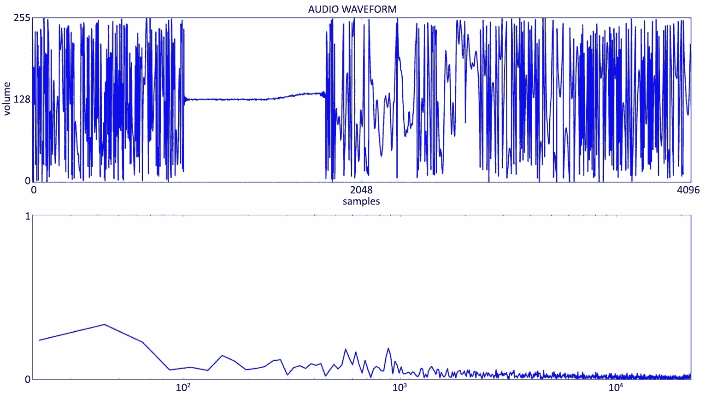

# 教会机器人倾听

教会机器人倾听口头指令本身就是一个完整的学科。机器人仅仅识别个别单词或一些预先设定的短语是不够的。我们希望机器人能够以正常多样的措辞对口头命令做出反应。我们可能会说，“拿起玩具”，或者“请把所有玩具都拿起来”，或者“清理这个混乱”，这些都可以是有效的指令，指示机器人开始搜索房间中的玩具并取走。我们将在本章中使用各种技术和流程。我们将基于一个开源的语音助手 **Mycroft** 进行构建，这是一个基于人工智能的语音识别和 **自然语言处理**（**NLP**）引擎，我们可以对其进行编程和扩展。我们将为 Mycroft 添加一些额外的功能——我们将使用我称之为“填空”方法的命令处理技术来提取用户语音指令的意图，这样机器人就能做你想让它做的事情，即使那不是你说的原话。我们将通过教会机器人讲述和回应特定形式的人类交流——敲门笑话来完成这一章。

本章将涵盖以下主题：

+   使用 NLP 探索机器人语音识别——包括 **语音转文本**（**STT**）和 **文本转语音**（**TTS**）

+   编程我们的机器人

# 技术要求

本章使用以下工具：

+   Mycroft 开源语音助手 ([http://mycroft.ai](http://mycroft.ai)) - 我必须从 GitHub 仓库 ([https://github.com/MycroftAI](https://github.com/MycroftAI)) 中从头开始构建，因此请预期您也需要这样做以保持与我们在机器人上运行的 **机器人操作系统**（**ROS**）兼容。

+   Python 3.2。

+   您需要一个 GitHub 账户，请访问 [https://github.com/](https://github.com/).

+   我在这个项目中使用了微型 USB 扬声器和麦克风，它们与 Jetson 配合得非常好。您可以在 [https://www.amazon.com/gp/product/B08R95XJW8](https://www.amazon.com/gp/product/B08R95XJW8) 找到它们。

本章使用的代码可以在本书的 GitHub 仓库中找到，请访问 [https://github.com/PacktPublishing/Artificial-Intelligence-for-Robotics-2e](https://github.com/PacktPublishing/Artificial-Intelligence-for-Robotics-2e)。

# 使用 NLP 探索机器人语音识别

这将是一个相当复杂的章节，但所有概念都相对容易理解。我们将最终构建一个强大的框架，用于构建语音识别和命令。你不仅会得到一个基于语音的机器人命令系统，还会得到一个功能齐全的数字助手，可以讲笑话。让我们首先快速介绍 NLP。

## 简要介绍 NLP 概念

自然语言处理（NLP）不仅仅是将声音波转换为书面文字（语音到文本，或STT），还包括理解这些文字的含义。我们不想只有一些僵化的、预先编程的语音命令，而希望机器人能够对人类语音做出响应。

我们将使用两种不同的STT处理形式：

+   **频谱分析**：这种类型有助于检测你何时说出机器人的名字。这种技术通过采样构成单词的频率和振幅来识别单词或短语。这个过程的优势在于不需要太多的计算机资源，并且擅长识别单个单词或短语——我们的“唤醒词”，这将使计算机切换到第二种类型的语音识别。这就是为什么其他语音操作助手需要你使用特定的词（例如，Siri或Alexa）来启用它们开始监听的原因。

+   **音素识别**：这种技术通过识别构成单词的发音部分——音素——来转换语音识别技术（STT）。这种试图将所有声音解释为单词的技术要困难得多，所以我们使用唤醒词来触发这种转换。我们将在本章后面更详细地介绍这一点。

接下来，让我们探讨实现语音识别的主要目标。

## 设定我们的目标

我们在[*第二章*](B19846_02.xhtml#_idTextAnchor032)中为我们的机器人设定了几个目标，包括能够对机器人发出语音命令，因为我们可能在没有基站的情况下使用机器人。我还希望机器人能够与我的孙子孙女互动，特别是能够讲并回应敲门笑话，这是我的孙子威廉最喜欢的活动。对于我们的机器人，我们不想使用预先录制或记忆中的语音命令，而是希望它能够进行一些自然语言处理，以创建一种机器人对 spoken word 的理解形式。例如，如果我们想要一个捡起玩具的命令，我们人类可以用几种方式表达：*抓起一个玩具*，*握住一个玩具*，*拿起那个玩具车*，甚至*拿那个*。我们希望机器人能够理解或至少对所有的这些表述做出相同的反应，驱动机器人手臂前往最近的玩具并将其捡起。STT系统今天相当普遍，但我们希望机器人的语音模式有一些自然的变体，以帮助创造机器人比实际更聪明的错觉。我们可以将这个过程分解为几个步骤，我们将独立处理这些步骤：

+   接收音频（声音）输入。我们需要机器人能够听到或具有将声音转换为数字形式的能力。

+   这些声音需要被转换成机器人可以处理的文本。

+   对这些文本单词进行加工处理，以理解说话者的意图。我们需要识别单个单词，并将这些单词组合成句子，从这些句子中推断说话者的意图，以理解机器人应该做什么。

+   使用那个意图作为命令来执行某些任务。

+   以语音的形式（文本到语音，或TTS）向操作员提供口头回应，以确认机器人已听到并理解了指令。

+   创建一个定制的语音界面，既能讲述也能回应“敲门”笑话。

我们将在下一节介绍STT的过程，这是机器人如何接收您的语音输入。

## 理解STT过程

在本章的剩余部分，我们将实现机器人的基于AI的语音识别和响应系统，并创建我们自己的定制语音界面。我们将使用Mycroft，这是一个开源的语音激活数字助手，擅长理解语音，并且易于扩展以实现新的功能和定制界面。

我们将详细讨论语音交互中涉及的每个步骤。在这个过程中涉及两种STT形式，这大大简化了机器人的任务：**唤醒词识别**和**STT识别**。让我们首先探索唤醒词识别。

### 监听唤醒词

在第一种方法中，机器人持续监听唯一的语音——唤醒词。这是一个特定的声音，仅意味着一件事——准备处理下一个声音成为指令。为什么这是必要的呢？由于机器人只有一个非常小的处理器——Jetson Nano，它实际上并没有足够的板载计算能力来运行一个健壮的语音识别引擎。但它可以运行一个简单的声音识别器，可以监听唤醒词。您可能从其他语音命令系统中熟悉这一概念，例如Alexa或Siri，它们也使用特殊的唤醒词或按钮来让界面注意（参见[https://www.howtogeek.com/427686/how-alexa-listens-for-wake-words/](https://www.howtogeek.com/427686/how-alexa-listens-for-wake-words/))。

一旦接收到唤醒词，Jetson Nano将切换到录音模式，并记录我们接下来所说的话。然后，它将信息传输到在线系统，即Google Cloud Speech to Text系统（与运行Google Assistant的系统相同）。

机器人是如何识别唤醒词的？我们将使用的语音系统，开源系统Mycroft，使用两种方法之一：

+   第一个是一个名为Sphynx的**音素识别系统**。什么是音素？你可以理解，单词是由单个声音组成的，我们大致将这些声音分配给字母表中的字母。例如，单词*pet*或*pick*中的*p*声音就是一个音素的例子。单词“Albert”有几个音素——*A*声音（啊），*L*声音，*B*，*ER*组合在一起，最后是*T*。我们与声音关联的字母——例如，*cherry*中的*ch*和*Albert*中的*er*——被称为**图形符号**，因为它们图形地表示了这些声音。我们可以这样说，语音到文本（STT）问题是将这些音素映射到图形符号的问题，但我们知道这太简单了——英语中有各种各样的借词和短语，它们的发音和拼写相差甚远。

    Mycroft语音识别过程的前端使用音素来识别唤醒词。你会发现它非常敏感。我没有任何问题让语音处理器从八英尺远的地方接收唤醒词。当我们设置时，我们将默认的Mycroft唤醒词从“嘿，Mycroft”更改为“嘿，阿尔伯特”。

+   Mycroft还可以使用一个经过训练的**神经网络**，该网络被训练成通过它们的**频谱功率图**一次性识别整个单词。什么是频谱图？你的声音不是单一频率的声音能量——它是由我们的嘴巴和声带产生的不同频率的复杂集合。如果我们用纯频率说话，我们会像笛子一样——主要是单一频率的纯音。我们可以使用一个称为**快速傅里叶变换**的过程将一段语音转换成一个图表，该图表显示了每个频率的能量（音量）。这被称为频谱图或频谱功率图。低频在左侧，高频在右侧。大多数人类语音的能量集中在300 Hz到4,000 Hz之间的频率上。每个单词在这些频率上的声音能量分布都是独特的，可以通过这种方式被神经网络识别：



图6.1 – （顶部）模拟音频波形和短语“嘿，阿尔伯特”的频谱图（底部）

上述图表展示了短语“嘿，阿尔伯特”在时域中的音频波形（顶部图表）和频域中的频谱图。

语音识别方法和神经网络方法都使用频谱图来识别声音作为单词，但语音识别过程将单词分解成单个声音，而神经网络则一次性监听并识别整个单词。这为什么会造成很大的差异呢？语音识别系统可以开发出来识别英语中的任何单词，而无需重新编程或重新训练，而神经网络必须对每个单词单独进行训练，并且希望由很多不同口音的不同说话者进行训练。我们将为阿尔伯特使用神经网络方法。

注意

你可以从[*第4章*](B19846_04.xhtml#_idTextAnchor126)中回忆起，我们需要标记的数据来训练一个神经网络。你记得我们有一些分类的图片，并在每个分类上进行训练。为声音训练**人工神经网络**（**ANNs**）也是一样的：我们需要声音和相关的单词。你能想到一个地方，那里有很多不同声音的样本，同时也有精确的书面脚本相匹配吗？你有没有听过录音带上的书？

### 转换语音识别

在接收到唤醒词之后，我们的下一步是记录机器人听到的下一个声音。然后，Mycroft系统将音频数据通过互联网传输到谷歌在线语音识别引擎（[https://cloud.google.com/speech-to-text/](https://cloud.google.com/speech-to-text/)）。这是一种快速解决问题的方法，我们的Jetson Nano处理能力或存储空间不足，无法拥有强大的语音识别能力。

谷歌云中发生了什么？语音识别引擎将语音分解成音素（声音），并使用神经网络为这些声音分配最可能的图形（字母）。输出会比我们想要的更音素化。例如，根据*Carnegie Mellon大学发音词典*，句子“请捡起玩具？”发音为`P IH K . AH P . DH AH . T OY Z . P L IY Z`。为什么会这样？发生了什么？这些都是构成那个句子的音素。句号表示单词之间的空格。现在系统必须将其转换为我们期望的单词。语音识别系统使用单词规则和词典来得出最可能的常规单词转换。这包括专家系统（单词规则）和基于音素的预测输出单词的训练神经网络。

我们可以称这个步骤为**语言模型**。我们的语音识别输出句子“一加仑有多少盎司？”并将其在不到两秒内发送回机器人。

现在我们有了文本中的命令，一个英语句子，机器人如何识别你的意图呢？

## 明确意图

我们正在做的NLP有一个目标或目标。我们通过语音界面向我们的机器人下达命令。英语中的命令通常遵循句子模式，类似于“你 - 做这个。”句子中的“你”主语通常是隐含或理解的，并被省略。我们剩下的是像“清理这个房间”或“捡起那些玩具”这样的陈述。这些命令的意图是让机器人启动一个程序，使机器人捡起玩具并将它们放好。机器人和它的处理器必须从所说的词语中推断或推导出用户的意图。我们希望任何合理的句子都有这样的意义：“你，机器人，开始你的捡起玩具过程。”

想想我们可以有多少种方式对机器人说那个命令。以下是一些例子：

+   让我们清理这个房间

+   把玩具放好

+   拾起玩具

+   拾起所有玩具

+   清理这个房间

+   把那些放好

+   把这个放好

+   是时候清理了

这些短语有什么共同之处？它们都暗示执行动作的主体是机器人。没有像“你”、“机器人”或“阿尔伯特”这样的词来指示命令的目标对象。“玩具”这个词出现很多，同样“捡起”、“清理”和“放好”也经常出现。我们可能只需要关注这些关键词来理解这个命令。如果我们去掉所有常见的连词和代词，这个列表看起来会是什么样子？

+   清理房间

+   放置玩具

+   拾起玩具

+   拾起玩具

+   清理房间

+   放好

+   放好

+   时间清洁

本章的一个重要概念是理解我们不是试图理解所有语音，而是只理解机器人可以执行的命令子集。解决这个语音识别问题的通用解决方案可能是有能力从机器人收到的命令中预测，用户的意图指向一个命令的可能性比指向其他任何命令的可能性更大。你可以看到，在“清理”这个词的情况下，我们的其他命令（“开车绕圈”、“移动手臂”或“停止”）与“清理”根本不相关。因此，包含“清理”的句子很可能与“捡起玩具”命令相关。这个决定意图的过程将在本章后面用于通过Mycroft向机器人发送命令。

现在我们将直接进入编程Albert机器人，使其通过Mycroft监听和理解命令。

# 编程我们的机器人

如本章前面所讨论的，Mycroft是一种数字助理版本，类似于苹果的Siri或亚马逊的Alexa，因为它可以以基本上正常的方式监听语音命令并将这些命令与计算机接口。我们使用它是因为它有一个在Jetson Nano 3上运行的界面。在本节中，我们将设置我们的硬件和我们的软件（即Mycroft）。

## 设置硬件

我们将在 Nvidia Jetson Nano（或您使用的任何微处理器）上安装 Mycroft。Jetson Nano 没有附带的一件少数几件事情是**音频功能**。它没有扬声器或麦克风。我发现，添加这种功能的一个快速有效的方法是使用现有的硬件套件，该套件提供了一个非常高质量的扬声器和一个优秀的立体声麦克风套件，且适合机器人使用。请注意，这几乎适用于任何 Linux **单板** **计算机**（**SBC**）。

该套件是一个微型 USB 音频板，可插入 Jetson Nano。它既有扬声器也有麦克风。

注意

我为 Jetson Nano 使用了一个 USB 音频板（品牌不重要，因为任何一种都行），它对我来说工作得非常好，并且适合我们机器人上非常小的空间。安装过程非常简单。插入音频板。您需要前往屏幕右上角的**设置**来选择 USB 音频版本。将列出几个其他选项。

使用新的扬声器和麦克风开启您的 Jetson Nano 3。我使用 YouTube 进行了快速测试，以确保音频工作正常，您可以直接在**设置**用户界面中进行测试。现在我们可以深入软件部分。

## 设置 Mycroft 软件

安装 Mycroft 有几种方法，因为我们必须将 Mycroft 安装在我们已经安装的其他软件之上：

1.  由于 Mycroft 必须与 ROS 以及我们安装的所有 AI 库（如 TensorFlow、Theano 和 Keras）兼容，因此我们最好使用 `git clone` 方法下载源代码，并在 Jetson Nano 上构建 Mycroft：

    ```py
    git clone https://github.com/MycroftAI/mycroft-core.git cd Mycroft-core
    bash dev_setup.sh
    ```

    Mycroft 将创建它运行所需的虚拟环境。它还将 Mycroft 软件包与其他 Jetson Nano 上的软件包隔离开。

注意

请不要以 root 用户（或超级用户）的身份安装 Mycroft。这会导致配置文件出现权限问题。

1.  为了让 Mycroft 系统能够以这种方式运行，我还必须再进行一个步骤。当我第一次尝试让 Mycroft 运行时，系统总是失败。当我尝试启动调试器时，它会退出或卡住。为了解决这个问题，我必须按照以下步骤重新编译整个系统：

    ```py
    sudo rm -R -/.virtualenvs/Mycroft
    cd ~/mycroft-core
    mycroft-core directory.
    ```

1.  您可以从调试模式开始：

    ```py
    Time skill is totally self-contained inside the Jetson Nano. The robot should give you a voice response that is replicated on the debug console.
    ```

1.  接下来，你可以向 Mycroft 询问更高级的技能，例如在互联网上查找信息。问：“嘿，Mycroft，一加仑有多少盎司？”Mycroft 将使用互联网查找答案并回复。

1.  接下来，你可以在 Mycroft 网站上更改唤醒词，使其更合适——我们并没有给这个机器人起名为 Mycroft。我们一直称这个机器人为阿尔伯特，但你也可以选择给机器人起任何你想要的名字。你可能发现一个非常短的名字，比如鲍勃，可能太短，不适合作为唤醒词，所以选择一个至少有两个音节的词。为此，导航到 Mycroft 网页（[http://home.mycroft.ai](http://home.mycroft.ai)）并登录你的账户，这是我们之前在**步骤 4**中创建的。点击右上角的你的名字，从菜单中选择**设置**。你可以在这一页上选择几个设置，例如你想要的语音类型、度量单位以及时间和日期格式。选择**高级设置**，这将带你去一个可以更改唤醒词的页面。

1.  我们将第一个字段，即**唤醒词**字段，更改为**自定义**。我们将下一行更改为输入我们的自定义唤醒词——“嘿，阿尔伯特。”

1.  我们还需要查找这个唤醒词的音素。从卡内基梅隆大学的**CMU 发音词典**（[http://www.speech.cs.cmu.edu/cgi-bin/cmudict](http://www.speech.cs.cmu.edu/cgi-bin/cmudict)）查找。输入我们的短语，你将得到音素短语。复制并粘贴这个短语，然后回到 Mycroft 页面，将音素短语粘贴到**音素**字段中。你已经完成了——不要更改其他任何设置。

1.  在你离开页面之前，请点击页面顶部的**保存**按钮。

你可以在 Jetson Nano 上测试你的新唤醒词。再次以调试模式启动 Mycroft 并等待其启动。说出你的新唤醒短语并享受其响应。我有一组标准的测试短语来展示 Mycroft 作为我们机器人声音的能力。尝试以下短语：

+   嘿，阿尔伯特。现在几点了？

+   嘿，阿尔伯特。明天的天气怎么样？嘿，阿尔伯特。一加仑有多少盎司？

+   嘿，阿尔伯特。英国国王是谁？

你应该得到对这些问题的适当答案。

Mycroft 有许多其他我们可以利用的技能，例如设置定时器、设置闹钟、在 Pandora 上听音乐或播放新闻。我们接下来要做的是通过创建我们自己的、针对我们房间清洁机器人的特定技能来扩展这些技能。

## 添加技能

我们将创建的第一个技能是捡起玩具的命令。我们将把这个命令连接到 ROS 以控制机器人。稍后，我们将添加一个讲敲门笑话的技能。

### 设计我们的对话

我们的第一步是设计我们的对话，确定我们将如何与机器人交谈。首先，列出你可能告诉机器人去捡起游戏室玩具的各种方式。以下是我的列表，这是我使用 ChatGPT（版本 3.5）生成的：

+   嘿，机器人，你能帮我开始捡起所有的玩具吗？

+   是时候整理一下了。你能帮我收集所有的玩具吗？

+   需要你的帮助，机器人。你能帮我捡起所有的玩具并放进玩具箱吗？

+   我们一起来打扫。首先，请收集所有的玩具。

+   我需要一间干净的房间。您能先捡起散落在各处的玩具吗？

+   亲爱的机器人，您能否麻烦一下，把所有的玩具收拾起来，整理一下房间？

+   让我们把这个房间打扫得干干净净。请先收集所有玩具。

+   是时候打扫了。

+   你能捡起所有的玩具吗？

+   拾起所有玩具。

+   您可以将所有玩具收集起来，放在玩具箱里。

+   是时候展示您的清洁技能了。请先从捡起所有玩具开始。

+   请您通过捡起所有玩具来整理房间。

您会注意到有几个关键词是针对清洁房间命令的特定关键词。当然，我们有“清洁”这个词。我们有短语“捡起”和“拿开”。我们还有“玩具”或“玩具”，最后还有“杂乱”。这些关键词将引导自然语言处理器，并允许在确切使用的词语上有所变化。

接下来，我们写下我们希望机器人回应的内容。我们不希望每次都是相同的预设回复；机器人回应的自然变化会更好。以下是我由ChatGPT3创建的回应列表，其中展示了各种机器人的态度：

+   命令已接收——捡起玩具。

+   当然，我会立即开始打扫房间。

+   明白了，我会整理房间，并确保一切物品都归位。

+   清洁模式已激活！我会确保您的房间干净整洁、井井有条。

+   如您所愿，我将为您打扫房间。

+   没问题，我会使用我的清洁能力高效地整理房间并清除任何杂乱。

+   已完成！我将打扫、除尘和拖地，让您有一个一尘不染的房间。

+   清洁中！我会勤奋地打扫房间，并确保它整洁、可展示。

+   我明白了！我会使用我的清洁工具和技术，让您的房间看起来一尘不染。

+   已确认，我将整理房间并确保它整洁有序，以便您使用。

+   清洁任务已接受！我会勤奋工作，让您的房间变得干净、舒适，就像您喜欢的那样。

您可以使用您想要的任何数量的这些短语。Mycroft系统会从这个列表中随机抽取一个短语。这为我们提供了创意空间，并给人一种机器人比实际更智能的错觉。这种响应系统使我们能够快速开发我们的对话。

在下一节中，我们将探讨如何将语音命令连接到ROS接口。

### 创建技能

在本节中，我们将构建Mycroft框架，使其能够将我们的口语短语与发送给机器人的命令关联起来。这需要添加我们希望机器人拥有的每个技能。

#### 正在整理玩具

首先，让我们为Albert添加最基本的功能——通过捡起玩具来打扫房间。为此，请按照以下步骤操作：

1.  使用`mycroft-msk create`命令，这有助于我们将技能以正确的格式组合在一起：

    ```py
    cleanroomrobot-skill.
    ```

1.  然后，它将询问类名和存储库名，这两个我都使用了 `Cleanroomrobot`。

1.  为你的技能输入一行描述：`捡起房间里的所有玩具`。

1.  输入一个长描述，例如 `命令机器人检测玩具，移动去抓取一个玩具，拿起它，并将其放入` `玩具箱`。

1.  输入一些示例短语以触发你的技能：

    +   `嘿机器人，你能开始捡起所有` `玩具吗？`

    +   `是时候整理了。你能帮我收集所有玩具吗？`

    +   `你能捡起所有` `玩具吗？`

1.  输入以下参数：

    +   `<你的` `名字在这里>`

    +   `Productivity`

    +   `IoT`

1.  输入标签可以更容易地搜索你的技能（尽管这是可选的）：`robot`，`cleanup`，`pick up` 和 `toys`。

1.  我们最终会在 `/opt/Mycroft/skills/cleanroomrobot-skill` 目录结构中拥有以下结构：

    ```py
    Cleanroomrobot-skill
       Git
       __pycache__
      Locale
        En-us
            cleanroomrobot.dialog
            cleanroomrobot.intent
    __init__.py
    LISCENSE.md
    Manifest.yml
    README.md
    init.py file in the skill_pickup_toys directory that we copied from the template.
    ```

1.  我们将导入 Mycroft 所需的库（`IntentBuilder`，`MycroftSkill`，`getLogger` 和 `intent_handler`）。我们还导入 `rclpy`，ROS 的 Python 接口，以及 ROS 标准消息 `String`，我们通过在 `syscommand` 主题上发布来使用它向机器人发送命令：

    ```py
    from mycroft import MycroftSkill, intent_handler, intent_file_handler
    import rclpy
    from rclpy.node import Node
    from std_msgs.msg import String, Int32MultiArray, Int32
    from adapt.intent import IntentBuilder
    from mycroft.util.log import getLogger
    ```

注意

`MycroftSkill` 是一个在它的短语被 Mycroft 意图引擎识别时被调用的函数。因此，它没有主体或主函数，只有一个 `create_skill` 函数的定义，该函数实例化一个 `MycroftSkill` 对象。`init` 函数执行设置技能的各种对话框、意图处理程序和词汇的大部分工作。这种安排在我们的有限环境中工作得非常好，即给出机器人命令或讲笑话。

1.  下一个行是 Mycroft 的日志记录器，这样我们就可以保存我们的响应。我们将输出到 stdout 的任何内容，例如打印语句，最终都会记录在日志中，或者在调试模式下显示在屏幕上：

    ```py
    Cleanroomrobot to match what we defined previously:

    ```

    class Cleanroomrobot(MycroftSkill):

    def __init__(self):

    MycroftSkill.__init__(self)

    def setRobotInterface(self,interfce):

    self.interface = interfce

    def initialize(self):

    pass  # 目前只返回

    ```py

    ```

1.  我们在 ROS 中设置了 `syscommand` 主题的发布者。这是我们通过 ROS 发布/订阅系统向机器人控制程序发送命令的方式。我们只发布命令，我们需要的唯一消息格式是 `String`：

    ```py
    pub = rospy.Publisher('/syscommand', String, queue_size=1000)
    # define our service for publishing commands to the robot control system # all our robot commands go out on the topic syscommand
    def pubMessage(str):
    pub.publish(str)
    ```

1.  我们的 Mycroft 技能被创建为 `MycroftSkill` 对象的子对象。我们将我们的技能对象类重命名为 `CleanRoomSkill`：

    ```py
    class CleanRoomSkill(MycroftSkill):
    def   init  (self):
    super(CleanRoomSkill, self).  init  (name="PickupToys")
    ```

    根据模板，Mycroft 需要一个 `init` 方法和 `initialize` 方法。这些命令在 Mycroft 的意图构建器部分设置意图，并在我们任何短语被说出时注册我们的处理器。

1.  接下来，我们使用 `require("CleanRoomKeyword")` 引用我们在 *创建技能* 部分构建的对话框，所以请确保所有的拼写都是正确的：

    ```py
    def initialize(self):
            clean_room_intent = IntentBuilder("cleanroomrobot").require("cleanroomrobot").build()
            self.register_intent(clean_room_intent, self.handle_cleanroomrobot)
    ```

1.  下一节创建了一个处理程序，当系统识别到我们的一种短语时，并希望执行此命令的操作。这就是我们通过之前定义的`pubMessage`函数使用ROS启动向机器人的控制程序发布命令的地方：

    ```py
        @intent_file_handler('cleanroomrobot.intent')
        ##@intent_handler('cleanroomrobot.intent')
        def handle_cleanroomrobot(self, message):
            self.speak_dialog('cleanroomrobot')
            self.interface.cmdPublisher("CleanRoom")
    ```

1.  我们还需要一个`stop`函数，其中我们可以命令机器人停止清洁，如果需要，以防止任何形式的*米老鼠-魔术师-学徒*事故：

    ```py
        def stop(self):
            self.interface.cmdPublisher("STOPCleanRoom")
            pass
    ```

注意

在电影《幻想曲》中，米老鼠扮演了童话中魔术师的学徒的角色。在故事中，学徒学会了使扫帚活动，他教扫帚从井里取水。问题是学徒从未学会如何停止魔法，很快房间里就充满了水。

1.  现在我们需要一个代码块来在程序中创建技能，以便我们将ROS接口与机器人关联到技能中。我们将添加一个`create_skill`函数，以便Mycroft创建技能并有一个函数指针来启用技能：

    ```py
    def create_skill():
        newSkill = Cleanroomrobot()
        newSkill.setRobotInterface(rosInterface())
        return newSkill
    ```

1.  接下来，我们有ROS接口。我们只需要向机器人发送一个命令，在`RobotCmd`主题上发布模式命令：

    ```py
    class rosInterface(Node):
        def __init__(self):
            super().__init__('mycroftROS') # node name
            self.cmdSubscribe = self.create_subscription(String, 'RobotCmd', self.cmdCallback,10)
            self.cmdPublisher = self.create_publisher(String, 'RobotCmd', 10)
        def cmdCallback(self,msg):
            robotCmd = msg.data
    ```

    我们定义我们的ROS接口并创建一个名为`mycroftROS`的控制节点，作为我们的接口。然后我们创建一个订阅者和发布者到`RobotCmd`主题，这样我们就可以从ROS 2接口发送和接收命令。

1.  程序的其余部分只是日常维护。我们需要启动我们的ROS节点，启动Mycroft记录器，并实例化ROS接口对象和ROS和Mycroft的`cleanSkill`对象。然后我们将`cleanSkill`对象指向ROS接口，以便它们可以通信。最后，我们使用`.spin`函数启动ROS 2接口。当程序停止时，我们退出`.spin`并关闭我们的程序：

    ```py
    ## main ###
    rclpy.init()
    LOGGER = getLogger(__name__)
    interface = rosInterface()
    cleanSkill = Cleanroomrobot()
    cleanSkill.setRobotInterface(interface)
    rclpy.spin(interface)
    rosInterface.destroy_node()
    rclpy.shutdown()
    ```

1.  为了使我们的技能正常工作，我们需要将我们的目录复制到`/opt/mycroft/skills`。从那里，我们可以在调试模式下测试它。记住，你必须源ROS 2目录（`source /opt/ros/foxy/local_setup.sh`和`source ~/ros2_ws/install/local_setup.sh`），否则程序将无法找到所有包含文件或ROS节点。

我们下一个技能是根据我的孙子威廉的要求来的，他非常喜欢敲敲门笑话。威廉七岁，所以他正是适合这个年龄。让我们看看我们如何实现它。

#### 讲笑话

在本节中，我们将处理机器人讲敲敲门笑话的情况。如您所知，敲敲门笑话是基于双关语的笑话，通常采用相同的形式：

第一个人：敲，敲

第二个人：谁在那里？

第一个人：木

第二个人：木谁？

第一个人：你愿意知道吗！

如您所见，对话非常简单。其中一些部分是标准的，例如前两行——“敲，敲”和“谁在那里？”我们可以在以下形式中创建一个通用的敲敲门笑话：

1.  敲，敲。

1.  谁在那里？

1.  `<``word 1>`

1.  `<word` `1>`谁？

1.  `<``punchline phrase>`

在定义我们的笑话时，您可以看到我们只有两个变量元素——*步骤3*中的单词和*步骤5*中的笑点短语。我们的单词在*步骤4*中被重复。

我们首先创建一个包含单行笑话的笑话数据库，我们将将其放入一个文本文件中。由于我们只有两个元素，我们可以用斜杠(`/`)来分隔它们。以下是一个示例：

```py
tarzan / tarzan stripes forever
orange / orange you glad I can tell jokes?
```

我在当前章节的仓库文件部分提供了一个大约10个笑话的数据库。请随意添加您喜欢的所有笑话，或者发送给我，我会添加它们。

现在，让我们看看讲笑话所涉及的步骤：

1.  我们将像任何技能一样，从唤醒词“嘿，阿尔伯特”开始。

1.  然后，我们需要一个短语来表示我们想要听一个笑话，所以我们将使用“告诉我一个敲门笑话”的变体，例如“我想听一个敲门笑话”。

1.  这将触发我们的技能程序查找一个笑话。我们将创建几个意图或响应能力来响应用户（或孩子）与机器人交谈。我们将从“谁在那里？”对话意图开始。这将让机器人知道继续到笑话的下一部分，即说出我们的单词。

1.  然后我们禁用了“谁在那里？”对话，并启用了一个用于监听`<word>`和短语“who”的对话。

1.  然后，我们可以通过背诵笑点短语来传达笑话的最后一部分，这样我们就完成了。

我们如何实现这个功能？您可以按照以下步骤进行：

1.  我们首先创建我们的词汇文件，我们需要三个。这些是用户将对机器人说的话。我们有第一个“告诉我一个敲门笑话”短语——所以让我们创建一个名为`knockknock.voc`的文件（您可以使用任何文本编辑器来创建文件）并将以下内容放入其中：

    ```py
    Tell me a knock-knock joke Can I have a knock-knock joke Give me a knock-knock joke Play me a knock-knock joke
    ```

    请注意，Mycroft STT系统将短语“敲门”解释为带有连字符的`knock-knock`，所以将这一点放入我们的脚本中非常重要。

1.  现在我们第二个词汇是“谁在那里”，因此我们可以创建这个作为第二个`.voc`文件，`whosthere.voc`，它包含一行`Whos there`。

1.  我们的最后一行有点棘手。我们真正关心的是触发笑点的关键词“谁”，所以我们只需查找那个词。创建一个名为`who.voc`的文件，并将一个单词`who`放入其中。记住，这些文件都应该放在我们的`skill`目录下的`dialog/en-us`文件夹中。

1.  现在我们来处理我们的回应。我们有一个预设的回应，即用短语“敲门”来回应“告诉我一个敲门笑话”。我们不需要任何复杂的对话系统，我们只需要让机器人说出“敲门”短语。为此，我们首先导入在这个程序中需要调用的库，即`MycroftSkill`类和`intent_file_handler`函数：

    ```py
    from mycroft import MycroftSkill, intent_file_handler
    ```

1.  我们将我们的技能定义为 `MycroftSkill` 对象的子对象——这是一个标准的面向对象设计。我们正在继承 `MycroftSkill` 父对象的所有功能和数据，并添加我们自己的功能。我们创建了一个初始化函数，然后调用 `init` 父函数来执行父类的代码。我们正在增强 `init` 父函数的功能。如果没有这个调用，我们将用我们自己的替换 `init` 函数，可能需要复制大量工作：

    ```py
    class Knockknock(MycroftSkill):
      def __init__(self):
         MycroftSkill.__init__(self)
    ```

1.  下一步是创建我们的 `knockknock.intent` 文件，并将该文件放置在 `voc` 目录中（之前是 `dialog/voc-en`）：

    ```py
    @intent_file_handler('knockknock.intent') 
    def handle_knockknock(self, message):
    name,punchline = self.pick_joke()
    ```

    在这里，我们从笑话数据库中获取两个部分：

    +   在“谁在那里”之后要说的名字

    +   结束笑话的点睛之笔

1.  我们使用 `MycroftSkill` 中的 `get_response` 函数让机器人发表声明并等待回复，该回复将被转换成文本字符串并存储在 `response` 变量中：

    ```py
    response=self.get_response(announcement="knock, knock") 
    # response will always be "who's there" 
    response=self.get_response(announcement=name)
    ```

1.  现在我们到了机器人回应名字的部分。例如，用户问“谁在那里？”机器人回答“哈罗德。”我们期待用户接下来会说“哈罗德（或任何名字）谁？”我们将检查我们的回应，看看是否包含单词“谁”。如果没有，我们可以提示用户跟随笑话。我们只会这样做一次，以避免陷入循环。如果他们不参与，机器人将继续：

    ```py
    # response will be "name who"
    # if end of respose is not the word who, we can re-prompt 
    if "who" not in response:
      prompt = "You are supposed to say "+name+" who" 
      response=self.get_response(announcement=prompt)
    ```

1.  我们已经讲完了笑话，现在轮到说出点睛之笔，比如“哈罗德，你想拥抱吗？”（你想要拥抱吗？）。任务完成，我们退出程序；既包括喜剧程序也包括程序程序：

    ```py
    self.speak(punchline)
    ```

1.  我们需要一个函数来读取我们之前定义的笑话数据库。如前所述，数据库中每行有一个敲门笑话，名字和点睛之笔之间用正斜杠（`/`）分隔。我们读取所有笑话，将它们放入一个列表中，然后使用（等着瞧）`random.choice` 函数随机选择一个。我们分别返回名字和点睛之笔。我们应该只为每个笑话实例调用这个程序一次：

    ```py
    def pick_joke(): 
      jokeFile="knockknock.jokes" 
      jfile = open(jokeFile,"r") 
      jokes = []
      for jokeline in jfile:
        jokes.append(jokeline)
      joke = choice(jokes) 
      jokeParts = joke.split("/") 
      name = jokeParts[0] 
      punchline = jokeParts[1] 
      return name, punchline
    ```

1.  我们通过定义 `Knockknock` 类的实例并返回该对象给调用程序 Mycroft 来结束程序：

    ```py
    def create_skill():
      return Knockknock()
    ```

接下来，我们将讨论敲敲门笑话概念的另一端，即接收笑话——孩子想要告诉机器人一个笑话。如果你认识任何七岁的孩子，那么你知道这也是一个要求——孩子也会想要告诉机器人一个笑话。

#### 接收笑话

接收对话也很简单。用户会说“敲门，敲门”，这是机器人进入接收“敲门笑话”模式的提示。然后机器人只有一个回应——“谁在那里。”如果我们想保持科幻中常见的概念，即机器人不使用缩写，我们也可以添加“谁在那里？”

注意

来自《星际迷航：下一代》的机器人Data多次声明他无法使用缩写，尽管编剧偶尔会犯错误。

为了创建我们新的Mycroft技能的架构，我们将使用`pip3 install msk`。MSK提供了一个基于对话的方法来构建技能，这将创建一个框架，包括所有对话文件和词汇的子目录。这节省了很多时间，所以让我们试试：

1.  以下是为创建“接收敲门”笑话代码的命令：

    ```py
    $ msk create
    Enter a short unique skill name (ie. "siren alarm" or "pizza orderer"): receiveKnock
    Class name: ReceiveKnockSkill
    Repo name: receive-knock-skill
    Looks good? (Y/n) y
    Enter some example phrases to trigger your skill:
    knock knock
    -
    Enter what your skill should say to respond:
    who's there
    Enter a one line description for your skill (ie. Orders fresh pizzas from the store): This skill receives a knock knock joke from the user
    Enter a long description:
    This is the other half of the Knock Knock joke continuum - we are giving the robot the ability to receive knock knock jokes. The user says knock knock, the robot responds whos there and so on
    >
    Enter author: Francis Govers
    Would you like to create a GitHub repo for it? (Y/n) Y
    === GitHub Credentials === Username: ********** Password:*********
    Counting objects: 12, done.
    Delta compression using up to 4 threads. Compressing objects: 100% (5/5), done.
    Writing objects: 100% (12/12), 1.35 KiB | 0 bytes/s, done. Total 12 (delta 0), reused 0 (delta 0)
    To https://github.com/FGovers/receive-knock-skill
    * [new branch] master -> master
    /opt/Mycroft/skills/receive-knock-skill. The program is still the init.py file.
    ```

1.  我们从导入开始，这些是`MycroftSkill`和`intent_file_handler`。我们还需要`time`库来进行一些暂停：

    ```py
    from mycroft import MycroftSkill, intent_file_handler import time
    ```

1.  这里是我们为`ReceiveKnock`类定义的类，它是我们导入的`MycroftSkill`对象的子类。我们在`init`函数中通过传递一个`init`命令回传给父类（`MycroftSkill`）并让它执行初始化。然后我们在其基础上添加我们的自定义功能：

    ```py
    class ReceiveKnock(MycroftSkill):
      def __init__(self):
           MycroftSkill.__init__(self)
    ```

1.  下一节是我们的意图处理器，用于接收“敲门”笑话。我们使用`@decorator`来扩展意图处理器，在这种情况下，从名为`knock.receive.intent`的文件中读取意图的参数。意图处理器只有我们两个关键词，不朽的短语：“敲门，敲门”。我们很幸运，所有的笑话都以完全相同的方式开始，所以我们只需要这两个词。

    在意图引擎看到短语“敲门，敲门”并激活`handle_knock_receive`函数后，控制权传递到我们的处理器。我们的下一步是什么？我们用一个简单的回答“谁在那里？”来回应。你会记得我们说过机器人不使用缩写。我们使用不同的函数来做这件事。我们不希望使用另一个意图处理器，但幸运的是，Mycroft提供了一个自由形式的接口，称为`get_response`。你需要查找这个多功能函数的文档，但它使我们的笑话程序变得更加简单。`get_response`函数既让我们说出我们的回答，然后接收用户接下来说的任何话，并将其存储为字符串在`response`变量中：

    ```py
    @intent_file_handler('knock.receive.intent') 
    def handle_knock_receive(self, message):
      response =self.get_response('who.is.there')
    ```

    现在我们有了我们的回应，我们可以用机器人的声音重复它，并额外加上一个词“谁？”。所以，如果孩子说，“霍华德”，机器人回应“霍华德谁？”

1.  我们再次使用`get_response`让机器人说话，并记录孩子或成人接下来所说的话。我们不需要它，但我们想让机器人的语音系统听到接下来所说的话。我们丢弃了回应，但将我们自己的评论插入到我们的对话`veryfunny.dialog`中，这是一个位于`dialog`目录的文件。我创建了这个文件来保存机器人对我们笑话的回应。我尝试了一些孙子辈可能会觉得好笑的回应——我想我可以把“机器人笑话作家”加到我的简历上，因为我似乎在我的职业生涯中做了很多这样的事情。之后，我添加了一个睡眠计时器，以便在返回控制之前让一切平静下来。我们包括所有`MycroftSkills`所需的`stop`函数，并让我们的`create_skill`函数创建一个`ReceiveCall`对象并返回它：

    ```py
    response2= response + " who?"
    response3 =self.get_response(announcement=response2)
    self.speak_dialog('veryfunny') 
    time.sleep(3)
    def stop(self):
      pass
    def create_skill():
      return ReceiveKnock()
    ```

    你可以想多创意就有多创意，但这里是我的建议：

    +   那真是太有趣了！

    +   哈哈哈哈。

    +   真是好笑。

    +   我喜欢这个。谢谢！

    +   哈哈！哈哈。

    +   那真可爱！

    +   我没有咕噜咕噜的声音！

这里是我们的接收敲门笑话技能的目录结构和文件：

```py
receive-knock-skill directory:
init .py README.md
settingsmeta.json
./dialog/en-us:
knock.receive.dialog veryfunny.dialog
./vocab/en-us:
knock.receive.intent
```

将技能的本地版本放入`/opt/mycroft/skills/receive-knock-skill`目录。现在尽情测试吧——你能对机器人讲多少个敲门笑话？

# 摘要

本章介绍了用于机器人的自然语言处理技术，并专注于开发一个能够完成三项任务的机器人自然语言界面：启动*捡玩具*过程，讲讲敲门笑话，以及听敲门笑话。

介绍的概念包括通过音素识别单词，将音素转换为音素和音素转换为单词，从句子中解析意图，以及通过语音界面执行计算机程序。我们介绍了开源AI引擎Mycroft，这是一个基于AI的语音助手程序，在Jetson Nano上运行。我们还编写了一个笑话数据库，用一些非常简单的对话来娱乐小孩子。

在下一章中，我们将学习使用地标、神经网络、避障和机器学习进行**机器人导航**。

# 问题

1.  做一些互联网研究，了解为什么AI引擎被命名为Mycroft。你找到了多少不同的故事，哪一个是你喜欢的？

1.  在讨论意图时，你会如何设计一个神经网络来从自然语言句子中预测命令意图？

1.  将“接收敲门笑话”重写为记住机器人所讲的笑话，将它们添加到“讲敲门笑话”程序使用的笑话数据库中。这是机器学习吗？

1.  将“讲笑话”程序修改为播放波形文件中的声音，例如音乐剪辑，以及进行语音合成。

1.  本章使用的句子结构都是基于英语语法的。其他语言，如法语和日语，有不同的结构。这会如何改变句子的解析？我们编写的程序能否理解Yoda？

1.  你认为 Mycroft 的意图引擎实际上是在理解意图，还是只是在提取关键词？

1.  描述必要的语音命令，以指导机器人驶向一个物体并拿起它，而机器人无法识别该物体。你需要多少个命令？

1.  来自 *问题7*，努力减少命令的数量。你可以消除或合并多少个？

1.  也来自 *问题7*，涉及多少个独特的关键词？多少个非独特关键词？

# 进一步阅读

+   *《Python 自然语言处理》* by Jalaj Thanaki，Packt Publishing

+   *《Python 人工智能》* by Prateek Joshi，Packt Publishing

+   Mycroft 开发技能教程位于 [https://mycroft.gitbook.io/mycroft-docs/developing_a_skill/introduction-developing-skills](https://mycroft.gitbook.io/mycroft-docs/developing_a_skill/introduction-developing-skills)

+   使用 Mycroft 的附加文档位于 [https://media.readthedocs.org/pdf/mycroft-core/stable/mycroft-core.pdf](https://media.readthedocs.org/pdf/mycroft-core/stable/mycroft-core.pdf)

# 第3部分：高级概念 – 导航、操作、情感等

在本书的最后部分，我们探讨更高级的主题，包括基于 AI 的导航和避障。我们了解无监督学习的决策树和分类算法，然后开始一个关于创建机器人性格模拟的激动人心的章节。虽然我们无法给机器人赋予真实的情感，但我们可以使用状态机和蒙特卡洛技术来创建情感模拟。最后，我们以作者的角度讨论 AI 哲学，并展望未来，为那些想将机器人学和自主性作为职业的人提供建议。

本部分包含以下章节：

+   [*第7章*](B19846_07.xhtml#_idTextAnchor221), *教机器人导航和避免楼梯*

+   [*第8章*](B19846_08.xhtml#_idTextAnchor235), *整理物品*

+   [*第9章*](B19846_09.xhtml#_idTextAnchor294), *赋予机器人一个人工性格*

+   [*第10章*](B19846_10.xhtml#_idTextAnchor366), *结论和反思*
