# 放置物品

假设你必须去奶奶家，根据传说，奶奶家在*山丘之上，穿过树林*，距离两个州。如果你住在欧洲，那将是两个国家之外。为了规划你的旅行，你可以从以下两种方式之一开始。忽略谷歌已经从今天的年轻人那里夺走了大部分的地图阅读和导航技能的事实，你会拿出地图并做以下之一：

+   从你家出发，尝试找到最接近奶奶家直线的道路

+   从奶奶家出发，尝试找到通往你家的道路

从任何方向出发，你会发现你寻求的道路或路径会分叉、交叉、改变、蜿蜒，甚至可能走到死胡同。此外，并非所有道路都同等重要——有些道路更宽，限速更高，而有些道路则更窄，有更多的停车标志。最终，你将通过一系列决策来选择路线，以实现最低的成本。这种成本可能是以*时间*来衡量的——到达那里需要多长时间。它可能是以*距离*来衡量的——需要覆盖多少英里。或者它可能是以*金钱*来衡量的——存在一条收费道路，需要额外收费。

在本章中，我们将讨论几种解决涉及选择一系列决策的问题的方法，其中有一些度量标准——例如成本——可以帮助我们选择哪种组合可能是最好的。这里有很多信息在机器人学中得到了广泛应用，我们将超越我们的玩具抓取机器人，看看机器人的路径规划和一般决策。这些是任何机器人实践者必备的技能，因此它们被包含在这里。本章涵盖了人工智能（**AI**）决策过程的基础，其中问题可以用**分类问题**（确定这种情况是否属于一个或多个类似情况的一组）或**回归问题**（拟合或近似一个可以是曲线或路径的函数）来描述。最后，我们将应用两种方法来解决我们的机器人问题——专家系统和随机森林。

本章将涵盖以下主题：

+   决策树和随机森林

+   路径规划、网格搜索和A*（A星）算法

+   使用D*（D星）技术进行动态规划

+   专家系统和知识库

初看，我们将在本节中涵盖的概念——即路径规划、决策树、随机森林、网格搜索和GPS路线查找——除了都是人工智能中使用的计算机算法的一部分之外，并没有太多共同之处。从我的观点来看，它们基本上是相同的概念，并以相同的方式处理问题。

# 技术要求

我们在本章中使用的工具，你应该已经在之前的章节中安装过——**scikit-learn** ([http://scikit-learn.org/stable/developers/advanced_installation.html](http://scikit-learn.org/stable/developers/advanced_installation.html))。

或者，如果你有Python的`pip`安装程序，你可以使用以下命令安装它：

```py
pip install –U scikit-learn
```

你可以在[https://github.com/PacktPublishing/Artificial-Intelligence-for-Robotics-2e](https://github.com/PacktPublishing/Artificial-Intelligence-for-Robotics-2e)找到本章的代码。

# 任务分析

我们在本章的任务可能是如果你从[*第3章*](B19846_03.xhtml#_idTextAnchor043)开始就一直在关注进度，你可能会期待的任务。在第3章中，我们讨论了我们的故事板。我们需要在轮子上在房间里导航，找到通往目的地的路径，无论是捡起玩具还是开车去玩具箱。

为了实现这一点，我们将使用**决策树**、**分类**（一种**无监督学习**）、**鱼骨图**，这对于故障排除很有用，最后是**路径规划**。

# 介绍决策树

**决策树**的概念相当简单。你正在人行道上行走，来到一个拐角。在这里，你可以向右转，左转，或者直行。那是你的决策。做出决策后 – 向左转 – 你现在面临的不同决策比如果向右转要多。每个决策都会创建通往其他决策的路径。

当我们沿着人行道行走时，我们心中有一个目标。我们并不是漫无目的地闲逛；我们试图达到某个目标。一个或多个决策组合将帮助我们达到目标。假设目标是去杂货店买面包。可能有四到五条人行道可以通往商店，但每条路径可能长度不同或路径不同。如果一条路径要上坡，那可能比走平路更难。另一条路径可能需要你在红绿灯处等待，这会浪费时间。我们为这些属性中的每一个分配一个值，通常我们希望选择成本最低或奖励最高的路径，具体取决于问题。

在下面的决策树中，我们可以分解机器人捡起玩具的动作。我们首先查看玩具的宽高比（我们在[*第4章*](B19846_04.xhtml#_idTextAnchor126)中检测到的边界框的长度与宽度）。我们根据玩具最窄的部分调整机器人手臂的腕部。然后，我们尝试用那个腕部位置捡起玩具。如果我们成功，我们就把玩具从地上拿起来，拿到玩具箱里。如果我们失败，我们尝试另一个位置。尝试了所有位置后，我们继续到下一个玩具，并试图稍后从这个玩具的角度回来，希望是从不同的角度。你可以看到这样分解我们的动作是有用的，结果证明决策树对很多事情都很有用，正如我们将在本章中看到的：

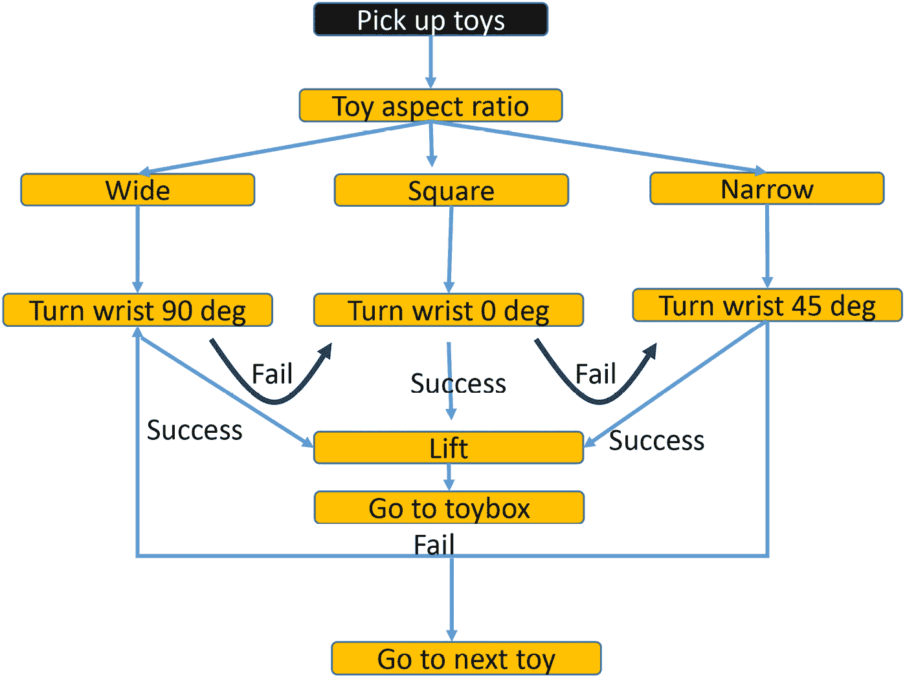

图8.1 – 如何捡起玩具的简单决策树

决策树类型问题的一般问题在于**指数级增长**。让我们以棋局为例，这是人工智能的一个热门问题集。我们有一个开局的20种选择（8个兵和2个骑士，每种都有2种可能的移动）。这20种移动中的每一种都有20种可能的后续移动，以此类推。所以第一步有20种选择，第二步有400种选择。第三步有197,281种选择！当我们试图提前规划时，很快就会有一个非常大的决策树。我们可以这样说，这些可能的决策是**分支**，做出决策后我们所处的状态是**叶子**，整个概念结构是一个决策树。

备注

与决策树一起工作的秘诀是无情地剪枝，这样你考虑的决策尽可能少。

处理决策树有两种方法（实际上，有三种——在我解释之前，你能猜到第三种吗）：

+   第一种方法是从小到大开始，向外工作到你的目标。你可能会走到死胡同，这意味着回溯或可能重新开始。我们将称之为**正向链**（链，因为我们正在树中从叶子到叶子制作一个链接路径）。

+   另一种方法是先从目标开始，向上工作到树的起点。这是**反向链**。反向链的酷之处在于，要穿越的分支要少得多。你可以猜到反向链的一个主要问题是，你必须提前知道所有叶子，才能使用它们。在许多问题中，例如网格搜索或路径规划器，这是可能的。在棋类游戏中，由于树的大小呈指数级增长，这是不可行的。

+   第三种技术？没有人说我们不能两者兼得——我们可以结合正向和反向链，在中间某个地方相遇。

决策树形状的选择、链技术以及构建是基于以下考虑的：

+   可用的数据是什么？

+   已知或未知的信息是什么？路径是如何评分或评级的？

使用决策树进行路径规划也有不同的解决方案。如果你拥有无限资源，最大的计算机，提前获得完美的知识，并且愿意等待，那么你可以生成**最优路径**或解决方案。

我从多年开发基于人工智能的实用机器人和无人车辆中学到的一个教训是，任何满足所有标准或目标的解决方案都是可接受和可用的解决方案，你不必等待并继续计算完美或最优的解决方案。通常情况下，一个“足够好”的解决方案可以在最优解决方案的1/10甚至1/100的时间内找到，因为最优解决方案需要穷举搜索，可能需要考虑所有可能的路径和组合。

那么，我们如何着手使我们的决策树运行得更快，或更有效率？我们做任何好的园丁都会做的事情——开始修剪我们的树。

## 我们所说的剪枝是什么意思？

有时候在计算机行业中，我们必须使用隐喻来帮助解释事物的工作原理。你可能还记得苹果公司，后来是Windows，采用的桌面隐喻来帮助解释图形操作系统。有时候，我们只是把这些隐喻用滥了，比如垃圾桶用来删除文件，或者*Clippy*，那个纸夹助手。

当我讨论**剪枝**你的决策树时，你可能觉得我已经进入了隐喻的深渊。接下来是什么，肥料和树桩？实际上，剪枝是决策树类型系统中一个关键的概念。你树上的每个分支都可能引导成百上千个子分支。如果你能尽早决定一个分支没有用，你可以将其剪掉，你就不必处理该分支或该分支中的任何分支或叶子。你越早发现一条路径无法带你达到目标，你就越快可以减少创建解决方案所需的时间和精力，这对于实时系统来说非常重要，比如机器人、自动驾驶汽车或自主飞机；这可能是可用和毫无价值之间的区别。

让我们快速通过一个例子来了解一下我们如何使用剪枝方法。决策树过程的一个很好的用途是**故障检测、隔离和恢复**（**FDIR**）。这是机器人的典型功能。让我们为我们的Tinman机器人无法移动的情况制作一个FDIR的决策树。我们可以采取哪些自动化步骤来检测故障、隔离问题，然后恢复？我们可以使用的一种技术是**根本原因分析**，我们通过系统地列出并消除（剪枝）导致因素，然后看症状是否匹配来试图找出我们的问题。进行根本原因分析的一种方法是通过一种特殊的决策树形式，称为**鱼骨图**，或**石川图**。这张图是以其发明者，东京大学的教授石川馨的名字命名的。在他的1968年论文《质量控制指南》中，鱼骨图因其形状而得名，它有一个中央脊柱和两侧突出的肋骨。我知道，当我们有一个像鱼一样的决策*树*时，这些隐喻变得越来越深。

现在，我们开始遇到问题。记住，在机器人中，问题是一个症状，而不是原因。我们的问题是机器人无法移动。什么可以导致这个问题？让我们列一个清单：

+   驱动系统

+   软件

+   通信系统

+   电池和电线

+   传感器

+   操作员错误

现在，对于每一个分支，我们将它们细分为更小的分支。哪些部分的*驱动系统*可能导致机器人无法移动？轮子可能卡住了。电机可能没有得到电源。齿轮可能卡住了。电机驱动器可能过热了。以下是我的鱼骨图，用以说明机器人无法移动的问题：

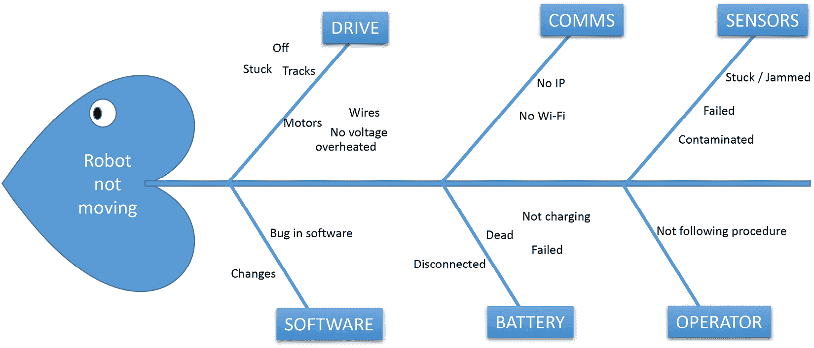

图8.2 – 鱼骨图或石川图常用于故障排除

对于这些因素中的每一个，你可以考虑如果这个问题是原因，那么它的症状会是什么。如果电机中的齿轮卡住了，那么电机无法转动，车轮也无法转动。如果我们能够检查掉这些因素中的任何一个，我们就可以从我们的图或决策树中剪枝或消除齿轮。我们检查了齿轮，用手转动车轮和电机，所以齿轮不是原因。我们剪掉了那个分支。如果我们有一个自动化的测试方法，我们可以自动剪枝分支，我们将在本章后面的例子中做到这一点。

那电池呢？电池可能需要充电（电池耗尽），电池可能被断开，或者电源线可能松动。我们检查电池电压 – 那是好的，所以从树上剪掉那个叶子。我们检查线路 – 没有松动。电池分支被剪掉了。

我们就这样继续下去，直到我们得到一个要么匹配所有症状，要么是最后一个剩下的东西。假设最后一个分支是通信。现在怎么办？我们问，“通信中的哪些事情会导致我们无法移动？”我们的第一个答案是电机命令消息没有通过网络到达我们的机器人。我们检查日志，确实没有电机消息（在我们的例子中是`cmd_vel`）。这就是我们的问题，但是什么导致了这个问题？网络可能坏了（检查过 – 没有，网络是好的），或者IP地址可能错了（没有，那没关系）。我们查看是否对控制软件进行了任何最近的变化，确实有。我们恢复到之前的版本，看到机器人移动了。这就是我们的问题，我们使用了决策树来找到它。

因此，在这种情况下，我们几乎完全通过剪枝树上的分支和叶子来解决问题，直到只剩下一条路径，或者我们达到了目标。

我们如何在软件中剪枝分支？我们可以寻找*死胡同*。死胡同是叶子 – 树的结束部分，没有未来的分支。当我们到达死胡同时，我们不仅可以剪掉那个叶子，还可以剪掉那些唯一导致那个分支的路径部分。这将是一种**反向链**剪枝方法，因为我们从终点开始，向后工作。

我们还可以看到树中未使用或从未被引用或调用的部分。我们可以以这种方式删除整个部分。这是**正向链**，因为我们正在正向遍历树，从前面到后面。

到目前为止，我们，故事中的人类，一直是手动制作这些决策树的。我们甚至还没有讨论如何编写一个程序，让机器人能够使用树来做出决策。如果计算机能够代替我们完成所有艰难的树制作、分支决定和节点标记的工作，那岂不是更好？这正是我们将在下一节中讨论的内容。

## 创建自我分类的决策树

让我们考虑一下对玩具进行分类的问题。我们可能想要发明一个更高效的机器人，它以某种方式对玩具进行分类，而不是仅仅将它们扔进一个盒子里。在一个理想的世界里，从20个玩具的群体中，我们会有一些特征将群体均匀地分成两半——10个和10个。让我们假设它是**长度**——一半的玩具长度小于六英寸，另一半的玩具长度大于六英寸。那么，如果另一个特征将这10个组中的每一个都再分成一半——分成四个组，每组五个，那就更理想了。

让我们假设它是**颜色**——我们有五种红色玩具，五种蓝色玩具，五种绿色玩具和五种黄色玩具。你可能已经注意到我们在做生物学家在课堂上对新的物种进行分类时所做的事情——我们正在创建一个**分类法**。现在，我们选择另一个属性，将玩具分成更小的组——这可能是玩具的类型或轮子的大小。我想你应该明白了这个道理。让我们来看一个例子。

现在，如果我们能够将所有玩具和所有属性列在一个表中，并让计算机找出有多少组以及它们是什么类型，那就太好了。我们可以创建一个像这样的表：

| **类型** | **长度** | **宽度** | **重量** | **颜色** | **轮子数量** | **噪音** | **软硬** | **材料** | **眼睛** | **玩具名称** |
| --- | --- | --- | --- | --- | --- | --- | --- | --- | --- | --- |
| 汽车 | 3 | 1 | 35 | 红色 | 4 | 0 | 硬 | 金属 | 0 | 热轮车 |
| 汽车 | 3 | 1 | 35 | 橙色 | 4 | 0 | 硬 | 金属 | 0 | 热轮车 |
| 汽车 | 3 | 1 | 35 | 蓝色 | 4 | 0 | 硬 | 金属 | 0 | 热轮车 |
| 汽车 | 3 | 1 | 35 | 蓝色 | 4 | 0 | 硬 | 金属 | 0 | 热轮车 |
| 汽车 | 3 | 1 | 35 | 白色 | 4 | 0 | 硬 | 金属 | 0 | 热轮车 |
| 填充玩具 | 5 | 5 | 50 | 白色 | 0 | 0 | 非常软 | 毛绒 | 2 | 毛绒玩具 |
| 填充玩具 | 7 | 5 | 55 | 棕色 | 0 | 0 | 非常软 | 毛绒 | 3 | 毛绒玩具 |
| 动作 | 2 | 4 | 80 | 灰色 | 0 | 0 | 硬 | 金属 | 0 | 柔软的 |
| 制作 | 2 | 2 | 125 | 木材 | 0 | 0 | 硬 | 木材 | 0 | 2x2积木 |
| 制作 | 2 | 2 | 75 | 木材 | 0 | 0 | 硬 | 木材 | 0 | 木材积木三角形 |
| 制作 | 4 | 2 | 250 | 木材 | 0 | 0 | 硬 | 木材 | 0 | 4x2积木 |
| 餐具 | 3 | 3 | 79 | 蓝色 | 0 | 0 | 硬 | 陶瓷 | 0 | 茶壶 |
| 飞机 | 7 | 5 | 65 | 白色 | 4 | 1 | 硬 | 塑料 | 0 | 太空穿梭机 |
| 飞机 | 13 | 7 | 500 | 绿色 | 8 | 1 | 硬 | 塑料 | 0 | 雷鸟2号 |
| 汽车 | 5 | 1 | 333 | 黄色 | 6 | 1 | 硬 | 金属 | 0 | 校车 |
| 音乐 | 12 | 4 | 130 | 木材 | 0 | 2 | 硬 | 木材 | 0 | 玩具吉他 |
| 音乐 | 5 | 2 | 100 | 黄色 | 0 | 1 | 硬 | 塑料 | 0 | 演唱麦克风 |
| 音乐 | 4 | 4 | 189 | 白色 | 0 | 2 | 硬 | 木材 | 0 | 玩具鼓 |

表8.1 – 用于分类的一组玩具的属性表

我们现在有一个问题需要解决。我们将使用 `scikit-learn` Python 包中提供的决策树分类器 `DecisionTreeClassifier`。这个程序不能使用字符串作为输入数据。我们必须将所有字符串数据转换成某种数值。幸运的是，`scikit-learn` 库为我们提供了一个专门为此目的的函数。它提供了几个编码函数，可以将字符串转换为数字。我们将使用的函数称为 `LabelEncoder`。这个函数接受一个字符串数组并将其转换为一系列整数。

我们可以取我们的第一列，其中包含玩具的类型。我的命名法是 *toy = toy car*，*stuffed = stuffed animal*，*aircraft = toy aircraft*，*music = toy musical instrument*。我们还有 *action* 代表 *action toy*，*build* 代表 *building toy*（即积木、LEGO™ 等）。我们得把这些转换成某种数字。

`LabelEncoder` 将将我们的数据表中填充有字符串的列转换为数值。数据中的 `type` 列如下代码所示：

`['car' 'car' 'car' 'car' 'car' 'stuffed' 'stuffed' 'action' 'build' 'build' 'build' 'dish' 'aircraft' 'aircraft' 'car' 'music' 'music' 'music']`

它将其转换为标签编码的玩具类型：

`[3 3 3 3 3 6 6 0 2 2 2 4 1 1 3 5 5 5]`

您可以看到，所有提到 `car` 的地方现在都变成了数字 `3`。您还可以看到 `6` 代表 `stuffed`，`0` 代表 `action`，等等。为什么数字这么奇怪？编码器首先按字母顺序对字符串进行排序。

我们将从这里直接开始创建一个分类程序：

1.  下面是我们的决策树分类器程序：

    ```py
    # decision tree classifier
    # author: Francis X Govers III #
    # example from book "Artificial Intelligence for Robotics" #
    ```

1.  我们首先导入我们将要使用的库。有一个额外的库称为 `graphviz`，它对于绘制决策树图像很有用。您可以使用以下命令安装它：

    ```py
    pandas package, which provides a lot of data table-handling tools:

    ```

    `from sklearn import tree`

    `import numpy as np`

    `import pandas as pd`

    `import sklearn.preprocessing as preproc`

    `import graphviz`

    ```py

    ```

1.  我们的第一步是读取我们的数据。我在 Microsoft Excel 中创建了我的表格，并将其导出为 **逗号分隔值**（**CSV**）格式。这允许我们直接读取数据文件并带有列标题。我打印出数据文件的大小和形状以供参考。我的文件版本有 18 行和 11 列。最后一列只是我对每个玩具实际名称的备注。我们不会使用最后一列进行任何操作。我们正在构建一个分类器，该分类器将根据类型对玩具进行分类：

    ```py
    toyData = pd.read_csv("toy_classifier_tree.csv")
    print ("Data length ",len(toyData))
    print ("Data Shape ",toyData.shape)
    ```

1.  现在，我们可以开始构建我们的决策树分类器。我们首先创建 `DecisionTreeClassifier` 对象的一个实例。有两种不同的 **决策树分类**（**DTC**）算法可供选择：

    +   **基尼系数**：基尼系数是在1912年由意大利统计学家科拉多·基尼在他的论文《Variabilita e Mutabilita》中提出的。这个系数或指数衡量一组数字中的不平等程度。零值表示组内的所有成员都是相同的。

    +   **熵方法**：当我们谈论AI时，熵指的是一组数据中的不确定性量。这个概念来自信息理论，其中它衡量随机变量的不确定性量。这个概念是在20世纪40年代由克劳德·香农提出的。为了创建决策树，算法试图通过在某个点上分割组来减少熵（减少不确定性），使得每个子节点比其父节点更同质。

在这里，我们将使用基尼系数。如果我们有一组所有玩具车大小相同且都是红色的玩具车，那么该组的基尼系数将是0。如果组内的成员都不同，那么基尼系数将更接近1。基尼系数由以下方程给出：

G(S) = 1− ∑ i=1 n p i 2

我们有4辆玩具车，共18个玩具，所以玩具车在组中的概率是*4/18*或0.222。决策树将继续细分类别，直到组的基尼系数为0：

```py
dTree = tree.DecisionTreeClassifier(criterion ="gini")
```

1.  我们需要将数据表中的值分离出来。第一列的数据，在Python中称为列`0`，是我们的分类标签。我们需要单独提取这些标签，因为它们用于将玩具分类。从我们之前使用神经网络的工作中，这些将是我们输出或我们在其他机器学习过程中使用的标签数据。我们将训练我们的分类器，根据表中的属性（大小、重量、颜色等）来预测玩具的类别。我们使用切片来从pandas表中提取数据。我们的pandas数据表称为`toyData`。如果我们想要表中的条目，我们需要请求`toyData.values`，这将返回一个二维数组：

    ```py
    dataValues=toyData.values[:,1:10]
    classValues = toyData.values[:,0]
    ```

如果你不太熟悉Python中的切片表示法，语句`toyData.values[:,1:10]`返回表中从1到10的列——它省略了列0。实际上，我们的表中确实有11列，但由于Python从0开始编号，我们最终需要1到10。你可能猜到另一种表示法只是抓取第一列的数据。

1.  这就是我们之前提到的标签编码器——它将把我们的数据中的字符串转换为数字。例如，颜色如*红色*、*绿色*和*蓝色*将被转换为数字如*0*、*1*和*2*。要编码的第一个项目是我们用来标记数据的类别值列表。我们使用`LabelEncoder.fit()`函数来得出将字符串转换为数字的公式，然后使用`LabelEncoder.transform()`函数来应用它。请注意，`fit()`不会产生输出。

1.  最后，我们需要使字符串文本和编码数字列表相匹配。`LabelEncoder` 会按字母顺序对字符串进行排序，并从 *A* 开始编号，忽略任何重复项。如果我们输入 `car, car, car, block, stuffed, airplane`，我们将得到 `2,2,2,1,3,0` 作为编码，并且我们需要知道 `airplane` = `0`，`block` = `1`，`car` = `2`，和 `stuffed` = `3`。我们需要生成一个 `airplane, block, car, stuffed`。我们通过在我们的字符串格式类别名列表上使用两个函数来复制 `LabelEncoder` 函数：

    +   我们使用 `set()` 函数来消除重复项

    +   我们使用 `sorted()` 函数以正确的顺序排序

现在，我们的类别名表和由 `LabelEncoder` 生成的枚举相匹配。我们稍后会用到这个：

```py
lencoder = preproc.LabelEncoder() lencoder.fit(classValues)
classes = lencoder.transform(classValues)
classValues = list(sorted(set(classValues)))
```

1.  为了方便起见，我创建了一个函数来自动找出我们的数据中哪些列由字符串组成，并将这些列转换为数字。我们首先构建一个空列表来存储我们的数据。我们将遍历我们的数据列，查看第一个数据值是否为字符串。如果是，我们将使用我们创建的标签编码器对象（`lencoder`）将整个列转换为数字。标签编码过程有两个部分。我们调用 `lencoder.fit()` 来查看我们的列中有多少唯一的字符串，并为每个创建一个数字。然后，我们使用 `lencoder.transpose` 将这些数字插入到列表中：

    ```py
    newData = []
    for ii in range(len(dataValues[0]))
    line = dataValues[:,ii]
    if type(line[0])==str:
         lencoder.fit(line)
      line = lencoder.transform(line)
    ```

1.  现在，我们将所有数据放回 `newData` 列表中，但有一个问题——我们已经将所有列转换成了行！我们使用 `numpy` 的 `transpose` 函数来纠正这个问题。但是等等！我们不再有数组了，因为我们将其转换成了列表，以便将其拆分并重新组合（你无法用 `numpy` 数组这样做——相信我，我试过了）：

    ```py
    newData.append(line)
    newDataArray = np.asarray(newData)
    newDataArray = np.transpose(newDataArray)
    ```

1.  现在，所有的预处理都完成了，所以我们最终可以调用真正的 `DecisionTreeClassifier`。它需要两个参数：

    +   我们数据值数组

    +   我们想要决策树将我们的组划分成类别的类别类型数组

`DecisionTreeClassifier` 将确定表格中哪些具体数据对预测我们的玩具属于哪个类别是有用的：

```py
dTree = dTree.fit(newDataArray,classes)
```

就这样——一行。但是等等——我们想看到结果。如果我们只是尝试打印决策树，我们会得到以下内容：

```py
DecisionTreeClassifier(class_weight=None, criterion='gini', max_depth=None, max_features=None, max_leaf_nodes=None,
min_impurity_split=1e-07, min_samples_leaf=1, min_samples_split=2, min_weight_fraction_leaf=0.0, presort=False, random_state=None, splitter='best')
```

这并没有告诉我们任何东西；这是对 `DecisionTreeClassifier` 对象的描述（它确实显示了我们可以设置的参数，这就是为什么我把它放在这里）。

1.  因此，我们使用一个名为 `graphviz` 的包，它非常擅长打印决策树。我们甚至可以将我们的列名和类别名传递给图形。最后两行将图形输出为 `.pdf` 文件并存储在硬盘上：

    ```py
    c_data=tree.export_graphviz(dTree,out_file=None,feature_names=toyData.colum ns, class_names=classValues, filled = True, rounded=True,special_characters=True)
    graph = graphviz.Source(c_data)
    graph.render("toy_graph_gini")
    ```

这里是结果。我要提醒你，这可能会上瘾：

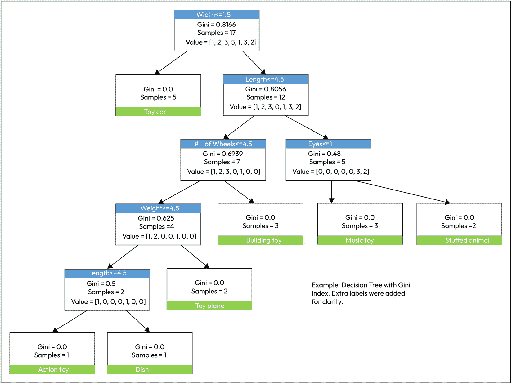

图 8.3 – 使用 Gini 指数方法的决策树输出

我们可以通过查看我们的输入表并检查数字是否对齐来快速检查我们的解决方案。我们应该看到以下内容：

+   五辆玩具车

+   三个积木

+   一个盘子

+   一个动作玩具

+   两个填充动物

+   三种乐器

+   两个玩具飞机

确实如此。

另一个需要关注的数字是基尼指数。如图**8**.3所示，顶级框显示整个组的指数整体值为`0.8166`，接近1，表明高度异质性。随着我们向下推进树，基尼指数越来越小，直到在每个识别的组中达到`0`，这表明那些组中的项目具有所有相同的属性。

这个图表告诉我们什么？首先，我们可以通过仅一个属性来区分玩具车——*宽度*。只有玩具车的宽度小于1.5英寸（38毫米）。我们不需要看颜色、重量或宽度以外的任何东西来将所有玩具车与其他所有东西分开。我们看到我们有5辆玩具车在我们的18个玩具中，所以我们还有13个需要分类。我们的下一个划分是长度。我们有7个玩具长度小于4.5英寸（11厘米），5个更长。在五个玩具中，有两个有眼睛，三个没有。有眼睛的玩具是两个填充动物。如果你跟随树，通向玩具乐器的分支是宽度>1.5英寸、长度>4.5英寸且没有眼睛，它们在长度和宽度上确实比其他玩具大，并且没有眼睛。

在分类方面，其他任何信息都不重要。这意味着像*颜色*这样的属性是玩具所属类别的糟糕预测因子——这是有道理的。我们其他有用的标准是*轮子数量*、*重量*和*长度*。这些数据足以将所有玩具分类到不同的组中。你可以看到每个叶节点的基尼指数确实是`0`。我在图表中添加了一些额外的标签，以使说明更清晰，因为程序在图表中使用的是类别编号而不是类别名称。

因此，那次练习是令人满意的——我们能够从我们的玩具数据中创建一个自动决策树，将我们的玩具分类。我们甚至可以使用这些数据来分类一个新的玩具，并预测它可能属于哪个类别。如果我们发现那个新玩具在分类上有所违反，那么我们就需要重新运行分类过程并创建一个新的决策表。

创建决策树并将数据细分为类别的另一种类型的过程被称为**熵模型**，或**信息增益**。让我们接下来讨论这个话题。

## 理解熵

**熵**是衡量提供的数据样本中无序程度的度量。我们也可以称这个过程为**信息增益**，因为我们正在衡量每个标准对了解它属于哪个类别的知识贡献了多少。

熵的公式是一个以2为底的对数函数的负值，它仍然主要关注一个类别属于一个群体的概率，这仅仅是属于每个类别的个体数除以样本总数：

*熵 = -p*log2(p) – p_i*log2(p_i)*

为了在我们的程序中将熵作为我们的组标准，我们只需要更改一行：

```py
dTree = tree.DecisionTreeClassifier(criterion ="entropy")
```

结果在以下图表中显示：

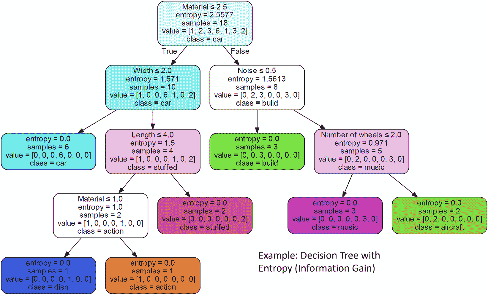

图8.4 – 使用熵（信息增益）的决策树输出

你可以注意到，熵从我们整个组的2.55开始，并减少到叶节点（分支的末端）的0。我们可以检查我们有七个分类，但你可以看到熵方法选择了与基尼方法不同的标准。例如，基尼分类器从`长度`开始，而熵分类器从`材料`开始。熵方法还选择了`噪音`（玩具是否发出噪音）并正确地选择了只有玩具乐器和玩具飞机发出噪音，这些玩具都有电子音箱发出飞机声音。

然而，有一件事引起了一些关注。有两个显示`材料`的块，将玩具的值分为小于2.5的材料。`材料`是一个离散值。我们可以生成一个材料列表，并通过`sorted(set(list))`过程运行它，以获取排序后的唯一值：

`['陶瓷', '毛皮', '金属', '塑料', '木材']`

因此，`材料`值为2.5或更小的是陶瓷或毛皮。毛皮和陶瓷除了在字母表中的位置外没有共同之处。这是一种相当令人不安的关系，这是由于我们将数据编码为一系列数字的顺序集所导致的。这暗示了实际上并不存在的关联和分组。我们如何纠正这个问题？

实际上，有一个处理此类问题的过程。这种技术在AI程序中广泛使用，并且是处理分类的*必备*工具，无论是决策树部分还是神经网络。这个工具有一个奇怪的名称，叫做**独热编码**。

## 实现独热编码

独热编码的概念相当简单。我们不是用枚举来替换一个类别，而是为每个可能的值在我们的数据中添加一列，并根据该值将其设置为`1`或`0`。这个名字来源于事实，即在这个集合中只有一个列是*热*或被选中的。

我们可以将这个原则应用到我们的例子中。我们可以将数据库中每种材料类型的单列`材料`替换为五个列：`陶瓷`、`毛皮`、`金属`、`塑料`和`木材`：

| **材料** | **陶瓷** | **毛皮** | **金属** | **塑料** | **木材** |
| --- | --- | --- | --- | --- | --- |
| 金属 | 0 | 0 | 1 | 0 | 0 |
| 金属 | 0 | 0 | 1 | 0 | 0 |
| 金属 | 0 | 0 | 1 | 0 | 0 |
| 金属 | 0 | 0 | 1 | 0 | 0 |
| 金属 | 0 | 0 | 1 | 0 | 0 |
| 毛皮 | 0 | 1 | 0 | 0 | 0 |
| 毛皮 | 0 | 1 | 0 | 0 | 0 |
| 金属 | 0 | 0 | 1 | 0 | 0 |
| 木头 | 0 | 0 | 0 | 0 | 1 |
| 木头 | 0 | 0 | 0 | 0 | 1 |
| 木头 | 0 | 0 | 0 | 0 | 1 |
| 陶瓷 | 1 | 0 | 0 | 0 | 0 |
| 塑料 | 0 | 0 | 0 | 1 | 0 |
| 塑料 | 0 | 0 | 0 | 1 | 0 |
| 金属 | 0 | 0 | 1 | 0 | 0 |
| 木头 | 0 | 0 | 0 | 0 | 1 |
| 塑料 | 0 | 0 | 0 | 1 | 0 |
| 木头 | 0 | 0 | 0 | 0 | 1 |

表 8.2 – 材料类别的单热编码数据结构

这确实给我们的程序带来了一些结构上的复杂性。我们必须为每种类型插入列，这用 14 个新列替换了 3 个列。

我找到了两个函数可以将文本类别转换为单热编码的多列：

+   `OneHotEncoder` 是 `scikit-learn` 的一部分，它使用方式类似于 `LabelEncoder` —— 事实上，你必须同时使用这两个函数。你必须使用 `LabelEncoder` 将字符串数据转换为数值形式，然后应用 `OneHotEncoder` 将其转换为所需的单比特值形式。

+   简单的方法是使用 pandas 的一个名为 `get_dummies()` 的函数。这个名字显然是因为我们正在创建虚拟值来用数字替换字符串。它确实执行了相同的功能。涉及的步骤比使用 `OneHotEncoder` 流程简单得多，所以我们将使用示例中的这个方法。

让我们看看我们需要遵循的步骤来实现这一点：

1.  顶部标题部分与之前相同 —— 我们有相同的导入：

    ```py
    # decision tree classifier
    # with One Hot Encoding and Gini criteria #
    # Author: Francis X Govers III #
    # Example from book "Artificial Intelligence for Robotics" #
    from sklearn import tree
    import numpy as np
    import pandas as pd
    import sklearn.preprocessing as preproc
    import graphviz
    ```

1.  我们将像之前一样开始读取表格。我在我的末端添加了一个额外的列，称为 `Toy Name`，这样我就可以跟踪哪个玩具是哪个。我们不需要这个列来进行决策树，所以我们可以使用 pandas 的 `del` 函数通过指定要删除的列名来移除它：

    ```py
    toyData = pd.read_csv("toy_classifier_tree.csv")
    del toyData["Toy Name"]   # we don't need this for now
    ```

1.  现在，我们将创建一个列表，列出我们将从 pandas `dataTable` 中删除并替换的列。这些是 `Color`、`Soft` 和 `Material` 列。我使用术语 *Soft* 来标识那些柔软且容易压扁的玩具（与硬塑料或金属相比），因为这是我们可能需要用于我们的机器人手的一个单独标准。我们生成虚拟值，并用 18 个新列替换这 3 个列。pandas 会自动将列名命名为旧列名和值的组合。例如，单个 `Color` 列被替换为 `Color_white`、`Color_blue`、`Color_green` 等等：

    ```py
    textCols = ['Color','Soft','Material']
    toyData = pd.get_dummies(toyData,columns=textCols)
    ```

1.  我在这里添加了一个 `print` 语句，只是为了检查所有内容是否正确组装。这是可选的。我对 pandas 在数据表方面的能力印象深刻 —— 它有很多功能可以执行数据库类型的功能和数据分析：

    ```py
    print toyData
    ```

1.  现在，我们已经准备好生成我们的决策树。我们实例化对象并命名为 `dTree`，将分类标准设置为 Gini。然后我们从 `toyData` 数据框中提取数据值，并将第一个（0号）列中的类别值放入 `classValues` 变量中，使用数组切片运算符：

    ```py
    dTree = tree.DecisionTreeClassifier(criterion ="gini")
    dataValues=toyData.values[:,1:]
    classValues = toyData.values[:,0]
    ```

1.  我们仍然需要使用 `LabelEncoder` 将类别名称转换为枚举类型，就像我们在前两个例子中所做的那样。我们不需要进行独热编码。每个类别代表我们的分类示例的终端状态——决策树上的叶子。如果我们进行神经网络分类器，这些将是我们的输出神经元。一个很大的不同之处在于，当使用决策树时，计算机会告诉你它用来分类和分离项目的标准。而在神经网络中，它会进行分类，但你无法知道使用了什么标准：

    ```py
    lencoder = preproc.LabelEncoder()
    lencoder.fit(classValues)
    classes = lencoder.transform(classValues)
    ```

1.  正如我们所说的，为了在最终输出中使用类别值名称，我们必须消除任何重复的名称并按字母顺序排序。这对嵌套函数做到了这一点：

    ```py
    classValues = list(sorted(set(classValues)))
    ```

1.  这就是我们的程序结论。实际上创建决策树只需要一行代码，因为我们已经设置了所有数据。我们使用之前相同的步骤，然后使用 `graphviz` 创建图形并将其保存为PDF。这并不难——现在我们已经有了所有这些设置经验：

    ```py
    print ""
    dTree = dTree.fit(dataValues,classes)
    c_data=tree.export_graphviz(dTree,out_file=None,feature_names=toyData.columns,
    class_names=classValues, filled = True, rounded=True,special_characters=True)
    graph = graphviz.Source(c_data) graph.render("toy_decision_tree_graph_oneHot_gini")
    ```

结果是以下图中所示的流程图。这种使用独热编码的输出比 *图8**.4* 更容易阅读，因为我们可以看到每个类别的数字。你会注意到每个叶子（终端节点）只有一个类别和一个计数（两个填充动物和三个乐器）：

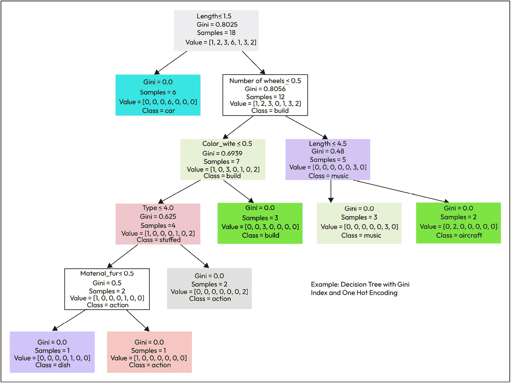

图8.5 – 使用独热编码的决策树输出更容易阅读

由于我们已经能够描述和制作各种决策树，如果我们使用一大堆决策树，会发生什么呢？一个森林！让我们探索这可能会是什么样子。

# 随机森林

我真的很想添加关于 **随机森林分类器** 的这一部分，但不仅仅是因为这个名字听起来很酷。虽然我可能被指责过度夸张了隐喻，但这次，这个名字可能启发了这种决策树过程的名称。我们已经学会了如何制作决策树，我们也了解到它们有一些弱点。如果数据确实属于不同的和区分开的组，那就最好不过了。它们对数据中的噪声不太容忍。如果你想要扩展它们，它们会变得非常难以控制——你可以想象一下，如果我们要处理200个类别而不是我们之前处理的6或7个类别，这个图会变得有多大。

如果你想要利用决策树的简单性和实用性，但想要处理更多的数据、更多的不确定性和更多的类别，你可以使用随机森林，正如其名称所表明的，它只是一大批随机生成的决策树。让我们一步一步地通过这个过程：

1.  我们收集了我们的信息数据库，但我们的数据库中不是18行，而是有10,000条记录或1,000,000条记录。我们将这些数据细分为随机集合——我们生成100个数据集合，每个集合都是随机地从我们所有的数据中选择的——并将它们随机排序。我们还抽取出一组数据作为测试集，就像我们为神经网络所做的那样。

1.  现在，对于每一组随机数据，我们使用我们已经学过的相同过程来制作决策树。

1.  现在，我们有了这100个分类引擎的集合，每个引擎都是从不同的、随机生成的数据子集中生成的。我们现在通过从测试集中取数据并运行我们森林中的所有100棵树来测试我们的随机森林。每一棵树都会为我们测试记录中的数据分类提供一个估计。如果我们仍在分类玩具，那么其中一棵树可能会估计我们正在描述一辆玩具车。另一棵可能认为它是一件乐器。我们接受每个估计并将其视为一票。然后，多数决定——多数树选择的类别就是赢家。这就是全部。

设置和程序与之前所做的完全相同，但你不能从随机森林中绘制决策树，或者仅仅创建一个树作为最终目标，因为那不是随机森林的作用——如果你只需要决策树，你知道如何做。你可以做的是像神经网络一样使用随机森林，作为分类引擎（这些数据属于哪个类别？）或近似非线性曲线的回归引擎。

在这一点上，你可以和我一起得出结论，决策树在许多事情上都非常有用。但你是否知道你可以用它们来导航？下一节将介绍机器人的路径规划——使用不同类型的决策树。

# 介绍机器人路径规划

在本节中，我们将应用决策树技术来执行机器人导航。有些人喜欢将这些称为**基于图的解决方案**，但任何类型的导航问题最终都会变成一个决策树。考虑一下当你开车时，你是否可以将你的导航问题分解成一系列决策——向右转，向左转，还是直行？

我们将把到目前为止所学的内容应用到与分类相关的问题上，那就是**网格搜索**和**路径查找**。我们将学习著名的、广泛使用的**A**（发音为**A-star**）算法。这将从网格导航方法开始，如拓扑路径查找，例如GPS路线查找，最后是专家系统。你会看到这些都是我们已经学习过的决策树主题的版本和变体。

一些问题和数据集，尤其是在机器人领域，适合使用基于网格的解决方案，作为简化导航问题的方法。如果我们试图为机器人规划绕房子或穿过田野的路径，将地面划分为某种棋盘格网格，并使用它来绘制机器人可以驾驶到的坐标，这是非常有意义的。我们可以使用纬度和经度，或者我们可以选择某个参考点作为零点——比如我们的起始位置——并相对于机器人测量一些矩形网格。网格在棋盘游戏中也起到相同的作用，限制考虑的潜在未来移动的位置数量，并限制和划定了我们在空间中的可能路径。

虽然本节讨论的是网格路径查找，无论是否涉及地图，都有一些机器人导航范例不使用地图，甚至有些不使用网格，或者使用间距不均匀的网格。我设计过具有多层地图的机器人导航系统，其中一些层是可变的——可更改的——而另一些则不是。这是一个充满想象力和实验的肥沃土壤，如果你对这个主题感兴趣，我建议进行进一步的研究。现在，让我们先描述我们将要使用的坐标系。

## 理解坐标系

让我们回到手头的主题。我们有一个大致呈矩形的机器人和房间，在这个矩形内部也有一些大致呈矩形的障碍物，如家具、椅子、书架、壁炉等。考虑我们用网格来表示这个空间，并创建一个与物理房间相对应的虚拟房间的数字数组，这是一个简单的概念。我们将网格间距设置为1厘米——每个网格方格是1厘米 x 1厘米，给我们一个580 x 490个方格的网格，或284,200个方格。我们在机器人的记忆中用二维数组中的无符号整数来表示每个方格。

现在，我们需要一些其他数据。我们有一个起点和一个目标点，指定为网格坐标。我们将把网格的`0,0`放在房间最近和最左边的角落，这样我们的所有方向和角度都将为正。在我为你绘制的房间地图*图8.6*中，那个角落将始终是地图的左下角。在标准的*右手定则*表示法中，左转是正角度，右转是负角度。*x*方向是水平方向，*y*方向是垂直方向。对于机器人来说，*x*轴是右侧，*y*轴是运动方向。

你可能会觉得我提供这些细节很奇怪，但设置正确的坐标系是进行网格搜索和路径规划的第一步。我们在室内使用笛卡尔坐标系。在户外，我们会使用不同的规则，使用纬度和经度。在那里，我们可能希望使用*北东下*（北是正的，南是负的，东是正的，西是负的，*z*轴向下，*x*轴与机器人的行驶方向对齐）：

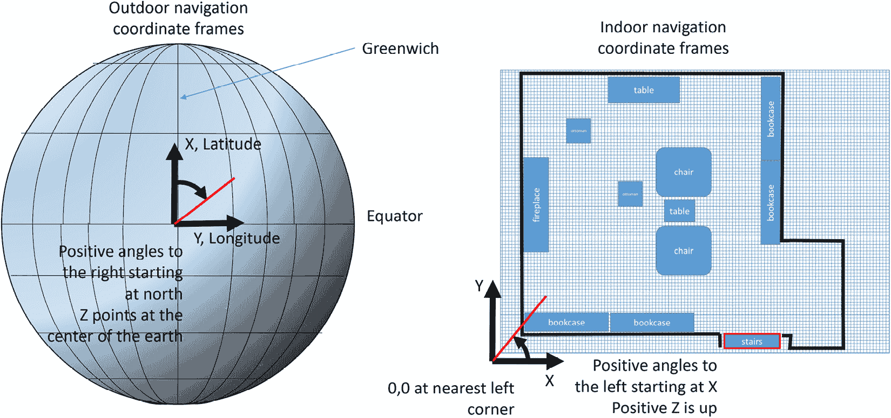

图8.6 – 地球导航和室内导航的坐标系

我们将在稍后更详细地查看这个房间地图。

因此，我们有一个网格和一个我们同意的坐标系，或者至少我们同意我们都理解。我们还有一个起点和一个终点。我们的目标是确定机器人从起点到终点的最佳路径。在中间，我们必须规划一条绕过可能挡道的任何障碍物的路径。

接下来，我们必须谈谈知识。

## 基于我们的知识开发地图

基本上有两种类型的网格搜索和路径查找程序：

+   **先验知识**，你知道地图上的一切

+   **事后知识**，你不知道障碍物在哪里

我们将从更容易的位置开始，在那里我们可以利用对房间布局的完美知识来进行路径规划——我们有一张地图。

我们实际上有三个目标，我们试图在路径规划中同时实现：

+   达到我们的目标

+   避开障碍物

+   选择最短路径

我们可以谈谈我们可能如何进行。我们可以从起点开始，用铅笔画一条从起点到目标的想象中的线。如果没有障碍物挡道，我们就完成了。但是等等——我们的铅笔在纸上只是一条细线。我们的机器人则相对较胖——它在行驶过程中有一个显著的宽度。我们如何判断机器人是否正在通过一条它无法进入的狭窄通道？我们需要修改我们的地图！

我们有自己的网格，或者是一张代表网格的纸张。我们可以在网格上绘制所有障碍物的轮廓，并按比例绘制。我们有两张椅子、两张桌子、一个壁炉、两个脚凳和四个书架。我们用最深的黑色将所有障碍物都涂上颜色。现在，我们拿一支浅色的铅笔——比如说蓝色——围绕所有机器人宽度一半的家具画一个轮廓。我们的机器人宽度是32厘米，所以一半是16厘米，这是一个很好的偶数。我们的网格是每平方厘米1厘米，所以我们围绕所有东西画一个16平方单位的边界。它看起来像这样：

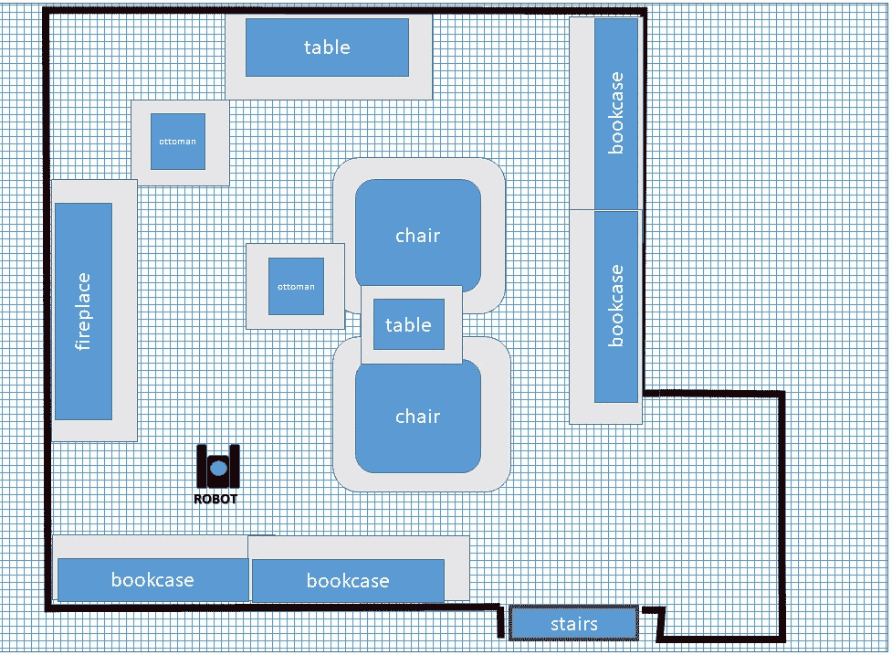

图8.7 – 为障碍物添加安全边界有助于防止碰撞

因此，现在我们的地图有两种颜色——障碍物和*禁止*边界。我们将保持机器人的中心不在禁止区域内，这样我们就不会撞到任何东西。这应该是有意义的。至于判断通道和门，如果禁止区域在两侧接触（也就是说，中间没有剩下的白色方格），那么机器人太大，无法通过。你可以在插图右上角的脚凳周围看到这一点。

现在我们来看这条线。我们需要一种方法来编写一个计算机算法，该算法确定机器人可以穿过的白色方格，从而从起点到达终点。

由于我们有了目标在笛卡尔坐标系中的位置，并且我们有我们的起点，我们可以用一条直线从起点到终点的距离来表示。如果起点是`x1, y1`，终点是`x2, y2`，那么距离是两点之间差值的平方和的平方根：

*距离 = sqrt((x2-x1)^2 + (y2-y1)^2)*

开发路径规划算法的一种方法是用**波前法**。我们知道起点在哪里。我们向八个相邻的方格方向延伸。如果其中任何一个遇到障碍物或禁止区域，我们就将其排除在可能的路径之外。我们记录我们如何到达每个方格，在我的插图（*图8.8*）中，这由箭头表示。我们使用我们如何到达方格的信息，因为我们还不知道我们接下来要去哪里。现在，我们拿所有新的方格并再次做同样的事情——选择一个方格，看看它的八个邻居中哪个是合法的移动，然后在其中放一个箭头（或指向前一个方格位置的指针）以记录我们是如何到达那里的。我们继续这样做，直到我们到达目标。我们记录我们检查方格的顺序，并跟随箭头向后到达我们的起点。

如果有多个方格都有通往当前方格的路径，那么我们选择最近的那个，也就是说，最短的路径。我们跟随这些前驱者一直回到起点，这就是我们的路径：

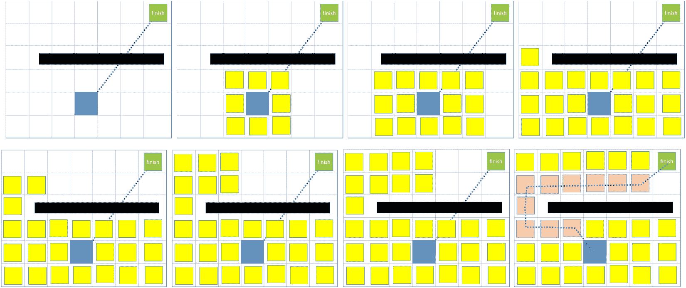

图8.8 – 波前法路径规划涉及很少的数学计算。每个图都是过程的一个步骤，从左上角开始，横向移动，然后向下

你会注意到在这个例子中，我允许机器人进行对角转向以从一个方格移动到另一个方格。我也可以指定只允许直角转向，但这不是很高效，而且对机器人的驱动系统来说很困难。只允许直角转向在某种程度上简化了处理，因为您只需要考虑一个方格周围的四个邻居，而不是八个。

另一种开发看起来有希望路径规划算法的方法是**贪婪最佳优先**方法。与我们在波前方法中记录并检查所有网格点不同，我们只需保留我们刚刚测试的八个方格中的最佳路径方格。我们用来决定保留哪个方格的度量标准是离我们的直线路径最近的那个。另一种说法是，它是离目标最近的那个方格。我们当然会移除被障碍物阻挡的方格。最终结果是，我们考虑的方格比波前法路径规划少得多：

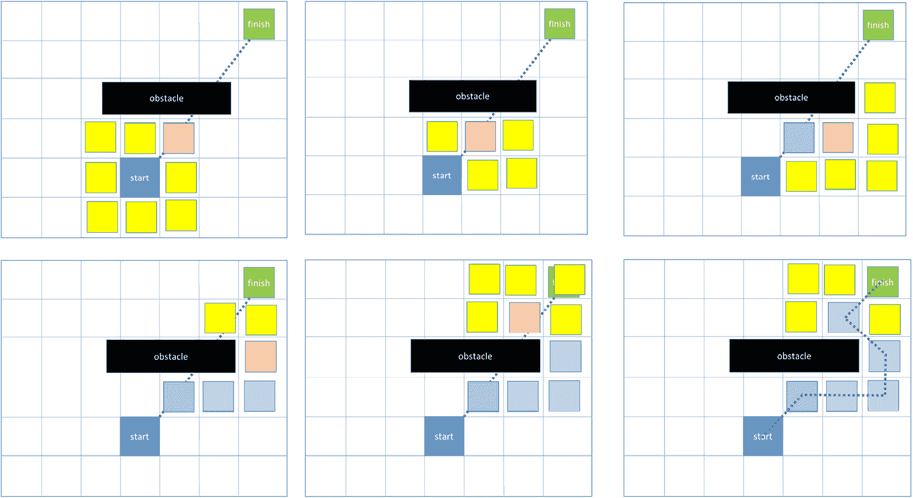

图8.9 – 被恰当地命名为“贪婪最佳优先”的算法速度快，但可能会陷入困境

贪婪技术适用于所有情况吗？实际上并不适用。

为什么不呢？这似乎是一个简单的算法，我们只考虑合法的移动。问题是它无法处理**局部最小值**。什么是局部最小值？它是在地图上机器人必须后退才能找到好路径的地方。最容易可视化的最小值类型是U形区域，机器人可以进入但不能退出。贪婪最佳优先算法也不是试图找到最短路径，而只是找到一个有效路径：

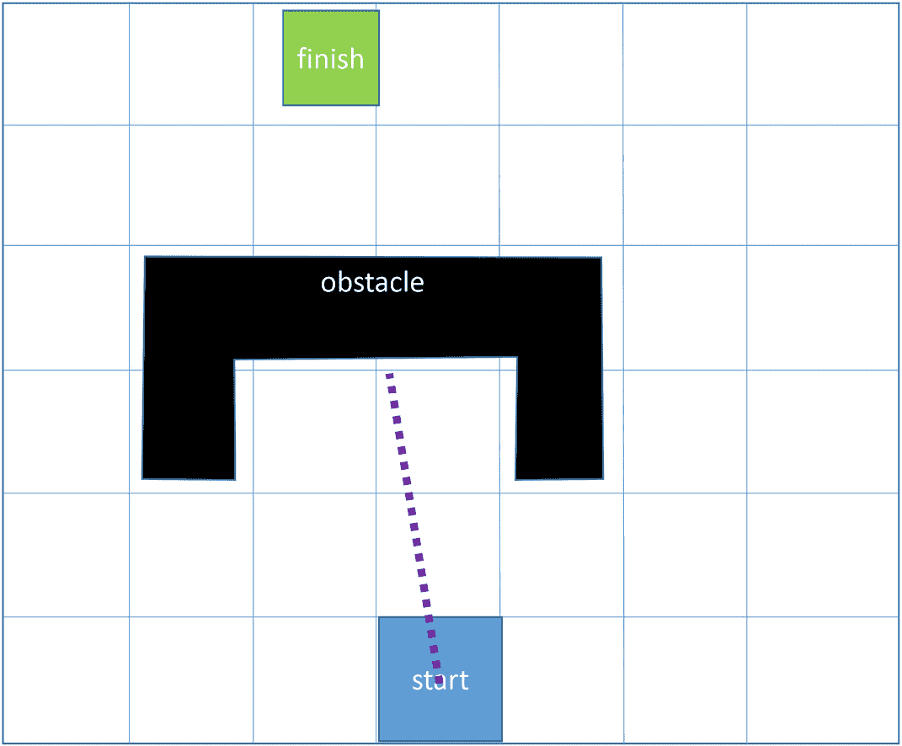

图8.10 – 当不存在直线路径时，可能会出现“局部最小值”，机器人将不得不后退或改变方向

如果我们要找到最短路径，我们需要做一些额外的数学计算。

一种更系统和数学的方法来处理网格搜索问题中绕过障碍物找到最短路径是**A*算法**，最初是为Shakey机器人开发的。

## 介绍A*算法

实话实说，如果不提及A*算法，你真的无法写出一本关于机器人的书。A*算法的起源可以追溯到1968年斯坦福大学的*Shakey机器人*。这是最早的地图导航机器人之一。Nils Nilsson和他的团队试图找到一种方法来让Shakey在斯坦福的大厅中导航，并开始尝试不同的算法。第一个算法被称为*A1*，第二个*A2*，以此类推。经过多次迭代，团队决定技术组合的效果最好。在计算机科学中，A*表示字母A后面跟着任何其他字符，因此A-star就这样命名了。

A*过程的概念与我们之前使用其他路径规划器所做的是非常相似的。像波前规划器一样，我们首先考虑起点的邻居。我们将根据两个因素计算每个方块的一个估计值：从起点到该方块的距离和到目标的直线距离。我们将使用这些因素来找到累积成本最低的路径。我们通过将路径中每个网格方块的价值相加来计算这个成本。公式如下：

*F(n) = g(n) +* *h(n)*

在这里，*F(n)*指的是这个方块对路径成本的贡献，*g(n)*代表从该方块到起点沿所选路径的距离（即路径成本的总和），而*h(n)*是从该方块到目标的直线距离，这是一个启发式或对剩余距离的估计。由于我们不知道之后我们还要绕过哪些障碍，我们使用这个猜测作为比较路径的衡量标准。

这个值代表如果这个方块是最终路径的一部分，它的成本或贡献是多少。我们将选择成本最低的方块作为路径的一部分。与波前规划器一样，我们跟踪前驱方块或在这个方块之前走过的方块，以重建我们的路径：

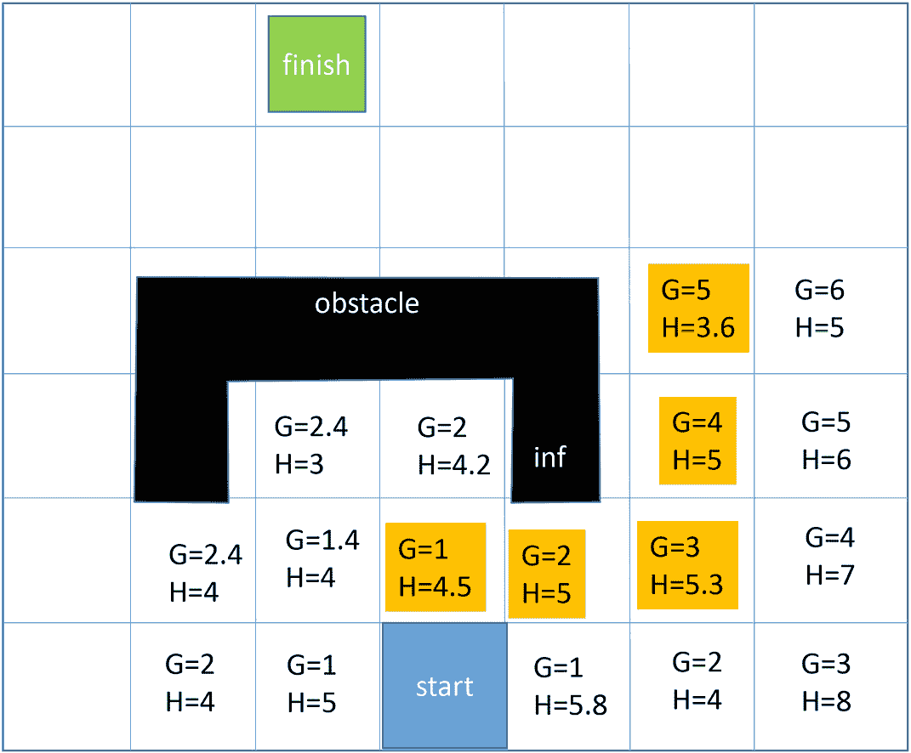

图8.11 – A*计算使用从起点（G）到目标（H）的距离

上述图示说明了A*算法。每个方块都是基于从起点沿路径的距离（*G*）和到目标的剩余距离的估计（*H*）来评估的。黄色方块代表迄今为止选定的路径。

让我们通过实例说明A*算法是如何工作的：

1.  我们保留一个集合，包含我们在地图上计算值的所有网格方块。我们将这个称为`exploredMap`。我们的地图网格方块对象看起来是这样的：

    ```py
    # globals
    mapLength = 1280
    mapWidth = 1200
    mapSize = mapLength*mapWidth
    map = []
    ```

1.  现在，我们将地图填充为零以初始化一切。我们将在代码中稍后定义`mapGridSquare`函数——它创建我们的数据结构：

    ```py
    for ii in range(0, mapWidth):
        for jj in range(0,mapLength):
            mapSq = mapGridSquare()#defined later
            mapSq.position = [ii,jj]
            mapSq.sType =EMPTY
    ```

1.  下一个部分将在地图上创建所有障碍。我们将放置要*填充*或使其不可通行的网格方块的位置：

    ```py
    # create obstacles
    obstacles = [[1,1],[1,2],[1,3],[45,18],[32,15] …..[1000,233]]
    # iterate through obstacles and mark on the map
    for pos in obstacles:
        map[pos]. sType = OBSTACLE
    pathGrid = []
    ```

1.  现在，我们声明我们的起始和结束位置：

    ```py
    START = [322, 128]
    GOAL = [938,523]
    exploredMap = []
    A_Star_navigation(start, goal, exploredMap, map)
    ```

1.  在本节中，我们正在创建我们的数据结构来跟踪我们做出的所有计算。`G` 值是从起点计算出的距离，`H` 值是到目标的估计距离。`F` 只是这两个值的总和。我们还创建了一个函数来计算这些值：

    ```py
    def mapGridSquare():
        def __init__(self):
            self.F_value = 0.0  #total of G and H
            self.G_value = 0.0  # distance to start
            self.H_value = 0.0  # distance to goal
            self.position=[0,0]   # grid location x and y
            self. predecessor =None   # pointer to previous square
            self.sType = PATH
        def compute(self, goal, start):
            self.G_value = distance(goal.position,self.position)
            self.H_value = distance(start.position,self.position
            self.F_value = self.G_value + self.H_value
            return self.F_value
    ```

1.  一旦完成地图计算，我们需要一个函数来追踪从目标到起点的路径。这个函数被称为 `reconstructPath`：

    ```py
    def reconstructPath(current):
        totalPath=[current]
        done=False
        while not done:
            a_square = current.predecessor
            if a_square == None:  # at start position?
                done = True
            totalPath.append(a_square)
            current = a_square
        return totalPath
    ```

1.  我们创建了一个 `findMin` 函数来定位我们探索过的网格块中具有最低 `F` 分数的那个：

    ```py
    def findMin(map):
        minmap = []
        for square in map:
            if minmap == []:
                minmap = square
                continue
            if square.F_value < minmap.F_value:
                minmap = square
        return minmap
    ```

1.  然后，我们创建 `navigation` 函数本身：

    ```py
    def A_Star_navigation(start, goal, exploredMap, map):
        while len(exploredMap>0):
            current = findMin(exploredMap)
            if current.position == goal.position:
                # we are done – we are at the goal
                return reconstructPath(current)
            neighbors = getNeighbors(current)
    ```

1.  `neighbors` 函数返回当前方块所有未标记为障碍物的相邻方块：

    ```py
            for a_square in neighbors:
                if a_square.predecessor == None:
    ```

1.  我们只计算每个网格方块一次：

    ```py
                    old_score = a_square.F_value
        score = a_square.compute(GOAL, START)
    ```

1.  现在，我们寻找具有最低 `G` 值的方块——即离起点最近的那个：

    ```py
        if a_square.G_value < current.G_value:
            a_square.predecessor = current
            current = a_square
            current.compute(GOAL, START)
            exploredMap.append(current)
    ```

因此，在本节中，我们介绍了在已知所有障碍物位置的情况下，在地图上找到最短路径的 A* 方法。但如果我们不知道呢？我们可以使用的另一种方法是 D* 算法。

## 介绍 D*（D-星或动态 A*）算法

在本章的前面部分，我谈到了 *先验* 知识。尽管 A* 算法非常有用，但它要求在地图上预先知道所有障碍物。如果我们计划进入一个未知空间，我们将边走边创建地图，我们该怎么办？如果我们有一个带有传感器（如声纳或激光雷达）的机器人，那么机器人将在移动过程中检测和识别障碍物。因此，它必须根据不断增多的信息不断重新规划其路线。

A* 过程只运行一次，在机器人开始移动之前为机器人规划路线。**D***，一个动态重新规划过程，会随着新信息的出现不断更新机器人的路径。

D* 算法通过向每个网格方块添加一些附加信息来允许重新规划。你可能会记得，在 A* 中，我们有 `G` 值（路径上到起点的距离）和 `H` 值（到目标的直线距离）。D-star 在方块上添加了一个可以具有几个可能值的标签：

+   方块的标签可能是 `NEW`，表示一个以前从未被探索过的新方块。

+   它可能是 `OPEN`，表示已评估并作为路径一部分考虑的标签。

+   `CLOSED` 是指已被从考虑中删除的方块。

+   下两个标签是 `RAISED` 和 `LOWERED`。如果传感器的读数或附加信息导致该方块的代价增加，则设置 `RAISED` 标志，而 `LOWERED` 则相反。对于 `LOWERED` 方块，我们需要将新的路径代价传播到现在代价较低的方块相邻的方块，以便它们可以重新评估。这可能会导致相邻方块上的标签发生变化。`RAISED` 方块的代价增加，因此可能从路径中删除，而 `LOWERED` 方块的代价减少，可能被添加到路径中。

注意

请记住，当路径回溯到起点时，成本值的变化会在 D* 的路径评估中像波浪一样传播。

D* 和 A* 之间的另一个主要区别在于，D* 从目标开始，逆向工作到起点。这使得 D* 能够知道到达目标的确切成本——它使用从当前位置到目标的实际路径距离，而不是像 A* 那样使用启发式或距离估计。

这是个提醒你的时候，我们刚刚覆盖的所有这些网格搜索技术仍然是决策树的变体。我们是从叶子到叶子——我们称之为网格方块，但它们仍然是决策树的叶子。我们设定了一些标准来选择走哪条路径，这形成了分支路径。我们在每种情况下都朝着某个目标或终点工作。我提这一点是因为，在下一节中，我们将结合决策树和从 A* 和 D* 算法中学到的路径规划类型，以使用 GPS 在街道上找到一条路径。

## GPS 路径查找

我想有机会（既然我们已经走到这一步）简单谈谈**拓扑路径规划器**。这是前几节中使用的基于网格技术的替代方法。有些问题和导航类型不适合基于网格的方法，或者可能需要天文数字般的大量详细数据，而这些数据可能在小机器人中不可用或不实用。

例如，我想谈谈你的汽车中的 GPS 如何在街道上找到一条路线到达目的地。你一定想知道那个小盒子在其微小的“大脑”中如何拥有足够的信息来提供从一地到另一地的逐个转弯指示。如果你停下来思考，你可能想象 GPS 正在使用你在 LCD 屏幕上查看的同一张地图来确定你需要去哪里。你也会认为发生了一种基于网格的搜索，就像我们之前详细讨论的 A* 算法一样。但你会错的。

GPS 用于规划路线的数据看起来根本不像地图。相反，它是一个 **拓扑网络**，显示了街道是如何相互连接的。在格式上，它看起来更像是一个矢量数据库（具有方向和大小或距离），而不是由像素组成的 *X, Y* 网格栅格地图。数据库格式在 GPS 内部存储中也占用更少的空间。街道被 **节点** 或道路交叉或改变的地方分隔。每个节点显示哪些街道是相连的。节点通过 **链接** 相连，允许您从节点到节点遍历数据。链接代表道路，并具有长度，以及关于道路质量的成本数据。成本数据用于计算路线的吸引力。限速高速公路的成本会很低，而有很多停车标志的小巷或土路成本会很高，因为该链接既不太受欢迎，速度也较慢。

大多数 GPS 路径规划器使用的算法被称为 **迪杰斯特拉算法**（Dijkstra’s algorithm），以荷兰的埃德加·W·迪杰斯特拉（Edsger W. Dijkstra）的名字命名。他在 1956 年想要找到从鹿特丹到格罗宁根的最短路径。他的基于图的解决方案经受住了时间的考验，并且非常普遍地用于 GPS 路由。对我们这个机器人来说，这并没有任何帮助，所以你可以自己研究一下。

我们使用与在网格图上执行 A* 过程相同的程序来处理 GPS 路网数据库。我们评估每个节点，并从起始节点向外扩展，选择最接近目的地方向的路径：

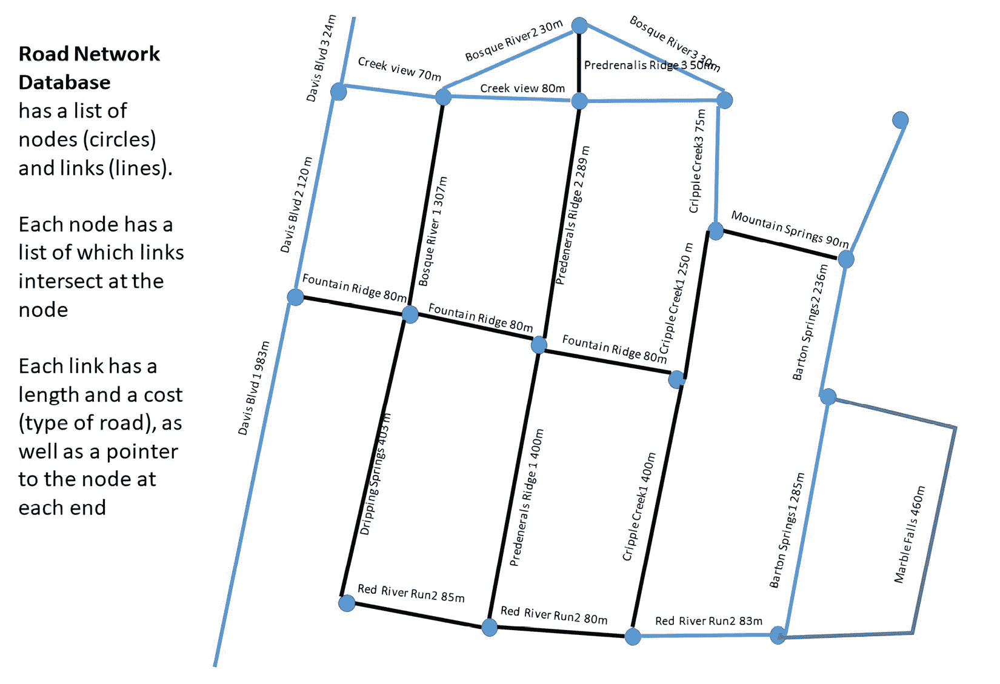

图 8.12 – 基于道路的网络可以表示为一系列节点（圆圈）和链接（线条）

许多 GPS 系统也会同时尝试从终点——目标或目的地——反向链，并试图在中间某处相遇。为了使我们的 GPS 系统小巧、轻便和可靠，投入了惊人的工作量。当然，它们依赖于数据库中的最新信息。

# 摘要

嗯，这已经是一个非常繁忙的章节了。我们讨论了决策树在多种应用中的用途。基本决策树有叶子（节点）和链接，或分支，每个都代表一个决策或路径上的变化。我们学习了鱼骨图和根本原因分析，这是一种特殊的决策树。我们展示了使用`scikit-learn`的方法，让计算机为我们构建一个分类决策树并创建一个可用的图。我们讨论了随机森林的概念，它只是使用决策树组进行预测或回归的演变形式。然后，我们探讨了图搜索算法和路径规划器，花了一些时间讨论A*（或A-star）算法，该算法广泛用于制作路线和路径。当我们没有预先创建地图时，D*（或动态A-star）过程可以使用动态重新规划来不断调整机器人的路径以到达目标。最后，我们介绍了拓扑图路径规划，并讨论了GPS系统是如何为你找到去咖啡店的路线的。

在我们接下来的章节中，我们将讨论通过使用蒙特卡洛模型模拟情绪来给你的机器人赋予人工个性。

# 问题

1.  有哪三种方法可以遍历决策树？

1.  在鱼骨图示例中，如何对决策树的分支进行剪枝？

1.  Gini评估器在创建分类中扮演什么角色？

1.  在使用基尼指数的玩具分类器示例中，玩具的哪些属性没有被决策树使用？为什么没有使用？

1.  我们尝试的某个分类技术中，哪种颜色被用作玩具的标准？

1.  请举一个在餐厅菜单项中进行标签编码和独热编码的例子。

1.  在A*算法中，讨论`G()`和`H()`的不同计算方式。

1.  在A*算法中，为什么`H()`被认为是启发式，而`G()`不是？此外，在D*算法中，没有使用启发式。为什么？

1.  在D*算法中，为什么有`RAISED`和`LOWERED`标签，而不是仅仅一个`CHANGED`标志？

# 进一步阅读

+   *A算法简介*：[https://www.redblobgames.com/pathfinding/a-star/introduction.html](https://www.redblobgames.com/pathfinding/a-star/introduction.html)

+   *人工智能机器人导论*，罗宾·R·墨菲著，麻省理工学院出版社，2000年

+   *决策树算法是如何工作的*：[https://dataaspirant.com/2017/01/30/how-decision-tree-algorithm-works/](https://dataaspirant.com/2017/01/30/how-decision-tree-algorithm-works/)

+   *游戏编程* *启发式方法*：[http://theory.stanford.edu/~amitp/GameProgramming/Heuristics.html](http://theory.stanford.edu/~amitp/GameProgramming/Heuristics.html)

+   *D*Lite算法博客（快速重新规划项目）*，斯文·科宁：[http://idm-lab.org/project-a.html](http://idm-lab.org/project-a.html)

+   *移动机器人的基于图的路径规划*，大卫·伍德南的论文，乔治亚理工学院电子与计算机工程系，2006年12月

+   *《实时重规划中的聚焦D算法》* 由安东尼·斯坦茨撰写：[https://robotics.caltech.edu/~jwb/courses/ME132/handouts/Dstar_ijcai95.pdf](https://robotics.caltech.edu/~jwb/courses/ME132/handouts/Dstar_ijcai95.pdf)
