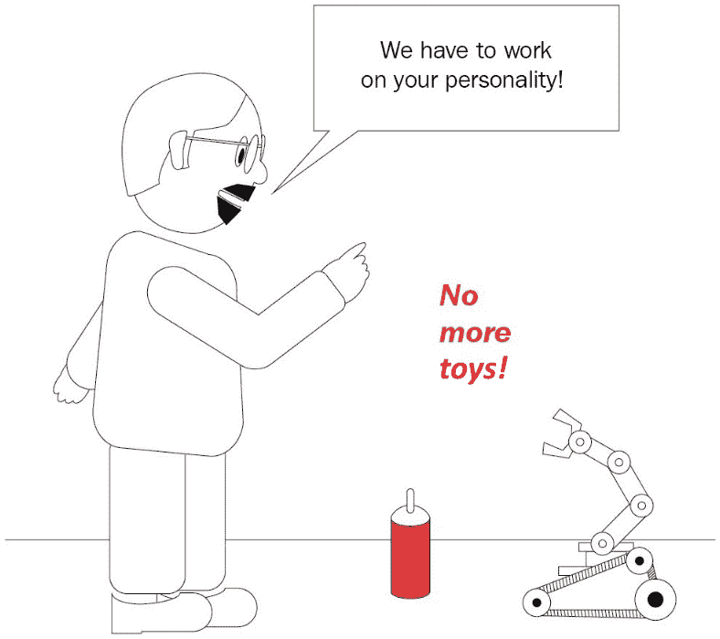
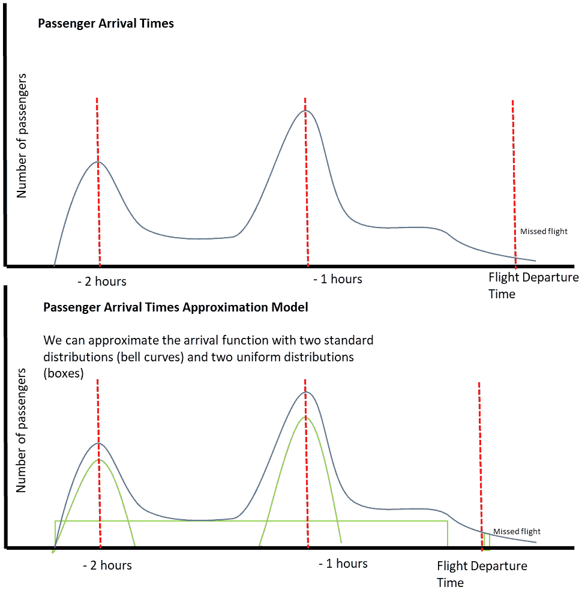
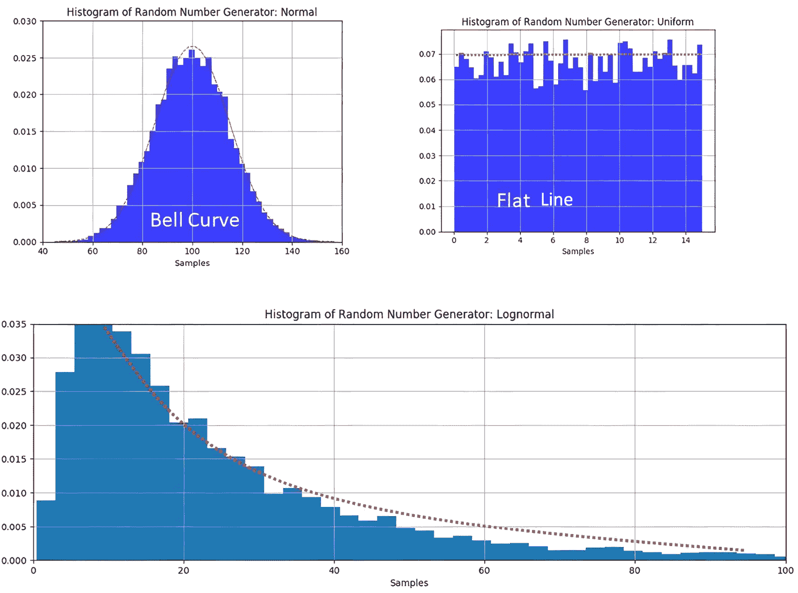
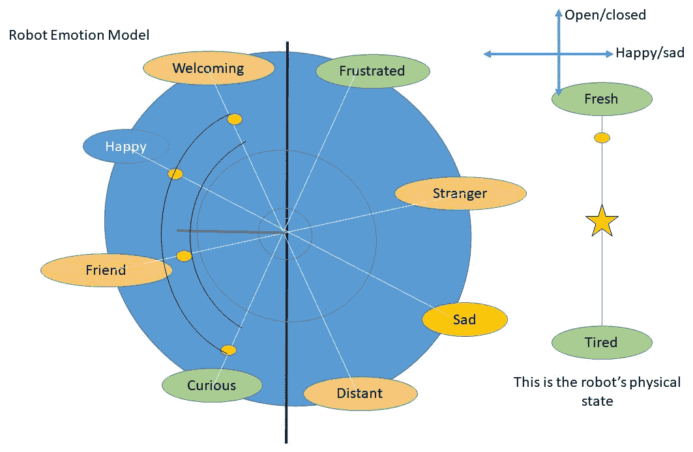
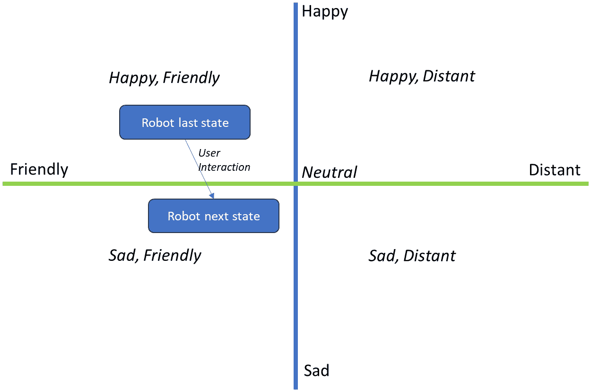
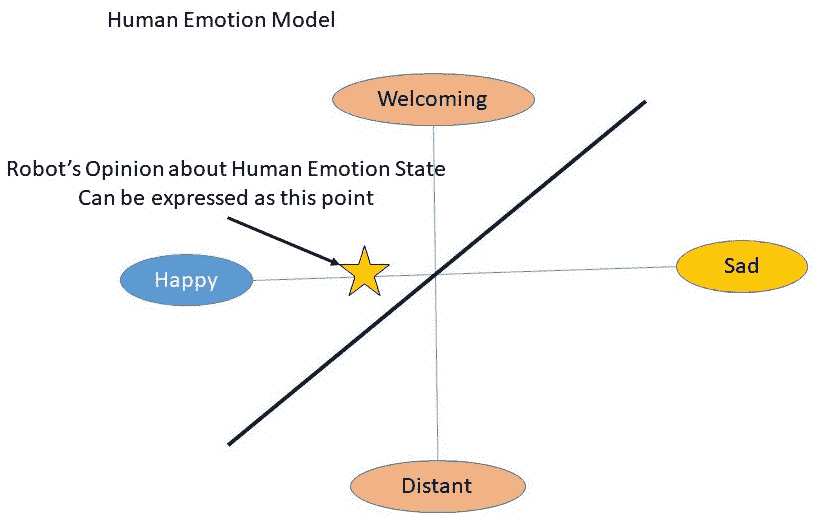

# 第九章：给机器人赋予人工智能

当一个人想到具有人工智能的机器人时，许多人认为的人工智能是一个具有情感、感觉、心态，以及某种人类思维或感觉模型或概念的机器人。我们可以称这种形式的人工智能为**人工智能**。虽然给机器人赋予情感肯定超出了本书（或当前技术）的范围，但我们可以通过使用标准计算机建模技术，如蒙特卡洛分析和有限状态机，为机器人创建一个个性模拟。

在本章中，我们将涵盖以下主题：

+   什么是人工智能？

+   对（已过时）图灵测试、聊天机器人和**生成式** **AI**（**GenAI**）的简要介绍

+   模拟的艺术与科学

+   情绪状态机

+   玩情绪游戏

+   创建人类行为模型

+   开发机器人情感引擎

# 技术要求

在本章中，我们不会介绍任何新的编程库。我们将基于之前构建的语音系统。你所需要的只是想象力和一些写作技巧。

你可以在[https://github.com/PacktPublishing/Artificial-Intelligence-for-Robotics-2e](https://github.com/PacktPublishing/Artificial-Intelligence-for-Robotics-2e)找到本章的代码。

# 什么是人工智能？

好莱坞和电影产业已经制作了一些非常难忘的机器人。你可以想到R2D2和C3PO，科幻电影中的劳伦斯·哈迪。你最喜欢这两者中的哪一个？可能是他们的个性？想想看。尽管R2D2大部分是一个垃圾桶形状，有一个圆顶头和没有脸，但他有一个明确的个性。你会形容他为*活泼*或*固执*。*机器人和机器人*网站([http://www.robots-and-androids.com/R2D2.html](http://www.robots-and-androids.com/R2D2.html))这样描述他：

那个机器人被描绘成非常勇敢，忠诚坚定，有点固执。他从不放弃任务，即使看起来似乎所有的几率都对他不利。他的个性经常与[C3PO]形成对比，后者挑剔而胆小。

对于一个从不说话，只用哔哔声和哨声交流的机器人来说，这相当令人印象深刻。

有哪些其他电影机器人给你留下了印象？当然，来自同名的电影中可爱的垃圾压缩机器人WALL-E是首选。WALL-E也有一个小词汇量，只由他的名字组成，就像宝可梦一样。WALL-E表现出很多情感，甚至发展了爱好，收集和修复旧垃圾。你可能也记得M-O，那个小而痴迷于清洁的机器人，对WALL-E带来的所有脏东西感到沮丧。

因此，作为机器人创造者和设计师，我们可能会给我们的机器人赋予某种人格。这有利于人类更好地与机器人建立联系。它还给人一种错觉，即机器人比实际更聪明，能够做到更多。这确实使得机器人更具吸引力和趣味性。

我们也可以从R2D2和WALL-E给出的例子中推断出，在沟通方面，少即是多——我们需要的不仅仅是文字，还有肢体语言和声音。

在本节中，我们将为我们的机器人开发一个虚拟人格。虽然我们无法给机器人赋予实际的情绪或感觉，无论你如何定义它，但我们可以创建一个能够提供令人信服错觉的人格模拟。我认为这是一个有意义的练习，因为当前机器人技术的艺术状态要求与人类互动的机器人具有一定的个性和一贯的态度。

*图9.1*中看到的卡通展示了人们和机器人可能如何互动。机器人已经厌倦了捡玩具，并希望表达它的感受：



图9.1 – 一个人和一个机器人的互动

目前在这个领域正在进行大量工作，例如苹果的Siri和亚马逊的Alexa这样的数字个人助理。请注意，这些机器人或AI有独特的名字和声音，但我感觉它们在个性和能力上非常相似。当你向Siri或Alexa提出一个个人问题时，比如他们的年龄（Siri比Alexa年长得多）时，会有一些区别。

在本章中，我们将从模拟科学中借用工具——特别是**状态机**和**蒙特卡洛分析**——并使用它们来为机器人Albert构建一个人格模型。我们已经有了一个相当强大的工具，那就是我们用来讲笑话的Mycroft语音系统。我们将扩展Mycroft的功能和特性，以及开发机器人及其对我们人类感受的机器人观点的仿生情感。

我想强调的是，我们正在模拟情绪，而不是创造一个有情感的机器人。我们的模拟与真实情绪的相似之处，就像飞行模拟器与航天飞机的相似之处——两者都提供相同的信息，但航天飞机在90分钟内绕地球飞行，而飞行模拟器永远不会移动。

让我们先从著名的图灵测试谈起，来讨论本节我们试图达成的目标——我们能否创造一个与人类无法区分的机器人？

# 对（已过时）的图灵测试、聊天机器人和生成式AI的简要介绍

艾伦·图灵在其1950年在《Mind – 心理学与哲学季刊》上发表的论文《计算机机械与智能》中提出了他著名的测试，他称之为《模仿游戏》。在原文中，图灵想象了一个游戏，玩家必须通过在电传打字机上打字提问来猜测一个隐藏的人的性别——男性或女性。然后，他提出，一个真正智能的机器将是一个你无法区分电传打字机另一端隐藏的人格是真人还是计算机软件程序的地方。

注意

电影《模仿游戏》由本尼迪克特·康伯巴奇饰演艾伦·图灵，并展示了他在二战期间作为布莱切利公园数学家之一破解德国密码的角色。标题指的是图灵以其名字命名的著名测试的原名。

这些天，你可能一天之内会多次与计算机软件交谈，却没意识到你并没有在与人说话。机器人电话和聊天机器人可能会给你打电话，或者在推特上与你进行虚假的政治对话。图灵测试已被机器赢得([https://www.nature.com/articles/d41586-023-02361-7](https://www.nature.com/articles/d41586-023-02361-7))，但我们是否在计算机中发展了智能？根本不是——我们只是变得非常擅长模拟对话。最近，机器人专家们建议用更严格、更困难的评估来代替图灵测试，以评估计算机的认知技能和自我理解：[https://techxplore.com/news/2023-11-redefining-quest-artificial-intelligence-turing.html](https://techxplore.com/news/2023-11-redefining-quest-artificial-intelligence-turing.html)。

我们将使用艾伦·图灵在其论文中提到的另一个工具——**状态机**。我们将在“情感状态机”部分使用状态机来定义和模拟我们机器人的情感。

现在让我们回到**聊天机器人**的概念。一个工作定义可能是一个旨在与人进行对话或通过语音或文本与人类互动的软件程序。虽然大多数聊天机器人都会明确表示自己是计算机生成的，但还有很多聊天机器人不会——包括那些试图影响选举或公众舆论的推特聊天机器人。许多聊天机器人被用来接听技术支持电话、进行营销电话，以及在游戏中作为**非玩家角色**（NPCs）与用户进行对话。

根据Stefan Kojouharov在2016年发表的由[chatbotslife.com](http://chatbotslife.com)出版的文章《利用NLP和机器学习为您的聊天机器人提供终极指南》，聊天机器人有两种类型：

+   **基于检索**：这些聊天机器人依赖于存储的短语和单词，并使用软件决策来选择最合适的回复。可能会有一些关键词识别和名词主语插入，但主要动作是选择最合适的短语。

+   **基于生成**：这些聊天机器人根据**词性**（**POS**）和机器人对你意图的推测来编造新句子。它们可以被看作是机器翻译引擎，将输入（你的文本或语音）翻译成输出（机器人的回复）。正如你可能想象的那样，生成式聊天机器人要难实现得多，这就是为什么我们将使用基于检索的方法。来自ChatGPT等项目的新进展重新定义了聊天机器人的可能性。**生成预训练转换器**（**GPT**）这个术语指的是这个**神经网络**（**NN**）的三个特点：

    +   **生成式**：该模型能够创建新的文本短语，而不仅仅是重复或分类文本。

    +   **预训练**：该模型在庞大的数据集上进行预训练——超过万亿个示例——以理解语言和词语之间的关系。

    +   **Transformer**：NN架构使用转换器一次处理整个句子，学习句子中的词义和关系（句子中单词的位置）。

在最简单的形式中，GenAI NN根据数十亿个示例的训练预测句子中下一个最可能出现的单词。

我们将利用GenAI来开发我们的一些文本输出，但将这些应用到经典聊天机器人上，从而实现两者的最佳结合——既不需要我们自己生成文本，又有一个我们可以控制输入和输出的系统，并且可以信任系统来控制机器人。

我们还需要注意两个其他细节。聊天机器人可以被设计成处理简短对话或长对话。绝大多数聊天机器人——包括Siri、Alexa和Mycroft等数字助手——都是为非常简短的对话设计的。*Siri，天气怎么样？* *有20%的降雨概率。* *最高温度为88度。* 就这样——整个对话只有三句话和两个互动。如果你再问一个问题，它就会开始一个新的对话，几乎没有参考之前的对话。

一个更具挑战性的任务是进行更长时间的对话，包括多次互动甚至选择多个话题。这要求计算机跟踪上下文或已经讨论的信息以及可能再次被引用的信息。

我们将尝试教会我们的机器人能够以7岁孩子的水平进行中等长度的对话。我将把中等长度定义为两次到六次互动之间。

现在，在我们继续讨论机器人之前，让我们快速讨论一些统计分布，因为我发现使用蒙特卡洛分析——以及创建定制的随机数分布——在机器人技术中非常有用。

# 模拟的艺术与科学

什么是模拟？**模拟器**是物理世界的计算机模型。你可能熟悉飞行模拟器，它们可以在不离开地面的情况下提供飞行感觉和交互。还有很多其他类型的模拟和模拟器。我们可以有一个医疗模拟器，模仿疾病或对治疗做出反应。它可能是一个金融模拟，根据趋势模拟股市上的利润。还有结构模拟，模拟桥梁和建筑物的负荷，以查看材料是否足够。

创建模拟最常见的方式是通过构建被测试物品的**物理模型**。对于一个飞行模拟器来说，这意味着要输入飞机或直升机的四个力的公式——升力、重力、推力和阻力。每个因素都有影响其性能的参数——例如，升力是空气速度、飞机重量、机翼大小和攻击角（即机翼与风之间的角度）的函数。改变这些中的任何一个，升力都会改变。如果升力超过由于重力（即飞机的重量）产生的力，那么飞机就会飞起来。模拟设置了一个时间步长间隔，就像我们为机器人设置的控制回路一样，并计算每个时间步长对飞机的力。然后我们可以应用控制并观察我们的模型表现如何。这样的模型被用来在构建原型或测试飞机之前预测性能。

另一种类型的模拟被称为**蒙特卡洛模型**。蒙特卡洛方法使用**概率论**用随机数的变体来代替复杂的物理模型，以近似相同的结果。如果你想要创建一个抛硬币的计算机模型，你不会花很多时间去确定镍币的物理属性或根据力建模空中抛掷的次数。你只需从1到100中随机选择一个数字，如果抽到的数字小于50，则结果为正面，如果大于50，则结果为反面。本质上，这就是蒙特卡洛方法。有很多物理过程可以使用这种技术近似和研究，其中结果可以用概率来描述。

我们可以将蒙特卡洛分析应用于模拟人们在机场通过安检的情况。如果你有一份航空公司的典型航班时刻表和每班航班的平均乘客数量，你就会知道机场的日客流量。难点在于模拟人们何时到达航班。让我们假设我们委托进行了一项研究，并大致确定50%的人提前1小时到达，25%的人提前2小时到达，其余的人均匀分布在2.5小时到30分钟之间，每200名乘客中就有1名乘客因迟到而错过航班。我们可以用两个标准分布（钟形曲线）和两个均匀分布（矩形）来近似乘客到达函数：



图9.2 – 一个复杂的概率分布函数可以通过简单分布的并集来近似

这些信息使我们能够创建乘客到达的样本大小，从而获得安检队伍长度的估计。我们会添加一些表示通过安检所需时间的值分布，然后我们就有了一个模型。我们有一份航班列表，并且对于每个航班，我们根据研究结果为每个乘客生成一个到达时间的分布，通过为每个乘客分配随机数并将他们根据到达时间分组来实现。

让我们为从达拉斯飞往华盛顿DC的08:00航班到达的212名乘客分配1到100的随机数。现在，我们根据这个数字分配到达时间——如果数字在*1*到*25*之间，乘客比航班提前2小时到达（06:00）。如果数字在*26*到*75*之间（接下来的50%），那么他们提前1小时到达（07:00）。其余的乘客，编号在*76*到*100*之间，被分配在提前2.5小时到30分钟之间的随机时间。并且我们从我们的212名乘客中挑选出1名不幸的乘客，他因迟到而完全错过航班。由于有些人打算提前2小时到达，但可能会稍微延误或提前，我们可以**抖动**或为每个到达时间添加一个±10分钟的微小随机分布因子。现在，我们有了一个人到达航班的统计正确分布。现在，重复这个过程，为今天从这个机场起飞的其他1,849个航班生成乘客到达时间的分布。你可以从这个模型中看到，我们仍然可以在随机数的选取中投入大量的科学。

那么，我们如何制作一个看起来像这样的**概率分布函数**（**PDF**）（见*图9.2*顶部图）呢？答案是，我们将几个分布结合起来。在*图9.2*的底部图中，你可以看到两个标准分布（绿色的峰值）和一个均匀分布（下方的绿色矩形），它们结合起来构成了我们的整体正确函数。

如你所猜测的，使这种技术真正奏效的真正秘密是选择正确的随机数分布。你可能认为，“嘿，随机数就是随机数，对吧？”但事实根本不是这样。你听说过**标准分布**或**钟形曲线**。大多数值都集中在中心，随着你远离中心，越来越少。许多自然过程都遵循这种钟形曲线，包括考试分数、人们的身高，或者一串葡萄有多少颗。当你进行蒙特卡洛分析时，我们通常使用某种形式的正态或标准分布。

你能想到其他类型的随机数吗？第二常见的随机数类型是**均匀分布**。每个数字被选中的概率完全相同，这导致了一个平坦的分布曲线。这种均匀分布的另一个名称是**白噪声**。均匀分布确实出现在分析中，如果我们想向图像添加噪声，例如，我们将使用均匀分布。但在建模情绪和人时，正态或标准分布是规则。

你可能会发现，在使用蒙特卡洛建模时，标准分布或均匀分布根本不起作用。那么，你可以创建一个自定义分布，就像我在机场示例中所做的那样，在那里我们使用了重采样将均匀分布转换为适合我们乘客到达模型的自定义分布。

*图 9**.3* 展示了各种类型的随机数生成器产生的分布形状，以及它们常用的名称——钟形曲线和平坦线。在我看来，对数正态图看起来像滑雪道——你认为它看起来像什么？



图 9.3 – 各种类型的随机数生成器和它们产生的分布

我们接下来的任务是生成我们机器人的个性模拟，我们将使用蒙特卡洛建模加上状态机来创建我们机器人情绪的模型。让我们首先讨论一下什么是情绪状态机。

# 情绪状态机

什么是状态机？我们在[*第 2 章*](B19846_02.xhtml#_idTextAnchor032)的系统工程部分介绍了状态机——状态机是理解或建模自动化或计算机程序的技术。**状态**是一组存在于当前的条件。我喜欢把状态想象成一组受限于限制的函数。机器（我们的机器人）根据导致状态变化的事件从一种状态转换到另一种状态。

让我们通过一个快速复习的例子来操作。让我们拿一片面包。当我们拿到它时，它已经烤好并切片了，所以它的初始状态就是一片面包。如果我们用红外辐射（即热量）照射面包，那么表面就会变成焦糖色，我们称之为烤面包。面包的状态发生了变化，连同它的味道和质地，从烤面包变成了烤面包。导致这种转变的事件是在烤面包机中加热面包的行为。这很简单，我相信你以前一定遇到过状态机。

现在，让我们思考一下我们的机器人情绪模型。我们可以从列出我们希望机器人拥有的情绪开始：

+   快乐

+   欢迎的

+   友好

+   好奇

+   积极的

+   精力充沛

然后，我们可以列出这些情绪的反面：

+   悲伤

+   遥远

+   不友好

+   挫败的

+   疲倦

这些是我希望在机器人中模拟的情绪列表。我研究了机器人可能有的不同交互以及机器人的人类版本会如何反应：



图9.4 – 机器人情绪状态机模型

在前面的图中，我们通过在极坐标图上绘制各种情绪成分或状态来模拟机器人的整体情绪状态，如下所示：

+   每个情绪元素都有一个矢量或方向。图表的左侧是快乐、友好、开放的感觉，而右侧是悲伤、封闭、遥远的感觉。

+   从中心到距离的长度表示情绪的强度。

+   黄色圆圈是机器人在每个轴上的当前值。

+   紫色线是这些情绪的矢量总和，这为我们提供了机器人的整体情绪。弧线显示了情绪的最小和最大强度。

我们取由这四个组成部分组成的区域，并找到该区域的中心，这就是机器人的整体状态。在这个例子中，主导情绪是**友好的**。由于机器人的物理状态决定了它是否感到**疲倦**，因此这些数据是单独计算的——这可以让机器人感到疲倦但友好，或者清新但悲伤。

机器人开始时处于一种**快乐**、**遥远**、**好奇**和**新鲜**的状态。也就是说，它感到快乐，它没有处于互动状态，因此没有可以友好对待的人，它会对周围环境感到好奇。随着环境的变化，机器人的状态也会变化。例如，在阿尔伯特当前的电池上，我们大约有2小时的运行时间。它一开始处于**新鲜**状态，随着接近2小时的时间标记，它会越来越累。我们打算使用一个简单的计时器来创建这种状态，但你也可以使用机械臂上的电压传感器来提供有关机器人电源新鲜度的信息。每种情绪都沿着一个轴存在，并且都穿过一个中心或中点。

我们将根据机器人获得多少对话点来驱动“喜忧参半”的轴。我们将在“玩情感游戏”部分详细说明这一点。我们还将描述一个模拟机器人与你分享感受的同理心功能。*远距离欢迎*这一方面由人类如何与机器人互动来控制。如果你对机器人友好，那么它会表示欢迎。如果你是新手，机器人会开始谨慎地提问或互动。如果你不回答问题，那么机器人会变得更加疏远。同样，*朋友-陌生人*这一方面基于机器人对其对话者了解多少。最后，*好奇-沮丧*轴基于机器人获取信息或完成任务需要付出多少努力。如果它在任务上不断失败或没有得到奖励，它会在其表达和词汇中变得沮丧。

没有脸的机器人如何表达情感？记住，我们开始谈论好莱坞机器人，其中许多机器人没有脸甚至没有头，但个性鲜明。我们将使用机器人手臂的身体语言和词汇变化来表达我们模拟的情感。我们还将让机器人公开表达它的感受和原因。

我们在这个机器人开发部分的目标是提供一个人类交互框架，邀请人们与机器人交谈并感到受欢迎或被需要。我是通过观察我的孙子孙女来模拟这种交互的。我希望他们喜欢并觉得机器人有趣。我们想要做的是开发机器人传达意图或提供机器人有需求和欲望的模拟的能力。我们将通过创建机器人将与人类一起玩的游戏来实现这一点——让我们称这个游戏为情感游戏。

# 玩情感游戏

那么，这个游戏究竟是什么呢？我们希望机器人做的事情是向另一个人提问，并使用对话从他们那里获取个人信息，这样机器人就可以使用这些信息进行回复。在这个游戏中，机器人将通过让人类进行社交互动来尝试获得积分。机器人将通过从人类那里获取信息来获得积分，以便它能*更好地了解他们*。对我们来说，技巧是需要机器人保存这些信息并记住它们。我们将保存所有这些信息，并使用它来修改机器人实际运行的代码，从而将**机器学习**（**ML**）融入到对话中。机器人将使用我们在上一章中训练机器人手臂时使用的相同类型的点数奖励系统。一旦机器人通过学习一个事实获得积分，它将不再为那个事实获得奖励，并继续学习其他事实。一旦它学习了所有的事实，它将结束对话。在实践中，我认为大多数用户都会希望对话相对较短，因此我们将目标设定为每次对话之间有两次到六次互动。

让我们快速总结一下游戏将如何进行：

1.  用户将通过说出机器人的唤醒词来始终启动对话，目前这个唤醒词是*嘿，阿尔伯特*。

1.  机器人将使用Mycroft语音引擎以哔哔声进行回复。

1.  用户将通过使用唤醒词来启动对话，这个唤醒词是某种版本的*你好，机器人*。

1.  然后，机器人将通过提问来尝试通过获得积分来获得奖励。

1.  情绪引擎将通过修改机器人的情绪来响应人类的答案。

1.  我们将根据重要性对问题进行排名——比如说，机器人通过学习你的名字获得10分，学习你的年龄获得9分，以此类推。

1.  一旦学习到某个事实，就不会再获得积分，因此机器人不会重复提问。

我们希望机器人了解的关于每个人的事实如下：

+   你的名字

+   你的年龄

+   你今天感觉怎么样？

+   你最喜欢的食物是什么？

+   你最喜欢的书是什么？

+   你上学吗？

+   如果是的，你最喜欢的科目是什么？

+   你的生日是什么时候？

+   你最喜欢的歌曲是什么？

+   你喜欢粉色/唱歌/跳舞/恐龙/赛车/建造东西/机器人/飞机/宇宙飞船吗？

+   你刷牙了吗？

+   你喜欢打趣笑话吗？

作为机器人学习游戏的一部分，我们将通过调整我们提供给机器人的八种情绪（或四种情绪类型）的水平，来调整机器人在学习和互动过程中的情绪。我们将特别关注八种情绪的平衡点——它们是在图表的*快乐*/*友好*/*好奇*一边，还是更多地在*悲伤*/*沮丧*/*疏远*一边？

由于我们试图获取机器人对话者的一些个人信息，他们也可能想更多地了解这个机器人。因此，为了回应，我们的机器人也将拥有一个背景故事或传记，它将用来回答关于它自己的问题。我们将为机器人提供一个简短的叙述：

+   他的名字是Albert。

+   他的全名是Albert Robot the Second。

+   他8个月大。

+   他是由爷爷制造的。

+   他出生于2023年1月28日。

+   他喜欢绿色。

+   他最喜欢的食物是电能。

+   他最喜欢的作者是艾萨克·阿西莫夫。

+   他不上学但喜欢学习。

+   他的工作、爱好和激情是捡拾玩具。

+   如果你问他感觉如何，他会告诉你哪种情绪状态是最高的，以及他的电池有多新鲜或有多累。我们希望他偶尔在不被询问的情况下，将他的感受插入到对话中。

注意

我一直在整本书中用*他*和*他*来称呼这个机器人。这只是我的人性化投射，并暗示了一些机器人并不具备的特征。Albert身份的主要原因是他的声音——我为他选择了男性声音的合成器，主要是因为我想让它与周围所有女性GPS和个人助理计算机的声音区分开来。请随意创建任何你喜欢的声音——有很多女性声音可供选择，你可以在你的机器人中创建任何你喜欢的角色，并给予他们任何形式的称呼。有趣的是，我们甚至对非类人形机器人也倾向于这样做。

根据irobot公司首席执行官Colin Angle的说法，超过80%的Roomba吸尘器主人已经给自己的机器人起名，包括他（[https://slate.com/technology/2014/03/roomba-vacuum-cleaners-have-names-irobot-ceo-on-peoples-ties-to-robots.html](https://slate.com/technology/2014/03/roomba-vacuum-cleaners-have-names-irobot-ceo-on-peoples-ties-to-robots.html)）。无论人们多么依恋他们的烤面包机或立式搅拌机，你都不会看到他们给这些设备起名字。随着我的孙女逐渐长大，Albert机器人可能也会进行性别转换手术，或者得到一个妹妹。

我们还将使用情绪状态来设定机器人的肢体语言，这主要是指他如何携带他的机器人手臂。如果他很高兴，手臂就会伸展，手指向上方。如果他难过，手臂就会靠近他的身体，手指向下方。我们将存储所有这些信息，以便机器人对个人问题给出一致的回答。

# 创建人类行为模型

为了让机器人支持进行对话，我们还必须有一个模型来了解它正在与之交谈的人的感受。你可能有过一个朋友或亲戚一直在谈论自己，而完全忽视了你的感受或对他们的谈话的反应。我们不希望这种类型的机器人个性。因此，机器人必须有一些内部表示，以了解你认为你是什么感受。我们不会使用视觉来完成这个功能，所以机器人知道你怎么样，唯一的方式就是通过提问和评估语言的使用。

我们将给机器人一个类似于我们的状态机但只有两个轴上的四个情感的人模型：*快乐/*悲伤*和*友好/*疏远*。机器人将假设在对话开始时每个人都在中间某个位置。机器人可以使用语言中的线索来了解你可能会有的感受，因此我们将为情感分配*颜色*或色调，以帮助驱动机器人的模型。以下图表可以说明这一点：



图9.5 – 简化的情感连续体

人的不同情绪会引发机器人不同的反应。我们特别希望机器人能够注意到人类因机器人不理解或以人们不希望的方式响应而变得沮丧的线索。这使我们实际上选择和设计我们机器人的一个艺术个性。

## 将人工个性集成到我们的机器人中

我们需要设定一些指南和参数，以确定机器人将具有哪种个性。我们可以先列出一些机器人可能具有的个性类型以及它们可能扮演的角色。这一点尤为重要，因为这款机器人将主要与儿童互动。让我们尝试几种，看看哪种适合：

+   **教师/教授**：机器人试图传达信息，并试图以某种方式教导或改变人的行为。机器人以权威者的身份出现，并提供了关于自己的事实和信息，例如：“我是一个机器人。你知道什么是机器人吗？”

+   **超级友好**：机器人喜欢与人玩耍，对与人交谈感到兴奋，积极与人交谈，并提出很多问题。机器人表现出很多热情和鼓励。“我喜欢我的工作。你喜欢你的工作吗？太棒了！我非常喜欢和人交谈！你想听个笑话吗？”

+   **亲切友好**：机器人试图交朋友并有所帮助。“嗨！很高兴见到你！你叫什么名字？”

+   **友好但中立**：机器人不急于分享信息，但确实想和你交谈。“你好，我是阿尔伯特。你今天怎么样？”

+   **活泼**：机器人支持互动，友好，并希望获取更多信息。如果需要，它会重复问题。“嗨！很高兴见到你。你叫什么名字？你多大了？”

+   **庄重而严肃**：这个机器人显得有些古板和权威。想象一下与一位英国管家交谈的场景。机器人使用正式的英语。（这显然是许多数字助手的默认非个性化。）“你好。我能帮您什么忙？我可以问一下您的名字吗？”

+   **非常中立或机械**：机器人不表达任何观点，也不提供关于自己的信息。它不表达任何情绪或插话。“你好。我是一个机器人。请下达命令。”

+   **烦躁和易怒**：机器人对于不得不捡玩具并不高兴，并且不介意清楚地表达出来。这种个性旨在寻求幽默，而不是愤怒。“所以，你又回来了。我想这意味着又有玩具要捡了。”

从这个列表中，我们可以看到我们可以为模拟选择的各种个性范围。我将选择**亲切友好**类型的个性，因为我认为这会与我的孙子孙女们相处得最好。当然，你也可以选择任何你喜欢的，或者添加一些新的。现在，让我们看看我们如何继续进行。

## 构建个性

在快速回顾中，我们目前为具有人工个性的机器人准备了哪些部分？

+   我们有模拟工具来模拟情绪。

+   我们有一个包含六种情绪的状态机，我们可以将这些情绪混合在一起。

+   我们有关于机器人个人信息的背景故事或传记。

+   我们已经选择了一个要模仿的个性。

+   我们有一个游戏引擎的概念，其中机器人通过参与闲聊或**寒暄交流**来收集信息以得分。

+   机器人将根据对话改变情绪。情绪可以通过询问机器人它感觉如何或通过机器人手臂的身体语言来表达。

现在，我们需要某种框架来将这些部分组合在一起，以便大致进行对话，我们可以调整和操作。为此，我们将重新拜访一位老朋友。让我们再次谈谈**ELIZA**。

ELIZA可能是最初的对话引擎软件程序。它是在1964年由麻省理工学院的Joseph Weizenbaum教授发明的，他是二战期间逃离德国的犹太难民，被认为是人工智能的先驱之一。ELIZA的名字来源于乔治·萧伯纳的书《皮格马利翁》中的主要角色伊莉莎·多利特。在希腊神话中，皮格马利翁是一位雕塑家，爱上了一尊雕像。他向阿芙罗狄蒂祈祷，阿芙罗狄蒂赋予了他的愿望，让雕像复活。这非常适合我们所做的事情——通过这一奇怪的事件链、标题和希腊神话，让我们的机器人进入模拟的生命。

ELIZA是一个罗杰斯治疗师的模拟。什么是罗杰斯治疗师？根据《心理学今日》(https://www.psychologytoday.com/us/blog/what-doesnt-kill-us/201210/unconditional-positive-regard)，卡尔·罗杰斯（1902-1987）是>`提示符`的创始人。顺便说一句，我喜欢猫——这只是一个例子。请不要告诉我家的猫这个例子：

```py
ELIZA: How do you do. Please tell me your problem.
> I hate cats.
You say you hate cats?
> Yes.
You seem to be quite positive.
> I hate cats.
Can you elaborate on that?
> I don't like cats because they smell bad.
Don't you really like cats because they smell bad?
> No. Don't like cats.
Are you saying no just to be negative?
> No.
You are being a bit negative.
> I am
Is it because you are that you came to me?
> No
Why not?
> I am afraid of cats
How long have you been afraid of cats?
> About a year
I'm not sure I understand you fully.
> 1 year
Please go on.
> I have been afraid of cats since the cat jumped on my head.
Your head ?
> yes
```

因此，你可以看到ELIZA会重复用户说的话，反映出用户在谈论的内容。当我说我“害怕猫”时，程序回复说，“你害怕猫有多久了？”

ELIZA在识别和回应句子时经过几个步骤。程序的大部分内容不是硬编码的，它通过一系列可以编辑和替换的脚本工作，从而基本上重新编程了程序的性格——这就是我们为什么现在在谈论ELIZA的原因：

1.  第一步是将句子分成由空格分隔的单词。程序还将所有大写字母替换为小写字母。

1.  程序用标准词替换几个版本。例如，如果省略了撇号，程序会将*cant*替换为*can’t*。这被称为**预处理**。

1.  程序寻找它所知道的**关键词**。一个简单的关键词是*sorry*。任何包含*sorry*的句子都会得到如“请不要道歉”之类的回复。关键词根据它们在脚本文件中出现的顺序进行收集和排序。

1.  程序寻找与该关键字相关的**分解**模式。这会将句子收集到常见的组中。例如，一个模式是：`* i was *`，这可以读作`任何词组` – `I was - 任何` `词组`。

1.  ELIZA选择了一个`* 我曾经 *`模式，一个回复是“也许我已经知道你曾经（2）。”括号中的数字*(2)*告诉程序用句子中`我曾经`后面的词组来替换。如果你输入，“然后我被留在了公交车站”，这个模式下的回复可能是，“也许我已经知道你被留在了公交车站。”你也可能会得到一个更实际的回复，“哦，真的。”重要的是要知道，ELIZA对短语的内容一无所知——它只是在根据模式操纵单词来创建句子。

1.  ELIZA执行**后处理**替换单词。例如，它将单词*I*替换为*you*。如果你输入“我去睡觉了”，程序会回复，“你说你去睡觉了？”，这是在所有其他规则都用尽后的最终回复规则。

控制ELIZA个性的数据被称为**脚本**。这为程序提供了形成回复的所有规则。罗杰斯治疗师的脚本被称为**DOCTOR**脚本。它包含一些问候语，一些程序退出时的结束语，一个预替换规则列表，一个后处理替换词列表，一个同义词列表，以及一个具有分解和重组规则的关键字列表。

这里是关于`I` `am`关键词的一个示例规则：

```py
decomp: * i am *
reasmb: Is it because you are (2) that you came to me ?
reasmb: How long have you been (2) ?
reasmb: Do you believe it is normal to be (2) ?
reasmb: Do you enjoy being (2) ?
```

程序从提供的四个短语中随机选择一个。如果我说是“我害怕猫”，那么这个规则就会被触发，并生成这四个短语中的一个。它可能会说，“你喜欢害怕猫吗？”或者“你害怕猫有多久了？”

几乎所有由ELIZA创建的对话都来自脚本文件，这使得ELIZA成为一种基于规则的专家系统，同时也为创建新的对话引擎应用提供了一个开放框架。

正如所有计算机程序一样，ELIZA生成对话的概念被扩展并增强为一个通用（即，不仅限于治疗师）的软件程序，称为**ALICE**，这是对**Artificial Linguist Internet Computer Entity**的逆命名。ELIZA使用的简单脚本数据文件变成了**人工智能标记语言**（**AIML**）。ALICE被扩展得比ELIZA更有用，覆盖了更多的主题和能力。然而，ALICE保留了相同的前置和后置替换、关键词和响应模式的概念。有一个Mycroft插件引擎，允许Mycroft使用AIML文件来设计对话（[https://github.com/forslund/fallback-aiml](https://github.com/forslund/fallback-aiml)）。这个工具是构建你的机器人个性的优秀替代构建工具。

在这里，我们提供了一个关于AIML外观的示例（[http://www.digitalanywhere.com/projects/dany/index.html](http://www.digitalanywhere.com/projects/dany/index.html)）。你会看到包含语句类别的块，然后是那个类别的外观模式。下一个标签`<template>`描述了当触发这个类别时机器人将做出的响应。例如，第一个类别是关于演奏乐器的。如果你对机器人说“我会弹吉他”，那么响应将是，“吉他是一种游戏还是一种乐器？”我们可以用这种方式创建我们的简单句子模式：

```py
<category>
<pattern>I PLAY *</pattern>
<template>Is <set_it><person/></set_it> a game or a musical instrument?</template>
</category>
<category>
<pattern>I PLAY THE *</pattern>
<template>I wish I played an instrument. My parents could not afford the lessons.
<think><set_it><set_does><settopic>play the
<person/></settopic></set_does></set_it></think></template>
</category>
<category>
<pattern>I PRIDE MYSELF *</pattern>
<template>It seems you have good self esteem.</template>
</category>
<category>
<pattern>I QUIT MY JOB *</pattern>
<template>Where did you work and why did you quit?</template>
</category>
<category>
<pattern>I READ *</pattern>
<template>I don't think I've read that. Can you give me a reference?
<think><set_it><set_does><settopic>read
<person/></settopic></set_does></set_it></think></template>
</category>
<category>
<pattern>I READ * BOOKS</pattern>
<template>Name some books in that genre.
<think><set_it><set_does><settopic>read <person/> books</settopic></set_does></set_it></think>
<think><set_personality>critical</set_personality></think></template>
</category>
```

ALICE是**开源软件**（**OSS**），在GNU公共许可证下发布。

现在，让我们看看我们如何为我们的机器人对话添加一些上下文。

## 添加上下文

ELIZA最严重的缺点是完全缺乏记忆。ELIZA只记得之前的陈述。你不能谈论你的父亲然后说，“他是个好人。”ELIZA将不知道你在谈论谁。ELIZA没有超出上一句话的上下文概念。

**上下文**是什么？在对话过程中，我们经常将名词缩短为代词。我们可能会说，“我喜欢我的狗”，然后在下一句话中说，“它表现得很好。”谁是指的**她**？我们知道它是指狗，但计算机如何知道？我们将向我们的程序添加一些从上下文中推理的能力。

我们将创建一个名为**上下文记忆**的存储对象。在那个对象中，我们将能够跟踪我们对话的几个部分，包括我们目前正在与之交谈的人、我们最后讨论的主题、如果我们还未能得到答案的问题，以及任何先前问题的答案，以防我们再次需要它们。计算机将假设除了*I*之外的其他代词将指代最后一个主题，无论那是什么。如果我谈论的是一只狗，然后说，“她很可爱”，那么机器人就会假设我指的是狗。

之前，我们讨论了通过玩游戏从一个人那里获取信息。机器人将收集并记住这些信息，即使在关闭后，这样下次那个人与机器人交谈时，它也能记住上次学到的信息——就像你与新朋友做的那样。如果你想继续扩展这个AI聊天机器人概念，你可以使用这些信息来创建额外的对话。例如，如果人类表示他们喜欢棒球，机器人可以询问他们最喜欢的球队，然后在互联网上查找下一场棒球比赛的时间表。

这就是我们将用于构建机器人个性的部分列表的结束。我们现在可以深入使用我们的个性构建工具包。我将使用Wade Brainerd的ELIZA Python开源程序的主体来构建Albert机器人的个性。

为了节省时间和空间，我只会在这里展示我添加到基础程序中的部分。完整的代码将在GitHub仓库中。如果你想了解这本书之外的内容，可以在[https://github.com/wadetb/eliza](https://github.com/wadetb/eliza)获取原始程序。

## 正在建设中

让我们回顾一下我们需要组合在一起以制作我们的机器人个性的所有部分：

+   模拟

+   蒙特卡洛（基于随机或随机基础的）建模

+   我们的机器人情感状态机

+   人类情感状态机的感知

+   我们的机器人传记（关于机器人的内部事实列表）

+   一个名为ELIZA的对话引擎框架

+   上下文或记住和返回事实以及“填补空白”的能力

在本节和接下来的几节中，我将展示我添加到Albert中以便于他的人工个性。其中很大一部分将包含提供Albert说话规则和模式的脚本文件。还将有他的情感引擎、人类情感模型和游戏引擎的代码函数。让我们开始吧：

1.  我需要为ELIZA使用的脚本语言添加一些新功能。首先，我添加了我们的机器人（它取代了ELIZA，这位治疗师）的上下文。首先，我们有当我们通过说“嘿，Albert”（或你决定叫它什么），Mycroft的唤醒词，然后就是“你好。”来启动Albert的交互式对话模式时的开场白。

1.  机器人用`initial`短语回答，如冒号前的标签所示。我们还有我们的结束语。实际上，你可以放任意多的短语，计算机将随机选择一个。这些规则被放入我命名为`AlbertPersonality.txt`的文件中，这个文件最初是ELIZA附带的原始`doctor.txt`脚本文件的副本：

    ```py
    initial: Hello. My name is Albert the Robot.
    initial: Hello. I am Albert the Robot, but you can call me Albert.
    initial: Hello. Nice to meet you. Call me Albert.
    final: Goodbye. Thank you for talking to me.
    final: Goodbye. It was nice to talk to you.
    final: Goodbye. I need to get back to my tasks.
    quit: bye
    quit: goodbye
    ```

1.  我添加了一些单词替换，以防用户用名字而不是*you*来称呼机器人。这只是为了将*you*替换为用户可能用来称呼机器人的任何词。我还为机器人的各种版本设置了同义词，所以你可以称呼它为*robot*或*bot*，以及*Albert*、*Bert*或甚至*Bertie*。

    前面带有`pre:`的规则在所有其他处理之前被替换。从第一条规则开始，如果句子中出现单词*robot*，例如“Robot, how old are you?”，程序将移除*robot*并将其替换为*you*，以使解析保持一致。我们还将所有大写字母转换为小写，因此在规则中没有大写字母。`synon:`（同义词）规则将列表中的任何单词替换为第一个给出的单词：

    ```py
    pre: robot you
    pre: albert you
    …
    synon: you robot albert bert bertie bot
    synon: belief feel think believe wish
    ```

1.  接下来我们需要创建机器人需要提问以获取信息的问题。程序将自动从我们定义的任何关键词中提取这些数据。以下是关于提问规则的定义：

    ```py
    questions:
    reasmb: What is your name? <assert name>
    reasmb: What can I call you? <assert name>
    reasmb: How old are you? <assert old>
    reasmb: How are you feeling today <assert feeling>
    ```

1.  我们为脚本文件中的问题创建了一个新的标志。每一行代表一个问题，但我们可以用不同的方式或形式来提问。程序将随机选择一个版本，并根据我们为问题设置的相对优先级来决定提问哪个问题。我添加了带有`<>`符号的`assert`关键字作为另一个新标志，以提示上下文记忆，即我们已经创建了一个提问上下文，接下来的语句可能是答案：

    ```py
    datum: name
    decomp * my name is * decomp I am *
    decomp call me *
    decomp <name> * # we are in the name context reasmb: Hello (1). Nice to meet you
    reasmb: Hi (1).
    reasmb: Your name is (1), right?
    reasmb: Thank you for telling me your name, (1) store: <name> (1)
    decomp * my name is *
    reasmb: Hello (2). Nice to meet you.[welcome][happy] store:<name> (2)
    ```

1.  我创建了一个新的数据结构，我称之为`datum`，它是*data*的单数形式。这代表我们希望机器人询问的一些信息。我们给datum一个标题——在这个例子中是`name`，因为我们希望机器人询问它正在与谁交谈的名字。`decomp`（分解）标签是用户可能说出他们名字的句子模式。`*`代表任何短语。所以，如果人类说“Hello. My name is Fred Rodgers”，那么机器人将从此以后称呼他们为Fred Rodgers。如果人类出于某种原因说“Call me Ishmael”，那么机器人将使用那个名字。我们必须使用`reasmb`（重新组装）规则来重新组装响应短语。`(1)`指的是第一个`*`短语。如果用户说“I am John”，那么当我们使用重新组装规则时，`(1)`将被替换为`John`。机器人将随机选择提供的短语之一，例如：“Your name is John, right?”

    我添加了另一个新标签，以便机器人可以使用上下文记忆区域执行两个功能。当我们提问时，我们可以声明一个上下文主题，我们将在后面的章节中这样做。例如，当我们问用户，“你叫什么名字？”时，我们希望机器人知道下一个答案将是在该问题的上下文中。机器人说“你是谁？”而用户立即回答“朱莉娅”，句子中不再有其他词语，这是完全合理的。程序如何知道如何处理 *朱莉娅* 呢？答案是上下文标志，用 `<>` 括起来表示。我们读取 `decomp <name> *` 分解规则，就像你处于请求名字的上下文中一样，然后得到一个没有关键词的回复，所以接受你得到的一切作为答案。

    情感标签用括号表示，例如 `[快乐]` 或 `[悲伤]`。这会根据它是从人类接收到的语句还是机器人说出的句子，来移动机器人的情感或机器人对人类情感的感知。一个语句可以与多个情感标签相关联。

    这里是监听 `age` 问题答案的规则：

    ```py
    datum: age
    decomp <age> * I am * years old decomp <age> * I am % # integer
    reasmb: You are (2) years old?
    reasmb: (2) years old!
    decomp <age> *
    reasmb: You are (1) years old?
    reasmb: (1) years old!
    store: <age> (1)
    ```

    在最后一行，`store:` 是告诉计算机这是问题的答案并将其存储在字典中提供的标题下的命令。

1.  接下来，让我们用一个带有一些与之相关的情感交互的例子来展示，这样我们就可以看到我们将如何使用情感引擎来控制机器人说什么。当用户对机器人说“你感觉怎么样？”时，将执行这组规则：

    ```py
    key: feeling
    decomp: how are you feeling decomp: how are you
    decomp: hows it hanging
    decomp: how are you today
    reasmb: <happy> I'm doing well. How are you? <assert feeling>
    reasmb: <sad> I am feeling sad. How are you? <assert feeling>
    reasmb: <curious> I am curious about my surroundings
    reasmb: <friend> I am feeling friendly today
    reasmb: <welcome> I am in a welcoming mood today, my friend
    reasmb: <frust> I am a bit frustrated, to tell you the truth
    reasmb: <frust> I am feeling a bit frustrated
    reasmb: <strange> I am having relationship problems
    reasmb: <distant> None of my friends have come to visit
    reasmb: <tired>  My batteries are low.  Maybe I need a rest.
    ```

1.  我们将把机器人的情感放入上下文记忆中，以便脚本处理程序可以访问它。对于对话目的，我们将情感视为我们正在讨论的上下文的一部分，我认为这是处理情感的一种合理方法。每个情感在上下文记忆字典中都有一个标签或名称。如果机器人的主要情感是快乐，那么机器人将在上下文记忆中设置 `happy` 上下文。然后，规则库将使用上下文标签来确定回答“你感觉怎么样？”时使用哪个短语。我们也可以提出后续问题。看看 `<happy>` 的规则。机器人回答，“我过得很好。你呢？”然后设置 `feeling` 上下文，让引擎知道我们提出了关于感觉的问题。最后，最后一行与 `tired` 情感相关。如果机器人感到疲倦，那么我们将跳转到另一个单独的部分，让机器人谈论感到疲倦。我们将其作为一个单独的程序，因为我们需要从几个地方调用它，这说明了基于规则的方法在语音中的实用性。我不想想象需要多少行 C 或 C++ 源代码来为每一行对话创建所有这些规则。我们继续使用这些指南修改脚本，直到我们完成了所有问题，并为所有答案建立了模式。

现在，我们将切换回Python代码，以完成这个示例的其余部分。我们的下一节将描述我们将如何模拟情感。

# 开发机器人情感引擎

现在我们将构建机器人的情感模型。这是人工智能个性的核心，因为它计算、更新并记住机器人的情感状态。机器人从一种通常的中性状态开始，并根据八种情感特质进行更新：*快乐*/*悲伤*，*欢迎*/*疏远*，*友好*/*陌生人*，*好奇*/*沮丧*，以及*新鲜*/*疲惫*。随着机器人在经历中的事件发生，它会得到导致其情感状态变化的线索。例如，如果用户对机器人说的话说“那太愚蠢了”，那么机器人就会在其情感的`悲伤`轴上增加。

我们使用极坐标来计算整体情感状态，就像我们在本章前面绘制的图中看到的那样（*图9**.4*）。当前的情感状态是通过计算其他情感的质心来确定的。如果情感平衡得更多或更少，那么在极坐标图上绘制的情感质心会接近中心。如果机器人主要快乐和友好，那么质量就会更多地移动到图表的那一侧。我们选择距离质心最近的单一情感状态。这旨在成为为机器人创建复杂情感性格的基础。*新鲜*/*疲惫*这一属性是独特的，因为该情感的价值基于机器人的运行时间。

机器人情感的主要表达将是机器人手臂的位置——更快乐的机器人会举起并向前伸展他们的手臂——以及对话中的词汇选择。

下面的代码块为情感引擎创建所需格式的数据条目，用于我们的对话引擎。我们正在创建一个基于规则的格式的Python接口，以便我们可以将其连接到机器人的其余部分：

```py
class RobotEmotionEngine():
  def __in _(self):
    self.emostate = [90,0]
    self.emoText = "neutral 50"
    self.emotions = {"happy" : 50, "sad": 50,"welcome" : 50, "distant":50,"friend" : 50,"strange" :50, "curious" : 50,"frustrated":50, "fresh" : 50, "tired",50}
    self.bio = {"name":"Albert Albert", "lastname": "Albert", "age": "6 months","maker": "granddad", "color":"green","food","electricity","author":"Isaac Asimov, of course","school": "I do not go to school but I love to learn","hobby":"picking up toys", "job":"picking up toys"}
    # list of happy emotions and sad emotions self.emotBalance={"happy": "sad", "welcome":"distant","friend": "strange", "curious": "frustrated","fresh": "tired"} self.emotionAxis{"happy":112, "welcome": 22,"friend":67,"curious":157,
    "sad":292,"distant":202,"strange":247,"frustrated",337}
    self.update()
  def change(self,emot, val):
    self.emotions[emot]=val
    balance = 100 - val
    otherEmotion = self.emotBalance[emot] 
    self.emotions[otherEmotion]=balance
```

接下来是 `update` 函数；这个函数检查我们的情感状态是否发生了变化，如果是，我们就改变我们的当前情感：

```py
    def update(self):
        rmin = 100
        rmax = 0
        thetamin =360
        thetamax=0
        for emote in self.emotions:
            theta = self.emotionAxis[emote]
            thetamax = min(theta,thetamax)
            thetamin = max(theta,thetamin)
            r = self.emotions[emote]
            rmin = max(rmin, r)
            rmax = max(rmax,r)
        stateR = (rmax-rmin)/ 2
        stateTheta = (thetamax-thetamin) / 2
        for emo in self.emotionAxis:
            thisAngle = self.emotionAxis[emo]
            if stateTheta > thisAngle
            myEmotion = emo
            break

        self.emostate = [stateTheta, stateR]
        if stateR < 55 and stateR > 45: 
            myEmotion = "neutral"
        self.emoText = myEmotion + " "+ str(stateR)
        print "Current Emotional State"  = myEmotion, stateR, stateTheta
        return
```

机器人还需要一个模型来模拟它正在与之交谈的人类，以便它可以根据人类的互动方式做出不同的响应。在下一节中，我们将创建之前使用的情感模型的一个较小版本。

## 创建人类情感模型

我们为机器人在制定响应时使用的人类交互模型建模四种情感：*快乐*/*悲伤*和*欢迎*/*疏远*。我们可以在脚本文件的模式中放入 `[happy]`、`[sad]`、`[welcome]` 或 `[distant]` 情感标签来标记响应的情感。例如，如果我们没有得到问题的答案，我们可以用 `[distant]` 标记那个响应，以表明我们的主题不合作：



图9.6 – 简化的人类情感模型，展示快乐和悲伤情感之间的轴：机器人视角

我们的人类情感模型使用Python字典数据结构来存储我们的模型。让我们更仔细地看看这个：

1.  我们有两个轴：*快乐*/*悲伤*轴和*欢迎*/*疏远*轴。我们根据响应上下移动*快乐*/*悲伤*指数。如果我们认为一个响应表达了快乐的思绪（“你喜欢学校吗？” “是的”），程序就会将情感指数向上移动到*快乐*方向。我们使用这些交点来设置当前的情感指数。如果人类接近中心，我们将其标记为中性，我们的起点：

    ```py
    class HumanEmotionEngine():
      def _init_ (self):
        self.emostate = [90,0]
        self.emoText = "neutral 50"
        self.emotions = {"happy" : 50, "sad": 50,"welcome" : 50, "distant":50}
        # list of happy emotions and sad emotions
        self.emotBalance={"happy": "sad", "welcome":"distant"}
        self.emotionAxis = {'distant': 315, 'welcome': 135, 'sad': 225,'happy': 45}
        self.update()
    ```

1.  让我们看看`change`函数。如果`happy`增加，`sad`减少，所以当情感变化时，我们会自动平衡这一点：

    ```py
    def change(self,emot, val):
        self.emotions[emot]=val balance = 100 – val
        otherEmotion = self.emotBalance[emot] 
        self.emotions[otherEmotion]=balance
    ```

1.  `update`函数获取人类模型的当前情感平衡：

    ```py
    def update(self):
        stateR = self.emotion["happy"]
        stateS = self.emotion["welcome"]
        self.emostate = [stateR, stateS]
    ```

1.  如果情感状态接近中间，我们称之为`neutral`：

    ```py
    if stateR < 55 and stateR > 45 and stateS < 55 and stateS > 45: 
     myEmotion = "neutral"
    happySad = stateR-50 welcomDist = stateS-50
    if abs(happySad) > abs(welcomDist):
     myEmotion = "sad"
    if happySad > 0:
     myEmotion = "happy"
    else:
    myEmotion = "distant" if welcomDist> 0:
    myEmotion = "welcome"
    self.emoText = myEmotion + " "+ str(stateR)
    print "Current Human Emotional State" = myEmotion, stateR, stateTheta
    return
    ```

下一个部分将讨论我们将存储从人类收集的信息的地方。

## 创建人类信息存储

这个数据结构存储了我们收集的人类用户信息，并让机器人知道还有哪些问题尚未回答。我们使用Python字典来存储数据。让我们制作一个类似数据库表格的自由形式版本。随着我们的进行，我会向字典中添加值，以便更容易扩展。我放了一个名为`stuff`的杂项问题列表，以给机器人的信息收集增添一些趣味，使问题不会显得过于单调。机器人会问你喜不喜欢粉色、唱歌、跳舞、机器人、飞机等等。

我们通过复制字典并替换数据字段为20到0的相对点值来按优先级顺序排列列表。`name`排在第一位，得20分，`age`排在第二位，得18分，以此类推。随着每个问题的回答，我们将这个点值设为零。例如，如果我们得到“你最喜欢的食物是什么？”的答案为“苹果”，我们将`self.info["food"] = apple`，并将`self.points["food"] = 0`。我还为孙子辈喜欢的事物添加了一些额外的问题，点值设置得非常低，以便使对话更加多样化。我会问关于公主、飞机、恐龙、唱歌和建造东西的问题：

```py
class HumanInformation():
  def __init__(self):
    self.info = {"name":"none"}
    self.info["age"]=0
    self.info["school"]="none"
    self.info["feeling"]="none"
    self.info["food"]="none"
    self.info["book"]="none"
    self.info["subject"]="none"
    self.info["song"]="none"
    self.info["teeth"]="none"
    self.info["jokes"]="none"
    # stuff is random information that we use to get more information and have the human answer questions
    # these are aimed at 3-7 year olds
    self.info["stuff"]="none"
    self.stuff = ["the color pink", "singing", "dancing", "dinosaurs", "race cars", "building things",
    "robots", "airplanes", "space ships", "unicorns", "princesses"] self.points = self.info
    # setup points scoring scheme
    points = 20
    for item in self.points:
      self.points[item]=points
      points -= 2
```

现在，在下一节中，我们将为我们的机器人创建一个记忆，以便机器人可以记住它已经学到的内容。我们需要一个地方来存放我们收到的答案。

## 环境记忆

这段代码构建了机器人的环境记忆。你可以将其视为机器人可以记住的信息池。我们设置机器人的情感和人类情感模型都为中性。我创建了一些数据结构，以便我们可以通过将`self.currentHuman`指向我们之前创建的`HumanInformation`数据对象来引用多个人类用户。

这是我们让机器人记住它处于何种情绪状态的地方，以及软件感知的人类情绪状态，这样机器人就不会突然忘记它已经做出的决定。在下面的代码片段中，我们定义了`self.emotion`，这是机器人的内部状态，以及`humanEmotion`，这是我们正在与之互动的人。然后，我们使用这些结构创建一个写入磁盘的文件，这样即使关闭机器人，它的个性也能持续存在。我们使用`inContext`函数从上下文池中检索数据。如果没有可用数据，我们返回一个整数为`0`：

```py
class ContextMemory():
    def __init__(self):
        self.currentContext = "None"
        self.currentHuman = None # pointer to the data file for the human we are currentl talking to
        self.humanFile = []
        self.emotion = "happy"
        self.humanEmotion = "happy"
        self.contextDict={}
        self.contextDict['currentHuman'] = self.currentHuman
        self.contextDict['robotEmotion'] = self.emotion
        self.contextDict['humanEmotion'] = self.humanEmotion

    def inContext(self, datum):
        if datum in self.contextDict:
            return self.contextDict[datum]
        else:
            return 0

    def setHuman(self,human):
        self.currentHuman = human
        self.humanFile.append(human)  # add this person to the database of people we know

    def addHuman(self,human):
        self.humanFile.append(human)
```

在这些部分中，我们为机器人创建了一个存储它当前感受、机器人处于何种情绪状态以及它对所交谈的人类了解的信息的地方。我们还有一个结构，以便在我们遇到新人时将新人添加到我们的数据库中。

# 摘要

这是非常繁忙的一章。我们为我们的机器人创建了一个情感引擎，并创建了一个对话界面，以便它能与人类互动。我们介绍了模拟概念，因为我们正在为我们的机器人创建情感模拟。我们无法创造真实的、由生物学动机驱动的情感，所以我们通过玩游戏来模拟情感。在这个游戏中，我们试图让人类提供关于他们自己的信息，这就是我们人类所说的“闲聊”。我们为情感分配了分数，并为机器人的内部“感受”以及机器人通过互动感知你的情绪的方式创建了一个情感状态机。

在我们的最后一章中，我们将讨论你的机器人教育之旅，提供一些关于机器人职业的指导，并讨论未来，这是一个总是充满危险的话题。

# 问题

1.  你最喜欢的电影机器人是什么？你会如何描述它的个性？

1.  电影制作者使用了哪些技巧来表达那个机器人的个性（肢体语言、声音等等）？

1.  有哪两种类型的聊天机器人？列出每种的优缺点。

1.  在自定义分布建模的图示（机场示例）中，底部图像显示了两种标准分布和两种均匀分布。为什么曲线没有延伸到图表的顶部？

1.  设计你自己的机器人情感。选择六种对比鲜明的情感，以表达你机器人个性的全部范围。你为什么选择这些情感？

# 进一步阅读

+   罗莎琳德·皮卡德的《情感计算》: [https://direct.mit.edu/books/book/4296/Affective-Computing](https://direct.mit.edu/books/book/4296/Affective-Computing)。这本书是情感计算领域的奠基性文本，这对于在人工智能中模拟情感直接相关。

+   《社交机器人的情感建模》由安娜·帕瓦、伊奥兰达·莱特和蒂亚戈·里贝罗著：[https://people.ict.usc.edu/~gratch/CSCI534/Readings/ACII-Handbook-Robots.pdf](https://people.ict.usc.edu/~gratch/CSCI534/Readings/ACII-Handbook-Robots.pdf). 本书包含专注于在机器人中实现情感反应的研究论文和研究成果。

+   《设计社交机器人》由辛西娅·布雷泽尔著：[https://direct.mit.edu/books/book/2309/Designing-Sociable-Robots](https://direct.mit.edu/books/book/2309/Designing-Sociable-Robots). 这是了解机器人中情感和社会动态整合的关键资源。
