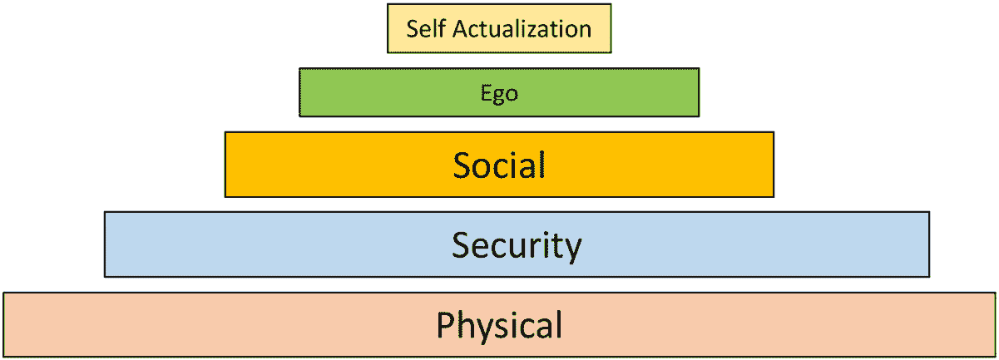
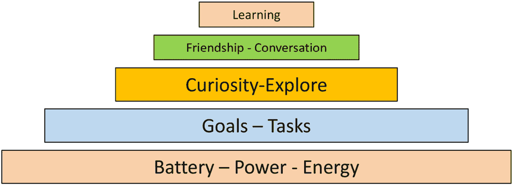
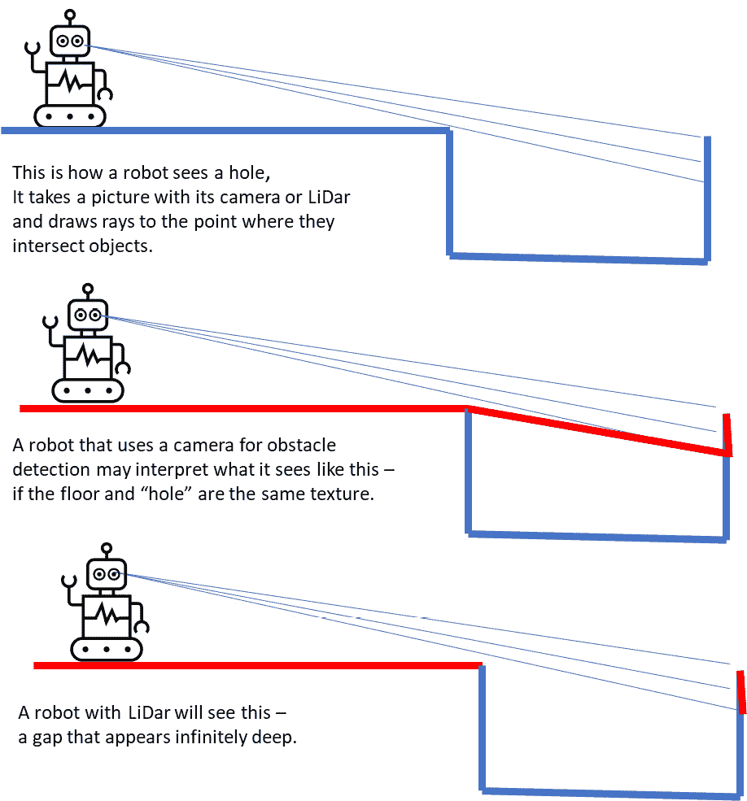
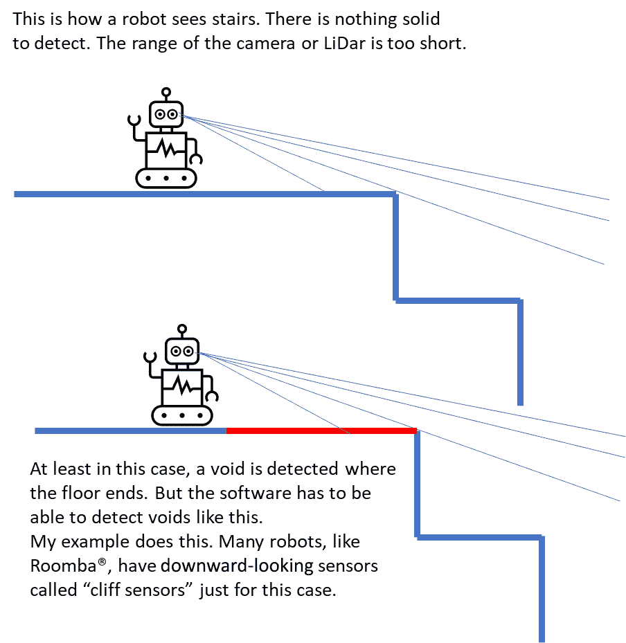
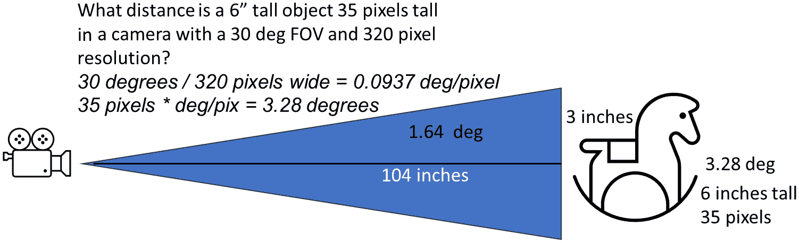
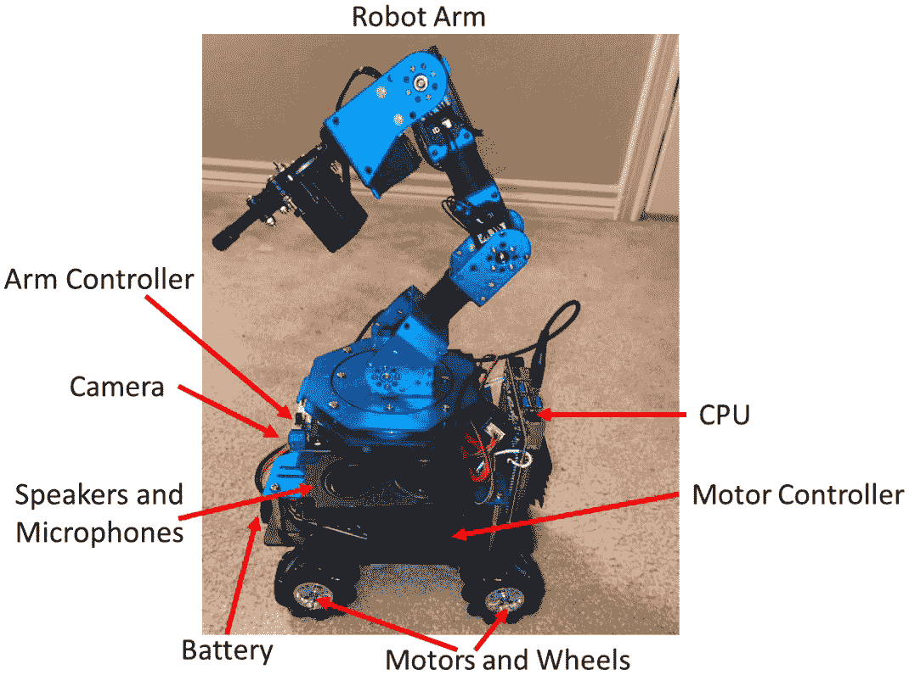
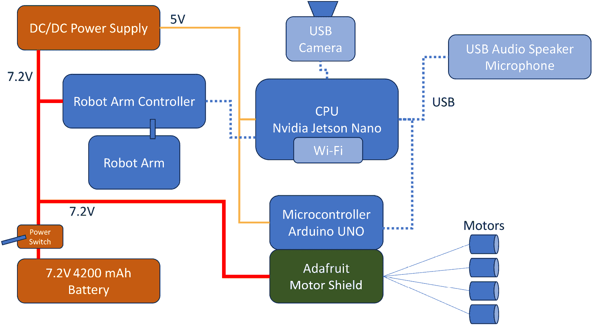

# 结论和反思

在这本书的整个旅程中，我学到了很多，我希望你也一样。我有机会重新审视我对机器人的热爱，并花了很多时间研究人工智能和机器人设计的最新进展，试图以易于理解的形式向你解释这些概念。

在本章中，我们将讨论完成我们的机器人。我将为你提供一些关于人工智能和机器人领域职业的建议。我们还将简要谈谈人工智能的未来，至少就我所见而言，并以关于风险的话题结束。

本章将涵盖以下主要内容：

+   学习何时停止

+   机器人领域的职业

+   探索人工智能的当前状态

+   理解人工智能中的风险

# 学习何时停止

在过去的九个章节中，我们一直在设计一个特定的机器人来完成特定的任务。我们设计了名为*阿尔伯特*的机器人，使其能够在非结构化环境中捡起玩具，即家庭环境。为此，它需要能够通过摄像头识别玩具，用机器人的手臂和手捡起玩具，在屋内导航，并将玩具放入玩具箱中。我们还增加了交互功能，教会机器人听从并反应命令。最后，它获得了一个人工性格和模拟的情感。

那么，下一个问题是，我们是否完成了机器人的设计、构建和测试？有时，设计和构建机器人的最困难的部分是确定何时才算完成。我经常看到，有些小的地方可能需要改进，或者添加一些细节，或者增强一些功能。哦，机器人需要一盏聚光灯。如果它能记住玩具箱里有什么玩具那就好了。如果它有两个手臂会怎样？等等。你可以永远这样继续下去，修补和添加，永远不会真正完成任何事情。

解决这个问题的方法是设定具体的目标并与之衡量。例如，我们希望机器人能捡起玩具。多少玩具？地上所有的玩具。因此，我们可以进行多次试验，如果在每个测试结束时所有玩具都被捡起，那么任务就算完成了。但如果不是所有玩具都被捡起呢？什么程度算足够好？我们可以说，如果我们能一次性用手握住所有剩余的玩具，那么这是可以接受的。什么水平是不可以接受的？好吧，一个玩具都不捡起是不可以接受的。一半呢？我们会认为那可以吗？我会说可能不会。你可以继续这种自我对话，直到你清晰地界定终点在哪里。然后，一旦你越过了这条线，你就完成了。

有时候，当我们尝试新事物或创新时，我们必须调整期望。预计你需要花一些时间来消除错误。我有过这样的经历，创造了一些东西，然后机器人做了些新的、出乎意料的事情，结果比最初的好得多。例如，我创造了一个具有相当复杂的**跟随我**功能机器人。它使用人体识别来识别人类，然后，当被命令时，会跟在一个人后面，即使是在人群中——只要它总能保持在它视野中跟踪的人。机器人被编程为与人的距离保持六英尺。这意味着如果你朝它走去，而不是离开，它会后退。然后你可以通过朝它走去简单地控制机器人向后移动——我的**跟随我**功能变成了**向前走**功能。

有时候，一项创新可能根本不起作用，在某个时刻，它就必须被放弃。通常，当你不得不一次又一次地添加**拐杖**或解决方案时，你就能知道这一点。每一次解决方案都会使软件变得更加复杂和脆弱。我有一个用声纳避障系统的问题——我使用的声纳传感器太不可靠了，对表面的反应非常敏感——例如，它无法从抛光的木门上看到（获取任何回声）。经过几周的测试后，我们放弃了那个传感器，转而使用另一个名为**红外接近探测器**（**IRPD**）的光学传感器，它工作得更加可靠。

在下一节中，我们将探讨一些如果你对机器人或人工智能感兴趣可以走的职业道路。

# 机器人领域的职业

我经常被问及机器人设计师需要具备哪些技能或学位，或者他们应该上哪些课程。我在机器人竞赛、学生活动、会议和招聘之旅中遇到了很多年轻人。我给很多人的建议已经包含在这本书里了——特别是现在人工智能、神经网络、**图形处理单元**（**GPU**）、专家系统、聊天机器人、导航和图像处理都变得非常重要。你需要理解**机器人**是一个涵盖众多行业和技能集的宽泛术语。

谁使用机器人？应用范围每天都在不断扩大。以下是一些例子：

+   在医疗领域，有机器人辅助手术、机器人假肢、外骨骼帮助截瘫者行走，以及植入式设备帮助人们听和看。

+   在交通领域，我们有自动驾驶汽车、自动驾驶飞机和直升机（这就是我从事的工作）。

+   我们在旧金山的街道上使用机器人递送包裹，一些公司在非洲、瑞士、德克萨斯州和其他地方测试通过无人机递送包裹。

+   我们在几个国家测试着自动驾驶汽车。在美国的**DARPA 大挑战**机器人汽车比赛中首次亮相的安全功能，以及为自动驾驶汽车开发的功能——车道保持、自适应巡航控制、驾驶员辅助和自动泊车——现在甚至是最基础的汽车上也已成为常见功能。目前有超过80家公司正在开发某种形式的电动**垂直起降**（**VTOL**）载人车辆，每一款都将其作为控制系统的一部分使用先进的自动化和自主技术。在澳大利亚的远西部地区，力拓矿业在皮尔巴拉开发了**未来矿山**，在那里，80辆自动驾驶卡车从1500公里外的珀斯远程操作。

机器人技术的未来正在被书写，而你，正在阅读这本书，可能将在决定其走向中扮演一部分角色。

那么，设计并制造像我刚才描述的机器人需要哪些技能呢？事实是，一家现代机器人公司几乎会雇佣所有可想象到的技能。让我们更仔细地看看其中的一些技能：

+   即使是最简单的机器人也需要**机械设计师**来开发零部件、齿轮和杠杆，使机器人移动并帮助包装电子产品。

+   **电气工程师**与电池和电机工作。

+   **射频**（**RF**）**工程师**和**技术人员**使用无线电和数据链路，这些用于将移动机器人连接到其控制站（如**无人机****车辆**（**UAV**））。

+   **认知专家**设计人工智能程序，开发机器人情感，运用机器学习技术，以及设计用户界面。

+   **作家**和**艺术家**制作语音程序，编写对话，设计用户界面，编写手册和文档，并为机器人的内外部增添创意。

+   **经理**和**监督员**跟踪预算和进度。

+   **供应链专家**与供应商、零部件、按图生产车间、电子产品仓库和销售人员合作，以确保零部件到位，组装生产线。

+   工业机器人由特殊类型的**程序员**管理，他们使用**可编程逻辑阵列**（**PLAs**）和**梯形逻辑**来控制涂漆和组装组件的机器人手臂。这种编程模拟了机器人最初使用继电器和开关设计的原理。

+   **簿记员**和**会计师**确保账单以及员工得到支付。

+   **销售人员**、**市场营销**和**客户关系**团队负责产品的销售并保持客户满意。

所有这些技能在专业机器人工程师身上都必须以某种形式存在，尤其是如果你认为自己将经营自己的公司。我曾参与过各种规模的机器人项目，从一个人到数千人。每个项目都有其优势和劣势，但作为一个机器人设计师，你可以确信你将是风暴的中心，让魔法发生，解决问题，将想法转化为实物。对我来说，没有比看到我的创造物在驾驶或飞行中，完成其工作，并知道所有这些辛勤的工作、研究、编码、机械、不眠之夜、手指和脚趾的挫伤，以及跳过的餐食都值得这个结果更令人满足的时刻了。

现在，让我们谈谈围绕机器人和人工智能的新闻中的一些炒作。

# 探索人工智能的当前状态

目前，在人工智能和机器人技术的交汇世界中，炒作很多。而且其中很多都是夸张的。

一个常见的误解是机器人正在夺走人们的就业机会。实际上，机器人和自动化让工人能够从事更多富有成效的任务。这一真相可以从就业统计数据中看出——尽管工厂自动化取得了巨大进步，但美国的失业率处于50年来的最低水平([https://www.wsj.com/articles/january-jobs-report-unemployment-rate-economy-growth-2023-11675374490](https://www.wsj.com/articles/january-jobs-report-unemployment-rate-economy-growth-2023-11675374490))。然而，根据《哈佛商业评论》，机器人技术的提高生产率创造了比它消除的更多的工作机会([https://hbr.org/2021/03/why-robots-wont-steal-your-job](https://hbr.org/2021/03/why-robots-wont-steal-your-job))。由于自动化和生产率的提高，就业的整体水平是*增加*的，而不是下降。

我确实认识到，现代工人，甚至像我这样的从事技术工作的人，必须随时准备并愿意——无论年龄多大——重新培训自己，学习并适应新的工作方式、新的经济和新的机遇。每当有新的市场和新技术出现时，我就不得不至少重新培训自己六次。有时，会出现一个*第二波*，其中一些技术被发明出来，但由于其提供的效益过高或适当的硬件尚未发明，这些技术随后消失了。神经网络就属于这一类，虚拟现实也是如此，它在1999年是一个大事件，而现在随着为手机开发的小型高分辨率屏幕的出现而重新出现。

## 展望人工智能和机器人技术

我对所谓的*共享经济*的长期影响非常感兴趣，这种经济模式中，像Uber、Lyft和Airbnb这样的公司通过在巨大规模上连接供应商和消费者来创造价值，而不拥有提供任何服务的资本或资源。所有这一切都得益于无处不在的互联网，它以快速的速度持续增长和演变。互联网的可用性使得公众或单个学生能够访问超级计算机级别的能力，在线运行ChatGPT等AI程序，这些程序太大，无法装入家用电脑、智能手机或平板电脑。我经常在提到一些可能只有24个月历史的想法时使用“*但那在互联网年份中相当于十年*”这个术语，以表明互联网技术的快速更迭。这一趋势将持续下去。将很有趣地看到20年后是否还有人拥有汽车，或者只有汽车服务的订阅。

另一个变得非常有趣的趋势是许多行业中进入门槛的降低。过去，你需要一个庞大的机器车间和巨型机器来制造精密的机械部件——直到3D打印机出现，将这种能力带到了你的桌面。**生成式AI**是一种能够合成写作和绘画，并能直接创作音乐、编写程序和软件、提供建议，以及仅通过文本提示帮助用户编写脚本、绘制图片和制作动画的AI。你想制作电影吗？你可以在iPhone上做到。你想开设录音室吗？专业结果所需的部件（需要大量努力）的价格不到200美元，你还可以使用AI生成歌词、和弦进行、琶音，甚至歌曲创意。

符合降低进入门槛这一类别的项目之一是无人机或小型无人机。当我开始制作无人机时，一个不错的**全球定位系统**（**GPS**）和**惯性测量单元**（**IMU**）——使不稳定的四旋翼无人机能够控制的东西——需要花费数万美元到数十万美元。无人机技术的真正突破并非来自航空领域，而是来自我们的手机。手机的发展使得公司能够投资数十亿美元来制造下一代手机、智能手机、手持电脑安抚器，或者你想要称之为什么的东西。非常小的无线电、非常小的GPS和非常非常小的加速度计的融合，使得一个无人驾驶飞行物的世界——四旋翼无人机、滑翔机、飞艇、飞机和混合垂直起降（VTOL）飞行器——得以出现。这，加上来自（你猜对了）手机和笔记本电脑的高密度电池，使得人们发现，如果你给它足够的动力，几乎任何东西都能飞起来，包括你自己。

飞行四旋翼无人机取得惊人成功的秘诀在于，那些测量运动变化的微型加速度计（加速度计）和测量方向变化的微型陀螺仪（陀螺仪）变得既便宜又容易获得。没有这些传感器，以及控制它们的机器人算法，四旋翼无人机将是不稳定的，无法控制。四旋翼无人机成功的另一个原因是，它仅使用油门设置——即电机的速度——来控制其所有飞行方面的稳定性。这与使直升机工作的非常复杂的集体控制和循环俯仰控制形成对比。你可以看到无线电遥控直升机和四旋翼无人机的区别，前者非常昂贵，只有少数人能够驾驶，而后者相当便宜，任何人都可以驾驶，只要有计算机和一些传感器。你可以在集体/循环无线电遥控直升机上添加无人机自动驾驶仪，最终得到一个非常可控的无人机直升机。四旋翼无人机和更复杂的飞行器使用人工智能进行稳定、自适应飞行控制、物体识别和避障。

人工智能和机器人技术的这些进步也导致了一些人的反感和机器人恐惧症。

## 人工智能恐惧症合理吗？

你可能在网上看到过来自各种非常可信来源的令人震惊的标题，说了一些令人难以置信的事情。

大约十年前，著名科学家斯蒂芬·霍金表示，“*完全人工智能的发展可能会给人类带来末日...它将自行起飞并以越来越快的速度自我重新设计...受限于缓慢的生物进化的人类，无法与之竞争，将被取代*” ([https://www.bbc.com/news/technology-30290540](https://www.bbc.com/news/technology-30290540))。这句话至今仍被人工智能的批评者频繁引用。

最近，埃隆·马斯克表示，人工智能可能导致*文明毁灭*，尽管他已经在人工智能的增长上投入了大量资金 ([https://edition.cnn.com/2023/04/17/tech/elon-musk-ai-warning-tucker-carlson/index.html](https://edition.cnn.com/2023/04/17/tech/elon-musk-ai-warning-tucker-carlson/index.html))。

微软前董事长比尔·盖茨持更中庸的观点，他认为人工智能既带来了希望，也带来了担忧。在一封公开信中，他详细阐述了人工智能的潜力，但也讨论了发展这项技术的风险。他写道，“*世界需要建立交通规则，以确保人工智能的任何负面影响都远远小于其* *好处*” ([https://www.forbes.com/sites/qai/2023/03/24/bill-gatess-open-letter-suggests-ais-potential-is-both-exciting-and-terrifying/](https://www.forbes.com/sites/qai/2023/03/24/bill-gatess-open-letter-suggests-ais-potential-is-both-exciting-and-terrifying/))。

首先，让我明确一点，我认为自己并不与这些先生们处于同一水平。但我是这样的人，每天都在人工智能、无人车辆和机器人技术的最前沿工作，并且参加并发表了许多人工智能会议。这种对人工智能的恐惧可以在任何浴室里找到，挂在墙上——我们正在用我们的镜子将我们的动机和欲望反映到我们的创造物上。

我会把目前人工智能的先进状态比作一个成功将V-8引擎安装在滑板上的青少年——拥有巨大的力量，却无法使用。虽然计算机、硬件和网络以惊人的速度发展和扩展，但我们今天构建软件的方式与20年前相同，许多人工智能的进步都是在40或50年前发明的。例如，神经网络是在1940年代发明的（[https://link.springer.com/article/10.1007/BF02478259](https://link.springer.com/article/10.1007/BF02478259)）。遗传算法是在1950年代由艾伦·图灵提出的。现在，由于我们拥有大量的数据（感谢互联网）和大量的带宽，我们能够在应用学习理论方面取得一些进步，但我们并没有创造出任何令人震惊的新概念或能力，显示出任何人工智能突破的迹象。最近在生成式人工智能方面的工作——如**ChatGPT**和**Dall-E**图像生成——创造了一种可以描述为计算机版的想象力（从噪声中逐步创建数据），这确实是一个进步，但仍然，像ChatGPT这样的生成式人工智能所做的，与神经网络之前所做的一样：预测句子中的下一个单词。

什么是生成式人工智能？在这种情况下，我们可以向人工智能本身寻求定义。以下文本是由名为ChatGPT4的人工智能程序根据提示“*你能提供生成式人工智能的定义吗？*”所撰写的：

“生成式人工智能是指一类可以从其训练数据中学习到的模式和信息生成新内容的人工智能技术，例如文本、图像、音乐或代码。这类人工智能使用机器学习算法，特别是生成模型，如生成对抗网络（GANs）或转换器，来理解和复制人类生成内容的复杂性。”

“‘生成’这一方面意味着人工智能不仅仅是分析或处理现有信息，而是实际上在创造一些新东西，以前从未见过。例如，在文本的情况下，生成式人工智能可以撰写文章、诗歌或代码；对于图像，它可以创作艺术品或不存在事物的逼真照片；在音乐中，它可以创作各种风格的新作品。”

但这难道就是所说的**通用人工智能**（具有人类智能的软件）吗？我不这么认为。尽管硬件和软件在进步，但我看不到任何通往那种类型问题的道路，正如尊敬的盖茨先生、马斯克先生或霍金博士所提出的。为什么没有呢？我们将在下一节中关注这一点。

## 比较人类和人工智能的需求

我看不到重大问题的原因是因为机器人没有需求。人类有生存和抱负的需求。我们被脆弱的肉体细胞包裹着，威廉·巴勒斯称之为**软机器**。我们必须提供空气、食物、水、住所和衣物来保护我们脆弱的外壳，并与其他软机器（人）互动以繁殖和创造更多自己。你可以像理查德·道金斯在他的书《自私的基因》中所做的那样争论，所有这些都是我们DNA延续的一种进化方式，而我们只是我们生物编程的产物。人类与需求是不可分割的——如果我们不这么做，我们几分钟就会死去。是我们的需求推动我们前进，走出树木，学会耕种，建造城市，并创造文明。

相反，机器人作为其存在条件并不需要需求。它们只是我们在电子设备中设定的指令集——头脑中有文字的哥莱姆，这些文字使它们移动（如特里·普拉切特在《粘土之足》一书中所描述的）。如果我们不给他们提供食物——什么也不会发生。如果我们不使用它们——什么也不会发生。如果我们忘记它们一周，然后稍后检查，它们仍然是相同的。

首先，让我们讨论一下人类的需求。马斯洛在1943年提出了**需求层次理论**，并且自那以后一直被引用。马斯洛说，我们不仅有需求，而且它们形成了一个层次——越重要的需求在底部，越抽象的需求在顶部。只有当所有低于这个级别的需求都得到满足时，我们才会担心这个级别的需求，如下面的图所示：



图10.1 – 人类需求层次结构

让我们详细看看这个需求金字塔：

+   在底部是**生理需求**——空气、食物、水和衣物。

+   接下来是**安全需求**——我们需要感到从捕食者或其他想要伤害我们的人类那里得到保护。

+   在安全需求之上是**社交需求**——想要成为群体的一部分或社会的一部分。人类想要属于一个家庭、一个社区、一个国家。这种驱动力非常强烈，正如我们发明战争来保护我们的社会所证明的那样。

+   接下来是**自我实现需求**——被认可、特殊、与众不同的需求，从我们努力想要成为其中一员的人群中脱颖而出。记住，只有当所有其他需求都得到满足后，我们才能表达这种需求，所以你只有在成为群体的一部分后才会担心认可。

+   我们最终的需求被称为*自我实现*，正如马斯洛所描述的——我们可能会称之为自我提升，或提高自己的驱动力。这就是我们得到运动员、艺术家、音乐家和写书的人的地方。

注

我和我妻子之间有一个持续的笑话，那就是我们在大学里读过的每一本教科书都包含对马斯洛及其需求层次理论的引用。这相当不寻常，因为我学习的是数学和工程，而我妻子的学位是人力资源管理。我很欣赏这本书为那个引用马斯洛的书籍列表增添的讽刺意味。

现在，让我们来看看机器智能，并想象一下一组机器人需求可能是什么样子。我发现这是一个有趣的思想实验——我们制造了一个能够学习任何婴儿人类（或婴儿老鼠，或婴儿蟋蟀）能学会的东西的婴儿机器人。它会有什么需求？让我们看看马斯洛需求层次的一个修改版：



图10.2 – 机器人的需求层次

我们可以这样分解：

+   与机器人的需求相比，饥饿是嵌入在人类生物学中的。然而，在AI系统的案例中，我们，作为创造者，需要将其构建进去。这相当于我们在人工个性中所做的那样，即*电能*或*电池寿命*。

+   下一个需求层次将是AI被创造出的*目标*和*任务*。

+   更高层次的需求可能是*好奇心*和探索的需求——我们的AI系统会有获取更多数据或获取更多资源的驱动力。一旦机器人有了数据，这就会给它提供获取更多数据的基础，如此类推。

+   我们将赋予我们的AI的下一个需求层次是*友谊*或*沟通*的需求，无论是与其他机器人还是与人。

+   最后，我们可以给我们的机器人赋予*学习*的需求，或者说是获取和学习新技能和技术——作为机器人成长。

你可能已经注意到，我们没有在这本书中涵盖这些主题，也没有涵盖其他任何主题。我们没有谈论赋予机器人需求，只是如何模拟情感和机器人完全不懂的对话规则。它不会因为告诉一个7岁的孩子一个糟糕的笑话而感到快乐，因为它不知道这些概念中的任何一种。它只是因为我们的指令而将电子发送到一条路径或另一条路径。这里的唯一智能是我们，机器人设计师的反思和想象力。其他一切都是幻觉——魔术师的把戏。

我经常遇到这类问题，并觉得如果这能帮助你抵御AI批评者的攻击，我可以给你一些我的答案。底线是，我根本不担心AI会接管世界。我的意思并不是说永远不会有通用AI，只是我看不出在可预见的未来会有一个出现。

在有了这个背景之后，让我们讨论如何理解和管理AI中的风险。

# 理解AI中的风险

我在会议和出版物中经常讨论的一个主题是AI在*信任*和*控制*方面的风险。我这里不是在谈论AI失控，而是在讨论如何使AI可靠。非常有趣的是，我们一直在考虑的这种AI——特别是人工神经网络（ANNs）——做了一些其他计算机软件很少做的事情。给定相同的输入和条件，AI系统的输出并不总是相同的。给定相同的输入，AI系统有时会得出不同的答案。这种行为的形式名称是**非确定性**。

这还有第二个推论。给定相同的输入，AI过程有时会花费不同的时间来完成其任务。这对计算机来说根本不是正常的行为。

虽然如此，我们并不是用AI来解答像*2+2*这样的数学问题，而是如何去做诸如诊断癌症肿瘤或为自动驾驶汽车识别人行横道上的行人这类事情。我们如何处理可能错误的计算机输出呢？你可以亲自验证这一点——看看我们在进行神经网络训练时覆盖的例子。我们是否曾经在一次训练运行中实现了100%的成功，即所有答案都正确？没有，一次都没有。这是因为人工神经网络（ANNs）是*通用逼近函数*，它们将输入映射到输出——这些输入可能相当复杂。它们通过处理概率和平均值来实现这一点，这些都是在时间中发展起来的。你可以把一个人工神经元想象成一个概率引擎，它会说：“在过去的50次中，有45次我得到了这组输入，输出应该是正确的。这次它也有可能是正确的。”然后它就设定为正确。在我们的网络中，我们可能有数百万个这样的小人工神经元，每个都在做类似的计算。最终结果是做出一个关于答案的非常明智的猜测。

对于我们神经网络的大多数应用来说，这种行为是可以接受的。我们在对图片进行分类，如果有一两张分类错误是可以接受的。我们进行一次关于鸭嘴兽的谷歌搜索，结果在100张图片中有一张是鸭嘴兽品牌的网球鞋。这对于谷歌搜索来说是完全可以接受的，但如果我们在做更严肃的事情，比如在自动驾驶汽车中识别行人呢？如果我们错误地识别了100个行人中的一个，而没有避开他们，这是否可以接受？当然不行。这就是为什么，目前，我们不允许AI系统在如此关键的功能中使用。但人们希望以这种方式使用AI——实际上，很多人都在这样做。如果能有一个AI系统识别飞行中的鹅，并告诉你的飞机如何避开它们，那将是极好的。如果能有一个AI系统识别出患者在医院中被误诊，并需要立即关注，那也会很棒。但我们不能做到这一点，除非我们找到了处理AI非确定性和不可靠性的方法。

目前，我们一直在汽车中处理非确定性元素，它们被称为驾驶员。人们普遍认为，绝大多数车祸是由人为因素造成的，这就是为什么我们需要具有更好百分比的自动驾驶汽车。我们如何处理人类驾驶员？让我们看看驾驶员所需的必要标准：

+   我们要求他们达到一定的年龄，这意味着他们已经积累了经验。

+   他们必须通过测试，证明他们在完成任务方面的能力。

+   他们必须通过知识测试来证明他们遵守规则和法规。

+   他们必须定期通过更新执照来重新认证。

+   我们还要求使用安全带和气囊来部分减轻人类驾驶员犯错误的风险，通过减少由此产生的伤害

我们可以将这些类型的标准应用于AI。我们可以要求一定数量的训练案例。我们可以测试并证明一定的能力水平。我们可以提前预测错误或错误的水平，并采取措施减轻这种风险。也许我们可以有两个AI系统——一个用于检测障碍，另一个被训练来识别第一个AI已经犯了一个错误。如果我们有90%的第一个AI是正确的可能性，另一个90%的第二个AI是正确的可能性，那么我们就有*90% + (10%的90%) = 99%*的避免事故的可能性。

我认为在关键安全应用中使用AI的关键是能够提前预测风险，并提前设计以减轻风险的原因或影响。

# 摘要

在这本书的最后一章中，我们总结了我们在机器人和AI方面的旅程。我们讨论了机器人作为职业，并讨论了AI机器人作为职业。我提出了一些关于AI未来的问题，既有现实的也有想象的。无人机和自动驾驶汽车是现实的；机器人取代人类工作或接管世界是想象的，至少在我看来是这样。我谈到了机器人和AI没有需求，因此缺乏进化所需的动机、压力甚至能力。最后，我们讨论了AI中的风险以及如何识别它。我希望这些信息能为你在机器人和AI方面的兴趣提供一些指导，并从该领域的从业者那里提供一些*内部信息*。

现在我们几乎到了这本书的结尾，我想感谢您与我一起走过这段旅程。我希望您在旅途中有所收获，即使只是知道更多的问题去问。我鼓励您深入其中，构建自己的机器人，了解AI，并成为那些将机器人作为爱好或职业贡献的人的社区的一部分。

我必须承认，我非常感激所有机器人学和人工智能开源社区，因为它们使所有这些材料、知识和专业知识变得可用，并且继续使人工智能成为开源作为人类知识进步模式的成功例证。ROS（完全由志愿者运营）就是一个很好的例子，因为它使构建机器人变得容易得多。

# 问题

1.  考虑到我们以轻松的语气开始本章，最终讨论了机器人恐惧和关于存在的哲学问题，你认为AI是一个威胁吗？为什么或为什么不？

1.  列出五个必要的职业，以将我们的Albert机器人转变为产品公司。

1.  如果我们想象一家公司打算将Albert机器人投入生产，它需要心理学家吗？是为了机器人，还是为了人类？

1.  在手机或智能手机中发现的哪些组件也出现在四旋翼飞行器中？

1.  为什么AI系统，特别是ANNs，在结果和时间上自然是非确定性的？

1.  一个可预测地犯错的AI系统可能有哪些实际应用？

1.  如果一个AI系统为你挑选股票，并且43%的时间预测到赢家股票，然后你有一个第二个AI，它在确定第一个AI没有挑选到好股票时80%准确，那么AI组合在多少时间内会挑选到盈利的股票？

# 进一步阅读

+   《*行为组织*》，由 Donald Hebb，Wiley 出版。

+   《*计算机机制与智能*》，由 Alan M. Turing 在《Mind》杂志上发表。第LIX卷（238）。

+   《*粘土之足*》，作者 Terry Pratchett，由 HarperCollins 出版，伦敦 2009年。这本书讨论了虚构的哥莱姆概念，它们是由写在纸上的指令编程的粘土生物，并将其放入它们的头脑中，这是机器人的一种有趣的类比。

+   《*人类动机理论*》，由 A.H. Maslow 在《Psychological Review》杂志上发表，第50卷（4）。

+   美国交通部。*全国机动车事故原因调查*。[https://crashstats.nhtsa.dot.gov/Api/Public/ViewPublication/811059](https://crashstats.nhtsa.dot.gov/Api/Public/ViewPublication/811059)。

+   《*攻击错误推理：无谬误论证的实用指南*》，作者 T. Edward Damer，Cengage Learning。

+   《*使用ChatGPT和OpenAI模型的现代生成式人工智能*》，作者 Valentina Alito，Packt Publishing。

# 答案

# [第1章](B19846_01.xhtml#_idTextAnchor015)

1.  PID这个缩写代表什么？这被认为是AI软件方法吗？

    **PID**代表**比例、积分、微分**，是一种不需要模型（模拟）即可运行的闭环控制器。PID不是AI方法，因为在决策过程中没有涉及学习或适应。PID是非常有用的控制技术，并且广泛用于控制电机和恒温器。

1.  图灵测试是什么？你感觉这是评估人工智能系统的有效方法吗？

    **图灵测试**，最初由艾伦·图灵命名为*模仿游戏*，是一个想象中的测试或思想实验，其中一个人通过**电传打字机**（或文本消息，对年轻人来说）与某人或某物进行交流。如果一个人无法判断他们正在与之交流的是人类还是机器人，那么人工智能就会通过图灵测试。现代基于人工智能的聊天机器人和生成式人工智能引擎（如ChatGPT）已经通过了图灵测试，并且正在创建新的智能测试（[https://www.nature.com/articles/d41586-023-02361-7](https://www.nature.com/articles/d41586-023-02361-7)）。

1.  你认为机器人通常为什么会有负向障碍物（如楼梯和坑洼）的问题？

    使用机器人的传感器很难看到负向障碍物（洞、悬崖、下行的楼梯等），这些传感器更容易处理正向（上升）障碍物。通常，由于底部被遮挡（不可见），摄像头和激光雷达只能看到负向障碍物的一部分。有时，通过看到它们的影子——传感器无法看到的部分——更容易对负向障碍物进行推理。以下图示显示了机器人如何感知一个洞：



图11.1 – 机器人如何看待洞或负向障碍物

以下图示显示了机器人如何感知楼梯：



图11.2 – 机器人如何看待楼梯

1.  在OODA循环中，定位步骤做什么？

    在*定位*步骤中，所有数据都被放入同一个参考框架中，这通常是机器人的中心视角点。这允许机器人确定哪些数据与决策相关。这是决策过程中最重要的步骤。

1.  从Python优势的讨论中，计算以下内容：你有一个需要测试50次更改的程序。假设每次更改都需要一次运行和重新编译步骤来测试。C语言的Make编译和构建需要450秒，而Python的`run`命令需要3秒。你坐等C编译器的时间有多长？

    使用Python作为解释性语言可以在非常复杂的构建上节省大量时间，其中C/C++编译器和链接可能需要20分钟或更长时间。所讨论的C程序测试周期需要6.25小时才能完成，而Python测试程序只需要2.5分钟。

1.  RTOS代表什么？

    **RTOS**代表**实时操作系统**。这是一个在操作系统内部强制执行时间限制和处理分区的操作系统。RTOS是一个确定性的操作系统，它总是以相同的时间执行一个任务。

1.  你的机器人有以下预定任务：遥测频率为10 Hz，GPS频率为5 Hz，惯性测量频率为50 Hz，电机控制频率为20 Hz。你会在什么频率下安排基本任务，以及你会使用什么间隔来安排较慢的任务（例如，10 Hz基本频率，每三帧一次电机控制，每两帧一次遥测等）？

    你需要一个所有这些速率（10、5、50、20）都能均匀除尽的数字。适合的最小数字是100 Hz。如果学生假设20 Hz会在一帧中更新两次，在下一帧中更新三次，我会接受50 Hz，这有点作弊，但这是实时系统的一种常见适应方式。

1.  假设一个帧率调度器最快的任务为每秒20帧，你将如何安排一个需要以每秒7帧运行的任务？对于每秒3.5帧运行的又如何？

    如前所述，为了得到一个恒定的帧率，每个帧中不一定需要有相同数量的样本，只要每个样本都是基本帧率的倍数即可。在这种情况下，*20 x 7 = 140*，所以7 Hz可以在20 Hz的基本频率下运行，并且每140帧或7秒重复一次模式。7的一半是3.5，可以在相同的基频下运行，模式每70帧重复一次，或3.5秒。

    每次更新之间会有5.7帧的距离，这会被四舍五入到6。

1.  什么是阻塞调用函数？为什么在像机器人这样的实时系统中使用阻塞调用是坏事？

    一个**阻塞调用**会暂停你的程序执行，直到发生中断或事件，例如接收数据报或UDP数据包。这些调用很糟糕，因为你失去了对程序时序的控制，无法维持软实时执行。对于串行端口和网络接口，请使用**轮询调用**代替。轮询调用会在接口上查找数据，然后在没有数据可用时继续。

# [第二章](B19846_02.xhtml#_idTextAnchor032)

1.  列举三种机器人传感器的类型。

    传感器是任何将外部世界的数据传递给机器人的东西。文中提到的传感器包括以下几种：

    +   声纳传感器

    +   摄像头

    +   麦克风

    +   按钮

    +   模拟-数字电压传感器

    +   通过热敏电阻测量温度

1.  PWM的缩写代表什么？

    **PWM**代表**脉冲宽度调制**，这是一种数字到模拟的控制方案，其中发送的脉冲根据所需的控制量变长。换句话说，脉冲占空比（开启/关闭的时间）被转换为电压来驱动电机。这通常用于控制直流电机。

1.  什么是模拟-数字转换？输入和输出是什么？

    正如其名所示，**模拟-数字**（**A2D**）转换将模拟值（通常是电压）转换为数字值或数字，这是计算机的数字部分可以理解的。一个典型的应用是测量电池电压以确定充电状态。

1.  谁发明了子吸收架构？

    如罗德尼·布鲁克斯在《 Cambrian Intelligence: The Early History of the New AI》一书中所述，子吸收架构最初由麻省理工学院教授罗德尼·布鲁克斯博士描述，他后来帮助创立了 iRobot 公司并发明了 Baxter 机器人。罗德尼试图开发昆虫大脑的类似物，以了解如何编程智能机器人。

1.  将我的三层子吸收架构图与艾萨克·阿西莫夫提出的机器人三大法则进行比较。是否存在相关性？为什么或为什么不？

    不，实际上并不是。艾萨克·阿西莫夫的机器人三大法则是虚构的，而**子吸收架构**（**SA**）是一个真实存在的架构，用于制作现实世界中的机器人。

    阿西莫夫的三大法则：

    +   机器人不会伤害人类，或者通过不作为，让人类受到伤害

    +   机器人会服从人类的命令，除非这违反了第一条法则

    +   机器人会保护自己免受伤害，除非这违反了前两条法则

    让我们来看看 SA 中的三层：

    +   SA 的底层是机器人内部的部分，负责处理内部系统——我喜欢将其比作自主神经系统。这保护了机器人。

    +   第二层是短期管理者——它告诉机器人去哪里，包括遵守用户的命令。

    +   顶层包含战略思考和规划过程。坦白说，相关性较弱。

    还有，读者们，记住最后的，或者说零法则：机器人不得伤害人类或让人类受到伤害。这是一项后来的补充。

1.  你认为我应该给我的机器人项目 *Albert* 取一个名字吗？你会单独给机器人命名还是按型号命名？

    Roombas 作为机器人吸尘器，表现出人们通常与生物实体相关联的特征，如移动和自主导航空间的能力。这种行为可能会引发人类将拟人化或赋予非人类实体类似人类品质的倾向。命名是这种拟人化的自然延伸。

1.  `ROS_ROOT` 环境变量的重要性是什么？

    最重要的变量是 `ROS_ROOT` 和 `ROS_PACKAGE_PATH`。这些变量用于定义 ROS 包和资源的文件系统路径。它们对于 ROS 系统正确定位和使用各种包和资源至关重要。

# [第 3 章](B19846_03.xhtml#_idTextAnchor043)

1.  描述一下电影或卡通的分镜脚本与软件程序分镜脚本之间的区别。

    电影的分镜脚本不仅用于推进剧情，还用于展示将使用什么视角——换句话说，它用于规划摄像机角度、方向和动作。由于两个分镜脚本的目的都是为了“讲述”发生的事情，它们是相同的。计算机软件分镜脚本的视角应该是用户。

1.  五个 *W* 问题是什么？你能想到任何其他在检查用例时相关的疑问吗？

    *谁*，*什么*，*何时*，*何地*，*为什么*（*为什么*是最重要的）。更相关的问题可能包括：做得怎么样？多长时间一次？多少或多少？

1.  完成这个句子：用例展示了机器人做什么，但不是 ________。

    “它是如何做到的。”用例是从用户的角度出发的，永远不会包括实现细节。

1.  在 *步骤 9* 中取故事板，其中机器人正在驶向玩具箱，并在你自己的故事板中将它分解成更多有序的步骤。考虑在 *帧 9* 和 *帧 10* 之间必须发生的一切。

    机器人必须执行以下操作：

    1.  确定通往玩具箱的路线。

    1.  规划一条路径。

    1.  在路上避开障碍物。

    1.  与玩具箱的前端对齐。

    1.  驶向玩具箱。

    1.  将机器人手臂移动以清除顶部。

1.  完成回复“敲门”笑话的表格，其中机器人回答用户告诉的笑话。你认为最后一步是什么？

    这是为了补充讲笑话的人 – 机器人应该说“这非常有趣”或“我很抱歉，我无法呻吟”。是的，这是我的观点，而不是官方笑话创作者的想法。你怎么看？

1.  看看远程操作操作。你会添加更多吗？或者这看起来像是一个很好的列表？

    机器人需要将视频发送回操作员，以便操作员可以看到他们要去哪里。

1.  为使用距离测量来防止机器人驶下楼梯的传感器编写规范。

    机器人应具有一种传感器，能够在至少六英寸的距离上检测到地面上的负障碍物（例如，向下走的楼梯，阳台）。

1.  在哪个距离上，一个320x200像素、30度 **视野**（**FOV**）的摄像头可以垂直和水平地看到6英寸的填充动物玩具，假设我们需要35像素进行识别？

    要解决这个问题，我们首先需要确定每像素有多少度，然后使用这个值来计算目标的角度尺寸，该目标高度为35像素：

    *30 度 / 320 像素宽 =* *0.0937 度/像素*

    要找到每像素的度数，我们可以进行以下计算：

    *35 像素* 度/像素 =* *3.28 度*

    这给我们一个等腰三角形，但我们需要一个直角三角形来进行数学计算。将底边分成两半以形成一个直角三角形；因此，这个三角形的底边现在是 *3 英寸*。

    我们还将角度分成两半：

    *3.28/2 =* *1.64 度*

    然后，为了计算垂直高度，我们将底边的长度除以 *tan* 的值：

    *3 / tan(1.64) =* *104.78 英寸*

    这相当于 8.73 英尺。

    这可以通过以下图表说明：



图 11.3 – 计算识别所需的像素

因此，所需距离是 8.73 英尺。

# [第 4 章](B19846_04.xhtml#_idTextAnchor126)

1.  我们在本章中学到了很多。你可以使用提供的框架来研究神经网络的特性。调整学习率、批量大小、训练轮数和损失函数。

    这是一个学生的练习。你应该看到随着这些参数的变化，会出现不同的曲线。有些可能根本不会产生答案（看起来像随机结果——曲线保持在同一水平，因为没有发生学习）。有些会学得更快或更慢。

1.  绘制一个人工神经元的图并标注各部分。查找一个自然的人类生物神经元并比较。

    参见章节中的*图4**.3*。人工神经元有几个输入，一组权重，每个输入一个，一个偏差，一个激活和一个输出集。

1.  真实神经元和人工神经元有哪些相同之处？

    两者都有多个输入和多个输出，接受输入，执行一些处理，然后输出。两者都使用某种激活函数（生物上的等效物是突触）来确定何时*触发*或产生输出。两者都是网络的一部分：组成一个神经网络需要很多神经元，同样，动物大脑也是如此。

1.  真实神经元和人工神经元有哪些不同之处？

    自然**神经元**是一种模拟设备，它可以处理许多级别的输入，没有像计算机神经元那样的简单开/关二进制表示。神经元使用化学路径，这些路径和连接在使用过程中变得更加容易，这就是神经元的 学习功能。这通过人工神经元中的权重来模拟。自然神经元有一个轴突，或连接体，它延伸到输出，这些输出可以距离神经输入相当远。神经元以随机方式连接到其他神经元，而人工神经元则以规则模式连接。一些神经网络使用**dropout层**，随机断开神经元，为输出提供一些随机性，这有助于网络估计非线性解。

1.  神经网络的第几层与输入有什么关系？

    第一层包含网络的输入数量。例如，如果你有五个输入，那么第一层必须包含五个神经元。

1.  神经网络的最后一层与输出有什么关系？

    ANN的最后一层是输出层，必须与潜在输出的数量相同。

1.  查找三种损失函数并描述它们的工作原理。包括均方损失和两种交叉熵损失。

    ANN中的**损失函数**是误差函数，它比较神经元的预期输出与实际输出。让我们详细看看它们：

    +   **均方损失**（**MSL**）：这是最常用的损失函数。它由输出与期望输出之间距离的平方和给出。MSL会放大离期望解越远的错误。

    +   **交叉熵**（**XE**）：这也被称为对数损失，主要用于CNN的分类。随着预测值接近1（无错误），XE缓慢减少。随着值的发散，XE迅速增加。以下有两种类型的交叉熵：

        +   二进制（开/关，用于是/否问题）

        +   Sigmoid交叉熵，可以处理多个类别

1.  如果你的网络训练到40%并且“卡住”或无法进一步学习，你会改变什么？

    你可能**过度拟合**了，样本大小太小，或者你的网络不够宽或不够深。

# [第五章](B19846_05.xhtml#_idTextAnchor159)

1.  在Q学习中，Q代表什么（你需要在互联网上查找这个答案）？

    **Q学习**的起源是伦敦国王学院克里斯托弗·约翰·康尼什·赫拉比·沃特金斯博士的博士论文，1989年5月([https://www.researchgate.net/publication/33784417_Learning_From_Delayed_Rewards](https://www.researchgate.net/publication/33784417_Learning_From_Delayed_Rewards))。显然，Q只是代表*数量*。

1.  我们可以做什么来限制Q学习算法必须搜索的状态数量？

    只选择与当前状态相关且是后续状态的Q状态。如果某个状态从当前位置或状态无法达到，则不考虑它。

1.  改变学习率对学习过程有什么影响？

    如果学习率太小，训练可能需要非常长的时间。如果学习率太大，系统不会学习路径，而是过度估计，可能错过最小或最佳解决方案。如果学习率太大，解决方案可能不会收敛或可能突然下降。

1.  在Q学习方程中，哪个函数或参数用于惩罚较长的路径？增加或减少这个函数会有什么影响？

    折扣因子通过随着路径长度的增加而减少奖励来工作。它通常是一个略小于1.0的值，例如，0.93。提高折扣因子可能导致系统拒绝有效的较长路径，找不到解决方案。如果折扣太小，则路径可能非常长。

1.  在遗传算法中，你将如何惩罚较长的路径，以便更偏好较短的路径（步骤数较少）？

    你会调整适应度函数，将路径长度作为适应度计算的因子。

1.  改变遗传算法中的学习率会有什么影响？学习率的上限和下限是多少？

    通常，增加学习率可以缩短每一代的学习时间，直到达到一个路径跳出有效范围的极限。对于我们的示例程序，返回有效解决方案的最低学习率是5，最高值是15。

1.  在遗传算法中，降低种群数量会有什么影响？

    这使得模拟运行得更快，但需要更多代才能找到解决方案。

# [第6章](B19846_06.xhtml#_idTextAnchor205)

1.  做一些互联网研究，了解为什么开源语音助手被命名为Mycroft。你找到了多少故事，哪一个你喜欢？

    我至少找到了三个。我最喜欢的是Mycroft是福尔摩斯的哥哥，有些人说更聪明。福尔摩斯在英国的电视上由本尼迪克特·康伯巴奇扮演，他在电影《模仿游戏》中扮演了艾伦·图灵，这是图灵测试的原名，是一种AI对话测试，这正是Mycroft所做的事情。

1.  在意图的讨论中，你会如何设计一个神经网络来从自然语言句子中预测命令意图？

    一种方法可能是收集一系列命令，标注命令的意图，将命令作为神经网络的输入，并将意图作为训练的输出标签。

1.  将“接收敲门笑话”程序重写为记住机器人被告诉的笑话，通过将其添加到“讲敲门笑话”程序使用的笑话数据库中。这是机器学习吗？

    将程序添加到仅向“敲门笑话”程序数据库写入是非常简单的。你可以在GitHub仓库中找到这个版本的程序。这是机器学习吗？我会说绝对是！这台机器有了它以前没有的能力。它不需要重新编程来获得新的能力，所以它是通过学习获得的。

1.  修改`KnockKnock`（讲敲门笑话的程序）以播放`WAV`文件中的声音，例如音乐片段，以及进行文本到语音转换。

    将这些行添加到`KnockKnock`程序中：

    ```py
    "play_wav_cmdline": "paplay %1 --stream-name=mycroft-voice",
    ```

    你可以用这个来播放音频。你还可以给笑话文件添加一个标签，表示一个`WAV`文件`<groan.wav>`。然后，如果你看到这个标签，就调用上面的`play_wav_cmdline`函数。

1.  本章使用的句子结构都是基于英语语法的。其他语言，如法语和日语，有不同的结构。这会如何改变句子的解析？我们编写的程序能否理解Yoda？

    在其他语言中，宾语或主语的出现顺序不同，就像在Yoda的说话模式中一样。“我倒着说，”Yoda会说。这确实要求我们更改或添加新的句子模式到我们的`.voc`文件中。

    你可以遵循Mycroft的说明，在[https://mycroft-ai.gitbook.io/docs/using-mycroft-ai/customizations/languages](https://mycroft-ai.gitbook.io/docs/using-mycroft-ai/customizations/languages)中将引擎更改为理解法语。

1.  你认为Mycroft的意图引擎实际上是在理解意图，还是只是在提取关键词？

    我并不将Mycroft归类为建筑AI聊天机器人，而更是一种参考类型，它在数据库中查找答案，这使得它更像是一个专家系统，而不是一个AI程序。它在语音转文本部分确实使用了AI神经网络。

1.  描述必要的语音命令，以指导机器人前往一个物体并拾取它，而机器人无法识别该物体。你需要多少个命令？

    我们需要两个命令：

    +   *你能看到* *任何物体吗？*

    +   *前往最近的物体*

1.  从**问题7**中，努力减少命令的数量。你可以消除或合并多少个？

    以下是将机器人驱动到最近物体的语音命令：

    +   *嘿，阿尔伯特*

    +   *前往最近的物体*

1.  从**问题7**中，涉及了多少个独特的关键词？有多少个非独特的关键词？

    四个关键词是**看到**、**物体**、**前往**和**最近**。

    所有的词都是唯一的，除了**物体**，所以有三个独特的单词。它们在Mycroft单词数据库中未作其他定义。

# [第7章](B19846_07.xhtml#_idTextAnchor221)

1.  关于SLAM，哪种传感器最常用于创建SLAM制作地图所需的数据？

    **光探测与测距**（**LiDAR**）传感器是最常用的SLAM传感器，远远超过其他传感器。LiDAR提供的3D数据非常适合SLAM的映射功能。

1.  为什么SLAM在有轮式里程计数据的情况下工作得更好？

    轮式里程计减少了SLAM算法在移动后寻找机器人可能位置所需搜索的空间。因此，它增加了地图中的信息并减少了不确定性。它是如何做到这一点的？通过提供额外的关于机器人位置（移动了多远）的测量，然后我们可以将搜索范围缩小到与我们的传感器读数匹配的位置。

1.  在Floor Finder算法中，高斯模糊函数是如何改善结果的？

    **高斯模糊函数**减少噪声并去除图像中的散乱的单个像素，从而得到更平滑的结果。

1.  Floor Finder的最后一步是从机器人的位置向上追踪到第一个红色像素。这个步骤还可以用其他什么方式完成（参考**图7**.3）？

    而不是使用径向红色线条，程序可以直接从屏幕底部向上绘制一系列垂直线条。

1.  为什么我们在进行神经网络处理之前将图像水平切半？

    我们只想使用房间上半部分来训练网络，因为下半部分有玩具，并且可能会发生变化。房间上半部分不会因为玩具的增加而改变。

1.  使用神经网络方法相较于SLAM技术有哪些优势？

    我们不需要地图就能成功导航房间。我们只是通过驾驶机器人并在固定间隔拍照来提供训练集的标记。这种方法对房间中的变化（如家具位置略有不同）也更具弹性。请参阅[https://hackaday.com/2021/10/25/fast-indoor-robot-watches-ceiling-lights-instead-of-the-road/](https://hackaday.com/2021/10/25/fast-indoor-robot-watches-ceiling-lights-instead-of-the-road/)，了解其他人实现这一想法的示例，用于室内赛车。

1.  如果我们只使用随机驾驶功能（在随机时间进行随机转弯）而不是神经网络，我们还需要在机器人上添加什么新程序或功能才能达到相同的结果？

    我们需要一个导航功能来确定我们在房间中的位置——这很可能意味着一个SLAM算法。我们还需要某种东西来检测楼梯。

1.  我们是如何在章节中提出的方法中避免楼梯的？你认为这足够吗？你会建议其他方法来完成这项任务吗？

    我们训练机器人通过观察房间的上半部分来导航。我们只在安全区域驾驶机器人，并使用这些信息让机器人根据它在房间中的位置预测其下一个行驶命令。由于我们没有在这个过程中让机器人沿着楼梯行驶，机器人将永远不会收到向楼梯行驶的命令。如果楼梯附近有一个玩具，机器人仍然会去捡起它，但在返回导航模式后会避开楼梯行驶。然而，我们必须在让机器人自由行动之前小心地获得良好的训练结果。我使用婴儿门来阻挡楼梯进行早期测试。作为额外的安全措施，我们可以添加一个向下看的传感器来检测楼梯。我会使用**红外接近探测器**（**IRPD**）来完成这个目的。

# [第8章](B19846_08.xhtml#_idTextAnchor235)

1.  遍历决策树的三种方式是什么？

    从开始到结束（起点到目标）；从目标到开始；以及同时从两端出发在中途相遇。

1.  在鱼骨图示例中，你是如何剪掉决策树的分支的？

    通过消除分支上项目的影响。例如，使用我们的“机器人不移动”故障，如果分支说“Arduino无电源”并且你检查Arduino是否有电源并且它确实有，你可以剪掉那个分支。如果分支是“电机卡住”，电机卡住的影响是机器人会绕圈行驶。由于机器人没有绕圈行驶——它根本就没有行驶——你可以剪掉那个分支。

1.  Gini系数在创建分类中扮演什么角色？

    它决定了样本或池中的 *不纯度*。当基尼系数 = 0 时，该类别的所有成员具有相同的属性，并且无法进一步细分。这最小化了误分类。基尼系数由 1 减去一个项目属于该类别的概率的平方和给出。

1.  在使用基尼系数的玩具分类器示例中，哪些玩具属性没有被决策树使用？为什么？

    颜色、噪声、柔软和材料对于通过标签划分类别没有用，因为标签和项目之间没有相关性。颜色对于通过类型划分玩具没有用是有意义的。

1.  我们尝试的其中一个分类技术将哪种颜色用于玩具作为标准？

    使用基尼指数和独热编码来分离填充玩具的决策树使用了白色。

1.  请给出餐厅菜单项的标签编码和独热编码的例子。

    让我们有三类菜单项：开胃菜、主菜和甜点。标签编码将开胃菜替换为 0，主菜替换为 1，甜点替换为 2。独热编码将开胃菜表示为 1 0 0，主菜表示为 0 1 0，甜点表示为 0 0 1。

1.  在 A* 算法中，讨论 `G()` 和 `H()` 的不同计算方式。

    `G()` 函数是从当前位置到起点的路径距离。`H()` 是从当前位置直接到目标（欧几里得距离）。请注意，`G()` 沿路径计算，而 `H()` 是到目标点的直线距离，因为我们还没有计算到目标点的路径。

1.  在 A* 算法中，为什么 `H()` 被认为是启发式，而 `G()` 不是？在 D* 算法中，不使用启发式。为什么？

    `H()` – 到目标点的直接线距离 – 是一个估计值，忽略了任何障碍物，不能直接使用，只是比较一个位置到另一个位置的一种方式。D* 和 A* 之间的一个主要区别是 D* 从目标点开始，反向工作到起点。这允许 D* 知道到目标的确切成本 – 它使用从当前位置到目标点的实际路径距离，而不是像 A* 那样使用启发式方法或距离估计。

1.  在 D* 算法中，为什么有 `RAISED` 和 `LOWERED` 标签而不是仅仅一个 `CHANGED` 标志？

    `RAISED` 的方块或点被排除在考虑之外。`LOWERED` 的方块可能被添加回队列以考虑作为路径。记住，由于新的传感器读数而降低分数会在路径规划器中产生涟漪效应。

# [第 9 章](B19846_09.xhtml#_idTextAnchor294)

1.  你最喜欢的电影机器人是什么？你会如何描述它的个性？

    这当然是一个主观问题。我是一个大R2D2粉丝。R2既活泼、坚定、固执，又是一个忠诚的伴侣和助手。R2能帮你摆脱困境，修理你的星际战斗机，提供对抗敌对火力的掩护，还能破解帝国的电脑。他就像一个轮子上的瑞士军刀。

1.  电影制作者使用了哪些技巧来表达R2D2的性格（肢体语言、声音等）？

    R2D2的性格得益于他情感的哔哔声和尖叫声（由本·伯特提供）以及他底盘内的身体动作（肯尼·贝克提供）。他们被固定在为第一部**《星球大战》**电影设计的并不非常灵活的底盘上，这个底盘只有一个可以移动的头。R2的大部分个性都体现在他的声音上，包括他著名的尖叫声。

1.  有哪两种聊天机器人？列出每种的一些优点和缺点。

    两种类型的聊天机器人如下：

    +   **基于检索的聊天机器人**：基于检索的聊天机器人会在脚本列表中查找响应，并从人类预先编写的一系列短语中选择。这些聊天机器人的优点是编程简单，可以更好地控制输出，并且程序更小、更快。缺点是响应有限，使用关键词使它们的词汇量很小。

    +   **生成式聊天机器人**：生成式聊天机器人使用语法规则和句子模型来创建具有适当意义的新句子，它们更加灵活，可以处理更广泛的主题，但它们编程起来更困难，且复杂且慢（相对而言）。鉴于ChatGPT和其他生成式AI模型的成功，生成式聊天机器人现在已经占据了主导地位。

1.  在**图9.2**中，建模自定义分布（机场示例）的插图，下面的图片显示了两个标准分布和两个均匀分布。为什么曲线没有延伸到图表的顶部？

    这两个分布将相加——标准分布位于**顶部**的均匀分布之上，两者结合后达到图表的顶部。

1.  设计你自己的机器人情感：挑选六种对比鲜明的情感，以表达你机器人性格的整个范围。你为什么选择这些情感？

    这又是一个主观问题。我的答案在文本中。我选择了代表我的机器人能力和它将遇到的情况的情感。我保持了一个友好的机器人类型，所以唯一的负面情感是悲伤——例如，没有愤怒。

1.  如果你设计一个机器人，让它拥有一个讨厌的小男孩的性格（如果你足够老，想想巴特·辛普森、卡特曼或丹尼斯·麻烦），它会有哪些特点？

    一个小男孩可能会顽皮，注意力不集中，经常改变话题，不断试图重复同一个话题，并重复相同问题的变体。我们如何表示顽皮呢？或许是通过忽略指令，生成随机事件或干扰，让机器人将注意力从手头的任务上转移开。

1.  为什么机器人拥有背景故事或传记很重要？

    为了提供对个人问题的连贯答案，例如“你多大了？”

1.  对于以下问题，从我的列表中挑选一个角色来模拟（来自《整合*人工智能*个性》）。

    1.  为机器人写六行对话，询问人类他们上次度假去了哪里。

        +   那么，你上次度假去了哪里？

        +   夏天即将来临。你去年去哪里度假了？你喜欢旅行吗？你去过哪里？

        +   我从未去过度假。你上次去哪里了？

        +   我听说过这个叫做度假的概念。你喜欢去哪里？你去过海滩吗？

    1.  写出六种方法，让机器人表达它感到疲倦并需要充电，同时听起来不像机器人。

    +   我累了——你看到我的充电器了吗？

    +   哇，时间不早了。我已经做这个很久了。

    +   哎，我的电池快没电了。应该是下班时间了。我开始感到有点疲惫。

    +   哎，看看时间！我的电池需要充电了。我这里开始饿了。我现在可以去充电吗？

# [第10章](B19846_10.xhtml#_idTextAnchor366)

1.  既然我们以敲门笑话开始这一章，最后却讨论了机器人恐惧症，并探讨了关于存在的哲学问题，你感觉人工智能是一种威胁吗？为什么或为什么不呢？

    我不认为机器人或人工智能在任何方面都是一种威胁，因为机器人成为威胁的必要和充分条件不存在，也就是说，机器人必须*想要*统治世界，并且必须*需要*统治。目前，机器人和人工智能没有这样的欲望或需求。

1.  列出五个必要的职业，将我们的Albert机器人转变为产品。

    我们需要项目经理、包装设计师、广告和营销专家、销售人员、工程师、技术人员、艺术家、包装设计师、机械师、电工、会计师、律师、心理学家以及支持人员等。你可以从这些选项中选出任何五个。

1.  为什么在我们的想象中制造机器人的公司需要心理学家？

    心理学家研究正常和异常的心理状态以及认知过程，这正是我们试图在人工个性中模拟的内容。我们希望机器人不会在人们身上引发不良反应。我曾经有一个眼睛闪烁着红色的机器人，这让小孩子产生了恐慌症。心理学家会帮助避免这样的错误。

1.  在手机或智能手机中发现的哪些组件也出现在四旋翼飞行器中？

    GPS接收器、收音机、Wi-Fi、蓝牙、加速度计、陀螺仪，以及如今的应用程序或应用。

1.  为什么人工智能系统，特别是人工神经网络，在结果和时间上都是自然非确定性的？

    它们是通用的近似系统，在概率和平均值上工作，而不是在离散数字和逻辑上。人工神经网络可以花费不同的时间，因为特定的数据可能在不同时间采取不同的路径，通过不同数量的神经元，因此处理所需的时间不同。确实，如果你向神经网络提供完全相同的输入，它每次都会给出完全相同的答案。然而，在机器人生活的现实世界中，两个输入在所有方面都完全相同的情况可能非常罕见。

1.  一个会犯可预测错误的AI系统的实际应用可能是什么？

    你可以使用基于神经网络的系统来模拟一个糟糕的人类操作员进行驾驶模拟，以帮助其他驾驶员（和自动驾驶汽车）学习如何避免糟糕的驾驶员。理想状态是难以预测的驾驶员，所以只需训练神经网络到大约60%。现在，网络将有40%的时间给出错误的答案，即统计上可预测。我实际上在一个海军项目的这个项目上做了这件事，海军想要一个模拟不完美的人以可预测的水平误用系统的模拟，这样他们就可以创建一个能够处理这些错误的响应控制系统。

1.  如果一个AI系统为你挑选股票，43%的时间预测股票是赢家，而你有一个第二个AI系统，它在确定第一个AI没有选择好股票时80%准确，那么AI组合在多少时间内会选择盈利的股票？

    我们有100只由我们的AI程序挑选的股票。在这个集合中，不确定的数量是赢家和输家。有43%的概率正确预测股票是赢家，有57%的概率它是有预测性的输家。我们没有其他方法来判断股票是赢家还是输家，除非投资我们的钱，这正是我们试图避免的——投资坏股票。43%的赢率并不好。

    第二个AI有80%的概率告诉你第一个AI选择了不好的股票。在100次中有80次，你会知道股票不是赢家。你剩下80%的概率正确地识别出57只坏股票中的一只，这消除了45只股票。这让你剩下55只股票，其中43只是赢家（平均而言），这提高了你的胜率到78%。

    贝叶斯定理显示了两个独立概率的组合（在发生c的情况下x发生的概率）：

    *px* = x的概率，*pc* = c的概率）

    *p(x|c) = (px* pc) / (**px*pc)+(1-px)(1-pc)*

    使用这个定理，我重新计算了联合概率为75.1%，所以我会接受任何一个答案。

# 附录

**机器人操作系统**（**ROS**）是一个旨在使复杂机器人软件的开发成为可能的框架，由一家名为*Willow Garage*的公司开发，专门用于控制PR2机器人。PR2是一个人形机器人，有两个**7自由度**（**7DOF**）的臂和一套完整的传感器。控制这个非常复杂的机器人需要众多传感器、电机和通信的交互。ROS框架允许独立开发机器人组件。虽然它不是一个传统意义上的操作系统，但它是一个**模块化开源架构**（**MOSA**）。

ROS的主要工具是一个强大的**发布-订阅**服务，它使得进程间的通信——即**进程间通信**（**IPC**）——变得简单和灵活。它还标准化了机器人传感器、电机和控制之间的许多接口。

在本书中，我们将使用ROS 2。ROS 2是ROS的新版本。在本*附录*中，我们将讨论如何安装ROS 2，使用它进行通信，并简要介绍ROS提供的一些工具。我们将深入介绍ROS 2，并描述我们玩具收集机器人Albert设计中所涉及的硬件。我们还将介绍在创建Albert作为本书示例时，书中提到的部分硬件。本书第二版的机器人Albert V2，是我大约第30个机器人设计。

附录中涵盖的主题包括以下内容：

+   介绍MOSA

+   简要概述ROS 2

+   机器人软件需求

+   介绍机器人的硬件

+   机器人安全提示

# 介绍MOSA

ROS是一个MOSA的例子。为什么这很重要？想象一下，如果你的家里的每个电器都有自己的插头，不同的电压，不同的电线，那会给你生活带来很大的困难。但所有的电器插头形状相同，输出相同的电压。它们是标准化的接口，允许你将许多不同类型的电器插入其中。MOSA对软件来说就像这样，标准化接口，允许*即插即用*的兼容性。

以下是其优势：

+   MOSA系统架构允许模块化——即能够以部分或模块的形式创建软件，这些模块可以独立开发、调试和运行。在ROS之前，我创建了一个主要的可执行文件，它在我的机器人上运行所有功能。这个问题首先在于，我无法利用我的**单板计算机**（**SBC**）的多核特性，这是机器人的大脑。我所有的代码都在一个线程、一个程序中，将函数分割出来独立运行是困难的。

+   然后是交互。如果我改变了电机驱动器的时序，它就会搞乱摄像头的传感器时序。如果我改变了路径规划器，那么转向就需要调整。这种交互在 **单元架构** 中很典型。然而，在 MOSA 中，机器人的每个部分，例如机器人手臂控制器，都是独立的，并运行在自己的程序中。它们可以独立开发和调试，交互仅限于我们在那些程序中创建的接口。这使我们摆脱了许多我们本会遇到的问题。

+   我们可以利用的另一个特性是 ROS 提供的非常庞大的标准、已创建的接口和程序库。我们不需要创建控制接口；ROS 已经有一个（`Twist` 命令）。我们也不需要为摄像头图像数据创建数据类型；ROS 提供了多种选择。ROS 还提供了我们可以使用的 USB 摄像头驱动器和查看器，而无需编写任何代码。

现在让我们简单谈谈 ROS 2 的工作原理。

# ROS 2 的简要概述

如前所述，ROS 2 是 ROS 的最新版本，ROS 是一个广泛使用的用于开发机器人应用的框架。我已经使用 ROS 一段时间了，并欣赏它如何使各种组件、传感器和功能集成到我的机器人中变得更加简单。我一度抵制转向 ROS，但现在我已经投入时间学习它能做什么，我无法想象在没有它的帮助下开发机器人。

在本节中，我们将讨论一些对我们理解 ROS 2 基础概念至关重要的概念，如何安装 ROS 2，以及我们可以与之一起使用的某些基本命令。

注意

请使用 ROS 2 的最新版本。

## 理解基本概念

ROS 2 的工作方式与其他编程范式略有不同。ROS 基于发布/订阅机制，允许不同的程序或进程在事先不知道接收者是谁的情况下相互传递信息。让我们看看这个过程是如何工作的：

+   在 ROS 中进行通信的每个程序或代码都称为 **节点**。每个节点都有自己的名称，该名称唯一地标识了它在系统中的身份。

+   节点在 **主题** 上发布数据，这些主题代表消息的接口。

+   **消息**是具有数据类型（字符串、浮点数、固定点、数组等）的接口。

例如，一个操纵杆接口节点通过 `Twist` 消息发布到命令速度 (`cmd_vel`) 主题。在消息的接收端，电机控制接口订阅 `cmd_vel` 主题以接收包含速度和转向信息的 Twist 消息。

注意

为什么叫它“Twist”消息？使用“twist”这个术语的原因是概念性的。想象一下机器人的运动是直线（线性）运动和旋转（扭曲或转动）的组合。通过结合线性和角速度，Twist 消息有效地描述了机器人如何在空间中“扭曲”，这包括平移（从一个地方移动到另一个地方）和旋转（改变方向）。

ROS 还有一些其他有用的特性：

+   存在一个系统级的 `DEBUG`、`INFO`、`WARN`、`ERROR` 或 `FATAL`。日志消息会自动显示在本地输出（通常是命令行）上。它们被集中收集，你可以解析日志消息来调试问题。定期，你确实需要清除旧日志文件，因为它们确实会堆积起来。日志被放入 `~/.log` 目录中。

+   我个人最喜欢的一个特性是 **参数**。这些是独立于源代码创建的外部数据值，可以用来开启或关闭功能，或者设置关键设置，例如图像大小、分辨率、范围和其他功能。拥有外部参数的能力在很大程度上使得 ROS 可移植并且接口可重用。参数可以在启动文件中指定，这是一种同时启动多个程序（节点）的方法。Albert 有五个主要子系统（控制、电机驱动、手臂控制、视觉和语音），所有这些子系统都必须一起启动。

## 比较 ROS 2 和 ROS

ROS 2 在原始 ROS 的基础上引入了一些非常显著的改进。其中一些如下：

+   最显著的改进是 **roscore** *交通警察* 应用程序的缺失。这个中央程序在任何 ROS 实现中充当主节点，并指导其他节点通过套接字进行通信。它指导网络上的所有流量。因此，每个节点都必须与 roscore 通信以了解其运行位置。如果 roscore 死亡或被关闭，那么整个 ROS 应用程序集都将停止。相反，ROS 2 使用 **数据分发服务**（**DDS**）作为其 *中间件层*。DDS 是一个由 **对象管理组**（**OMG**）创建并由 DDS 基金会管理的用于高性能、可扩展和实时数据交换的标准。它为节点提供了一个去中心化的发现机制，以便它们可以找到彼此，而无需一个像 roscore 这样的中央主节点。当一个节点启动时，它会向其他节点宣布其存在，并发现现有的节点和主题。这个过程由底层的 DDS 实现管理。

+   ROS 2 具有更多针对 **实时处理** 的功能，并且没有 ROS 那样的奇怪解决方案，例如将消息向后推迟到未来。这些功能包括使用 DDS（旨在用于实时系统，能够与 **实时操作系统**（**RTOSs**）协同工作，并使用抢占来控制进程）。

+   一个重大改进是ROS 2将首次**原生运行在Windows上**。你不需要虚拟机就可以在Windows上运行ROS - 你可以直接在Windows中构建自己的控制面板和界面。

+   ROS 2还改进了**发现**（在网络中查找节点的过程）并有一些针对网络安全的增强。

因此，总的来说，ROS 2值得花时间升级，我感觉它比旧的ROS更简单，更容易在Windows和Linux上设置，也更容易管理。

让我们来看看软件需求。

# 机器人的软件需求

在本节中，我们将讨论机器人的软件需求以及如何在机器人的CPU上安装它们。

## 安装ROS 2

我在Albert上安装的ROS 2版本是*Foxy*。请随意使用ROS 2的最新版本。Jetson通常落后于Ubuntu升级，并且落后几个版本。我们使用Jetson Nano是因为它具有运行神经网络软件所需的**图形处理单元**（**GPU**）。我的Nano版本正在运行Ubuntu 20.04，但你也应该能够使用Ubuntu版本18.04使其工作。

我使用了可以在[https://github.com/jetsonhacks/installROS2](https://github.com/jetsonhacks/installROS2)找到的标准ROS 2安装脚本。这是一个包含在常规ROS 2安装页面[https://docs.ros.org/en/foxy/Installation/Alternatives/Ubuntu-Development-Setup.html](https://docs.ros.org/en/foxy/Installation/Alternatives/Ubuntu-Development-Setup.html)上找到的所有步骤的脚本。

注意，我们正在进行一个*从源安装*的设置，因为许多程序需要重新编译才能在Jetson Nano的ARM架构上运行。对我来说，这个过程大约需要4个小时，所以需要一些耐心。

## 安装其他包

你还需要安装以下Python包：**科学Python**（**SciPy**）、**数值Python**（**NumPy**）、**scikit-learn**、**开放计算机视觉**（**OpenCV**）和**PyTorch**。让我们看看安装这些包所需的命令：

+   SciPy:

    ```py
    python -m pip install scipy
    ```

+   NumPy:

    ```py
    pip install numpy
    ```

+   scikit-learn:

    ```py
    pip3 install -U scikit-learn
    ```

+   OpenCV:

    ```py
    sudo apt-get install python3-opencv
    ```

    关于OpenCV的更多详细信息，你可以参考[https://docs.opencv.org/3.4/d6/d00/tutorial_py_root.html](https://docs.opencv.org/3.4/d6/d00/tutorial_py_root.html)

+   PyTorch:

    ```py
    pip3 install torch torchvision torchaudio --index-url https://download.pytorch.org/whl/cu118
    ```

现在我们来看看如何开始使用ROS 2。

## 基本ROS 2命令

以下命令与在ROS 2中启动、控制和监控节点相关：

1.  要在ROS 2中启动执行一个包，请使用以下命令：

    ```py
    turtlesim_node from the turtlesim package in the background.
    ```

1.  为了检查这个节点是否正在运行，我们输入以下命令：

    ```py
    ros2 node list
    ```

    这将列出当前正在运行的节点列表：

    ```py
    /turtlesim
    ```

1.  我们可以通过输入以下命令来获取更多关于节点的信息：

    ```py
    ros2 node info /turtlesim
    ```

    这将产生以下结果：

    ```py
    /my_turtle
     Subscribers:
     /parameter_events: rcl_interfaces/msg/ParameterEvent
     /turtle1/cmd_vel: geometry_msgs/msg/Twist
     Publishers:
     /parameter_events: rcl_interfaces/msg/ParameterEvent
     /rosout: rcl_interfaces/msg/Log
     /turtle1/color_sensor: turtlesim/msg/Color
     /turtle1/pose: turtlesim/msg/Pose
    ```

在这里，我们可以注意以下关键点：

+   `turtlesim` 发布 `parameter_events`（当更改参数值时发生），它有一个到 `/rosout` 的日志接口，并发布海龟机器人的颜色及其位置（姿态）

+   对于输入，它订阅 `cmd_vel`，使用 `Twist` 命令移动海龟，并订阅 `parameter_events`，允许程序接收参数更改

查看主题的命令如下：

```py
ros2 topic list
```

这显示了活动的主题。对于我们的 `turtlesim` 示例，我们得到以下输出：

```py
/parameter_events
/rosout
/turtle1/cmd_vel
/turtle1/color_sensor
/turtle1/pose
```

如果你在该命令末尾添加 `-t`，你还可以获得主题消息类型：

```py
/parameter_events [rcl_interfaces/msg/ParameterEvent]
/rosout [rcl_interfaces/msg/Log]
/turtle1/cmd_vel [geometry_msgs/msg/Twist]
/turtle1/color_sensor [turtlesim/msg/Color]
/turtle1/pose [turtlesim/msg/Pose]
```

你可以在 [https://ros2-industrial-workshop.readthedocs.io/en/latest/_source/navigation/ROS2-Turtlebot.html](https://ros2-industrial-workshop.readthedocs.io/en/latest/_source/navigation/ROS2-Turtlebot.html) 找到更多细节和完整教程。此外，我建议你参考ROS 2网站提供的教程中的主题列表：[https://docs.ros.org/en/foxy/Tutorials.html](https://docs.ros.org/en/foxy/Tutorials.html)。这将为你提供一个更全面的ROS 2介绍。本书中运行程序所需的其他内容将在文本中提供。

现在，让我们看看构成阿尔伯特机器人的硬件。

# 介绍机器人的硬件

我设计了阿尔伯特机器人来执行一项手动任务 – 拿起玩具。因此，我选择了一套电机、一个扬声器和机械臂作为效能部件，以及一个摄像头和麦克风作为传感器。以下是阿尔伯特的外观图示：



图12.1 – 阿尔伯特机器人

在接下来的章节中，我们将探讨我是如何组装阿尔伯特的。

## 效能部件 – 基座、电机和轮子

机器人基座是一个两层铝合金框架，我在 [https://www.amazon.com/gp/product/B093WDD9N5](https://www.amazon.com/gp/product/B093WDD9N5) 购买了这个基座。这个基座使用 **Mecanum** 轮子，它们具有独特的功能，不仅可以向前和向后移动底盘，还可以向侧面和任何角度移动。对于游戏玩家来说，这种侧向移动有时被称为 **侧滑**。你会注意到轮子上安装了45度角的小滚轮。这些将各种输入转换为多个方向。将所有四个电机向前移动，不出所料，平台就会向前移动。将右轮向前移动，左轮向后移动，就会原地向右转动。

当我们将左轮相互远离，右轮相互靠近时（左前轮向前，右前轮向后，左后轮向后，右后轮向前），车辆就会向侧面 – 侧滑 – 向右移动。反转这些方向，你就可以向左侧滑。这些是我们完成书中练习所需完成的活动。

我对基座进行了一些修改：我切掉了连接到四个电机的白色小连接器，以便我可以将它们连接到电机控制器。

## 电池

我使用了一块4200mAh的**镍氢电池**（**NiMH**）——这里没有锂电池，所以火灾风险更小。输出电压为7.2V。这应该能为我们的机器人提供数小时的运行时间，并且它可以安装在底盘上。你可以使用任何具有相同规格的无人机电池。更大的电池无法安装在底盘上，因为底盘相当小。这块电池完全符合我们的需求。以下是你可以为你的机器人购买的电池示例：[https://www.amazon.com/gp/product/B08KXYY53G](https://www.amazon.com/gp/product/B08KXYY53G)。

## DC/DC电源供应

我最喜欢的配件之一是这款DROK DC/DC可调电源。这块板子为主计算机和Arduino提供5V电源。你可以用一个小螺丝刀调整电压到5V。我真的很喜欢在机器人上显示这个，以表明一切正常。这是我使用的链接：[https://www.amazon.com/Converter-DROK-Adjustable-Stabilizer-Protective/dp/B01FQH4M82?th=1](https://www.amazon.com/Converter-DROK-Adjustable-Stabilizer-Protective/dp/B01FQH4M82?th=1)。

## CPU - 设备的大脑

正如我们在整本书中提到的，阿尔伯特的主要计算机是**Nvidia Jetson Nano**。这是一款坚固的小型单板计算机，带有大散热片。这款CPU专门设计用于运行AI代码，拥有128个**图形处理单元**（**GPUs**）和四个运行在1.43 GHz的Arm A57 **中央处理单元**（**CPUs**），并配备了外围端口和外部I/O功能。这是一块非常适合我们运行具有感知和决策能力的机器人的板子。Jetson安装在开发板上，它提供了对其所有功能的接口。Jetson家族中的任何其他成员（TX2、Xavier和AGX）也可以使用，但我将书中代码的大小调整到了Nano上。这是购买Jetson Nano计算机的链接：[https://developer.nvidia.com/embedded/jetson-nano-developer-kit](https://developer.nvidia.com/embedded/jetson-nano-developer-kit)。

我已经添加了一张Wi-Fi网卡，它安装在CPU下方。这是我使用的这张：[https://www.amazon.com/gp/product/B07SGDRG34](https://www.amazon.com/gp/product/B07SGDRG34)。

## 执行器 - 机器人手臂

我无法过多地称赞这本书中使用的数字伺服手臂（[https://www.hiwonder.com.cn/store/learn/42.html](https://www.hiwonder.com.cn/store/learn/42.html)）相较于我在第一版书中使用的先前模拟伺服手臂的升级有多大。这款手臂的一些优点如下：

+   这个机械臂使用**数字伺服电机**，这简化了机械臂的布线，因为我们只需将一个伺服电机插入到下一个串联的伺服电机中。这些伺服电机不是由模拟信号控制，而是具有数字串行接口，它不仅提供了精细的控制，而且能够确定电机实际的位置，而不仅仅是它们被命令到的位置。这为什么很重要？如果机械臂碰到东西而无法继续移动，它将停止。这不是一个惊喜，但当你要求电机位置时，它会告诉你它停止的位置。这意味着你可以使用机械臂本身作为传感器！为了确定地板的位置，你命令机械臂向下移动，当它碰到地板时停止，然后读取电机位置以查看地板相对于机械臂的实际位置。

+   这个机械臂还允许你手动移动机械臂——用你的手——然后读取机械臂的位置，这在设计姿态时非常有用。

+   另一个有用的功能是**自编程模式**。你可以使用相关按钮将机械臂置于**程序**模式，然后移动机械臂并按下另一个按钮（标记为**运行**），程序就会进入机械臂而无需电脑。然后你可以再次按下**程序**来存储这些动作，然后按下**运行**，它将回放你所做的一切。这对于测试动作非常有用。我使用它来原型化抓取玩具的位置。

如果你想要控制一个模拟的机械臂而不是真实的机械臂，可以在[https://community.arm.com/arm-research/b/articles/posts/do-you-want-to-build-a-robot](https://community.arm.com/arm-research/b/articles/posts/do-you-want-to-build-a-robot)找到教程。

## 机械臂控制器

在连接机械臂的注意事项中非常重要——机械臂消耗的电力远超过USB所能支持的。**不要**在没有连接到电源端口电源的情况下运行机械臂。机械臂可以直接从电池获取电力运行，而不使用DC/DC转换器。我在机器人上添加了一个主电源开关，这样我可以安全地打开和关闭它。如果没有电源开关，唯一关闭机器人的方法就是物理上拔掉电池，这很麻烦。

## Arduino 微控制器和电机控制器

Arduino UNO集成在电机控制器中，该控制器插在Arduino的**通用输入/输出**（**GPIO**）端口上。这是创建与驱动机器人底座的四个电机计算机接口的最简单方法。电机控制器必须从电池获取电力（同样不经过DC/DC转换器）。Arduino使用**脉冲宽度调制**（**PWM**）来控制驱动底座的四个刷式直流电机。电机控制器来自Adafruit，可在以下网站找到：[https://www.adafruit.com/product/1438](https://www.adafruit.com/product/1438)。

## 传感器 - USB 摄像头

Albert 的主要传感器是具有 USB 接口的宽 **视场**（**FOV**）相机。任何数量的相机都可以满足这一需求，包括许多网络摄像头。我的相机具有 170 度的视场和 1,024x768 像素的分辨率。你可以使用分辨率更高的相机，但请确保 USB ROS 相机驱动程序将图像下采样到 1,024x768，这样我们就可以知道其余的软件可以处理带宽。我使用了一个具有 RGB（三种颜色）输出的彩色相机。

## 传感器和执行器 – 音频接口

我购买了一张 USB 音频卡（[https://www.amazon.com/gp/product/B08R95XJW8](https://www.amazon.com/gp/product/B08R95XJW8)）来支持机器人的语音输入和输出。这个音频接口有一个麦克风和一些小型扬声器。这个单元使我们能够与语音接口进行语音识别和文本到语音输出的接口。这个单元结构坚固，而且音乐播放效果也很好。

这里是 Albert 组装的一个实用的接线图：



图 12.2 – Albert 机器人的模块化接线图

现在我们已经组装好了 Albert 机器人，我们可以用它来演示书中的例子。Albert 是一个非常通用的平台，功能强大，你很快就会看到。

# 机器人安全提示

让我们快速看一下与机器人操作相关的安全提示：

+   我们使用的是相当高电流的电池和驱动系统。请务必小心接线，并注意短路，即正负电线接触的地方。在电池和电源之间放置一个大约 10 安培的保险丝以防止意外短路是个不错的主意。

+   当机器人运行时，要小心。它可能会突然改变方向或卡住。我有一个政策，当机器人的电机驱动器激活时，我不会坐下、把手放在口袋里或使用手机。你需要保持注意力集中。

+   注意机器人手臂中的夹紧点——你很容易将手指夹在其中（正如我所学到的）。不要在电源开启时将手指放入关节中。

+   在设置机器人、启动所有软件和打开硬件时，请有一个清单。这将防止你担心遗漏了某个步骤。

+   通常，你应该遵循以下步骤。打开机器人的电源。等待计算机启动。使用 **虚拟网络计算**（**VNC**）从你的笔记本电脑或台式机连接到机载计算机。启动机载软件，然后开始发送命令。

+   在充电锂离子电池时要小心；它们可能会起火。最好在金属箱内充电。我之所以在 Albert 原型中使用 NiCad 电池，就是这个原因——没有火灾隐患。锂离子电池更轻、更强，但它们也有自己的缺点，比如起火、成为危险化学物质以及冻结时永久失去电荷。
