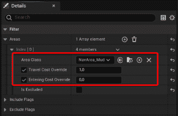

# 改进智能体导航

现在你已经对 Unreal Engine 路径查找系统的基本原理有了牢固的掌握，是时候深入挖掘并开始研究增强智能体导航系统复杂运作的方法了。

在本章中，你将了解如何改进你的导航网格生成和智能体移动：从动态生成的网格开始，经过查询环境，直到有效地避开其他智能体。

到本章结束时，你将掌握一些全新的技能，让你的关卡更加引人入胜和有趣。这些知识将成为引导你走向创建复杂游戏的基础构建块，最终提升你作为 AI 游戏程序员的技能。

在本章中，我们将涵盖以下主题：

+   运行时生成导航网格

+   使用查询过滤器影响导航

+   实现智能体避让

# 技术要求

要跟随本章中介绍的主题，你应该已经完成了前面的章节，并理解了它们的内容。

此外，如果你希望从本书的配套仓库中的代码开始，你可以下载本书配套项目仓库中提供的**.zip**项目文件，网址为[`github.com/PacktPublishing/Artificial-Intelligence-in-Unreal-Engine-5`](https://github.com/PacktPublishing/Artificial-Intelligence-in-Unreal-Engine-5)。

你可以通过点击**Unreal Agility Arena –** **第四章** **-** **结束**链接下载与上一章结尾对应的文件。

# 运行时生成导航网格

让我们继续我们在*第四章*中开始的短篇故事，*设置导航网格*：

*在秘密研究实验室中，一项突破性的实验正在进行。由马克斯博士和维克托利亚教授开发的 AI 木偶，准备开始一项任务：配备了先进的路径查找系统，木偶被巧妙地放置在实验室复杂的走廊和* *相连的房间* *网络中*。

*他们面对模拟的建筑工地、意外的障碍，甚至模拟的干扰，这些干扰阻碍了他们的路径。然而，凭借他们最先进的 AI 能力，木偶迅速适应了不断变化的情况，运用他们的独创性找到替代路线，并巧妙地穿过了* *实验室* *错综复杂的布局*。

如果你正在使用导航网格，那么你迟早会遇到移动的物体，这将导致智能体到达目标的路径发生变化。

这就是为什么静态导航网格生成将变得毫无用处；你需要某种类型的系统来在运行时更新导航网格。这就是为什么 Unreal Engine 提供了多种生成此类网格的方法。

如*第三章*中所述，*介绍虚幻引擎导航系统*，生成方法可以从**项目设置**或层级中的**Recast Nav Mesh**演员中更改；由于我们只需要更改此层级的导航网格生成，我们将选择第二个选项。

但首先，我们需要为我们的木偶代理创建一个可以行走的层级！

## 创建层级

要创建这个健身房，请按照以下步骤操作：

1.  从主菜单中选择**文件** | **新建层级**。

1.  导航到**Maps/LevelInstances**文件夹，并将**LI_Lighting**实例拖动到你的层级中；将其变换的**位置**值设置为**(0，** **0，0)**。

1.  导航到**Maps/PackedLevelActors**文件夹，并将**PLA_Lab_02**实例拖动到您的层级中；将其变换的**位置**值设置为**(0，** **0，0)**。

1.  在**Maps**文件夹中保存层级，并将其命名为**Gym_NavMesh_04**。

这个健身房有一个楼梯块和一个分离的平台，如图*图 5.1*所示：

图 5.1 – 健身房

现在，让我们添加导航网格以及代理和目标点：

1.  添加一个**导航网格边界体积**演员，并设置其边界，使其覆盖整个层级。

1.  在隔离平台的顶部添加**NS_Target** Niagara 系统。

1.  在蓝色瓦片上添加**BP_NavMeshAgent**蓝图，并将**目标演员**属性值设置为**NS_Target**。现在层级应该看起来如下：

图 5.2 – 带有导航网格的健身房

由于我们使用的是一个比上一章中展示的层级稍微复杂一些的层级，您可能会遇到与我的截图中描述的略有不同的网格生成；楼梯导航网格可能看起来与其它部分分离，或者您可能会遇到一些其他问题。*图 5.3*展示了您可能遇到的典型场景：

图 5.3 – 破坏的导航网格

要解决此类问题，您需要稍微调整**Recast Nav Mesh**演员的设置。例如，您可以尝试以下操作：

1.  将**默认单元格高度**属性值设置为**40.0**。

1.  将**代理半径**设置为**70.0**。

第一个值将使楼梯的可导航区域连接到整个层级，而第二个值将为网格的边缘添加一些额外的填充，以避免代理走得太近。只需稍微调整一下这些值，直到您得到满意的结果。

如果您现在测试层级，您会注意到代理会尝试到达目标点，但它会在分离平台的底部卡住；显然，没有通往目的地的路线，您的小代理可能无法到达那里，但它会尽力靠近。

现在，尝试在层级周围添加一些障碍物，迫使您的代理爬楼梯 – 就像*图 5.4*所示：

图 5.4 – 带有某些障碍的健身房

如果你测试关卡，智能体将在楼梯的第一步停下；这是由于这个可怜的家伙的步高太高了！为了解决这个问题，打开**BP_NavMeshAgent**蓝图，并在**详细信息**面板中查找**角色移动：行走**类别，并将**最大步高**值设置为**55.0**。

这将允许智能体采取更高的步幅并爬上楼梯。再次测试关卡，你应该看到智能体正在爬楼梯并在其边缘处停下。到达最终目的地的旅程似乎对我们这位小友友来说是一个相当大的挑战！

让我们通过添加一条通往孤立平台（目标点所在位置）的路径来帮助它。

## 添加移动平台

为了让我们的智能体到达目标点，我们将添加一个移动平台；这将允许我们创建一个动态生成的导航网格。

### 创建蓝图

要做到这一点，我们将从一个静态网格开始，并将其转换为蓝图：

1.  在**内容抽屉**中，打开**KayKit/ProtorypeBits/Models**文件夹，并将一个**Primitive_Cube_Primitive_Cube**实例拖动到关卡中。

1.  将其**位置**属性设置为**(380.0, 50.0, 60.0)**，以便连接楼梯和孤立黄色平台。

1.  将此演员的**移动性**设置为**可移动**。

1.  选择此演员后，通过点击**转换为** **蓝图**按钮将其转换为蓝图。

图 5.5 – 转换为蓝图按钮

1.  将蓝图保存在**蓝图**文件夹中，并命名为**BP_MovingPlatform**。

1.  通过双击资产来打开蓝图。

我们现在将添加一些代码逻辑，以便使其移动。

### 添加代码

在**BP_MovingPlatform**蓝图打开的情况下，开始执行以下步骤：

1.  创建一个新的**Vector**类型变量，并将其命名为**StartLocation**。

1.  创建一个新的**Float**类型变量，并将其命名为**VerticalOffset**。从**详细信息**面板，检查**实例** **可编辑**属性。

    这两个变量将分别存储平台初始位置和移动时覆盖的垂直距离。第二个变量也已被从关卡中设置为可编辑。

    现在，在**事件图**中，执行以下步骤：

1.  添加一个**Set Start Location**节点，并将其输入执行引脚连接到**Event Begin** **Play**节点的输出执行引脚。

1.  添加一个**Get Actor Location**节点，并将其**返回值**输出引脚连接到之前添加的设置节点中的**Start Location**输入引脚。

1.  从**Set Start Location**节点的输出执行引脚，添加一个**时间轴**节点，并双击它以开始编辑。

    这部分代码存储平台的初始位置并初始化一个时间轴来设置平台动画。到目前为止的代码在*图 5* *.6*中显示：

图 5.6 – 图表的第一部分

时间线将是一个简单的正弦曲线，它将控制平台的垂直偏移。要创建曲线，请执行以下步骤：

1.  点击**+ 轨道**按钮，从下拉菜单中选择**添加****浮点轨道**。

1.  将轨道命名为**Alpha**。

1.  将曲线的**长度**值设置为**15.00**。

1.  点击**循环**按钮使**时间线**无限重复。

1.  在曲线图中，通过右键单击并选择**添加关键点**选项添加三个关键点。分别将关键点的值设置为以下：

    +   **时间**设置为**0.0**，**值**设置为**0.0**。

    +   **时间**设置为**7.5**，**值**设置为**1.0**。

    +   **时间**设置为**15.0**，**值**设置为**0.0**。

1.  右键单击每个关键点，并将**关键点插值**值设置为**自动**；这将使曲线呈正弦波形而不是线性。结果曲线如图*5.7*所示：

图 5.7 – 时间线曲线

返回到**事件图**，你应该会注意到**时间线**节点现在有一个**Alpha**输出引脚；我们将使用它来控制平台的垂直位置。开始执行以下步骤：

1.  添加一个**获取垂直偏移**节点。

1.  添加一个**获取起始位置**节点；右键单击其输出引脚，并选择**拆分结构引脚**以暴露结构中的**X**、**Y**和**Z**引脚。

1.  添加一个**乘法**节点，并将其两个输入引脚连接到**垂直偏移**输出引脚和**时间线**的**Alpha**输出引脚。

1.  添加一个**添加**节点，并将其两个输入引脚连接到**乘法**节点的输出引脚和**获取起始位置**节点的**起始位置 Z**输出引脚。

1.  在图中添加一个**设置演员位置**节点，将其输入执行引脚连接到**时间线**节点的输出执行引脚，并执行以下操作：

    1.  右键单击**新位置**输入引脚，并选择**拆分结构引脚**以暴露结构中的**X**、**Y**和**Z**引脚。

    1.  将**新位置 X**输入引脚连接到**获取起始位置**节点的**起始位置 X**输出引脚。

    1.  将**新位置 Y**输入引脚连接到**获取起始位置**节点的**起始位置 Y**输出引脚。

    1.  将**新位置 Z**输入引脚连接到**添加**节点的输出引脚。此部分图表的结果如图*5.8*所示：

图 5.8 – 图表的第二部分

尽管代码相当长，但它相当直观；它只是简单地使用**时间线**节点来计算随时间变化的偏移量，并将其应用于平台的**Z**位置。在运行时，平台将不断上下移动，每 15 秒就会到达目标点一次——即循环的持续时间。

如果你现在模拟健身房 – 导航网格可见 – 会发生一些奇怪的事情；尽管平台会上下移动，但导航网格将保持最初生成的状态，留下一个漂浮的通道。

图 5.9 – 静态生成

这个问题发生是因为导航网格是静态生成的，在运行时不会改变；这个可怜的小家伙在试图到达目标点时会掉落，因为它相信存在一条通道！

让我们立即通过使导航网格动态化来解决这个问题。

## 使导航网格动态化

如本节开头所述，我们将只为这个级别设置网格运行时生成活动，因此我们需要更改**Recast 导航网格**演员。为此，选择**Recast 导航网格**演员，在**详细信息**面板中找到**运行时**类别。将**运行时生成**下拉值设置为**动态**。

如果你测试健身房，你现在将看到导航网格以固定间隔更新，通道将被中断。

图 5.10 – 动态生成

你可能会注意到代理会在楼梯平台的边缘停下来，当移动平台创建通道时不会继续前进。为了修复这个小问题，请执行以下操作：

1.  打开**BP_NavMeshAgent**并断开**事件** **BeginPlay**节点。

1.  将**移动到演员**的输入执行引脚连接到**事件** **Tick**节点的输出执行引脚。

1.  打开**类默认值**选项卡，将**Tick 间隔（秒）**属性设置为**0.5**，使更新更稀疏。更新后的蓝图如图 *5.11* 所示。

图 5.11 – 更新后的蓝图

我们在这里所做的是相当简单的；我们不是在游戏开始时一次性执行代码，而是将其设置为每帧执行一次 – 设置为半秒 – 以保持设置最终目的地。这可能不是最性能高效的解决方案，但应该适用于我们的小型原型。

注意

请记住，在运行时更新导航网格计算量很大；这意味着你应该只在必要时使用此功能，并且大多数时候坚持静态生成。

现在你已经掌握了创建动态导航网格，你的小代理在向目标点导航时将面临挑战。生活 – 或者更确切地说，人工生活 – 对它来说将不再那么简单了！

在下一节中，我将向您介绍导航过滤器，这是一个功能，将允许你改变代理在导航网格上的行为方式。

# 使用查询过滤器影响导航

如同在*第三章*中提到的，*展示虚幻引擎导航系统*，使用查询过滤器，你可以自定义调整 AI 代理的导航路径，使你能够增强和优化它们在环境中的移动。

你可能已经注意到，在之前创建的图中，**Move to Actor**方法有一个名为**Filter Class**的属性（见*图 5.11*）；这将允许我们自定义我们的代理在导航网格上的行为方式。

通过扩展**NavigationQueryFilter**类并设置一些适当的值来创建一个过滤器，因此让我们先创建这样一个类并看看它的工作方式。

## 创建级别

作为第一步，我们需要一个用于测试过滤器的健身房；在这种情况下，我们将复制一个现有的一个并稍作调整：

1.  复制**Gym_NavMesh_02**地图，将其重命名为**Gym_NavMesh_05**，然后打开它。

1.  从桥梁上移除所有障碍物（如果有）。

1.  复制代理并将其放在第一个代理旁边，在蓝色瓷砖上。

1.  为了使代理易于识别，你可能希望更改复制的材质；在我的情况下，我选择了**MI_Prototype_B**。最终级别应该像*图 5.12*中描述的那样：

图 5.12 – 基础健身房

如果你测试这个级别，不出所料，两个代理都会走向桥梁，穿越它，并到达目标点。

让我们稍微增加一些趣味性，怎么样？

## 创建查询过滤器类

我们现在将创建一个查询过滤器，将覆盖导航修改器的考虑方式；我们希望泥泞区域被视为成本较低且易于穿越，但仅针对单个代理。为此，请按照以下步骤操作：

1.  打开**内容抽屉**，在**蓝图**文件夹中创建一个新的**导航查询****过滤器**类型的蓝图类。

1.  将资产命名为**NavFilter_MudWalker**，双击它以打开它。

1.  在**细节**面板中，你会看到一个**区域**数组属性；点击**+**按钮添加一个元素。

1.  打开元素并执行以下操作：

    +   从**区域类**下拉菜单中选择**NavArea_Mud**。

    +   打开**旅行成本覆盖**复选框并将其值设置为**1.0**。

    +   打开**进入成本覆盖**复选框并将其值设置为**0.0**。

图 5.13 – 查询过滤器设置

我们基本上在创建我们级别泥泞区域的不同的成本 – 也就是说，**NavArea_Mud**修改器放置的地方。

我们现在需要稍微修改一下 AI 代理，以便它能够接受这种修改器。

## 修改代理

我们需要对代理进行一些轻微的修改，因此打开**BP_NavMeshAgent**蓝图类并执行以下操作：

1.  从**Move to Actor**节点，点击并拖动**Filter Class**输入引脚，并在释放后选择**提升**到**变量**。

1.  将新创建的变量命名为**FilterClass**，并在**细节**面板中检查相应的属性使其**可实例编辑**。

1.  编译**蓝图**，并在**细节**面板中再次确认**默认值**设置为**无**。

无论何时你告诉智能体移动到目标点，它都会使用**FilterClass**变量——如果设置为任何值——来覆盖寻路网格成本规则。

让我们在实际操作中测试一下。打开你的健身房，选择第二个智能体；然后，从**详细信息**面板中，从**过滤器类别**下拉菜单中选择**NavFilter_MudWalker**。

测试健身房，你现在会注意到第二个智能体直接移动到目标点，穿过泥地。这个顽皮的 AI 智能体已经叛变，决定玩弄手段，不是吗？

在本节中，你发现了覆盖寻路网格成本的能力，这为你创建高度可定制的 AI 角色提供了显著的力量。有了这项新能力，你可以让你的 AI 角色表现出独特的个性，并从人群中脱颖而出。我相当确信你会理解这为创建独特和动态的游戏体验开辟了一个全新的世界。

在下一节中，我将向你展示 AI 寻路中的另一个重要技术，那就是如何让你的 AI 智能体避免彼此。

# 实现智能体避免

毫不奇怪，大多数时候，你将在一个关卡中与多个智能体一起工作，这意味着他们很可能会有交叉的寻路规则；这意味着你的 AI 实体有很大的风险相互碰撞。虽然这可能很有趣，但我猜这并不是你在游戏中的预期行为。

正因如此，Unreal Engine 提供了一个开箱即用的——但默认情况下是禁用的——避免系统。在本节中，我们将考虑如何让 AI 智能体避免彼此。

和往常一样，我们将从一个全新的健身房开始。

## 创建关卡

作为第一步，我们需要一个带有一些障碍物的健身房。为了开始，请执行以下操作：

1.  从主菜单中选择**文件** | **新建关卡**。

1.  导航到**Maps/LevelInstances**文件夹，并将**LI_Lighting**实例拖动到你的关卡中；将其变换的**位置**值设置为**(0, 0, 0)**。

1.  导航到**Maps/PackedLevelActors**文件夹，并将**PLA_Lab_05**实例拖动到你的关卡中；将其变换的**位置**值设置为**(0, 0, 0)**。

1.  在**Maps**文件夹中保存关卡，并将其命名为**Gym_NavMesh_06**。

这个健身房比之前的要大一些，并有一些障碍物使事情更有趣。此外，还有八个蓝色方块——我们将使用八个智能体——如*图 5.14*所示：

图 5.14 – 健身房

## 添加智能体

如前所述，我们将添加几个智能体——总共八个——以检查它们在拥挤环境中的行为。因此，请按照以下步骤操作：

1.  在关卡中添加八个**BP_NavMeshAgent**蓝图实例，并将每个实例放入关卡中的一个蓝色方块中。

1.  添加八个**NS_Target** Niagara 系统实例，并将它们放在每个蓝色方块后面。

1.  对于每个代理，将**目标演员**属性值设置为位于健身房另一侧的**NS_Target** Niagara 系统。现在关卡应该看起来像*图 5.15*：

图 5.15 – 完成的健身房

如果你尝试测试健身房，很可能会发现一些代理会与图中*5.16*所示的反方向移动的其他代理相撞：

图 5.16 – 哎呀，这很疼！

幸运的是，我们的代理配备了安全头盔，而你的游戏中的角色可能没有任何保护地四处游荡！这就是为什么我们要使代理的路径寻找稍微聪明一点。

## 激活避障

一旦你打开了**BP_NavMeshAgent**蓝图，你就可以启用避障系统。为此，请按照以下步骤操作：

1.  在**详细信息**面板中，找到**角色移动：避障**类别，并检查**使用** **RVOAvoidance**属性。

1.  将**避障考虑半径**设置为**2000.0**。

如*第三章*所述，*介绍虚幻引擎导航系统*，RVO 指的是一个功能，它使 AI 代理能够避免相互碰撞。

当为角色或代理启用**使用 RVOAvoidance**属性时，它允许它们动态调整其移动以避免与环境中的其他代理发生碰撞。**避障考虑半径**属性用于定义代理考虑其他代理进行避障的半径。

在此测试健身房将让你看到避障系统在工作；代理会在到达目标点的同时避免彼此。

## 测试最坏情况

让我们测试一些不同的事情；我们将创建一个对代理来说空间更具挑战性的健身房。新的健身房将是上一个的副本。首先按照以下步骤操作：

1.  复制**Gym_NavMesh_06**地图，并将其命名为**Gym_NavMesh_07**。

1.  添加一些障碍物，将创造一个狭窄的路径，几乎迫使角色遵循单一、特定的路线。我的健身房在*图 5.17*中显示：

图 5.17 – 最坏情况

测试游戏，你会看到所有代理都在努力避免相互碰撞。你可以进行反测试，取消选中**使用 RVOAvoidance**属性；你会注意到所有代理最初聚集在一起，然后相互碰撞，最终解决路径并到达各自的目标点。

图 5.18 – 大规模碰撞

在本节中，你学习了如何为在导航网格上移动的代理实现避障，确保它们可以在积极避免与其他代理碰撞的同时成功导航。

# 摘要

在本章中，我们介绍了虚幻引擎寻路系统的一些更高级的功能。首先，我们看到了如何创建一个可以在运行时更新的导航网格。接下来，我们看到了如何覆盖代理解释导航网格部分成本的方式。最后，我们看到了如何使用内置的避障系统，以便 AI 代理不会相互碰撞。

在即将到来的章节中，我们将探讨寻路系统的最后一个组成部分：调试和优化技术。我们将探讨如何识别和解决可能出现的任何问题，并优化系统以提高性能。准备好迎接一个既激动人心又富有信息量的会议吧！
