# 6

# 优化导航系统

随着项目的复杂性增加，确保导航网格精细调整以实现平滑高效的 AI 代理移动变得至关重要。这就是为什么在本章中，我们将深入探讨优化和调试导航系统。

在本章中，我们将探讨各种技术和策略来优化导航网格，并讨论简化路径查找计算、减少计算开销和提升整体性能的方法。

你还将获得调试导航系统内可能出现的任何问题的工具和知识。从解决路径查找错误到识别导航网格的不一致性，我们将涵盖一系列调试技术，帮助你克服任何阻碍代理平滑导航的障碍。

在本章中，我们将涵盖以下主题：

+   理解导航网格调试工具

+   分析导航网格分辨率

+   精炼导航网格生成

+   进一步改进

# 技术要求

要跟随本章介绍的主题，你应该已经完成了前面的章节，并理解了它们的内容。

此外，如果你希望从本书的配套仓库开始，你可以下载本书配套项目仓库中提供的**.zip**项目文件，网址为[`github.com/PacktPublishing/Artificial-Intelligence-in-Unreal-Engine-5`](https://github.com/PacktPublishing/Artificial-Intelligence-in-Unreal-Engine-5)。

要下载最后一章末尾的文件，请点击**虚幻敏捷竞技场 – 第五章 – 末尾**链接。

# 理解导航网格调试工具

*驱使他不懈追求完美的动力，马克斯博士深入调试和改进人工智能木偶的任务。凭借不懈的精神和充满创新思想的头脑，他着手微调木偶的能力，并解决他们在实验中遇到的任何故障或不足。*

*在他的忠实助手，维多利亚教授的陪伴下，马克斯博士仔细分析了来自木偶之前探险收集的数据，审查每一行代码，寻找任何潜在的错误，并寻求提升他们表现的机会。*

作为游戏程序员，你知道优化游戏中的代码和追踪错误对于创建成功的游戏至关重要。AI 系统也不例外。幸运的是，虚幻引擎提供了一套功能 – **调试工具**，这些工具为你提供了宝贵的洞察力，让你能够实时可视化并分析导航网格。在本节中，我们将开始探索这些工具，以检查系统的行为以及它是否运行良好。

注意

在本章中，我们将考虑调试工具的一部分，这将让你分析导航网格系统，但你应该知道 AI 调试系统覆盖了 Unreal Engine 中所有可用的 AI 功能。这就是为什么我会在本书的后面部分回到调试工具，当我将涵盖其他 AI 主题时。

让我们首先检查如何启用 AI 调试工具以及如何开始使用导航网格调试功能。

## 启用 AI 调试工具

要启用调试工具，你只需要按下键盘上的撇号键（*‘*）。请注意，在某些键盘布局中——比如我的——这个键可能不可用；你可以通过以下步骤添加自己的快捷键：

1.  从主菜单中选择**编辑** | **编辑器首选项**。

1.  选择**通用 – 键盘快捷键**类别，并在搜索栏中输入**show** **ai debug**。

1.  在**显示 AI 调试**字段中，插入你喜欢的快捷键。在我的情况下，我选择了数字键盘上的**/**字符。

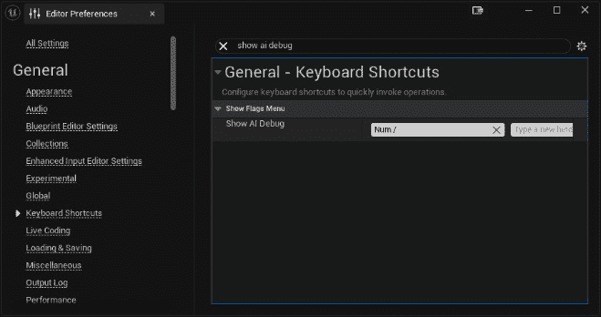

图 6.1 – AI 调试器快捷键

1.  启用 AI 调试工具后，你可以使用以下数字键盘键来切换 AI 信息：

    +   *数字键盘 0*：显示或隐藏当前可用的导航网格数据信息

    +   *数字键盘 1*：显示或隐藏一般 AI 调试信息

    +   *数字键盘 2*：显示或隐藏行为树调试信息

    +   *数字键盘 3*：显示或隐藏 EQS 调试信息

    +   *数字键盘 4*：显示或隐藏 AI 感知调试信息

    +   *数字键盘 5*：显示或隐藏 AI 感知系统调试信息

让我们开始检查这些工具，使用我们在前几章中创建的健身房级别。

## 检查 AI 调试工具

要开始使用 AI 调试工具，你需要一个级别。所以，首先打开**Gym_NavMesh_01**级别并执行以下操作：

1.  通过按下*P*键禁用导航网格可视化工具——如果已启用——以避免混乱 AI 信息显示。

1.  启动级别模拟并立即暂停。

1.  通过按下撇号键启用 AI 调试工具；这将打开一个侧边栏，你将看到一些显示消息，如图*图 6.2*所示：

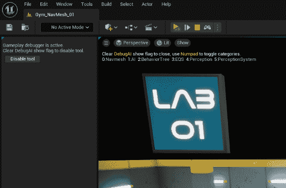

图 6.2 – AI 调试工具在实际应用中

1.  启用调试工具后，请确保**导航网格**和**AI**类别已启用，并且所有其他类别都禁用，使用相应的数字键盘键。启用的类别将以绿色突出显示，如图*图 6.3*所示：

图 6.3 – 启用类别

游戏暂停状态下，请执行以下操作：

1.  查找**BP_NavMeshAgent**，你会注意到它现在有一个红色图标与之关联。

1.  点击演员以选择它；这将显示一些关于它的信息。其中最重要的是相关的 AI 控制器。

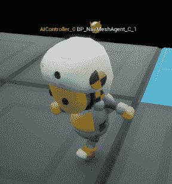

图 6.4 – 人工智能代理

此外，在显示中，你将看到有关人工智能代理的附加信息，如图*图 6.5*所示：

图 6.5 – 人工智能代理信息

如您从图中所见，这种显示提供了大量信息，包括控制者、控制器和代理正在行走的网格。

最后，你可能会得到关于导航网格和寻路系统最有趣的信息之一；如果你在关卡中移动，你会看到组成通往目标点的路径的多边形的突出显示。

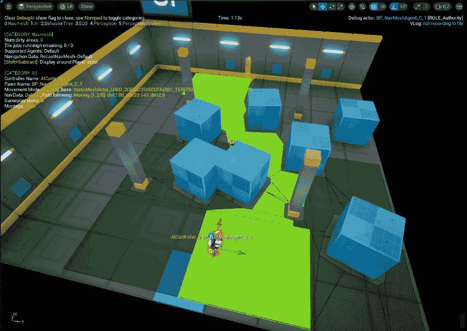

图 6.6 – 寻路多边形

作为额外的练习，你可以打开所有其他关卡，看看你可以从工具中获得哪些信息。例如，你可以查看**Gym_NavMesh_04**关卡，并检查当移动平台上下移动时会发生什么。

在本节中，你已经了解了将提供有关人工智能系统有意义信息的工具；在下一节中，我将向你展示如何从你的关卡中提取关于导航网格生成的见解，以便优化它们。

# 分析导航网格分辨率

Unreal Engine 提供了一个**导航网格分辨率**系统，允许开发者在单个导航网格内创建三个不同细节级别的网格瓦片。这意味着你可以生成具有高、中（默认选项）或低精度设置的瓦片集。通过选择不同的精度级别，用户可以在游戏进行时实现动态导航网格的更快生成（从计算时间来看）。

注意

当我们谈论**分辨率**时，我们指的是为了绘制特定导航区域而产生的单元格的精度和数量。

高分辨率瓦片可能会将给定区域划分为更多的多边形，以更精确地近似其形状。相反，低分辨率瓦片将包含相同区域，但多边形数量较少。这种权衡使得瓦片生成更快，但可能会在过程中牺牲一些精度。

作为第一次测试，我们可以开始分析我们的一个健身房：

1.  打开**Gym_NavMesh_01**关卡。

1.  为了更好地查看关卡，选择**俯视图**。

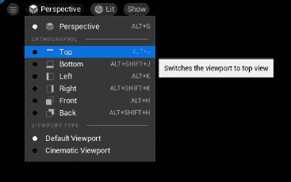

图 6.7 – 选择俯视图

1.  在**大纲**中，选择**重铸导航****网格**演员。

    要获取关于你的导航网格成本的总体信息，请执行以下操作：

1.  在仍然选择**重铸导航网格**演员的情况下，检查**细节**面板中的**绘制瓦片边界**属性。

1.  检查**绘制瓦片边界次数**属性。你应该得到如图*图 6.8*所示的视图：

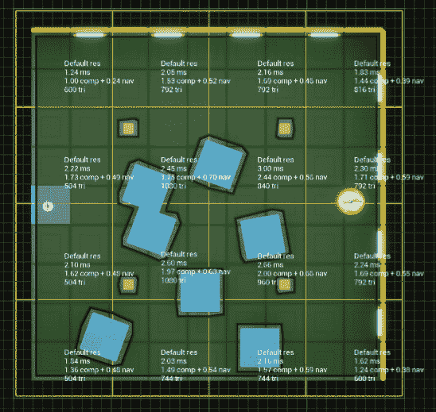

图 6.8 – 瓦片和瓦片生成时间

**绘制瓦片边界时间** 属性显示了处理特定瓦片的时间成本；您会发现更复杂的区域需要更多时间来计算。如果您想要更直观的成本表示，可以检查 **绘制瓦片构建时间热图**，这将启用成本的热图可视化，如图 *图 6.9* 所示：

图 6.9 – 热图可视化

注意

如果你对这个功能不熟悉，热图是一种使用颜色编码系统来显示特定属性在定义区域或数据集中体积或强度的视觉表示。热图具有适应性，并在多种场景中得到应用，包括数据分析、用户行为分析和地理表示。在我们的场景中，通过将颜色与不同级别的强度相关联——蓝色代表成本较低的区域，较浅的颜色代表成本较高的区域——热图可以照亮成本增加或减少的区域，使观察者能够识别模式和关键情况。

这种视图在处理大型区域并希望获得资源密集型区域概览时特别有用。在前面的图中，红色区域是导航成本较高的区域。

在本节中，您已经掌握了分析导航网格以识别潜在问题的过程；在下一节中，我们将探讨解决和改进其生成的策略。

# 精细化导航网格生成

环境的复杂性直接影响系统生成导航网格所需的时间，这不足为奇。相反，如果生成时间较短，生成的导航网格可能不够精确。在大多数情况下，您的最终系统将涉及计算速度和精度之间的权衡。这意味着作为游戏开发者，了解如何正确设置您的导航网格生成是强制性的。

在本节中，我将为您提供一些关于如何优化导航网格生成方式的建议。

## 影响导航网格分辨率

下一个测试我们将执行的是修改导航网格的分辨率。首先按照以下步骤操作：

1.  打开 **Gym_NavMesh_02** 级别。

1.  如果它尚未启用，选择 **顶视图**。

1.  在 **大纲** 面板中，选择 **Recast Nav** **Mesh** 对象。

1.  在 **细节** 面板中，检查以下属性：

    +   **绘制** **瓦片边界**

    +   **绘制瓦片** **构建时间**

    +   **绘制瓦片构建时间** **热图**

    您应该得到类似于 *图 6.10* 的视图：

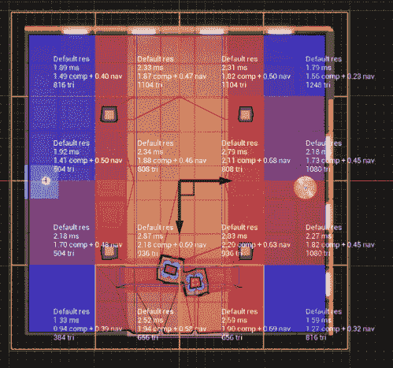

图 6.10 – 热图可视化

如您从热图中所见，中心部分成本较高。然而，整体几何形状相当简单；我们有泥泞区域和一座桥，它们基本上是矩形、未旋转的区域。让我们降低我们的网格成本。开始执行以下步骤：

1.  在**大纲**面板中，选择三个**导航修改体积** – 两个泥泞区域和桥梁区域。

1.  在**详细**面板中，搜索**导航网格分辨率**属性，并在下拉菜单中选择**低**。

    你会注意到地图中央部分的时间成本会立即下降，如图*图 6.11*所示：

图 6.11 – 改进的导航网格

当你查看热图可视化时，你可能会看到一些未被前一次修改触及的瓦片 – 那些在边缘的瓦片 – 改变颜色并显得更昂贵。然而，不要被这个现象迷惑 – 系统只是突出显示在整体导航网格中成本更高的区域。实际上，如果你检查这些区域，你会发现成本根本没有改变；它们只是比中央地图的对应区域更昂贵。这意味着特定区域的成本相对于系统分析的所有其他区域是相对的。

作为另一个实验，你可以将桥梁的**导航网格修改器**演员设置为**导航网格分辨率**值为**高**，看看结果。剧透一下！包括桥梁在内的瓦片将成为级别中最昂贵的部分！

## 改变导航网格分辨率

如果在这个时候，你还在想是否可以调整你级别的导航网格分辨率，答案是出人意料的肯定！

通过选择**重铸导航网格**演员，在**详细**面板中，你会找到一个**导航网格分辨率参数**选项，有三个字段 – **低**，**默认**和**高** – 这将让你决定你级别的单元格大小。

图 6.12 – 导航网格分辨率参数

作为一条经验法则，只需记住，单元格大小越高，区域成本越低。

## 改变瓦片大小

你已经知道导航网格被划分为瓦片，这些瓦片用于重建导航网格的特定部分。由于每个瓦片由单元格组成，重建瓦片意味着用更新的信息重新创建所有单元格。

较大的瓦片包含更多的单元格，因此重建成本比较小的瓦片更高。然而，在处理瓦片时，系统也会处理瓦片边缘的相邻单元格。在确定瓦片大小时，考虑这种额外的开销成本是很重要的。在某些情况下，处理多个较小瓦片的累积开销成本可能会超过重建单个大型瓦片的成本。因此，在选择合适的瓦片大小时，应仔细考虑以优化性能。

为了在运行时重建瓦片时实现最佳性能，Epic Games 的建议是将每个**单元格大小**属性（**低**、**默认**和**高**）设置为彼此的倍数，并将**Tile size UU**属性设置为可以除以所有**单元格大小**值的数值。例如，在*图 6.13*中，我为**Gym_NavMesh_02**关卡设置了以下值：

+   **Tile Size UU**为**960.0**

+   **低单元格大小**为**60.0**

+   **默认单元格大小**为**30.0**

+   **高单元格大小**为**15.0**

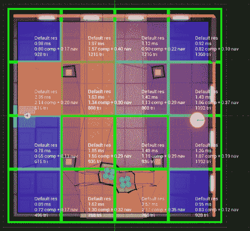

图 6.13 – 单元格大小示例

如你所见，**低单元格大小**值可以除以**默认单元格大小**和**高单元格大小**，得到一个整数值。同样，对于**Tile Size UU**，它可以除以**低单元格大小**、**默认单元格大小**和**高单元格大小**。

作为额外的示例，*图 6.14*显示了具有这些值的相同关卡：

+   **Tile Size UU**为**1280.0**

+   **低单元格大小**为**80.0**

+   **默认单元格大小**为**40.0**

+   **高单元格大小**为**20.0**

图 6.14 – 单元格大小替代示例

在第二个示例中，使用了更大的瓦片大小。然而，很明显，优化并不那么有效，导致空间利用效率低下。

在本节中，我向你提供了一些关于如何分析你的导航网格生成以及如何通过更改单元格分辨率和瓦片大小来有效优化的宝贵建议。在下一节中，我将提供一些额外的建议，帮助你使导航更加出色。

# 进一步改进

调整导航网格可能需要很长时间——这取决于你想要达到的目标——有时，这更多是试错和个人经验的问题。在本节中，我将为你提供一些额外的建议，帮助你改进地图，使其更加实用。

## 调整分辨率

选择合适的导航网格分辨率不仅是一个计算性能的问题；有时它甚至可能影响你的智能体导航。

例如，考虑一下*图 6.15*显示的**Gym_NavMesh_07**关卡的一部分：

图 6.15 – 导航网格分辨率

在这种情况下，**默认单元格大小**值已设置为**20.0**，如你所见，障碍物之间没有可通行区域。然而，如果你将值降低到**5.0**，你将得到一个完全不同的场景，如*图 6.16*所示：

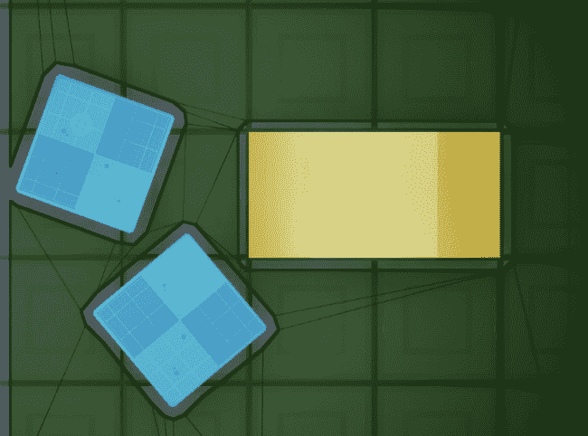

图 6.16 – 改进的导航网格分辨率

如你清晰可见，障碍物之间现在有了开放通道；硬币越高，酒越精致！

## 禁用网格影响

有时，你的导航网格可能会因为可能导致无法到达路径的网格而变得杂乱，但它们被包含在导航网格生成过程中。在这种情况下，建议隐藏它们以防止它们影响生成时间。例如，考虑**图 6.17**中描述的情况：

图 6.17 – 无法到达的路径

如你所见，红色矩形区域是无法到达的，但中央的立方体在导航网格生成过程中将被计算。这意味着，尽管它不会影响任何路径查找解决方案，但它仍然必须被计算。在这种情况下，你可以通过完成以下步骤来排除它：

1.  选择网格。

1.  在**详细信息**面板中，查找**始终影响导航**属性并取消选中复选框。

    网格现在将不会被排除在导航网格生成之外，但整体结果将保持不变，正如你从**图 6.18**中可以看到：

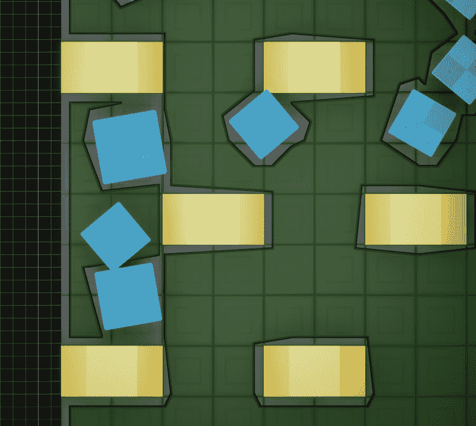

图 6.18 – 改进后的区域

你可以通过以下方式更进一步：

1.  选择其他两个框，并取消选中两个的**始终影响导航**属性。

1.  添加一个导航修改器体积演员，并将其缩放以包含整个区域。

1.  将体积**区域类**属性设置为**NavArea_Null**。

**图 6.19**显示了最终结果：

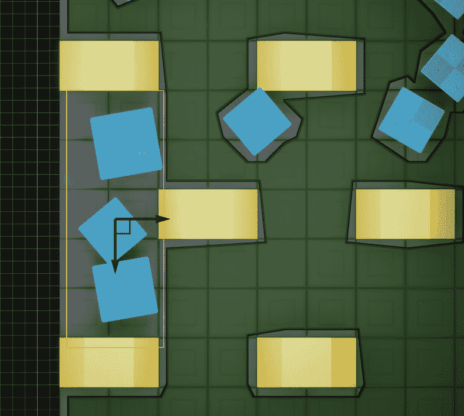

图 6.19 – 优化后的区域

如你所见，我们现在使用单个修改器来避免三个网格对最终导航网格生成的影响。想象一下，一旦你的关卡充满了各种道具和障碍物，你将节省多少时间！

# 摘要

在本章中，我们介绍了一些更高级的技术来帮助你改进导航网格生成。从调试工具开始，我们学习了如何分析和调整网格生成过程。最后，我们学习了几个技巧，这将帮助我们制作更有效的关卡。

有了这个，本书的**第二部分**到此结束；从下一章开始，准备好面对在游戏开发中讨论 AI 时可能最有趣的话题之一：行为树。

准备好。你的 AI 伙伴即将进行一次重大更新，它们将永远不再相同！

# 第三部分：决策制作

在本书的第三部分，你将全面了解 Unreal Engine 框架内强大且通用的行为树系统。此外，你还将了解高级功能，以便你可以实现自己的复杂游戏 AI 逻辑。

本部分包括以下章节：

+   *第七章* ，“介绍行为树”

+   *第八章* ，“设置行为树”

+   *第九章* ，“扩展行为树”

+   *第十章* ，*通过感知系统改进智能体*

+   *第十一章* ，*理解环境查询系统*
