# 8

# 设置行为树

正确设置行为树对于在您的游戏中开发有效的 AI 系统至关重要。正如您在前一章所看到的，行为树作为定义 AI 角色逻辑和决策过程的有力工具，允许开发者以结构化和可管理的方式创建复杂的行为。本章将提供关于行为树实现的基本原理及其在虚幻引擎中内部工作的宝贵见解。

在本章中，我们将涵盖以下主题：

+   扩展 Unreal Agility Arena

+   创建行为树

+   实现行为树任务和服务

+   在代理上设置行为树

# 技术要求

要跟随本章内容，您需要使用本书配套仓库中提供的起始内容，该仓库位于[`github.com/PacktPublishing/Artificial-Intelligence-in-Unreal-Engine-5`](https://github.com/PacktPublishing/Artificial-Intelligence-in-Unreal-Engine-5) 。通过此链接，找到本章的相应部分并下载**Unreal Agility Arena – 起始内容**ZIP 文件。

如果您在阅读本章的过程中迷路了，在仓库中，您还可以找到最新的项目文件，位于**Unreal Agility Arena –** **第** **08** **章** **结束**。

此外，为了完全理解本章内容，您需要具备一些关于蓝图视觉脚本和 C++的基本知识；作为额外建议，您可能想浏览一下*附录 A*，*在虚幻引擎中理解 C++*，以获得对虚幻引擎中 C++语法的温和介绍（或复习）。

# 扩展 Unreal Agility Arena

要开始，让我们继续探索我们在*第四章*中介绍的短篇小说，*设置导航网格*：

*随着马克斯博士和他的忠实助手维多利亚教授继续完善他们的 AI 木偶，他们遇到了一个有趣的挑战：木偶电池的有限电源供应。似乎先进的 AI 技术以惊人的速度消耗能量，导致木偶意外地关闭了电源。*

*尽管遭遇了这次挫折，马克斯博士看到了将这一限制转化为木偶行为独特方面的机会。他提出理论，认为当木偶的互动由日益减少的电池寿命提供动力时，将模仿人类的疲劳和疲惫。马克斯博士和维多利亚教授充满热情地制定了一个计划，围绕木偶有限的*电源供应*开展一系列新的实验。*

在上一章学习了所有这些信息之后，现在是时候深入其中，开始制作您自己的 AI 代理，配备完整功能的行为树。为了保持简单和整洁，我将从一个全新的项目开始，但您也可以自由地继续开发之前章节中开始的工作。

首先，我将给你一些简要信息，告诉你将要创建的内容。

## 更新项目摘要

作为起点，你需要创建一个新的傀儡角色（前几章的傀儡功能过于有限），它需要实现一些基本逻辑。这将使我们能够在创建更高级的角色时扩展其基本功能。

主要要求如下：

+   AI 代理将使用 C++实现

+   它将具有两种不同的移动速度——步行和跑步

+   它将配备一个电池系统，在行走时会消耗能量，在静止时充电

+   它需要由一个自定义的**AIController**类来控制，该类将使用行为树

一旦角色创建完成，我们就可以开始创建新的健身房级别，以创建和测试新的 AI 代理行为。所以，让我们先创建项目。

## 创建项目

项目创建过程基本上与我们之前在*第四章*中介绍的过程相同，*设置导航网格*，所以我就不多详细介绍了；我们将做出的区别（这当然不是微不足道的）是包含 C++类。

幸运的是，这将是一个无缝的过渡，因为当你第一次创建新的 C++类时，虚幻引擎会为你设置整个系统。一旦生成了 C++项目文件，你应该能在你的**内容浏览器**窗口中看到**C++类**文件夹，以及**内容**文件夹。

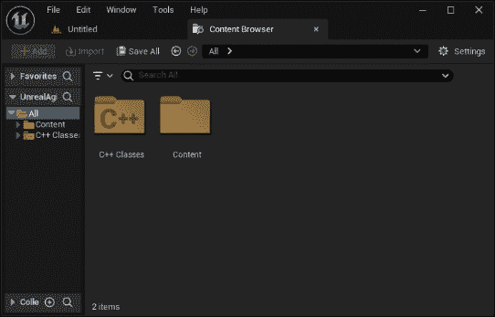

图 8.1 – C++文件夹

注意

如果你的**内容浏览器**窗口中没有出现**C++类**文件夹，你可能需要打开**设置**窗口并勾选**显示 C++类**选项，如图*图 8* *.2* 所示。

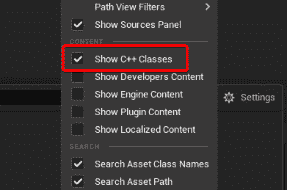

图 8.2 – 启用 C++文件夹

让我们开始创建角色类。

## 创建角色

我们将要做的第一件事是为我们预期的 AI 傀儡创建基础角色类。为此，请按照以下步骤操作：

1.  从虚幻引擎编辑器的主菜单中，选择**工具** | **新建** **C++类** 。

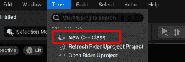

图 8.3 – 创建 C++类

1.  从**添加 C++类**弹出窗口，选择**角色**选项并点击**下一步** 。

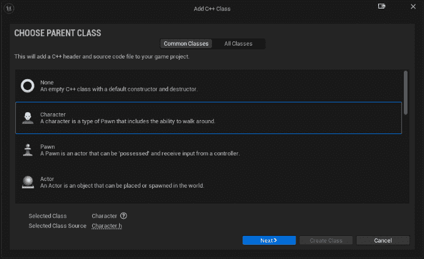

图 8.4 – 类选择

1.  在以下窗口中，将**BaseDummyCharacter**输入到**名称**字段，其余保持不变。

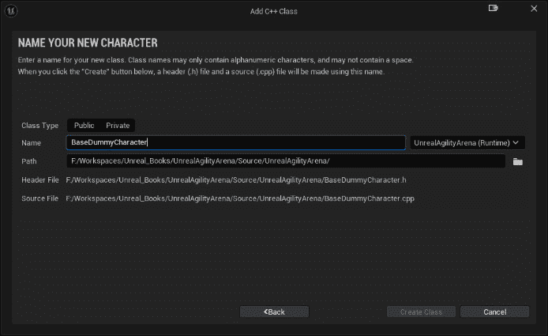

图 8.5 – 类创建

1.  点击**创建类**按钮开始类创建过程。

由于这是你创建的第一个类，虚幻引擎将开始生成 C++项目；之后，你的 IDE——很可能是 Visual Studio 或 Rider——将打开，你将能够开始开发你的类。

## 处理电池状态

在实现角色之前，我们需要定义如何跟踪其电池状态；这就是为什么我们将创建一个简单的枚举类来列出电池的充电量。为此，请按照以下步骤操作：

1.  在你的 IDE 中，定位到**UnrealAgilityArena/Source/UnrealAgilityArena**文件夹。

1.  在这个文件夹中，创建一个新的文本文件，并将其命名为**BatteryStatus.h**。

1.  打开文件进行编辑。

在文件中添加以下代码：

```py
#pragma once
UENUM(BlueprintType)
enum class EBatteryStatus : uint8
{
    EBS_Empty = 0 UMETA(DisplayName = "Empty"),
    EBS_Low = 1 UMETA(DisplayName = "Low"),
    EBS_Medium = 2 UMETA(DisplayName = "Medium"),
    EBS_Full = 3 UMETA(DisplayName = "Full")
};
```

我猜你已经熟悉枚举的作用，但在这里简要解释是必要的；我们正在定义一个**enum**类，在虚幻引擎中需要是**uint8**类型，并列出四个电池充电级别——**Empty**（空）、**Low**（低）、**Medium**（中）和**Full**（满）。**UENUM()**宏为虚幻引擎框架定义了一个**enum**类，**BlueprintType**指定器将使其对蓝图系统可用，使其可用于变量。**DisplayName**元数据定义了在蓝图系统中如何显示值；如果你愿意，可以在这里使用自己的约定。

最后，注意名称定义中的*E*前缀；这是虚幻引擎中**枚举**类型的命名约定，是强制性的。

在定义了电池状态后，我们就可以开始实现虚拟角色了。

## 实现角色

要开始实现 AI 代理，打开**BaseDummyCharacter.h**文件——即代理类的头文件——并开始添加类定义。

作为第一步，在文件顶部添加电池状态定义，那里设置了所有的**#include**定义：

```py
#include "BatteryStatus.h"
```

注意

你将要添加的所有**#include**声明都需要放在**.generated.h**定义之前——在本例中是**BaseDummyCharacter.generated.h**。**.generated.h**定义始终需要在声明列表的末尾；这个约定确保所有必要的依赖项在编译时都得到正确设置。

### 声明属性

第二步是添加所有将在扩展蓝图类中公开的属性。要做到这一点，在文件的**public**部分添加以下声明：

```py
UPROPERTY(EditAnywhere, BlueprintReadWrite, Category = "Dummy Character")
float MaxBatteryLevel = 100.f;
UPROPERTY(EditAnywhere, BlueprintReadWrite, Category = "Dummy Character")
float BatteryCostPerTick = 5.f;
UPROPERTY(EditAnywhere, BlueprintReadWrite, Category = "Dummy Character")
float BatteryRechargePerTick = 1.f;
UPROPERTY(EditAnywhere, BlueprintReadWrite, Category = "Dummy Character")
float RunSpeed = 650.f;
UPROPERTY(EditAnywhere, BlueprintReadWrite, Category = "Dummy Character")
float WalkSpeed = 500.f;
UPROPERTY(EditAnywhere, BlueprintReadWrite, Category = "Dummy Character")
float MovementRandomDeviation = 5.f;
```

在这里，我们声明了一系列变量来处理代理：

+   **MaxBatteryLevel**：表示代理电池可以达到的最大值

+   **BatteryCostPerTick**：表示代理在移动时消耗的电池电量

+   **BatteryRechargePerTick**：表示当代理休息时恢复的电池电量

+   **RunSpeed**：表示跑步时可以达到的最大速度

+   **WalkSpeed**：表示行走时可以达到的最大速度

+   **MovementRandomDeviation**：一个将被随机添加或减去以使移动节奏更不可预测的值

**UPROPERTY()**宏用于声明具有附加功能和元数据的类属性。它允许轻松集成到虚幻引擎编辑器中，提供了一个可视化界面来修改和配置这些属性。**EditAnywhere**属性指定符表示可以从虚幻引擎编辑器的属性窗口中编辑该属性，而**BlueprintReadWrite**指定符表示该属性将以读/写模式从扩展的蓝图类中访问。最后，我们希望所有属性都在同一个类别中——即**Dummy Character**——这就是为什么我们设置了**Category**属性指定符。

我们只需要一个额外的变量，但这个变量不需要是公共的，因为它将用于角色的内部逻辑。在**受保护**部分，让我们添加以下声明：

```py
UPROPERTY()
float BatteryLevel;
```

这个一目了然的属性将用于跟踪代理的实际电池级别。

### 添加委托

现在我们需要创建一个用于电池状态更改通知的事件分发器；在 C++中，最好的方法是使用**委托**。

注意

如果你不太熟悉委托，我的建议是查看本书末尾的附录 A，*Understanding C++ in Unreal Engine*。

定位到**公共**部分，并添加以下代码片段：

```py
DECLARE_DYNAMIC_MULTICAST_DELEGATE_OneParam(FOnBatteryStatusChanged, EBatteryStatus, NewBatteryStatus);
UPROPERTY(BlueprintAssignable, Category = "Dummy Character")
FOnBatteryStatusChanged OnBatteryStatusChanged;
```

我们已经声明了一个带有单个参数的动态多播委托——电池的新状态——每次电池改变充电级别时都会分发。

### 声明函数

我们需要在头文件中添加的最后一件事情是函数声明。作为第一步，删除文件末尾的以下代码行：

```py
virtual void SetupPlayerInputComponent(class UInputComponent* PlayerInputComponent) override;
```

这个角色将由 AI 控制，所以我们不需要设置玩家输入。接下来，在**Tick()**声明之后，添加以下代码行：

```py
UFUNCTION(BlueprintCallable, Category="Dummy Character")
void SetWalkSpeed();
UFUNCTION(BlueprintCallable, Category="Dummy Character")
void SetRunSpeed();
UFUNCTION(BlueprintCallable, BlueprintGetter, Category="Dummy Character")
EBatteryStatus GetBatteryStatus() const;
```

我们刚刚声明了两个函数——**SetWalkSpeed()**和**SetRunSpeed()**——这将允许我们在运行时更改角色速度。此外，我们还添加了一个用于代理电池状态的获取器函数。

在虚幻引擎中，**UFUNCTION()**宏用于声明由虚幻引擎反射系统识别的函数；这意味着函数在虚幻引擎框架内变得可访问和可用。所有三个函数都添加了**BlueprintCallable**指定符，这意味着这些函数将在蓝图图中可访问。此外，**GetBatteryStatus()**函数添加了**const**关键字；这将移除相应的蓝图节点中的执行引脚，因为我们只需要这个函数作为一个获取器，在执行过程中不改变任何数据。

### 实现函数

现在所有类声明都已经完成，我们可以开始实现函数。要做到这一点，你需要做的第一件事是打开**BaseDummyCharacter.cpp**文件。

您首先需要做的是移除**SetPlayerInputComponent()**函数，因为头文件中的相应声明之前已被移除。

接下来，我们需要在文件的非常开始处添加**#include**声明。只需添加以下三行代码：

```py
#include "Components/CapsuleComponent.h"
#include "Components/SkeletalMeshComponent.h"
#include "GameFramework/CharacterMovementComponent.h"
#include "BatteryStatus.h"
```

和往常一样，记得在**.generated.h**声明之前添加这些**#include**声明。

接下来，定位到**ABaseDummyCharacter()**构造函数，因为我们需要设置一些角色属性和组件。这个函数应该已经有一行代码将**bCanEverTick**属性设置为**true**。在其后添加以下代码行：

```py
PrimaryActorTick.TickInterval = .25f;
```

由于我们将使用**Tick()**事件仅用于更新电池状态，我们不需要它在每一帧都执行；我们已设置了一个四分之一的秒的时间间隔——这应该足够满足我们的需求。

接下来，添加以下代码行来设置角色的偏航、俯仰和翻滚行为：

```py
bUseControllerRotationPitch = false;
bUseControllerRotationYaw = false;
bUseControllerRotationRoll = false;
```

接下来，我们需要初始化骨骼网格组件以显示虚拟木偶模型。添加以下代码行：

```py
GetMesh()->SetRelativeLocation(FVector(0.f, 0.f, -120.f));
GetMesh()->SetRelativeRotation(FRotator(0.f, -90.f, 0.f));
static ConstructorHelpers::FObjectFinder<USkeletalMesh>
SkeletalMeshAsset(TEXT("/Game/KayKit/PrototypeBits/Character/Dummy.Dummy"));
if (SkeletalMeshAsset.Succeeded())
{
    GetMesh()->SetSkeletalMesh(SkeletalMeshAsset.Object);
}
GetMesh()->SetAnimationMode(EAnimationMode::AnimationBlueprint);
static ConstructorHelpers::FObjectFinder<UAnimBlueprint>
AnimBlueprintAsset(TEXT("/Game/KayKit/PrototypeBits/Character/ABP_Dummy.ABP_Dummy"));
if (AnimBlueprintAsset.Succeeded())
{
    GetMesh()->SetAnimClass(AnimBlueprintAsset.Object->GeneratedClass);
}
```

在这里，我们设置网格位置和旋转以适应虚拟木偶模型。之后，我们通过硬编码资产路径来分配虚拟木偶骨骼网格资产；我们只使用这个资产，因此没有必要从扩展蓝图类中分配它。我们也会以相同的方式处理动画蓝图资产；我在项目文件中提供了这样一个资产，路径已在声明中给出。

现在，我们将设置胶囊组件的大小以匹配虚拟木偶模型。为此，添加以下代码行：

```py
GetCapsuleComponent()->InitCapsuleSize(50.f, 120.0f);
```

最后，通过添加以下代码行来设置运动组件：

```py
GetCharacterMovement()->bOrientRotationToMovement = true;
GetCharacterMovement()->MaxWalkSpeed = 500.f;
GetCharacterMovement()->RotationRate = FRotator(0.f, 640.f, 0.f);
GetCharacterMovement()->bConstrainToPlane = true;
GetCharacterMovement()->bSnapToPlaneAtStart = true;
GetCharacterMovement()->AvoidanceConsiderationRadius = 2000.f;
GetCharacterMovement()->bUseRVOAvoidance = true;
```

注意到**bUseRVOAvoidance**的使用，设置为**true**；我们将同时使用几个代理，因此一个基本的避障系统几乎是强制性的，以确保事情能够正常工作。

构造函数方法已完成，因此我们现在可以开始实现所有其他函数。

定位到**BeginPlay()**方法，并在**Super::BeginPlay()**声明之后，添加以下代码行：

```py
BatteryLevel = MaxBatteryLevel * FMath::RandRange(0.f, 1.f);
OnBatteryStatusChanged.Broadcast(GetBatteryStatus());
```

当游戏开始时，我们将 AI 代理的电池电设为随机值以使事情更有趣，然后，我们将此状态广播给所有已注册的监听器。

之后，在**BeginPlay()**函数的括号关闭后，添加以下代码段：

```py
void ABaseDummyCharacter::SetWalkSpeed()
{
    const auto Deviation = FMath::RandRange(-1.f * MovementRandomDeviation, MovementRandomDeviation);
   GetCharacterMovement()->MaxWalkSpeed = WalkSpeed + Deviation;
}
void ABaseDummyCharacter::SetRunSpeed()
{
    const auto Deviation = FMath::RandRange(-1.f * MovementRandomDeviation, MovementRandomDeviation);
    GetCharacterMovement()->MaxWalkSpeed = RunSpeed + MovementRandomDeviation;
}
```

这里没有什么特别的地方；我们只是实现了两个函数来改变代理的运动速度，使其行走或奔跑。

现在，我们需要实现电池状态获取函数，因此添加以下代码行：

```py
EBatteryStatus ABaseDummyCharacter::GetBatteryStatus() const
{
    const auto Value = BatteryLevel / MaxBatteryLevel;
    if (Value < 0.05f)
    {
       return EBatteryStatus::EBS_Empty;
    }
    if (Value < 0.35f)
    {
       return EBatteryStatus::EBS_Low;
    }
    if (Value < 0.95f)
    {
       return EBatteryStatus::EBS_Medium;
    }
    return EBatteryStatus::EBS_Full;
}
```

如您所见，我们只是简单地检查电池电量并返回相应的状态枚举。

我们需要实现的是最后的 **Tick()** 函数，其中我们将不断检查根据角色移动速度消耗了多少电池电量。定位到 **Tick()** 函数，并在 **Super::Tick(DeltaTime);** 之后添加以下代码行：

```py
const auto CurrentStatus = GetBatteryStatus();
if(GetMovementComponent()->Velocity.Size() > .1f)
{
    BatteryLevel -= BatteryCostPerTick;
}
else
{
    BatteryLevel += BatteryRechargePerTick;
}
BatteryLevel = FMath::Clamp<float>(BatteryLevel, 0.f, MaxBatteryLevel);
if (const auto NewStatus = GetBatteryStatus();
  CurrentStatus != NewStatus)0
  {
    OnBatteryStatusChanged.Broadcast(NewStatus);
  }
```

在这段代码中，我们使用 **GetBatteryStatus()** 函数计算当前电池状态。然后，如果角色的移动速度大于一个非常小的数值 – 即 **0.1** – 这意味着代理正在移动，因此我们将电池电量减少 **BatteryCostPerTick** 的值。否则，代理处于静止状态 – 因此正在充电 – 所以我们将电池电量增加 **BatteryRechargePerTick**。之后，我们将电池电量限制在零和 **MaxBatteryLevel** 之间。最后，我们检查起始电池状态是否与新的电池状态不同，并最终使用 **OnBatteryStatusChanged** 代理广播新的电池状态。

**BaseDummyCharacter** 类已经完成。很明显，我们还没有将任何 AI 代理行为集成进去；这是故意的，因为我们计划通过 **AIController** 类来管理一切，这项任务我们将在下一节中完成。

# 创建行为树

在本节中，我们将为之前创建的代理创建一个完整功能的行为树。我们将遵循以下步骤：

+   创建 AI 控制器

+   创建黑板

+   创建行为树

让我们先创建一个 **AIController** 类的子类来控制我们的虚拟木偶。

## 创建 AI 控制器

现在，我们将创建一个扩展 **AIController** 的类，它将作为行为树的起点。要开始，打开 Unreal Engine 编辑器并执行以下步骤：

1.  从主菜单选择 **工具** | **新建** **C++ 类**。

1.  点击 **所有类** 选项卡部分，查找 **AIController**。

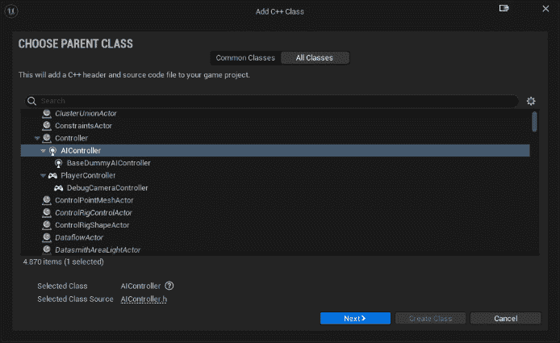

图 8.6 – 创建 AI 控制器类

1.  点击 **下一步** 按钮。

1.  将类命名为 **BaseDummyAIController** 并点击 **创建** **类** 按钮。

一旦创建了类文件并且你的 IDE 已经打开，查找 **BaseDummyAIController.h** 头文件并打开它。

### 编辑头文件

作为第一步，在 **#** **include** 声明之后添加对 **BehaviorTree** 类的前向声明：

```py
class UBehaviorTree;
```

然后，在头文件的保护部分添加以下代码行：

```py
UPROPERTY(EditAnywhere, BlueprintReadOnly,
  Category = "Dummy AI Controller")
TObjectPtr<UBehaviorTree> BehaviorTree;
```

这个属性声明了一个指向行为树的指针，因此它可以从 **类默认** 蓝图面板 – 使用 **EditAnywhere** 指定符 – 进行赋值，并且可以从任何扩展蓝图中进行读取。

现在，就在这些代码行之后，添加以下内容：

```py
virtual void OnPossess(APawn* InPawn) override;
```

当控制器拥有一个 **Pawn** 实例 – 以及我们的虚拟角色扩展了它 – 时，会调用 **OnPossess()** 函数，这是一个运行行为树的好地方。

### 实现控制器

控制器的实现相当简单；我们只需要在 AI 智能体被控制时运行行为树。要做到这一点，打开 **内容抽屉** 文件，并添加以下代码行：

```py
void ABaseDummyAIController::OnPossess(APawn* InPawn)
{
    Super::OnPossess(InPawn);
    if (ensureMsgf(BehaviorTree, TEXT("Behavior Tree is nullptr! Please assign BehaviorTree in your AI Controller.")))
    {
       RunBehaviorTree(BehaviorTree);
    }
}
```

在这个函数中，首先调用基类 **Super::OnPossess()**。然后，我们使用 **ensureMsgf()** 宏确保 **BehaviorTree** 变量不是一个空指针。如果已经设置了行为树，我们使用 **RunBehaviorTree()** 函数运行它。

在设置好 AI 控制器后，我们可以开始实现实际的 AI 行为，从黑板开始。

## 创建黑板

创建黑板资产是一个简单的任务，一旦你知道你将跟踪哪些键。在我们的例子中，我们希望以下值对行为树可用：

+   一个目标位置向量，智能体将用它来在关卡中行走

+   一个布尔标志，当电池电量危险低时将警告智能体

+   一个布尔标志，将指示电池已耗尽

要开始，我们需要创建一个黑板资产。要做到这一点，请按照以下步骤进行：

1.  打开 **内容抽屉** 并创建一个新文件夹，命名为 **AI** 。

1.  打开文件夹，在 **内容抽屉** 上右键单击，选择 **人工智能** | **黑板** 以创建黑板资产。

1.  将资产命名为 **BB_Dummy** 并双击它以打开它。

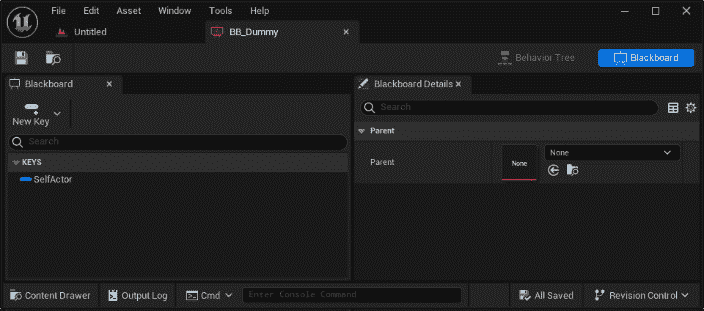

图 8.7 – 黑板面板

一旦打开黑板，你会看到已经有一个名为 **SelfActor** 的键；在本章中我们不会使用它，但我们会保留它，因为它通常用于存储对拥有者的引用。

根据本小节开头所述，我们需要创建三个键，因此我们将首先按照以下步骤进行：

1.  单击 **新建键** 按钮，然后从下拉列表中选择 **Vector** 类型，如图 8.8 所示：

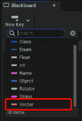

图 8.8 – 键创建

1.  将新键命名为 **TargetLocation** 。

1.  再次单击 **新建键** 按钮，选择 **Bool** 类型，并将新键命名为 **IsLowOnBattery** 。

1.  再次单击 **新建键** 按钮，选择 **Bool** 类型，并将新键命名为 **IsBatteryDepleted** 。

完成这些步骤后，你的黑板应该与图 8.9 中所示的黑板非常相似：

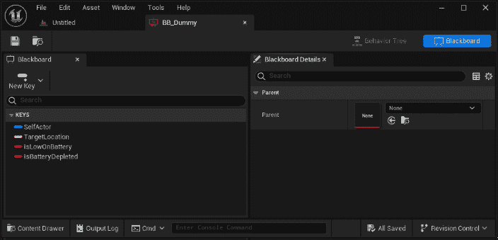

图 8.9 – 完成的黑板

黑板已完成，我们现在可以开始为我们的 AI 智能体创建行为树。

## 创建行为树

与黑板一样，行为树作为项目资产创建。让我们首先执行以下步骤：

1.  在 **内容抽屉** 中打开 **AI** 文件夹。

1.  右键单击 **内容抽屉** 并选择 **人工智能** | **行为树** 。

1.  将新创建的资产命名为 **BT_RoamerDummy** 并双击它以打开它。

一旦打开，你应该看到一个与*图 8.10*非常相似的图：

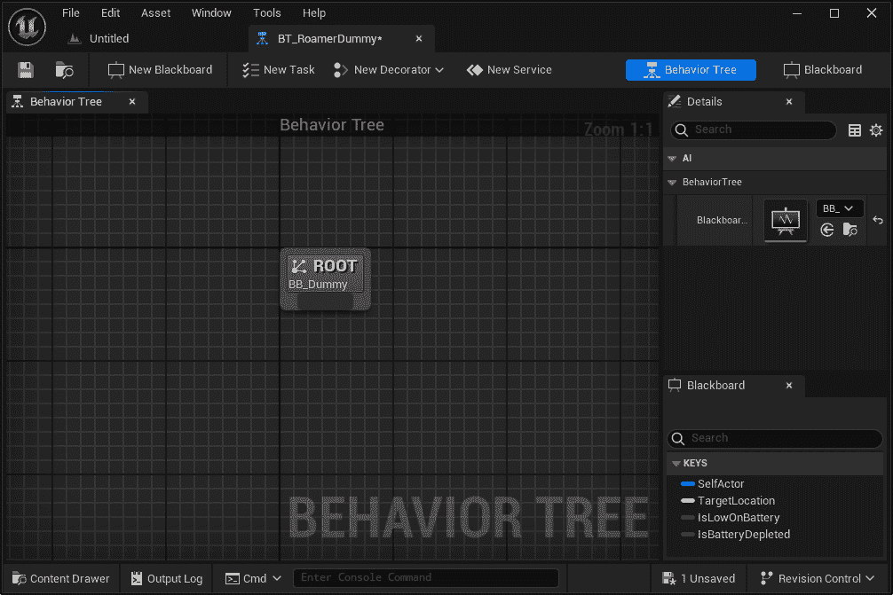

图 8.10 – 行为树创建

注意，**根**节点已经包含在图中。正如前一章所述，图中只能有一个这样的节点。此外，在**详细信息**面板中，你应该看到**BB_Dummy**黑板资产已经被分配给黑板资产。如果你没有看到分配，只需点击**黑板**属性下拉菜单并选择**BB_Dummy**资产；它应该是你项目中唯一的那种资产。

在本节中，我们逐步介绍了创建一个将利用行为树实现 AI 逻辑的角色。我们还成功创建了黑板资产和行为树资产，它们是我们角色 AI 行为的基础。由于实现我们角色所有 AI 逻辑的过程相当复杂，我们将在下一节中处理它。敬请期待如何有效地为我们的角色实现 AI 行为的详细说明。

# 实现行为树任务和服务

在创建行为树之前，对预期的实现有一个清晰的理解至关重要。AI 代理需要管理以下行为：

+   在关卡中四处游荡寻找目标位置

+   默认移动速度是跑步，但如果电池电量低，移动速度应切换为步行

+   一旦电池耗尽，它应该停止移动

+   一旦电池完全充电，它应该返回到移动模式

值得注意的是，电池耗尽和充电逻辑已经在**BaseDummyCharacter**类中实现，所以我们不需要担心它——我们只需要监听角色发出的事件并相应地行事。

正如我在前一章中提到的，虚幻引擎 AI 系统为我们的 AI 提供了一套全面的任务、服务和装饰器。然而，值得注意的是，这些内置组件可能无法满足你游戏中所有的特定需求。毕竟，作为开发者，我们享受着构建新事物以适应我们独特需求并增加游戏开发整体乐趣的创造性过程！

因此，在将节点添加到我们的图中之前，我们需要实现一系列任务和服务，这将使我们的虚拟木偶生活变得更简单。特别是，我们将创建以下内容：

+   一个将找到随机可达位置的任务

+   一个根据电池电量控制代理速度的服务

+   一个将监听电池状态变化的服务

备注

行为树节点既可以用 C++实现，也可以用蓝图实现；为了这本书的目的，我将坚持使用 C++选项，但在*第九章*，“扩展行为树”中，我会给你一些有用的提示，告诉你如何与蓝图类一起工作。

那么，让我们开始为我们的虚拟木偶实现新功能！

## 实现 FindRandomLocation 任务

我们将首先实现第一个节点，它将使 AI 代理能够在具有特定标签的水平中搜索一个随机演员。这个功能将允许代理有一个特定的点去导航，从而提高其到达目的地的精确度。

要开始实现这个节点，从 Unreal Engine 编辑器中，创建一个新的 C++类，扩展**BTTaskNode**，并将其命名为**BTTask_FindRandomLocation**。

打开**BTTask_FindRandomLocation.h**头文件并添加以下声明：

```py
public:
UPROPERTY(EditAnywhere, Category="Blackboard")
FBlackboardKeySelector BlackboardKey;
UPROPERTY(EditAnywhere, Category="Dummy Task")
FName TargetTag;
virtual EBTNodeResult::Type ExecuteTask(UBehaviorTreeComponent&   OwnerComp, uint8* NodeMemory) override;
```

**BlackboardKey**属性将用于声明找到随机位置后应该使用哪个键来存储，而**TargetTag**属性将用于在水平中查找所有可用的演员，以便随机选择。最后，当任务节点需要执行时，将调用**ExecuteTask()**函数，并将包含所有随机目标位置的逻辑。这个函数需要返回任务是否成功或失败。

现在，打开**BTTask_FindRandomLocation.cpp**文件，作为第一步，在文件本身顶部添加所需的**#include**声明：

```py
#include "BehaviorTree/BlackboardComponent.h"
#include "Kismet/GameplayStatics.h"
```

接下来，添加**ExecuteTask()**函数的实现：

```py
EBTNodeResult::Type UBTTask_FindRandomLocation::ExecuteTask(UBehaviorTreeComponent& OwnerComp,   uint8* NodeMemory)
{
    const auto BlackboardComp = OwnerComp.GetBlackboardComponent();
    if (BlackboardComp == nullptr) { return EBTNodeResult::Failed; }
    TArray<AActor*> TargetList;
    UGameplayStatics::GetAllActorsWithTag(GetWorld(), TargetTag,       TargetList);
    if(TargetList.Num() == 0) { return EBTNodeResult::Failed; }
    const auto RandomTarget = TargetList[FMath::RandRange       (0, TargetList.Num() - 1)];
    BlackboardComp->SetValueAsVector(BlackboardKey.SelectedKeyName,       RandomTarget->GetActorLocation());
    return EBTNodeResult::Succeeded;
}
```

代码从**OwnerComp**获取**Blackboard**组件并检查其有效性。然后，它检索具有特定标签的演员列表，并从该列表中随机选择一个元素。然后，它使用**SetValueAsVector()**方法将选定的目标位置更新到 Blackboard 中。注意使用**EBTNodeResult::Succeeded**和**EBTNodeResult::Failed**来返回所有这些操作的结果；这是为了向行为树指示任务是否成功的一个要求。

现在我们已经完成了这个任务节点，我们可以继续下一步，这涉及到创建一个服务。

## 实现 SpeedControl 服务

现在，我们已经准备好创建我们的第一个自定义服务，该服务将根据电池充电量监控角色的速度。如您从上一章所记得，服务通常以固定间隔运行，这正是我们将为速度控制服务类所做的一一我们将检查电池状态并根据需要更改角色速度。

要开始实现这个类，从 Unreal Engine 编辑器中，创建一个新的 C++类，扩展**BTService**，并将其命名为**BTService_SpeedControl**。

打开**BTTask_SpeedControl.h**头文件，并在**public**部分添加以下声明：

```py
protected:
  virtual void TickNode(UBehaviorTreeComponent& OwnerComp, uint8*     NodeMemory, float DeltaSeconds) override;
```

我们将要重写的 **TickNode()** 函数将在此服务附加到的每个节点计时器间隔上执行。为了调用此函数，**bNotifyTick** 需要设置为 **true**；这个值默认已经设置，但如果你需要禁用它——我们将在下一个服务中实现这一点——了解这一点是好的。

我们已经准备好实现服务，所以打开 **BT_Service_SpeedControl.cpp** 文件，并在顶部添加以下 **#include** 声明：

```py
#include "BaseDummyAIController.h"
#include "BaseDummyCharacter.h"
```

然后，添加 **TickNode()** 的实现：

```py
void UBTService_SpeedControl::TickNode(UBehaviorTreeComponent&   OwnerComp, uint8* NodeMemory, float DeltaSeconds)
{
    Super::TickNode(OwnerComp, NodeMemory, DeltaSeconds);
    const auto AIController = Cast<ABaseDummyAIController>(OwnerComp.      GetAIOwner());
    if (!AIController) return;
    const auto ControlledCharacter = Cast<ABaseDummyCharacter>      (AIController->GetPawn());
    if (!ControlledCharacter) return;
    switch (ControlledCharacter->GetBatteryStatus())
    {
      case EBatteryStatus::EBS_Empty:
          break;
      case EBatteryStatus::EBS_Low:
          ControlledCharacter->SetWalkSpeed();
          break;
      case EBatteryStatus::EBS_Medium:
      case EBatteryStatus::EBS_Full:
          ControlledCharacter->SetRunSpeed();
          break;
    }
}
```

这个函数相当直接；它所做的只是根据角色的电池状态更新受控角色的速度。

在这个阶段，你可能想知道为什么我们每次计时都检索 AI 控制器和角色引用，而不是将它们存储起来。从计算能力方面来看，这可能看起来效率不高，但重要的是要记住，行为树是一个共享资源。这意味着行为树的单个实例（及其节点）将为所有使用它的 AI 代理执行。因此，存储类引用不会带来任何优势，并可能导致不可预测的行为。

如果确实需要存储一个引用，你需要创建一个节点实例，这正是我们将要在即将到来的服务中做的。

## 实现 BatteryCheck 服务

我们即将创建的第二个服务将比之前的一个更具挑战性。我们需要持续监控电池状态的变化；最直接的方法是使用节点计时器来不断检查角色的电池状态，类似于 **UBTService_SpeedControl** 类的操作。然而，正如我们在本章早期所学的，虚拟角色会派发电池状态事件。那么，为什么不利用这个特性并加以利用呢？

让我们从实现这个服务开始；从虚幻引擎编辑器中，创建一个新的 C++ 类，扩展 **BTService** 并将其命名为 **BTService_BetteryCheck**。

一旦创建了文件，打开 **BTService_BatteryCheck.h** 文件，并在 **#include** 部分之后，添加以下前置声明：

```py
class ABaseDummyCharacter;
enum class EBatteryStatus : uint8;
```

接着，添加 **public** 部分 和 构造函数声明：

```py
public:
UBTService_BatteryCheck();
```

在此之后，声明 **protected** 部分，以及所有必要的属性：

```py
protected:
UPROPERTY()
UBlackboardComponent* BlackboardComponent = nullptr;
UPROPERTY()
ABaseDummyCharacter* ControlledCharacter = nullptr;
UPROPERTY(BlueprintReadOnly, EditAnywhere, Category="Blackboard")
FBlackboardKeySelector IsLowOnBatteryKey;
UPROPERTY(BlueprintReadOnly, EditAnywhere, Category="Blackboard")
FBlackboardKeySelector IsBatteryDepletedKey;
```

如您所见，我们正在做一些与之前服务略有不同的事情；我们声明了对 **Blackboard** 组件和角色的引用。在这种情况下，我们将与节点实例一起工作，因此每个 AI 代理都将拥有由该服务装饰的独立节点实例。我们还声明了两个 Blackboard 键来分配适当的值到 Blackboard。

然后，添加以下函数：

```py
virtual void OnBecomeRelevant(UBehaviorTreeComponent& OwnerComp, uint8* NodeMemory) override;
virtual void OnCeaseRelevant(UBehaviorTreeComponent& OwnerComp, uint8* NodeMemory) override;
UFUNCTION()
void OnBatteryStatusChange(EBatteryStatus NewBatteryStatus);
```

当装饰节点变得活跃时，将调用**OnBecomeRelevant()**函数，而**OnCeaseRelevant()**函数则不再活跃。我们将使用这两个函数通过**OnBatteryStatusChange()**函数注册电池状态事件并相应地做出反应。

你现在可以打开**BTService_BatteryCheck.cpp**文件开始实现函数。作为第一步，在文件顶部添加所需的**#include**声明：

```py
#include "BaseDummyAIController.h"
#include "BaseDummyCharacter.h"
#include "BatteryStatus.h"
#include "BehaviorTree/BlackboardComponent.h"
```

紧接着，添加构造函数实现：

```py
UBTService_BatteryCheck::UBTService_BatteryCheck()
{
    bCreateNodeInstance = true;
    bNotifyBecomeRelevant = true;
    bNotifyCeaseRelevant = true;
    bNotifyTick = false;
}
```

虽然看起来我们只是在设置一些标志，但实际上我们正在对这个服务的功能进行重大更改。首先，我们创建一个节点实例；每个 AI 代理都将拥有这个服务的独立实例。接下来，我们禁用服务计时器，因为我们不需要它，然后激活相关性行为。

接下来，让我们实现**OnBatteryStatusChange()**方法：

```py
void UBTService_BatteryCheck::OnBatteryStatusChange(const EBatteryStatus NewBatteryStatus)
{
    switch (NewBatteryStatus)
    {
    case EBatteryStatus::EBS_Empty:
       BlackboardComponent->SetValueAsBool(IsBatteryDepletedKey.         SelectedKeyName, true);
       break;
    case EBatteryStatus::EBS_Low:
       BlackboardComponent->SetValueAsBool(IsLowOnBatteryKey.         SelectedKeyName, true);
       BlackboardComponent->SetValueAsBool(IsBatteryDepletedKey.         SelectedKeyName, false);
       break;
    case EBatteryStatus::EBS_Medium:
       break;
    case EBatteryStatus::EBS_Full:
       BlackboardComponent->SetValueAsBool(IsLowOnBatteryKey.         SelectedKeyName, false);
       break;
    }
}
```

这里没有太多花哨的东西；我们只是根据新的电池状态设置 Blackboard 键。之后，我们实现剩下的两个函数：

```py
void UBTService_BatteryCheck::OnBecomeRelevant(UBehaviorTreeComponent& OwnerComp, uint8* NodeMemory)
{
    Super::OnBecomeRelevant(OwnerComp, NodeMemory);
    BlackboardComponent = OwnerComp.GetBlackboardComponent();
   const ABaseDummyAIController* AIController =      Cast<ABaseDummyAIController>(OwnerComp.GetAIOwner());
    if (!AIController) return;
    APawn* ControlledPawn = AIController->GetPawn();
    if (!ControlledPawn) return;
    ControlledCharacter = Cast<ABaseDummyCharacter>(ControlledPawn);
    if (!ControlledCharacter) return;
    ControlledCharacter->OnBatteryStatusChanged.AddDynamic       (this, &UBTService_BatteryCheck::OnBatteryStatusChange);
}
void UBTService_BatteryCheck::OnCeaseRelevant(UBehaviorTreeComponent&   OwnerComp, uint8* NodeMemory)
{
    Super::OnCeaseRelevant(OwnerComp, NodeMemory);
    ControlledCharacter->OnBatteryStatusChanged.RemoveDynamic       (this, &UBTService_BatteryCheck::OnBatteryStatusChange);
}
```

这两个函数注册和注销**OnBatteryStatusChanged**委托；此外，**OnBecomeRelevantFunction()**保存对 Blackboard 组件和 AI 控制器的引用——我们可以这样做，因为我们使用实例节点来处理这个服务。

在这个广泛的章节中，你获得了在 C++中创建自定义任务和服务的知识。通常，Unreal Engine 提供的预构建类可能不足以创建引人入胜的 AI 行为。因此，开发你自己的独特节点变得至关重要。在接下来的章节中，我们将创建这样的新类来构建一个完全运行的 AI 代理。

# 在代理上设置行为树

要深入了解 AI 代理行为树，第一步是编译整个项目。一旦过程完成，你的自定义任务和服务将作为选项出现在行为树中。

注意

如果你对 Unreal Engine 的编译过程不熟悉，我的建议是先看看*附录 A*，*在 Unreal Engine 中理解 C++*，然后再回到这一章。

一旦编译阶段完成，我们就可以开始编辑行为树了。

## 编辑行为树

打开我们之前创建的**BT_RoamerDummy**资产，并定位图中唯一的元素——**根节点**；你会看到它在底部有一个较暗的区域。

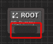

图 8.11 – 根节点

从这个区域点击并拖动将使所有可以连接到**根节点**的节点变得可用。

注意

在接下来的内容中，每当我提到添加节点的任务时，我都会要求你执行上述操作。*图 8.12*就是一个这样的例子。

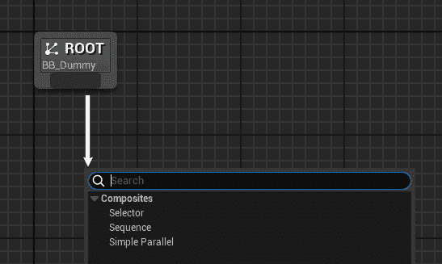

图 8.12 – 添加节点

要开始，请执行以下步骤：

1.  将一个**复合** | **序列**节点添加到**根**节点，并在**详细信息**面板中将其重命名为**根序列**。

1.  从**根序列**节点，添加一个**任务** | **FindRandomLocation**节点。

1.  在选中新创建的节点后，在**详细信息**面板中，将**黑板键**下拉值设置为**TargetLocation**。

1.  从**根序列**节点，在**FindRandomLocation**节点的右侧添加一个**复合** | **选择器**节点。

    您的图表现在应该类似于*图 8.13*所示：

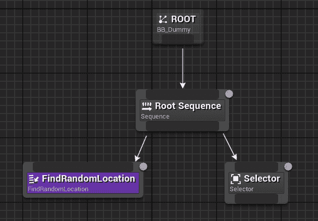

图 8.13 – 初始行为树

我们现在需要装饰**选择器**节点以赋予它额外的能力。为此，请按照以下步骤操作：

1.  右键点击**选择器**节点并选择**添加装饰器** | **条件循环**。

1.  再次右键点击并选择**添加服务** | **电池检查**。

1.  点击**条件循环**装饰器，在**详细信息**面板中，将**黑板键**属性下拉设置为**TargetLocation**。**键查询**属性应保留为**已设置**。

1.  点击**电池检查**服务，在**详细信息**面板中执行以下操作：

    +   将**电池电量低键**下拉值设置为**IsLowOnBattery**。

    +   将**电池耗尽键**下拉值设置为**IsBatteryDepleted**。

    **选择器**节点现在应该看起来类似于*图 8.14*：

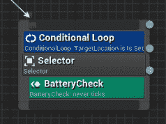

图 8.14 – 装饰后的选择器节点

注意，**BatteryCheck**服务应该显示一个**永不触发**注释；这是我们实现 C++类时设置的。

我们到目前为止所做的是 AI 代理行为的主要循环的基本内容；我们首先为 AI 代理找到一个目标位置，然后执行一个等待电池状态通知的**选择器**节点。**条件循环**装饰器将一直重复子节点（尚未添加），直到**TargetLocation**键被设置。

现在，我们将关注**选择器**节点，并执行以下操作：

1.  添加一个**复合** | **序列**子节点，并将其重命名为**漫游序列**。

1.  添加一个**任务** | **等待**子节点，并在其**详细信息**面板中执行以下操作：

    +   将**等待时间**值设置为**8.0**

    +   将**随机偏差**值设置为**2.0**

    +   将**节点名称**设置为**充电电池**

    我们需要为**漫游序列**节点添加额外的功能，所以我们执行以下操作：

1.  右键点击**漫游序列**节点，选择**添加装饰器** | **黑板**

1.  在选择装饰器后，在**详细信息**面板中执行以下操作：

    +   将**通知观察者**下拉值设置为**值更改时开启**

    +   将**观察者中止**下拉值设置为**自身**

    +   将**键查询**下拉值设置为**未设置**

    +   将**黑板键**下拉值设置为**IsBatteryDepleted**

    图表的这部分现在应该看起来像*图 8.15*：

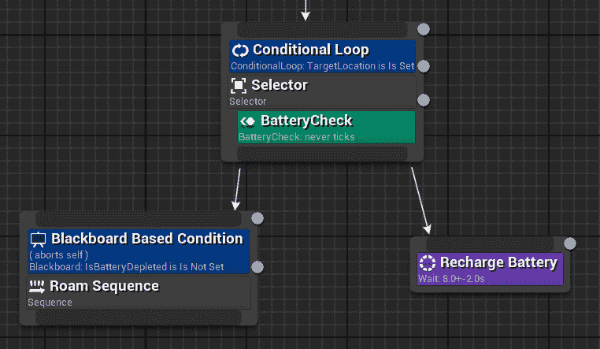

图 8.15 – 漫游循环

这部分图表将在两个阶段之间不断循环 – 一个漫游序列和一个 **等待** 节点。AI 代理将保持在漫游序列中，直到电池耗尽。之后，它将静止 6 到 10 秒（以便电池充电），然后返回漫游。

我们需要执行的最后一个步骤是实现漫游节点。为此，从 **Roam Sequence** 节点，执行以下操作：

1.  添加一个 **Tasks** | **Move To** 节点，并在 **详细信息** 面板中，将 **黑板键** 下拉值设置为 **TargetLocation**。

1.  添加一个 **Tasks** | **FindRandomLocation** 节点，并在 **详细信息** 面板中，将 **目标标签** 值设置为 **TargetPoint**。

1.  添加一个 **Tasks** | **Wait** 节点，保留其属性为默认值。

1.  我们需要向 **Move To** 节点添加额外的功能，因此右键单击它，选择 **添加服务** | **速度控制**。这部分图表应类似于 *图 8* *.16*：

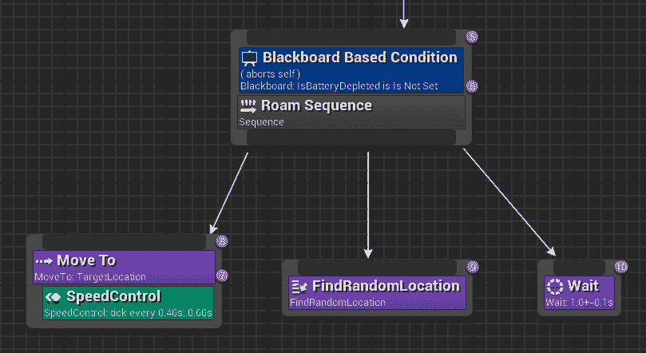

图 8.16 – 漫游序列

我们在这里做的事情相当简单；我们试图到达目标点，一旦到达，就寻找另一个点，然后通过等待一个随机的时间间隔来获得一些应得的休息。在移动过程中，我们不断检查电池状态，相应地改变 AI 代理的速度。

好消息！行为树图已经完成。现在，我们可以将其附加到我们的虚拟木偶上，并观察其行为。然而，在我们继续之前，我们需要创建一些合适的 Blueprint 来确保一切顺利运行。

## 创建 AI 代理 Blueprint

当使用 Unreal Engine 时，从 C++ 类创建 Blueprint 被认为是良好的实践。这种方法提供了诸如灵活性和可扩展性等优势，有助于提高开发效率。这就是为什么我们将从之前创建的类中创建一些 Blueprint 的原因。

### 创建控制器 Blueprint

让我们从将 **BaseDummyAIController** 类扩展到 Blueprint 开始。为此，在您的 **内容浏览器** 中创建一个新的文件夹，命名为 **Blueprints**，然后按照以下步骤操作：

1.  创建一个新的从 **BaseDummyAIController** 派生的 Blueprint 类，并将其命名为 **AIRoamerDummyController**。

1.  打开它，在 **类默认值** 面板中，查找 **Dummy AI Controller** 类别，并将 **行为树** 属性设置为 **BT_RoamerDummy**。

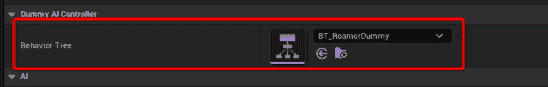

图 8.17 – 分配行为树

这就是设置漫游虚拟角色 AI 控制器的全部内容；我们现在将创建专门的角色。

### 创建角色 Blueprint

要创建一个角色 Blueprint，请按照以下步骤操作：

1.  在您的**内容浏览器**的**蓝图**文件夹中创建一个新的蓝图类，从**BaseDummyCharacter**派生，并将其命名为**BP_RoamerDummyCharacter**。

1.  打开它，在**类默认值**面板中，查找位于**Pawn**类别的**AI 控制器类**属性。从下拉菜单中选择**AIRoamerDummyController**。

恭喜你创建了自己的漫游代理！现在，我们只需添加一个最后的细节，使其更加完美 – 一个电池指示器。

### 添加外观

为了提供对 AI 代理状态的视觉反馈，我们将创建一个组件，通过灯光显示电池充电水平。这个视觉指示器将根据当前的充电水平调整灯光的强度。充电越高，灯光越亮。这将使用户能够轻松地一眼判断代理的电池状态，增强整体用户体验，并确保他们了解代理的电力水平。

让我们首先创建一个新的 C++类，从**StaticMeshComponent**类继承，命名为**BatteryInjdicatorComponent**。一旦创建了类，打开**BatteryIndicatorComponent.h**文件，并将**UCLASS()**行替换为以下内容：

```py
UCLASS(BlueprintType, Blueprintable, ClassGroup="Unreal Agility Arena", meta=(BlueprintSpawnableComponent))
```

这将使组件对蓝图可用。然后，在**GENERATED_BODY()**代码行之后，添加以下代码：

```py
public:
UBatteryIndicatorComponent();
protected:
UPROPERTY()
UMaterialInstanceDynamic* DynamicMaterialInstance;
virtual void BeginPlay() override;
UFUNCTION()
void OnBatteryStatusChange(EBatteryStatus NewBatteryStatus);
```

这里需要解释的只有**DynamicMaterialInstance**属性，它将被用来改变材质强度属性，使其更亮或更暗，以及**OnBatteryStatusChange()**函数，它将被用来处理电池状态改变事件。

现在，要开始实现组件，打开**BatteryIndicatorComponent.cpp**文件，并在其顶部添加以下声明：

```py
#include "BaseDummyCharacter.h"
```

构造函数只需设置静态网格资产，因此添加以下代码：

```py
UBatteryIndicatorComponent::UBatteryIndicatorComponent()
{
    static ConstructorHelpers::FObjectFinder<UStaticMesh>       StaticMeshAsset(
       TEXT("/Game/_GENERATED/MarcoSecchi/SM_HeadLight.SM_         Headlight"));
    if (StaticMeshAsset.Succeeded())
    {
       UStaticMeshComponent::SetStaticMesh(StaticMeshAsset.Object);
    }
}
```

接下来，通过添加以下代码块实现**BeginPlay()**函数：

```py
void UBatteryIndicatorComponent::BeginPlay()
{
    Super::BeginPlay();
    ABaseDummyCharacter* Owner =       Cast<ABaseDummyCharacter>(GetOwner());
    if(Owner == nullptr) return;
    AttachToComponent(Owner->GetMesh(),       FAttachmentTransformRules::SnapToTargetIncludingScale, "helmet");
    DynamicMaterialInstance = this->CreateDynamicMaterialInstance       (1, GetMaterial(1));
   Owner->OnBatteryStatusChanged.AddDynamic      (this, &UBatteryIndicatorComponent::OnBatteryStatusChange);
}
```

在这个函数中，我们检查此组件的所有者是否是**BaseDummyCharacter**类的实例。接下来，我们将此组件附加到所有者的名为**helmet**的网格组件插座上 – 这是我已经在虚拟骨骼网格中为你提供的插座，如*图 8* *.18* 所示：

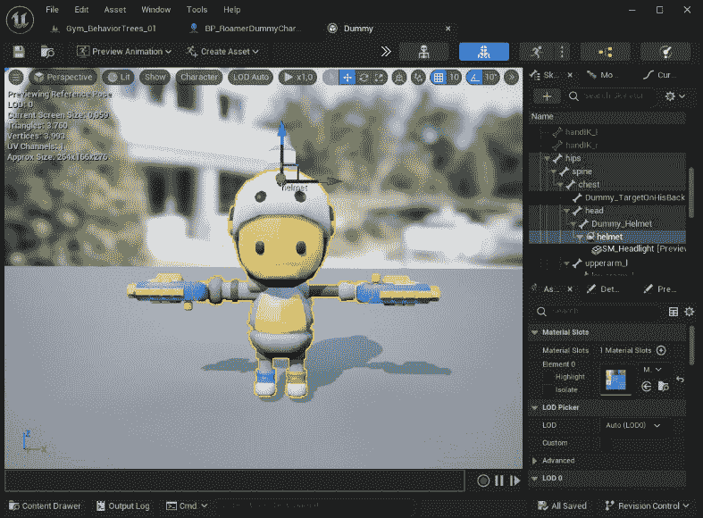

图 8.18 – 头盔插座

之后，我们为这个组件创建一个动态材质实例 – 这将允许我们在运行时修改材质属性。最后，我们向拥有者的**OnBatteryStatusChanged**事件添加一个事件处理器，每当拥有者的电池状态改变时，都会调用此组件的**OnBatteryStatusChange**函数。

函数完成后，我们只需将事件处理器添加到我们的代码中：

```py
void UBatteryIndicatorComponent::OnBatteryStatusChange(EBatteryStatus NewBatteryStatus)
{
    const auto BatteryValue = StaticCast<float>(NewBatteryStatus);
    const auto Intensity = (BatteryValue - 1.f) * 25.f;
    DynamicMaterialInstance->SetScalarParameterValue(FName       ("Intensity"), Intensity);
}
```

在这里，我们将**NewBatteryStatus**枚举转换为**float**值，计算光强度，然后在动态材质实例中设置一个标量参数，**Intensity**。

我们终于可以编译项目，使这个组件对角色可用。一旦编译过程完成，打开**BP_RoamerDummy**蓝图并执行以下操作：

1.  在**组件**面板中，点击**+** **添加**按钮。

1.  选择**UnrealAgilityArena** | **Battery Indicator**将此组件添加到角色中。

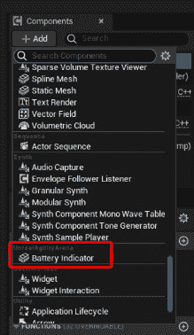

图 8.19 – 添加组件

您的虚拟角色已经设置完毕，并急切地等待在合适的健身房级别进行测试。

## 在健身房测试一个代理

我们现在准备好为我们的 AI 代理创建一个健身房，并观察它的行为。如您在*第四章*中已知的，*设置导航网格*，如何正确设置带有导航网格的健身房，我不会深入创建细节。相反，我将为您提供一些关于关卡创建的通用信息。以下是您应该做的事情：

1.  创建您选择的关卡，从项目模板中提供的关卡实例和打包关卡演员开始

1.  添加一个**NavMeshBoundsVolume**演员，使其覆盖所有可通行区域

1.  添加一些障碍物使事情更有趣

1.  添加一个或多个**BP_RoamerDummyCharacter**实例

1.  添加一些作为目标点的**NS_Target** Niagara 演员

值得注意的是，您的 AI 代理将寻找带有**TargetPoint**标签的目标点。如果您不熟悉标签系统，以下是如何为您的演员添加标签的方法：

1.  对于每个**NS_Target** Niagara 系统，在**详细信息**面板中搜索**标签**属性。

1.  点击**+**按钮添加一个新的标签。

1.  在将创建的**索引[0]**字段中，插入**TargetPoint**，如图*图 8.20*所示。

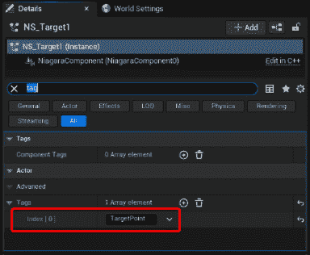

图 8.20 – 演员标签

一旦您的关卡完成，您就可以开始测试它；我的在*图 8.21*中显示：

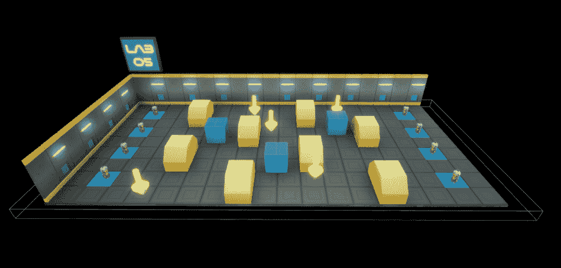

图 8.21 – 完成的关卡

在开始模拟时，您应该看到以下事情发生：

+   根据起始电池电量（这是随机的），您的 AI 代理将开始奔跑、行走或静止不动

+   它们将尝试到达一个目标点，一旦到达，它们将休息大约一秒钟，然后寻找另一个目标点

+   如果电池电量低，它们将开始步行而不是跑步

+   如果电池电量耗尽，它们将停止，开始充电，然后再次开始运行

+   当 AI 代理电量充足时，前灯应该更亮，当电池电量低时关闭

这部分内容到此结束，您已经学习了如何构建一个完全工作的行为树，包括创建您定制的任务和服务。

# 摘要

在这个相当长的章节中，你被介绍了在虚幻引擎中创建行为树的基础知识。正如你所学的，创建一个完全工作的 AI 代理是现成功能、自定义类和一点独创性的混合体。

我们刚刚开始一段迷人的旅程，这个旅程将在接下来的章节中展开，从下一章开始，我们将深入探讨任务、服务和装饰器的复杂运作。准备好对你的心爱的小木偶进行一次重大的改造吧！
