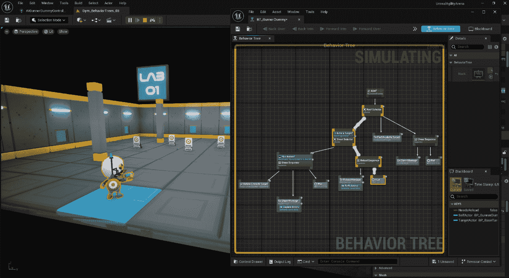

# 9

# 扩展行为树

理解行为树细微差别对于游戏开发者至关重要，因为它们使他们能够牢固掌握创建响应性和更具吸引力的 AI 角色。这就是为什么在本章中，我们将深入探讨 Unreal Engine 行为树系统的内部运作和最佳实践；我们将详细解释其功能，特别是如何为我们的 AI 代理创建更复杂的自定义任务、服务和装饰器。此外，我们还将回顾调试工具，看看如何在运行时分析行为树。

在本章中，我们将涵盖以下主题：

+   展示编写行为树的最佳实践

+   理解装饰器

+   理解服务

+   理解任务

+   调试行为树

# 技术要求

要跟随本章介绍的主题，你应该已经完成了前面的章节，并理解了它们的内容。

此外，如果你希望从本书的配套仓库开始编写代码，你可以下载本书配套项目仓库中提供的**.zip**项目文件：[`github.com/PacktPublishing/Artificial-Intelligence-in-Unreal-Engine-5`](https://github.com/PacktPublishing/Artificial-Intelligence-in-Unreal-Engine-5)。

要下载最后一章末尾的文件，请点击**Unreal Agility Arena –** **第八章** **-** **结束**链接。

# 展示编写行为树的最佳实践

看来我们的小小说有了新的一章：

在他们测试 AI 木偶能力的过程中，马克斯博士和维克托利亚教授决定给他们配备飞镖枪。这个想法是创造一个有趣且引人入胜的场景，让木偶能够展示他们新获得*的射击技巧*。

在秘密实验室里，气氛充满了兴奋，因为木偶现在装备了非致命武器，准备接受挑战。凭借他们先进的 AI 编程和传感器系统，木偶能够分析环境，计算弹道，并以*惊人的准确性*瞄准目标。

当为你的 AI 代理设计行为树时，掌握最佳实践至关重要。此外，了解视频游戏行业中 AI 领域的最新进展和研究将提供有价值的见解，并指导你在设计更好的行为树时的决策过程。

## 列出最佳实践

在本小节中，我将为你提供一些宝贵的建议来优化和增强你 AI 的参与度；其中一些来自知名模式，而另一些则源于我个人的经验——大多数情况下是通过试错过程获得的。

### 使用适当的命名约定

在行为树中为新创建的任务、装饰器或服务正确命名是一种良好的做法。使用表明资产类型的命名约定，无论是任务、装饰器还是服务。作为一个经验法则，你应该使用以下前缀：

+   **BTTask_** 用于任务

+   **BTDecorator_** 用于装饰器

+   **BTService_** 用于服务

这不仅可以帮助你清楚地了解你创建的资产类型，你还会得到一个有益的副作用；在行为树图中，系统将识别类类型，并将前缀移除，仅显示节点名称。使用不正确的命名约定会导致在尝试选择节点图中的节点时出现不规律的行为。

例如，在*第八章*，“设置行为树”中，你可能已经注意到我们给电池检查服务命名为**BTService_BatteryCheck**，但在行为树图中，它仅显示为**电池检查**。

### 给你的节点一个有意义的名称

行为树任务、装饰器和服务都有一个名为**NodeName**的属性，它将用于在图中显示节点名称；如果你想给你的节点一个不同于类名的名称，请使用它。

### 避免直接更改节点属性

而不是直接更改行为树中节点的属性，你应该利用黑板的力量并更改其键。或者，你也可以调用角色内的函数，对键进行必要的修改。这将有助于保持更干净、更有组织的结构。

例如，我们之前创建的虚拟木偶通过角色和一些专门的黑板键处理电池逻辑。

### 考虑性能优化

Unreal Engine 中的行为树系统在本质上进行了优化，因为它避免在每一帧评估整个树，而是依赖于成功和失败通知来确定下一个要执行的节点。然而，重要的是要谨慎行事，不要过度依赖某些功能，假设它们会自动按预期工作。

例如，在我们之前创建的**电池检查**服务中，我们禁用了 tick 间隔，利用了代理的力量。

### 使用模块化设计

尝试将复杂的行为分解成更小、可重用的模块，如任务、服务和装饰器。这种模块化方法将使维护和更新行为树变得更加容易。

例如，为了创建更复杂的行为，尝试检查*第八章*，“设置行为树”中实现的小任务**Roam Sequence**。

### 不要假设你的角色将是一个 AI 代理

在开发 AI 角色时，你可能倾向于直接在**Character**类中添加 AI 逻辑。然而，通常建议避免这种做法。**AI Controller**类已被专门设计来服务于特定目的，提供了一种更结构化和模块化的方法来监督角色的 AI 行为。通过利用**AI Controller**类，你可以有效地将 AI 逻辑与角色本身分离，从而提高可维护性并能够独立更新 AI 行为。

例如，在运行时能够在 AI 控制器和玩家控制器之间切换的能力可以提供几个优势，例如允许玩家控制 AI 角色。

作为一条经验法则，建议以允许玩家和 AI 可以相互切换控制的方式创建你的**Pawn**和**Character**类。

在本章的后面部分，我们将考虑到这一点创建一个新的 AI 代理。

### 经常调试和测试

定期测试和调试你的行为树以确保其按预期工作。使用由虚幻引擎提供的调试工具来识别和解决任何问题。

到本章结束时，我将向你展示如何正确使用调试工具与你的行为树。

现在你已经了解了一些关于如何有效地创建 AI 代理的信息，是时候回到我们的项目并开始制作一个新的角色了！让我们开始吧！

## 实现枪手角色逻辑

作为起点，我们将创建一个新的 AI 角色，并添加一些额外功能；特别是，它将具有一些射击目标的能力——通过非致命的 Nerf 枪。如前所述，当你在角色上工作时，优先考虑简单性和模块化是很重要的。在这种情况下，将射击逻辑集成到基础角色中是没有意义的。相反，利用虚幻引擎组件提供的功能将更为有效。这样做可以将射击功能保持为独立和模块化，从而在项目中提供更好的组织和灵活性。最终结果，AI 代理将能够通过使用 AI 行为射击目标。

### 创建 BaseWeaponComponent 类

要为我们的虚拟角色创建武器组件，我们首先将扩展**StaticMeshComponent**类；这将提供一个良好的起点——网格——我们只需要添加附加逻辑和射击逻辑。

要开始创建此组件，从虚幻引擎中创建一个新的 C++类，从**StaticMeshComponent**扩展，并将其命名为**BaseWeaponComponent**。

一旦创建了类，打开**BaseWeaponComponent.h**文件，并用以下代码行替换**UCLASS()**宏：

```py
UCLASS(BlueprintType, Blueprintable, ClassGroup="UnrealAgilityArena",
  meta=(BlueprintSpawnableComponent))
```

这将使组件对蓝图可用，并且你可以直接将其附加到蓝图类。

现在，在类内部，就在**GENERATED_BODY()**宏之后，添加以下声明：

```py
public:
    UBaseWeaponComponent();
    UFUNCTION(BlueprintCallable)
    virtual void Shoot();
    UPROPERTY(EditAnywhere, BlueprintReadWrite, Category="Bullet")
    TSubclassOf<AActor> BulletClass;
    UPROPERTY(EditAnywhere, BlueprintReadWrite, Category="Bullet")
    FVector MuzzleOffset = FVector(150, 30.f, 0.f);
protected:
    virtual void BeginPlay() override;
```

在这里，我们声明了构造函数，一个名为**Shoot()**的函数，它将生成子弹；然后，我们声明了生成的子弹的**BulletClass**属性和**MuzzleOffset**以精确放置子弹生成点。最后，在**protected**部分，我们需要**BeginPlay()**声明来添加一些初始化。

现在，我们已经准备好实现组件，所以打开**BaseWeaponComponent.cpp**文件，并在它的最顶部添加此行代码：

```py
#include "BaseDummyCharacter.h"
```

紧接着，添加类构造函数：

```py
UBaseWeaponComponent::UBaseWeaponComponent()
{
    static ConstructorHelpers::FObjectFinder<UStaticMesh>       StaticMeshAsset(
       TEXT("/Game/KayKit/PrototypeBits/Models/Gun_Pistol.Gun_         Pistol"));
    if (StaticMeshAsset.Succeeded())
    {
       UStaticMeshComponent::SetStaticMesh(StaticMeshAsset.Object);
    }
}
```

此函数相当简单直接，因为我们只是为组件声明了一个默认网格——一个 Nerf 手枪手枪；你将在以后使用蓝图扩展此类时可以自由更改它；

之后，添加**BeginPlay()**实现：

```py
void UBaseWeaponComponent::BeginPlay()
{
    Super::BeginPlay();
    const auto Character = Cast<ABaseDummyCharacter>(GetOwner());
    if(Character == nullptr) return;
    AttachToComponent(Character->GetMesh(),       FAttachmentTransformRules::SnapToTargetIncludingScale,       "hand_right");
}
```

此函数尝试将组件的所有者转换为**Character**对象，如果转换成功，则将组件附加到**hand_right**插座上的角色网格，以便枪保持在角色的右手；我已经在**Dummy**骨骼网格中为你提供了这样的插座，如图*图 9* *.1* 所示：


图 9.1 – 手柄插座

作为最后一步，现在是时候实现**Shoot()**函数逻辑了，所以添加以下代码行：

```py
void UBaseWeaponComponent::Shoot()
{
    if (BulletClass == nullptr) return;
    auto const World = GetWorld();
    if (World == nullptr) return;
    const FRotator SpawnRotation = GetOwner()->GetActorRotation();
    const FVector SpawnLocation = GetOwner()->GetActorLocation() +       SpawnRotation.RotateVector(MuzzleOffset);
    FActorSpawnParameters ActorSpawnParams;
    ActorSpawnParams.SpawnCollisionHandlingOverride =       ESpawnActorCollisionHandlingMethod::AdjustIfPossibleButDont       SpawnIfColliding;
    World->SpawnActor<AActor>(BulletClass, SpawnLocation, SpawnRotation, ActorSpawnParams);
}
```

此函数检查**BulletClass**是否有效，获取**World**的引用——代表地图引用的最高级对象——然后根据所有者的位置计算生成位置和旋转，最后使用**BulletClass**在计算的位置和旋转处生成一个 actor。

组件现在已准备就绪；下一步将是创建合适的子弹以在正确的时间射击。

### 创建 BaseBullet 类

在创建了生成子弹的武器组件之后，下一步的逻辑步骤是创建一个可生成的子弹。这将非常直接；我们将创建一个带有网格的对象，它会向前移动，对它所击中的任何东西造成伤害。让我们先创建一个新的 C++类，扩展**Actor**并命名为**BaseGunBullet**；在类创建完成后，打开**BaseGunBullet.h**头文件，并在**#include**部分之后添加以下前置声明：

```py
class USphereComponent;
class UProjectileMovementComponent;
class UStaticMeshComponent;
```

之后，更改**UCLASS()**宏，使这个类成为创建蓝图的可接受基类：

```py
UCLASS(Blueprintable)
```

现在，就在**GENERATED_BODY()**宏之后，添加所需组件声明：

```py
UPROPERTY(VisibleDefaultsOnly, Category="Projectile")
USphereComponent* CollisionComponent;
UPROPERTY(VisibleAnywhere, BlueprintReadOnly, Category="Projectile",   meta=(AllowPrivateAccess="true"))
UStaticMeshComponent* MeshComponent;
UPROPERTY(VisibleAnywhere, BlueprintReadOnly, Category="Movement",   meta=(AllowPrivateAccess="true"))
UProjectileMovementComponent* ProjectileMovementComponent;
```

下一步是声明**public**函数——即构造函数和组件的获取器——所以添加以下代码行：

```py
public:
   ABaseGunBullet();
    USphereComponent* GetCollision() const { return       CollisionComponent; }
    UProjectileMovementComponent* GetProjectileMovement() const {       return ProjectileMovementComponent; }
    UStaticMeshComponent* GetMesh() const { return MeshComponent; }
```

在**protected**部分，移除**BeginPlay()**声明，因为它将不再需要。相反，我们需要子弹碰撞事件的**OnHit()**处理程序：

```py
protected:
    virtual void BeginPlay() override;
    UFUNCTION()
    void OnHit(UPrimitiveComponent* HitComp, AActor* OtherActor,       UPrimitiveComponent* OtherComp, FVector NormalImpulse, const         FHitResult& Hit);
```

现在头文件已经完成，是时候开始实现类了，所以打开**BaseGunBullet.cpp**。作为第一步，在文件顶部添加所需的**#include**声明：

```py
#include "GameFramework/ProjectileMovementComponent.h"
#include "Components/SphereComponent.h"
#include "Components/StaticMeshComponent.h"
#include "Engine/DamageEvents.h"
```

接下来，移除**BeginPlay()**实现，正如我之前所说的，它将不再需要。之后，添加构造函数实现：

```py
ABaseGunBullet::ABaseGunBullet()
{
    PrimaryActorTick.bCanEverTick = false;
    InitialLifeSpan = 10.0f;
    CollisionComponent =       CreateDefaultSubobject<USphereComponent>(TEXT("Collision"));
    CollisionComponent->InitSphereRadius(20.0f);
    CollisionComponent->BodyInstance.      SetCollisionProfileName("BlockAll");
    CollisionComponent->OnComponentHit.AddDynamic(this,       &ABaseGunBullet::OnHit);
    CollisionComponent->SetWalkableSlopeOverride       (FWalkableSlopeOverride(WalkableSlope_Unwalkable, 0.f));
    CollisionComponent->CanCharacterStepUpOn = ECB_No;
    RootComponent = CollisionComponent;
    ProjectileMovementComponent = 
      CreateDefaultSubobject<UProjectileMovementComponent>(TEXT         ("Projectile"));
    ProjectileMovementComponent->UpdatedComponent =       CollisionComponent;
    ProjectileMovementComponent->InitialSpeed = 1800.f;
    ProjectileMovementComponent->MaxSpeed = 1800.f;
    ProjectileMovementComponent->bRotationFollowsVelocity = true;
    ProjectileMovementComponent->ProjectileGravityScale = 0.f;
    MeshComponent =       CreateDefaultSubobject<UStaticMeshComponent>(TEXT("Mesh"));
    MeshComponent->SetupAttachment(RootComponent);
    MeshComponent->SetRelativeRotation(FRotator(0.f, -90.f, 0.f));
    MeshComponent->SetRelativeScale3D(FVector(2.f, 2.f, 2.f));
   static ConstructorHelpers::FObjectFinder<UStaticMesh>      StaticMeshAsset(
       TEXT("/Game/KayKit/PrototypeBits/Models/Bullet.Bullet"));
   if (StaticMeshAsset.Succeeded())
    {
       MeshComponent->SetStaticMesh(StaticMeshAsset.Object);
    }
}
```

上述大部分代码之前已经讨论过或已解释清楚，尽管还有一些重要的事情需要说明。**CollisionComponent**的碰撞配置文件名称已被设置为**BlockAll**，以便获得适当的碰撞；此外，我们将**OnComponentHit**委托绑定到**OnHit()**方法，以便对任何子弹碰撞做出反应。

现在，我们可以添加最终的方法实现，它将处理子弹击中任何对象的情况：

```py
void ABaseGunBullet::OnHit(UPrimitiveComponent* HitComp, AActor*   OtherActor, UPrimitiveComponent* OtherComp, FVector NormalImpulse,     const FHitResult& Hit)
{
    if (OtherActor != nullptr && OtherActor != this)
    {
       const auto DamageEvt = FDamageEvent();
       OtherActor->TakeDamage(1.f, DamageEvt, nullptr, nullptr);
    }
    Destroy();
}
```

如您所见，我们只是调用被击中的**Actor**对象的**TakeDamage()**方法，然后销毁子弹。在这个游戏中，不需要担心伤害参数！它们不是本书的重点，所以您可以自由添加自己的伤害逻辑并坚持使用。请随意根据您的喜好定制游戏！

现在我们已经完成了子弹类的最终版本，是时候为它创建一个合适的靶子了。

## 实现目标类

我们现在需要创建一个基类 actor，我们将用它来实现射击 AI 代理的目标。所以，让我们首先创建一个新的 C++类，从**Actor**扩展，并命名为**BaseTarget**。一旦创建了类，就打开**BaseTarget.h**头文件。

作为第一步，在**#include**部分之后添加以下前置声明：

```py
class UStaticMeshComponent;
```

接下来，移除**BeginPlay()**和**Tick()**函数，因为它们将不再需要，并在**ABaseTarget()**构造函数之后添加以下声明：

```py
protected:
    UPROPERTY(VisibleAnywhere, BlueprintReadOnly,       Category="Projectile", meta=(AllowPrivateAccess="true"))
    UStaticMeshComponent* MeshComponent;
    virtual float TakeDamage(float DamageAmount, FDamageEvent const&       DamageEvent, AController* EventInstigator, AActor* DamageCauser)         override;
```

除了将用于显示目标网格的**StaticMeshComponent**属性外，我们还添加了用于处理子弹击中的**TakeDamage()**声明。

现在，打开**BaseTarget.cpp**文件，在移除**BeginPlay()**和**Tick()**函数实现后，用以下代码替换构造函数：

```py
ABaseTarget::ABaseTarget()
{
    PrimaryActorTick.bCanEverTick = false;
    MeshComponent =       CreateDefaultSubobject<UStaticMeshComponent>(TEXT("Mesh"));
    MeshComponent->SetupAttachment(RootComponent);
    MeshComponent->SetRelativeRotation(FRotator(0.f, -90.f, 0.f));
    RootComponent = MeshComponent;
    static ConstructorHelpers::FObjectFinder<UStaticMesh>       StaticMeshAsset(
    TEXT("/Game/KayKit/PrototypeBits/Models/target_stand_B_target_      stand_B.target_stand_B_target_stand_B"));
    if (StaticMeshAsset.Succeeded())
    {
       MeshComponent->SetStaticMesh(StaticMeshAsset.Object);
    }
}
```

到现在为止，您应该已经熟悉了之前的代码；在禁用此 actor 的 tick 功能后，我们继续添加并初始化一个**StaticMesh**组件，它将在我们的项目中用于显示目标。

现在，将**TakeDamage()**实现添加到您的文件中：

```py
float ABaseTarget::TakeDamage(float DamageAmount, FDamageEvent const&   DamageEvent, AController* EventInstigator,
    AActor* DamageCauser)
{
    Tags[0] = "Untagged";
    return DamageAmount;
}
```

如您所见，这里的方法相当简单；我们只是使用了**未标记**关键字，这将使分配给父对象的标签失效。这实际上使得它对我们将在本章后面构建的行为树任务不可见。我们不需要担心伤害逻辑；一旦目标被标记，它就会失效。

现在所有基类都已创建，我们准备实现所需的蓝图，包括一个全新的枪手角色。

## 创建蓝图

我们将继续创建将有助于生成新 AI 枪手代理的蓝图。具体来说，我们将专注于以下组件：

+   可生成的子弹

+   目标

+   枪手角色本身

让我们从创建子弹蓝图开始。

### 实现子弹蓝图

创建枪弹蓝图的过程相当直接。只需遵循以下步骤：

1.  在虚幻引擎**内容抽屉**中打开**蓝图**文件夹。

1.  右键点击并选择**蓝图类**。

1.  在**所有类**部分，选择**BaseGunBullet**。

1.  将新资产命名为**BP_GunBullet**。*图 9.2*显示了最终的蓝图类：


图 9.2 – 枪弹蓝图

### 实现目标蓝图

目标蓝图创建几乎与子弹蓝图相同；我们只需向对象添加一个标签。执行以下步骤：

1.  在虚幻引擎**内容抽屉**中打开**蓝图**文件夹。

1.  右键点击并选择**蓝图类**。

1.  在**所有类**部分，选择**BaseTarget**。

1.  将新资产命名为**BP_Target**。

1.  在**细节**面板中，查找**Actor** | **高级**类别中的**Tags**属性，并点击**+**按钮创建一个新的标签。

1.  将标签命名为**ShootingTarget**，如图*图 9.3*所示：


图 9.3 – 目标标签

*图 9.4*显示了最终的蓝图类：


图 9.4 – 目标蓝图

### 实现枪手角色蓝图

现在是创建枪手角色蓝图的时候了。您已经熟悉这个过程，但以下是需要遵循的步骤：

1.  在虚幻引擎**内容抽屉**中打开**蓝图**文件夹。

1.  右键点击并选择**蓝图类**。

1.  在**所有类**部分，选择**BaseDummyCharacter**。

1.  将新资产命名为**BP_GunnerDummy**。

我们将在本章后面添加 AI 控制器，但我们需要在蓝图类中更改一个值，以便我们的角色能够正确工作。因此，打开此蓝图，在**细节**面板中，定位到**Pawn**类别中的**Use Controller Rotation Yaw**属性；这将允许在稍后使用 AI 逻辑时正确旋转角色。勾选该值，如图*图 9.5*所示：


图 9.5 – 使用控制器偏航旋转已勾选

此值将允许我们在射击目标时通过任务旋转角色。

现在，是时候为角色添加合适的武器了。为此，请按照以下步骤操作：

1.  在打开的蓝图角色类中，定位到**组件**面板，并点击**+** **添加**按钮。

1.  选择**UnrealAgilityArena** | **基础武器**以将此组件添加到蓝图类中。

1.  选择这个新添加的组件，在**细节**面板的**子弹**类别中，找到**子弹类**属性；从下拉菜单中选择**BP_GunBullet**。

现在我们已经将角色调整得完美无缺，是时候让它在我们指挥下展示其射击能力了！

### 使武器射击

为了使射击阶段正常工作，我们将使用**动画通知**——一个可以与动画序列同步的事件——这样我们就可以在动画时间轴的特定点调用**Shoot()**函数。

注意

你可能好奇为什么我们要实现这个特定的系统，而不是直接从代码的任何部分调用**Shoot()**函数。好吧，是这样的：射击动画有一个持续时间，子弹应该生成的时刻就在动画的某个地方。这就是动画通知发挥作用的地方。通过使用**动画通知**，我们可以在动画中指定子弹应该生成的确切时刻。

通过扩展**AnimNotify**类创建动画通知，所以首先创建一个新的 C++类，扩展**AnimNotify**，并将其命名为**AnimNotify_Shoot**。一旦创建了文件，打开**AnimNotify_Shoot.h**头文件，作为第一步，将**UCLASS()**宏声明更改为以下内容：

```py
UCLASS(const, hidecategories=Object, collapsecategories, Config = Game, meta=(DisplayName="Shoot"))
```

不深入具体细节，只需说这些初始化设置对于类正确运行是必要的。

之后，将以下**public**声明添加到类中：

```py
public:
    UAnimNotify_Shoot();
   virtual void Notify(USkeletalMeshComponent* MeshComp,      UAnimSequenceBase* Animation, const FAnimNotifyEventReference&        EventReference) override;
```

**UAnimNotify_Shoot()**声明是构造函数，相当直观，而**Notify()**声明将在动画通知被触发时调用。

现在，打开**AnimNotify_Shoot.cpp**文件，并在其顶部添加所需的**#include**声明：

```py
#include "BaseDummyCharacter.h"
#include "BaseWeaponComponent.h"
```

然后，添加构造函数实现：

```py
UAnimNotify_Shoot::UAnimNotify_Shoot():Super()
{
#if WITH_EDITORONLY_DATA
    NotifyColor = FColor(222, 142, 142, 255);
#endif
}
```

虽然这不是强制性的，但这个功能允许你在虚幻引擎编辑器中自定义通知标签的颜色。这非常方便，不是吗？

另一方面，**Notify()**函数对于游戏玩法相关的理由具有重要意义，因此添加以下代码行：

```py
void UAnimNotify_Shoot::Notify(USkeletalMeshComponent* MeshComp, UAnimSequenceBase* Animation,
                               const FAnimNotifyEventReference& EventReference)
{
    if(MeshComp == nullptr) return;
    const auto Character = Cast<ABaseDummyCharacter>      (MeshComp->GetOwner());
    if(Character == nullptr) return;
    const auto WeaponComponent = Character->      GetComponentByClass<UBaseWeaponComponent>();
    if(WeaponComponent == nullptr) return;
    WeaponComponent->Shoot();
}
```

这个函数会查找**BaseWeaponComponent**实例（如果有的话），并调用**Shoot()**函数。

在将此动画通知添加到射击动画之前，你需要编译你的项目。一旦新的类可用，查找位于**Content/KayKit/PrototypeBits/Character/Animations**文件夹中的**AM_1H_Shoot**蒙太奇。

注意

在虚幻引擎中，**montage**指的是一种专门资产，允许你为角色或对象创建复杂的动画。蒙太奇通常用于定义相关动画序列。由于蒙太奇不是本书的重点，我已经为你提供了所需的蒙太奇。

一旦你通过双击打开资产，你将注意到在资产时间轴中有一个**ShootNotify_C**标签；这是一个空占位符，我为你提供，以便让你知道通知应该放置的位置。


图 9.6 – 动画蒙太奇

右键单击该标签，选择**Replace** with **Notify** | **Shoot**以添加**AnimNotify_Shoot**实例。


图 9.7 – Shoot notify

现在，无论你的 AI 代理何时播放这个蒙太奇，它都会从蒙太奇本身收到通知，调用**Shoot()**函数。在本章的后面部分，我们将为我们的 AI 代理行为树创建一个专用任务，以便播放蒙太奇，但如果你想测试一下，你可以简单地使用**BP_GunnerDummyCharacter**的事件图中的**Play Montage**节点，如图*图 9* *.8* 所示：


图 9.8 – Montage test

确保在测试完成后删除此节点，以防止你的 AI 代理表现出看似混乱的行为。

在本节中，我提供了一些关于通过最佳实践和我的个人经验来增强 AI 代理和行为树的见解。在此之后，我们为能够射击的更高级 AI 代理奠定了基础。接下来的章节将专注于开发自定义修饰器，为我们的项目增加一层复杂性。我们的事业即将迎来令人兴奋的发展！

# 理解修饰器

修饰器提供了一种向行为树的一部分执行添加额外功能或条件的方法。正如你从之前的章节中已经知道的那样，修饰器附加到组合节点或任务节点上，并确定树中的分支（甚至单个节点）是否可以执行。通过将修饰器与组合节点结合使用，你可以创建具有优先行为的行为树，允许处理复杂场景的强大逻辑。在*第八章*，“设置行为树”中，我们使用了一些内置修饰器，但在本节中，我将为你提供更多关于创建自己的自定义修饰器的详细信息。

## 解释 BTAuxiliaryNode 类

修饰器和服务都继承自**BTAuxiliaryNode**类，这将允许你实现以下功能：

+   **OnBecomeRelevant()**：当辅助节点（装饰器或服务附加到的节点）变为活动时将被调用

+   **OnCeaseRelevant()**：当辅助节点变为不活动时将执行

+   **TickNode()**：这将在每个辅助节点计时器执行时执行

在*第八章*，“设置行为树”中，我向你介绍了一些这些函数，所以了解它们的来源是很好的。

## 创建 C++修饰器

装饰器从**BTDecorator**类扩展，在 C++中，其主要可实现的函数如下：

+   **OnNodeActivation()**：当底层节点被激活时调用此函数

+   **OnNodeDeactivation()**：当底层节点被停用时调用此函数

+   **OnNodeProcessed()**：当底层节点被停用或未能激活时调用此函数

+   **CalculateRawConditionalValue()**：计算装饰器条件值，不考虑逆条件

此外，您还可以使用**IsInversed()**函数来检查装饰器是否会处理逆条件值。

## 创建蓝图装饰器

每次使用蓝图可视化脚本创建装饰器时，您应该从**BTDecorator_BlueprintBase**类扩展，它包含一些额外的代码逻辑和事件，以便更好地管理它。您可以通过通常的方式创建装饰器 – 从**内容抽屉** – 或者您可以从行为树图中选择**新装饰器**按钮，如图 9.9* 所示：


图 9.9 – 创建装饰器

当您使用由蓝图生成的装饰器工作时，您将可用的主要事件如下：

+   **Receive Execution Start AI**：当底层节点被激活时调用此函数

+   **Receive Execution Finish AI**：当底层节点完成执行其逻辑时调用此函数

+   **Receive Tick AI**：在每次 tick 时调用此函数


图 9.10 – 装饰器节点

通过记住这一点，您将能够为您的 AI 代理实现自己的蓝图装饰器。

现在，我们将实现我们自己的装饰器，一个将检查演员上的标签的装饰器。

## 实现检查演员标签的装饰器

现在是创建我们第一个装饰器的最佳时机。如您所回忆的那样，在实现**BaseTarget**类时，我们确保每当目标被击中时，其标签被设置为未定义值。通过实现一个检查演员实例标签的装饰器，我们可以确定演员本身是否是一个可行的目标。

因此，让我们先创建一个新的从**BTDecorator**扩展的 C++类，并将其命名为**BTDecorator_CheckTagOnActor**。一旦创建了类，打开**BTDecorator_CheckTagOnActor.h**文件并添加以下声明：

```py
protected:
   UBTDecorator_CheckTagOnActor();
   UPROPERTY(EditAnywhere, Category=TagCheck)
    FBlackboardKeySelector ActorToCheck;
   UPROPERTY(EditAnywhere, Category=TagCheck)
    FName TagName;
   virtual bool CalculateRawConditionValue(UBehaviorTreeComponent& OwnerComp, uint8* NodeMemory) const override;
   virtual void InitializeFromAsset(UBehaviorTree& Asset) override;
```

如您所见，我们将使用一个黑板键值 – **ActorToCheck** – 来检查其引用的值是否具有等于**TagName**的标签。这个检查将由**CalculateRawConditionValue()**函数处理。此外，我们还需要初始化任何与资产相关的数据，这通常在继承自**BTNode**超类的**InitializeFromAsset()**函数中完成。

现在，打开**BTDecorator_CheckTagOnActor.cpp**文件以开始实现函数。让我们先添加所需的**#** **include**文件：

```py
#include "BehaviorTree/BlackboardComponent.h"
#include "BehaviorTree/Blackboard/BlackboardKeyType_Object.h"
```

接下来，让我们实现构造函数：

```py
UBTDecorator_CheckTagOnActor::UBTDecorator_CheckTagOnActor()
{
    NodeName = "Tag Condition";
    ActorToCheck.AddObjectFilter(this, GET_MEMBER_NAME_      CHECKED(UBTDecorator_CheckTagOnActor, ActorToCheck),         AActor::StaticClass());
    ActorToCheck.SelectedKeyName = FBlackboard::KeySelf;
}
```

我们在这里所做的事情，即在命名节点之后，具有重大意义。我们正在过滤键值，仅允许 **Actor** 类。这一步骤确保只有与演员相关的有效黑板键将被接受，保持输入的完整性和适当性。

**CalculateRawConditionValue()** 函数将会相当直接：

```py
bool UBTDecorator_CheckTagOnActor::CalculateRawConditionValue(UBehaviorTreeComponent& OwnerComp,
                                                              uint8* NodeMemory) const
{
    const UBlackboardComponent* BlackboardComp = OwnerComp.      GetBlackboardComponent();
    if (BlackboardComp == nullptr) return false;
   const AActor* Actor = Cast<AActor>(BlackboardComp-     >GetValue<UBlackboardKeyType_Object>(ActorToCheck.       SelectedKeyName));
    return Actor != nullptr && Actor->ActorHasTag(TagName);
}
```

如您所见，我们检索了黑板组件，并获取了 **ActorToCheck** 键，以检查是否存在有效的 **Actor** 实例，以及它是否被标记为目标。

现在，实现最后一个必需的函数：

```py
void UBTDecorator_CheckTagOnActor::InitializeFromAsset(UBehaviorTree& Asset)
{
    Super::InitializeFromAsset(Asset);
    if (const UBlackboardData* BBAsset = GetBlackboardAsset();       ensure(BBAsset))
    {
       ActorToCheck.ResolveSelectedKey(*BBAsset);
    }
}
```

此函数检索 **BlackboardData** 资产，并从该资产中解析出 **ActorToCheck** 的选定键。

在本节中，您已经获得了有关装饰器的更高级信息，包括在 C++ 或蓝图中实现时的具体考虑。此外，您已成功创建了一个自定义装饰器，该装饰器将被我们即将推出的枪炮 AI 代理使用。这个自定义装饰器将在创建 AI 枪炮代理的行为和决策能力中发挥关键作用，进一步提高其性能和有效性。

在下一节中，我将向您展示有关如何实现服务的详细信息。

# 理解服务

由于您已经熟悉了前几章中的服务，我现在将为您提供更多相关信息，以进一步丰富您对该主题的理解。让我们探讨这些细节，以增强您在行为树中关于服务的专业知识。

## 创建 C++ 服务

服务扩展自 **BTService** 类，其主要可实现函数是 **OnSearchStart()**，它在行为树搜索进入底层分支时执行。您可以使用此功能在需要时创建某种初始化。

此外，重要的是要记住，服务扩展了 **BTAuxiliaryNode** 类，从而继承其所有功能。服务继承的一个特别关键的功能是 **TickNode()** 函数，它在服务的实现中起着至关重要的作用，因为它控制着行为树中服务节点的执行和定期更新。

## 创建蓝图服务

当使用蓝图可视化脚本创建服务时，建议从 **BTService_BlueprintBase** 类扩展，因为它提供了额外的代码逻辑和事件，有助于更好地管理服务本身。类似于装饰器，创建服务有两种方式：传统方法，涉及使用 **内容抽屉**，或者直接从行为树图中选择 **新建服务** 按钮，如图 *图 9* *.11* 所示：


图 9.11 – 服务创建

当您使用蓝图生成的服务时，您将可用的主要事件如下：

+   **接收激活 AI**：当服务激活时被调用

+   **接收去激活 AI**：当服务变为非活动状态时被调用

+   **接收搜索开始 AI**：当行为树搜索进入底层分支时被调用

+   **接收节拍 AI**：在每次节拍时被调用


图 9.12 – 服务节点

考虑到这一点，您将能够实现自己的蓝图服务以用于行为树。

利用这些新知识，让我们实现一个新的服务，它将允许我们处理弹药状态。

## 实现设置弹药服务

我们现在准备好开始实现自己的服务；您已经在 *第八章* *设置行为树* 中创建了一些服务，因此您应该已经熟悉一些展示的步骤。

在这种情况下，我们需要一个服务，它将允许我们告诉黑板何时武器已发射——因此需要重新装填——或者何时准备射击。像往常一样，让我们先创建一个新的从 **BT_Service** 继承的 C++ 类，并将其命名为 **BTService_SetAmmo**。一旦创建完成，打开 **BTService_SetAmmo.h** 文件，并添加以下声明：

```py
public:
    UBTService_SetAmmo();
protected:
    UPROPERTY(BlueprintReadOnly, EditAnywhere, Category="Blackboard")
    FBlackboardKeySelector NeedsReload;
    UPROPERTY(BlueprintReadOnly, EditAnywhere, Category="Blackboard")
    bool bKeyValue = false;
    virtual void OnBecomeRelevant(UBehaviorTreeComponent& OwnerComp,       uint8* NodeMemory) override;
```

您应该已经熟悉这里的大多数代码；让我们只说我们将使用一个 **NeedsReload** 黑板键作为 **bool** 值来查看武器弹药是否耗尽。现在，打开 **BTService_SetAmmo.cpp** 文件，并在顶部添加以下 **#include** 声明：

```py
#include "BehaviorTree/BlackboardComponent.h"
```

构造函数将非常直接，因为我们希望服务节拍被禁用，并且我们只想在它变得相关时执行它：

```py
UBTService_SetAmmo::UBTService_SetAmmo()
{
    NodeName = "SetAmmo";
    bCreateNodeInstance = true;
    bNotifyBecomeRelevant = true;
    bNotifyTick = false;
}
```

**OnBecomeRelevant()** 函数将为我们设置黑板键值：

```py
void UBTService_SetAmmo::OnBecomeRelevant(UBehaviorTreeComponent&   OwnerComp, uint8* NodeMemory)
{
    const auto BlackboardComp = OwnerComp.GetBlackboardComponent();
    if (BlackboardComp == nullptr) return;
    BlackboardComp->SetValueAsBool(NeedsReload.SelectedKeyName,       bKeyValue);
}
```

在本节中，您已经获得了有关服务的额外信息，包括在 C++ 或蓝图实现时的具体考虑。此外，您已成功创建了一个自定义服务，该服务将用于处理您的 AI 代理的枪械弹药。

在下一节中，我将向您提供有关如何实现任务的详细信息，因为我们将为即将到来的枪手代理创建更多任务。

# 理解任务

在本节中，我将提供额外信息以增强您对任务的理解。让我们一起探讨这些细节，以进一步巩固您对行为树中任务的理解。

## 创建 C++ 任务

任务从 **BTTask** 类扩展，其主要可实现的函数如下：

+   **ExecuteTask()**：这将启动任务执行并返回任务结果

+   **AbortTask()**：这将让您处理应该停止任务的事件

这通常就足够创建一个简单但功能齐全的任务。

## 创建蓝图任务

当使用蓝图视觉脚本创建任务时，你将扩展**BTTask_BlueprintBase**类，因为它提供了额外的代码逻辑以方便其实现。正如你可能已经猜到的，有两种创建任务的方式：从**内容抽屉**的常规创建，以及从行为树图直接选择**新任务**按钮，如图*图 9*.*13*所示：


图 9.13 – 任务创建

当使用蓝图生成的任务工作时，你将可用的主要事件如下：

+   **接收执行 AI**：当任务执行时调用

+   **接收中止 AI**：当任务被中止时调用

+   **接收每帧 AI**：在每一帧调用


图 9.14 – 任务节点

记住这一点，你将具备为你的行为树实现自己的蓝图任务的能力，这正是我们在接下来的步骤中将要做的。

## 实现 PlayMontage 任务

如你所知，我们 AI 代理的射击命令将由动画蒙太奇中的动画通知控制。不幸的是，没有现成的从行为树执行蒙太奇的任务；存在一个**PlayAnimation**任务，但它不会很好地处理蒙太奇，所以它不能满足我们的需求。幸运的是，由于我们对任务有现有的深入了解，实现代码逻辑将相对简单。此外，拥有一个可以播放蒙太奇的任务，在处理其他动画序列时将非常有用，例如装弹或当所有目标都被成功击中时的庆祝。因此，首先创建一个新的 C++类，扩展**BTTask**，并将其命名为**BTTask_PlayMontage**。在**BTTask_PlayMontage.h**文件中，添加以下自解释声明：

```py
public:
   UPROPERTY(EditAnywhere, Category="Dummy Task")
   UAnimMontage* AnimMontage;
   virtual EBTNodeResult::Type ExecuteTask(UBehaviorTreeComponent&      OwnerComp, uint8* NodeMemory) override;
```

在**BTTask_PlayMontage.cpp**文件中，添加以下实现：

```py
EBTNodeResult::Type UBTTask_PlayMontage::ExecuteTask(UBehaviorTreeComponent& OwnerComp, uint8* NodeMemory)
{
    if(AnimMontage == nullptr) return EBTNodeResult::Failed;
    const auto Controller = OwnerComp.GetAIOwner();
    if(Controller == nullptr) return EBTNodeResult::Failed;
   const auto Character = Cast<ACharacter>     (Controller->GetCharacter());
    if(Character == nullptr) return EBTNodeResult::Failed;
    Character->PlayAnimMontage(AnimMontage, 1.f, FName("Default"));
    return EBTNodeResult::Succeeded;
}
```

此函数简单地执行角色上的**PlayAnimMontage()**函数，并返回**成功**的结果。如果找不到任何所需的引用，则返回**失败**的结果。

在这个任务准备好之后，我们可以实现第二个任务，这是本章我们将需要的最后一个任务。

## 实现 FindAvailableTarget 任务

此任务将只有一个目标，即通过检查所有具有预定义标记的演员来找到一个可用的目标。这里没有什么花哨的，但我们将会需要它，因此创建一个新的 C++类，从**BBTask**继承，并将其命名为**BTTask_FindAvailableTarget**。在**BTTask_FindAvailableTarget.h**头文件中，添加以下声明：

```py
public:
    UBTTask_FindAvailableTarget();
   UPROPERTY(EditAnywhere, Category="Blackboard")
    FBlackboardKeySelector TargetActor;
    UPROPERTY(EditAnywhere, Category="Dummy Task")
    FName TargetTag;
protected:
    virtual EBTNodeResult::Type ExecuteTask(UBehaviorTreeComponent&       OwnerComp, uint8* NodeMemory) override;
```

这里不需要添加解释，让我们打开**BTTask_FindAvailableTarget.cpp**文件并添加所需的**#** **include**声明：

```py
#include "BehaviorTree/BlackboardComponent.h"
#include "Kismet/GameplayStatics.h"
```

构造函数将仅过滤**TargetValue**键的类型条目：

```py
UBTTask_FindAvailableTarget::UBTTask_FindAvailableTarget()
{
    NodeName = "Find Available Target";
    TargetActor.AddObjectFilter(this, GET_MEMBER_NAME_CHECKED(UBTTask_      FindAvailableTarget, TargetActor), AActor::StaticClass());
    TargetActor.SelectedKeyName = FBlackboard::KeySelf;
}
```

**ExecuteTask()**函数将遍历层级以找到所有正确标记的**Actor**实例，并从列表中返回一个随机元素。只需添加以下代码：

```py
EBTNodeResult::Type UBTTask_FindAvailableTarget::ExecuteTask   (UBehaviorTreeComponent& OwnerComp, uint8* NodeMemory)
{
    const auto BlackboardComp = OwnerComp.GetBlackboardComponent();
    if (BlackboardComp == nullptr) { return EBTNodeResult::Failed; }
    TArray<AActor*> TargetList;
    UGameplayStatics::GetAllActorsWithTag(GetWorld(), TargetTag,       TargetList);
    if(TargetList.Num() == 0) { return EBTNodeResult::Failed; }
    const auto RandomTarget = TargetList[FMath::RandRange(0,       TargetList.Num() - 1)];
    BlackboardComp->SetValueAsObject(TargetActor.SelectedKeyName,       RandomTarget);
    return EBTNodeResult::Succeeded;
}
```

如您所见，如果至少找到一个**Actor**实例，将返回**成功**的结果。

在本节中，我们简要地查看了一些任务的关键特性，甚至在我们的工具库中添加了更多。现在，我们似乎已经为与枪手 AI 角色一起踏上旅程做好了充分的准备。在讨论这个话题的同时，这是一个很好的机会来解释调试行为树的正确技术。那么，让我们深入探讨并开始吧！

# 调试行为树

使用虚幻引擎调试行为树对于确保你的 AI 驱动游戏平稳高效运行至关重要。通过仔细检查和分析行为树的执行情况，你可以识别并解决游戏过程中可能出现的任何问题或错误。你已经对如何在虚幻引擎中启用调试工具有所了解。在本节中，我们将深入探讨专为行为树设计的调试功能；在开始使用调试工具之前，我们需要创建一个适当且适度复杂的行为树。

## 创建黑板

行为树的黑板将会很简单；我们需要几个键来保持对目标的引用，以及一个标志来检查武器是否需要重新装填。因此，让我们先做以下操作：

1.  打开**内容抽屉**并在**内容/AI**文件夹中创建一个黑板资产。

1.  将资产命名为**BB_GunnerDummy**并打开它。

1.  创建一个新的**bool**类型的键，并将其命名为**NeedsReload**。

1.  创建一个新的**Object**类型的键，并将其命名为**TargetActor**。

你可能记得，在创建**BTTask_FindAvailableTarget**类时，我们决定过滤这个键，使其只接受**Actor**类型而不是通用的**Object**类型；这意味着你需要将这个键的基类设置为**Actor**类型。为此，请按照以下步骤操作：

1.  选择**TargetActor**键，在**黑板详情**面板中打开**键类型**选项以显示**基** **类**属性。

1.  从**基类**下拉菜单中选择**Actor**，如图*图 9* *.15* 所示：


图 9.15 – 目标演员键

## 创建行为树

我们将要实现的行为树将具有以下逻辑：

+   如果 AI 角色有一个有效的目标，它将射击该目标然后重新装填武器

+   如果没有设置目标，它将尝试在当前层级中找到一个目标并设置正确的键

+   如果在层级中没有可用的目标，这意味着所有目标都已命中，AI 角色将快乐地欢呼

首先做以下操作：

1.  在**内容/AI**文件夹中创建一个新的**行为树**资产，并将其命名为**BT_GunnerDummy**。

1.  在**详细信息**面板中，将**黑板资产**属性设置为**BB_GunnerDummy**。

1.  将一个**选择器**节点连接到**根**节点，并将其命名为**根选择器**，如图*图 9.16*所示*.16*：


图 9.16 – 根选择器节点

如您所记得，选择器节点将按顺序执行子树，直到其中一个成功；这正是我们需要做的，以便创建我们的枪手 AI 逻辑。

### 添加射击逻辑

射击逻辑将被细分为两个阶段 – 射击和装弹 – 因此我们将使用另一个选择器节点。让我们做以下操作：

1.  从**根选择器**中添加另一个选择器节点，并将其命名为**射击选择器**。

1.  右键点击它，添加一个**检查目标上的标签**装饰器，并将其命名为**演员是否为目标？**。

1.  选择此装饰器，在**详细信息**面板中执行以下操作：

    +   将**要检查的演员**属性设置为**TargetActor**

    +   将**标签名称**属性设置为**ShootingTarget**

基本上，这个选择器只有在黑板的**TargetActor**键中有一个有效的目标时才会执行；如果没有，**根选择器**将尝试执行下一个可用的子树。我们现在需要创建实际的射击逻辑，所以开始执行以下步骤：

1.  在**射击选择器**中添加一个序列节点，并将其命名为**射击序列**。

1.  右键点击它，添加一个**黑板**装饰器，并将其命名为**是否有弹药？**。

1.  选择装饰器，在**详细信息**面板中执行以下操作：

    +   将**通知观察者**属性设置为**On** **Value Change**

    +   将**键查询**属性设置为**Is** **Not Set**

    +   将**黑板键**属性设置为**NeedsReload**

    这部分树将在**NeedsReload**键设置为**true**时执行；否则，它将尝试执行下一个子树。这部分树图应该看起来像*图 9.17*中描述的那样：


图 9.17 – 开始射击序列

让我们在**射击序列**中添加一些节点：

1.  添加一个**旋转面向 BBEntry**任务，并将其命名为**朝向目标旋转**。

1.  选择此节点，并在**详细信息**面板中设置**黑板键**属性为**TargetActor**。

1.  从**射击序列**中添加一个**播放蒙太奇**任务，并将其命名为**射击蒙太奇**。确保这个任务位于**朝向目标旋转**任务的右侧。在**详细信息**面板中，将**动画蒙太奇**属性设置为**AM_1H_Shoot**。

1.  右键点击此任务节点，添加一个**设置弹药**服务，并将其命名为**耗尽弹药**。

1.  选择此服务并执行以下操作：

    +   将**需要重新加载**属性设置为**NeedsReload**

    +   检查**键****值**属性

1.  从**射击序列**中添加一个**等待**节点，并确保这个任务位于**射击蒙太奇**任务的右侧。选择**等待**节点并执行以下操作：

    +   将**等待时间**属性设置为**2.0**

    +   将**随机偏差**属性设置为**0.5**

这部分行为树可以在*图 9.18*中看到：


图 9.18 – 完成的射击序列

行为树的一个优点是，当你给你的节点命名描述性名称时，你可以迅速地一眼看出正在发生什么。通过以准确反映其目的或功能的方式命名你的节点，你创建了一个清晰直观的 AI 视觉表示。

我们现在可以开始创建枪的重新装填序列。让我们先按照以下步骤操作：

1.  从**射击选择器**，在**射击序列**右侧添加一个新的序列节点，并将其命名为**重新装填序列**。

1.  从**重新装填序列**，添加一个**播放剪辑**任务并将其命名为**重新装填剪辑**。在**详细信息**面板中，将**动画剪辑**属性设置为**AM_1H_Reload**。

1.  右键单击此任务节点，添加一个**设置弹药**服务，并将其命名为**补充弹药**。

1.  选择此服务并执行以下操作：

    +   将**需要重新装填**属性设置为**NeedsReload**

    +   保持**键值**属性未勾选

1.  从**重新装填序列**，添加一个**等待**节点，并确保此任务位于**重新装填剪辑**任务右侧。选择**等待**节点并执行以下操作：

    +   将**等待时间**属性设置为**3.0**。

    +   将**随机偏差**属性设置为**0.5**。这部分行为树可以在*图 9.19*中看到：


图 9.19 – 重新装填序列

每当我们进入树的这部分时，将**需要重新装填**键设置为**false**，然后我们稍等片刻再继续执行。完成这部分行为树后，我们可以实现目标搜索部分。

### 查找可用目标

每当没有可射击的目标时，**根选择器**将执行下一个子树；在这种情况下，我们将寻找一个新的可行目标。为此，请按照以下步骤操作：

1.  从**根选择器**，在**射击选择器**节点右侧添加一个**FindAvailableTarget**任务。

1.  选择任务并执行以下操作：

    +   将**目标演员**属性设置为**TargetActor**

    +   将**目标标签**属性设置为**ShootingTarget**

*图 9.20*显示了这部分行为树：


图 9.20 – 查找目标任务

现在是时候添加行为树逻辑的第三和最后一部分了。

### 完成 AI 逻辑

代码的最后部分将是使 AI 角色在所有目标被击中时欢呼。为此，请按照以下步骤操作：

1.  从**根选择器**，在**查找可用目标**任务右侧添加一个序列节点，并将其命名为**欢呼序列**。

1.  从**欢呼序列**，添加一个**播放剪辑**任务并将其命名为**欢呼剪辑**。在**详细信息**面板中，将**动画剪辑**属性设置为**AM_Cheer**。

1.  从**欢呼序列**中添加一个**等待**节点，并确保这个任务位于**欢呼蒙太奇**任务的右侧。选择**等待**节点并执行以下操作：

    +   将**等待时间**属性设置为**3.0**

    +   将**随机偏差**属性设置为**0.5**

图表的这部分应该看起来像*图 9* *.21*：


图 9.21 – 欢呼序列

现在行为树终于完成了，我们可以通过创建一个专门的 AI 控制器来继续前进。

## 创建 AI 控制器

AI 控制器将会非常简单；你只需要做以下几步：

1.  打开**内容抽屉**，在**内容/蓝图**文件夹中，添加一个新的蓝图类，扩展**BaseDummyAIController**，并将其命名为**AIGunnerDummyController**。

1.  打开它，在**详细信息**面板中，找到**行为树**属性并将其值设置为**BT_GunnerDummy**。

1.  打开**BP_GunnerDummyCharacter**，在**详细信息**面板中，将**AI 控制器类**属性设置为**AIDummyGunnerController**。

现在我们已经准备好了控制器并且角色已经设置好，是时候测试和调试其行为。

## 在健身房上调试行为树

要开始调试新创建的行为树，让我们先创建一个新的关卡。让我们按照以下步骤进行：

1.  创建一个你选择的关卡，从我在项目模板中提供的关卡实例和打包关卡演员开始。

1.  添加一个**BP_GunnerDummyCharacter**实例。

1.  添加一个或多个**BP_Target**实例，以便你的 AI 角色能够看到它们。我的健身房关卡如图*图 9* *.22*所示：


图 9.22 – 健身房关卡

一旦测试了关卡，预期的行为是角色向每个目标射击，每次射击后重新装填，并在所有目标成功命中后欢呼。

### 添加断点

要测试你的行为树，你可以打开它并开始关卡模拟；你将看到树的活动部分，节点以黄色突出显示，如图*图 9* *.23*所示：



图 9.23 – 测试树

有时，图表的一部分会执行得非常快，你可能看不到树的一部分是否已经执行。为了更好地理解发生了什么，你可以在节点上右键单击并选择**添加断点**，如图*图 9* *.24*所示：


图 9.24 – 添加断点

注意

在虚幻引擎的行为树中，**断点**是一个调试功能，允许您在特定的节点处暂停行为树的执行。当执行达到断点时，行为树执行将暂时停止，给您提供检查 AI 角色状态和分析行为树流程的机会。执行可以在任何时候恢复，以继续行为树的执行。

当行为树执行时，它将在断点处暂停，提供对该时刻发生情况的清晰视图。通过在特定的断点暂停执行，您可以获得关于 AI 行为内部运作的宝贵见解，并识别任何需要解决的问题或意外行为。*图 9* *.25*显示了断点位于**查找可用目标**节点上，表明在检查**是否为** **目标**装饰器时，之前的子树失败了：


图 9.25 – 激活断点

### 使用调试工具

如您从*第六章*，“优化导航系统”中回忆的那样，虚幻引擎为 AI 系统提供了一系列调试工具。行为树也不例外，一旦您启用这些工具，您就可以通过按键盘数字键盘上的数字 *2* 来分析情况。此功能允许您深入了解 AI 角色的行为并实时评估行为树的执行情况。在*图 9* *.26*中，我们可以观察到行为树显示在屏幕上的特定情况：


图 9.26 – 调试工具

这种视觉表示提供了对行为树结构和流程的清晰视图，使我们能够分析和理解其组织结构。

# 摘要

在这一全面章节中，我为您提供了有关创建更有效和高效行为树的信息。我们首先讨论了一些最佳实践，然后深入探讨了装饰器、服务和任务的关键特性。此外，我们探讨了针对特定要求的自定义节点的实现，最终创建了一个完全功能化的 AI 代理。为了验证我们的工作并利用虚幻引擎强大的调试工具，我们还开发了一个健身房环境进行彻底测试。

准备进入下一章，因为接下来将会有更多的激动人心的内容！在即将到来的这一章中，我将揭晓虚幻感知系统，你的 AI 代理将提升他们的感官，比以往任何时候都要更加警觉！
