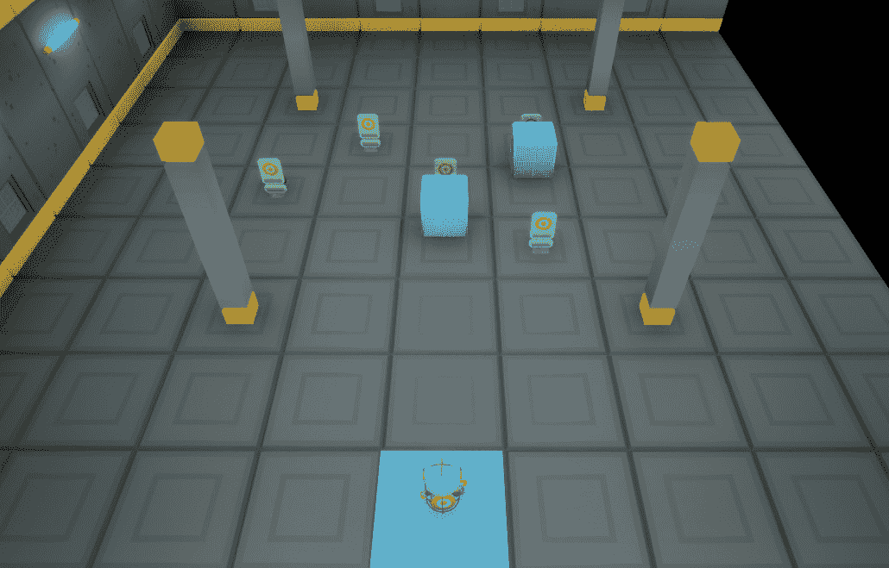
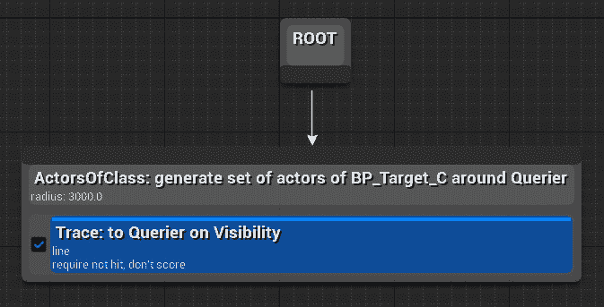
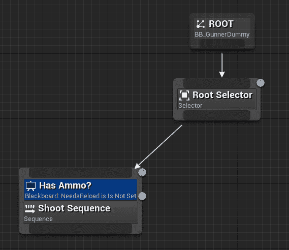
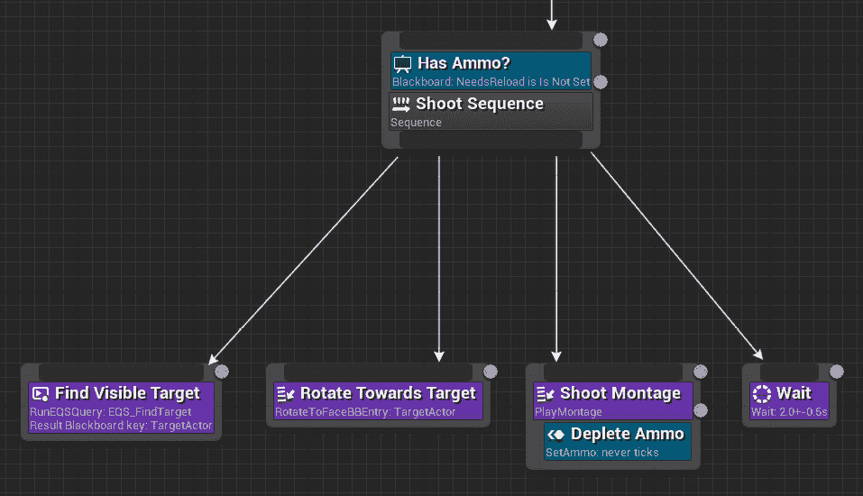
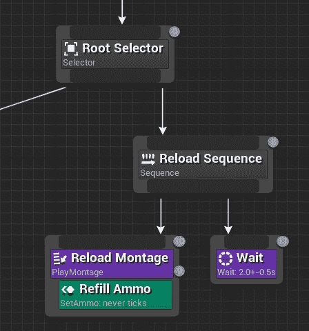
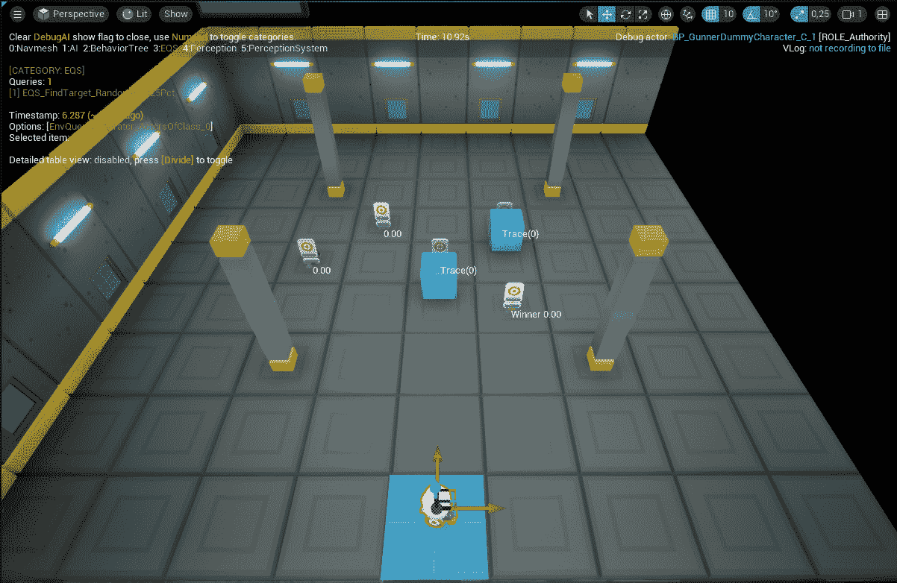
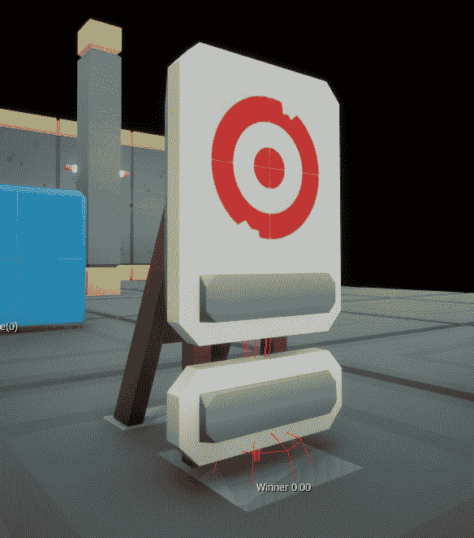
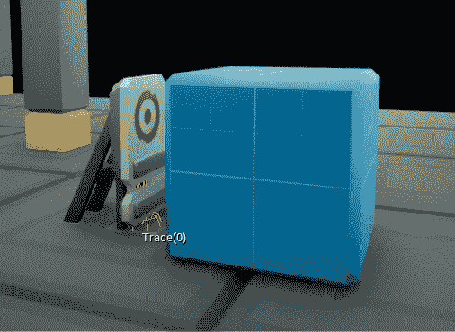
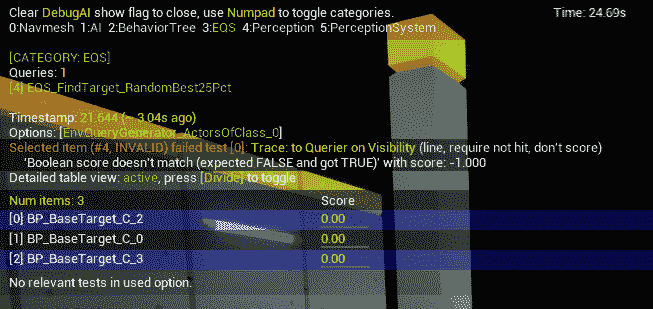

# 11

# 理解环境查询系统

在虚幻引擎中的**环境查询系统**（**EQS**）是 AI 框架中的一个强大功能，它允许开发者通过让 AI 代理查询环境并基于返回的结果做出明智的决策来收集关于虚拟环境的数据。在本章中，你将学习如何正确设置环境查询以及如何将其集成到 AI 代理的行为树中。

通过掌握 EQS，你将获得创建能够根据其周围环境做出明智决策的智能 AI 系统的能力。无论是寻找最佳观察点、定位关键资源还是为最佳游戏策略进行规划，EQS 打开了一个充满可能性的世界。虽然仍然是一个实验性功能，但了解 EQS 将让你能够在虚幻引擎中创建智能且动态的 AI 系统。

在本章中，我们将涵盖以下主题：

+   介绍环境查询系统

+   设置环境查询

+   在行为树中处理环境查询

+   显示 EQS 信息

# 技术要求

要跟随本章介绍的主题，你应该已经完成了前面的章节并理解了它们的内容。

此外，如果你希望从本书的配套仓库中的代码开始，你可以下载本书配套项目仓库中提供的**.zip**项目文件：[`github.com/PacktPublishing/Artificial-Intelligence-in-Unreal-Engine-5`](https://github.com/PacktPublishing/Artificial-Intelligence-in-Unreal-Engine-5)。

要下载最后一章末尾的文件，请点击**Unreal Agility Arena –** **第十章** **-** **结束**链接。

# 介绍环境查询系统

嗯，看起来马克斯博士在他的秘密实验室中取得了一些进展：

*在隐藏的实验室深处，马克斯博士和维克托利亚教授不知疲倦地致力于他们最新的努力；他们决心通过赋予他们分析和探索环境的新颖方式的能力来革新他们的 AI 木偶。*

*他们的心中充满了兴奋，马克斯博士和维克托利亚教授精心设计了复杂的算法，他们将他们的创造物注入了无止境的知识渴望，为他们配备了实验性的方法来观察和与世界周围的事物互动。随着 AI 木偶的苏醒，他们的眼睛闪烁着新的智慧火花，每一个都在探索其周围的环境并分析* *环境。*

Unreal Engine 的 EQS 是一个强大的工具，允许开发者定义复杂的查询来收集有关游戏世界的信息。EQS 使开发者能够创建能够动态适应环境条件变化的 AI 行为。通过使用 EQS，NPC 或其他游戏实体可以根据其周围环境做出智能决策。凭借其灵活性和易用性，EQS 是 Unreal Engine 中创建沉浸式和交互式游戏体验的有价值功能。

使用 EQS，你可以通过一组 **测试** 来查询收集到的数据，这些测试将生成与查询性质最接近的元素。

一个 **EQS 查询** 可以在行为树内部触发——或者，通过脚本——根据测试结果来指导决策。这些查询主要由 **生成器**（确定要测试和加权的地点或演员的元素）和 **上下文**（为测试或生成器提供参考框架的元素）组成。EQS 查询使 AI 角色能够定位执行攻击玩家、检索健康或弹药拾取、寻找最近的掩护点等任务的最佳位置，以及其他选项。

让我们首先详细检查所有这些元素。

## 解释生成器

生成器创建将要进行测试和加权的地点或演员——称为 **项**；结果将返回到属于查询的行为树。以下是一些开箱即用的生成器：

+   **类演员**：这将找到给定类的所有演员，并将它们作为测试项返回

+   **组合**：这将允许你创建一个生成器数组并用于测试

+   **当前位置**：这将允许你获取指定上下文的位置并使用它来验证测试

+   **Points**：生成器可用于在预定义位置周围创建基于形状的轨迹——**圆形**、**圆锥形**、**甜甜圈**、**网格**和**路径网格**。

此外，你可以通过扩展 **EnvQueryGenerator** 类（如果使用 C++ 开发）或 **EnvQueryGenerator_BlueprintBase**（如果使用蓝图开发）来实现自己的生成器。

注意

在 C++ 中创建的生成器通常比在蓝图（Blueprints）中开发的生成器运行得更快。

## 解释上下文

一个上下文为不同的测试和生成器提供了一个参考点，它可以从 **查询者**——当前由 AI 控制器执行的决策树所拥有的棋子——到涉及某一类型所有演员的更复杂场景。例如，**Points: Circle** 这样的生成器可以使用一个上下文，该上下文将提供多个位置或演员。

可用的 **上下文** 类如下：

+   **EnvQueryContext_Item**：这代表一个位置——作为一个向量——或一个演员

+   **EnvQueryContext_Querier**：这代表执行行为树的查询者

如您所猜测的，如果您在 C++ 中开发，可以通过扩展 **EnvQueryContext** 类来实现自己的上下文；如果您使用 Blueprints 开发，则扩展 **EnvQueryContext_BlueprintBase** 。

## 解释测试

一个测试确定 **环境查询**（即对环境的实际请求）使用的标准，以在给定上下文中从生成器中选择最佳项目。

一些现成的可用测试如下：

+   **距离**：这将返回项目位置和另一个位置之间的距离

+   **重叠：盒子**：这可以用来检查一个项目是否在测试本身定义的边界内

+   **PathExists：从查询器**：这可以用来检查是否存在通往上下文的路，并返回一些有用的信息，例如路径有多长

您可以通过扩展 **EnvQueryTest** 类在 C++ 和 Blueprints 中实现自己的测试。

现在您已经对主要的 EQS 元素有了基本的了解，是时候深入了解并开始使用它实现一个完全工作且有效的 AI 代理了。

# 设置环境查询

在本节中，您将学习如何将查询添加到行为树中；特别是，我们将调整虚拟枪手 AI 脑部，以便让它能够通过环境查询射击目标。

注意

如前所述，EQS 仍然是一个实验性功能，因此如果您想使用它开发游戏，应谨慎行事。在撰写本书时，EQS 默认通过使用 **环境查询** **编辑器** 插件启用。

## 创建健身房

作为第一步，我们将创建一个合适的健身房，所以请先按照以下步骤操作：

1.  从项目模板中提供的 Level Instances 和 Packed Level Actors 开始，创建您选择的关卡。

1.  添加一个 **BP_GunnerDummyCharacter** 实例；只需记住检查 **使用控制器偏航**，这样它就可以在需要时旋转并指向目标。

1.  添加一个或多个 **BP_Target** 实例，以便您的 AI 角色能够看到它们。

1.  添加一些障碍物，以阻挡 AI 代理的视线。最终的健身房应类似于 *图 11* *.1* 中描述的：

图 11.1 – 完成的健身房

现在是时候为 AI 代理设置 AI 控制器了。

## 创建 AI 控制器

第二步是创建一个专门的行为树和 AI 控制器，所以请按照以下步骤操作：

1.  在 **AI** 文件夹中，创建一个新的行为树并将其命名为 **BT_EQSGunnerDummy** 。

1.  在 **Blueprints** 文件夹中，创建一个新的 Blueprint 类，从 **BaseDummyAIController** 扩展，命名为 **AIEQSGunnerDummyController**，并打开它。

1.  在 **详情** 面板中，查找 **虚拟 AI 控制器** 类别，并将 **行为树** 属性设置为 **BT_EQSGunnerDummy** 。

1.  在关卡中选择枪手虚拟角色，并将其**AI 控制器类**属性设置为**AIEQSGunnerDummyController**。

现在 AI 控制器及其控制器角色已经正确设置，是时候设置一个我们将在行为树中使用的环境查询了。

## 创建环境查询

我们现在将创建一个环境查询，它将在关卡中寻找一个可行的目标。这将与我们在*第九章*中实现的**FindAvailableTarget**任务非常相似，有一些不同之处；我们将搜索特定类别的实例，并且目标需要与枪手视线对齐。此外，我们不会编写任何代码。因此，让我们先执行以下步骤：

1.  在**AI**文件夹中，右键单击并选择**人工智能** | **环境查询**以创建此类资产。

1.  将新创建的资产命名为**EQS_FindTarget**并打开它。

    您将看到一个名为**查询图**（与行为树类似）的图形，它将允许您实现自己的查询。

1.  从**ROOT**节点点击并拖动，添加一个**演员类**生成节点。

1.  选择新创建的节点，在**详细信息**面板中执行以下操作：

    +   将**搜索演员类**属性设置为**BP_Target**

    +   将**搜索半径**属性设置为**3000.0**

1.  右键单击**ActorsOfClass**节点，选择**添加测试** | **追踪**；将在节点内添加一个测试。

1.  选择测试，在**详细信息**面板中执行以下操作：

    +   将**测试目的**属性设置为**仅过滤**

    +   将**项目高度偏移**属性设置为**50.0**

    +   将**上下文高度偏移**属性设置为**50.0**

1.  取消选中**布尔** **匹配**属性。

环境查询的完整图形如图*11* *.2* 所示：

图 11.2 – 完成环境查询

我们在这里所做显然需要一些解释；我们添加了一个将寻找所有特定类别的演员 – **BP_Target** – 并且这些演员靠近查询者（执行此环境查询的 AI 代理）。只有那些与查询视线对齐的项目将通过追踪测试，因此它们将是唯一被考虑用于选择可行目标的项目。**测试目的**已设置为**仅过滤**，因为我们只需要有一个项目列表，对它们在搜索中的重要性 – 或**分数** – 不感兴趣。

现在环境查询已经定义，我们可以开始实现行为树。

# 在行为树中处理环境查询

现在我们已经准备好实现行为树，正如你将看到的，它与**BT_GunnerDummy**资产有一些相似之处；唯一的区别是我们获取可能目标的方式。因此，我们将使用与**BT_GunnerDummy**相同的 Blackboard。所以，无需多言，打开**BT_EQSGunnerDummy**，在**Details**面板中，将**Blackboard Asset**属性设置为**BB_GunnerDummy**。

现在，专注于行为树图并执行以下步骤：

1.  在**ROOT**节点上添加一个**Selector**节点并将其命名为**Root Selector**。

1.  在**Root Selector**节点上添加一个**Sequence**节点并将其命名为**Shoot Sequence**。

1.  在**Shoot Sequence**节点上添加一个**Blackboard**装饰器并将其命名为**Has Ammo?**。在**Details**面板中，执行以下步骤：

    +   将**Notify Observers**属性设置为**Value Change**

    +   将**Key Query**属性设置为**Is Not Set**

    +   将**Blackboard Key**属性设置为**NeedsReload**

    到目前为止的图应该看起来像*图 11.3*中显示的那样：

图 11.3 – 开始图

现在，让我们将环境查询连接到图中。

1.  将**Run EQSQuery**任务添加到**Shoot Sequence**，并将其命名为**Find Visible Target**

1.  在选择任务后，执行以下步骤：

    +   将**Query Template**属性设置为**EQS_FindTarget**。

    +   将**Run Mode**属性设置为**从最佳 25%中随机选择一个**

    +   将**Blackboard Key**属性设置为**TargetActor**。

    我们在这里执行环境查询，一旦返回结果项，我们就随机选择一个并将其分配给 Blackboard 的**TargetActor**键，以便它对行为树可用。现在，让我们继续我们的 AI 逻辑。

1.  在**Find Visible Target**节点右侧的**Shoot Sequence**中添加**RotateToFaceBBEntry**并将其命名为**Rotate Towards Target**。

1.  选择新创建的节点并将**Blackboard Key**属性设置为**TargetActor**

    你应该已经熟悉这个图的部分了；我们只是在将 AI 代理旋转到目标方向，以便准备射击。

    让我们继续处理图。

1.  在**Shoot Sequence**节点右侧的**Rotate Towards Target**节点右侧添加一个**Play Montage**节点，并将其命名为**Shoot Montage**。

1.  将**Anim Montage**属性设置为**AM_1H_Shoot**。

1.  在节点上添加一个**Set Ammo**服务并将其命名为**Deplete Ammo**。在**Details**面板中，执行以下步骤：

    +   将**Needs Reload**属性设置为**NeedsReload**

    +   检查**Key Value**属性

    这将启动射击动画蒙太奇，随后将生成一个弹体。

1.  在**Shoot Montage**节点右侧的**Shoot Sequence**中添加一个**Wait**任务，将**Wait Time**属性设置为**2.0**，将**Random Deviation**属性设置为**0.5**。这部分图应该看起来像*图 11.4*中描述的那样：

图 11.4 – 射击序列

我们现在需要创建装填序列。

1.  在**射击序列**右侧的**根选择器**中添加一个**序列**节点，并将其命名为**装填序列**。

1.  在**装填序列**节点中添加一个**播放蒙太奇**节点，并将其命名为**装填蒙太奇**。

1.  将**动画蒙太奇**属性设置为**AM_1H_Reload**。

1.  在节点中添加一个**设置弹药**服务，并将其命名为**补充弹药**。在**详细信息**面板中，执行以下步骤：

    +   将**需要重新装填**属性设置为**NeedsReload**

    +   不勾选**键值**属性

1.  在**装填序列**中，在**装填蒙太奇**节点右侧添加一个**等待**任务，将**等待时间**属性设置为**2.0**，将**随机偏差**属性设置为**0.5**。此部分图表如图*11* *.5* 所示：

图 11.5 – 装填序列

行为树现在已经完成，准备使用。

在本节中，我们展示了如何在行为树中集成环境查询；在下一节中，我们将测试其功能，我将向您展示如何使用调试工具与它一起使用。

# 显示 EQS 信息

要测试您的健身房，只需启动模拟；你应该注意到以下行为：

+   人工智能代理将射击目标并重新装填武器

+   人工智能代理将避免射击视线外的目标

这种行为应该无限期地进行；这是完全可以接受的，因为枪手正在通过搜索**BP_Target**类来寻找目标。为了提高健身房，您可能希望实现一些额外的逻辑，例如为被击中的目标实现销毁系统或为每个被击中的目标实现得分计数器。

要在屏幕上显示正在发生的事情，您需要启用调试工具，如*第六章*中所述，*优化导航系统*。一旦启用调试工具，您只需按下您的数字键盘上的*3*键来显示 EQS 信息，然后选择人工智能代理；在我们的例子中，您应该看到一组类似于图*11* *.6* 中所示的信息：

图 11.6 – EQS 调试

显然，每个环境查询都将有其自己的信息。在这个例子中，您会注意到每个目标都会显示一些数据和红色线框，选定的目标将被标记为**Winner**，如图*11* *.7* 所示：

图 11.7 – 选定的目标

将不会与查询者视线对齐的目标将标记为**Trace(0)**以显示跟踪失败，如图*11* *.8* 所示：

图 11.8 – 目标不在视线内

如果您想获取查询中每个项目的更详细信息，如图 11*.*9*所示，您可能需要从数字键盘上按除号键（*/*）：

图 11.9 – 详细信息

我强烈建议您创建自己的查询并在关卡中进行测试。使用调试工具可以在您项目开发过程中节省大量时间。充分利用这些工具以简化工作流程并提高效率。

# 摘要

在本章中，我们看到了一种新的方法——尽管是实验性的——让您的 AI 代理探测关卡并收集信息，以便做出有意义的决策。

从一点理论开始，我们创建了一个环境查询，开发了一个利用环境查询完全可操作的行为树，并在健身房环境中进行了测试。此外，我们还探讨了使用调试工具来分析关卡内活动的方法。

这本书的第三部分*结束*。在接下来的章节中，我们将深入探讨 AI 框架中的新功能，从了解实现 AI 代理的替代方法：分层状态机开始。

# 第四部分：探索高级主题

在本书的第四部分，您将了解 Unreal Engine 生态系统中的某些前沿和实验性 AI 功能。此外，您还将获得如何在您的项目中集成这些功能的知识。

本部分包括以下章节：

+   *第十二章* ，*使用分层状态机与状态树*

+   *第十三章* ，*使用质量实现面向数据的计算*

+   *第十四章* ，*使用智能对象实现交互元素*
