# 第十二章：使用状态树中的层次状态机

虚幻引擎提供了一个强大的框架，通过称为**状态树**的层次状态机来创建复杂的 AI 行为。通过定义各种状态和转换，开发者可以设计复杂的 AI 逻辑，使其能够适应动态环境。状态树提供了一种结构化的方法来管理 AI 行为，允许高效决策并与其他虚幻引擎中的系统无缝集成。更重要的是，使用状态树，您可以构建聪明的 AI 代理，它们能够对环境刺激做出反应，并以自然和逼真的方式与游戏世界互动。本章的目的是向您介绍虚幻引擎中的状态树框架及其基本概念。

在本章中，我们将简要介绍虚幻引擎中可用的状态树系统，并了解如何在项目中实现状态树。

在本章中，我们将涵盖以下主题：

+   介绍状态树

+   创建和管理状态树

+   使用高级状态树功能

# 技术要求

要跟进本章中介绍的主题，您应该已完成前面的章节并理解其内容。

您将使用本书配套仓库中可用的起始内容，该仓库位于[`github.com/PacktPublishing/Artificial-Intelligence-in-Unreal-Engine-5`](https://github.com/PacktPublishing/Artificial-Intelligence-in-Unreal-Engine-5)。通过此链接，找到本章的相应部分，并下载以下**.zip**文件：**Unreal Agility Arena –** **起始内容**。

虽然不是强制性的，但您可以使用到目前为止创建的代码或通过点击**Unreal Agility Arena –** **第十一章** **-** **结束**链接下载与上一章结尾对应的文件。

# 介绍状态树

很显然，迟早有人会揭露马克斯博士的秘密实验：

*在他们的秘密实验室中，马克斯博士和维克托利亚教授继续进行他们的开创性实验。然而，他们非凡发明的消息开始像野火一样迅速传播；摄影师和好奇的人开始涌向该地区，渴望揭开实验室墙壁隐藏的秘密。*

*马克斯博士和维克托利亚教授意识到他们需要采取极端措施来保护他们宝贵的研究。凭借他们的专业知识，这对天才组合开始用高级算法和行为模式增强他们钟爱的 AI 木偶。他们编程木偶以检测和响应未经授权的入侵，试图确保实验室* *和研究的* *安全。*

状态树是虚幻引擎中层次状态机的版本，它将行为树的选择器与状态机合并，使用户能够构建高效且井然有序的逻辑。

注意

层次状态机是一种在软件开发中用于模拟具有多个状态和转换的复杂系统的设计模式。它通过引入层次嵌套状态的概念扩展了传统有限状态机的概念。在层次状态机中，状态可以被组织成一个层次结构，其中高级状态封装并控制低级状态；这种嵌套允许对系统行为进行更模块化和组织化的表示。每个状态都可以有自己的子状态集，这些子状态还可以进一步拥有自己的子状态，形成一个层次树状结构。这种模式的主要优势是它提供了一种在多个状态之间重用行为的方法。而不是在不同的状态中重复类似的逻辑，可以在高级状态中定义共同的行为，并由其子状态继承。这促进了代码的重用性，减少了冗余，并简化了整体设计。

状态树是按层次结构组织的，状态选择过程通常从根开始。然而，状态选择可以从树中的任何节点启动。

当选择**状态**时，系统评估状态本身的**进入条件**集；如果条件满足，选择将进展到子状态。如果没有子状态存在，这意味着已经到达了叶节点，当前状态将被激活。

激活一个状态将触发从根到叶状态的所有状态，其中每个状态都包含**任务**和**转换**。

选择状态后，所选状态及其所有父状态变为活动状态，从根到叶状态执行所有活动状态的任务。状态中的所有任务都是并发执行的，第一个完成任务将触发可能导致选择新状态的转换。

转换可以指向树中的任何状态，并且它们由必须满足以使转换继续的一系列**触发条件**触发。*图 12.1*展示了状态树的典型示例（示例取自 Epic Games Marketplace 中免费提供的**城市样本**项目）：

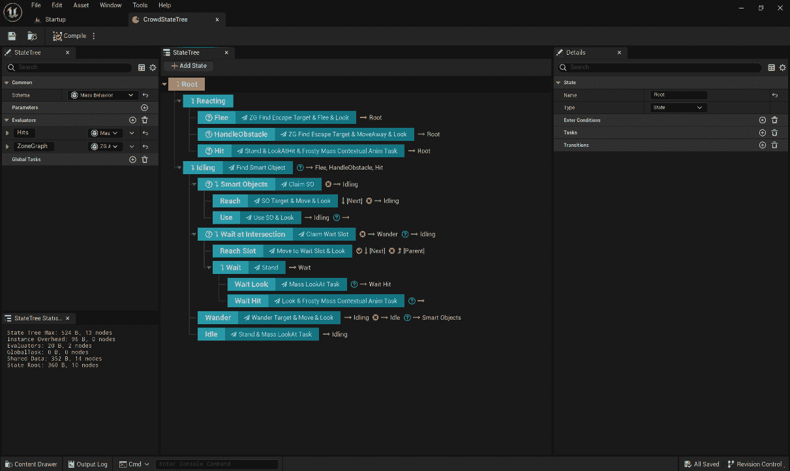

图 12.1 – 状态树示例

总结来说，状态树的主要元素如下：

+   **根状态**：当状态树开始执行其逻辑时首先选择的状态

+   **选择器状态**：具有子状态的状态

+   **状态进入条件**：列出决定状态是否可以被选择的条件

+   **任务**：列出当状态激活时将执行的一系列操作

+   **转换**：将触发状态选择过程的条件

注意

如果您感到好奇，状态树和行为树都是人工智能中使用的决策架构，但它们有不同的用途。状态树围绕离散状态和转换构建，关注实体的当前状态及其对事件的响应方式。这使得它们适用于需要明确、清晰状态的场景。相比之下，行为树旨在处理更复杂和流动的决策，允许模块化和分层任务执行。它们通过将简单动作组合成复杂序列，实现任务之间的平滑过渡，并能处理更复杂的行为。

现在您已经对主要状态树术语有了基本的了解，我们将展示如何扩展您自己的状态树。

## 扩展状态树

可以创建状态树以在 AI 控制器上执行或直接从演员执行。有两个不同的组件可用于处理状态树：

+   **StateTreeComponent**：这可以附加到任何演员上并由演员本身执行

+   **StateTreeAIComponent**：这可以附加到任何 AI 控制器上并由 AI 控制器本身执行

此外，如您可能已经猜到的，状态树系统是考虑到可扩展性而创建的，这意味着您可以创建自己的任务、评估器和条件。虽然您可以创建自己的 C++结构，但状态树是考虑到蓝图创建而实现的。特别是，可用的主要类如下：

+   **StateTreeTaskBlueprintBase**：用于实现您自己的任务

+   **StateTreeEvaluatorBlueprintBase**：用于实现您自己的评估器

+   **StateTreeConditionBlueprintBase**：用于实现您自己的条件

在扩展状态树时，建议使用蓝图而不是 C++来实现您自己的节点逻辑，这样可以提高灵活性和易用性。

## 理解状态树流程

状态树中的状态选择从树根开始，通过评估每个进入条件沿着树向下进行。评估过程遵循以下步骤：

+   如果进入条件不满足，选择将跳转到下一个兄弟状态

+   如果进入条件满足且状态是叶子节点，则将其选为新的状态

+   如果进入条件满足但状态不是叶子节点，则对第一个子状态执行过程

应该注意的是，状态选择是动态运行的，由转换触发。在第一次 tick 时，有一个隐式转换到根状态，然后确定要执行的初始状态。随后，一旦选择了这个状态，转换指定了触发选择逻辑的条件，确定何时以及在哪里执行。

一旦选择了状态，所有其任务都会执行，并且会持续执行，直到转换触发新的状态选择过程。

## 数据绑定

在游戏编程中，**数据绑定**指的是连接游戏不同部分之间数据的过程——例如用户界面和游戏逻辑——它涉及创建一个链接，允许数据在游戏的各个元素之间同步和更新。这有助于保持游戏元素的一致性和与最新信息的更新。

状态树使用数据绑定在树内传输数据以及为执行建立条件或配置任务。数据绑定允许以指定方式访问传递到状态树或节点之间的数据。

状态树节点具有以下元素以实现数据绑定：

+   **参数**：这些可以在树的执行过程中引用。

+   **上下文数据**：这表示状态树中可用的预定义数据。

+   **评估器**：这些是可以在运行时执行且可以公开数据的独立类，这些数据无法通过参数和上下文数据提供。

+   **全局任务**：这些在根状态之前执行，可以在你需要永久数据时在状态选择中使用。

值得注意的是，状态树中的节点可以在自己之间共享数据，并且可以以三种先前提到的方式绑定数据：

+   状态进入条件

+   转换条件

+   任务

在本节中，我们介绍了状态树及其关键特性。在下一节中，我们将通过构建自己的状态树来深入实践，以便在健身房环境中有效地使用它们。

# 创建和管理状态树

从本节开始，我们将基于几个 AI 代理使用状态树而不是行为树来创建一个新的健身房。这将帮助我们理解这种新开发模式背后的基本原理。

为了帮助我们理解这些原理，我们将执行以下操作：

+   在级别中创建/放置一个演员，该演员将使用专用状态树定期发出噪音

+   创建/放置一个虚拟角色，该角色将由另一个状态树管理，并将执行以下操作：

    +   在其起始位置保持空闲

    +   当感知到噪音时，到达噪音位置

    +   在调查位置后不久返回其起始位置

虽然这个逻辑相当简单，但它可以用作一个起始点，用于构建一个调查级别寻找入侵者并对周围任何可疑噪音做出反应的守护者 AI 代理。

由于状态树功能默认未启用，首先需要做的事情就是进入 **插件** 窗口并启用它。

## 启用状态树插件

要开始使用状态树，您需要启用一些专用插件。为此，请按照以下步骤操作：

1.  通过从主菜单中选择 **编辑** | **插件** 来打开 **插件** 窗口。

1.  搜索 **GameplayStateTree** 和 **StateTree** 插件并启用它们。

1.  重新启动虚幻引擎编辑器以激活它们。

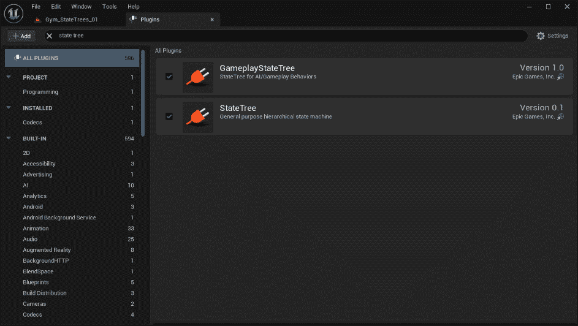

图 12.2 – 插件窗口

如果您计划使用 C++中的状态树（我们确实如此），您需要将模块添加到 Unreal Engine 构建文件中。

在我们的情况下，我们需要在构建中包含**GameplayStateTreeModule**依赖项，以便该模块可以供您的 C++实现使用。为此，打开您的 IDE，并在您的项目中定位到**UnrealAgilityArena.build.cs**文件；它应该位于**UnrealAgilityArena/Source**文件夹中。

注意

Unreal Engine 的**.build.cs**文件负责定义项目的构建方式，包括定义模块依赖项的选项。

查找以下代码行：

```py
PublicDependencyModuleNames.AddRange(new string[] { "Core", "CoreUObject", "Engine", "InputCore" });
```

更新如下：

```py
PublicDependencyModuleNames.AddRange(new string[] { "Core", "CoreUObject", "Engine", "InputCore", "GameplayStateTreeModule" });
```

因此，一旦您声明了这个模块，您将拥有在 C++中处理状态树所需的所有内容。

注意

在撰写本书时，似乎在 C++中声明**StateTreeAIComponent**类时存在一些问题，而**StateTreeComponent**类则运行良好。基本上，**StateTreeAIComponent**类似乎在模块中不可用，使用此类不会编译您的项目。为了克服这个问题，我们需要在需要时从 Blueprint 中添加**StateTreeAIComponent**类。

一旦插件被激活，我们就可以开始使用状态树实现我们的第一个 AI 代理：噪声发射器。

## 实现噪声发射器演员

现在，我们将创建一个演员，其唯一目的是通过**感知系统**定期发出噪声。这项任务很简单，可以以任何您认为合适的方式实现。然而，为了这个演示，我们将使用状态树来掌握这个系统的基本原理。

### 创建噪声发射器类

我们将首先创建噪声发射器的基类；我们需要声明所有视觉元素，最重要的是所需的感知系统组件和状态树组件。此外，我们将包含一个生成噪声的函数，而不关心将管理它的逻辑；这项责任将委托给状态树。

让我们从创建一个新的 C++类开始，该类扩展**Actor**并命名为**BaseNoiseEmitter**。一旦创建了类，打开**BaseNoiseEmitter.h**文件，并在**#include**声明之后添加以下前置声明：

```py
class UAIPerceptionStimuliSourceComponent;
class UStateTreeComponent;
```

之后，将类更改为 Blueprint 可接受的基类，通过将**UCLASS()**宏更改为以下内容：

```py
UCLASS(Blueprintable)
```

查找**Tick()**声明并将其删除，因为我们不会使用它。

接下来，在**GENERATED_BODY()**宏之后添加所需的组件：

```py
UPROPERTY(VisibleAnywhere, BlueprintReadOnly, Category="Dummy Target", meta=(AllowPrivateAccess="true"))
UStaticMeshComponent* BaseMeshComponent;
UPROPERTY(VisibleAnywhere, BlueprintReadOnly, Category="Dummy Target", meta=(AllowPrivateAccess="true"))
UStaticMeshComponent* DummyMeshComponent;
UPROPERTY(VisibleAnywhere, BlueprintReadOnly, Category="Dummy Target", meta=(AllowPrivateAccess="true"))
UAIPerceptionStimuliSourceComponent* PerceptionStimuliSourceComponent;
UPROPERTY(VisibleAnywhere, BlueprintReadOnly, Category="Dummy Target", meta=(AllowPrivateAccess="true"))
UStateTreeComponent* StateTreeComponent;
```

如前述代码所示，我们将使用一些静态网格，以及所需的状态树和感知系统组件。

现在，就在构造函数声明之后，添加以下声明：

```py
UPROPERTY(EditAnywhere, BlueprintReadWrite, Category = "Noise Generation")
float MaxNoiseRange = 3000.f;
UPROPERTY(EditAnywhere, BlueprintReadWrite, Category = "Noise Generation")
float NoiseRangeRandomDeviation = 100.f;
UPROPERTY(EditAnywhere, BlueprintReadWrite, Category = "Noise Generation")
FName NoiseTag = "EmitterNoise";
UFUNCTION(BlueprintCallable)
void EmitNoise();
```

如你所见，我们正在公开一些属性以自定义级别中的发射器实例，并声明一个**EmitNoise()**函数，我们将使用它来在需要时激活噪音发射。最后，**NoiseTag**属性将用于标记噪音，并被监听智能体识别。

现在是时候打开**BaseNoiseEmitter.cpp**文件并实现方法了。作为第一步，移除**Tick()**函数，并在构造函数中修改以下代码行：

```py
PrimaryActorTick.bCanEverTick = true;
```

将其修改为以下内容：

```py
PrimaryActorTick.bCanEverTick = false;
```

之后，添加所需的**#include**声明，所以将以下代码块添加到文件顶部：

```py
#include "Components/StateTreeComponent.h"
#include "Perception/AIPerceptionStimuliSourceComponent.h"
#include "Perception/AISense_Hearing.h"
```

现在，让我们在构造函数中初始化静态网格组件，添加以下代码：

```py
BaseMeshComponent = CreateDefaultSubobject<UStaticMeshComponent>(TEXT("BaseMesh"));
RootComponent = BaseMeshComponent;
static ConstructorHelpers::FObjectFinder<UStaticMesh>   BaseStaticMeshAsset(
    TEXT("/Game/KayKit/SpaceBase/landingpad_large.landingpad_large"));
if (BaseStaticMeshAsset.Succeeded())
{
    BaseMeshComponent->SetStaticMesh(BaseStaticMeshAsset.Object);
}
DummyMeshComponent = CreateDefaultSubobject<UStaticMeshComponent>(TEXT
  ("DummyMesh"));
DummyMeshComponent->SetupAttachment(RootComponent);
DummyMeshComponent->SetRelativeRotation(FRotator
  (0.f, -90.f, 0.f));
DummyMeshComponent->SetRelativeLocation(FVector
  (0.f, 0.f,  80.f));
static ConstructorHelpers::FObjectFinder<UStaticMesh>   DummyStaticMeshAsset(TEXT("/Game/KayKit/PrototypeBits/Models/Dummy_    Base.Dummy_Base"));
if (DummyStaticMeshAsset.Succeeded())
{
    DummyMeshComponent->SetStaticMesh(DummyStaticMeshAsset.Object);
}
```

你应该已经熟悉所有这些，所以我们可以继续并声明感知系统的刺激源和状态树，添加以下代码：

```py
PerceptionStimuliSourceComponent = CreateDefaultSubobject   <UAIPerceptionStimuliSourceComponent>(TEXT("PerceptionStimuli     Source"));
PerceptionStimuliSourceComponent->RegisterForSense   (UAISense_Hearing::StaticClass());
StateTreeComponent = CreateDefaultSubobject<UStateTreeComponent>(TEXT
  ("StateTree"));
```

如你所见，我们只是在创建所需组件；此外，我们正在将听觉感知注册为感知系统的刺激源。

现在，在**BeginPlay()**函数中，添加以下代码行：

```py
PerceptionStimuliSourceComponent->RegisterWithPerceptionSystem();
StateTreeComponent->StartLogic();
```

在这里，我们正在注册感知系统，并开始状态树的逻辑。这意味着游戏开始后，状态树将开始执行。

最后要做的就是实现**EmitNoise()**函数，所以添加以下这段代码：

```py
void ABaseNoiseEmitter::EmitNoise()
{
    const auto NoiseRange = MaxNoiseRange +
      FMath::RandRange(-1.f * NoiseRangeRandomDeviation,
      NoiseRangeRandomDeviation);
    UAISense_Hearing::ReportNoiseEvent(GetWorld(),
      GetActorLocation(), 1.f, this, NoiseRange, NoiseTag);
}
```

在*第十章* ，*通过感知系统改进智能体*，你已经学习了如何处理视觉感知。在听觉方面，情况略有不同；虽然可见性是持续发生的，但只有当你发出噪音时才会被听到。这就是为什么我们随机化一个噪音范围——基于之前声明的属性——我们使用**ReportNoiseEvent()**函数来发出实际的噪音。

这个类已经准备好了，我们现在可以专注于实际状态树的创建，从自定义任务开始：告诉演员发出噪音的东西。

### 创建发出噪音的任务

我们将要创建的状态树任务只需要告诉**BaseNoiseEmitter**实例执行**EmitNoise()**函数。这个任务将作为一个蓝图类创建，所以，在虚幻引擎编辑器的**内容浏览器**中，导航到**AI**文件夹，执行以下操作：

1.  创建一个新的蓝图类，从**StateTreeTaskBlueprintBase**扩展，命名为**STT_EmitNoise**。双击它以打开它。

1.  在**我的蓝图**面板中，悬停在**函数**部分，并点击出现的**覆盖**下拉菜单。

1.  选择**进入状态**选项，如图*图 12* *.3* 所示：

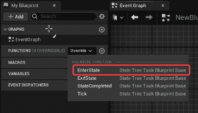

图 12.3 – 创建进入状态函数

将在事件图中添加一个**事件进入状态**节点；当状态树中的新状态被进入且任务是活动状态的一部分时，将执行此事件。

对于这个状态，我们需要一个指向拥有演员的引用；如前所述，状态树使用数据绑定进行通信。因此，我们将利用这一特性来创建引用。为此，请按照以下步骤操作：

1.  创建一个新的变量，它是**BaseNoiseEmitter**类型的**对象引用**，并将其命名为**Actor**。

1.  选择变量，在**详细信息**面板中，找到**类别**属性，并在**输入**字段中键入**上下文**，如图*图 12* *.4* 所示：

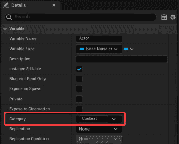

图 12.4 – 上下文类别

虽然变量的创建是显而易见的，但将类别名称设置为**上下文**的值需要一些解释；每次向**上下文**类别添加属性时，该属性本身将通过数据绑定暴露给将要执行的任务的状态树。当你需要从执行状态树获取信息或反之亦然时，这非常有用。

在有了这个新参考后，执行以下步骤：

1.  从**变量**部分，将**Actor**变量拖入事件图，并添加一个**获取** **Actor**节点。

1.  从**Actor**节点的输出引脚，连接一个**发出** **噪声**节点。

1.  将**Event Enter State**节点的输出执行引脚与**发出** **噪声**节点的输入执行引脚连接。

1.  从**Emit Noise**节点的输出执行引脚，连接一个**完成** **任务**节点。

1.  选择**Finish Task**节点的**成功**复选框。最终的图形应该看起来像*图 12* *.5* 中所示的那样：

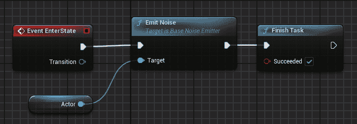

图 12.5 – 发出噪声图

这里唯一值得提的是，在发出噪声后，**Finish Task**节点将返回一个成功值。现在这项任务已经完成，我们终于可以开始处理状态树了。

### 创建噪声发射状态树

如前所述，我们将从演员执行状态树；这意味着我们需要能够与**StateTreeComponent**类一起使用的东西。为了做到这一点，我们需要创建一个遵循由**StateTreeComponentSchema**类规定的规则的资产，该类确保可以访问执行状态树的演员。要创建此类资产，请按照以下步骤操作：

1.  在**内容浏览器**中，打开**AI**文件夹，右键单击它，选择**人工智能** | **状态树**。

1.  从**为状态树选择模式**弹出窗口，选择**StateTreeComponentSchema**。

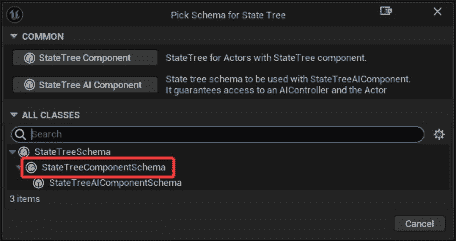

图 12.6 – 状态树创建

1.  将新创建的资产命名为**ST_NoiseEmitter**，双击它以打开它。

    一旦打开资产，找到位于编辑器左侧的**StateTree**标签，并注意有一个**Context Actor Class**属性，如图*图 12* *.7* 所示：

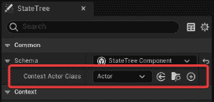

图 12.7 – 状态树上下文演员

这是所有者演员的引用；目前，它设置为通用演员，但我们需要更具体一些，因此点击下拉菜单并选择**BaseNoiseEmitter**的**对象引用**。从现在起，树中的每个节点都将有权访问此引用。

现在，让我们开始实现状态树逻辑：

1.  点击**添加状态**按钮三次以创建三个状态。

1.  选择每个状态，并在**详细信息**面板中分别命名为**随机延迟**、**调试信息**和**发出噪声**。您的状态树应类似于*图 12* *.8* 中所示：

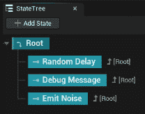

图 12.8 – 初始状态

如您所见，我们已经创建了状态树的基础结构，包含三个主要状态，这些状态将等待随机时间，显示调试信息，并最终发出噪声。

我们现在需要实现每个状态及其自己的任务和转换；让我们从第一个开始。选择**随机延迟**任务并执行以下操作：

1.  在**详细信息**面板中，定位到**任务**部分，并点击**+**按钮添加一个新任务。

1.  从新创建的任务中，点击下拉菜单并选择**延迟任务**。

1.  通过点击任务名称旁边的微小箭头图标来扩展任务。将**持续时间**属性设置为**10.0**并将**随机偏差**属性设置为**3.0**。

1.  定位到**转换**部分，并点击**+**按钮创建一个新的转换。

1.  您应该看到一个标记为**在状态转换完成后转到状态根**的项目。点击微小的箭头图标以展开它，并从**转换到**属性的下拉菜单中选择**下一个状态**。此状态应类似于*图 12* *.9* 中所示：

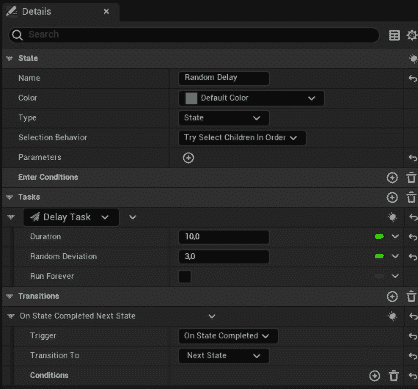

图 12.9 – 随机延迟状态

我们现在可以开始处理第二个状态——即**调试信息**——它将显示游戏中的消息。这显然不是使我们的状态树工作所必需的，但它有助于学习事物是如何工作的。选择此状态并执行以下操作：

1.  在**详细信息**面板中，定位到**任务**部分，并点击**+**按钮添加一个新任务。

1.  从新创建的任务中，点击下拉菜单并选择**调试文本任务**。

1.  通过点击任务名称旁边的微小箭头图标来扩展任务。将**文本**属性值设置为**发出噪声！**并将**文本颜色**属性设置为您的选择颜色——在我的情况下，我选择了明亮的黄色。

1.  创建另一个任务；点击下拉菜单并选择**延迟任务**。

1.  通过点击任务名称旁边的微小箭头图标来扩展任务，并将**持续时间**属性设置为**0.5**。

1.  定位到**转换**部分，并点击**+**按钮创建一个新的转换。

1.  你应该看到一个标记为 **On State Transition Completed Go to State Root** 的项；点击小箭头图标展开它，并从 **Transition To** 属性的下拉菜单中选择 **Next State** 。这个状态应该看起来像 *图 12.10* :

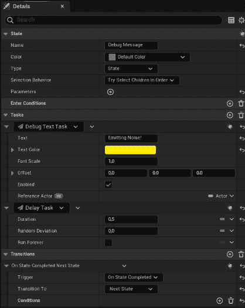

图 12.10 – 调试信息状态

现在选择最后一个状态——即 **Emit Noise** ——并执行以下操作：

1.  添加一个新任务，类型为 **STT Emit Noise** 。

1.  通过点击小箭头图标展开任务；你应该注意到一个名为 **Actor** 并标记为 **CONTEXT** 的属性。在其最右边，你应该看到一个下拉菜单箭头。点击它打开它并选择 **Actor** 。

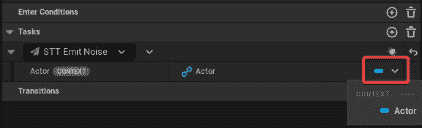

图 12.11 – 绑定

最后这个动作在状态树的 **Actor** 属性和我们创建 **STT_EmitNoise** 任务时添加的 **Actor** 属性之间建立了绑定。这个最后的属性已经被公开，因为在任务蓝图；我们将它的类别设置为 **Context** 。

最后这个状态将看起来像 *图 12.12* 中所示的那样：

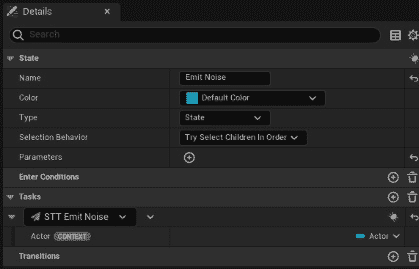

图 12.12 – 发出噪声状态

请注意，我们没有为这个任务添加转换。默认行为是指向 **Root** 节点，我们想要创建一个无限循环，所以我们简单地保留了默认行为。

注意

如果你对数据绑定不熟悉，一开始事情可能看起来有点奇怪，但不要担心。随着你逐渐习惯，事情将会变得相当简单且易于理解。

状态树已完成，应该看起来像 *图 12.13* :


图 12.13 – 完成的状态树

如你所见，了解每个状态及其状态树流程如何进展是非常容易的。现在是时候将所有东西整合起来，让噪声发射器运行起来！

### 创建噪声发射器蓝图

从 **BaseNoiseEmitter** 类创建蓝图相当直接，所以我们按照以下步骤进行：

1.  创建一个新的蓝图类，从 **BaseNoiseEmitter** 继承，并命名为 **BP_NoiseEmitter** 。

1.  打开它，并在 **AI** 部分找到 **State Tree** 属性。从下拉菜单中，将其值设置为 **ST_NoiseEmitter** 。

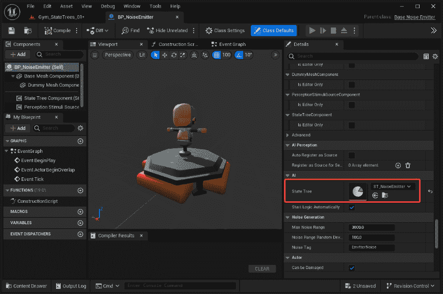

图 12.14 – 完成的 BP_NoiseEmitter

这就是你实现噪声发射器所需做的所有事情。重要的是要注意，我们所创建的从技术上讲不是一个 AI 代理。这是状态树的美丽之处；一旦你掌握了这个概念，你将能够将你的逻辑应用到许多不同类型的用例中。

现在噪声发射器已经准备好了，是时候在一个关卡中测试它了。

### 测试噪声发射器

要测试噪声发射器，您只需创建一个新的健身房并添加一些 **BP_NoiseEmitter** 实例。为此，请按照以下步骤操作：

1.  创建一个新的关卡，从我在项目模板中提供的 Level Instances 和 Packed Level Actors 开始。

1.  将一个或多个 **BP_NoiseEmitter** 实例添加到关卡中。

1.  播放关卡。

注意

请注意，如果我们点击 **Simulate** 按钮，**Debug Text Task** 消息将不会显示。要显示游戏中的消息，您需要使用常规的 **Play** 按钮。

当关卡播放时，您将看到每个 **BP_NoiseEmitter** 实例在随机时间显示调试消息，如图 *图 12* *.15* 所示：

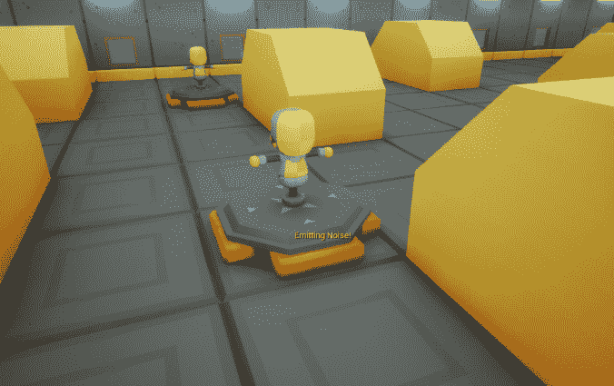

图 12.15 – 测试健身房

在本节中，我们看到了如何在演员内部实现状态树。从创建一个调用拥有者演员中方法的自定义任务开始，然后我们创建了我们的第一个无限循环的状态树，为感知系统发出噪声信号。

在以下部分，我们将创建一个守卫木偶，它将监听噪声事件并相应地做出反应。我们将使用状态树来完成这项工作。

# 使用高级状态树功能

在本节中，我们将再次扩展 **BaseDummyCharacter** 类以创建一个能够监听噪声信号并移动到噪声发生位置的 AI 代理。一旦检查了位置，AI 代理将返回到其原始位置。我们将首先创建一个 AI 控制器，它将通过感知系统获得听觉能力，并通过状态树处理其 AI 逻辑。我们实际上正在开发一个守卫来保护关卡免受入侵者。像往常一样，让我们首先创建我们自己的基础 C++ 类。

## 创建 C++ AI 控制器

人工智能控制器类需要实现听觉感知并执行状态树逻辑。如前所述，在撰写本书时，似乎存在一个 Unreal Engine 的错误，阻止我们在 C++ 中声明 **StateTreeAIComponent** 类，因此，暂时我们将只实现听觉感知，并从蓝图添加状态树组件。让我们创建一个新的 C++ 类，称为 **BaseGuardAIController**。然后，打开 **BaseGuardAIController.h** 文件，在 **#include** 声明之后添加以下前置声明：

```py
struct FAIStimulus;
```

然后，添加一个 **public** 部分，包含以下函数声明：

```py
public:
    ABaseGuardAIController();
    UFUNCTION(BlueprintCallable,
      BlueprintImplementableEvent)
    void OnTargetPerceptionUpdate(AActor* Actor,
      FAIStimulus Stimulus);
```

我们已经熟悉了这些函数声明，但请注意，**OnTargetPerceptionUpdate()** 函数添加了 **BlueprintImplementableEvent** 指示符；这将使我们能够从扩展蓝图而不是直接从此类中实现此函数。这意味着我们将实现此函数的责任留给了蓝图。现在，让我们打开 **BaseGuardAIController.cpp** 文件来实现函数。您应该添加的所需 **#include** 声明如下：

```py
#include "Perception/AIPerceptionComponent.h"
#include "Perception/AISenseConfig_Hearing.h"
```

然后，添加构造函数实现：

```py
ABaseGuardAIController::ABaseGuardAIController()
{
const auto SenseConfig_Hearing =
  CreateDefaultSubobject<UAISenseConfig_Hearing>
    ("SenseConfig_Hearing");
    SenseConfig_Hearing->
      DetectionByAffiliation.bDetectEnemies = true;
    SenseConfig_Hearing->
      DetectionByAffiliation.bDetectNeutrals = true;
    SenseConfig_Hearing->
      DetectionByAffiliation.bDetectFriendlies = true;
    SenseConfig_Hearing->HearingRange = 2500.f;
    SenseConfig_Hearing->SetStartsEnabled(true);
    PerceptionComponent =       CreateDefaultSubobject<UAIPerceptionComponent>(TEXT
      ("Perception"));
    PerceptionComponent->
      ConfigureSense(*SenseConfig_Hearing);
    PerceptionComponent->
      SetDominantSense(SenseConfig_Hearing->
        GetSenseImplementation());
    PerceptionComponent->
      OnTargetPerceptionUpdated.AddDynamic(this,
        &ABaseGuardAIController::OnTargetPerceptionUpdate);
}
```

我们已经知道如何配置 **AIPerceptionComponent**，请参阅 *第十章* ，*通过感知系统改进代理*，因此我不会在这里提供额外细节。只需注意代码的最后一行，其中我们注册了将管理听觉刺激的委托。

您现在可以编译项目，使此类对蓝图系统可用，因为在接下来的几个步骤中，我们将创建 AI 控制器蓝图。

## 实现 AI 控制器蓝图

现在基本 AI 控制器已准备就绪，我们可以开始实现一个将管理状态树的蓝图版本。要开始，在 **Blueprints** 文件夹中，创建一个从 **BaseGuardAIController** 扩展的新蓝图类，命名为 **AIGuardController**，并打开它。然后，执行以下步骤：

1.  创建一个名为 **NoiseTag** 的新变量，并设置为 **Name** 类型；将其设置为 **Instance Editable**。编译此蓝图后，将此变量的默认值设置为 **EmitterNoise**。

1.  创建另一个名为 **NoiseLocation** 的 **Vector** 类型的变量；将其设置为 **Instance Editable**。

1.  创建一个名为 **StartLocation** 的 **Vector** 类型的第三个变量；将其设置为 **Instance Editable**。

    现在，让我们按照后续步骤处理状态树。

1.  添加一个 **StateTreeAI** 类型的组件。

1.  将组件拖入事件图以添加对该组件本身的引用。

1.  从 **State Tree AI** 节点的输出插针连接一个 **Start Logic** 节点。

1.  将 **Event Begin Play** 节点的输出执行插针连接到 **Start Logic** 节点的输入执行插针。事件图应类似于 *图 12* *.16*：

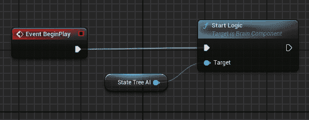

图 12.16 – Event Begin Play

此部分图将启动状态树的执行。现在，让我们存储 AI 角色的起始位置。为此，请按照以下步骤操作。

1.  从 **Variables** 部分将 **StartLocation** 变量拖入事件图，并将其设置为设置节点。

1.  将 **Start Logic** 节点的输出执行插针连接到 **Set Start Location** 节点的输入执行插针。

1.  添加一个 **Get Actor Location** 节点，并将其 **Return Value** 插针连接到 **Set Start Location** 节点的 **Start Location** 插针。

1.  添加一个 **Get Controller Pawn** 节点，并将其 **Return Value** 插针连接到 **Get Actor Location** 节点的 **Target** 插针。此部分图示在 *图 12* *.17* 中：


图 12.17 – 存储起始位置

**Event BeginPlay** 代码逻辑已完成，因此我们可以开始实现之前声明的 **OnTargetPerceptionUpdated()** 函数。为此，请按照以下步骤操作：

1.  在事件图中右键单击并添加一个 **Event On Target Perception Update** 节点。

1.  从**Stimulus**输出引脚点击并拖动，添加一个**Break AIStimulus**节点。

1.  从**变量**面板，拖动**NoiseTag**变量的 getter 节点。

1.  从**Noise Tag**节点的输出引脚，添加一个**Equal (==)**节点。

1.  将**Break AIStimulus**节点的**Tag**输出引脚连接到**Equal (==)**节点的第二个输入引脚。

1.  将**Event On Target Perception Update**节点的输出执行引脚连接到一个**Branch**节点。

1.  将**Equal (==)**节点的输出引脚连接到**Break**节点的**Condition**引脚。此部分图示见*图 12* *.18*：


图 12.18 – 检查刺激标签

我们现在需要存储噪声的位置，所以请按照以下步骤操作：

1.  从**变量**部分，拖动**NoiseLocation**引用以创建一个**Set**节点。

1.  将节点的输入执行引脚连接到**Branch**节点的**True**执行引脚。

1.  将**Set Noise Location**节点的**Noise Location**引脚连接到**Break AI Stimulus**节点的**Stimulus Location**引脚。此部分图示见*图 12* *.19*：

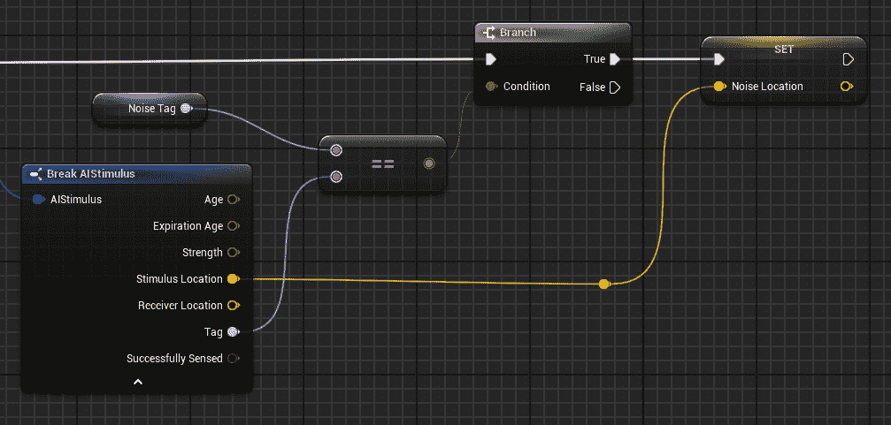

图 12.19 – 存储噪声位置

我们最后需要做的是通知状态树已经听到了噪声，并且 AI 代理需要相应地做出反应。为此，我们将使用**Gameplay Tags**。

注意

在虚幻引擎中，游戏玩法标签系统用于标记和分类游戏元素。游戏玩法标签是轻量级的标识符，可以轻松地附加到游戏实体（如演员或组件）上，以灵活和高效的方式组织和分类它们。学习如何使用游戏玩法标签超出了本书的范围；我们将只学习最基本的内容，以便正确地与状态树通信。

让我们继续进行事件图的实现，按照以下步骤操作：

1.  在图中添加一个**Make StateTreeEvent**节点。

1.  在图中添加一个**Send State Tree Event**节点。

1.  将**StateTreeAI**组件的引用拖入图中。

1.  将**Set Noise Location**节点的输出执行引脚连接到**Send State Tree Event**节点的输入执行引脚。

1.  将**State Tree AI**节点连接到**Send State Tree Event**节点的**Target**引脚。

1.  将**Make State Tree Event**节点的输出引脚连接到**Send State Tree Event**节点的输入**Event**引脚。

1.  在**Make StateTreeEvent**节点的**Origin**输入字段中，键入**AI Controller**。此部分图应类似于*图 12* *.20*：

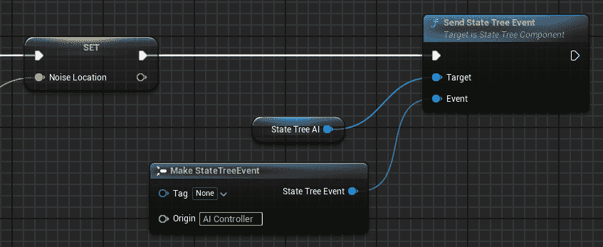

图 12.20 – 发送状态树事件

这段代码负责通过发送事件与状态树通信；该事件需要被标记以便状态树本身能够识别。为此，我们需要创建一个游戏标签。您可以通过以下步骤完成此操作：

1.  在 **Make StateTreeEvent** 节点中，点击 **标签** 输入引脚旁边的下拉菜单。目前，它应标记为 **None**。

1.  您将获得一个可用标签列表；点击 **管理游戏标签…** 选项以打开 **游戏标签** **管理器** 窗口。

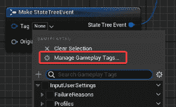

图 12.21 – 管理游戏标签…选项

1.  一旦 **游戏标签管理器** 窗口打开，点击 **+** 按钮。在 **名称** 输入字段中，输入 **UnrealAgilityArena.StateTree.HeardNoise**，并在 **来源** 字段中选择 **DefaultGameplayTags.ini**。

1.  点击 **添加新标签** 按钮以确认创建新的游戏标签。

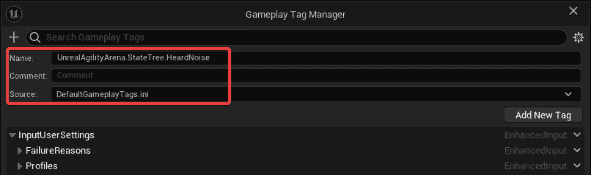

图 12.22 – 创建游戏标签

1.  在 **Make StateTreeEvent** 节点中，点击 **标签** 下拉菜单并选择 **HeardNoise** 复选框以选择该游戏标签。

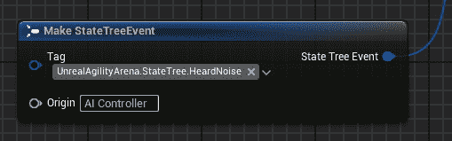

图 12.23 – 选择游戏标签

我们几乎完成了 **AIGuardController** 蓝图的制作；唯一剩下的事情就是包含状态树引用，但我们必须先创建它！

## 实现状态树

现在，我们将实现状态树。这次，我们将从 **AIGuardController** 蓝图中执行它。这就是为什么我们需要一个常规状态树的子类 – 那就是状态树 AI – 它将有一个对拥有 AI 控制器的引用。

主要状态如下：

+   **空闲**：AI 代理将停留在其起始位置

+   **警报**：AI 代理已收到噪音通知，它将去检查位置

+   **返回起始位置**：AI 代理将返回其起始位置

因此，让我们先打开 **AI** 文件夹并执行以下步骤：

1.  右键点击并选择 **人工智能** | **状态树**。

1.  从 **选择状态树架构** 弹出窗口中，选择 **StateTreeAIComponentSchema** 并将新创建的资产命名为 **STAI_Guard** 。双击它以打开它。

1.  在 **状态树** 左侧面板中，将 **AI 控制器类** 属性设置为 **AIGuardController**，将 **上下文演员类** 属性设置为 **BP_Guard**。

正如我们之前提到的，上述步骤将状态树绑定到拥有 AI 控制器和演员；这样您将有权访问它们的属性。

我们现在将实现基本状态。为此，执行以下步骤：

1.  创建三个状态，分别命名为 **Idle**、**Warned**、**Resume**。

1.  选择 **警告** 和 **恢复** 状态，并在 **详细信息** 面板中，将 **类型** 属性设置为 **组**。

    我们将**警告**和**恢复**状态标记为组，因为它们不会包含任务，而是将任务委托给子状态。它们基本上充当状态容器。

作为额外选项，**状态树**面板有一个**主题**部分，它允许您定义可以应用于**详细信息**面板中每个状态及其子状态的州颜色。在我的情况下，我选择了*图 12* *.24*中显示的颜色：

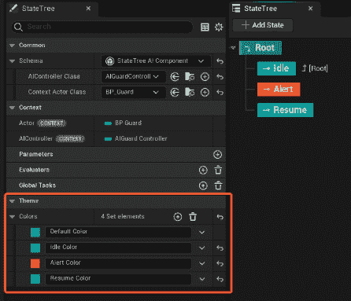

图 12.24 – 基础状态

现在我们将分别实现每个状态。

### 实现空闲状态

**空闲**状态将会非常简单；我们将让 AI 代理在一个无限循环中等待，直到我们收到噪声通知。要实现此状态，选择它并执行以下步骤：

1.  添加一个具有**持续时间**属性设置为**10.0**的**延迟任务**。

1.  添加一个具有以下设置的**过渡**：

    +   **触发**属性设置为**在状态完成时**

    +   **过渡到**属性设置为**空闲**

1.  添加另一个具有以下设置的**过渡**：

    +   **触发**属性设置为**在事件发生时**

    +   **事件标签**属性设置为**UnrealAgilityArena.StateTree.HeardNoise**

    +   **过渡到**属性设置为**警报**

    +   **优先级**属性设置为**高**

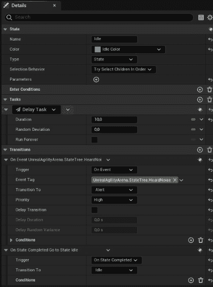

图 12.25 – 空闲状态

如您所见，我们将在这个状态内部持续循环，直到从 AI 控制器收到通知，表示已经听到噪声。在这种情况下，我们将过渡到**警报**状态。

### 实现警报状态

一旦进入**警报**状态，AI 代理将尝试移动到噪声位置。一旦到达那个位置，它将等待一段时间后再改变状态；为此我们需要两个子状态。

因此，要创建第一个子状态，请执行以下步骤：

1.  创建一个新的状态并命名为**移动到** **噪声位置**。

1.  添加一个**动作** | **移动到**类型的任务，并按照以下步骤进行操作：

    1.  通过点击下拉箭头并选择**AIController**将**AIController**属性（标记为**上下文**）绑定到拥有者 AI 控制器。

    1.  定位到**目标**属性，点击下拉箭头，选择**AIController** | **噪声位置**以将此属性绑定到 AI 控制器拥有者的**NoiseLocation**属性。

1.  添加一个具有以下设置的**过渡**：

    +   **触发**属性设置为**在状态成功时**

    +   **过渡到**属性设置为**下一个状态**

1.  添加另一个具有以下设置的**过渡**：

    +   **触发**属性设置为**在状态失败时**

    +   **过渡到**属性设置为**恢复**

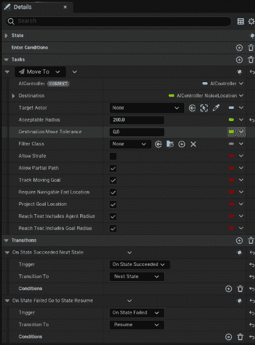

图 12.26 – 移动到噪声位置状态

1.  状态树的这一部分将 AI 代理移动到拥有 AI 控制器内**噪声位置**属性中设置的位置。一旦成功，将执行下一个状态。如果位置无法到达，它将回到原始位置。

现在通过以下步骤创建**警报**状态的第二个子状态：

1.  创建一个新的状态，并将其命名为**检查** **噪声位置**。

1.  添加一个**延迟任务**类型的任务，并按照以下步骤操作：

    +   将**持续时间**属性设置为**3.0**

    +   将**随机偏差**属性设置为**1.0**

1.  添加一个具有以下设置的**转换**：

    +   将**触发**属性设置为**在状态完成时**

    +   将**转换到**属性设置为**恢复**

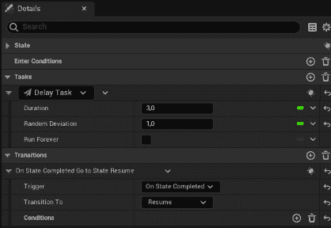

图 12.27 – 检查噪声位置状态

状态树的这一部分将使 AI 代理稍作等待，然后返回到其原始位置。如果 AI 代理没有发现任何可疑之处，它将返回到其警戒位置。

### 实现恢复状态

**恢复**状态需要将 AI 代理带回到其原始位置；此外，在任何时候，如果通知了新的噪声，此状态应被中断。因此，要创建第一个子状态，请按照以下步骤操作：

1.  创建一个新的状态，并将其命名为**移动到** **起始位置**。

1.  添加一个**动作** | **移动到**类型的任务，并按照以下步骤操作：

    1.  通过点击下拉箭头并选择**AI 控制器**，将标记为**上下文**的**AI 控制器**属性绑定到拥有 AI 控制器。

    1.  定位到**目标**属性，点击下拉箭头，选择**AI 控制器** | **起始位置**以将此属性绑定到 AI 控制器所有者的**起始位置**属性。

1.  添加一个具有以下设置的**转换**：

    +   将**触发**属性设置为**在状态完成时**

    +   将**转换到**属性设置为**下一个状态**

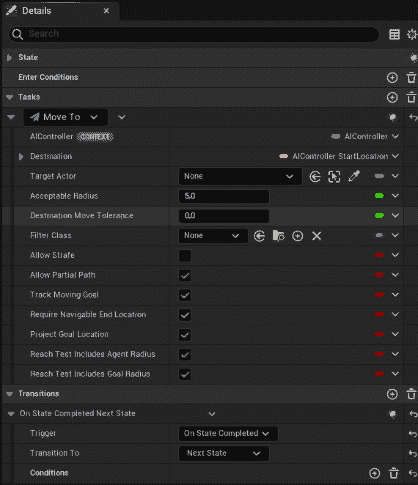

图 12.28 – 移动到起始位置状态

此状态与**移动到噪声位置**类似；唯一的区别是**目标**属性，在这种情况下，是 AI 代理的原始位置。

现在通过以下步骤创建**恢复**状态的第二个子状态：

1.  创建一个新的状态，并将其命名为**等待**。

1.  添加一个**延迟任务**类型的任务，并按照以下步骤操作：

    +   将**持续时间**属性设置为**2.0**

    +   将**随机偏差**属性设置为**1.0**

1.  添加一个具有以下设置的**转换**：

    +   将**触发**属性设置为**在状态完成时**

    +   将**转换到**属性设置为**空闲**

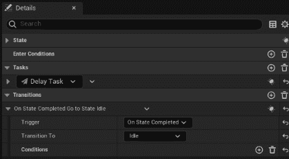

图 12.29 – 等待状态

作为最后一步，如果听到新的噪声，我们需要中断**Resume**状态，因此选择**Resume**状态并执行以下步骤：

1.  添加以下设置的**过渡**：

    +   将**触发**属性设置为**On Event**

    +   将**事件标签**属性设置为**UnrealAgilityArena.StateTree.HeardNoise**

    +   将**过渡**到属性设置为**Alert**

    +   将**优先级**属性设置为**高**

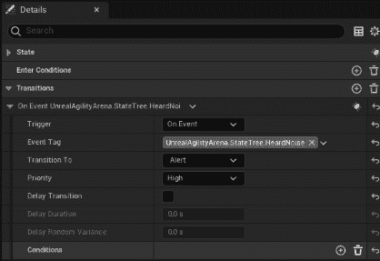

图 12.30 – Resume 状态

状态树相当完整，应该看起来像*图 12* *.31* 中所示的那样：

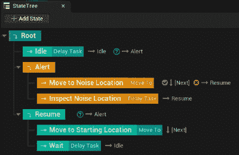

图 12.31 – 完成的状态树

现在状态树已准备就绪，我们需要将其添加到 AI 控制器中。

## 将状态树分配给 AI 控制器

将新创建的状态树分配给 AI 控制器相当直接。只需打开**AIGuardController**蓝图，在**详细信息**面板中找到**AI**部分。将**状态树**属性设置为**STAI_Guard**。

完成此操作后，我们可以创建 AI 代理蓝图。

## 创建守卫蓝图

现在我们将创建我们的守卫蓝图并将 AI 逻辑分配给它。为此，打开**内容抽屉**。在**蓝图**文件夹中，创建一个从**Base Dummy Character**扩展的新蓝图，并将其命名为**BP_Guard**。

打开新创建的蓝图，在**详细信息**面板中，将**AI 控制器类**属性设置为**AIGuardController**。

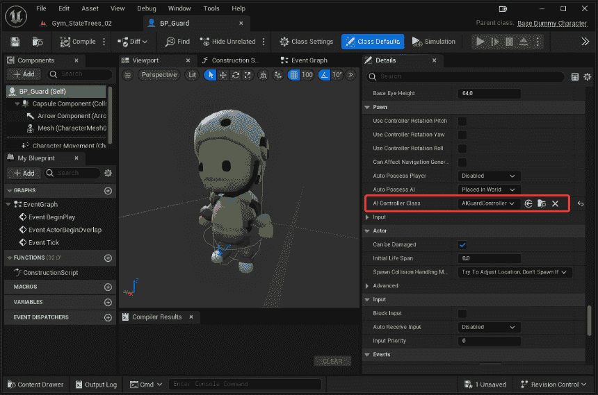

图 12.32 – 守卫蓝图

守卫 AI 代理现在已准备就绪；我们只需要在健身房中测试它。

## 在健身房中测试

当蓝图类准备就绪时，是时候测试它了。你只需要将其添加到之前创建的健身房，并玩这个关卡。每当噪声发生器演员发出噪声时，你应该看到**BP_Guard**实例试图到达噪声位置，然后过一会儿回到其原始位置。显然，所有这些都会在 AI 代理在引起噪声的位置范围内时工作。你可以显然利用你对 AI 调试工具的理解来获得关于 AI 代理听觉能力和范围的宝贵见解。


图 12.33 – 测试健身房

在这个相当长的部分中，你获得了更多关于如何实现自己的状态树的高级信息。从一个具有一些听觉能力的 AI 控制器开始，我们学习了如何控制状态树并在状态树和 AI 控制器之间绑定重要数据。最后，我们将 AI 控制器和状态树添加到 AI 代理中，并在健身房中测试其行为。

我们创建的 AI 代理为完整的 AI 守卫代理奠定了基础。目前，它仅仅检查任何可疑的声音并调查其来源。我强烈建议添加你自己的逻辑来引入更多动作，例如在检测到敌人或试图攻击声音来源时发出警报。

# 摘要

在虚幻引擎中，状态树对于 AI 框架至关重要，因为它们有助于高效地管理和组织 AI 代理的决策过程。它们根据你的设计和开发模式提供了一个整洁的替代方案，即行为树。

在本章中，我们学习了状态树的基础知识，这是在虚幻引擎中实现的一个分层状态机框架。从其主要概念开始，例如状态是如何处理的，我们被引入了涉及的主要元素——包括任务、转换和条件。之后，我们创建了我们的自己的演员，利用了状态树的优势。

在下一章中，我们将处理一个完全不同的主题：如何在你的关卡内管理大量对象，将它们作为一个集体组来处理或进行模拟。
