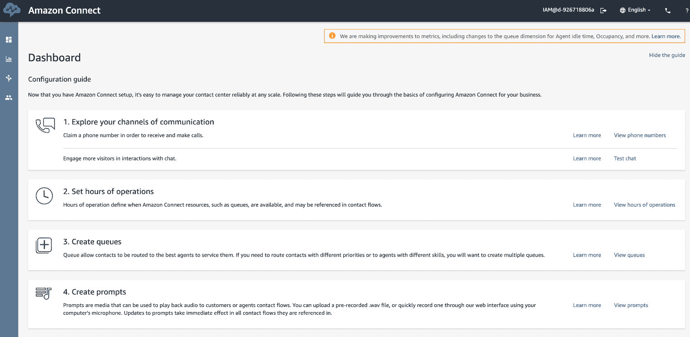

# 5. 使用语音与聊天机器人

概述

在本章中，我们将学习 Amazon Connect 的基础知识。我们将探讨如何使用 Amazon Connect、Lex 和 Lambda 通过语音与聊天机器人进行交互。我们还将演示如何使用 Amazon Connect 创建个人呼叫中心。我们将学习如何为个人呼叫中心获取免费电话号码。我们还将了解如何使用 Amazon Connect 与 Amazon Lex 聊天机器人结合使用联系流程和不同的模板。到本章结束时，你将能够将呼叫中心连接到你的 Lex 聊天机器人。

# Amazon Connect 基础知识

**Amazon Connect** 是 AWS（亚马逊网络服务）提供的一项服务，允许你创建基于云的呼叫中心。这意味着人们可以使用电话号码来联系该服务并与机器人或人类代表进行对话。在本章中，我们主要关注使用上一章构建的聊天机器人来自动化交互。

Amazon Connect 的一些关键特性如下：

+   使用图形编辑器定义的工作流程，设置和连接 Connect 非常容易。

+   没有基础设施需要部署或管理，因此呼叫中心可以快速扩展或缩减规模。

+   这是一种**按使用付费**的服务，因此没有设置费或月费。我们将使用免费层，所以我们应该不需要支付任何费用来使用这项服务。对于商业用途，费用基于每分钟的费率。

+   Amazon Connect 部署在 42 个可用区域和 16 个地理区域内。

    免责声明

    不幸的是，Amazon Connect 并非在所有地区都可用。在设置 Amazon Connect 时，会提供一个本地电话号码，截至本书编写时（2020年4月），这项服务仅在美、英、澳、日、德和新加坡可用。好消息是亚马逊正在不断扩展其服务。因此，当你阅读这本书时，Amazon Connect 可能会在你所在地区可用。有关地区的表格请参阅 [https://aws.amazon.com/about-aws/global-infrastructure/regional-product-services/](https://aws.amazon.com/about-aws/global-infrastructure/regional-product-services/)。

## 免费层信息

在整本书中，你只需要使用所提供服务的免费层。然而，了解免费使用的限制和其他层的定价非常重要。

你应该参考官方网页 [https://aws.amazon.com/connect/](https://aws.amazon.com/connect/)。单个呼叫中心可能包括一定数量的 Amazon Connect 服务使用量和直接拨打号码，包括 60 分钟的入站和出站通话。这可能会根据你的区域设置而变化。

注意

对于这本书，你不需要使用免费层之外的服务。如果你超出了免费层的限制，亚马逊将根据在 [https://aws.amazon.com/connect/pricing/](https://aws.amazon.com/connect/pricing/) 发布的费率进行收费。

# 与聊天机器人交互

使用Connect通过语音与您的聊天机器人交互需要您首先在Connect中设置一个呼叫中心。呼叫中心获得一个免费的本地电话号码（或在美国的免费长途电话号码）。此号码可以连接到`MarketNanny`）。聊天机器人使用Lambda无服务器服务从外部API获取数据并将其回传给电话中的用户：

*图片参考*: [https://aws.amazon.com/blogs/aws/new-amazon-connect-and-amazon-lex-integration/](https://aws.amazon.com/blogs/aws/new-amazon-connect-and-amazon-lex-integration/)

![图5.1：使用Amazon Connect、Lex和Lambda的基于语音的聊天机器人应用程序示例


图5.1：使用Amazon Connect、Lex和Lambda的基于语音的聊天机器人应用程序示例

# 通过Amazon Connect使用呼叫中心与您的聊天机器人交谈

使用Amazon Connect，我们可以创建一个呼叫中心应用程序，这将使我们能够通过语音命令而不是文本框连接到我们在上一章*第4章*，*对话式人工智能*（`MarketNanny`）中构建的聊天机器人。

要创建一个Amazon Connect呼叫中心，您需要创建一个Amazon Connect实例。每个示例都包含了与您的呼叫中心实例相关的多数资产和设置。您可以从Amazon Connect支持页面监督您场景的设置。

您可以创建各种实例；然而，每个示例仅限于创建它的AWS区域内部。设置、客户端、测量和细节不会在Amazon Connect实例之间共享。

注意

必须有一个AWS账户。Amazon Lex服务可以通过控制台页面访问。

## 练习5.01：创建个人呼叫中心

在这个练习中，我们将使用Amazon Connect创建一个个人呼叫中心，并将您的`MarketNanny`聊天机器人连接到它。请注意，我们已经在本章前面讨论了Amazon Connect服务：

1.  对于第一步，导航到AWS控制台中的Amazon Connect服务页面。您可以选择链接进行导航，或者可以直接访问[https://console.aws.amazon.com/connect](https://console.aws.amazon.com/connect)：

    图5.4：Amazon Connect资源配置屏幕的第2步

1.  在下一步中，请保持`传入电话`复选框选中，并取消选中`传出电话`复选框：

    注意

    在这种情况下，我们不需要我们的机器人向任何人发起电话，但我们确实希望它能够接收电话。

    

    图5.5：Amazon Connect资源配置屏幕的第3步

1.  完成后，请点击`下一步`按钮。

1.  接下来，您将看到一个信息屏幕，告知您正在授予呼叫中心应用程序读取和写入您的S3存储桶数据的权限，加密或解密数据，以及读取和写入`CloudWatch`日志。

1.  它还将显示存储您的`数据`和联系流程日志的`S3存储桶`的位置。点击`下一步`。

    注意

    注意，有一个`自定义设置`链接可以进一步自定义这些位置，但我们现在不会使用它。

    

    图5.6：Amazon Connect资源配置屏幕的第4步

1.  这将带您到最后一个屏幕，该屏幕将为您提供对您的联系中心应用程序所有设置的回顾：

    图5.7：Amazon Connect资源配置屏幕的第5步

1.  现在，点击`创建实例`按钮以创建您的应用程序。您应该会看到一个对话框窗口：

    图5.8：设置Amazon Connect

1.  一分钟或两分钟后，它将完成设置过程，并将您带到`成功！`屏幕，您可以在其中点击`开始使用`按钮直接进入您的应用程序：

图5.9：成功！屏幕

注意

设置应用程序可能需要长达15分钟的时间。因此，如果您最初未能成功进入应用程序页面，请保持耐心，并时不时地再次尝试，直到成功为止。

通常，这不会花费很长时间，并且通常，应用程序页面将立即可访问。

因此，您在几分钟内就创建了一个客户联系中心，这在以前可能需要3到6个月的时间。虽然创建界面看起来非常简单，但它掩盖了所有底层基础设施的复杂性。这就是Amazon AWS Connect的力量。

正如您将在下一个练习中看到的那样，您实际上可以获取一个物理电话号码，以便拨打您自己的联系中心。

## 练习5.02：为您的呼叫中心获取免费电话号码

在这个练习中，我们将为我们的定制呼叫中心获取一个免费号码。这个免费电话号码可以通过Amazon Connect提供的免费层服务获得。以下是为了获取免费号码需要执行的步骤：

1.  您个人呼叫中心的欢迎屏幕应该可见。如果不可见，您可以在之前屏幕上显示的URL中轻松访问它，在您点击`开始`按钮之前：![图5.10：Amazon Connect欢迎屏幕

    

    图5.10：Amazon Connect欢迎屏幕

1.  在这一点上，您可以点击`让我们开始`按钮来启动第一步，即为您呼叫中心应用程序申领一个本地电话号码。在这个屏幕上，您可以选择您的国家：![图5.11：获取电话号码屏幕

    

    图5.11：获取电话号码屏幕

1.  将`类型`保留为默认选项（直接拨打）。然后，从`电话号码`下拉菜单中选择一个电话号码。在大多数情况下，这应该是一个您当地的号码。如果您选择了一个不是本地的号码，您可能会根据拨打该号码的成本付费：![图5.12：电话号码选择

    

    图5.12：电话号码选择

1.  完成后，点击`下一步`按钮。这将允许您通过拨打新电话号码来测试您的电话号码。您应该会听到一条以*您好，感谢来电*开始的语音信息

1.  这将随后显示一个选项列表；您可以在有时间的时候尝试它们，看看它们会做什么。现在，点击`继续`按钮，这将带您到`仪表板`屏幕：![图5.13：Amazon Connect仪表板屏幕

    

图5.13：Amazon Connect仪表板屏幕

您现在已经在Amazon Connect上拥有了一个工作的呼叫中心应用。

# 使用Amazon Lex聊天机器人和Amazon Connect

通过Amazon Lex，您可以创建智能聊天机器人。这可以通过将联系流程转换为常规对话来实现。Amazon Connect服务通过启用创建一个联系中心（基于云）以及生成动态流程来补充之前提到的功能，从而为您的来电者提供个性化的体验。此外，来电者在通话过程中输入的**双音多频**（**DTMF**）数字可以很容易地被这些聊天机器人识别。

当Amazon Lex和Amazon Connect协同工作时，聊天机器人可以评估来电者的意图。此外，您可以使用AWS Lambda函数与您的聊天机器人一起处理来电请求，向来电者提供信息，并查询应用程序。这些聊天机器人能够通过智能管理对话并实时根据来电者的回复审查回复来维持上下文。

在下一节中，我们将连接您的 *MarketNanny* 聊天机器人到呼叫中心。这样，用户就可以通过电话说话，并将他们的语音自动转换为文本话语，该话语将被发送到 Lex 聊天机器人。

## 了解联系流程

**联系流程**定义了客户在与您的呼叫中心互动时经历的每个步骤。Amazon Connect 提供了模板，供您创建简单高效的联系流程。您还可以使用可视联系流程编辑器创建新的联系流程。编辑器是一个非常直观且简单的工具，用于创建联系流程。但不要被简单性所迷惑——您可以创建非常复杂和详细的流程。

联系流程设计器屏幕提供了一个在拖放环境中创建联系流程的方法。联系流程由左侧面板中的节点组成，这些节点可以在设计区域（在“显示更多流程信息”链接下）访问。

节点根据“交互”、“设置”、“分支”、“集成”和“终止”/“转接”类别进行分类。可以通过点击每个类别旁边的下拉图标来隐藏或显示每个类别中的节点。您将通过为您的聊天机器人创建联系流程来探索一些可用的节点。

联系流程是用户（通常是主管）逐步刷新进入框架的每个通话的设置，并确保用户听到定制和相关的选择的一种方式。虽然有许多预设计的联系流程，但您将为您的`MarketNanny`聊天机器人创建一个新的流程。

## 联系流程模板

下面的列表列出了可用的各种模板。仅作信息参考，完整的列表显示在下面的屏幕截图中。您创建的模板也将显示在模板列表中。您可以点击每个流程以获取更多详细信息并从中学习：


![图 5.15：从 AWS 管理控制台选择 Amazon Connect

选择您的 Connect 实例：

![图 5.16：Amazon Connect 控制台


图 5.16：Amazon Connect 控制台

## 练习 5.03：将呼叫中心连接到您的 Lex 聊天机器人

在这个练习中，您将设置您的呼叫中心，使其能够接受来电，并且可以将您的 `MarketNanny` 聊天机器人连接到呼叫中心。以下是要完成这些步骤的步骤：

1.  从亚马逊管理控制台，通过 `服务` 菜单导航到 `客户参与` 下的 `Amazon Connect`。您将看到 `Amazon Connect` 虚拟联系中心实例屏幕；点击您的实例。从左侧工具栏中选择 `联系流程`。点击 `机器人`；然后点击下拉菜单以找到 `MarketNanny` 机器人条目，选择它，然后选择 `添加 Lex 机器人` 链接以保存它：![图 5.17：带有 Lex 机器人选择下拉菜单的联系流程屏幕

    

    图 5.17：带有 Lex 机器人选择下拉菜单的联系流程屏幕

    以下截图显示了将 `MarketNanny` 添加到 Lex 机器人的情况：

    ![图 5.18：显示 Lex 机器人

    

    图 5.18：显示 Lex 机器人

1.  现在，您可以通过选择 `概览` 链接并点击 `登录 URL` 按钮然后输入您的 Amazon Connect 实例凭据来返回到 `仪表板` 屏幕。`仪表板` 屏幕将在新的浏览器标签页中打开：![图 5.19：登录概览屏幕

    

    图 5.19：登录概览屏幕

1.  在 `仪表板` 屏幕上，选择 `5. 创建联系流程` 下的 `查看联系流程` 图标：![图 5.20：从左侧面板屏幕选择路由和联系流程

    

    图 5.20：从左侧面板屏幕选择路由和联系流程

1.  这将带您到一个与之前所见的类似的 `联系流程` 屏幕。这是 `联系流程设计器` 屏幕，您可以在其中设计和创建新的联系流程：![图 5.21：联系流程屏幕

    

    图 5.21：联系流程屏幕

1.  在页面右上角点击 `创建联系流程` 按钮以创建一个新的联系流程。将其命名为 `MarketNannyFlow`：![图 5.22：联系流程设计器屏幕

    

    图 5.22：联系流程设计器屏幕

1.  您将为聊天机器人的联系流程使用的第一个节点是 `Set voice` 节点。您可以在 `Set` 类别下找到它，并将其拖动到 `Entry point` 节点右侧的图形视图中，该节点已经处于视图中。

1.  通过单击输出圆圈并使用鼠标将其拖动到 `Set voice` 节点左侧的输入凸起处，将 `Entry point` 节点的输出连接到 `Set voice` 节点的输入：![图 5.23：带有 Set voice 节点的联系流程设计器屏幕

    

    图 5.23：带有 Set voice 节点的联系流程设计器屏幕

1.  接下来，您可以通过单击节点顶部来设置节点的 *属性*。这将弹出一个面板，显示您可以设置的相应属性。

1.  对于此组件，它提供了 `Language` 和 `Voice` 属性，这两个属性都可以通过从每个属性标签下的下拉菜单中选择值来设置。您可以设置适合您场景的值，然后点击 `Save` 按钮：![图 5.24：Set Voice 节点的属性

    

    图 5.24：Set Voice 节点的属性

1.  下一个要添加的节点是 `Get customer input` 节点，您可以在 `Interact` 选项卡下找到它。您可以像连接 `Set voice` 到 `Entry point` 节点一样连接此节点的输入到 `Set voice` 节点的输出：![图 5.25：添加 Get customer input 节点

    

    图 5.25：添加 Get customer input 节点

1.  首先，单击 `Get customer input` 块上的属性图标，选择 `Text to speech (Ad hoc)` 选项，然后在其下点击 `Enter text`。在输入框中，输入以下问候语：

    ```py
    Hi this is the Market Nanny chatbot. How may I help you today?
    ```

    注意

    您可以随意将其替换为可能对您更有趣或更合适的其他文本。

1.  这是当 `Contact center` 应用程序首次接听电话时将转换为语音问候的文本：![图 5.26：Get customer input 属性

    

    图 5.26：Get customer input 属性

1.  接下来，向下滚动设置面板并选择 `Amazon Lex` 子部分，而不是 `DTMF` 部分。在这里，您将能够配置节点以与您的聊天机器人一起工作。

    注意

    `DTMF` 部分提供了一种通过电话按键操作与呼叫者进行交互的方法，但这里我们不会涉及。我们更感兴趣的是让我们的聊天机器人与呼叫者进行交互。

1.  在此部分中，在 `Lex bot` 下，您可以输入您聊天机器人的名称和别名。在 `Name` 下输入 `MarketNanny`，在 `Alias` 下输入 `$LATEST`：

1.  `$LATEST` 是一个系统定义的别名，它指定联系中心将始终访问 `MarketNanny` 聊天机器人最近发布的版本：![图 5.27：Get customer input 属性中的 Amazon Lex 属性

    

    图 5.27：Get customer input 属性中的 Amazon Lex 属性

1.  最后，在 `Intents` 部分下指定 `GetQuote` 意图。由于这是我们目前正在处理的唯一意图，请点击 `Save` 按钮：![图 5.28：Get customer input 节点中的 GetQuote 意图

    

    图 5.28：Get customer input 节点中的 GetQuote 意图

1.  您现在可以看到 `Get customer input` 节点已更改以显示其属性面板中指定的意图：![图 5.29：完整的联系中心流程

    

    图 5.29：完整的联系中心流程

1.  您可以通过添加两个更多节点来完成流程：

    +   从`Interact`部分选择`Play prompt`：在属性面板中将`Prompt`属性设置为`Text to speech (Ad hoc)`，并在`Enter text`下的文本框中输入如下文本：

        ```py
        "Thanks for using MarketNanny" Feel free to ask me something else.
        ```

    +   从`Terminate/Transfer`部分的`Disconnect/hang up`。不要设置任何属性。

1.  按照之前所示连接节点。将`Get customer input`中的`Default`和`Error`状态的输出连接到`Disconnect/Hang up`节点的输入。

1.  将`GetQuote`的输出连接到`Play prompt`节点。

1.  将`Play prompt`的输出连接到`Set voice`的输入。这确保了只要你继续提出正确的问题，你就可以与你的聊天机器人互动。

1.  最后，点击屏幕右上角的`Save`按钮，然后选择`Publish`按钮来发布联系流程：

    图5.30：保存和发布按钮

1.  作为最后一步，你将把你联系中心的电话号码连接到你刚刚创建的新联系流程。

1.  从屏幕左侧的菜单面板中选择`Routing`菜单。然后，从那里选择`Phone numbers`项：

    图5.31：从仪表板选择路由和电话号码

1.  这将打开`Manage Phone`号码屏幕，你可以选择你希望用于`MarketNanny`的电话号码。

1.  选择电话号码将带你去到`Edit Phone number`页面：

    图5.32：编辑电话号码页面

1.  在这里，点击`Contact flow/IVR`下的下拉菜单，选择或输入你新的联系流程名称：`MarketNannyFlow`。

1.  拨打你的联系中心电话号码以验证你是否可以通过与它说话来与你的`MarketNanny`聊天机器人互动。

1.  你可以在S3存储桶中查看日志。你还可以在`CloudWatch` > `Log groups`中查看日志。在我们的案例中，我们可以看到`jarvis42`，如下截图所示：

图5.33：Amazon CloudWatch控制台

在这个练习中，我们设置了我们自己的呼叫中心，甚至将我们的MarketNanny聊天机器人连接到了呼叫中心。现在，让我们通过一个有趣的活动来测试我们迄今为止学到的内容。

## 活动五.01：创建自定义机器人和将机器人与Amazon Connect连接

在这个活动中，我们将创建一个**Amazon Lex**机器人来检查用户的**账户余额**。该机器人将通过**自动语音识别**（**ASR**）和**自然语言理解**（**NLU**）能力进行控制，这些能力与推动Amazon的Alexa的类似创新。

对于这个活动，我们将考虑以下用户故事：作为用户，你可以通过语音用户界面使用你的手机检查你的账户余额。

推断来看，我们可以看到我们需要Amazon Connect、一个电话号码、一个Lex机器人和一个Lambda函数来查询账户余额。我们将做出一个简化的假设，即用户只有一个账户——否则，我们需要更多的提示来选择账户等等。

通过Amazon Connect创建账户余额服务的步骤如下：

![图5.34：通过Amazon Connect创建账户余额服务的步骤]

![图片B16061_05_34.jpg]

![图5.34：通过Amazon Connect创建账户余额服务的步骤]

1.  为了简单起见，我们将账户余额存储在S3存储桶中。在现实生活中，对存储桶的调用将被替换为对数据库的SQL调用，例如，`SELECT account_balance from balance_table WHERE account_number = <account Number>`或类似的操作。

1.  然后，我们将创建一个Lambda函数来访问存储桶并返回余额值。

1.  我们将创建一个Lex机器人来获取账户余额。这样，我们可以实现多渠道服务——客户可以通过聊天机器人或拨打我们的客服中心来获取账户余额。

然后，当然，我们在Amazon Connect中创建一个联系流程来通过电话激活机器人并通过电话获取余额。

注意

这个活动的解决方案可以在第312页找到。

希望这个活动和本章对你来说有趣，并且激励你尝试更多复杂和有趣的机器人，这些机器人可以回答各种问题。

# 摘要

在本章中，我们进入了语音的世界——我们学习了Amazon Connect的基础知识，甚至查看了一下Amazon Connect的免费版。后来，我们探索了使用Amazon Connect、Lex和Lambda的基于语音的聊天机器人应用示例。然后，我们创建了一个个人呼叫中心。

你还学会了如何为个人呼叫中心获取一个免费电话号码，以及如何使用Amazon Lex聊天机器人和Amazon Connect配合联系流程和不同的模板。最后，你学习了如何将呼叫中心连接到Lex聊天机器人。

在下一章中，你将学习如何使用Amazon Rekognition服务通过计算机视觉分析图像。Amazon Rekognition服务用于检测图像中的对象、场景和文本。它还用于匹配不同图像中的面部，以及比较图像之间相互关联的紧密程度。
