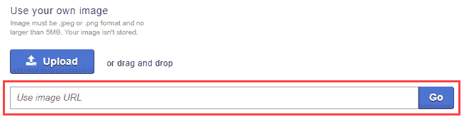
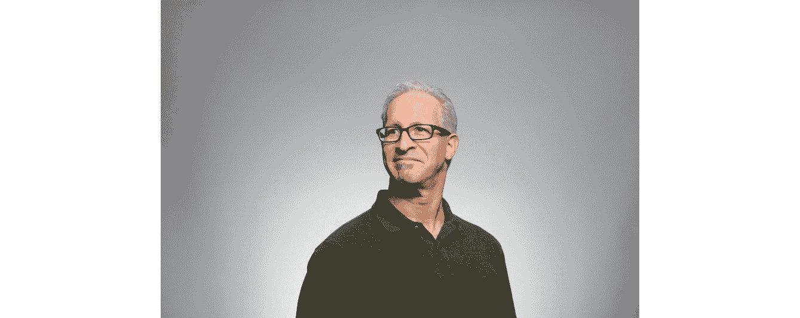
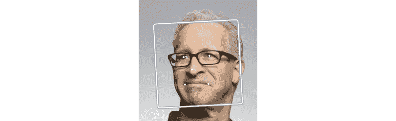
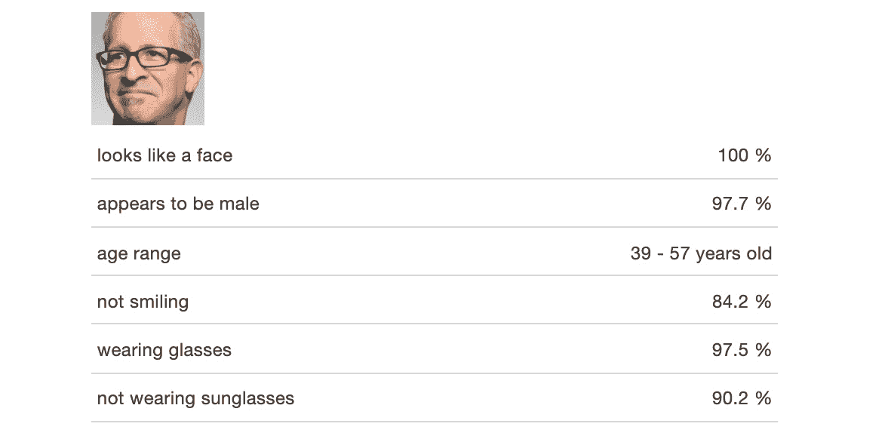
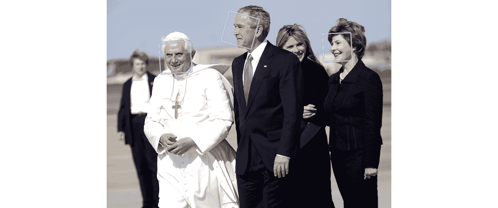
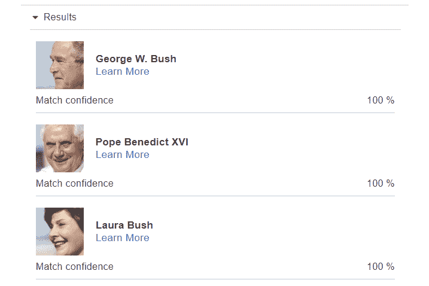
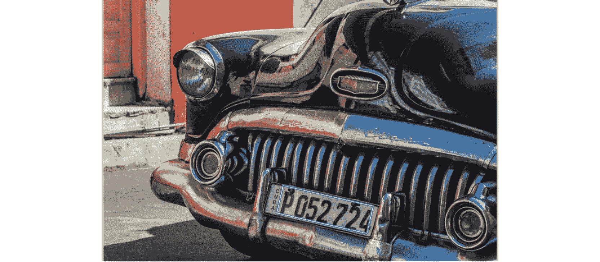
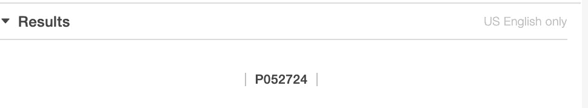

# 6. 计算机视觉和图像处理

概述

本章介绍了用于使用各种技术分析图像内容的亚马逊 Rekognition 服务。你将通过使用计算机视觉进行图像分析的 Rekognition 服务来了解图像分析，通过它你将能够检测图像中的对象和场景。你将学习如何分析人脸并在图像中识别名人。你还将能够比较不同图像中的人脸，以查看它们彼此之间有多接近。

到本章结束时，你将能够将亚马逊视觉和图像处理人工智能服务应用于生物学、天文学、安全等领域。

# 简介

在前面的章节中，你已经与**亚马逊网络服务**（**AWS**）的**人工智能**（**AI**）和**机器学习**（**ML**）服务进行了许多有趣的练习和活动。你结合了无服务器计算范式和对话式人工智能来构建聊天机器人，以及一个完全功能性的联系中心，使任何人都可以通过拨打本地电话号码来通过语音界面与聊天机器人进行对话。你还学习了文本分析和主题建模，所有这些都是在使用AWS服务。

在本章中，你将使用亚马逊 Rekognition 服务执行各种图像处理任务。首先，你将在图像中识别对象和场景。然后，你将测试图像是否应该被标记为需要内容审查。接下来，你将使用 Rekognition 分析人脸。你还将识别图像中的名人和知名人士。你将比较在不同图像和设置（例如，在群体或孤立状态下）出现的面孔，并在不同图像中识别相同的人。最后，你将从可能显示文本的图像中提取文本。 

# 亚马逊 Rekognition 基础

亚马逊 Rekognition 是 AWS 提供的一种基于深度学习的视觉分析服务，允许您使用机器学习对图片和视频进行图像分析。它建立在 AWS 本身的可扩展基础设施之上，并使用深度学习技术，如果需要，每天可以分析数十亿张图像。它也由亚马逊不断更新，并学习新的标签和功能。

亚马逊 Rekognition 的一些用例如下：

+   使用文本关键词在图像内容库中进行搜索。

+   通过将实时图像与参考图像进行比较来确认用户身份。

+   根据公共图像分析趋势，包括图像中人们的情感和情绪。

+   检测显性或暗示性内容，并自动过滤以满足您的需求。

+   从图像中检测和检索文本。

    注意

    Amazon Rekognition也是符合**HIPAA**标准的医疗应用服务。如果您希望在HIPAA下保护您的数据，您需要联系Amazon客户支持并填写一份**业务伙伴协议**（**BAA**）。有关HIPAA的更多信息，请访问以下链接：[https://aws.amazon.com/compliance/hipaa-compliance/](https://aws.amazon.com/compliance/hipaa-compliance/)。

## Amazon Rekognition的免费层信息

对于这本书，您将使用Amazon Rekognition的免费层服务。请注意免费层服务的限制和定价选项。以下是您可以使用进行图像处理的免费服务：

+   新的Amazon Rekognition客户每年可以分解多达5,000张图片。

+   在免费计划中，您可以免费使用所有Amazon Rekognition的API，并免费使用最多1,000张无面部特征的照片。

    注意

    您通常不需要超过免费层限制，但如果您超过了免费层的限制，您将根据此链接发布的费率向Amazon付费：[https://aws.amazon.com/rekognition/pricing/](https://aws.amazon.com/rekognition/pricing/)。

# Rekognition和深度学习

深度学习是人工智能的一个分支，也是机器学习的一个子领域。深度学习通过使用具有许多处理层的深度神经网络图从原始数据中推断高级抽象来工作。

深度学习结构，如**卷积神经网络**（**CNNs**）和**循环神经网络**（**RNNs**），已被用于自然语言处理、音频识别、语音识别和计算机视觉，以产生显著的结果。**神经机器翻译**已经取代了所有人工编辑的翻译引擎，自动驾驶汽车中的对象检测广泛使用基于CNN的架构，而对话式人工智能正在推动各种客户交互。

Rekognition服务在幕后使用深度学习来提供其各种功能。它使用预训练的模型，因此用户不需要训练系统。具体的细节是Amazon的专有和保密信息，但我们将在本章中学习它是如何工作的以及如何使用Rekognition。正如我们之前提到的，Amazon Rekognition的一个有趣方面是算法会定期进行监控和训练以提高其准确性和能力。它还可以通过自定义标签和用您的图像训练的模型进行扩展。

注意

对于您可能有的任何问题，Amazon Rekognition的常见问题解答页面([https://aws.amazon.com/rekognition/faqs/](https://aws.amazon.com/rekognition/faqs/))是一个极好的资源。

## 在图像中检测对象和场景

Amazon Rekognition提供了一种功能，可以在图像中检测对象和场景并对其进行标记。这个标签可能是一个对象、场景或概念，例如人、水、沙子、海滩（场景）和户外（概念）。

每个标签都附带一个置信度分数，该分数衡量服务在 0 到 100 的范围内得到正确答案的概率。这允许您或您的应用程序判断允许或丢弃结果的阈值。

Rekognition 支持来自以下表格所示类别的数千个标签：

](img/B16061_06_01.jpg)

图 6.1：Amazon Rekognition 支持的标签

此外，Amazon 正在持续训练系统以识别新的标签，您可以通过 Amazon 客户支持请求您可能希望使用的、不在系统中的标签。

要创建 Amazon Rekognition 对样本图像的分析，您可以执行以下操作：

1.  导航到 AWS 管理控制台中的 Amazon Rekognition 服务网页，并在左侧顶部点击“服务”。它还有一个搜索框：

    图 6.2：在 AWS 管理控制台中选择 Rekognition 服务

1.  您可以在“机器学习”部分找到 Rekognition。当您在 Rekognition 页面上时，点击左侧工具栏中的“对象和场景检测”链接以导航到“对象和场景检测”页面：

    图 6.3：Amazon Rekognition 服务页面

1.  接下来，选择“使用您的图像”面板下的文本框，并输入以下 URL：[https://images.unsplash.com/photo-1540253208288-6a6c32573092?w=800](https://images.unsplash.com/photo-1540253208288-6a6c32573092?w=800)：

    图 6.4：使用图像 URL 输入框

    图像的结果如下：

    

    图 6.5：样本图像的结果

1.  您可以看到，在图像中，置信度超过 90% 的检测到的对象如下：

    `Nature`

    `Outdoors`

    `Sky`

    `Sun`

    `Dawn`

    `Sunset`

1.  点击“显示更多”链接以显示更多置信度较低的级别结果。这将显示更多检测到的对象：

图 6.6：我们的样本图像从对象和场景检测中得到的完整标签集

您可以选择您希望用于应用程序的置信度阈值，以截断结果。

## 练习 6.01：使用您的图像检测对象和场景

在这个练习中，我们将使用 Amazon Rekognition 检测自定义图像的对象和场景。自定义图像可以是来自在线资源，或者您可以从本地机器上传。检测对象和场景的步骤如下：

1.  从 AWS 管理控制台导航到 Amazon Rekognition 服务页面，或直接访问以下 URL：[https://console.aws.amazon.com/rekognition](https://console.aws.amazon.com/rekognition)。

1.  点击工具栏中的“物体和场景检测”链接以导航到“物体和场景检测”页面。

1.  接下来，选择“使用自己的图像”面板下的文本框。

1.  输入以下 URL 以获取要分析的图像：[https://images.unsplash.com/photo-1522874160750-0faa95a48073?w=800](https://images.unsplash.com/photo-1522874160750-0faa95a48073?w=800)。以下是在 Rekognition 页面上的图像。您可以看到它能够精确地定位到图像：![图 6.7：物体和场景检测的第一个测试图像]

    ](img/B16061_06_07.jpg)

    图 6.7：物体和场景检测的第一个测试图像

    注意

    我们从一家名为 [https://unsplash.com/](https://unsplash.com/) 的股票照片网站上收集了图像，该网站提供免费下载的图片，可用于本书，且无任何限制。请始终遵守版权法，并注意您居住地可能适用的任何限制或许可费用（如果适用）。您可以在以下位置查看 unsplash.com 上图像的许可：[https://unsplash.com/license](https://unsplash.com/license)。

1.  您可以在图像右侧的“结果”面板下查看物体检测的结果。在这种情况下，它是一张相机的图像，结果应该如下所示：![图 6.8：物体和场景检测的第一个测试图像的结果]

    ](img/B16061_06_08.jpg)

    图 6.8：物体和场景检测的第一个测试图像的结果

1.  如您所见，结果非常准确。接下来，您可以尝试以下图像，并验证结果是否与每张图像后立即显示的表格中的结果一致，即[https://images.unsplash.com/photo-1517941875027-6321f98198ed?w=800](https://images.unsplash.com/photo-1517941875027-6321f98198ed?w=800) 和 [https://images.unsplash.com/photo-1500111709600-7761aa8216c7?w=800](https://images.unsplash.com/photo-1500111709600-7761aa8216c7?w=800)。

    以下是一些图像。这是第二个测试图像：

    ![图 6.9：物体和场景检测的第二个测试图像]

    ](img/B16061_06_09.jpg)

图 6.9：物体和场景检测的第二个测试图像

以下是为第二个图像提供的检测结果：

![图 6.10：物体和场景检测的第二个测试图像的结果]

](img/B16061_06_10.jpg)

图 6.10：物体和场景检测的第二个测试图像的结果

这是第三个测试图像：

![图 6.11：物体和场景检测的第三个测试图像]

](img/B16061_06_11.jpg)

图 6.11：物体和场景检测的第三个测试图像

以下是为第三个图像提供的检测结果：

![图 6.12：物体和场景检测的第三个测试图像的结果]

](img/B16061_06_12.jpg)

图 6.12：对象和场景检测的第三张测试图像的结果

第二张图像的结果确实表明它是一个人类头部，置信度超过 `83%`。查看金门桥的第三张图像，它在“桥梁”类别之前有更多类别，置信度为 `96.5%`。

# 图像审查

除了对象和场景检测之外，Rekognition 还提供了过滤不良内容的能力。您可以使用审查标签进行逐点子分类，使您能够调整您使用的渠道，以确定您认为满意或令人震惊的图片类型。使用 `DetectModerationLabels` 操作来检测图像中的不安全内容。

您可以利用这个组件来增强照片分享目的地、聚会、约会应用、青少年内容平台、电子商务平台和购物中心等。在这本书中，我们不会使用任何成人或裸露图像，但我们可以展示在展示女性穿着泳装或夜店服装等可能被认为露骨或暗示性的内容地区的这一功能的使用。

默认情况下，本节中的图像会被模糊处理，所以除非您按下“查看内容”按钮，否则您不需要查看它们。

注意

如果您认为任何露骨或暗示性的图像令人反感，请根据您个人的、道德的、宗教的或文化规范跳过本节。

Amazon Rekognition 使用分层分类法来标记显眼和暗示性内容的类别。两个顶级类别是**显眼裸露**和**暗示性**。每个顶级类别都有许多二级类别。使用此功能检测并标记的内容类型如下：

图 6.13：内容类型类别

要创建一个示例图像的“图像审查”，您可以执行以下操作：

1.  在 AWS 管理控制台中导航到 Amazon Rekognition 服务页面，或直接访问以下网址：[https://console.aws.amazon.com/rekognition](https://console.aws.amazon.com/rekognition).

1.  点击工具栏中的“图像审查”链接，导航到“图像审查”页面。

1.  您将在左下角看到一些示例图像。点击其中一个。

1.  您会立即注意到内容被模糊处理，如下面的截图所示。正在分析的图像是左边的第一张图像，它已经被选中。您会看到服务已经正确地识别出图像中“女性泳装或内衣”类型的“暗示性”内容，置信度为 `94.9%`：

图 6.14：图像审查的结果

通过这种方式，我们已经看到 Amazon Rekognition 可以过滤掉暗示性内容，但让我们看看它在检测图像中的不良内容方面做得如何。

## 练习 6.02：检测图像中的不良内容

在这个练习中，我们将检测图像中的不良内容。你可以在你的图像上尝试这个服务。我们已选择了三张我们将尝试使用此功能的图像。按照以下步骤完成此练习：

1.  将以下URL复制粘贴或输入到页面底部`使用您的图像`部分下的`使用图像URL`文本框中，然后按`Go`按钮以从服务中获得结果 – [https://images.unsplash.com/photo-1525287957446-e64af7954611?w=800](https://images.unsplash.com/photo-1525287957446-e64af7954611?w=800)：

    图6.15：使用图像URL上传文本框

1.  你应该收到一个结果，表明服务已找到`Female Swimwear Or Underwear`内容，置信度为99.4%：

    图6.16：图像审查服务发现的检测结果

1.  需要提供给服务的图像`URL`是[https://images.unsplash.com/photo-1509670811615-bb8b07cb3caf?w=800](https://images.unsplash.com/photo-1509670811615-bb8b07cb3caf?w=800)。

1.  就像之前一样，将其输入到`使用图像URL`文本框中，然后按`Go`按钮。这张图片没有不良内容：

    图6.17：图像审查的第一个测试图像

    你应该看到Rekognition正确地返回了无结果：

    

    图6.18：图像审查的第一个测试图像的结果

1.  最后，我们将使用一张应该再次返回一些结果的图片：[https://images.unsplash.com/photo-1518489913881-199b7c7a081d?w=800](https://images.unsplash.com/photo-1518489913881-199b7c7a081d?w=800)。

    这一张应该再次正确地被识别为包含`Female Swimwear Or Underwear`内容，置信度为99.6%：

    

图6.19：第二个提供的图像的图像审查结果

正如你所看到的，Amazon Rekognition具有强大的图像分析能力 – 包括内容审查。作为一个建议，你可以尝试一些可能或可能不具有暗示性的更多图像，并检查结果。你可能会在目标检测深度学习算法中找到一些差距。

# 面部分析

Rekognition还可以对面部进行更详细的分析。给定一张可检测到人脸的图片，它可以判断该人脸是男性还是女性，人脸的年龄范围，该人是否在微笑并看起来很开心，以及他们是否戴眼镜。

它还可以检测更详细的信息，例如眼睛和嘴巴是张开还是闭合，以及该人是否有胡须或络腮胡子。

要创建样本图像的面部分析，你可以这样做：

注意

点击左侧工具栏中的`面部分析`链接，导航到`面部分析`页面。

1.  我们将使用上传功能上传图片并分析图片：

    图6.20：图片上传按钮

1.  需要分析的第一张图片可以在[https://packt.live/3f5ipH0](https://packt.live/3f5ipH0)找到。

    您可以将图片保存到您的磁盘上，或者下载本书的GitHub仓库，正如我们在*第一章*，*AWS简介*中所述。

1.  点击`上传`；您将看到标准资源管理器窗口。导航到您有`Chapter06`文件夹的目录，并选择`Rekognition-05.jpeg`文件：

    图6.21：带有上传窗口的资源管理器

1.  对于这张图片，您将看到主要图像框显示一个边界矩形，它显示了检测到面部所在的区域。在边界框内，还有三个点来识别关键面部特征的位置——嘴巴和鼻子：

    图6.22：面部分析的第一张样本图片

1.  在图片右侧的`结果`部分，您将看到Rekognition检测到的图片中面部以下属性：

图6.23：面部分析的第一张样本图片的结果

您可以点击`显示更多`链接来查看其他已识别的属性。

所有这些识别的品质都有极高的置信度，表明该服务对其发现非常自信。

## 练习6.03：使用您自己的图片分析面部

在这个练习中，您在本书的GitHub仓库([https://packt.live/31X6w1Z](https://packt.live/31X6w1Z))中提供了三张图片，以便您可以使用样本图片尝试Amazon Rekognition服务。这些图片由[https://unsplash.com/](https://unsplash.com/)和Pinterest提供。让我们看看它们是否可以识别突出的面部特征。按照以下步骤完成此练习：

注意

点击左侧工具栏中的`面部分析`链接，导航到`面部分析`页面。

1.  我们将使用上传功能上传图片并进行分析：

    图6.24：图片上传按钮

1.  需要分析的第一张图片可以在[https://packt.live/3edZZCx](https://packt.live/3edZZCx)找到。

    您可以将图片保存到您的磁盘上，或者下载本书的GitHub仓库，正如我们在*第一章*，*AWS简介*中所述。

1.  点击`上传`，它将显示标准资源管理器窗口。导航到您有`Chapter06`文件夹的目录，并选择`Rekognition-01.jpeg`文件：。

1.  点击“上传”，它将显示标准资源管理器窗口。导航到包含`Chapter06`文件夹的目录，并选择`Rekognition-02.jpeg`文件。

1.  Rekognition再次很好地完成了面部识别：：![图6.31：用于面部分析的第三张图片

    

    图6.31：用于面部分析的第三张图片

1.  如预期，该服务可以识别男性和女性。它通过边界框识别面部：![图6.32：用于面部分析的第三张图片的边界框

    

    图6.32：用于面部分析的第三张图片的边界框

1.  它还以高置信度（97.7%）显示面部为男性，并相应地更新年龄范围：![图6.33：用于面部分析的第三张图片的结果

    

图6.33：用于面部分析的第三张图片的结果

有 `84.2%` 的信心认为这个人没有在笑，并且我们可以从图片中看出，他并没有笑得很开心，如果有的话。最后，服务有 `97.5%` 的把握认为他戴着眼镜，但也以 `90.2%` 的信心说他没有戴太阳镜。这表明还有很多改进的空间，我们应该应用人类的逻辑和规则来验证图像检测服务的成果。在这种情况下，我们可以选择置信度分数更高的那个（即“戴着眼镜”），以表明我们可以使用相对分数来评估结果。

如我们所知，人类天生具有极好的物体检测和图像分析能力，这些能力在我们成长过程中得到增强。但对于机器来说，这非常困难，因为它们没有推理或执行语义分析的能力。图像分析领域相对较新，大部分进步都是在过去 5 到 6 年中取得的。正在研究新的算法，探索新的训练方法，并寻求优化。因此，Amazon Rekognition 非常有效——它通过一组有用且实用的接口封装了算法和机制，掩盖了底层算法和计算机理论复杂性，并通过利用当前最佳实践和研究不断学习和进化。在本节中，你了解了 Amazon Rekognition 图像分析服务的能力。你将在接下来的章节中了解更多关于此服务的信息。

# 名人识别

Rekognition 为我们提供了在图像中识别和标记名人和其他名人的能力。这包括来自体育、商业、政治、媒体和娱乐等多个领域的知名人士。

重要的是要记住，Rekognition 只能识别它已经训练过的面孔，因此并不涵盖所有名人的完整、详尽的列表。然而，由于亚马逊持续训练该系统，它不断地向服务中添加新的面孔。

注意

点击左侧工具栏中的“名人识别”链接，导航到“名人识别”页面。

要创建一个样本图像的名人识别，你可以执行以下操作：

1.  点击“上传”按钮。我们将使用一个文件可以在 [https://packt.live/38CmbVM](https://packt.live/38CmbVM) 找到的图片。你可以将图片保存到你的磁盘上，或者按照 *第 1 章*，*AWS 简介* 中描述的下载这本书的 GitHub 仓库。

1.  它将显示标准的探索者窗口。导航到包含`Chapter06`文件夹的目录，并选择`Rekognition-04.jpeg`文件：

    图 6.34：带有上传窗口的探索者

1.  Amazon Rekognition在识别尼切尔·尼科尔斯（因在《星际迷航》电影中扮演Nyota Uhura上尉而闻名）方面做得非常出色：

图6.36：第一个样本图像的“了解更多”链接

## 练习6.04：在您的图片中识别名人

在这个练习中，我们将使用另一个拥有更多名人图像的网站。您也可以免费无限制地使用这些图像。您还可以在自己的图像上尝试这项服务。我们已选择了三张图片，我们将使用此功能尝试它们。

您可以在此处查看pexels.com图片的许可：[https://www.pexels.com/creative-commons-images/](https://www.pexels.com/creative-commons-images/)。按照以下步骤完成此练习：

注意

点击左侧工具栏中的“名人识别”链接，导航到“名人识别”页面。

1.  在页面底部的“使用自己的图片”部分，将一个`URL`复制粘贴或输入到“使用图片URL”文本框中，然后点击`Go`按钮以从服务中获得结果：：，并给出以下图像：。这给我们以下图像：![图6.42：用于名人识别的第三张图像，包含三个边界框

    

    图6.42：用于名人识别的第三张图像，包含三个边界框

1.  在`结果`部分，您可以看到 Rekognition 识别了图像中的所有三位名人：

    +   乔治·W·布什

    +   约翰·保罗二世

    +   劳拉·布什

        以下图像显示了名人识别的结果：

        ![图6.43：用于名人识别的第三张图像的结果

        

图6.43：用于名人识别的第三张图像的结果

他们名字下的`了解更多`链接将转到他们各自的 IMDb 页面。正如我们之前所做的那样，我们可以通过点击它们来验证这一点。

# 面部比较

Rekognition 允许您比较两张图像中的面部。这主要是为了识别两张图像中哪些面部是相同的。作为一个用例示例，这也可以用于将人们的照片与他们的个人照片进行比较。

本节展示了行业标准，以便您可以使用 Amazon Rekognition 分析包含不同面部排列的图片中的面部。当您指定一个`参考面部`（源）和一个`比较面部`（目标）图片时，Rekognition 会考虑源图片中最大的面部（即参考）以及目标图片（即测试图像）中识别到的最多100个面部，然后发现源图片中的面部与目标图片中的外观匹配程度如何。每个测试的接近度得分都显示在`结果`表中。

使用此功能的某些限制如下：

+   如果源图像包含多个面部，则使用最大的面部与目标图像进行比较。

+   目标图像可以包含多达15个面部。源图像中检测到的面部将与目标图像中检测到的每个面部进行比较。

    注意

    点击左侧工具栏中的`面部比较`链接以导航到`面部比较`页面。

使用面部比较功能时，有两个图像部分并排显示。您可以选择将左侧部分的图像与右侧部分的图像进行比较。要创建样本图像的面部分析，您可以执行以下操作：

1.  前往左侧`使用自己的图像`面板下的文本框。

1.  输入以下网址以获取要分析的图像：[https://images.unsplash.com/photo-1524788038240-5fa05b5ee256?w=800](https://images.unsplash.com/photo-1524788038240-5fa05b5ee256?w=800).

1.  前往右侧“使用自己的图像”面板下的文本框。

1.  输入以下网址以获取要分析的图像 – [https://images.unsplash.com/photo-1524290266577-e90173d9072a?w=800](https://images.unsplash.com/photo-1524290266577-e90173d9072a?w=800).

    图6.44：提供的第一批样本图像用于面部对比

1.  使用默认选择，在“结果”部分，您将看到它以99.8%的置信度识别出左侧图像中的女孩在右侧，如图所示：

图6.45：提供的第一批样本图像的对比结果

## 活动6.01：在Rekognition中创建和分析不同的面部

在这个活动中，您可以使用自己的图像尝试Rekognition。例如，我们提供了指向两组显示同一人的图像的链接。您可以通过使用“上传”按钮将图像集输入到左侧（对比）和右侧（对比）的两侧。记住这次有两个，所以还有两个`Go`按钮要按。按照以下步骤完成此活动：

1.  从亚马逊管理控制台导航到亚马逊识别服务，并在左侧工具栏中选择“面部对比”。

1.  您将看到两组“上传”按钮，如下面的截图所示：

    图6.46：面部对比的上传按钮

1.  将第一批图像上传到 Rekognition 以便它能够识别和对比面部。我们有三张图像，`face-01-01`、`face-02-02` 和 `face-01-03`，在不同的照明条件和角度下。有趣的是，Rekognition 可以检测出它们都是同一个人的面部！

    要分析的图像可以在 [https://packt.live/31X6IP6](https://packt.live/31X6IP6) 和 [https://packt.live/3ebuSYz](https://packt.live/3ebuSYz)、[https://packt.live/2ZLseUd](https://packt.live/2ZLseUd) 文件中找到。

    您可以将图像保存到您的磁盘上或下载本书的GitHub仓库，如我们在*第1章*，*AWS简介*中所述：

    

    图6.47：带有上传窗口的探索者

1.  上传 [https://packt.live/31X6IP6](https://packt.live/31X6IP6) 和 [https://packt.live/2ZLseUd](https://packt.live/2ZLseUd).

1.  使用以下参数比较第一批图像：

    +   置信度

    +   比较不同角度

    +   照明

    +   眼镜在面部上的位置

1.  比较第二组图像的面部相似性参数。

    额外挑战

    作为一项额外的挑战，你还可以尝试在这两张来自Unsplash的图片上执行相同的步骤：[https://images.unsplash.com/photo-1526510747491-58f928ec870f](https://images.unsplash.com/photo-1526510747491-58f928ec870f) 和 [https://images.unsplash.com/photo-1529946179074-87642f6204d7](https://images.unsplash.com/photo-1529946179074-87642f6204d7)：

预期的输出是来自图像集的两个对应图像是否为同一人的置信度，即使角度、光照和面部位置不同。你将在结果部分看到这一点。这项活动展示了Amazon Rekognition服务的图像分析能力。

注意

本活动的解决方案可以在第348页找到。

# 图像中的文本

在前面的章节中，你学习了如何从扫描的文档中提取文本，例如税务申报和公司报表。Amazon Rekognition同样可以从图像中检测和提取文本——例如，街牌、海报、产品名称和车牌。当然，这个功能是为了与真实世界的图像而不是文档图像一起使用。在左侧工具栏中可访问的“图像中的文本”链接，就是Amazon Rekognition中这一功能的所在。

对于提供的每一张图像，服务都会返回一个文本标签和边界框，以及一个置信度分数。这对于在图像集合中搜索文本非常有用。根据此服务和其他功能的结果，每张图像都可以根据相应的文本元数据进行标记。

目前，支持的文本仅限于拉丁字母和数字（西文脚本）。每张图像可以识别多达50个字符序列。文本必须是水平的，旋转角度在+/- 90度之间。

注意

点击左侧工具栏中的“图像中的文本”链接，导航到“图像中的文本”页面。

要识别样本图像中的“图像中的文本”，你可以执行以下操作：

1.  前往左侧“使用自己的图像”面板下的文本框。

1.  输入以下图像的URL以进行分析：[https://images.unsplash.com/photo-1527174744973-fc9ce02c141d?w=800](https://images.unsplash.com/photo-1527174744973-fc9ce02c141d?w=800)。你将看到以下图像：

图6.48：提供用于图像中文本的第一个样本图像

Rekognition会在检测到的文本周围绘制边框，以便你可以识别它所识别的文本区域。你可以在“结果”部分看到文本提取的结果：

图6.49：提供用于图像中文本的第一个样本图像的结果

Rekognition 能够在图像中找到文本并在其周围放置一个框；然后，它能够“阅读”文本，甚至理解有两个单词！Rekognition 服务已经从图像中提取了文本，并在不同区域之间用分隔符（`|`）分隔单词。即使标志的字体独特，带有阴影，它仍然能够提取文本。

接下来，让我们用来自不同真实场景的自己的图片来测试这个功能，例如不同角度的店面和车牌。正如您将看到的，Amazon Rekognition 在从商店招牌下方拍摄的照片以及从车牌上方拍摄的角度照片上都表现得非常好。

## 练习 6.05：从您的图片中提取文本

在这个练习中，您将从自己的图片中提取文本。让我们看看 Amazon Rekognition 在处理图像中的不同文本方面表现如何。我们为您提供了三张免费使用的图片。按照以下步骤完成这个练习：

1.  点击左侧工具栏中的“图像中的文本”链接，导航到“图像中的文本”页面。

1.  将以下 URL 复制粘贴或输入到页面底部“使用您的图片”部分下的“使用图像 URL”文本框中：[https://images.unsplash.com/photo-1521431974017-2521d1cdcd65?w=800](https://images.unsplash.com/photo-1521431974017-2521d1cdcd65?w=800)。您将看到以下图像：。您将看到以下图像：。你将看到以下图像：![图 6.54：提供的第三张图像中的文本]

    

图 6.54：提供的第三张图像中的文本

这又是车牌号的另一个例子。结果如下：

![图 6.55：提供的第三张图像中的文本结果]

图 6.55：提供的第三张图像中的文本结果

它在隔离车牌方面做得很好。

在这个练习中，我们了解到 Amazon Rekognition 可以从图像中提取文本，即使是有不同角度、字体、阴影等。你应该尝试使用具有不同角度、光照和尺寸的多个图像来使用这个功能。

# 摘要

在本章中，你学习了如何使用 Amazon Rekognition 服务的各种功能，并将其应用于图像。首先，你使用该服务识别图像中的对象和场景。接下来，通过使用 Rekognition 识别图像中的不适当内容，你调节了可能包含不适当内容的图像。

你能够使用 Rekognition 分析面部，并且还能够识别他们的性别、年龄范围、是否在微笑以及是否戴着眼镜。

你还使用该服务识别了名人及著名人物，并比较了不同图像中的面部是否相同。最后，你能够从图像中提取显示的文本。

有了这些，我们已经到达了本章和本书的结尾。我们希望这是一次有趣的旅程，发现了无服务器计算、Amazon AI 和 ML 服务、文本分析、图像分析等巨大能力的发现。

这些类型的特性在几年前似乎是难以置信的。机器学习和人工智能的本质是这样的，在可预见的未来，计算机将能够做到的事情将取得巨大进步，AWS 将能够为你和你的应用程序提供这些服务。
