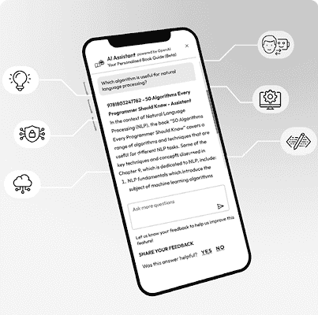
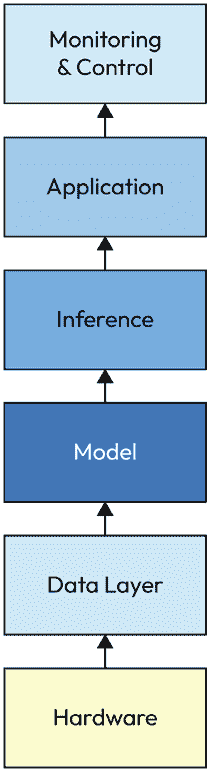
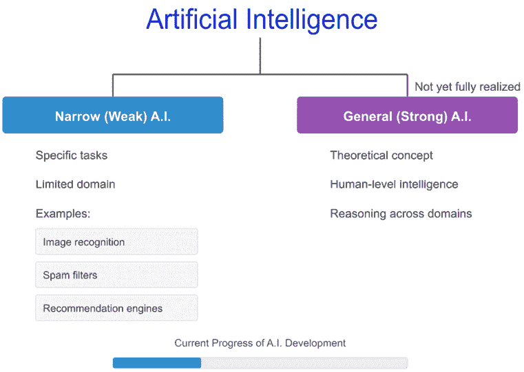
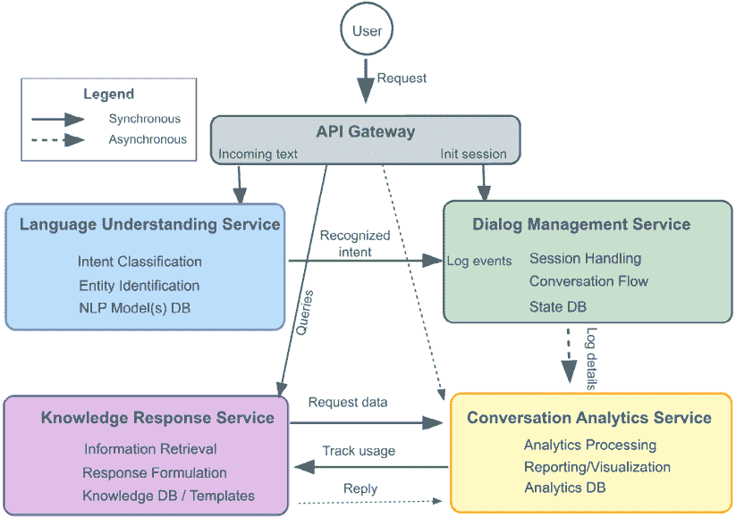
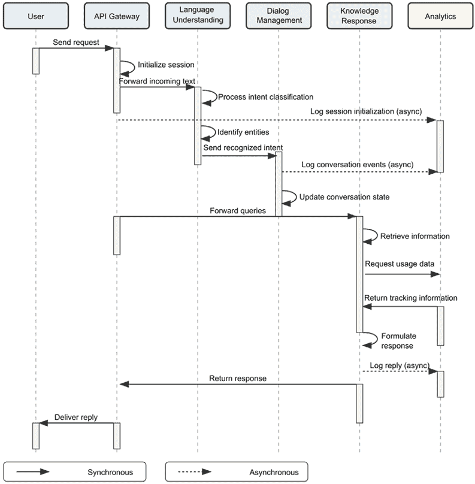

# 1

# 人工智能系统架构的基本原理

公众对**人工智能**（**AI**）的兴趣最近激增，尤其是随着生成式人工智能的兴起，引发了一股对全面人工智能解决方案的兴奋和需求。这种高度的兴趣不仅超越了技术爱好者和研究人员，还扩展到企业、政府和寻求利用人工智能的力量来解决现实世界问题并增强其能力的人。在这个环境中，人工智能系统的架构，它定义了其结构、组件和交互，在塑造有效人工智能解决方案的开发和部署中发挥着关键作用。

人工智能已成为一种变革力量，颠覆了行业，重塑了我们与技术以及周围世界互动的方式。在核心上，人工智能指的是模仿人类认知功能的计算模型，包括从数据中学习、识别模式、做出决策，甚至与环境交互。这项革命性技术跨越了广泛的范围，从简单的基于规则的系统到复杂的深度学习模型，每个都有其独特的应用和功能。

任何人工智能系统的一个主要方面是正在进行推理的结果需要相关且可信。为确保获得并保持信任，使用强大的架构至关重要。不仅需要设计技术，还需要考虑技术将被如何使用、管理和评估，以及涉及的利益相关者。利益相关者需要能够迅速定位问题、快速纠正模型参数，并以深思熟虑和迅速的方式部署更改。用更通俗的话来说，架构和支持过程可以描述为“安全栏”。如何使用安全栏非常具体，取决于将要使用人工智能技术的领域和用例。可以讨论的安全栏类别包括——例如，使用金丝雀来判断模型正确性，从已知的黄金标准出发；使用时间和数据流指标来判断模型性能；以及使用过滤器和稳健的数据质量检查，以确保只有一致且正确的数据进入系统。另一类安全栏是人类系统接口，例如用于分类错误的警报框架和监控器，使用故障排除工具，以及处理意外错误的预设协议。建模的书面程序或指导有助于在不需要调用模型开发者进行故障排除的情况下维护系统。

信任是系统成功的关键考虑因素，因此需要设计一个考虑这一点的系统。在许多方面，本书中描述的展示和经验教训旨在确保人工智能系统的信任。

本章从广义上强调了推动成功人工智能实施的 AI 架构考虑的关键方面。以下是主题：

+   人工智能的简介和关键概念

+   人工智能系统的组成部分

+   人工智能技术和微服务

+   人工智能系统和技术考量

+   部署考量

# 充分利用本书 – 了解您的免费福利

解锁与您的购买一起提供的独家**免费**福利，这些福利经过精心设计，旨在加速您的学习之旅，并帮助您无限制地学习。

下面是您通过本书可以获得的内容快速概述：

## 下一代读者

| 图 1.1：下一代 Packt Reader 的功能示意图 | 我们基于网络的读者，旨在帮助您有效地学习，具有以下功能！ **多设备进度同步**：在任何设备上无缝同步进度。 **高亮和笔记**：将您的阅读转化为持久的知识。 **书签**：随时回顾您最重要的学习内容。 **深色模式**：通过切换到深色或棕褐色模式，以最小的眼部疲劳来集中注意力。 |
| --- | --- |

## 交互式 AI 助手（测试版）

| 图 1.2：Packt 的 AI 助手的示意图 | 我们的交互式 AI 助手已经接受了本书内容的训练，以最大化您的学习体验。它具有以下功能！ **总结**：总结关键部分或整章内容。 **AI 代码解释器**：在下一代 Packt Reader 中，点击每个代码块上方的**解释**按钮，获取 AI 驱动的代码解释。**注意**：AI 助手是下一代 Packt Reader 的一部分，目前仍处于测试阶段。* |
| --- | --- |

## 免 DRM PDF 或 ePub 版本

| 图 1.3：免费 PDF 和 ePub | 通过以下购买时包含的优惠，无限制地学习！ 在任何地方学习，使用此书的免 DRM PDF 副本。 使用您最喜欢的电子阅读器，通过此书的免 DRM ePub 版本学习。 |
| --- | --- |

|

#### 现在解锁本书的独家免费福利

扫描此二维码或访问[`packtpub.com/unlock`](https://packtpub.com/unlock)，然后通过书名搜索本书。确保是正确的版本。 |  |

| **注意**：在开始之前，请准备好您的购买发票。* |
| --- |

# 人工智能系统简介：构建智能的未来

人工智能系统是人工智能的体现，作为推动智能应用和服务运行的引擎。这些系统是复杂的结构，精心设计以执行各种任务，从图像识别和自然语言处理到自主决策和复杂问题解决。

人工智能系统的架构充当详细的技术蓝图，指定其结构组织和各个组件之间的精确交互。这些组件包括以下内容：

+   **硬件基础设施**：通用处理用 CPU、并行计算用 GPU、张量运算用 TPU 以及专门的 AI 加速器

+   **软件框架**：TensorFlow、PyTorch、JAX 和其他支持模型开发的库

+   **算法实现**：机器学习算法、神经网络架构和推理引擎

+   **数据管道**：ETL 过程、特征存储和数据管理系统

所有这些元素协同工作，使系统能够高效、可靠地实现其设计目标。

一个设计良好的人工智能系统实现了几个关键的技术要求：

+   **最佳性能**：通过优化模型设计、高效资源分配和硬件感知实现，最大限度地提高计算效率，以提供响应迅速且准确的结果，同时最小化延迟。这涉及到优化的模型设计、高效的资源分配和充分利用可用计算能力的硬件感知实现。

+   **可扩展性**：通过水平扩展（添加更多机器）和垂直扩展（添加更强大的机器）处理不断增长的工作负载和扩展的数据集，而不会降低性能。现代人工智能架构必须适应不断增长的数据量、用户基础和计算需求。

+   **效率**：通过模型量化、知识蒸馏和优化的推理路径等技术，减少计算资源消耗、能源使用和运营成本。高效的 AI 系统在保持功能有效性的同时，最小化其资源占用。

+   **可靠性**：确保在面临意外数据模式、输入变化或系统故障时，仍能以高可用性指标保持一致运行。这需要强大的错误处理能力、优雅降级能力和全面的监控系统。鉴于人工智能技术既可以是确定性的也可以是非确定性的，必须考虑允许人为干预。这种干预需要涵盖从简单监控到完整的测试基础设施套件。

+   **安全性**：实施全面的数据保护措施，防御对抗性攻击、数据中毒和模型漏洞。人工智能系统必须保持数据机密性和完整性，并对传统网络安全威胁和特定于人工智能的攻击具有弹性。

+   **可解释性**：提供对算法决策过程的透明可见性，支持合规性、用户信任和系统调试。现代人工智能架构必须在性能和可解释性之间取得平衡，以满足对人工智能透明度的日益增长的需求。

人工智能领域不断演变，新的架构和技术以惊人的速度出现。随着我们深入这个迷人的领域，我们将探讨各种人工智能系统、其基本原理以及正在塑造技术和社会未来多样应用。

## 什么是人工智能系统？

人工智能系统是一个计算模型或模型集合，旨在执行通常需要人类智能的任务。这些系统由算法和数据驱动，使它们能够从经验中学习、适应新信息并做出决策或预测。

图 1.4：AI 技术栈

从实现的角度来看，人工智能系统通常由几个关键层组成：

1.  **硬件**：包括 CPU、GPU、TPUs、全频谱存储和网络等计算资源

1.  **数据层**：处理数据摄取、存储、预处理和特征工程

1.  **模型层**：包含训练好的机器学习或深度学习模型

1.  **推理层**：管理对新数据输入执行模型的操作

1.  **应用层**：将人工智能能力集成到面向用户的应用程序中

1.  **监控层**：跟踪系统性能、数据漂移和模型健康

人工智能系统可以分为两大类：

+   **窄人工智能（弱人工智能）**：这些系统被设计在有限领域内擅长特定任务。例如，图像识别软件、垃圾邮件过滤器和建议引擎。虽然它们可能在指定的任务上非常熟练，但它们缺乏在其他领域推广其知识的能力。

+   **通用人工智能（强人工智能）**：这是一个关于人工智能系统的理论概念，它拥有与人类相当的人工智能，并且能够执行人类能够完成的任何智力任务。它将具备推理、规划、解决问题、从经验中学习以及理解跨多个领域的复杂概念的能力。尽管通用人工智能仍然是一个遥远的目标，但在开发具有日益复杂能力系统的方面已经取得了重大进展。

图 1.5：人工智能系统的分类

**快速提示**：需要查看此图像的高分辨率版本吗？在下一代 Packt Reader 中打开此书或在其 PDF/ePub 副本中查看。

**下一代 Packt Reader**以及本书的**免费 PDF/ePub 副本**包含在您的购买中。扫描二维码或访问[`packtpub.com/unlock`](https://packtpub.com/unlock)，然后使用搜索栏通过名称查找此书。请仔细检查显示的版本，以确保您获得正确的版本。

## AI 基础设施的普遍影响：为各行业的智能解决方案提供动力

优秀的 AI 基础设施，包括支持 AI 应用程序的硬件、软件和网络，是 AI 在各个行业产生变革性影响的主要驱动力。该基础设施使 AI 模型、算法和框架的部署和扩展成为可能，释放它们的全部潜力以解决复杂挑战并交付创新解决方案。

+   **医疗保健**：

    +   **加速医学图像分析**：高性能计算集群和专用硬件加速器能够快速处理医学图像，促进更快、更准确的诊断。

    +   **数据驱动洞察**：可扩展的存储和处理基础设施使 AI 驱动的分析能够处理庞大的患者数据集，从而实现个性化的治疗方案和改善的患者结果。

    +   **实时监控**：基于云的 AI 基础设施能够持续监控患者的生命体征和其他健康数据，促进及时干预和主动护理。

+   **金融：**

    +   **鲁棒的反欺诈检测**：分布式计算和实时分析平台赋予 AI 模型以更高的准确性和速度检测欺诈交易，保护金融机构和消费者。

    +   **优化交易策略**：高频交易算法利用低延迟网络和强大的计算资源，以精确和高效的方式执行交易，最大化回报。

    +   **个性化金融服务**：基于云的 AI 基础设施使得部署机器人顾问和其他 AI 工具成为可能，这些工具为个人提供定制化的财务建议和服务。

+   **自动驾驶汽车**：

    +   **实时传感器融合**：高吞吐量数据管道和边缘计算基础设施能够快速处理来自摄像头、激光雷达、雷达和其他来源的传感器数据，确保自动驾驶汽车能够及时做出决策。

    +   **增强物体识别**：在大型数据集上训练并在专用硬件加速器上部署的深度学习模型，能够准确可靠地识别环境中的物体。

    +   **优化导航**：基于云的地图和导航服务，结合车载 AI 处理，为自动驾驶汽车提供实时信息和指导，确保安全高效的导航。

AI 基础设施的持续发展和优化将在实现 AI 在各个行业的全部潜力中发挥关键作用。通过提供性能和可扩展的 AI 解决方案的基础，该基础设施有望改变我们的生活方式和工作方式。

## AI 系统架构的关键组件

AI 系统本质上是由复杂结构设计的，旨在模拟人类认知能力，如学习、推理和问题解决。为了实现这些能力，AI 系统依赖于一个定义良好的架构，由多个相互连接的组件组成，每个组件在系统的整体运行中都发挥着关键作用。理解这些关键组件对于理解 AI 的内部运作和潜力至关重要。

+   **数据组件**：数据是任何 AI 系统的生命线，是系统学习和改进的原始材料。数据可以存在于多种形式：

    +   **结构化数据**：以数据库和电子表格等预定义格式组织

    +   **半结构化数据**：部分组织的信息，如 JSON 或 XML 文件

    +   **非结构化数据**：原始信息，包括文本文档、图像、音频记录和视频文件

数据的质量、数量和相关性对人工智能系统的性能及其对新情况泛化的能力有重大影响。

+   **算法框架**：算法是驱动人工智能系统的引擎，提供处理数据和生成智能输出的指令和逻辑。机器学习算法是人工智能算法的一个子集，使系统能够从数据中学习模式和关系，从而使其能够进行预测、分类或决策。生产级人工智能系统中的常见算法方法包括以下几种：

    +   **传统机器学习**：线性回归、随机森林、梯度提升和支持向量机

    +   **深度学习**：**卷积神经网络**（**CNN**s）、**循环神经网络**（**RNN**s）、transformers 和图神经网络

    +   **强化学习**：Q 学习、策略梯度方法和 actor-critic 架构

算法的选取取决于具体的问题领域、可用数据特征和性能要求。

+   **模型架构**：模型代表了人工智能系统中学习过程的最终成果。它们是从数据中提取的知识数学表示，封装了算法发现的模式、关系和洞察。这些模型可以是简单的，也可以是复杂的，这取决于任务的性质和所使用的算法。模型架构介于以下几种之间：

    +   **简单线性模型**：易于解释但功能有限

    +   **集成模型**：结合多个简单模型以提高性能

    +   **深度神经网络**：具有数百万或数十亿参数的复杂架构

训练完成后，模型用于对新、未见过的数据进行预测或决策。

+   **基础设施**：基础设施组件包括提供人工智能系统运行所需的计算能力和环境的硬件和软件资源。关键基础设施元素包括以下几种：

    +   **计算资源**：高性能服务器、专门的 AI 加速器（GPU、TPU、FPGA）和分布式计算集群

    +   **存储系统**：用于训练数据和模型工件的高吞吐量、可扩展存储

    +   **网络组件**：用于分布式训练和推理的低延迟互连

+   **开发框架**：如 TensorFlow、PyTorch 和 Hugging Face 等软件库，它们简化了人工智能的开发和部署。

理解这些关键组件及其相互作用为理解人工智能系统架构的复杂领域提供了坚实的基础。通过精心设计和优化每个组件，研究人员和工程师可以构建能够处理各种任务和应用的人工智能系统，从图像识别和自然语言处理到自动驾驶和药物发现。将人工智能能力集成到现有软件堆栈中需要深思熟虑的架构考虑，以成功引入智能并解决人工智能组件带来的独特需求。这些具体需求和架构方法构成了本书的核心焦点。由于人工智能系统的复杂性，部署方法的本性至关重要。下一节将讨论提供性能和模块化之间平衡的微服务架构的使用。

# 微服务架构：构建复杂人工智能系统的模块化方法

随着人工智能系统复杂性的增加，传统的单体架构可能会变得难以管理，从而阻碍开发速度和灵活性。微服务架构通过将这些复杂系统分解成更小、独立的微服务，提供了一个有吸引力的替代方案。每个微服务专注于特定的功能，并通过定义良好的 API 与其他服务进行通信。

## 微服务对人工智能的优势

+   **增强灵活性和敏捷性**：团队可以独立开发、部署和更新每个微服务，使用每个任务最合适的技术和编程语言。这加速了开发周期，并允许更容易地进行实验和创新。

+   **提高可伸缩性**：微服务可以水平扩展以满足特定需求，确保资源利用最优化。例如，处理图像处理的微服务可以独立于负责自然语言理解的微服务进行扩展。

+   **提高弹性和容错性**：如果一个微服务失败，影响将局限于局部，最小化对整个系统的干扰。这增强了整体可靠性并简化了故障排除。

+   **技术多样性**：微服务架构使团队能够利用每个任务的最佳工具，促进创新，并允许逐步进行技术升级。

## 微服务架构的挑战

+   **增加复杂性**：管理众多服务和它们之间的交互需要强大的编排和监控工具。服务发现、负载均衡和故障处理成为关键考虑因素。

+   **通信开销**：过度的服务间通信可能会引入延迟并影响整体性能。精心设计 API 和通信模式对于减轻这一问题至关重要。

+   **数据一致性**：在分布式服务中维护数据一致性可能具有挑战性。可能需要采用最终一致性或分布式事务等策略来确保数据完整性。

## 现实世界示例：对话式 AI 微服务实现

为了说明微服务方法如何简化对话式 AI 解决方案，让我们考察一个实际例子，以展示这些原则如何付诸实践。本节探讨了一个对话式 AI 系统——如聊天机器人或虚拟助手——它使用具有 API 网关的四服务微服务架构构建。

### 四个核心微服务

*图 1.6* 展示了我们对话式 AI 系统的高级设计：

图 1.6：对话式 AI 微服务

架构由四个核心专业服务加上一个 API 网关组成：

1.  语言理解服务：

    +   **主要功能**：意图分类、实体识别/提取和 NLP 模型的托管。

    +   **数据和模型**：引用一个或多个 NLP 模型数据库（例如，基于 transformer 的分类器）。

    +   **关键交互**：通过 API 网关接收用户的文本，确定用户的意图（例如，“检查账户余额”），并提取相关实体（例如，“日期”、“位置”、“产品名称”）。

1.  对话管理服务：

    +   **主要功能**：负责对话流程的监控，处理会话状态，并协调对话的下一步。

    +   **数据和状态**：在专用的状态数据库中维护对话上下文。

    +   **关键交互**：异步记录对话事件并更新或检索会话细节以引导流程（例如，“问候”、“确认”、“下一步”）。

1.  知识回应服务

    +   **主要功能**：检索相关信息并制定回应。这可能涉及查询知识库（例如，常见问题解答、产品信息）或组装基于模板的回复。

    +   **数据和模板**：在知识数据库中存储特定领域的知识，并使用模板或生成机制来创建回应。

    +   **关键交互**：从对话管理服务接收查询，找到或创作最佳回应，并将其返回以最终交付给用户。

1.  对话分析服务：

    +   **主要功能**：处理日志和用于报告、可视化和更深入分析（例如，意图分布、用户满意度趋势）的使用度量。

    +   **数据和报告**：在单独的数据库中维护分析数据，用于仪表板或离线处理。

    +   **关键交互**：从对话管理服务和其他组件收集异步事件日志，以衡量性能、跟踪用户行为，并提供随着时间的推移可能改进系统的见解。

### API 网关的作用

虽然不算作四个微服务之一，但**API 网关**是架构前端的必要组件。它执行以下操作：

+   接收来自用户的请求（通过文本或其他渠道）

+   初始化会话并将传入数据路由到语言理解服务

+   将识别到的意图和更新传递给对话管理服务

+   将来自下游服务的回复传递回用户

通过集中流量管理，API 网关强制执行一致的安全、节流和监控策略，同时保持每个微服务隔离和独立可扩展。

### 对话流程序列

为了说明这些微服务在典型用户旅程中的交互方式，*图 1.7*显示了它们在单个对话周期中的调用序列：

图 1.7：系统组件之间的序列图

序列按以下步骤进行：

1.  **用户** **→** **API 网关**：用户发送请求（例如，一条聊天消息）。API 网关（如果需要）初始化会话，并将消息转发到语言理解服务。

1.  **语言理解服务**:

    +   执行意图分类和实体识别。

    +   将识别到的意图（例如，“CheckWeather”）和任何提取的实体（例如，日期，位置）返回到 API 网关。

1.  **对话管理服务**:

    +   从 API 网关接收识别到的意图。

    +   将对话事件（异步）记录到对话分析服务。

    +   更新或检索**会话状态**（例如，用户的位置或最近的对话上下文）。

1.  **知识响应服务**:

    +   一旦对话管理服务确定需要额外的数据（例如，天气信息，产品详情），它就会向知识响应服务发送一个**查询**。

    +   此服务获取必要的信息或构建响应模板（例如，“您所在位置的天气晴朗，温度为 75°F...”）。

1.  **对话分析服务（异步日志）**:

    +   从对话管理服务（以及可能的知识响应服务）持续接收使用数据和对话日志。

    +   处理并存储这些日志以供未来报告（例如，月度使用仪表板，模型性能指标）。

1.  **回复用户**:

    +   知识响应服务制定的答案通过对话管理服务（如果需要，进行最终会话更新）路由回，然后通过 API 网关返回。

    +   用户收到**回复**，交互结束。

### 微服务通信的关键方面

+   同步与异步调用：

    +   必须立即返回请求的服务（例如，为用户生成响应）使用同步调用。

    +   日志或分析操作通常异步执行，以避免减慢核心对话循环。

+   有状态与无状态组件：

    +   对话管理需要跟踪会话状态，而其他服务（例如，语言理解）通常从无状态设计中受益，以便于更简单的扩展。

    +   对话管理服务可能需要强大的状态管理解决方案，例如分布式缓存或数据库。

+   服务自治：

    +   每个微服务都可以独立更新或替换，而不会影响系统中的其他部分。

    +   语言理解服务的 NLP 模型可能需要频繁重新训练。因为它是一个独立的服务，所以这些更新可以在不影响其他服务的情况下部署。

+   数据隔离：

    +   服务管理自己的领域数据。对话管理存储对话状态，知识响应存储领域事实，分析维护交互日志。

    +   当有必要时，应将敏感用户数据限制在对话管理服务的状态存储中，以最小化整个系统中的暴露。

### 对话式人工智能微服务的实现考虑因素

1.  独立扩展：

    +   语言理解服务可以根据传入的消息负载进行扩展或缩减（例如，针对高峰聊天流量进行水平自动扩展）。

    +   对话管理服务维护对话状态，可能需要不同的扩展策略。

    +   知识响应服务通常根据信息检索的复杂性进行扩展。

    +   对话分析服务可以单独扩展，特别是如果分析工作负载（如报告生成）在用户请求之外的时间激增。

1.  延迟管理：

    +   对话式人工智能系统旨在实现近乎实时的交互。最小化服务之间的网络跳转和通信开销至关重要。使用轻量级通信协议有助于确保系统在扩展时表现良好。

1.  故障隔离：

    +   如果一个服务失败（例如，知识响应服务离线），系统中的其他部分仍然可以处理其他任务或提供回退行为（例如，道歉响应或重定向到人工代理）。

1.  监控和可观察性：

    +   强健的日志记录和可观察性实践对于确保系统在服务故障或减速时保持弹性至关重要。对话分析服务在跟踪系统健康和性能方面发挥着关键作用。

### 为什么对话式人工智能需要微服务？

将对话式人工智能系统分解为这四个专业服务，在**可维护性**、**可扩展性**和**团队敏捷性**方面带来了显著的好处。每个服务都可以独立演进，允许对 NLP 模型、对话流程和知识检索策略进行快速迭代，而不会在整个应用程序中引发“大爆炸”故障。

同时，对**服务间通信**的细致关注至关重要。如图所示，每个用户请求都会发生多次跳转。使用轻量级通信协议并区分同步和异步操作有助于保持系统响应性。

对话式 AI 的例子有力地说明了微服务方法如何实现灵活性、容错性和迭代创新的平衡。在这里学到的经验教训——例如，独立扩展关键服务、隔离数据以保障安全、确保优雅的故障模式——广泛适用于各种由 AI 驱动的解决方案。

这种现实世界的实现模式表明，尽管微服务增加了复杂性，但它们给 AI 系统带来的好处——尤其是那些需要频繁更新、可变扩展和组件级创新——通常在适当架构和实施的情况下，会超过所面临的挑战。

# AI 系统的考虑因素

设计一个良好的 AI 系统架构需要仔细考虑几个关键因素。这些因素确保系统不仅能够有效运行，而且能够适应未来的需求和挑战。

## 可扩展性：处理增长的数据和模型复杂性

AI 系统经常遇到数据量增长和模型日益复杂的问题。可扩展性是指系统在不影响性能的情况下处理这种增长的能力。有效的策略包括以下内容：

+   **水平扩展**：这涉及到添加更多计算资源以分配工作负载。例如，在云环境中，您可能需要部署额外的虚拟机或容器来处理增加的流量。Kubernetes 可以编排这些容器，确保工作负载均匀分布。

+   **垂直扩展**：通过更强大的硬件增强现有资源。例如，升级服务器的 CPU 或 GPU、增加更多 RAM 或使用 SSD 代替 HDD 以提高 I/O 性能。

+   **分布式计算**：利用 Apache Spark 或 Hadoop 等框架在多个节点上处理数据。这种方法将大型数据集分解成更小的块，可以并行处理，显著减少处理时间。例如，Spark 的**弹性分布式数据集**（RDDs）允许内存处理，这比传统的基于磁盘的处理要快得多。

## 性能：优化技术

在许多 AI 应用中，实时或近实时处理至关重要。优化性能的技术包括以下内容：

+   **硬件加速**：利用 GPU 或 TPU 进行计算密集型任务——例如，TensorFlow 和 PyTorch 可以利用 NVIDIA GPU 中的 CUDA 核心来加速深度学习模型训练。

+   **并行处理**：将任务划分为可以同时执行的小子任务。在 Python 中，可以使用如 multiprocessing 或 concurrent.futures 等库来并行化任务——例如，同时训练多个模型或并行处理不同的数据批次。

+   **算法优化**：选择或设计计算复杂度较低的算法。例如，使用近似最近邻算法进行大规模相似性搜索，而不是计算成本高昂的精确方法。

## 可靠性：容错、错误处理和冗余

可靠性至关重要，尤其是在关键应用中。为确保系统正常运行时间和数据完整性，采用诸如容错、错误处理和冗余等策略：

+   **容错**：即使某些组件失败，系统仍能继续运行。例如，在微服务架构中，如果一个服务失败，其他服务可以继续运行。可以使用 Netflix 的 Hystrix 等工具来实现断路器以管理故障。

+   **错误处理**：设有机制来优雅地检测和纠正错误——例如，在代码中使用`try-catch`块来处理异常，并记录错误以供进一步分析。

+   **冗余**：关键组件被复制以防止单点故障——例如，使用 RAID 配置进行磁盘存储或在云环境中部署服务以确保高可用性。

## 安全：数据隐私和模型鲁棒性

人工智能系统通常处理敏感数据，使安全性成为首要任务。以下是一些关键考虑因素：

+   **数据加密**：保护静态数据和传输中的数据——例如，使用 AES 加密存储在数据库中的数据和使用 TLS 传输网络中的数据。加密方法的使用需要彻底考虑和测试，以确定对模型和系统性能的影响。

+   **访问控制**：实施严格的授权和身份验证机制——例如，使用 OAuth 2.0 进行安全的 API 访问和**基于角色的访问控制**（RBAC）来管理权限。

+   **模型鲁棒性**：防范可能操纵系统的对抗性攻击。例如，通过在正常和对抗性示例上训练模型来提高鲁棒性的对抗性训练技术，以及部署异常检测系统以监控数据输入中的异常模式。

## 数据建模：目录和本体

在人工智能领域，数据不仅仅是宝贵的资产，而且是构建智能系统的基石。由于人工智能模型严重依赖大量数据来学习和做出明智的决定，因此有效管理和组织这些数据变得至关重要。这就是数据目录和本体作为在人工智能架构中导航数据景观复杂性的不可或缺工具的用武之地。

目录作为元数据的集中存储库，提供关于人工智能系统内数据资产的综合信息。它们充当全面的索引，提供关于数据位置、模式、血缘、质量和其他相关属性的见解。通过以结构化和可访问的方式整合这些信息，数据目录使数据科学家、工程师和分析人员能够更深入地了解他们的数据资源，简化他们的工作流程，并确保数据治理。

概念模型为领域内的数据元素提供语义表示。它们可以帮助数据工程师理解数据元素是如何以及为什么相互关联的，并改进处理流程。概念模型还为数据科学家提供模型开发和更新的上下文。

已经讨论了人工智能系统的技术和功能属性。下一节将讨论在现代云环境中实现系统的不同方式。使用云技术确保可以根据实际需求轻松扩展人工智能系统，并为资源分配提供灵活性。

# 现代人工智能部署范式

随着人工智能系统的持续发展，新的部署范式已经出现，以解决特定的需求和用例。本节探讨了两种重要方法：云原生人工智能架构和边缘人工智能部署。

## 云原生人工智能架构

人工智能应用的复杂性和规模不断增加，导致云原生架构的采用。这些架构利用云计算平台的可扩展性、灵活性和成本效益，以实现人工智能系统的有效开发、部署和管理。在云原生架构中，人工智能组件被设计为在云环境中无缝运行，利用存储、计算和网络的专业化服务。

云原生人工智能架构的关键特性包括以下内容：

+   **容器化**：使用 Docker 等技术将人工智能应用打包成轻量级、可移植的容器，确保在开发、测试和生产环境中的一致性。

+   **编排**：Kubernetes 等容器编排平台管理跨主机集群的应用容器部署、扩展和操作。

+   **微服务**：如前所述，将人工智能系统分解成更小、独立的微服务，可以更有效地利用资源并更容易进行扩展。

+   **无服务器计算**：AWS Lambda、Azure Functions 和 Google Cloud Functions 等平台允许开发者专注于编写代码，无需担心底层基础设施，这对于事件驱动的 AI 工作负载特别有用。

+   **托管服务**：云服务提供商提供专门的 AI 服务，例如完全托管的机器学习平台（例如，亚马逊 SageMaker、微软 Azure ML、谷歌 Vertex AI），这些服务简化了开发和部署流程。

+   **云原生与迁移：** 云原生 AI 组件专门设计用于利用云环境的好处，例如自动扩展、无服务器计算和管理服务。与简单地将现有的本地 AI 系统“迁移”到云中而不进行架构修改相比，这种方法提供了更大的灵活性、可扩展性和成本效益。

# 数据湖和数据仓库在 AI 架构中的应用：数据驱动智能的基础

在人工智能领域，数据是创新和进步的基石。AI 模型依赖于大量数据，利用它来学习模式、做出预测并生成有价值的见解。然而，有效地管理和利用人工智能项目中涉及的大量数据需要专门的存储和管理解决方案。在此背景下，出现了两个突出的概念：**数据湖**和**数据仓库**。

## 数据湖：原始数据的巨大水库

数据湖作为广泛的存储库，以原始格式存储原始数据。它们旨在容纳来自不同来源的结构化、半结构化和非结构化数据。数据湖的灵活性使它们成为存储大量可能没有预定义目的或结构的数据的理想选择。

+   **关键特征：**

    +   **读取时模式：** 数据湖在摄取过程中不强制执行严格的模式，允许数据类型和结构具有灵活性。模式在分析或处理期间定义，使用户能够适应不断变化的数据需求。

    +   **成本效益的可扩展性：** 数据湖可以轻松扩展以适应不断增长的数据量，这使得它们成为存储大量数据集的经济高效解决方案。

    +   **支持多样化的数据：** 数据湖可以处理各种数据，包括传感器读数、社交媒体流、日志文件等。

    +   **适合探索性分析：** 数据湖为数据科学家和分析师提供了一个肥沃的土壤，以探索数据、识别模式和生成假设。

+   **示例用例：**

    +   一家电子商务公司可能会将点击流数据、客户评论和社交媒体互动存储在数据湖中，以进行后续分析和个性化工作。

    +   一个医疗保健组织可以使用数据湖来存储医学图像、电子健康记录和基因组数据，用于 AI 驱动诊断工具的研究和开发。

## 数据仓库：分析的结构化存储库

数据仓库是结构化的存储库，用于存放经过处理和整理的数据，将其转换为一致格式以进行分析和报告。可以构建和开发本体来组织和提供系统进入数据的语义结构。本体还提供了一种机制，通过使数据元素之间的关系明确，更好地管理和控制模型性能。

它们在促进高效查询和分析方面表现出色，对于商业智能和决策支持应用来说是不可或缺的。

+   **关键特征：**

    +   **写入时模式：** 数据仓库在数据摄入期间强制执行预定义的模式，确保数据的一致性和完整性。

    +   **针对查询优化：** 数据仓库采用优化的数据结构和索引技术来加速数据检索和分析，从而实现更快的洞察。

    +   **对结构化数据的支持：** 数据仓库主要设计用于结构化数据，例如交易数据、客户信息和财务记录。

    +   **适合商业智能：** 数据仓库使组织能够生成报告、仪表板和可视化，以实现明智的决策。

+   **示例用例：**

    +   一家金融机构可能会使用数据仓库来存储交易数据、客户信息和市场趋势，以进行风险评估和欺诈检测。

    +   一家制造公司可以利用数据仓库来分析生产数据、供应链指标和客户反馈，以优化运营和提高产品质量。

## 数据湖和数据仓库的协同效应

在许多 AI 架构中，数据湖和数据仓库相互补充。原始数据首先被摄入到数据湖中，在那里它经历清洗、转换和丰富。经过精炼的数据随后被转移到数据仓库中进行进一步分析和报告。这种协同方法使组织能够利用数据湖的灵活性进行数据探索，以及数据仓库的结构为决策支持，为数据驱动的 AI 应用构建一个坚实的基础。

# 云计算上的 AI：AI 的变革者

AI 和云计算的融合为寻求利用 AI 力量的组织开辟了新的可能性。云计算为开发、部署和扩展 AI 应用提供了一个可扩展、灵活且成本效益高的基础设施。通过利用云的能力，企业可以克服传统本地 AI 解决方案的限制，并加速创新。

## 基于云的 AI 的好处

基于云的 AI 为所有规模的组织提供了几个关键优势，使其成为有吸引力的选择：

+   **可扩展性：** 云资源可以轻松扩展或缩减，以满足 AI 工作负载的波动需求。这种弹性使组织能够处理大量数据集、训练复杂模型以及处理大量数据，而无需投资和维护昂贵的硬件基础设施。

+   **灵活性：** 云平台提供了一系列 AI 服务和工具，使组织能够根据特定需求选择最佳选项。这允许企业尝试不同的 AI 方法，快速迭代模型，并适应不断变化的需求。

+   **成本效益**：基于云的人工智能可能比本地解决方案更具成本效益。组织只需为它们使用的资源付费，消除了在硬件和软件上进行前期资本投资的需求。此外，云提供商通常提供按使用付费的定价模式，这可以进一步降低成本。

通过利用基于云的人工智能的力量，组织可以解锁新的创新、效率和竞争力水平。

## 主要云人工智能平台：通过全面的工具集加速创新

主要云服务提供商已成为人工智能领域的关键参与者，提供了一系列全面的人工智能服务和工具，满足广泛的业务需求。这些平台为寻求在应用程序和工作流程中利用人工智能力量的企业和开发者提供了一个一站式商店。

### 关键云人工智能平台

+   **谷歌云人工智能平台（Vertex AI）**：这个统一的平台简化了整个**机器学习**（**ML**）的生命周期，从构建和训练模型到在生产环境中部署和管理它们。Vertex AI 的 AutoML 功能简化了对于机器学习专业知识有限的用户的模型开发，而模型园地提供了一系列预训练模型，可供部署。Vertex AI Pipelines 编排复杂的机器学习工作流程，实现高效的实验和自动化。

+   **亚马逊 SageMaker**：这是一个完全托管的服务，SageMaker 使用户能够大规模地构建、训练和部署机器学习模型。它拥有丰富的内置算法和框架，使得初学者和经验丰富的从业者都能使用。SageMaker 的可扩展性和与其他 AWS 服务的集成使其成为企业级人工智能解决方案的热门选择。

+   **亚马逊 Bedrock**：这项尖端服务通过简单的 API 使领先的人工智能初创公司和亚马逊本身提供的**基础模型**（**FM**s）的访问变得民主化。Bedrock 使开发者能够利用最先进的生成人工智能能力，而无需从头开始构建和训练复杂的模型。

+   **微软 Azure 人工智能**：这个平台提供了一系列人工智能服务，包括预构建的用于计算机视觉、语音识别、自然语言处理和决策的人工智能模型。Azure 机器学习允许用户创建和部署自定义人工智能模型，而平台与其他 Azure 服务的广泛集成使其成为各种人工智能应用的灵活选择。

这些云人工智能平台为组织将人工智能融入其运营提供了强大且易于访问的方式，加速了创新并推动了商业价值。

# 摘要

在本章中，我们探讨了人工智能系统架构的基本原理，建立了一个全面框架来理解驱动智能系统的构建块。我们考察了核心组件——数据作为生命之源，能够实现学习的算法框架，封装智能的模型架构，以及提供计算资源的基础设施——以及如微服务这样的架构模式，它提供了模块化和灵活性。可扩展性、性能、可靠性和安全性等关键设计考虑因素被讨论为构建强大的人工智能系统的基本要素，这些系统能够随着需求的增加而增长，同时保持弹性和保护。

人工智能部署的格局正在迅速演变，云原生架构利用容器化、编排和无服务器计算来实现前所未有的效率。数据湖、数据仓库和数据目录之间的协同作用为数据驱动的智能奠定了坚实的基础，而主要的云平台则使复杂的 AI 能力更加民主化。随着我们向前发展，这些基础原则将指导开发既强大又可扩展、可靠和安全的 AI 系统——促进跨行业的下一代创新。

# 相关阅读

+   Bass, Len，Paul Clements 和 Rick Kazman. 软件架构实践：软件架构实践。Addison-Wesley，2012。

+   Weyns, Danny. 软件架构：原理与实践。麻省理工学院出版社，2021。

+   Hazelwood, Kim 等人. “从数据中心基础设施的角度看 Facebook 的应用机器学习。” IEEE 高性能计算机架构国际研讨会（**HPCA**），2018。

+   Sculley, D. 等人. “机器学习系统中的隐藏技术债务。” 神经信息处理系统进展，2015。

+   美国国家标准与技术研究院。 “人工智能风险管理框架（AI RMF）。” NIST，2023。

+   Baheti, Priya R. 和 Helen Gill. “Cyber-physical Systems.” The Impact of Control Technology, 2011.

+   Patterson, David 等人. “碳排放和大型神经网络训练。” arXiv 预印本 arXiv:2104.10350，2021。

+   LeCun, Yann，Yoshua Bengio 和 Geoffrey Hinton. “深度学习。” 自然，2015。

+   Mao, Hongzi 等人. “使用深度强化学习的资源管理。” 第 15 届 ACM 网络热点话题研讨会论文集，2016。

|

#### 现在解锁这本书的独家优惠

扫描此二维码或访问 [`packtpub.com/unlock`](https://packtpub.com/unlock)，然后通过书名搜索此书。 |  |

| **注意**：在开始之前准备好您的购买发票。* |
| --- |
