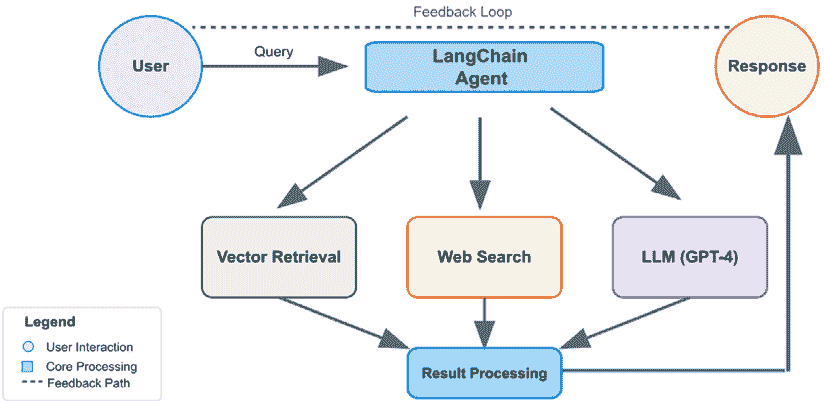
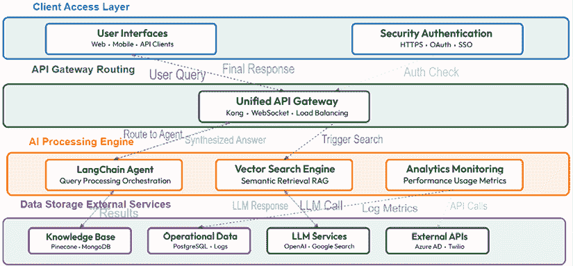
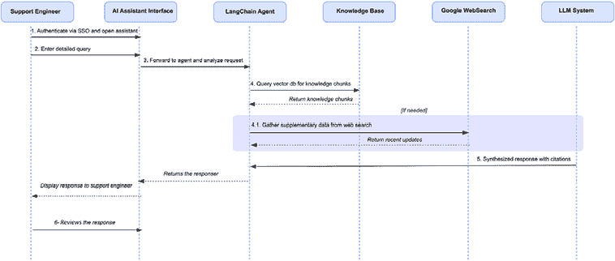
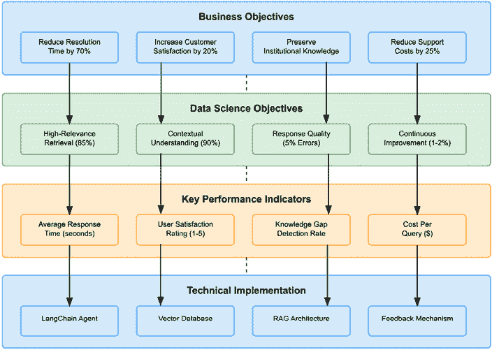

# 7

# 构建生成式 AI 系统 – 一个案例研究

在本书中，我们探讨了 AI 系统架构的核心原则，重点关注管理复杂性、确保可扩展性和将 AI 技术集成到企业软件中。我们研究了软件工程最佳实践，如模块化设计和结构化数据管道，如何帮助优化 AI 赋能系统。我们还讨论了将 AI 应用与利益相关者期望保持一致、实施有效设计模式和采用适应不断变化的数据和业务需求的迭代开发周期等挑战。案例研究和现实世界示例提供了一个结构化框架，以平衡技术精度和灵活性。

本章最后将重点关注生成式 AI 和**大型语言模型（LLMs**）作为案例研究，探讨将架构最佳实践应用于现实世界 AI 部署。我们将逐步介绍一个由 LLM 驱动的客户支持知识管理系统设计，包括**检索增强生成（RAG**）、搜索能力和自适应学习。通过分析关键组件，如 AI 代理、向量数据库和网页搜索集成，我们将将这些技术连接到基础架构策略，包括模块化、数据管道效率和云可扩展性。此示例提供了一个从高级业务目标到经过验证的 AI 系统的清晰路径。

本章将涵盖以下主题：

+   框架一个公司设计其知识平台并调查使用生成式 AI 的潜在可能性的问题

+   如何将公司的需求转化为数据科学目标

+   解释可能的架构选择

+   为公司的知识平台设计以 LLM 为中心的解决方案

+   如何量化以生成式 AI 为中心的设计质量

到本章结束时，你将拥有一个结构化、实用的理解，了解如何在企业环境中有效地设计和部署生成式 AI，重点关注可扩展性、合规性和长期可持续性。

# 商业挑战：知识管理危机

TechSolve，我们的案例研究 ERP 提供商，服务于制造、零售和医疗保健行业的多元化企业客户，面临着重大的知识管理挑战，这不仅威胁到运营效率，也威胁到客户关系：

+   **知识生态系统碎片化**：关键信息散布在 12 个以上的孤岛系统中，包括遗留文档、现代维基、支持票据和通信平台。

+   **资源利用效率低下**：支持工程师有 60%的时间在寻找信息，而不是将专业知识应用于解决客户问题。

+   **机构知识侵蚀**：关键见解和故障排除智慧随着经验丰富的员工离职而流失，估计有 15%的关键知识未记录。

+   **延长响应时间**：客户解决方案时间已延长至平均三天，显著超过服务等级协议（SLAs），并危及七位数的企业客户关系。

+   **服务质量下降**：一个自我强化的循环，其中疲惫的工程师提供下降的服务质量，进一步增加工单数量和客户不满。

财务影响是显著的：TechSolve 估计这些低效率每年导致 320 万美元的损失，包括额外的人力需求、生产力下降和客户流失。更令人担忧的是，灵活的竞争对手利用人工智能提供更优越的客户支持体验，从而产生了竞争优势。

# 愿景：通过生成式 AI 实现转型

为了应对这些挑战，TechSolve 的执行团队设计了一个全面的生成式 AI 实施计划，利用大型语言模型（LLMs）在整个组织内转型知识管理：

+   **统一知识框架**：将来自多个存储库的信息整合到一个跨格式、位置和部门的单一语义索引中。

+   **索引工作原理**：连接器从**维基**、**共享驱动器**、**电子邮件存档**、**工单记录**、**PDF**和**聊天记录**中提取非结构化内容。每个项目都经过标准化、扫描文件的 OCR 处理、去重和规范 URL 分配。内容被**分割成段落大小的跨度**，嵌入并存储在具有丰富元数据的向量数据库中，例如**来源**、**作者**、**产品**、**版本**、**创建日期**、**敏感性标志**和**PII 标签**。刷新是每晚的工作，并在可用的情况下执行更改数据捕获。

+   **基于事实的 AI 响应**：实施 RAG 以将答案锚定在经过验证的来源，同时保留 LLMs 的合成能力。

+   **情境智能**：提供一个理解领域术语、技术关系和隐含知识需求的对话界面。

+   **自适应学习系统**：创建一个自我改进的平台，使用用户反馈和用法模式来优化提示、检索策略和工具选择。

+   **结构化知识连接器**：整合**交易系统**以获取可信事实。只读适配器连接到**CRM**（例如，**Salesforce**）、**ERP**（例如，**SAP**）和**ITSM**（例如，**ServiceNow**）以检索权限、产品配置、账户状态、案例历史和 SLAs。访问通过**行级安全**、API 速率限制和缓存或计划同步来强制执行。数据以**类型化工具调用**或**参数化 SQL 视图**的形式暴露给代理，以便答案可以引用文档和系统事实。

初始原型利用 LangChain 代理来协调工具之间的检索和生成[4]，语义搜索和 Web 集成提供当前的外部背景[3][7]。这种架构实现了多步推理，可以在最小的人为干预下导航复杂的支持场景。原型包括两个管道：一个用于维基、电子邮件、PDF 和票据的无结构索引器，以及用于 CRM 和 ERP 的结构化适配器，使代理能够在单个引用响应中将引用文档与实时系统事实相融合。

“这不仅仅是实施一个 AI 聊天机器人。我们从根本上重新构想了机构知识在我们组织中的流动方式，打破了数十年来积累的壁垒，”TechSolve 的首席技术官 Sarah Chen 说。

# 对齐业务和技术目标

TechSolve 的生成式 AI 系统的成功实施需要高级业务目标与具体技术能力之间的仔细对齐。这一对齐过程确保了所有利益相关者——从执行领导到工程团队——都共享一个统一的成功愿景，并具有明确的绩效指标。通过将业务需求转化为具体的数据科学和工程目标，TechSolve 创建了一个指导项目生命周期中决策的框架，从初始架构设计到部署和持续改进。

## 数据科学目标

这些业务目标转化为五个数据科学目标，与 AI 风险管理指南[2][5]中的可审计性、可解释性和置信度报告相一致。建立这些可量化指标使 TechSolve 的数据科学团队能够系统地评估模型性能，并将技术实施决策与整体业务战略相一致。以下目标将 TechSolve 的业务需求转化为可衡量的技术目标，为数据科学团队提供明确的方向：

+   **高相关性检索**：在给定查询中识别最相关的知识片段时达到 85%的精确率，对技术内容与程序内容有专门的指标。

+   **上下文理解**：在识别用户意图方面达到 90%的准确率，包括隐含的知识需求、技术背景和查询重构要求。

+   **响应生成质量**：在生成的响应中将不准确率限制在 5%以下，对技术规范和兼容性指南有严格的事实性要求。

+   **可解释性**：确保所有系统响应都包含清晰的来源引用和置信度水平，从查询到最终响应保持审计轨迹。

+   **持续改进**：实施学习机制，根据使用模式和明确反馈，每月显著提高系统性能 1-2%。

这些目标为模型选择、训练方法、评估框架和系统架构奠定了基础，同时提供了明确的发展指标，以实现更广泛的企业成果。

# 架构：核心组件和工作流程

开发一个企业级生成式 AI 系统需要 TechSolve 将多个专业组件集成到一个统一的架构中。本节探讨了使分散的知识库转化为一个统一、响应迅速的系统，能够以准确和一致的方式处理复杂支持查询的技术基础。

## 系统概述

TechSolve 的生成式 AI 架构以 LangChain 为中心，这是一个协调多个 AI 组件（而不仅仅是简单的 LLM 交互）的编排框架。系统实现了一个智能代理，它战略性地管理用户查询，确定要使用的工具，并按顺序执行以获得最佳结果。

图 7.1：AI 查询处理工作流程：将 LLM 与向量搜索和网页数据集成

**快速提示**：需要查看此图像的高分辨率版本吗？请使用下一代 Packt Reader 打开此书，或在 PDF/ePub 副本中查看。

**下一代 Packt Reader**以及此书的**免费 PDF/ePub 副本**包含在您的购买中。扫描二维码或访问[`packtpub.com/unlock`](https://packtpub.com/unlock)，然后使用搜索栏通过名称查找此书。请仔细检查显示的版本，以确保您获得正确的版本。

*图 7.1*中显示的工作流程说明了用户查询如何通过系统流动，LangChain 代理通过将查询引导到适当的工具来协调整个过程：向量检索以访问知识库，网络搜索以收集外部信息，或直接到 LLM 进行处理。在生成响应后，一个反馈循环根据用户交互持续改进系统。

## 关键组件

现在，我们将深入了解使该系统运行的具体架构组件。每个组件都在将用户问题转化为准确、有帮助的响应中发挥着至关重要的作用。让我们从操作的“大脑”开始，逐步了解处理搜索和数据检索的辅助技术。

### LLM：认知引擎

现在，我们将深入了解使该系统运行的具体架构组件。每个组件都在将用户问题转化为准确、有帮助的响应中发挥着至关重要的作用。让我们从操作的“大脑”开始，逐步了解处理搜索和数据检索的辅助技术。

LLM 作为中央认知引擎，解释查询，制定检索计划，整合知识库数据，并构建连贯的响应。TechSolve 实施了一种分层方法：

+   **主模型**：OpenAI 的 GPT-4.1，用于需要复杂推理任务、对技术概念有深入理解、故障排除工作流程以及细微的客户需求。

+   **辅助模型**：GPT-4o mini 负责处理常规查询，在保持高质量响应的同时，比 GPT-3.5-Turbo 具有显著的成本效率。

+   **回退模型**：在 API 故障期间操作或处理具有特定安全要求敏感数据的场景中，内部部署 Llama 2 70B。然而，在本地部署 70B 参数模型需要大量的基础设施。组织需要考虑 GPU 内存需求、将模型量化到 4 位或 8 位精度以减少资源使用，以及平衡能力与硬件约束的参数剪枝技术。许多公司发现，较小的模型，如 7B 或 13B 变体，在提供足够的回退性能的同时，大幅降低了硬件成本和复杂性。

这种多模型架构保留了最大灵活性，防止了供应商锁定，同时允许随着技术格局的发展采用新兴的语言模型。这个设计的关键是抽象层，它标准化了模型之间的输入和输出，允许根据查询复杂性、成本考虑或特定的合规性要求进行无缝切换。

### 检索系统（向量数据库）：知识库

向量数据库是 TechSolve 知识架构的骨干，它使数百万个文档片段之间的语义搜索成为可能。向量数据库通过 RAG（结合外部知识与生成[3]）来定位响应，TechSolve 选择 Pinecone 作为主要向量存储，因为它具有可扩展性、托管服务模型以及对生产工作负载的强大支持。

然而，Qdrant 等替代选项也可能很有价值，尤其是在成本优化或对模型调优有精细控制优先级的场景中。Qdrant 提供了一条开源路径，具有强大的定制功能，这可能对那些更喜欢在管理自己的基础设施方面有更多灵活性的组织有吸引力。

不论是哪个特定平台，核心设计原则保持不变：嵌入被高效地生成、索引和检索，以在准确的组织知识中定位 LLM。

+   **嵌入框架**：利用 OpenAI 的 text-embedding-ada-002 模型将文档片段的意义转换为 1,536 维向量。这个过程捕捉了文本的“语义本质”，有效地在庞大的思想地图上为每个概念提供一个数值坐标。具有相似意义的文档将具有接近的坐标，这使得系统即使在措辞不同的情况下也能找到相关信息。

+   **向量存储**：采用 Pinecone 作为主要向量数据库，16 百万个文档块分布在六个不同的索引中，这些索引针对不同内容类型进行了优化

+   **混合检索**：结合向量相似性搜索与 BM25 关键词匹配，以平衡语义理解与词项特异性

+   **元数据过滤**：通过过滤 14 个不同的元数据字段来提高检索精度，包括文档年龄、作者专业知识水平、内容类型和相关性评分

该系统构成了 RAG 的基础，TechSolve 的实施通过将 AI 输出定位到具有明确溯源跟踪的验证、权威知识源，已证明在减少幻觉方面至关重要，降低了 87%。

除了 RAG 之外，一些组织也探索了**上下文感知生成**（**CAG**）。虽然 RAG 侧重于通过外部来源来定位答案，但 CAG 优化了模型内部使用上下文的方式。这种方法可以减少冗余检索调用，降低查询成本，并提高响应效率，使其在性能和成本控制为高优先级的场景中成为一个有价值的补充。

### 网络搜索整合：实时信息访问

为了解决所有预训练语言模型固有的知识截止限制，该架构集成了网络搜索整合：

+   **API 集成**：通过一个自定义包装器利用 Google 可编程搜索引擎，该包装器管理速率限制、缓存和结果过滤

+   **来源可信度**：实施了一个自定义排名算法，优先考虑官方文档、验证论坛和原始研究等权威来源

+   **内容提取**：利用专门的抓取技术从搜索结果中提取干净、相关的内容，同时保留归属

+   **结果综合**：在将关键见解纳入最终响应之前，应用文本摘要技术进行提炼

此组件提供实时信息访问，确保对快速发展的主题（如软件更新、新兴问题和社区开发解决方案）的响应保持最新，同时在内部知识库存在空白或过时信息时作为后备机制。

## 从静态模型到动态代理

TechSolve 架构的一个关键进步是从基本的 LLM 实现到复杂的基于代理系统的演变。这种转型从根本上扩大了 AI 解决方案在解决复杂企业需求方面的能力和自主性。

LangChain 将孤立的语言模型转化为企业级代理，这些代理展示了远超直接 API 访问能力的复杂能力：

+   **分布式知识访问**：无缝检索和综合来自多个存储库的任务关键信息，将结构化数据库查询与无结构化文档检索集成

+   **会话持续性**：在扩展的多轮交互中保持连贯的记忆，保留上下文而不重复，并适应不断变化的需求

+   **顺序推理**：将复杂问题分解为可管理的子任务，追求仅通过直接提示无法实现的跨步骤推理路径

+   **工具利用**：根据上下文需求动态调用专用功能，包括计算器、代码解释器和结构化 API 调用

+   **决策透明度**：提供明确的推理痕迹，记录工具选择、信息评估和综合方法，以实现治理和可审计性

这种基于代理的架构从根本上推动了人工智能系统在复杂组织中的运作方式。虽然传统模型在狭窄的预测任务上表现出色，但 LangChain 代理在知识综合、流程自动化以及跨结构化和非结构化企业数据的跨步骤推理方面展现出新兴的能力。除了推理和预测之外，这些代理还能够通过动态选择工具、执行工作流程和协调行动来实现既定目标。

## LangChain 代理工作流程

代理现在是现代人工智能实现的核心部分，因为它们使系统能够在多个工具和数据源之间进行推理。然而，代理的参与程度对性能和结果的确定性有重大影响。为了在灵活性可靠之间取得平衡，许多组织增加了护栏——限制和验证检查，有助于保持响应的一致性并符合业务需求。

在 TechSolve 的系统内，工作流程遵循六个关键阶段，将用户查询转化为可操作的见解。

### 用户查询输入

用户提交自然语言查询，范围从简单的 factual 问题（“版本 4.2 的兼容性矩阵是什么？”）到复杂的技术查询（“为什么在多货币交易后库存调整模块可能会失败？”）。每个查询都会经过初步预处理，包括以下内容：

+   实体提取，识别产品组件、版本和技术概念

+   意图分类，确定查询是否寻求事实信息、程序指导或问题诊断

+   消歧检测，识别需要澄清的潜在歧义

### 智能路由

代理应用复杂的推理来确定最佳处理路线和工具序列：

+   对于直接的事实查询，可能会触发直接的向量检索

+   对于复杂的故障排除场景，可能会启动一个结合检索、推理和可能网络搜索的多步骤过程

+   对于模糊的查询，可能会在继续之前生成澄清子问题

这种动态路由为每个查询创建定制的处理管道，利用 LLM 的推理能力来编排一系列针对特定信息需求的操作。

### 上下文增强

对于知识密集型查询，代理查询向量数据库以丰富 LLM 提示，包含相关的上下文数据：

+   先进技术，如混合检索，结合语义相似性和关键词匹配

+   元数据过滤根据最近日期、权威性和相关性标准限制结果

+   多阶段检索先进行初步广泛搜索，然后进行专注的细化

+   重新排序算法优化最终选择的知识片段

这些技术确保从权威文档、历史案例和先前交互中优化信息选择，为 LLM 提供生成准确、有帮助的响应所需的精确上下文。

### 网络搜索（条件性）

当内部知识不足时——尤其是对于最新更新或新兴问题——代理执行有针对性的网络搜索：

+   自动重新表述查询以优化搜索引擎的相关性

+   执行具有战略范围限制的搜索（例如，特定站点的查询）

+   根据来源可信度和内容相关性过滤和验证结果

+   在将其整合到响应上下文之前提取和总结关键信息

这种条件性增强确保了即使底层知识景观发生变化，系统也能保持最新，弥合内部文档与现实世界发展之间的差距。

### 响应生成

在收集了全面上下文的情况下——可能包括内部知识、网络搜索结果和对话历史——代理将此信息输入到 LLM 中进行综合：

+   生成直接针对用户查询并以适当细节和复杂性回答的响应

+   保持与组织标准一致的专业术语

+   提供明确的源归属，以便在需要时进行验证

+   根据内容类型优化信息格式（例如，将程序作为步骤，兼容性作为表格等）

结果是连贯的响应，它整合了多个知识来源，同时保持了自然、有帮助的语调，这使得 LLM 在知识传递方面特别有效。

### 反馈循环

精细的反馈机制捕捉显式评分和隐式信号：

+   用户通过点赞/踩和可选评论提供直接反馈

+   交互指标跟踪哪些响应导致后续问题而非解决

+   使用模式识别有效和有问题的响应模式

+   定期进行 A/B 测试，比较不同的提示策略和检索方法

这个持续学习周期使检索策略、提示方法和工具选择逻辑的系统化改进成为可能。在实践中，这通过诸如**具有人类反馈的强化学习（RLHF**）等技术实现，其中用户评分用于调整模型行为，以及基于先前成功和失败的提示迭代优化。这些方法共同创造了一个改进周期，随着时间的推移稳步增加系统价值。

# 技术基础设施

TechSolve 的生成式 AI 知识系统部署需要一个强大、可扩展的技术基础设施，能够处理企业级工作负载，同时保持性能、可靠性和安全性。本节描述了支持系统操作的基础计算和编排技术。

## 云计算架构

TechSolve 实施了平衡可扩展性和法规遵从性的混合云架构：

+   **主要环境**：利用托管 Kubernetes 服务进行核心处理组件的 Azure 云基础设施

+   **次要系统**：在本地部署处理具有严格数据居住要求的受监管医疗保健客户数据

+   **开发/测试**：容器化环境，无论部署目标如何都能实现一致的开发

+   **灾难恢复**：跨区域复制，具备自动故障转移功能，并保证 15 分钟的 RPO

这种战略方法在满足 TechSolve 繁多客户群的各种法规和性能要求的同时提供了最大的灵活性。

虽然这种混合方法平衡了可扩展性和合规性，但成本管理是一个重要的考虑因素。在托管云服务上运行核心工作负载可能导致更高的运营费用，尤其是在使用量不可预测地扩大时。另一方面，为了符合对受监管数据的严格数据居住要求，需要在前端投资硬件、持续维护和专门人员。为了减轻预训练模型的知识断档效应，系统使用具有可信度过滤的目标网页搜索[7]。TechSolve 采用了一种成本优化策略，包括自动扩展策略、为可预测工作负载预留的云实例以及资源监控以识别未充分利用的计算资源。这些措施有助于确保在不出现成本无序增长的情况下满足合规性和性能目标。

# 端到端系统架构

为了全面了解 TechSolve 的实施情况，本节检查了完整的系统架构，展示了各个组件如何集成为一个统一的整体。这种端到端视角说明了用户界面、应用程序逻辑和底层数据基础设施之间的关系，这些共同提供了知识管理解决方案。

完整的系统架构遵循三层模型，如图 7.2 所示。它分离了关注点，同时确保组件之间无缝交互：

图 7.2：端到端系统架构：Web、移动和 API 访问 AI 驱动的知识服务

## 客户端层：用户访问和体验

在最高层，客户端层作为所有用户交互的入口点：

+   **Web 界面**: 适用于桌面和移动设备的技术支持环境中的响应式设计

+   **移动应用**: 用于现场支持场景的原生 iOS 和 Android 应用

+   **API 访问**: 用于与票务系统和自定义工具集成的 REST 和 GraphQL 端点

+   **安全层**: 完整的 HTTPS 实现，包括证书固定和高级认证

## 表示层：界面编排

中间层包含表示层，作为 Kubernetes 集群实现：

+   **编排 Web 应用**: 管理用户界面状态和交互的 React/Node.js 应用

+   **API 网关**: 基于 Kong 的统一入口点，提供请求路由、速率限制和认证

+   **WebSocket 服务**: 支持实时通信，支持流式响应和输入指示

+   **内容分发网络（CDN）集成**: 全球 CDN，最小化静态资源的延迟

## 应用层：业务逻辑

核心处理发生在应用层：

+   **查询处理服务**: 管理请求解析、意图分类和响应生成

+   **向量数据库服务**: 促进知识库之间的语义搜索功能

+   **嵌入服务**: 将自然语言转换为向量表示

+   **分析服务**: 通过数据聚合和可视化提供洞察

+   **工作流引擎**: 协调复杂支持场景的多步骤流程

## 数据层：信息存储和检索

架构的基础是数据层：

+   **向量数据库**: Pinecone 实现，支持高效的相似性搜索

+   **文档存储**: 管理非结构化内容的 MongoDB 存储库

+   **操作数据库**: 处理事务数据的 PostgreSQL 系统

+   **日志/监控**: ELK 堆栈捕获系统性能指标和用户交互

## 外部服务：扩展功能

系统集成了专门的第三方解决方案：

+   **OpenAI API**: 提供高级语言理解和生成能力

+   **Google Search API**: 使信息检索超越内部知识

+   **Microsoft Entra ID**: 管理企业身份验证和授权

+   **Twilio**: 启用关键响应和更新的短信通知

+   **Elastic APM**: 在技术堆栈中提供应用性能监控

# 用户交互模式

虽然技术架构提供了基础，但 TechSolve 系统的最终价值是通过与用户的互动实现的。本节探讨了典型的流程和工作模式，展示了支持工程师和其他利益相关者如何与系统互动，以高效地解决客户需求。

为了说明不同的利益相关者如何与系统互动，TechSolve 的架构师记录了关键的使用场景，捕捉了常见的流程。

## 用例：查询解决

这个主要工作流程代表了与 TechSolve 知识系统最常见的互动模式。面对复杂的客户问题时，支持工程师利用 AI 系统快速访问组织知识库中的相关信息，从而实现比以前通过手动搜索更快、更准确的解决方案。

**主要角色**：支持工程师

**次要角色**：AI 系统

**工作流程**:

1.  支持工程师通过 SSO 进行身份验证，并导航到 AI 助手界面。

1.  他们输入一个详细的查询，描述客户的技術问题。

1.  人工智能系统通过 LangChain 代理处理查询，检索相关的知识块。

1.  如果需要，系统从 Google 网络搜索中收集补充数据以获取最新更新。

1.  LLM 综合了一个全面的响应，并明确引用了来源。

1.  支持工程师审查推荐，可能进行修改。

1.  最终的响应附加到客户工单上，所有互动都记录下来以供训练。

**变体**:

+   如果系统信息不足，它会提示进行澄清或建议知识差距。

+   对于敏感的客户数据，系统使用具有增强安全性的本地处理路径。

+   当访问受限制的信息时，适当的授权检查可以防止未经授权的披露。

图 7.3：TechSolve 知识系统序列流：端到端查询处理管道

# 业务影响

任何技术实施的真正成功衡量标准在于其可衡量的业务成果。本节分析了 TechSolve 通过其生成式 AI 知识系统实现的量化结果，考察了在运营效率、客户体验、财务表现和组织文化方面的改进。

为确保这些结果被准确测量，TechSolve 建立了一个全面的测量框架。首先，他们捕捉了部署前的六个月基线数据。**运营指标**，如解决时间，是从他们的支持票务系统（Jira）中提取的。**客户体验数据**，如**净推荐值**（NPS）和满意度评分，是通过自动后交互调查收集的。**财务数据**，如每张票的成本，是通过结合运营数据与财务部门的成本模型计算得出的。最后，系统自身的**分析服务**数据被用来跟踪使用模式和知识贡献。所有这些信息都被汇总到一个中央分析仪表板中，以进行持续的比较分析。

TechSolve 对该架构的实施在多个维度上取得了变革性的成果：

## 运营转型

TechSolve 的实施在支持运营效率上产生了戏剧性的改进，改变了工程师日常工作的方式，并显著加快了客户的价值实现时间：

+   **解决加速**: 平均解决时间从 3 天减少到 4.7 小时（减少了 84%）

+   **工程师生产力**: 工作日中用于搜索信息的时间从 60%减少到 26%

+   **能力提升**: 支持团队在仅增加 8%人员的情况下，处理了 27%的票量增长

+   **知识民主化**: 高级工程师和初级工程师之间的绩效差距减少了 62%

## 客户体验

客户满意度指标显示显著改善，因为客户体验到了更快、更一致、质量更高的支持互动：

+   **满意度指标**: 部署后的 9 个月内，NPS 上升了 37 分

+   **首次接触解决率**: 通过增强知识访问，比率从 34%提高到 71%

+   **一致的质量**: 客户满意度评分的变异性降低了 58%

+   **响应一致性**: 响应中的技术准确性率从 82%提高到 97%

## 财务成果

通过多个财务指标验证了实施的商业案例，这些指标证明了成本节约和收入增长：

+   **支持经济性**: 每张票的成本降低了 31%，超过了最初的 25%目标

+   **续订影响**: 企业客户续订率同比增长 9%

+   **扩展收入**: 来自现有客户的交叉销售和升级销售收入增长了 14%

+   **投资回报率实现**: 系统在全面部署后的 7.5 个月内实现了投资回报

## 文化演变

除了可衡量的业务成果外，该系统还催化了重大的组织文化转变，进一步放大了其影响：

+   **知识共享**: 员工贡献的文档增加了 143%

+   **协作提升**: 跨职能知识交流增加了 68%

+   **创新加速**：通过改进知识流动，将新功能的上市时间缩短了 22%

+   **人才吸引**：内部调查中技术支持工作满意度评分提高了 41 分

# 关键架构原则

除了具体的实现细节之外，TechSolve 的经验产生了适用于各种企业环境的宝贵架构原则。本节提炼了这些对系统成功有贡献的核心设计模式，为组织提供了一个可以适应其自身生成式 AI 计划的框架。

TechSolve 的实施体现了可以在多个领域应用的三个基本设计原则。

## 检索增强生成（RAG）

RAG 代表了应用 AI 的一个范式转变，结合了知识数据库和生成能力的优势：

+   **幻觉减少**：基于验证过的来源进行输出，通过减少 87%的事实错误来确保准确性

+   **动态知识**：允许在不重新训练模型的情况下更新信息，保持与业务环境演变的关联性

+   **透明来源**：为生成内容提供清晰的归属，建立信任并允许验证

+   **效率优化**：通过将模型复杂性集中在合成而不是记忆上，减少计算需求

此模式对于拥有大量专有知识的企业尤其有价值，允许它们在保持准确性和合规性的同时利用生成式 AI。

图 7.4：从业务目标到技术实现：TechSolve 的 AI 性能框架

## 自适应查询路由

此架构模式根据以下查询特征实现智能工作负载分配：

+   **分层处理**：根据复杂度将查询路由到适当的资源，从简单的检索到复杂的推理

+   **成本优化**：通过将计算资源与实际需求相匹配来最小化支出

+   **响应优化**：根据查询的紧迫性和重要性平衡速度和彻底性

+   **回退管理**：当主要信息来源不足时，实施优雅降级策略

通过将处理方法与查询需求相匹配，这一设计原则在多种使用场景中最大化了系统效率和响应质量。

## 反馈驱动的学习

该架构通过综合反馈集成实现系统性的改进：

+   **多渠道输入**：捕获显式评分、隐式信号和运营指标以指导优化

+   **受控实验**：利用 A/B 测试来评估检索和生成的替代方法

+   **性能监控**：跟踪关键指标，包括准确性、延迟和满意度，涵盖系统组件

+   **持续适应**：实施自动和手动优化周期，逐步增强能力

这个学习生态系统确保系统随着时间的推移变得越来越有价值，适应不断变化的信息需求和演变的语言模式。

# 摘要

这个案例研究展示了知识管理领域的生成式 AI 架构如何转型企业信息系统。通过将高级大型语言模型与结构化检索机制相结合，组织可以将分散的知识集中到统一、可访问的框架中 [3][6][7]。

TechSolve 的实施展示了精心设计的具有分层组件、稳健的数据管道和反馈驱动的改进机制的 AI 架构如何提高支持操作并提升客户满意度 [1]。

关键见解：通过检索增强将 AI 响应在验证的组织知识中定位，保持清晰的数据来源，并建立持续的反馈循环 [3][5][2]。

这些架构模式超越了知识管理，广泛应用于企业应用，为平衡创新与治理、可扩展性与可靠性的人工智能集成提供了蓝图 [1]。

随着生成式人工智能的持续成熟，这里概述的架构原则将继续作为将技术潜力转化为可持续业务转型的基本指南 [1][5]。

# 参考文献

1.  巴斯，伦，保罗·克莱门茨，和里克·卡兹曼。“软件架构实践：软件架构师实践。”Addison-Wesley，2012。

1.  刘易斯，格蕾丝。“开始使用 NIST 人工智能风险管理框架。”SEI 博客，卡内基梅隆大学，2023。

1.  高建峰，等。“用于知识密集型自然语言处理任务的检索增强生成。”*神经信息处理系统进展*，2020。

1.  LangChain. “代理。”LangChain 文档，2023。

1.  美国国家标准与技术研究院。“人工智能风险管理框架（AI RMF）。”NIST，2023。

1.  博马萨尼，里希，等。“关于基础模型的机会与风险。”arXiv 预印本 arXiv:2108.07258，2021。

1.  赵威新，等。“大型语言模型综述。”arXiv 预印本 arXiv:2303.18223，2023。

|

#### 现在解锁本书的独家优惠

扫描此二维码或访问 [`packtpub.com/unlock`](https://packtpub.com/unlock)，然后按书名搜索。 |  |

| **注意**：在开始之前准备好您的购买发票。* |
| --- |
