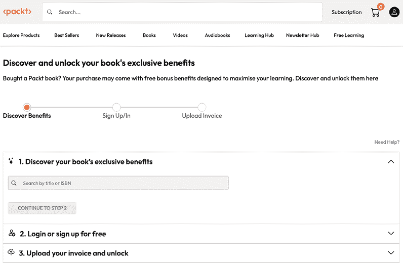

# 9

# 解锁您书籍的独家权益

您的这本书包含以下独家权益：

 新一代 Packt 阅读器

 AI 助手（测试版）

 免版税 PDF/ePub 下载

如果您尚未解锁，请使用以下指南进行解锁。此过程只需几分钟，并且只需完成一次。

# 如何通过三个简单步骤解锁这些权益

## 步骤 1

准备好您购买此书的购买发票，因为在*步骤 3*中您将需要它。如果您收到的是纸质发票，请用手机扫描它，并准备好作为 PDF、JPG 或 PNG 格式。

如需更多帮助查找您的发票，请访问[`www.packtpub.com/unlock-benefits/help`](https://www.packtpub.com/unlock-benefits/help)。

**注意**：您是否直接从 Packt 购买了这本书？您不需要发票。完成步骤 2 后，您可以直接跳转到您的独家内容。

|

## 步骤 2

扫描此二维码或访问[`packtpub.com/unlock`](https://packtpub.com/unlock)。|  |

| 在打开的页面（如果您在桌面端，将类似于图 X.1），通过书名搜索这本书。请确保您选择了正确的版本。图 X.1：桌面端 Packt 解锁着陆页面 |
| --- |

## 步骤 3

选择您喜欢的书籍后，请登录您的 Packt 账户或免费创建一个新账户。登录后，上传您的发票。它可以以 PDF、PNG 或 JPG 格式，且大小不得超过 10 MB。按照屏幕上的其余说明完成此过程。

|

## 需要帮助？

如果您遇到困难需要帮助，请访问[`www.packtpub.com/unlock-benefits/help`](https://www.packtpub.com/unlock-benefits/help)获取有关如何查找发票及其他信息的详细 FAQ。以下二维码将直接带您到帮助页面：|  |

**注意**：如果您仍然遇到问题，请联系 customercare@packt.com。

packtpub.com

订阅我们的在线数字图书馆，即可全面访问超过 7,000 本书籍和视频，以及行业领先的工具，帮助您规划个人发展并提升职业生涯。如需更多信息，请访问我们的网站。

# 为什么订阅？

+   使用来自 4,000 多名行业专业人士的实用电子书和视频，节省学习时间，多花时间编码

+   通过为您量身定制的 Skill Plans 提高学习效果

+   每月免费获得一本电子书或视频

+   完全可搜索，便于轻松访问关键信息

+   复制粘贴、打印和收藏内容

在 www.packtpub.com 上，您还可以阅读一系列免费技术文章，订阅各种免费通讯，并享受 Packt 书籍和电子书的独家折扣和优惠。

# 您可能还喜欢的其他书籍

如果您喜欢这本书，您可能对 Packt 的其他书籍也感兴趣：

**领域驱动重构**

Alessandro Colla, Alberto Acerbis

ISBN: 978-1-83588-910-7

+   了解如何识别系统组件的边界

+   应用如边界上下文和通用语言的策略模式

+   精通构建聚合和实体的战术模式

+   发现主要的重构模式并学习如何实现它们

+   识别复杂代码库中的痛点并解决它们

+   探索事件驱动架构以实现组件解耦

+   掌握编写验证和保持架构完整性的测试的技能

**使用 Python 的清洁架构**

Sam Keen

ISBN: 978-1-83664-289-3

+   以 Pythonic 的方式应用清洁架构原则

+   实施领域驱动设计以隔离核心业务逻辑

+   在 Python 环境中应用 SOLID 原则以提高代码质量

+   结构化项目以实现可维护性和易于修改

+   为清洁架构的 Python 应用程序开发测试技术

+   重构遗留 Python 代码以符合清洁架构原则

+   使用清洁架构设计可扩展的 API 和 Web 应用程序

# Packt 正在寻找像你这样的作者

如果你有兴趣成为 Packt 的作者，请访问 authors.packt.com 并今天申请。我们已经与成千上万的开发者和技术专业人士合作，就像你一样，帮助他们与全球科技社区分享他们的见解。你可以提交一般申请，申请我们正在招聘作者的特定热门话题，或者提交你自己的想法。

# 分享你的想法

现在你已经完成了 *架构人工智能软件系统*，我们非常想听听你的想法！如果你从亚马逊购买了这本书，请[点击此处直接进入亚马逊评论页面](https://packt.link/r/1804615978)并分享你的反馈或在该购买网站上留下评论。

你的评论对我们和科技社区非常重要，并将帮助我们确保我们提供高质量的内容。
