# 2

# 生成式人工智能、RAG 和代理式人工智能的区别

今天的组织面临一个关键挑战：在快速变化的环境中，将真正的 AI 能力与营销炒作区分开来，同时调整未来的战略。随着新出现的 AI 术语充斥着每一个提案、演示和产品展示，即使是经验丰富的技术人员也发现自己正在参与那些技术基本差异仍然不清晰的对话。在最理想的情况下，这些差异是不清晰的；更常见的是，它们是无法理解的。无论你是评估解决方案、设计系统还是提供战略投资建议，这不仅仅关于理解流行语；这是关于做出明智的决定，这些决定定义了你的组织的竞争优势。

三个概念已经出现，成为定义现代人工智能应用的基石技术：**生成式人工智能**（**GenAI**），它使系统能够从学习到的模式中创建新内容；**检索增强生成**（**RAG**），它将 AI 模型连接到外部知识源以提高准确性；以及代理式人工智能，它为能够计划、推理和执行复杂工作流程的自主系统提供动力，需要最小程度的人类干预。理解这些技术如何相互关联和相互构建对于做出关于人工智能实施的战略决策至关重要。即使这些广泛接受的术语也有无数的解释，而我们并不声称提供唯一真理，我们的目标是为你提供一个坚实的基础。

本章是你进入生成式人工智能世界的入门点。如果你已经拥有丰富的 AI 架构经验，并且清楚地理解这些技术之间的区别，你可以选择继续阅读后续章节。但对于那些寻求建立坚实基础的人来说，本章将为后续内容提供必要的基石。

到本章结束时，你将清楚地理解以下内容：

+   探索人工智能的历史演变以及生成式人工智能如何从早期方法中产生

+   **大型语言模型**（**LLMs**）的基本作用以及它们如何处理和生成信息

+   嵌入模型如何将数据转换为向量，这是 AI 推理的基础

+   向量数据库在存储、管理和启用高效相似性搜索中的关键作用

+   语义搜索、RAG 和混合搜索方法之间的区别

+   代理式人工智能与先前人工智能系统的不同之处，以及它是如何实现自主决策的

+   人工智能代理的核心组件，包括记忆、编排、工具、模型和数据服务

+   这些组件如何在实际应用中协同工作以解决真实业务问题

# 人工智能的演变：从理论到 ChatGPT

要理解今天的 AI 格局，我们需要追溯引领我们来到这里的科技旅程。这一演变跨越了几十年的研究突破，从符号逻辑和专家系统到今天驱动 LLMs 的 Transformer 架构。通过审视这一进展，我们可以更好地欣赏当前能力的出现以及为什么架构决策继续塑造今天的系统。

当我们谈论 GenAI 中的**模型**时，我们指的是一个经过训练以识别和复制数据中发现的模式的数学系统。我们使用“模型”这个词，因为，就像建筑或气候系统的模型一样，它是对复杂事物的简化、结构化版本；在这种情况下，是语言、图像或行为。GenAI 模型在大数据集上训练，以学习元素（如单词或像素）通常如何相互关联。一旦训练完成，它可以根据学习到的结构生成新的、类似现实的内容。它不存储确切答案；它模拟事物的工作方式，然后利用这种理解来创建新的输出。

我们将跨越三个主要转折点来追溯这一演变：AI 的早期基础、LLMs 的突破性出现以及这些发展如何最终汇聚成我们今天所知的 GenAI 系统。

## 简短的历史漫步

自鼠标的发明以来，人工智能可以说是 IT 社区中最受关注的技术。令人着迷的是，普遍存在的信念是*人工智能一夜之间神奇般地发明出来，当 OpenAI 向公众发布 ChatGPT 时，它已经完全形成*。但今天的能力并非一夜之间出现。要理解它们，我们需要在时间背景下追溯今天*GenAI*的演变。

1955 年，**人工智能**这一术语由约翰·麦卡锡及其同事提出，并于 1956 年在达特茅斯研讨会上首次使用，这是一次开创性的事件，汇集了顶尖科学家来定义和推进这一领域[1]。根据牛津词典，人工智能是：

> 计算机系统理论和开发，能够执行通常需要人类智能的任务，如视觉感知、语音识别、决策和语言之间的翻译[2]。

从那个起点，出现了几种不同的方法，每种方法都受到其时代计算能力和研究优先事项的影响。其中包括：符号逻辑系统、模糊逻辑（20 世纪 80 年代）、早期神经网络（20 世纪 90 年代），以及最终成为越来越实用和普遍的机器学习，它在 21 世纪初变得日益实用和广泛。

随着实验的加速，两项关键技术进步汇聚在一起，使得大规模人工智能的发展成为可能。首先，通过早期对图形处理器（GPUs）的软件接口（如 **CUDA**，于 2007 年发布）的支持，建立了并行计算能力，这使得程序员能够利用图形处理器的巨大并行处理能力进行通用计算任务。其次，如 **Apache Spark**（于 2010 年开源）这样的框架帮助克服了早期分布式计算平台（如 **Hadoop MapReduce**）的核心限制。

Hadoop MapReduce 是一个早期系统，用于将大型计算任务分割到多台计算机上，但由于它必须反复读取和写入数据到磁盘，因此对于机器学习来说速度很慢。Spark 通过在处理步骤之间保持数据在计算机内存中，从而革命性地改变了这一点，使得迭代算法对于机器学习来说运行速度提高了数个数量级。这些进步共同意味着研究人员最终能够高效地处理和分析大量数据集，这一突破对于训练我们今天看到的大规模人工智能模型变得至关重要。

## AlphaGo 和人工智能的转折点

2016 年 3 月，另一个里程碑出现了。在韩国首尔的一张围棋盘上，DeepMind 开发的 **AlphaGo** 与历史上最杰出的围棋选手之一李世石对弈。随后，机器以惊人的 4-1 胜利结束，这成为了现代人工智能故事中的一个转折点。

这为什么如此重要？与棋类游戏不同，围棋长期以来一直抵制计算机的掌握。它的搜索空间非常庞大，比宇宙中的原子还要多。它需要直觉、模式识别和战略深度。几十年来，人工智能研究人员认为围棋超出了蛮力计算的范围，需要一种曾经被认为仅属于人类的推理形式。

AlphaGo 打破了这一信念。通过结合深度神经网络、**强化学习**和蒙特卡洛树搜索，它标志着方法上的根本转变。AlphaGo 不是仅仅依赖于预定义的规则或穷举搜索，而是学会了。首先，从人类专家的游戏中学习，然后通过与自己进行数百万次游戏来学习。这是首次公开展示大规模深度强化学习，展示了能够通过经验而不是逐行编程来改进的系统所具有的力量。

## LLMs 的出现

如果 AlphaGo 标志着决策人工智能的转折点，**transformers** 则重新定义了机器理解语言的方式。

从 2006 年的一个提案开始，IBM 开发了 *Watson*，这是一个深度问答系统，它在 2011 年赢得了 *Jeopardy!*，这是在非结构化数据上自然语言处理（**NLP**）的一个重大突破[3]。Watson 结合了知识库、机器学习和复杂的问答系统，标志着人工智能在理解和处理人类语言能力方面的一个重要里程碑。

但今天的 LLM 遵循了不同的进化路径。2017 年，谷歌研究人员发表了《Attention Is All You Need》，介绍了关键的**转换器**架构，这对于构建现代语言模型至关重要[4]。转换器的关键创新是自注意力机制，它允许模型同时处理整个序列，并在文本中比之前的顺序方法更有效地捕捉长距离依赖关系。

转换器成为了现代 LLM 的基础，2020 年的 GPT-3 和 2022 年的 ChatGPT 等模型真正进入了主流，开启了**通用人工智能（GenAI）时代**。

**转折点**

当 Watson 展示了工程化系统和精心构建的知识库以赢得胜利时，基于转换器的 LLM（大型语言模型）却采取了截然不同的路线。它们不是被编程去说什么，而是学会了去*预测*，通过在庞大的数据集中发现模式，生成流畅、常常类似人类的响应。在这些里程碑之间，AlphaGo 的胜利揭示了新的东西：AI 不仅能回答问题，还能适应、学习和令人惊讶。这种转变帮助铺平了今天生成式和代理式系统的道路。

这段近期历史强调了今天的 GenAI 系统不是单一突破的结果，而是数十年来渐进式创新、基础设施演变和累积研究进步的结果。虽然 AI 的更广泛历史包括进步和资金减少的时期，即所谓的*AI 寒冬*，但直接导致 GenAI 的轨迹在近年来急剧加速。现代数据平台在这一近期演变中至关重要，提供了存储、处理和分析训练今天最强大模型所需的庞大数据集所需的基础设施。

LLM 的发展仍在迅速演变。虽然像 OpenAI（ChatGPT）和 Anthropic 这样的早期领导者到 2025 年仍主导着市场，但新的方法正在出现。例如，DeepSeek 这样的公司正在探索分而治之的方法来降低 LLM 的复杂性和成本，而像 Zhipu 这样的公司正在开发基于路由器的架构，拥有专门的*专家*。尽管有这些不同的方法，但 LLM 作为知识库和推理引擎的核心概念，在可预见的未来很可能会继续成为 AI 系统的核心。

# GenAI：从模式中创建新内容

LLM 是任何 GenAI 解决方案的基础。虽然通常被视为实现 GenAI 能力的主要要求，但今天的 LLM 尽管实现了显著的推理能力，仍然严重依赖于外部资源来提供有用的上下文：**数据**。

术语**提示（prompting**）和**提示工程（prompt engineering**）经常与 LLMs 和 GenAI 一起使用。提示指的是为 LLM 构建查询，而提示工程则涉及系统地优化这些查询以获得更好的结果。早期的 LLM 交互高度强调独立的提示工程，导致了 LinkedIn 上数百万提示工程师的夜间现象。

然而，随着像 RAG 这样的高级架构模式的出现，它将 LLM 与外部知识检索系统相结合，重点转向了更全面的解决方案，这些解决方案将 LLM 嵌入到更广泛的系统中，而不是将其视为孤立工具。（我们将在本章后面详细探讨 RAG。）有效的提示现在涉及构建查询，这些查询可以最佳地利用这些模式提供的丰富上下文数据，使上下文的质量与提示本身一样重要。

更高级的提示技术，例如**思维链（Chain-of-Thought，CoT**）提示，为我们提供了一种帮助 AI 逐步思考的方法，类似于在数学课上展示你的工作，这进一步提高了响应的质量。通过要求它“逐步思考”，你使它更有可能进行正确的推理，尤其是在数学、逻辑或多部分任务中的更难问题。这种方法在处理复杂场景时尤其有效，这些场景可以从系统性的分解中受益；例如，在处理大型文档，如保险索赔时，你可能会首先提示 LLM 识别关键组成部分，然后系统地分析每个部分，最后综合研究结果。

与任何数据系统一样，老话“垃圾输入，垃圾输出”同样适用。在 LLM 的情况下，低质量输入可能导致**幻觉（hallucinations**），即生成看似合理的输出但经检查实际上是 LLM 完全虚构的回答。缓解这些问题的方法已经从简单的提示调整发展到包括更好的上下文框架、改进的数据验证和复杂的过滤机制，以防止信息漂移并确保输出可靠性。

## GenAI 的工作原理

GenAI 指的是能够根据从现有数据中学习到的模式创建新内容（如文本、图像、代码或其他媒体）的 AI 系统。与遵循明确规则的传统 AI 系统不同，GenAI 从庞大的数据集中学习模式和关系，然后使用这种理解来生成新的、原创的内容，这些内容类似于训练数据。理解 LLM 的基础性质可以帮助组织评估其资源影响并有效地利用这些技术。

然而，现实是 LLMs 是黑盒和非确定性的，这意味着相同的输入并不总是产生相同的输出。关于我们仍然不完全理解 LLMs 内部工作原理的想法，有一些真实性。尽管在这方面进行了大量研究，但清楚地理解 LLM 内部实际发生的事情仍然遥不可及。AI 安全领域的领导者之一 Anthropic 撰写了一篇关于这个问题的论文，结论是：

> 理解模型使用的表示形式并不能告诉我们它是如何使用的；尽管我们有这些特征，我们仍然需要找到它们所涉及的电路。并且我们需要证明我们已经开始找到的与安全相关的特征实际上可以用来提高安全性。还有更多的工作要做。

认识到 LLMs 的能力和局限性，例如它们有限的范围窗口和潜在的幻觉可能性，对于设定现实期望和制定必要的保障和增强策略变得至关重要。此外，关于使用预训练模型、微调或构建自定义模型的决定，将直接影响预算、时间表和基础设施选择，这些知识对于供应商谈判和平台选择至关重要。

GenAI 的过程遵循关键顺序步骤，如图*图 2.1*所示。

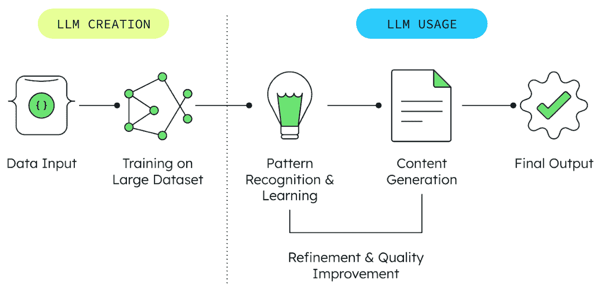

图 2.1：GenAI 流程

图表描述了一个涉及五个关键阶段的过程流程。首先，组装一个巨大的训练数据集，通常大小为数十个 PB。然后，使用这些数据来训练 LLM。在训练过程中，以及随后的使用中，模型开始识别模式并在不同的数据片段之间建立联系。然后，模型被终端用户提示，并生成输出。通常，这些提示和输出将内部监控并反馈到模型中，以实现持续的改进和质量提升。

这个顺序过程展示了基本原理：GenAI 创造新颖内容的能力直接源于其对现有模式的全面理解。训练数据越多样化、质量越高，生成的输出就越复杂、越准确。这种理解对于计划实施 GenAI 的组织至关重要，因为它强调了数据质量的重要性以及实现最佳结果的迭代性质。

## GenAI 的局限性和挑战

尽管 GenAI 取得了显著的进步，但它面临着一些组织必须考虑的几个重大限制：

+   **训练数据限制**：LLMs 从根本上受限于其训练数据。如果数据过时、有偏见或缺乏多样性，模型的输出将反映这些缺陷，可能生成不相关信息或延续有害的刻板印象。

+   **幻觉和事实错误**：模型可能会自信地生成听起来合理但实际上错误或无意义的信息，这种现象被称为“幻觉”。这使得它们在没有适当的安全措施（如 RAG）的情况下，对于需要高程度事实准确性的应用来说不可靠。

+   **可解释性不足**：许多大型语言模型（LLM）复杂且具有“黑盒”性质，使得理解其内部推理变得困难。这种缺乏透明度，通常被称为可解释性或可解释性挑战，在需要理解决策背后的“为什么”的监管行业或关键应用中可能是一个重大的障碍。

+   **上下文和推理限制**：模型可能在细微的理解、常识推理以及维持长时间交互的上下文中遇到困难。它们可能会误解含糊不清的查询或无法理解复杂的多步指令。

+   **伦理和社会风险**：通用人工智能（GenAI）的广泛应用带来了重大的伦理挑战，包括生成虚假信息和深度伪造、加剧偏见、侵犯版权以及为恶意使用开辟新途径的可能性。

现代数据平台通过提供灵活、可扩展的基础设施来存储和处理 AI 训练和操作所需的各种数据类型，有助于解决这些挑战。基于文档的数据模型特别适合 AI 应用，因为它们可以适应不断变化的需求，并以自然形式存储异构数据类型，这是构建更可靠和有根据的 AI 系统的基本步骤。此外，访问广泛的数据源，而不是局限于传统的孤岛系统，通常需要诸如动态行动系统等概念，我们将在下一章中讨论。

## 从数据到向量

在引入的灵活数据存储能力的基础上，使 AI 推理成为可能的下一步是将数据转换为计算机可以处理和数学操作的格式。这就是向量概念的作用所在；它们作为通用语言，使通用人工智能能够处理任何类型的结构化或非结构化数据。想象一下向量就像地图上的坐标，但它们不仅可以用经纬度显示位置，还可以在数百或数千个维度上表示任何数据片段的意义。一个向量可能捕捉到使产品描述吸引人的因素，为什么某些客户评价相似，或者不同的文件如何相互关联。虽然文本在三维空间中的表示仍然容易理解，但电影片段在数百维空间中的表示则难以可视化，我们将这一概念留作思维练习。电影片段的一个用例可能是数字版权管理和识别相同或派生电影，这并不罕见。

关键的洞见是：在向量空间中，相似的事物最终会聚集在一起。

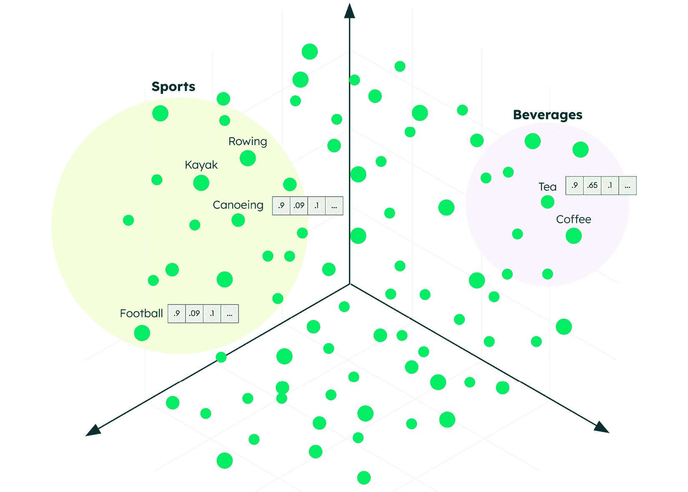

图 2.2：向量空间可视化 – 相似的概念聚集在一起

*图 2.2*展示了这一概念的实际应用。每个彩色点代表一个被转换为向量形式的不同数据点。注意相关概念是如何自然地聚集在一起的，与体育相关的术语聚集在一个区域，饮料形成自己的区域，而像篮球和足球这样的特定活动则靠近它们更广泛的体育类别。这不是巧合；这是数学意义上的意义表示，使得 AI 系统如此强大。

但这在商业应用中是如何体现的呢？当客户询问“支付问题”时，AI 系统可以立即定位不仅包含这些确切词语的文档，还包括关于“账单问题”、“账户费用”和“订阅费用”的相关内容，因为它们都存在于向量空间中的同一区域。

# 嵌入模型和“嵌入器”

但现在你可能想知道，“*我如何将我的数据转换为向量*？”数据通过称为嵌入模型的专用算法表示为向量。这些模型通常结合机器学习或数学函数，可以将各种数据类型转换为向量形式的数值表示，使 AI 系统能够在多个维度上理解关系和发现相似性。文本、图片、视频和声音是最常见的应用，但嵌入模型可以表示几乎任何数据类型，甚至可以表示捕捉特定状态或上下文的复杂数据组合。

执行这种数据转换的工具，通常被称为*嵌入器*，是真正数学运算发生的地方。并非每个数据集都是相同的，显然，视频的嵌入需求与简单的文本不同。嵌入器是向量生成的引擎，通常成为整个系统设计中最为追求的部分。客户对不同的嵌入器进行 A/B 测试（比较两种不同的方法以确定哪种表现更好）以确定最适合其特定需求的一个，这种情况并不少见（每个嵌入器都有其自己的数学基础，而那些对德国保险文件效果很好的方法可能并不适合马来西亚的医疗保健文件）。

根据团队是否来自应用开发或数据科学方面，嵌入器的看法大相径庭。应用开发者通常将它们视为将数据序列化为可用格式的基本工具，而数据科学家和 AI 专家则认为它们是决定整个 AI 解决方案成功或失败的关键组件。嵌入模型的选择可以极大地影响搜索相关性、语义理解和整体系统性能。

高性能嵌入模型的良好例子是 Voyage AI 的嵌入模型套件，这些模型专门针对检索任务进行了优化，并在不同领域和数据类型上提供最先进的性能。这些模型展示了专业嵌入器如何显著提高向量表示的质量，从而提高 AI 应用的有效性。

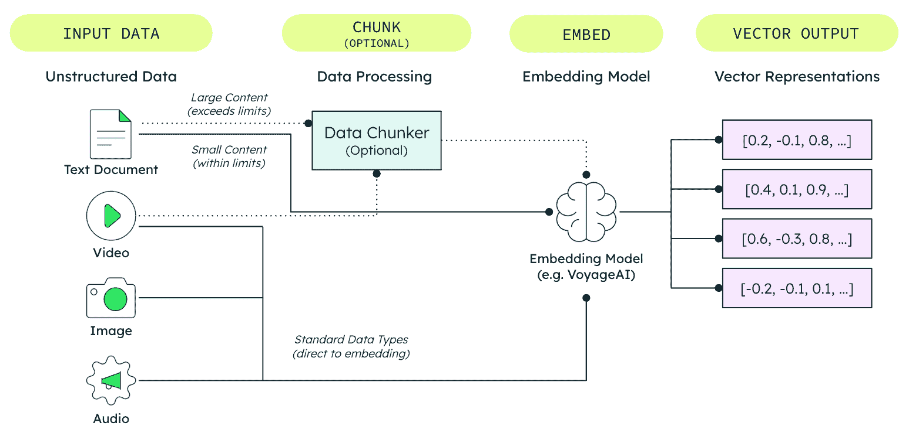

图 2.3：嵌入模型如何将不同的非结构化数据类型转换为向量表示

*图 2.3* 展示了如何将嵌入模型，例如 Voyage AI，将非结构化数据转换为向量表示以供 AI 处理。可视化显示了通过几个关键阶段的转换过程：

1.  **输入数据**：各种非结构化数据类型（文本文档、图像、音频和视频）是嵌入过程的起点。

1.  **可选数据处理**：根据输入数据的大小和复杂性，某些内容可能需要预处理以确保它符合嵌入模型的能力限制。这个可选步骤，称为**分块**，最常见于超过模型限制的大型文本文档，尽管它也可以应用于其他数据类型。我们将在本章后面详细探讨分块策略和最佳实践。

1.  **嵌入转换**：嵌入模型（如 Voyage AI）将所有数据，无论是经过处理的还是直接的数据，都转换为数值向量表示，这些表示捕捉了原始内容中的语义意义和关系。

1.  **向量输出**：结果是数值向量的集合，使 AI 系统能够从数学上理解和比较不同内容片段的意义。

图表说明，虽然一些数据直接流向嵌入模型，但其他内容可能需要根据大小或复杂性约束进行中间处理。所有路径最终都导向同一个结果：向量表示，它能够实现跨不同数据类型的有效搜索、检索和 AI 推理。

在此处了解更多关于 Voyage AI 嵌入模型的信息：[`www.voyageai.com`](https://www.voyageai.com)

## 向量数据库及其重要性

一旦嵌入模型将您的数据转换为向量，您需要一个系统来存储、管理和高效地搜索这些向量表示，无论是通过专门的向量数据库还是具有内置向量搜索功能的数据库。内置方法的优势在于将原始数据和其向量表示保存在一个地方，从而消除了在多个数据库之间进行复杂连接的需求。

向量的存储本身可以通过简单的 JSON 格式实现，与实际的数据源保持一致。这种方法具有显著的优势：可以在数据旁边存储多个向量，并且数据集可以根据不同的目的附加不同的向量，例如客户情绪、购买行为或最佳推荐，涵盖了典型的零售用例。

工作的第二部分涉及快速搜索能力。一旦存储了数百万个向量，当你运行查询时，你需要一种快速找到最相似向量的方法。这种搜索功能实际上是向量数据库提供的核心。这里就变得有趣了：传统数据库存储和检索精确数据（如客户名称或订单金额）。但向量数据库主要是关于相似性搜索，找到与你的查询向量*接近*的向量（如前所述）。从这个意义上说，它们更像高级搜索引擎而不是传统数据库。当然，*纯向量数据库*的供应商可能会激烈地不同意这种观点，所以我们在这个上下文中保留向量数据库作为行业标准术语。

向量数据库存储组织信息，AI 系统可以查询并用作额外的上下文。你可以存储的数据越多，你能够越精确地表示它，你的信息空间就越广泛，从而解决特定的商业问题。重要的是要认识到，模型和向量可能需要根据新的研究、不断变化的需求或简单地发现所选嵌入模型对于任务不是最优的进行频繁更新。

这些专用系统是现代 AI 应用中的关键组件，有以下几个关键原因：

+   **高效的相似性搜索**：在核心上，向量数据库擅长执行快速相似性搜索，通常使用**近似最近邻**（**ANN**）算法，有时辅以 K-means 聚类等技术，从数十亿条记录中找到最相似的向量。这种能力对于语义搜索、推荐引擎和异常检测等应用是基本的。

+   **可扩展性**：它们被构建来处理当今 AI 所需的庞大数据集，提供管理和查询数十亿向量的基础设施，而不会影响性能。

+   **多模态支持**：这些数据库可以存储各种数据类型的向量表示，包括文本、图像、音频和时间序列数据，在一个统一的系统中。

+   **集成能力**：向量数据库旨在无缝连接到各种 AI 框架和工具，促进它们集成到更广泛的 AI 和 MLOps 工作流程中。

为了实现这些功能，向量数据库采用了多种先进技术。其中一项关键创新是使用高级索引算法来加速相似度搜索。最突出且被广泛采用的实现之一是**分层可导航小世界**（**HNSW**）算法[5]。HNSW 构建了一个分层图结构，允许高效地遍历和搜索，与暴力方法相比，显著加快了查询时间。该算法不仅性能卓越，而且具有适应性，使其成为 MongoDB 和 Pinecone 等数据库的流行选择。

在领先的向量数据库中，另一个相对较新的功能是向量量化。量化是将全保真向量压缩成更少位的过程。通过索引减少表示的向量来减少存储向量搜索索引中每个向量所需的主内存量。这允许存储更多的向量或更高维度的向量。因此，量化减少了资源消耗并提高了速度。

对于企业部署，需要考虑的额外因素变得至关重要。在受监管的行业中，嵌入模型及其生成的向量可能需要保存很长时间。组织通常需要为同一文档创建多个向量嵌入来表示不同的方面或模式。例如，一个野生动物数据库可能存储`description_embedding`（文本描述的向量表示）和`image_embedding`（动物照片的向量表示），或者使用针对各种搜索任务优化的不同嵌入模型。此外，实施**生存时间**（**TTL**）索引技术，充当过期计时器并存档历史数据，对于在管理存储成本的同时保持合规性变得至关重要。TTL 功能允许组织在所需监管期间（例如，金融记录的 7 年）保留向量嵌入和相关文档，同时自动清除过时数据，以防止存储成本无限增长。

具有集成向量搜索功能的文档型数据库，如 MongoDB，提供了额外的优势。通过在单个文档中存储原始数据及其向量表示，它们通常可以完全消除在不同数据库之间进行复杂连接的需求（例如，一个用于元数据的数据库和一个专门的向量存储）。这种统一的方法简化了整体架构，减少了数据冗余，并可能导致人工智能应用的性能显著提升。

这些技术能力结合在一起，使向量数据库成为现代人工智能应用的关键基础设施。然而，在我们能够有效地利用这些系统之前，我们需要了解如何通过战略分块方法来优化我们的数据准备。

## 人工智能应用的分块策略

之前，我们将分块介绍为超出嵌入模型容量限制的数据的可选预处理步骤。现在，既然你已经了解了向量的工作原理以及它们存储的位置，让我们探讨如何战略性地实施分块，以最大限度地提高你人工智能应用的有效性。

分块不仅仅是将大文档拆分成更小的部分；它还关乎在保持上下文和遵守技术限制之间找到最佳平衡。不良的分块可能会破坏逻辑联系，导致无关的搜索结果和降低人工智能性能。然而，有效的分块确保每个部分都包含有意义、自包含的信息，人工智能系统可以准确地进行推理。

每种分块策略都涉及三个关键决策：

+   **分割技术**：基于段落分隔、句子边界、语义内容或特定编程语言的分隔符来放置分块边界

+   **分块大小**每个分块允许的最大字符数或标记数，通常受嵌入模型限制

+   **分块重叠**在相邻分块之间重叠内容以保持边界处的上下文，通常指定为分块大小的百分比

让我们探讨如何战略性地使用分块来增强你的人工智能应用：

+   **固定大小分块**将文档拆分成具有预定标记数的分块。虽然这种方法易于实现，但可能会在句子或概念中途断裂，可能丢失重要的上下文。

+   **固定大小带重叠**在分块之间添加重叠内容以保持上下文连续性。例如，如果有 20%的重叠，每个分块都会与其邻居共享一些内容，有助于保持叙事流畅并减少边界处的信息损失。

+   **递归分块**试图在自然边界处分割文本，如段落、句子，然后是单词，尽可能地将相关内容保持在一起，同时尊重大小限制。

+   **语义分块**根据意义而不是大小对内容进行分组，使用嵌入相似性来识别主题变化的位置，并在这些语义边界周围创建分块。

最佳分块策略取决于你的内容类型和用例，并且在实施过程中可能会发生变化。具有清晰层次结构的技术文档受益于尊重标题和部分的递归分块。对话内容或叙事通常更适合使用保留概念流的语义分块。就像选择嵌入模型一样，我们建议在代表你数据样本的不同分块策略上测试，并评估它们对检索质量的影响。

在设计你的分块方法时，请记住影响性能、成本和准确性的关键实际因素。从你的嵌入模型的 token 限制作为一个硬约束开始，大多数模型通常在 8,000 个 token 左右。Token 是 AI 模型用于处理文本的基本单位；把它们想象成模型读取和理解的单独的词或词的一部分。由于 AI 服务通常根据 token 使用量收费，token 实际上成为了 AI 操作中的货币，类似于许多在线游戏中的硬币，你为每个想要使用的行为或功能付费。考虑你的典型查询模式：如果用户提出广泛的概念性问题，更大的、包含更多上下文的块可能表现更好。对于具体的实际查询，较小的、专注的块通常提供更精确的结果。

记住，分块决策会通过整个 AI 管道累积。良好的分块数据可以提高语义搜索的准确性，增强 RAG 响应质量，并使代理推理更加有效，所有这些内容我们将在接下来的章节中探讨。

现代文档数据库，如 MongoDB，使得实验不同的分块策略变得简单，允许你测试多种方法，并针对特定的用例进行优化，而无需复杂的架构更改。

在[`www.mongodb.com/resources/basics/chunking-explained`](https://www.mongodb.com/resources/basics/chunking-explained)了解更多关于分块的信息。

## 语义搜索：利用向量

在确立了如何有效地分块数据以实现最大 AI 性能的方法后，我们准备通过语义搜索功能来利用这些优化的向量。为了有效地利用这些向量，我们实现了向量搜索索引，它能够实现查询与存储信息之间的语义对齐。这个过程是将查询向量与我们的向量空间中最接近的邻居匹配的过程，称为**语义搜索**。

当你执行向量搜索时，系统会自动返回多个结果，并按相似度分数进行排序。这些分数表明每个结果在多维向量空间中与你的原始查询有多接近，最相似的结果（最高分数）会根据向量之间的数学距离计算首先出现。这些初始的相似度排名可以通过后续的重新排序技术进一步优化，我们将在后面探讨这些技术，以提高检索结果的关联性和质量。

为了说明这个概念，`Lemon`（柠檬）和`Banana`（香蕉）在向量空间中会靠得很近，因为它们具有诸如黄色和水果等属性，但与`Cat`（猫）和`Dog`（狗）则相距甚远，因为它们由于共享哺乳动物和宠物特征而聚集在一起。`Monkey`（猴子）可能位于这些群体之间，共享哺乳动物特征，同时也与水果消费有关联。

语义搜索代表了从传统信息检索方法到基本转变，并为人工智能应用开辟了强大的新可能性。让我们探讨这项技术在实践中的工作方式，并检查其在不同类型数据上的扩展能力。

## 超越关键词匹配

语义搜索本身就是一个强大的工具，它允许使用向量化和嵌入模型，而无需联系大型语言模型（LLM）。与传统基于关键词的搜索不同，语义搜索理解查询的意义和上下文，根据相关性而不是精确匹配返回结果。

这是因为（就像前面的哺乳动物和水果示例一样）嵌入模型在多维向量空间中将语义相关的概念紧密地放在一起。例如，`wind turbines`、`solar panels` 和 `hydroelectric power` 都聚集在 `renewable energy` 附近，因为它们共享概念关系和相似的语义意义。

对于可再生能源解决方案的语义搜索可能会返回有关太阳能板、风力涡轮机和水电能的结果，即使查询中没有使用这些精确术语。这种能力对于理解意图和上下文至关重要的应用尤其有价值。

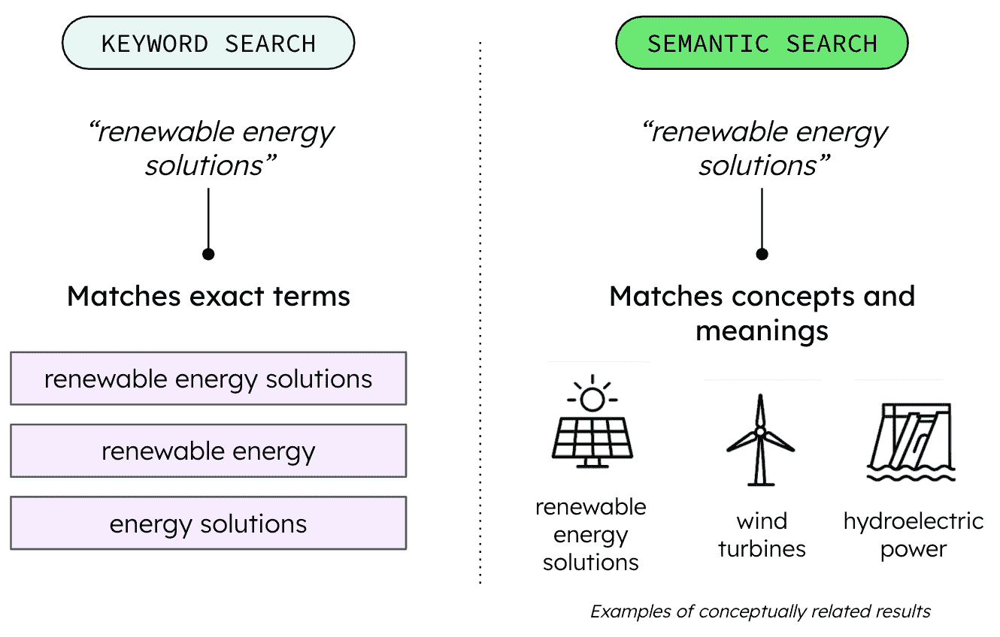

图 2.4：关键词搜索与语义搜索比较

*图 2.4* 展示了传统关键词搜索和语义搜索方法之间的基本区别。在左侧，对 `renewal energy solutions` 的关键词搜索执行精确术语匹配，返回包含搜索短语全部或部分内容的内容，例如 `renewable energy solutions`、`renewable energy` 和 `energy solutions`。在右侧，语义搜索理解查询的潜在意义和上下文，检索**概念相关**的结果，包括 `renewable energy solutions`、`wind turbines` 和 `hydroelectric power`，即使这些精确术语没有出现在文本中。

在此处了解更多关于 Atlas Vector Search 的信息：[`www.mongodb.com/products/platform/atlas-vector-search`](https://www.mongodb.com/products/platform/atlas-vector-search)

## 语义搜索的多模态应用

语义搜索可以应用于各种数据类型，而不仅仅是文本。例如，它可以用于搜索相似图像、音频模式或视频内容。一个强大的多模态语义搜索示例是一个动作系统，它可以基于单个查询在不同的媒体类型中找到相关内容。

考虑一个零售应用程序，其中客户上传他们喜欢的产品图片。系统使用 LLM 来确定照片中的产品是什么，然后执行语义搜索以在整个目录中找到类似的产品，匹配视觉特征、风格和特性，无论产品描述是否使用相似的术语。这种能力使得搜索体验更加直观和用户友好，反映了人类对相似性的自然思考方式。

带有内置向量搜索功能的现代数据平台使实现这些高级搜索功能变得简单。通过将向量嵌入与原始数据一起存储，它们使在大数据集中进行高效的语义搜索成为可能，而不会增加技术蔓延或需要专业知识。

理解语义搜索是实现现代 AI 应用潜力的基础。通过将数据转换为向量并启用基于相似性的检索，语义搜索弥合了人类语言与机器理解之间的差距。这种能力构成了更复杂 AI 模式（如 RAG）的基础，其中语义搜索的质量直接影响 AI 生成响应的准确性和相关性。正如我们将在下一节中看到的，将语义搜索与 LLM 结合使用，可以释放出创建智能、上下文感知应用的更大潜力。

# RAG：通过上下文数据增强 LLM

虽然语义搜索提供了强大的检索能力，但将其与 LLM 结合使用可以释放出更大的潜力。RAG 代表了综合，这是一种模式，其中向量搜索结果增强用户对 LLM 的查询，提供特定上下文，从而产生更准确、更接地气的响应，幻觉更少或没有。

RAG 架构使组织能够构建应用程序，将 AI 安全地建立在受信任的公司数据上，从而降低与幻觉相关的风险，确保事实准确性，并实现特定领域的解决方案。为了有效地使用 RAG，组织必须优先考虑数据策略，允许专有、最新的信息可检索。在架构上，RAG 实施的规划影响着 LLM 如何与现有数据存储集成以及强大向量数据库能力的必要性。

RAG 使用公司的专有企业、特定领域数据为提示添加上下文，例如提供客户历史记录或产品描述，从而将问题缩小到 LLM，并交付更精确、幻觉更少的答案。通过 RAG 实施提供超个性化能力代表了一个重要的竞争优势，可以为客户互动真正增加价值，并将日常在线任务提升为愉快、协作的体验。

虽然这个概念听起来很复杂，但其实现实际上非常简单，如下面的图所示。

## RAG 的工作原理

*图 2.5*展示了全面的 RAG 实现，展示了组织如何利用其专有数据来增强 LLM 的响应。

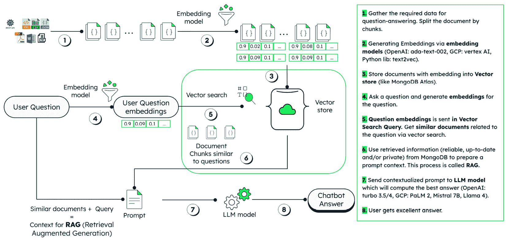

图 2.5：基本 RAG 流程

虽然 RAG 架构的复杂性可能有所不同，从基本的三个步骤工作流程（检索、增强、生成）到更复杂的多步骤实现，此图显示了详细的八个步骤过程，提供了对 RAG 工作流程的完整可见性：

1.  **文档准备**：系统收集问答所需的数据，并将大文档分割成可管理的块，以确保它们符合嵌入模型约束。

1.  **向量生成**：嵌入模型如 Voyage AI 将每个文档块转换为数值向量表示，这些表示捕获语义意义。

1.  **向量存储**：这些文档嵌入，即向量，存储在 MongoDB 等数据库中，然后在上面创建向量数据库搜索索引。它创建了一个可搜索的组织信息知识库。

1.  **查询处理**：当用户或应用程序提出问题时，系统使用相同的嵌入模型为该查询生成嵌入，以确保兼容性。

1.  **向量搜索**：使用问题嵌入在向量搜索查询中查找具有相似语义意义的文档块，从知识库中检索最相关的信息。

1.  **上下文增强**：检索到的信息，无论是可靠的、最新的还是私有组织数据，都用于准备增强的提示上下文。这种上下文增强是 RAG 的核心。

1.  **增强生成**：上下文化的提示被发送到一个 LLM（如 OpenAI 的 GPT-4、GCP 的 PaLM 2、Mistral 7B 或 Llama 4），它根据其预训练的知识和检索到的上下文生成响应。

1.  **优化输出**：用户收到准确、上下文相关的答案，这些答案基于组织特定的数据和知识。

这种方法解决了独立 LLM 的几个局限性：

+   **减少幻觉**：通过将响应建立在检索到的事实上

+   **提供最新信息**：通过检索在模型训练期间不可用的当前数据

+   **实现领域专业化**：通过结合特定领域的知识

+   **提高透明度**：通过引用信息来源

一个典型的用例是一个聊天机器人，它通过添加额外的信息来增强正在讨论的案件信息，例如机票、实际位置和航班状态，这样 LLM 的答案对个人来说是上下文相关的，并将实际需求放在中心。

各行各业的组织正在实施 RAG 来增强它们的 AI 应用：

+   **客户支持**：通过产品文档和支持历史记录来增强响应。

+   **医疗保健**：为医疗专业人员提供相关研究和患者病史。

+   **金融服务**：将监管信息和市场数据纳入咨询服务。

+   **制造业**：将设备手册和维护记录集成到操作指南中。产品和工程文档可以变得可访问。

+   **保险**：评估保险索赔文件。

+   **公共部门**：提供关于公共工程项目的信息。

现代文档数据库在支持 RAG 实现方面表现出色，因为它们可以在统一模型中存储原始数据和其向量表示。这种方法简化了架构并提高了性能，因为它消除了在多个系统之间连接数据的需求。

## 超越 RAG：混合搜索方法

通过利用常规文本搜索作为向量搜索的信息逐字回忆，可以进一步增强 RAG。文本和向量搜索的结合称为**混合搜索**，仍然是 RAG 的一种风味。尽管如此，它非常强大，并允许通过添加额外的数据点来扩展对 LLM 输入的细化。

传统文本搜索和向量搜索具有互补的优势：

+   **文本搜索**：擅长找到精确匹配和特定关键词

+   **向量搜索**：更擅长理解意义和找到语义相似的内容

混合搜索结合这些方法以提供全面和相关的结果。例如，一个混合搜索系统可能会使用向量搜索来理解查询的语义意图，同时使用文本搜索来确保结果中存在特定术语。

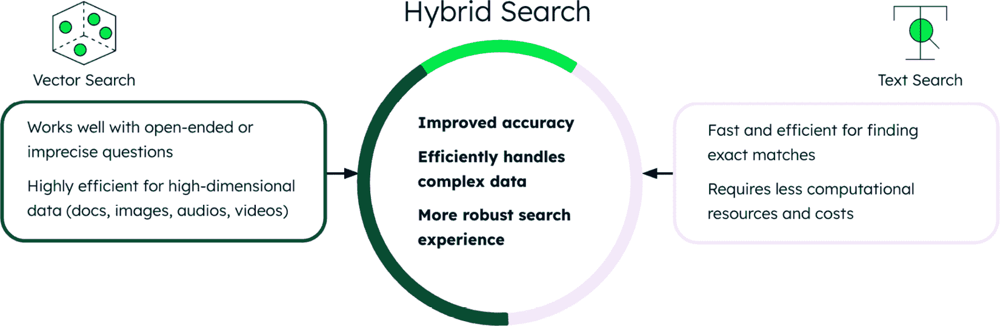

图 2.6：结合文本和向量搜索的混合搜索架构

*图 2.6*展示了混合搜索如何通过结合文本搜索和向量搜索功能来增强 RAG。系统通过两条并行路径处理查询：向量搜索（左侧）处理语义理解并找到概念上相似的内容，而文本搜索（右侧）执行精确关键词匹配和精确术语识别。两种方法的结果通过融合算法合并，该算法通过利用语义理解和特定术语匹配的互补优势来提高准确性，在增强 LLM 提示之前。

## 重新排序：细化搜索结果

检索管道中的最终增强是重新排序，这是一个在将检索到的上下文提供给 LLM 之前改进检索上下文的过程。正如其名所示，重新排序根据对原始查询相关性的更深入理解重新排序搜索结果。这通常涉及四个步骤：

1.  **初始检索**：收集一组可能相关的文档

1.  **上下文评估**：评估每份文档与特定查询上下文的相关性

1.  **优先级**：根据这种更深入的评估重新排序结果

1.  **选择**：选择最相关的文档包含在 LLM 提示中

此过程显著提高了提供给 LLM 的信息质量，从而实现了更准确和有帮助的响应。具有集成搜索功能的现代数据平台使实现这些复杂的检索模式变得简单，允许开发者专注于应用程序逻辑而不是基础设施。

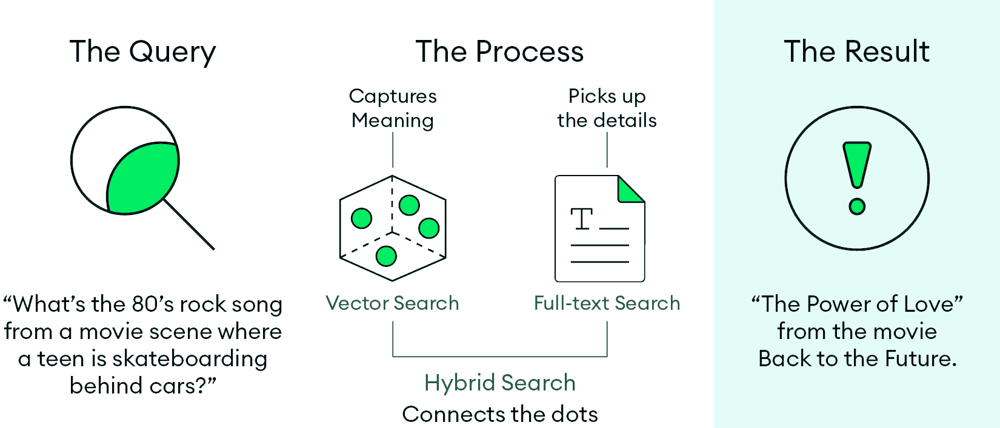

图 2.7：混合搜索过程

*图 2.7* 展示了混合搜索在实际操作中的实用示例，展示了系统如何处理复杂自然语言查询："What's the 80s rock song from a movie scene where a teen is skateboarding behind cars?" 过程展示了向量搜索捕捉查询的语义意义，而全文搜索识别了特定的关键词，例如 `movie`、`skateboarding` 和 `cars`。混合方法将这些互补的搜索方法连接起来，成功识别了 `"The Power of Love"` 从电影《回到未来》，展示了将语义理解与精确的关键词匹配相结合如何提供准确的结果，这是任何一种方法单独都无法实现的。

如图中所示，混合搜索在处理复杂、自然语言查询方面表现出色。以下步骤在此示例中发生：

1.  向量搜索捕捉了关于 80 年代摇滚歌曲在滑板场景中的查询的语义意义。

1.  全文搜索可以识别特定的关键词，例如 `movie`、`skateboarding` 和 `cars`。

1.  混合搜索结合了这些方法来连接概念点。

1.  系统成功地将 `"The Power of Love"` 从电影《回到未来》中识别为答案。

此示例演示了混合搜索如何理解上下文（一个难忘的电影场景）和具体细节（汽车后面的滑板），以提供精确的结果，这是单独采用任何一种方法都无法实现的。

# 代理人工智能：自动化决策和推理

虽然 RAG 和混合搜索通过外部知识增强了 LLM，但它们仍然需要人类的启动和监督。下一个进化步骤消除了这一限制，创建了可以在其指定领域内自主追求目标和做出决策的系统。这就是代理人工智能的领域。

从人工引导到自主人工智能系统的转变，不仅仅代表技术进步；它还代表着我们在业务运营中如何概念化人工智能角色的根本性转变。RAG 系统在提供对特定查询的增强响应方面表现出色，而代理人工智能系统可以独立识别问题、制定策略并在扩展的工作流程中执行解决方案。协作的代理人工智能实例扩展了更广泛的功能范围，代表了数字专家的概念，就像组织内的领域专家一样运作。

## 代理人工智能基础

代理人工智能包含一个编排层，用于管理工作流程中的任务执行。人工智能代理可以以完全自主或半自主的方式运行，具有**人机交互**（**HITL**）。人工智能代理配备了先进工具、模型、记忆和数据存储。记忆利用长期和短期上下文数据，以进行信息化的决策和保持交互的连续性。工具和模型使人工智能代理能够将任务分解成步骤并协同执行。数据存储和检索对于人工智能代理的有效性至关重要，可以通过嵌入和向量搜索能力来提升。

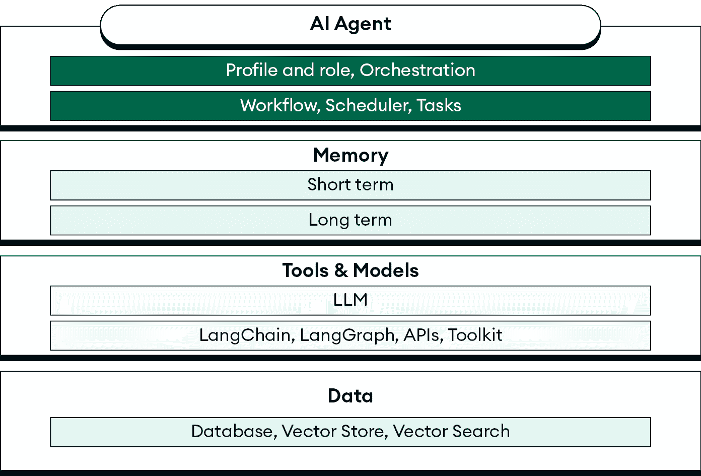

图 2.8：代理人工智能基础

*图 2.8*展示了代理人工智能系统的基本层，展示了协调器如何管理任务执行工作流程。可视化描绘了人工智能代理、他们的工具、模型和记忆系统之间的关系，这些关系使得具有 HITL（人机交互）能力的自主或半自主操作成为可能。

这里是人工智能代理的一些关键特征：

+   **自主性**：根据动态情况做出决策的能力，以及以最小的人为干预执行任务的能力。

+   **思维链**：进行逐步推理的能力，将复杂问题分解成逻辑上更小的步骤，以进行更好的判断和决策。

+   **上下文感知**：人工智能代理会根据环境的变化和条件不断调整其行为。

+   **学习**：人工智能代理通过适应和增强其性能来提高其性能。

代理人工智能代表了向自动化复杂工作流程和决策迈出的重大飞跃，标志着我们人工智能旅程中的下一个进化步骤。组织可能开始战略规划，考虑这些自主系统如何集成到企业架构中，包括数据访问、安全协议和治理框架。人工智能代理和数字专家的开发和部署将需要新的技能集，可能在 IT 和业务运营中需要新的角色，因此对于具有前瞻性的领导者来说，现在开始评估这些需求是至关重要的。

建立在检索和生成能力之上的，是在一个封闭环境中自动化流程和推理的概念，从而产生了代理人工智能（Agentic AI）的概念。虽然基于规则引擎的决策代理已经存在很长时间，但代理人工智能的概念要精细得多。这些复杂的系统高度依赖于稳健、可访问和结构良好的数据，以及先进的编排能力。这强化了现代、灵活的数据平台的重要性，它可以作为这些代理的“记忆”和“工具访问层”。

## 什么是代理？

人工智能代理是一个能够感知其环境、做出决策并采取行动以实现特定目标的自主系统。与执行特定任务且独立运作的简单 AI 系统不同，代理具有一定的自主性，可以根据反馈和变化条件调整其行为。

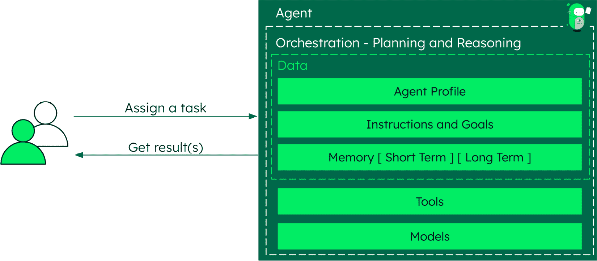

图 2.9：人工智能代理架构和核心组件

*图 2.9* 展示了人工智能代理系统的基本结构，展示了用户如何通过代理的核心组件分配任务并接收结果。该架构展示了这些组件如何协同工作以实现自主决策和任务执行，代理能够感知其环境，处理信息，并根据反馈和变化条件采取行动以实现特定目标。

人工智能代理的核心组件包括以下内容：

+   **指令和目标**：引导所有决策过程的智能体的目的和目标

+   **记忆**：短期（针对当前任务上下文）和长期（针对持久知识），这使交互之间能够保持连续性

+   **编排**：确定行动和在不同组件之间协调的计划和推理能力

+   **工具**：智能体可以用来与其环境交互并执行任务的特定能力

+   **模型**：为智能体能力提供动力的底层 AI 模型，从语言理解到决策

+   **数据**：智能体可以访问和使用的信息，存储在各种格式中，并动态更新

代理式 AI 正在应用于各个领域以自动化复杂的决策过程：金融服务部署投资组合管理代理，分析市场趋势，评估风险，并推荐投资策略。医疗保健组织使用诊断代理，回顾患者病史、症状和医学文献，以提出可能的诊断和治疗建议。制造和物流公司实施代理，根据实时条件优化路线、库存和调度。具有文档模型和向量搜索能力的现代数据平台是支持这些应用的理想选择。它们提供了灵活、可扩展的基础设施，适用于代理记忆（短期和长期）以及多样化的数据存储，同时实现了快速、上下文感知的检索，这对于有效的决策至关重要。

## 数字专家或多智能体系统：协作问题解决

多智能体系统代表了更高级的复杂性，其中多个 AI 代理协作解决复杂任务。每个代理在特定能力上具有专长，通过协作实现更复杂的解决问题。

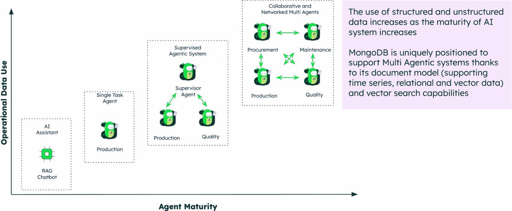

图 2.10：从 RAG 到多智能体系统的演变

*图 2.10*展示了从简单的 RAG 聊天机器人到复杂的智能体系统的演变。随着智能体成熟度的提高（*x*轴），组织复杂性（*y*轴）也随之增加，从单个 AI 助手发展到在不同领域（如生产和质量管理）工作的专业协作智能体。

在多智能体系统中，不同的智能体可以执行以下操作：

1.  **专注于不同领域**：有些人可能在数据分析方面表现出色，其他人可能在自然语言理解方面，还有人在规划方面。

1.  **协作完成复杂任务**：将问题分解为可管理的组件

1.  **沟通和共享信息**：在智能体之间传递相关数据和见解

1.  **提供制衡**：验证彼此的工作并捕捉错误

随着人工智能系统的成熟，它们对结构化和非结构化数据的利用呈指数增长。支持灵活数据模型（适应时间序列、关系和向量数据）并具备集成向量搜索能力的系统对于有效的多智能体部署变得至关重要。

## 智能体 AI 是如何工作的

从技术角度来看，用户与智能体系统的交互遵循熟悉的 API 模式，但下面有复杂的处理。智能体进行多阶段规划，以准确解释用户意图并使查询具体化。

这种方法与遵循预定路径的确定性软件根本不同。智能体根据上下文和目标动态确定其方法，这标志着生成式 AI 方法真正价值的出现。

智能体利用各种工具，包括向量搜索、文本搜索和数据增强，来创建一个全面的上下文。这可以包括长期信息，如历史趋势、交易数据和统计分析。通过综合这一广泛的信息范围并访问其自身的数据库和向量化，智能体可以为 LLM 提供丰富的上下文，以便进行推理和检索。在重新排序响应后，它为请求的客户构建正式的答案。

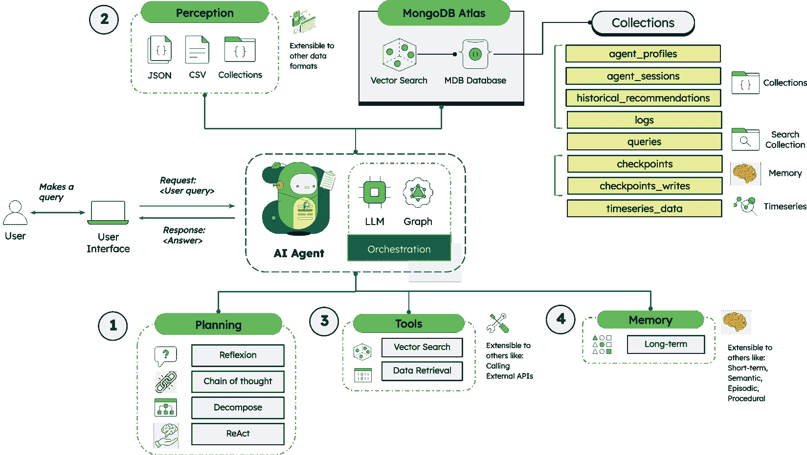

图 2.11：智能体 AI 系统的工作流程和架构

*图 2.11*展示了智能体 AI 系统的完整工作流程，展示了用户查询是如何通过四个主要阶段处理的：**规划**、**感知**、**工具**和**记忆**。

系统通过这四个相互关联的阶段处理每个用户查询，以提供智能、上下文相关的响应：

1.  **规划**，智能体通过反思来分析用户提出的问题，采用思维链将推理分解为逻辑步骤，使用分解将复杂任务分解为更小的部分，并迭代地应用 ReAct 来规划推理和行动步骤，同时确定对查询的总体响应策略。

1.  **感知**，它涉及从各种来源收集数据，包括 JSON、CSV 和集合，而数据库系统如 MongoDB Atlas 作为中央数据枢纽。对于非结构化数据，这一阶段将利用向量搜索处理数据以进行语义理解，从多个数据库和格式中收集信息，并将与用户特定查询相关的数据进行上下文化。

1.  **工具**，其中向量搜索工具找到语义相似的信息，数据检索工具从数据库中访问特定信息，专业的处理工具操纵和分析收集到的数据，外部集成根据需要提供额外的功能，而系统执行回答查询所需的特定功能。

1.  **记忆**，它维护长期记忆以存储持久知识和过往经验，短期记忆以维持当前对话上下文，学习整合以更新代理的知识库，上下文保留以处理后续问题，以及在数据库集合中存储历史数据以供未来参考。

在整个过程中，中央人工智能代理协调所有四个阶段以提供上下文化的、智能的响应，并且系统根据上下文和目标动态地调整其方法，而不是遵循预定的路径。

这个提出的框架代表了从基本的 RAG 系统到自主代理的 AI 演变的实际实现。通过构建在现有的数据基础设施和搜索能力之上，组织可以快速部署提供即时商业价值的代理，同时为更高级的多代理系统奠定基础。

关键的洞见是，成功的代理部署不是关于取代现有系统；它是关于智能地编排它们，以创建自主的、以目标为导向的能力，这些能力可以随着组织需求的变化而扩展。

# 摘要

本章追溯了人工智能从 20 世纪 50 年代的起源到今天复杂的通用人工智能（GenAI）系统的演变。我们探讨了推动现代人工智能应用的基本组件，包括大型语言模型（LLMs）、将数据转换为向量的嵌入模型，以及使人工智能推理成为可能的语义搜索能力。

我们明确了语义搜索（理解查询中的含义）、RAG（通过外部上下文增强 LLMs）、混合搜索方法（结合语义和关键词匹配）以及代理人工智能系统（自主决策）之间的区别。更重要的是，我们研究了这些组件如何相互构建，以创建越来越复杂的性能。

在这些进步中，现代数据平台在使人工智能创新成为可能方面发挥了关键作用。选择合适的数据平台，一个灵活、可扩展且原生支持这些多样化的 AI 工作负载（从向量搜索到用于代理记忆的复杂数据模型）的平台，成为在通用人工智能时代实现创新和竞争优势的关键推动力。通过理解这些概念及其关系，组织可以做出更明智的决定，关于如何利用人工智能来驱动业务价值。

下一章将探讨为什么数据是投资创新的公司的关键差异化因素。它将讨论为什么将运营数据整合到单一层对于推进人工智能项目至关重要，包括实时数据需求、良好结构化数据的重要性、数据流和集成方法。

# 参考文献

1.  人工智能的极简历史：[`www.forbes.com/sites/gilpress/2016/12/30/a-very-short-history-of-artificial-intelligence-ai/`](https://www.forbes.com/sites/gilpress/2016/12/30/a-very-short-history-of-artificial-intelligence-ai/)

1.  牛津参考：[`www.oxfordreference.com/display/10.1093/acref/9780198609810.001.0001/acref-9780198609810-e-423`](https://www.oxfordreference.com/display/10.1093/acref/9780198609810.001.0001/acref-9780198609810-e-423)

1.  究竟 IBM 的沃森发生了什么？：[`www.nytimes.com/2021/07/16/technology/what-happened-ibm-watson.html`](https://www.nytimes.com/2021/07/16/technology/what-happened-ibm-watson.html)

1.  注意力即一切：[`arxiv.org/abs/1706.03762`](https://arxiv.org/abs/1706.03762)

1.  什么是分层可导航的小世界？：[`www.mongodb.com/resources/basics/hierarchical-navigable-small-world`](https://www.mongodb.com/resources/basics/hierarchical-navigable-small-world)
