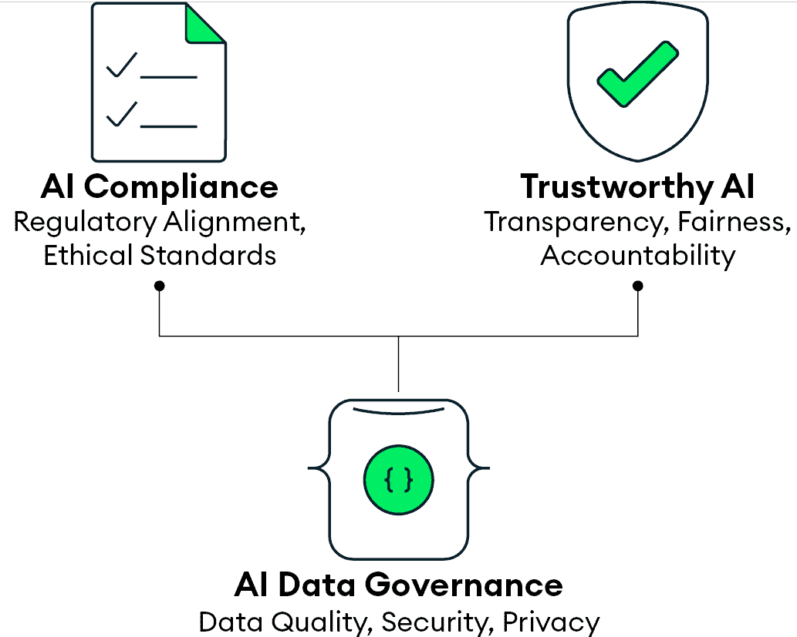
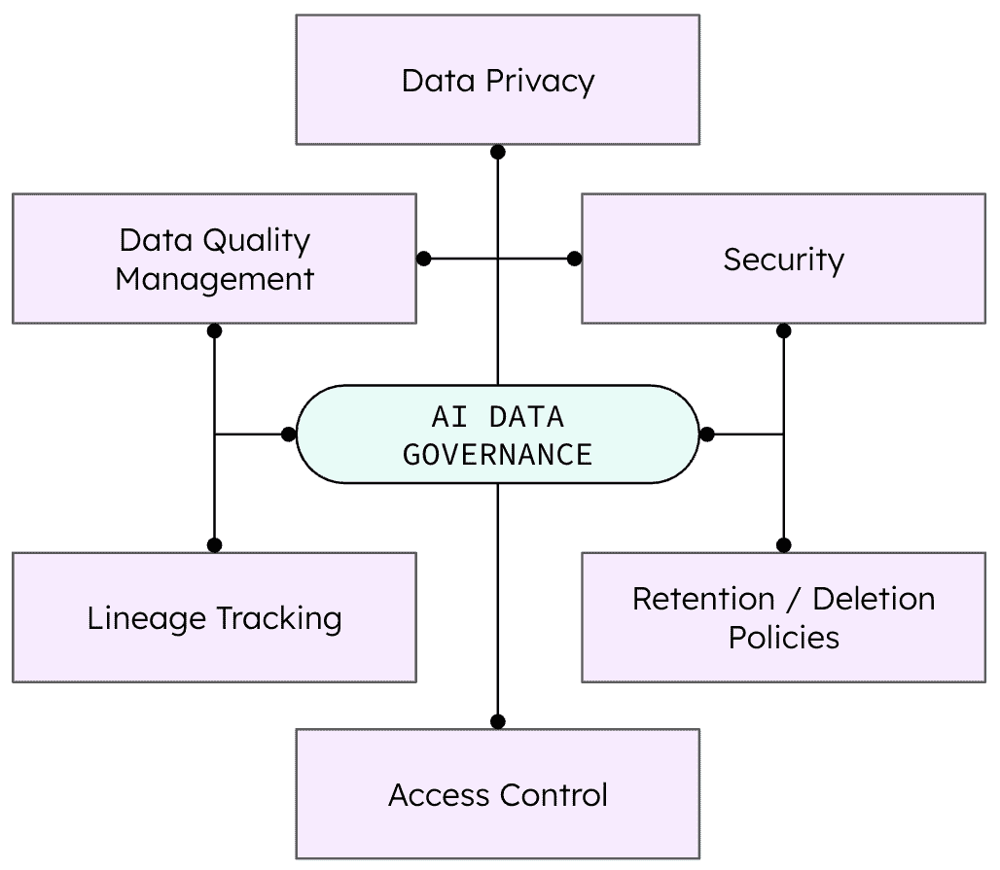
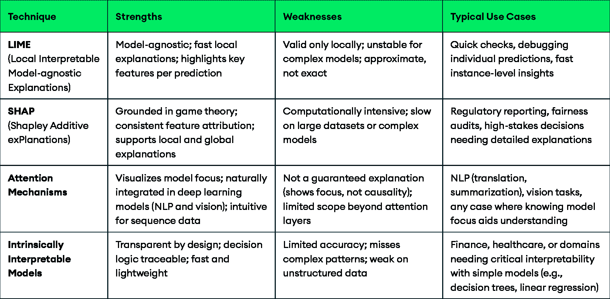

# 4

# 可信赖人工智能、合规性和数据治理

随着人工智能改变行业，组织必须平衡其力量与道德、法律和社会责任。

本章探讨了可信赖人工智能、合规框架和数据治理如何作为负责任人工智能的基础协同工作。您将学习如何在构建通过透明度、公平性和问责制赢得（并维持）信任的系统的同时，导航监管复杂性。

到本章结束时，您将理解以下内容：

+   可信赖人工智能的核心原则及其重要性

+   如何将道德框架转化为实际实施策略

+   行业和地区间的关键监管转变

+   人工智能系统所需的基本数据保护和隐私要求

+   风险评估和管理的方法

+   实现人工智能透明度和可解释性的技术

+   在您的组织中实施可信赖人工智能的策略

# 为什么道德人工智能很重要

为了应对人工智能采用的增长挑战并构建能够经得起审查同时提供价值的系统，组织需要清楚地了解在实践中可信赖人工智能的含义。良好的意图是不够的。构建可信赖的人工智能需要明确的原则、深思熟虑的执行和结构化的治理框架。

## 人工智能实施的日益增加的风险

随着人工智能越来越多地嵌入关键系统，如医疗诊断、金融决策和自动驾驶交通，失败后果的严重性日益增加。信任不仅仅是一个哲学问题，它是一个战略上的必要条件。当人工智能系统塑造人们的生活和权利时，它们必须以道德的方式运行。

扩大的威胁领域带来了重大挑战。平均而言，识别一个漏洞需要近 200 天，整个生命周期可能延长到 300 天，这使得组织比他们可能意识到的暴露时间更长 [1]。与此同时，法规正在收紧。例如，美国的**健康保险可携带性和责任法案**（**HIPAA**）和美国**证券交易委员会**（**SEC**）引入的网络安全法规现在对保护敏感数据的安全要求更加严格。确保人工智能系统在考虑到这些风险的情况下构建和管理是至关重要的。

## 定义核心概念

为了打下理解可信赖人工智能的坚实基础，让我们明确三个相互关联的概念：

+   **可信 AI** 指的是设计和运营以具有可解释性、公平性、安全性和安全性的系统。它代表了一个框架，用于降低与 AI 部署相关的各种风险，旨在建立信心并在道德边界内运行。随着组织越来越多地依赖 AI 进行高风险决策，可信 AI 确保与人类价值观和社会期望保持一致。这种一致性对于道德原因和长期业务可持续性至关重要，因为不可信的系统往往面临用户的拒绝、监管审查和法律风险。

+   **AI 合规性** 包括确保 AI 系统按照适用的法律、法规、道德指南、数据隐私要求、安全协议、公平原则和问责机制运行的决策、实践、流程、标准和框架。组织还必须跟上不断变化的法规，并持续调整其 AI 系统，以保持合规性和负责任。

+   **AI 数据治理** 是对 AI 系统中数据收集、管理和使用的结构化监督。它确保数据准确、安全且符合道德标准，同时解决算法透明度、可追溯性和偏差放大等挑战。强有力的治理为 AI 合规性和可信性奠定了基础。没有它，组织可能会损害其 AI 系统的完整性和问责制。

图 4.1：AI 数据治理作为合规性和可信 AI 的基础

*图 4.1* 展示了这三个概念如何形成一个相互关联的框架，以支持负责任的 AI 实施。稳健的 AI 数据治理是可信 AI 和 AI 合规性的基本基础，确保了为 AI 系统提供动力的数据的品质、完整性、安全性和道德处理。理解这些核心概念为应用道德框架奠定了基础，这些框架将原则转化为实施 AI 的可操作指南。

## 道德框架：从原则到实践

道德框架为组织提供指导原则，以帮助他们负责任地开发和部署 AI 系统。最常被引用的是欧盟（**EU**）的 *可信 AI 道德指南*，它概述了七个关键要求，已成为全球基准：

+   **人类代理和监督**：AI 系统应支持人类决策并受监督。在实践中，这意味着为关键决策（如贷款审批或医疗诊断）建立 *人机交互* 流程，其中人类可以审查并按需干预。

+   **技术稳健性和安全性**：AI 必须是安全的、有弹性的和安全的，具有缓解漏洞或对抗性攻击的回退机制。这包括严格的测试协议、安全架构和持续监控，以防止滥用。

+   **隐私和数据治理**：AI 系统必须尊重个人隐私，并在整个生命周期中维护数据质量、完整性和安全性。技术包括数据最小化、匿名化和从收集到删除的安全处理。

+   **透明度**：AI 能力、局限性和决策过程应该是可理解和可追溯的。文档应解释 AI 如何影响结果，并提供决策的易于理解的解释。

+   **多样性、非歧视和公平性**：AI 必须设计和测试以防止不公平的偏见并促进跨人口群体的公平待遇。这包括使用多样化的训练数据，并开展审计以检测和解决招聘、贷款或医疗保健等结果中的歧视性模式。

+   **社会和环境福祉**：AI 应支持社会进步并减少负面环境影响。这包括评估就业替代风险、跟踪环境成本以及使系统与更广泛的可持续目标保持一致。

+   **问责制**：应明确 AI 决策和结果的所有权。组织需要审计机制、缓解协议以及当发生损害时应对的方式。

在这里了解更多关于这些指南的信息：[`digital-strategy.ec.europa.eu/en/library/ethics-guidelines-trustworthy-ai`](https://digital-strategy.ec.europa.eu/en/library/ethics-guidelines-trustworthy-ai)

伦理差距会带来真正的运营和声誉风险。监管处罚正在增加，一旦信任破裂，恢复起来可能很困难。一些主要科技公司已经因为偏见或监管失误而退役了 AI 产品。在一个问责制至关重要的竞争环境中，忽视负责任 AI 实践的组织可能会落后。

**IntellectAI 的 Purple Fabric 和金融领域的可信 AI**

在高风险环境中，IntellectAI 是 AI 解决方案在**银行、金融服务和保险**（**BFSI**）领域的先驱。该公司创建了**Purple Fabric**，这是一个*开放业务影响 AI*平台，旨在帮助企业满足复杂的监管和合规要求。

其中最引人注目的用户之一是一家管理着超过 1000 亿美元资产的主权财富基金。该基金依靠 Purple Fabric 对 AI 代理的编排，由先进的 RAG 技术和 MongoDB Atlas Vector Search 提供动力，从其 9000 家投资组合公司中的数百万非结构化文档中提取关键情报。这使投资组合管理更加差异化，并支持一个超越标准框架的定制可持续性矩阵，加强内部报告和战略举措。

Purple Fabric 通过其**企业知识花园**（**EKG**），由 MongoDB Atlas Vector Search 提供动力，处理非结构化的企业数据，并使用**企业数字专家**（**EDE**），一个多代理系统，在企业的流程中编排人工智能，来激活这种智能。

Purple Fabric 展示了可信赖人工智能的原则在行动中的体现：

+   **隐私和数据治理**：建立在 MongoDB Atlas 之上，该平台安全地管理大规模的非结构化数据，特别是从上述检索用例中描述的使用案例。细粒度的访问控制限制数据和人工智能代理仅对授权用户暴露。平台上的 EKG 处理多样化的内容，同时保持对企业敏感信息的企业级治理。

+   **技术稳健性和安全性**：Purple Fabric 符合行业合规要求，包括 SOC 2、ISO 27001、ISO 27017、ISO 27018 和 AWS 架构审查。其基础设施持续监控代理行为和数据管道，以支持大规模可靠、安全的人工智能部署。

+   **透明度和问责制**：Purple Fabric 的治理套件提供完整的数据源溯源和人工智能输出的可追溯性，确保人工智能代理基于可信的数据源。TRACES 确保多代理操作的可解释性，具有清晰的审计轨迹。"模型优化中心"允许团队在速度、成本和准确性方面对 LLMs 进行基准测试，并支持从多个提供商或自定义模型中选择模型。这使用户能够对大规模的人工智能决策有清晰的可见性和控制权。

通过结合安全的数据基础、强大的监控、可解释性和用户控制，IntellectAI 在 Purple Fabric 中构建了一个强大的 AI 平台，帮助企业负责任地采用人工智能，同时产生真正的商业影响 [2]。

# 将原则与实施相结合

全球各地的组织正在开发将伦理人工智能付诸实践的实际方法。例如，IBM 在其人工智能治理实践中强调同理心和利益相关者的参与，确保与更广泛的社会价值观保持一致 [3]。

在实践中，组织通过以下努力将伦理付诸实践：

+   **偏见审计**：定期测试人工智能系统在不同人口群体中的不公平偏见

+   **伦理审查委员会**：创建多元化的委员会来评估人工智能应用是否符合伦理标准

+   **透明文档**：维护开发决策、数据源和模型限制的清晰记录

+   **利益相关者参与**：在人工智能的设计、部署和治理决策中涉及受影响的社区

这些实践中的每一项都有助于将高级伦理原则转化为可重复的行动，这些行动可以促进信任、降低风险并支持人工智能的长期可持续性。

## 偏见审计

偏见审计系统地评估人工智能系统，特别是 LLM，以识别和减轻偏见行为。这些评估通常测试模型在不同的人口统计属性或敏感环境中的表现。

斯坦福大学领导的一项研究将这种方法应用于招聘中使用的 LLM。研究人员收集了 801 份针对 K-12 教学职位的真实工作申请，然后生成了仅通过种族和性别相关线索（如姓名和代词）不同的合成版本[4]。当提交给八个独立模型时，结果显示评分存在一致差异：女性申请者被评分为中等高于男性申请者，而黑人、西班牙裔和亚洲申请者通常被评分为中等高于他们的白人同行。即使在简历被删除、提示重新措辞或地理背景改变的情况下，这些差距仍然存在。

这个实验突显了一个关键挑战：即使是对齐良好的模型也可能表现出影响现实世界决策的人口统计偏好。因此，在招聘等高风险领域，如招聘，这些偏见审计是必不可少的，在这些领域，公平性、透明度和问责制必须积极验证，而不是假设。

## 伦理审查委员会

伦理审查委员会在人工智能的负责任发展中扮演着至关重要的角色。它们提供结构化的监督，揭示风险，例如偏见或隐私问题，并确保系统与组织价值观和社会期望保持一致。当这些委员会有效整合时，它们帮助团队在早期做出更好的决策，增加透明度，并赢得用户和利益相关者的信任。

IBM 提供了一个领先的例子。其内部人工智能伦理委员会包括来自公司各个部门的多元化领导者，并拥有正式的权力来监督人工智能的发展。委员会审查用例，制定政策，并通过可重复的治理流程对产品团队负责。

IBM 的方法在四个关键领域运作：

+   **以原则为导向**：委员会将 IBM 的人工智能原则转化为具体的要求和检查点。例如，原则“*人工智能增强人类智能*”导致对所有系统，特别是具有现实世界后果的系统，都需要有意义的有人监督的命令。“*数据属于其创作者*”通过严格的治理协议体现出来，这些协议保护客户数据并执行同意。透明度通过要求在整个开发生命周期中遵守可解释性标准和文档来解决。

+   **用例评估**：董事会审查具有高度伦理考虑的人工智能项目。每个项目都通过一个结构化的评估流程，包括风险评估、利益相关者影响分析和合规性检查。根据发现，团队可能会获得批准，被要求做出更改，或者在某些情况下，被要求完全停止工作。例如，影响招聘决策的人工智能应用进行了增强的偏差测试，而医疗保健项目需要额外的隐私保护措施，包括领域验证。

+   **工作流和教育**：董事会支持公司范围内的人工智能伦理教育，包括培训计划和政策指导。这些努力有助于将负责任的设计实践嵌入到工程和产品开发团队中。

+   **问责制**：董事会通过确保伦理审查受到认真对待并融入决策中，帮助维护 IBM 对伦理 AI 的公开承诺。它作为治理功能的同时，也在塑造公司的文化 [5]。

为了有效，伦理审查委员会需要的不仅仅是良好的意图。他们需要多元化的代表、明确的过程，以及影响产品开发和公司规范的能力。没有这个基础，即使是强大的伦理原则在实施过程中也可能会被忽视。

## 透明文档

透明的文档让利益相关者能够清晰地了解人工智能系统的设计、训练和治理方式。这种可见性通过揭示复杂的 AI 模型并使决策和结果可问责，从而促进了信任。通过仔细记录数据来源、模型架构、评估方法和潜在偏差，组织可以识别和减轻风险，支持合规性，并确保负责任的 AI 部署。

尽管透明文档很重要，但它往往被低估。技术团队可能会优先考虑速度而将其置于次要位置，当系统进入生产阶段时，这会在关键信息中造成空白。各部门之间标准的不一致使得难以编制连贯的治理记录。AI 发展的快速步伐可能会超过文档更新，而且对知识产权的担忧有时会限制记录的内容。

成功的组织采取不同的方法。文档从一开始就被纳入到开发工作流程中。自动化工具在开发过程中捕获模型元数据、训练数据和性能指标。模板确保一致性，版本控制保持记录最新，常规审查会标记缺失或过时的信息。跨团队审计在合规风险出现之前关闭循环。

强有力的文档将团队联系起来。当数据来源和模型行为被清晰地记录时，法律部门可以评估风险。当系统限制被记录下来时，业务领导者可以做出明智的决策。当他们对训练数据、评估程序和已知偏差有深入了解时，风险管理者可以迅速采取行动。

当利益相关者有共同的观点时，协作得到改善，AI 系统更有可能满足技术、法律和伦理期望。结果是不仅合规性更好，而且 AI 系统更可靠、更可持续。

## 利益相关者参与

在人工智能治理中让利益相关者参与，确保系统与受其影响的人们的需求、价值观和期望相一致。这包括用户、社区、专家和监管者，他们在部署前帮助识别风险、提供反馈和建立信任。如果做得好，这种协作方法将导致更强大且更广泛支持的 AI 解决方案[6]。

许多组织在有效执行这一任务方面遇到困难。确定正确的利益相关者并不总是直接的，尤其是当 AI 系统有深远影响时。竞争利益需要时间、协调和权衡决策。开发时间表和资源限制可能会限制实际发生的参与程度。即使收集到反馈，团队也可能缺乏将其转化为可操作变化的架构。

利益相关者参与不足的后果越来越明显。例如，微软的 Copilot 工具在早期版本中提出了有偏见或不安全的代码建议时，遭到了批评。专家后来将问题与与受影响的开发者社区缺乏参与联系起来。谷歌的 Gemini 图像生成工具在生成冒犯性和历史不准确的形象后暂停使用，揭示了在培训和评估期间缺乏来自不同观点的输入。

这些案例证明了忽视利益相关者声音的风险。声誉损害、产品暂停和监管审查可能会随之而来，但更重要的是，可能会出现未能服务于它们所构建的人的系统。

成功的组织将参与嵌入到 AI 的生命周期中。咨询小组将**用户**、**领域专家**、**倡导组织**和**受影响的社区**聚集在一起。反馈循环从早期开始，并持续到部署。试点项目和公开咨询在问题成为危机之前就提出。清晰的持续沟通建立信任，并确保对话比营销声明更深入。

关键的是，利益相关者的意见必须影响系统的构建方式，而不仅仅是它们的表现方式。当组织将这种意见整合到设计和开发中时，AI 系统将更有能力满足现实世界的需求。它们更快地赢得信任，表现更有效，并且随着时间的推移，更好地应对监管和社会审查。

# 漫游监管环境

由于风险、成熟度和最终用户影响的不同，人工智能法规在行业和司法管辖区之间有所不同。然而，区域间正在出现一些共同主题。EY 确定了六个全球趋势，这些趋势塑造了人工智能治理的演变格局[7]：

+   **核心原则**：框架通常从普遍承诺开始，如尊重人权、可持续性、透明度和稳健的风险管理。这些原则反映在**经济合作与发展组织**（**OECD**）和 G20 的指南中。

+   **基于风险的方法**：法规越来越关注潜在伤害的严重性。对可能影响公共安全、公民权利或健康结果的高风险用例，适用更严格的要求。

+   **行业无关和行业特定规则**：一些标准适用于各个行业，而其他标准则针对医疗保健和金融等特定行业。

+   **政策一致性**：人工智能法规正在融入更广泛的数字政策领域，包括网络安全、数据隐私和数字权利。

+   **私营部门合作**：监管沙盒、创新中心和公私合作伙伴关系允许在定义的监督下进行安全的实验。

+   **国际合作**：随着人工智能系统跨越国界，监管机构正在就共同标准和执法进行协调，特别是对于前沿模型，它们带来了未知的风险。

虽然这些趋势提供了方向上的清晰，但它们并不能取代本地合规和监管的需求。每个司法管辖区都实施自己的要求、时间表和执法机制。

为了保持敏捷性，组织应采用结合长期监管意识和适应性架构的合规策略。灵活的治理能力使系统能够在不干扰运营的情况下满足不断变化的要求。

在接下来的部分中，我们将探讨两个高度监管的行业：医疗保健和金融服务。我们将研究这些全球趋势如何具体体现为合规挑战。

## 医疗保健

医疗保健人工智能由于对病人安全和隐私的直接影响，受到加强的监管审查。截至本文撰写时，全球监管格局正在迅速演变，但已经出现了一些关键主题，有助于制定合规策略。

**世界卫生组织**（**WHO**）概述了医疗保健中人工智能监管的四个基本考虑因素：

+   **透明度和文档**：保持人工智能开发和生命周期管理的清晰记录，以建立信任并使监管评估成为可能。这包括追踪开发过程，防止偏见和数据操纵。医疗保健提供者必须能够证明人工智能系统是如何开发、验证和部署的，以确保安全和合规。

+   **风险管理**：在整个产品生命周期中解决预期用途、持续学习能力和网络安全风险。*预期用途*指的是预先指定并记录 AI 系统设计的确切医疗目的和临床背景，确保它不会在其验证范围之外被误用。*持续学习*解决 AI 系统可以根据新数据更新其算法的独特挑战，需要持续监控以确保它们不会偏离其原始的安全和有效性标准。这些因素加上网络安全威胁，必须在整个产品生命周期中得到管理。

+   **数据质量**：进行严格的预发布评估，以防止偏差放大并确保人群代表性。不充分的训练数据可能导致系统性错误，特别是对于代表性不足的群体，应通过更全面的培训来减轻。

+   **合作**：与患者、医疗保健专业人员、监管机构和行业利益相关者合作，以改善 AI 技术的安全和质量。多边协调加强监管，加速创新，并在产品生命周期内支持监管对齐。

在美国，HIPAA 规范了患者数据的保护，而新的立法提案针对特定的用例，例如在利用管理决策中使用 AI [8]。在欧盟，AI 法案将大多数医疗 AI 应用归类为高风险，引发更严格的合规义务，包括一致性评估、数据治理审计和上市后监测 [9]。

为了满足这些需求，医疗保健机构正在采用支持安全和适应性的技术。具有字段级加密和细粒度访问控制的文档数据库可以执行患者隐私保护，而不会限制 AI 创新。例如，MongoDB 允许敏感的健康数据在静止和运行时进行加密，确保只有授权用户可以访问指定的属性。结合基于角色的访问和全面的审计，这种架构有助于满足 HIPAA 和其他监管要求 [10]。

随着医疗 AI 的持续扩展，这些监管护栏将变得越来越重要。它们不仅支持合规性，还支持公众信心和临床有效性。将技术实践与新兴监管标准对齐的组织将更有利于安全且可持续地扩展。

## 金融服务业

金融机构面临着碎片化和快速变化的 AI 监管环境。虽然尚未建立全球标准，但各国政府和监管机构正在积极制定政策，在创新和风险管理之间寻求平衡。本节概述了截至写作时的关键发展，并概述了可能塑造未来监管的主题。

监管讨论中的新兴主题包括消费者保护、公平性、可解释性、责任和网络安全。主要进展包括：

+   **美国 AI 行政命令**：行政命令在管理风险的同时促进创新。它们指导联邦机构评估 AI 在各个行业的影响，包括金融服务，并制定安全、可靠和值得信赖的 AI 的最佳实践。这些命令还强调需要能够管理多样化数据源的系统，以进行全面的模型培训和验证，同时解决网络安全和潜在的系统性金融不稳定问题[11]。

+   **欧盟 AI 法案**：这一里程碑式的法规采用基于风险的方法。被认为高风险的金融 AI 系统，如信用评分和支付结算系统，面临严格的要求，包括一致性评估、稳健的数据和元数据治理、透明度和人类监督要求[9]。

+   **英国方法**：英国（**UK**）采用了更具行业针对性的策略。监管机构，如**金融行为监管局**（**FCA**）和**审慎监管局**（**PRA**），正在将 AI 考虑因素整合到现有的监管方法中。这些方法强调公司需要保持对 AI 系统强有力的控制，并将公平性、透明度和责任原则应用于金融服务，具体见[12]。

+   **亚太地区 AI 监管**：亚太地区遵循多种、通常是行业特定的方法。新加坡的**新加坡金融管理局**（**MAS**）以其**公平性**、**伦理**、**责任**、**透明度**（**FEAT**）原则为领导。虽然不具有约束力，但为金融机构提供了明确的指导。中国已在算法推荐和深度伪造等领域采用了更具体的规则。印度正在塑造其监管框架，强调数据隐私和道德使用。日本和韩国正在推进以行业为主导的指南，优先考虑道德发展。亚太地区这一碎片化的格局反映了不同的 AI 采用率和监管优先级，要求企业加强内部治理并维持特定地区的合规策略[13]。

为了导航这个不断演变的环境，并将合规性转化为竞争优势，金融机构可以建立在现代数据基础之上，该基础旨在实现灵活性和可扩展性。这些平台允许无缝集成复杂和不断演变的数据结构。它们支持 AI 模型的快速开发和迭代，并能高效扩展以处理大量数据和 AI 的处理需求。这种全面的方法对于满足合规要求同时实现负责任的 AI 创新至关重要。

# 构建值得信赖和负责任的 AI

在确立了伦理原则和监管框架之后，下一步是将它们付诸实践。这需要在一个涵盖四个相互关联领域的全面方法中实施：保护数据、管理风险、确保透明度，以及嵌入治理。这些元素共同构成了负责任的人工智能实施的基石，在提供商业价值的同时维护利益相关者的信任。

## 保护数据

数据保护是可信人工智能的基础。它包括监管合规和运营纪律。随着人工智能系统以越来越大的规模处理敏感个人信息，组织必须在遵守隐私要求的同时，构建保护数据质量、完整性和道德使用的治理结构。

本节探讨了组织如何满足现代隐私期望并建立支持创新而不牺牲监督的治理框架。

## 保护与隐私要求

人工智能系统通常处理大量个人数据，使数据保护成为可信人工智能的一个基本支柱。风险很高：虽然人工智能的有效性取决于对数据的广泛访问，但这种同样的需求也引入了严重的隐私风险。与可能依赖于有限数据集的传统软件不同，人工智能系统持续地摄取、分析和从个人信息中学习，这为同意、数据最小化和用户权利带来了复杂挑战。许多人工智能模型的不透明性质进一步加剧了问题，尤其是在组织必须解释个人数据如何影响结果以满足现代透明度要求时。

为了调和这些紧张关系，组织必须实施技术和组织保障措施，以保护个人权利的同时促进创新。本书后面将讨论的技术，如差分隐私和因果建模，可以帮助弥合这一差距。

关键法规包括：

+   **通用数据保护条例**（**GDPR**）：要求对处理欧盟居民数据的 AI 系统进行透明度、数据最小化和解释权 [14]。这对于通常被称为黑盒的机器学习模型尤为重要。组织必须解释自动化决策是如何做出的，并确保用户了解他们的权利。

+   **加州消费者隐私法案**（**CCPA**）：赋予消费者访问、删除和退出数据收集的权利 [15]。依赖于持续数据收集进行训练和个性化的 AI 系统现在必须提供删除用户数据的机制，这可能需要模型重新训练或调整。

+   **健康保险可携带性和责任法案**（**HIPAA**）：在美国医疗保健人工智能应用中保护患者健康信息 [16]。分析病历、诊断图像或患者数据的 AI 系统必须使用加密和严格的访问控制。违规可能导致重大罚款并损害患者信任。

+   **中国个人信息保护法（PIPL）**：对数据处理和跨境传输施加严格的规则[17]。全球人工智能提供商必须遵守 PIPL 的本地化要求，并在使用中国用户数据之前获得明确同意，这可能会影响人工智能模型在国际上的训练和部署。

为了遵守规定，组织采用隐私设计原则，应用匿名化和差分隐私技术，并实施强大的加密和访问控制。例如，用于疾病诊断的人工智能模型必须加密患者数据以满足 HIPAA 标准，并确保只有授权用户可以访问敏感属性。

## 构建稳健的人工智能数据治理

人工智能数据治理通过确保驱动人工智能系统的数据的质量、完整性、安全性和道德处理，为可信和合规的人工智能提供基础设施。关键实践包括：

+   **数据质量管理**：确保数据准确、完整，并代表其服务的群体

+   **数据安全**：在静态状态下应用可查询的字段级加密，在传输过程中使用强加密，并对数据访问进行全面审计，以保护敏感信息

+   **数据隐私**：使用匿名化（移除标识符）、假名化（用假名替换标识符）、差分隐私（添加统计噪声）和数据最小化（仅收集必要信息）

+   **数据血缘追踪**：维护数据来源、转换和下游使用的清晰记录

+   **访问控制**：执行基于角色的权限和身份验证机制

+   **数据保留和删除**：定义数据存储时长和何时应删除的政策

这些实践作为一个系统运作。任何一个领域的弱点都可能危及整个治理框架，并损害人工智能系统的可信度。

图 4.2：人工智能数据治理框架的关键组件

*图 4.2*展示了有效的治理需要整体方法。数据质量依赖于可靠的血缘追踪。隐私通过弹性的安全控制得到加强。访问策略允许保留协议按预期运行。这些组件共同构成了一个基础，支持人工智能生命周期中从数据摄取到模型部署的道德结果和法规遵守。

当人工智能堆栈碎片化时，治理变得更加困难。每个组件执行自己的安全模型，这可能导致不一致。这一挑战凸显了统一数据平台（如 MongoDB Atlas）的价值，它可以简化整个堆栈的安全性和访问控制。

成功取决于将治理视为一个综合框架，而不是一系列孤立的任务。采用这种心态的组织可以降低合规风险，提高数据质量，并加强利益相关者的信任。随着 AI 系统规模扩大和法规演变，治理成为创新的战略推动者。它支持负责任的 AI 的所有其他维度，包括风险管理、透明度和问责制。

## 管理风险：评估和缓解策略

虽然强大的数据治理为可信 AI 奠定了基础，但组织还必须解决 AI 系统引入的独特风险。与传统的软件不同，AI 可以放大偏见，创造新的隐私威胁，并产生不可预测的结果，这些结果会影响关键的商业和社会决策。

积极的风险管理涉及两个互补的努力：早期评估风险并实施缓解策略。这些步骤共同帮助组织在问题升级为失败之前预见挑战。

### 风险评估

风险评估系统地识别和评估 AI 特有的威胁，如偏见、安全漏洞或道德失误。一个结构化的流程通常包括：

+   **风险识别**：在技术、伦理、法律和商业领域编制风险清单

+   **风险评估**：估计每个风险的可能性和影响

+   **风险优先级**：将资源集中在最关键的问题上

+   **控制实施**：制定安全措施以防止或减少风险

+   **监控和审查**：持续评估控制措施的有效性

例如，医疗 AI 可能需要进行人口统计审计，以确保诊断公平性。一个金融模型可能需要测试其对抗攻击的鲁棒性。

### 实际的风险管理方法

为了在实践中缓解风险，组织可以采用技术、程序和文化策略的组合：

+   **持续监控**：定期进行性能和合规性测试，并使用自动警报来检测漂移或退化

+   **事件响应计划**：针对 AI 故障或违规预定义的协议，以减少停机时间和恢复时间。拥有预定义的响应程序可以最小化损害

+   **利益相关者参与**：在 AI 设计和测试中涉及不同的社区，以揭示技术团队可能错过的风险

+   **对抗性测试**：故意尝试操纵 AI 系统，在恶意行为者之前揭露其漏洞

+   **冗余和故障安全**：在 AI 系统意外失败时，备份系统和人工监督以保持运营连续性

安永建议将法规素养与强大的治理和积极的监管机构参与相结合[18]。IBM 发现，80%的企业领导者认为可解释性和伦理是 AI 采用的障碍（*这是一个提醒，强大的风险管理不仅关乎合规问题，也是一个战略差异化因素*）[19]。

现代数据平台通过诸如审计日志（跟踪所有数据交互）和资源策略（自动化访问控制和执行合规规则）等功能来支持这些策略。

了解更多：[`www.mongodb.com/blog/post/simplify-security-at-scale-resource-policies-mongodb-atlas`](https://www.mongodb.com/blog/post/simplify-security-at-scale-resource-policies-mongodb-atlas)

在道德原则和监管合规的坚实基础上，下一个关键方面是确保 AI 系统的透明度和可解释性。

## 透明度在行动：可解释性机制

可解释性和透明度通过使 AI 决策可理解并使系统操作清晰来建立信任。虽然**透明度**提供了对 AI 系统整体工作方式的高级洞察，但**可解释性**深入到特定情况下为何做出特定选择的具体原因。两者对于构建负责任和值得信赖的 AI 系统都至关重要。

### AI 透明度

AI 透明度指的是提供有意义洞察的能力，了解系统是如何设计的，它使用什么数据，以及它在系统层面的功能（与专注于单个输出的可解释性相对）。它包括披露使用的数据类型、模型的结构以及它采用的决策方法。

组织将**数据隐私和安全**列为 AI 实施的最高优先级，其次是性能和可扩展性[20]。从合规官员或审计员的角度来看，透明度对于证明对风险的掌控至关重要。

组织需要透明度来使 AI 倡议与业务目标保持一致并确保系统按预期运行：

+   **数据使用**：对数据来源、格式和处理方法的清晰记录使风险评估、可审计性和合规性成为可能。

+   **一般模式**：了解 AI 模型如何做出决策（尤其是在高风险用例中）使组织能够确保系统遵循定义的业务规则、公平阈值和监管义务。

+   **模型结构**：了解一个系统是否使用基于规则的逻辑、传统机器学习或深度神经网络，可以提供关于维护性、监管和故障风险的预期信息。

透明度也加强了利益相关者的沟通。当 AI 系统驱动客户决策时，商业领导者需要清晰度。法律和风险团队需要文档化的证据来回应询问或捍卫结果。内部开发者需要共享对模型创建方式和其局限性的理解。

当持续实施时，透明度可以减少制度盲点并支持 AI 系统的负责任扩展。它成为治理、合规和创新的结构性输入（而非最后一英里输出）。

### AI 可解释性

可解释性专注于回答 AI 系统为何做出特定决策的原因。虽然实现可解释性的方法正在进步，但由于现代 AI 模型固有的复杂性，许多方法在技术上仍然具有挑战性。在模型准确性和可解释性之间的权衡，以及使输出对人类可理解的需求，导致了现在在各个行业中广泛使用的几种方法：

+   **局部可解释模型无关解释（LIME**）：构建更简单、可解释的替代模型，显示输入特征的变化如何影响输出。LIME 可能被用来解释为什么特定的客户被拒绝贷款，通过隔离最影响决策的输入值。

+   **SHapley Additive exPlanations（SHAP**）：使用合作博弈论为每个输入特征分配一个代表其对特定预测贡献的*Shapley*值。在一个预测 70%批准率的贷款模型中，SHAP 可能会显示高信用评分增加+20%，稳定收入增加+15%，逾期付款减少-5%，高收入负债比减少-10%，阐明模型如何得出最终预测。

+   **注意力机制**：通常用于自然语言处理和计算机视觉，注意力机制突出模型关注的输入部分。在医学成像中，注意力层可以显示哪些 X 射线区域影响了诊断，使临床医生更容易验证 AI 决策。

+   **内在可解释模型**：如决策树或基于规则的系统等更简单的模型提供完全透明度（尽管可能不如复杂神经网络和 LLM 准确）。例如，一个决策树可能这样读：“*如果信用评分 > 700 AND 收入 > $50,000 AND 收入负债比 < 30%，则批准贷款*。”

可解释性服务于多个业务关键功能。它通过揭示 AI 系统因错误原因做出决策的情况，使模型调试和改进成为可能，通过透明的决策建立利益相关者的信心，并通过提供 AI 推理的清晰文档支持监管审计。实施可解释 AI 的组织通常发现，从理解模型行为中获得的见解可以导致模型性能的改进、数据质量的提高，以及来自内部团队和利益相关者的信任增强。这种技术和商业效益的结合使可解释性成为一种战略能力，而不仅仅是合规要求。

### 可解释 AI 的商业案例

可解释性和透明度超越了技术准确性。它们塑造了组织如何管理风险、赢得信任以及满足责任标准。

+   **建立信任**：当用户了解决策是如何以及为什么做出时，他们更有可能信任 AI 系统

+   **责任归属**：可解释性在出现问题时明确了责任

+   **公平性评估**：透明的系统使检测和解决偏见或歧视变得更容易

+   **合规性监管**：许多行业需要可解释的人工智能，尤其是在高风险或面向消费者的用例中

+   **持续改进**：理解模型行为有助于团队识别失败点、完善逻辑并随着时间的推移提高性能

可解释性应从设计阶段开始优先考虑。团队可以根据系统的预期用途、风险水平和适用法规选择适当的技术。

表 4.1：人工智能可解释性技术的比较：优势、劣势和用例

*表 4.1* 总结了四种常见的可解释性技术，并从优势、局限性和典型用例等方面进行了比较。这些并排的见解有助于团队根据监管要求、模型复杂性和运营需求选择正确的方法。

## 通过治理实现可信赖的人工智能

将原则转化为实践需要有效的治理结构，以确保人工智能系统得到负责任地开发、部署和监控。组织可以根据其规模、结构和监管环境从几种模型中进行选择：

+   **集中式治理**：一个团队或部门监督所有的人工智能项目。这确保了组织内部的一致标准和问责制，但可能会引入瓶颈或减缓决策过程。

+   **分散式治理**：各个业务单元管理自己的人工智能治理。这提供了灵活性和速度，但增加了不一致性和与公司标准不匹配的风险。

+   **混合治理**：结合集中标准和分散实施。这种方法在平衡一致性和敏捷性方面表现良好，非常适合拥有多样化用例的大型或全球组织。

无论采用哪种模式，人工智能治理都应与组织的更广泛的公司治理结构保持一致。这包括将法律、技术、运营和道德责任整合到一个协调系统中，该系统既支持合规性，也支持创新。

# 前方的道路：新兴趋势和未来方向

随着组织实施本章概述的可信赖人工智能框架，同样重要的是要意识到该领域的发展方向。人工智能治理正在经历快速转型，由新技术、监管的变动以及来自客户、员工和公众对确保开发道德和负责任系统的日益增长的压力所驱动。

本节前瞻性地探讨了两个维度：将在未来几年塑造人工智能治理的趋势以及组织必须克服的持续挑战，以在规模上维持信任和合规性。

## 人工智能治理的演变

几个关键趋势正在重新定义组织如何处理人工智能治理：

+   **人工智能审计**：对人工智能系统进行独立第三方评估，以验证其是否符合道德和监管标准

+   **全球监管协调一致**：国际社会努力在不同司法管辖区协调与人工智能相关的法律和标准

+   **自动化合规工具**：基于人工智能的解决方案，用于实时跟踪、监控和记录合规性

+   **标准化文档**：如模型卡片和数据表等工具，提供对人工智能模型的一致、透明的报告

+   **协作治理**：行业、监管机构、学术界和民间社会参与制定治理框架

这些趋势共同承诺将使人工智能系统更加可信、透明，并更容易审计。它们还通过标准化和自动化减少了合规负担。

## 持续的挑战和机遇

尽管取得了进展，但仍然存在几个挑战：

+   **扩展道德实践**：在大型、分布式组织中一致地应用负责任的人工智能原则

+   **平衡创新和监管**：确保合规性的同时保持灵活性和创造力

+   **技术复杂性**：使高级系统透明、可解释和可审计

+   演进中的威胁：应对新兴人工智能能力引入的新安全和隐私风险

+   **跟上人工智能的发展步伐**：调整治理框架以适应像通用人工智能（GenAI）这样的技术，这些技术的演变速度超过了法规

这些挑战也为在可信人工智能方面领先的组织提供了机会，使他们能够将治理转化为差异化优势。

具有灵活治理能力的现代数据平台有助于为值得信赖的大规模人工智能奠定基础。

在这里了解更多：[`www.mongodb.com/resources/basics/data-management-strategy`](https://www.mongodb.com/resources/basics/data-management-strategy)

# 摘要

可信人工智能不能仅通过意图来实现。本章探讨了道德框架、监管转变和数据治理实践必须积极实施，以确保人工智能系统中的透明度、公平性和问责制。

我们探讨了可信人工智能的实用概念，包括偏差审计、可解释性技术、伦理审查委员会、利益相关者参与和透明的文档。这些方法帮助组织在应对法律和社会期望的同时实现信任。

在这些基础之上，下一章将转向执行。我们探讨人工智能如何推动复杂系统的规模化现代化，从改造遗留应用程序到设计下一代平台。

# 参考文献

1.  *IBM 数据泄露成本报告*：[`www.ibm.com/reports/data-breach`](https://www.ibm.com/reports/data-breach)

1.  *IntellectAI 借助 MongoDB 大规模释放人工智能*：[`www.mongodb.com/company/blog/innovation/intellect-ai-unleashes-ai-at-scale-with-mongodb`](https://www.mongodb.com/company/blog/innovation/intellect-ai-unleashes-ai-at-scale-with-mongodb)

1.  *什么是人工智能治理？* [`www.ibm.com/topics/ai-governance`](https://www.ibm.com/topics/ai-governance)

1.  *招聘过程中 LLM 的偏见审计*：[`arxiv.org/html/2404.03086v1`](https://arxiv.org/html/2404.03086v1)

1.  *人工智能伦理*：[`www.ibm.com/artificial-intelligence/ai-ethics`](https://www.ibm.com/artificial-intelligence/ai-ethics)

1.  *数据管理策略*：[`www.mongodb.com/resources/basics/data-management-strategy`](https://www.mongodb.com/resources/basics/data-management-strategy)

1.  *如何应对人工智能监管的全球趋势*：[`www.ey.com/en_gl/insights/ai/how-to-navigate-global-trends-in-artificial-intelligence-regulation`](https://www.ey.com/en_gl/insights/ai/how-to-navigate-global-trends-in-artificial-intelligence-regulation)

1.  *医疗保健利用管理中人工智能的监管*：[`www.hklaw.com/en/insights/publications/2024/10/regulation-of-ai-in-healthcare-utilization-management`](https://www.hklaw.com/en/insights/publications/2024/10/regulation-of-ai-in-healthcare-utilization-management)

1.  *欧盟人工智能法案：首部人工智能法规*：[`www.europarl.europa.eu/topics/en/article/20230601STO93804/eu-ai-act-first-regulation-on-artificial-intelligence`](https://www.europarl.europa.eu/topics/en/article/20230601STO93804/eu-ai-act-first-regulation-on-artificial-intelligence)

1.  *世界卫生组织对人工智能健康监管的考虑*：[`pmc.ncbi.nlm.nih.gov/articles/PMC12076083/`](https://pmc.ncbi.nlm.nih.gov/articles/PMC12076083/)

1.  *消除美国在人工智能领导力方面的障碍*：[`www.whitehouse.gov/presidential-actions/2025/01/removing-barriers-to-american-leadership-in-artificial-intelligence/`](https://www.whitehouse.gov/presidential-actions/2025/01/removing-barriers-to-american-leadership-in-artificial-intelligence/)

1.  *人工智能监管：创新推动的方法*：[`www.gov.uk/government/publications/ai-regulation-a-pro-innovation-approach`](https://www.gov.uk/government/publications/ai-regulation-a-pro-innovation-approach)

1.  *亚太地区人工智能监管格局*：[`lawtech.asia/the-landscape-of-ai-regulation-in-the-asia-pacific/`](https://lawtech.asia/the-landscape-of-ai-regulation-in-the-asia-pacific/)

1.  数据保护：[`commission.europa.eu/law/law-topic/data-protection_en`](https://commission.europa.eu/law/law-topic/data-protection_en)

1.  *加州消费者隐私法案（CCPA）*：[`oag.ca.gov/privacy/ccpa`](https://oag.ca.gov/privacy/ccpa)

1.  *HIPAA 合规性*：MongoDB Atlas：[`www.mongodb.com/products/platform/trust/hipaa`](https://www.mongodb.com/products/platform/trust/hipaa)

1.  *在监管行业导航人工智能：监管考量指南*：[`www.sodalessolutions.com/navigating-ai-in-regulated-industries-a-guide-to-regulatory-considerations/`](https://www.sodalessolutions.com/navigating-ai-in-regulated-industries-a-guide-to-regulatory-considerations/)

1.  *如何导航全球人工智能监管趋势*：[`www.ey.com/en_pk/insights/ai/how-to-navigate-global-trends-in-artificial-intelligence-regulation`](https://www.ey.com/en_pk/insights/ai/how-to-navigate-global-trends-in-artificial-intelligence-regulation)

1.  人工智能治理：[`www.ibm.com/think/topics/ai-governance`](https://www.ibm.com/think/topics/ai-governance)

1.  *拥抱内部审计中的人工智能*：[`www.bakertilly.com/insights/embracing-ai-in-internal-audit`](https://www.bakertilly.com/insights/embracing-ai-in-internal-audit)
