# 6

# 代理和 GenAI 在制造业中的实际应用 – 第一部分

随着我们从本书的第二部分的基础概念过渡到现实世界的应用，我们开始按行业逐一探索组织如何将人工智能付诸实践。每个行业都面临着独特的挑战、数据环境和成功指标，从医疗保健的患者隐私要求和生命攸关的决策，到金融服务行业的合规性和实时欺诈检测，再到零售业的季节性需求模式和客户体验优化。这些不同的特征塑造了人工智能实施的方式、成功的样子以及哪些技术最为有效。

让我们从制造业开始，因为它提供了一个理想的试验场：从传感器和系统中流出的丰富运营数据、复杂的多元优化问题，以及可衡量的成本节约和效率提升。鉴于该领域人工智能应用的广泛性，我们将用两章来探讨制造业。在本章中，我们将关注人工智能如何成为现代制造业转型的基石，即供应链优化和库存管理，这是智能系统产生最直接成果的关键战场。我们将探讨**生成式人工智能**（**GenAI**）和代理系统如何革命性地改变这些操作，将传统的库存管理从反应式、基于规则的途径转变为智能、预测性的系统，这些系统利用了结构化数据以及之前未被充分利用的非结构化信息来源。

到本章结束时，你将了解以下内容：

+   人工智能如何推动制造业供应链转型的下一波浪潮

+   从传统的 ABC 分析到 AI 增强的多标准库存分类的演变

+   实施基于 GenAI 的库存分类的四步方法论，该方法论结合了非结构化数据

+   如何使用**自然语言处理**（**NLP**）将定性业务洞察转化为可衡量的库存指标

+   代理人工智能在自主原材料管理和采购优化中的实际应用

+   MongoDB Atlas 如何使结构化和非结构化数据的无缝集成成为智能库存决策

+   AI 驱动的库存优化在现实世界中的应用实例和交互式演示，以及可衡量的业务成果

+   利用 AI 预测现有和新产品需求的先进需求预测技术

# 制造业人工智能成功之路

虽然 AI 在制造业中的变革潜力得到了广泛认可，但现实是许多组织难以从试点项目过渡到生产规模实施。研究表明，大多数公司仍处于 AI 采用的早期阶段，大多数制造商仍然依赖传统方法和过时的设备。从成功的概念验证到实际部署之间的差距是行业面临的最重大挑战之一，许多有希望的 AI 项目未能实现重复使用和融入运营业务。

成功大规模部署 AI 的组织与那些努力不懈的组织之间的区别不在于技术访问权限，而在于它们如何协调技术基础设施、组织准备和人为因素之间的复杂互动。值得注意的是，研究表明，公司规模、技术密集度和供应链角色并不能显著预测 AI 采用的成功。相反，组织的数字准备和基础能力最为关键。

了解这些模式后，那些从试点项目过渡到全面 AI 部署的成功组织在五个关键领域表现出共同特征：

+   **确定高影响价值驱动因素和 AI 用例**: 应将努力集中在 AI 产生最大效用领域，而不是随意使用。根据凯捷咨询公司的一项研究，以下三个用例对于启动制造商的 AI 之旅至关重要：需求计划、智能维护和产品质量控制 [1]。这些用例提供了明确的企业价值、相对容易的实施和可用数据的最优组合。

+   **将 AI 战略与数据战略对齐**: 组织必须建立强大的数据基础，并制定直接支持其 AI 目标的数据战略。这种对齐确保了收集、处理和提供正确的数据，以有效推动 AI 应用。

+   **持续数据丰富和可访问性**: 高质量的数据，易于在组织内部获取和使用，对于 AI 项目的成功至关重要。制造环境从传感器、设备和流程中产生大量数据，必须被正确捕获和结构化。

+   **赋权人才和促进发展**: 通过为员工提供培训和资源，组织可以赋予他们有效利用 AI 的能力。这种以人为本的方法确保 AI 增强人类能力，而不是取代它们。

+   **实现可扩展的 AI 采用**: 建立强大且可扩展的基础设施是释放 AI 全部潜力、实现其在组织内部顺畅且持续集成的关键。该基础设施必须支持部署日益复杂的 AI 代理和多代理系统。

当应用于制造业最数据丰富和优化密集的领域之一：供应链管理时，这些基础原则变得尤为明显。在这里，庞大的运营数据集、清晰的回报率（ROI）指标和立即的业务影响创造了一个展示人工智能实际价值的理想环境。

# 由通用人工智能（GenAI）驱动的供应链优化

现代制造业供应链代表了当今商业中最复杂的系统之一，其相互连接的网络遍布全球。这些错综复杂的运营的核心挑战是库存优化和管理。每个组织都面临着同样的关键权衡：保持较高的库存水平可以提供缓冲，以应对意外的需求波动，但这也伴随着增加的持有成本，最终影响盈利能力和竞争地位。

在考虑**牛鞭效应**时，这种平衡行为变得更加具有挑战性，需求突然变化可以通过供应链级联，影响采购和采购、制造和生产、分销、物流和零售运营的成本和绩效。供应链中的每个参与者都必须在这些复杂性中导航，同时努力控制运营成本并确保按时向客户交付。

技术进步的变革潜力应运而生。物联网和人工智能，尤其是通用人工智能（GenAI），正在改变组织对待供应链管理的方式。这些技术通过实时监控、预测分析和增强决策能力，实现了前所未有的透明度、效率和适应性，将曾经被动的平衡行为转变为主动、智能的优化系统。

汽车行业体现了这种复杂性，其多层供应商网络、即时需求要求和全球相互依赖性使其成为理解现代供应链挑战的理想案例研究。

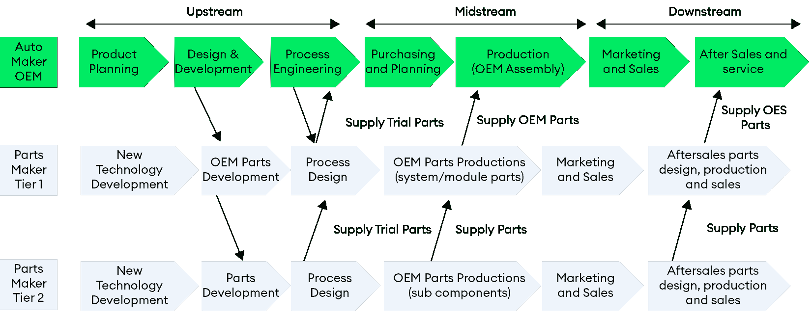

图 6.1：供应链管理组件和数据流

*图 6.1* 强调了汽车供应链紧密互联的本质。它强调了在设计、制造和销售等上游、中游和下游功能之间进行协调决策对于信息流和零部件高效流动的重要性。这些互动的复杂性表明，汽车行业需要智能、灵活和有弹性的供应链管理解决方案。

这个汽车行业的例子说明了所有制造业面临的更广泛挑战：传统的、手动的方法已不足以管理如此复杂的网络。每个连接点都代表着潜在的瓶颈、风险和优化机会，需要实时可见性和智能决策能力。

库存管理成为实现高效供应链、控制成本和以最小延迟向客户交付的关键。它包括关键的业务流程，如在不同供应链点估计物料需求、确定必要的物料数量、订购频率和安全库存水平。从需求预测和提前期优化到在复杂网络中维护实时库存可见性，这些相互关联的挑战需要复杂的协调，以确保正确的库存在正确的时间出现在正确的位置，同时最小化系统成本并满足客户需求。

## 多层次规划方法

现代供应链中所示出的复杂性要求同等复杂的规划方法，这些方法可以同时解决不同的时间范围和组织范围。战略规划和战术规划对于成功的供应链管理至关重要，帕累托原则表明，战略和战术规划中的 20%的努力可以产生 80%的总效果 [2]。然而，这些过程面临着重大的挑战，尤其是在预测长期需求、市场趋势和经济条件方面，因为延长的时间范围增加了市场条件、消费者偏好和技术进步的不确定性。为了系统地解决这些挑战，组织必须在多个决策层面上构建其规划流程。

公司通常在三个不同的层面上进行供应链规划：

1.  **战略层面**：影响整个组织的高层次决策，包括情景规划，该规划检查内部和外部数据，例如全球新闻、政治发展和科学文献，以识别战略关注点和趋势，这些趋势将指导未来的情景。

1.  **战术层面**：中期规划，专注于资源分配和在定义的时间框架和运营限制内实施战略决策。

1.  **操作层面**：短期规划，解决日常运营、即时需求和实时调整，以维持供应链的顺畅流动。

这种多层次的方法为更复杂的库存管理策略提供了基础，其中每个规划层面都为优化过程提供必要的输入，这些输入将通过人工智能驱动的分类和分析技术得到增强。

## 库存分类和优化方法

有效的库存管理始于对库存项目的适当分类，以确定适当的控制政策。传统方法已从仅按美元价值分类的经典 ABC 分析发展到**多标准库存分类**（**MCIC**），它结合了多个定量和定性因素以实现更精确的分类。最近，生成式 AI 解锁了将非结构化数据源（如客户评论和供应商沟通）转化为可操作的库存见解的潜力，创造了远远超出传统方法的全新智能分类可能性。

### ABC 分析及其局限性

ABC 分析是一种广泛使用的方法，根据库存项目的相对重要性将其分类。

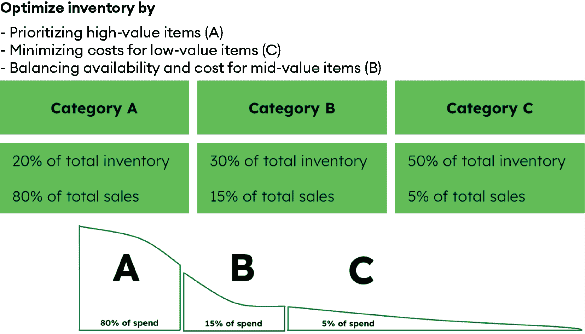

图 6.2：库存分类的 ABC 分析框架

*图 6.2* 展示了 ABC 分析法的应用，该方法根据销售价值将库存分为三类：**类别 A**包括产生 80%总销售额的 20%的商品，**类别 B**覆盖产生 15%销售额的 30%的商品，而**类别 C**则由仅占 5%销售额的 50%的商品组成。这种分类有助于通过优先考虑高价值商品（**A**类）、平衡中等价值商品的可用性和成本（**B**类）以及最小化低价值商品的成本（**C**类）来优化库存。尽管 ABC 分析法因其简单性而受到重视，但它因过于关注美元使用而受到批评。这导致了更复杂方法的开发。

### MCIC 和生成式 AI 的需求

MCIC 超越了美元价值，纳入了影响库存决策的额外标准。这些标准包括定量特征（可测量的数值数据）和定性信息（描述性、主观评估）。MCIC 使用的标准既包括定量因素也包括定性因素的一些例子。

通常考虑的定量特征是由实现即时库存交付的关键目标驱动的，这要求精确测量和优化以下因素：

+   预期交货时间（天数）

+   库存持有成本（项目价值的百分比）

+   订单大小要求（单位）

+   历史缺货频率（每年发生次数）

可能影响分类决策的定性因素代表了数十年来供应链演变的经验教训。汽车零部件供应商和汽车制造商在供应链全球化的早期就遇到了这些问题，并通过大量的试错痛苦地将这些担忧纳入其订单和库存管理系统：

+   共同性（一个项目在产品中的使用范围）

+   过时风险（变得过时的可能性）

+   耐用性（预期使用寿命和可靠性）

+   供应商可靠性（交付和质量的一致性）

+   战略重要性（与业务优先级一致）

库存分类的基本挑战在于有效地结合这些多样化的信息类型。虽然定量特征可以直接纳入分类模型，但定性信息必须首先转换成可测量的值，以便对系统库存分类有用。

传统上，这种转换过程面临几个关键限制：

+   **手动评估负担**：将定性信息转换为定量特征通常需要领域专家针对每个标准手动评估每个库存项目，对于大量库存来说这是一个极其繁琐的过程

+   **一致性问题**：对定性因素的人类评估不可避免地会在不同的评估者之间引入主观性和不一致性

+   **未开发的数据来源**：有价值的定性信息通常存在于非结构化数据源（如客户评价、维护记录和供应商沟通）中，这些数据源对传统的分类方法来说仍然难以接触

+   **可扩展性限制**：随着库存目录的增长，手动转换定性信息变得越来越不可持续

通过统计聚类和其他无监督机器学习技术的高级实现可以应用这种方法，从而对库存重要性和适当的管理策略有更细致的理解，尤其是在定量特征和转换后的定性信息都可用于分析时。

## AI 和 MongoDB 用于库存优化

人工智能和现代数据库技术的结合为解决库存分类中的传统限制创造了前所未有的机会。AI 驱动的解决方案现在可以自动处理大量结构化和非结构化数据，将定性洞察转化为定量特征，同时保持手动流程无法实现的可扩展性和一致性。现代平台如 MongoDB Atlas 为这些高级 AI 应用提供了统一的数据基础，使组织能够在单一灵活的架构中存储、处理和分析来自传统库存指标到客户评价和供应商沟通的多种数据类型。这一技术基础使得以前无法大规模实施的复杂库存优化方法成为可能。

### GenAI 驱动的库存分类

GenAI 通过纳入关于需求和库存消耗模式的有价值信息的非结构化数据，显著增强了传统的 MCIC。非结构化数据可以转换成结构化数据，作为库存分类模型的特征输入。将非结构化数据作为特征添加可以提高分类结果。

产品评论可用于提取定性指标，例如推荐产品的概率、再次购买的概率以及期望与现实之间的差距。除了评分分数外，通过分析文本和附带的图像，我们可以提取有关客户对特定产品的主观观点的详细信息，这可能会影响未来的需求。

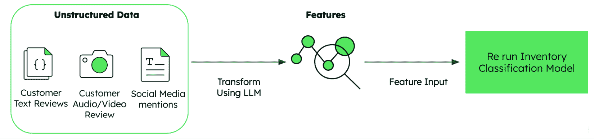

图 6.3：用于库存分类的非结构化数据的 GenAI 转换

*图 6.3*展示了 GenAI 将非结构化数据转换为库存分类的宝贵特征的核心理过程。在左侧，我们看到多样化的非结构化数据来源（客户文本评论、音频/视频评论和社交媒体提及），这些数据在传统的库存分类系统中之前未被充分利用。中间的**大型语言模型**（**LLM**）作为一个强大的转换引擎，处理这些多样化的输入，提取有意义的模式、情感和见解。然后，这些被结构化为定量特征，可以直接输入到库存分类模型中，与传统指标一起使用。

### 实施基于 GenAI 的库存分类的方法论

虽然图 6.3 中展示的概念性转换展示了 GenAI 在库存分类中的潜力，但将这一愿景转化为实践需要一种系统性的方法。组织需要一个清晰的路线图，以解决处理不同数据类型的复杂技术问题、创建有意义的评估标准的挑战以及现有库存系统的集成需求。

实施基于 GenAI 的库存分类的方法论遵循四个步骤的过程：

1.  从非结构化数据创建和存储向量嵌入。

1.  设计和存储评估标准。

1.  创建一个代理应用程序，根据标准执行转换。

1.  重新运行具有增强特征的库存分类模型。

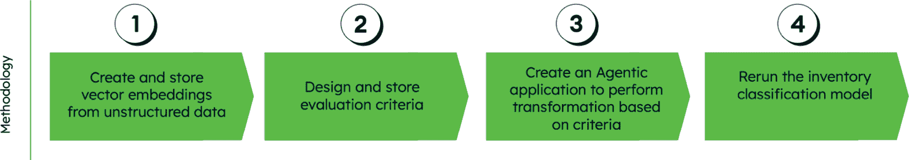

图 6.4：基于 GenAI 的库存分类的四个步骤方法论

此流程图展示了实施 AI 增强库存分类的四个步骤的顺序过程。

这种非结构化数据的集成在传统的库存分类方法上取得了重大进步，使组织能够考虑客户的意见、市场情绪以及其他定性信号，这些信号通常包含需求模式变化或产品性能问题的早期指标。

这个方法论中的每一步都建立在之前的基础上，创建了一个全面的框架，改变了组织处理库存分类的方式。让我们详细检查每一步，以了解这种转换在实际中是如何展开的。

#### 第 1 步：从非结构化数据创建和存储向量嵌入

在这个初始步骤中，非结构化数据源，如客户评价、社交媒体提及和音频/视频反馈，通过嵌入模型处理以创建向量表示。这些向量嵌入捕捉了非结构化内容中的语义意义和细微信息。

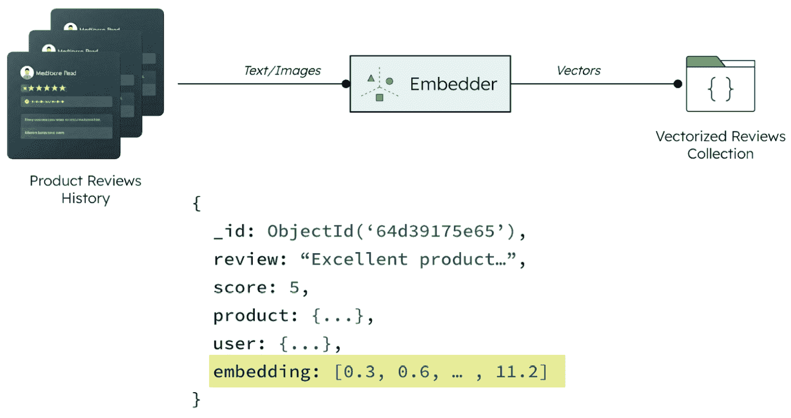

图 6.5：非结构化数据的向量嵌入过程

此图展示了产品评价和图像如何通过嵌入器处理以创建存储在向量化评价集合中的向量表示。嵌入过程将文本、图像或其他非结构化数据转换为数值向量数组，这些数组可以高效地存储和查询。例如，一个产品评价如“优秀的产品...”被转换为多维向量（例如，`[0.3, 0.6, ..., 11.2]`），它保留了其语义意义。

这些嵌入使用类似以下结构的存储在 MongoDB 中：

```py
{
  "_id": ObjectId('64d39175e65'),
  "review": "Excellent product...",
  "score": 5,
  "product": {...},
  "user": {...},
  "embedding": [0.3, 0.6, ..., 11.2]
} 
```

向量化过程使以前无法量化的信息变得机器可读和分析，为考虑客户情感和反馈的更复杂的库存分类奠定了基础。

#### 第 2 步：设计和存储评估标准

在实施通用人工智能进行库存分类的过程中，一个关键步骤是开发评估标准。评估标准是将定性信息转化为定量分数的明确规则和指南。这些标准作为非结构化数据与库存分类模型所需的数值特征之间的**转换层**。

此过程涉及多个输入和利益相关者，以确保人工智能系统评估库存项目是否符合相关业务目标。

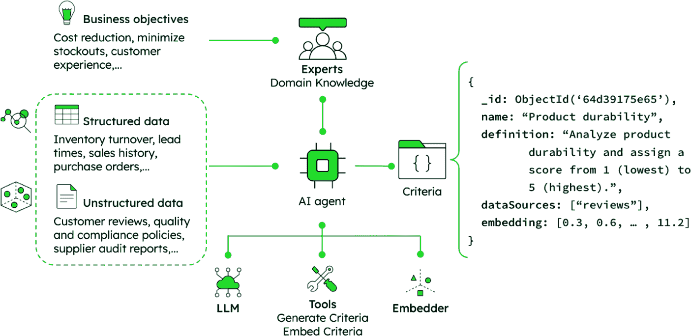

图 6.6：人工智能系统生成业务评估标准

此图说明了人工智能代理如何使用 LLMs、工具和嵌入器自动生成评估标准，综合多个输入，例如业务目标、专家领域知识、结构化数据（库存周转率和销售历史）以及非结构化数据（客户评价和合规政策）。

这些评估标准旨在反映组织的战略重点及其特定领域的专业知识。输入可以大致分为以下几类：

+   **业务目标**：这些包括成本降低目标、缺货最小化目标和客户体验要求。业务领导者根据公司战略和市场需求定义这些目标。

+   **专家领域知识**：领域专家提供关于影响库存决策的行业特定因素的见解，确保分类系统考虑到特定行业考虑因素。

+   **结构化数据**：这是如库存周转率、交货时间、销售历史和采购订单模式之类的定量信息。

+   **非结构化数据**：这是来自客户评价、质量和合规政策以及供应商审计报告的定性信息。

人工智能代理将这些输入结合以生成评估标准，然后以结构化格式存储。虽然以下示例为了说明目的而简化，但在实践中，这些标准将显著更复杂，通常包括多个条件评估、加权方案和置信度阈值：

```py
{
  _id: ObjectId('64d39175e65'),
  name: "Product durability",
  definition: "Analyze product durability and assign a score from 1 (lowest) to 5 (highest).",
  dataSources: ["reviews"],
  embedding: [0.3, 0.6, … , 11.2]
} 
```

人工智能代理主动建议相关的数据源（在这种情况下，`"reviews"`），其中包含与特定标准相关的信息。通过确定哪些集合或数据存储库包含有关每个标准的有价值信号，人工智能系统在不同的信息源和可操作的库存洞察之间创建了一个智能桥梁。

这些标准随后被矢量化，以实现与产品信息和评价的语义匹配。这使得人工智能能够不仅基于传统指标评估库存项目，还能基于可能影响未来需求或战略重要性的定性因素。

MongoDB 的文档模型和向量搜索功能为这种方法提供了一种端到端解决方案，允许组织在同一个数据库中存储结构化库存数据和未结构化信息的向量嵌入。这种统一架构消除了数据孤岛，并提供了对库存相关因素的全面视图。

#### 第 3 步：创建一个基于标准的代理应用程序以执行转换

在这一步，开发了一个人工智能代理，以系统性地将库存中的每个产品与在*步骤 2*中建立的评估标准进行对比。这个代理作为操作引擎，将定性数据转化为可量化的指标。

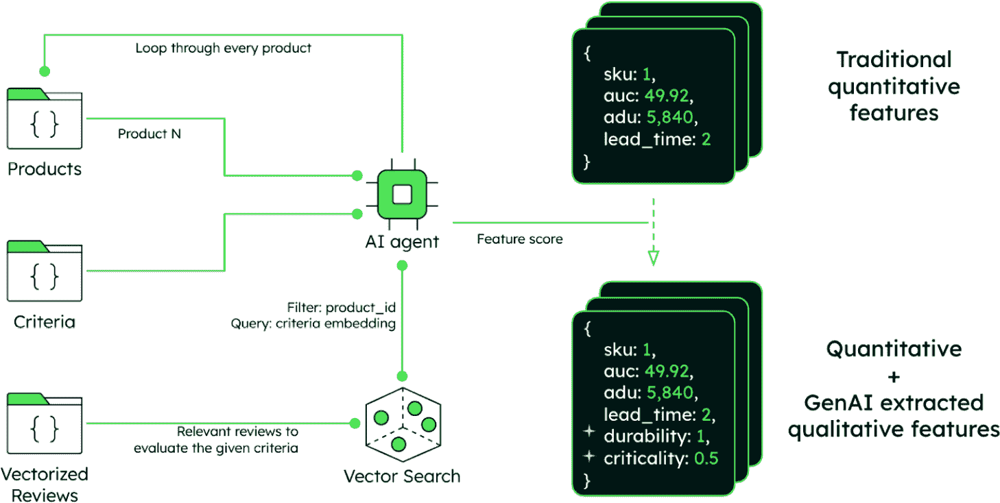

图 6.7：基于标准的转换的人工智能代理工作流程

此图显示了人工智能代理如何通过结合传统的定量特征和人工智能提取的定性洞察来系统地处理库存产品。代理遍历每个产品，应用评估标准，对客户评价进行向量搜索，并输出增强的产品数据，包括标准指标（SKU、价格和交货期）以及新的基于人工智能的特征（耐用性评分和关键性评级），以改善库存分类。

代理应用程序遵循一个定义良好的工作流程：

1.  **产品处理循环**：系统遍历库存目录中的每个产品。

1.  **标准匹配**：对于每个产品，代理识别相关的评估标准。

1.  **向量搜索集成**：代理使用向量搜索功能，根据标准嵌入找到与每个产品最相关的客户评价和其他非结构化数据。

1.  **语义分析**：使用如`product_ID`和语义搜索查询等过滤器，代理定位并分析包含有关正在评估的特定标准（如耐用性、可靠性或用户满意度）信息的相关评论。

1.  **特征提取**：代理处理这些非结构化数据，为每个标准提取可量化的分数，将定性评估转换为数值。

此过程的输出是一个增强的产品数据结构，它将传统的量化指标与新的 AI 提取的定性特征相结合。

例如，仅用定量数据表示的产品可能看起来像这样：

```py
{
  "sku": 1,
  "average_unit_cost": 49.92,
  "annual_dollar_usage": 5,840,
  "lead_time": 2
} 
```

当增强为 GenAI 提取的定性特征时，相同的产品数据结构扩展到包括耐用性和关键性等属性：

```py
{
  "sku": 1,
  "average_unit_cost": 49.92,
  "annual_dollar_usage": 5,840,
  "lead_time": 2,
  "durability": 1,
  "criticality": 0.5
} 
```

此转换过程为每个库存项目构建了一个全面的档案，它捕捉了来自客户反馈和其他非结构化来源的显式量化属性和隐式定性特征。

#### 第 4 步：使用增强特征重新运行库存分类模型

最后一步涉及利用增强特征集以更高的准确性和业务相关性重新分类库存项目。此过程结合了传统的量化指标和从非结构化数据中生成的新定性特征。

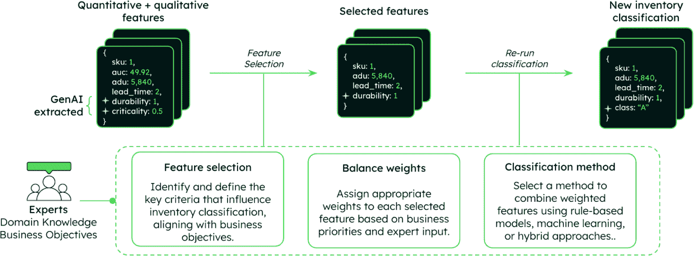

图 6.8：具有增强特征的库存重新分类过程

此图显示了最终步骤，其中通过特征选择、权重平衡和分类方法将 AI 提取的定性特征与传统的定量数据相结合。重新分类过程包括几个关键组件：

1.  **特征选择**：在领域专家和业务目标的指导下，确定分类中最相关的特征。这可能包括传统的指标，如**年度美元使用量**（**adu**）和交货时间，以及新的基于 GenAI 的特征，如耐用性或客户满意度。

1.  **权重平衡**：根据业务优先级和专家意见，为每个选定的特征分配适当的权重，确保分类反映了组织的战略目标。

1.  **分类方法实现**：选择一种方法来组合这些加权特征，这可能涉及基于规则的模型、机器学习算法或混合方法，具体取决于库存的复杂性和业务需求。

1.  **模型执行**：使用增强特征集执行分类模型，生成反映每个项目重要性的更细微理解的更新库存分类。

此过程的输出是一个新分类的库存，其分类（例如，A、B、C）考虑了传统的财务指标和更深入的定性方面：

```py
{
  "sku": 1,
  "annual_dollar_usage": 5,840,
  "lead_time": 2,
  "durability": 1,
  "class": "A"
} 
```

这种重新分类提供了对库存重要性的更准确和全面的视角，使企业能够做出关于库存水平、订购频率和供应商管理策略的更明智的决策。

# Atlas：统一的 AI 基础设施

MongoDB Atlas 作为现代库存解决方案的全面基础，帮助企业提升服务质量和工作效率，通过实现库存的单视图、事件驱动架构和实时分析来优化库存管理。该解决方案为高级场景奠定了基础，例如集成物联网和 RFID 标签、深入 AI/ML 预测以实现精确的需求预测和分布式物流。该平台的灵活性不仅使其从仓库到销售点得到应用，还贯穿整个供应链，包括制造、运输、零售和逆向物流，使其成为不同商业领域的宝贵资产。MongoDB 的集成产品套件支持 AI 驱动的库存分类过程的每个步骤：

1.  **向量嵌入**：MongoDB Atlas Vector Search 存储和索引从非结构化数据（客户评论、社交媒体等）生成的嵌入，使高效的语义搜索成为可能。

1.  **评估标准**：MongoDB 的灵活文档模型将复杂的评估标准存储为 JSON 文档，包括定义、数据源映射和语义匹配的向量表示。

1.  **代理应用**：MongoDB 的查询能力与 Atlas Vector Search 相结合，使 AI 代理能够高效地过滤库存项目，并找到语义上相似的评论或文档来评估定性标准。

1.  **分类模型**：对于简单的分类方法，MongoDB 的聚合框架可以用来处理增强的特征集，重新计算库存分类，并将结果以与现有库存系统无缝集成的格式存储。对于更高级的方法，MongoDB 与行业领先的 AI 框架和平台无缝集成，以运行分类模型。

下图提供了 MongoDB Atlas 如何支持 AI 驱动的库存分类工作流程每个阶段的概览，将 AI 能力与数据基础设施需求相结合。

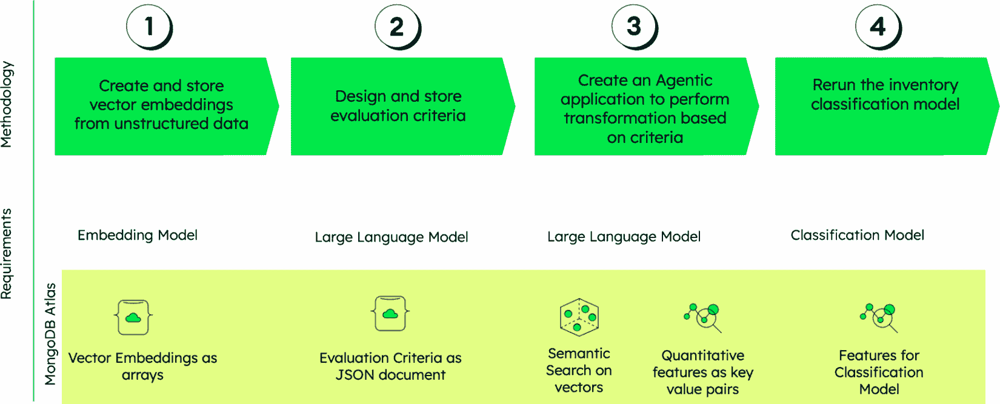

图 6.9：MongoDB Atlas AI 驱动的库存分类流程

此图展示了人工智能能力和数据基础设施之间的无缝集成，这使得大规模实现复杂的库存分类成为可能。该流程演示了 MongoDB Atlas 如何作为连接原始数据源和可操作库存洞察的统一基础。通过支持向量嵌入、灵活的文档存储和单一平台内的原生人工智能集成，Atlas 消除了与多系统架构通常相关的复杂性和技术债务，使组织能够专注于优化其库存策略，而不是管理不同的技术。

## GenAI 库存分类演示：视觉流程

让我们探索一个真实世界的演示，看看通用人工智能如何在实际中改变库存分类。这个流程展示了 MongoDB Atlas 如何超越传统指标，创建一个真正智能的库存管理系统，该系统捕捉了定量和定性因素。

### 第 1 步：从基本分类开始

MongoDB 的**库存优化**界面最初呈现库存项目的简单视图。第一个屏幕显示具有传统属性的产品，例如**产品代码**和**年度美元使用量**，以及初步的**加权分数**和**类别**分配。

在这个阶段，分类仅限于基本的定量指标。如图所示，只有**年度美元使用量**被积极考虑，并使用默认权重，导致分类系统有些单维。注意产品是如何根据美元价值（**A**、**B**和**C**类别）进行排序的，忽略了可能影响库存决策的许多细微因素。

这个起点代表了传统的库存分类：功能性强，但在复杂供应链中实现真正优化库存管理所需的深度不足。屏幕上可见的加权分数是我们比较通过通用人工智能（GenAI）实现的改进的基准。

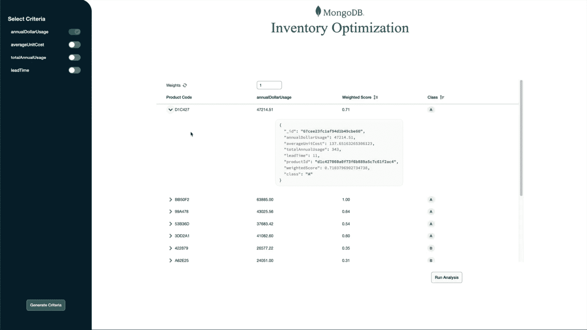

图 6.10：初始 MongoDB 库存优化演示界面，具有基本分类

在这个基础上，我们现在可以展示人工智能如何将这种基本方法转变为更加复杂且与业务相关的方案。

### 第 2 步：生成新的 AI 驱动标准

变革始于用户点击**生成标准**按钮，打开如图 6.11 所示的直观**通用人工智能驱动标准生成器**对话框。该界面通过允许商业用户用自然语言描述重要因素，在人类专业知识和人工智能能力之间架起桥梁。

在这个例子中，用户输入了以下内容："考虑客户对产品的满意度，以考虑潜在的未来价值"。系统处理这个自然语言描述，并自动填充以下内容：

+   **标准名称**：**客户满意度**

+   **标准定义**：一个全面的定义，解释如何衡量客户满意度，包括对重复购买概率的分析、从星级评分中提取的情感，以及相对于期望的价值感知的整体感知

+   **数据来源**：界面允许选择相关的数据存储库，如 **REVIEWS** 和 **PRODUCTS**，AI 将分析这些数据以量化先前主观的标准

这一步代表了一个关键创新，使用 NLP 将定性业务知识转化为可衡量的指标。系统不需要用户具备技术专长；它将业务意图转化为技术实现。

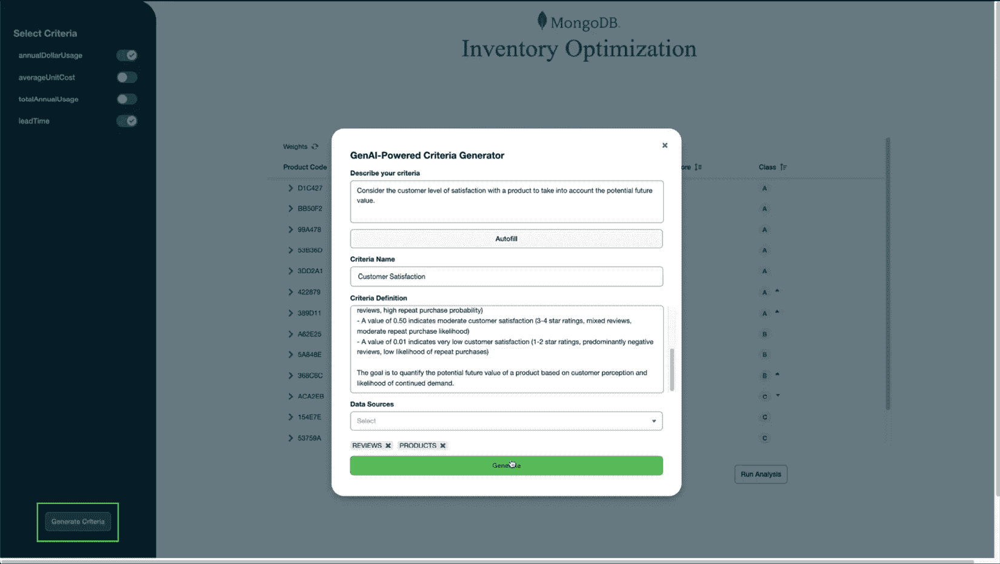

图 6.11：GenAI-Powered Criteria Generator 演示对话框

这种转换的简便性展示了 AI 如何使高级分析民主化，使复杂的分类对具有技术背景的领域专家来说变得可访问。

### 第 3 步：将新标准整合到分类中

生成后，新创建的 AI 生成的 **customerSatisfaction** 标准出现在界面左侧的 **Select Criteria** 面板中，现在与传统指标并列。当激活（如切换开关所示）时，系统无缝地将这一新维度整合到库存优化模型中。

注意界面如何更新以显示此新指标作为产品列表中的附加列。现在每个产品都显示一个 **customerSatisfaction** 的数值评分，有效地将之前未衡量的定性因素转化为可以影响库存决策的定量值。

特别有价值的是，系统如何保持一致的框架；新的 AI 生成的标准成为分类系统的一个完整组件，与传统指标同等考虑。在传统分析中可能看似相同的产品，在考虑客户满意度时现在显示出重要的差异。

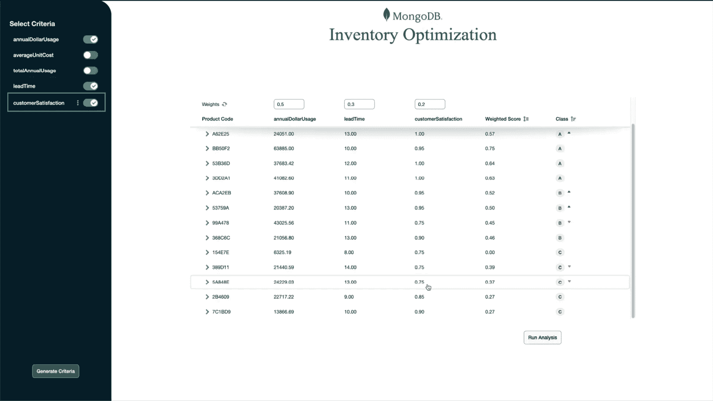

图 6.12：AI 创建的客户满意度集成后的库存管理演示界面

这种整合展示了 AI 增强分类的真正力量：将先前无法衡量的业务因素纳入系统决策过程的能力。

### 第 4 步：加权并运行分析

最后一步展示了这一增强分类系统的灵活性和强大功能。如图 6.13 所示，用户可以通过直观的加权控制为每个标准分配相对重要性：

+   `0.5` 用于 **annualDollarUsage**（保持财务指标的重要性）

+   `0.3` 用于 **leadTime**（承认供应链的现实）

+   `0.2` 用于 **customerSatisfaction**（纳入新量化的客户视角）

点击**运行分析**按钮后，系统根据这一套全面的准则重新计算所有库存项目的加权分数。结果产生的**分类**分配（**A**、**B**和**C**）现在反映了一种更复杂的分析，它平衡了多个业务优先级。

通过比较分类前后的情况，真正的业务影响变得明显。之前仅根据美元价值获得较低分类的产品，现在可能因高客户满意度评分而被认为是战略上重要，这表明有未来增长的潜力。相反，价值高但客户满意度差的项目可能被标记为需要更仔细的评估。

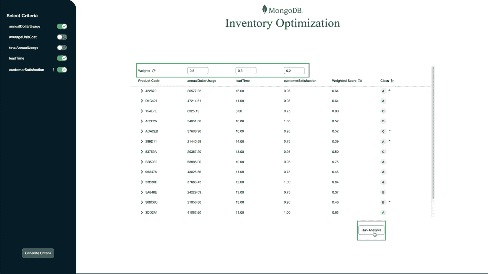

图 6.13：加权控制和分析结果

本演示中显示的迭代过程使得库存管理策略能够持续优化。采用这种方法，客户领域的专家可以自由地专注于策略和业务影响，而系统则处理技术负担。组织可以通过生成更多标准，如可持续性合规性、供应链风险或市场趋势一致性，来逐步提高其分类系统，所有这些都在一个地方完成。这种方法将库存分类从静态的回顾性分析转变为动态的前瞻性系统，通过 GenAI 充分利用结构化和非结构化数据的全部潜力，使团队能够花更多时间在推动积极商业价值和成果的客户特定活动上。

虽然由 GenAI 驱动的分类增强了我们对库存的分类和理解，但下一个前沿领域在于自动化这些洞察产生的行动。从决策支持迈向自主决策，代理型 AI 系统可以独立管理采购流程、供应商关系和库存补充，基于我们已建立的智能分类。

## 通过代理型 AI 进行原材料管理

现在我们来探讨供应链管理中 AI 的另一个尖端应用：用于原材料管理的代理型 AI。虽然上一节展示了 GenAI 如何通过改进分类来增强决策，但这种方法通过部署能够主动监控、分析和采取行动以优化原材料库存的自主 AI 代理，将自动化推进了一步。这代表了从 AI 辅助决策到完全自主供应链操作的演变。

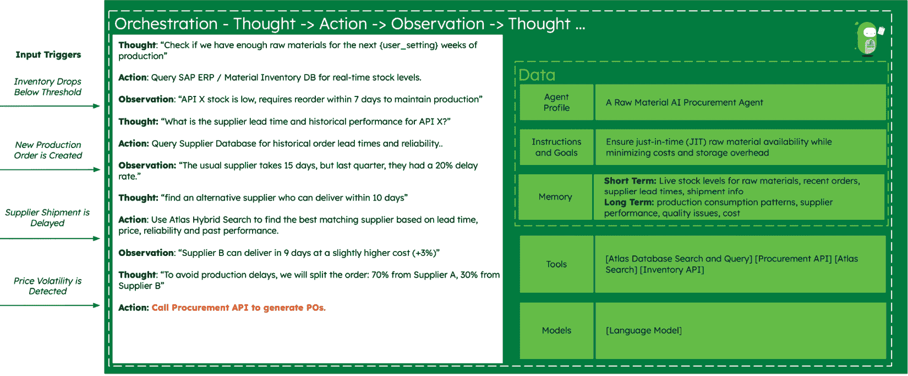

图 6.14：原材料 AI 采购代理的编排和决策过程

此图揭示了使自主供应链管理成为可能的复杂推理能力。与遵循预定逻辑路径的传统基于规则的系统不同，这个 AI 代理通过其循环思维过程展示了动态问题解决能力。代理能够同时评估多个供应商；权衡竞争因素，如成本与可靠性；并做出细微的决定，如拆分订单，这代表了从被动到主动供应链管理的根本转变。这种认知方法使系统能够处理通常需要人类判断的复杂场景，例如在即时成本节约与长期供应商关系风险之间取得平衡。

原材料管理代理持续监控关键事件触发器，并主动采取行动以优化库存水平、采购、供应商选择和物流。它确保及时物料可用性，同时最小化成本和存储成本。使这种方法特别强大的是代理从每个决策周期中学习的能力，随着时间的推移改进其推理，并适应不断变化的供应链条件，而无需人为干预。

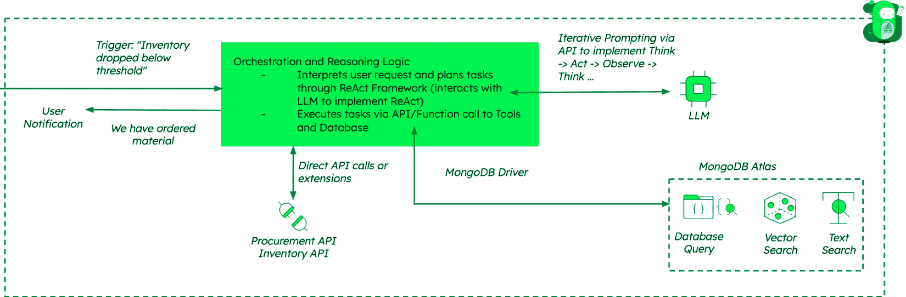

图 6.15：原材料管理的 AI 代理编排架构

此架构展示了事件驱动设计如何实现真正响应的供应链自动化。中央编排服务作为智能协调器，处理来自库存系统、生产计划和市场需求的各种触发器，然后确定最佳行动顺序。与 MongoDB Atlas 作为中央数据平台的集成确保了从库存数据库到供应商绩效指标的所有组件保持数据一致性，同时实现实时决策。这种统一方法消除了传统上困扰供应链系统的数据孤岛，其中库存、采购和供应商信息存在于不同的系统中。该架构的模块化设计允许更新或替换单个组件，而不会影响整个系统，提供了适应不断变化的业务需求和新的 AI 能力的灵活性。

## 需求预测和库存优化

在确立了 AI 如何增强库存分类并实现自主物料管理之后，我们现在更详细地考察需求预测。这一能力在我们讨论中一直作为一个智能供应链运营的基础元素出现。

人工智能驱动的需求预测代表了驱动分类决策和自主采购行动的预测引擎。人工智能算法分析复杂的数据集以预测未来的产品和部件需求。预测准确性的提高直接转化为更优的库存水平。一旦预测了需求，人工智能系统可以通过分析历史销售数据、市场趋势、季节性模式、供应链中断和生产计划来确定最有效的库存水平。

人工智能系统还可以根据预测需求和目标库存水平自动订购，减少人为错误和管理开销。此外，人工智能可以通过分析性能数据来协助供应商选择和关系管理，以识别最能满足质量、交付和成本要求的合作伙伴。

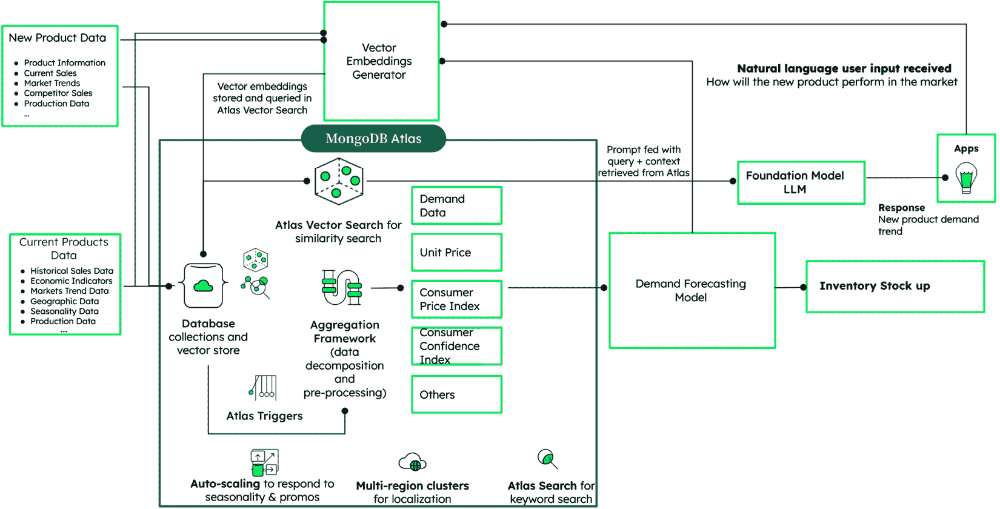

图 6.16：人工智能驱动的需求预测和库存优化架构

此图展示了 MongoDB Atlas 如何通过集成新产品数据和当前产品数据，通过向量嵌入和相似性搜索实现全面的预测性需求预测。系统处理自然语言用户输入，利用基础 LLM 进行上下文分析，通过聚合框架结合多个数据源（需求数据、单价和消费者指数），并将结果输入到驱动库存库存优化决策的需求预测模型中，Atlas 触发器启用自动扩展和多区域功能。

对于没有历史销售数据的新产品，通用人工智能（GenAI）模型可以通过从类似现有产品中学习模式来创建合成数据。MongoDB Atlas Vector Search 通过寻找具有相似属性的产品并将该上下文输入到通用人工智能（GenAI）模型中，增强了这一功能，确保合成数据反映了现实的市场条件和客户行为。

## MongoDB 对库存管理的益处

我们所探讨的复杂人工智能应用，从由通用人工智能（GenAI）驱动的分类到自主代理系统，都依赖于一个强大、灵活的数据基础，能够处理现代制造供应链的复杂性和规模。MongoDB Atlas 通过几个关键功能提供这一基础，这些功能直接支持本章讨论的先进库存管理方法。

MongoDB Atlas 为人工智能驱动的库存管理系统提供了显著优势：

+   **文档数据模型**：处理多个工厂和供应商之间的复杂库存结构和层次

+   **向量搜索**：启用基于多个标准的语义搜索能力，用于查找类似的产品或供应商

+   **细粒度安全和访问控制**：确保供应链中不同利益相关者适当的数据访问

+   **时间序列集合**：高效存储和分析时间序列数据，用于趋势检测和预测

这些能力协同工作，创建了一个统一的平台，支持从基本的库存跟踪到复杂的 AI 驱动优化的一切。通过消除在结构化数据、向量嵌入和实时分析之间进行复杂集成的需求，MongoDB Atlas 使组织能够专注于开发智能库存策略，而不是管理技术基础设施。这种集成方法加速了 AI 驱动解决方案的实施，同时提供了对关键供应链运营所需的可扩展性和可靠性。

## 为第五代工业重新构想库存管理

库存管理和优化是高效制造运营的关键组成部分。通过利用先进的 AI 能力，特别是用于非结构化数据分析的通用人工智能（GenAI）和用于自主决策的代理人工智能（agentic AI），组织可以在平衡成本、可用性和响应能力的同时，实现新的效率水平。

这些技术与灵活、可扩展的数据平台（如 MongoDB Atlas）的集成，使制造商能够做到以下几方面：

+   提高预测准确性

+   优化库存水平

+   提升供应商选择和管理

+   积极应对供应链中断

+   在不牺牲服务水平的情况下降低持有成本

随着制造业继续向第五代工业（Industry 5.0）发展，这些 AI 驱动的库存优化方法将越来越成为在全球化市场中保持竞争优势的关键。从被动库存管理到预测性、智能系统的转变只是 AI 对制造运营影响的开始。

# 摘要

本章探讨了 AI 如何改变制造运营中的供应链和库存管理。我们考察了从传统的 ABC 分析等库存分类方法到由 GenAI 增强的复杂 MCIC 的演变，现在它可以结合来自客户评价、供应商沟通和市场信号的非结构化数据，以创建更细致和有效的库存分类。

实施通用人工智能（GenAI）驱动的库存分类的四步方法论，即创建向量嵌入、设计评估标准、开发代理应用程序和增强分类模型，展示了现代数据平台如何弥合定性业务洞察和定量决策之间的差距。我们已经看到了从将客户反馈转化为库存洞察的 AI 分类系统到能够独立管理原材料采购并在实时优化供应链决策的自主代理系统等实际应用。

通过详细的演示和现实世界的例子，我们已经展示了 MongoDB Atlas 如何作为统一的基础设施，使这些复杂的 AI 应用成为可能，提供在单一平台上处理结构化库存数据和未结构化市场情报的灵活性。这种集成方法允许组织从静态的、回顾性的库存分析转变为动态的、前瞻性的优化系统，这些系统能够持续适应不断变化的市场条件。

下一章将继续我们探索制造 AI 的旅程，通过考察这些相同的原则如何超越库存管理，从而改变更广泛的制造运营，包括预测性维护、质量保证以及整个制造价值链的生产优化。

# 参考文献

1.  *欧洲在制造运营中采用 AI 的领先地位*：[`www.capgemini.com/us-en/news/europe-is-leading-ai-in-manufacturing-operations-adoption/`](https://www.capgemini.com/us-en/news/europe-is-leading-ai-in-manufacturing-operations-adoption/)

1.  *供应链规划与建模以支持智能决策*：[`www.anylogistix.com/resources/blog/supply-chain-strategic-planning-and-modeling-for-decision-support/`](https://www.anylogistix.com/resources/blog/supply-chain-strategic-planning-and-modeling-for-decision-support/)
