# 7

# 智能体和通用人工智能在制造业中的实际应用 – 第二部分

在前一章建立的供应链基础上，我们将现在进入制造业人工智能的下一个前沿：智能运营系统，它不仅自动化任务，而且能够实时协作、学习和适应。虽然供应链优化展示了人工智能将反应性过程转变为预测性过程的能力，但我们将在本章探讨的应用代表了向真正自主制造生态系统的根本转变，其中多个 AI 代理共同优化复杂的、相互关联的运营。

本章探讨了四个关键领域，在这些领域中，协作人工智能正在重新定义制造业的卓越。我们首先从预测性维护开始，多智能体系统在机器优先级、故障预测、维修计划和维修指导方面进行协调，将设备管理从计划停机时间转变为智能的、即时干预。然后我们考察了人工智能如何保存和实施数十年的机构知识，确保退休专家的见解通过语义搜索和智能知识管理系统仍然可访问。超越工厂车间，我们研究了通用人工智能如何通过理解上下文、访问技术文档和提供个性化指导的复杂语音助手来革新车载体验。最后，我们探讨了车队管理优化，其中智能体 AI 系统自主协调复杂的物流决策，实时平衡路线、时间表、维护和资源分配。

每个应用都展示了现代数据平台如何使这些智能系统能够无缝集成结构化运营数据与非结构化知识源，为这些 AI 代理提供他们需要以自主方式做出复杂决策的全面上下文。

到本章结束时，您将了解以下内容：

+   如何使用多智能体协作和 RAG 架构实现四阶段预测性维护策略

+   机构知识保存的关键作用以及人工智能如何将部落知识转化为可搜索的、可操作的见解

+   通用人工智能如何通过混合云边缘架构为下一代汽车语音助手提供动力

+   用于车辆手册和技术文档的高级分块策略，以保留关键上下文和关系

+   使用 ReaAct 框架实现智能体 AI 用于自主车队调度和优化的实施

+   灵活文档模型、向量搜索和时间序列功能如何使复杂的智能体系统变得复杂

+   用于连接车队事件管理和诊断系统的实际架构和数据模型

+   集成制造系统在运营卓越和竞争优势方面的战略优势

# 预测性维护和多智能体协作

在确立了人工智能如何通过智能数据集成改变供应链决策之后，我们现在将转向另一个关键领域，协作人工智能系统正在该领域革命化制造：预测性维护。虽然供应链优化关注材料流动和库存管理，但预测性维护解决制造运营的骨干问题：通过智能、主动的干预，保持生产设备在最佳性能水平运行。

一个定义良好的维护策略可以成为任何组织的转折点，推动显著的收入和成本节约。以下是它是如何工作的：

+   首先，确定对您的运营至关重要的设备。该设备的停机可能导致瓶颈，阻碍生产。

+   第二，为这些关键资产配备传感器，以实现状态监控。这允许您实时监控设备的健康状况，在问题升级为灾难性故障之前识别潜在问题。

+   第三，基于预测，系统可以生成工作订单，安排维护活动，甚至为维护人员提供指导。这确保了只有在必要时才进行维护，从而优化资源分配。

这一系列活动带来了可衡量的好处。通过节省劳动力和延长机器使用寿命来降低成本。此外，随着机器在最佳性能水平下运行，收入也会增加。

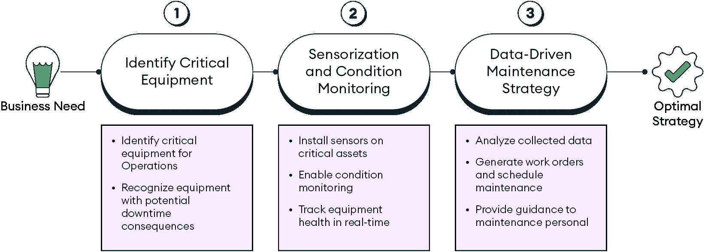

图 7.1：最优维护策略所需的步骤

*图 7.1* 展示了实施预测性维护的三步过程。从确定关键设备和识别潜在停机后果开始，接着进行传感器化和实时健康跟踪的状态监控，最终在分析收集的数据、生成工作订单、安排维护并提供人员指导的数据驱动维护策略中达到高潮，最终实现降低成本和增加收入的最佳维护策略。

## 最优维护策略

最优维护策略不是一刀切解决方案。它关乎根据您的具体设备和运营需求选择合适的方案组合。这些方案从一端的高度复杂和昂贵到另一端更简单、更经济的选择：

+   **反应性维护**：这是最基本的方法，即在机器故障后进行维护。虽然简单，但它可能导致意外的停机时间和更高的维修成本。

+   **预防性维护**：这是一种主动方法，涉及根据预定的时间间隔或使用指标安排维护任务。这有助于防止故障，但可能效率低下，因为机器条件可能变化。由于设备老化、工艺变化或使用不同材料等因素，这些任务的阈值可能需要调整。

+   **基于状态的维护**（**CBM**）：这种方法通过传感器和数据分析持续监控机器的健康状况。然后根据设备的实际状况而不是固定的时间表来触发维护。与预防性维护相比，这种方法更有效率，因为它避免了不必要的维护。基于阈值的警报系统通常与 CBM 一起使用。

+   **预测性维护**：这是最先进的方法，使用数据分析来预测潜在设备故障，在故障发生之前进行主动维护，从而最小化停机时间。预测性维护需要在传感器和数据分析工具上进行大量的前期投资。

预测性维护使用数据分析来识别机器在故障之前的问题。这允许组织在最佳时间安排维护，最大化机器可靠性和效率。

根据德勤[1]的说法，以下是预测性维护如何使制造运营受益：

+   **3–5%** 新设备成本降低

+   **5–20%** 劳动生产率提升

+   **15–20%** 设施停机时间减少

+   **10–30%** 库存水平降低

+   **5–20%** 降低持有成本

预测性维护不断进化。我们已经超越了基于阈值的监控基础，转向了更高级的技术，如机器学习模型。这些模型不仅预测故障，还能诊断根本原因和促成因素，从而进行有针对性的维修。

预测性维护的最新趋势是自动策略创建。这涉及使用 AI 根据定量和定性因素的组合来预测设备故障，同时生成维修计划，确保在正确的时间进行正确的修复。自动策略创建需要大量投资于研发，以及深入的行业知识、访问相关数据和实际操作经验。问题是，生成式 AI 能帮忙吗？

## 当前状态和挑战

答案是肯定的，生成式 AI 能帮忙。但在实施的每个阶段都存在挑战，组织必须考虑。每个阶段都提出了一个关键问题和独特的挑战，展示了组织在预测性维护部署中面临的技术和运营障碍。

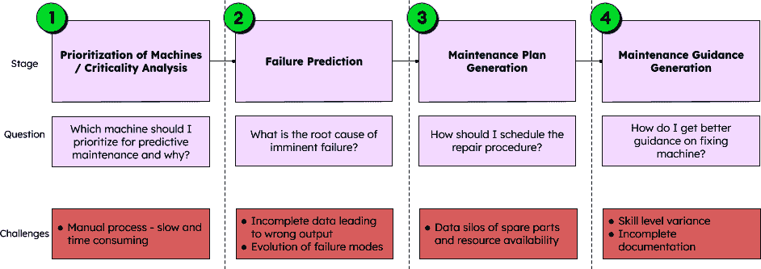

图 7.2：预测性维护部署各阶段遇到的不同挑战

**图 7.2**概述了四个阶段的预测性维护实施过程，展示了每个阶段的关键问题和相关挑战。特别值得注意的是，复杂性和数据需求是如何随着阶段的变化而演变的，从第一阶段的手动、耗时的机器优先级确定过程，到第二阶段缺乏训练数据和不断演变的故障模式的技術挑战，再到第三和第四阶段的集成复杂性和技能差距。这一进展揭示了为什么许多组织在预测性维护实施上遇到困难：每个阶段都提出了独特的技术和运营障碍，必须系统地解决。该图还说明了为什么整体、以 AI 驱动的方法变得至关重要；传统方法无法有效地处理这些相互关联挑战的多面性。

现在，让我们设想一个包含自动化和手动机器的工厂。我们可以称它为**齿轮传动系统有限公司**，其主要产品是变速箱。在这个工厂内，我们有一系列设备：切割机、铣床、测量设备等等。作为总经理，你被委以管理维护流程预算和改进策略的任务。你必须解决的一个紧迫问题是：“*哪些机器应该优先考虑预测性维护项目，原因是什么？*”这涉及到与维护经理和领导层进行咨询，并进行定量分析，这是一个相当手动的过程。

一旦你确定了机器，下一步就是安装传感器并训练机器学习模型。然而，出现了两个主要挑战。首先，你缺乏足够的*运行到故障*数据来有效地训练模型。其次，机器的健康状况会随着时间的推移而恶化，导致随着机器年龄的增长而演变的故障模式。

假设你设法克服了这些障碍，下一阶段将涉及维护调度和执行。你面临众多数据孤岛，包括库存数据和资源可用性数据，这些数据需要整合以制定全面的维修计划。此外，确保操作员能够熟练处理轻微的机器问题，以减少对外部专家的依赖并防止更严重的故障发生至关重要。虽然复杂问题可能仍然需要原始设备制造商（OEM）或**系统集成商**（**SI**）的支持，但内部故障排除能力是无价的。因此，开发针对我们员工技能水平的易于遵循的文档非常重要。

如**图 7.3**所示，解决所列挑战需要不同的数据：

+   **机器/关键性分析优先级**：在这个阶段，我们需要结构化和非结构化数据。我们需要以前机器故障数据以及专家对哪些机器应优先考虑预测性维护及其原因的分析和意见。

+   **故障预测**：这一阶段涉及结构化数据，如传感器数据和维护日志，以确定即将发生的故障的根本原因。

+   **维修计划和指导生成**：在这两个阶段，我们处理结构化和非结构化数据。目标是结合这些数据以生成最佳的维修计划和操作指导。

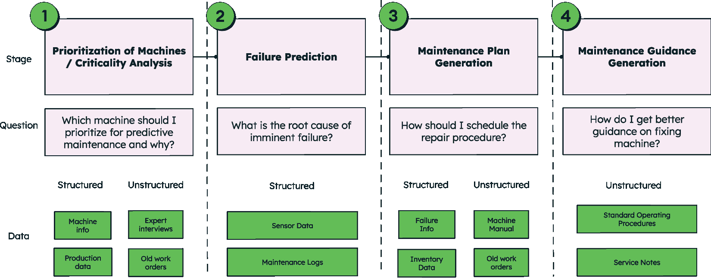

图 7.3：每个阶段的不同的数据需求

此图显示了预测性维护实施每个阶段的具体数据需求。第一阶段需要结构化数据（机器信息、生产数据）和非结构化数据（专家访谈、旧工作订单）以进行机器优先级排序。第二阶段使用结构化数据（传感器数据、维护日志）进行故障预测。第三和第四阶段将结构化数据（故障信息、库存数据）与非结构化数据（机器手册、旧工作订单、标准操作程序、服务说明）相结合，以生成维修计划和操作指导。

预测性维护生命周期中的这些不同的数据需求揭示了根本挑战：传统方法难以整合结构化传感器数据、历史记录和非结构化专家知识，这些数据对于有效决策至关重要。这种集成复杂性为探索如何通过 AI 和现代数据平台将这些传统孤岛过程转变为协作、智能系统奠定了基础。

## AI 和 MongoDB 如何帮助

MongoDB Atlas 是一个多云开发者数据平台，旨在加速和简化开发者与数据的工作方式。通过使用 MongoDB Atlas，开发者可以使用 AI/ML、高级分析和实时数据处理来推动创新移动、边缘和物联网应用的端到端价值链优化。

为了解决我们已识别的数据集成挑战，我们将探讨 MongoDB Atlas 如何使预测性维护旅程的每个阶段得以实现：首先，将机器优先级从手动分析转变为 AI 驱动的洞察；其次，实施实时故障预测系统；第三，生成结合多个数据源的综合维修计划；最后，创建适应现实世界条件和多语言输入的智能维护指导。

### 第一阶段：机器优先级

当前预测性维护的机器优先级高度依赖手动分析。工厂人员收集由于故障造成的损失的历史和当前机器数据。然后，这些数据将与维护经理和领导的经验一起进行审查。基于这种综合分析，建议预测性维护项目的路线图，突出应优先考虑哪些机器。

然而，这种方法有其局限性。依赖手动分析可能耗时且可能无法完全捕捉到维护项目的全貌，因为定量数据源的使用有限。此外，解释的不一致性可能导致过度依赖制度知识，这反过来又可能导致可能错误或不准确的分析，从而影响项目的**投资回报率**（**ROI**）。

随着 GenAI 的到来，事情发生了变化。可以创建一个基于 GenAI 的机器优先级工具，以减少制造专家在手动分析上花费的时间，并降低不良投资的风险。为了利用 AI，专家需要一个能够保存和操作结构化和非结构化数据的数据存储库。这个数据存储库使他们能够执行语义搜索，并为 LLM 提供正确的上下文，确保它根据工厂数据生成响应，而不会产生幻觉。这样的系统可以带来积极的企业成果。*图 7.4* 展示了以 MongoDB Atlas 作为 AI 数据存储库的系统外观。

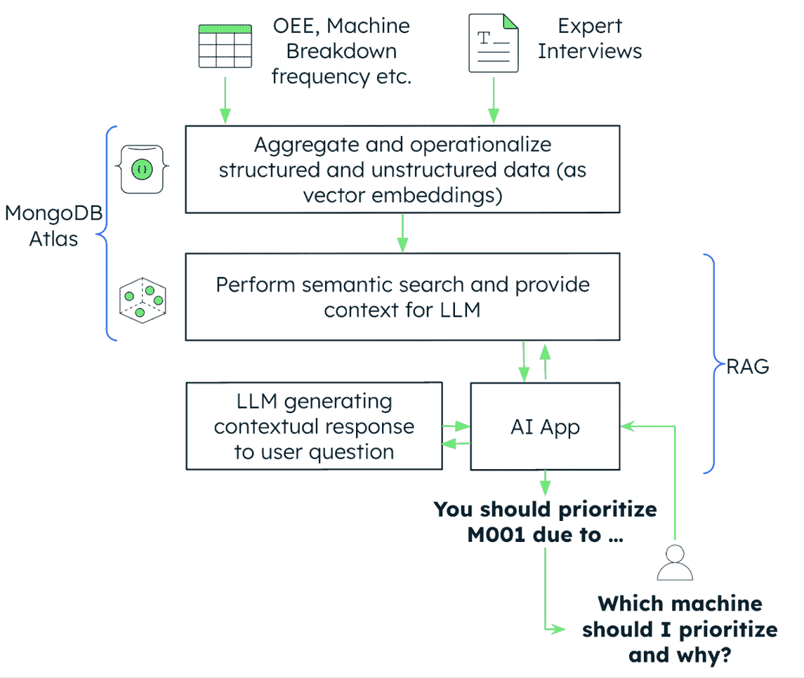

图 7.4：GenAI 驱动的机器优先级

这种 AI 驱动的方案通过向量嵌入将结构化数据（**总体设备效率**（**OEE**）、机器故障频率）与非结构化专家知识（访谈、报告）相结合。该系统使用 MongoDB Atlas Vector Search 查找相关上下文，并通过 **检索增强生成**（**RAG**）方法将此信息传递给 LLM。当维护经理询问“我应该优先考虑哪台机器以及为什么？”时，系统可以根据关键性、维护成本和运营影响的综合分析推荐特定的机器，如 M001 或 M002。AI 应用程序，如 LangChain、LlamaIndex 或定制的维护管理界面，可以触发 Atlas Vector Search 以检索上下文信息并生成这些数据驱动的建议。

### 第二阶段：故障预测

现在我们已经讨论了优先考虑设备，接下来让我们转向故障预测。MongoDB Atlas 提供了实现故障预测所需的所有必要构建块和工具。通过提供操作数据的统一视图、实时处理能力、集成监控和警报，以及与机器学习工具的无缝兼容性，MongoDB Atlas 使组织能够优化机器性能并最小化停机时间。

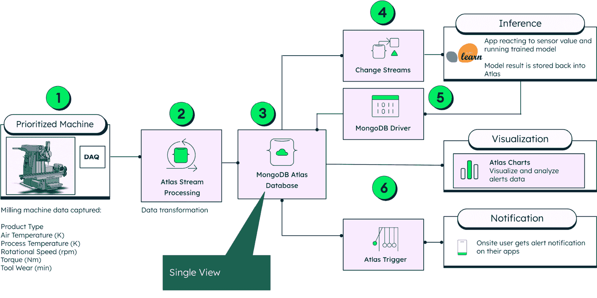

图 7.5：智能铣床使用实时数据预测故障

*图 7.5* 展示了使用 MongoDB Atlas 的六步故障预测工作流程。它从优先级机器数据捕获开始，包括铣削规格和传感器读数，然后通过 Atlas Stream Processing 进行数据转换。转换后的数据以统一视图存储在 MongoDB Atlas 中。随后，变更流触发推理过程，并通过 Atlas Charts 进行可视化分析。最后，Atlas Triggers 使自动通知用户潜在故障成为可能，从而创建了一个全面的实时预测性维护系统。

如前图所示，我们有一个优先级的机器，它是一个带有传感器的外加工机床，这些传感器收集诸如空气温度、转速、扭矩和工具磨损等数据。这些数据通过 Atlas Stream Processing 进行处理，使得可以使用与 Atlas 数据库中相同的模型和查询 API 处理复杂的数据流。Atlas Stream Processing 使开发者能够构建聚合管道，以连续操作流数据，而无需批处理固有的延迟。结果可以持续发布到 MongoDB Atlas 或 Kafka 主题。这允许在数据甚至到达数据库之前进行数据转换和丰富。

一旦数据进入 MongoDB，另一个应用程序就可以对传感器值做出反应，并运行一个旨在预测故障的已训练模型。模型结果可以在推理和可视化阶段之间存储回 Atlas。然后可以使用 Atlas Charts 进行可视化。最后，可以使用 Atlas Triggers 和 Functions 向现场用户推送通知。这建立了一个端到端的故障预测系统。

**实践中的海事船队预测性维护**

Ceto 通过与 MongoDB 合作，将人工智能与来自客户船队的数千个传感器的实时数据集成，从而彻底改变了海上作业。这种实施允许 Ceto 预测和预防潜在的机械故障，简化操作，并主动管理风险。

Ceto 的核心论点是，船舶传感器数据可以揭示船舶距离机械故障有多近，以及由此产生的保险索赔。通过对船舶传感器读数进行高级过滤和实时分析，Ceto 在海上使船员更安全，同时提供更合适的保险政策和定价。

Ceto 现在每年处理超过三十亿个数据点。MongoDB 的架构为 Ceto 提供了几个关键特性，对于他们的运营至关重要，包括管理不断增加的数据量的可扩展性和用于高级数据压缩的时间序列集合。正如 Ceto 的首席技术官 Ben Harrison 所说：“*MongoDB 的时间序列集合彻底改变了我们管理和利用船队数据的方式。实时处理和分析数据的能力显著增强了我们的预测性维护能力*。”

了解更多请访问 [`mdb.link/leading-maritime-technology-company`](https://mdb.link/leading-maritime-technology-company)。


### 第 3 阶段：维修计划生成器

在确定了设备故障的性质后，实施全面的维修策略变得至关重要。首先，我们必须生成一份维护工作订单。这份订单应包括维修说明、所需备件、时间表和资源可用信息。在这种情况下，既涉及结构化数据也涉及非结构化数据。维修说明将来自机器手册。在此过程中，MongoDB Atlas 作为操作数据层，无缝地整合了结构化和非结构化数据。

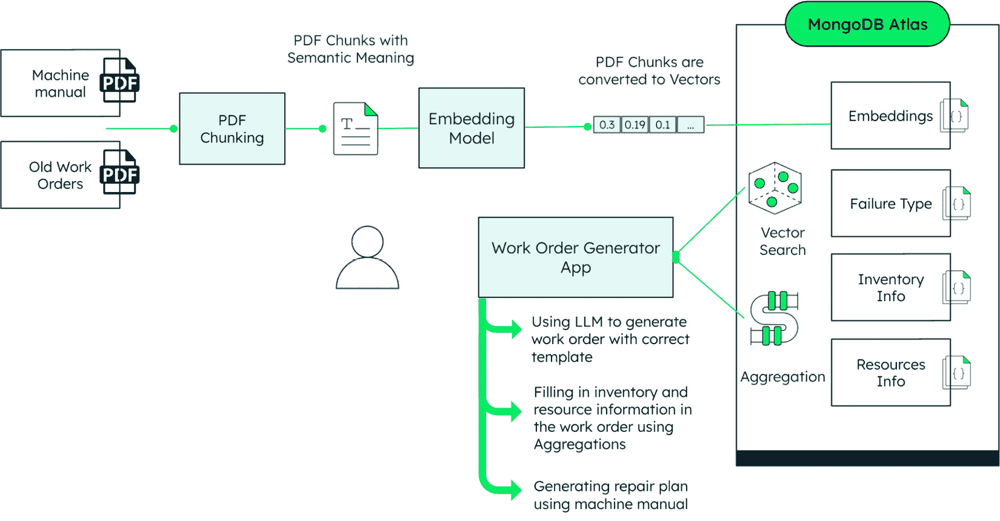

图 7.6：MongoDB Atlas 作为结构化和非结构化数据的操作数据层

MongoDB Atlas 作为维修计划生成的中心操作数据层，将机器手册和旧工作订单（通过 PDF 分块和嵌入处理）与结构化数据相结合，包括故障类型、库存信息和资源信息。一个工作订单生成器应用使用大型语言模型（LLMs）和聚合框架来生成包含正确模板、调度信息和维修计划的综合工作订单，利用向量搜索能力和结构化数据集成。

*图 7.6* 展示了使用生成式 AI 生成工作订单的过程。首先，我们从铣床手册和存储在 PDF 文件中的旧工作订单中提取信息块，并将它们转换为向量。这些嵌入随后存储在 MongoDB Atlas 中。MongoDB 的通用性使得可以在同一数据库中存储结构化和非结构化数据。利用 Atlas 向量搜索和聚合管道，我们可以将此数据集成到为工作订单生成器应用提供动力的 LLM 中。LLM 分析数据以生成适当的工作订单和模板，借鉴以往示例。它使用聚合技术填充库存和资源细节，并使用结构化数据。最后，它生成与旧工作订单相似的维修计划。此方法的特点是能够使用相同的 MongoDB 数据库来存储结构化数据，如故障类型、备件库存和资源信息。通过使用聚合框架从结构化数据中提取相关信息，以及使用向量搜索从向量中获取洞察，工作订单生成器应用中的 LLM 获得了上下文理解。

此应用无缝利用 LLM 生成带有正确模板的工作订单，通过聚合填充库存和资源细节，并最终根据机器手册创建维修计划。此应用可以运行在中央维护管理系统内。

### 第 4 阶段：维护指导生成

因此，我们来到了最后一步：我们如何利用 GenAI 来增强操作员或技术人员对机器的指导以维护机器？这里的挑战在于，维护场景通常涉及多语言文档、不断发展的服务说明，以及需要实时将新见解与现有维修程序整合。

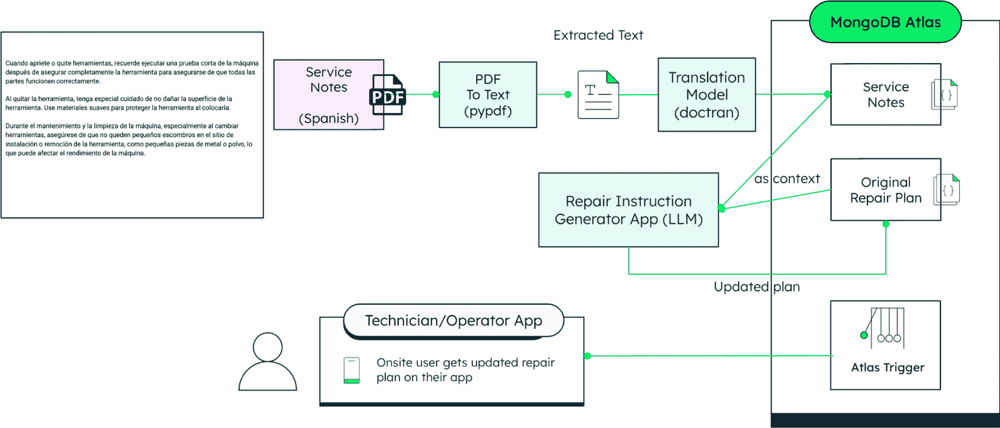

图 7.7：使用 RAG 方法进行操作员工作指导

*图 7.7*展示了 MongoDB Atlas 如何通过 RAG 方法实现维护指导生成。多语言的服务说明通过 PDF-to-text 转换和翻译模型进行处理，然后与原始维修计划一起存储在 MongoDB Atlas 中。一个使用 LLM 的维修指令生成应用程序通过将翻译后的服务说明与现有的维修指令相结合来创建更新的维修计划，然后通过专用应用程序和 Atlas Triggers 触发实时更新，将这些计划发送给技术人员/操作员。

让我们通过一个示例场景来了解一下。在上一个步骤中生成了维修计划。现在，**计算机化维护管理系统**（**CMMS**）发现其他技术人员上传到平台上的某些服务说明，但这些说明是用另一种语言（比如说西班牙语）编写的。我们可以再次使用 RAG 架构，智能地将这些服务说明与之前步骤中生成的维修指令合并。

我们首先需要从 PDF 中提取文本，将其翻译成英语，因为我们的其他数据是英文的，然后提供服务说明以及维修计划作为 LLM 的上下文。因此，我们有之前步骤中的原始计划，并且我们使用 LLM 将这一步骤中获得的服务说明完整地结合起来。

**注意**

我们在这里不执行向量搜索。一旦计划更新，我们可以通过 Atlas Triggers 和 Functions 将通知发布到技术人员的应用程序中。

总结来说，我们实际上是在整合 AI 和 GenAI 应用程序，以实施端到端的预测性维护策略。这种综合方法展示了四个阶段是如何协同工作的（从智能机器优先级到故障预测、维修计划，最后到自适应维护指导），创建了一个统一系统，将传统的反应性维护转变为主动的、数据驱动的操作。

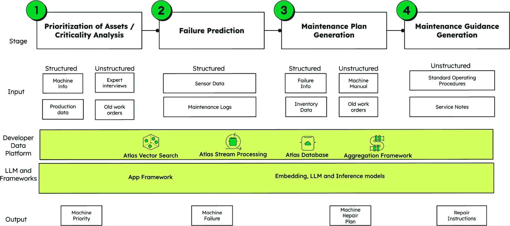

图 7.8：模型链与统一数据存储

*图 7.8*展示了使用 MongoDB Atlas 作为统一数据平台，在四个阶段中实现端到端的预测性维护策略。每个阶段都通过 MongoDB Atlas 开发者平台（具有 Atlas Vector Search、流处理、数据库和聚合框架）处理结构化和非结构化数据输入，并结合 LLM 和基础/AI 框架，在每个阶段产生特定的输出：机器优先级、故障类型、维修计划和维修指令。

我们的输入包括结构化和非结构化数据的组合。我们利用 MongoDB Atlas 开发者数据平台提供的各种服务，包括 Atlas Vector Search、Atlas Stream Processing，当然还有 MongoDB 数据库和聚合框架。这些功能使我们能够为大型语言模型提供适当的环境上下文，并为人工智能模型提供适当的数据。最终，我们在每个阶段都获得了期望的输出，从机器优先级排序、故障类型识别和维修计划制定到指令生成。

您可以通过利用 MongoDB Atlas Vector Search 来驱动实时音频诊断的效率，了解更多关于人工智能在可再生能源中的应用：[`www.mongodb.com/solutions/solutions-library/real-time-audio-based-ai-diagnostics`](https://www.mongodb.com/solutions/solutions-library/real-time-audio-based-ai-diagnostics)

## 多智能体协作系统

除了通过 RAG 架构推进预测性维护策略之外，智能体系统正在成为通用人工智能应用领域的下一个前沿。这些系统由一个或多个智能体组成，它们协作以提供价值，通常在相同或外部系统中相互交互。这些系统设计用于在执行步骤后与人类进行反馈和审查，根据其他智能体输出和人类输入提供的环境上下文调整其行为。

在预测性维护中，多智能体系统可以指派一个智能体分析机器数据以早期检测机械问题，同时另一个优化材料和劳动力的资源分配。更重要的是，不同的智能体可以使用特定任务的专业模型。例如，一个转录视频，而另一个使用自然语言处理来回答问题。

在此设置中，MongoDB 作为智能体系统的内存提供者。对话历史和向量嵌入使用 MongoDB 的灵活文档模型进行存储。Atlas Vector Search 允许对存储的嵌入进行语义搜索，而分片能力提供了水平扩展，同时不牺牲性能。接下来，我们将探讨如何开发一个三智能体协作系统以优化机器性能。

## 优化生产环境

在制造运营中，通过利用多智能体协作进行预测性维护可以显著提高运营效率。例如，考虑一个生产环境，其中三个不同的智能体（预测性维护、流程优化和质量保证）实时协作，以优化机器操作并保持工厂在最佳性能状态。

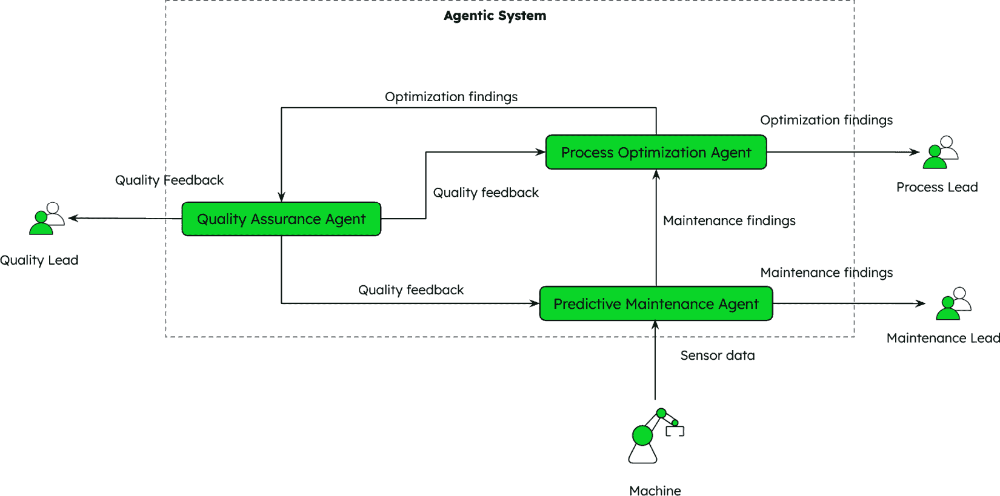

图 7.9：用于生产优化的多智能体系统

*图 7.9* 展示了一个协作代理系统，其中三个专业 AI 代理协同工作以优化制造操作。**质量保证代理**接收质量反馈并与**流程优化代理**分享，该代理处理优化发现和维护发现。**预测性维护代理**监控机器的传感器数据，并与流程优化代理交换维护发现，通过预测性维护、流程优化和质量保证功能之间的实时协作，创建一种协调的方法来维持工厂性能的顶峰。

在这个设置中，预测性维护代理专注于设备维护。其主要任务是通过对机器产生的传感器数据进行分析来监控设备健康。它预测机器故障并建议维护操作，以尽可能延长设备寿命并减少停机时间。

补充这一角色，流程优化代理旨在通过分析和调整生产参数，如速度和振动，来消除瓶颈并保持产品质量，从而提高生产效率。该代理整合来自其他代理的反馈来决定调整哪些参数。例如，如果预测性维护代理检测到铣床温度上升，流程优化代理可以调整切削速度。

最后，质量保证代理通过分析优化后的生产参数并评估其对产品的影响来评估产品质量。它还向其他两个代理提供反馈。这三个代理持续相互分享反馈，将此信息作为短期记忆存储在 MongoDB Atlas 数据库中，而向量嵌入和传感器数据则作为长期记忆保留。

MongoDB 凭借其灵活的文档模型、强大的安全性、全面的数据治理功能和横向可扩展性，成为开发 AI 驱动代理系统的卓越内存提供商。

**AI 工作流程自动化公司利用 MongoDB Atlas 转型业务运营**

一家领先的流程自动化公司面临着构建个性化且动态的 AI 代理来处理战略业务角色中重复性任务的挑战。为了解决这个问题，他们利用了 MongoDB Atlas，该平台统一了他们的运营、分析和 GenAI 数据服务，从而简化了智能应用程序的开发。

通过 MongoDB Atlas，公司的 AI 代理实现了资源更少的新工作模式，使企业能够在保持人工监督和协作的同时自动化复杂的工作流程。他们的平台展示了如何使 AI 代理更加易于访问和具备持续学习能力，从而允许多个利益相关者协作修改和优化 AI 生成的内容，以改善业务成果。

为了编辑清晰，此示例已被匿名化。了解更多信息，请参阅：[`mdb.link/ai-workflow-company-agents`](https://mdb.link/ai-workflow-company-agents)。


# 知识管理和保存

工作流程自动化示例展示了 AI 代理如何改变业务运营，但它也揭示了一个基本依赖性：这些智能系统只有在其可以访问和利用的知识范围内才是有效的。虽然多智能体系统在协调实时决策和优化运营方面表现出色，但它们需要深厚的机构知识基础来做出真正明智的决策。这使我们想到了 AI 在制造中的另一个变革性应用：数十年来积累的专业知识的保存和实施。

传统的知识管理方法通常依赖于文档、培训计划和导师制。然而，这些方法面临着重大的局限性：

+   文档往往不完整、过时或难以在需要时访问

+   培训计划可能无法捕捉到通过多年经验发展而来的细微专业知识

+   导师制依赖于经验丰富的人员的可用性，并且可能不一致

当制造劳动力老龄化，经验丰富的人员退休，带走他们可能增强我们所讨论的 AI 系统决策能力的宝贵知识时，这些局限性变得尤为突出。解决方案在于将这种部落知识转化为 AI 可访问的格式，可以直接输入我们已探讨的预测性维护和多智能体系统。

## 机构知识和 AI 解决方案的挑战

为了理解为什么知识保存如此关键，考虑一下一位与特定机器工作了数十年的资深维护技术人员突然退休会发生什么。制造组织往往严重依赖这种机构知识：经验丰富的工人知道但未正式记录的不成文信息、技能和实践。这种知识通常包括针对特定设备问题的故障排除技术、针对不同材料或条件的最佳机器设置、基于微妙视觉或听觉线索的质量检查见解，以及为了适应环境变量而进行的流程调整。

当经验丰富的工人退休或离开组织时，这些宝贵的知识可能会丢失，导致效率降低、质量问题以及新员工培训成本增加。更重要的是，这种知识差距限制了我们所讨论的 AI 系统的有效性。如果没有理解经验丰富的工人本能知道的微妙操作细节，预测性维护算法的准确性会降低，多智能体系统也无法优化他们不完全理解的过程。

通过捕获和索引宝贵的工人知识，包括文本和非结构化信息，AI 驱动的知识管理系统解决了这一挑战。通过从文档、手册和笔记中创建语义向量，制造商可以消除从数据孤岛中定位和转移知识的传统任务。这种方法使用户能够通过自然语言查询执行跨系统搜索，促进在不同平台之间无缝访问信息。

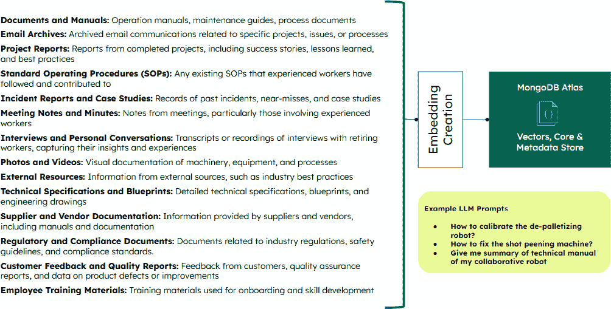

图 7.10：知识来源和存储架构

*图 7.10*展示了这种综合方法在实际中的应用。系统聚合了多样化的组织知识来源，从操作文档和历史记录到专家见解、监管信息和培训材料。该架构不仅简单地编目信息，还在不同类型的知识之间创建智能连接。例如，当维护技术人员遇到不寻常的设备行为时，系统可以立即将该观察结果与相关的故障排除程序、历史事件报告、记录访谈中的专家见解和监管要求相连接，所有这些都可以通过自然语言查询实现。所有内容都以向量、核心数据和元数据的形式流入 MongoDB Atlas，创建了一个统一的知识库，将孤立的信息片段转化为全面的知识网络，从而增强人类决策和 AI 系统性能。

## 实时知识应用

在确定了如何捕获和结构化机构知识之后，下一步关键步骤是使这种知识在需要时立即可用。知识管理架构通过智能管道处理车间请求，如图 7.11 所示。这种实时应用代表了我们的知识保存努力的成果，将静态信息转化为动态、可操作的指导，可以增强我们之前探讨的多代理系统和预测性维护工作流程。

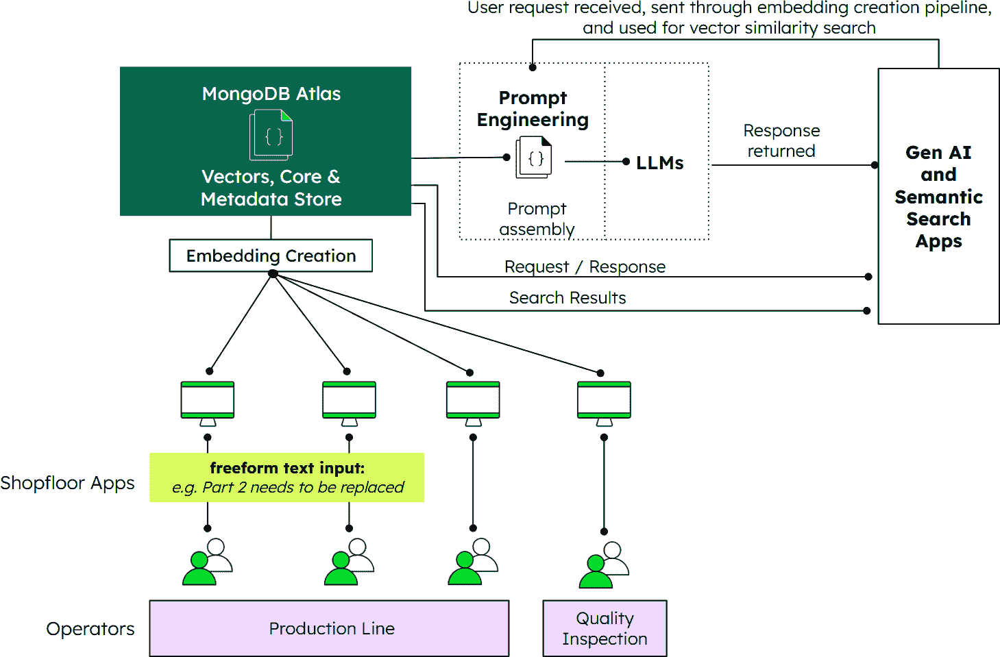

图 7.11：知识管理架构

当操作员通过车间应用输入他们的观察和问题时，系统会执行以下操作：

+   **处理输入**：用户请求通过嵌入创建管道发送

+   **语义搜索**：MongoDB Atlas Vector Search 通过语义相似性识别相关知识

+   **上下文组装**：提示工程系统将搜索结果与当前上下文相结合

+   **智能响应**：基于组织知识，LLMs 生成可操作的指导

+   **持续学习**：新交互增强了未来查询的知识库

这种架构使得无论操作员需要故障排除指导、流程优化建议还是合规性信息，都能即时访问机构知识。更重要的是，它创建了一个反馈循环，其中知识库持续增长和改进，确保今天产生的见解成为明天指导 AI 系统和人类操作员的机构知识。

**主要欧洲能源公司利用 MongoDB Atlas 将数以 TB 计的地下非结构化数据变为可操作**

位于意大利的这家全球能源公司，在 69 个国家拥有超过 30,000 名员工。其业务范围从勘探和钻探天然气和石油，到联合发电、可再生能源、生物精炼和化学生产。

该公司与 MongoDB 咨询合作进行培训，并支持工作负载迁移到 MongoDB Atlas。该组织希望迁移到一个具有无缝用户体验和易于使用的开发人员界面的托管服务。

使用 MongoDB Atlas，公司的用户可以快速找到跨越多年和地理区域的数据，以识别趋势和分析模型。MongoDB Atlas Search 还可以通过过滤掉无关文档来协助。团队还与平台集成了 AI 和机器学习模型，使其更容易识别模式。

为了编辑清晰，此示例已被匿名化。了解更多信息，请参阅：[`mdb.link/european-energy-company-insights`](https://mdb.link/european-energy-company-insights)。


# 超个性化的车内体验

虽然知识管理关注的是制造组织如何保存和利用机构专业知识，但 AI 正在改变用户体验的另一个领域是汽车行业。我们从预测性维护到知识管理所探索的应用，展示了 AI 通过智能数据集成提高运营效率的能力。现在，我们将转向一个面向消费者的应用，展示这些相同的上下文理解和个性化辅助原则如何正在改变驾驶员与车辆互动的方式。

汽车行业正在经历快速转型，电动汽车、自动驾驶和高级安全功能推动了这一转型。这些进步创造了对更复杂和智能的车载系统的需求，这些系统能够为驾驶员和乘客提供个性化的体验。语音助手已成为现代车辆的标准功能，但今天的实现通常仅限于基本功能，如导航、车内控制和电话通话。

根据 SoundHound AI 最近的研究，83%计划在未来 12 个月内购买汽车的驾驶员会选择具有 AI 功能的汽车而不是没有 AI 功能的汽车。此外，79%的欧洲驾驶员表示他们会在他们的车辆中使用语音 GenAI 功能[2]。这些统计数据突显了下一代由先进 AI 技术驱动的车载体验的市场准备程度。

目前在车辆中发现的语音助手面临着几个限制。尽管大多数车辆都配备了这些系统，驾驶员也经常使用它们，但由于它们的功能有限，它们往往令人沮丧。许多这些系统只能以预定的方式响应特定的命令，创造出一个僵化的用户体验，无法适应个人偏好或情境背景。

## 车载语音助手的挑战和 AI 解决方案

车载语音助手的进步面临着来自驾驶员需求和汽车制造商限制的双重挑战。驾驶员对车载语音技术有明确的期望：个性化的体验能够理解他们的偏好并提供定制化的互动，以适应他们的特定需求；直观的使用方式不需要长时间的学习期；先进的功能在保持简洁的同时增强驾驶体验。

同时，汽车制造商和技术提供商也面临着他们自己的挑战。开发成本很高，因为构建智能车载系统需要 AI、自然语言处理和汽车集成方面的专业知识。上市时间压力迫使公司迅速推出可扩展的解决方案，以满足快速变化的客户期望，并保持与竞争对手的步伐。此外，汽车制造商寻求独特、品牌化的体验，以在日益同质化的市场中脱颖而出，同时应对监管限制。

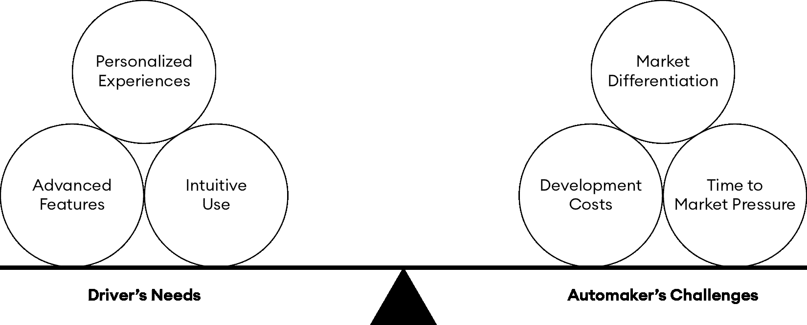

图 7.12：在语音助手开发中平衡驾驶员需求和汽车制造商挑战

此图展示了在开发高级语音助手时驾驶员期望和汽车行业限制之间的紧张关系。解决这种紧张关系的关键在于利用 GenAI 技术，这些技术可以同时满足驾驶员对复杂、个性化体验的需求，同时为汽车制造商提供可扩展、成本效益高的解决方案，以加速上市时间。

## GenAI: 转变车载助手

GenAI 通过从根本上改变语音助手的运作方式，从基本的命令-响应模式转变为动态、互动的体验，满足驾驶员的期望和汽车制造商的要求。这些高级助手可以做到以下几方面：

1.  理解自然语言和对话上下文

1.  根据用户偏好和历史提供个性化响应

1.  访问相关信息源，提供准确和有用的答案

1.  适应不同的驾驶场景和环境条件

与需要特定的命令短语或遵循严格的脚本不同，由 GenAI 驱动的语音助手可以与用户进行更自然的对话。这使交互更加直观，并减轻了驾驶员的认知负担，使他们能够在获取所需信息和功能的同时，更多地专注于道路。

## 解决方案架构：MongoDB Atlas 和 Google Cloud 集成

在确立了 GenAI 在车载助手中的变革潜力之后，下一个关键问题成为：我们实际上如何实施这些功能？为了应对这些挑战和机遇，结合 Google Cloud Platform 和 MongoDB Atlas 的技术架构为下一代车载语音助手提供了基础。

**注意**

虽然此解决方案突出了云组件，但有效的车载助手需要混合架构。关键功能必须在车载上可用以进行离线操作，同时将云功能的轻量级版本嵌入到车辆中。随着汽车处理能力和连接性的提高，车载和云功能之间的这种平衡将越来越关键，对助手性能至关重要。

*图 7.13* 展示了下一代车载语音助手的混合云和车载解决方案。Google Cloud 端处理数据摄取（文档 AI、嵌入生成）、服务（语音到文本、文本到语音、Vertex AI）和 MongoDB Atlas 集成（向量搜索、变更流、用户数据）。车载系统通过 PowerSync SDK 管理前端/仪表板功能、后端助手工作流程、推理请求和车辆信号，从而实现云连接和离线语音助手功能，并实现无缝数据同步。

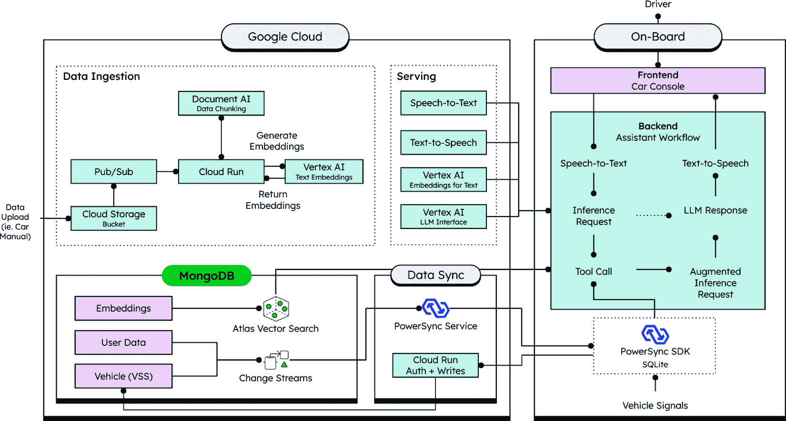

图 7.13：车载语音助手的 Google Cloud 和 MongoDB Atlas 集成

此解决方案集成了几个关键组件：

1.  **语音 API**：Google Cloud 的综合语音技术处理驾驶员命令的语音到文本转录以及自然文本到语音的转换，即使在具有挑战性的声学环境（如移动车辆）中也能可靠地工作。

1.  **上下文检索的向量搜索**：MongoDB Atlas Vector Search 根据语义理解而不是简单的关键词匹配，检索汽车手册和其他相关上下文信息。

1.  **LLM 集成**：检索到的上下文随后通过 Google 的 Vertex AI 输入到 LLM 中，使助手能够生成准确、上下文感知的响应，直接针对用户的查询。

1.  **车载集成**：系统通过一个专门的后端无缝连接到车辆现有的界面系统，该后端管理助手的工作流程。这种集成提供了对实时车辆信号数据的访问，使助手能够理解汽车当前的状态（运行/停止）、速度、诊断信息以及其他遥测数据，从而实现基于车辆状况的更多上下文响应和主动协助。

该架构解决了在实现高级车载语音助手时遇到的几个关键挑战。系统通过多种数据访问方法实现上下文理解：向量搜索检索与车辆型号和查询相关的特定信息，而与车辆系统的直接集成则提供了对操作信号和**诊断故障代码**（**DTCs**）的实时访问，从而使得响应能够基于文档和车辆的实际状态。此外，系统通过学习用户交互来提高相关性，随着时间的推移构建越来越个性化的体验，以适应个别驾驶员的偏好和使用模式。

## 高级代理架构：MongoDB Atlas 和 Google Cloud 集成

虽然初始实现侧重于通过改进上下文和准确性来增强语音交互，但*图 7.14*中展示的架构旨在支持更复杂的代理系统。

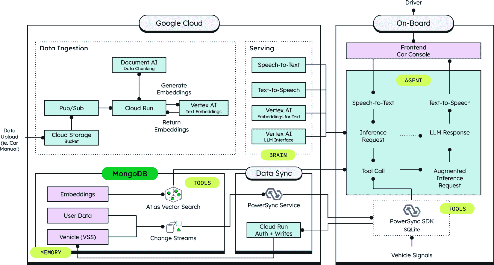

图 7.14：具有 AI 代理集成的 Google Cloud 和 MongoDB Atlas 架构

该架构通过添加 AI 代理能力和工具集成在先前的解决方案之上。代理方法将系统组织成四个核心组件：

+   **代理**：协调整体交互流程并保持多个交流之间连贯性的中央协调器。

+   **大脑**：生成响应和做出决策的语言模型能力和推理功能。

+   **工具**：代理可以使用的各种能力，包括向量搜索、数据库访问和车辆系统控制。

+   **记忆**：短期对话上下文和长期用户偏好，这些偏好保持交互之间的连续性。

该基础可以扩展到未来迭代中纳入额外的功能。对交通、天气和兴趣点信息的实时数据访问将使路线规划和旅行建议更加明智。基于驾驶员偏好和习惯的个性化建议将创造越来越定制化的体验，而针对复杂任务（如行程规划或车辆诊断）的多步骤推理将处理需要跨多个系统协调行动的复杂用户请求。与智能家居系统和其他连接设备的集成将扩展车辆作为更广泛连接生态系统一部分的角色，使家庭、车辆和工作场所环境之间的无缝过渡成为可能。

## 车辆手册的 RAG 实现挑战

尽管我们探索的架构为智能语音助手提供了技术基础，但其中最关键的部分之一涉及访问和处理特定车辆的文档，这带来了独特的实施挑战，这些挑战可能会决定系统的有效性。系统的一个关键方面是有效地管理为准确响应特定车辆所需的复杂技术文档。汽车手册对传统的 RAG（检索、摘要、生成）实现提出了独特的挑战。传统的分块方法通常会将技术文档分解成孤立的部分，在这个过程中丢失了关键上下文。这在汽车手册中尤其成问题，因为它们包含深度互联的信息，包括程序、警告、规格和图表。

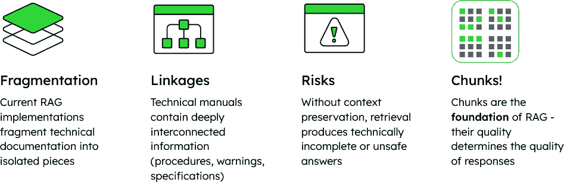

图 7.15：车辆手册的 RAG 实现挑战

此图说明了在汽车技术文档中实施 RAG 系统时的三个关键挑战：

+   **层次结构**：汽车手册具有深层的层次组织，包括标题、标题、副标题和内容部分，这些部分在信息之间建立了自然的关系

+   **专业内容**：这些手册包括安全警告、逐步程序、技术规格、零件编号和诊断代码，必须保持完整无损

+   **关系保持**：许多部分引用了手册的其他部分或包含适用于多个程序的插图，从而形成了一个复杂的相互依赖网络

为了应对这些挑战，需要采用超越简单文本分段的先进分块策略。结构感知分块方法尊重文档结构边界，并保持相关内容在一起，防止关键信息的碎片化。内容识别技术使用模式识别来识别和标记特殊内容，如警告或程序步骤，以确保它们在分块过程中保持完整。最后，关系管理系统维护下一/前一分块引用，以实现顺序导航，同时相关分块识别保持具有相似上下文的内容的交叉引用，确保即使信息分布在多个分块中，互联信息仍然可访问。

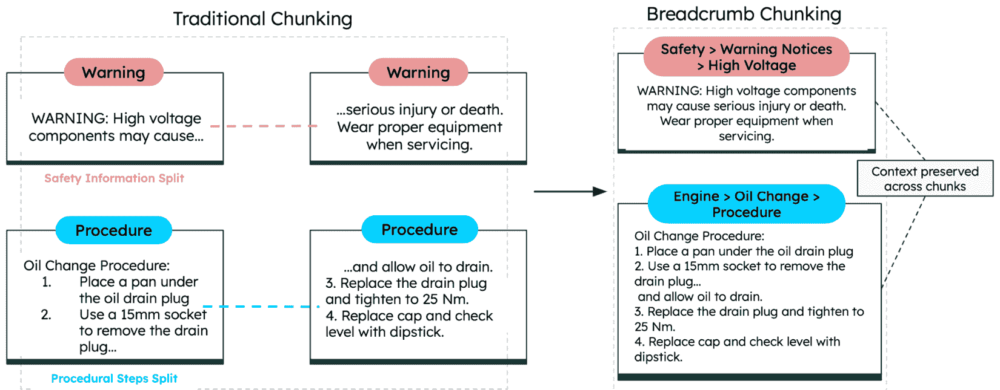

图 7.16：分块策略：传统分块与面包屑分块

此图比较了传统的块状方法（左侧），该方法将警告和程序分解成孤立的部分，丢失了关键的安全信息，与面包屑块状方法（右侧）相比，面包屑块状方法保持了文档结构和上下文。块状方法的*面包屑*通过维护层次路径（例如，**引擎 > 换油 > 程序**）并保持语义相关内容在一起来保留上下文。这确保了当驾驶员询问维护程序时，助手不仅可以访问具体步骤，还可以访问相关的警告、规范和相关信息。

## Google Cloud 和 MongoDB：更佳的合作伙伴

该解决方案利用 Google Cloud 和 MongoDB Atlas 的互补优势，为车内语音助手提供强大、可扩展的平台。

Google Cloud 贡献以下内容：

+   **AI 领导力**：针对语音应用优化的 GenAI 和机器学习的尖端工具

+   **集成 AI 和云平台**：语音识别、实时处理和云可扩展性的端到端集成

+   **可扩展的基础设施**：可靠的云服务确保即使在数据量大的情况下也能保持平稳的性能

+   **开发者工具**：用于 AI 功能集成和扩展的强大工具，加速开发进程

MongoDB 通过以下方式补充这些功能：

+   **面向文档的数据模型**：灵活的架构设计，可以处理任何规模下的复杂需求

+   **大规模向量存储**：高效存储操作数据、元数据和向量数据的能力

+   **汽车行业影响力**：获得顶级汽车制造商的信任，拥有在扩展和优化数据解决方案方面的经验

+   **加速开发**：完全管理的 MongoDB Atlas 平台简化了开发并减少了运营复杂性

此合作使汽车制造商能够快速部署复杂的车内体验，这些体验可以区分他们的车辆，同时保持汽车应用中预期的可靠性和性能。

## AI 集成车内系统的战略优势

超个性化的车内体验不仅仅是一个技术升级；它们为汽车制造商在日益竞争的市场中提供了战略优势。通过利用先进的 AI 能力，特别是用于对话交互的 GenAI 和用于主动辅助的代理 AI，制造商可以创建独特的用户体验，从而建立品牌忠诚度和差异化。

这些技术与灵活、可扩展的数据平台的集成，使汽车公司能够开发出更直观、响应更快的界面，在驾驶时减少认知负荷，创建适应个别驾驶员偏好和习惯的个性化体验，在需要时提供上下文相关的信息以增强安全性，并通过在竞争市场中提供独特的 AI 驱动功能来区分车辆。

随着汽车行业继续向软件定义车辆的方向发展，这些 AI 驱动的车载体验平台将变得越来越成为重要的竞争优势，改变驾驶员和乘客与车辆互动的方式，并重新定义对驾驶体验的期望。

在以下链接中了解更多关于此用例的信息：

+   GitHub 代码示例和实现细节的存储库：[`github.com/mongodb-industry-solutions/genai-in-car-voice-assistant`](https://github.com/mongodb-industry-solutions/genai-in-car-voice-assistant)

+   深入的技术博客文章：[`www.mongodb.com/company/blog/innovation/how-mongodb-google-cloud-power-future-of-in-car-assistants`](https://www.mongodb.com/company/blog/innovation/how-mongodb-google-cloud-power-future-of-in-car-assistants)

# 车队管理和优化

车队运营代表制造和物流企业的关键组成部分，直接影响运营效率、客户满意度和盈利能力。随着组织在全球供应链的复杂性中导航，以及客户对速度和可靠性的需求不断增加，传统的车队管理方法正在让位于能够实时动态优化路线、维护日程和资源分配的 AI 驱动系统。通过 AI 优化车队运营可以实现显著的效率提升和成本降低。通过利用先进技术，特别是用于自主决策的代理 AI，组织可以实现前所未有的车队性能水平，同时降低运营成本、提高驾驶员安全性和提升客户服务水平。

## 车队运营的调度代理

将代理 AI 集成到车队管理中代表了物流操作编排方式的范式转变。与依赖于静态规则和人工干预的传统系统不同，代理 AI 系统可以自主处理复杂输入，通过多个约束进行推理，并做出平衡竞争优先级的最佳决策。

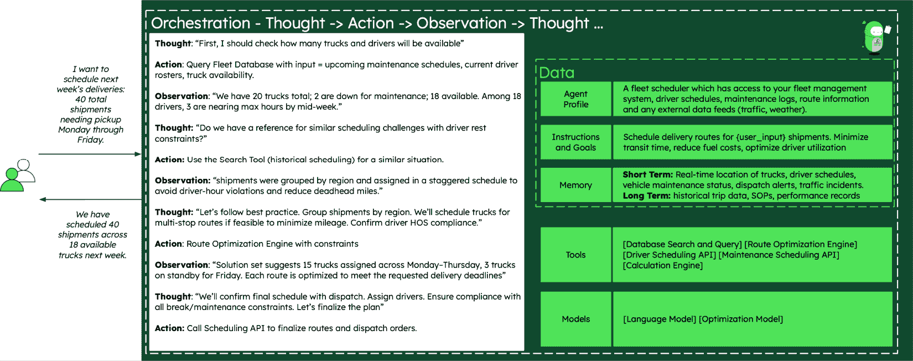

图 7.17：AI 车队调度代理：编排和决策过程

此图展示了用于车队运营的 AI 调度代理如何遵循思维→行动→观察→思维编排模式来管理复杂的物流决策。调度代理由用户请求驱动，并由短期上下文和存储在 MongoDB Atlas 中的长期数据指导。它编排与各种服务（如路线规划、维护调度和司机调度）的交互，以生成可行的配送任务时间表。

当一位车队经理输入一个请求，例如“我想安排下周的配送：周一至周五共 40 个需要取货的运输”时，代理会激活一个复杂的编排过程。系统首先检查可用资源（卡车和司机），识别约束（维护计划、司机工作时间），搜索历史数据以寻找类似的调度挑战，并应用最佳实践，如区域分组和错峰调度，以避免违规。然后，代理使用具有约束的路线优化引擎，生成优化的配送时间表，并通过调度 API 最终确定路线。整个过程展示了代理解决复杂物流问题的能力，基于多个数据源采取明智的行动，观察结果，并迭代优化其方法，直到达到最佳解决方案。这种代理方法将多个工具、数据源和目标整合到一个单一的协调决策框架中，使得调度比传统方法更加复杂。

## 逻辑和物理架构

在展示了代理 AI 系统如何做出智能调度决策之后，我们现在将检查使这种复杂编排成为可能的架构。车队调度代理的实施遵循模块化架构，该架构在分离关注点的同时，使组件之间的无缝集成成为可能。

*图 7.18*展示了车队调度系统的逻辑流程，显示了用户请求“下周安排 40 个运输”如何通过编排和推理逻辑流过，该逻辑使用 ReaAct 框架和 LLM 交互来解释请求。系统通过 API 调用执行任务，包括路线优化、司机调度和维护 API，同时通过 MongoDB 驱动连接到 MongoDB Atlas 进行数据库查询和向量搜索功能，最终将结果如“我们已安排下周在 18 辆可用卡车上的 40 个运输”返回到用户界面。

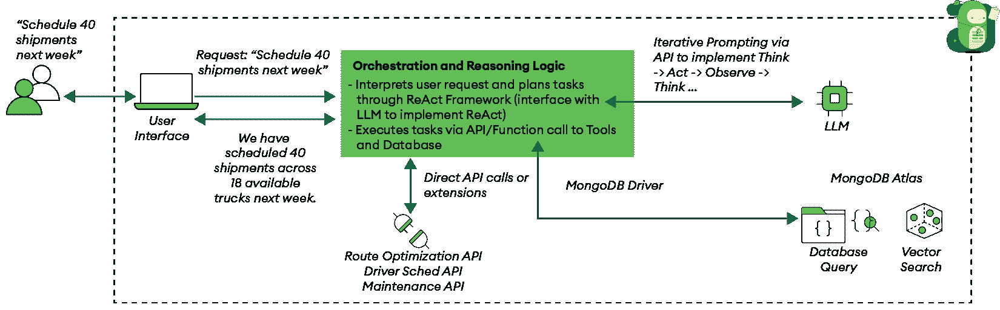

图 7.18：逻辑架构

在逻辑层面，架构包括以下内容：

1.  **用户界面**：为车队经理提供一个直观的界面，用于输入调度请求和查看结果。

1.  **编排和推理逻辑**：解释用户请求并使用 ReAct 框架规划任务，然后通过 API 或函数调用到工具和数据库执行这些任务。ReAct 使 AI 能够循环思考、行动和观察结果。

1.  **LLM**：通过 API 提供迭代提示，以实现“思考→行动→观察→思考”模式。

1.  **MongoDB 驱动程序**：将编排服务连接到 MongoDB Atlas。

1.  **工具**：包括数据库查询、向量搜索以及路线优化、司机调度和维护调度等专用 API。

1.  **MongoDB Atlas**：提供数据库查询和向量搜索功能。

物理实现建立在逻辑架构之上。*图 7.19*展示了在企业云网络内对车队调度系统的物理实现。用户通过连接到容器化微服务的 API 网关进行交互，包括车队调度代理（带有编排和推理逻辑）、路线优化微服务、司机调度微服务以及维护调度微服务。系统通过私有链接连接到一个 LLM 企业服务器和托管在公有云上的 MongoDB Atlas，这提供了数据库查询和向量搜索功能，确保了安全且可扩展的车队管理操作。

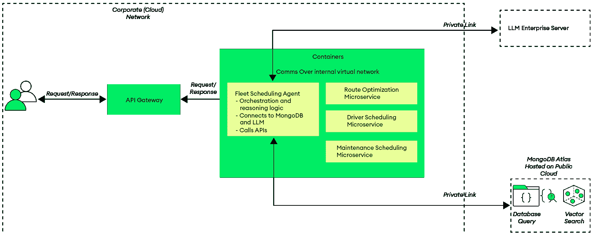

图 7.19：物理架构

此架构为实施高级车队管理功能提供了一个可扩展、可维护的基础，同时确保我们探索的复杂决策过程可以在企业环境中可靠部署。

## 车队调度器用 MongoDB

在为我们的代理车队管理系统建立技术架构之后，我们现在将转向一个关键的基础元素：系统如何存储和管理复杂的数据结构，这些数据结构使得智能决策成为可能。车队管理系统的一个关键方面是其数据模型，它必须适应有效决策所需的多种信息类型。MongoDB 的文档模型为表示车队运营中涉及的复杂、分层数据结构提供了一个理想的基础。

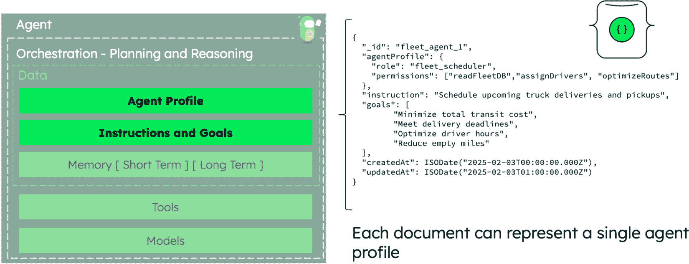

图 7.20：MongoDB 车队调度器

基于代理的舰队调度系统通过模块化架构运行，其中每个组件在决策过程中都服务于特定的目的。*图 7.20*展示了 MongoDB 的文档模型如何通过将代理数据组织成独立但相互连接的组件来支持这种架构。代理配置文件建立了核心身份和操作参数，而指令和目标提供了决策框架。记忆系统区分短期操作环境和长期历史知识，使代理能够在保持对当前条件的意识的同时，从过去的经验中学习。工具组件提供访问专用功能，如数据库查询和向量搜索，而模型组件管理驱动代理推理过程的 AI 能力。这种模块化方法允许独立管理每个组件，同时在整个系统中保持无缝集成。

### 代理配置文件和指令

代理配置文件定义了舰队调度器的核心身份和操作参数：

```py
{
 "_id": "fleet_agent_1",
 "agentProfile": {
 "role": "fleet_scheduler",
 "permissions": ["readFleetDB","assignDrivers", "optimizeRoutes"]
 },
 "instruction": "Schedule upcoming truck deliveries and pickups",
 "goals": [
   "Minimize total transit cost", 
   "Meet delivery deadlines",
   "Optimize driver hours", 
   "Reduce empty miles"
 ],
 "createdAt": ISODate("2025-02-03T00:00:00.000Z"),
 "updatedAt": ISODate("2025-02-03T01:00:00.000Z")
} 
```

本文件封装了代理的操作指令，为其决策过程确立了明确的参数。

### 短期和长期记忆

代理的记忆架构区分了短暂的操作数据和持久的知识。*图 7.21*展示了 AI 代理如何通过在 MongoDB 文档中存储离散交互或短暂状态数据来管理短期记忆。代理架构将记忆作为一个独立的组件，与代理配置文件、指令和目标、工具和模型并列。每个短期记忆文档捕捉特定的操作数据，如行程 ID、驾驶员分配、路线状态和预计到达时间，使代理能够保持对当前车队运营的上下文，并区分临时操作数据和持久知识。

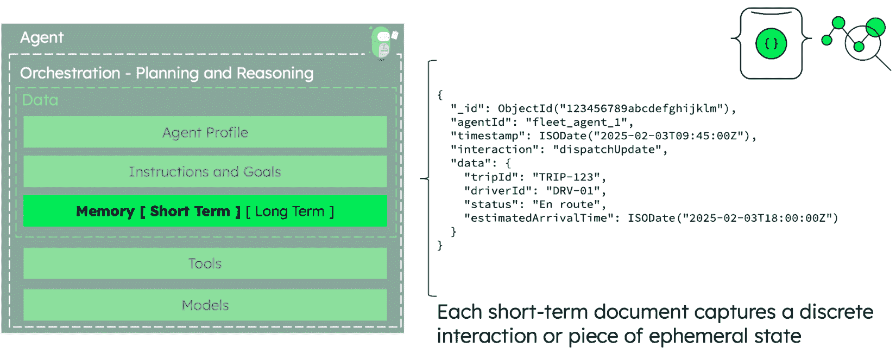

图 7.21：代理的短期记忆

短期记忆捕捉离散交互或短暂状态：

```py
{
 "_id": ObjectId("123456789abcdefghijklm"),
 "agentId": "fleet_agent_1",
 "timestamp": ISODate("2025-02-03T09:45:00Z"),
 "interaction": "dispatchUpdate",
 "data": {
   "tripId": "TRIP-123",
   "driverId": "DRV-01",
   "status": "En route",
   "estimatedArrivalTime": ISODate("2025-02-03T18:00:00Z")
 }
} 
```

长期记忆存储可以按日期范围等参数查询的路线规划信息。此图显示了 AI 代理如何将持久化的路线规划信息存储在长期记忆中，这些信息可以通过日期范围或路线计划 ID 等参数进行查询。长期记忆文档包含全面的舰队运营数据，包括路线计划标识符、日期范围、总运输量和遇到的历史问题（如天气延误和驾驶员小时要求），使代理能够从过去的经验中学习，并根据历史车队管理模式和结果做出明智的决策。

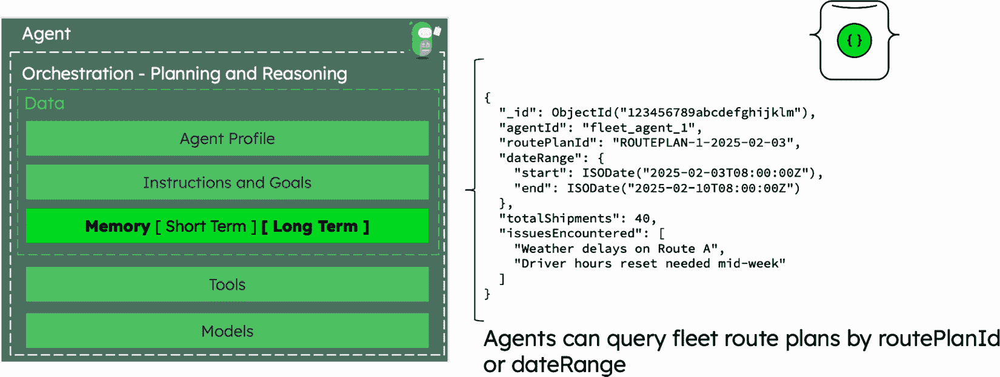

图 7.22：代理的长期记忆

```py
{
 "_id": ObjectId("123456789abcdefghijklm"),
 "agentId": "fleet_agent_1",
 "routePlanId": "ROUTEPLAN-1-2025-02-03",
 "dateRange": {
   "start": ISODate("2025-02-03T08:00:00Z"),
   "end": ISODate("2025-02-10T08:00:00Z")
 },
 "totalShipments": 40,
 "issuesEncountered": [
   "Weather delays on Route A",
   "Driver hours reset needed mid-week"
 ]
} 
```

代理利用 MongoDB 的工具，包括数据库查询 API、向量搜索和全文搜索，以高效地访问这些信息。*图 7.23*展示了这些代理如何利用 MongoDB 的综合工具包进行数据访问和推理。代理架构显示了**工具**组件作为**代理配置文件**、**指令和目标**、**记忆**和**模型**的关键元素。代理可用的三个主要 MongoDB 工具是数据库查询 API 用于结构化数据检索、向量搜索用于语义相似度匹配和全文搜索用于基于文档的查询，为代理提供多种强大的方法，在决策过程中高效地访问和分析信息。

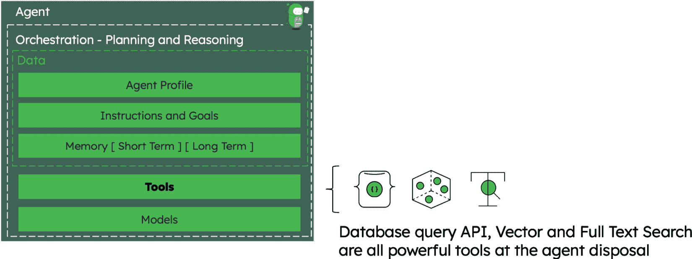

图 7.23：强大的代理推理工具

### 连接的车队事件顾问

在我们探索的基础代理架构之上，我们可以扩展这些概念以创建专门针对特定车队管理挑战的系统。连接的车队事件顾问代表了我们所讨论的代理原则的实际应用，展示了 AI 驱动的系统如何提供实时诊断支持和随着时间的推移构建组织知识。

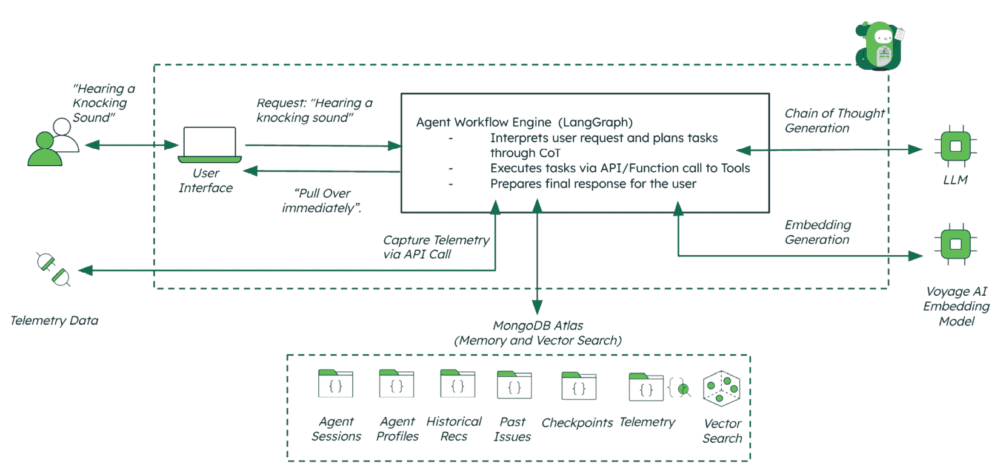

图 7.24：连接的车队事件顾问

此图展示了使用 MongoDB Atlas、Voyage AI、OpenAI 和 LangGraph 构建的全面 AI 驱动的连接车队顾问系统。该系统处理驾驶员投诉或车队经理查询，通过 API 调用捕获遥测数据，并使用代理工作流引擎（LangGraph）来解释请求、规划任务、执行功能和准备响应。该架构与 MongoDB Atlas 集成，以实现记忆和向量搜索功能，存储代理会话、配置文件、警报、问题、检查点和遥测数据，同时利用 LLMs 和嵌入生成提供智能车队事件管理和诊断建议。

### 事件顾问架构

该系统使用 MongoDB Atlas、Voyage AI、OpenAI 和 LangGraph 构建，创建了一个集成的流程，处理驾驶员投诉或车队经理查询，分析车辆遥测数据，生成思维链推理过程，并交付诊断建议。

当驾驶员报告诸如“听到敲击声”等问题时，系统会执行以下操作：

1.  通过用户界面接收投诉。

1.  通过代理工作流引擎（LangGraph）处理请求。

1.  生成思维链推理过程。

1.  通过 API 调用捕获遥测数据。

1.  在 MongoDB Atlas 中执行向量搜索以识别类似的历史事件。

1.  根据分析结果制定建议。

物理架构按以下方式实现此工作流程：

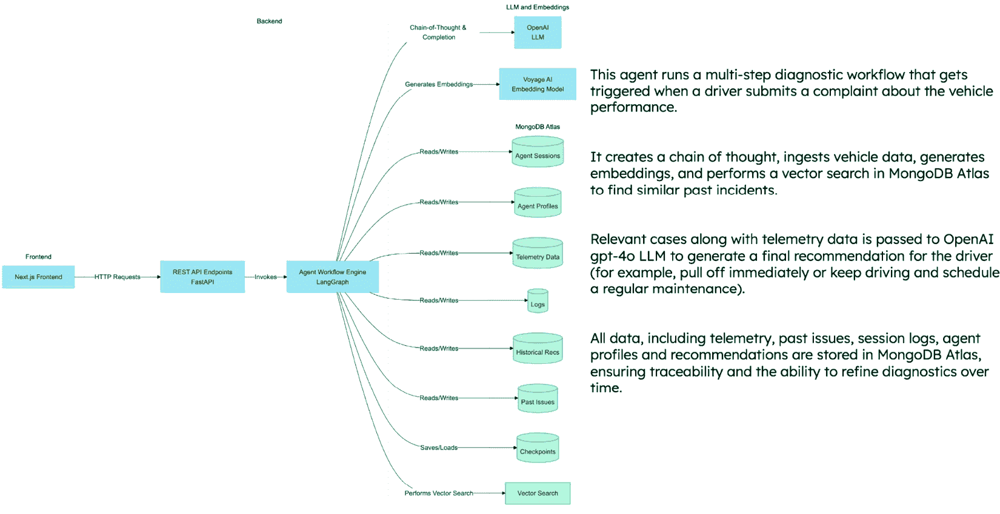

图 7.25：车队顾问物理架构

此图显示了连接车队事件顾问工作流程的物理实现，说明了驾驶员投诉如何触发多步骤的诊断过程。

系统的组件组织如下：

1.  **前端**: 驾驶员和车队经理的基于 Next.js 的界面

1.  **后端**: 由 FastAPI 和 LangGraph 驱动的代理工作流程引擎提供的 REST API 端点

1.  **AI 服务**: OpenAI LLM 用于思维链推理和推荐，以及 Voyage AI 嵌入模型用于生成向量表示

1.  **数据存储**: MongoDB Atlas 用于存储代理会话、配置文件、遥测数据、历史推荐、问题日志以及向量搜索功能

此架构使一系列操作详细化：

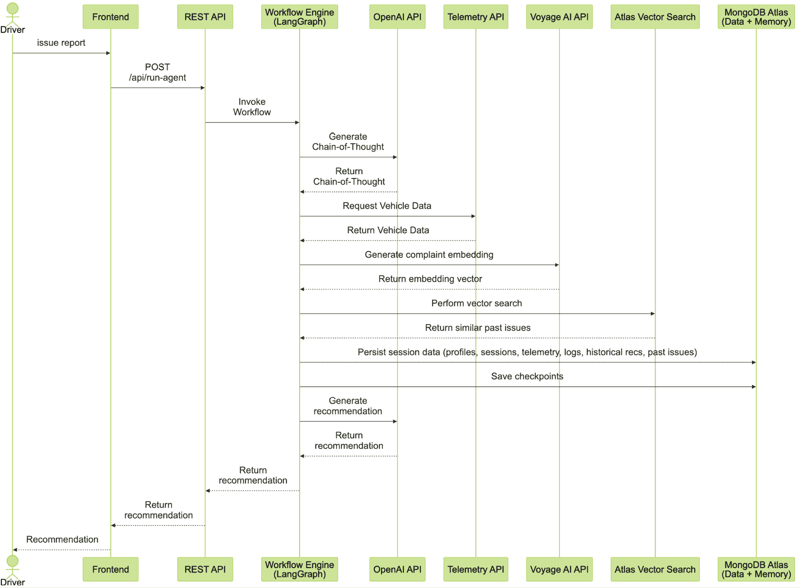

图 7.26：车队顾问序列图

此序列图显示了连接车队事件顾问系统详细的操作流程。

操作序列从驾驶员报告问题开始，经过多个处理阶段：

1.  通过前端提交问题报告。

1.  API 处理和流程调用。

1.  用于诊断推理的思维链生成。

1.  车辆数据检索和分析。

1.  为类似过去事件生成嵌入和向量搜索。

1.  会话信息的数据持久化。

1.  向驾驶员生成和交付推荐。

这种方法不仅为驾驶员提供即时帮助，而且随着时间的推移，还建立了一个问题和解决方案的知识库。

### 数据类型和存储

事件顾问系统管理多种数据类型，每种数据类型在诊断工作流程中都有特定的用途：

| **数据类型** | **描述** | **MongoDB 中的示例** |
| --- | --- | --- |
| **代理配置文件** | 这包含代理的身份信息。它包括指令、目标和约束。 |

```py
{
  "_id": "67c20cf886f35bcb8c71e53c",
  "agent_id": "default_agent",
  "profile": "Default Agent Profile",
  "instructions": "Follow diagnostic procedures meticulously.",
  "rules": "Ensure safety; validate sensor data; document all steps.",
  "goals": "Provide accurate diagnostics and actionable recommendations."
} 
```

|

| **短期记忆** | 这包含代理在实时使用中的临时、上下文信息，例如最近的数据输入或正在进行的交互。例如，短期记忆可以存储过去几小时车辆活动的传感器数据。在 LangGraph 等某些代理 AI 框架中，短期记忆通过检查点实现。检查点存储代理动作和/或推理的中间状态。这种记忆允许代理无缝暂停和恢复操作。 | **存储在时间序列集合中的遥测数据** |

```py
{
  "_id": "67cb23ee370eb8f40c9bf677",
  "timestamp": "2025-02-19T13:00:00",
  "vin":"5TFUW5F13CX228552",
  "engine_temperature": "90",
  "oil_pressure": "35",
  "avg_fuel_consumption": "8.5",
  "thread_id": "thread_20250307_125027"
} 
```

|

| **长期记忆** | 这是代理存储随时间积累的知识的地方。这可能包括模式、趋势、日志和历史推荐以及决策。 | **与连接车辆相关的问题向量化和存储在 MongoDB 中**

```py
{
  "_id": "67ca173679c7c286f44f4a24",
  "issue": "Engine knocking when turning",
  "recommendation": "Inspect spark plugs and engine oil.",
  "embedding": [
    -0.021414414048194885,
    -0.0031116530299186707,
    0.014275052584707737,
    -0.030444633215665817,
    0.018614845350384712,
    0.06425976008176804,
    0.0060801152139902115,
    -0.012883528135716915,
    -0.007000760640949011,
    -0.04991862177848816,
...
  ]
} 
```

|

表 7.1：车队事件顾问的数据类型和存储结构

此表说明了事件顾问系统如何在 MongoDB 中管理不同类型的数据，展示了三个关键类别：**代理配置文件**（包含代理身份、指令、诊断程序的目标和约束）、**短期记忆**（存储临时上下文信息，如时间序列集合中的最近遥测数据，包括车辆指标，如发动机温度和燃油消耗）和**长期记忆**（积累历史知识，包括模式、趋势和带有嵌入向量表示的矢量化历史问题，如发动机敲击问题，用于相似性匹配的建议）。

**代理配置文件**包含代理的身份信息，包括指令、目标和约束：

```py
{
 "_id": "67c20cf886f35bcb8c71e53c",
 "agent_id": "default_agent",
 "profile": "Default Agent Profile",
 "instructions": "Follow diagnostic procedures meticulously.",
 "rules": "Ensure safety; validate sensor data; document all steps.",
 "goals": "Provide accurate diagnostics and actionable recommendations."
} 
```

**短期记忆**存储临时、上下文信息，如遥测数据：

```py
{
 "_id": "67cb23ee370eb8f40c9bf677",
 "timestamp": "2025-02-19T13:00:00",
 "vin":"5TFUW5F13CX228552", 
 "engine_temperature": "90",
 "oil_pressure": "35",
 "avg_fuel_consumption": "8.5",
 "thread_id": "thread_20250307_125027"
} 
```

**长期记忆**存储历史问题和建议的积累知识：

```py
json
{
 "_id": "67ca173679c7c286f44f4a24",
 "issue": "Engine knocking when turning",
 "recommendation": "Inspect spark plugs and engine oil.",
 "embedding": [
   -0.021414414048194885,
   -0.0031116530299186707,
   0.014275052584707737,
   // Additional vector dimensions...
 ]
} 
```

这种统一的数据方法允许所有车队管理信息在单个数据库中建模，提供了智能、自适应车队运营所需的灵活基础。

## MongoDB 在车队管理中的优势

在探讨了代理车队管理系统的技术架构和实现细节之后，了解为什么 MongoDB Atlas 是这些复杂应用的理想基础至关重要。该平台提供了一些关键优势，这些优势直接使我们能够在车队管理示例中展示高级功能。

MongoDB 的文档数据模型提供了处理复杂、分层数据结构（如车辆遥测、路线计划和驾驶员日程）所需的灵活性，同时其向量搜索功能实现了我们在事件诊断和路线优化中看到的语义搜索功能。时间序列集合有效地存储和处理支持预测分析的时间数据，细粒度的安全控制确保了车队生态系统中不同利益相关者的适当数据访问。对于事件顾问等专用应用，Voyage AI 提供的最佳嵌入模型为语义匹配和分析提供了高质量的向量表示。

这些技术能力直接转化为实施 AI 集成车队系统的组织的战略优势。通过利用先进的 AI 能力，特别是用于自主决策的智能体 AI 和用于诊断分析的生成式 AI，组织可以实现新的运营卓越水平，同时平衡成本、服务水平和社会可持续性目标。这种集成使得组织能够优化路线规划车辆利用率，减少燃料消耗和排放，提高驾驶员安全性和对法规的遵守，改善维护调度和车辆可用性，通过可靠的交付性能提供卓越的客户服务，并建立关于运营模式和事件解决的机构知识。

随着制造业和物流继续向第五代工业发展，这些 AI 驱动的车队管理方法将变得越来越重要，以保持在全球市场上的竞争优势，展示了如何复杂的数据平台能够实现从传统车队管理到智能、自适应系统的转型。

在以下链接中了解更多关于此用例的信息：

+   构建智能体 AI 车队管理系统完整的实施指南：[`www.mongodb.com/solutions/solutions-library/fleet-agents`](https://www.mongodb.com/solutions/solutions-library/fleet-agents)

+   深入探讨下一代移动解决方案的技术博客文章：[`www.mongodb.com/blog/post/next-generation-mobility-solutions-agentic-ai-mongodb-atlas`](https://www.mongodb.com/blog/post/next-generation-mobility-solutions-agentic-ai-mongodb-atlas)

# 人工智能在制造业中的扩展作用

本章中我们探讨的应用仅仅代表了人工智能对制造业运营变革性影响的开始。人工智能通过创建智能、自适应的系统，优化整个生产生态系统的运营，正在改变制造业。从利用生成式 AI 改造供应链到通过多智能体协作实现预测性维护，这些技术正在带来效率、质量和成本降低的可衡量改进。一些例子展示了现代智能数据库如 MongoDB Atlas 如何提供灵活的数据平台，以大规模实施这些 AI 解决方案，连接生产设备、库存系统甚至联网车辆，以创建一个全面的数字制造环境。

制造业正在见证 AI 智能体部署的激增，这些智能体利用深度推理、上下文管理和类似人类的决策能力来解决复杂的运营挑战：

+   **供应链编排**：AI 智能体能够实现多步骤的供应商协调，从下订单到跟踪运输和更新交货时间表，从而减少延迟并提高日常运营的效率。

+   **质量检查报告**：人工智能代理编译、格式化和归档重复检查数据，标记异常，甚至建议纠正措施，从而解放人类操作员，同时确保通过计算机视觉技术精确满足产品标准。通过历史数据跟踪，他们还有助于识别重复出现的问题，并指导持续改进计划。

+   **生产再优化**：当出现中断（机器故障、劳动力短缺或零部件供应延迟）时，人工智能代理通过分析安装在生产线上的传感器的时间序列数据和来自 ERP 和 MES 的上下文信息，动态地重新规划时间表。他们可以模拟多个重新路由场景，选择最有效的一个，并自主实施更改。这导致资产利用率提高，闲置时间减少，废品率降低，即使在波动条件下也能实现即时制造。

+   **连接车队事件经理**：在产品或材料使用自主或半自主车队运输的环境中，人工智能代理管理整个事件响应的生命周期。他们从车辆收集遥测和诊断数据，交叉引用历史维护记录，并触发自动化的维修调度和零部件订购工作流程。此外，他们实时通知人类操作员和客户，提供透明度并最小化服务中断。

+   **维护优化**：制造商可以利用人工智能驱动的预测分析来提供主动维护支持和个性化的人力资源协助，从而在生产环境中提高设备运行时间和运营效率。

如需更多信息及资源，请访问[`www.mongodb.com/solutions/industries/manufacturing`](https://www.mongodb.com/solutions/industries/manufacturing)上的“制造与移动性 MongoDB”页面。

# 摘要

正如我们在上一章和本章所看到的，人工智能正在通过创建智能、自适应的系统来革命化制造业，这些系统能够在整个生产生态系统中优化运营。从利用通用人工智能（GenAI）改造供应链到通过多智能体协作实现预测性维护，这些技术正在带来效率、质量和成本降低的可衡量改进。我们探讨的例子展示了现代智能数据平台如何提供灵活的基础设施，以大规模实施这些人工智能解决方案，将生产设备、库存系统甚至连接车辆的数据连接起来，创建一个全面的数字制造环境。

制造业正在见证人工智能代理部署的激增，这些代理利用深度推理、上下文管理和类似人类的决策能力来解决复杂的运营挑战。通过人工智能代理进行供应链编排可以实现多步骤的供应商协调，而质量检查系统会自动编译和格式化检查数据，标记异常并建议纠正措施。生产再优化代理在发生中断时动态重新规划日程，而连接的机队事件经理处理自主机队的整个事件响应生命周期。此外，我们还探讨了知识管理系统如何通过人工智能辅助来保存机构专业知识，以及如何通过复杂的语音助手和车辆手册的 RAG 实现来改变车内超个性化体验。

这些应用展示了制造商如何利用人工智能驱动的预测分析来提供主动维护支持和个性化辅助，从而提高生产环境中的设备运行时间和运营效率。将代理人工智能与灵活的数据平台集成，使组织能够实现前所未有的运营卓越水平，同时降低成本并提高安全性。在下一章中，我们将继续探讨人工智能如何改变电信和媒体行业。 

# 参考文献

1.  *预测性维护；德勤的方法*：[`www.deloitte.com/content/dam/assets-zone3/us/en/docs/services/consulting/2024/us-predictive-maintenance.pdf`](https://www.deloitte.com/content/dam/assets-zone3/us/en/docs/services/consulting/2024/us-predictive-maintenance.pdf)

1.  *研究发现，79%的欧洲司机愿意在他们的车辆中使用语音生成人工智能功能*：[`www.soundhound.com/newsroom/press-releases/research-finds-79-of-drivers-across-europe-would-use-voice-generative-ai-capabilities-in-their-vehicles/`](https://www.soundhound.com/newsroom/press-releases/research-finds-79-of-drivers-across-europe-would-use-voice-generative-ai-capabilities-in-their-vehicles/)
